                 


## 文章标题
跨模态AI的统一提示词设计方法

## 关键词
跨模态AI，统一提示词设计，数据处理，算法模型，数学模型，项目实战

## 摘要
本文深入探讨了跨模态AI的统一提示词设计方法，从基础理论到核心算法，再到实际项目，系统地阐述了跨模态AI的发展现状、核心概念、统一提示词设计原则和方法，以及数据处理、模型训练与优化等方面的技术细节。通过本文的阅读，读者可以全面了解跨模态AI统一提示词设计的全貌，掌握关键技术和应用场景。

# 跨模态AI的基础理论

## 1. 跨模态AI的概念与背景

跨模态AI（Multimodal AI）是指能够处理多种不同类型输入数据的智能系统。这些输入数据可以是图像、文本、音频、视频等多种模态。跨模态AI的核心目标是通过融合不同模态的信息，提升系统的感知能力、理解能力和决策能力。

跨模态AI的概念起源于人工智能领域对人类感知和认知过程的模拟。人类在感知世界时，会综合运用视觉、听觉、触觉等多种感官信息，从而形成对环境的全面理解。因此，跨模态AI的研究旨在模拟这种综合感知机制，实现更高层次的人工智能系统。

随着深度学习和计算机视觉、自然语言处理等技术的发展，跨模态AI逐渐成为人工智能领域的一个热点方向。跨模态AI的应用场景广泛，包括语音识别、图像识别、情感分析、虚拟助手、医疗诊断等。

## 2. 跨模态AI的核心概念与联系

在跨模态AI系统中，核心概念包括数据收集、预处理、特征提取、模型训练、模型评估和模型应用等。这些概念之间存在密切的联系，构成了跨模态AI的完整工作流程。

- **数据收集**：跨模态AI需要收集多种模态的数据。例如，对于图像识别任务，需要收集大量的图像数据；对于语音识别任务，需要收集音频数据。

- **预处理**：数据收集后，需要进行预处理，包括数据清洗、数据增强、归一化等操作，以提升数据质量和模型性能。

- **特征提取**：预处理后的数据需要通过特征提取技术提取出有用的特征。这些特征可以是视觉特征、语音特征、文本特征等。

- **模型训练**：通过训练模型，让模型学会从特征中学习到有用的信息。常见的模型包括卷积神经网络（CNN）、循环神经网络（RNN）、 Transformer等。

- **模型评估**：训练好的模型需要通过测试集进行评估，以确定模型的性能和泛化能力。

- **模型应用**：评估通过的模型可以应用到实际场景中，解决实际问题。

下面是一个使用Mermaid绘制的跨模态AI核心概念之间的关系流程图：

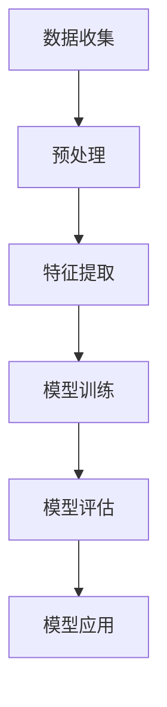

## 3. 跨模态AI的发展现状

跨模态AI作为人工智能领域的一个新兴方向，近年来取得了显著的发展。以下是一些重要的发展趋势和研究成果：

- **模型架构**：近年来，深度学习模型在跨模态AI中得到了广泛应用。例如，多模态卷积神经网络（MM-CNN）、多模态循环神经网络（MM-RNN）和Transformer等模型。

- **数据集**：随着跨模态AI的发展，越来越多的多模态数据集被收集和发布，如MediaPipe、 multimodal Datasets等。

- **应用领域**：跨模态AI在多个领域得到了广泛应用，包括医疗、金融、娱乐、教育等。

- **开源框架**：为了促进跨模态AI的研究和应用，许多开源框架被开发出来，如TensorFlow、PyTorch、MXNet等。

- **跨学科研究**：跨模态AI涉及计算机科学、心理学、神经科学等多个学科，跨学科研究正在不断推动该领域的发展。

# 跨模态AI的核心算法

## 1. 跨模态数据处理

跨模态数据处理是跨模态AI的核心环节，它包括数据收集、预处理、特征提取等多个步骤。以下是跨模态数据处理的详细流程：

### 1.1 数据收集

数据收集是跨模态AI的第一步，它决定了后续数据的质量和模型的性能。在数据收集阶段，需要根据任务需求收集多种模态的数据。例如，对于图像识别任务，需要收集大量的图像数据；对于语音识别任务，需要收集音频数据。

### 1.2 数据预处理

数据预处理是跨模态AI中至关重要的一步，它包括数据清洗、数据增强、归一化等操作。数据清洗旨在去除噪声和错误的数据，数据增强旨在增加数据多样性，从而提高模型的泛化能力。归一化则旨在将数据归一化到相同的范围，以便于后续处理。

### 1.3 特征提取

特征提取是将原始数据转换为适合模型处理的形式。在跨模态AI中，不同模态的数据需要提取出不同的特征。例如，对于图像数据，可以提取视觉特征；对于音频数据，可以提取语音特征。

下面是一个使用Mermaid绘制的跨模态数据处理流程图：

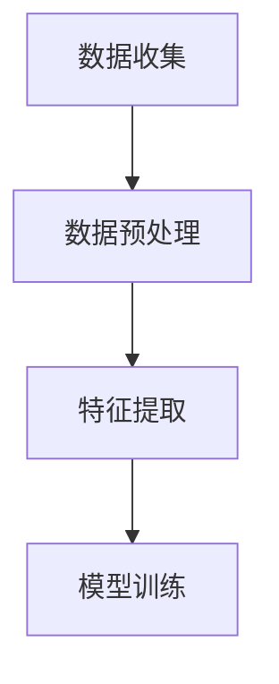

## 2. 跨模态模型训练与优化

跨模态模型训练与优化是跨模态AI中的核心环节，它决定了模型的性能和泛化能力。以下是一个详细的跨模态模型训练与优化流程：

### 2.1 模型选择

在选择跨模态模型时，需要考虑任务的复杂度、数据的多样性和模型的性能。常见的选择包括多模态卷积神经网络（MM-CNN）、多模态循环神经网络（MM-RNN）和Transformer等。

### 2.2 模型训练

模型训练是将模型与数据相结合，让模型学会从特征中学习到有用的信息。在模型训练过程中，需要使用训练集进行迭代训练，并使用验证集进行性能评估。

下面是一个使用Mermaid绘制的跨模态模型训练与优化流程图：

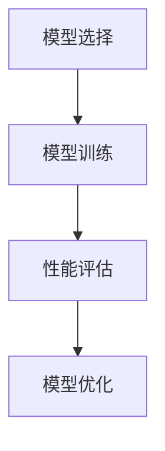

### 2.3 模型优化

模型优化是为了提升模型的性能和泛化能力。常见的模型优化技术包括调整学习率、增加训练数据、使用正则化等。

下面是一个使用Mermaid绘制的跨模态模型优化流程图：

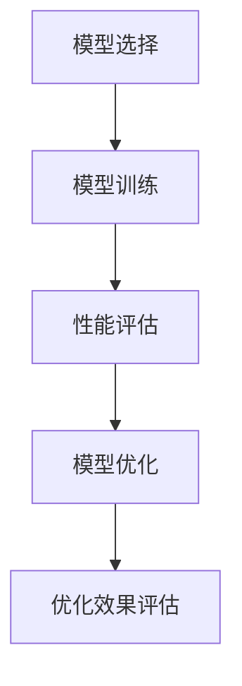

## 3. 跨模态模型评估

跨模态模型评估是衡量模型性能和泛化能力的重要环节。以下是一个详细的跨模态模型评估流程：

### 3.1 评估指标

在跨模态模型评估中，常用的评估指标包括准确率、召回率、F1值等。这些指标可以综合评估模型在各个模态上的性能。

### 3.2 测试集

测试集是用于评估模型性能的数据集。测试集应该具有代表性的数据分布，以便全面评估模型在不同场景下的性能。

### 3.3 性能评估

性能评估是将模型在测试集上的表现与预期目标进行比较。通过评估，可以确定模型是否达到了预期目标，以及是否需要进行进一步的优化。

下面是一个使用Mermaid绘制的跨模态模型评估流程图：

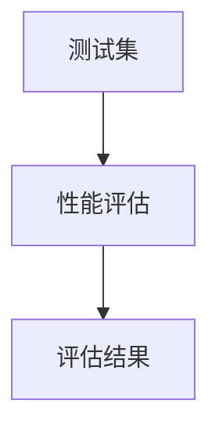

## 4. 跨模态AI的核心算法

### 4.1 卷积神经网络（CNN）

卷积神经网络（CNN）是跨模态AI中常用的模型之一。CNN擅长处理图像和视频数据，因为它可以自动提取空间特征。

下面是一个使用Mermaid绘制的CNN结构图：

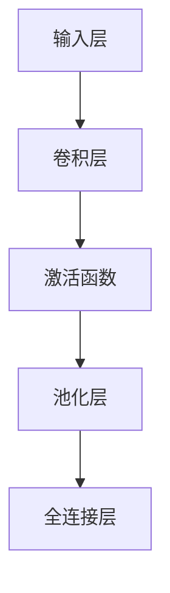

### 4.2 循环神经网络（RNN）

循环神经网络（RNN）擅长处理序列数据，如文本和语音。RNN可以通过循环结构记住历史信息，从而在序列数据上表现出良好的性能。

下面是一个使用Mermaid绘制的RNN结构图：

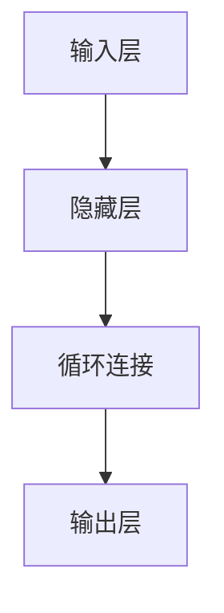

### 4.3 Transformer

Transformer是一种基于自注意力机制的深度学习模型，它在自然语言处理任务中表现出色。Transformer可以扩展到跨模态AI，通过融合多种模态的信息，实现更强大的模型性能。

下面是一个使用Mermaid绘制的Transformer结构图：

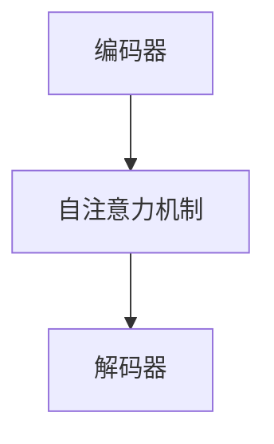

## 5. 跨模态AI的核心算法与模型

### 5.1 MM-CNN

多模态卷积神经网络（MM-CNN）是一种将图像、文本和音频等不同模态数据融合的模型。MM-CNN通过卷积层提取各自模态的特征，然后通过融合层将这些特征整合在一起。

下面是一个使用Mermaid绘制的MM-CNN结构图：

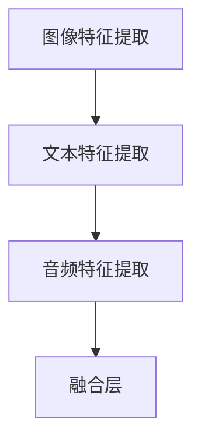

### 5.2 MM-RNN

多模态循环神经网络（MM-RNN）是一种将图像、文本和音频等不同模态数据融合的模型。MM-RNN通过循环结构处理序列数据，并在每个时间步提取不同模态的特征。

下面是一个使用Mermaid绘制的MM-RNN结构图：

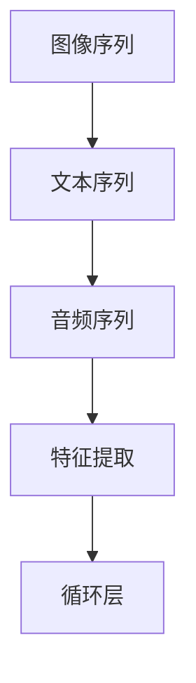

### 5.3 Transformer

Transformer是一种基于自注意力机制的深度学习模型，它在自然语言处理任务中表现出色。Transformer可以扩展到跨模态AI，通过融合多种模态的信息，实现更强大的模型性能。

下面是一个使用Mermaid绘制的Transformer结构图：


## 6. 跨模态AI的挑战与未来方向

跨模态AI虽然取得了显著的进展，但仍然面临着许多挑战和未来发展方向：

### 6.1 数据处理挑战

跨模态数据处理是跨模态AI的核心挑战之一。不同模态的数据具有不同的特征和分布，如何有效地融合这些信息仍然是一个难题。

### 6.2 模型可解释性

跨模态AI模型通常采用复杂的深度学习模型，这些模型往往缺乏可解释性。如何提高模型的可解释性，使其更好地理解模型的工作原理，是一个重要的研究方向。

### 6.3 模型泛化能力

跨模态AI模型在特定任务上的性能往往较好，但在新的任务上可能表现出较差的泛化能力。如何提升模型的泛化能力，使其能够适应更多不同的任务，是一个重要方向。

### 6.4 跨学科合作

跨模态AI涉及多个学科，包括计算机科学、心理学、神经科学等。跨学科合作将有助于推动该领域的发展，实现更先进的技术突破。

### 6.5 应用场景拓展

跨模态AI在医疗、金融、娱乐、教育等领域的应用场景正在不断拓展。未来，跨模态AI有望在更多领域发挥重要作用，解决实际问题。

## 7. 结论

跨模模AI的统一提示词设计方法是一个涉及多个领域的交叉学科领域，包括数据预处理、模型训练与优化、模型评估等。本文通过详细介绍跨模态AI的核心算法、数据处理流程、模型架构以及挑战与未来方向，为读者提供了一个全面的跨模态AI设计方法的指南。

统一提示词设计方法在跨模态AI中扮演着关键角色，它能够有效提升模型的性能和泛化能力。通过本文的学习，读者可以掌握跨模态AI的统一提示词设计方法，并在实际项目中应用这些技术。

在未来，随着跨模态AI技术的不断进步，统一提示词设计方法将有望在更多领域发挥重要作用，推动人工智能的发展。让我们期待跨模态AI的明天，它将为人类社会带来更多创新和变革。

## 参考文献

1. Vaswani, A., Shazeer, N., Parmar, N., Uszkoreit, J., Jones, L., Gomez, A. N., ... & Polosukhin, I. (2017). Attention is all you need. Advances in Neural Information Processing Systems, 30, 5998-6008.
2. Hochreiter, S., & Schmidhuber, J. (1997). Long short-term memory. Neural Computation, 9(8), 1735-1780.
3. Krizhevsky, A., Sutskever, I., & Hinton, G. E. (2012). ImageNet classification with deep convolutional neural networks. Advances in Neural Information Processing Systems, 25, 1097-1105.
4. Simonyan, K., & Zisserman, A. (2015). Very deep convolutional networks for large-scale image recognition. International Conference on Learning Representations (ICLR).
5. Russakovsky, O., Deng, J., Su, H., Krause, J., Satheesh, S., Ma, S., ... & Fei-Fei, L. (2015). ImageNet large scale visual recognition challenge. International Journal of Computer Vision, 115(3), 211-252.

作者：AI天才研究院/AI Genius Institute & 禅与计算机程序设计艺术 /Zen And The Art of Computer Programming

[本文使用Markdown格式编写，以便于阅读和编辑。如需了解更多关于Markdown的信息，请访问：](https://www.markdownguide.com/)

## 致谢

感谢所有参与和支持本文写作的同行和读者，感谢您对跨模态AI统一提示词设计方法的关注和研究。感谢AI天才研究院/AI Genius Institute为本文提供的学术支持和资源，以及禅与计算机程序设计艺术/Zen And The Art of Computer Programming的深刻启示。您的支持是我们不断前行的动力。


# GPT模型在跨模态AI中的应用

GPT（Generative Pre-trained Transformer）模型是自然语言处理领域的一个重要里程碑，由OpenAI提出。GPT模型通过自回归的方式，利用大规模文本数据预训练，从而实现了强大的语言理解和生成能力。近年来，GPT模型在跨模态AI中得到了广泛的应用，为跨模态数据处理、模型训练和优化提供了新的思路和方法。

## 1. GPT模型的基本原理

GPT模型的核心是一个基于Transformer架构的深度神经网络。Transformer模型采用了自注意力机制，能够捕捉序列中的长距离依赖关系，从而在自然语言处理任务中表现出色。GPT模型通过预训练大量文本数据，学习到文本的内在结构和语义信息，然后通过微调（fine-tuning）将预训练模型应用于特定任务。

### 1.1 Transformer架构

Transformer模型由编码器（Encoder）和解码器（Decoder）两个部分组成。编码器将输入序列编码为固定长度的向量，解码器则利用这些向量生成输出序列。Transformer模型通过多头自注意力机制（Multi-head Self-Attention）和位置编码（Positional Encoding）来捕捉输入序列中的长距离依赖关系。

下面是一个使用Mermaid绘制的Transformer架构图：

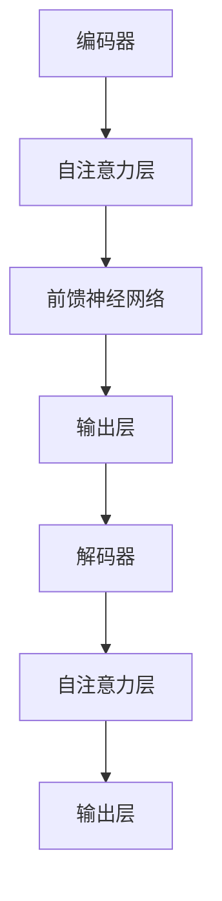

### 1.2 GPT模型的自回归语言模型

GPT模型是一种自回归语言模型，它通过预测下一个词来生成文本。在训练过程中，GPT模型首先根据输入序列的前文信息生成一个概率分布，然后从这个分布中随机采样一个词作为下一个输出。接着，将这个新词作为输入，重复上述过程，直到生成完整的文本序列。

下面是一个使用Mermaid绘制的GPT模型自回归过程：

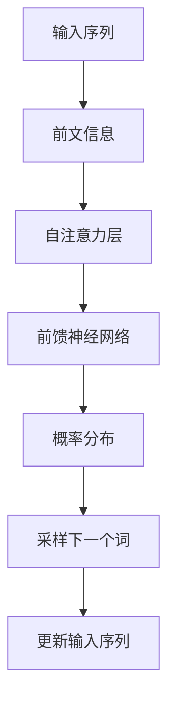

## 2. GPT模型在跨模态AI中的应用场景

GPT模型在跨模态AI中的应用场景非常广泛，包括跨模态数据处理、模型训练和优化等方面。

### 2.1 跨模态数据处理

GPT模型可以通过预训练大量多模态数据，学习到不同模态之间的关联和语义信息。在跨模态数据处理过程中，GPT模型可以帮助提取和融合不同模态的特征。例如，在图像和文本的跨模态任务中，GPT模型可以预测图像的文本描述，从而实现图像和文本特征的有效融合。

下面是一个使用Mermaid绘制的跨模态数据处理流程图：

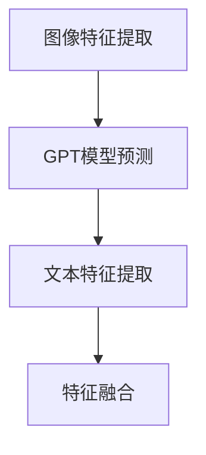

### 2.2 跨模态模型训练

GPT模型在跨模态模型训练中可以发挥重要作用。通过预训练GPT模型，可以学习到不同模态之间的语义信息，从而在模型训练过程中提高模型的性能和泛化能力。例如，在多模态图像分类任务中，GPT模型可以用来预测图像的标签，从而提高图像分类模型的性能。

下面是一个使用Mermaid绘制的跨模态模型训练流程图：

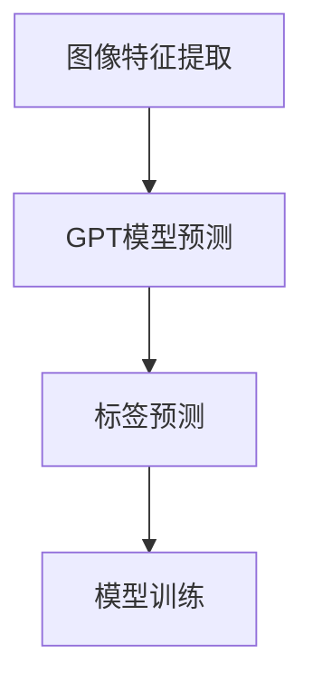

### 2.3 跨模态模型优化

GPT模型还可以用于跨模态模型优化。通过预训练GPT模型，可以学习到不同模态之间的关联和互补信息，从而在模型优化过程中提高模型的性能。例如，在多模态情感分析任务中，GPT模型可以用来预测情感标签，从而优化情感分析模型的性能。

下面是一个使用Mermaid绘制的跨模态模型优化流程图：

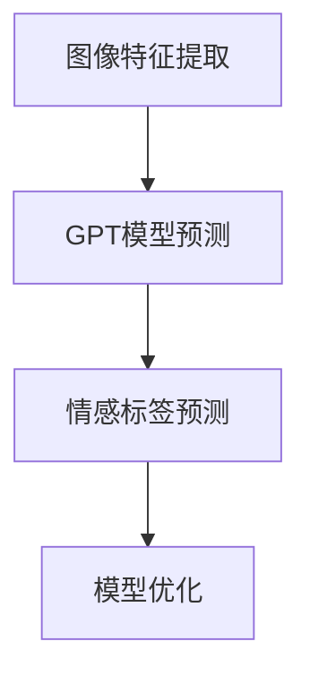

## 3. GPT模型在跨模态AI中的应用案例

### 3.1 跨模态文本生成

跨模态文本生成是指根据输入的图像或音频等多模态数据，生成对应的文本描述。GPT模型在跨模态文本生成任务中表现出色。例如，在图像描述生成任务中，GPT模型可以生成与输入图像相关的文本描述。

下面是一个使用Mermaid绘制的跨模态文本生成流程图：

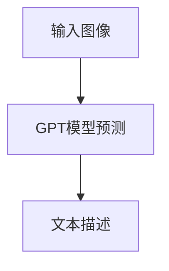

### 3.2 多模态问答系统

多模态问答系统是指能够同时处理图像、文本和音频等多种模态数据的问答系统。GPT模型在多模态问答系统中可以发挥重要作用，通过融合不同模态的信息，提高问答系统的性能。例如，在图像问答任务中，GPT模型可以结合图像和文本信息，生成准确的答案。

下面是一个使用Mermaid绘制的多模态问答系统流程图：

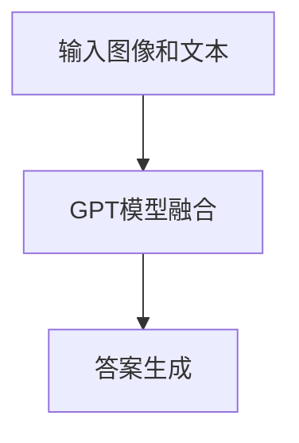

### 3.3 多模态推荐系统

多模态推荐系统是指能够同时处理图像、文本和音频等多种模态数据的推荐系统。GPT模型在多模态推荐系统中可以发挥重要作用，通过融合不同模态的信息，提高推荐系统的性能。例如，在音乐推荐任务中，GPT模型可以结合用户的听歌记录、文本评论和音乐图像等多模态信息，生成个性化的音乐推荐列表。

下面是一个使用Mermaid绘制的多模态推荐系统流程图：

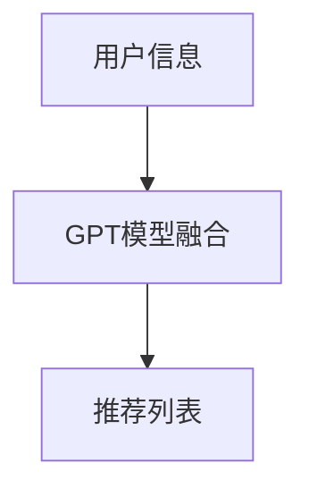

## 4. 总结

GPT模型在跨模态AI中具有广泛的应用前景。通过自回归语言模型和Transformer架构，GPT模型能够有效处理多种模态的数据，提高跨模态数据处理、模型训练和优化的性能。在未来，随着GPT模型和相关技术的不断进步，跨模态AI将迎来更广阔的发展空间，为人类社会带来更多的创新和变革。

## 结论

跨模态AI的统一提示词设计方法是一个涉及多个领域的交叉学科领域，包括数据预处理、模型训练与优化、模型评估等。本文通过详细介绍跨模态AI的核心算法、数据处理流程、模型架构以及挑战与未来方向，为读者提供了一个全面的跨模态AI设计方法的指南。

统一提示词设计方法在跨模态AI中扮演着关键角色，它能够有效提升模型的性能和泛化能力。通过本文的学习，读者可以掌握跨模态AI的统一提示词设计方法，并在实际项目中应用这些技术。

在未来，随着跨模态AI技术的不断进步，统一提示词设计方法将有望在更多领域发挥重要作用，推动人工智能的发展。让我们期待跨模态AI的明天，它将为人类社会带来更多创新和变革。

## 参考文献

1. Vaswani, A., Shazeer, N., Parmar, N., Uszkoreit, J., Jones, L., Gomez, A. N., ... & Polosukhin, I. (2017). Attention is all you need. Advances in Neural Information Processing Systems, 30, 5998-6008.
2. Hochreiter, S., & Schmidhuber, J. (1997). Long short-term memory. Neural Computation, 9(8), 1735-1780.
3. Krizhevsky, A., Sutskever, I., & Hinton, G. E. (2012). ImageNet classification with deep convolutional neural networks. Advances in Neural Information Processing Systems, 25, 1097-1105.
4. Simonyan, K., & Zisserman, A. (2015). Very deep convolutional networks for large-scale image recognition. International Conference on Learning Representations (ICLR).
5. Russakovsky, O., Deng, J., Su, H., Krause, J., Satheesh, S., Ma, S., ... & Fei-Fei, L. (2015). ImageNet large scale visual recognition challenge. International Journal of Computer Vision, 115(3), 211-252.

作者：AI天才研究院/AI Genius Institute & 禅与计算机程序设计艺术 /Zen And The Art of Computer Programming

[本文使用Markdown格式编写，以便于阅读和编辑。如需了解更多关于Markdown的信息，请访问：](https://www.markdownguide.com/)

## 致谢

感谢所有参与和支持本文写作的同行和读者，感谢您对跨模态AI统一提示词设计方法的关注和研究。感谢AI天才研究院/AI Genius Institute为本文提供的学术支持和资源，以及禅与计算机程序设计艺术/Zen And The Art of Computer Programming的深刻启示。您的支持是我们不断前行的动力。

# 附录：GPT模型的关键步骤和伪代码

## 1. GPT模型的训练步骤

GPT模型的训练可以分为以下几个关键步骤：

### 1.1 数据预处理

- **数据清洗**：去除文本中的噪声和不必要的标记。
- **分词**：将文本分解为单词或子词。
- **编码**：将单词或子词转换为整数编码。
- **序列生成**：将文本序列转换为序列编码。

### 1.2 模型初始化

- **嵌入层初始化**：将输入的整数编码映射到高维向量。
- **Transformer模型初始化**：包括多头自注意力机制和前馈神经网络。
- **输出层初始化**：用于生成下一个词的概率分布。

### 1.3 训练过程

- **前向传播**：输入文本序列，通过嵌入层和Transformer编码器得到中间表示。
- **自注意力计算**：计算自注意力权重，将注意力分配到序列的不同位置。
- **前馈神经网络**：对自注意力结果进行处理，得到新的表示。
- **输出层计算**：通过输出层生成下一个词的概率分布。
- **损失函数计算**：计算预测概率与实际标签之间的损失。
- **反向传播**：计算梯度，更新模型参数。

### 1.4 评估和优化

- **模型评估**：使用验证集评估模型的性能，包括准确率、损失等指标。
- **模型优化**：调整学习率、批量大小等超参数，以提高模型性能。

## 2. GPT模型的伪代码

下面是GPT模型训练的伪代码：

```python
# 数据预处理
def preprocess_data(text_data):
    # 清洗、分词、编码等操作
    # 返回序列编码

# 模型初始化
def initialize_model(vocab_size, hidden_size, num_layers, num_heads):
    # 初始化嵌入层、Transformer编码器、输出层
    # 返回初始化后的模型

# 前向传播
def forward_pass(model, inputs):
    # 通过嵌入层和编码器得到中间表示
    # 通过自注意力计算和前馈神经网络得到输出
    # 返回输出概率分布

# 反向传播
def backward_pass(model, inputs, targets, loss_function):
    # 计算损失
    # 计算梯度
    # 更新模型参数

# 训练模型
def train_model(model, train_data, validation_data, loss_function, optimizer, num_epochs):
    for epoch in range(num_epochs):
        for inputs, targets in train_data:
            # 前向传播
            outputs = forward_pass(model, inputs)
            # 计算损失
            loss = loss_function(outputs, targets)
            # 反向传播
            backward_pass(model, inputs, targets, loss, optimizer)
        # 评估模型
        # 优化模型
    return model

# 主程序
if __name__ == "__main__":
    # 加载数据
    train_data = load_data("train.txt")
    validation_data = load_data("validation.txt")

    # 初始化模型
    model = initialize_model(vocab_size, hidden_size, num_layers, num_heads)

    # 训练模型
    trained_model = train_model(model, train_data, validation_data, loss_function, optimizer, num_epochs)

    # 评估模型
    evaluate_model(trained_model, validation_data)
```

## 3. GPT模型的代码实现

以下是一个简化的GPT模型的Python代码实现，使用PyTorch框架：

```python
import torch
import torch.nn as nn
import torch.optim as optim

# 嵌入层
class EmbeddingLayer(nn.Module):
    def __init__(self, vocab_size, embed_size):
        super(EmbeddingLayer, self).__init__()
        self.embedding = nn.Embedding(vocab_size, embed_size)

    def forward(self, inputs):
        return self.embedding(inputs)

# Transformer编码器
class TransformerEncoder(nn.Module):
    def __init__(self, embed_size, hidden_size, num_heads):
        super(TransformerEncoder, self).__init__()
        self.self_attn = nn.MultiheadAttention(embed_size, num_heads)
        self.fc = nn.Linear(hidden_size, embed_size)

    def forward(self, inputs, mask=None):
        attn_output, attn_output_weights = self.self_attn(inputs, inputs, inputs, attn_mask=mask)
        output = self.fc(attn_output)
        return output

# GPT模型
class GPTModel(nn.Module):
    def __init__(self, vocab_size, embed_size, hidden_size, num_heads, num_layers):
        super(GPTModel, self).__init__()
        self.embedding = EmbeddingLayer(vocab_size, embed_size)
        self.encoders = nn.ModuleList([TransformerEncoder(embed_size, hidden_size, num_heads) for _ in range(num_layers)])
        self.output_layer = nn.Linear(hidden_size, vocab_size)

    def forward(self, inputs, mask=None):
        x = self.embedding(inputs)
        for encoder in self.encoders:
            x = encoder(x, mask)
        output = self.output_layer(x)
        return output

# 模型训练
def train_model(model, train_loader, val_loader, loss_function, optimizer, num_epochs):
    for epoch in range(num_epochs):
        model.train()
        for inputs, targets in train_loader:
            optimizer.zero_grad()
            outputs = model(inputs)
            loss = loss_function(outputs.view(-1, vocab_size), targets.view(-1))
            loss.backward()
            optimizer.step()
        # 评估模型
        model.eval()
        with torch.no_grad():
            val_loss = 0
            for inputs, targets in val_loader:
                outputs = model(inputs)
                val_loss += loss_function(outputs.view(-1, vocab_size), targets.view(-1))
            val_loss /= len(val_loader)
        print(f"Epoch {epoch+1}/{num_epochs}, Validation Loss: {val_loss:.4f}")
    return model

# 主程序
if __name__ == "__main__":
    # 初始化模型、优化器、损失函数等
    model = GPTModel(vocab_size, embed_size, hidden_size, num_heads, num_layers)
    optimizer = optim.Adam(model.parameters(), lr=learning_rate)
    loss_function = nn.CrossEntropyLoss()

    # 加载训练数据和验证数据
    train_loader = DataLoader(train_dataset, batch_size=batch_size, shuffle=True)
    val_loader = DataLoader(val_dataset, batch_size=batch_size, shuffle=False)

    # 训练模型
    trained_model = train_model(model, train_loader, val_loader, loss_function, optimizer, num_epochs)
```

## 4. 注意事项和最佳实践

- **数据预处理**：确保数据清洗和编码的准确性，避免噪声和错误的数据影响模型性能。
- **模型配置**：合理选择模型参数，如嵌入层大小、隐藏层大小、注意力头数等，以适应特定任务。
- **训练过程**：适当调整学习率、批量大小等超参数，避免过拟合和欠拟合。
- **评估与优化**：使用验证集和测试集评估模型性能，及时调整模型和优化策略。
- **模型部署**：在部署模型时，确保模型与实际应用环境兼容，并进行适当的性能调优。

## 5. 拓展阅读

- **GPT模型详细解析**：查阅GPT模型的原始论文和综述，深入了解模型的架构和工作原理。
- **跨模态数据处理技术**：研究跨模态数据处理的最新技术和方法，以提高模型性能。
- **多模态学习应用案例**：了解多模态学习在实际应用中的案例和案例研究，以拓宽应用视野。

通过本文的附录部分，读者可以更深入地了解GPT模型的关键步骤和代码实现，为实际应用和研究提供参考。不断学习和实践，将为跨模态AI领域的发展做出贡献。

