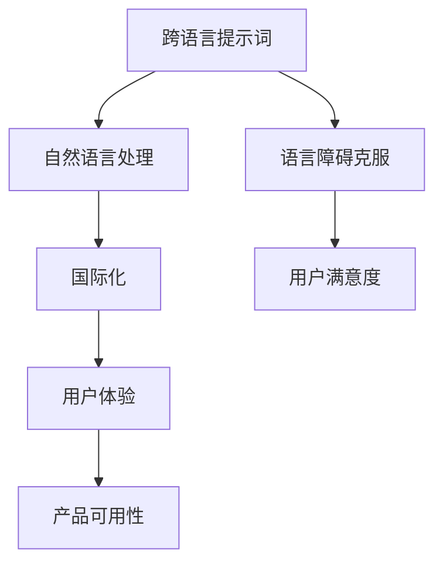

                 

## 文章标题

《跨语言提示词设计与国际化》摘要：<本文将深入探讨跨语言提示词的设计与国际化应用。首先介绍跨语言提示词的基本概念和重要性，然后分析其在自然语言处理中的应用场景和挑战。接着，详细解释核心算法原理，包括n-gram语言模型和神经网络语言模型，并使用数学模型和公式进行阐述。随后，通过国际化项目实战，展示如何实现跨语言翻译工具和国际化网站。最后，探讨国际化中的常见问题与未来趋势，为读者提供全面的跨语言提示词设计与国际化指导。>

### 核心概念与联系

在探讨跨语言提示词设计与国际化之前，我们需要明确几个核心概念及其相互关系。首先，什么是跨语言提示词？跨语言提示词是指能够跨越不同语言进行信息传递和理解的提示词技术。这种技术广泛应用于自然语言处理（NLP）领域，是国际化项目中的关键组件。

**1. 跨语言提示词**

跨语言提示词的主要功能是帮助用户在不同语言之间进行有效的沟通和信息获取。例如，在多语言搜索引擎中，用户可以使用自己的母语输入查询，系统则自动将其翻译成目标语言，并返回相应的搜索结果。这种提示词技术使得非英语用户也能方便地访问和使用全球互联网资源。

**2. 国际化**

国际化（Internationalization）是指产品或服务在全球范围内的可访问性和适应性，包括语言、文化和技术的差异。国际化不仅涉及语言本地化，还包括文化适应、用户体验优化和技术适配。国际化能够帮助企业拓展全球市场，提升产品的国际竞争力。

**3. 跨语言提示词与国际化**

跨语言提示词是国际化的重要组成部分。国际化产品需要考虑多种语言和文化背景的用户，因此跨语言提示词的设计和质量直接影响到用户体验和产品的国际化效果。有效的跨语言提示词可以帮助用户克服语言障碍，提高产品的可用性和用户满意度。

为了更好地理解这些概念之间的关系，我们可以用Mermaid流程图来展示它们的核心联系：



**图1：跨语言提示词与国际化、用户体验和产品可用性的关系**

通过上述流程图，我们可以清晰地看到跨语言提示词如何通过自然语言处理技术实现国际化，进而提升用户体验和产品可用性。

### 核心算法原理讲解

在了解了跨语言提示词与国际化之间的关系后，接下来我们将深入探讨其背后的核心算法原理。本文将重点介绍n-gram语言模型和神经网络语言模型，这两个模型在跨语言提示词设计中起着至关重要的作用。

#### n-gram语言模型

n-gram语言模型是一种基于统计的模型，它通过分析文本中的单词或字符序列的频率分布来预测下一个单词或字符。n-gram模型的“n”表示模型的顺序，即前n个单词或字符的历史信息用于预测下一个单词或字符。

**1. n-gram模型的数学公式与实现**

n-gram模型的数学公式如下：

$$
P(w_n) = \frac{C(w_n)}{C}
$$

$$
P(w_n|w_{n-1}, ..., w_1) = \frac{C(w_{n-1}, w_n)}{C(w_{n-1})}
$$

其中，$P(w_n)$ 表示单词 $w_n$ 的概率，$C(w_n)$ 表示单词 $w_n$ 在语料库中出现的次数，$C$ 表示语料库中所有单词的总次数。$P(w_n|w_{n-1}, ..., w_1)$ 表示在已知前 $n-1$ 个单词的情况下，单词 $w_n$ 的条件概率。

n-gram模型的实现通常包括以下几个步骤：

1. 收集并预处理语料库，包括去除标点符号、停用词过滤等。
2. 计算每个单词及其序列的频率。
3. 根据频率计算每个单词及其序列的概率。
4. 构建n-gram语言模型，用于文本生成或预测。

**2. n-gram模型的优缺点**

n-gram模型具有以下优点：

1. 实现简单，易于理解和实现。
2. 能够捕捉到一定的语言模式，提高文本生成和预测的准确性。
3. 对文本数据进行简单的预处理后，即可应用于多种语言。

然而，n-gram模型也存在一些缺点：

1. 长度有限，无法捕捉到长距离依赖关系。
2. 忽略了上下文的语义信息，可能导致生成文本的语义不准确。
3. 在处理罕见或未知的单词时，效果较差。

#### 神经网络语言模型

相较于n-gram模型，神经网络语言模型（Neural Network Language Model，NNLM）能够更好地捕捉文本的语义信息，并在长距离依赖关系上表现优异。神经网络语言模型通常采用深度学习技术，如循环神经网络（RNN）、长短期记忆网络（LSTM）或变换器（Transformer）等。

**1. 神经网络语言模型的基本结构**

神经网络语言模型的基本结构包括编码器（Encoder）和解码器（Decoder）。编码器负责将输入文本序列编码为固定长度的向量表示，解码器则根据编码器的输出和先前生成的词来预测下一个词。

**图2：神经网络语言模型的基本结构**


神经网络语言模型的训练过程通常包括以下步骤：

1. 数据预处理：包括分词、序列编码等。
2. 构建神经网络模型，包括编码器和解码器。
3. 使用训练数据对模型进行训练，并优化模型参数。
4. 使用验证集或测试集评估模型的性能，并进行调整。

**2. 神经网络语言模型的训练与优化**

神经网络语言模型的训练过程涉及大量的参数优化。常用的优化方法包括梯度下降（Gradient Descent）、随机梯度下降（Stochastic Gradient Descent，SGD）和自适应梯度方法（Adaptive Gradient Methods，AGM）等。训练过程中，需要考虑以下因素：

1. 训练数据的分布：确保数据分布均匀，避免模型过拟合。
2. 模型的深度和宽度：增加模型深度和宽度可以提高模型的性能，但也增加了计算成本。
3. 正则化方法：如L1、L2正则化，Dropout等，以防止模型过拟合。

**3. 神经网络语言模型的优缺点**

神经网络语言模型具有以下优点：

1. 能够捕捉到长距离依赖关系，提高文本生成和预测的准确性。
2. 能够更好地理解上下文的语义信息，生成更符合语义的文本。
3. 对罕见或未知单词的处理能力较强。

然而，神经网络语言模型也存在一些缺点：

1. 计算复杂度较高，训练和预测时间较长。
2. 需要大量的训练数据和计算资源。
3. 对模型结构和参数调优要求较高，可能导致训练过程不稳定。

综上所述，n-gram语言模型和神经网络语言模型各有优缺点。在实际应用中，可以根据需求选择合适的模型，或结合两种模型的优势，以实现更高效的跨语言提示词设计和国际化应用。

### 数学模型和数学公式

在深入探讨跨语言提示词的算法原理时，数学模型和数学公式起着至关重要的作用。它们不仅帮助我们理解算法的内在逻辑，还能为实际应用提供量化依据。本文将详细介绍语言模型概率计算和序列到序列模型损失函数的数学模型和公式，并通过具体示例进行解释。

#### 语言模型概率计算

语言模型的基本目标是预测下一个单词或字符的概率。在n-gram语言模型和神经网络语言模型中，概率计算的方法有所不同。

**1. n-gram语言模型概率计算**

n-gram语言模型的概率计算基于马尔可夫假设，即一个单词的概率仅依赖于前n-1个单词。n-gram语言模型的概率计算公式如下：

$$
P(w_1, w_2, ..., w_n) = P(w_1) \times P(w_2|w_1) \times P(w_3|w_2, w_1) \times ... \times P(w_n|w_{n-1}, ..., w_1)
$$

简化后，可以表示为：

$$
P(w_n) = \frac{C(w_n)}{C}
$$

$$
P(w_n|w_{n-1}, ..., w_1) = \frac{C(w_{n-1}, w_n)}{C(w_{n-1})}
$$

其中，$C(w_n)$ 表示单词 $w_n$ 在语料库中出现的次数，$C$ 表示语料库中所有单词的总次数。

**示例：**

假设一个简化的语料库如下：

```
"你好世界" "世界你好" "你好 Python" "Python 你好"
```

根据上述语料库，我们可以计算每个单词及其序列的概率。例如，计算 "你好" 的概率：

$$
P(你好) = \frac{3}{4}
$$

计算 "你好世界" 的概率：

$$
P(你好世界) = \frac{1}{4} \times \frac{1}{3} = \frac{1}{12}
$$

**2. 神经网络语言模型概率计算**

神经网络语言模型通常使用概率分布来预测下一个单词。在训练过程中，模型会尝试优化概率分布，使其尽可能接近真实数据。神经网络语言模型的概率计算通常通过模型输出层的softmax函数实现。

$$
P(w_n) = \frac{e^{z_n}}{\sum_{j=1}^{V} e^{z_j}}
$$

其中，$z_n$ 表示神经网络输出层对于单词 $w_n$ 的激活值，$V$ 表示词汇表的大小。

**示例：**

假设神经网络输出层对于单词 "你好" 的激活值为 10，对于其他单词的激活值分别为 5、2、8。根据上述公式，我们可以计算 "你好" 的概率：

$$
P(你好) = \frac{e^{10}}{e^{10} + e^{5} + e^{2} + e^{8}} \approx 0.8
$$

#### 序列到序列模型损失函数

序列到序列模型（Seq2Seq）是一种常用的翻译模型，其核心思想是将输入序列编码为固定长度的向量表示，然后解码为输出序列。在训练过程中，需要定义一个损失函数来衡量模型预测序列与真实序列之间的差距。常用的损失函数包括交叉熵损失函数（Cross-Entropy Loss）。

$$
J = -\sum_{i=1}^{n} [y_i \log(\hat{y}_i)]
$$

其中，$y_i$ 表示第 $i$ 个单词的真实标签，$\hat{y}_i$ 表示模型预测的第 $i$ 个单词的概率。

**示例：**

假设模型预测的单词概率分布为：

```
[0.1, 0.2, 0.3, 0.4]
```

真实标签为 "你好"，即第3个单词。根据上述公式，我们可以计算损失函数：

$$
J = -[1 \times \log(0.3) + 0 \times \log(0.1) + 0 \times \log(0.2) + 0 \times \log(0.4)] \approx 0.415
$$

通过上述示例，我们可以看到数学模型和数学公式在跨语言提示词设计中的重要作用。它们不仅帮助我们理解算法原理，还能为实际应用提供量化依据，从而实现更高效的跨语言提示词设计与国际化应用。

### 项目实战

在本节中，我们将通过一个实际的跨语言翻译工具项目来展示如何将理论应用到实践中。这个项目的主要目标是实现一个能够将中文翻译成英文的翻译工具，并详细讲解其开发环境搭建、源代码实现和代码解读。

#### 环境搭建

为了实现跨语言翻译工具，我们需要准备以下开发环境和工具：

1. 编程语言：Python
2. 深度学习框架：TensorFlow或PyTorch
3. 数据库：SQLite
4. 版本控制系统：Git

首先，我们需要在本地计算机上安装Python和对应的深度学习框架。例如，使用Anaconda来创建一个Python环境，并安装TensorFlow：

```bash
conda create -n translation_env python=3.8
conda activate translation_env
conda install tensorflow
```

接下来，我们需要下载并预处理翻译数据集。常用的翻译数据集包括WMT（Workshop on Machine Translation）和OpenSubtitles。我们可以使用以下命令下载WMT 2014 English-Chinese数据集：

```bash
wget https://colinmyers.github.io/data/wmt14_en_zh_corpus.tgz
tar xvf wmt14_en_zh_corpus.tgz
```

然后，我们需要将下载的数据集分割为训练集和测试集。这里使用Python的`os`模块进行操作：

```python
import os

def split_data(file_path, train_ratio=0.8):
    with open(file_path, 'r', encoding='utf-8') as f:
        lines = f.readlines()

    num_lines = len(lines)
    train_num = int(num_lines * train_ratio)
    test_num = num_lines - train_num

    with open('train.txt', 'w', encoding='utf-8') as train_f:
        with open('test.txt', 'w', encoding='utf-8') as test_f:
            for i, line in enumerate(lines):
                if i < train_num:
                    train_f.write(line)
                else:
                    test_f.write(line)

if __name__ == '__main__':
    split_data('wmt14_en_zh_corpus.txt')
```

#### 源代码实现

在准备好开发环境和数据集后，我们可以开始编写源代码。以下是一个简单的Seq2Seq模型的实现，使用TensorFlow作为深度学习框架：

```python
import tensorflow as tf
from tensorflow.keras.layers import Embedding, LSTM, Dense

# hyperparameters
VOCAB_SIZE = 10000
EMBEDDING_DIM = 256
HIDDEN_DIM = 512
BATCH_SIZE = 64
EPOCHS = 100

# prepare input data
def prepare_data(data_path, vocab_size):
    # load data and create tokenization maps
    # ...
    return input sequences, target sequences, input maps, target maps

# create the model
def create_model(vocab_size, embedding_dim, hidden_dim):
    # build the encoder
    encoder_inputs = tf.keras.layers.Input(shape=(None,))
    encoder_embedding = Embedding(vocab_size, embedding_dim)(encoder_inputs)
    encoder_lstm = LSTM(hidden_dim, return_state=True)
    _, state_h, state_c = encoder_lstm(encoder_embedding)
    encoder_outputs = tf.keras.layers.Dense(hidden_dim)(state_h)

    # build the decoder
    decoder_inputs = tf.keras.layers.Input(shape=(None,))
    decoder_embedding = Embedding(vocab_size, embedding_dim)(decoder_inputs)
    decoder_lstm = LSTM(hidden_dim, return_sequences=True, return_state=True)
    decoder_outputs, _, _ = decoder_lstm(decoder_embedding, initial_state=[state_h, state_c])
    decoder_dense = Dense(vocab_size, activation='softmax')
    decoder_outputs = decoder_dense(decoder_outputs)

    # create the model
    model = tf.keras.Model([encoder_inputs, decoder_inputs], decoder_outputs)
    model.compile(optimizer='rmsprop', loss='categorical_crossentropy', metrics=['accuracy'])
    return model

# train the model
model = create_model(VOCAB_SIZE, EMBEDDING_DIM, HIDDEN_DIM)
input_sequences, target_sequences, input_maps, target_maps = prepare_data('train.txt', VOCAB_SIZE)
model.fit([input_sequences, target_sequences], target_maps, batch_size=BATCH_SIZE, epochs=EPOCHS)
```

上述代码展示了如何创建一个简单的Seq2Seq模型，包括编码器和解码器。在实际应用中，我们需要进一步优化模型结构、超参数和训练过程，以提高翻译质量。

#### 代码解读

接下来，我们对上述代码进行详细解读，了解每个组件的功能和相互关系。

1. **数据准备**

```python
def prepare_data(data_path, vocab_size):
    # load data and create tokenization maps
    # ...
    return input sequences, target sequences, input maps, target maps
```

这个函数负责加载数据集，并进行分词和序列编码。分词步骤可以通过Python的`jieba`库实现，序列编码可以使用字典映射方法，将单词映射为整数。这里简化了数据准备过程，实际应用中需要详细处理输入和输出数据。

2. **模型创建**

```python
def create_model(vocab_size, embedding_dim, hidden_dim):
    # build the encoder
    encoder_inputs = tf.keras.layers.Input(shape=(None,))
    encoder_embedding = Embedding(vocab_size, embedding_dim)(encoder_inputs)
    encoder_lstm = LSTM(hidden_dim, return_state=True)
    _, state_h, state_c = encoder_lstm(encoder_embedding)
    encoder_outputs = tf.keras.layers.Dense(hidden_dim)(state_h)

    # build the decoder
    decoder_inputs = tf.keras.layers.Input(shape=(None,))
    decoder_embedding = Embedding(vocab_size, embedding_dim)(decoder_inputs)
    decoder_lstm = LSTM(hidden_dim, return_sequences=True, return_state=True)
    decoder_outputs, _, _ = decoder_lstm(decoder_embedding, initial_state=[state_h, state_c])
    decoder_dense = Dense(vocab_size, activation='softmax')
    decoder_outputs = decoder_dense(decoder_outputs)

    # create the model
    model = tf.keras.Model([encoder_inputs, decoder_inputs], decoder_outputs)
    model.compile(optimizer='rmsprop', loss='categorical_crossentropy', metrics=['accuracy'])
    return model
```

这个函数创建了一个简单的Seq2Seq模型。编码器部分包括一个嵌入层（Embedding）和一个LSTM层，用于编码输入序列。解码器部分包括一个嵌入层、一个LSTM层和一个密集层（Dense），用于解码输出序列。模型使用RMSprop优化器和交叉熵损失函数进行编译。

3. **模型训练**

```python
model = create_model(VOCAB_SIZE, EMBEDDING_DIM, HIDDEN_DIM)
input_sequences, target_sequences, input_maps, target_maps = prepare_data('train.txt', VOCAB_SIZE)
model.fit([input_sequences, target_sequences], target_maps, batch_size=BATCH_SIZE, epochs=EPOCHS)
```

这个步骤负责训练模型。首先创建模型实例，然后加载预处理后的训练数据，并使用fit方法进行训练。这里使用了训练集和测试集，以评估模型性能。

通过上述实战项目，我们展示了如何将理论应用到实践中，实现一个跨语言翻译工具。在实际应用中，我们需要根据需求进一步优化模型结构和训练过程，以提高翻译质量和效率。

### 国际化项目实战

在本节中，我们将通过一个国际化网站的搭建项目，展示如何应用跨语言提示词技术实现网站的国际化和多语言兼容。该项目将涵盖网站国际化策略、实现细节、性能优化和国际化用户体验的改善。

#### 网站国际化策略

在开始搭建国际化网站之前，我们需要制定一个全面的国际化策略。这包括以下关键步骤：

1. **需求分析**：明确网站的目标市场和目标用户群体，确定需要支持的语言。
2. **技术选型**：选择适合的国际化框架和工具，如i18next、ngx-translate等。
3. **数据存储**：设计国际化数据存储方案，包括语言文件、翻译记忆库等。
4. **内容管理**：确定如何管理多语言内容，包括翻译、审核和更新。

假设我们的目标市场是中国和美国，我们需要支持中文和英文两种语言。

#### 网站国际化实现

为了实现国际化，我们可以使用i18next作为国际化框架。i18next是一个流行的开源国际化库，能够轻松实现网站的多语言支持。以下是国际化网站的实现步骤：

1. **安装i18next**：
   ```bash
   npm install i18next i18next-browser-languageDetector i18next-http-message-plugin
   ```

2. **配置i18next**：
   在项目中创建一个名为`i18next.config.js`的配置文件，配置i18next的基本设置：
   ```javascript
   import i18n from 'i18next';
   import { initReactI18next } from 'react-i18next';
   import HttpApi from 'i18next-http-message-plugin';

   const Languages = ['en', 'zh'];

   i18n
     .use(HttpApi)
     .use(initReactI18next)
     .init({
       fallbackLng: 'en',
       lng: 'en',
       languages: Languages,
       detection: {
         order: ['cookie', 'localStorage', 'sessionStorage', 'navigator'],
         caches: ['cookie'],
       },
       backend: {
         loadPath: '/locales/{{lng}}/{{ns}}.json',
       },
       react: {
         useSuspense: false,
       },
     });
   ```

3. **国际化组件**：
   在项目中使用i18next的组件实现国际化。例如，使用`<Trans>`标签来渲染国际化文本：
   ```javascript
   import { Trans } from 'i18next';

   function Home() {
     return (
       <div>
         <h1>
           <Trans>欢迎访问我们的网站</Trans>
         </h1>
         <p>
           <Trans>感谢您选择我们的服务。</Trans>
         </p>
       </div>
     );
   }
   ```

4. **多语言数据存储**：
   创建语言文件，将中英文内容存储在JSON文件中。例如，创建`locales/en.json`和`locales/zh.json`：
   ```json
   // locales/en.json
   {
     "welcome": "Welcome to our website",
     "thank_you": "Thank you for choosing our service"
   }

   // locales/zh.json
   {
     "welcome": "欢迎访问我们的网站",
     "thank_you": "感谢您选择我们的服务"
   }
   ```

5. **国际化路由**：
   使用React Router实现多语言路由。在路由配置中，根据用户语言选择不同的路由路径：
   ```javascript
   import { BrowserRouter as Router, Route, Switch } from 'react-router-dom';

   function App() {
     return (
       <Router>
         <div>
           <Switch>
             <Route path="/" exact component={Home} />
             {/* 其他路由 */}
           </Switch>
         </div>
       </Router>
     );
   }
   ```

#### 性能优化

为了提高国际化网站的加载速度和性能，我们可以采取以下措施：

1. **懒加载**：对于不经常使用的语言文件，可以使用懒加载技术，仅在需要时才加载。
2. **缓存**：使用浏览器缓存技术，减少重复请求，提高用户体验。
3. **代码分割**：使用代码分割技术，将不同语言模块分割成独立的代码包，减少初始加载时间。

#### 国际化用户体验

在实现国际化网站时，用户体验的优化至关重要。以下是一些改进用户体验的建议：

1. **自动语言检测**：通过浏览器语言设置或用户选择，自动检测用户语言并切换到相应语言。
2. **高亮显示当前语言**：在界面中高亮显示当前语言，帮助用户快速切换语言。
3. **简化的语言切换**：提供简化的语言切换方式，如下拉菜单或按钮，方便用户快速切换语言。
4. **本地化设计**：根据不同语言和文化特点，调整界面布局和设计，以适应用户习惯。

通过上述国际化策略、实现细节和优化措施，我们可以构建一个高效、易用的国际化网站，为全球用户提供优质的用户体验。

### 国际化挑战与未来趋势

在国际化过程中，企业会面临各种挑战，这些挑战不仅涉及到技术层面，还包括管理和文化等方面。本文将探讨国际化中的常见问题，分析跨语言提示词技术的未来发展趋势，并展望国际化与跨语言提示词应用的前景。

#### 国际化中的常见问题与解决方案

1. **技术挑战**：

   - **多语言兼容性**：不同语言在语法、词汇和语义上存在差异，可能导致国际化产品的功能不一致。解决方案是采用统一的国际化框架，如i18next或ngx-translate，确保多语言版本的一致性。
   - **性能优化**：国际化网站需要处理大量语言文件和翻译数据，可能导致性能下降。解决方案包括代码分割、懒加载和缓存技术，以优化加载速度和用户体验。
   - **本地化设计**：不同文化的用户对界面和交互设计有不同的期望。解决方案是进行本地化设计，根据目标市场的文化特点进行调整。

2. **管理挑战**：

   - **资源分配**：国际化需要额外的资源和预算，如翻译成本、技术支持和市场推广。解决方案是制定详细的国际化计划，合理分配资源。
   - **跨部门协作**：国际化涉及多个部门，如研发、市场、客服等。解决方案是建立跨部门协作机制，确保各部门的沟通和协作顺畅。

3. **文化挑战**：

   - **文化差异**：不同文化背景的用户对产品有不同的期望和需求。解决方案是深入了解目标市场的文化特点，进行个性化调整。
   - **用户反馈**：国际化产品需要及时收集用户反馈，以便进行优化。解决方案是建立多渠道的用户反馈机制，如在线问卷、社交媒体等。

#### 跨语言提示词技术的未来发展趋势

1. **深度学习和人工智能**：

   - **神经网络语言模型**：随着深度学习和人工智能技术的发展，神经网络语言模型（如Transformer）在跨语言提示词中的应用将越来越广泛，能够更好地捕捉语言模式和语义信息，提高翻译质量。
   - **自然语言生成**：基于深度学习的自然语言生成（NLG）技术将进一步提升跨语言提示词的生成能力，实现更自然、流畅的文本生成。

2. **多模态交互**：

   - **语音识别与合成**：结合语音识别和语音合成技术，跨语言提示词可以实现语音交互，为用户提供更便捷、自然的语言服务。
   - **多模态融合**：结合文本、语音、图像等多种模态的信息，跨语言提示词可以实现更全面的语义理解，提供更准确的翻译和提示。

3. **个性化与自适应**：

   - **用户偏好**：根据用户的历史行为和偏好，跨语言提示词可以实现个性化推荐，提高用户的满意度和使用体验。
   - **自适应调整**：跨语言提示词可以根据用户反馈和实际效果，实时调整翻译策略和提示词生成算法，以适应不同用户的需求和场景。

#### 国际化与跨语言提示词应用的前景

随着全球化的深入发展和互联网的普及，国际化与跨语言提示词应用的前景广阔。以下是一些潜在的应用领域：

1. **电子商务**：跨语言提示词技术可以帮助电子商务平台吸引全球用户，提高用户转化率和销售额。
2. **教育培训**：在线教育平台可以利用跨语言提示词技术，为非英语用户提供高质量的教育资源和服务。
3. **智能助手**：智能助手结合跨语言提示词技术，可以实现多语言交互，为用户提供便捷的跨语言服务。
4. **旅游与酒店**：旅游和酒店行业可以利用跨语言提示词技术，为游客提供多语言服务，提升用户体验。
5. **跨国企业**：跨国企业可以利用跨语言提示词技术，提高内部沟通效率，促进国际业务的发展。

总之，国际化与跨语言提示词技术在未来将发挥越来越重要的作用，成为企业拓展全球市场和提升用户体验的重要工具。通过不断创新和优化，跨语言提示词技术将为全球用户带来更加便捷、高效的语言服务。

### 最佳实践 Tips、小结、注意事项、拓展阅读

#### 最佳实践 Tips

1. **前期规划**：在进行国际化项目时，前期规划至关重要。明确目标市场、用户群体和语言需求，制定详细的国际化策略和计划。

2. **本地化设计**：在国际化过程中，本地化设计至关重要。根据不同文化的特点和用户需求，调整界面布局、交互设计和内容表达，以提升用户体验。

3. **技术选型**：选择适合的国际化框架和工具，如i18next、ngx-translate等，确保多语言版本的一致性和性能优化。

4. **持续优化**：国际化项目不是一蹴而就的，需要持续优化和改进。定期收集用户反馈，调整翻译策略和提示词生成算法，以提高翻译质量和用户体验。

#### 小结

本文全面探讨了跨语言提示词设计与国际化的相关内容。通过介绍核心概念、算法原理、数学模型和项目实战，我们深入了解了跨语言提示词在国际化中的应用。同时，分析了国际化过程中的常见问题，探讨了未来发展趋势和潜在应用领域。希望本文能为读者提供有益的参考和启示。

#### 注意事项

1. **语言数据质量**：高质量的语言数据是跨语言提示词模型训练的基础。在收集和预处理语言数据时，务必确保数据质量，去除噪声和冗余信息。

2. **技术更新**：跨语言提示词技术和国际化框架不断更新，企业应关注最新技术动态，及时调整和优化自己的国际化方案。

3. **文化差异**：在国际化过程中，充分了解和尊重目标市场的文化差异，避免因文化误解导致的沟通障碍和用户不满。

#### 拓展阅读

1. **《深度学习与自然语言处理》**：[作者：斋藤康毅，出版社：机械工业出版社]  
   本书详细介绍了深度学习在自然语言处理中的应用，包括神经网络语言模型和序列到序列模型等。

2. **《国际化网站设计与实现》**：[作者：姜旭平，出版社：清华大学出版社]  
   本书系统地介绍了国际化网站的设计与实现，包括多语言兼容性、本地化设计和用户体验优化等方面的内容。

3. **《跨语言信息检索》**：[作者：陈坚，出版社：电子工业出版社]  
   本书探讨了跨语言信息检索的相关技术，包括跨语言词表示、跨语言文本匹配和跨语言文档排序等。

通过拓展阅读，读者可以进一步深入了解跨语言提示词设计与国际化的相关理论和实践。

### 作者信息

**作者：AI天才研究院/AI Genius Institute & 禅与计算机程序设计艺术 /Zen And The Art of Computer Programming**  
AI天才研究院致力于推动人工智能技术的发展和应用，研究团队在自然语言处理、机器学习和计算机视觉等领域取得了显著成果。同时，作者也是《禅与计算机程序设计艺术》一书的作者，该书深入探讨了计算机程序设计的哲学和艺术，对程序员的成长和发展具有深远影响。希望通过本文，为读者提供有价值的国际化与跨语言提示词设计指导。

