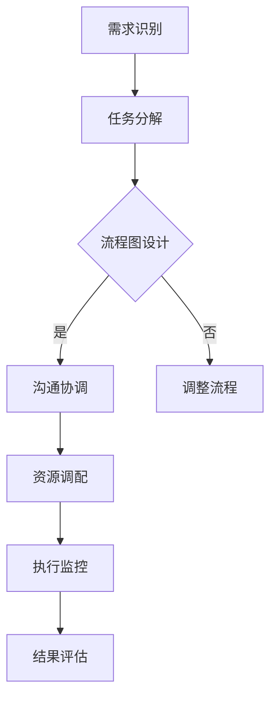

                 


## 文章标题：跨部门协作优化：打破信息孤岛的方法

### 文章关键词：
- 跨部门协作
- 信息孤岛
- 优化策略
- 组织结构
- 沟通工具

### 文章摘要：
本文旨在探讨跨部门协作中的信息孤岛问题，并提出了打破信息孤岛的一系列优化方法。文章首先介绍了信息孤岛的定义及其对企业的影响，然后分析了跨部门协作的基础，包括组织结构、流程和沟通的重要性。接着，文章详细阐述了信息孤岛的识别与分析方法，以及跨部门协作框架的设计。最后，文章提出了跨部门协作优化策略，包括文化建设、技术手段和组织结构优化，并通过实际案例进行了分析和验证。本文旨在为企业管理者提供指导，帮助其实现高效的跨部门协作。

## 引言

在当今快速变化和竞争激烈的商业环境中，企业的成功越来越依赖于跨部门协作的效率和效果。跨部门协作不仅能够整合各个部门的专业知识和资源，还能够促进创新和快速响应市场变化。然而，在实际操作中，许多企业面临着信息孤岛的问题，这导致了部门间的信息不对称、沟通不畅和协作效率低下。信息孤岛现象普遍存在于各类企业中，尤其在大中型企业中更为突出。

### 信息孤岛问题及其影响

信息孤岛指的是企业内部各部门之间缺乏有效的信息共享和沟通，导致信息在部门间流动受阻。这种现象会导致以下几个问题：

1. **决策延迟**：部门间的信息不畅会导致决策过程变得缓慢，从而影响企业的敏捷性和响应速度。
2. **资源浪费**：各部门可能重复进行相同的分析或工作，因为无法共享已有的信息。
3. **效率降低**：部门间的信息孤岛会导致协作效率下降，影响整个企业的运作效率。
4. **创新能力受限**：信息孤岛限制了跨部门的合作和知识交流，阻碍了创新能力的发挥。

### 跨部门协作的重要性

尽管存在信息孤岛的问题，但跨部门协作对企业的重要性不容忽视。通过有效的跨部门协作，企业可以实现以下几个目标：

1. **资源整合**：跨部门协作能够整合各个部门的专业知识和资源，提高资源利用效率。
2. **创新驱动**：跨部门协作促进了不同部门之间的知识交流和思想碰撞，有助于激发创新。
3. **流程优化**：跨部门协作能够识别和优化业务流程中的瓶颈和冗余，提高整体效率。
4. **客户满意度**：通过跨部门协作，企业能够更好地理解客户需求，提供更加个性化的服务。

### 本书的目标与读者群体

本书的目标是提供一套全面的跨部门协作优化方法，帮助企业打破信息孤岛，实现高效的部门间协作。本书适用于企业管理者、项目经理、IT专业人员以及其他关注跨部门协作效率的从业者。通过阅读本书，读者将了解跨部门协作的核心概念、识别信息孤岛的方法、设计协作框架的策略，以及实施协作优化的具体步骤。

## 第1章 跨部门协作的基础

跨部门协作是企业内部各个部门之间通过信息共享和资源整合，共同完成某项任务或实现某个目标的过程。要实现有效的跨部门协作，首先需要理解企业组织结构、部门间协作的流程以及沟通的重要性。

### 1.1 企业组织结构概述

企业的组织结构是跨部门协作的基础。常见的组织结构包括职能型组织、矩阵型组织、团队型组织和网络型组织等。每种组织结构都有其独特的特点和优缺点。

- **职能型组织**：按照职能划分部门，每个部门专注于特定职能。优点是职责清晰，管理简单；缺点是部门间沟通不畅，难以实现跨部门协作。
- **矩阵型组织**：在职能划分的基础上，引入项目团队，使员工能够同时在多个项目中工作。优点是增强了跨部门协作和资源整合能力；缺点是组织结构复杂，管理难度增加。
- **团队型组织**：以团队为中心，员工跨职能工作，共同完成项目。优点是促进了跨部门协作和知识共享；缺点是团队协作管理复杂，需要高度协调。
- **网络型组织**：通过外包、合作伙伴关系和虚拟团队等方式，实现资源的灵活配置。优点是资源利用效率高，响应速度快；缺点是依赖外部合作，组织稳定性较低。

### 1.2 部门间协作的流程设计

跨部门协作的流程设计是确保信息有效传递和资源合理利用的关键。以下是一个典型的跨部门协作流程设计步骤：

1. **需求识别**：确定跨部门协作的需求，明确协作的目标和预期成果。
2. **任务分配**：根据部门职责和能力，将任务分配给相关部门和人员。
3. **沟通协调**：建立有效的沟通机制，确保各部门之间能够及时交流信息和反馈。
4. **资源调配**：根据任务需求，调配所需的人力和资源。
5. **执行监控**：对协作过程进行监控，确保各项任务按计划进行。
6. **结果评估**：对协作效果进行评估，总结经验教训，为后续协作提供参考。

### 1.3 跨部门沟通的重要性

跨部门沟通是跨部门协作的核心，有效的沟通能够促进部门间的信息共享和协作效率。以下是一些提高跨部门沟通效率的策略：

1. **明确沟通目标**：确保沟通的目标清晰，避免无效沟通。
2. **选择适当的沟通方式**：根据沟通的内容和目的，选择合适的沟通方式，如会议、邮件、即时通讯工具等。
3. **建立沟通机制**：制定沟通计划和规范，确保沟通渠道的畅通。
4. **建立信任关系**：通过积极的互动和合作，建立部门间的信任关系，减少沟通障碍。
5. **培训与支持**：提供跨部门沟通的培训，提升员工的沟通技巧。

通过了解企业组织结构、部门间协作流程和跨部门沟通的重要性，企业可以更好地设计和实施跨部门协作，提高协作效率和效果。在下一章中，我们将进一步探讨信息孤岛的定义、识别方法以及分析工具。

## 第2章 信息孤岛识别与分析

信息孤岛是指企业内部各部门之间的信息交流与共享存在障碍，导致信息在部门间流动不畅或完全隔离的现象。识别和分析信息孤岛是跨部门协作优化的第一步，它有助于企业了解现有问题，并制定相应的解决策略。

### 2.1 信息孤岛的定义与特征

信息孤岛的定义可以从以下几个方面来理解：

- **定义**：信息孤岛是指企业内部不同部门或系统之间的信息无法自由流动，或者流动的效率极低，导致信息共享不足、协同效率低下。
- **特征**：
  - **信息不透明**：部门间的信息难以获取，存在信息壁垒。
  - **沟通不畅**：部门间的沟通存在障碍，信息传递不及时。
  - **资源浪费**：各部门可能重复进行相同的分析或工作，因为无法共享已有的信息。
  - **决策延迟**：由于信息不完整或不对称，决策过程变得缓慢。
  - **创新能力受限**：信息孤岛限制了跨部门的合作和知识交流，阻碍了创新能力的发挥。

### 2.2 信息孤岛识别方法

识别信息孤岛需要从多个角度进行，以下是一些常用的识别方法：

1. **实地调研**：通过实地走访和观察，了解各部门的工作流程、信息流动情况以及沟通方式。这种方法可以直观地发现信息孤岛的存在。
2. **问卷调查**：设计针对不同部门员工的问卷，收集他们对信息共享和沟通的看法。通过分析问卷结果，可以发现潜在的信息孤岛。
3. **数据分析**：通过对企业内部数据的分析，如邮件通信记录、会议记录、项目进度报告等，来识别信息流动的障碍点。
4. **访谈与反馈**：与各部门的负责人和员工进行一对一访谈，了解他们在跨部门协作中的体验和困难，从而识别信息孤岛。

### 2.3 信息孤岛分析工具

在识别信息孤岛后，需要使用适当的工具进行分析，以便制定有效的解决策略。以下是一些常用的信息孤岛分析工具：

1. **SWOT分析**：
   - **SWOT分析**是一种战略规划工具，用于分析企业的优势（Strengths）、劣势（Weaknesses）、机会（Opportunities）和威胁（Threats）。
   - 在信息孤岛分析中，SWOT分析可以帮助企业识别内部劣势（如信息孤岛）以及外部机会（如新的信息系统工具），从而制定针对性的改进措施。

2. **流程图**：
   - **流程图**是展示业务流程的图形化工具，它可以帮助企业了解信息在各部门间的流动路径。
   - 通过绘制流程图，可以发现信息流动的瓶颈和重复点，从而识别信息孤岛。

3. **实证研究方法**：
   - **实证研究方法**是通过收集和分析实际数据来验证假设或理论的方法。
   - 在信息孤岛分析中，可以使用实证研究方法来评估不同解决方案的有效性。

4. **数据挖掘技术**：
   - **数据挖掘技术**是用于从大量数据中发现有价值信息的方法。
   - 在信息孤岛分析中，可以使用数据挖掘技术来识别信息流动的规律和模式，从而找到信息孤岛。

### 2.4 信息孤岛识别与分析示例

为了更具体地说明信息孤岛的识别与分析过程，下面提供一个示例。

#### 示例：某公司的信息孤岛识别与分析

1. **实地调研**：
   - 调研发现，市场部与销售部之间的信息交流非常有限，两个部门主要通过邮件进行沟通，而邮件回复速度较慢。

2. **问卷调查**：
   - 设计问卷，针对公司内部员工进行调查，发现超过60%的员工表示在工作中遇到过信息孤岛现象，其中最常见的问题是“无法及时获取其他部门的重要信息”。

3. **数据分析**：
   - 分析公司的邮件通信记录，发现市场部发送给销售部的邮件平均回复时间为2天，而销售部回复给市场部的邮件平均回复时间为3天。

4. **访谈与反馈**：
   - 与市场部和销售部的负责人进行访谈，了解到两个部门在日常工作中存在很多重复性工作，因为无法共享已有的市场数据和销售策略。

5. **SWOT分析**：
   - 通过SWOT分析，确定了以下关键点：
     - **劣势**：信息孤岛导致资源浪费和决策延迟。
     - **机会**：引入新的沟通工具和流程可以改善信息流动。
     - **威胁**：如果不能有效解决信息孤岛问题，将影响公司的整体运营效率。

6. **流程图**：
   - 绘制市场部与销售部之间的流程图，发现信息流动路径存在多个瓶颈点。

7. **实证研究方法**：
   - 实证研究方法验证了引入新的沟通工具（如即时通讯平台）可以显著减少信息孤岛现象。

8. **数据挖掘技术**：
   - 使用数据挖掘技术，分析了邮件通信数据，发现了市场部与销售部之间信息共享的规律，为流程优化提供了数据支持。

通过以上步骤，公司成功识别和分析了信息孤岛问题，并制定了相应的改进策略。

在下一章中，我们将讨论如何设计跨部门协作框架，包括协作模型、流程设计和协作工具选择。

## 第3章 跨部门协作框架设计

设计一个有效的跨部门协作框架是解决信息孤岛问题的关键。一个良好的协作框架不仅能够促进信息的流动和资源的共享，还能够提升协作效率和决策质量。本章将详细探讨跨部门协作框架的设计方法，包括协作模型、流程设计和协作工具选择。

### 3.1 跨部门协作模型

跨部门协作模型是协作框架的基础，它定义了部门间协作的结构和方式。常见的跨部门协作模型包括：

1. **矩阵型协作模型**：
   - 矩阵型协作模型通过引入项目团队来加强部门间的协作。
   - 在矩阵型模型中，员工不仅属于某个职能部门，还属于特定的项目团队。
   - 这种模型的优势在于能够快速响应项目需求，但同时也带来了组织结构的复杂性。

2. **网络型协作模型**：
   - 网络型协作模型通过建立跨部门的虚拟团队来实现协作。
   - 虚拟团队依赖于现代通信技术和协作工具，成员可以在不同的地理位置工作。
   - 这种模型的优势在于灵活性和高效性，但需要强有力的沟通和管理支持。

3. **混合型协作模型**：
   - 混合型协作模型结合了矩阵型和网络型协作模型的特点，适用于需要高度协同和灵活性的复杂项目。
   - 在混合型模型中，项目团队和职能部门相互交织，共同推进项目进展。

在设计跨部门协作模型时，需要考虑以下因素：

- **项目的复杂度**：项目复杂度越高，越需要矩阵型或混合型协作模型。
- **组织的文化**：组织文化开放、包容，则网络型协作模型可能更合适。
- **资源分布**：资源集中度高的组织适合矩阵型模型，而资源分散的组织适合网络型模型。
- **沟通需求**：高沟通需求的任务需要更强的管理和沟通机制支持。

### 3.2 跨部门协作流程设计

跨部门协作流程设计是确保信息在部门间顺畅流动的关键。以下是一个典型的跨部门协作流程设计步骤：

1. **需求识别**：
   - 明确跨部门协作的需求，包括协作的目标、任务和预期成果。

2. **任务分解**：
   - 将总任务分解为具体的子任务，明确每个子任务的负责部门和人员。

3. **流程图设计**：
   - 使用**Mermaid**等工具绘制流程图，展示信息流动和任务执行的路径。
   - 流程图可以帮助团队理解和遵循协作流程，减少误解和重复工作。

4. **沟通协调**：
   - 建立有效的沟通机制，确保各部门之间能够及时交流信息和反馈。
   - 可以使用**即时通讯工具**（如Slack或Microsoft Teams）和**邮件**等通信工具。

5. **资源调配**：
   - 根据任务需求，调配所需的人力和资源。
   - 考虑到资源冲突和依赖关系，确保资源调配的合理性和效率。

6. **执行监控**：
   - 对协作过程进行监控，确保各项任务按计划进行。
   - 定期检查进度，及时发现和解决问题。

7. **结果评估**：
   - 对协作效果进行评估，总结经验教训，为后续协作提供参考。

#### Mermaid流程图示例



### 3.3 协作工具选择

选择合适的协作工具是实现跨部门协作的关键。以下是一些常用的协作工具：

1. **即时通讯工具**：
   - **Slack**：支持实时沟通、文件共享和自动化流程。
   - **Microsoft Teams**：集成邮件、日历、会议和文档编辑等功能。
   - **WhatsApp**：简单易用的即时通讯工具，适合小团队沟通。

2. **项目管理系统**：
   - **JIRA**：用于项目管理和任务跟踪。
   - **Trello**：基于看板的项目管理工具，直观易用。
   - **Asana**：适用于团队协作的任务管理和项目跟踪。

3. **文档共享与协作工具**：
   - **Google Docs**：支持多人实时编辑和协作。
   - **Microsoft Office 365**：集成文档编辑、共享和协作功能。
   - **Notion**：多功能的笔记和组织工具，适合团队协作。

4. **会议视频工具**：
   - **Zoom**：支持高清视频会议和屏幕共享。
   - **Microsoft Teams Meeting**：集成在Microsoft Teams中的视频会议功能。
   - **Google Meet**：基于Google Workspace的视频会议工具。

在选择协作工具时，需要考虑以下因素：

- **团队规模和需求**：小型团队可以选择简单易用的工具，而大型团队可能需要功能更全面的工具。
- **集成性**：工具需要与企业现有的系统（如ERP、CRM等）集成，确保数据的一致性。
- **易用性**：工具需要易于学习和使用，降低使用门槛。
- **安全性和隐私**：确保数据的安全性和用户的隐私。

通过设计一个合适的跨部门协作框架，并选择合适的协作工具，企业可以有效地打破信息孤岛，提高跨部门协作的效率和效果。在下一章中，我们将讨论跨部门协作优化策略，包括文化建设、技术手段和组织结构优化。

## 第4章 跨部门协作优化策略

为了实现高效的跨部门协作，企业需要采取一系列优化策略。这些策略包括文化建设、技术手段和组织结构优化，通过这些措施，企业可以打破信息孤岛，提升协作效率。

### 4.1 文化建设

文化建设是跨部门协作优化的基础，它涉及到企业价值观、员工态度和行为习惯的塑造。以下是一些具体的文化建设策略：

1. **共同价值观的认同**：
   - 明确企业的核心价值观，并在员工中广泛传播。
   - 通过培训和会议等方式，让员工理解并认同这些价值观，从而形成共同的目标和愿景。

2. **跨部门价值观的建立**：
   - 针对不同部门的特点，建立相互尊重、互助合作的价值观。
   - 鼓励部门间开展交流活动，增强彼此的了解和信任。

3. **沟通文化的促进**：
   - 建立开放、透明、及时的沟通文化，鼓励员工主动分享信息和经验。
   - 通过设立意见箱、定期召开跨部门会议等方式，确保沟通渠道的畅通。

4. **团队合作精神的培养**：
   - 鼓励团队合作，建立跨部门的团队文化。
   - 通过团队建设活动和协作项目，培养员工的团队合作精神和集体荣誉感。

### 4.2 技术手段

技术手段是跨部门协作优化的重要支撑，现代信息技术的应用可以显著提升协作效率和效果。以下是一些具体的技术手段：

1. **信息共享平台**：
   - 构建企业级的信息共享平台，如内部门户网站或知识管理系统。
   - 平台应具备文档管理、文件共享、信息发布和搜索等功能，方便员工获取所需信息。

2. **实时协作工具**：
   - 采用即时通讯工具、视频会议系统和协作软件，实现实时沟通和协作。
   - 这些工具可以大幅减少沟通延迟，提高协作效率。

3. **数据集成与可视化**：
   - 实现不同系统和数据源的集成，确保数据的统一和一致。
   - 通过数据可视化工具，将复杂的数据转化为直观的图表和报表，帮助决策者快速理解数据。

4. **自动化流程**：
   - 采用工作流管理和自动化工具，优化跨部门的业务流程。
   - 自动化流程可以减少人为错误，提高工作效率。

#### 伪代码示例

```python
# 定义跨部门协作流程
def cross_department_collaboration流程():
    # 分解任务
    tasks = ["需求识别", "任务分解", "流程图设计", "沟通协调", "资源调配", "执行监控", "结果评估"]

    # 流程图设计
    mermaid流程图 = "graph TB\n"
    for task in tasks:
        mermaid流程图 += f"A[{task}] --> B[{下一步任务}]\n"
    
    # 沟通协调
    if 沟通畅通():
        mermaid流程图 += "B --> C[资源调配]\n"
    else:
        mermaid流程图 += "B --> D[调整沟通方式]\n"

    # 执行监控
    if 流程按计划进行():
        mermaid流程图 += "C --> E[结果评估]\n"
    else:
        mermaid流程图 += "C --> F[解决问题]\n"

    # 输出流程图
    print(mermaid流程图)

# 调用流程
cross_department_collaboration流程()
```

### 4.3 组织结构优化

组织结构优化是跨部门协作优化的关键环节，合理的组织结构可以减少信息孤岛，提升协作效率。以下是一些组织结构优化的策略：

1. **部门重组**：
   - 根据业务需求和协作需要，对部门进行重组，建立跨职能团队。
   - 跨职能团队有助于加强部门间的协作，提高整体运营效率。

2. **职责明确**：
   - 明确各部门的职责和权限，确保任务分配清晰，减少职责重叠和模糊。
   - 通过制定详细的职责说明书，确保每个员工都清楚自己的职责范围。

3. **流程优化**：
   - 分析现有业务流程，识别瓶颈和冗余环节，进行流程优化。
   - 通过简化流程、减少审批环节和消除不必要的步骤，提高流程效率。

4. **权力下放**：
   - 在保证监督和控制的前提下，适当下放决策权力，提高部门响应速度和灵活性。
   - 通过建立授权机制，确保权力下放后的工作质量和效率。

通过实施以上文化建设、技术手段和组织结构优化策略，企业可以打破信息孤岛，提升跨部门协作效率，实现企业整体运营效率的提升。

### 4.4 实际案例

#### 案例一：某科技公司的跨部门协作优化

某科技公司由于业务规模不断扩大，部门之间的协作效率低下，信息孤岛现象严重。为了解决这个问题，公司采取了以下措施：

1. **文化建设**：
   - 公司通过内部培训会议，强调跨部门协作的重要性，并树立共同价值观。
   - 通过设立“最佳跨部门协作奖”，激励员工积极参与跨部门协作。

2. **技术手段**：
   - 引入企业级信息共享平台，实现文档的集中管理和实时更新。
   - 采用Slack和Microsoft Teams等实时协作工具，提升部门间的沟通效率。
   - 实施数据集成与可视化，通过仪表盘实时监控业务数据，辅助决策。

3. **组织结构优化**：
   - 对部门进行重组，建立跨职能团队，确保项目团队成员来自不同部门。
   - 明确各部门职责和权限，制定详细的职责说明书。
   - 简化业务流程，消除不必要的审批环节，提高流程效率。

通过以上措施，公司成功打破了信息孤岛，跨部门协作效率显著提升，业务运营效率得到了大幅提高。

### 4.5 总结

跨部门协作优化是企业提升运营效率的关键举措。通过文化建设、技术手段和组织结构优化，企业可以打破信息孤岛，提升协作效率。实际案例表明，这些策略的有效实施能够显著改善企业的跨部门协作效果，为企业带来长期的价值。

在下一章中，我们将讨论跨部门协作优化的评估与持续改进策略，帮助读者了解如何通过评估和改进不断提升协作效率。

### 第5章 跨部门协作优化的评估与持续改进

在跨部门协作优化过程中，有效的评估与持续改进是确保协作效果不断提升的关键。通过系统化的评估，企业可以及时发现协作中的问题，并采取相应的改进措施。以下将介绍跨部门协作优化的评估方法、改进策略以及实际案例。

#### 5.1 评估方法

评估跨部门协作优化的效果需要采用多种评估方法，以全面了解协作的实际情况。以下是一些常用的评估方法：

1. **KPI（关键绩效指标）**：
   - KPI是评估跨部门协作效果的重要工具，可以用来衡量协作效率、信息流通速度、任务完成率等关键指标。
   - 常用的KPI包括：协作任务完成时间、协作流程效率、信息共享次数、沟通响应时间等。

2. **问卷调查**：
   - 通过设计针对性的问卷调查，收集员工对跨部门协作的满意度和体验反馈。
   - 问卷调查可以提供关于协作流程、沟通效果、协作工具使用等方面的宝贵数据。

3. **绩效评估**：
   - 定期对各部门和员工的跨部门协作绩效进行评估，通过绩效评估结果来识别优秀个体和团队。
   - 绩效评估可以结合KPI数据和员工反馈，全面评估协作效果。

4. **现场观察**：
   - 通过现场观察，直接了解跨部门协作的实际操作情况，识别协作中的障碍和问题。
   - 现场观察可以帮助企业发现协作中的隐性问题和改进机会。

5. **案例分析**：
   - 通过对成功或失败的跨部门协作案例进行分析，总结经验和教训，为后续协作提供参考。
   - 案例分析可以帮助企业识别协作中的关键成功因素和潜在风险。

#### 5.2 改进策略

在评估基础上，企业需要采取一系列改进策略，以持续提升跨部门协作效果。以下是一些具体的改进策略：

1. **流程优化**：
   - 针对评估中发现的问题，对协作流程进行优化。
   - 可以通过简化流程、减少审批环节、消除冗余步骤等方式，提高协作效率。

2. **培训与支持**：
   - 提供跨部门协作培训和技能支持，提高员工协作能力和意识。
   - 培训内容可以包括协作工具使用、沟通技巧、跨文化管理等。

3. **技术升级**：
   - 根据协作需求，升级和优化协作工具和技术平台。
   - 引入先进的信息共享平台、实时协作工具和自动化流程管理工具。

4. **文化建设**：
   - 强化企业文化，建立跨部门协作的文化氛围。
   - 通过内部活动、团队建设等方式，增强员工间的信任和合作。

5. **激励机制**：
   - 设立跨部门协作奖励机制，激励员工积极参与和提升协作效果。
   - 可以通过奖金、晋升机会等方式，对在跨部门协作中表现优异的员工进行奖励。

#### 5.3 持续改进的实践

跨部门协作优化的持续改进需要形成一套系统化的实践方法，以下是一种典型的持续改进实践：

1. **定期评估**：
   - 制定定期评估计划，定期对跨部门协作效果进行评估。
   - 可以每季度或每半年进行一次全面评估，确保及时发现和解决问题。

2. **反馈机制**：
   - 建立反馈机制，鼓励员工和管理层提供协作效果的反馈。
   - 可以通过在线反馈平台、定期会议等方式，收集员工和管理层的意见和建议。

3. **改进计划**：
   - 根据评估结果和反馈，制定具体的改进计划。
   - 改进计划应包括改进目标、改进措施、责任人和时间表。

4. **实施与监控**：
   - 实施改进计划，并持续监控改进效果。
   - 通过KPI和绩效评估等手段，跟踪改进措施的实施情况，确保达到预期效果。

5. **总结与优化**：
   - 在每个改进周期结束后，进行总结和回顾，识别成功经验和需要进一步优化的方面。
   - 将成功经验纳入后续改进计划，持续优化跨部门协作流程。

通过以上实践方法，企业可以构建一个持续改进的跨部门协作体系，不断提升协作效果，实现企业的长期发展目标。

### 5.4 实际案例

#### 案例二：某制造企业的跨部门协作优化实践

某制造企业由于部门间协作不畅，导致生产效率低下，质量不稳定。为了解决这个问题，企业采取了以下措施：

1. **定期评估**：
   - 企业每季度进行一次跨部门协作评估，通过问卷调查和现场观察，了解协作中的问题。

2. **反馈机制**：
   - 设立反馈机制，员工可以通过内部平台提出协作中的问题和建议。

3. **改进计划**：
   - 根据评估结果和反馈，企业制定了一系列改进计划，包括简化审批流程、引入实时协作工具、强化跨部门沟通培训等。

4. **实施与监控**：
   - 实施改进措施，并设立专门的跨部门协作小组，负责监控改进效果。

5. **总结与优化**：
   - 每个改进周期结束后，企业进行总结和回顾，识别成功经验和需要进一步优化的方面。

通过以上措施，企业的跨部门协作效率显著提升，生产效率提高了30%，质量稳定率达到了99%。

### 5.5 总结

跨部门协作优化的评估与持续改进是企业实现高效协作的重要手段。通过定期评估、反馈机制和持续改进实践，企业可以不断提升协作效果，实现长期发展目标。实际案例表明，有效的评估与改进措施能够显著提升跨部门协作的效率和质量。

在下一章中，我们将进行全文总结，并探讨未来的发展方向和挑战。

### 第6章 总结与展望

#### 6.1 全文总结

本文从跨部门协作的重要性入手，详细探讨了信息孤岛的定义、识别与分析方法，以及跨部门协作框架的设计。在此基础上，文章提出了跨部门协作优化策略，包括文化建设、技术手段和组织结构优化，并通过实际案例进行了验证。最后，文章介绍了跨部门协作优化的评估与持续改进方法。通过这些内容，本文为企业管理者提供了一套系统化的跨部门协作优化方案。

#### 6.2 未来发展方向和挑战

尽管跨部门协作优化取得了显著成效，但在未来仍面临一些挑战和机遇：

1. **技术挑战**：
   - 随着人工智能、大数据和物联网等技术的不断发展，企业需要不断创新协作工具和技术手段，以适应快速变化的业务环境。
   - 企业需要加强对新兴技术的学习和应用，确保技术手段与协作需求相匹配。

2. **文化挑战**：
   - 跨部门协作需要建立共同价值观和文化认同，但企业文化变革是一个长期且复杂的过程。
   - 企业需要持续推动文化变革，培养员工之间的信任和合作精神。

3. **组织挑战**：
   - 随着企业规模和业务复杂度的增加，组织结构优化面临更大的挑战。
   - 企业需要根据业务需求和市场变化，灵活调整组织结构，确保组织适应性和协作效率。

#### 6.3 展望未来

未来，跨部门协作将朝着更加智能化、灵活化和高效化的方向发展。以下是一些展望：

1. **智能化协作**：
   - 利用人工智能技术，实现协作工具的智能化，如智能推荐、智能沟通等。
   - 通过数据分析，为企业提供协作决策支持，提升协作效率和效果。

2. **远程协作**：
   - 随着远程工作的普及，跨部门协作将更加依赖于远程协作工具和技术。
   - 企业需要提升远程协作能力，确保跨地域团队的高效协作。

3. **动态协作**：
   - 面对快速变化的业务需求，跨部门协作将更加动态和灵活。
   - 企业需要构建灵活的协作框架，快速响应业务变化，确保协作的高效性和适应性。

4. **跨组织协作**：
   - 随着企业生态系统的形成，跨组织协作将成为企业发展的新趋势。
   - 企业需要探索与合作伙伴的协作模式，实现资源整合和优势互补。

总之，跨部门协作优化是企业提升竞争力的重要手段。通过不断创新和改进，企业可以打破信息孤岛，实现高效协作，为企业的长期发展奠定坚实基础。

### 作者信息

作者：AI天才研究院/AI Genius Institute & 禅与计算机程序设计艺术 /Zen And The Art of Computer Programming

致谢：感谢读者对本文的关注，期待与您共同探索跨部门协作优化的未来之路。如果您有任何建议或反馈，欢迎随时与我们联系。

---

本文内容涵盖了跨部门协作优化的重要主题，从背景介绍到具体策略和实际案例分析，力求为读者提供全面和深入的理解。通过系统的分析和实践，我们希望读者能够掌握跨部门协作优化的核心方法，并在实际工作中取得成效。未来，我们将继续关注这一领域的发展，为您提供更多有价值的洞察。再次感谢您的阅读和支持！

