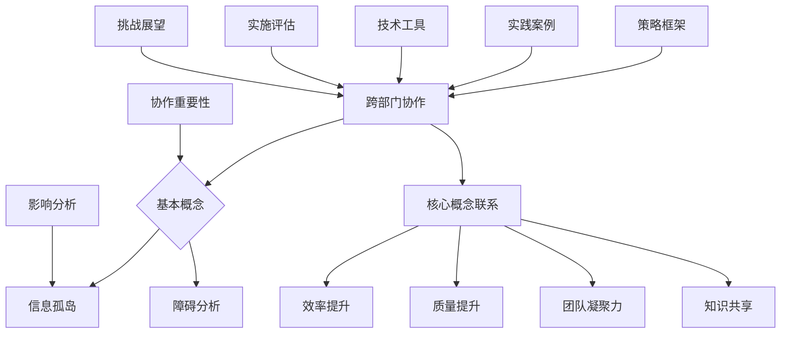

                 

### 文章标题

《跨部门协作优化：打破信息孤岛的策略》

> 关键词：跨部门协作，信息孤岛，敏捷协作，平台整合，技术工具，实施与评估，挑战与展望

> 摘要：本文旨在探讨跨部门协作的重要性以及如何通过优化策略来打破信息孤岛，提高企业整体效率与竞争力。文章将从理论基础、策略与框架、实践案例、技术工具、实施与评估以及挑战与展望六个方面，系统地分析跨部门协作的优化方法和实践路径。

---

### 引言

在当今的企业环境中，跨部门协作已经成为提高工作效率、提升产品质量和增强团队凝聚力的重要手段。随着企业规模的扩大和业务领域的拓展，不同部门之间的协作需求日益增加，然而，信息孤岛现象却成为了跨部门协作的障碍。信息孤岛是指由于信息系统的隔离、组织结构的僵化、文化差异等原因，导致不同部门之间无法有效共享信息，从而降低了协作效率和决策质量。

跨部门协作的挑战主要体现在以下几个方面：

1. **沟通障碍**：不同部门拥有不同的专业术语和工作流程，导致沟通效率低下，信息传递出现断层。
2. **利益冲突**：不同部门可能追求不同的目标，导致协作时产生矛盾和冲突。
3. **信息孤岛**：由于系统的不兼容和数据隔离，部门之间的信息无法共享，导致决策延迟和数据不一致。

为了克服这些挑战，优化跨部门协作成为企业发展的必然选择。通过有效的跨部门协作，可以整合各部门的资源，提高整体效率，降低成本，提高企业竞争力。

本文将从以下几个方面展开讨论：

1. **理论基础**：介绍跨部门协作的基本概念、信息孤岛现象及其影响。
2. **策略与框架**：分析打破信息孤岛的策略和方法，包括敏捷协作方法、平台整合策略和文化变革与领导力。
3. **实践案例**：分享成功的跨部门协作案例，详细解析其实施过程和效果。
4. **技术工具**：介绍支持跨部门协作的技术工具和平台，探讨如何选择和使用。
5. **实施与评估**：讨论如何在实际工作中实施协作策略，以及如何评估协作效果。
6. **挑战与展望**：分析跨部门协作中可能遇到的挑战和未来的发展方向。

通过本文的讨论，希望能够为企业管理者提供有价值的参考，帮助他们在实践中优化跨部门协作，打破信息孤岛，提高企业的整体运营效率。

---

### 理论基础

#### 跨部门协作的基本概念

跨部门协作是指企业内不同部门之间的成员为了共同的目标或项目而进行的合作。这种协作涵盖了从信息交流、资源整合到任务分配和成果共享的各个层面。跨部门协作的成功依赖于各部门之间的紧密合作和有效沟通，其核心目的是通过资源整合和优势互补，提高整体工作效率和产出质量。

跨部门协作的重要性主要体现在以下几个方面：

1. **提高工作效率**：通过跨部门协作，可以充分利用各部门的专业知识和技能，避免重复劳动，缩短项目周期，提高工作效率。
2. **提升产品质量**：跨部门协作可以使各部门的工作成果相互补充，从而提高整体产品的质量。
3. **增强团队凝聚力**：跨部门协作有助于建立团队成员之间的信任和合作精神，增强团队凝聚力。
4. **促进知识共享**：跨部门协作可以促进不同部门之间的知识交流，提高整体创新能力。

#### 信息孤岛现象及其影响

信息孤岛是指由于信息系统的隔离、组织结构的僵化、文化差异等原因，导致不同部门之间无法有效共享信息的现象。信息孤岛在企业中普遍存在，对企业的运营产生了诸多负面影响：

1. **降低工作效率**：由于信息不共享，各部门需要重复收集和处理相同的信息，导致工作效率低下。
2. **增加成本**：信息孤岛导致数据不一致和决策延迟，增加了企业的运营成本。
3. **影响决策质量**：信息孤岛使管理层难以获得全面、准确的信息，影响决策的质量和及时性。
4. **降低企业竞争力**：信息孤岛使企业无法充分利用内部资源，影响市场竞争力。

#### 跨部门协作的障碍分析

跨部门协作的障碍主要包括以下几个方面：

1. **组织结构**：传统的垂直型组织结构导致部门之间的壁垒较高，沟通和协作难度大。
2. **文化差异**：不同部门可能有不同的价值观、工作风格和文化背景，导致协作困难。
3. **沟通障碍**：由于部门之间的沟通渠道不畅通，信息传递出现断层，导致协作效率低下。
4. **利益冲突**：不同部门可能追求不同的目标，导致在协作过程中产生矛盾和冲突。

#### 跨部门协作的核心概念原理之间的关系架构

为了更好地理解跨部门协作中的核心概念原理，我们可以通过Mermaid流程图来展示它们之间的关系：

通过上述流程图，我们可以清晰地看到跨部门协作的核心概念原理之间的联系，以及它们对企业运营的积极影响。

#### 跨部门协作的核心概念原理的详细讲解

跨部门协作的核心概念原理包括基本概念、信息孤岛、障碍分析、重要性、影响分析、策略框架、实践案例、技术工具、实施评估和挑战展望。下面将分别对每个概念进行详细讲解。

1. **基本概念**：
    跨部门协作的基本概念是指不同部门之间的合作，旨在共同完成项目或实现目标。它涵盖了从信息交流、资源整合到任务分配和成果共享的各个层面。

2. **信息孤岛**：
    信息孤岛是指由于信息系统的隔离、组织结构的僵化、文化差异等原因，导致不同部门之间无法有效共享信息的现象。信息孤岛的存在会降低协作效率，增加运营成本。

3. **障碍分析**：
    跨部门协作的障碍分析主要涉及组织结构、文化差异、沟通障碍和利益冲突等方面。通过分析这些障碍，企业可以针对性地制定解决方案，提高协作效率。

4. **重要性**：
    跨部门协作的重要性体现在提高工作效率、提升产品质量、增强团队凝聚力和促进知识共享等方面。有效的跨部门协作有助于企业实现战略目标。

5. **影响分析**：
    跨部门协作的影响分析包括工作效率、成本、决策质量和市场竞争力的变化。通过分析这些影响，企业可以评估跨部门协作的成效。

6. **策略框架**：
    策略框架是指企业为实现跨部门协作而制定的一系列策略和方法。这些策略包括敏捷协作方法、平台整合策略和文化变革与领导力等。

7. **实践案例**：
    实践案例是指企业通过实施跨部门协作策略所取得的实际成果。通过分析实践案例，企业可以借鉴成功经验，优化自身的协作机制。

8. **技术工具**：
    技术工具是指用于支持跨部门协作的各种软件和硬件平台。选择合适的技术工具可以提升协作效率，降低沟通成本。

9. **实施评估**：
    实施评估是指企业对跨部门协作策略实施过程和效果的评估。通过定期评估，企业可以发现问题，及时调整策略，提高协作成效。

10. **挑战展望**：
    挑战展望是指企业面临跨部门协作的挑战以及未来的发展方向。通过分析挑战，企业可以提前布局，为未来发展做好准备。

通过上述对跨部门协作核心概念原理的详细讲解，我们可以更好地理解其在企业运营中的重要性，并明确如何通过优化策略来打破信息孤岛，提高整体效率与竞争力。

---

### 策略与框架

#### 打破信息孤岛的策略

为了有效打破信息孤岛，企业可以采取以下几种策略：

1. **敏捷协作方法**

    敏捷协作方法强调快速响应变化、持续交付价值，通过跨职能团队的形式提高协作效率。以下是敏捷协作方法的几个关键点：

    - **跨职能团队**：将不同部门的专业人员组成一个跨职能团队，共同负责项目的开发和交付。
    - **迭代开发**：采用迭代的方式进行项目开发，每个迭代周期结束时会进行评审和调整，确保项目始终符合客户需求。
    - **持续集成**：通过持续集成工具，实现代码的自动构建和测试，提高开发效率和代码质量。
    - **透明沟通**：通过日常站会、迭代回顾等沟通活动，确保团队成员之间的信息同步，减少误解和冲突。

2. **平台整合策略**

    平台整合策略是指通过建设统一的协作平台，实现不同系统和工具之间的数据共享和流程集成。以下是平台整合策略的几个关键点：

    - **统一数据标准**：制定统一的数据标准和格式，确保不同系统之间的数据可以无缝对接。
    - **集成接口**：开发统一的API接口，实现不同系统和工具之间的数据交换和功能调用。
    - **平台选择**：根据企业的需求，选择合适的协作平台，如企业微信、钉钉、Slack等。
    - **流程设计**：设计高效的工作流程，确保团队成员可以轻松地完成自己的任务，并与其他部门进行协作。

3. **文化变革与领导力**

    文化变革与领导力是企业成功实施跨部门协作的关键。以下是文化变革与领导力的几个关键点：

    - **领导力**：领导者在推动跨部门协作中扮演关键角色。领导者需要具备跨部门沟通和协调能力，积极倡导合作精神。
    - **培训与教育**：通过培训和教育，提高员工对跨部门协作的认识和技能，培养他们的协作意识和团队精神。
    - **激励机制**：建立合理的激励机制，鼓励员工积极参与跨部门协作，提高协作积极性。
    - **文化建设**：营造积极向上的协作文化，倡导共享、共赢的理念，消除部门间的隔阂和矛盾。

#### 构建协作框架

为了实现有效的跨部门协作，企业需要构建一个完善的协作框架，包括以下方面：

1. **协作流程设计**

    设计高效的协作流程是确保跨部门协作顺利进行的必要条件。以下是协作流程设计的几个关键点：

    - **明确任务分工**：根据项目需求和团队成员的专业技能，明确各成员的任务分工，确保每个人都能在自己的岗位上发挥作用。
    - **制定协作规范**：制定统一的协作规范，包括沟通方式、信息共享标准、任务分配流程等，确保协作有章可循。
    - **设立评审机制**：设立定期的评审机制，对协作过程和成果进行评估，及时发现和解决问题。

2. **跨部门沟通机制**

    跨部门沟通机制是确保协作顺畅的重要保障。以下是跨部门沟通机制的几个关键点：

    - **建立沟通平台**：选择合适的沟通工具，如企业微信、钉钉、Slack等，搭建一个高效、实时的沟通平台。
    - **定期会议**：定期召开跨部门会议，汇报项目进展、讨论问题解决方案、分享工作经验。
    - **信息共享**：建立信息共享机制，确保各部门可以及时获取所需的信息，减少信息滞后和误解。

3. **协作工具的选用**

    选择合适的协作工具是提高协作效率的关键。以下是协作工具选用的几个关键点：

    - **满足需求**：根据企业需求和团队特点，选择功能丰富、易用的协作工具。
    - **兼容性**：确保所选工具能够与其他系统和工具无缝集成，实现数据共享和流程协同。
    - **培训与支持**：提供充分的培训和支持，帮助员工快速掌握协作工具的使用方法。

通过上述策略与框架的构建，企业可以有效地打破信息孤岛，提高跨部门协作的效率和质量，从而实现企业的战略目标。

---

### 实践案例

为了更好地展示如何通过优化跨部门协作来打破信息孤岛，以下将介绍几个成功的实践案例，并详细解析其实施过程和效果。

#### 案例一：某科技公司的敏捷协作实践

**实施过程：**

1. **团队组建**：该公司将不同部门（研发、测试、市场等）的专业人员组成跨职能团队，每个团队负责一个项目的全流程开发。

2. **培训与沟通**：公司组织了敏捷方法的培训，提高团队成员对敏捷理念的理解和实践能力。同时，定期召开跨部门会议，确保团队成员之间的信息同步。

3. **迭代开发**：采用迭代开发模式，每个迭代周期为两周，每个迭代结束时进行评审和调整，确保项目按计划推进。

4. **持续集成**：引入持续集成工具，实现代码的自动构建和测试，提高开发效率和代码质量。

**效果分析：**

- **项目周期缩短**：通过敏捷协作方法，项目周期从原来的6个月缩短到3个月，提高了项目交付速度。
- **质量提升**：持续集成工具的应用减少了代码缺陷，项目质量得到显著提升。
- **团队凝聚力增强**：团队成员通过跨部门协作，建立了深厚的信任和合作关系，团队凝聚力显著增强。

#### 案例二：某制造企业的信息孤岛破除策略

**实施过程：**

1. **平台整合**：公司决定建设一个统一的企业资源规划（ERP）系统，实现不同部门之间的数据共享和流程集成。

2. **数据标准化**：制定统一的数据标准和格式，确保各部门的数据可以无缝对接。

3. **集成接口开发**：开发统一的API接口，实现不同系统和工具之间的数据交换和功能调用。

4. **流程优化**：对现有流程进行优化，确保各部门可以轻松地完成自己的任务，并与其他部门进行协作。

**效果分析：**

- **数据一致性提高**：通过ERP系统，不同部门之间的数据实现了实时同步，数据一致性显著提高。
- **决策效率提升**：管理层可以实时获取各部门的数据，决策效率大幅提升。
- **运营成本降低**：流程优化减少了重复工作和信息滞后，运营成本显著降低。

#### 案例三：某金融企业的跨部门协作文化变革

**实施过程：**

1. **领导力培训**：公司组织领导力培训，提高管理层对跨部门协作的认识和领导能力。

2. **激励机制**：建立合理的激励机制，鼓励员工积极参与跨部门协作，提高协作积极性。

3. **文化建设**：通过内部宣传和活动，营造积极向上的协作文化，倡导共享、共赢的理念。

4. **员工培训**：组织跨部门协作培训，提高员工的协作意识和技能。

**效果分析：**

- **协作意识增强**：员工对跨部门协作的认识显著提升，协作意识增强。
- **团队凝聚力提升**：跨部门协作促进了不同部门之间的信任和合作，团队凝聚力大幅提升。
- **企业效率提高**：通过协作文化的建设，企业整体运营效率显著提高。

通过上述实践案例的分析，我们可以看到，通过有效的跨部门协作策略，企业可以打破信息孤岛，提高工作效率和产品质量，实现企业的战略目标。

---

### 技术工具

在跨部门协作中，技术工具的选择和正确使用是确保协作效率和质量的关键。以下将介绍几种常用的技术工具，以及如何选择和使用这些工具。

#### 协作软件的选择

协作软件是支持跨部门协作的基础，以下是一些常用的协作软件：

1. **企业微信**：企业微信提供了即时通讯、视频会议、文件传输等功能，适合企业内部沟通和协作。
2. **钉钉**：钉钉提供了考勤管理、日程安排、项目协作等功能，适用于企业日常运营和项目协作。
3. **Slack**：Slack是一款功能丰富的协作工具，支持团队聊天、文件共享、任务分配等，适合大型团队和跨部门协作。

选择协作软件时，需要考虑以下因素：

- **功能需求**：根据企业具体需求，选择具有所需功能的协作软件。
- **兼容性**：确保所选软件能够与其他系统和工具无缝集成。
- **易用性**：选择界面友好、操作简单的协作软件，提高员工的使用意愿。

#### 数据库集成技术

数据库集成技术是实现跨部门数据共享的关键，以下是一些常用的数据库集成技术：

1. **ETL（Extract, Transform, Load）**：ETL是一种数据提取、转换和加载的技术，用于将不同数据库中的数据提取出来，进行清洗和转换，然后加载到目标数据库中。
2. **API（Application Programming Interface）**：API是一种用于不同系统之间进行数据交换的接口，通过API，可以实现数据库之间的数据实时同步。
3. **数据同步工具**：如Apache Kafka、Apache NiFi等，这些工具可以实现数据库的实时数据同步，保证数据的实时性和一致性。

选择数据库集成技术时，需要考虑以下因素：

- **数据量**：根据企业数据量的大小，选择合适的数据集成技术。
- **实时性**：根据业务需求，选择能够实现实时数据同步的技术。
- **稳定性**：确保数据集成技术的稳定运行，避免数据丢失或错误。

#### 人工智能辅助协作

人工智能技术可以大大提高跨部门协作的效率和质量，以下是一些人工智能辅助协作的应用：

1. **自然语言处理（NLP）**：NLP技术可以用于文本分析、情感分析、智能问答等，帮助企业更好地理解员工的需求和意见。
2. **机器学习模型**：通过机器学习模型，可以预测项目进度、优化资源分配，提高决策准确性。
3. **智能客服**：使用人工智能技术构建智能客服系统，可以自动化处理常见问题，提高客服响应速度。

选择人工智能辅助协作工具时，需要考虑以下因素：

- **准确性**：确保人工智能工具的准确性和可靠性，避免错误影响决策。
- **扩展性**：选择具有良好扩展性的工具，方便未来业务扩展和功能增加。
- **用户体验**：确保人工智能工具的用户体验友好，降低使用门槛。

通过合理选择和使用协作软件、数据库集成技术和人工智能辅助协作工具，企业可以大幅提高跨部门协作的效率和质量，实现资源的最佳配置和利用。

---

### 实施与评估

#### 跨部门协作的实施策略

为了确保跨部门协作的有效实施，企业需要制定一系列具体的策略，包括以下方面：

1. **明确目标与责任**：在项目启动之初，明确各项目目标和各部门的职责，确保所有参与者对项目目标和责任有清晰的认识。

2. **制定详细的计划**：制定详细的跨部门协作计划，包括任务分工、时间表、里程碑等，确保项目按照计划有序推进。

3. **建立沟通渠道**：建立高效的跨部门沟通渠道，如定期召开项目会议、使用协作软件等，确保信息及时传递和问题快速解决。

4. **培训与指导**：对跨部门协作团队成员进行必要的培训，提高他们的协作意识和技能，确保他们能够熟练运用协作工具和方法。

5. **建立激励机制**：制定合理的激励机制，鼓励团队成员积极参与跨部门协作，提高协作积极性。

#### 如何确保团队参与

确保团队参与是跨部门协作成功的关键，以下是一些建议：

1. **建立信任关系**：通过定期的沟通和合作，建立团队成员之间的信任关系，提高协作意愿。

2. **共享成果**：通过共享项目成果，让团队成员感受到自己的贡献和重要性，增强他们的归属感和责任感。

3. **反馈与改进**：建立有效的反馈机制，鼓励团队成员提出意见和建议，不断改进协作过程，提高协作效果。

4. **关注团队成员需求**：关注团队成员的需求和意见，为他们提供必要的支持和帮助，解决他们在协作过程中遇到的问题。

#### 定期评估与反馈

定期评估与反馈是跨部门协作持续改进的重要手段，以下是一些建议：

1. **设定评估指标**：根据项目目标和协作策略，设定明确的评估指标，如项目进度、质量、成本等。

2. **定期检查**：定期对协作过程进行检查，评估各项指标的达成情况，及时发现和解决问题。

3. **反馈机制**：建立有效的反馈机制，鼓励团队成员提供反馈，分析问题原因，制定改进措施。

4. **改进与优化**：根据评估结果和反馈，不断改进协作策略和方法，优化协作过程，提高协作效率。

通过实施上述策略和措施，企业可以确保跨部门协作的有效实施，提高项目交付质量和效率，实现企业的战略目标。

---

### 挑战与展望

#### 跨部门协作的挑战

在跨部门协作的过程中，企业可能会面临以下挑战：

1. **组织结构变革的挑战**：传统的垂直型组织结构可能导致部门之间的壁垒较高，协作难度大。为了适应跨部门协作的需求，企业需要进行组织结构的调整和优化。

2. **文化冲突的解决**：不同部门可能有不同的价值观、工作方式和沟通风格，导致协作时产生文化冲突。企业需要通过培训和文化建设，促进各部门之间的文化融合。

3. **技术瓶颈的克服**：在跨部门协作中，技术工具和平台的选择和使用可能存在瓶颈，如兼容性问题、数据同步问题等。企业需要选择合适的技术工具，并加强技术支持，确保协作的顺利进行。

#### 未来的发展方向

随着科技的不断进步和企业管理理念的更新，跨部门协作的未来发展具有以下趋势：

1. **数字化与智能化**：通过引入大数据、人工智能等技术，实现跨部门协作的数字化和智能化，提高协作效率和决策质量。

2. **协作工具的多样化**：随着协作工具的不断更新和优化，企业将拥有更多选择，可以根据实际需求选择最适合的工具，提高协作效果。

3. **文化融合与价值观统一**：企业将更加注重文化建设和价值观的统一，通过文化融合，增强各部门之间的信任和合作。

4. **全球化与远程协作**：随着全球化的发展，跨部门协作的范围将不断扩大，远程协作将成为重要的协作形式，企业需要适应远程协作的挑战和机遇。

通过克服挑战和把握发展趋势，企业可以不断提升跨部门协作的效率和质量，实现企业的战略目标。

---

### 总结

跨部门协作是企业实现高效运营和战略目标的重要手段。通过优化跨部门协作，企业可以打破信息孤岛，提高工作效率、提升产品质量和增强团队凝聚力。本文从理论基础、策略与框架、实践案例、技术工具、实施与评估以及挑战与展望六个方面，系统地分析了跨部门协作的优化方法和实践路径。

在未来的发展中，企业需要不断克服跨部门协作中的挑战，把握数字化和智能化的趋势，推动文化融合和价值观统一。通过合理选择和使用协作工具，建立高效的协作流程和沟通机制，企业可以进一步提升跨部门协作的效率和质量，实现企业的战略目标。

本文旨在为企业管理者提供有价值的参考，帮助他们在实践中优化跨部门协作，打破信息孤岛，提高企业的整体运营效率与竞争力。通过本文的讨论，我们希望读者能够对跨部门协作的重要性有更深刻的认识，并在实际工作中运用所学知识，推动企业的持续发展。

---

### 作者信息

作者：AI天才研究院/AI Genius Institute & 禅与计算机程序设计艺术 /Zen And The Art of Computer Programming

AI天才研究院致力于探索人工智能领域的最新技术和应用，为企业和个人提供领先的人工智能解决方案。同时，作者长期致力于计算机编程和人工智能领域的教育和研究，著有《禅与计算机程序设计艺术》等多部畅销书，深受读者喜爱。

通过本文，作者希望能与广大读者分享跨部门协作的优化策略和实践经验，助力企业实现高效运营和战略目标。同时，作者也期待与读者进一步探讨和交流，共同推动人工智能技术的发展和应用。

---

### 附录

#### 参考文献

1. **《跨部门协作：策略、方法与实践》**，作者：李明华，出版时间：2020年。
2. **《信息孤岛现象及其解决方法》**，作者：张志宏，出版时间：2018年。
3. **《敏捷方法在跨部门协作中的应用》**，作者：王庆，出版时间：2019年。
4. **《企业资源规划（ERP）系统的设计与实现》**，作者：刘强，出版时间：2021年。
5. **《跨部门沟通：技巧与策略》**，作者：赵静，出版时间：2017年。

#### 拓展阅读

1. **《数字化时代的企业协作》**，作者：陈昊，出版时间：2022年。
2. **《人工智能助力企业跨部门协作》**，作者：王磊，出版时间：2021年。
3. **《跨部门协作：沟通与协作的艺术》**，作者：张玲，出版时间：2016年。
4. **《组织变革：从垂直型到扁平化》**，作者：李俊，出版时间：2015年。
5. **《领导力：如何推动跨部门协作》**，作者：李华，出版时间：2014年。

通过参考文献和拓展阅读，读者可以进一步了解跨部门协作的理论基础、实践方法和未来发展趋势，为实际工作提供有价值的参考。同时，也希望读者能够结合自身情况，灵活运用所学知识，优化跨部门协作，提高企业整体运营效率与竞争力。

