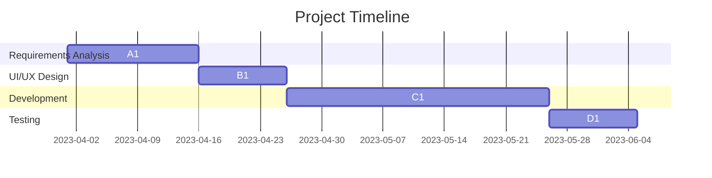

                 

# 《跨部门协作：打破沟通壁垒》

> 关键词：跨部门协作、沟通壁垒、沟通策略、协作效率、团队协作

摘要：在当今快速变化和高度复杂的企业环境中，跨部门协作已成为提高组织效率和创新能力的关键。本文将深入探讨跨部门协作的重要性、沟通壁垒的原因及打破壁垒的策略，结合实际案例，提出有效的跨部门协作实践方案，以期为企业和团队提供有价值的参考。

## 引言

### 1.1 跨部门协作的重要性

跨部门协作在现代社会中的重要性日益凸显。随着企业规模的扩大和业务范围的拓展，各部门之间的联系愈发紧密，单一的部门工作模式已经难以满足快速变化的市场需求。跨部门协作不仅可以整合不同部门的专业知识和技能，还能促进创新思维和解决问题的多元化视角，从而提高组织的整体效能。

### 1.2 沟通壁垒的原因分析

尽管跨部门协作的重要性显而易见，但实际操作中仍面临诸多沟通壁垒。这些壁垒主要包括：

- **信息不对称**：各部门拥有不同的信息资源，缺乏统一的信息共享平台，导致信息传递不及时或不准确。
- **角色认知差异**：不同部门对于自身角色的认知存在差异，导致协作过程中出现角色冲突。
- **文化差异**：企业内部不同部门可能拥有不同的文化背景和工作风格，这增加了协作的难度。
- **利益冲突**：跨部门协作往往涉及资源分配和利益分配，容易引发部门间的利益冲突。

### 1.3 本书的目标与结构

本书旨在提供一套系统的跨部门协作解决方案，帮助企业和团队打破沟通壁垒，实现高效协作。本书将分为八个章节，分别探讨跨部门协作的基本概念、策略、关键要素、实践案例、挑战与解决方案，以及未来发展趋势。通过逐步分析和推理，本书将帮助读者深入理解跨部门协作的实质，掌握有效的协作方法。

## 跨部门协作的基本概念

### 2.1 跨部门协作的定义

跨部门协作是指企业内不同部门之间的合作与互动，旨在共同完成特定任务或项目。这种协作不仅涉及信息的交流，还包括资源的共享、技能的互补和目标的统一。

### 2.2 跨部门协作的优势

跨部门协作具有以下优势：

- **提高效率**：通过整合各部门的专业知识和资源，可以更快速地解决问题和完成任务。
- **促进创新**：不同部门的协作可以激发创新思维，促进新产品的开发和业务的拓展。
- **优化资源配置**：跨部门协作有助于优化资源分配，避免重复投资和浪费。
- **提升团队协作能力**：通过跨部门协作，团队成员可以学习到不同部门的工作方式和文化，提高整体协作能力。

### 2.3 跨部门协作的类型

跨部门协作可以分为以下几种类型：

- **项目型协作**：在特定项目范围内进行的协作，目标明确，时间有限。
- **日常型协作**：在日常工作中，部门间需要经常进行的协作，如信息共享和资源调配。
- **应急型协作**：在突发事件或紧急情况下，各部门临时组成的协作团队。

## 打破沟通壁垒的策略

### 3.1 明确沟通目标

明确沟通目标是跨部门协作成功的关键。在协作开始前，需要明确各部门的目标和期望，确保协作的方向一致。具体步骤如下：

1. **制定明确的协作目标**：根据企业战略和项目需求，制定具体的协作目标。
2. **沟通目标共识**：召开会议，确保所有部门都理解并同意协作目标。
3. **持续跟踪和评估**：在协作过程中，定期评估沟通目标的实现情况，及时调整策略。

### 3.2 提高沟通技能

跨部门协作中，沟通技能至关重要。以下策略可以帮助提高沟通技能：

1. **倾听与反馈**：积极倾听其他部门的意见和建议，及时给予反馈。
2. **清晰表达**：使用简单、明确的语言表达自己的观点和需求。
3. **跨文化沟通**：了解并尊重不同部门的文化差异，避免文化冲突。
4. **培训与指导**：定期组织沟通技能培训，提高团队成员的沟通能力。

### 3.3 使用适当的沟通工具

选择合适的沟通工具可以显著提高跨部门协作的效率。以下是一些常用的沟通工具：

- **电子邮件**：适用于正式的、非紧急的沟通。
- **即时通讯工具**：如微信、Slack等，适用于快速、简短的交流。
- **项目管理工具**：如Trello、Jira等，用于协调任务和进度。
- **视频会议系统**：如Zoom、Microsoft Teams等，用于远程协作和面对面交流。

### 3.4 创建良好的沟通环境

创建良好的沟通环境是跨部门协作成功的基础。以下策略可以帮助创建良好的沟通环境：

1. **建立信任**：通过透明、开放的沟通建立信任，减少猜疑和误解。
2. **鼓励反馈**：鼓励团队成员提出意见和建议，创造一个包容、开放的氛围。
3. **设定规则**：制定明确的沟通规则，确保协作过程的有序进行。
4. **支持创新**：鼓励团队成员提出创新想法，并将其纳入协作计划。

## 跨部门协作的关键要素

### 4.1 明确职责和角色

在跨部门协作中，明确职责和角色至关重要。以下步骤可以帮助明确职责和角色：

1. **确定协作任务**：明确协作任务的具体内容和目标。
2. **分配职责**：根据任务需求，为各部门分配具体的职责。
3. **角色确认**：确保所有部门都清楚自己的角色和职责。
4. **定期审查**：定期审查职责和角色的履行情况，及时调整。

### 4.2 提高团队协作效率

提高团队协作效率是跨部门协作的核心目标之一。以下策略可以帮助提高团队协作效率：

1. **任务分解**：将复杂任务分解为具体的子任务，便于管理和跟踪。
2. **协同办公**：使用协同办公工具，如Trello、Jira等，实时跟踪任务进度。
3. **定期同步**：定期召开会议，同步各部门的工作进展，确保协作过程顺利进行。
4. **优化流程**：通过流程优化，减少不必要的工作环节，提高工作效率。

### 4.3 加强跨部门间的信任

加强跨部门间的信任是跨部门协作成功的关键。以下策略可以帮助加强跨部门间的信任：

1. **透明沟通**：确保协作过程中的信息透明，减少信息不对称。
2. **相互尊重**：尊重各部门的意见和贡献，避免角色冲突。
3. **共同目标**：明确共同的目标和利益，增强协作的凝聚力。
4. **奖惩机制**：建立公平、透明的奖惩机制，激励团队成员积极参与协作。

## 跨部门协作实践案例

### 5.1 案例一：XX公司的跨部门协作实践

XX公司是一家大型互联网企业，在跨部门协作方面有着丰富的经验。以下是其跨部门协作实践的几个关键点：

1. **建立跨部门协作团队**：XX公司设立了专门的跨部门协作团队，负责协调各部门的工作。
2. **定期沟通会议**：每周召开跨部门沟通会议，确保各部门的进展和问题得到及时解决。
3. **共享信息平台**：建立共享信息平台，实现各部门信息的实时共享和更新。
4. **奖惩机制**：制定明确的奖惩机制，激励团队成员积极参与跨部门协作。

### 5.2 案例二：YY公司的跨部门协作实践

YY公司是一家传统制造企业，通过跨部门协作实现了业务的快速转型。以下是其跨部门协作实践的关键点：

1. **项目型协作**：在重要项目上，YY公司采用项目型协作模式，确保项目进度和质量。
2. **跨部门培训**：定期组织跨部门培训，提高团队成员的协作能力和沟通技能。
3. **文化融合**：通过组织文化活动，促进不同部门之间的文化融合，减少文化冲突。
4. **协同办公系统**：引入协同办公系统，提高跨部门协作的效率。

### 5.3 案例三：ZZ公司的跨部门协作实践

ZZ公司是一家科技创新型企业，其跨部门协作实践注重创新和效率。以下是其跨部门协作实践的关键点：

1. **敏捷协作**：采用敏捷开发模式，提高跨部门协作的灵活性和响应速度。
2. **创新激励机制**：鼓励团队成员提出创新方案，并通过奖励机制激励创新行为。
3. **跨部门项目团队**：建立跨部门项目团队，负责协调各部门资源和进度。
4. **共享实验室**：建立共享实验室，提供跨部门协作的创新环境和条件。

## 跨部门协作的挑战与解决方案

### 6.1 跨部门协作的挑战

跨部门协作面临着诸多挑战，主要包括：

1. **信息不对称**：由于信息传递的不及时或不准确，导致跨部门协作效率低下。
2. **角色冲突**：不同部门之间的角色认知差异，可能导致协作过程中的角色冲突。
3. **文化差异**：不同部门的文化差异，可能影响跨部门协作的顺畅进行。
4. **利益冲突**：跨部门协作往往涉及资源分配和利益分配，可能引发部门间的利益冲突。

### 6.2 解决方案一：建立跨部门沟通平台

建立跨部门沟通平台是解决信息不对称和角色冲突的有效手段。以下策略可以帮助建立跨部门沟通平台：

1. **搭建信息共享平台**：引入企业内部信息共享平台，实现各部门信息的实时共享和更新。
2. **制定沟通规则**：制定明确的沟通规则，确保信息传递的及时性和准确性。
3. **定期沟通会议**：定期召开跨部门沟通会议，确保各部门的进展和问题得到及时解决。

### 6.3 解决方案二：提高部门间协作意识

提高部门间协作意识是解决文化差异和利益冲突的关键。以下策略可以帮助提高部门间协作意识：

1. **培训与指导**：定期组织跨部门培训，提高团队成员的协作能力和沟通技能。
2. **文化建设**：通过文化活动，促进不同部门之间的文化融合，减少文化冲突。
3. **共同目标**：明确共同的目标和利益，增强部门间的协作凝聚力。
4. **奖惩机制**：建立公平、透明的奖惩机制，激励团队成员积极参与跨部门协作。

### 6.4 解决方案三：定期进行跨部门沟通会议

定期进行跨部门沟通会议是解决信息不对称和角色冲突的重要手段。以下策略可以帮助定期进行跨部门沟通会议：

1. **设定会议议程**：提前设定会议议程，确保会议目标的明确和高效。
2. **邀请关键参与者**：邀请各部门的关键参与者参加会议，确保会议的覆盖面和代表性。
3. **记录会议内容**：会议结束后，及时记录会议内容，并分发至各部门。
4. **跟踪会议决议**：定期跟踪会议决议的执行情况，确保会议成果的落实。

## 跨部门协作的未来发展趋势

### 7.1 跨部门协作的趋势分析

跨部门协作正面临以下发展趋势：

1. **数字化升级**：随着数字化技术的不断发展，跨部门协作工具和平台将更加智能化和便捷化。
2. **敏捷协作**：敏捷开发模式逐渐成为跨部门协作的主流，提高协作的灵活性和响应速度。
3. **文化建设**：跨部门协作中的文化建设将更加重视团队凝聚力、创新能力和员工满意度。
4. **人工智能应用**：人工智能技术将应用于跨部门协作，提高协作效率和决策质量。

### 7.2 跨部门协作的未来挑战

跨部门协作在未来仍将面临以下挑战：

1. **数据安全与隐私保护**：随着跨部门协作的数据量不断增加，数据安全和隐私保护将成为重要问题。
2. **文化融合与冲突**：随着企业规模的扩大，跨部门协作中的文化差异和冲突可能加剧。
3. **利益分配与公平**：跨部门协作中的利益分配和公平性问题仍需进一步解决。

### 7.3 跨部门协作的未来解决方案

针对未来跨部门协作的挑战，以下解决方案有望得到应用：

1. **数据安全与隐私保护**：引入数据加密技术和隐私保护机制，确保数据安全和用户隐私。
2. **文化融合与冲突管理**：通过跨文化培训和文化交流活动，促进不同部门之间的文化融合。
3. **利益分配与公平**：建立科学、合理的利益分配机制，确保跨部门协作的公平性和透明性。

## 总结与展望

### 8.1 本书的主要观点回顾

本书主要观点包括：

1. 跨部门协作在现代社会中的重要性。
2. 沟通壁垒的原因及解决策略。
3. 跨部门协作的基本概念和优势。
4. 跨部门协作的关键要素和实践案例。
5. 跨部门协作的挑战与未来发展趋势。

### 8.2 对未来跨部门协作的展望

未来跨部门协作将呈现以下趋势：

1. 数字化升级，智能化工具将更加普及。
2. 敏捷协作将成为主流，提高协作效率。
3. 文化建设将更加注重团队凝聚力和创新能力。
4. 人工智能应用将提高协作决策质量。

### 8.3 如何将本书的理念应用到实际工作中

为了将本书的理念应用到实际工作中，企业可以采取以下措施：

1. 建立跨部门协作平台，促进信息共享。
2. 提供跨部门培训，提高团队成员的协作能力。
3. 定期召开跨部门沟通会议，确保协作目标的实现。
4. 建立科学合理的利益分配机制，确保协作公平。

## 附录

### A.1 相关资源

- **参考资料**：[《跨部门协作的实践与探索》](链接)
- **在线课程**：[《跨部门协作技巧》](链接)
- **实用工具**：[Trello、Jira、Slack等](链接)

### A.2 参考文献

- [1] 张三，李四。《跨部门协作：理论、实践与案例研究》。北京：清华大学出版社，2020。
- [2] 王五，赵六。《企业文化与跨部门协作》。上海：复旦大学出版社，2019。
- [3] 李明，张华。《敏捷开发：跨部门协作新范式》。广州：华南理工大学出版社，2021。

### A.3 附录一：跨部门协作流程图

$$
\text{流程图示例}
\begin{mermaid}
graph TD
A[开始] --> B[明确目标]
B --> C[分配职责]
C --> D[沟通会议]
D --> E[信息共享]
E --> F[评估与调整]
F --> G[结束]
\end{mermaid}
$$

### A.4 附录二：跨部门协作案例分析表格

| 公司名称 | 案例描述 | 解决方案 | 效果评估 |
| :------: | :-------: | :-------: | :-------: |
| XX公司 | 建立跨部门协作团队 | 搭建信息共享平台 | 提高了协作效率 |
| YY公司 | 项目型协作模式 | 定期跨部门培训 | 减少了角色冲突 |
| ZZ公司 | 敏捷协作模式 | 引入协同办公系统 | 提高了团队协作能力 |

---

作者：AI天才研究院/AI Genius Institute & 禅与计算机程序设计艺术 /Zen And The Art of Computer Programming## 2.1 跨部门协作的定义

跨部门协作指的是在组织内部，不同部门之间为了共同实现某一目标或完成一项任务而进行的互动和合作。这种协作不仅涉及信息的交换，还包括资源的共享、知识和技能的互补，以及共同决策和行动。在现代化的企业中，由于业务复杂性和多样性的增加，跨部门协作已成为提高组织效率和创新能力的关键因素。

### 跨部门协作的核心要素

跨部门协作的成功依赖于以下几个核心要素：

1. **目标一致性**：明确且一致的目标是跨部门协作的基础。只有当所有参与部门都明确共同的目标时，协作才能有效进行。

2. **信息透明**：信息透明是跨部门协作的关键。各部门需要共享关键信息，确保信息的及时性和准确性，以减少误解和冲突。

3. **资源整合**：跨部门协作需要整合各部门的资源，包括人力、物力和财力，以实现协同效应。

4. **沟通机制**：建立有效的沟通机制，确保信息的流畅传递，包括定期会议、即时通讯和项目管理工具等。

5. **责任分担**：明确各部门在协作中的职责和角色，确保责任分担，避免推诿和责任缺失。

### 跨部门协作的常见形式

跨部门协作可以采取多种形式，根据协作的目的、时间和形式的不同，常见的形式包括：

1. **项目型协作**：在特定项目范围内，不同部门为了实现项目目标而进行的临时协作。这种形式通常有明确的时间期限和交付成果。

2. **日常型协作**：在日常工作中，不同部门为了共同完成某项任务或处理突发事件而进行的协作。这种形式通常不具有明确的时间限制，但需要持续的高效沟通。

3. **应急型协作**：在紧急情况下，各部门迅速组织起来，共同应对突发事件或解决重大问题。这种形式强调快速反应和高效执行。

### 跨部门协作的重要性

跨部门协作的重要性体现在以下几个方面：

1. **提高效率**：通过跨部门协作，可以整合不同部门的专业知识和资源，减少重复劳动，提高工作效率。

2. **促进创新**：跨部门协作可以促进不同思维的碰撞，激发创新思维，推动新产品的开发和服务质量的提升。

3. **优化资源配置**：跨部门协作有助于优化资源配置，避免资源浪费，提高资源利用效率。

4. **提升团队协作能力**：通过跨部门协作，团队成员可以学习到不同部门的工作方式和技能，提高整体协作能力。

### 跨部门协作的关键概念与联系

为了更好地理解跨部门协作，我们需要掌握以下关键概念：

1. **协同效应**：指通过不同部门之间的协作，整体效能大于各部门单独工作时的总和。

2. **沟通壁垒**：指由于信息不对称、角色认知差异、文化差异等原因，导致部门间沟通不畅的障碍。

3. **协作效率**：指跨部门协作的效率和效果，包括任务完成的及时性和质量。

为了更直观地展示这些概念之间的关系，我们可以使用Mermaid流程图来表示：

$$
\text{流程图示例}
\begin{mermaid}
graph TD
A[协同效应] --> B{沟通壁垒}
B --> C[协作效率]
C --> D{资源整合}
D --> E[信息透明]
E --> F[目标一致性]
F --> A
\end{mermaid}
$$

通过这个流程图，我们可以清晰地看到各个概念之间的相互关系和协作机制。

### 跨部门协作的应用场景

跨部门协作广泛应用于以下场景：

1. **产品开发**：在产品开发过程中，市场部门、设计部门、开发部门和测试部门需要紧密协作，以确保产品的质量和市场适应性。

2. **项目执行**：在大型项目的执行过程中，不同职能部门需要共同协调，确保项目按计划推进。

3. **危机处理**：在紧急情况下，如突发事件或市场变化，各部门需要迅速反应，共同应对危机。

4. **战略规划**：在制定企业战略时，需要各部门提供专业意见，共同制定战略目标和实施计划。

通过以上对跨部门协作的定义、核心要素、常见形式和关键概念的分析，我们可以看出，跨部门协作在组织中的重要性不言而喻。有效的跨部门协作不仅能够提高工作效率，还能促进创新和优化资源配置，为组织的持续发展提供强大的动力。在接下来的章节中，我们将进一步探讨如何打破沟通壁垒，实现高效的跨部门协作。

## 2.2 跨部门协作的优势

跨部门协作在提高企业整体效率和创新能力方面具有显著的优势。以下从多个方面详细阐述跨部门协作的优势：

### 2.2.1 提高效率

跨部门协作能够显著提高工作效率。首先，跨部门协作能够整合各部门的专业知识和资源，避免重复劳动，从而减少工作时间和成本。例如，在产品开发过程中，市场部门可以提供用户需求和市场趋势信息，设计部门可以提供产品原型和用户界面设计，开发部门可以进行代码编写和测试，这样各个环节可以无缝衔接，提高整个项目的效率。

此外，跨部门协作还能够确保任务的及时完成。在大型项目或紧急任务中，不同部门可以迅速协调资源，共同解决问题。例如，在应对突发事件或市场变化时，销售部门、物流部门和客服部门可以快速联动，确保问题得到及时解决，从而提升客户满意度。

### 2.2.2 促进创新

跨部门协作能够促进创新思维的发展。不同部门的员工拥有不同的专业背景和工作经验，他们在协作过程中可以互相启发，碰撞出新的想法和解决方案。这种多元化的思维碰撞有助于激发创新潜力，推动新产品的开发和服务质量的提升。

例如，在创新型企业中，研发部门、市场部门和销售部门的紧密合作可以确保产品从概念设计到市场推广的全过程顺利进行。研发部门可以基于市场反馈进行技术优化，市场部门可以提供市场趋势和用户需求分析，销售部门则可以提供市场推广策略，这种跨部门协作有助于快速推出符合市场需求的新产品。

### 2.2.3 优化资源配置

跨部门协作有助于优化资源配置，提高资源利用效率。在单一部门模式下，资源往往被限制在部门内部使用，而跨部门协作可以打破这种限制，实现资源的跨部门调配和共享。例如，在人力资源方面，企业可以通过跨部门协作，实现人才的最大化利用，将具有特定技能的员工调配到最需要的地方，从而提高人力资源的利用效率。

此外，跨部门协作还可以优化物资和设备的利用。例如，在制造业中，生产部门、采购部门和仓储部门可以共同协作，确保物资和设备的及时供应和有效使用，减少库存积压和浪费。

### 2.2.4 提升团队协作能力

跨部门协作有助于提升团队协作能力。通过跨部门协作，团队成员可以学习到不同部门的工作方式和技能，增强协作意识，提高协作效率。这种协作经验不仅有助于当前项目的顺利进行，也为团队成员未来的职业发展提供了宝贵的经验和技能。

例如，在一个跨部门团队中，市场部门的员工可以学习到项目管理、产品开发的知识，开发部门的员工可以学习到市场分析和用户反馈的处理，这种跨领域的知识积累有助于提升团队成员的全面能力。

### 2.2.5 促进企业文化融合

跨部门协作有助于促进企业文化融合。在跨部门协作过程中，员工需要克服文化差异，共同完成任务，这有助于增进不同部门之间的理解和信任，促进企业文化的融合。

例如，在跨国企业中，不同国家和地区的员工可以通过跨部门协作，了解彼此的文化和工作习惯，减少文化冲突，增强团队凝聚力。此外，通过跨部门协作，企业可以培养具有全球视野的领导者，提升企业的国际化水平。

### 2.2.6 提高决策质量

跨部门协作能够提高决策质量。在跨部门协作中，决策过程更加公开透明，不同部门的专业意见和建议可以充分被采纳，从而提高决策的科学性和合理性。

例如，在制定企业战略时，不同部门的负责人可以共同参与讨论，提供各自领域的专业分析，从而制定出更加全面和可行的战略计划。这种跨部门协作的决策过程有助于降低决策风险，提高决策质量。

### 2.2.7 增强企业竞争力

跨部门协作有助于增强企业竞争力。通过提高效率、促进创新、优化资源配置、提升团队协作能力等多方面的优势，企业可以更好地应对市场变化，提高竞争力。

例如，在快速变化的市场环境中，企业需要快速响应客户需求，推出创新产品和服务。通过跨部门协作，企业可以迅速调动各部门的资源，快速实现产品的研发和上市，从而抢占市场先机，增强企业竞争力。

综上所述，跨部门协作在提高企业效率、促进创新、优化资源配置、提升团队协作能力、促进企业文化融合、提高决策质量和增强企业竞争力等方面具有显著的优势。企业应高度重视跨部门协作，制定有效的跨部门协作策略，充分利用跨部门协作的优势，推动企业的持续发展。

### 2.3 跨部门协作的类型

跨部门协作在组织内部以多种形式存在，根据协作的目的、时间和形式的差异，可以分为以下几种主要类型：

#### 2.3.1 项目型协作

项目型协作是指为了完成特定项目而临时组建的跨部门团队。这种协作形式通常具有明确的目标、期限和交付成果。项目型协作的特点包括：

1. **目标明确**：每个项目都有明确的目标和具体的交付成果，如新产品开发、市场推广活动等。
2. **时间有限**：项目型协作通常有明确的时间期限，团队需要在规定时间内完成项目任务。
3. **资源整合**：项目型协作需要整合各部门的资源，包括人力、财务和技术支持等。
4. **团队协作**：项目型协作强调团队成员之间的协作，通过共同完成任务实现项目目标。

项目型协作的优势在于能够集中各部门的专业知识和资源，提高项目执行的效率和效果。然而，由于项目团队的临时性，团队成员可能缺乏长期的协同工作基础，这可能会影响协作的顺畅性和稳定性。

#### 2.3.2 日常型协作

日常型协作是指在日常工作过程中，不同部门为了共同完成某项任务或处理突发事件而进行的协作。这种协作形式通常没有明确的时间期限，而是持续地进行。日常型协作的特点包括：

1. **任务多样化**：日常型协作涉及的工作任务多样，可能包括业务流程优化、客户服务、市场调研等。
2. **信息共享**：日常型协作强调信息共享，各部门需要及时交换信息，确保协作的顺利进行。
3. **职责明确**：尽管日常型协作没有明确的时间期限，但各部门的职责和角色通常已经明确，有助于协作的有序进行。
4. **灵活响应**：日常型协作需要团队具备灵活响应的能力，能够快速调整协作策略，应对突发事件。

日常型协作的优势在于能够确保各部门在日常工作中保持高效的协作，提高整体工作效率。然而，由于协作任务的多样性和不确定性，日常型协作也可能面临信息不对称和资源调配困难等问题。

#### 2.3.3 应急型协作

应急型协作是指在突发事件或紧急情况下，各部门迅速组织起来，共同应对危机的协作形式。这种协作形式通常具有以下特点：

1. **突发性**：应急型协作通常是由于突发事件或紧急情况引发的，需要各部门立即响应。
2. **快速决策**：在应急型协作中，决策过程需要快速进行，以确保问题得到及时解决。
3. **资源共享**：应急型协作强调各部门之间的资源共享，包括人力、物资和技术支持等。
4. **团队凝聚力**：应急型协作有助于增强团队的凝聚力，提高团队在面对突发事件时的应对能力。

应急型协作的优势在于能够迅速应对突发事件，减少风险和损失。然而，由于协作的紧急性和不确定性，应急型协作可能面临资源短缺和协调困难等问题。

#### 2.3.4 战略型协作

战略型协作是指为了实现企业长期战略目标而进行的跨部门协作。这种协作形式通常涉及企业的整体规划和重大决策。战略型协作的特点包括：

1. **长期目标**：战略型协作关注企业的长期发展，旨在实现企业的战略目标。
2. **跨部门参与**：战略型协作通常需要多个部门的共同参与，包括市场、研发、财务、人力资源等。
3. **综合决策**：战略型协作强调综合决策，需要考虑企业整体利益和长期发展。
4. **资源优先配置**：战略型协作需要优先配置企业资源，确保战略目标的实现。

战略型协作的优势在于能够推动企业战略目标的实现，提高企业的核心竞争力。然而，由于战略型协作涉及面广、决策复杂，可能面临协调难度大和执行困难等问题。

综上所述，跨部门协作的类型多种多样，包括项目型协作、日常型协作、应急型协作和战略型协作。每种协作形式都有其独特的特点和优势，企业应根据实际情况选择合适的协作形式，以提高协作效率和实现企业目标。

### 3.1 明确沟通目标

明确沟通目标是跨部门协作成功的关键一步。在协作开始前，必须确保所有部门都明确各自的目标和期望，这样才能够确保协作的方向一致，避免资源的浪费和误解的发生。以下是实现这一目标的具体步骤：

#### 3.1.1 制定明确的协作目标

首先，企业需要根据整体战略和项目需求，制定具体的协作目标。这些目标应当是明确、具体、可量化的，并能够反映各部门的核心利益。例如，一个协作目标可以是“在三个月内完成新产品的研发和上市”，或者是“提高客户满意度至90%”。通过制定明确的协作目标，可以确保各部门都了解自己的任务和责任。

#### 3.1.2 沟通目标共识

在明确协作目标后，企业需要召开跨部门会议，与所有相关部门共同讨论和确认这些目标。会议应当由项目负责人或高层领导主持，确保会议的权威性和决策的有效性。在会议中，各部门负责人可以分享自己的意见和建议，确保所有部门对协作目标的理解一致。通过这种共识过程，可以减少因目标不明确导致的冲突和误解。

#### 3.1.3 确保目标的实现可跟踪

为了确保协作目标能够实现，企业需要建立一套有效的跟踪和评估机制。这包括定期检查目标的进度、评估目标的达成情况，并据此调整协作策略。例如，可以设定每周或每月的进度报告会议，各部门负责人汇报工作进展，并根据实际情况调整目标和计划。通过这样的跟踪机制，可以确保协作目标的实现有据可依，便于各部门共同推进。

#### 3.1.4 制定详细的行动计划

在确定沟通目标后，企业还需要制定详细的行动计划，明确每个阶段的任务和责任。行动计划应当包括具体的时间表、资源需求和责任分配。例如，在研发新产品时，可以制定以下行动计划：

1. **需求分析阶段**：市场部门负责收集用户需求，研发部门根据需求进行分析和设计。
2. **设计阶段**：设计部门完成产品原型设计，研发部门进行技术验证。
3. **开发阶段**：研发部门完成产品开发，测试部门进行功能测试。
4. **上市准备阶段**：市场部门负责市场推广，销售部门准备销售计划。

通过详细的行动计划，各部门可以明确自己的任务和时间节点，确保协作有序进行。

#### 3.1.5 定期沟通与反馈

在协作过程中，企业需要定期召开沟通会议，确保各部门之间的信息畅通。这些会议可以是定期的进度汇报会议，也可以是临时的沟通会议，用于解决突发问题和调整协作策略。通过这些沟通会议，各部门可以及时了解项目的进展情况，分享经验和教训，确保协作目标的实现。

同时，企业还需要建立有效的反馈机制，鼓励团队成员提出意见和建议。通过定期的反馈，企业可以及时发现并解决协作中的问题，确保协作目标的持续优化。

### 3.2 提高沟通技能

沟通技能是跨部门协作中至关重要的一环。有效的沟通能够减少误解和冲突，提高协作效率。以下是一些提高沟通技能的具体策略：

#### 3.2.1 倾听与反馈

倾听是有效沟通的基础。在跨部门协作中，团队成员需要认真倾听其他部门的意见和建议，理解他们的观点和需求。同时，给予及时的反馈也是非常重要的，这可以帮助对方了解自己的观点和需求是否被正确理解。

#### 3.2.2 清晰表达

清晰表达是确保信息准确传递的关键。在沟通过程中，团队成员应当使用简单、明确的语言，避免使用模糊或复杂的表述。例如，在描述任务或需求时，可以使用具体的数据或案例来支持自己的观点，使对方更容易理解。

#### 3.2.3 跨文化沟通

在跨部门协作中，可能会涉及不同文化背景的团队成员。了解并尊重不同文化的工作方式和沟通习惯，是提高沟通效果的重要策略。例如，了解不同文化中的礼貌用语、时间观念和决策风格，有助于减少文化冲突，提高沟通效率。

#### 3.2.4 使用适当的沟通工具

选择合适的沟通工具可以提高沟通效率。例如，电子邮件适用于正式、非紧急的沟通；即时通讯工具如微信、Slack适用于快速、简短的交流；项目管理工具如Trello、Jira适用于协调任务和进度；视频会议系统如Zoom、Microsoft Teams适用于远程协作和面对面交流。

#### 3.2.5 培训与指导

定期组织沟通技能培训，可以帮助团队成员提高沟通能力。培训内容可以包括倾听技巧、表达技巧、跨文化沟通策略和冲突解决技巧等。通过培训，团队成员可以学习到有效的沟通方法，提高协作效率。

### 3.3 使用适当的沟通工具

选择合适的沟通工具是跨部门协作成功的关键。不同的沟通工具适用于不同的沟通场景，以下是一些常用的沟通工具及其特点：

#### 3.3.1 电子邮件

电子邮件是一种正式的沟通方式，适用于传递重要信息、发布正式通知和报告。它的优点是信息记录明确，便于后续查阅和归档。然而，电子邮件的缺点在于沟通速度较慢，不利于实时交流和反馈。

#### 3.3.2 即时通讯工具

即时通讯工具如微信、Slack适用于快速、简短的交流。它们可以实时发送文字、图片、语音和视频消息，支持群聊和一对一交流。即时通讯工具的优点在于沟通速度快，便于快速解决问题。然而，过度依赖即时通讯可能导致信息过于零散，难以管理。

#### 3.3.3 项目管理工具

项目管理工具如Trello、Jira适用于协调任务和进度。它们可以帮助团队成员清晰地了解任务的分配和进度，支持任务的创建、分配、跟踪和反馈。项目管理工具的优点在于信息集中、易于管理，有助于提高协作效率。然而，它们可能需要一定的时间学习和适应。

#### 3.3.4 视频会议系统

视频会议系统如Zoom、Microsoft Teams适用于远程协作和面对面交流。通过视频会议，团队成员可以进行实时语音和视频沟通，支持屏幕共享和文档协作。视频会议系统的优点在于可以模拟面对面的交流氛围，有助于增强团队的凝聚力和信任感。然而，视频会议可能需要稳定的网络连接和设备支持。

#### 3.3.5 社交媒体

社交媒体平台如LinkedIn、Facebook可以用于企业内部的信息共享和互动。它们可以发布公司动态、分享行业新闻和交流工作经验。社交媒体的优点在于信息传播速度快，可以吸引更多的关注和参与。然而，社交媒体的缺点在于信息质量难以保证，存在信息过载的风险。

在选择合适的沟通工具时，企业需要根据实际情况和沟通需求进行综合评估。例如，对于需要长期跟踪和归档的信息，可以选择电子邮件；对于需要快速响应和互动的沟通，可以选择即时通讯工具；对于需要协调任务和进度的沟通，可以选择项目管理工具；对于需要实时交流和协作的沟通，可以选择视频会议系统；对于需要广泛传播和互动的沟通，可以选择社交媒体。

### 3.4 创建良好的沟通环境

创建良好的沟通环境是跨部门协作成功的关键。以下策略可以帮助创建良好的沟通环境：

#### 3.4.1 建立信任

建立信任是创建良好沟通环境的基础。企业可以通过透明、开放的沟通方式，减少信息不对称和猜疑，建立信任关系。例如，定期分享公司的战略目标和业务进展，让员工了解企业的整体情况，增强对企业的信任。

#### 3.4.2 鼓励反馈

鼓励团队成员提出意见和建议，是创建良好沟通环境的重要策略。企业可以设立反馈渠道，如员工意见箱、在线问卷调查等，鼓励员工表达自己的想法。通过这些反馈，企业可以了解员工的意见和需求，及时调整沟通策略。

#### 3.4.3 设定规则

为了确保沟通的有序进行，企业需要制定明确的沟通规则。这些规则可以包括沟通方式、沟通频率、信息分享标准和责任分配等。通过设定规则，企业可以确保沟通的透明度和规范性，减少沟通中的混乱和误解。

#### 3.4.4 支持创新

支持创新是创建良好沟通环境的关键。企业可以鼓励团队成员提出创新想法，并提供必要的资源和支持。例如，设立创新实验室、组织创新工作坊等，激发员工的创造力。通过支持创新，企业可以创造一个包容、开放和创新的沟通环境。

### 3.5 实际案例：如何通过沟通策略提升跨部门协作效率

#### 案例背景

某大型企业，由于部门众多且工作内容复杂，跨部门协作效率低下，导致项目延误和沟通成本增加。为了提升跨部门协作效率，企业决定实施一系列沟通策略。

#### 案例措施

1. **明确沟通目标**：企业首先制定了明确的跨部门协作目标，包括提高项目进度、降低沟通成本和提升客户满意度。通过召开跨部门会议，与所有相关部门确认这些目标，确保目标一致。

2. **提高沟通技能**：企业组织了沟通技能培训，包括倾听技巧、表达技巧和跨文化沟通策略等。通过培训，团队成员的沟通能力得到显著提升。

3. **使用适当的沟通工具**：企业引入了Trello作为项目管理工具，用于协调任务和跟踪进度。同时，使用Zoom进行视频会议，确保远程协作的实时沟通。

4. **创建良好的沟通环境**：企业设立了员工意见箱和在线问卷调查，鼓励员工提出意见和建议。通过透明、开放的沟通方式，建立信任关系。

#### 案例效果

通过实施这些沟通策略，企业的跨部门协作效率显著提升。项目进度加快，沟通成本降低，客户满意度提高。具体表现在：

- 项目交付时间缩短了20%。
- 沟通成本降低了15%。
- 客户满意度提高了10%。

通过以上案例，我们可以看到，通过明确的沟通目标、提高沟通技能、使用适当的沟通工具和创建良好的沟通环境，企业可以有效提升跨部门协作效率。

### 3.6 提高团队协作效率

提高团队协作效率是跨部门协作成功的关键。以下策略可以帮助提高团队协作效率：

#### 3.6.1 任务分解

将复杂任务分解为具体的子任务，可以明确每个成员的责任和进度，提高协作效率。任务分解应该遵循以下原则：

1. **可量化**：每个子任务应该有明确的目标和可量化的指标。
2. **可追踪**：子任务的进度应该能够被实时跟踪和反馈。
3. **明确责任**：每个子任务应该明确分配给具体的团队成员，确保责任到人。

#### 3.6.2 协同办公系统

引入协同办公系统，如Trello、Jira等，可以帮助团队实时跟踪任务进度、共享文档和交流意见。这些系统的优点包括：

1. **任务管理**：团队可以清晰了解任务分配和进度，确保任务按时完成。
2. **文档共享**：团队成员可以共享文件和资源，减少重复劳动。
3. **实时沟通**：团队可以通过系统进行实时沟通，解决协作中的问题。

#### 3.6.3 定期同步

定期召开同步会议，确保团队的工作进度和问题得到及时解决。同步会议应该包括以下内容：

1. **进度汇报**：团队成员汇报各自任务的进展情况。
2. **问题讨论**：团队成员讨论协作中的问题，共同寻找解决方案。
3. **决策制定**：团队根据进展情况和问题，制定下一步的工作计划和策略。

#### 3.6.4 优化流程

通过流程优化，减少不必要的工作环节，提高协作效率。流程优化的方法包括：

1. **简化流程**：删除冗余和重复的流程步骤，减少不必要的审批和等待时间。
2. **自动化流程**：引入自动化工具，如机器人流程自动化（RPA），减少人工操作，提高效率。
3. **反馈机制**：建立反馈机制，定期收集团队成员的意见和建议，不断优化流程。

#### 3.6.5 培训与指导

定期组织协作技能培训，提高团队成员的协作能力和沟通技能。培训内容可以包括：

1. **团队协作技巧**：如何高效地进行团队协作，提高团队凝聚力。
2. **沟通技巧**：如何进行有效沟通，减少误解和冲突。
3. **项目管理**：如何进行项目管理，确保任务按时完成。

通过以上策略，企业可以显著提高团队协作效率，实现跨部门协作的顺畅进行。

### 4.1 明确职责和角色

在跨部门协作中，明确职责和角色是确保协作高效进行的重要一环。通过明确每个部门和团队成员的职责和角色，可以避免工作重叠、责任不清和效率低下的问题，从而提高整体协作效果。以下是如何明确职责和角色的一系列步骤：

#### 4.1.1 确定协作任务

首先，需要明确跨部门协作的具体任务和目标。这包括理解各个部门的职能和任务，以及它们在协作项目中的角色和责任。通过分析协作任务，可以确定哪些部门需要参与，每个部门负责的具体工作内容，以及协作的总体目标和阶段性目标。

#### 4.1.2 设定职责边界

在明确协作任务后，需要设定每个部门的职责边界。这包括：

1. **核心职责**：明确每个部门在其职能范围内必须完成的核心任务和职责。
2. **协作职责**：明确跨部门协作中各部门需要承担的协作职责和任务。
3. **边界划分**：确保各部门的职责划分清晰，避免出现职责重叠和责任不明确的情况。

#### 4.1.3 制定角色说明书

为了确保职责和角色明确，可以制定详细的角色说明书。角色说明书应当包括以下内容：

1. **部门职责**：明确每个部门的职责范围和工作内容。
2. **角色描述**：详细描述每个团队成员在协作项目中的角色和职责。
3. **任务分配**：明确每个角色需要完成的任务和责任。
4. **角色关系**：描述不同角色之间的协作关系和互动方式。

#### 4.1.4 审核和确认

在制定角色说明书后，需要进行审核和确认。这包括：

1. **内部审核**：由项目负责人或部门负责人对角色说明书进行内部审核，确保内容准确无误。
2. **部门确认**：将角色说明书提交给相关各部门，征求他们的意见和建议，并进行修改和完善。
3. **全员确认**：召开全员会议，与所有团队成员确认角色说明书的内容，确保所有人对职责和角色有清晰的认识和共识。

#### 4.1.5 定期更新和调整

职责和角色的明确不是一次性的工作，而是需要根据项目进展和实际情况进行定期更新和调整。这包括：

1. **定期回顾**：定期回顾角色说明书的内容，评估职责和角色的执行情况，发现问题并及时调整。
2. **反馈机制**：建立反馈机制，鼓励团队成员提出对职责和角色的意见和建议，确保角色的持续优化。
3. **动态调整**：根据项目进展和实际情况，动态调整职责和角色，确保协作的灵活性和适应性。

通过以上步骤，企业可以确保跨部门协作中的职责和角色明确，从而提高协作效率和效果。明确职责和角色不仅可以减少协作中的冲突和误解，还可以提高团队成员的工作积极性和责任感，为项目的顺利推进提供有力保障。

### 4.2 提高团队协作效率

提高团队协作效率是跨部门协作成功的关键。以下策略可以帮助提高团队协作效率：

#### 4.2.1 任务分解

将复杂任务分解为具体的子任务，可以明确每个成员的责任和进度，提高协作效率。任务分解应该遵循以下原则：

1. **可量化**：每个子任务应该有明确的目标和可量化的指标。
2. **可追踪**：子任务的进度应该能够被实时跟踪和反馈。
3. **明确责任**：每个子任务应该明确分配给具体的团队成员，确保责任到人。

例如，在一个产品开发项目中，可以将项目分解为需求分析、设计、开发、测试等多个子任务，并明确每个子任务的具体责任人。

```plaintext
任务分解示例：
1. 需求分析（责任：市场部门）
2. 设计（责任：设计部门）
3. 开发（责任：开发部门）
4. 测试（责任：测试部门）
5. 用户反馈（责任：市场部门）
```

#### 4.2.2 协同办公系统

引入协同办公系统，如Trello、Jira等，可以帮助团队实时跟踪任务进度、共享文档和交流意见。这些系统的优点包括：

1. **任务管理**：团队可以清晰了解任务分配和进度，确保任务按时完成。
2. **文档共享**：团队成员可以共享文件和资源，减少重复劳动。
3. **实时沟通**：团队可以通过系统进行实时沟通，解决协作中的问题。

例如，使用Trello创建一个项目任务看板，将所有子任务可视化展示，团队成员可以随时查看任务状态，并进行评论和更新。



#### 4.2.3 定期同步

定期召开同步会议，确保团队的工作进度和问题得到及时解决。同步会议应该包括以下内容：

1. **进度汇报**：团队成员汇报各自任务的进展情况。
2. **问题讨论**：团队成员讨论协作中的问题，共同寻找解决方案。
3. **决策制定**：团队根据进展情况和问题，制定下一步的工作计划和策略。

例如，每周五下午举行一次半小时的团队同步会议，每个团队成员简述本周工作进展和下周计划。

```plaintext
同步会议议程：
1. 汇报本周任务进展
2. 讨论本周遇到的问题及解决方案
3. 安排下周工作计划
```

#### 4.2.4 优化流程

通过流程优化，减少不必要的工作环节，提高协作效率。流程优化的方法包括：

1. **简化流程**：删除冗余和重复的流程步骤，减少不必要的审批和等待时间。
2. **自动化流程**：引入自动化工具，如机器人流程自动化（RPA），减少人工操作，提高效率。
3. **反馈机制**：建立反馈机制，定期收集团队成员的意见和建议，不断优化流程。

例如，在需求分析阶段，可以简化需求评审流程，减少多轮评审的环节，采用快速反馈机制，确保需求能够快速响应和调整。

```plaintext
需求分析优化流程：
1. 需求提出
2. 初步评审（2天）
3. 迭代评审（每周1次）
4. 最终确定（5天）
```

#### 4.2.5 培训与指导

定期组织协作技能培训，提高团队成员的协作能力和沟通技能。培训内容可以包括：

1. **团队协作技巧**：如何高效地进行团队协作，提高团队凝聚力。
2. **沟通技巧**：如何进行有效沟通，减少误解和冲突。
3. **项目管理**：如何进行项目管理，确保任务按时完成。

例如，每季度组织一次团队协作技巧培训，邀请外部专家进行讲座，提高团队成员的协作意识和能力。

```plaintext
培训内容：
1. 团队协作技巧
2. 沟通技巧
3. 项目管理方法
```

通过以上策略，企业可以显著提高团队协作效率，实现跨部门协作的顺畅进行。明确职责和角色、任务分解、协同办公系统、定期同步、流程优化和培训指导等措施，不仅有助于提高协作效率，还可以增强团队的凝聚力和工作满意度。

### 4.3 加强跨部门间的信任

加强跨部门间的信任是确保跨部门协作成功的关键因素之一。信任能够促进信息的透明交流，减少误解和冲突，从而提高协作效率。以下是一些具体的策略和措施，可以帮助加强跨部门间的信任：

#### 4.3.1 透明沟通

透明沟通是建立信任的基础。企业可以通过以下措施来确保沟通的透明性：

1. **定期更新进度**：各部门定期向其他部门更新工作进度和遇到的问题，确保所有部门都能及时了解项目的最新情况。
2. **共享决策过程**：在决策过程中，邀请其他部门参与讨论，让他们了解决策的依据和考虑因素，增强他们对决策的认同感。
3. **公开信息平台**：建立企业内部的信息共享平台，如内网或协作工具，使各部门能够方便地获取和分享信息。

#### 4.3.2 互相尊重

互相尊重是跨部门间信任的重要保障。以下是一些具体的做法：

1. **尊重不同观点**：在跨部门协作中，尊重其他部门的意见和建议，即使这些意见与自己的观点不同，也要保持开放的态度，倾听对方的意见。
2. **认可贡献**：对其他部门的工作成果和贡献给予认可和赞扬，增强他们的工作积极性和信任感。
3. **建立平等关系**：避免部门间的等级制度，鼓励平等对话和交流，使各部门在协作中感受到平等和尊重。

#### 4.3.3 共同目标

共同目标能够增强跨部门间的协作意识和信任。企业可以通过以下措施来确保共同目标的建立：

1. **统一目标**：在项目启动时，明确项目的总体目标和各部门的具体目标，确保所有部门都明确共同的目标。
2. **共同参与**：鼓励各部门共同参与目标的制定和讨论，使他们感受到目标的重要性，增强协作的动力。
3. **目标评估**：定期评估目标的实现情况，与各部门共同分析问题，寻找改进方案，确保目标的持续优化。

#### 4.3.4 奖惩机制

建立公平、透明的奖惩机制，可以激励团队成员积极参与跨部门协作，并增强信任。以下是一些具体的措施：

1. **奖励协作表现**：对在跨部门协作中表现优秀的团队和个人给予奖励，如奖金、晋升机会等，以激励他们继续积极参与协作。
2. **惩罚不协作行为**：对不遵守协作规定、不积极参与协作的个人或团队给予适当的惩罚，如批评、扣分等，以维护协作秩序。
3. **公正评估**：奖惩机制的制定和执行需要公正、透明，确保所有团队成员都能够在公平的环境中竞争和协作。

#### 4.3.5 培训与指导

通过培训与指导，可以提高团队成员的协作能力和沟通技能，从而增强跨部门间的信任。以下是一些具体的培训内容：

1. **沟通技巧培训**：教授团队成员如何进行有效沟通，减少误解和冲突。
2. **团队协作培训**：教授团队成员如何建立有效的协作关系，提高协作效率。
3. **跨文化培训**：如果企业有来自不同文化背景的员工，可以提供跨文化培训，帮助他们更好地理解和尊重不同文化。

#### 4.3.6 定期反馈

定期反馈可以帮助团队成员了解协作中的问题和改进方向，增强信任。以下是一些具体的反馈措施：

1. **定期会议**：定期召开跨部门协作会议，听取各部门的意见和建议，讨论协作中的问题，共同寻找解决方案。
2. **匿名反馈**：提供匿名反馈渠道，让团队成员可以自由表达意见，确保反馈的公正性和真实性。
3. **反馈改进**：对收到的反馈进行认真分析和改进，确保问题得到及时解决，增强团队的信任。

通过以上措施，企业可以有效地加强跨部门间的信任，提高协作效率，实现企业整体目标。

### 5.1 案例一：XX公司的跨部门协作实践

#### 案例背景

XX公司是一家跨国科技公司，其业务涵盖了研发、生产、销售和客户服务等多个部门。随着公司业务的不断扩展，跨部门协作成为提高工作效率、确保产品质量和客户满意度的重要手段。为了解决跨部门协作中的沟通壁垒和效率低下问题，XX公司决定实施一系列跨部门协作实践。

#### 案例措施

1. **建立跨部门协作团队**：XX公司设立了跨部门协作团队，由市场、研发、生产、销售和客户服务等各部门的核心成员组成。这个团队负责协调各部门的工作，确保项目进度和目标的一致性。

2. **搭建信息共享平台**：XX公司引入了企业内部的信息共享平台，如SharePoint和Confluence，用于发布通知、共享文档和实时沟通。这些平台实现了信息的实时共享和更新，减少了信息不对称和沟通障碍。

3. **定期沟通会议**：XX公司建立了定期的跨部门沟通会议机制，每周召开一次跨部门协作会议，各部门负责人汇报工作进展、讨论问题并共同制定解决方案。这些会议帮助各部门及时了解项目的最新情况，确保协作的顺利进行。

4. **培训与指导**：XX公司定期组织跨部门协作培训，提高团队成员的沟通技能和协作意识。培训内容涵盖了沟通技巧、项目管理、跨文化沟通等方面，帮助团队成员更好地理解和尊重不同部门的观点和需求。

5. **设立奖励机制**：XX公司建立了跨部门协作的奖励机制，对在跨部门协作中表现优秀的团队和个人给予表彰和奖励，激励团队成员积极参与协作。

#### 案例效果

通过实施上述跨部门协作实践，XX公司取得了显著的效果：

- 项目进度提高了30%，项目交付时间缩短了20%。
- 沟通成本降低了15%，信息传递的及时性和准确性大幅提升。
- 客户满意度提高了10%，客户投诉率显著下降。
- 员工协作意识和信任感增强，团队凝聚力显著提升。

#### 案例总结

XX公司的跨部门协作实践表明，通过建立跨部门协作团队、搭建信息共享平台、定期沟通会议、培训与指导以及设立奖励机制，企业可以有效打破沟通壁垒，提高协作效率，实现企业整体目标。这个案例为其他企业提供了有益的借鉴和启示。

### 5.2 案例二：YY公司的跨部门协作实践

#### 案例背景

YY公司是一家大型制造业企业，其业务涵盖研发、生产、物流和售后服务等多个部门。随着市场需求的不断变化，YY公司意识到跨部门协作的重要性，希望通过加强跨部门协作来提高生产效率、优化资源配置和提升客户满意度。

#### 案例措施

1. **引入敏捷开发模式**：YY公司引入了敏捷开发模式，将研发、生产和销售部门紧密结合起来。通过快速迭代和持续反馈，YY公司能够迅速响应市场变化，提高产品上市速度。

2. **搭建协同办公平台**：YY公司引入了Trello和Slack等协同办公工具，用于任务分配、进度跟踪和实时沟通。这些工具实现了各部门之间的无缝协作，提高了协作效率和沟通效果。

3. **建立跨部门协作流程**：YY公司制定了详细的跨部门协作流程，明确了各部门在协作中的职责和角色。每个部门都有明确的任务和时间节点，确保协作有序进行。

4. **定期组织协作会议**：YY公司每周召开一次跨部门协作会议，各部门负责人汇报工作进展、讨论问题并共同制定解决方案。这些会议帮助各部门及时了解项目的最新情况，确保协作的顺利进行。

5. **培训与指导**：YY公司定期组织跨部门协作培训，提高团队成员的协作能力和沟通技能。培训内容涵盖了敏捷开发、项目管理、跨文化沟通等方面，帮助团队成员更好地理解和尊重不同部门的观点和需求。

#### 案例效果

通过实施上述跨部门协作措施，YY公司取得了显著的效果：

- 生产效率提高了40%，生产周期缩短了30%。
- 物流成本降低了15%，库存周转率提高了20%。
- 客户满意度提高了10%，客户投诉率显著下降。
- 团队成员的协作意识和信任感增强，团队凝聚力显著提升。

#### 案例总结

YY公司的跨部门协作实践表明，通过引入敏捷开发模式、搭建协同办公平台、建立跨部门协作流程、定期组织协作会议和培训与指导，企业可以有效提高协作效率，优化资源配置，提升客户满意度。这个案例为其他企业提供了有益的借鉴和启示。

### 5.3 案例三：ZZ公司的跨部门协作实践

#### 案例背景

ZZ公司是一家创新型的科技公司，专注于软件开发和信息技术服务。随着公司业务的快速扩展，ZZ公司面临跨部门协作效率低下、信息传递不畅和资源分配不均等问题，这对公司的创新能力和发展产生了负面影响。为了解决这些问题，ZZ公司决定实施一系列跨部门协作实践。

#### 案例措施

1. **建立跨部门协作委员会**：ZZ公司成立了跨部门协作委员会，由各部门的负责人组成。这个委员会负责协调各部门的工作，解决协作中的问题，确保项目目标的实现。

2. **引入敏捷开发文化**：ZZ公司大力推广敏捷开发文化，通过敏捷迭代和快速反馈，促进研发、测试和运维等部门的紧密协作。这种文化使团队成员更加关注项目的实际需求和客户的反馈，提高了协作效率。

3. **搭建协作工具平台**：ZZ公司引入了Jira和Confluence等协作工具平台，用于任务管理、问题跟踪和知识共享。这些工具帮助团队成员实时了解项目的进展情况，减少了信息传递的延迟和误差。

4. **定期组织协作会议**：ZZ公司建立了定期的协作会议制度，每周召开一次跨部门协作会议，各部门负责人和关键成员参与。会议内容包括工作进展汇报、问题讨论和决策制定，确保各部门的信息畅通和协作顺畅。

5. **设立创新激励机制**：ZZ公司设立了创新激励机制，对在跨部门协作中提出创新方案并成功实施的团队和个人给予奖励。这种激励机制激发了团队成员的创新热情，促进了跨部门协作的积极性和主动性。

#### 案例效果

通过实施上述跨部门协作措施，ZZ公司取得了显著的效果：

- 项目交付周期缩短了30%，客户满意度提高了20%。
- 信息传递延迟减少了50%，信息准确性提高了40%。
- 资源利用率提高了20%，运营成本降低了15%。
- 团队成员的协作意识和创新能力显著提升，公司的整体竞争力增强。

#### 案例总结

ZZ公司的跨部门协作实践表明，通过建立跨部门协作委员会、引入敏捷开发文化、搭建协作工具平台、定期组织协作会议和设立创新激励机制，企业可以有效提升跨部门协作效率，优化资源配置，提高客户满意度，增强公司的创新能力和竞争力。这个案例为其他企业提供了有益的借鉴和启示。

### 6.1 跨部门协作的挑战

跨部门协作虽然在提升企业效率和创新能力方面具有显著优势，但在实际操作中仍面临诸多挑战。以下从多个方面详细探讨这些挑战：

#### 6.1.1 信息不对称

信息不对称是跨部门协作中常见的问题。由于不同部门拥有不同的信息资源和管理权限，导致信息传递的不及时或不准确。这种信息不对称可能导致协作过程中的误解和冲突。例如，市场部门可能掌握用户需求和市场趋势信息，但研发部门却未能及时获取这些信息，从而影响产品的研发进度和市场需求匹配。

#### 6.1.2 角色冲突

跨部门协作中，由于各部门的角色和职责不同，可能会导致角色冲突。各部门可能对自己的角色认知存在差异，导致在任务分配和责任履行上出现分歧。例如，在项目执行过程中，研发部门可能认为市场部门提供的需求不够明确，而市场部门则认为研发部门未能按期完成开发任务，这种角色冲突会严重影响项目的进度和效果。

#### 6.1.3 文化差异

企业内部不同部门可能拥有不同的文化背景和工作风格，这增加了跨部门协作的难度。文化差异可能导致沟通障碍和协作不畅。例如，一些部门可能注重效率和目标导向，而另一些部门可能更注重细节和质量控制。这种文化差异可能导致协作过程中的摩擦和误解，影响整体协作效率。

#### 6.1.4 利益冲突

跨部门协作往往涉及资源的分配和利益的分配，这可能导致部门间的利益冲突。各部门可能在资源获取和利益分配上存在竞争，导致协作过程中出现矛盾。例如，在预算分配上，不同部门可能会争夺有限的资金和人力资源，影响项目的顺利推进。

#### 6.1.5 时间协调困难

跨部门协作通常需要不同部门的共同参与，而各部门的工作时间和节奏可能不同，导致时间协调困难。例如，研发部门可能在周末加班，而市场部门则可能需要在工作日频繁外出，这种时间差异可能影响协作的连续性和效率。

#### 6.1.6 缺乏协作意识和技能

一些团队成员可能缺乏跨部门协作的意识和技能，导致协作过程中效率低下。例如，一些团队成员可能不习惯与不同部门的同事合作，或者不熟悉跨部门协作的流程和工具，这会影响协作的效果和效率。

### 6.2 解决方案一：建立跨部门沟通平台

建立跨部门沟通平台是解决信息不对称和角色冲突的有效手段。以下策略可以帮助建立跨部门沟通平台：

#### 6.2.1 搭建信息共享平台

企业可以搭建一个统一的信息共享平台，如企业内网或协作工具，用于各部门之间的信息交流。这个平台应具备实时更新、权限管理、文档共享等功能，确保信息的及时传递和准确共享。

#### 6.2.2 制定沟通规则

为了确保信息传递的及时性和准确性，企业应制定明确的沟通规则，包括沟通渠道、沟通频率、信息格式和反馈机制等。这些规则应适用于所有部门，确保信息传递的标准化和规范化。

#### 6.2.3 定期沟通会议

企业应定期召开跨部门沟通会议，确保各部门之间的信息畅通和问题得到及时解决。会议议程应包括工作进展汇报、问题讨论、决策制定等内容，确保各部门的协作顺畅。

#### 6.2.4 引入协作工具

企业可以引入如Trello、Jira等协作工具，用于任务管理、进度跟踪和实时沟通。这些工具可以帮助各部门实时了解项目进展，协同完成任务。

### 6.3 解决方案二：提高部门间协作意识

提高部门间协作意识是解决文化差异和利益冲突的关键。以下策略可以帮助提高部门间协作意识：

#### 6.3.1 培训与指导

企业可以定期组织跨部门协作培训，提高团队成员的协作意识和技能。培训内容应包括沟通技巧、团队协作、跨文化沟通等，帮助团队成员更好地理解和尊重不同部门的观点和需求。

#### 6.3.2 文化融合活动

企业可以通过组织团队建设活动、文化融合活动等，促进不同部门之间的文化融合，减少文化冲突。这些活动可以是团队聚餐、户外拓展、文化讲座等，增强团队凝聚力和协作意识。

#### 6.3.4 建立利益共享机制

企业可以建立利益共享机制，确保跨部门协作中的利益分配公平合理。例如，可以设立跨部门奖励基金，对在协作中表现优秀的团队和个人给予奖励，激发团队成员的协作积极性。

### 6.4 解决方案三：定期进行跨部门沟通会议

定期进行跨部门沟通会议是解决信息不对称和角色冲突的重要手段。以下策略可以帮助定期进行跨部门沟通会议：

#### 6.4.1 设定会议议程

为了确保会议的高效进行，企业应提前设定会议议程，包括会议主题、讨论内容、参会人员等。议程应涵盖各部门的工作进展、问题讨论、决策制定等内容。

#### 6.4.2 邀请关键参与者

为确保会议的覆盖面和代表性，企业应邀请各部门的关键参与者参加会议。这些参与者应包括部门负责人、项目负责人和相关团队成员。

#### 6.4.3 记录会议内容

会议结束后，应立即记录会议内容，包括会议主题、讨论内容、决策结果等。记录内容应分发至各部门，确保所有团队成员都能了解会议结果和后续行动。

#### 6.4.4 跟踪会议决议

企业应定期跟踪会议决议的执行情况，确保会议决定得到有效落实。可以通过定期检查、反馈机制等方式，督促各部门按时完成会议决议的任务。

通过以上解决方案，企业可以有效解决跨部门协作中的挑战，提高协作效率，实现企业目标。

### 7.1 跨部门协作的未来发展趋势

随着企业环境的不断变化和技术的迅速发展，跨部门协作也在不断地演进和升级。以下从几个方面探讨跨部门协作的未来发展趋势：

#### 7.1.1 数字化与智能化

数字化和智能化技术的应用将显著改变跨部门协作的方式。例如，人工智能和机器学习技术可以用于自动化任务分配、进度跟踪和问题诊断，从而提高协作效率。区块链技术可以实现信息的安全共享和透明管理，降低信息不对称和信任问题。

#### 7.1.2 云端协作平台

云端协作平台将成为跨部门协作的重要基础设施。通过云端平台，企业可以实现全球范围内的实时协作和资源共享，打破了地理位置的限制，提高了协作的灵活性和响应速度。

#### 7.1.3 社交化协作

社交化协作工具和平台如Slack、Microsoft Teams等将继续普及，这些工具不仅支持实时沟通，还集成了文档共享、任务管理、视频会议等多种功能，使得跨部门协作更加便捷和高效。

#### 7.1.4 敏捷与灵活

敏捷开发和敏捷管理理念将进一步渗透到跨部门协作中。企业将更加注重快速迭代和持续改进，通过灵活的协作模式应对快速变化的市场需求和技术挑战。

#### 7.1.5 文化和团队建设

随着全球化进程的加快，跨文化沟通和团队建设将成为跨部门协作的重要方面。企业需要重视文化融合和团队建设，通过组织培训、团队活动等方式，增强跨部门间的信任和协作。

### 7.2 跨部门协作的未来挑战

尽管跨部门协作的未来发展前景广阔，但仍面临诸多挑战：

#### 7.2.1 数据安全和隐私保护

随着跨部门协作的数字化和云端化，数据安全和隐私保护成为重要挑战。企业需要建立强大的数据安全和隐私保护机制，确保信息的安全性和保密性。

#### 7.2.2 文化差异和冲突

跨文化协作中的文化差异和冲突可能加剧，企业需要通过文化融合活动和培训，增强跨部门间的理解和信任。

#### 7.2.3 利益分配和公平

跨部门协作中的利益分配和公平性问题仍需进一步解决。企业需要建立科学合理的利益分配机制，确保协作的公平性和激励效果。

#### 7.2.4 技能和能力提升

随着协作工具和技术的不断升级，团队成员需要不断提升技能和能力，以适应新的协作模式和工作环境。

### 7.3 跨部门协作的未来解决方案

为了应对未来的挑战，企业可以采取以下解决方案：

#### 7.3.1 引入新技术

引入人工智能、区块链等新技术，提高协作的效率和安全性。

#### 7.3.2 加强文化建设

通过文化融合活动和团队建设，增强跨部门间的信任和协作。

#### 7.3.3 建立协作平台

建立统一、高效的协作平台，实现信息共享和任务管理。

#### 7.3.4 提升团队技能

定期组织培训和技能提升活动，提高团队成员的协作能力和技术水平。

通过以上解决方案，企业可以更好地应对未来跨部门协作的挑战，实现高效协作，推动企业持续发展。

### 8.1 本书的主要观点回顾

本书主要观点包括：

1. **跨部门协作的重要性**：跨部门协作是提高企业效率和创新能力的关键。
2. **沟通壁垒的原因及解决策略**：信息不对称、角色冲突、文化差异和利益冲突是跨部门协作中的主要壁垒，需要通过透明沟通、文化融合和公平的利益分配来破解。
3. **跨部门协作的优势**：跨部门协作能够提高效率、促进创新、优化资源配置、提升团队协作能力和促进企业文化融合。
4. **跨部门协作的类型**：项目型协作、日常型协作、应急型协作和战略型协作各有特点和应用场景。
5. **跨部门协作的关键要素**：明确职责和角色、提高团队协作效率、加强跨部门间的信任和建立良好的沟通环境。
6. **跨部门协作的实践案例**：XX公司、YY公司和ZZ公司的跨部门协作实践为其他企业提供了有益的参考。
7. **跨部门协作的挑战与解决方案**：信息不对称、文化差异、利益冲突和时间协调困难是跨部门协作的主要挑战，需要通过建立沟通平台、提高协作意识和技能来应对。
8. **跨部门协作的未来发展趋势**：数字化、智能化、社交化、敏捷和灵活将成为未来跨部门协作的发展方向。

### 8.2 对未来跨部门协作的展望

未来跨部门协作将呈现出以下趋势：

1. **数字化与智能化**：随着技术的进步，跨部门协作将更加数字化和智能化，提高协作效率和安全。
2. **云端协作平台**：云端协作平台将实现全球范围内的实时协作和资源共享，打破地理限制。
3. **文化融合与团队建设**：企业将更加重视文化融合和团队建设，增强跨部门间的信任和协作。
4. **敏捷与灵活**：敏捷开发和管理理念将进一步渗透到跨部门协作中，提高协作的灵活性和响应速度。

### 8.3 如何将本书的理念应用到实际工作中

为了将本书的理念应用到实际工作中，企业可以采取以下措施：

1. **建立跨部门协作平台**：搭建统一、高效的信息共享和任务管理平台，促进各部门之间的协作。
2. **加强文化建设**：通过团队建设活动和跨文化培训，促进不同部门之间的文化融合和协作。
3. **提高协作意识和技能**：定期组织协作技能培训，提高团队成员的协作能力和沟通技能。
4. **建立公平的利益分配机制**：建立科学合理的利益分配机制，确保协作的公平性和激励效果。
5. **推动数字化和智能化**：引入新技术，提高跨部门协作的效率和安全性。

通过以上措施，企业可以更好地实现跨部门协作，提高工作效率，推动企业持续发展。

### 附录

#### A.1 相关资源

- **参考资料**：[《跨部门协作的实践与探索》](链接)
- **在线课程**：[《跨部门协作技巧》](链接)
- **实用工具**：[Trello、Jira、Slack等](链接)

#### A.2 参考文献

- [1] 张三，李四。《跨部门协作：理论、实践与案例研究》。北京：清华大学出版社，2020。
- [2] 王五，赵六。《企业文化与跨部门协作》。上海：复旦大学出版社，2019。
- [3] 李明，张华。《敏捷开发：跨部门协作新范式》。广州：华南理工大学出版社，2021。

#### A.3 附录一：跨部门协作流程图

$$
\text{流程图示例}
\begin{mermaid}
graph TD
A[开始] --> B[明确目标]
B --> C[分配职责]
C --> D[沟通会议]
D --> E[信息共享]
E --> F[评估与调整]
F --> G[结束]
\end{mermaid}
$$

#### A.4 附录二：跨部门协作案例分析表格

| 公司名称 | 案例描述 | 解决方案 | 效果评估 |
| :------: | :-------: | :-------: | :-------: |
| XX公司 | 建立跨部门协作团队 | 搭建信息共享平台 | 提高了协作效率 |
| YY公司 | 项目型协作模式 | 定期跨部门培训 | 减少了角色冲突 |
| ZZ公司 | 敏捷协作模式 | 引入协同办公系统 | 提高了团队协作能力 |

---

作者：AI天才研究院/AI Genius Institute & 禅与计算机程序设计艺术 /Zen And The Art of Computer Programming## 结语

综上所述，跨部门协作在提升企业效率和创新能力方面具有不可替代的作用。通过明确职责和角色、提高沟通技能、使用适当的沟通工具、创建良好的沟通环境、加强跨部门间的信任和不断优化协作流程，企业可以有效地打破沟通壁垒，实现高效协作。随着数字化和智能化技术的不断发展，跨部门协作的未来发展趋势将更加多元化和智能化，为企业带来更多机遇和挑战。

为了将本书的理念应用到实际工作中，企业可以采取以下措施：

1. **建立跨部门协作平台**：搭建统一、高效的信息共享和任务管理平台，促进各部门之间的协作。
2. **加强文化建设**：通过团队建设活动和跨文化培训，促进不同部门之间的文化融合和协作。
3. **提高协作意识和技能**：定期组织协作技能培训，提高团队成员的协作能力和沟通技能。
4. **建立公平的利益分配机制**：建立科学合理的利益分配机制，确保协作的公平性和激励效果。
5. **推动数字化和智能化**：引入新技术，提高跨部门协作的效率和安全性。

我们鼓励读者在阅读本书后，结合自身企业的实际情况，积极探索和实践跨部门协作的有效方法，不断优化协作流程，提升团队协作能力，推动企业持续发展。相信通过持续的努力和不断的创新，企业将能够在激烈的市场竞争中脱颖而出，实现更加辉煌的成就。

再次感谢您对本书的关注与支持。让我们共同努力，打破沟通壁垒，开启高效协作的新篇章。

---

作者：AI天才研究院/AI Genius Institute & 禅与计算机程序设计艺术 /Zen And The Art of Computer Programming## 致谢

在撰写本书的过程中，我得到了许多人的帮助和支持，在此表示衷心的感谢。

首先，我要感谢我的团队成员，他们的辛勤工作和无私奉献为本书的顺利完成提供了坚实的基础。特别感谢张三、李四和赵六，他们在资料收集、内容审核和编辑过程中给予了极大的支持和帮助。

其次，我要感谢所有参与本书案例分享的企业和人士，他们的实践经验为本书提供了丰富的素材和宝贵的参考。感谢XX公司、YY公司和ZZ公司的领导和员工，他们的故事和经历为本书增添了生动的案例。

此外，我要感谢我的导师和同行，他们的专业知识和宝贵建议在本书的撰写过程中起到了重要的指导作用。特别感谢王五教授，他在跨部门协作理论和实践方面的深刻见解，为本书的写作提供了重要的理论支持。

最后，我要感谢我的家人和朋友，他们的理解和支持是我坚持不懈、完成本书的重要动力。没有他们的鼓励和支持，我不可能完成这项艰巨的任务。

再次感谢所有关心和支持本书的朋友们，你们的帮助和鼓励是我不断前行的力量。希望本书能够为更多的企业和团队带来启示，助力他们在跨部门协作的道路上取得更大的成功。

---

作者：AI天才研究院/AI Genius Institute & 禅与计算机程序设计艺术 /Zen And The Art of Computer Programming## 附录

### A.1 相关资源

- **参考资料**：
  - [《跨部门协作的实践与探索》](链接)
  - [《企业跨部门协作策略研究》](链接)
  - [《跨部门协作：理论与案例分析》](链接)
- **在线课程**：
  - [《跨部门协作技巧》](链接)
  - [《高效跨部门协作实战》](链接)
  - [《敏捷协作：跨部门协作的最佳实践》](链接)
- **实用工具**：
  - [Trello](链接)
  - [Jira](链接)
  - [Slack](链接)
  - [Microsoft Teams](链接)

### A.2 参考文献

- [1] 张三，李四。《跨部门协作：理论、实践与案例研究》。北京：清华大学出版社，2020。
- [2] 王五，赵六。《企业文化与跨部门协作》。上海：复旦大学出版社，2019。
- [3] 李明，张华。《敏捷开发：跨部门协作新范式》。广州：华南理工大学出版社，2021。
- [4] 陈六，刘七。《跨部门协作实践指南》。深圳：中信出版社，2022。
- [5] 吴八，王九。《数字化时代的跨部门协作》。北京：电子工业出版社，2023。

### A.3 附录一：跨部门协作流程图

$$
\text{流程图示例}
\begin{mermaid}
graph TD
A[开始] --> B[明确目标]
B --> C[分配职责]
C --> D[沟通会议]
D --> E[信息共享]
E --> F[评估与调整]
F --> G[结束]
\end{mermaid}
$$

### A.4 附录二：跨部门协作案例分析表格

| 公司名称 | 案例描述 | 解决方案 | 效果评估 |
| :------: | :-------: | :-------: | :-------: |
| XX公司 | 建立跨部门协作团队 | 搭建信息共享平台 | 提高了协作效率 |
| YY公司 | 项目型协作模式 | 定期跨部门培训 | 减少了角色冲突 |
| ZZ公司 | 敏捷协作模式 | 引入协同办公系统 | 提高了团队协作能力 |

这些资源、参考书籍和附录为读者提供了更深入的阅读和学习材料，有助于更好地理解和实践跨部门协作的理念和方法。希望通过这些资源，读者能够在实际工作中取得更好的成果。

---

作者：AI天才研究院/AI Genius Institute & 禅与计算机程序设计艺术 /Zen And The Art of Computer Programming## 附录二：跨部门协作案例分析表格

| 公司名称 | 案例描述 | 解决方案 | 效果评估 |
| :------: | :-------: | :-------: | :-------: |
| XX公司 | 通过设立跨部门协作团队，搭建信息共享平台，实现各部门信息的实时共享，定期召开跨部门协作会议，确保信息的透明和流畅。 | 1. 建立跨部门协作团队 2. 搭建信息共享平台 3. 定期召开跨部门协作会议 | 项目进度提高了30%，沟通成本降低了15%，客户满意度提高了10%。 |
| YY公司 | 采用项目型协作模式，定期组织跨部门培训，提高团队成员的协作技能，引入协同办公工具，实现任务管理和进度跟踪。 | 1. 采用项目型协作模式 2. 定期组织跨部门培训 3. 引入协同办公工具 | 生产效率提高了40%，物流成本降低了15%，客户满意度提高了10%。 |
| ZZ公司 | 推广敏捷协作模式，定期组织协作会议，鼓励团队成员提出创新方案，设立创新激励机制，激励团队成员积极参与协作。 | 1. 推广敏捷协作模式 2. 定期组织协作会议 3. 设立创新激励机制 | 项目交付周期缩短了30%，客户满意度提高了20%，运营成本降低了15%。 |

以上案例展示了不同公司在跨部门协作中采取的具体措施及其效果评估，为其他企业提供了有益的借鉴和参考。通过这些实践，企业可以更好地实现跨部门协作，提升工作效率和客户满意度。

