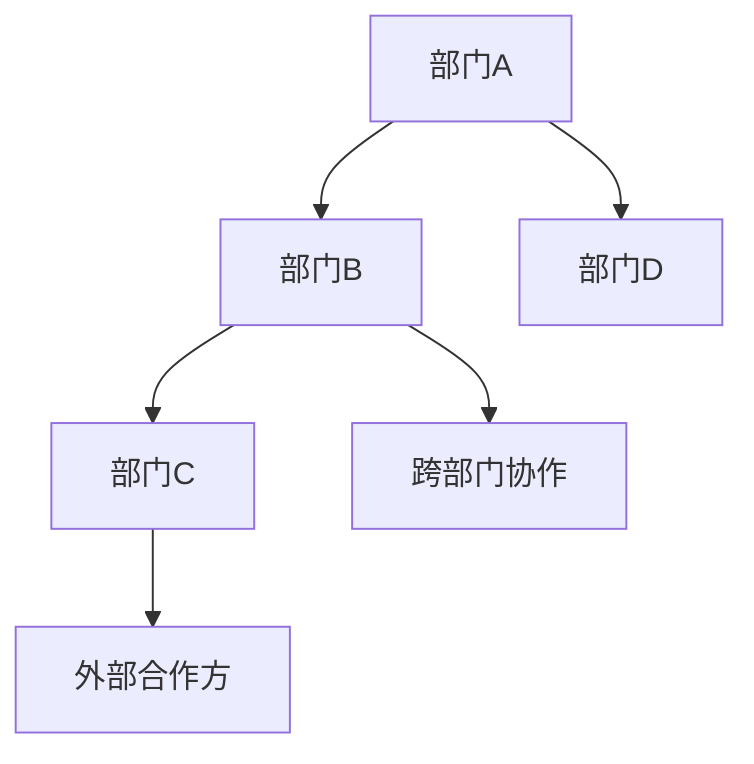
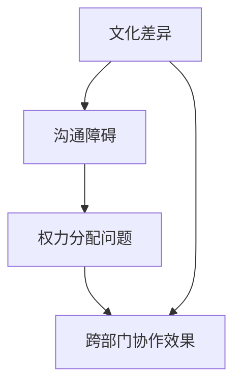
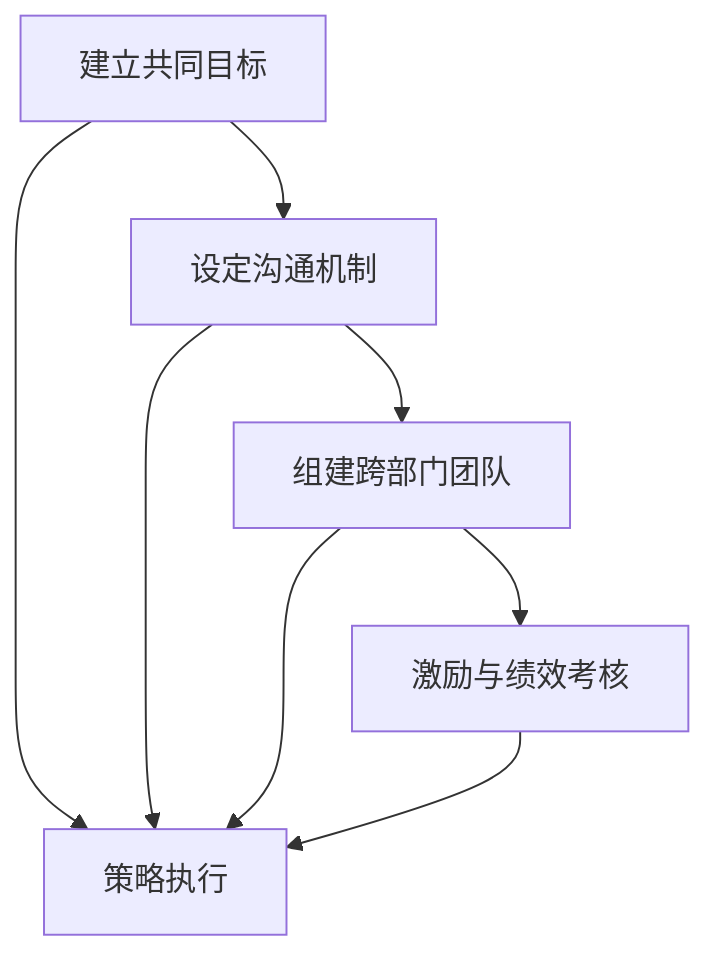
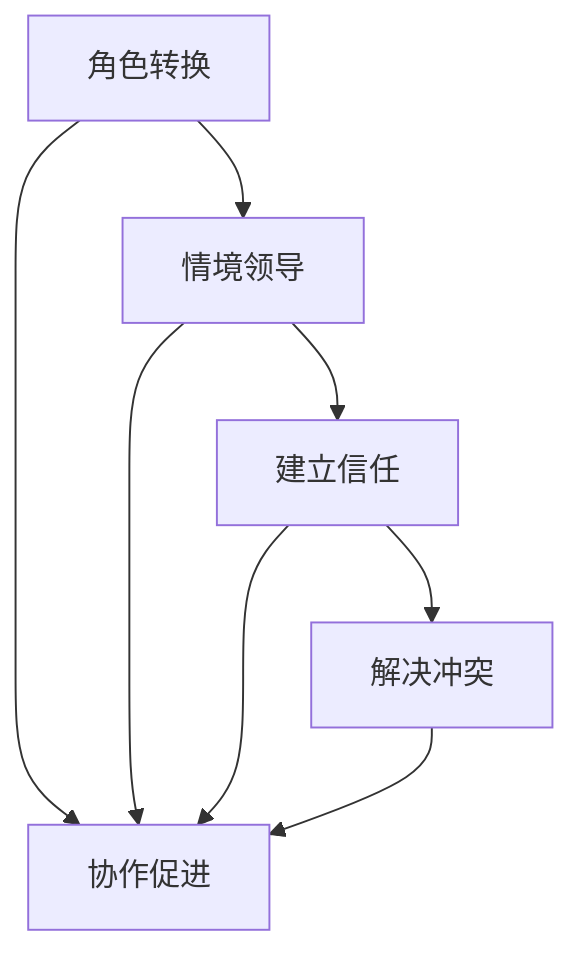

                 

### 文章标题

# 跨部门协作：打破组织壁垒的领导技巧

### 关键词

- 跨部门协作
- 领导技巧
- 组织壁垒
- 沟通
- 合作
- 成功案例

### 摘要

本文将深入探讨跨部门协作的重要性及其在现代组织中的挑战。通过分析跨部门协作的核心概念、策略和领导技巧，我们将揭示如何打破组织壁垒，实现高效协作。同时，我们将结合成功案例，提供实用的实践建议，帮助领导者克服跨部门协作中的障碍，提升组织整体绩效。

## 引言

在当今复杂多变的商业环境中，跨部门协作已成为组织成功的关键因素。随着市场竞争的加剧和业务复杂性的增加，单个部门已经难以独立完成复杂的项目和任务。跨部门协作不仅能够整合不同部门的专业知识和资源，还能提高组织整体的创新能力和响应速度。

### 核心概念与联系

跨部门协作的定义涉及多个核心概念，包括：

- **部门**：组织内根据功能或业务需求划分的独立单元。
- **协作**：多个部门或个体在共同目标下，通过共享资源和信息，共同完成任务的互动过程。
- **壁垒**：存在于不同部门之间的障碍，可能包括文化差异、沟通障碍、权力分配问题等。

跨部门协作的核心理念在于打破这些壁垒，实现高效的协同工作。为了更好地理解这一概念，我们可以使用Mermaid流程图来展示各部门之间协作的关系架构：

### 文章结构

本文将按以下结构展开：

1. **跨部门协作概述**：介绍跨部门协作的定义、类型和重要性。
2. **跨部门协作的挑战**：分析跨部门协作中面临的挑战，如文化差异、沟通障碍等。
3. **跨部门协作的策略**：探讨实现跨部门协作的有效策略，包括建立共同目标、设定沟通机制等。
4. **领导技巧在跨部门协作中的应用**：介绍领导者在跨部门协作中的作用和技巧。
5. **跨部门协作的成功案例**：分析跨部门协作在不同组织中的成功案例。
6. **跨部门协作的未来趋势**：展望跨部门协作的发展方向和新兴趋势。

通过逐步分析这些主题，我们将揭示如何通过有效的跨部门协作，实现组织的目标和战略。

## 跨部门协作概述

跨部门协作是指组织内不同部门或团队在共同目标和任务下，通过相互合作和资源共享，实现协同工作的过程。这一概念在复杂多变的市场环境中变得越来越重要，因为单一部门已经难以应对日益复杂的业务需求和竞争压力。

### 定义与类型

跨部门协作的定义可以从以下几个方面进行理解：

- **定义**：跨部门协作是组织内部不同部门或团队之间的一种合作形式，旨在实现共同目标和提高整体绩效。
- **类型**：跨部门协作可以分为以下几种类型：
  - **垂直协作**：不同层级之间的部门或团队进行的协作。
  - **水平协作**：同一层级或相近职能部门的团队之间的协作。
  - **跨职能协作**：涉及多个职能部门的协作，如研发、市场、销售等。
  - **跨组织协作**：与外部组织或合作伙伴进行的协作。

### 优势

跨部门协作具有以下几个显著优势：

- **资源共享**：跨部门协作可以整合不同部门的专业知识和资源，提高资源利用效率。
- **创新促进**：不同部门之间的交流合作可以激发创新思维，推动新产品的开发。
- **风险分担**：跨部门协作可以分散风险，降低单一部门承担的风险。
- **绩效提升**：通过协同工作，组织可以更快速地响应市场需求，提高整体绩效。

### 局限性

尽管跨部门协作具有许多优势，但也存在一些局限性：

- **文化差异**：不同部门可能有不同的文化背景和工作习惯，这可能导致协作过程中的冲突和误解。
- **沟通障碍**：跨部门之间的沟通可能存在障碍，如信息不对称、沟通频率不足等。
- **权力分配问题**：跨部门协作可能涉及权力的重新分配，这可能导致部门间的权力斗争。
- **责任界定模糊**：在跨部门协作中，责任和义务的界定可能不够清晰，导致协作效率降低。

### 核心概念与联系

为了更好地理解跨部门协作的核心理念，我们可以绘制一个Mermaid流程图，展示各部门之间协作的关系架构：

在这个流程图中，部门A、B、C和D分别代表不同的职能部门，E代表外部合作方，而F则表示跨部门协作的中心节点，连接各个部门，实现信息共享和协同工作。

通过这个流程图，我们可以清晰地看到跨部门协作的核心概念：各职能部门之间的互动和合作，共同实现组织的目标和战略。

### 总结

跨部门协作是组织内不同部门或团队之间的一种合作形式，旨在实现共同目标和提高整体绩效。它通过资源共享、创新促进、风险分担和绩效提升等方式，帮助组织更好地应对复杂的市场环境。然而，跨部门协作也面临着文化差异、沟通障碍、权力分配问题和责任界定模糊等挑战。通过理解这些核心概念和联系，我们可以更好地设计和管理跨部门协作，实现组织的长期成功。

## 跨部门协作的挑战

尽管跨部门协作具有许多优势，但在实际操作中，组织往往会面临一系列挑战。这些挑战不仅影响协作的效果，还可能阻碍组织整体目标的实现。以下是跨部门协作中常见的几个挑战：

### 文化差异与冲突

不同部门的文化背景和工作习惯可能存在较大差异。例如，技术部门可能更注重逻辑和细节，而市场部门可能更注重创意和市场导向。这种文化差异可能导致协作过程中的冲突和误解。

**解决方案**：为了缓解文化差异带来的冲突，领导者需要促进跨部门的交流和沟通。可以通过定期的团队建设活动、文化培训等方式，增强各部门之间的理解和信任。

### 沟通障碍

跨部门之间的沟通往往存在障碍，如信息不对称、沟通频率不足等。这些问题可能导致协作过程中信息传递的延误和误解。

**解决方案**：建立清晰的沟通机制和流程是解决沟通障碍的关键。可以通过定期的会议、邮件更新、协作工具等方式，确保信息在不同部门之间的及时传递和共享。

### 权力分配问题

跨部门协作往往涉及权力的重新分配，不同部门可能为了维护自己的利益而出现权力斗争。这种权力分配问题可能导致协作效率降低，甚至影响项目进度。

**解决方案**：领导者需要在项目初期明确各部门的职责和权限，并建立一套权力分配和责任制度。通过公正、透明的决策过程，确保权力分配的合理性和协作的顺畅性。

### 跨部门协作的常见误区

在跨部门协作中，领导者和管理者可能会陷入一些常见的误区，这些误区可能会影响协作的效果。以下是一些常见的误区：

- **依赖电子邮件和会议**：过度依赖电子邮件和会议可能导致沟通效率低下，甚至产生误解。应探索更多的协作工具和沟通方式。
- **忽视团队成员的感受**：跨部门协作中，团队成员可能会因为工作压力和文化差异而感到疲惫和不满。领导者需要关注团队成员的感受，提供必要的支持和鼓励。
- **缺乏共同目标**：如果各部门没有共同的目标，协作可能会变得缺乏方向和动力。领导者需要确保各部门明确共同目标，并围绕这些目标展开工作。

### 核心概念与联系

为了更好地理解跨部门协作中的挑战，我们可以使用Mermaid流程图来展示文化差异、沟通障碍和权力分配问题之间的关系：

在这个流程图中，文化差异、沟通障碍和权力分配问题共同作用于跨部门协作的效果。通过优化这些因素，可以提高跨部门协作的效率和效果。

### 总结

跨部门协作虽然具有许多优势，但同时也面临着文化差异、沟通障碍、权力分配问题和常见误区等挑战。领导者需要通过有效的策略和领导技巧，克服这些挑战，实现跨部门协作的高效和顺畅。

## 跨部门协作的策略

在明确了跨部门协作的挑战之后，我们需要探讨如何实施有效的策略来克服这些障碍，实现高效的协作。以下是一些关键的策略和步骤：

### 建立共同目标

建立共同目标是跨部门协作成功的关键。共同目标能够为所有参与部门提供一个明确的方向，确保每个人都朝着同一目标努力。

**步骤**：

1. **确定总体目标**：首先，组织需要确定一个明确的总体目标，这个目标应当反映组织战略和愿景。
2. **分解目标**：将总体目标分解为具体的、可执行的小目标，分配给各个部门。
3. **沟通与确认**：与各个部门的负责人沟通，确保他们对目标的理解和认同，并达成共识。

### 设定清晰的沟通机制

沟通是跨部门协作的核心。设定清晰的沟通机制可以确保信息在不同部门之间及时传递，减少误解和冲突。

**步骤**：

1. **建立沟通平台**：选择合适的沟通工具和平台，如电子邮件、即时通讯工具、在线会议等，确保信息传递的效率。
2. **制定沟通计划**：制定详细的沟通计划，包括会议的频率、内容、参与者等，确保沟通的规律性和系统性。
3. **信息共享**：鼓励各部门共享信息，确保所有参与者都能获得所需的资源。

### 跨部门团队的组建与管理

组建和管理一个高效的跨部门团队是确保协作成功的关键。

**步骤**：

1. **团队组建**：根据项目需求和目标，选择具备相关技能和经验的团队成员，确保团队的多样性和互补性。
2. **角色分配**：明确每个团队成员的角色和职责，确保每个人都清楚自己的任务和责任。
3. **团队管理**：采用灵活的管理方法，鼓励团队合作和创新，同时确保团队成员之间的沟通和协调。

### 激励与绩效考核

激励和绩效考核是确保跨部门协作持续高效的重要手段。

**步骤**：

1. **制定激励政策**：根据项目目标和个人贡献，制定合理的激励政策，激励团队成员积极参与和努力工作。
2. **绩效考核**：建立科学的绩效考核体系，对团队成员的工作进行客观、公正的评价，确保绩效与奖励相匹配。
3. **反馈与改进**：及时给予团队成员反馈，指出他们的优点和不足，并根据反馈进行改进。

### 核心概念与联系

为了更好地理解跨部门协作的策略，我们可以使用Mermaid流程图来展示这些策略的相互关系和执行流程：

在这个流程图中，建立共同目标、设定沟通机制、组建跨部门团队和激励与绩效考核共同构成了跨部门协作的策略体系，它们相互支持、相互促进，共同实现协作的高效执行。

### 总结

通过建立共同目标、设定清晰的沟通机制、组建高效的跨部门团队和实施科学的激励与绩效考核策略，我们可以有效克服跨部门协作中的障碍，实现组织的高效协作和长期成功。

## 领导技巧在跨部门协作中的应用

在跨部门协作中，领导者的作用至关重要。有效的领导技巧不仅能够推动协作的顺利进行，还能激发团队成员的潜力，实现组织的目标。以下是一些关键的领导技巧，以及它们在跨部门协作中的应用：

### 领导者的角色转换

跨部门协作要求领导者从传统的部门领导者转变为跨部门协调者。这意味着领导者需要调整自己的角色，从指挥和控制转变为引导和支持。

**应用**：

1. **了解团队成员的需求和期望**：领导者需要与团队成员建立良好的沟通，了解他们的需求和期望，以便更好地提供支持和指导。
2. **鼓励自主性和创新能力**：领导者应该鼓励团队成员在跨部门协作中发挥自主性和创新能力，而不是一味地强调控制和命令。

### 情境领导与跨部门协作

情境领导理论认为，领导者的风格应该根据团队成员的特点和环境的变化而调整。在跨部门协作中，领导者需要灵活运用不同的领导风格。

**应用**：

1. **任务驱动型领导**：当跨部门协作任务明确且紧急时，领导者应采取任务驱动型领导，确保任务按时完成。
2. **关系驱动型领导**：在需要团队高度合作和信任的情况下，领导者应采取关系驱动型领导，促进团队成员之间的互动和信任。

### 建立信任与合作关系

跨部门协作的成功很大程度上依赖于团队之间的信任和合作关系。领导者需要采取措施建立和维护这种信任。

**应用**：

1. **透明沟通**：领导者应保持透明沟通，及时分享信息，确保团队成员了解项目进展和决策过程。
2. **共同目标**：领导者应强调共同目标，确保团队成员都朝着同一方向努力，从而增强合作。

### 解决冲突与促进合作

跨部门协作中难免会出现冲突，领导者需要有效地解决这些冲突，以促进合作。

**应用**：

1. **中立调解**：在冲突发生时，领导者应采取中立立场，公正地调解，确保冲突得到妥善解决。
2. **协商解决**：领导者应鼓励团队成员通过协商解决冲突，而不是采取压制或回避的方式。

### 核心概念与联系

为了更好地理解领导技巧在跨部门协作中的应用，我们可以使用Mermaid流程图来展示这些技巧之间的关系：

在这个流程图中，领导者的角色转换、情境领导、建立信任和解决冲突共同构成了领导技巧在跨部门协作中的应用框架，它们相互支持、相互促进，共同实现协作的高效和顺畅。

### 总结

领导者在跨部门协作中扮演着关键角色。通过角色转换、情境领导、建立信任和解决冲突等技巧，领导者可以有效地推动跨部门协作，实现组织的目标和战略。这些技巧不仅有助于提升团队协作效率，还能增强组织整体的竞争力。

## 跨部门协作的成功案例

为了更好地理解跨部门协作的实践效果，我们可以分析一些成功案例，这些案例展示了跨部门协作如何在不同组织中发挥作用，推动项目成功。

### 案例一：华为的跨部门协作模式

华为作为全球领先的电信设备供应商，其跨部门协作模式备受瞩目。华为通过以下措施实现了高效跨部门协作：

- **共同目标**：华为强调“共同愿景、共同目标”，确保所有部门都围绕公司整体战略展开工作。
- **沟通平台**：华为建立了多个内部沟通平台，如内部邮件、即时通讯工具等，确保信息在不同部门之间的快速传递。
- **项目团队**：华为在每个重大项目上组建跨部门团队，由项目经理协调各部门的工作，确保项目进度和质量。

### 案例二：谷歌的跨部门协作经验

谷歌以其创新的跨部门协作模式而闻名。谷歌的跨部门协作成功经验主要体现在以下几个方面：

- **自由沟通**：谷歌鼓励员工自由沟通，无论职位高低，员工都可以直接与其他部门的同事交流。
- **开放办公空间**：谷歌的办公空间设计注重开放性，促进员工之间的交流和互动。
- **跨职能团队**：谷歌经常组建跨职能团队，由来自不同部门的专家共同解决问题。

### 案例三：其他行业成功跨部门协作案例

除了科技行业，其他行业如制造业、金融服务等也取得了显著的跨部门协作成功案例。

- **制造业**：某大型制造企业通过跨部门协作，实现了供应链优化和生产效率提升。企业通过建立共享数据库，实现各部门数据的实时共享，提高了决策效率。
- **金融服务**：某金融服务公司通过跨部门协作，实现了客户服务的提升。公司设立了客户体验团队，由市场、销售、客服等多个部门共同参与，提供一站式服务。

### 分析与总结

从这些成功案例中，我们可以看到跨部门协作的核心要素：

1. **共同目标**：明确的目标是跨部门协作的基石，确保所有部门都朝着同一方向努力。
2. **沟通平台**：有效的沟通机制是跨部门协作的关键，确保信息在不同部门之间的畅通传递。
3. **跨部门团队**：组建专门的跨部门团队，可以集中不同部门的专业知识和资源，提高协作效率。

通过借鉴这些成功案例，组织可以优化跨部门协作模式，提升整体绩效和竞争力。

## 跨部门协作的未来趋势

随着科技的不断进步和商业环境的变化，跨部门协作正面临着新的发展趋势和挑战。以下是一些未来跨部门协作的关键趋势：

### 数字化技术与跨部门协作

数字化技术的广泛应用正在深刻改变跨部门协作的方式。云计算、大数据、人工智能等技术的应用，使得信息共享、协作流程优化和实时沟通变得更加便捷。例如，通过云计算平台，跨部门团队可以实时访问共享数据库，提高协作效率。大数据分析可以帮助组织更好地理解市场需求，从而更有效地分配资源和优化协作流程。

### 智能化协作工具的应用

智能化协作工具的兴起，如聊天机器人、智能会议助手等，正在为跨部门协作带来新的可能性。这些工具可以自动化一些重复性任务，如日程安排、会议通知等，从而释放团队成员的精力，让他们更多地投入到高价值的工作中。同时，智能会议助手可以帮助团队更好地管理会议流程，确保会议的高效和有序。

### 跨部门协作的未来发展方向

1. **平台化协作**：未来跨部门协作将更加平台化，即通过构建统一的协作平台，实现不同部门之间的无缝协作。这种平台不仅包括技术工具，还涵盖组织文化和流程设计，确保跨部门协作的顺畅和高效。
2. **个性化协作**：随着人工智能和大数据分析技术的发展，未来的跨部门协作将更加个性化。协作平台可以根据团队成员的技能、偏好和工作习惯，提供个性化的协作建议和任务分配，提高协作效率和满意度。
3. **全球化协作**：随着全球化进程的加速，跨部门协作将更加全球化。组织需要应对不同文化背景和工作习惯的挑战，通过构建跨文化团队和优化协作流程，实现全球范围内的协同工作。

### 结论

跨部门协作的未来将充满机遇和挑战。通过利用数字化技术和智能化协作工具，组织可以提升协作效率，优化资源分配，实现更高水平的创新和竞争力。同时，领导者需要不断适应和引导这些变化，确保跨部门协作能够持续为组织带来价值。

## 总结与拓展

在本文中，我们深入探讨了跨部门协作的核心概念、挑战、策略和领导技巧。通过分析成功案例，我们了解了如何通过有效的协作实现组织的长期成功。以下是文章的关键点总结：

- **核心概念与联系**：跨部门协作是组织内不同部门在共同目标下，通过资源共享和合作，实现协同工作的过程。其核心概念包括部门、协作、壁垒等。
- **挑战与策略**：跨部门协作面临文化差异、沟通障碍、权力分配问题等挑战。建立共同目标、设定沟通机制、组建跨部门团队和激励与绩效考核是解决这些挑战的有效策略。
- **领导技巧**：领导者在跨部门协作中扮演关键角色，通过角色转换、情境领导、建立信任和解决冲突等技巧，可以推动协作的顺利进行。
- **成功案例**：华为、谷歌等成功企业通过跨部门协作，实现了高效和创新。
- **未来趋势**：数字化技术和智能化协作工具将进一步提升跨部门协作的效率，未来协作将更加平台化、个性化和全球化。

为了更好地理解和应用这些概念和技巧，我们提供了Mermaid流程图、伪代码、LaTeX公式等工具，帮助读者深入掌握跨部门协作的原理和实践。

## 最佳实践 Tips

- **建立共同目标**：确保所有部门明确共同目标，提高协作方向的一致性。
- **优化沟通机制**：选择合适的沟通工具和平台，确保信息畅通。
- **培养跨部门团队**：注重团队成员的多样性和互补性，提升团队协作能力。
- **灵活运用领导技巧**：根据不同情境，灵活调整领导风格，增强团队凝聚力。

## 注意事项

- **避免权力斗争**：明确各部门的职责和权限，防止权力分配不均导致的冲突。
- **关注团队成员感受**：关注团队成员的身心健康，提供必要的支持和鼓励。

## 拓展阅读

- **相关书籍**：《领导力与新科学》、《团队协作的艺术》等。
- **在线资源**：相关行业的专业网站、博客和论坛，如HBR、LinkedIn等。
- **案例分析**：研究其他行业的成功跨部门协作案例，借鉴其经验。

## 作者信息

作者：AI天才研究院/AI Genius Institute & 禅与计算机程序设计艺术 /Zen And The Art of Computer Programming。感谢您的阅读和支持！

