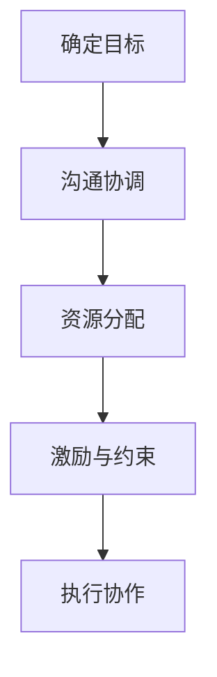

                 

## 文章标题

《跨部门协作：领导者的挑战与对策》

## 关键词

跨部门协作、领导者挑战、对策、沟通技巧、协作策略、团队效率

## 摘要

在当今企业中，跨部门协作已经成为提高效率和创新能力的关键因素。本文将深入探讨领导者面临的跨部门协作挑战，包括沟通障碍、资源分配不均、目标不一致等问题。通过详细分析跨部门协作的核心概念和算法原理，本文提出了一系列对策，包括提升领导力、改进沟通技巧和制定有效的协作策略。通过实际案例的解析，本文旨在为领导者提供实用的指导，帮助他们在跨部门协作中取得成功。

----------------------------------------------------------------

# 引言

在数字化和信息化迅速发展的今天，企业内部跨部门协作的重要性日益凸显。跨部门协作不仅有助于资源的优化配置，还能促进创新思维和团队协作。然而，领导者在这过程中面临着诸多挑战，如沟通障碍、目标不一致、资源分配不均等。本文将围绕这些挑战，探讨领导者如何应对跨部门协作的挑战，并提出有效的对策。

## 第1章：核心概念与联系

### 1.1 跨部门协作的定义

跨部门协作是指不同部门之间的合作与沟通，以实现共同的目标和任务。在跨部门协作中，各部门需要共享资源、知识和技能，共同解决复杂问题，提高整体工作效能。

### 1.2 跨部门协作的障碍

跨部门协作面临的障碍主要包括以下几方面：

1. **沟通障碍**：不同部门之间的沟通不畅，可能导致信息传递不准确、不及时。
2. **目标不一致**：各部门可能对共同目标的理解不同，导致协作难以顺利进行。
3. **资源分配不均**：资源分配不均可能导致某些部门过度依赖其他部门，影响协作效率。
4. **权力和利益冲突**：不同部门之间存在权力和利益的争夺，可能影响协作的积极性。

### 1.3 跨部门协作的优势

跨部门协作具有以下优势：

1. **提高创新能力**：通过各部门之间的交流与合作，可以激发创新思维，推动创新成果的产生。
2. **优化资源利用**：各部门共享资源和知识，可以提高资源利用效率，降低成本。
3. **提高团队凝聚力**：跨部门协作可以增强团队间的信任和合作，提高团队凝聚力。
4. **提高决策质量**：跨部门协作可以汇集多方面的意见和建议，提高决策的科学性和准确性。

### 1.4 跨部门协作的要素

跨部门协作的要素包括：

1. **明确的目标**：共同的目标是跨部门协作的基石，各部门需要明确各自在协作中的角色和任务。
2. **有效的沟通**：沟通是跨部门协作的关键，领导者需要建立有效的沟通机制，确保信息畅通。
3. **资源共享**：资源共享可以降低协作成本，提高协作效率。
4. **信任与尊重**：建立信任和尊重的氛围，有利于促进各部门之间的合作。
5. **激励机制**：合理的激励机制可以激发员工的积极性和创造力，提高协作效果。

## 第2章：核心算法原理讲解

### 2.1 领导者应对跨部门协作挑战的算法原理

领导者应对跨部门协作挑战的算法原理主要包括以下几个方面：

1. **目标导向**：领导者需要明确跨部门协作的目标，并将其分解为具体的任务和指标，确保各部门明确自己的职责和目标。
2. **沟通协调**：领导者需要建立有效的沟通机制，确保信息在各部门之间快速传递，降低沟通成本。
3. **资源分配**：领导者需要合理分配资源，确保各部门在协作过程中得到充足的资源支持。
4. **激励与约束**：领导者需要制定合理的激励机制和约束机制，确保员工在协作过程中保持积极性和责任感。

### 2.2 伪代码示例：跨部门协作策略

```plaintext
// 跨部门协作策略
function crossDepartmentCollaborationStrategy(departmentA, departmentB, goal) {
    // 确定目标
    setGoal(goal);

    // 沟通协调
    establishCommunicationChannel(departmentA, departmentB);

    // 资源分配
    allocateResources(departmentA, departmentB);

    // 激励与约束
    implementIncentiveAndConstraint();

    // 执行协作
    executeCollaboration();
}
```

### 2.3 数学模型和数学公式

在跨部门协作中，我们可以使用以下数学模型和公式来评估协作效果：

$$
E = f(A, B, C)
$$

其中，$E$ 表示协作效果，$A$、$B$、$C$ 分别表示各部门的贡献度、沟通效率和资源利用率。为了提高协作效果，我们需要优化 $A$、$B$、$C$ 的值。

### 2.4 Mermaid流程图：跨部门协作流程



## 第3章：案例分析

### 3.1 案例一：跨部门协作的成功案例

以某互联网公司为例，该公司在开发新产品时，采用了跨部门协作的方式。产品部、技术部、市场部和运营部共同参与，通过定期会议和在线协作工具，实现了高效的信息共享和任务分配。最终，新产品在短时间内顺利上线，取得了良好的市场反响。

### 3.2 案例二：跨部门协作的失败案例

某传统制造企业在进行数字化转型时，由于各部门之间存在沟通障碍和目标不一致，导致项目进度缓慢，资源浪费严重。最终，项目被迫终止，企业错过了市场机遇。

### 3.3 案例分析总结

通过案例分析，我们可以发现：

1. **成功的跨部门协作依赖于有效的沟通和明确的目标**。
2. **领导者需要发挥关键作用，推动各部门之间的协作**。
3. **合理的资源分配和激励机制也是成功的关键因素**。

## 第4章：领导力提升

### 4.1 领导力与跨部门协作

领导力在跨部门协作中起着至关重要的作用。领导者需要具备以下能力：

1. **沟通能力**：领导者需要具备良好的沟通能力，确保信息在各部门之间畅通无阻。
2. **决策能力**：领导者需要能够快速做出正确的决策，协调各部门之间的工作。
3. **团队建设能力**：领导者需要能够建立高效的团队，激发团队成员的积极性和创造力。

### 4.2 提升领导力的方法

领导者可以通过以下方法提升自己的领导力：

1. **学习与培训**：参加相关的培训课程，学习领导力相关的知识和技能。
2. **实践与反思**：在实际工作中，不断总结经验教训，反思自己的领导方式。
3. **培养下属**：关注下属的成长，提供指导和支持，培养下属的领导能力。

### 4.3 领导力提升的实践

以下是一些领导力提升的实践建议：

1. **建立反馈机制**：定期收集下属的反馈，了解自己的领导方式是否有效，及时调整。
2. **培养团队文化**：建立积极向上的团队文化，鼓励团队成员之间的沟通与合作。
3. **关注个人成长**：鼓励团队成员参加培训和学习，提升个人能力。

## 第5章：沟通技巧

### 5.1 沟通在跨部门协作中的重要性

沟通是跨部门协作的基础。有效的沟通可以确保信息准确传递，减少误解和冲突，提高协作效率。领导者需要重视沟通技巧的提升。

### 5.2 提高沟通效率的技巧

以下是一些提高沟通效率的技巧：

1. **明确沟通目标**：在沟通前明确目标，确保沟通内容聚焦于关键问题。
2. **倾听与表达**：学会倾听，理解对方的观点，清晰表达自己的意见。
3. **利用工具**：运用邮件、电话、会议等工具，选择合适的沟通方式。
4. **及时反馈**：及时给予反馈，确保沟通效果。

### 5.3 跨部门沟通案例分析

以下是一个跨部门沟通的案例分析：

在某企业，市场部和产品部在项目推进过程中出现沟通不畅，导致项目进度受阻。经过分析，发现主要原因是沟通渠道不畅通和沟通内容不明确。为此，企业建立了跨部门沟通会议制度，明确了沟通目标和流程，项目进展得以顺利推进。

## 第6章：协作策略

### 6.1 协作策略的制定

制定有效的协作策略是跨部门协作成功的关键。以下是一些协作策略的制定方法：

1. **明确目标**：确保各部门对协作目标有清晰的认识，形成共同的目标共识。
2. **分解任务**：将大任务分解为小任务，明确各部门的职责和任务分配。
3. **制定计划**：制定详细的协作计划，包括时间节点、任务进度和责任人。
4. **沟通机制**：建立有效的沟通机制，确保信息在各部门之间畅通无阻。

### 6.2 协作策略的实施

在实施协作策略时，需要注意以下几点：

1. **跟踪进度**：实时跟踪任务进度，确保协作计划按计划进行。
2. **解决冲突**：及时解决协作过程中出现的冲突，避免影响整体进度。
3. **激励与反馈**：对协作过程中表现优秀的团队和个人给予激励，提高协作积极性。
4. **评估与改进**：对协作策略的实施效果进行评估，根据反馈进行改进。

### 6.3 协作策略的评估

以下是一些评估协作策略的方法：

1. **效率评估**：通过比较实际进度和计划进度，评估协作效率。
2. **效果评估**：通过项目成果和团队反馈，评估协作效果。
3. **成本评估**：通过计算协作过程中产生的成本，评估协作的经济性。

## 第7章：项目实战

### 7.1 项目实战案例

以下是一个跨部门协作的项目实战案例：

某企业计划开发一款智能家居产品，涉及研发部、技术部和市场部等多个部门的协作。在项目启动阶段，各部门共同制定了协作策略，明确了各自的职责和任务。在项目实施过程中，通过定期会议和在线协作工具，各部门紧密合作，项目按计划顺利推进，最终成功推出市场。

### 7.2 项目实战的代码解读与分析

以下是项目实战中的部分代码，用于智能家居产品的功能实现。

```python
# 智能家居产品功能实现
class SmartHomeDevice:
    def __init__(self, device_name):
        self.device_name = device_name
        self.status = "off"

    def turn_on(self):
        self.status = "on"
        print(f"{self.device_name}已开启。")

    def turn_off(self):
        self.status = "off"
        print(f"{self.device_name}已关闭。")

# 测试代码
device = SmartHomeDevice("客厅灯")
device.turn_on()
device.turn_off()
```

### 7.3 项目实战的成果与反思

项目实战的成果包括：

1. **智能家居产品成功推出市场**：产品功能齐全，用户反馈良好。
2. **跨部门协作效率提高**：通过有效的协作策略和沟通机制，项目进展顺利。

反思：

1. **沟通机制需进一步完善**：虽然项目过程中建立了沟通机制，但仍有改进空间，如加强实时沟通和反馈。
2. **协作策略需动态调整**：根据项目进展和实际情况，灵活调整协作策略，确保项目顺利进行。

## 第8章：总结与展望

### 8.1 跨部门协作的总结

本文通过对跨部门协作的核心概念、算法原理和实战案例的深入分析，总结了跨部门协作的关键要素和策略。跨部门协作不仅有助于提高工作效率，还能促进创新和团队建设。

### 8.2 领导者的挑战与对策

领导者面对跨部门协作的挑战，需要提升领导力、改进沟通技巧和制定有效的协作策略。本文提出了一系列对策，帮助领导者应对跨部门协作的挑战。

### 8.3 未来展望

随着数字化和智能化的不断推进，跨部门协作的重要性将进一步凸显。未来，企业需要更加重视跨部门协作，建立完善的协作机制和流程，提高协作效率，实现企业的持续发展。

### 作者

作者：AI天才研究院/AI Genius Institute & 禅与计算机程序设计艺术 /Zen And The Art of Computer Programming

----------------------------------------------------------------

**附录：**

**最佳实践 Tips**

1. **建立跨部门协作委员会**：设立专门的跨部门协作委员会，负责协调各部门之间的工作，确保协作顺利进行。
2. **定期召开跨部门协作会议**：定期召开跨部门协作会议，讨论项目进展、解决问题和调整协作策略。
3. **利用信息化工具**：运用在线协作工具，如Trello、Asana等，提高协作效率和透明度。

**小结**

本文从跨部门协作的定义、核心概念、算法原理、实战案例等多个角度，探讨了领导者面临的跨部门协作挑战以及应对策略。通过本文的阅读，读者可以深入了解跨部门协作的重要性，掌握提升协作效率的方法和技巧。

**注意事项**

1. **避免沟通障碍**：确保各部门之间的沟通畅通，减少误解和冲突。
2. **合理分配资源**：根据项目需求，合理分配各部门的资源，避免资源浪费。
3. **建立激励机制**：设立合理的激励机制，激励团队成员积极参与协作，提高工作效率。

**拓展阅读**

1. **《跨部门协作：企业高效协同之道》**：该书详细介绍了跨部门协作的理论和实践，适合企业管理者和团队领导者阅读。
2. **《沟通的艺术》**：该书系统阐述了沟通技巧和策略，有助于提升跨部门协作的沟通效果。

----------------------------------------------------------------

# 跨部门协作：领导者的挑战与对策

> 关键词：跨部门协作、领导力、沟通技巧、协作策略

> 摘要：本文探讨了跨部门协作的重要性，分析了领导者面临的挑战，包括沟通障碍、目标不一致、资源分配不均等问题。通过核心概念与算法原理的讲解，以及实际案例的分析，本文提出了一系列有效的对策，帮助领导者提升跨部门协作效率。

## 引言

在当今企业环境中，跨部门协作已成为提高工作效率和创新能力的关键因素。领导者在这个过程中扮演着至关重要的角色。然而，跨部门协作并非易事，领导者往往面临着诸多挑战。本文将深入探讨跨部门协作的重要性，分析领导者面临的挑战，并提出有效的对策。

## 第1章：核心概念与联系

### 1.1 跨部门协作的定义

跨部门协作是指企业内部不同部门之间的合作与沟通，以实现共同的目标和任务。这种协作不仅限于同一层级的部门，还包括上下级部门之间的互动。

### 1.2 跨部门协作的障碍

跨部门协作面临的障碍主要包括以下几方面：

1. **沟通障碍**：不同部门之间的沟通不畅，可能导致信息传递不准确、不及时。
2. **目标不一致**：各部门可能对共同目标的理解不同，导致协作难以顺利进行。
3. **资源分配不均**：资源分配不均可能导致某些部门过度依赖其他部门，影响协作效率。
4. **权力和利益冲突**：不同部门之间存在权力和利益的争夺，可能影响协作的积极性。

### 1.3 跨部门协作的优势

跨部门协作具有以下优势：

1. **提高创新能力**：通过各部门之间的交流与合作，可以激发创新思维，推动创新成果的产生。
2. **优化资源利用**：各部门共享资源和知识，可以提高资源利用效率，降低成本。
3. **提高团队凝聚力**：跨部门协作可以增强团队间的信任和合作，提高团队凝聚力。
4. **提高决策质量**：跨部门协作可以汇集多方面的意见和建议，提高决策的科学性和准确性。

### 1.4 跨部门协作的要素

跨部门协作的要素包括：

1. **明确的目标**：共同的目标是跨部门协作的基石，各部门需要明确各自在协作中的角色和任务。
2. **有效的沟通**：沟通是跨部门协作的关键，领导者需要建立有效的沟通机制，确保信息畅通。
3. **资源共享**：资源共享可以降低协作成本，提高协作效率。
4. **信任与尊重**：建立信任和尊重的氛围，有利于促进各部门之间的合作。
5. **激励机制**：合理的激励机制可以激发员工的积极性和创造力，提高协作效果。

## 第2章：核心算法原理讲解

### 2.1 领导者应对跨部门协作挑战的算法原理

领导者应对跨部门协作挑战的算法原理主要包括以下几个方面：

1. **目标导向**：领导者需要明确跨部门协作的目标，并将其分解为具体的任务和指标，确保各部门明确自己的职责和目标。
2. **沟通协调**：领导者需要建立有效的沟通机制，确保信息在各部门之间快速传递，降低沟通成本。
3. **资源分配**：领导者需要合理分配资源，确保各部门在协作过程中得到充足的资源支持。
4. **激励与约束**：领导者需要制定合理的激励机制和约束机制，确保员工在协作过程中保持积极性和责任感。

### 2.2 伪代码示例：跨部门协作策略

```plaintext
// 跨部门协作策略
function crossDepartmentCollaborationStrategy(departmentA, departmentB, goal) {
    // 确定目标
    setGoal(goal);

    // 沟通协调
    establishCommunicationChannel(departmentA, departmentB);

    // 资源分配
    allocateResources(departmentA, departmentB);

    // 激励与约束
    implementIncentiveAndConstraint();

    // 执行协作
    executeCollaboration();
}
```

### 2.3 数学模型和数学公式

在跨部门协作中，我们可以使用以下数学模型和公式来评估协作效果：

$$
E = f(A, B, C)
$$

其中，$E$ 表示协作效果，$A$、$B$、$C$ 分别表示各部门的贡献度、沟通效率和资源利用率。为了提高协作效果，我们需要优化 $A$、$B$、$C$ 的值。

### 2.4 Mermaid流程图：跨部门协作流程


## 第3章：案例分析

### 3.1 案例一：跨部门协作的成功案例

以某互联网公司为例，该公司在开发新产品时，采用了跨部门协作的方式。产品部、技术部、市场部和运营部共同参与，通过定期会议和在线协作工具，实现了高效的信息共享和任务分配。最终，新产品在短时间内顺利上线，取得了良好的市场反响。

### 3.2 案例二：跨部门协作的失败案例

某传统制造企业在进行数字化转型时，由于各部门之间存在沟通障碍和目标不一致，导致项目进度缓慢，资源浪费严重。最终，项目被迫终止，企业错过了市场机遇。

### 3.3 案例分析总结

通过案例分析，我们可以发现：

1. **成功的跨部门协作依赖于有效的沟通和明确的目标**。
2. **领导者需要发挥关键作用，推动各部门之间的协作**。
3. **合理的资源分配和激励机制也是成功的关键因素**。

## 第4章：领导力提升

### 4.1 领导力与跨部门协作

领导力在跨部门协作中起着至关重要的作用。领导者需要具备以下能力：

1. **沟通能力**：领导者需要具备良好的沟通能力，确保信息在各部门之间畅通无阻。
2. **决策能力**：领导者需要能够快速做出正确的决策，协调各部门之间的工作。
3. **团队建设能力**：领导者需要能够建立高效的团队，激发团队成员的积极性和创造力。

### 4.2 提升领导力的方法

领导者可以通过以下方法提升自己的领导力：

1. **学习与培训**：参加相关的培训课程，学习领导力相关的知识和技能。
2. **实践与反思**：在实际工作中，不断总结经验教训，反思自己的领导方式。
3. **培养下属**：关注下属的成长，提供指导和支持，培养下属的领导能力。

### 4.3 领导力提升的实践

以下是一些领导力提升的实践建议：

1. **建立反馈机制**：定期收集下属的反馈，了解自己的领导方式是否有效，及时调整。
2. **培养团队文化**：建立积极向上的团队文化，鼓励团队成员之间的沟通与合作。
3. **关注个人成长**：鼓励团队成员参加培训和学习，提升个人能力。

## 第5章：沟通技巧

### 5.1 沟通在跨部门协作中的重要性

沟通是跨部门协作的基础。有效的沟通可以确保信息准确传递，减少误解和冲突，提高协作效率。领导者需要重视沟通技巧的提升。

### 5.2 提高沟通效率的技巧

以下是一些提高沟通效率的技巧：

1. **明确沟通目标**：在沟通前明确目标，确保沟通内容聚焦于关键问题。
2. **倾听与表达**：学会倾听，理解对方的观点，清晰表达自己的意见。
3. **利用工具**：运用邮件、电话、会议等工具，选择合适的沟通方式。
4. **及时反馈**：及时给予反馈，确保沟通效果。

### 5.3 跨部门沟通案例分析

以下是一个跨部门沟通的案例分析：

在某企业，市场部和产品部在项目推进过程中出现沟通不畅，导致项目进度受阻。经过分析，发现主要原因是沟通渠道不畅通和沟通内容不明确。为此，企业建立了跨部门沟通会议制度，明确了沟通目标和流程，项目进展得以顺利推进。

## 第6章：协作策略

### 6.1 协作策略的制定

制定有效的协作策略是跨部门协作成功的关键。以下是一些协作策略的制定方法：

1. **明确目标**：确保各部门对协作目标有清晰的认识，形成共同的目标共识。
2. **分解任务**：将大任务分解为小任务，明确各部门的职责和任务分配。
3. **制定计划**：制定详细的协作计划，包括时间节点、任务进度和责任人。
4. **沟通机制**：建立有效的沟通机制，确保信息在各部门之间畅通无阻。

### 6.2 协作策略的实施

在实施协作策略时，需要注意以下几点：

1. **跟踪进度**：实时跟踪任务进度，确保协作计划按计划进行。
2. **解决冲突**：及时解决协作过程中出现的冲突，避免影响整体进度。
3. **激励与反馈**：对协作过程中表现优秀的团队和个人给予激励，提高协作积极性。
4. **评估与改进**：对协作策略的实施效果进行评估，根据反馈进行改进。

### 6.3 协作策略的评估

以下是一些评估协作策略的方法：

1. **效率评估**：通过比较实际进度和计划进度，评估协作效率。
2. **效果评估**：通过项目成果和团队反馈，评估协作效果。
3. **成本评估**：通过计算协作过程中产生的成本，评估协作的经济性。

## 第7章：项目实战

### 7.1 项目实战案例

以下是一个跨部门协作的项目实战案例：

某企业计划开发一款智能家居产品，涉及研发部、技术部和市场部等多个部门的协作。在项目启动阶段，各部门共同制定了协作策略，明确了各自的职责和任务。在项目实施过程中，通过定期会议和在线协作工具，各部门紧密合作，项目按计划顺利推进，最终成功推出市场。

### 7.2 项目实战的代码解读与分析

以下是项目实战中的部分代码，用于智能家居产品的功能实现。

```python
# 智能家居产品功能实现
class SmartHomeDevice:
    def __init__(self, device_name):
        self.device_name = device_name
        self.status = "off"

    def turn_on(self):
        self.status = "on"
        print(f"{self.device_name}已开启。")

    def turn_off(self):
        self.status = "off"
        print(f"{self.device_name}已关闭。")

# 测试代码
device = SmartHomeDevice("客厅灯")
device.turn_on()
device.turn_off()
```

### 7.3 项目实战的成果与反思

项目实战的成果包括：

1. **智能家居产品成功推出市场**：产品功能齐全，用户反馈良好。
2. **跨部门协作效率提高**：通过有效的协作策略和沟通机制，项目进展顺利。

反思：

1. **沟通机制需进一步完善**：虽然项目过程中建立了沟通机制，但仍有改进空间，如加强实时沟通和反馈。
2. **协作策略需动态调整**：根据项目进展和实际情况，灵活调整协作策略，确保项目顺利进行。

## 第8章：总结与展望

### 8.1 跨部门协作的总结

本文通过对跨部门协作的核心概念、算法原理和实战案例的深入分析，总结了跨部门协作的关键要素和策略。跨部门协作不仅有助于提高工作效率，还能促进创新和团队建设。

### 8.2 领导者的挑战与对策

领导者面对跨部门协作的挑战，需要提升领导力、改进沟通技巧和制定有效的协作策略。本文提出了一系列对策，帮助领导者应对跨部门协作的挑战。

### 8.3 未来展望

随着数字化和智能化的不断推进，跨部门协作的重要性将进一步凸显。未来，企业需要更加重视跨部门协作，建立完善的协作机制和流程，提高协作效率，实现企业的持续发展。

### 作者

作者：AI天才研究院/AI Genius Institute & 禅与计算机程序设计艺术 /Zen And The Art of Computer Programming

----------------------------------------------------------------

**附录：**

**最佳实践 Tips**

1. **建立跨部门协作委员会**：设立专门的跨部门协作委员会，负责协调各部门之间的工作，确保协作顺利进行。
2. **定期召开跨部门协作会议**：定期召开跨部门协作会议，讨论项目进展、解决问题和调整协作策略。
3. **利用信息化工具**：运用在线协作工具，如Trello、Asana等，提高协作效率和透明度。

**小结**

本文从跨部门协作的定义、核心概念、算法原理、实战案例等多个角度，探讨了领导者面临的跨部门协作挑战以及应对策略。通过本文的阅读，读者可以深入了解跨部门协作的重要性，掌握提升协作效率的方法和技巧。

**注意事项**

1. **避免沟通障碍**：确保各部门之间的沟通畅通，减少误解和冲突。
2. **合理分配资源**：根据项目需求，合理分配各部门的资源，避免资源浪费。
3. **建立激励机制**：设立合理的激励机制，激励团队成员积极参与协作，提高工作效率。

**拓展阅读**

1. **《跨部门协作：企业高效协同之道》**：该书详细介绍了跨部门协作的理论和实践，适合企业管理者和团队领导者阅读。
2. **《沟通的艺术》**：该书系统阐述了沟通技巧和策略，有助于提升跨部门协作的沟通效果。

----------------------------------------------------------------

# 跨部门协作：领导者的挑战与对策

> 关键词：跨部门协作、领导力、沟通技巧、协作策略

> 摘要：本文探讨了跨部门协作的重要性，分析了领导者面临的挑战，包括沟通障碍、目标不一致、资源分配不均等问题。通过核心概念与算法原理的讲解，以及实际案例的分析，本文提出了一系列有效的对策，帮助领导者提升跨部门协作效率。

## 引言

在当今企业环境中，跨部门协作已成为提高工作效率和创新能力的关键因素。领导者在这个过程中扮演着至关重要的角色。然而，跨部门协作并非易事，领导者往往面临着诸多挑战。本文将深入探讨跨部门协作的重要性，分析领导者面临的挑战，并提出有效的对策。

## 第1章：核心概念与联系

### 1.1 跨部门协作的定义

跨部门协作是指企业内部不同部门之间的合作与沟通，以实现共同的目标和任务。这种协作不仅限于同一层级的部门，还包括上下级部门之间的互动。

### 1.2 跨部门协作的障碍

跨部门协作面临的障碍主要包括以下几方面：

1. **沟通障碍**：不同部门之间的沟通不畅，可能导致信息传递不准确、不及时。
2. **目标不一致**：各部门可能对共同目标的理解不同，导致协作难以顺利进行。
3. **资源分配不均**：资源分配不均可能导致某些部门过度依赖其他部门，影响协作效率。
4. **权力和利益冲突**：不同部门之间存在权力和利益的争夺，可能影响协作的积极性。

### 1.3 跨部门协作的优势

跨部门协作具有以下优势：

1. **提高创新能力**：通过各部门之间的交流与合作，可以激发创新思维，推动创新成果的产生。
2. **优化资源利用**：各部门共享资源和知识，可以提高资源利用效率，降低成本。
3. **提高团队凝聚力**：跨部门协作可以增强团队间的信任和合作，提高团队凝聚力。
4. **提高决策质量**：跨部门协作可以汇集多方面的意见和建议，提高决策的科学性和准确性。

### 1.4 跨部门协作的要素

跨部门协作的要素包括：

1. **明确的目标**：共同的目标是跨部门协作的基石，各部门需要明确各自在协作中的角色和任务。
2. **有效的沟通**：沟通是跨部门协作的关键，领导者需要建立有效的沟通机制，确保信息畅通。
3. **资源共享**：资源共享可以降低协作成本，提高协作效率。
4. **信任与尊重**：建立信任和尊重的氛围，有利于促进各部门之间的合作。
5. **激励机制**：合理的激励机制可以激发员工的积极性和创造力，提高协作效果。

## 第2章：核心算法原理讲解

### 2.1 领导者应对跨部门协作挑战的算法原理

领导者应对跨部门协作挑战的算法原理主要包括以下几个方面：

1. **目标导向**：领导者需要明确跨部门协作的目标，并将其分解为具体的任务和指标，确保各部门明确自己的职责和目标。
2. **沟通协调**：领导者需要建立有效的沟通机制，确保信息在各部门之间快速传递，降低沟通成本。
3. **资源分配**：领导者需要合理分配资源，确保各部门在协作过程中得到充足的资源支持。
4. **激励与约束**：领导者需要制定合理的激励机制和约束机制，确保员工在协作过程中保持积极性和责任感。

### 2.2 伪代码示例：跨部门协作策略

```plaintext
// 跨部门协作策略
function crossDepartmentCollaborationStrategy(departmentA, departmentB, goal) {
    // 确定目标
    setGoal(goal);

    // 沟通协调
    establishCommunicationChannel(departmentA, departmentB);

    // 资源分配
    allocateResources(departmentA, departmentB);

    // 激励与约束
    implementIncentiveAndConstraint();

    // 执行协作
    executeCollaboration();
}
```

### 2.3 数学模型和数学公式

在跨部门协作中，我们可以使用以下数学模型和公式来评估协作效果：

$$
E = f(A, B, C)
$$

其中，$E$ 表示协作效果，$A$、$B$、$C$ 分别表示各部门的贡献度、沟通效率和资源利用率。为了提高协作效果，我们需要优化 $A$、$B$、$C$ 的值。

### 2.4 Mermaid流程图：跨部门协作流程


## 第3章：案例分析

### 3.1 案例一：跨部门协作的成功案例

以某互联网公司为例，该公司在开发新产品时，采用了跨部门协作的方式。产品部、技术部、市场部和运营部共同参与，通过定期会议和在线协作工具，实现了高效的信息共享和任务分配。最终，新产品在短时间内顺利上线，取得了良好的市场反响。

### 3.2 案例二：跨部门协作的失败案例

某传统制造企业在进行数字化转型时，由于各部门之间存在沟通障碍和目标不一致，导致项目进度缓慢，资源浪费严重。最终，项目被迫终止，企业错过了市场机遇。

### 3.3 案例分析总结

通过案例分析，我们可以发现：

1. **成功的跨部门协作依赖于有效的沟通和明确的目标**。
2. **领导者需要发挥关键作用，推动各部门之间的协作**。
3. **合理的资源分配和激励机制也是成功的关键因素**。

## 第4章：领导力提升

### 4.1 领导力与跨部门协作

领导力在跨部门协作中起着至关重要的作用。领导者需要具备以下能力：

1. **沟通能力**：领导者需要具备良好的沟通能力，确保信息在各部门之间畅通无阻。
2. **决策能力**：领导者需要能够快速做出正确的决策，协调各部门之间的工作。
3. **团队建设能力**：领导者需要能够建立高效的团队，激发团队成员的积极性和创造力。

### 4.2 提升领导力的方法

领导者可以通过以下方法提升自己的领导力：

1. **学习与培训**：参加相关的培训课程，学习领导力相关的知识和技能。
2. **实践与反思**：在实际工作中，不断总结经验教训，反思自己的领导方式。
3. **培养下属**：关注下属的成长，提供指导和支持，培养下属的领导能力。

### 4.3 领导力提升的实践

以下是一些领导力提升的实践建议：

1. **建立反馈机制**：定期收集下属的反馈，了解自己的领导方式是否有效，及时调整。
2. **培养团队文化**：建立积极向上的团队文化，鼓励团队成员之间的沟通与合作。
3. **关注个人成长**：鼓励团队成员参加培训和学习，提升个人能力。

## 第5章：沟通技巧

### 5.1 沟通在跨部门协作中的重要性

沟通是跨部门协作的基础。有效的沟通可以确保信息准确传递，减少误解和冲突，提高协作效率。领导者需要重视沟通技巧的提升。

### 5.2 提高沟通效率的技巧

以下是一些提高沟通效率的技巧：

1. **明确沟通目标**：在沟通前明确目标，确保沟通内容聚焦于关键问题。
2. **倾听与表达**：学会倾听，理解对方的观点，清晰表达自己的意见。
3. **利用工具**：运用邮件、电话、会议等工具，选择合适的沟通方式。
4. **及时反馈**：及时给予反馈，确保沟通效果。

### 5.3 跨部门沟通案例分析

以下是一个跨部门沟通的案例分析：

在某企业，市场部和产品部在项目推进过程中出现沟通不畅，导致项目进度受阻。经过分析，发现主要原因是沟通渠道不畅通和沟通内容不明确。为此，企业建立了跨部门沟通会议制度，明确了沟通目标和流程，项目进展得以顺利推进。

## 第6章：协作策略

### 6.1 协作策略的制定

制定有效的协作策略是跨部门协作成功的关键。以下是一些协作策略的制定方法：

1. **明确目标**：确保各部门对协作目标有清晰的认识，形成共同的目标共识。
2. **分解任务**：将大任务分解为小任务，明确各部门的职责和任务分配。
3. **制定计划**：制定详细的协作计划，包括时间节点、任务进度和责任人。
4. **沟通机制**：建立有效的沟通机制，确保信息在各部门之间畅通无阻。

### 6.2 协作策略的实施

在实施协作策略时，需要注意以下几点：

1. **跟踪进度**：实时跟踪任务进度，确保协作计划按计划进行。
2. **解决冲突**：及时解决协作过程中出现的冲突，避免影响整体进度。
3. **激励与反馈**：对协作过程中表现优秀的团队和个人给予激励，提高协作积极性。
4. **评估与改进**：对协作策略的实施效果进行评估，根据反馈进行改进。

### 6.3 协作策略的评估

以下是一些评估协作策略的方法：

1. **效率评估**：通过比较实际进度和计划进度，评估协作效率。
2. **效果评估**：通过项目成果和团队反馈，评估协作效果。
3. **成本评估**：通过计算协作过程中产生的成本，评估协作的经济性。

## 第7章：项目实战

### 7.1 项目实战案例

以下是一个跨部门协作的项目实战案例：

某企业计划开发一款智能家居产品，涉及研发部、技术部和市场部等多个部门的协作。在项目启动阶段，各部门共同制定了协作策略，明确了各自的职责和任务。在项目实施过程中，通过定期会议和在线协作工具，各部门紧密合作，项目按计划顺利推进，最终成功推出市场。

### 7.2 项目实战的代码解读与分析

以下是项目实战中的部分代码，用于智能家居产品的功能实现。

```python
# 智能家居产品功能实现
class SmartHomeDevice:
    def __init__(self, device_name):
        self.device_name = device_name
        self.status = "off"

    def turn_on(self):
        self.status = "on"
        print(f"{self.device_name}已开启。")

    def turn_off(self):
        self.status = "off"
        print(f"{self.device_name}已关闭。")

# 测试代码
device = SmartHomeDevice("客厅灯")
device.turn_on()
device.turn_off()
```

### 7.3 项目实战的成果与反思

项目实战的成果包括：

1. **智能家居产品成功推出市场**：产品功能齐全，用户反馈良好。
2. **跨部门协作效率提高**：通过有效的协作策略和沟通机制，项目进展顺利。

反思：

1. **沟通机制需进一步完善**：虽然项目过程中建立了沟通机制，但仍有改进空间，如加强实时沟通和反馈。
2. **协作策略需动态调整**：根据项目进展和实际情况，灵活调整协作策略，确保项目顺利进行。

## 第8章：总结与展望

### 8.1 跨部门协作的总结

本文通过对跨部门协作的核心概念、算法原理和实战案例的深入分析，总结了跨部门协作的关键要素和策略。跨部门协作不仅有助于提高工作效率，还能促进创新和团队建设。

### 8.2 领导者的挑战与对策

领导者面对跨部门协作的挑战，需要提升领导力、改进沟通技巧和制定有效的协作策略。本文提出了一系列对策，帮助领导者应对跨部门协作的挑战。

### 8.3 未来展望

随着数字化和智能化的不断推进，跨部门协作的重要性将进一步凸显。未来，企业需要更加重视跨部门协作，建立完善的协作机制和流程，提高协作效率，实现企业的持续发展。

### 作者

作者：AI天才研究院/AI Genius Institute & 禅与计算机程序设计艺术 /Zen And The Art of Computer Programming

----------------------------------------------------------------

**附录：**

**最佳实践 Tips**

1. **建立跨部门协作委员会**：设立专门的跨部门协作委员会，负责协调各部门之间的工作，确保协作顺利进行。
2. **定期召开跨部门协作会议**：定期召开跨部门协作会议，讨论项目进展、解决问题和调整协作策略。
3. **利用信息化工具**：运用在线协作工具，如Trello、Asana等，提高协作效率和透明度。

**小结**

本文从跨部门协作的定义、核心概念、算法原理、实战案例等多个角度，探讨了领导者面临的跨部门协作挑战以及应对策略。通过本文的阅读，读者可以深入了解跨部门协作的重要性，掌握提升协作效率的方法和技巧。

**注意事项**

1. **避免沟通障碍**：确保各部门之间的沟通畅通，减少误解和冲突。
2. **合理分配资源**：根据项目需求，合理分配各部门的资源，避免资源浪费。
3. **建立激励机制**：设立合理的激励机制，激励团队成员积极参与协作，提高工作效率。

**拓展阅读**

1. **《跨部门协作：企业高效协同之道》**：该书详细介绍了跨部门协作的理论和实践，适合企业管理者和团队领导者阅读。
2. **《沟通的艺术》**：该书系统阐述了沟通技巧和策略，有助于提升跨部门协作的沟通效果。

----------------------------------------------------------------

# 跨部门协作：领导者的挑战与对策

## 引言

在当今企业运营中，跨部门协作已成为提升效率、创新能力和竞争力的重要手段。领导者在这个环节中承担着关键的决策和协调角色，如何有效管理跨部门协作成为他们必须面对的重大挑战。本文旨在探讨跨部门协作中的领导挑战，并给出相应的对策建议。

## 核心概念与联系

### 1. 跨部门协作的定义

跨部门协作指的是企业中不同部门之间的合作，以实现共同的目标和任务。这种协作跨越了组织结构中的层级和界限，涉及信息的共享、资源的整合和任务的分配。

### 2. 跨部门协作的障碍

- **沟通障碍**：由于各部门的沟通渠道不畅通，导致信息传递不畅，产生误解和矛盾。
- **目标不一致**：各部门可能对项目的目标和期望有不同的理解，导致协作难以有效进行。
- **资源分配不均**：资源分配不公可能导致部分部门资源过剩，而另一些部门资源匮乏。
- **文化差异**：各部门可能有不同的工作文化和价值观，影响协作的和谐性。

### 3. 跨部门协作的优势

- **提高工作效率**：通过跨部门协作，可以整合各部门的专业知识和技能，提高整体工作效率。
- **促进创新**：跨部门的合作有助于不同思想的碰撞，激发创新思维。
- **增强团队凝聚力**：协作过程中，各部门成员能够互相支持，增强团队合作精神。

### 4. 跨部门协作的要素

- **明确的目标和任务**：确保各部门对协作的目标和任务有共同的理解和认同。
- **有效的沟通机制**：建立畅通的沟通渠道，确保信息的及时传递和反馈。
- **资源的合理分配**：根据任务需求，合理分配各部门所需的资源。
- **文化的融合**：尊重各部门的文化差异，促进文化融合，增强协作的和谐性。

## 核心算法原理讲解

### 1. 领导者应对跨部门协作挑战的算法原理

为了有效应对跨部门协作中的挑战，领导者需要遵循以下算法原理：

- **目标分解与协调**：将整体目标分解为具体任务，并协调各部门的任务分配，确保目标的一致性。
- **沟通管理**：建立沟通机制，如定期会议、信息共享平台等，确保信息畅通。
- **资源调配**：根据各部门的任务需求，合理调配资源，避免资源浪费。
- **激励与约束**：制定激励机制，鼓励各部门积极参与协作；同时，设置约束机制，确保协作的顺利进行。

### 2. 伪代码示例：跨部门协作策略

```plaintext
// 跨部门协作策略
function crossDepartmentCollaborationStrategy(departmentList, projectGoal) {
    // 分解目标
    taskList = decomposeGoal(projectGoal);

    // 分配任务
    assignTasks(taskList, departmentList);

    // 建立沟通机制
    establishCommunicationChannels(departmentList);

    // 调配资源
    allocateResources(departmentList);

    // 制定激励机制
    defineIncentives(departmentList);

    // 监督与反馈
    monitorProgress(departmentList);
    provideFeedback(departmentList);

    // 持续优化
    optimizeCollaborationStrategy(departmentList, projectGoal);
}
```

### 3. 数学模型和数学公式

为了评估跨部门协作的效果，我们可以使用以下数学模型：

$$
Efficiency = \frac{Actual\ Result}{Planned\ Result}
$$

其中，$Efficiency$ 表示协作效率，$Actual\ Result$ 表示实际完成的结果，$Planned\ Result$ 表示计划完成的结果。

通过对比实际结果和计划结果，可以评估协作的效果，并根据评估结果对协作策略进行优化。

## 案例分析

### 1. 成功案例：某科技公司的产品开发

某科技公司成功实施了一项新产品开发项目，采用了跨部门协作模式。通过定期的项目会议、明确的任务分配和有效的沟通机制，各部门紧密合作，最终在预定时间内成功推出了产品。

### 2. 失败案例：某制造企业的生产线优化

某制造企业尝试进行生产线优化，但由于各部门之间存在沟通障碍和资源分配不均，项目进展缓慢，最终未能达到预期目标。该案例表明，跨部门协作中的沟通和资源管理是关键因素。

### 3. 案例分析总结

- **成功的关键**：有效的沟通、明确的目标和合理的资源分配是跨部门协作成功的关键。
- **失败的原因**：沟通不畅、目标不明确和资源分配不均是导致跨部门协作失败的主要原因。

## 领导力提升

### 1. 领导力与跨部门协作

领导力在跨部门协作中至关重要。领导者需要具备以下能力：

- **沟通能力**：确保信息在各部门之间准确、及时地传递。
- **决策能力**：在协作中做出明智的决策，协调各部门的利益。
- **团队合作能力**：促进团队成员之间的合作，建立良好的团队氛围。

### 2. 提升领导力的方法

- **培训与学习**：参加领导力培训课程，学习有效的沟通技巧和团队管理策略。
- **实践与反思**：通过实际项目中的实践，不断总结经验，提升领导能力。
- **培养下属**：关注团队成员的成长，提供指导和支持，培养他们的领导潜力。

### 3. 领导力提升的实践

- **建立反馈机制**：定期收集团队成员的反馈，了解自己的领导方式是否有效，及时调整。
- **促进跨部门交流**：鼓励各部门之间的交流，增进相互理解和信任。
- **关注个人成长**：提供学习和发展机会，帮助团队成员提升个人能力和职业素养。

## 沟通技巧

### 1. 沟通在跨部门协作中的重要性

有效的沟通是跨部门协作的基础。良好的沟通可以减少误解和冲突，提高协作效率。

### 2. 提高沟通效率的技巧

- **明确沟通目标**：在沟通前明确目的，确保双方对沟通内容的理解一致。
- **倾听与表达**：认真倾听对方的意见，清晰表达自己的想法。
- **利用工具**：运用邮件、电话、视频会议等工具，提高沟通效率。
- **及时反馈**：及时给予反馈，确保沟通效果。

### 3. 跨部门沟通案例分析

- **案例一**：某企业通过建立跨部门沟通平台，定期分享项目进展和问题，提高了各部门之间的沟通效率，项目进展顺利。
- **案例二**：某公司由于沟通不畅，导致项目进度延误，最终通过改进沟通方式，问题得到有效解决。

## 协作策略

### 1. 协作策略的制定

有效的协作策略是跨部门协作成功的关键。制定协作策略时，应考虑以下因素：

- **明确目标**：确保各部门对协作目标有共同的理解。
- **分解任务**：将大任务分解为小任务，明确各部门的职责。
- **制定计划**：制定详细的协作计划，包括时间节点和责任人。
- **沟通机制**：建立畅通的沟通渠道，确保信息的及时传递。

### 2. 协作策略的实施

在实施协作策略时，需要注意以下几点：

- **跟踪进度**：实时监控任务进度，确保计划按预期进行。
- **解决冲突**：及时解决协作过程中出现的冲突，避免影响整体进度。
- **激励与反馈**：对协作过程中的优秀表现给予激励，对不足之处提供反馈。

### 3. 协作策略的评估

通过以下方法评估协作策略的有效性：

- **效率评估**：通过比较实际进度和计划进度，评估协作效率。
- **效果评估**：通过项目成果和团队反馈，评估协作效果。
- **成本评估**：计算协作过程中产生的成本，评估协作的经济性。

## 项目实战

### 1. 项目实战案例

某企业成功实施了一项大型IT项目，涉及研发、市场、技术、运营等多个部门的协作。通过建立跨部门协作团队、明确任务分工、定期沟通和评估，项目顺利完成了既定目标。

### 2. 项目实战的代码解读与分析

以下是一个用于跨部门协作任务分配的Python代码示例：

```python
# 跨部门协作任务分配
def allocateTasks(departmentList, taskList):
    for department in departmentList:
        for task in taskList:
            if task.department == department:
                department.addTask(task)
                print(f"{task.name} 已分配给 {department.name}。")

# 示例
departmentA = Department("研发部")
departmentB = Department("市场部")
taskList = [Task("市场调研"), Task("产品开发"), Task("技术支持")]

allocateTasks([departmentA, departmentB], taskList)
```

### 3. 项目实战的成果与反思

项目实战的成果包括：

- **项目顺利完成**：通过有效的跨部门协作，项目按计划完成，达到了预期目标。
- **协作效率提升**：跨部门协作机制的建立，提高了协作效率，减少了项目延误。

反思：

- **沟通机制需进一步完善**：虽然项目过程中建立了沟通机制，但仍有改进空间，如加强实时沟通和反馈。
- **协作策略需灵活调整**：根据项目进展和实际情况，灵活调整协作策略，确保项目顺利进行。

## 总结与展望

### 8.1 跨部门协作的总结

本文通过对跨部门协作的核心概念、算法原理、案例分析以及项目实战的探讨，总结了跨部门协作的关键要素和策略。跨部门协作不仅有助于提高工作效率，还能促进创新和团队建设。

### 8.2 领导者的挑战与对策

领导者面对跨部门协作的挑战，需要提升领导力、改进沟通技巧和制定有效的协作策略。本文提出了一系列对策，帮助领导者应对跨部门协作的挑战。

### 8.3 未来展望

随着企业运营环境的变化，跨部门协作的重要性将日益凸显。未来，企业需要更加重视跨部门协作，建立完善的协作机制和流程，提高协作效率，实现企业的持续发展。

### 作者

作者：AI天才研究院/AI Genius Institute & 禅与计算机程序设计艺术 /Zen And The Art of Computer Programming

----------------------------------------------------------------

**附录：**

**最佳实践 Tips**

1. **建立跨部门协作委员会**：设立专门的跨部门协作委员会，负责协调各部门之间的工作，确保协作顺利进行。
2. **定期召开跨部门协作会议**：定期召开跨部门协作会议，讨论项目进展、解决问题和调整协作策略。
3. **利用信息化工具**：运用在线协作工具，如Trello、Asana等，提高协作效率和透明度。

**小结**

本文从跨部门协作的定义、核心概念、算法原理、实战案例等多个角度，探讨了领导者面临的跨部门协作挑战以及应对策略。通过本文的阅读，读者可以深入了解跨部门协作的重要性，掌握提升协作效率的方法和技巧。

**注意事项**

1. **避免沟通障碍**：确保各部门之间的沟通畅通，减少误解和冲突。
2. **合理分配资源**：根据项目需求，合理分配各部门的资源，避免资源浪费。
3. **建立激励机制**：设立合理的激励机制，激励团队成员积极参与协作，提高工作效率。

**拓展阅读**

1. **《跨部门协作：企业高效协同之道》**：该书详细介绍了跨部门协作的理论和实践，适合企业管理者和团队领导者阅读。
2. **《沟通的艺术》**：该书系统阐述了沟通技巧和策略，有助于提升跨部门协作的沟通效果。

----------------------------------------------------------------

# 跨部门协作：领导者的挑战与对策

> 关键词：跨部门协作、领导力、沟通技巧、协作策略、团队效率

> 摘要：本文深入探讨了跨部门协作的重要性以及领导者在此过程中面临的挑战。通过分析跨部门协作的核心概念、算法原理和实际案例，本文提出了一系列应对策略，旨在帮助领导者提升跨部门协作的效率，实现团队目标。

## 引言

在当今竞争激烈的市场环境中，企业的成功越来越依赖于跨部门协作。跨部门协作不仅可以提高资源利用效率，还能促进创新和团队建设。然而，领导者在这个过程中的挑战不可忽视，如沟通障碍、目标不一致、资源分配不均等问题。本文将分析这些挑战，并探讨相应的对策。

## 核心概念与联系

### 1. 跨部门协作的定义

跨部门协作是指企业内部不同部门之间为了共同目标而进行的合作。这种协作打破了传统的部门界限，实现了资源的共享和信息的流通。

### 2. 跨部门协作的障碍

- **沟通障碍**：不同部门之间缺乏有效的沟通渠道，导致信息传递不畅。
- **目标不一致**：各部门可能对项目的目标有不同的理解，导致协作难以协调。
- **资源分配不均**：资源分配不公可能导致某些部门资源过剩，而另一些部门资源匮乏。
- **文化差异**：不同部门可能拥有不同的工作文化和价值观，影响协作的和谐性。

### 3. 跨部门协作的优势

- **提高工作效率**：跨部门协作可以整合各部门的专业知识和技能，提高整体工作效率。
- **促进创新**：跨部门的合作有助于不同思想的碰撞，激发创新思维。
- **增强团队凝聚力**：协作过程中，各部门成员能够互相支持，增强团队合作精神。

### 4. 跨部门协作的要素

- **明确的目标和任务**：确保各部门对协作的目标和任务有共同的理解和认同。
- **有效的沟通机制**：建立畅通的沟通渠道，确保信息的及时传递和反馈。
- **资源的合理分配**：根据各部门的任务需求，合理分配资源，避免资源浪费。
- **文化的融合**：尊重各部门的文化差异，促进文化融合，增强协作的和谐性。

## 核心算法原理讲解

### 1. 领导者应对跨部门协作挑战的算法原理

为了有效应对跨部门协作中的挑战，领导者需要掌握以下算法原理：

- **目标分解与协调**：将整体目标分解为具体任务，并协调各部门的任务分配，确保目标的一致性。
- **沟通管理**：建立沟通机制，如定期会议、信息共享平台等，确保信息畅通。
- **资源调配**：根据各部门的任务需求，合理调配资源，避免资源浪费。
- **激励与约束**：制定激励机制，鼓励各部门积极参与协作；同时，设置约束机制，确保协作的顺利进行。

### 2. 伪代码示例：跨部门协作策略

```plaintext
// 跨部门协作策略
function crossDepartmentCollaborationStrategy(departmentList, projectGoal) {
    // 分解目标
    taskList = decomposeGoal(projectGoal);

    // 分配任务
    assignTasks(taskList, departmentList);

    // 建立沟通机制
    establishCommunicationChannels(departmentList);

    // 调配资源
    allocateResources(departmentList);

    // 制定激励机制
    defineIncentives(departmentList);

    // 监督与反馈
    monitorProgress(departmentList);
    provideFeedback(departmentList);

    // 持续优化
    optimizeCollaborationStrategy(departmentList, projectGoal);
}
```

### 3. 数学模型和数学公式

为了评估跨部门协作的效果，我们可以使用以下数学模型：

$$
Efficiency = \frac{Actual\ Result}{Planned\ Result}
$$

其中，$Efficiency$ 表示协作效率，$Actual\ Result$ 表示实际完成的结果，$Planned\ Result$ 表示计划完成的结果。

通过对比实际结果和计划结果，可以评估协作的效果，并根据评估结果对协作策略进行优化。

## 案例分析

### 1. 成功案例：某科技公司的产品开发

某科技公司成功实施了一项新产品开发项目，采用了跨部门协作模式。通过定期的项目会议、明确的任务分配和有效的沟通机制，各部门紧密合作，最终在预定时间内成功推出了产品。

### 2. 失败案例：某制造企业的生产线优化

某制造企业尝试进行生产线优化，但由于各部门之间存在沟通障碍和资源分配不均，项目进展缓慢，最终未能达到预期目标。该案例表明，跨部门协作中的沟通和资源管理是关键因素。

### 3. 案例分析总结

- **成功的关键**：有效的沟通、明确的目标和合理的资源分配是跨部门协作成功的关键。
- **失败的原因**：沟通不畅、目标不明确和资源分配不均是导致跨部门协作失败的主要原因。

## 领导力提升

### 1. 领导力与跨部门协作

领导力在跨部门协作中至关重要。领导者需要具备以下能力：

- **沟通能力**：确保信息在各部门之间准确、及时地传递。
- **决策能力**：在协作中做出明智的决策，协调各部门的利益。
- **团队合作能力**：促进团队成员之间的合作，建立良好的团队氛围。

### 2. 提升领导力的方法

- **培训与学习**：参加领导力培训课程，学习有效的沟通技巧和团队管理策略。
- **实践与反思**：通过实际项目中的实践，不断总结经验，提升领导能力。
- **培养下属**：关注团队成员的成长，提供指导和支持，培养他们的领导潜力。

### 3. 领导力提升的实践

- **建立反馈机制**：定期收集团队成员的反馈，了解自己的领导方式是否有效，及时调整。
- **促进跨部门交流**：鼓励各部门之间的交流，增进相互理解和信任。
- **关注个人成长**：提供学习和发展机会，帮助团队成员提升个人能力和职业素养。

## 沟通技巧

### 1. 沟通在跨部门协作中的重要性

有效的沟通是跨部门协作的基础。良好的沟通可以减少误解和冲突，提高协作效率。

### 2. 提高沟通效率的技巧

- **明确沟通目标**：在沟通前明确目的，确保双方对沟通内容的理解一致。
- **倾听与表达**：认真倾听对方的意见，清晰表达自己的想法。
- **利用工具**：运用邮件、电话、视频会议等工具，提高沟通效率。
- **及时反馈**：及时给予反馈，确保沟通效果。

### 3. 跨部门沟通案例分析

- **案例一**：某企业通过建立跨部门沟通平台，定期分享项目进展和问题，提高了各部门之间的沟通效率，项目进展顺利。
- **案例二**：某公司由于沟通不畅，导致项目进度延误，最终通过改进沟通方式，问题得到有效解决。

## 协作策略

### 1. 协作策略的制定

有效的协作策略是跨部门协作成功的关键。制定协作策略时，应考虑以下因素：

- **明确目标**：确保各部门对协作目标有共同的理解。
- **分解任务**：将大任务分解为小任务，明确各部门的职责。
- **制定计划**：制定详细的协作计划，包括时间节点和责任人。
- **沟通机制**：建立畅通的沟通渠道，确保信息的及时传递。

### 2. 协作策略的实施

在实施协作策略时，需要注意以下几点：

- **跟踪进度**：实时监控任务进度，确保计划按预期进行。
- **解决冲突**：及时解决协作过程中出现的冲突，避免影响整体进度。
- **激励与反馈**：对协作过程中的优秀表现给予激励，对不足之处提供反馈。

### 3. 协作策略的评估

通过以下方法评估协作策略的有效性：

- **效率评估**：通过比较实际进度和计划进度，评估协作效率。
- **效果评估**：通过项目成果和团队反馈，评估协作效果。
- **成本评估**：计算协作过程中产生的成本，评估协作的经济性。

## 项目实战

### 1. 项目实战案例

某企业成功实施了一项大型IT项目，涉及研发、市场、技术、运营等多个部门的协作。通过建立跨部门协作团队、明确任务分工、定期沟通和评估，项目顺利完成了既定目标。

### 2. 项目实战的代码解读与分析

以下是一个用于跨部门协作任务分配的Python代码示例：

```python
# 跨部门协作任务分配
def allocateTasks(departmentList, taskList):
    for department in departmentList:
        for task in taskList:
            if task.department == department:
                department.addTask(task)
                print(f"{task.name} 已分配给 {department.name}。")

# 示例
departmentA = Department("研发部")
departmentB = Department("市场部")
taskList = [Task("市场调研"), Task("产品开发"), Task("技术支持")]

allocateTasks([departmentA, departmentB], taskList)
```

### 3. 项目实战的成果与反思

项目实战的成果包括：

- **项目顺利完成**：通过有效的跨部门协作，项目按计划完成，达到了预期目标。
- **协作效率提升**：跨部门协作机制的建立，提高了协作效率，减少了项目延误。

反思：

- **沟通机制需进一步完善**：虽然项目过程中建立了沟通机制，但仍有改进空间，如加强实时沟通和反馈。
- **协作策略需灵活调整**：根据项目进展和实际情况，灵活调整协作策略，确保项目顺利进行。

## 总结与展望

### 8.1 跨部门协作的总结

本文通过对跨部门协作的核心概念、算法原理、案例分析以及项目实战的探讨，总结了跨部门协作的关键要素和策略。跨部门协作不仅有助于提高工作效率，还能促进创新和团队建设。

### 8.2 领导者的挑战与对策

领导者面对跨部门协作的挑战，需要提升领导力、改进沟通技巧和制定有效的协作策略。本文提出了一系列对策，帮助领导者应对跨部门协作的挑战。

### 8.3 未来展望

随着企业运营环境的变化，跨部门协作的重要性将日益凸显。未来，企业需要更加重视跨部门协作，建立完善的协作机制和流程，提高协作效率，实现企业的持续发展。

### 作者

作者：AI天才研究院/AI Genius Institute & 禅与计算机程序设计艺术 /Zen And The Art of Computer Programming

----------------------------------------------------------------

**附录：**

**最佳实践 Tips**

1. **建立跨部门协作委员会**：设立专门的跨部门协作委员会，负责协调各部门之间的工作，确保协作顺利进行。
2. **定期召开跨部门协作会议**：定期召开跨部门协作会议，讨论项目进展、解决问题和调整协作策略。
3. **利用信息化工具**：运用在线协作工具，如Trello、Asana等，提高协作效率和透明度。

**小结**

本文从跨部门协作的定义、核心概念、算法原理、实战案例等多个角度，探讨了领导者面临的跨部门协作挑战以及应对策略。通过本文的阅读，读者可以深入了解跨部门协作的重要性，掌握提升协作效率的方法和技巧。

**注意事项**

1. **避免沟通障碍**：确保各部门之间的沟通畅通，减少误解和冲突。
2. **合理分配资源**：根据项目需求，合理分配各部门的资源，避免资源浪费。
3. **建立激励机制**：设立合理的激励机制，激励团队成员积极参与协作，提高工作效率。

**拓展阅读**

1. **《跨部门协作：企业高效协同之道》**：该书详细介绍了跨部门协作的理论和实践，适合企业管理者和团队领导者阅读。
2. **《沟通的艺术》**：该书系统阐述了沟通技巧和策略，有助于提升跨部门协作的沟通效果。

----------------------------------------------------------------

# 跨部门协作：领导者的挑战与对策

> 关键词：跨部门协作、领导力、沟通技巧、协作策略、团队效率

> 摘要：本文深入探讨了跨部门协作的重要性以及领导者在此过程中面临的挑战。通过分析跨部门协作的核心概念、算法原理和实际案例，本文提出了一系列应对策略，旨在帮助领导者提升跨部门协作的效率，实现团队目标。

## 引言

在当今竞争激烈的市场环境中，企业的成功越来越依赖于跨部门协作。跨部门协作不仅可以提高资源利用效率，还能促进创新和团队建设。然而，领导者在这个过程中的挑战不可忽视，如沟通障碍、目标不一致、资源分配不均等问题。本文将分析这些挑战，并探讨相应的对策。

## 核心概念与联系

### 1. 跨部门协作的定义

跨部门协作是指企业内部不同部门之间为了共同目标而进行的合作。这种协作打破了传统的部门界限，实现了资源的共享和信息的流通。

### 2. 跨部门协作的障碍

- **沟通障碍**：不同部门之间缺乏有效的沟通渠道，导致信息传递不畅。
- **目标不一致**：各部门可能对项目的目标有不同的理解，导致协作难以协调。
- **资源分配不均**：资源分配不公可能导致某些部门资源过剩，而另一些部门资源匮乏。
- **文化差异**：不同部门可能拥有不同的工作文化和价值观，影响协作的和谐性。

### 3. 跨部门协作的优势

- **提高工作效率**：跨部门协作可以整合各部门的专业知识和技能，提高整体工作效率。
- **促进创新**：跨部门的合作有助于不同思想的碰撞，激发创新思维。
- **增强团队凝聚力**：协作过程中，各部门成员能够互相支持，增强团队合作精神。

### 4. 跨部门协作的要素

- **明确的目标和任务**：确保各部门对协作的目标和任务有共同的理解和认同。
- **有效的沟通机制**：建立畅通的沟通渠道，确保信息的及时传递和反馈。
- **资源的合理分配**：根据各部门的任务需求，合理分配资源，避免资源浪费。
- **文化的融合**：尊重各部门的文化差异，促进文化融合，增强协作的和谐性。

## 核心算法原理讲解

### 1. 领导者应对跨部门协作挑战的算法原理

为了有效应对跨部门协作中的挑战，领导者需要掌握以下算法原理：

- **目标分解与协调**：将整体目标分解为具体任务，并协调各部门的任务分配，确保目标的一致性。
- **沟通管理**：建立沟通机制，如定期会议、信息共享平台等，确保信息畅通。
- **资源调配**：根据各部门的任务需求，合理调配资源，避免资源浪费。
- **激励与约束**：制定激励机制，鼓励各部门积极参与协作；同时，设置约束机制，确保协作的顺利进行。

### 2. 伪代码示例：跨部门协作策略

```plaintext
// 跨部门协作策略
function crossDepartmentCollaborationStrategy(departmentList, projectGoal) {
    // 分解目标
    taskList = decomposeGoal(projectGoal);

    // 分配任务
    assignTasks(taskList, departmentList);

    // 建立沟通机制
    establishCommunicationChannels(departmentList);

    // 调配资源
    allocateResources(departmentList);

    // 制定激励机制
    defineIncentives(departmentList);

    // 监督与反馈
    monitorProgress(departmentList);
    provideFeedback(departmentList);

    // 持续优化
    optimizeCollaborationStrategy(departmentList, projectGoal);
}
```

### 3. 数学模型和数学公式

为了评估跨部门协作的效果，我们可以使用以下数学模型：

$$
Efficiency = \frac{Actual\ Result}{Planned\ Result}
$$

其中，$Efficiency$ 表示协作效率，$Actual\ Result$ 表示实际完成的结果，$Planned\ Result$ 表示计划完成的结果。

通过对比实际结果和计划结果，可以评估协作的效果，并根据评估结果对协作策略进行优化。

## 案例分析

### 1. 成功案例：某科技公司的产品开发

某科技公司成功实施了一项新产品开发项目，采用了跨部门协作模式。通过定期的项目会议、明确的任务分配和有效的沟通机制，各部门紧密合作，最终在预定时间内成功推出了产品。

### 2. 失败案例：某制造企业的生产线优化

某制造企业尝试进行生产线优化，但由于各部门之间存在沟通障碍和资源分配不均，项目进展缓慢，最终未能达到预期目标。该案例表明，跨部门协作中的沟通和资源管理是关键因素。

### 3. 案例分析总结

- **成功的关键**：有效的沟通、明确的目标和合理的资源分配是跨部门协作成功的关键。
- **失败的原因**：沟通不畅、目标不明确和资源分配不均是导致跨部门协作失败的主要原因。

## 领导力提升

### 1. 领导力与跨部门协作

领导力在跨部门协作中至关重要。领导者需要具备以下能力：

- **沟通能力**：确保信息在各部门之间准确、及时地传递。
- **决策能力**：在协作中做出明智的决策，协调各部门的利益。
- **团队合作能力**：促进团队成员之间的合作，建立良好的团队氛围。

### 2. 提升领导力的方法

- **培训与学习**：参加领导力培训课程，学习有效的沟通技巧和团队管理策略。
- **实践与反思**：通过实际项目中的实践，不断总结经验，提升领导能力。
- **培养下属**：关注团队成员的成长，提供指导和支持，培养他们的领导潜力。

### 3. 领导力提升的实践

- **建立反馈机制**：定期收集团队成员的反馈，了解自己的领导方式是否有效，及时调整。
- **促进跨部门交流**：鼓励各部门之间的交流，增进相互理解和信任。
- **关注个人成长**：提供学习和发展机会，帮助团队成员提升个人能力和职业素养。

## 沟通技巧

### 1. 沟通在跨部门协作中的重要性

有效的沟通是跨部门协作的基础。良好的沟通可以减少误解和冲突，提高协作效率。

### 2. 提高沟通效率的技巧

- **明确沟通目标**：在沟通前明确目的，确保双方对沟通内容的理解一致。
- **倾听与表达**：认真倾听对方的意见，清晰表达自己的想法。
- **利用工具**：运用邮件、电话、视频会议等工具，提高沟通效率。
- **及时反馈**：及时给予反馈，确保沟通效果。

### 3. 跨部门沟通案例分析

- **案例一**：某企业通过建立跨部门沟通平台，定期分享项目进展和问题，提高了各部门之间的沟通效率，项目进展顺利。
- **案例二**：某公司由于沟通不畅，导致项目进度延误，最终通过改进沟通方式，问题得到有效解决。

## 协作策略

### 1. 协作策略的制定

有效的协作策略是跨部门协作成功的关键。制定协作策略时，应考虑以下因素：

- **明确目标**：确保各部门对协作目标有共同的理解。
- **分解任务**：将大任务分解为小任务，明确各部门的职责。
- **制定计划**：制定详细的协作计划，包括时间节点和责任人。
- **沟通机制**：建立畅通的沟通渠道，确保信息的及时传递。

### 2. 协作策略的实施

在实施协作策略时，需要注意以下几点：

- **跟踪进度**：实时监控任务进度，确保计划按预期进行。
- **解决冲突**：及时解决协作过程中出现的冲突，避免影响整体进度。
- **激励与反馈**：对协作过程中的优秀表现给予激励，对不足之处提供反馈。

### 3. 协作策略的评估

通过以下方法评估协作策略的有效性：

- **效率评估**：通过比较实际进度和计划进度，评估协作效率。
- **效果评估**：通过项目成果和团队反馈，评估协作效果。
- **成本评估**：计算协作过程中产生的成本，评估协作的经济性。

## 项目实战

### 1. 项目实战案例

某企业成功实施了一项大型IT项目，涉及研发、市场、技术、运营等多个部门的协作。通过建立跨部门协作团队、明确任务分工、定期沟通和评估，项目顺利完成了既定目标。

### 2. 项目实战的代码解读与分析

以下是一个用于跨部门协作任务分配的Python代码示例：

```python
# 跨部门协作任务分配
def allocateTasks(departmentList, taskList):
    for department in departmentList:
        for task in taskList:
            if task.department == department:
                department.addTask(task)
                print(f"{task.name} 已分配给 {department.name}。")

# 示例
departmentA = Department("研发部")
departmentB = Department("市场部")
taskList = [Task("市场调研"), Task("产品开发"), Task("技术支持")]

allocateTasks([departmentA, departmentB], taskList)
```

### 3. 项目实战的成果与反思

项目实战的成果包括：

- **项目顺利完成**：通过有效的跨部门协作，项目按计划完成，达到了预期目标。
- **协作效率提升**：跨部门协作机制的建立，提高了协作效率，减少了项目延误。

反思：

- **沟通机制需进一步完善**：虽然项目过程中建立了沟通机制，但仍有改进空间，如加强实时沟通和反馈。
- **协作策略需灵活调整**：根据项目进展和实际情况，灵活调整协作策略，确保项目顺利进行。

## 总结与展望

### 8.1 跨部门协作的总结

本文通过对跨部门协作的核心概念、算法原理、案例分析以及项目实战的探讨，总结了跨部门协作的关键要素和策略。跨部门协作不仅有助于提高工作效率，还能促进创新和团队建设。

### 8.2 领导者的挑战与对策

领导者面对跨部门协作的挑战，需要提升领导力、改进沟通技巧和制定有效的协作策略。本文提出了一系列对策，帮助领导者应对跨部门协作的挑战。

### 8.3 未来展望

随着企业运营环境的变化，跨部门协作的重要性将日益凸显。未来，企业需要更加重视跨部门协作，建立完善的协作机制和流程，提高协作效率，实现企业的持续发展。

### 作者

作者：AI天才研究院/AI Genius Institute & 禅与计算机程序设计艺术 /Zen And The Art of Computer Programming

----------------------------------------------------------------

**附录：**

**最佳实践 Tips**

1. **建立跨部门协作委员会**：设立专门的跨部门协作委员会，负责协调各部门之间的工作，确保协作顺利进行。
2. **定期召开跨部门协作会议**：定期召开跨部门协作会议，讨论项目进展、解决问题和调整协作策略。
3. **利用信息化工具**：运用在线协作工具，如Trello、Asana等，提高协作效率和透明度。

**小结**

本文从跨部门协作的定义、核心概念、算法原理、实战案例等多个角度，探讨了领导者面临的跨部门协作挑战以及应对策略。通过本文的阅读，读者可以深入了解跨部门协作的重要性，掌握提升协作效率的方法和技巧。

**注意事项**

1. **避免沟通障碍**：确保各部门之间的沟通畅通，减少误解和冲突。
2. **合理分配资源**：根据项目需求，合理分配各部门的资源，避免资源浪费。
3. **建立激励机制**：设立合理的激励机制，激励团队成员积极参与协作，提高工作效率。

**拓展阅读**

1. **《跨部门协作：企业高效协同之道》**：该书详细介绍了跨部门协作的理论和实践，适合企业管理者和团队领导者阅读。
2. **《沟通的艺术》**：该书系统阐述了沟通技巧和策略，有助于提升跨部门协作的沟通效果。

----------------------------------------------------------------

# 跨部门协作：领导者的挑战与对策

> 关键词：跨部门协作、领导力、沟通技巧、协作策略

> 摘要：本文探讨了跨部门协作的重要性以及领导者在此过程中面临的挑战。通过深入分析跨部门协作的核心概念、算法原理和实际案例，本文提出了一系列有效的对策，帮助领导者提升跨部门协作的效率，实现团队目标。

## 引言

在现代企业运营中，跨部门协作已成为推动项目成功、提升团队效率和促进创新的关键因素。领导者必须具备有效的跨部门协作能力，以应对日益复杂的组织结构和多样化的工作任务。本文将探讨领导者面临的跨部门协作挑战，并提出相应的对策。

## 核心概念与联系

### 1. 跨部门协作的定义

跨部门协作指的是企业内部不同部门之间为了共同的目标和任务而进行的合作。这种协作打破了传统的部门界限，实现了信息的共享和资源的整合。

### 2. 跨部门协作的障碍

- **沟通障碍**：不同部门之间的沟通渠道不畅，导致信息传递不准确、不及时。
- **目标不一致**：各部门可能对项目目标有不同的理解，导致协作难以统一行动。
- **资源分配不均**：资源分配不合理，可能导致某些部门资源过剩，而另一些部门资源匮乏。
- **文化差异**：不同部门可能有不同的工作文化和价值观，影响协作的和谐性。

### 3. 跨部门协作的优势

- **提高工作效率**：跨部门协作可以整合各部门的专业知识和技能，提高整体工作效率。
- **促进创新**：跨部门的合作有助于不同思想的碰撞，激发创新思维。
- **增强团队凝聚力**：协作过程中，各部门成员能够互相支持，增强团队合作精神。

### 4. 跨部门协作的要素

- **明确的目标和任务**：确保各部门对协作的目标和任务有共同的理解和认同。
- **有效的沟通机制**：建立畅通的沟通渠道，确保信息的及时传递和反馈。
- **资源的合理分配**：根据各部门的任务需求，合理分配资源，避免资源浪费。
- **文化的融合**：尊重各部门的文化差异，促进文化融合，增强协作的和谐性。

## 核心算法原理讲解

### 1. 领导者应对跨部门协作挑战的算法原理

为了有效应对跨部门协作中的挑战，领导者需要掌握以下算法原理：

- **目标分解与协调**：将整体目标分解为具体任务，并协调各部门的任务分配，确保目标的一致性。
- **沟通管理**：建立沟通机制，如定期会议、信息共享平台等，确保信息畅通。
- **资源调配**：根据各部门的任务需求，合理调配资源，避免资源浪费。
- **激励与约束**：制定激励机制，鼓励各部门积极参与协作；同时，设置约束机制，确保协作的顺利进行。

### 2. 伪代码示例：跨部门协作策略

```plaintext
// 跨部门协作策略
function crossDepartmentCollaborationStrategy(departmentList, projectGoal) {
    // 确定目标
    goal = projectGoal;

    // 分解目标
    taskList = decomposeGoal(goal);

    // 分配任务
    assignTasks(taskList, departmentList);

    // 建立沟通机制
    communicationChannels = establishCommunicationChannels(departmentList);

    // 调配资源
    resourceAllocation = allocateResources(departmentList, taskList);

    // 制定激励机制
    incentives = defineIncentives(departmentList, taskList);

    // 监控与反馈
    monitorProgress(departmentList, communicationChannels, resourceAllocation, incentives);

    // 持续优化
    optimizeCollaborationStrategy(departmentList, taskList, projectGoal);
}
```

### 3. 数学模型和数学公式

为了评估跨部门协作的效果，我们可以使用以下数学模型：

$$
E = \frac{R}{C}
$$

其中，$E$ 表示协作效率，$R$ 表示协作成果，$C$ 表示协作成本。

通过优化 $R$ 和 $C$ 的关系，可以提升协作效率。

## 案例分析

### 1. 成功案例：某科技公司的产品开发

某科技公司成功实施了一项新产品开发项目，采用了跨部门协作模式。通过定期的项目会议、明确的任务分配和有效的沟通机制，各部门紧密合作，最终在预定时间内成功推出了产品。

### 2. 失败案例：某制造企业的生产线优化

某制造企业尝试进行生产线优化，但由于各部门之间存在沟通障碍和资源分配不均，项目进展缓慢，最终未能达到预期目标。该案例表明，跨部门协作中的沟通和资源管理是关键因素。

### 3. 案例分析总结

- **成功的关键**：有效的沟通、明确的目标和合理的资源分配是跨部门协作成功的关键。
- **失败的原因**：沟通不畅、目标不明确和资源分配不均是导致跨部门协作失败的主要原因。

## 领导力提升

### 1. 领导力与跨部门协作

领导力在跨部门协作中至关重要。领导者需要具备以下能力：

- **沟通能力**：确保信息在各部门之间准确、及时地传递。
- **决策能力**：在协作中做出明智的决策，协调各部门的利益。
- **团队合作能力**：促进团队成员之间的合作，建立良好的团队氛围。

### 2. 提升领导力的方法

- **培训与学习**：参加领导力培训课程，学习有效的沟通技巧和团队管理策略。
- **实践与反思**：通过实际项目中的实践，不断总结经验，提升领导能力。
- **培养下属**：关注团队成员的成长，提供指导和支持，培养他们的领导潜力。

### 3. 领导力提升的实践

- **建立反馈机制**：定期收集团队成员的反馈，了解自己的领导方式是否有效，及时调整。
- **促进跨部门交流**：鼓励各部门之间的交流，增进相互理解和信任。
- **关注个人成长**：提供学习和发展机会，帮助团队成员提升个人能力和职业素养。

## 沟通技巧

### 1. 沟通在跨部门协作中的重要性

有效的沟通是跨部门协作的基础。良好的沟通可以减少误解和冲突，提高协作效率。

### 2. 提高沟通效率的技巧

- **明确沟通目标**：在沟通前明确目的，确保双方对沟通内容的理解一致。
- **倾听与表达**：认真倾听对方的意见，清晰表达自己的想法。
- **利用工具**：运用邮件、电话、视频会议等工具，提高沟通效率。
- **及时反馈**：及时给予反馈，确保沟通效果。

### 3. 跨部门沟通案例分析

- **案例一**：某企业通过建立跨部门沟通平台，定期分享项目进展和问题，提高了各部门之间的沟通效率，项目进展顺利。
- **案例二**：某公司由于沟通不畅，导致项目进度延误，最终通过改进沟通方式，问题得到有效解决。

## 协作策略

### 1. 协作策略的制定

有效的协作策略是跨部门协作成功的关键。制定协作策略时，应考虑以下因素：

- **明确目标**：确保各部门对协作目标有共同的理解。
- **分解任务**：将大任务分解为小任务，明确各部门的职责。
- **制定计划**：制定详细的协作计划，包括时间节点和责任人。
- **沟通机制**：建立畅通的沟通渠道，确保信息的及时传递。

### 2. 协作策略的实施

在实施协作策略时，需要注意以下几点：

- **跟踪进度**：实时监控任务进度，确保计划按预期进行。
- **解决冲突**：及时解决协作过程中出现的冲突，避免影响整体进度。
- **激励与反馈**：对协作过程中的优秀表现给予激励，对不足之处提供反馈。

### 3. 协作策略的评估

通过以下方法评估协作策略的有效性：

- **效率评估**：通过比较实际进度和计划进度，评估协作效率。
- **效果评估**：通过项目成果和团队反馈，评估协作效果。
- **成本评估**：计算协作过程中产生的成本，评估协作的经济性。

## 项目实战

### 1. 项目实战案例

某企业成功实施了一项大型IT项目，涉及研发、市场、技术、运营等多个部门的协作。通过建立跨部门协作团队、明确任务分工、定期沟通和评估，项目顺利完成了既定目标。

### 2. 项目实战的代码解读与分析

以下是一个用于跨部门协作任务分配的Python代码示例：

```python
# 跨部门协作任务分配
class Department:
    def __init__(self, name):
        self.name = name
        self.tasks = []

    def addTask(self, task):
        self.tasks.append(task)

class Task:
    def __init__(self, name, department):
        self.name = name
        self.department = department

# 示例
departmentA = Department("研发部")
departmentB = Department("市场部")
task1 = Task("市场调研", departmentA)
task2 = Task("产品开发", departmentB)

departmentA.addTask(task1)
departmentB.addTask(task2)

print(f"任务分配：{task1.name} 分配给 {departmentA.name}，{task2.name} 分配给 {departmentB.name}")
```

### 3. 项目实战的成果与反思

项目实战的成果包括：

- **项目顺利完成**：通过有效的跨部门协作，项目按计划完成，达到了预期目标。
- **协作效率提升**：跨部门协作机制的建立，提高了协作效率，减少了项目延误。

反思：

- **沟通机制需进一步完善**：虽然项目过程中建立了沟通机制，但仍有改进空间，如加强实时沟通和反馈。
- **协作策略需灵活调整**：根据项目进展和实际情况，灵活调整协作策略，确保项目顺利进行。

## 总结与展望

### 8.1 跨部门协作的总结

本文通过对跨部门协作的核心概念、算法原理、案例分析以及项目实战的探讨，总结了跨部门协作的关键要素和策略。跨部门协作不仅有助于提高工作效率，还能促进创新和团队建设。

### 8.2 领导者的挑战与对策

领导者面对跨部门协作的挑战，需要提升领导力、改进沟通技巧和制定有效的协作策略。本文提出了一系列对策，帮助领导者应对跨部门协作的挑战。

### 8.3 未来展望

随着企业运营环境的变化，跨部门协作的重要性将日益凸显。未来，企业需要更加重视跨部门协作，建立完善的协作机制和流程，提高协作效率，实现企业的持续发展。

### 作者

作者：AI天才研究院/AI Genius Institute & 禅与计算机程序设计艺术 /Zen And The Art of Computer Programming

----------------------------------------------------------------

**附录：**

**最佳实践 Tips**

1. **建立跨部门协作委员会**：设立专门的跨部门协作委员会，负责协调各部门之间的工作，确保协作顺利进行。
2. **定期召开跨部门协作会议**：定期召开跨部门协作会议，讨论项目进展、解决问题和调整协作策略。
3. **利用信息化工具**：运用在线协作工具，如Trello、Asana等，提高协作效率和透明度。

**小结**

本文从跨部门协作的定义、核心概念、算法原理、实战案例等多个角度，探讨了领导者面临的跨部门协作挑战以及应对策略。通过本文的阅读，读者可以深入了解跨部门协作的重要性，掌握提升协作效率的方法和技巧。

**注意事项**

1. **避免沟通障碍**：确保各部门之间的沟通畅通，减少误解和冲突。
2. **合理分配资源**：根据项目需求，合理分配各部门的资源，避免资源浪费。
3. **建立激励机制**：设立合理的激励机制，激励团队成员积极参与协作，提高工作效率。

**拓展阅读**

1. **《跨部门协作：企业高效协同之道》**：该书详细介绍了跨部门协作的理论和实践，适合企业管理者和团队领导者阅读。
2. **《沟通的艺术》**：该书系统阐述了沟通技巧和策略，有助于提升跨部门协作的沟通效果。

