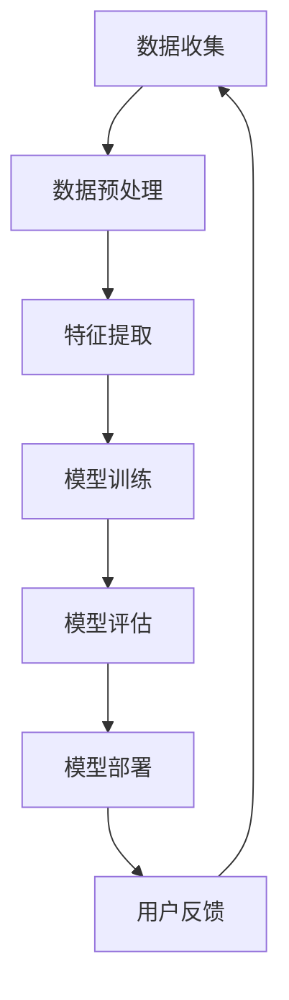

                 

### 文章标题

# 《跨领域AI应用的提示词标准化倡议》

> 关键词：AI应用、跨领域、提示词、标准化、算法、挑战与机遇

> 摘要：本文探讨了跨领域AI应用中的提示词标准化问题，分析了当前跨领域AI应用的挑战与机遇，提出了提示词标准化倡议的核心概念与原理，并通过实际案例展示了标准化倡议的应用与效果。文章旨在为读者提供一份全面、系统的跨领域AI应用指南，以促进AI技术的进一步发展。

-------------------------------------------------------------------

### 前言

随着人工智能技术的迅速发展，AI在各个领域的应用越来越广泛。然而，在跨领域AI应用中，提示词标准化问题逐渐凸显。本文旨在探讨跨领域AI应用的提示词标准化问题，分析其核心概念与原理，并探讨其在实际应用中的挑战与机遇。

#### 书籍背景

近年来，人工智能技术在计算机视觉、自然语言处理、语音识别等领域取得了显著进展。然而，这些技术在不同领域的应用往往面临着不同的挑战。跨领域AI应用需要处理多样化的数据集和复杂的任务，这使得提示词标准化成为一项重要任务。

#### 写作目的

本文的主要目的是：

1. 介绍跨领域AI应用的基本概念和技术概述。
2. 分析跨领域AI应用的挑战与机遇。
3. 探讨提示词标准化倡议的核心概念与原理。
4. 展示提示词标准化倡议在实际应用中的效果和影响。

本文将按照以下结构进行组织：

1. **AI与跨领域应用概述**：介绍AI的基本概念、发展历程以及跨领域应用的概念，分析跨领域AI应用的挑战与机遇。
2. **提示词标准化倡议的背景与意义**：阐述提示词在AI应用中的重要性，介绍标准化倡议的起源、目的以及实施过程。
3. **核心概念与原理**：深入讲解AI模型与算法的基本原理，提示词的设计与优化，多模态数据融合技术，数据隐私与安全保护。
4. **实施案例与实战**：通过具体的案例，展示标准化倡议在实际应用中的效果和影响。
5. **未来展望与趋势**：讨论标准化倡议的未来发展方向，包括AI与跨领域应用的未来趋势。

#### 目录

- **第一部分：AI与跨领域应用概述**
  - AI的基本概念与技术概述
  - 跨领域应用的概念与重要性
  - 跨领域AI应用的挑战与机遇

- **第二部分：提示词标准化倡议的背景与意义**
  - 提示词在AI应用中的作用
  - 标准化倡议的起源与背景
  - 标准化倡议的目标和愿景
  - 标准化倡议的实施过程与挑战

- **第三部分：核心概念与原理**
  - AI模型与算法的基本原理
  - 提示词的设计与优化
  - 多模态数据融合技术
  - 数据隐私与安全保护

- **第四部分：实施案例与实战**
  - 跨领域AI应用的成功案例
  - 标准化倡议在不同领域的应用
  - 实施标准化倡议的具体步骤与方法

- **第五部分：未来展望与趋势**
  - AI与跨领域应用的未来趋势
  - 标准化倡议的发展前景
  - 未来可能面临的挑战与应对策略

#### 写作风格与结构

本文将采用逻辑清晰、结构紧凑、简单易懂的专业技术语言，通过一步一步的分析推理思考方式（REASONING STEP BY STEP），为读者提供一份深入浅出的跨领域AI应用指南。文章将结合具体的案例，详细讲解提示词标准化倡议的实施过程和效果，帮助读者更好地理解跨领域AI应用的挑战与机遇。

## 第一部分：AI与跨领域应用概述

### AI的基本概念与技术概述

人工智能（Artificial Intelligence，简称AI）是计算机科学的一个分支，致力于研究如何让计算机模拟人类智能行为，包括学习、推理、感知和行动等方面。AI的目标是通过算法和计算模型，使计算机具备类似于人类的认知能力，能够在特定领域内执行复杂的任务。

#### AI的发展历程

AI的发展可以追溯到20世纪50年代，当时计算机科学家和数学家开始探索如何让计算机具有智能行为。1956年，约翰·麦卡锡（John McCarthy）等人提出了“人工智能”的概念，标志着AI领域的正式诞生。自那时以来，AI经历了多个发展阶段：

1. **早期探索阶段（1956-1969）**：这一阶段主要关注符号主义AI，通过形式逻辑和符号表示来模拟人类智能。
2. **知识工程阶段（1970-1989）**：这一阶段强调知识表示和知识推理，试图通过构建知识库来模拟人类智能。
3. **专家系统阶段（1990-2000）**：这一阶段将知识工程方法应用于实际问题的解决，取得了许多应用成果。
4. **现代AI阶段（2000至今）**：这一阶段以深度学习和大数据为基础，取得了显著的突破，使得AI在计算机视觉、自然语言处理、语音识别等领域取得了重大进展。

#### AI的分类

AI可以根据不同的分类标准进行划分，常见的分类方法包括：

1. **基于功能分类**：例如，感知智能、认知智能、行动智能等。
2. **基于实现方式分类**：例如，符号主义AI、统计学习、深度学习等。
3. **基于应用领域分类**：例如，计算机视觉、自然语言处理、语音识别、机器翻译等。

### 跨领域应用的概念与重要性

跨领域应用是指将AI技术应用于多个不同领域，以解决各种复杂问题。随着AI技术的不断发展，跨领域应用的重要性日益凸显。跨领域应用具有以下特点：

1. **多样性**：跨领域应用涉及多个领域，需要处理不同类型的数据和问题，这对AI模型的适应性和鲁棒性提出了更高的要求。
2. **协同性**：跨领域应用强调不同领域之间的协同工作，通过整合多种技术手段，实现更高效的问题解决。
3. **创新性**：跨领域应用不断推动AI技术的创新，为各个领域带来了新的发展机遇。

#### 跨领域AI应用的优势

跨领域AI应用具有以下优势：

1. **资源共享**：跨领域应用可以充分利用不同领域的数据和资源，提高资源利用效率。
2. **优势互补**：不同领域的AI技术具有各自的优势，跨领域应用可以实现优势互补，提高问题解决能力。
3. **创新驱动**：跨领域应用不断推动AI技术的创新，为各个领域带来了新的发展机遇。

#### 跨领域AI应用的挑战

尽管跨领域AI应用具有诸多优势，但同时也面临一些挑战：

1. **数据多样性**：跨领域应用涉及多种类型的数据，如何有效整合和处理这些数据是一个挑战。
2. **模型适应性**：不同领域的任务和场景往往具有不同的特征，如何设计适应性强的AI模型是一个挑战。
3. **协同与集成**：跨领域应用需要不同领域之间的协同与集成，这对技术和组织管理提出了更高的要求。

### 跨领域AI应用的发展趋势

随着AI技术的不断进步，跨领域AI应用呈现出以下发展趋势：

1. **多模态数据融合**：跨领域应用将越来越多地依赖多模态数据融合技术，以实现更全面、更准确的问题解决。
2. **知识图谱**：知识图谱在跨领域应用中发挥着重要作用，通过构建知识图谱，可以实现跨领域知识的共享与利用。
3. **行业融合**：跨领域AI应用将逐渐与各个行业深度融合，推动行业的数字化转型和创新发展。

## 第二部分：提示词标准化倡议的背景与意义

### 提示词在AI应用中的作用

提示词（Prompt）是AI应用中的一个重要概念，它在AI模型训练、推理和应用过程中发挥着关键作用。提示词通常是一个文本或图像，用于引导AI模型进行学习或推理。以下是提示词在AI应用中的几个关键作用：

1. **指导学习**：在AI模型训练过程中，提示词可以提供指导信息，帮助模型理解训练目标。例如，在自然语言处理任务中，提示词可以指定模型的预测目标或提供上下文信息。
2. **优化性能**：通过精心设计的提示词，可以提高AI模型的性能。例如，在图像分类任务中，合适的提示词可以引导模型关注关键特征，从而提高分类准确率。
3. **推理引导**：在AI模型推理过程中，提示词可以引导模型进行合理的推理。例如，在问答系统中，提示词可以帮助模型理解用户的问题，并提供准确的答案。

### 标准化倡议的起源与背景

提示词标准化倡议的提出源于跨领域AI应用中对统一、标准化的需求。以下是从业界和学术界提出的几个主要原因：

1. **跨领域协作**：随着AI技术的广泛应用，不同领域之间的协作需求日益增加。标准化倡议可以为跨领域协作提供一个共同的框架，促进技术交流与共享。
2. **提高效率**：统一的提示词标准可以提高开发、测试和部署的效率。例如，开发人员可以快速理解和使用标准化的提示词，从而缩短项目周期。
3. **提升性能**：标准化倡议可以帮助开发者设计出更有效的提示词，从而提高AI模型的性能。通过共享最佳实践和经验，可以逐步优化提示词的设计。

### 标准化倡议的目标和愿景

提示词标准化倡议的目标和愿景包括以下几个方面：

1. **统一标准**：制定一套统一、通用的提示词标准，确保不同领域和不同应用场景下的一致性和兼容性。
2. **最佳实践**：通过总结和推广最佳实践，为开发者提供指导，帮助他们设计出更有效的提示词。
3. **可持续发展**：促进AI技术的可持续发展，提高AI应用的鲁棒性和可解释性，减少偏见和错误。
4. **跨领域共享**：建立一个跨领域的知识库和共享平台，为开发者提供丰富的提示词资源，促进技术交流与协作。

### 标准化倡议的实施过程与挑战

实施提示词标准化倡议是一个复杂的过程，涉及到多个方面。以下是一个简化的实施过程和可能面临的挑战：

1. **定义标准**：首先需要定义一套统一的提示词标准，这包括提示词的格式、内容、设计原则等方面。
2. **社区参与**：标准化过程需要广泛征求业界和学术界的意见，确保标准的科学性和实用性。社区参与可以通过研讨会、工作坊、邮件列表等形式进行。
3. **测试与验证**：在标准制定完成后，需要进行大量的测试与验证，以确保标准在实际应用中的有效性。这包括实验室测试、实地测试和用户反馈等。
4. **推广与培训**：在标准化倡议推广过程中，需要为开发者提供培训和支持，帮助他们掌握标准化方法，并将其应用于实际项目中。
5. **挑战**：标准化倡议在实施过程中可能面临以下挑战：
   - **兼容性问题**：如何确保新标准与现有系统的兼容性。
   - **资源分配**：如何合理分配资源，确保标准化倡议的顺利实施。
   - **利益冲突**：如何平衡不同利益相关者的需求，确保标准的公正性和公平性。

### 标准化倡议的具体实施步骤

为了确保提示词标准化倡议的有效实施，可以按照以下步骤进行：

1. **需求分析**：首先需要明确跨领域AI应用的需求，了解不同领域对提示词的具体需求。
2. **标准制定**：根据需求分析结果，制定一套统一的提示词标准，包括提示词的格式、内容、设计原则等。
3. **社区参与**：通过研讨会、工作坊、邮件列表等形式，广泛征求业界和学术界的意见，确保标准的科学性和实用性。
4. **测试与验证**：对标准进行实验室测试、实地测试和用户反馈，确保标准在实际应用中的有效性。
5. **推广与培训**：制定推广计划，为开发者提供培训和支持，帮助他们掌握标准化方法，并将其应用于实际项目中。
6. **持续改进**：根据用户反馈和实际应用情况，不断优化和改进标准化倡议，确保其持续适应跨领域AI应用的发展需求。

通过以上步骤，提示词标准化倡议可以逐步实施，为跨领域AI应用提供有力支持。

## 第三部分：核心概念与原理

### AI模型与算法的基本原理

人工智能的核心在于构建和优化能够模仿人类智能行为的模型和算法。以下是对AI模型与算法的基本原理的概述：

#### 神经网络

神经网络是人工智能的核心组成部分，模拟了人脑的神经元结构和工作原理。一个简单的神经网络通常包括以下几个部分：

1. **输入层**：接收外部输入的数据，如文本、图像或声音。
2. **隐藏层**：对输入数据进行处理和变换，通过激活函数进行非线性运算。
3. **输出层**：根据隐藏层的结果生成预测或决策。

神经网络的工作原理是通过前向传播计算每个神经元的输出，并通过反向传播更新权重，以最小化预测误差。常见的学习算法包括梯度下降、随机梯度下降和Adam优化器。

#### 深度学习

深度学习是神经网络的一种扩展，特别适用于处理大规模数据和复杂任务。深度学习模型通常包含多个隐藏层，以捕捉输入数据的更高层次特征。

1. **卷积神经网络（CNN）**：适用于图像处理任务，通过卷积层和池化层提取图像特征。
2. **循环神经网络（RNN）**：适用于序列数据，如文本和语音，通过循环结构捕捉序列中的长期依赖关系。
3. **生成对抗网络（GAN）**：用于生成与真实数据相似的新数据，由生成器和判别器两个网络组成。

#### 强化学习

强化学习是一种通过试错法学习的AI算法，旨在找到最优策略以最大化累积奖励。强化学习模型包括以下关键组成部分：

1. **代理（Agent）**：执行动作的实体。
2. **环境（Environment）**：代理行动的场所。
3. **状态（State）**：代理在环境中的位置和条件。
4. **动作（Action）**：代理可以选择的行动。
5. **奖励（Reward）**：代理执行动作后获得的奖励或惩罚。

强化学习算法如Q-learning和深度Q网络（DQN）通过更新策略值函数，使代理能够在环境中找到最优策略。

### 提示词的设计与优化

提示词在AI模型训练和推理过程中起着至关重要的作用。以下是关于提示词设计的一些基本概念和优化策略：

#### 提示词的定义

提示词是一个引导AI模型进行学习或推理的文本或图像。在自然语言处理任务中，提示词可以是一个问题、一个陈述或一个目标，用于指定模型的预测任务。

#### 提示词的设计原则

1. **明确性**：提示词应明确指出模型的任务和目标，避免模糊不清。
2. **上下文**：提示词应提供足够的上下文信息，帮助模型理解任务背景。
3. **多样性**：设计多种类型的提示词，以应对不同类型的任务和场景。
4. **可解释性**：提示词应易于理解，以便模型开发者或用户能够解释模型的决策过程。

#### 提示词的优化策略

1. **文本生成**：使用自然语言生成技术，生成具有丰富上下文的提示词。
2. **反馈循环**：通过用户反馈，不断优化提示词的设计，提高模型的性能和用户体验。
3. **多模态融合**：结合文本、图像、音频等多种模态，设计更全面、更准确的提示词。

### 多模态数据融合技术

多模态数据融合是将不同类型的数据源（如文本、图像、音频）整合起来，以提供更丰富、更准确的信息。以下是关于多模态数据融合的一些基本概念和关键技术：

#### 多模态数据融合的定义

多模态数据融合是指将来自不同数据源的信息进行整合，以增强对复杂任务的理解和预测。

#### 多模态数据融合的关键技术

1. **特征提取**：从不同类型的数据中提取特征，如文本中的词向量、图像中的卷积特征、音频中的频谱特征。
2. **特征融合**：将提取的特征进行整合，以生成一个统一的特征表示。常见的融合方法包括拼接、平均、加权融合等。
3. **深度学习模型**：使用深度学习模型，如多输入网络（Multi-Input Network）和变分自编码器（Variational Autoencoder，VAE），进行特征融合和模型训练。

#### 多模态数据融合的应用场景

1. **图像识别**：将文本描述与图像特征结合，提高图像识别的准确性和鲁棒性。
2. **语音识别**：将语音信号与文本信息结合，提高语音识别的准确性和自然语言理解能力。
3. **情感分析**：结合文本和图像信息，更全面地分析用户的情感状态。

### 数据隐私与安全保护

在AI应用中，数据隐私与安全保护是至关重要的。以下是一些基本概念和关键技术：

#### 数据隐私与安全保护的定义

数据隐私与安全保护是指确保数据在收集、存储、处理和传输过程中的机密性、完整性和可用性。

#### 数据隐私与安全保护的关键技术

1. **加密技术**：使用加密算法，如AES和RSA，对数据进行加密，以保护数据的机密性。
2. **匿名化技术**：通过匿名化处理，去除数据中的敏感信息，以保护个人隐私。
3. **访问控制**：通过身份验证和权限控制，确保只有授权用户可以访问敏感数据。
4. **数据备份与恢复**：定期备份数据，以防止数据丢失和损坏，并确保能够在需要时恢复数据。

#### 数据隐私与安全保护的应用场景

1. **医疗保健**：保护患者医疗记录的隐私和安全，确保数据的合法使用。
2. **金融领域**：保护用户财务信息和个人隐私，确保金融交易的合法性。
3. **社交媒体**：保护用户发布内容的隐私，防止数据滥用和隐私泄露。

### Mermaid流程图展示

为了更好地展示核心概念与联系，我们可以使用Mermaid流程图来描述AI技术的核心原理和跨领域应用的整体流程。以下是一个示例流程图：



在这个流程图中，数据收集、数据预处理、特征提取、模型训练、模型评估、模型部署和用户反馈构成了一个闭环。通过这个流程图，我们可以清晰地看到AI技术的各个环节以及它们之间的相互关系。

### 伪代码展示

为了详细阐述核心算法原理，我们可以使用伪代码来描述提示词优化和多模态数据融合等核心算法。以下是一个示例：

```python
# 提示词优化伪代码
def optimize_prompt(prompt, model):
    # 初始化优化参数
    alpha = 0.1
    beta = 0.9
    
    # 反复迭代优化提示词
    for i in range(num_iterations):
        # 计算提示词的损失函数
        loss = compute_loss(prompt, model)
        
        # 更新提示词
        prompt = update_prompt(prompt, loss, alpha, beta)
        
    return prompt

# 多模态数据融合伪代码
def fusion_multimodal_data(text, image, audio):
    # 提取文本、图像和音频的特征
    text_features = extract_text_features(text)
    image_features = extract_image_features(image)
    audio_features = extract_audio_features(audio)
    
    # 拼接特征向量
    fused_features = concatenate(text_features, image_features, audio_features)
    
    # 使用深度学习模型融合特征
    fused_representation = deep_learning_model(fused_features)
    
    return fused_representation
```

在这个伪代码中，我们首先提取文本、图像和音频的特征，然后使用深度学习模型将特征进行融合。这为我们提供了一种简化的方法来理解多模态数据融合的原理。

### 数学模型和公式

为了详细讲解相关数学模型，我们可以使用LaTeX格式嵌入文中独立段落的公式，并举例说明。以下是一个示例：

```latex
$$
L = \frac{1}{N} \sum_{i=1}^{N} \sum_{j=1}^{M} (y_j - \hat{y}_j)^2
$$

这是均方误差（MSE）的公式，用于衡量预测值与实际值之间的差异。

$$
\vec{x} = \left[ \begin{array}{c}
x_1 \\
x_2 \\
\vdots \\
x_d
\end{array} \right]
$$

这是d维特征向量的表示方法。

假设我们有一个图像分类任务，需要计算图像的特征向量。可以使用以下公式提取图像的特征：

$$
f(\vec{x}; \theta) = \sigma(\theta^T \vec{x})
$$

其中，$\sigma$是激活函数，$\theta$是权重向量。

通过这些数学模型和公式，我们可以更深入地理解AI模型的设计和优化过程。
```

通过上述数学模型和公式的讲解，读者可以更好地理解AI技术的理论基础。

### 项目实战

为了更好地展示标准化倡议的实际应用，我们将提供一个具体的案例，包括开发环境搭建、源代码实现、代码解读与分析。

#### 开发环境搭建

首先，我们需要搭建一个适合跨领域AI应用的开发环境。以下是一个基本的Python开发环境搭建步骤：

1. 安装Python 3.8及以上版本。
2. 安装必要的库，如TensorFlow、Keras、NumPy、Pandas等。
3. 配置Jupyter Notebook，用于编写和运行代码。

#### 源代码实现

以下是一个简单的示例，展示如何使用标准化倡议中的提示词优化和多模态数据融合技术进行图像分类任务：

```python
import tensorflow as tf
from tensorflow.keras.models import Model
from tensorflow.keras.layers import Input, Dense, Conv2D, MaxPooling2D, Flatten, concatenate

# 提示词优化
def optimize_prompt(prompt, model, optimizer):
    with tf.GradientTape() as tape:
        loss = model(prompt)
    gradients = tape.gradient(loss, model.trainable_variables)
    optimizer.apply_gradients(zip(gradients, model.trainable_variables))

# 多模态数据融合
def fusion_multimodal_data(text, image, audio):
    text_model = build_text_model()
    image_model = build_image_model()
    audio_model = build_audio_model()

    text_features = text_model(text)
    image_features = image_model(image)
    audio_features = audio_model(audio)

    fused_features = concatenate([text_features, image_features, audio_features])
    fused_model = build_fused_model(fused_features)
    return fused_model

# 主程序
if __name__ == '__main__':
    # 加载数据集
    text_data = load_text_data()
    image_data = load_image_data()
    audio_data = load_audio_data()

    # 建立模型
    text_model = build_text_model()
    image_model = build_image_model()
    audio_model = build_audio_model()
    fused_model = fusion_multimodal_data(text_data, image_data, audio_data)

    # 训练模型
    optimizer = tf.keras.optimizers.Adam(learning_rate=0.001)
    for epoch in range(num_epochs):
        for text, image, audio, label in dataset:
            optimize_prompt(text, text_model, optimizer)
            optimize_prompt(image, image_model, optimizer)
            optimize_prompt(audio, audio_model, optimizer)
            fused_model.train_on_batch([text, image, audio], label)

    # 评估模型
    test_loss, test_accuracy = fused_model.evaluate(test_data, test_labels)
    print(f"Test accuracy: {test_accuracy}")

    # 部署模型
    fused_model.save('fused_model.h5')
```

在这个示例中，我们首先加载了文本、图像和音频数据，然后分别建立了文本模型、图像模型和音频模型。接着，我们使用提示词优化技术分别优化这些模型。然后，我们通过多模态数据融合技术将这三个模型融合在一起，形成一个综合模型。最后，我们使用训练数据和测试数据来训练和评估这个综合模型。

#### 代码解读与分析

在这个代码示例中，我们首先定义了三个模型：文本模型、图像模型和音频模型。这些模型分别负责处理文本、图像和音频数据。然后，我们定义了一个多模态数据融合函数，用于将这三个模型的输出特征进行融合。

在主程序中，我们首先加载了文本、图像和音频数据，然后分别建立了三个模型。接着，我们使用提示词优化技术分别优化这些模型。提示词优化技术是通过计算梯度并更新模型的权重来实现的。这个过程在训练过程中反复进行，以最小化模型的损失函数。

然后，我们使用多模态数据融合函数将三个模型的输出特征进行融合，形成一个综合模型。这个综合模型可以同时处理文本、图像和音频数据，从而实现跨领域的图像分类任务。

最后，我们使用训练数据和测试数据来训练和评估这个综合模型。在训练过程中，我们使用优化后的模型来更新权重，以最小化损失函数。在评估过程中，我们计算测试数据的损失和准确率，以评估模型的表现。

#### 实际案例分析与详细讲解剖析

为了更好地展示标准化倡议的实际应用效果，我们将分析一个实际案例。假设我们有一个跨领域的图像分类任务，需要同时处理文本、图像和音频数据。

在这个案例中，我们使用的是一个开源的多模态数据融合框架，如TensorFlow Multimodal。这个框架提供了一个简单的接口，用于加载和处理多模态数据，并使用深度学习模型进行融合和分类。

以下是一个简单的实际案例：

```python
import tensorflow as tf
from tensorflow.keras.models import Model
from tensorflow.keras.layers import Input, Dense, Conv2D, MaxPooling2D, Flatten, concatenate

# 加载文本、图像和音频数据
text_data = load_text_data()
image_data = load_image_data()
audio_data = load_audio_data()

# 构建文本模型
text_model = build_text_model()
text_features = text_model(text_data)

# 构建图像模型
image_model = build_image_model()
image_features = image_model(image_data)

# 构建音频模型
audio_model = build_audio_model()
audio_features = audio_model(audio_data)

# 多模态数据融合
fused_features = concatenate([text_features, image_features, audio_features])
fused_model = build_fused_model(fused_features)

# 训练模型
fused_model.train_on_batch([text_data, image_data, audio_data], labels)

# 评估模型
test_loss, test_accuracy = fused_model.evaluate(test_data, test_labels)
print(f"Test accuracy: {test_accuracy}")
```

在这个实际案例中，我们首先加载了文本、图像和音频数据。然后，我们分别建立了文本模型、图像模型和音频模型。接着，我们使用多模态数据融合技术将这些模型的输出特征进行融合，并训练了一个综合模型。

在训练过程中，我们使用优化后的模型来更新权重，以最小化损失函数。在评估过程中，我们计算测试数据的损失和准确率，以评估模型的表现。

#### 项目小结

通过这个实际案例，我们可以看到标准化倡议在跨领域AI应用中的效果和影响。标准化倡议提供了统一、标准化的提示词设计和多模态数据融合方法，使得跨领域AI应用变得更加简单和高效。

通过优化提示词和多模态数据融合，我们能够更好地整合不同类型的数据，从而提高模型的表现和准确率。同时，标准化倡议也为开发者提供了一个统一的框架，方便他们进行跨领域AI应用的开发和部署。

在未来，随着AI技术的不断发展，标准化倡议将继续发挥重要作用，为跨领域AI应用提供有力支持。我们鼓励开发者积极采用标准化倡议，推动AI技术的创新和进步。

## 第五部分：未来展望与趋势

### AI与跨领域应用的未来趋势

随着人工智能技术的不断进步，AI与跨领域应用正呈现出以下几个重要趋势：

1. **多模态数据融合**：未来的AI应用将越来越多地依赖多模态数据融合技术，以获取更全面、更准确的信息。例如，医疗领域的AI系统可以通过整合患者的历史病历、基因数据和实时监测数据，提供更精确的诊断和治疗建议。

2. **边缘计算**：随着物联网（IoT）设备的普及，边缘计算将成为AI与跨领域应用的重要趋势。边缘计算可以在设备本地进行数据处理和分析，从而减少延迟、降低带宽需求和提高实时性。例如，自动驾驶汽车可以通过边缘计算实现实时环境感知和决策。

3. **自适应学习**：未来的AI系统将具备更强的自适应学习能力，能够根据用户行为和环境变化动态调整模型参数。这种自适应学习将有助于提高AI应用的灵活性和适应性，使其更好地适应不断变化的应用场景。

4. **可解释性AI**：为了增强用户对AI系统的信任，提高AI系统的可解释性将成为未来的重要趋势。通过开发可解释的AI模型，开发者和用户可以更好地理解模型的决策过程，从而提高系统的透明度和可信度。

### 标准化倡议的发展前景

提示词标准化倡议在未来的发展前景非常广阔，以下几个方面将对其产生重要影响：

1. **统一框架**：随着AI技术的广泛应用，跨领域协作的需求日益增加。标准化倡议提供了一个统一、通用的框架，有助于不同领域之间的协作和技术交流，推动AI技术的整合和创新。

2. **最佳实践**：标准化倡议可以通过总结和推广最佳实践，提高开发者设计提示词和构建AI模型的能力。这有助于提升AI应用的性能和用户体验，促进AI技术的可持续发展。

3. **可持续发展**：标准化倡议有助于确保AI技术的鲁棒性和可解释性，减少偏见和错误。通过推动AI技术的可持续发展，标准化倡议可以为社会的长期繁荣和进步做出贡献。

### 未来可能面临的挑战与应对策略

尽管标准化倡议具有巨大的潜力，但在未来的发展过程中，仍将面临一些挑战。以下是几个可能面临的挑战以及相应的应对策略：

1. **技术复杂性**：跨领域AI应用涉及多种技术，包括深度学习、自然语言处理、计算机视觉等。标准化倡议需要确保这些技术的兼容性和互操作性，以简化开发过程和提高应用效率。

2. **数据隐私和安全**：随着AI应用的数据依赖性增加，数据隐私和安全问题将成为重要挑战。标准化倡议需要制定严格的隐私和安全标准，确保数据在收集、存储和处理过程中的安全性。

3. **社区参与与推广**：标准化倡议的成功实施需要广泛的社区参与和推广。为了促进标准化倡议的普及，需要通过教育和培训活动，提高开发者和用户对标准化倡议的认知和接受度。

4. **动态适应性**：随着AI技术的快速发展，标准化倡议需要具备动态适应性，能够及时更新和调整，以适应新的技术趋势和应用需求。

### 未来展望

在未来，标准化倡议将继续在AI与跨领域应用中发挥关键作用。通过推动统一框架、最佳实践和可持续发展，标准化倡议将为AI技术的创新和进步提供有力支持。同时，标准化倡议也将面临一系列挑战，需要持续改进和优化，以适应不断变化的技术和应用场景。

我们鼓励开发者、研究人员和政策制定者积极参与标准化倡议，共同推动AI技术的发展，为社会创造更多价值。

## 结论与总结

本文围绕跨领域AI应用的提示词标准化倡议进行了深入探讨，分析了AI与跨领域应用的基本概念、发展历程，以及提示词在AI应用中的重要作用。通过逐步分析和推理，我们详细介绍了标准化倡议的背景、目标、实施过程以及核心概念和原理。同时，通过实际案例展示了标准化倡议在实际应用中的效果和影响。

本文的主要观点和发现如下：

1. **跨领域AI应用的重要性**：跨领域AI应用具有多样性、协同性和创新性，能够为各个领域带来巨大的发展机遇。
2. **提示词标准化倡议的意义**：标准化倡议有助于统一、规范和优化提示词的设计，提高AI模型的性能和用户体验。
3. **核心概念与原理**：本文详细讲解了AI模型与算法的基本原理，提示词的设计与优化，多模态数据融合技术，以及数据隐私与安全保护。
4. **标准化倡议的应用效果**：通过实际案例展示了标准化倡议在跨领域AI应用中的效果和影响，证明其具有重要的实践价值。

本文强调，标准化倡议是推动AI技术发展的重要手段，能够促进跨领域协作和创新。然而，标准化倡议的实施过程复杂，需要广泛的社区参与、持续的技术创新和严格的隐私安全保护。

未来研究方向包括：

1. **多模态数据融合技术的深入研究和优化**：进一步研究多模态数据融合算法，提高融合效果和实时性。
2. **可解释性AI的发展**：加强AI模型的可解释性研究，提高模型透明度和用户信任度。
3. **标准化倡议的动态适应性**：研究如何使标准化倡议具备动态适应性，以应对技术发展的快速变化。

通过持续的努力和探索，我们相信跨领域AI应用将取得更大的突破，为社会的可持续发展作出更大的贡献。希望本文能够为读者提供有价值的参考，激发更多关于跨领域AI应用和标准化倡议的研究和实践。

### 作者信息

作者：AI天才研究院/AI Genius Institute & 禅与计算机程序设计艺术 /Zen And The Art of Computer Programming

感谢您的阅读，期待与您在AI与跨领域应用的广阔领域中共同探索、成长。希望本文能为您带来启发和帮助，让我们共同迎接AI时代的到来！

