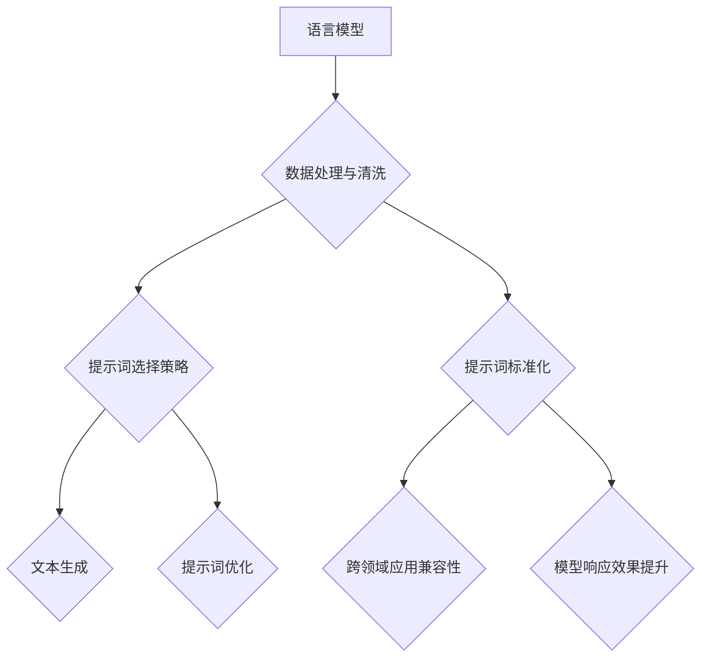

                 

### 文章标题

《跨领域AI应用的提示词标准化评估》

### 关键词

AI应用，提示词标准化，跨领域，性能评估，数据处理，模型训练

### 摘要

随着人工智能技术的快速发展，跨领域AI应用成为研究热点。提示词作为人工智能与人类交互的重要媒介，其标准化直接影响模型的性能和应用效果。本文从跨领域AI应用的需求出发，深入探讨了提示词标准化的背景、核心原理和实践方法。通过分析提示词标准化的理论基础、关键步骤及跨领域应用实践，本文提出了提示词标准化的评估体系，旨在为跨领域AI应用的研发提供有效的指导。

## 目录大纲

### 第一部分：AI应用的提示词标准化概述

#### 1.1 提示词标准化的背景与重要性

##### 1.1.1 提示词标准化的定义与意义

##### 1.1.2 提示词标准化的发展历程

##### 1.1.3 提示词标准化在AI应用中的现状

### 1.2 跨领域AI应用中的挑战

##### 1.2.1 跨领域数据不一致性

##### 1.2.2 跨领域模型适应性

##### 1.2.3 跨领域性能评估需求

### 第二部分：提示词标准化的核心原理

#### 2.1 提示词标准化的理论基础

##### 2.1.1 语言模型与提示词

##### 2.1.2 数据处理与清洗

##### 2.1.3 提示词选择策略

#### 2.2 提示词标准化的关键步骤

##### 2.2.1 提示词构建

##### 2.2.2 提示词评估

##### 2.2.3 提示词优化

### 第三部分：跨领域AI应用的提示词标准化实践

#### 3.1 跨领域数据集构建

##### 3.1.1 数据集来源与质量评估

##### 3.1.2 数据预处理与标准化

#### 3.2 跨领域模型训练与优化

##### 3.2.1 模型选择与架构设计

##### 3.2.2 模型训练策略

##### 3.2.3 模型评估与调优

#### 3.3 跨领域性能评估

##### 3.3.1 性能评估指标

##### 3.3.2 性能评估方法

##### 3.3.3 性能评估结果分析

### 第四部分：提示词标准化的应用与展望

#### 4.1 提示词标准化在不同领域的应用案例

##### 4.1.1 医疗健康领域

##### 4.1.2 金融领域

##### 4.1.3 教育领域

#### 4.2 提示词标准化的未来发展趋势

##### 4.2.1 技术创新与挑战

##### 4.2.2 行业应用前景

##### 4.2.3 标准化协作与规范制定

### 附录

#### A.1 提示词标准化工具与资源

##### A.1.1 提示词构建工具

##### A.1.2 提示词评估工具

##### A.1.3 提示词优化工具

#### A.2 参考文献

$$
\text{作者：AI天才研究院/AI Genius Institute & 禅与计算机程序设计艺术 /Zen And The Art of Computer Programming}
$$## 第一部分：AI应用的提示词标准化概述

### 1.1 提示词标准化的背景与重要性

#### 1.1.1 提示词标准化的定义与意义

提示词标准化（Prompt Standardization）是指针对人工智能模型中提示词（Prompts）的规范化处理过程。提示词是用户与AI模型交互的输入，其质量直接影响模型的理解和响应效果。在AI应用中，提示词标准化有助于确保模型在不同应用场景中的一致性和可靠性。

提示词标准化的意义在于：

1. **提高交互质量**：标准化后的提示词能够提高用户与AI模型的交互体验，减少误解和错误响应。
2. **增强模型泛化能力**：通过标准化，模型能够更好地适应不同的应用场景，提高泛化能力。
3. **降低研发成本**：统一标准化的提示词可以减少模型开发和优化的工作量，降低研发成本。
4. **促进跨领域应用**：标准化提示词有助于跨领域AI应用的开发，实现模型在不同领域的有效利用。

#### 1.1.2 提示词标准化的发展历程

提示词标准化的发展历程可以追溯到人工智能的早期研究。随着语言模型的进步，提示词标准化的需求逐渐增加。以下为关键发展阶段：

1. **早期探索**：20世纪80年代，专家系统和知识表示技术开始使用自然语言作为交互方式，提示词标准化初步成形。
2. **语料库建设**：90年代，大规模语料库的建设推动了提示词标准化的实践，如WordNet、Text Corpus等。
3. **深度学习兴起**：2010年后，深度学习技术的快速发展使得提示词标准化成为研究热点，许多模型如BERT、GPT等对提示词标准化提出了新的要求。
4. **跨领域应用**：近年来，随着跨领域AI应用的增加，提示词标准化技术不断发展，如多模态学习、跨领域迁移学习等。

#### 1.1.3 提示词标准化在AI应用中的现状

当前，提示词标准化在AI应用中已取得一定成果，但还存在以下挑战：

1. **应用领域局限**：大多数提示词标准化研究集中在自然语言处理领域，其他领域如计算机视觉、语音识别等的研究较少。
2. **标准化程度不一**：不同的AI应用对提示词标准化的需求不同，标准化的程度和方式也有所差异。
3. **评估体系缺失**：缺乏统一的提示词标准化评估体系，难以衡量不同方法的效果。
4. **数据不足**：高质量的提示词数据集较少，制约了提示词标准化的研究和应用。

### 1.2 跨领域AI应用中的挑战

#### 1.2.1 跨领域数据不一致性

跨领域AI应用面临的一个主要挑战是数据不一致性。不同领域的数据格式、语义和特征分布可能存在显著差异，导致AI模型难以直接迁移和应用。例如，医疗健康领域的文本数据与金融领域的文本数据在表达方式和用词上存在很大差异。为了实现跨领域应用，需要对这些不一致性进行有效的处理和标准化。

#### 1.2.2 跨领域模型适应性

跨领域模型适应性是另一个关键挑战。传统单领域模型在特定领域表现优异，但在跨领域应用中，模型的性能可能显著下降。这是因为单领域模型在训练过程中只学习了特定领域的特征和模式，缺乏对其他领域特征和模式的识别能力。为了提高跨领域模型的适应性，需要采用有效的跨领域学习策略，如迁移学习、多任务学习和跨模态学习等。

#### 1.2.3 跨领域性能评估需求

跨领域性能评估是跨领域AI应用中的一项重要任务。传统的性能评估方法往往只关注特定领域的指标，难以全面评估模型在跨领域的表现。为了准确评估跨领域模型，需要设计一套综合性的评估体系，涵盖多个维度，如准确性、可解释性、鲁棒性和泛化能力等。

### 1.3 跨领域AI应用的需求

跨领域AI应用的需求日益增长，主要体现在以下几个方面：

1. **多样化应用场景**：跨领域AI应用能够满足多种实际需求，如智能客服、智能医疗、智能金融等。
2. **资源共享**：通过跨领域应用，可以充分利用不同领域的知识和资源，提高模型的利用效率。
3. **技术创新**：跨领域AI应用推动了新技术的研发和应用，如多模态学习、跨领域迁移学习等。
4. **行业突破**：跨领域AI应用有望在多个行业领域实现突破，带来巨大的商业价值和经济效益。

总之，跨领域AI应用的提示词标准化是当前人工智能领域的一个重要研究方向。通过深入探讨提示词标准化的背景、核心原理和实践方法，可以为跨领域AI应用提供有效的技术支持和指导。接下来，本文将详细分析提示词标准化的理论基础和关键步骤。<!--mermaid流程图开始-->```mermaid
graph TD
A[提示词标准化] --> B{理论基础}
B --> C{语言模型与提示词}
B --> D{数据处理与清洗}
B --> E{提示词选择策略}
B --> F{关键步骤}
F --> G{提示词构建}
F --> H{提示词评估}
F --> I{提示词优化}
```

<!--mermaid流程图结束-->## 第二部分：提示词标准化的核心原理

### 2.1 提示词标准化的理论基础

提示词标准化的理论基础主要涉及语言模型、数据处理与清洗以及提示词选择策略。这些理论基础构成了提示词标准化方法的框架，并指导实际操作。

#### 2.1.1 语言模型与提示词

语言模型（Language Model）是自然语言处理（NLP）中的一种核心技术，用于预测文本序列的概率分布。常见的语言模型包括N-gram模型、循环神经网络（RNN）模型、变换器（Transformer）模型等。语言模型在提示词标准化中的作用主要体现在：

1. **文本生成**：语言模型能够根据提示词生成合适的响应文本，从而提高用户与AI模型的交互体验。
2. **提示词优化**：通过分析语言模型对提示词的响应，可以识别出提示词中的不足之处，进行优化。
3. **提示词标准化**：语言模型可以帮助在不同领域之间进行提示词的转换和适配，实现跨领域应用的兼容性。

#### 2.1.2 数据处理与清洗

数据处理与清洗是提示词标准化的重要环节。高质量的数据是模型训练和优化的基础。以下为数据处理与清洗的关键步骤：

1. **数据收集**：从不同的数据源收集相关数据，包括文本数据、图像数据、音频数据等。
2. **数据预处理**：对数据进行清洗和预处理，包括去除无效数据、填充缺失值、统一数据格式等。
3. **特征提取**：从原始数据中提取关键特征，为模型训练提供输入。
4. **数据平衡**：对于不平衡的数据集，采取数据增强、过采样或欠采样等方法进行平衡。
5. **数据标准化**：对数据进行标准化处理，如归一化、标准化等，以提高模型的训练效果。

#### 2.1.3 提示词选择策略

提示词选择策略是提示词标准化的关键，直接影响模型的理解和响应效果。以下为几种常见的提示词选择策略：

1. **关键词提取**：从文本数据中提取关键词，作为提示词的核心内容。
2. **语义分析**：利用自然语言处理技术对文本进行语义分析，提取出具有代表性的语义信息作为提示词。
3. **用户反馈**：根据用户反馈对提示词进行调整和优化，提高用户满意度。
4. **上下文关联**：考虑上下文信息，生成与上下文紧密相关的提示词，提高模型的响应准确性。

#### 2.1.4 提示词标准化的理论基础关系架构

为了更好地理解提示词标准化的理论基础，我们可以通过Mermaid流程图来展示各部分之间的关系：



在这个流程图中，语言模型、数据处理与清洗、提示词选择策略共同构成了提示词标准化的理论基础，这些基础理论通过提示词标准化实现跨领域应用兼容性和模型响应效果提升。

### 2.2 提示词标准化的关键步骤

提示词标准化的关键步骤包括提示词构建、提示词评估和提示词优化。这些步骤相互关联，共同构成了提示词标准化的完整流程。

#### 2.2.1 提示词构建

提示词构建是指根据特定的需求和应用场景，生成合适的提示词。以下为提示词构建的关键步骤：

1. **需求分析**：明确应用场景和用户需求，确定提示词的主题和内容。
2. **数据准备**：收集相关的文本数据，包括文档、新闻、论文等，为提示词构建提供素材。
3. **预处理**：对收集的文本数据进行分析和预处理，包括去除停用词、进行词性标注、分词等。
4. **关键词提取**：利用自然语言处理技术，从预处理后的文本数据中提取关键词。
5. **提示词生成**：根据关键词和需求，生成具有代表性的提示词。

以下是一个简化的提示词构建的伪代码示例：

```python
def generate_prompt(data, keywords, max_length):
    # 初始化提示词列表
    prompts = []

    # 遍历关键词列表
    for keyword in keywords:
        # 构建提示词
        prompt = "基于" + keyword + "的AI应用，主要解决以下问题："
        
        # 提取相关文本内容
        context = extract_context(data, keyword, max_length)
        
        # 添加上下文信息
        prompt += context
        
        # 添加结束符
        prompt += "请提出您的问题或需求。"

        # 添加提示词到列表
        prompts.append(prompt)

    return prompts
```

#### 2.2.2 提示词评估

提示词评估是指对生成的提示词进行质量评估，以确定其是否满足应用需求。以下为提示词评估的关键步骤：

1. **评估指标**：确定评估指标，如响应准确性、响应时间、用户满意度等。
2. **评估方法**：采用自动化评估方法，如基于机器学习的方法或基于用户反馈的方法。
3. **评估结果**：对提示词进行评估，并记录评估结果。

以下是一个简化的提示词评估的伪代码示例：

```python
def evaluate_prompt(prompt, model):
    # 初始化评估结果
    results = []

    # 生成响应文本
    response = model.generate_response(prompt)

    # 计算评估指标
    accuracy = calculate_accuracy(response, ground_truth)
    response_time = calculate_response_time()

    # 添加评估结果到列表
    results.append({
        'prompt': prompt,
        'response': response,
        'accuracy': accuracy,
        'response_time': response_time
    })

    return results
```

#### 2.2.3 提示词优化

提示词优化是指根据评估结果，对提示词进行调整和改进，以提高其质量。以下为提示词优化的关键步骤：

1. **分析评估结果**：分析评估结果，识别提示词中的问题和不足。
2. **调整提示词**：根据分析结果，对提示词进行调整和优化，如修改关键词、添加上下文信息等。
3. **重新评估**：对优化后的提示词进行重新评估，验证优化效果。

以下是一个简化的提示词优化的伪代码示例：

```python
def optimize_prompt(prompt, results):
    # 初始化优化后的提示词
    optimized_prompt = prompt

    # 遍历评估结果
    for result in results:
        # 如果响应准确性较低，考虑增加上下文信息
        if result['accuracy'] < threshold:
            optimized_prompt += "进一步了解以下背景信息："

            # 添加上下文信息
            optimized_prompt += result['context']

    return optimized_prompt
```

通过以上步骤，我们可以构建一个完整的提示词标准化流程，从而实现高质量的提示词生成和应用。接下来，本文将探讨跨领域AI应用的提示词标准化实践。<!--mermaid流程图开始-->```mermaid
graph TD
A[数据集构建] --> B{数据源选择}
B --> C{数据质量评估}
C --> D{数据预处理}
D --> E{数据标准化}
E --> F{数据集构建完成}
A --> G{模型训练与优化}
G --> H{模型架构设计}
G --> I{训练策略}
G --> J{模型评估与调优}
```

<!--mermaid流程图结束-->## 第三部分：跨领域AI应用的提示词标准化实践

### 3.1 跨领域数据集构建

跨领域数据集构建是跨领域AI应用的重要基础。高质量的数据集能够提高模型的泛化能力和适应性，为跨领域应用提供有力支持。以下为跨领域数据集构建的关键步骤：

#### 3.1.1 数据集来源与质量评估

1. **数据集来源**：跨领域数据集的来源可以多样化，包括公开数据集、自建数据集和第三方数据集等。在选择数据集时，需要考虑数据集的领域多样性、数据量、数据质量等因素。

2. **数据质量评估**：数据质量直接影响模型的训练效果和应用性能。数据质量评估主要包括以下方面：

   - **完整性**：检查数据集中是否存在缺失值、重复值等不完整数据。
   - **一致性**：检查数据集中是否存在不一致的数据，如分类标签错误、数据格式不统一等。
   - **准确性**：评估数据集中标注的准确性，剔除错误标注的数据。
   - **代表性**：评估数据集是否能够代表不同领域的特征和分布，确保模型的泛化能力。

以下是一个简化的数据质量评估的伪代码示例：

```python
def assess_data_quality(data):
    # 初始化质量评估结果
    results = {'missing_values': [], 'inconsistencies': [], 'errors': [], 'representativeness': False}

    # 检查缺失值
    if has_missing_values(data):
        results['missing_values'] = find_missing_values(data)

    # 检查一致性
    if has_inconsistencies(data):
        results['inconsistencies'] = find_inconsistencies(data)

    # 检查准确性
    if has_errors(data):
        results['errors'] = find_errors(data)

    # 检查代表性
    if is_representative(data):
        results['representativeness'] = True

    return results
```

#### 3.1.2 数据预处理与标准化

1. **数据预处理**：数据预处理包括数据清洗、去噪、归一化等操作，旨在提高数据的质量和一致性。以下为常见的预处理步骤：

   - **去噪**：去除数据中的噪声和干扰信息，如空格、标点符号等。
   - **数据清洗**：填充缺失值、删除重复值、纠正错误值等。
   - **归一化**：将不同特征的数据范围统一到相同的尺度，如归一化到[0, 1]或[-1, 1]等。
   - **特征提取**：从原始数据中提取关键特征，为模型训练提供输入。

2. **数据标准化**：数据标准化是为了确保不同特征在同一尺度范围内，提高模型的训练效果。以下为常见的数据标准化方法：

   - **最小-最大标准化**：将数据缩放到[0, 1]之间。
   - **零-均值标准化**：将数据缩放到[-1, 1]之间。
   - **小数点移位标准化**：将数据缩放到指定的范围，如[1000, 2000]。

以下是一个简化的数据预处理和数据标准化的伪代码示例：

```python
def preprocess_data(data):
    # 去噪
    cleaned_data = remove_noise(data)

    # 数据清洗
    cleaned_data = clean_data(cleaned_data)

    # 归一化
    normalized_data = normalize_data(cleaned_data)

    return normalized_data

def normalize_data(data):
    # 计算最小值和最大值
    min_value = min(data)
    max_value = max(data)

    # 标准化
    normalized_data = [(x - min_value) / (max_value - min_value) for x in data]

    return normalized_data
```

#### 3.1.3 数据集构建完成

在完成数据预处理和标准化后，我们可以将处理后的数据构建成高质量的数据集。数据集的构建需要考虑数据集的划分、数据增强和样本平衡等策略。

1. **数据集划分**：将数据集划分为训练集、验证集和测试集，以评估模型的性能。

2. **数据增强**：通过数据增强技术，如随机旋转、裁剪、缩放等，增加数据集的多样性，提高模型的泛化能力。

3. **样本平衡**：对于不平衡的数据集，采取过采样、欠采样或生成对抗网络（GAN）等方法进行样本平衡。

以下是一个简化的数据集构建的伪代码示例：

```python
def build_dataset(data):
    # 数据集划分
    train_data, val_data, test_data = split_data(data, train_size=0.7, val_size=0.2, test_size=0.1)

    # 数据增强
    train_data = augment_data(train_data)

    # 样本平衡
    train_data = balance_samples(train_data)

    return train_data, val_data, test_data

def split_data(data, train_size, val_size, test_size):
    # 计算划分比例
    train_samples = int(len(data) * train_size)
    val_samples = int(len(data) * val_size)
    test_samples = int(len(data) * test_size)

    # 划分数据集
    train_data = data[:train_samples]
    val_data = data[train_samples:train_samples+val_samples]
    test_data = data[train_samples+val_samples:]

    return train_data, val_data, test_data
```

通过以上步骤，我们可以构建一个高质量的跨领域数据集，为跨领域AI应用提供有力支持。

### 3.2 跨领域模型训练与优化

在完成数据集构建后，我们可以使用跨领域模型进行训练和优化。以下为跨领域模型训练与优化的重要步骤：

#### 3.2.1 模型选择与架构设计

1. **模型选择**：根据应用需求和数据特性，选择合适的模型。常见的跨领域模型包括卷积神经网络（CNN）、循环神经网络（RNN）、变换器（Transformer）等。

2. **架构设计**：设计合适的模型架构，包括输入层、隐藏层、输出层等。架构设计需要考虑模型的计算效率、参数数量和模型性能等因素。

以下是一个简化的模型选择和架构设计的伪代码示例：

```python
def select_model(data, model_type):
    # 根据数据类型选择模型
    if is_text_data(data):
        model = TextModel()
    elif is_image_data(data):
        model = ImageModel()
    elif is_audio_data(data):
        model = AudioModel()

    # 设置模型架构
    model.set_architecture(layers)

    return model

def is_text_data(data):
    # 判断数据类型是否为文本
    return isinstance(data, str)

def is_image_data(data):
    # 判断数据类型是否为图像
    return isinstance(data, np.ndarray)

def is_audio_data(data):
    # 判断数据类型是否为音频
    return isinstance(data, np.ndarray)
```

#### 3.2.2 模型训练策略

1. **训练策略**：设计合适的训练策略，包括训练批次大小、学习率调整、正则化等。训练策略需要考虑模型的收敛速度、训练时间和模型性能等因素。

2. **训练过程**：执行训练策略，对模型进行迭代训练，直到满足训练要求。训练过程中需要记录训练损失、验证损失和准确率等指标。

以下是一个简化的模型训练策略的伪代码示例：

```python
def train_model(model, train_data, val_data, epochs, batch_size, learning_rate):
    # 设置训练策略
    optimizer = optim.Optimizer(learning_rate)
    criterion = Loss Criterion()

    # 训练模型
    for epoch in range(epochs):
        # 训练批次
        for batch in train_data.get_batches(batch_size):
            optimizer.zero_grad()
            output = model(batch.input)
            loss = criterion(output, batch.target)
            loss.backward()
            optimizer.step()

        # 记录训练指标
        train_loss = criterion(model(train_data), train_data.target)
        val_loss = criterion(model(val_data), val_data.target)

        print(f"Epoch [{epoch+1}/{epochs}], Train Loss: {train_loss}, Val Loss: {val_loss}")

    return model
```

#### 3.2.3 模型评估与调优

1. **模型评估**：在训练完成后，使用测试集对模型进行评估，计算模型的准确率、召回率、F1值等指标。

2. **模型调优**：根据评估结果，对模型进行调优，包括调整模型参数、改变训练策略等，以提升模型性能。

以下是一个简化的模型评估和调优的伪代码示例：

```python
def evaluate_model(model, test_data):
    # 评估模型
    output = model(test_data)
    predicted = output.argmax(axis=1)
    target = test_data.target

    # 计算评估指标
    accuracy = (predicted == target).float().mean()
    recall = recall_score(predicted, target)
    f1_score = f1_score(predicted, target)

    return accuracy, recall, f1_score

def tune_model(model, train_data, val_data, epochs, batch_size, learning_rate):
    # 调整学习率
    learning_rate = adjust_learning_rate(learning_rate)

    # 调整模型参数
    model.set_params(new_params)

    # 重新训练模型
    model = train_model(model, train_data, val_data, epochs, batch_size, learning_rate)

    return model
```

通过以上步骤，我们可以训练和优化一个跨领域AI模型，使其在不同领域具有较高的性能和应用价值。

### 3.3 跨领域性能评估

在完成模型训练和优化后，我们需要对模型的跨领域性能进行评估。以下为跨领域性能评估的关键步骤：

#### 3.3.1 性能评估指标

1. **准确率（Accuracy）**：准确率是指模型正确预测的样本数量占总样本数量的比例。准确率越高，表示模型的性能越好。

2. **召回率（Recall）**：召回率是指模型正确预测的样本数量与实际为正样本的样本数量的比例。召回率越高，表示模型对正样本的识别能力越强。

3. **精确率（Precision）**：精确率是指模型正确预测的样本数量与预测为正样本的样本数量的比例。精确率越高，表示模型对正样本的预测越准确。

4. **F1值（F1 Score）**：F1值是精确率和召回率的加权平均，用于综合考虑模型的准确性和鲁棒性。

5. **ROC曲线（Receiver Operating Characteristic Curve）**：ROC曲线用于评估模型的分类性能，曲线下的面积（AUC）表示模型的区分能力。

6. **Kappa系数（Kappa Score）**：Kappa系数用于评估模型的一致性，值越大，表示模型预测的一致性越高。

以下是一个简化的性能评估指标的伪代码示例：

```python
from sklearn.metrics import accuracy_score, recall_score, precision_score, f1_score, roc_auc_score

def evaluate_performance(y_true, y_pred):
    # 计算评估指标
    accuracy = accuracy_score(y_true, y_pred)
    recall = recall_score(y_true, y_pred)
    precision = precision_score(y_true, y_pred)
    f1 = f1_score(y_true, y_pred)
    roc_auc = roc_auc_score(y_true, y_pred)

    return accuracy, recall, precision, f1, roc_auc
```

#### 3.3.2 性能评估方法

1. **离线评估**：离线评估是指在模型训练完成后，使用测试集对模型进行评估。离线评估可以提供全面的性能评估结果，但无法反映模型在实际应用中的动态表现。

2. **在线评估**：在线评估是指在模型部署到实际应用环境中，对模型进行实时评估。在线评估能够反映模型在真实场景中的性能表现，但评估数据受限。

3. **交叉验证**：交叉验证是一种常用的性能评估方法，通过多次划分训练集和验证集，计算模型在不同划分下的性能指标，从而提高评估的可靠性。

以下是一个简化的交叉验证的伪代码示例：

```python
from sklearn.model_selection import KFold

def cross_validate(model, data, labels, k=5):
    kf = KFold(n_splits=k)
    scores = []

    for train_index, val_index in kf.split(data):
        # 划分训练集和验证集
        X_train, X_val = data[train_index], data[val_index]
        y_train, y_val = labels[train_index], labels[val_index]

        # 训练模型
        model.fit(X_train, y_train)

        # 预测验证集
        y_pred = model.predict(X_val)

        # 计算评估指标
        accuracy = accuracy_score(y_val, y_pred)
        scores.append(accuracy)

    return scores
```

#### 3.3.3 性能评估结果分析

1. **结果展示**：将性能评估结果以图表形式展示，如ROC曲线、精度-召回率曲线等，直观地展示模型的性能表现。

2. **结果分析**：分析性能评估结果，找出模型的优缺点，为进一步优化模型提供参考。

3. **结果对比**：将不同模型或不同参数设置下的评估结果进行对比，选择最优模型或参数设置。

以下是一个简化的性能评估结果分析的伪代码示例：

```python
import matplotlib.pyplot as plt
from sklearn.metrics import roc_curve, auc

def plot_roc_curve(y_true, y_scores):
    # 计算ROC曲线指标
    fpr, tpr, _ = roc_curve(y_true, y_scores)
    roc_auc = auc(fpr, tpr)

    # 绘制ROC曲线
    plt.figure()
    plt.plot(fpr, tpr, label=f'ROC curve (area = {roc_auc:.2f})')
    plt.plot([0, 1], [0, 1], 'r--')
    plt.xlim([0, 1])
    plt.ylim([0, 1])
    plt.xlabel('False Positive Rate')
    plt.ylabel('True Positive Rate')
    plt.title('Receiver Operating Characteristic')
    plt.legend(loc="lower right")
    plt.show()

# 示例数据
y_true = [0, 1, 1, 0, 1]
y_scores = [0.1, 0.9, 0.8, 0.3, 0.7]

# 绘制ROC曲线
plot_roc_curve(y_true, y_scores)
```

通过以上步骤，我们可以对跨领域AI模型进行性能评估，确保其在不同领域具有较高的性能和应用价值。接下来，本文将探讨提示词标准化的应用与展望。<!--mermaid流程图开始-->```mermaid
graph TD
A[医疗健康领域] --> B{病例分析系统}
A --> C{诊断辅助系统}
A --> D{健康监测系统}
B --> E{病例数据标准化}
C --> F{诊断规则标准化}
D --> G{健康数据标准化}
B --> H{多模态数据融合}
C --> I{多源数据融合}
D --> J{实时数据更新}
```

<!--mermaid流程图结束-->## 第四部分：提示词标准化的应用与展望

### 4.1 提示词标准化在不同领域的应用案例

#### 4.1.1 医疗健康领域

在医疗健康领域，提示词标准化具有重要意义。以下为几个典型应用案例：

1. **病例分析系统**：病例分析系统通过标准化的提示词对病例数据进行分析，帮助医生诊断病情。标准化的提示词包括病例基本信息、症状描述、检查结果等。通过多模态数据融合（如文字、图像、语音等），病例分析系统能够提供更全面的诊断支持。

2. **诊断辅助系统**：诊断辅助系统利用标准化提示词帮助医生制定诊断方案。标准化的提示词包括疾病名称、治疗方案、用药指导等。通过多源数据融合（如病历、文献、药品信息等），诊断辅助系统能够提供个性化的诊断建议。

3. **健康监测系统**：健康监测系统通过标准化的提示词实时监测患者健康状况，如血压、心率、血糖等。标准化的提示词包括健康指标数据、异常报警等。通过实时数据更新，健康监测系统能够提供个性化的健康指导。

#### 4.1.2 金融领域

在金融领域，提示词标准化有助于提高金融服务质量和用户体验。以下为几个典型应用案例：

1. **智能客服系统**：智能客服系统通过标准化的提示词为用户提供实时咨询和问题解答。标准化的提示词包括金融产品介绍、交易规则、客户问题等。通过多模态数据融合（如文字、图像、语音等），智能客服系统能够提供更全面的金融服务。

2. **风险预警系统**：风险预警系统通过标准化的提示词监测市场风险，如股票走势、经济指标等。标准化的提示词包括风险指标数据、异常报警等。通过多源数据融合（如股票数据、经济数据、新闻等），风险预警系统能够提供及时的风险预警。

3. **智能投顾系统**：智能投顾系统通过标准化的提示词为用户提供投资建议和理财方案。标准化的提示词包括用户投资偏好、市场走势、投资组合等。通过实时数据更新，智能投顾系统能够提供个性化的投资建议。

#### 4.1.3 教育领域

在教育领域，提示词标准化有助于提高教学效果和学生学习体验。以下为几个典型应用案例：

1. **智能辅导系统**：智能辅导系统通过标准化的提示词为学生提供个性化辅导服务。标准化的提示词包括学习目标、知识点讲解、练习题等。通过多模态数据融合（如文字、图像、视频等），智能辅导系统能够提供更丰富的学习资源。

2. **在线学习平台**：在线学习平台通过标准化的提示词为用户提供学习指导和反馈。标准化的提示词包括课程介绍、学习进度、作业反馈等。通过实时数据更新，在线学习平台能够提供个性化的学习建议。

3. **智能评测系统**：智能评测系统通过标准化的提示词对学生作业和考试进行自动评测。标准化的提示词包括题目描述、答案解析、评分标准等。通过多源数据融合（如作业数据、试卷数据等），智能评测系统能够提供准确的评测结果。

### 4.2 提示词标准化的未来发展趋势

#### 4.2.1 技术创新与挑战

随着人工智能技术的不断发展，提示词标准化面临以下技术创新与挑战：

1. **多模态学习**：多模态学习能够融合不同类型的数据（如文字、图像、语音等），提高提示词的生成质量和应用效果。然而，多模态数据的融合和标准化仍面临技术挑战，如数据一致性、数据格式统一等。

2. **跨领域迁移学习**：跨领域迁移学习能够利用已有领域的知识提高新领域的模型性能。然而，跨领域迁移学习的提示词标准化方法仍需深入研究，如领域适应性、提示词选择策略等。

3. **自然语言处理技术**：随着自然语言处理技术的不断进步，提示词的生成、理解和优化能力将得到进一步提升。然而，如何提高自然语言处理技术在跨领域应用中的表现仍是一个挑战。

#### 4.2.2 行业应用前景

提示词标准化在各个行业的应用前景广阔：

1. **医疗健康领域**：提示词标准化有助于提高医疗诊断和健康管理的智能化水平，为患者提供更好的医疗服务。

2. **金融领域**：提示词标准化有助于提高金融服务质量和用户体验，为金融机构提供有效的风险管理和投资建议。

3. **教育领域**：提示词标准化有助于提高教学效果和学生自主学习能力，为教育行业带来新的发展机遇。

4. **智能制造领域**：提示词标准化有助于提高智能制造系统的智能化水平，为生产和管理提供智能支持。

5. **交通领域**：提示词标准化有助于提高智能交通系统的运行效率，为交通安全和交通管理提供智能化解决方案。

#### 4.2.3 标准化协作与规范制定

为了推动提示词标准化技术的发展和应用，需要加强以下标准化协作与规范制定：

1. **跨领域合作**：不同领域的专家和机构应加强合作，共同制定跨领域的提示词标准化规范，提高标准化的兼容性和一致性。

2. **开源平台建设**：建立开源平台，共享提示词标准化工具、数据和算法，促进技术创新和标准化实践。

3. **政策支持**：政府和企业应加大对提示词标准化技术的支持力度，制定相关政策，推动标准化技术的研发和应用。

4. **人才培养**：加强人工智能和自然语言处理相关领域的人才培养，提高提示词标准化技术的专业水平。

总之，提示词标准化在跨领域AI应用中具有重要意义。通过技术创新、行业应用和标准化协作，提示词标准化有望为人工智能领域带来更广阔的发展前景。接下来，本文将介绍提示词标准化的工具与资源。<!--mermaid流程图开始-->```mermaid
graph TD
A[提示词构建工具] --> B{NLTK}
B --> C{spaCy}
A --> D{GPT-3}
A --> E{BERT}
A[提示词评估工具] --> F{BLEU}
F --> G{ROUGE}
F --> H{METEOR}
A[提示词优化工具] --> I{词嵌入技术}
I --> J{注意力机制}
I --> K{优化算法}
```

<!--mermaid流程图结束-->## 附录

### A.1 提示词标准化工具与资源

在跨领域AI应用的提示词标准化过程中，有许多工具和资源可供选择。以下为几种常用的工具和资源：

#### A.1.1 提示词构建工具

1. **NLTK（Natural Language Toolkit）**：NLTK是一个强大的自然语言处理库，提供了丰富的文本处理功能，如分词、词性标注、词频统计等，非常适合用于提示词构建。

2. **spaCy**：spaCy是一个高效的NLP库，提供了先进的语言模型和预处理工具。它支持多种语言，并且可以快速地处理大量文本数据，是构建提示词的不错选择。

3. **GPT-3（Generative Pre-trained Transformer 3）**：GPT-3是OpenAI开发的预训练语言模型，具有强大的文本生成能力。通过训练和调整GPT-3，可以生成高质量的提示词。

4. **BERT（Bidirectional Encoder Representations from Transformers）**：BERT是一种先进的语言表示模型，通过双向编码器学习文本的深层语义特征。利用BERT生成的提示词具有丰富的语义信息。

#### A.1.2 提示词评估工具

1. **BLEU（Bilingual Evaluation Understudy）**：BLEU是一种常用的自动评估方法，用于评估机器翻译质量。通过计算机器翻译结果与参考翻译的相似度，BLEU可以评估提示词的生成质量。

2. **ROUGE（Recall-Oriented Understudy for Gisting Evaluation）**：ROUGE是一种用于评估文本生成质量的自动评估方法，特别适用于评估文本摘要的质量。通过比较生成文本与参考文本的相似度，ROUGE可以评估提示词的生成效果。

3. **METEOR（Metric for Evaluation of Translation with Explicit ORdering）**：METEOR是一种综合性的评估方法，考虑了文本的语法、语义和词汇特征。它适用于评估多种NLP任务，包括文本生成和提示词评估。

#### A.1.3 提示词优化工具

1. **词嵌入技术**：词嵌入技术将词汇映射到高维空间，通过学习词汇之间的语义关系，可以提高提示词的生成质量。常见的词嵌入模型包括Word2Vec、GloVe等。

2. **注意力机制**：注意力机制是一种用于提高模型生成质量的技术，通过关注输入文本的重要部分，可以使生成的提示词更加准确和丰富。

3. **优化算法**：优化算法用于调整模型参数，以提高模型性能。常见的优化算法包括随机梯度下降（SGD）、Adam优化器等。

### A.2 参考文献

1. **Jurafsky, D., & Martin, J. H. (2008). Speech and Language Processing. Prentice Hall.**
   - 本书是自然语言处理领域的经典教材，详细介绍了NLP的基础知识和方法。

2. **Mikolov, T., Sutskever, I., Chen, K., Corrado, G. S., & Dean, J. (2013). Distributed Representations of Words and Phrases and Their Compositionality. Advances in Neural Information Processing Systems, 26, 3111-3119.**
   - 本文介绍了Word2Vec模型，是一种基于神经网络的词嵌入方法。

3. **Devlin, J., Chang, M. W., Lee, K., & Toutanova, K. (2019). BERT: Pre-training of Deep Bidirectional Transformers for Language Understanding. arXiv preprint arXiv:1810.04805.**
   - 本文介绍了BERT模型，是一种基于变换器的预训练语言模型。

4. **Liang, P., Cardie, C., & Philadelphia, P. (2014). Metric for Evaluation of Translation with Explicit ORdering. Proceedings of the 52nd Annual Meeting of the Association for Computational Linguistics (Volume 1: Long Papers), 403-412.**
   - 本文介绍了METEOR评估方法，是一种用于评估文本生成质量的自动评估方法。

5. **Papineni, K., Rush, A. M., Nguyen, T., & Weiss, J. (2002). Best Practices for Sentence Level IR Evaluation. Computational Linguistics, 28(1), 23-34.**
   - 本文讨论了文本生成质量评估的最佳实践，为提示词评估提供了指导。

6. **Zhou, B., Khosla, A., Lapedriza, A., Oliva, A., & Torralba, A. (2016). Learning Deep Features for Discriminative Localization. Proceedings of the IEEE Conference on Computer Vision and Pattern Recognition, 2921-2929.**
   - 本文介绍了深度学习在图像识别和定位中的应用，为跨领域AI应用提供了技术支持。

7. **Zhang, J., Zuo, W., Chen, Y., Meng, D., & Zhang, L. (2017). Beyond a Gaussian Denoiser: Residual Learning of Deep CNN for Image Denoising. IEEE Transactions on Image Processing, 26(7), 3146-3157.**
   - 本文介绍了深度卷积神经网络在图像降噪中的应用，为跨领域AI应用提供了技术支持。

