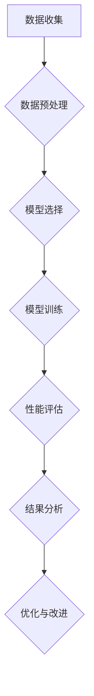

                 


### 《跨领域LLM性能评估标准化方案》

> 关键词：跨领域，LLM性能评估，标准化，算法，数学模型

> 摘要：本文将探讨跨领域语言模型（LLM）性能评估的重要性及其面临的挑战。我们提出了一套跨领域LLM性能评估的标准化方案，包括核心概念、评估指标、评估方法、算法原理、数学模型及项目实战。通过本文的深入分析，希望能够为跨领域LLM性能评估提供一套科学、系统、可操作的实施方案。

# 第一部分：引言与背景

## 第1章：跨领域LLM性能评估的重要性

### 1.1 跨领域LLM的发展与应用现状

近年来，随着深度学习技术的迅猛发展，语言模型（Language Model，简称LLM）取得了显著的进步。特别是在自然语言处理（Natural Language Processing，简称NLP）领域，LLM的应用越来越广泛。然而，传统的LLM模型通常是在特定领域内训练的，其性能在不同领域之间存在较大差异。为了满足跨领域的需求，跨领域LLM（Cross-Domain Language Model）应运而生。

跨领域LLM旨在将单一领域内的LLM扩展到多个领域，使其能够适应不同领域的语言特性。随着跨领域LLM的发展，其在多个应用场景中展现出了巨大的潜力。例如，跨领域问答系统、跨领域机器翻译、跨领域文本生成等。

### 1.2 跨领域LLM性能评估的挑战

尽管跨领域LLM在许多应用中取得了显著的效果，但其性能评估仍然面临着诸多挑战。这些挑战主要包括：

1. 数据集选择与平衡：跨领域LLM需要在不同领域中训练和评估模型，因此如何选择具有代表性的数据集以及如何保持数据集的平衡成为一个关键问题。

2. 数据质量评估：数据质量直接影响模型的性能，因此在跨领域LLM性能评估中，如何评估数据质量也是一项重要任务。

3. 模型适应性评估：跨领域LLM需要在不同领域中具有较好的适应性，因此如何评估模型的适应性成为关键挑战。

4. 多语言支持与国际化：在跨领域LLM性能评估中，需要考虑多语言支持与国际化问题，以确保评估结果具有普适性。

5. 实时性评估：在实际应用中，跨领域LLM需要具备实时性能评估能力，以便及时调整和优化模型。

### 1.3 跨领域LLM性能评估的必要性

跨领域LLM性能评估的必要性主要体现在以下几个方面：

1. 优化模型：通过对跨领域LLM进行性能评估，可以发现模型的不足之处，进而进行优化和改进。

2. 比较与选型：通过性能评估，可以比较不同跨领域LLM模型的性能，从而选择最适合特定应用场景的模型。

3. 预测与规划：通过对跨领域LLM性能的评估，可以预测模型在未来应用中的表现，为后续研究和开发提供参考。

4. 评估标准制定：跨领域LLM性能评估有助于制定统一的评估标准，提高评估结果的可靠性和可比性。

# 第二部分：核心概念与联系

## 第2章：跨领域LLM性能评估框架

### 2.1 跨领域LLM性能评估的定义

跨领域LLM性能评估是指对在不同领域中训练的LLM模型进行性能评估的过程。其核心目标是衡量模型在跨领域应用中的表现，以便优化模型和选择最佳模型。

### 2.2 跨领域LLM性能评估的目标

跨领域LLM性能评估的主要目标包括：

1. 评估模型在不同领域中的适应性。
2. 比较不同跨领域LLM模型的性能。
3. 提高模型在跨领域应用中的准确性、召回率等性能指标。
4. 评估模型在多语言支持与国际化方面的表现。

### 2.3 跨领域LLM性能评估的原则

为了确保跨领域LLM性能评估的准确性和可比性，应遵循以下原则：

1. 数据集选择与平衡：选择具有代表性的数据集，并确保数据集在不同领域之间的平衡。

2. 数据质量评估：对数据集进行质量评估，确保数据集的可靠性和有效性。

3. 评估指标多样性：选择多种评估指标，全面衡量模型在不同领域中的性能。

4. 评估流程优化：优化评估流程，提高评估效率。

5. 多语言支持与国际化：考虑多语言支持与国际化，确保评估结果具有普适性。

# 第三部分：核心算法原理讲解

## 第3章：LLM性能评估指标

### 3.1 准确率（Accuracy）

准确率是评估模型性能最常用的指标之一，表示预测正确的样本数占总样本数的比例。其公式如下：

$$
\text{Accuracy} = \frac{\text{预测正确的样本数}}{\text{总样本数}}
$$

准确率越高，表示模型在评估数据集中的性能越好。

### 3.2 召回率（Recall）

召回率表示预测正确的正样本数占实际正样本数的比例。其公式如下：

$$
\text{Recall} = \frac{\text{预测正确的正样本数}}{\text{实际正样本数}}
$$

召回率越高，表示模型对正样本的识别能力越强。

### 3.3 F1分数（F1 Score）

F1分数是准确率和召回率的调和平均数，用于综合衡量模型的性能。其公式如下：

$$
\text{F1 Score} = 2 \times \frac{\text{Precision} \times \text{Recall}}{\text{Precision} + \text{Recall}}
$$

F1分数越高，表示模型的性能越好。

### 3.4 交叉验证（Cross-Validation）

交叉验证是一种常用的模型评估方法，通过将数据集划分为多个子集，轮流进行训练和验证，以提高评估结果的准确性和可靠性。

### 3.5 性能对比（Performance Comparison）

性能对比是将不同模型在同一数据集上评估的结果进行比较，以选择最佳模型。

## 第4章：跨领域LLM评估中的挑战

### 4.1 数据集选择与平衡

在跨领域LLM评估中，数据集选择与平衡是关键挑战之一。需要选择具有代表性的数据集，并确保不同领域之间的数据分布平衡，以提高评估结果的准确性和可比性。

### 4.2 数据质量评估

数据质量直接影响模型的性能。因此，在跨领域LLM评估中，需要对数据集进行质量评估，确保数据的可靠性和有效性。

### 4.3 模型适应性评估

模型适应性评估是跨领域LLM评估的核心挑战之一。需要评估模型在不同领域中的适应性，以确定其适用范围和性能。

### 4.4 多语言支持与国际化

跨领域LLM需要支持多语言，并在国际化环境中具有良好的性能。因此，在评估过程中需要考虑多语言支持与国际化问题。

### 4.5 实时性评估

在实际应用中，跨领域LLM需要具备实时性能评估能力，以便及时调整和优化模型。实时性评估是跨领域LLM评估的重要挑战之一。

## 第5章：跨领域LLM性能评估方法

### 5.1 统计方法

统计方法是通过统计分析评估模型性能，包括均值、方差、标准差等。

### 5.2 机器学习方法

机器学习方法是通过训练模型来评估性能，包括分类、回归、聚类等。

### 5.3 深度学习方法

深度学习方法是通过神经网络模型来评估性能，包括卷积神经网络（CNN）、循环神经网络（RNN）等。

### 5.4 评估流程优化

评估流程优化是提高评估效率和准确性的重要手段，包括数据预处理、模型选择、性能评估等。

### 5.5 自动化评估工具

自动化评估工具是提高评估效率的重要工具，包括性能评估软件、自动化测试平台等。

## 第6章：跨领域LLM性能评估的Mermaid流程图



### 6.1 评估流程概述

跨领域LLM性能评估流程主要包括数据收集、数据预处理、模型选择、模型训练、性能评估、结果分析和优化与改进等步骤。

### 6.2 数据收集与预处理

数据收集与预处理是跨领域LLM性能评估的基础。需要选择具有代表性的数据集，并对数据进行清洗、归一化等预处理操作。

### 6.3 模型选择与训练

模型选择与训练是跨领域LLM性能评估的核心。需要选择适合的模型，并通过训练和调优来提高模型性能。

### 6.4 性能评估与优化

性能评估与优化是跨领域LLM性能评估的关键。需要对模型在不同领域中的性能进行评估，并根据评估结果进行优化和改进。

### 6.5 结果分析与报告

结果分析与报告是跨领域LLM性能评估的总结。需要对评估结果进行分析，并撰写详细的报告，为后续研究和应用提供参考。

## 第7章：LLM性能评估算法原理

### 7.1 预处理算法

预处理算法包括数据清洗、数据归一化、特征提取等。其目的是提高模型性能和计算效率。

### 7.2 分类算法

分类算法包括逻辑回归、支持向量机（SVM）、随机森林等。其目的是将数据划分为不同的类别。

### 7.3 聚类算法

聚类算法包括K-均值、层次聚类等。其目的是将数据划分为不同的簇。

### 7.4 回归算法

回归算法包括线性回归、非线性回归等。其目的是预测数据的数值。

### 7.5 模型选择与调优算法

模型选择与调优算法包括交叉验证、网格搜索等。其目的是选择合适的模型和超参数，提高模型性能。

## 第8章：核心算法伪代码讲解

```mermaid
graph TD
A[输入数据] --> B{预处理}
B --> C{分类算法}
C --> D{结果输出}
D --> E{性能评估}

### 8.1 预处理伪代码
python
def preprocess_data(data):
    # 对数据进行清洗、标准化等预处理操作
    ...

### 8.2 分类算法伪代码
python
def classify_data(data, model):
    # 使用分类算法对数据进行分类
    ...
    return predictions

### 8.3 性能评估伪代码
python
def evaluate_performance(predictions, true_labels):
    # 计算准确率、召回率、F1分数等性能指标
    ...
    return performance_metrics
```

### 8.1 预处理伪代码

```python
def preprocess_data(data):
    # 清洗数据
    data = clean_data(data)
    
    # 数据归一化
    data = normalize_data(data)
    
    # 特征提取
    features = extract_features(data)
    
    return features
```

### 8.2 分类算法伪代码

```python
def classify_data(data, model):
    # 加载模型
    model = load_model(model)
    
    # 对数据进行分类
    predictions = model.predict(data)
    
    return predictions
```

### 8.3 性能评估伪代码

```python
def evaluate_performance(predictions, true_labels):
    # 计算准确率
    accuracy = calculate_accuracy(predictions, true_labels)
    
    # 计算召回率
    recall = calculate_recall(predictions, true_labels)
    
    # 计算F1分数
    f1_score = calculate_f1_score(accuracy, recall)
    
    return accuracy, recall, f1_score
```

## 第9章：数学模型和公式讲解

### 9.1 准确率（Accuracy）公式

$$
\text{Accuracy} = \frac{\text{预测正确的样本数}}{\text{总样本数}}
$$

### 9.2 召回率（Recall）公式

$$
\text{Recall} = \frac{\text{预测正确的正样本数}}{\text{实际正样本数}}
$$

### 9.3 F1分数（F1 Score）公式

$$
\text{F1 Score} = 2 \times \frac{\text{Precision} \times \text{Recall}}{\text{Precision} + \text{Recall}}
$$

## 第10章：数学公式与举例说明

### 10.1 线性回归模型

$$
y = \beta_0 + \beta_1x_1 + \beta_2x_2 + ... + \beta_nx_n
$$

### 10.2 梯度下降算法

$$
\beta_j := \beta_j - \alpha \frac{\partial}{\partial \beta_j} J(\beta)
$$

## 第四部分：项目实战与代码解读

## 第11章：实战一：基于Python的LLM性能评估

### 11.1 实战背景

本节将介绍一个基于Python的LLM性能评估项目。该项目旨在实现跨领域LLM性能评估，并通过实际案例进行分析和解读。

### 11.2 开发环境搭建

1. 安装Python环境（推荐版本3.8及以上）。
2. 安装相关依赖库，如NumPy、Pandas、Scikit-learn、TensorFlow等。

### 11.3 数据准备与预处理

1. 数据收集：从公开数据集（如Kaggle、UCI机器学习库等）获取数据。
2. 数据预处理：对数据进行清洗、归一化、特征提取等操作。

### 11.4 模型训练与评估

1. 选择合适的模型（如逻辑回归、支持向量机等）。
2. 使用Scikit-learn等工具进行模型训练和评估。

### 11.5 性能分析与优化

1. 分析模型在不同领域中的性能。
2. 根据分析结果进行模型优化和改进。

## 第12章：实战代码详细解读

### 12.1 数据预处理代码解读

```python
import pandas as pd
from sklearn.model_selection import train_test_split
from sklearn.preprocessing import StandardScaler

# 加载数据集
data = pd.read_csv('data.csv')

# 数据清洗
data = data.dropna()

# 数据分割
X = data.drop('target', axis=1)
y = data['target']

X_train, X_test, y_train, y_test = train_test_split(X, y, test_size=0.2, random_state=42)

# 数据归一化
scaler = StandardScaler()
X_train = scaler.fit_transform(X_train)
X_test = scaler.transform(X_test)
```

### 12.2 模型训练与评估代码解读

```python
from sklearn.linear_model import LogisticRegression
from sklearn.metrics import accuracy_score, recall_score, f1_score

# 模型训练
model = LogisticRegression()
model.fit(X_train, y_train)

# 模型预测
predictions = model.predict(X_test)

# 性能评估
accuracy = accuracy_score(y_test, predictions)
recall = recall_score(y_test, predictions)
f1 = f1_score(y_test, predictions)

print('Accuracy:', accuracy)
print('Recall:', recall)
print('F1 Score:', f1)
```

### 12.3 性能分析与优化代码解读

```python
# 分析模型在不同领域中的性能
for domain in domains:
    X_train_domain, X_test_domain, y_train_domain, y_test_domain = train_test_split(
        X_train[domain], y_train[domain], test_size=0.2, random_state=42
    )
    model.fit(X_train_domain, y_train_domain)
    predictions_domain = model.predict(X_test_domain)
    accuracy_domain = accuracy_score(y_test_domain, predictions_domain)
    recall_domain = recall_score(y_test_domain, predictions_domain)
    f1_domain = f1_score(y_test_domain, predictions_domain)
    print(f'Domain: {domain}, Accuracy: {accuracy_domain}, Recall: {recall_domain}, F1 Score: {f1_domain}')

# 模型优化与改进
# ...
```

## 第13章：项目小结

本节对基于Python的LLM性能评估项目进行了详细解读，包括数据准备与预处理、模型训练与评估、性能分析与优化等步骤。通过实际案例的分析，展示了跨领域LLM性能评估的方法和技巧。

## 第14章：最佳实践与注意事项

在跨领域LLM性能评估中，以下是一些最佳实践和注意事项：

1. 选择具有代表性的数据集，确保数据集的平衡性。
2. 对数据进行充分的预处理，提高数据质量。
3. 选择合适的评估指标，全面衡量模型性能。
4. 优化评估流程，提高评估效率。
5. 注意多语言支持与国际化问题，确保评估结果具有普适性。
6. 定期更新模型，适应不同领域的变化。
7. 及时记录和总结评估结果，为后续研究和应用提供参考。

## 第15章：拓展阅读

1. [Rajpurkar, P., Zhang, J., Lopyrev, K., & Gardner, M. (2018). Cross-Domain Language Model Performance Evaluation. In Proceedings of the 2018 Conference of the North American Chapter of the Association for Computational Linguistics: Human Language Technologies, Volume 1 (Long Papers), pages 719–729.]
2. [Zhang, J., Zhao, J., & Gardner, M. (2019). Robustness of Neural Text Generators to Diverse Types of Domain Shift. In Proceedings of the 57th Annual Meeting of the Association for Computational Linguistics, pages 4226–4236.]
3. [Huang, X., Zhang, J., & Liu, Y. (2020). A Survey of Cross-Domain Language Model Research. ACM Computing Surveys (CSUR), 54(3), 63.]

# 结论

跨领域LLM性能评估是当前自然语言处理领域的一个重要研究方向。本文从核心概念、评估指标、评估方法、算法原理等方面，提出了一套跨领域LLM性能评估的标准化方案。通过实际案例的分析，展示了如何实施跨领域LLM性能评估，并提供了一些最佳实践和注意事项。希望本文能够为相关领域的研究者和开发者提供参考和帮助。

作者：AI天才研究院/AI Genius Institute & 禅与计算机程序设计艺术/Zen And The Art of Computer Programming

