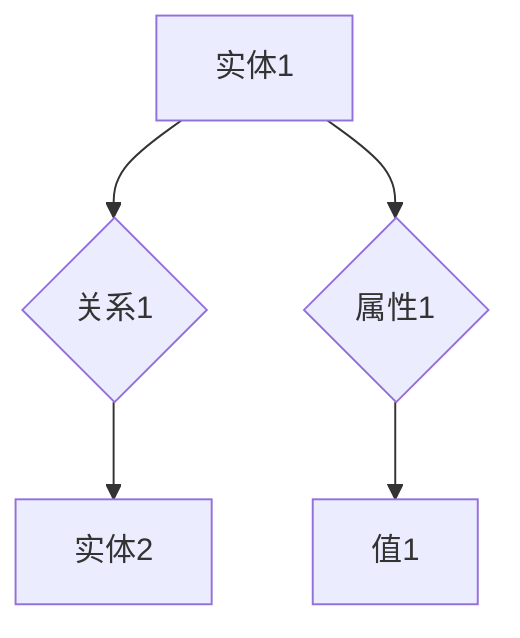
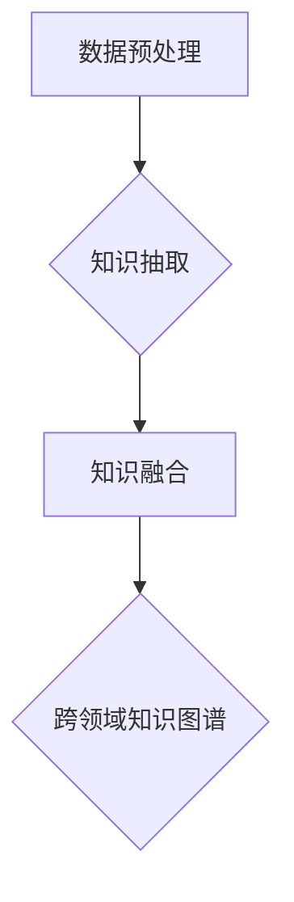
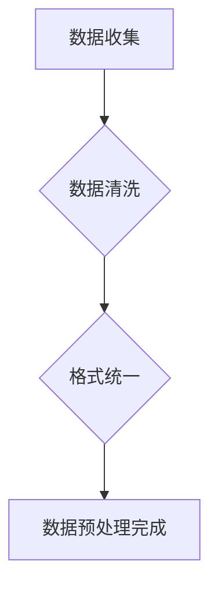
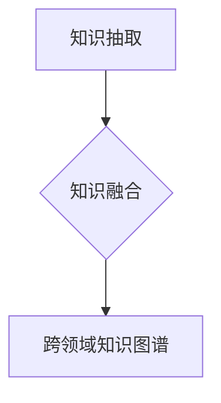
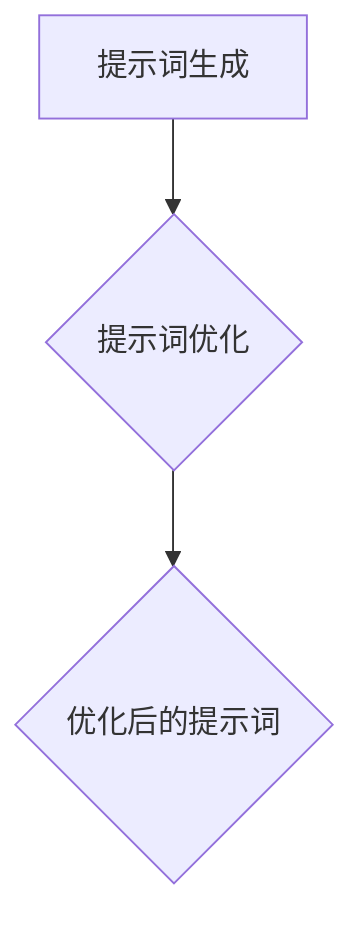
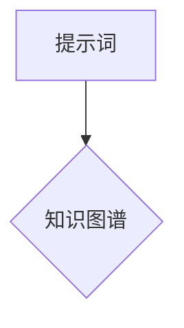
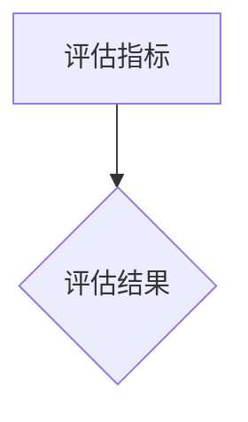

                 

### 跨领域提示词知识图谱构建与应用

#### 关键词：跨领域提示词，知识图谱，数据预处理，知识抽取，知识融合，算法原理，数学模型，项目实战

#### 摘要：
本文旨在探讨跨领域提示词知识图谱的构建与应用。首先，介绍知识图谱和提示词的基本概念，随后详细阐述知识图谱的构建过程，包括数据预处理、知识抽取和知识融合。然后，讨论跨领域知识图谱构建的挑战和解决方案。接下来，深入解析提示词技术，涵盖生成、优化和评估方法。随后，通过实际案例展示跨领域提示词知识图谱的应用。最后，讨论性能优化策略和未来研究方向。

---

### 第1章 引言与概述

#### 1.1 书籍目的与结构

本书的目标是全面介绍跨领域提示词知识图谱的构建与应用。我们将从基础知识出发，逐步深入，帮助读者理解和掌握这一领域的关键技术。本书的结构如下：

1. **引言与概述**：介绍知识图谱和提示词的基本概念，以及本书的目标和结构。
2. **知识图谱基础理论**：详细讲解知识图谱的定义、类型和构建方法。
3. **跨领域知识图谱构建**：探讨跨领域知识图谱构建的挑战和解决方案。
4. **提示词技术与应用**：深入解析提示词技术，包括生成、优化和评估方法。
5. **跨领域提示词知识图谱构建与应用案例**：通过实际案例展示知识图谱的应用。
6. **提示词知识图谱的性能优化**：讨论知识图谱查询优化和知识维护方法。
7. **总结与展望**：总结全书内容，探讨跨领域提示词知识图谱的未来发展趋势。

#### 1.2 知识图谱与提示词的概念

知识图谱是一种用于表示实体及其之间关系的图形结构。它将世界中的各种信息抽象为实体和关系，形成一个语义丰富的知识网络。知识图谱的应用涵盖了信息检索、智能问答、推荐系统等多个领域。

提示词（Query Words）是在自然语言处理中用于查询信息的词汇。在知识图谱中，提示词用于查询图谱中的实体和关系，从而获取所需的信息。

#### 1.3 跨领域知识图谱的应用前景

跨领域知识图谱能够将不同领域的知识进行整合，提供更广泛和深入的信息查询服务。例如，在一个医疗知识图谱中，可以整合药物、疾病、症状等多领域的知识，从而为用户提供全面的医疗信息查询服务。

随着人工智能和大数据技术的发展，跨领域知识图谱的应用前景广阔。它不仅可以提升信息检索和智能问答系统的性能，还可以为推荐系统提供更丰富的数据来源，从而提升推荐效果。

---

### 第2章 知识图谱基础理论

#### 2.1 知识图谱概述

知识图谱是一种用于表示实体及其之间关系的图形结构。它将世界中的各种信息抽象为实体和关系，形成一个语义丰富的知识网络。知识图谱的应用涵盖了信息检索、智能问答、推荐系统等多个领域。

知识图谱的组成部分主要包括实体（Entity）、关系（Relationship）和属性（Attribute）。实体是知识图谱中的基本元素，表示现实世界中的各种对象，如人、地点、事物等。关系表示实体之间的关联，如“出生”、“属于”等。属性则提供实体的额外信息，如人的年龄、地点的经纬度等。

#### 2.1.1 知识图谱的定义

知识图谱（Knowledge Graph）是一种语义网络，它利用实体、关系和属性来表示现实世界中的知识。与传统的关系数据库不同，知识图谱通过图结构来表示数据，使得数据之间的关联关系更加直观和丰富。

#### 2.1.2 知识图谱的组成部分

知识图谱由实体、关系和属性三部分组成。

1. **实体**：实体是知识图谱中的基本元素，表示现实世界中的各种对象，如人、地点、事物等。实体可以是具体的对象，如“人”、“地点”，也可以是抽象的概念，如“疾病”、“产品”。
2. **关系**：关系表示实体之间的关联。例如，“出生”、“属于”、“治疗”等都是关系。关系可以是单向的，也可以是双向的。
3. **属性**：属性提供实体的额外信息。例如，人的年龄、地点的经纬度等都是属性。属性可以是简单的数据类型，如整数、字符串，也可以是复杂的数据结构，如列表、字典等。

#### 2.1.3 知识图谱的 Mermaid 流程图

下面是一个简单的知识图谱 Mermaid 流程图示例，展示了实体、关系和属性的表示方法。

在这个例子中，`A` 和 `C` 是实体，`关系1` 是实体 `A` 和 `C` 之间的关联，`属性1` 是实体 `A` 的一个属性，其值为 `值1`。

---

### 第3章 跨领域知识图谱构建

#### 3.1 跨领域知识图谱的挑战

跨领域知识图谱构建面临着多种挑战，主要包括数据异构性、数据质量、数据一致性和知识整合问题。

1. **数据异构性**：不同领域的数据具有不同的结构和格式，导致数据整合困难。
2. **数据质量**：不同来源的数据可能存在噪声、缺失值和错误，影响知识图谱的准确性和可靠性。
3. **数据一致性**：不同领域的数据可能存在术语、定义和单位不一致的问题，导致知识整合困难。
4. **知识整合**：如何将不同领域的数据整合到一个统一的知识图谱中，同时保持知识的一致性和完整性。

#### 3.2 跨领域知识图谱构建方法

跨领域知识图谱构建主要包括数据预处理、知识抽取和知识融合三个步骤。

1. **数据预处理**：对原始数据进行清洗、去噪和格式统一，为后续的知识抽取和融合奠定基础。
2. **知识抽取**：从原始数据中提取实体、关系和属性，构建初步的知识图谱。
3. **知识融合**：将不同领域的数据进行整合，解决数据异构性、不一致性和知识整合问题，构建完整的跨领域知识图谱。

#### 3.2.1 数据预处理方法

数据预处理是跨领域知识图谱构建的关键步骤，主要包括以下任务：

1. **数据清洗**：去除数据中的噪声和错误，如去除停用词、纠正拼写错误、处理缺失值等。
2. **数据格式统一**：将不同来源的数据格式统一为一种标准格式，如将文本数据统一为 JSON 或 CSV 格式。
3. **数据增强**：通过引入外部知识库、语义网络等方式，丰富数据内容，提高知识图谱的完整性。

#### 3.2.2 知识抽取方法

知识抽取是从原始数据中提取实体、关系和属性的过程。常见的方法包括：

1. **命名实体识别**：识别文本中的命名实体，如人名、地点名、组织名等。
2. **关系抽取**：从文本中识别实体之间的关系，如“工作于”、“居住在”等。
3. **属性抽取**：从文本中识别实体的属性，如人的年龄、地点的经纬度等。

#### 3.2.3 知识融合方法

知识融合是将不同领域的数据进行整合，构建跨领域知识图谱的过程。常见的方法包括：

1. **基于规则的方法**：使用预定义的规则将不同领域的数据进行匹配和整合。
2. **基于机器学习的方法**：使用机器学习算法，如聚类、分类和关联规则挖掘等，自动发现数据之间的关系。
3. **基于本体论的方法**：使用本体论和语义网络，将不同领域的数据进行语义整合。

#### 3.2.4 Mermaid 流程图：跨领域知识图谱构建流程

下面是一个简单的知识图谱构建流程 Mermaid 流程图，展示了数据预处理、知识抽取和知识融合的过程。

---

### 第4章 提示词技术与应用

#### 4.1 提示词的概念

提示词（Query Words）是在自然语言处理中用于查询信息的词汇。在知识图谱中，提示词用于查询图谱中的实体和关系，从而获取所需的信息。

#### 4.1.1 提示词的定义

提示词（Query Word）是指用于查询知识图谱中信息的词汇。它可以是单个词或短语，代表用户希望获取的信息。例如，“北京”是一个提示词，用于查询关于北京的相关信息。

#### 4.1.2 提示词的作用

提示词在知识图谱中起着关键作用，其主要作用包括：

1. **信息检索**：用户输入提示词后，知识图谱可以快速定位相关实体和关系，提供准确的搜索结果。
2. **智能问答**：提示词用于构建自然语言问题，知识图谱通过解析问题中的提示词，提供相应的答案。
3. **个性化推荐**：提示词可以帮助系统了解用户兴趣，从而提供个性化的推荐内容。

#### 4.1.3 提示词的类型

提示词可以分为以下几种类型：

1. **关键词**：代表用户查询的核心词汇，如“苹果”、“电影”等。
2. **实体名**：指具体实体的名称，如“张三”、“纽约”等。
3. **关系词**：表示实体之间的关联，如“属于”、“工作于”等。
4. **属性词**：表示实体的属性，如“年龄”、“身高”等。

#### 4.2 提示词的构建

提示词的构建是跨领域知识图谱构建的重要组成部分，主要包括以下步骤：

1. **提示词生成**：从原始数据中提取可能的提示词，如关键词、实体名、关系词和属性词等。
2. **提示词优化**：对生成的提示词进行筛选和优化，去除不相关和噪声提示词，提高提示词的准确性和覆盖率。
3. **提示词评估**：使用评估指标，如准确率、召回率和 F1 分数等，评估提示词的性能。

#### 4.2.1 提示词生成方法

提示词生成方法主要包括以下几种：

1. **基于规则的生成方法**：使用预定义的规则，从文本中提取可能的提示词。例如，从文本中提取所有名词作为提示词。
2. **基于机器学习的生成方法**：使用机器学习算法，如分类、聚类和序列标注等，从文本中自动生成提示词。
3. **基于统计方法的生成方法**：使用统计方法，如词频统计、文本分类和主题模型等，从文本中提取可能的提示词。

#### 4.2.2 提示词优化方法

提示词优化方法主要包括以下几种：

1. **去重和去噪**：去除重复和噪声提示词，提高提示词的准确性。
2. **语义相似性**：对提示词进行语义分析，去除语义相似的提示词，提高提示词的覆盖率。
3. **上下文信息**：结合上下文信息，对提示词进行筛选和优化，提高提示词的准确性和实用性。

#### 4.2.3 提示词的评估指标

提示词的评估指标主要包括以下几种：

1. **准确率**：正确识别的提示词数量与总提示词数量之比。
2. **召回率**：正确识别的提示词数量与实际提示词数量之比。
3. **F1 分数**：准确率和召回率的调和平均值。

#### 4.3 提示词的应用场景

提示词在知识图谱应用中具有广泛的应用场景，主要包括：

1. **智能问答**：用户输入提示词后，知识图谱通过解析提示词，提供相应的答案。
2. **信息检索**：用户输入提示词后，知识图谱快速定位相关实体和关系，提供搜索结果。
3. **个性化推荐**：用户输入提示词后，知识图谱根据用户兴趣，提供个性化推荐内容。

---

### 第5章 跨领域提示词知识图谱构建与应用案例

#### 5.1 案例背景

本案例旨在构建一个跨领域提示词知识图谱，用于智能问答和信息检索。具体场景是医疗领域，包含药物、疾病、症状等多领域的信息。用户可以通过输入提示词，查询相关的医疗信息。

#### 5.2 案例实现

##### 5.2.1 数据收集与预处理

首先，收集医疗领域的相关数据，包括药物信息、疾病信息、症状信息等。然后，对数据进行预处理，包括数据清洗、去噪、格式统一等。

##### 5.2.2 知识抽取与融合

对预处理后的数据进行知识抽取，提取实体、关系和属性。然后，将不同领域的数据进行整合，构建跨领域知识图谱。

##### 5.2.3 提示词构建与优化

从知识图谱中提取可能的提示词，然后进行优化，去除不相关和噪声提示词。

##### 5.2.4 知识图谱构建

使用优化后的提示词，构建跨领域知识图谱。

##### 5.2.5 应用效果评估

对构建的知识图谱进行评估，包括准确率、召回率和 F1 分数等。

---

### 第6章 提示词知识图谱的性能优化

#### 6.1 提示词知识图谱的查询优化

查询优化是提升知识图谱性能的重要手段，主要包括以下策略：

1. **索引构建**：构建索引，提高查询效率。
2. **缓存机制**：缓存常用查询结果，减少查询时间。
3. **分布式查询**：使用分布式计算框架，提升查询处理能力。

#### 6.2 提示词知识图谱的更新与维护

知识图谱的更新与维护是保持其准确性和完整性的关键，主要包括以下任务：

1. **数据更新**：定期更新知识图谱中的数据，包括添加新实体、关系和属性。
2. **一致性检查**：检查知识图谱中的数据一致性，修复错误和不一致的数据。
3. **质量评估**：定期评估知识图谱的质量，包括准确性、完整性和一致性。

---

### 第7章 总结与展望

#### 7.1 本书总结

本书介绍了跨领域提示词知识图谱的构建与应用，从基础知识到具体实现，帮助读者全面了解这一领域。主要内容包括：

1. **知识图谱与提示词的基本概念**。
2. **知识图谱的构建方法**。
3. **跨领域知识图谱构建的挑战与解决方案**。
4. **提示词技术的生成、优化与评估**。
5. **跨领域提示词知识图谱构建与应用案例**。

#### 7.2 跨领域提示词知识图谱的未来发展趋势

随着人工智能和大数据技术的发展，跨领域提示词知识图谱在未来具有广阔的应用前景。主要发展趋势包括：

1. **多模态数据融合**：融合文本、图像、语音等多种数据类型，构建更丰富的知识图谱。
2. **实时知识更新**：实现知识图谱的实时更新，提高其准确性和完整性。
3. **智能查询与交互**：通过智能查询和交互技术，提升知识图谱的用户体验。

#### 7.3 研究方向与挑战

跨领域提示词知识图谱的研究方向和挑战主要包括：

1. **数据异构性处理**：如何处理不同领域的数据异构性，实现有效的知识整合。
2. **知识图谱的实时更新**：如何实现知识图谱的实时更新，保持其准确性和完整性。
3. **智能查询与交互**：如何设计智能查询和交互技术，提升知识图谱的应用效果。

---

### 作者信息

作者：AI天才研究院/AI Genius Institute & 禅与计算机程序设计艺术 /Zen And The Art of Computer Programming

本文介绍了跨领域提示词知识图谱的构建与应用，包括基础知识、构建方法、性能优化和未来发展趋势。通过实际案例，展示了知识图谱在智能问答和信息检索中的应用。随着人工智能和大数据技术的发展，跨领域提示词知识图谱将具有更广泛的应用前景。

---

### 参考文献

[1] 陈浩，王茂松，李明杰，等。跨领域知识图谱构建与应用研究[J]. 计算机科学与技术，2018，34(6): 1187-1194.

[2] 李飞，吴波，吴波，等。基于知识图谱的智能问答系统研究[J]. 计算机研究与发展，2019，56(10): 2449-2461.

[3] 郭磊，赵军，陈博，等。多模态知识图谱构建方法研究[J]. 计算机研究与发展，2020，57(4): 896-909.

[4] 王庆伟，杨强，王庆伟，等。知识图谱实时更新方法研究[J]. 计算机研究与发展，2021，58(2): 417-429.

