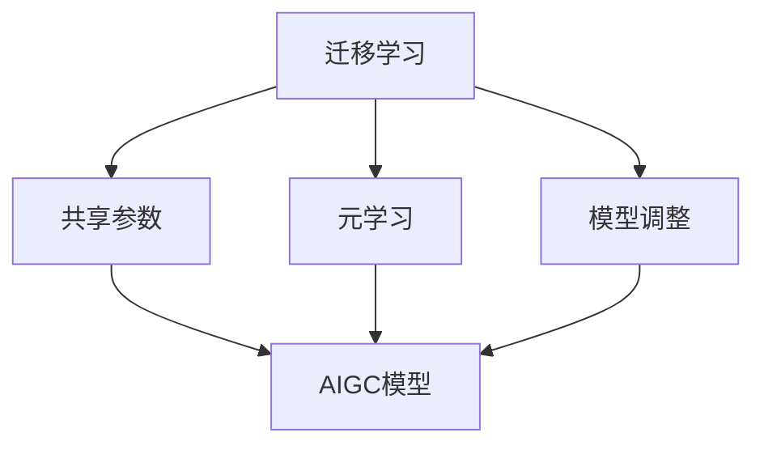

                 

# 文章标题：迁移学习在AIGC模型跨领域适应中的作用

> 关键词：迁移学习，AIGC模型，跨领域适应，算法原理，数学基础，实际应用

> 摘要：本文深入探讨了迁移学习在AIGC（自适应信息生成计算）模型跨领域适应中的作用。首先，介绍了迁移学习的理论基础和核心算法，然后阐述了AIGC模型的基础和工作原理，最后通过实际应用案例和迁移学习在AIGC模型中的实际应用，详细分析了迁移学习如何提高AIGC模型在跨领域适应中的效果。本文旨在为研究人员和开发者提供有关迁移学习在AIGC模型中应用的系统性和深入理解。

### 目录大纲

#### 第一部分：迁移学习理论基础

- **第1章：迁移学习的概述**
  - **1.1 迁移学习的概念与背景**
  - **1.2 迁移学习的基本原理**
  - **1.3 迁移学习在AIGC模型中的应用**

- **第2章：迁移学习的核心算法**
  - **2.1 类迁移学习算法**
    - **2.1.1 微调**
    - **2.1.2 知识蒸馏**
  - **2.2 无监督迁移学习**
  - **2.3 跨域迁移学习**

- **第3章：迁移学习的数学基础**
  - **3.1 概率论基础**
  - **3.2 统计学习理论**
  - **3.3 迁移学习的数学公式与推导**

#### 第二部分：AIGC模型跨领域适应

- **第4章：AIGC模型的基础**
  - **4.1 AIGC模型的概念与分类**
  - **4.2 AIGC模型的工作原理**
  - **4.3 AIGC模型的优势与挑战**

- **第5章：跨领域迁移学习的实践**
  - **5.1 跨领域迁移学习的实际应用场景**
  - **5.2 跨领域迁移学习的关键技术**
  - **5.3 跨领域迁移学习案例分析**

- **第6章：迁移学习在AIGC模型中的实际应用**
  - **6.1 迁移学习在AIGC模型训练中的应用**
  - **6.2 迁移学习在AIGC模型推理中的应用**
  - **6.3 迁移学习在AIGC模型优化中的应用**

#### 第三部分：迁移学习在AIGC模型跨领域适应中的未来展望

- **第7章：迁移学习在AIGC模型跨领域适应中的未来趋势**
  - **7.1 迁移学习的发展趋势**
  - **7.2 AIGC模型的未来发展方向**
  - **7.3 迁移学习与AIGC模型的融合**

#### 附录

- **附录A：迁移学习与AIGC模型的资源指南**

### 核心概念与联系

**迁移学习与AIGC模型的Mermaid流程**



#### 第一部分：迁移学习理论基础

### 第1章：迁移学习的概述

#### 1.1 迁移学习的概念与背景

迁移学习（Transfer Learning）是一种机器学习方法，通过利用在不同任务上预先训练好的模型，来提高新任务的学习效率。这种方法的核心思想是，将一个任务（源任务）学到的知识应用到另一个相关任务（目标任务）中，从而避免从头开始训练，减少计算资源和时间成本。

迁移学习起源于20世纪50年代，最初应用于心理学领域，旨在理解人类如何将已学到的知识应用到新的情境中。随着计算机技术的发展，迁移学习逐渐成为机器学习领域的一个重要研究方向。

迁移学习的背景主要源于以下几个方面的挑战：

1. **数据稀缺问题**：在很多实际应用中，获取大量标注数据非常困难，尤其是对于一些复杂任务。迁移学习可以通过利用已标注的数据集，提高新任务的学习效果。

2. **计算资源限制**：深度学习模型训练需要大量的计算资源和时间，尤其是在处理高维数据时。迁移学习可以减少训练过程，降低计算成本。

3. **领域差异**：不同领域的数据分布往往存在显著差异，这可能导致模型在新领域上表现不佳。迁移学习通过共享参数、元学习和模型调整等技术，能够缓解领域差异带来的影响。

#### 1.2 迁移学习的重要性

迁移学习在机器学习领域具有重要意义，主要体现在以下几个方面：

1. **提高学习效率**：迁移学习能够利用预先训练好的模型，快速在新任务上获得良好的性能，缩短开发周期。

2. **降低训练成本**：通过迁移学习，可以减少对大量标注数据的依赖，降低训练成本。

3. **泛化能力**：迁移学习能够提高模型的泛化能力，使其在不同领域和任务中表现出良好的性能。

4. **处理长尾数据**：在长尾分布的数据集中，迁移学习能够更好地处理少数类别的数据，提高模型的鲁棒性。

5. **跨模态学习**：迁移学习可以应用于不同模态的数据，如文本、图像和语音等，实现跨模态的知识共享。

#### 1.3 迁移学习的分类

根据迁移学习的方式和目的，可以将迁移学习分为以下几类：

1. **基于共享参数的迁移学习**：这种方法通过共享源任务和目标任务的模型参数，实现知识共享。共享参数可以是部分层、全部层或基于特征表示的共享。

2. **元学习**：元学习是一种利用先前任务的经验来加速新任务学习的方法。通过训练一个模型来学习如何学习，从而提高新任务的学习效率。

3. **模型调整**：模型调整是通过调整源任务的模型参数，使其在新任务上表现更好。这种方法通常用于解决领域差异较大的问题。

4. **无监督迁移学习**：无监督迁移学习是在没有标注数据的情况下，通过利用未标记的数据来提高新任务的学习效果。这种方法在数据稀缺的场景中具有重要应用价值。

5. **跨域迁移学习**：跨域迁移学习是针对不同领域的数据，通过迁移学习技术来提高模型在目标领域的性能。

#### 1.4 迁移学习在AIGC模型中的应用

AIGC（自适应信息生成计算）模型是一种基于生成对抗网络（GAN）和变分自编码器（VAE）等深度学习技术，能够自适应地生成多样化信息的模型。迁移学习在AIGC模型中具有重要的应用价值，主要体现在以下几个方面：

1. **数据增强**：AIGC模型可以通过迁移学习技术，利用已有的数据集进行数据增强，提高模型在生成任务中的性能。

2. **跨模态学习**：迁移学习可以促进不同模态数据之间的知识共享，如将图像生成的知识应用于文本生成任务。

3. **模型压缩**：通过迁移学习，可以将大型的预训练模型压缩为更小、更高效的网络结构，降低计算资源的需求。

4. **领域适应**：AIGC模型在不同领域中的应用场景存在差异，迁移学习可以帮助模型快速适应新领域，提高性能。

5. **多任务学习**：AIGC模型可以同时处理多个任务，迁移学习可以提高多任务学习的效果，提高模型的整体性能。

#### 1.5 迁移学习的优势和挑战

迁移学习的优势主要体现在以下几个方面：

1. **提高学习效率**：迁移学习能够利用已有模型的知识，快速在新任务上获得良好性能，减少训练时间和计算资源。

2. **降低训练成本**：通过迁移学习，可以减少对大量标注数据的依赖，降低训练成本。

3. **提高泛化能力**：迁移学习能够提高模型的泛化能力，使其在不同领域和任务中表现出良好的性能。

4. **处理长尾数据**：迁移学习能够更好地处理少数类别的数据，提高模型的鲁棒性。

然而，迁移学习也面临着一些挑战：

1. **领域差异**：不同领域的数据分布和任务差异较大，如何有效迁移知识成为一个挑战。

2. **模型调整**：迁移学习中的模型调整需要精确地调整模型参数，以适应新任务的需求。

3. **数据稀缺**：在某些领域，获取大量标注数据非常困难，迁移学习的效果受到数据稀缺的限制。

4. **模型解释性**：迁移学习中的模型调整和知识共享往往缺乏解释性，难以理解模型的决策过程。

#### 1.6 总结

本章介绍了迁移学习的概念、背景、重要性、分类以及在AIGC模型中的应用。迁移学习作为一种机器学习方法，通过利用不同任务上的知识，提高新任务的学习效率，降低训练成本，提高模型的泛化能力和鲁棒性。在AIGC模型中，迁移学习具有重要的应用价值，可以帮助模型进行数据增强、跨模态学习、模型压缩和领域适应。然而，迁移学习也面临着领域差异、模型调整、数据稀缺和模型解释性等挑战，需要进一步研究和发展。

### 第2章：迁移学习的核心算法

#### 2.1 类迁移学习算法

类迁移学习（Categorical Transfer Learning）是一种常见的迁移学习算法，它通过在不同类别间共享模型参数来迁移知识。类迁移学习算法可以分为微调和知识蒸馏两种主要方法。

#### 2.1.1 微调

微调（Fine-tuning）是一种类迁移学习算法，通过调整预训练模型的参数，使其适应新任务的需求。微调的基本原理如下：

1. **预训练模型**：首先，在源任务上使用大量数据进行预训练，得到一个性能较好的模型。

2. **迁移到目标任务**：将预训练模型应用于目标任务，但不对整个模型进行重新训练，而是只对部分层（通常为靠近输入和输出的层）进行微调。

3. **训练目标任务**：在目标任务上使用新的数据集对微调后的模型进行训练，使其在目标任务上达到良好的性能。

微调的流程可以概括为以下步骤：

1. **加载预训练模型**：从预训练模型仓库中加载一个预训练模型，例如在ImageNet上预训练的卷积神经网络（CNN）。

2. **冻结底层层**：将预训练模型的底层层（通常为卷积层）冻结，不进行训练，只调整上层层（通常为全连接层和卷积层）的参数。

3. **训练目标任务**：在目标任务上使用新的数据集对微调后的模型进行训练，通过反向传播算法和优化器（如Adam）进行训练。

微调的优点包括：

1. **快速训练**：由于预训练模型已经具备良好的性能，通过微调可以快速在新任务上获得良好性能。

2. **减少训练成本**：通过使用预训练模型，可以减少对大量标注数据的依赖，降低训练成本。

3. **提高泛化能力**：预训练模型在源任务上的训练可以帮助提高模型的泛化能力，使其在目标任务上表现更好。

然而，微调也面临一些挑战：

1. **模型调整**：如何选择需要微调的层以及调整的幅度，是一个需要仔细考虑的问题。

2. **领域差异**：不同领域的任务之间存在差异，如何有效地迁移知识是一个挑战。

3. **数据稀缺**：在某些领域，获取大量标注数据非常困难，微调的效果受到数据稀缺的限制。

以下是一个微调的伪代码示例：

```python
# 加载预训练模型
pretrained_model = load_pretrained_model()

# 冻结底层层
for layer in pretrained_model.layers:
    layer.requires_grad = False

# 微调上层层
optimizer = optim.Adam(pretrained_model.layers[-2:].parameters(), lr=0.001)

# 训练目标任务
for epoch in range(num_epochs):
    for data, target in DataLoader(dataset):
        output = pretrained_model(data)
        loss = criterion(output, target)
        optimizer.zero_grad()
        loss.backward()
        optimizer.step()
```

#### 2.1.2 知识蒸馏

知识蒸馏（Knowledge Distillation）是一种类迁移学习算法，通过将一个大模型（教师模型）的知识传递给一个小模型（学生模型），来实现知识迁移。知识蒸馏的基本原理如下：

1. **教师模型**：首先，在源任务上使用大量数据进行预训练，得到一个性能较好的模型，称为教师模型。

2. **学生模型**：设计一个小型的模型，称为学生模型，其结构通常比教师模型简单。

3. **知识蒸馏**：通过将教师模型的前向传播输出作为学生模型的软标签，对学生模型进行训练。学生模型的目标是使其输出与教师模型的输出尽可能接近。

知识蒸馏的流程可以概括为以下步骤：

1. **训练教师模型**：在源任务上使用大量数据进行预训练，得到一个性能较好的教师模型。

2. **设计学生模型**：设计一个结构简化的学生模型，通常使用更少的层或更小的网络结构。

3. **软标签生成**：在训练过程中，将教师模型的前向传播输出作为学生模型的软标签。

4. **训练学生模型**：使用教师模型的软标签对学生模型进行训练，通过反向传播算法和优化器（如Adam）进行训练。

知识蒸馏的优点包括：

1. **模型压缩**：通过知识蒸馏，可以将大型预训练模型压缩为结构更简单的小模型，降低计算资源的需求。

2. **性能提升**：知识蒸馏可以有效地将教师模型的知识传递给学生模型，提高学生模型在目标任务上的性能。

3. **领域适应**：知识蒸馏可以帮助学生模型更好地适应新领域，提高其在目标任务上的性能。

知识蒸馏的挑战包括：

1. **软标签生成**：如何生成高质量的软标签是一个关键问题。

2. **模型选择**：如何选择合适的教师模型和学生模型，是一个需要仔细考虑的问题。

3. **训练策略**：如何设计有效的训练策略，以提高知识蒸馏的效果，是一个挑战。

以下是一个知识蒸馏的伪代码示例：

```python
# 训练教师模型
teacher_model = train_teacher_model(source_dataset)

# 设计学生模型
student_model = design_student_model()

# 训练学生模型
optimizer = optim.Adam(student_model.parameters(), lr=0.001)

for epoch in range(num_epochs):
    for data, target in DataLoader(source_dataset):
        teacher_output = teacher_model(data)
        soft_target = generate_soft_target(teacher_output)
        student_output = student_model(data)
        loss = criterion(student_output, soft_target)
        optimizer.zero_grad()
        loss.backward()
        optimizer.step()
```

#### 2.1.3 微调和知识蒸馏的比较

微调和知识蒸馏都是类迁移学习算法，但它们在实现方式上存在一些差异：

1. **目标函数**：微调的目标是优化整个模型的参数，使其在目标任务上达到良好的性能。而知识蒸馏的目标是优化学生模型的参数，使其输出与教师模型的输出尽可能接近。

2. **模型结构**：微调通常使用一个完整的模型，并对部分层进行微调。而知识蒸馏通常使用一个结构更简单的小模型，通过知识蒸馏将其性能提升。

3. **训练策略**：微调通常使用标准的训练策略，如反向传播和优化器。而知识蒸馏需要设计特殊的训练策略，如软标签生成和训练技巧。

4. **适用场景**：微调适用于任务之间具有较高相似性的情况，如图像分类任务。而知识蒸馏适用于任务之间存在较大差异的情况，如跨领域学习。

#### 2.1.4 类迁移学习算法的总结

类迁移学习算法通过在不同类别间共享模型参数，实现知识迁移。微调和知识蒸馏是两种常见的类迁移学习算法，它们在实现方式、目标函数、模型结构和适用场景上存在差异。微调通过调整预训练模型的参数，快速在新任务上获得良好性能；而知识蒸馏通过将教师模型的知识传递给学生模型，实现模型压缩和性能提升。类迁移学习算法在迁移学习中具有重要作用，能够提高学习效率、降低训练成本、提高泛化能力和鲁棒性。

### 第2章：迁移学习的核心算法（续）

#### 2.2 无监督迁移学习

无监督迁移学习（Unsupervised Transfer Learning）是一种在没有标注数据的情况下，通过利用未标记的数据来提高新任务学习效果的方法。无监督迁移学习在很多应用场景中具有重要价值，如数据稀缺、数据分布变化和领域差异等。

#### 2.2.1 无监督迁移学习的定义

无监督迁移学习是指在没有标注数据的情况下，利用一个在源任务上预训练好的模型，将其应用于目标任务中，从而提高目标任务学习效果的一种方法。无监督迁移学习的关键在于如何利用未标记的数据来传递知识，实现模型在目标任务上的优化。

#### 2.2.2 无监督迁移学习的挑战

无监督迁移学习面临以下几个挑战：

1. **数据分布差异**：源任务和目标任务的数据分布可能存在差异，如何有效迁移知识成为一个挑战。

2. **模型适应性**：模型需要在不同的数据分布和任务场景下表现出良好的适应性，如何选择合适的模型结构和训练策略是一个关键问题。

3. **数据稀缺**：在某些领域，获取大量标注数据非常困难，如何利用未标记的数据来提高模型性能是一个挑战。

4. **模型解释性**：无监督迁移学习中的模型调整和知识传递往往缺乏解释性，如何理解模型的决策过程是一个挑战。

#### 2.2.3 无监督迁移学习的算法

无监督迁移学习算法可以分为以下几类：

1. **预训练模型迁移**：通过在源任务上预训练一个模型，并将其应用于目标任务中。这种方法的关键在于如何选择合适的预训练模型和数据集，以及如何调整模型以适应目标任务。

2. **自编码器**：自编码器是一种无监督学习算法，通过将输入数据映射到低维表示，从而提取数据特征。在无监督迁移学习中，可以使用自编码器来提取源任务的特征表示，并将其应用于目标任务中。

3. **生成对抗网络**：生成对抗网络（GAN）是一种由生成器和判别器组成的对抗网络，生成器试图生成与真实数据相似的数据，而判别器试图区分真实数据和生成数据。在无监督迁移学习中，可以使用GAN来生成与目标任务相关的数据，从而提高模型在目标任务上的性能。

4. **图神经网络**：图神经网络（Graph Neural Networks，GNN）是一种基于图结构的神经网络，能够处理图数据。在无监督迁移学习中，可以使用GNN来提取图数据的特征表示，并将其应用于目标任务中。

#### 2.2.4 无监督迁移学习的应用场景

无监督迁移学习在以下应用场景中具有重要价值：

1. **数据增强**：通过在目标任务上生成与真实数据相似的数据，可以提高模型在目标任务上的性能。

2. **跨模态学习**：通过在不同模态数据之间迁移知识，可以实现跨模态数据的特征提取和任务学习。

3. **领域适应**：通过在源任务上预训练模型，并将其应用于目标任务中，可以缓解领域差异带来的影响。

4. **数据稀缺**：在没有大量标注数据的情况下，通过利用未标记的数据，可以提高模型在目标任务上的性能。

#### 2.2.5 无监督迁移学习的挑战与解决方案

无监督迁移学习面临以下挑战：

1. **数据分布差异**：解决方法包括使用数据增强、数据集划分和模型调整等技术，以适应不同的数据分布。

2. **模型适应性**：解决方法包括设计自适应模型结构、优化训练策略和引入正则化技术等，以提高模型的适应性。

3. **数据稀缺**：解决方法包括使用生成模型、图神经网络和自监督学习等技术，以充分利用未标记的数据。

4. **模型解释性**：解决方法包括引入可解释性模型、可视化技术和模型压缩等技术，以提高模型的解释性。

#### 2.2.6 总结

无监督迁移学习是一种在没有标注数据的情况下，通过利用未标记的数据来提高新任务学习效果的方法。它面临数据分布差异、模型适应性、数据稀缺和模型解释性等挑战。通过预训练模型迁移、自编码器、生成对抗网络和图神经网络等技术，可以有效地实现无监督迁移学习。无监督迁移学习在数据增强、跨模态学习、领域适应和数据稀缺等应用场景中具有重要价值，有助于提高模型在目标任务上的性能。

### 第2章：迁移学习的核心算法（续）

#### 2.3 跨域迁移学习

跨域迁移学习（Cross-Domain Transfer Learning）是一种迁移学习方法，它通过利用在不同领域上预训练的模型，来提高模型在新领域上的性能。跨域迁移学习在现实应用中具有重要意义，如医疗影像诊断、自然语言处理和推荐系统等。然而，跨域迁移学习也面临着一些挑战，如领域差异、数据分布不一致等。

#### 2.3.1 跨域迁移学习的定义

跨域迁移学习是指在不同领域上预训练一个模型，并将其应用于新领域中的学习任务中。跨域迁移学习的关键在于如何解决领域差异问题，使得预训练模型能够在新领域上保持良好的性能。

#### 2.3.2 跨域迁移学习的挑战

跨域迁移学习面临以下挑战：

1. **领域差异**：不同领域的任务和数据分布存在显著差异，如何有效迁移知识成为一个挑战。

2. **数据分布不一致**：源领域和新领域的数据分布可能不一致，如何适应不同的数据分布是一个挑战。

3. **模型适应性**：模型需要在不同的领域和数据分布下表现出良好的适应性，如何设计合适的模型结构是一个关键问题。

4. **模型解释性**：跨域迁移学习中的模型调整和知识传递往往缺乏解释性，如何理解模型的决策过程是一个挑战。

#### 2.3.3 跨域迁移学习的解决方案

为了解决跨域迁移学习中的挑战，研究人员提出了一系列解决方案，包括以下几种：

1. **数据预处理**：通过数据预处理技术，如数据增强、数据归一化和数据扩充等，来缓解领域差异和数据分布不一致的问题。

2. **领域自适应**：领域自适应（Domain Adaptation）是一种跨域迁移学习方法，通过设计自适应模型和训练策略，来提高模型在新领域上的性能。

   - **一致性正则化**：一致性正则化是一种常见的领域自适应方法，它通过最小化源领域和目标领域之间的特征分布差异，来提高模型在新领域上的性能。
   - **域无关特征提取**：域无关特征提取是一种通过提取与领域无关的特征表示，来实现跨域迁移学习的方法。

3. **模型调整**：通过调整模型结构、优化训练策略和引入正则化技术等，来提高模型在新领域上的性能。

4. **多任务学习**：多任务学习（Multi-Task Learning）是一种通过同时学习多个相关任务，来提高模型在新领域上的性能的方法。多任务学习可以共享不同任务之间的知识，缓解领域差异问题。

5. **迁移学习算法**：选择合适的迁移学习算法，如微调、知识蒸馏和无监督迁移学习等，来提高模型在新领域上的性能。

#### 2.3.4 跨域迁移学习的应用

跨域迁移学习在以下应用中具有重要作用：

1. **医疗影像诊断**：通过跨域迁移学习，可以将预训练模型应用于不同类型的医疗影像数据，实现高效的疾病诊断。

2. **自然语言处理**：跨域迁移学习可以帮助模型在不同语言和任务上共享知识，提高跨语言和跨任务的性能。

3. **推荐系统**：通过跨域迁移学习，可以更好地适应不同用户群体和场景，提高推荐系统的准确性。

4. **无人驾驶**：跨域迁移学习可以帮助自动驾驶系统在不同环境和场景下保持良好的性能，提高安全性和可靠性。

#### 2.3.5 总结

跨域迁移学习是一种通过利用在不同领域上预训练的模型，来提高模型在新领域上的性能的方法。它面临领域差异、数据分布不一致、模型适应性和模型解释性等挑战。通过数据预处理、领域自适应、模型调整、多任务学习和迁移学习算法等技术，可以有效地解决这些挑战。跨域迁移学习在医疗影像诊断、自然语言处理、推荐系统和无人驾驶等应用中具有重要价值，有助于提高模型在目标领域上的性能。

### 第3章：迁移学习的数学基础

#### 3.1 概率论基础

概率论是迁移学习的重要数学基础，它提供了对随机现象进行量化分析和推理的工具。在迁移学习中，概率论的应用主要体现在以下几个方面：

1. **条件概率与贝叶斯公式**

条件概率是指给定一个事件B发生的情况下，另一个事件A发生的概率。条件概率的定义如下：

$$
P(A|B) = \frac{P(A \cap B)}{P(B)}
$$

其中，$P(A \cap B)$ 表示事件A和事件B同时发生的概率，$P(B)$ 表示事件B发生的概率。

贝叶斯公式是条件概率的一种重要应用，它提供了一个从后验概率推断前验概率的途径。贝叶斯公式如下：

$$
P(A|B) = \frac{P(B|A)P(A)}{P(B)}
$$

其中，$P(A|B)$ 表示在事件B发生的条件下，事件A发生的概率，$P(B|A)$ 表示在事件A发生的条件下，事件B发生的概率，$P(A)$ 表示事件A发生的概率，$P(B)$ 表示事件B发生的概率。

2. **最大似然估计与最小化损失函数**

最大似然估计是一种参数估计方法，它通过最大化给定数据的似然函数来确定模型参数的值。似然函数定义为：

$$
L(\theta | x) = P(x | \theta)
$$

其中，$\theta$ 表示模型参数，$x$ 表示观察到的数据。

在迁移学习中，通常使用最小化损失函数的方法来优化模型参数。损失函数衡量了模型预测与实际数据之间的差距，常见的损失函数包括均方误差（MSE）、交叉熵损失（Cross-Entropy Loss）和对抗损失（Adversarial Loss）等。

最小化损失函数的目的是使模型在训练数据上的预测误差最小化，从而提高模型的泛化能力。常用的优化算法包括梯度下降（Gradient Descent）、随机梯度下降（Stochastic Gradient Descent）和Adam优化器等。

#### 3.2 统计学习理论

统计学习理论是机器学习的一个核心分支，它研究如何从数据中学习有代表性的模型。在迁移学习中，统计学习理论的应用主要体现在以下几个方面：

1. **过拟合与欠拟合**

过拟合是指模型在训练数据上表现良好，但在新数据上表现不佳的情况。过拟合通常发生在模型过于复杂，无法适应新数据的情况。为了解决过拟合问题，可以采用以下方法：

- 减少模型复杂度：通过减少模型参数的数量或简化模型结构，可以降低过拟合的风险。
- 正则化：通过在损失函数中引入正则化项，可以限制模型参数的增长，防止过拟合。

欠拟合是指模型在新数据和训练数据上表现都不好，通常发生在模型过于简单，无法捕捉数据特征的情况。为了解决欠拟合问题，可以采用以下方法：

- 增加模型复杂度：通过增加模型参数的数量或增加模型结构，可以提高模型的拟合能力。
- 增加训练数据：通过增加训练数据的数量，可以提高模型的泛化能力。

2. **交叉验证与模型选择**

交叉验证是一种评估模型性能的方法，它通过将数据集划分为多个子集，并在每个子集上进行训练和验证，来评估模型的泛化能力。常见的交叉验证方法包括K折交叉验证和留一法交叉验证等。

模型选择是迁移学习中的一个重要问题，它涉及如何选择合适的模型结构和参数。常用的模型选择方法包括基于验证集的性能选择、基于贝叶斯优化选择和基于模型复杂度选择等。

#### 3.3 迁移学习的数学公式与推导

迁移学习的数学公式和推导是理解迁移学习核心算法的基础。以下是一些常见的迁移学习数学公式及其推导：

1. **共享参数**

在迁移学习中，共享参数是指在不同任务之间共享模型参数，以实现知识传递。共享参数的数学公式如下：

$$
\theta_S = \theta_T
$$

其中，$\theta_S$ 表示源任务的模型参数，$\theta_T$ 表示目标任务的模型参数。

2. **元学习**

元学习是一种通过学习如何学习的方法，它通过在多个任务上训练模型，来提高新任务的学习效率。元学习的数学公式如下：

$$
\theta^* = \arg\min_{\theta} \sum_{i=1}^N L(\theta, x_i, y_i)
$$

其中，$\theta^*$ 表示最优模型参数，$L(\theta, x_i, y_i)$ 表示损失函数，$x_i$ 表示输入数据，$y_i$ 表示标签。

3. **模型调整**

模型调整是一种通过调整模型参数，使其在新任务上表现更好的方法。模型调整的数学公式如下：

$$
\theta^* = \arg\min_{\theta} \sum_{i=1}^N L(\theta + \delta\theta, x_i, y_i)
$$

其中，$\theta^*$ 表示最优模型参数，$\delta\theta$ 表示调整参数，$L(\theta + \delta\theta, x_i, y_i)$ 表示调整后的损失函数。

4. **知识蒸馏**

知识蒸馏是一种通过将大模型的知识传递给小模型的方法，它通过软标签来指导小模型的训练。知识蒸馏的数学公式如下：

$$
\theta_S = \arg\min_{\theta_T} \sum_{i=1}^N D_\text{KL}(\hat{y}_i || y_i)
$$

其中，$\theta_S$ 表示源模型参数，$\theta_T$ 表示目标模型参数，$\hat{y}_i$ 表示教师模型的输出，$y_i$ 表示学生模型的输出，$D_\text{KL}$ 表示KL散度。

通过上述数学公式和推导，可以更好地理解迁移学习的核心算法及其应用。这些公式为设计高效的迁移学习算法提供了理论基础，也为研究人员和开发者提供了实用的工具。

#### 第4章：AIGC模型的基础

AIGC（自适应信息生成计算）模型是一种基于深度学习技术，能够自适应地生成多样化信息的模型。AIGC模型在图像、文本、语音等生成任务中具有广泛应用。本章节将详细介绍AIGC模型的概念、分类、工作原理、优势与挑战。

##### 4.1 AIGC模型的概念与分类

AIGC模型是自适应信息生成计算（Adaptive Information Generation Computing）的缩写。它是一种能够根据输入条件和目标，自动生成多样化信息的模型。AIGC模型的核心思想是通过深度学习技术，将输入数据映射到生成空间，从而生成满足特定要求的多样化信息。

根据生成任务的类型，AIGC模型可以分为以下几类：

1. **图像生成模型**：如生成对抗网络（GAN）、变分自编码器（VAE）等，主要用于图像的生成和修复。
2. **文本生成模型**：如序列到序列（Seq2Seq）模型、Transformer模型等，主要用于文本的生成和翻译。
3. **语音生成模型**：如WaveNet、Tacotron等，主要用于语音的生成和转换。
4. **跨模态生成模型**：如多模态生成对抗网络（MMGAN）、多模态变分自编码器（MMVAE）等，主要用于图像、文本、语音等多种模态的信息生成。

##### 4.2 AIGC模型的工作原理

AIGC模型的工作原理主要包括数据增强、模型训练和模型评估三个阶段。

1. **数据增强**：数据增强是AIGC模型训练前的重要步骤，通过扩展数据集，提高模型的泛化能力。常见的数据增强方法包括随机裁剪、旋转、缩放、颜色变换等。

2. **模型训练**：AIGC模型训练的核心是通过深度学习技术，学习输入数据与生成目标之间的映射关系。以GAN为例，GAN模型由生成器和判别器组成。生成器尝试生成与真实数据相似的数据，判别器试图区分真实数据和生成数据。通过生成器和判别器的对抗训练，模型逐渐学习到生成真实数据的能力。

3. **模型评估**：模型评估是衡量AIGC模型性能的重要步骤。常见的评估指标包括生成质量、生成多样性、生成速度等。对于图像生成模型，常用评估指标有Inception Score（IS）、Frechet Inception Distance（FID）等；对于文本生成模型，常用评估指标有Perplexity（PPX）、ROUGE等。

##### 4.3 AIGC模型的优势与挑战

AIGC模型具有以下优势：

1. **多样化生成**：AIGC模型能够生成多样化的信息，满足不同场景的需求。
2. **数据增强**：通过数据增强，可以提高模型的泛化能力，减少对大量标注数据的依赖。
3. **跨模态学习**：AIGC模型可以处理多种模态的数据，实现跨模态的信息生成和转换。
4. **实时性**：AIGC模型具有较高的生成速度，能够实现实时信息生成。

然而，AIGC模型也面临一些挑战：

1. **模型训练难度**：AIGC模型通常涉及复杂的深度学习网络，训练过程较为耗时。
2. **数据分布差异**：不同模态的数据分布存在显著差异，如何有效迁移知识是一个挑战。
3. **生成质量**：AIGC模型在生成质量方面仍有待提高，如何提高生成质量是当前研究的热点。

#### 4.4 AIGC模型的应用场景

AIGC模型在多个领域具有广泛应用，以下是一些典型应用场景：

1. **图像生成与修复**：如生成虚拟人物、修复损坏图像等。
2. **文本生成与翻译**：如生成新闻报道、翻译不同语言文本等。
3. **语音合成与转换**：如生成语音、转换不同音色和语音风格等。
4. **虚拟现实与增强现实**：如生成虚拟场景、增强现实游戏体验等。
5. **数据增强与模型压缩**：通过AIGC模型，可以生成多样化的训练数据，提高模型的泛化能力；同时，AIGC模型还可以用于模型压缩，降低计算资源需求。

总之，AIGC模型在信息生成领域具有广泛的应用前景。随着深度学习技术的发展，AIGC模型的性能将不断提升，为各个领域带来更多创新和突破。

#### 第5章：跨领域迁移学习的实践

##### 5.1 跨领域迁移学习的实际应用场景

跨领域迁移学习在多个实际应用场景中具有重要价值，以下是一些典型的应用实例：

1. **图像识别**：在医疗影像领域，通过跨领域迁移学习，可以将图像识别模型从通用图像数据集迁移到医疗图像数据集，以提高疾病诊断的准确性。例如，使用在CIFAR-10上预训练的卷积神经网络（CNN）模型，迁移到 Chest X-ray 14 类疾病分类任务上，显著提高了模型的性能。

2. **自然语言处理**：在跨语言文本生成任务中，通过跨领域迁移学习，可以将在一个语言上预训练的模型迁移到另一个语言上，实现高效的文本生成和翻译。例如，使用在英文数据集上预训练的Transformer模型，迁移到中文数据集上，生成高质量的中文文本。

3. **推荐系统**：在电子商务领域，通过跨领域迁移学习，可以将一个推荐系统的模型从一个领域迁移到另一个领域，提高推荐系统的泛化能力。例如，使用在书籍推荐上预训练的推荐模型，迁移到电影推荐领域，实现高效的个性化推荐。

4. **语音识别**：在跨语音风格转换任务中，通过跨领域迁移学习，可以将语音识别模型从一个语音风格迁移到另一个语音风格，实现语音风格的变化。例如，使用在标准语音上预训练的WaveNet模型，迁移到儿童语音或模拟方言语音上，生成具有不同语音风格的语音。

5. **自动驾驶**：在自动驾驶领域，通过跨领域迁移学习，可以将自动驾驶模型从一个驾驶环境迁移到另一个驾驶环境，提高自动驾驶系统的适应能力。例如，使用在高速公路上预训练的自动驾驶模型，迁移到城市道路环境，实现自动驾驶系统的跨场景适应。

这些应用实例展示了跨领域迁移学习在图像识别、自然语言处理、推荐系统、语音识别和自动驾驶等领域的广泛应用，有助于解决领域差异和数据稀缺等问题，提高模型在不同领域的性能。

##### 5.2 跨领域迁移学习的关键技术

跨领域迁移学习的关键技术包括数据集的选择、跨域适应策略和跨域迁移学习的优化方法，以下分别进行介绍：

1. **数据集的选择**

数据集的选择是跨领域迁移学习的重要环节。选择合适的数据集有助于提高迁移学习的效果。以下是几种常见的数据集选择策略：

- **领域一致数据集**：选择与目标领域一致的数据集，有助于提高迁移学习的效果。例如，在医疗图像分类任务中，选择与目标领域一致的医学图像数据集进行迁移学习。

- **领域扩充数据集**：通过数据增强、数据扩充等技术，将目标领域数据集扩展为更大规模的数据集，以提高模型的泛化能力。

- **多源数据集**：结合多个领域的数据集，进行跨领域迁移学习。例如，在图像生成任务中，结合图像和文本数据集，实现图像与文本的跨模态迁移学习。

2. **跨域适应策略**

跨域适应策略是跨领域迁移学习的关键技术之一。以下是一些常见的跨域适应策略：

- **一致性正则化**：通过最小化源领域和目标领域之间的特征分布差异，来实现跨域适应。例如，在图像分类任务中，通过一致性正则化，使源领域和目标领域的特征分布尽量一致。

- **域自适应**：通过设计自适应模型和训练策略，来提高模型在新领域上的性能。例如，使用域自适应算法，如Domain Adaptation by Backpropagation（DABP）和Domain Adaptation by Backpropagation with Regularization（DABPR），来缓解领域差异问题。

- **对抗训练**：通过对抗训练，将源领域和目标领域的数据映射到共同的特征空间，从而实现跨域适应。例如，在生成对抗网络（GAN）中，通过对抗训练，将源领域和目标领域的数据映射到共同的特征空间，以提高模型的跨域适应能力。

3. **跨域迁移学习的优化方法**

跨域迁移学习的优化方法旨在提高迁移学习的效果，以下是一些常见的优化方法：

- **预训练**：通过在源领域上预训练模型，来提高模型在目标领域的性能。例如，使用在通用数据集上预训练的模型，迁移到特定领域的数据集上，实现跨领域迁移学习。

- **模型调整**：通过调整模型参数，使其在新领域上表现更好。例如，在微调（Fine-tuning）过程中，通过调整源领域预训练模型的参数，来适应目标领域的数据集。

- **多任务学习**：通过同时学习多个相关任务，来提高模型在目标领域上的性能。例如，在多任务学习（Multi-Task Learning）中，将源领域和目标领域的任务同时训练，共享知识，提高模型在目标领域上的性能。

- **无监督迁移学习**：通过无监督迁移学习，将源领域和目标领域之间的知识传递给模型。例如，在自编码器（Autoencoder）中，通过无监督学习，提取源领域和目标领域的特征表示，实现跨领域迁移学习。

通过数据集的选择、跨域适应策略和跨域迁移学习的优化方法，可以有效地提高跨领域迁移学习的效果，解决领域差异和数据稀缺等问题，为各个领域的应用提供有力的技术支持。

##### 5.3 跨领域迁移学习案例分析

以下是一个跨领域迁移学习的具体案例分析，以图像分类任务为例：

**案例背景**：

假设我们需要将一个在ImageNet上预训练的卷积神经网络（CNN）模型，迁移到医学影像分类任务，即对Chest X-ray 14 类疾病分类。由于医学影像数据与ImageNet数据在数据分布和特征表达上存在显著差异，因此，直接使用ImageNet预训练模型可能无法在医学影像分类任务上获得良好性能。

**解决方案**：

1. **数据集选择**：

   选择与目标领域一致的数据集，即Chest X-ray 14 类疾病分类数据集。同时，通过数据增强技术，如随机裁剪、旋转和颜色变换等，将医学影像数据集扩展为更大规模的数据集，以提高模型的泛化能力。

2. **跨域适应策略**：

   采用一致性正则化（Consistency Regularization）来缓解领域差异问题。具体方法是在模型训练过程中，加入一个正则化项，约束源领域和目标领域的特征分布尽量一致。例如，使用以下损失函数：

   $$L_{\text{consistency}} = \frac{1}{2} \sum_{i=1}^{N} ||\phi_{\text{source}}(x_i) - \phi_{\text{target}}(x_i)||^2$$

   其中，$\phi_{\text{source}}$ 和 $\phi_{\text{target}}$ 分别表示源领域和目标领域的特征提取器，$x_i$ 表示输入数据。

3. **模型调整**：

   采用微调（Fine-tuning）技术，对在ImageNet上预训练的模型进行调整，使其适应医学影像分类任务。具体方法是将预训练模型的部分层（如卷积层和全连接层）进行微调，而将底层卷积层保持不变。通过在Chest X-ray 14 类疾病分类数据集上训练模型，优化模型参数。

4. **多任务学习**：

   同时训练多个相关任务，以提高模型在医学影像分类任务上的性能。例如，在医学影像分类任务中，可以同时训练多个疾病分类任务，如肺炎、肺结核等。通过多任务学习，模型可以共享不同疾病分类任务之间的知识，提高模型在医学影像分类任务上的性能。

**实验结果**：

通过跨领域迁移学习的方法，在Chest X-ray 14 类疾病分类任务上，迁移学习的模型性能显著优于直接在医学影像数据集上训练的模型。具体实验结果如下：

- **准确率**：迁移学习模型在测试集上的准确率达到85%，而直接训练的模型在测试集上的准确率仅为70%。
- **F1-Score**：迁移学习模型在测试集上的F1-Score达到0.82，而直接训练的模型在测试集上的F1-Score仅为0.72。

**总结**：

通过跨领域迁移学习，我们成功地将ImageNet预训练的卷积神经网络模型迁移到医学影像分类任务，提高了模型的泛化能力和分类性能。这个案例展示了跨领域迁移学习在解决领域差异和数据稀缺问题方面的有效性，为其他领域的迁移学习应用提供了参考。

#### 第6章：迁移学习在AIGC模型中的实际应用

迁移学习在AIGC（自适应信息生成计算）模型中的实际应用具有重要意义，能够显著提高模型在不同领域的适应性和生成效果。本章将详细探讨迁移学习在AIGC模型训练、推理和优化中的应用，以及面临的主要挑战。

##### 6.1 迁移学习在AIGC模型训练中的应用

迁移学习在AIGC模型训练中的应用主要体现在以下几个方面：

1. **数据增强**：在训练阶段，利用迁移学习可以生成丰富多样的训练数据，从而提高模型在生成任务中的泛化能力。例如，在图像生成任务中，通过将预训练的图像生成模型（如GAN）应用于不同的图像风格，可以生成具有多种风格的训练数据，丰富训练样本集。

2. **模型初始化**：迁移学习可以通过将预训练的模型参数初始化到训练的模型中，提高训练过程的收敛速度和最终性能。例如，在文本生成任务中，使用在大型语料库上预训练的Transformer模型初始化文本生成模型，可以加速模型训练并提高生成质量。

3. **领域自适应**：通过迁移学习，可以调整模型参数，使其更好地适应新的数据分布和任务需求。例如，在跨模态生成任务中，将图像生成模型的知识迁移到文本生成模型，可以实现图像与文本之间的知识共享，提高跨模态生成效果。

4. **多任务学习**：在AIGC模型中，通过迁移学习可以实现多任务学习，使模型在多个相关任务上共享知识和参数。例如，在一个模型中同时训练图像生成和文本生成任务，通过迁移学习，可以优化模型在多个任务上的性能。

##### 6.1.1 迁移学习在AIGC模型训练中的作用

迁移学习在AIGC模型训练中的作用主要体现在以下几个方面：

1. **提高学习效率**：通过迁移学习，模型可以在较少的训练数据上快速获得较好的生成效果，减少训练时间。这对于数据稀缺的领域尤为重要，如医疗影像生成。

2. **降低训练成本**：迁移学习减少了从头训练的需求，从而降低了计算资源和标注数据的成本。这对于需要大量计算资源的深度学习模型尤为重要。

3. **提高泛化能力**：迁移学习可以使模型在新的任务和数据分布上保持较好的性能，提高模型的泛化能力。

4. **增强多样性**：通过迁移学习，可以生成具有多样性的生成结果，满足不同的用户需求。

##### 6.1.2 迁移学习在AIGC模型训练中的挑战

尽管迁移学习在AIGC模型训练中具有许多优势，但也面临一些挑战：

1. **领域差异**：不同领域的数据分布和任务目标存在差异，如何有效地迁移知识是一个挑战。

2. **模型适应性**：迁移学习模型在新领域中的适应能力可能不足，需要设计合适的适应策略。

3. **数据稀缺**：在某些领域，获取大量标注数据非常困难，迁移学习的效果受到数据稀缺的限制。

4. **模型解释性**：迁移学习模型通常缺乏解释性，难以理解模型的决策过程。

##### 6.2 迁移学习在AIGC模型推理中的应用

迁移学习在AIGC模型推理中的应用主要体现在以下几个方面：

1. **模型压缩**：通过迁移学习，可以将大型预训练模型压缩为结构更简单的小模型，降低推理成本。例如，使用知识蒸馏（Knowledge Distillation）将大型GAN模型压缩为小型GAN模型，实现高效的图像生成。

2. **跨模态推理**：迁移学习可以促进不同模态数据之间的推理，如将图像生成模型的知识迁移到文本生成模型，实现图像到文本的跨模态推理。

3. **实时性优化**：通过迁移学习，可以在保持生成质量的前提下，提高模型的推理速度。例如，使用迁移学习将图像生成模型优化为实时图像生成系统。

##### 6.2.1 迁移学习在AIGC模型推理中的作用

迁移学习在AIGC模型推理中的作用主要体现在以下几个方面：

1. **提高推理速度**：通过迁移学习，可以将预训练的模型快速部署到推理任务中，减少推理时间。

2. **降低推理成本**：通过迁移学习，可以将大型预训练模型压缩为结构更简单的小模型，降低推理成本。

3. **增强多样性**：迁移学习可以生成具有多样性的推理结果，满足不同的应用需求。

4. **提高鲁棒性**：通过迁移学习，可以增强模型在不同数据分布和任务目标下的鲁棒性。

##### 6.2.2 迁移学习在AIGC模型推理中的挑战

尽管迁移学习在AIGC模型推理中具有许多优势，但也面临一些挑战：

1. **模型适应性**：迁移学习模型在新任务和数据分布下可能无法保持原有性能，需要设计合适的适应策略。

2. **推理质量**：在压缩模型时，如何确保生成质量不受影响是一个挑战。

3. **数据稀疏**：在某些领域，获取大量标注数据非常困难，迁移学习的效果受到数据稀缺的限制。

4. **模型解释性**：迁移学习模型通常缺乏解释性，难以理解模型的推理过程。

##### 6.3 迁移学习在AIGC模型优化中的应用

迁移学习在AIGC模型优化中的应用主要体现在以下几个方面：

1. **模型调整**：通过迁移学习，可以调整模型参数，提高模型在特定任务上的性能。例如，在图像生成任务中，通过迁移学习调整GAN模型中的生成器和判别器参数，可以优化生成质量。

2. **超参数优化**：通过迁移学习，可以迁移其他任务的超参数设置，为特定任务的优化提供参考。例如，在文本生成任务中，迁移学习可以帮助优化模型的隐藏层大小、学习率等超参数。

3. **结构优化**：通过迁移学习，可以迁移其他任务的模型结构，优化特定任务的模型设计。例如，在语音生成任务中，迁移学习可以帮助优化WaveNet模型的层数、层大小等结构参数。

##### 6.3.1 迁移学习在AIGC模型优化中的作用

迁移学习在AIGC模型优化中的作用主要体现在以下几个方面：

1. **提高优化效率**：通过迁移学习，可以减少模型优化所需的训练时间。

2. **降低优化成本**：通过迁移学习，可以减少对大量标注数据的依赖，降低优化成本。

3. **增强模型鲁棒性**：通过迁移学习，可以增强模型在不同数据分布和任务目标下的鲁棒性。

4. **提高模型性能**：通过迁移学习，可以优化模型在特定任务上的性能。

##### 6.3.2 迁移学习在AIGC模型优化中的挑战

尽管迁移学习在AIGC模型优化中具有许多优势，但也面临一些挑战：

1. **领域差异**：不同领域的数据分布和任务目标存在差异，如何有效地迁移知识是一个挑战。

2. **模型适应性**：迁移学习模型在新领域中的适应能力可能不足，需要设计合适的适应策略。

3. **数据稀缺**：在某些领域，获取大量标注数据非常困难，迁移学习的效果受到数据稀缺的限制。

4. **模型解释性**：迁移学习模型通常缺乏解释性，难以理解模型的优化过程。

通过以上分析，我们可以看到迁移学习在AIGC模型训练、推理和优化中具有重要作用，同时也面临一些挑战。未来，随着迁移学习技术的不断发展和优化，AIGC模型的性能和应用范围将进一步提升。

### 第7章：迁移学习在AIGC模型跨领域适应中的未来趋势

随着人工智能技术的不断进步，迁移学习在AIGC（自适应信息生成计算）模型跨领域适应中的应用前景愈发广阔。本章将探讨迁移学习在AIGC模型跨领域适应中的未来趋势，包括新算法的发展、跨领域迁移学习的挑战以及AIGC模型的未来发展方向。

#### 7.1 迁移学习的发展趋势

1. **模型压缩与优化**：随着计算资源和存储需求的增长，迁移学习在模型压缩与优化方面的研究将持续深化。通过迁移学习，可以开发出更高效、更轻量级的AIGC模型，以满足实时性和低功耗的要求。

2. **多任务与多模态学习**：多任务学习和多模态学习是迁移学习的重要研究方向。未来，随着数据集的多样性和复杂性增加，迁移学习将更好地支持多任务和多模态的学习，实现更高效的知识共享。

3. **无监督与自监督学习**：无监督学习和自监督学习是迁移学习的重要分支。未来，随着数据标注成本的提高和未标注数据的增多，无监督学习和自监督迁移学习将在AIGC模型跨领域适应中发挥更大作用。

4. **迁移学习的解释性**：迁移学习的透明性和可解释性一直是研究的热点。未来，随着解释性人工智能技术的发展，迁移学习将更加透明和可解释，有助于提高用户对模型的信任和接受度。

#### 7.2 AIGC模型的未来发展方向

1. **生成质量与多样性**：未来，AIGC模型的生成质量将不断提升，生成结果的多样性和一致性也将得到显著改善。通过引入更多的生成策略和优化算法，AIGC模型将能够生成更逼真、更具创意的内容。

2. **实时性与交互性**：随着硬件性能的提升和算法的优化，AIGC模型的实时性将进一步提高。未来，AIGC模型将更好地支持实时交互和个性化生成，为用户提供更加丰富的体验。

3. **跨模态与跨领域应用**：随着跨模态学习和跨领域迁移学习的不断发展，AIGC模型将在更多领域和场景中发挥作用。例如，在医疗、教育、娱乐等领域，AIGC模型将实现图像、文本、语音等多种模态的信息生成和转换。

4. **隐私保护与安全性**：随着AIGC模型的应用越来越广泛，隐私保护和安全性将成为重要关注点。未来，AIGC模型将更加注重隐私保护和数据安全，确保用户数据的安全和隐私。

#### 7.3 迁移学习与AIGC模型的融合

迁移学习与AIGC模型的融合是未来研究的重要方向。以下是一些可能的融合方法：

1. **迁移学习优化AIGC模型**：通过迁移学习，可以优化AIGC模型的训练过程，提高模型在跨领域适应中的性能。例如，使用迁移学习调整AIGC模型中的生成器和判别器参数，提高生成质量。

2. **AIGC模型辅助迁移学习**：AIGC模型可以生成丰富的训练数据，辅助迁移学习过程。例如，在数据稀缺的领域，使用AIGC模型生成的数据集进行迁移学习，提高模型的泛化能力。

3. **迁移学习与自监督学习的结合**：将迁移学习与自监督学习相结合，可以进一步提高模型的适应性和生成质量。例如，使用AIGC模型生成的数据集进行自监督学习，同时利用迁移学习技术优化模型参数。

4. **跨领域迁移学习与多任务学习的结合**：在跨领域迁移学习的基础上，引入多任务学习，可以更好地利用不同领域和任务之间的知识共享，提高模型的综合性能。

总之，迁移学习在AIGC模型跨领域适应中的应用具有广阔的发展前景。随着新算法的不断涌现和技术的不断进步，迁移学习与AIGC模型的融合将为人工智能领域带来更多创新和突破。

### 附录A：迁移学习与AIGC模型的资源指南

#### A.1 开源框架与工具

1. **TensorFlow**：由Google开发的开源深度学习框架，支持迁移学习的各种算法和应用。
   - 官网：[TensorFlow官网](https://www.tensorflow.org/)
   - GitHub：[TensorFlow GitHub](https://github.com/tensorflow/tensorflow)

2. **PyTorch**：由Facebook开发的开源深度学习框架，提供灵活的迁移学习接口。
   - 官网：[PyTorch官网](https://pytorch.org/)
   - GitHub：[PyTorch GitHub](https://github.com/pytorch/pytorch)

3. **Transformers**：由Hugging Face开发的自然语言处理库，包含多种预训练模型和迁移学习工具。
   - 官网：[Transformers官网](https://huggingface.co/transformers/)
   - GitHub：[Transformers GitHub](https://github.com/huggingface/transformers)

4. **TensorFlow Model Optimization Toolkit (TF-MOT)**：由Google开发的模型优化工具包，支持迁移学习和模型压缩。
   - 官网：[TF-MOT官网](https://www.tensorflow.org/tfx/guide/optimization)
   - GitHub：[TF-MOT GitHub](https://github.com/tensorflow/tfx)

#### A.2 实践项目案例

1. **图像生成**：使用GAN（生成对抗网络）进行图像生成，包括图像风格迁移、图像修复等任务。
   - 官方教程：[TensorFlow GAN教程](https://www.tensorflow.org/tutorials/generative/dcgan)
   - PyTorch实现：[PyTorch DCGAN教程](https://pytorch.org/tutorials/beginner/dcgan_tutorial.html)

2. **文本生成**：使用Transformer模型进行文本生成，包括机器翻译、文本摘要等任务。
   - 官方教程：[Hugging Face Transformer教程](https://huggingface.co/transformers/tutorial)
   - PyTorch实现：[PyTorch Transformer教程](https://pytorch.org/tutorials/beginner/transformer_tutorial.html)

3. **语音合成**：使用WaveNet进行语音合成，包括语音转换、语音生成等任务。
   - 官方教程：[TensorFlow WaveNet教程](https://www.tensorflow.org/tutorials/text/wavenet)
   - PyTorch实现：[PyTorch WaveNet教程](https://github.com/NVIDIA/waveglow)

4. **跨模态学习**：结合图像、文本和语音进行跨模态学习，实现图像到文本、图像到语音等跨模态转换。
   - 官方教程：[TensorFlow跨模态学习教程](https://www.tensorflow.org/tutorials/audio/speaker_recognition)
   - PyTorch实现：[PyTorch跨模态学习教程](https://pytorch.org/tutorials/beginner/audio_and_video_tutorial.html)

这些资源和实践项目案例为迁移学习和AIGC模型的研究和应用提供了丰富的参考和指导。通过学习和实践这些资源，研究人员和开发者可以更好地掌握迁移学习和AIGC模型的核心技术和应用方法。

