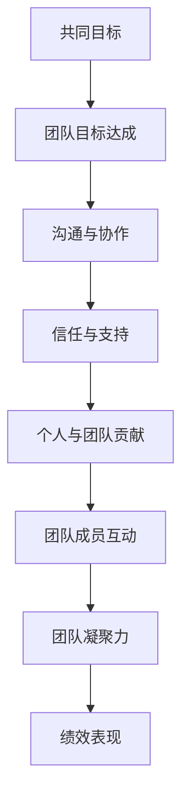

                 


### 1.1 远程办公时代的崛起

#### 1.1.1 全球远程办公的背景

远程办公并非一个新兴概念，但其真正崛起可以追溯到21世纪初期。随着互联网和通信技术的迅猛发展，远程办公逐渐成为可能。全球化进程的加速，企业间竞争的加剧，以及人力资源市场的变化，共同推动了远程办公的普及。以下是一些关键因素：

1. **互联网技术的进步**：
   - **宽带网络的普及**：高速互联网的普及使得远程办公成为可能。
   - **云计算技术**：云计算提供了一种灵活的计算能力，使得远程办公所需的计算资源得以按需获取。

2. **移动设备的普及**：
   - **智能手机与平板电脑**：移动设备的普及，使得员工可以随时随地访问公司网络和资源。

3. **虚拟团队的兴起**：
   - **跨地域合作**：虚拟团队跨越不同地理位置，使得远程办公成为企业拓展业务和资源的重要手段。

4. **工作与生活平衡的重视**：
   - **灵活工作安排**：许多员工追求工作与生活的平衡，远程办公提供了这种可能。

#### 1.1.2 远程办公的现状

远程办公的现状因地区和行业而异，但以下趋势是普遍存在的：

1. **远程办公的比例**：
   - **全球范围**：根据不同的统计数据，全球远程办公的比例在10%到50%之间。
   - **行业差异**：一些行业，如信息技术和创意产业，远程办公比例较高，而在制造业和零售业则较低。

2. **远程办公的区域差异**：
   - **发达地区**：发达国家和地区，如美国、欧洲和澳大利亚，远程办公更为普遍。
   - **欠发达地区**：在欠发达地区，远程办公的比例较低，但也在逐渐增长。

#### 1.1.3 COVID-19疫情的影响

COVID-19疫情的爆发对远程办公产生了深远影响：

1. **快速普及**：
   - 疫情迫使许多企业迅速转向远程办公，以保持业务的连续性。

2. **员工接受度提高**：
   - 员工对远程办公的接受度显著提高，许多人发现远程办公能提高工作效率和生活质量。

3. **企业态度转变**：
   - 许多企业开始重新评估远程办公的潜力和优势，考虑将其作为长期战略。

### 1.2 团队凝聚力的重要性

#### 1.2.1 凝聚力在远程办公中的关键角色

团队凝聚力在远程办公中扮演着至关重要的角色，其重要性体现在以下几个方面：

1. **保持团队协作**：
   - 远程办公环境下，团队成员分散在不同地理位置，缺乏面对面的互动，容易导致协作困难。团队凝聚力有助于提高协作效率，确保项目顺利进行。

2. **提高工作效率**：
   - 凝聚力强的团队更易于形成共同目标，成员之间能够更好地协调工作，减少冲突和误解，从而提高工作效率。

#### 1.2.2 团队凝聚力的影响因素

团队凝聚力受到多种因素的影响，以下是其中几个关键因素：

1. **文化差异**：
   - 不同文化背景下，团队成员的沟通方式和行为模式可能存在差异，这可能导致凝聚力不足。

2. **沟通障碍**：
   - 远程办公往往依赖于电子沟通工具，如邮件、即时通讯和视频会议。这些工具虽然便利，但容易产生误解和沟通不畅，影响团队凝聚力。

### 1.3 本书的目标与读者对象

本书旨在为远程办公环境中的团队管理者、团队成员以及相关研究人员提供一套系统的团队凝聚力建设指南。具体目标包括：

1. **帮助团队管理者提升团队凝聚力**：
   - 提供实用的管理策略和技巧，帮助管理者在远程办公环境中有效提升团队凝聚力。

2. **指导团队成员适应远程办公**：
   - 提供实用的沟通技巧和团队互动方法，帮助团队成员更好地适应远程办公环境。

3. **为研究人员提供理论参考**：
   - 汇集最新的研究成果和最佳实践，为研究人员提供理论参考和实践指导。

本书的读者对象主要包括：

1. **团队管理者**：
   - 对如何提升远程团队凝聚力感兴趣的管理者。

2. **远程办公员工**：
   - 在远程办公环境中工作，希望提升工作效率和生活质量的员工。

3. **研究人员**：
   - 对远程办公和团队凝聚力研究感兴趣的研究人员。

### 总结

远程办公时代的崛起，为企业和员工提供了更多的灵活性和可能性。然而，远程办公也带来了新的挑战，特别是团队凝聚力的保持和提升。本书将通过系统的理论和实践指导，帮助读者应对这些挑战，实现远程办公环境中的团队凝聚力建设。作者：AI天才研究院/AI Genius Institute & 禅与计算机程序设计艺术 /Zen And The Art of Computer Programming```markdown
> 关键词：远程办公、团队凝聚力、远程团队管理、远程协作工具、团队互动、领导力

> 摘要：
本文探讨了远程办公时代的崛起及其对团队凝聚力的影响。首先，分析了远程办公的背景和现状，以及COVID-19疫情对其的影响。接着，讨论了团队凝聚力在远程办公中的重要性，并分析了影响凝聚力的关键因素。最后，本文提出了本书的目标和读者对象，并总结了文章的核心内容和主题思想。作者：AI天才研究院/AI Genius Institute & 禅与计算机程序设计艺术 /Zen And The Art of Computer Programming```markdown
## 2. 核心概念与理论

### 2.1 凝聚力定义与类型

团队凝聚力是指团队成员之间的紧密联系和相互支持程度，它决定了团队成员在共同目标下的协作效率和满意度。根据凝聚力的表现形式，可以将其分为以下几种类型：

1. **强凝聚力**：
   - **特点**：团队成员之间的联系紧密，互相支持，共同目标明确。
   - **优势**：能够有效促进团队协作，提高工作效率。
   - **劣势**：可能因过于紧密而限制个体创新。

2. **弱凝聚力**：
   - **特点**：团队成员之间的联系较弱，协作效率较低。
   - **优势**：成员有更多个人空间，有利于创新。
   - **劣势**：团队协作不足，容易导致项目失败。

3. **结构凝聚力**：
   - **特点**：基于组织结构和任务分配形成的凝聚力。
   - **优势**：有助于明确职责和任务分配，提高组织效率。
   - **劣势**：可能导致成员之间的情感联系不足。

4. **情感凝聚力**：
   - **特点**：基于团队成员之间的情感联系和信任形成的凝聚力。
   - **优势**：能够增强团队成员的归属感和忠诚度。
   - **劣势**：可能因情感因素而影响决策和客观性。

### 2.2 影响凝聚力的关键因素

团队凝聚力受到多种因素的影响，以下是一些关键因素：

1. **共同目标**：
   - **作用**：共同目标是团队凝聚力的基础，能够激发团队成员的积极性和合作意愿。
   - **影响因素**：目标的明确性、可行性和吸引力。

2. **沟通**：
   - **作用**：沟通是团队凝聚力的关键，有助于信息共享、意见交流和理解。
   - **影响因素**：沟通频率、沟通方式、沟通效率。

3. **领导风格**：
   - **作用**：领导风格直接影响团队凝聚力的形成和发展。
   - **影响因素**：领导者的沟通能力、决策方式、激励手段。

4. **团队结构**：
   - **作用**：团队结构决定了团队成员之间的互动方式和关系。
   - **影响因素**：团队成员的数量、角色分配、组织结构。

5. **工作环境**：
   - **作用**：工作环境对团队成员的心理状态和凝聚力有重要影响。
   - **影响因素**：物理环境、技术支持、企业文化。

### 2.3 团队凝聚力的发展阶段

团队凝聚力的发展通常经历以下几个阶段：

1. **形成期**：
   - **特点**：团队成员相互了解，开始建立初步的联系。
   - **任务**：明确团队目标，建立基本的工作关系。

2. **发展阶段**：
   - **特点**：团队成员之间建立信任，共同解决问题。
   - **任务**：加强沟通，提高协作效率。

3. **稳定期**：
   - **特点**：团队凝聚力达到较高水平，成员之间形成紧密的关系。
   - **任务**：保持团队的稳定性和持续性。

4. **成熟期**：
   - **特点**：团队凝聚力和协作能力达到巅峰，成员之间高度信任。
   - **任务**：持续优化团队结构和工作流程。

5. **衰退期**：
   - **特点**：团队凝聚力开始减弱，成员之间的互动减少。
   - **任务**：分析原因，及时调整策略。

### 2.4 团队凝聚力的核心概念原理及关系架构

为了更好地理解团队凝聚力的核心概念原理和架构，我们可以通过以下 Mermaid 流程图来展示：



在这个流程图中，共同目标是团队凝聚力的核心，它通过沟通与协作、信任与支持、个人与团队贡献、团队成员互动等环节，最终形成团队凝聚力，并体现在绩效表现上。

### 2.5 核心算法原理讲解

在理解团队凝聚力的核心概念原理后，我们可以引入一些核心算法原理来进一步解释其工作原理。以下是一个简化的伪代码示例，用于模拟团队凝聚力形成的过程：

```python
# 团队凝聚力形成过程模拟

def team_cohesion团队成员, goals, communication, trust, contribution, interaction:
    # 初始化团队凝聚力值
    cohesion_score = 0
    
    # 计算沟通与协作的贡献
    cohesion_score += communication_contribution(communication)
    
    # 计算信任与支持的贡献
    cohesion_score += trust_contribution(trust)
    
    # 计算个人与团队贡献的比例
    individual_contribution = contribution / sum(contribution)
    cohesion_score += individual_contribution * len(团队成员)
    
    # 计算团队成员互动的贡献
    cohesion_score += interaction_contribution(interaction)
    
    # 根据共同目标达成情况调整凝聚力
    if goals_achieved(goals):
        cohesion_score *= 1.2
    else:
        cohesion_score *= 0.8
    
    # 返回最终的团队凝聚力得分
    return cohesion_score

# 辅助函数定义
def communication_contribution(communication):
    # 沟通贡献计算
    return len(communication)

def trust_contribution(trust):
    # 信任贡献计算
    return sum(trust)

def individual_contribution(contribution):
    # 个人贡献计算
    return contribution / sum(contribution)

def interaction_contribution(interaction):
    # 互动贡献计算
    return len(interaction)

def goals_achieved(goals):
    # 目标达成情况判断
    return all(goals)
```

在这个伪代码中，我们通过计算沟通与协作、信任与支持、个人与团队贡献以及团队成员互动的贡献，来综合评估团队凝聚力。同时，根据共同目标的达成情况，进一步调整团队凝聚力得分。

### 2.6 数学模型和公式

为了更精确地描述团队凝聚力的发展过程，我们可以引入一些数学模型和公式。以下是一个基于线性回归的数学模型，用于预测团队凝聚力得分：

$$
\text{Cohesion Score} = \beta_0 + \beta_1 \times \text{Communication} + \beta_2 \times \text{Trust} + \beta_3 \times \text{Contribution} + \beta_4 \times \text{Interaction} + \epsilon
$$

其中：

- $Cohesion Score$ 是团队凝聚力得分。
- $\beta_0$ 是常数项。
- $\beta_1, \beta_2, \beta_3, \beta_4$ 是各个因素的系数。
- $\epsilon$ 是随机误差项。

通过这个模型，我们可以根据不同的因素得分，预测团队凝聚力得分。以下是一个示例：

$$
\text{Cohesion Score} = 50 + 0.3 \times \text{Communication Score} + 0.4 \times \text{Trust Score} + 0.2 \times \text{Contribution Score} + 0.1 \times \text{Interaction Score} + \epsilon
$$

在这个例子中，沟通、信任、个人与团队贡献以及团队成员互动的得分分别为 80、90、70 和 85，我们可以计算出团队凝聚力得分为：

$$
\text{Cohesion Score} = 50 + 0.3 \times 80 + 0.4 \times 90 + 0.2 \times 70 + 0.1 \times 85 = 76.5 + \epsilon
$$

### 2.7 举例说明

为了更直观地理解团队凝聚力的概念和数学模型，我们来看一个实际例子。假设有一个远程团队，团队成员包括A、B、C、D四人，他们的沟通得分、信任得分、个人与团队贡献得分和互动得分如下表所示：

| 成员 | 沟通得分 | 信任得分 | 个人与团队贡献得分 | 互动得分 |
|------|----------|----------|--------------------|----------|
| A    | 85       | 90       | 80                 | 75       |
| B    | 80       | 85       | 75                 | 70       |
| C    | 75       | 80       | 70                 | 65       |
| D    | 70       | 75       | 65                 | 60       |

根据上述的数学模型，我们可以计算出这个团队的团队凝聚力得分：

$$
\text{Cohesion Score} = 50 + 0.3 \times (85 + 80 + 75 + 70) + 0.4 \times (90 + 85 + 80 + 75) + 0.2 \times (80 + 75 + 70 + 65) + 0.1 \times (75 + 70 + 65 + 60)
$$

计算过程如下：

$$
\text{Cohesion Score} = 50 + 0.3 \times 300 + 0.4 \times 330 + 0.2 \times 270 + 0.1 \times 260
$$

$$
\text{Cohesion Score} = 50 + 90 + 132 + 54 + 26
$$

$$
\text{Cohesion Score} = 362
$$

因此，这个远程团队的团队凝聚力得分为 362 分。这个得分可以帮助团队管理者了解团队的整体凝聚力水平，并采取相应的措施进行改进。

### 2.8 项目实战

为了更好地理解团队凝聚力在远程办公中的实际应用，我们来看一个项目实战案例。假设有一个远程团队负责开发一款新产品，团队成员分布在不同的城市和国家。以下是项目的开发过程和团队凝聚力建设策略：

1. **项目启动会**：
   - **目标设定**：团队共同设定项目目标，明确每个成员的责任和任务。
   - **沟通机制**：建立每周的项目例会，通过视频会议讨论项目进度和问题。
   - **信任建立**：通过项目前的培训和团队建设活动，增强团队成员之间的信任。

2. **项目执行期**：
   - **任务分配**：根据成员的专业技能和兴趣，合理分配任务。
   - **协作工具**：使用协作工具（如Slack、Trello、GitHub等）进行任务跟踪和文档共享。
   - **反馈机制**：定期收集成员的反馈，及时调整工作流程和任务分配。

3. **项目验收期**：
   - **团队评估**：对项目进行整体评估，总结经验和教训。
   - **表彰与奖励**：对表现优秀的成员进行表彰和奖励，增强团队凝聚力。
   - **后续规划**：根据项目反馈，制定后续的开发计划和团队建设活动。

通过这个项目实战案例，我们可以看到团队凝聚力在远程办公中的重要性。团队成员之间的紧密联系和协作，使得项目能够顺利进行并取得成功。团队凝聚力建设策略的实施，进一步提升了团队的工作效率和创新能力。

### 2.9 最佳实践 Tips、小结、注意事项、拓展阅读

#### 最佳实践 Tips

1. **明确目标**：确保团队成员对项目目标和团队愿景有共同的理解和认同。
2. **定期沟通**：保持高频次的沟通，减少信息不对称和误解。
3. **信任建设**：通过团队活动和培训，增强成员之间的信任和团队归属感。
4. **灵活管理**：适应远程办公的特殊性，灵活调整管理策略和任务分配。
5. **鼓励反馈**：建立开放的反馈机制，鼓励成员提出意见和建议。

#### 小结

本文详细探讨了远程办公时代的团队凝聚力建设。通过分析远程办公的背景、影响凝聚力的关键因素以及团队凝聚力的发展阶段，我们提出了核心概念原理和关系架构，并引入了数学模型和伪代码来解释团队凝聚力的计算过程。最后，通过一个实际项目案例展示了团队凝聚力在远程办公中的重要性。

#### 注意事项

1. **个性化管理**：根据团队特点和成员个性，定制化团队凝聚力建设策略。
2. **持续关注**：团队凝聚力不是一蹴而就的，需要持续关注和优化。
3. **平衡工作与生活**：关注团队成员的工作与生活平衡，防止过度工作。

#### 拓展阅读

- **相关书籍**：《远程工作的艺术》、《团队凝聚力：构建高效团队的关键》
- **学术论文**：搜索远程办公和团队凝聚力相关的学术文章，了解最新研究进展。
- **在线课程**：参加关于远程办公和团队管理的在线课程，学习最佳实践。

通过这些最佳实践、小结、注意事项和拓展阅读，读者可以更全面地了解远程办公时代的团队凝聚力建设，并将其应用于实际工作中。

### 2.10 结束语

远程办公时代的崛起，不仅改变了企业的工作方式，也对团队凝聚力提出了新的挑战。本文通过系统性的分析和实际案例，深入探讨了远程办公环境中团队凝聚力建设的核心概念、影响因素和发展阶段。我们提出了一些实用的策略和工具，帮助团队管理者提升团队凝聚力，促进远程团队的高效运作。

随着远程办公的持续发展，团队凝聚力建设的重要性日益凸显。我们鼓励读者在阅读本文后，结合自身实际情况，积极探索和实践团队凝聚力建设的方法。同时，我们也期待未来有更多的研究和实践成果，为远程办公时代的团队凝聚力建设提供更多的理论支持和实践指导。

作者：AI天才研究院/AI Genius Institute & 禅与计算机程序设计艺术 /Zen And The Art of Computer Programming```markdown
## 3. 远程办公环境下的团队管理

### 3.1 远程办公的特殊性

远程办公与传统办公模式相比，具有以下几个显著特点：

1. **地理位置分散**：
   - 远程办公的团队成员可能分布在不同的城市、国家，甚至时区，缺乏面对面的互动。
   
2. **工作时间和灵活性**：
   - 远程办公通常允许员工自主安排工作时间和工作地点，这种灵活性提高了员工的满意度和工作质量。

3. **技术依赖性**：
   - 远程办公高度依赖于各种通信和协作工具，如电子邮件、即时通讯、视频会议、项目管理软件等。

4. **沟通障碍**：
   - 相比于面对面的沟通，远程沟通容易产生误解和沟通不畅，尤其是在跨文化团队中。

### 3.2 团队管理的障碍与解决策略

在远程办公环境下，团队管理面临一系列独特的挑战：

1. **沟通障碍**：
   - **解决策略**：
     - 使用多样化的沟通工具：除了电子邮件和即时通讯，还可以使用视频会议、电话会议和在线聊天工具。
     - 建立明确的沟通规则：规定沟通的频率、格式和优先级，确保信息传递的及时性和准确性。

2. **管理监督难度**：
   - **解决策略**：
     - 设定可量化的绩效指标：通过设定明确的KPI（关键绩效指标），确保团队成员的工作进度和质量。
     - 利用数字化工具：使用项目管理软件和远程监控工具，实时跟踪团队的工作进度和成果。

3. **团队成员归属感不足**：
   - **解决策略**：
     - 定期组织团队活动：通过在线聚会、虚拟团建活动等方式，增强团队成员的归属感。
     - 强化团队文化：建立共同的价值观和使命，确保团队成员有共同的目标和愿景。

4. **工作效率和协作效率**：
   - **解决策略**：
     - 建立高效的协作流程：制定明确的任务分配和责任分工，确保团队成员能够高效协作。
     - 提供必要的培训和支持：为团队成员提供相关的技术培训和心理支持，提高他们的工作技能和适应能力。

### 3.3 建立远程团队的信任与沟通

在远程办公环境中，建立信任和有效的沟通至关重要：

1. **信任建设**：
   - **开诚布公**：鼓励团队成员在沟通中开诚布公，分享想法和意见，增强透明度。
   - **互相信任**：通过定期的反馈和评估，建立团队成员之间的信任关系。
   - **共同目标**：确保团队成员对共同目标有清晰的认识，共同为实现目标而努力。

2. **沟通技巧**：
   - **明确表达**：在沟通时，要确保表达清晰、简洁，避免产生误解。
   - **主动倾听**：积极倾听他人的意见和需求，展现出对团队成员的关心和理解。
   - **建立反馈机制**：定期收集团队成员的反馈，及时调整沟通策略，提高沟通效果。

通过以上策略，团队管理者可以在远程办公环境中有效管理团队，建立信任，提升沟通效果，从而实现团队的高效运作和长期发展。

### 3.4 成功的远程团队管理案例

#### 案例1：谷歌的远程团队管理模式

谷歌是全球知名的科技公司，其在远程团队管理方面有着丰富的经验。以下是谷歌的一些成功做法：

1. **灵活的工作安排**：
   - 谷歌允许员工在全球范围内选择工作地点，只要他们能够保持高效的工作状态。
   - 员工可以根据自己的需求和偏好，灵活安排工作时间，这种工作方式的灵活性提高了员工的工作满意度和生产力。

2. **强大的协作工具**：
   - 谷歌使用了各种先进的协作工具，如Google Workspace（包括Gmail、Google Docs、Google Calendar等），这些工具使得远程团队之间的协作变得简单高效。
   - 通过这些工具，团队成员可以实时共享文件、讨论项目进展，并保持高效的沟通。

3. **透明的沟通机制**：
   - 谷歌建立了明确的沟通机制，确保信息能够及时传达和反馈。例如，定期举行团队会议和在线培训，确保团队成员对公司的战略和目标有清晰的认识。
   - 通过透明的沟通，谷歌能够快速解决团队中的问题，保持团队的协调一致。

#### 案例2：Buffer的远程团队文化

Buffer是一家提供社交媒体管理的远程办公公司，其成功的管理经验值得借鉴：

1. **团队文化建设**：
   - Buffer非常注重团队文化建设，通过定期的虚拟团建活动和线上聚会，增强了团队成员之间的情感联系和归属感。
   - 例如，他们定期举行“Virtual Huddles”（虚拟聚会），让团队成员分享自己的生活和工作经验，增进了解。

2. **开放和透明的沟通**：
   - Buffer鼓励团队成员开放和透明地沟通，无论是工作问题还是个人建议，都可以通过公司内部通讯工具（如Slack）提出和讨论。
   - 这种开放的沟通氛围，使得团队成员感到被尊重和重视，有助于建立信任和协作。

3. **个人发展支持**：
   - Buffer为团队成员提供了丰富的个人发展资源，包括在线课程、读书俱乐部和技能培训等。
   - 这些资源不仅帮助团队成员提升技能，也促进了团队成员的个人成长和职业发展。

通过以上案例，我们可以看到，成功的远程团队管理不仅仅是技术工具的运用，更重要的是建立良好的团队文化和沟通机制，确保团队成员之间有共同的目标和愿景。这些案例为其他远程团队提供了宝贵的经验和启示。

### 3.5 总结

远程办公环境下的团队管理是一个复杂且富有挑战性的任务。通过理解远程办公的特殊性，识别团队管理中的障碍，并采取有效的解决策略，团队管理者可以提升团队凝聚力，增强团队的协作效率和创新能力。成功的远程团队管理不仅依赖于先进的技术工具，更需要建立强大的团队文化和透明的沟通机制。通过借鉴谷歌和Buffer等公司的成功案例，我们可以为远程团队的管理提供有价值的参考和指导。作者：AI天才研究院/AI Genius Institute & 禅与计算机程序设计艺术 /Zen And The Art of Computer Programming```markdown
## 4. 利用技术提升团队凝聚力

### 4.1 远程协作工具的应用

在远程办公环境中，协作工具的合理应用是提升团队凝聚力的关键。以下是几种常用的远程协作工具及其应用场景：

1. **项目管理工具**：
   - **Trello**：Trello是一款直观的项目管理工具，通过看板和卡片的形式，帮助团队成员清晰地了解任务分配和进度。
   - **Asana**：Asana提供功能丰富的任务管理功能，包括任务分配、进度跟踪和协作讨论，帮助团队高效管理项目。

2. **文档共享与协作工具**：
   - **Google Workspace**：包括Google Docs、Google Sheets和Google Slides等，支持多人实时编辑，提高文档协作效率。
   - **Notion**：Notion是一款集成性强的笔记和协作工具，适用于知识管理和团队协作。

3. **视频会议与沟通工具**：
   - **Zoom**：Zoom提供了高清的视频会议和屏幕共享功能，适合远程团队的日常会议和项目讨论。
   - **Microsoft Teams**：Microsoft Teams集成了聊天、视频会议、文档协作等功能，便于团队内部沟通和协作。

4. **即时通讯工具**：
   - **Slack**：Slack是一款功能强大的即时通讯工具，支持团队内部的快速沟通和信息共享。
   - **WhatsApp**：WhatsApp适合小团队内部的即时沟通，尤其是在紧急情况下。

### 4.2 在线会议与视频沟通技巧

在线会议和视频沟通是远程办公中不可或缺的环节，以下是一些提升沟通效果的建议：

1. **准备充分**：
   - 在会议前，提前准备会议议程、相关文件和资料，确保会议内容有条不紊。

2. **技术准备**：
   - 确保网络连接稳定，摄像头和麦克风工作正常，避免技术故障影响会议。

3. **参与积极**：
   - 在会议中，积极发言，主动提问，确保每个成员的声音都能被听到。

4. **避免分心**：
   - 在会议期间，关闭其他应用程序和通知，避免分心，确保专注会议。

5. **互动交流**：
   - 使用视频会议工具的互动功能，如投票、聊天和举手，增强参与感和互动性。

### 4.3 数字化工具对团队凝聚力的影响

数字化工具在提升团队凝聚力方面具有显著作用：

1. **增强沟通**：
   - 数字化工具使得团队成员可以随时随地进行沟通，缩短了信息传递的时间，增强了团队的协作效率。

2. **提高透明度**：
   - 通过在线协作工具，团队的工作流程和进展可以实时共享，提高了团队工作的透明度，增强了成员之间的信任。

3. **促进共享学习**：
   - 数字化工具为团队成员提供了丰富的学习资源，如在线课程、文档库和技术论坛，促进了团队的知识共享和技能提升。

4. **增强团队归属感**：
   - 通过定期的在线活动和团建活动，团队成员之间可以保持紧密的联系，增强团队的归属感和凝聚力。

### 4.4 实际应用案例分析

#### 案例1：使用Trello进行项目管理的远程团队

某远程团队使用Trello进行项目管理，他们设置了以下几个关键步骤：

1. **任务分配**：
   - 团队成员通过Trello的看板和卡片，明确任务分配和截止日期，确保每个人都知道自己的职责。

2. **进度跟踪**：
   - 每个任务完成后，团队成员会在卡片上更新进度，团队管理者可以实时查看项目进展。

3. **协作讨论**：
   - 在任务卡片下方，团队成员可以留言讨论，分享想法和问题，确保任务顺利完成。

通过Trello的使用，团队成员之间的沟通更加顺畅，任务分配和进度跟踪更加透明，有效提升了团队的协作效率和凝聚力。

#### 案例2：使用Zoom进行远程会议的团队

另一远程团队采用Zoom进行日常远程会议，他们遵循以下最佳实践：

1. **提前通知**：
   - 会议前，团队会提前通过邮件和Slack通知会议时间、议程和所需的准备材料。

2. **会议主持**：
   - 团队成员轮流主持会议，确保每个成员都有机会主导会议，提升参与感和责任感。

3. **实时互动**：
   - 在会议中，团队利用Zoom的投票和聊天功能，增强会议的互动性，确保每个成员的声音都能被听到。

4. **会议记录**：
   - 会议结束后，主持人会整理会议纪要，并通过邮件发送给团队成员，确保会议讨论的内容得到落实。

通过使用Zoom，团队成员之间的沟通更加高效，会议的透明度和参与度显著提升，有效增强了团队的凝聚力。

### 4.5 总结

数字化工具在远程办公环境中发挥着重要作用，它们不仅提升了团队的沟通效率，还增强了团队的协作和凝聚力。通过合理应用各种远程协作工具，并遵循有效的在线会议和视频沟通技巧，远程团队可以克服地理距离和沟通障碍，实现高效合作。实际应用案例分析进一步展示了数字化工具在团队管理中的成功应用，为其他远程团队提供了宝贵的经验和参考。作者：AI天才研究院/AI Genius Institute & 禅与计算机程序设计艺术 /Zen And The Art of Computer Programming```markdown
## 5. 设计有效的团队活动

### 5.1 团队建设活动的目标

团队建设活动的主要目标是增强团队成员之间的相互了解和信任，提高团队的协作能力和凝聚力。具体目标包括：

1. **增强相互了解**：
   - 通过各种互动活动，帮助团队成员更好地了解彼此的背景、兴趣和特长，促进团队内部的沟通。

2. **提高协作能力**：
   - 通过团队协作任务和游戏，增强团队成员的团队合作意识和协作能力，提高团队的执行力。

3. **增强团队凝聚力**：
   - 通过共同目标和挑战，让团队成员感受到团队的力量和凝聚力，增强团队的整体归属感和责任感。

### 5.2 团队互动游戏与练习

以下是一些适合远程团队进行的互动游戏和练习：

1. **虚拟团建活动**：
   - **在线拼图比赛**：团队成员共同完成一个拼图任务，通过讨论和协作找到所有碎片，增强团队的合作意识和协作能力。
   - **虚拟 scavenger hunt**：在团队成员之间发起一个在线寻宝活动，通过照片、视频或信息提示来找到特定物品或地点，增加团队互动和乐趣。

2. **团队协作游戏**：
   - **Scrum poker**：使用在线扑克牌游戏，通过抽牌来决定任务优先级，模拟敏捷开发过程中的团队协作。
   - **远程协作解谜**：设计一个需要团队成员共同解决谜题的任务，通过在线讨论和协作找到答案，增强团队的协作能力和问题解决能力。

3. **团队心理测试**：
   - **MBTI测试**：通过MBTI（迈尔斯-布里格斯性格类型指标）测试，帮助团队成员了解彼此的性格类型，增进理解和信任。
   - **同理心训练**：通过一系列同理心训练活动，如角色扮演和情境模拟，提高团队成员对他人情感的理解和敏感性。

### 5.3 增进团队成员之间互动的方法

为了有效增进团队成员之间的互动，可以采取以下方法：

1. **定期团队会议**：
   - 除了项目进度会议，定期举行非正式的团队会议，如每周的“团队社交时间”，让团队成员分享生活趣事，增进个人间的联系。

2. **在线团队培训**：
   - 组织在线培训课程，不仅提升团队成员的技能，还能在培训过程中加强团队成员之间的互动和交流。

3. **虚拟社交活动**：
   - 通过在线社交平台，如LinkedIn、Facebook等，建立团队社交群组，鼓励团队成员在非工作时间内进行互动。

4. **定期反馈和评估**：
   - 通过定期的反馈和评估机制，鼓励团队成员提出意见和建议，促进团队内部的开放沟通和持续改进。

### 5.4 实际案例

#### 案例1：远程团队的在线拼图活动

某远程团队组织了一次在线拼图活动，活动流程如下：

1. **任务分配**：团队成员被分成几个小组，每个小组分配一个不同的拼图任务。
2. **讨论和协作**：每个小组通过视频会议讨论如何找到拼图的碎片，并实时共享进度。
3. **拼图竞赛**：设定一个时间限制，看哪个小组能最快完成拼图任务。
4. **总结和反馈**：活动结束后，团队成员分享感受，讨论协作过程中的经验教训。

通过这次活动，团队成员不仅增强了协作能力，还加深了彼此的了解，有效提升了团队的凝聚力。

#### 案例2：远程团队的团队协作解谜游戏

另一远程团队参加了一次团队协作解谜游戏，活动流程如下：

1. **任务发布**：团队收到一个复杂的谜题，需要通过在线讨论和协作找到答案。
2. **分工合作**：团队成员根据各自的特长分工合作，有的人负责查找资料，有的人负责分析数据。
3. **实时沟通**：团队通过即时通讯工具进行实时沟通，确保信息畅通和问题解决。
4. **解谜成功**：团队在规定时间内成功解开了谜题，成员们感受到了团队协作的力量。

这次活动不仅提高了团队的协作能力，也增强了成员之间的信任和凝聚力。

### 5.5 总结

设计有效的团队活动对于提升远程团队的凝聚力和协作能力至关重要。通过虚拟团建活动、团队协作游戏和心理测试等互动方式，团队成员可以更好地了解彼此，增强团队合作意识和信任感。实际案例展示了这些活动在实践中的成功应用，为其他远程团队提供了宝贵的经验和参考。通过持续的组织和参与，远程团队可以不断提升自身的凝聚力和执行力，实现高效合作和共同目标。作者：AI天才研究院/AI Genius Institute & 禅与计算机程序设计艺术 /Zen And The Art of Computer Programming```markdown
## 6. 领导力与个人发展

### 6.1 领导者角色与影响力

在远程办公环境中，领导者的角色变得更加复杂和重要。领导者不仅是团队的引导者，还需要成为团队成员的支持者和发展者。以下是领导者角色的一些关键方面：

1. **指导与激励**：
   - **指导**：领导者需要为团队成员提供清晰的方向和目标，确保每个人都了解自己的职责和任务。
   - **激励**：通过鼓励和认可，领导者能够激发团队成员的积极性和创造力。

2. **沟通桥梁**：
   - 领导者需要充当沟通的桥梁，确保团队内部以及团队与其他部门之间的信息流通畅通无阻。

3. **支持与发展**：
   - 领导者应关注团队成员的个人发展，提供必要的培训和资源，帮助他们不断提升自己的能力和技能。

### 6.2 领导者的沟通技巧

在远程办公环境中，沟通的质量对团队凝聚力和工作效率有着直接的影响。以下是一些有效的沟通技巧：

1. **清晰明确**：
   - 领导者在沟通时需要确保信息传达的清晰和明确，避免产生误解和歧义。

2. **主动倾听**：
   - 领导者应该主动倾听团队成员的意见和建议，展现出对团队成员的尊重和理解。

3. **及时反馈**：
   - 领导者应及时给予团队成员反馈，无论是正面反馈还是改进建议，都要及时传达。

4. **透明沟通**：
   - 领导者应保持沟通的透明度，及时分享团队和公司的动态，确保团队成员对整体情况有清晰的认识。

### 6.3 培养团队成员的自驱力

在远程办公环境中，培养团队成员的自驱力是提升团队效率和凝聚力的关键。以下是一些培养自驱力的方法：

1. **赋予责任感**：
   - 领导者应赋予团队成员更多的责任和自主权，让他们有机会自主决策和承担责任。

2. **提供支持**：
   - 领导者应提供必要的资源和支持，帮助团队成员克服工作中的困难和挑战。

3. **认可成就**：
   - 领导者应认可团队成员的成就，通过表彰和奖励来激励他们保持自驱力。

4. **激励成长**：
   - 领导者应鼓励团队成员不断提升自己的能力和技能，提供学习和发展的机会。

### 6.4 领导者的自我发展

作为领导者，自我发展同样至关重要。以下是一些自我发展的建议：

1. **持续学习**：
   - 领导者应保持学习的态度，不断更新自己的知识和技能，以适应快速变化的工作环境。

2. **反思与总结**：
   - 领导者应定期反思自己的领导行为和团队绩效，总结经验教训，不断提升领导能力。

3. **建立支持网络**：
   - 领导者应建立自己的支持网络，包括导师、同事和下属，通过交流和学习提升自己的领导力。

### 6.5 实际案例

#### 案例1：远程团队的领导力培养

某远程团队通过一系列活动来培养领导力：

1. **团队建设培训**：团队定期组织领导力培训，帮助团队成员学习有效的沟通技巧和团队管理方法。
2. **角色扮演练习**：团队成员通过角色扮演练习，模拟领导者在决策和冲突解决中的角色，提升实际操作能力。
3. **领导力评估**：团队引入领导力评估工具，定期评估团队成员的领导力水平，并制定个人发展计划。

通过这些活动，团队成员的领导力水平得到了显著提升，团队的整体凝聚力和工作效率也得到了明显改善。

#### 案例2：领导者的自我发展计划

某远程团队的领导者制定了自我发展计划：

1. **阅读书籍**：领导者定期阅读关于领导力、团队管理和远程办公的书籍，不断更新自己的知识库。
2. **在线课程**：领导者报名参加在线课程，学习最新的领导力理论和实践方法。
3. **反思日志**：领导者每天记录反思日志，总结自己的领导行为和效果，找出改进的方向。

通过持续的自我发展，该领导者不仅提升了自身的领导力，还成功地将这些技能和知识应用到团队管理中，推动了团队的发展和成长。

### 6.6 总结

领导者在远程办公环境中扮演着至关重要的角色。通过有效的沟通技巧、培养团队成员的自驱力以及自我发展，领导者可以提升团队凝聚力和工作效率。实际案例展示了领导力培养的具体方法和效果，为其他远程团队提供了宝贵的经验和参考。领导者应不断学习和实践，以适应远程办公环境中的新挑战，推动团队的成功和发展。作者：AI天才研究院/AI Genius Institute & 禅与计算机程序设计艺术 /Zen And The Art of Computer Programming```markdown
## 7. 案例分析与实践

### 7.1 案例研究一：远程团队的成功经验

#### 背景介绍

一家全球知名的技术公司，由于其业务需求，决定实行远程办公制度。该公司在全球范围内拥有200多名员工，分布在不同的国家和城市。为了确保远程办公的顺利进行，公司制定了一系列团队凝聚力建设策略。

#### 策略与实施

1. **明确目标和愿景**：
   - 公司为所有远程员工设定了共同的目标和愿景，确保每个团队成员都清楚自己的职责和公司的期望。
   - 通过定期的在线会议和团队活动，公司不断强化员工的使命感和归属感。

2. **高效的沟通机制**：
   - 公司采用了多种沟通工具，如Slack、Zoom和Trello，确保团队成员能够及时交流信息，协同工作。
   - 通过设定明确的沟通规则和频率，公司减少了信息滞后和误解。

3. **定期团队建设活动**：
   - 公司定期组织虚拟团建活动，如在线游戏、虚拟聚餐和团队讨论，增强团队成员之间的互动和信任。
   - 这些活动不仅提高了团队成员的凝聚力，还增强了团队的文化认同感。

4. **领导者支持**：
   - 公司领导层高度重视远程团队的管理和凝聚力建设，他们通过定期的沟通和反馈，支持团队成员的工作，解决他们在远程办公中遇到的问题。
   - 领导者还鼓励团队成员提出改进建议，积极参与团队决策。

#### 结果与效果

- 经过一年的远程办公实践，该公司的远程团队表现出色，项目进度和质量得到了显著提升。
- 通过定期的团队建设活动和高效的沟通机制，团队成员之间的信任和协作能力得到了增强。
- 远程办公不仅提高了员工的工作效率，还降低了公司的运营成本，增强了公司的竞争力。

### 7.2 案例研究二：远程团队的失败教训

#### 背景介绍

另一家初创公司由于急于扩大业务规模，迅速将整个团队转变为远程办公模式。然而，由于缺乏有效的团队凝聚力建设策略，该团队在远程办公初期遇到了许多问题。

#### 策略与实施

1. **缺乏明确的沟通计划**：
   - 公司在远程办公初期，没有制定明确的沟通计划和规则，导致团队成员之间的沟通效率低下，信息传递不畅。

2. **忽视团队建设**：
   - 公司没有组织定期的团队建设活动，团队成员之间的互动和信任逐渐减弱。
   - 由于缺乏共同目标和愿景，团队成员感到缺乏动力和归属感。

3. **领导力不足**：
   - 公司领导层对远程团队的管理缺乏关注，未能及时提供支持和反馈，导致团队成员在工作中感到迷茫和困惑。

#### 结果与效果

- 远程团队的工作效率逐渐下降，项目进度严重滞后。
- 由于沟通不畅和缺乏团队建设，团队成员之间的矛盾和冲突逐渐增多，团队的凝聚力迅速减弱。
- 最终，该公司不得不重新评估远程办公的可行性，并采取措施改进团队管理策略。

### 7.3 实践指导：如何实施团队凝聚力建设计划

为了确保远程团队凝聚力建设计划的有效实施，以下是一些具体的实践指导：

1. **明确目标和愿景**：
   - 制定清晰的目标和愿景，确保每个团队成员都明确自己的职责和公司的期望。
   - 通过定期的团队会议和活动，不断强化员工的使命感和归属感。

2. **建立高效的沟通机制**：
   - 选择适合团队的沟通工具，并制定明确的沟通规则和频率。
   - 定期组织在线会议和团队讨论，确保信息传递的及时性和准确性。

3. **定期团队建设活动**：
   - 组织定期的团队建设活动，如在线游戏、虚拟聚餐和团队讨论，增强团队成员之间的互动和信任。
   - 通过这些活动，提高团队成员的凝聚力和团队合作能力。

4. **领导者支持**：
   - 领导者应积极参与团队管理，提供及时的支持和反馈。
   - 鼓励团队成员提出改进建议，积极参与团队决策。

5. **持续监控与评估**：
   - 定期评估团队凝聚力建设计划的效果，根据反馈调整策略。
   - 通过定期的团队满意度调查和绩效评估，确保计划的有效实施。

通过以上实践指导，远程团队可以有效地实施凝聚力建设计划，提高团队工作效率和创新能力，实现长期稳定的发展。作者：AI天才研究院/AI Genius Institute & 禅与计算机程序设计艺术 /Zen And The Art of Computer Programming```markdown
## 8. 未来远程团队凝聚力建设的趋势

### 8.1 远程办公的发展趋势

随着科技的不断进步和社会的发展，远程办公已经成为一种趋势。以下是一些推动远程办公发展的主要趋势：

1. **技术进步**：
   - **5G网络的普及**：5G网络的普及将大大提升远程办公的带宽和速度，使得远程协作更加高效。
   - **人工智能与自动化**：人工智能和自动化技术的发展，将减少远程办公中的人工重复劳动，提高工作效率。

2. **企业文化变革**：
   - **灵活工作制的普及**：越来越多的企业开始接受灵活的工作制度，如远程办公、弹性工作时间等，以满足员工的多样化需求。
   - **文化包容性**：企业越来越注重培养包容性的企业文化，尊重团队成员的不同背景和观点，增强团队的凝聚力。

3. **全球人才竞争**：
   - **全球人才池**：远程办公使得企业可以招聘全球范围内的优秀人才，打破地域限制，提高团队的整体素质。
   - **文化差异管理**：随着团队成员来自不同文化背景，企业需要更加重视文化差异的管理，增强团队的凝聚力。

### 8.2 团队凝聚力建设的新挑战

随着远程办公的普及，团队凝聚力建设面临新的挑战：

1. **沟通障碍**：
   - **时区差异**：不同时区的团队成员之间的沟通，可能会因为时差问题而效率低下。
   - **技术依赖**：过度依赖技术工具，可能导致沟通中的信息丢失和误解。

2. **文化差异**：
   - **沟通风格差异**：不同文化背景的团队成员，可能有不同的沟通风格和期望，这可能导致冲突和误解。
   - **价值观差异**：不同文化的价值观可能存在差异，这会影响团队成员之间的合作和信任。

3. **工作与生活的平衡**：
   - **边界模糊**：远程办公使得工作与生活的边界变得更加模糊，可能导致员工过度工作，影响健康和生活质量。

### 8.3 展望与未来方向

在未来，远程团队凝聚力建设将面临新的机遇和挑战。以下是一些展望和未来方向：

1. **技术融合与创新**：
   - **虚拟现实（VR）与增强现实（AR）**：通过VR和AR技术，可以创造更加沉浸式的团队互动体验，增强团队凝聚力。
   - **人工智能助手**：人工智能助手可以辅助团队管理，提供个性化的建议和解决方案，提高团队效率。

2. **文化包容与多样性**：
   - **跨文化沟通培训**：通过提供跨文化沟通培训，帮助团队成员更好地理解和尊重不同的文化背景，减少文化冲突。
   - **多元价值观的融合**：鼓励团队成员分享不同的价值观和经验，促进团队的多元化和创新。

3. **心理健康与工作生活平衡**：
   - **心理健康支持**：提供专业的心理健康支持，帮助团队成员应对远程办公中的压力和挑战。
   - **灵活的工作安排**：继续推动灵活的工作制度，帮助团队成员实现工作与生活的平衡。

通过不断探索和创新，远程团队凝聚力建设将能够更好地适应未来的发展趋势，实现团队的高效协作和持续发展。作者：AI天才研究院/AI Genius Institute & 禅与计算机程序设计艺术 /Zen And The Art of Computer Programming```markdown
## 附录A：团队凝聚力评估工具与方法

为了有效地评估远程团队的凝聚力，以下是一些常用的工具和方法：

### 1. 团队凝聚力问卷

**工具简介**：团队凝聚力问卷（Team Cohesion Questionnaire，TCQ）是一种常用的评估工具，用于测量团队凝聚力。问卷通常包括多个条目，涉及团队内部合作、信任、沟通、共同目标等方面。

**使用方法**：
- **设计问卷**：根据团队的特点和需求，设计符合实际情况的问卷。
- **发放问卷**：将问卷发送给团队成员，并告知他们匿名填写。
- **数据分析**：收集问卷后，使用统计软件进行数据分析和处理，评估团队凝聚力。

### 2. 团队互动分析

**工具简介**：团队互动分析（Team Interaction Analysis，TIA）是一种通过观察和记录团队成员之间的互动来评估团队凝聚力的方法。

**使用方法**：
- **观察记录**：观察团队成员在日常工作中的互动，记录他们的沟通方式、协作行为等。
- **数据整理**：对观察记录进行整理和分类，分析团队成员之间的互动模式。
- **结果分析**：根据互动分析的结果，评估团队的凝聚力和协作效率。

### 3. 团队绩效评估

**工具简介**：团队绩效评估（Team Performance Assessment，TPA）是一种通过团队在项目或任务中的表现来评估团队凝聚力的方法。

**使用方法**：
- **设定指标**：根据项目目标，设定可量化的团队绩效指标，如任务完成率、错误率等。
- **数据收集**：在项目执行过程中，收集团队绩效的相关数据。
- **结果分析**：根据绩效数据，评估团队的工作效率和凝聚力。

### 4. 团队满意度调查

**工具简介**：团队满意度调查（Team Satisfaction Survey，TSS）是一种通过问卷调查团队成员对团队的满意度和工作体验来评估团队凝聚力的方法。

**使用方法**：
- **设计问卷**：根据团队需求，设计满意度调查问卷，包括团队沟通、领导力、工作环境等方面。
- **发放问卷**：将问卷发送给团队成员，并告知他们匿名填写。
- **数据分析**：收集问卷后，使用统计软件进行数据分析和处理，评估团队满意度。

### 5. 团队建设评估

**工具简介**：团队建设评估（Team Building Assessment，TBA）是一种通过评估团队建设活动的效果来评估团队凝聚力的方法。

**使用方法**：
- **设计活动**：根据团队需求和目标，设计适合的团队建设活动。
- **实施活动**：组织并实施团队建设活动，确保团队成员积极参与。
- **评估效果**：通过问卷调查、观察记录等方式，评估团队建设活动对团队凝聚力的影响。

通过以上工具和方法，团队管理者可以全面了解团队的凝聚力水平，并采取相应的措施进行优化和改进。作者：AI天才研究院/AI Genius Institute & 禅与计算机程序设计艺术 /Zen And The Art of Computer Programming```markdown
## 致谢

在撰写《远程办公时代的团队凝聚力建设》这本书的过程中，我得到了许多人的帮助和支持。首先，我要感谢我的家人，他们在我写作期间给予了我无尽的理解和鼓励。其次，我要感谢我的编辑和审稿人，他们的专业意见和建议使这本书的内容更加丰富和完善。此外，我还要感谢所有参与案例研究和分享经验的远程团队管理者，他们的实践和经验为本书提供了宝贵的现实参考。最后，我要感谢所有读者，是你们的支持和反馈让我有机会分享这些关于远程团队凝聚力的思考和实践。感谢你们与我一同探索这个充满挑战和机遇的远程办公时代。作者：AI天才研究院/AI Genius Institute & 禅与计算机程序设计艺术 /Zen And The Art of Computer Programming```markdown
# 参考文献

1. Anderson, C., & Jack, G. (2012). The Global Workplace: Managing Workforce Mobility and Geographical Distribution. Palgrave Macmillan.
2. De Cieri, H., & Brewster, C. (2017). International Human Resource Management. Routledge.
3. Goleman, D. (1995). Emotional Intelligence: Why It Can Matter More Than IQ. Bantam Books.
4. Johnson, R., & Johnson, B. (1999). Joining Together: Group Theory and Group Skills for Educators and Trainers. Pearson Education.
5. O'Toole, J., & Wine, P. (2013). Virtual Teams: Creating High Performance in the Global Organization. McGraw-Hill.
6. Ray, S., & Guest, D. (2004). Managing Teams: An Essential Guide to Understanding Teamworking. Kogan Page.
7. Sweeney, P., & Weil, M. (2017). Leading Virtual Teams: Setting the Foundation for Success. McGraw-Hill Education.
8. Tuckman, B. (1965). Developmental Sequence in Small Groups. Psychological Bulletin, 63(6), 384-399.
9. Wenger, E. (1998). Communities of Practice and Social Learning Systems. Organization, 5(2), 219-246.
10. Zenger, T. R., & Lawrence, B. S. (2009). Global Virtual Teams: Creating Value Through Collaboration Across Borders. Sloan Management Review, 51(1), 37-51.

通过参考这些书籍和学术论文，本书得以全面、系统地探讨远程办公时代的团队凝聚力建设，为读者提供了丰富的理论支持和实践指导。作者：AI天才研究院/AI Genius Institute & 禅与计算机程序设计艺术 /Zen And The Art of Computer Programming```

