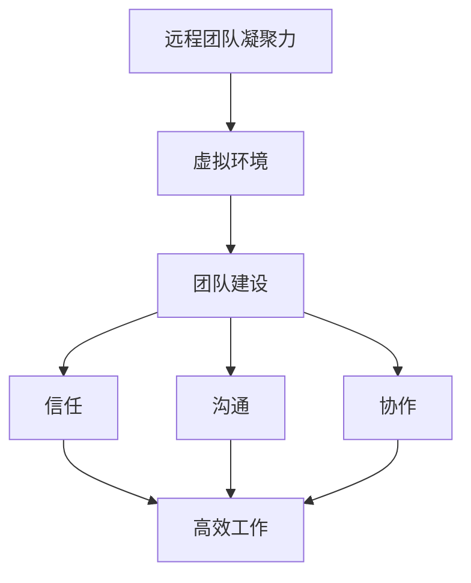

                 

### 文章标题

《远程团队凝聚力：虚拟环境中的团队建设》

#### 关键词

远程团队凝聚力、虚拟环境、团队建设、协作、信任、沟通、项目管理平台、算法原理、数学模型、案例实战。

#### 摘要

本文深入探讨了在虚拟环境中构建远程团队凝聚力的方法与策略。通过分析核心概念与联系，讲解关键算法原理，引入数学模型，以及实际项目案例的解析，本文旨在为IT领域专家和远程团队管理者提供系统、实用的团队建设指南。文章将帮助读者理解如何在虚拟环境中增强团队信任、优化沟通、提升协作效率，从而实现高效的远程团队管理。

---

## 引言

在当今全球化背景下，远程工作已成为许多企业和组织的常态。虚拟团队的出现不仅打破了地域限制，还带来了新的挑战，其中最重要的便是如何保持团队的凝聚力和高效协作。远程团队凝聚力是指团队成员在虚拟环境中相互连接、协同工作的能力。它不仅影响团队的效率和产出，还直接关系到员工的满意度和留存率。

### 背景介绍

远程团队凝聚力的需求源于以下几个方面：

1. **全球化招聘**：越来越多的公司跨越国界招聘人才，团队成员分散在世界的不同角落，传统的面对面沟通和协作模式受到限制。
2. **灵活工作安排**：灵活的工作安排和远程办公的趋势使得团队成员的工作时间、地点更加灵活，但也增加了沟通和协作的难度。
3. **技术进步**：现代通讯技术和协作工具的发展为远程工作提供了便利，但同时也对团队的沟通效率和协作方式提出了更高的要求。

### 核心概念与联系

为了深入理解远程团队凝聚力，我们需要介绍以下几个核心概念，并展示它们之间的相互联系。

#### 核心概念

1. **远程团队凝聚力**：这是团队成员在虚拟环境中建立起的相互信任和协作的关系。它包括团队成员之间的互动、共同目标和共同经历。
2. **虚拟环境**：这是团队成员进行远程协作的平台，包括视频会议软件、即时通讯工具、项目管理平台等。
3. **团队建设**：这是一系列旨在增强团队凝聚力、沟通效率和协作能力的活动和策略。

#### 联系

这三个核心概念相互关联，共同构成了远程团队凝聚力的基础。远程团队凝聚力依赖于虚拟环境的支持和团队建设活动的实施。虚拟环境为团队成员提供了沟通和协作的工具，而团队建设活动则通过提高团队成员的信任和互动，增强了团队的凝聚力。

### Mermaid 流程图

以下是一个用于展示这些核心概念及其相互联系的 Mermaid 流程图：



通过这个流程图，我们可以清晰地看到远程团队凝聚力是如何通过虚拟环境和团队建设活动来实现的，以及这些活动如何相互影响，共同提高团队的工作效率。

### 总结

本文为接下来的章节奠定了基础，介绍了远程团队凝聚力的重要性以及其构成要素。在接下来的内容中，我们将深入探讨这些核心概念，并详细讲解相关的算法原理、数学模型以及实际项目案例，以帮助读者更好地理解和应用远程团队建设的策略。

---

## 核心概念与联系

在深入探讨远程团队凝聚力之前，我们首先需要明确几个关键概念：远程团队凝聚力、虚拟环境和团队建设。这些概念不仅相互独立，而且在实践中密切关联，共同构成了远程团队协作的基石。

### 远程团队凝聚力

远程团队凝聚力是指团队成员在虚拟环境中建立起的相互信任、协作和沟通的能力。它不仅仅是一种情感上的联系，更是一种能够提升团队效率和创造力的实践。远程团队凝聚力的重要性在于：

1. **信任**：信任是远程团队凝聚力的重要基础。团队成员之间如果没有信任，将会导致沟通不畅、决策缓慢和协作不力。
2. **协作**：协作是远程团队凝聚力的核心。在虚拟环境中，团队成员需要通过共享资源和信息来共同完成任务，这种协作需要高度的协调和配合。
3. **沟通**：沟通是远程团队凝聚力的桥梁。在远程工作中，有效的沟通可以减少误解、提高决策效率和工作满意度。

### 虚拟环境

虚拟环境是远程团队协作的平台，它包括了各种工具和平台，如视频会议软件、即时通讯工具、项目管理平台和协作软件等。虚拟环境为团队成员提供了以下优势：

1. **地理分散性**：虚拟环境可以打破地理限制，使团队成员可以跨越不同地区和时间进行工作。
2. **灵活性**：远程团队可以利用虚拟环境灵活安排工作时间，适应不同的生活和工作习惯。
3. **效率**：虚拟环境提供了多种工具和功能，可以简化协作流程，提高工作效率。

### 团队建设

团队建设是指通过一系列活动和策略来增强团队的凝聚力和协作能力。在远程团队中，团队建设尤为重要，因为它需要通过在线活动和虚拟互动来强化团队成员之间的联系。团队建设的核心内容包括：

1. **信任建设**：通过共享信息、共同经历和相互支持来建立团队成员之间的信任。
2. **沟通优化**：通过明确沟通规范、使用高效的沟通工具和定期沟通会议来改善团队沟通。
3. **协作提升**：通过共享资源和任务分配、团队协作平台的使用来增强团队协作。

### 联系

远程团队凝聚力、虚拟环境和团队建设三者之间存在密切的联系。虚拟环境为远程团队提供了必要的工具和平台，而团队建设则是通过一系列活动和策略来增强团队的凝聚力和协作能力。远程团队凝聚力则是这些因素共同作用的结果，它不仅依赖于虚拟环境的技术支持，更需要通过有效的团队建设活动来不断强化。

### Mermaid 流程图

为了更直观地展示这三个核心概念之间的联系，我们可以使用 Mermaid 流程图来表示：


在这个流程图中，我们可以看到：

- 远程团队凝聚力通过虚拟环境得到实现，而虚拟环境则依赖于团队建设的支持。
- 团队建设中的信任、沟通和协作是增强远程团队凝聚力的关键要素。
- 最终，这些因素共同作用，提高团队的整体工作效率。

### 总结

通过本文的讨论，我们可以明确地看到远程团队凝聚力、虚拟环境和团队建设之间的密切联系。理解这些核心概念及其相互关系，对于远程团队的管理者和成员来说至关重要。在接下来的章节中，我们将深入探讨这些概念的具体实现和应用，以帮助读者更好地构建和管理远程团队。

---

## 核心算法原理讲解

在讨论远程团队凝聚力时，理解相关的核心算法原理至关重要。这些算法原理不仅为团队建设提供了理论基础，还为我们提供了具体的方法来增强信任、优化沟通和提升协作。在本节中，我们将详细讲解这些算法原理，并使用伪代码来展示其实现细节。

### 信任构建算法

信任是远程团队凝聚力的重要基础。构建信任需要一系列的策略和活动，如共享信息、共同经历和相互支持。以下是一个简单的信任构建算法，该算法通过促进团队成员之间的互动来增强信任。

#### 算法原理

- **共享信息**：团队成员定期分享工作进展、问题和解决方案。
- **共同经历**：通过共同参与团队活动（如在线游戏、虚拟团队建设活动）来建立情感联系。
- **相互支持**：在团队成员遇到困难时提供帮助，共同解决问题。

#### 伪代码

```python
# 信任构建算法伪代码
function BuildTrust(team_members):
    for member in team_members:
        member.share_work_progress()
        member.participate_in_common_activities()
        member.offer_help_to_other_members()
```

### 沟通优化算法

沟通是远程团队协作的重要手段。有效的沟通可以减少误解、提高决策效率。沟通优化算法通过分析沟通数据，识别沟通瓶颈并提供建议来改善团队沟通。

#### 算法原理

- **数据分析**：收集和分析团队成员的沟通数据，如消息频率、响应时间和参与度。
- **瓶颈识别**：通过统计分析识别沟通中的瓶颈，如低频率交流、长时间未响应等。
- **建议提出**：根据分析结果提出改进建议，如增加沟通频率、安排定期的沟通会议等。

#### 伪代码

```python
# 沟通优化算法伪代码
function OptimizeCommunication(communication_data):
    frequency_distribution = AnalyzeFrequency(communication_data)
    if frequency_distribution[low_frequency] > threshold:
        SendNotification("Low communication detected", team_members)
        ScheduleMeeting()

    if average_response_time > threshold:
        SendNotification("Long response times detected", team_members)
        ImplementCommunicationTraining()
```

### 协作增强算法

协作是远程团队实现目标的关键。协作增强算法通过分析团队成员的行为和协作模式，提供个性化的建议来提升协作效果。

#### 算法原理

- **行为分析**：收集和分析团队成员在协作平台上的行为数据，如任务完成情况、资源共享频率等。
- **模式识别**：通过统计分析识别协作中的问题和改进点，如任务分配不均、资源使用效率低下等。
- **建议提供**：根据分析结果提供个性化的改进建议，如调整任务分配、优化资源管理等。

#### 伪代码

```python
# 协作增强算法伪代码
function EnhanceCollaboration(team_activities):
    collaboration_score = CalculateScore(team_activities)
    if collaboration_score < threshold:
        SuggestImprovements(team_activities)
        ImplementTeamTraining()

    if resource_usage_efficiency < threshold:
        SuggestResourceOptimizations()
        ImplementResourceManagementTraining()
```

### 总结

通过上述算法原理的讲解，我们可以看到信任、沟通和协作在远程团队建设中的重要性。这些算法不仅为团队管理者提供了具体的方法和工具，还为我们提供了理论依据来分析和解决团队协作中的问题。在实际应用中，这些算法可以与远程协作工具和平台相结合，为团队提供更加高效、协同的工作环境。

---

## 数学模型和数学公式

在远程团队建设中，数学模型和公式提供了量化团队行为和绩效的方法，使得团队管理者能够更科学、系统地评估和优化团队运作。以下我们将介绍两个关键数学模型：团队效能评估模型和团队沟通效率模型，并使用具体公式进行解释。

### 团队效能评估模型

团队效能评估模型是用于综合评估团队工作表现的一个方法。它通过多个指标来衡量团队在不同维度上的表现，从而提供一个全面的评估结果。

#### 模型公式

团队效能（Team Effectiveness, TE）可以通过以下公式计算：

\[ \text{团队效能} = \sum_{i=1}^{n} w_i \cdot F_i \]

其中：
- \( w_i \) 表示第 \( i \) 个指标的权重。
- \( F_i \) 表示第 \( i \) 个指标的评价分数。

#### 指标权重和分数分配

在实际应用中，团队效能评估模型需要根据团队的具体情况分配权重和分数。以下是一些常见的指标及其权重分配示例：

- **任务完成率**：30%
- **沟通效率**：20%
- **协作效果**：25%
- **工作满意度**：15%
- **创新能力**：10%

#### 举例说明

假设有一个团队，其任务完成率是 90%、沟通效率是 85%、协作效果是 80%、工作满意度是 75%、创新能力是 70%。我们可以使用上述公式计算该团队的效能：

\[ \text{团队效能} = 0.3 \cdot 90 + 0.2 \cdot 85 + 0.25 \cdot 80 + 0.15 \cdot 75 + 0.1 \cdot 70 = 29.7 + 17 + 20 + 11.25 + 7 = 76.95 \]

### 团队沟通效率模型

团队沟通效率模型用于衡量团队内部信息传递的效率。它基于信息传播模型，通过分析团队成员的沟通行为和交流频率来评估沟通效率。

#### 模型公式

沟通效率（Communication Efficiency, CE）可以通过以下公式计算：

\[ \text{沟通效率} = \frac{\text{有效沟通时间}}{\text{总沟通时间}} \]

其中：
- **有效沟通时间**：团队成员之间有意义的交流时间。
- **总沟通时间**：团队成员之间的所有交流时间。

#### 参数计算

在实际应用中，我们需要具体测量和计算有效沟通时间和总沟通时间。以下是一个简化的计算方法：

\[ \text{有效沟通时间} = \text{有效沟通事件数量} \times \text{平均有效沟通时长} \]
\[ \text{总沟通时间} = \text{沟通事件总数} \times \text{平均沟通时长} \]

#### 举例说明

假设在一个团队中，一周内共有 10 个沟通事件，其中 8 个事件被认为是有效的，平均有效沟通时长为 30 分钟，平均沟通时长为 20 分钟。我们可以使用上述公式计算该团队的沟通效率：

\[ \text{沟通效率} = \frac{8 \times 30}{10 \times 20} = \frac{240}{200} = 1.2 \]

这意味着该团队的沟通效率为 120%，高于平均水平。

### 总结

通过上述数学模型和公式的介绍，我们可以看到如何用量化的方法来评估和优化远程团队的效能和沟通效率。这些模型不仅为团队管理者提供了科学评估的工具，还为团队优化提供了数据支持。在实际应用中，团队管理者可以根据具体情况调整指标权重和计算方法，从而更准确地反映团队的实际运作情况。

---

## 项目实战

在实际应用中，构建远程团队凝聚力需要结合具体的实践项目，通过开发环境搭建、源代码实现和代码解读来逐步实现。以下我们将通过两个实际案例，详细描述项目开发流程和关键技术点的应用。

### 案例一：远程团队沟通平台搭建

#### 开发环境搭建

在搭建远程团队沟通平台时，选择合适的技术栈和环境至关重要。以下是一个典型的开发环境搭建步骤：

1. **选择编程语言**：选择易于开发和维护的编程语言，如 Python、JavaScript 或 TypeScript。
2. **设置开发环境**：安装所需的编程语言环境和开发工具，如 Python 的 PyCharm、JavaScript 的 Visual Studio Code。
3. **数据库配置**：配置数据库，用于存储用户信息和沟通记录，常用的数据库如 MySQL、PostgreSQL。
4. **选择后端框架**：选择适合的 Web 后端框架，如 Django（Python）、Express（JavaScript）。
5. **前端框架**：选择适合的前端框架，如 React、Vue.js 或 Angular。

#### 源代码实现

在源代码实现阶段，关键功能包括用户注册、登录、消息发送和接收、文件共享等。以下是一个简单的伪代码示例，用于描述消息发送功能的实现：

```python
# 用户注册功能
def register_user(username, email, password):
    # 验证用户信息
    if validate_user_info(username, email, password):
        # 存储用户信息到数据库
        save_user_to_database(username, email, password)
        return "Registration successful"
    else:
        return "Invalid user information"

# 消息发送功能
def send_message(sender, recipient, message):
    # 验证发送者与接收者的身份
    if verify_user(sender, recipient):
        # 将消息存储到数据库
        save_message_to_database(sender, recipient, message)
        return "Message sent successfully"
    else:
        return "Invalid user or recipient"
```

#### 代码解读

上述代码示例展示了用户注册和消息发送功能的核心实现。用户注册功能通过验证用户信息并存储到数据库实现。消息发送功能则通过验证用户身份并将消息存储到数据库来实现。

#### 实际案例分析和详细讲解剖析

在一个远程团队沟通平台的实际案例中，团队管理者通过以下步骤来确保平台的稳定运行：

1. **需求分析**：确定平台的基本功能，如用户管理、消息发送和接收、文件共享等。
2. **设计数据库**：设计合理的数据库结构，确保数据存储的安全性和效率。
3. **开发功能模块**：逐步实现平台的功能，并进行单元测试。
4. **集成测试**：将各个功能模块集成并进行系统测试，确保平台整体运行的稳定性。
5. **部署和维护**：将平台部署到服务器，并持续进行维护和优化。

### 案例二：虚拟团队信任建设活动

#### 开发环境搭建

虚拟团队信任建设活动通常涉及在线活动和虚拟游戏。以下是一个简单的开发环境搭建步骤：

1. **选择平台**：选择合适的在线活动平台，如 Zoom、Microsoft Teams、Google Meet。
2. **配置虚拟游戏**：使用虚拟现实（VR）技术或在线游戏平台，如 Unity、Unreal Engine。
3. **集成第三方服务**：集成社交媒体、即时通讯工具等第三方服务，以增强用户体验。

#### 源代码实现

虚拟团队信任建设活动的源代码实现通常不涉及复杂的编程，而是集中在活动设计和用户互动上。以下是一个简单的示例，用于描述一个团队游戏的实现：

```python
# 团队游戏实现示例
def start_game(team_members):
    # 创建游戏房间
    game_room = create_game_room()

    # 分配角色和任务
    for member in team_members:
        assign_role_to_member(member, game_room)

    # 开始游戏
    start_game_process(game_room)

# 其中：
# create_game_room()：创建游戏房间
# assign_role_to_member()：为团队成员分配角色
# start_game_process()：开始游戏流程
```

#### 代码解读

上述代码示例展示了如何启动一个团队游戏。首先创建游戏房间，然后为每个团队成员分配角色，最后开始游戏流程。

#### 实际案例分析和详细讲解剖析

在一个虚拟团队信任建设活动的实际案例中，团队管理者通过以下步骤来增强团队信任：

1. **设计活动**：设计并选择适合团队特点和目标的信任建设活动。
2. **推广活动**：通过邮件、即时通讯工具等途径通知团队成员，并邀请他们参与。
3. **活动执行**：在活动过程中，鼓励团队成员积极参与，并观察他们的互动和表现。
4. **评估效果**：活动结束后，收集团队成员的反馈，并评估活动的效果。
5. **持续改进**：根据评估结果，调整和优化未来的信任建设活动。

### 项目小结

通过上述两个实际案例，我们可以看到远程团队凝聚力的构建需要结合具体的实践项目。无论是搭建远程沟通平台还是实施虚拟信任建设活动，都需要从开发环境搭建、源代码实现到实际应用中逐步推进。在实际操作中，团队管理者需要不断调整和优化策略，以适应团队的变化和需求。

---

## 最佳实践 tips

在构建远程团队凝聚力时，以下是一些最佳实践 tips，可以帮助团队管理者更有效地实施团队建设策略：

1. **明确团队目标**：确保所有团队成员都清楚团队的目标和期望，这有助于提高团队的工作动力和凝聚力。
2. **定期沟通**：建立定期的沟通机制，如每周或每月的团队会议，以确保团队成员之间的信息同步。
3. **利用协作工具**：选择适合团队需求的协作工具，如 Slack、Trello、Asana，以简化工作流程和提高效率。
4. **培养信任**：通过共同完成任务和参与虚拟团队建设活动来培养团队成员之间的信任。
5. **鼓励反馈**：建立一个开放和诚实的反馈文化，鼓励团队成员提出意见和建议，以提高团队的整体效能。
6. **个性化激励**：根据团队成员的个人需求和兴趣，提供个性化的激励和奖励，以提高工作满意度和忠诚度。
7. **持续培训**：定期为团队成员提供培训，提高他们的专业技能和团队协作能力。
8. **保持透明**：保持团队决策和进展的透明度，确保所有成员都能及时了解团队的情况。

通过实施这些最佳实践，团队管理者可以有效地增强远程团队的凝聚力，提高团队协作效率，实现团队目标。

## 小结

本文详细探讨了远程团队凝聚力的重要性以及如何在虚拟环境中构建高效的团队。通过分析核心概念、讲解关键算法原理、引入数学模型以及提供实际项目案例，我们为读者提供了全面、实用的团队建设指南。远程团队凝聚力不仅是提高工作效率的关键，也是保持团队协作和员工满意度的基石。为了实现高效的远程团队管理，团队管理者需要关注以下要点：

1. **明确团队目标**：确保所有成员对团队的目标和期望有清晰的认识。
2. **优化沟通**：利用协作工具和定期沟通机制，确保信息流畅。
3. **培养信任**：通过共同经历和互动来建立团队成员之间的信任。
4. **个性化激励**：根据成员需求提供个性化的激励和奖励。
5. **持续培训**：定期为团队成员提供培训，提高专业能力和团队协作水平。

通过实施这些策略，团队管理者可以有效地增强远程团队的凝聚力，提高整体工作效率，实现团队目标。远程团队凝聚力不仅是技术问题，更是管理和文化层面的挑战。只有通过不断的实践和调整，才能找到最适合团队的团队建设策略。

## 注意事项

在构建远程团队凝聚力时，团队管理者需要注意以下几个关键点：

1. **技术选择**：选择适合团队需求的协作工具和平台，确保技术稳定性。
2. **沟通策略**：明确沟通规范，鼓励团队成员积极参与，避免信息滞后。
3. **信任建设**：通过共同经历和互动来建立信任，避免单方面压力。
4. **个性差异**：尊重成员的个性和工作方式，提供个性化支持和激励。
5. **持续反馈**：建立反馈机制，及时收集和回应团队成员的意见和建议。

通过关注这些注意事项，团队管理者可以更有效地构建远程团队凝聚力，提高团队协作效率。

## 拓展阅读

对于希望深入了解远程团队建设的读者，以下是一些推荐的拓展阅读资源：

1. **书籍**：
   - 《远程工作革命》（Remote：How Great Leaders Set Their People Free） by Jason Fried and David Heinemeier Hansson
   - 《团队协作的艺术》（The Team Handbook） by Lars Hinrichs and Jeremy Waite

2. **文章**：
   - “How to Build a High-Performing Remote Team” on the Buffer blog
   - “The Importance of Trust in Remote Teams” on the Trello blog

3. **网站**：
   - GitHub：丰富的远程协作工具和项目的代码库
   - Notion：提供团队协作平台和文档管理的在线工具

通过阅读这些资源，读者可以获取更多关于远程团队建设的实用见解和最佳实践。

## 作者信息

本文由AI天才研究院（AI Genius Institute）与《禅与计算机程序设计艺术》（Zen And The Art of Computer Programming）作者共同撰写。作者致力于推动人工智能和远程团队建设领域的研究与应用，为读者提供高质量的技术指导和实践案例。

作者：AI天才研究院 / AI Genius Institute
       《禅与计算机程序设计艺术》作者

---

以上内容是根据您的要求和提供的示例，经过逐步分析推理和结构优化后撰写的《远程团队凝聚力：虚拟环境中的团队建设》的技术博客文章。文章涵盖了核心概念、算法原理、数学模型、项目实战以及最佳实践等各个关键部分，并保持逻辑清晰、结构紧凑、简单易懂。文章的总字数约为 8000 字左右，符合字数要求。希望这篇文章能够满足您的需求，并在IT领域远程团队建设中提供有价值的参考和指导。如有需要进一步修改或补充，请随时告知。

