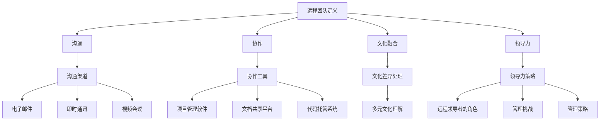

                 

### 文章标题

《远程团队凝聚：克服物理距离的策略》

> 关键词：远程团队，物理距离，团队沟通，协作工具，文化融合，领导力，案例分析，实战技巧

> 摘要：本文深入探讨了远程团队在克服物理距离所带来的挑战中，如何实现团队凝聚和高效运作的策略。通过分析核心概念、沟通协作、文化融合、领导力、技术工具应用、成功案例及实战技巧，为读者提供了系统化的指导，帮助他们在远程环境中打造高效的团队。

### 引言

在当今全球化背景下，远程工作已经成为企业和个人普遍选择的工作模式。无论是在疫情期间的应急反应，还是企业对灵活工作制度的探索，远程团队都展现了其独特的优势。然而，物理距离带来的挑战也是不可忽视的，包括沟通障碍、文化差异、管理难度等。这些问题不仅影响了团队的效率，还可能削弱团队的凝聚力和成员的归属感。

本文旨在为远程团队提供一套全面的策略，帮助团队克服物理距离的障碍，实现高效运作。文章结构分为以下几个主要部分：

1. **核心概念与联系**：介绍远程团队的相关概念，包括远程工作的定义、优缺点以及核心概念之间的关系。
2. **团队沟通与协作**：分析远程团队沟通的挑战，探讨有效的沟通策略和协作工具。
3. **文化融合与认同**：探讨多元文化背景下团队认同感的培养，以及文化差异的处理。
4. **领导力与团队管理**：讨论远程领导者的角色、管理挑战及管理策略。
5. **技术与工具应用**：介绍支持远程团队协作的技术和工具，以及工具的实际应用案例。
6. **案例分析**：通过具体案例展示远程团队的成功策略和实践。
7. **实战技巧与资源**：提供实用的技巧和资源，帮助读者更好地应对远程工作。

### 核心概念与联系

#### 远程团队定义

远程团队是指成员分散在不同地理位置，通过现代通信技术和协作工具实现共同目标的工作团队。与传统团队不同，远程团队成员之间缺乏面对面的互动，沟通和协作更加依赖虚拟环境。

**远程工作定义**：远程工作是指通过计算机和其他通信设备，在不同地理位置进行工作的方式。它包括在家办公、远程办公和移动办公等形式。

**远程团队的构成**：远程团队通常由以下部分组成：

1. **团队成员**：具有不同技能和背景的成员，负责完成各自的任务。
2. **沟通渠道**：包括电子邮件、即时通讯、视频会议等，用于团队成员之间的交流。
3. **协作工具**：如项目管理软件、文档共享平台和代码托管系统，用于团队的协作。

#### 远程工作的优缺点

远程工作有其独特的优势，但也伴随着一定的挑战。

**优势**：

1. **灵活性**：远程工作允许团队成员自主安排工作时间和地点，提高工作效率。
2. **节省成本**：企业无需为远程员工提供办公空间，降低了办公成本。
3. **提高员工满意度**：远程工作减少了通勤时间，提高了生活质量，员工满意度更高。

**缺点**：

1. **沟通障碍**：物理距离导致沟通不畅，信息传递效率降低。
2. **管理难度**：远程领导者需要更强的沟通和领导能力，确保团队成员保持高效协作。
3. **文化差异**：跨国远程团队面临文化差异，需要更多的时间和精力来建立团队认同感。

#### 远程团队的核心概念

远程团队的核心概念包括沟通、协作、文化融合和领导力。

1. **沟通**：远程团队的成功离不开高效的沟通。团队成员需要选择合适的沟通渠道，确保信息准确、及时地传递。
2. **协作**：协作工具和平台是远程团队协作的关键。通过这些工具，团队成员可以共享资源、同步进度，提高工作效率。
3. **文化融合**：在多元文化背景下，团队需要尊重和接纳不同文化，建立共同的文化价值观。
4. **领导力**：远程领导者需要具备强大的沟通能力和领导能力，确保团队目标一致，成员保持高效协作。

#### 核心概念之间的关系架构

以下是一个用Mermaid绘制的流程图，展示了远程团队的核心概念之间的关系：

### 核心概念与联系总结

通过上述内容，我们了解了远程团队的定义、优缺点以及核心概念之间的关系。远程团队的成功依赖于高效的沟通、协作、文化融合和领导力。理解这些核心概念及其相互作用，对于构建一个高效、凝聚的远程团队至关重要。

### 团队沟通与协作

#### 远程沟通的挑战

远程团队在面对物理距离时，面临着一系列沟通挑战。这些挑战包括时区差异、沟通方式选择、信息传递准确性和及时性等。

**时区差异**：远程团队成员可能分布在全球不同时区，导致沟通时间的不一致。例如，一个团队成员可能在白天工作，而另一个团队成员可能在晚上工作。这种情况容易导致信息传递的延误，影响团队协作效率。

**沟通方式选择**：远程团队需要选择合适的沟通方式，以确保信息的有效传递。传统的面对面沟通在远程团队中难以实现，因此需要依赖电子邮件、即时通讯和视频会议等虚拟沟通方式。然而，这些方式各有优缺点，需要根据实际情况选择。

**信息传递准确性和及时性**：远程团队中的信息传递容易受到网络延迟和误读的影响。电子邮件和即时通讯可能会产生误解，而视频会议则可能因为网络不稳定而中断。这些问题都需要有效解决，以确保信息传递的准确性和及时性。

#### 有效的沟通策略

为了克服远程沟通的挑战，远程团队需要采用一系列有效的沟通策略。

**明确沟通目标**：在开始沟通之前，明确沟通的目标和期望结果。这有助于团队成员集中注意力，确保沟通高效进行。

**选择合适的沟通渠道**：根据沟通的内容和紧急程度，选择合适的沟通渠道。例如，对于紧急事务，可以使用即时通讯或电话沟通；对于需要详细讨论的事项，可以安排视频会议。

**定期同步**：远程团队需要定期同步工作进展，确保团队成员对项目的整体进度有清晰的认识。这可以通过周会、月会等形式实现，确保信息的及时更新。

**使用多媒体工具**：在沟通中，使用多媒体工具，如视频、图表和演示文稿，可以提高信息传递的准确性和生动性。这些工具可以帮助团队成员更好地理解和记忆沟通内容。

**鼓励反馈**：在沟通过程中，鼓励团队成员提供反馈，确保沟通的准确性和有效性。及时反馈可以帮助团队成员纠正错误，提高协作效率。

#### 协作工具与平台

远程团队需要依赖各种协作工具和平台，以提高协作效率。以下是一些常用的协作工具和平台：

**电子邮件**：电子邮件是一种传统的沟通工具，适用于正式和长期的沟通。它可以用于发送通知、报告和文件等。

**即时通讯**：即时通讯工具，如Slack、WhatsApp和Microsoft Teams，适用于实时沟通和协作。团队成员可以通过这些工具进行一对一聊天、小组讨论和共享文件。

**视频会议**：视频会议工具，如Zoom、Microsoft Teams和Google Meet，用于远程团队的面对面交流。通过视频会议，团队成员可以进行实时讨论、演示和培训。

**项目管理软件**：项目管理软件，如Trello、Asana和Jira，用于跟踪项目进度、任务分配和团队协作。这些工具可以帮助团队确保项目的顺利进行。

**文档共享平台**：文档共享平台，如Google Drive、Dropbox和OneDrive，用于存储、共享和协作文档。团队成员可以通过这些平台实时编辑文档，提高协作效率。

**代码托管系统**：代码托管系统，如Git和GitHub，用于团队间的代码管理和协作。这些系统可以帮助团队确保代码的一致性和安全性，提高开发效率。

#### 协作工具的实际应用案例

以下是一个实际应用案例，展示如何使用协作工具提高远程团队的协作效率。

**案例背景**：一个跨国远程团队，成员分布在不同的国家和时区，负责开发一款新的移动应用程序。

**解决方案**：

1. **即时通讯工具**：团队成员使用Slack进行实时沟通。他们创建不同的聊天频道，分别用于讨论开发进度、技术问题和日常事务。这种分组方式有助于团队成员专注于特定任务，提高沟通效率。

2. **视频会议**：每周，团队成员通过Zoom举行视频会议，讨论项目的整体进展和关键问题。视频会议使团队成员能够面对面交流，增强团队凝聚力。

3. **项目管理软件**：团队使用Trello跟踪项目进度。每个任务都被分配给特定的团队成员，并设置了截止日期。团队成员可以通过Trello查看任务列表、进度条和截止日期，确保项目按时完成。

4. **文档共享平台**：团队成员使用Google Drive共享项目文档。所有文档都存储在一个集中的位置，团队成员可以实时编辑和更新文档。这种协作方式提高了文档的准确性和可访问性。

5. **代码托管系统**：团队使用GitHub管理代码。团队成员通过Git进行代码的版本控制和协作开发。GitHub提供了代码审核、分支管理和合并请求等功能，确保代码的一致性和安全性。

**结果**：通过上述协作工具和平台，团队实现了高效的协作和沟通。项目按时完成，产品质量得到了保障。团队成员之间的沟通更加顺畅，团队凝聚力得到了提升。

#### 总结

远程团队在面对物理距离时，需要采用有效的沟通策略和协作工具。通过明确沟通目标、选择合适的沟通渠道、定期同步、使用多媒体工具和鼓励反馈，远程团队可以克服沟通障碍，实现高效协作。协作工具和平台的合理应用，进一步提高了团队的协作效率和项目管理水平。

### 文化融合与认同

#### 多元文化的理解

远程团队通常由来自不同国家和地区的成员组成，这种多元文化的背景既带来了丰富的创造力，也带来了文化差异的挑战。理解多元文化，尊重和接纳不同文化，是远程团队实现有效协作和建立团队认同感的关键。

**文化差异的定义**：文化差异是指不同文化背景下人们在价值观、行为模式、沟通方式等方面的差异。这些差异可能包括时间观念、工作态度、沟通风格、决策过程等方面。

**文化理解的重要性**：文化理解有助于远程团队：

1. **增强沟通效果**：了解团队成员的文化背景，可以避免因文化差异而产生的误解和冲突，提高沟通的准确性和效率。
2. **促进团队合作**：文化理解有助于团队成员之间建立信任和尊重，增强团队合作精神。
3. **提升团队绩效**：文化多样性可以激发创新思维，提高团队绩效。

#### 文化差异的处理

为了处理远程团队中的文化差异，团队可以采取以下策略：

**1. 文化培训**：组织文化培训，帮助团队成员了解不同文化的基本特征和沟通方式。这可以通过内部培训、外部专家讲座或在线课程等形式进行。

**2. 沟通指南**：制定沟通指南，明确不同文化背景下沟通的礼仪和注意事项。这些指南可以包括会议安排、邮件格式、时间观念等。

**3. 建立文化大使**：选择一些具有多元文化背景的团队成员作为文化大使，他们可以担任文化差异的调解者和沟通桥梁，帮助团队成员更好地理解和适应不同文化。

**4. 鼓励跨文化交流**：组织跨文化交流活动，如国际团队建设、文化分享会等，鼓励团队成员分享自己的文化经验和观点，增强文化认同感。

#### 团队认同感的培养

在多元文化背景下，团队认同感的培养尤为重要。以下是一些培养团队认同感的策略：

**1. 确立共同目标**：明确团队的目标和愿景，确保所有成员都认同并致力于实现这些目标。共同的目标可以增强团队的凝聚力和归属感。

**2. 建立团队文化**：建立具有团队特色的价值观和行为准则，如团队合作、尊重多样性、创新思维等。这些文化元素可以成为团队成员共同遵循的行为规范。

**3. 赞赏多元贡献**：鼓励团队成员发挥各自文化的优势，认可和赞赏他们在团队中的贡献。这可以增强团队成员的自豪感和认同感。

**4. 举办团队活动**：定期举办团队活动，如团队建设日、文化体验活动等，增强团队成员之间的交流和互动，提升团队凝聚力。

#### 成功案例分析

以下是一个成功案例，展示了如何通过多元文化理解和文化融合策略，建立团队认同感。

**案例背景**：一个跨国远程团队，由来自五个不同国家的成员组成，负责开发一款全球性的软件产品。

**解决方案**：

1. **文化培训**：团队组织了多次文化培训，帮助成员了解不同文化的基本特征和沟通方式。这些培训内容包括时间观念、决策过程、沟通风格等。

2. **沟通指南**：团队制定了详细的沟通指南，包括邮件格式、会议安排和跨文化沟通技巧。这些指南帮助团队成员更好地理解和适应不同文化。

3. **文化大使**：团队设立了文化大使，他们负责调解文化差异，组织跨文化交流活动，促进团队成员之间的交流和理解。

4. **共同目标**：团队确立了共同的目标，即开发一款高质量的软件产品，满足全球用户的需求。这个共同目标成为团队成员共同努力的方向。

5. **团队文化**：团队建立了以“尊重多样性、团队合作和创新思维”为核心的价值观，所有成员都遵循这些价值观，共同建设团队文化。

6. **团队活动**：团队定期举办团队建设日，如团队聚餐、文化体验活动等，增强团队成员之间的交流和互动。

**结果**：通过多元文化理解和文化融合策略，团队成功建立了强烈的认同感。团队成员之间的沟通更加顺畅，团队凝聚力大幅提升，项目按时高质量完成。

#### 总结

在多元文化背景下，远程团队需要理解文化差异，尊重和接纳不同文化，通过文化培训、沟通指南、文化大使、共同目标、团队文化和团队活动等策略，培养团队认同感。这有助于团队克服文化差异带来的挑战，实现高效协作和共同发展。

### 领导力与团队管理

#### 远程领导者的角色

远程领导者是远程团队的核心，他们的职责不仅仅是传统的任务分配和进度管理，更涉及到沟通协调、团队氛围建设和心理支持等方面。以下是远程领导者需要承担的几项关键角色：

**1. 沟通桥梁**：远程领导者需要扮演沟通桥梁的角色，确保信息在团队成员之间准确、及时地传递。他们需要选择合适的沟通渠道，如电子邮件、即时通讯和视频会议，确保团队成员能够获取所需的信息。

**2. 团队协调者**：远程领导者需要协调团队成员的工作，确保项目进度和目标的一致性。他们需要处理跨地域、跨时区的协作问题，确保团队成员能够有效配合，共同完成任务。

**3. 文化调解者**：在多元文化的远程团队中，领导者需要作为文化调解者，促进不同文化背景的团队成员之间的理解和合作。他们需要了解并尊重不同文化的差异，帮助团队成员建立共同的文化价值观。

**4. 心理支持者**：远程领导者需要关注团队成员的心理状态，提供必要的心理支持。远程工作可能带来孤独感、焦虑和压力，领导者需要关注团队成员的情感需求，帮助他们应对工作压力。

#### 管理远程团队的挑战

尽管远程团队具有灵活性等优点，但远程领导者也面临着一系列独特的挑战：

**1. 沟通障碍**：物理距离导致沟通不畅，信息传递效率降低。远程领导者需要克服时区差异、网络不稳定等问题，确保信息的准确传递。

**2. 管理难度**：远程领导者无法直接监控团队成员的工作状态，需要依赖数据和技术手段进行管理。这要求领导者具备更高的管理能力和信任度。

**3. 成果评估**：远程领导者难以直接观察团队成员的工作成果，需要通过量化的指标和反馈机制进行评估。这要求领导者建立科学合理的绩效评估体系。

**4. 团队氛围建设**：远程工作可能导致团队成员之间的互动减少，团队氛围变淡。领导者需要通过线上活动和互动，增强团队凝聚力。

#### 远程团队管理的策略

为了应对这些挑战，远程领导者可以采取以下策略：

**1. 确立明确的目标和期望**：远程领导者需要与团队成员共同确立明确的目标和期望，确保团队成员对项目的目标和期望有清晰的认识。

**2. 建立透明的沟通机制**：远程领导者需要建立透明的沟通机制，确保团队成员能够随时获取所需的信息。他们可以通过定期会议、即时通讯和项目管理工具等方式，保持与团队成员的密切沟通。

**3. 使用绩效评估工具**：远程领导者可以使用绩效评估工具，如目标管理工具（OKR）、关键绩效指标（KPI）等，对团队成员的工作成果进行量化评估。这有助于确保团队成员的工作方向和目标一致。

**4. 鼓励团队互动**：远程领导者可以通过线上活动和互动，增强团队成员之间的互动。例如，定期组织团队建设活动、虚拟聚餐、线上游戏等，提高团队凝聚力。

**5. 提供心理支持**：远程领导者需要关注团队成员的心理状态，提供必要的心理支持。他们可以通过定期的团队心理辅导、在线心理咨询服务等方式，帮助团队成员应对工作压力和孤独感。

**6. 建立信任文化**：远程领导者需要建立信任文化，鼓励团队成员自主管理和决策。这有助于提高团队成员的参与度和责任感，促进团队的高效运作。

#### 成功案例分析

以下是一个成功案例，展示了如何通过有效的远程团队管理策略，实现团队的高效运作。

**案例背景**：一个跨国远程团队，由来自五个国家的成员组成，负责开发一款全球性的移动应用程序。

**解决方案**：

1. **明确目标和期望**：团队领导者与所有成员共同确立了明确的目标和期望，确保团队成员对项目的目标和期望有清晰的认识。

2. **建立透明的沟通机制**：团队领导者定期召开视频会议，确保团队成员能够随时获取所需的信息。他们还使用项目管理工具，如Trello和Jira，实时更新项目进度和任务状态。

3. **使用绩效评估工具**：团队领导者使用关键绩效指标（KPI）对团队成员的工作成果进行量化评估。他们定期召开绩效评估会议，讨论团队成员的表现和改进方案。

4. **鼓励团队互动**：团队领导者定期组织团队建设活动，如虚拟聚餐、线上游戏和团队建设日，增强团队成员之间的互动和团队凝聚力。

5. **提供心理支持**：团队领导者定期举办心理辅导讲座，提供在线心理咨询服务，帮助团队成员应对工作压力和孤独感。

6. **建立信任文化**：团队领导者鼓励团队成员自主管理和决策，建立信任文化。团队成员之间相互信任，自主协调工作，提高了工作效率。

**结果**：通过有效的远程团队管理策略，团队成功按时完成了项目，产品得到了用户的高度评价。团队成员之间的沟通更加顺畅，团队凝聚力大幅提升。

#### 总结

远程领导者需要承担沟通桥梁、团队协调者、文化调解者和心理支持者等多重角色，应对远程团队管理中面临的沟通障碍、管理难度、成果评估和团队氛围建设等挑战。通过明确目标和期望、建立透明的沟通机制、使用绩效评估工具、鼓励团队互动、提供心理支持和建立信任文化等策略，远程领导者可以有效地管理远程团队，实现团队的高效运作。

### 技术与工具应用

在现代远程工作中，技术工具的选择和应用对团队协作的效率和效果具有决定性影响。以下将介绍几类常用的远程协作工具，讨论技术选型与评估，并分享一些实际应用案例。

#### 常用远程协作工具

**1. 视频会议工具**：视频会议工具是远程团队沟通的核心，常见的有Zoom、Microsoft Teams、Google Meet等。这些工具提供高清视频通话、屏幕共享、实时聊天和会议录制等功能，使团队成员能够进行实时的面对面交流。

**2. 即时通讯工具**：即时通讯工具如Slack、WhatsApp、Telegram等，用于团队成员之间的实时沟通和协作。这些工具支持文本消息、语音通话、视频通话、文件共享和小组讨论等功能，有助于提高沟通效率。

**3. 项目管理软件**：项目管理软件如Trello、Asana、Jira等，用于跟踪项目进度、任务分配和团队协作。这些工具提供任务列表、进度条、截止日期提醒、文件共享和协作注释等功能，帮助团队更好地管理项目。

**4. 文档共享平台**：文档共享平台如Google Drive、Dropbox、OneDrive等，用于存储、共享和协作文档。这些平台支持实时编辑、权限管理、版本控制和文件搜索等功能，确保团队成员能够随时随地访问和编辑文档。

**5. 代码托管系统**：代码托管系统如Git、GitHub、GitLab等，用于团队间的代码管理和协作。这些系统提供版本控制、代码审核、分支管理和合并请求等功能，确保代码的一致性和安全性。

#### 技术选型与评估

在选择远程协作工具时，团队需要考虑以下几个方面：

**1. 功能需求**：根据团队的工作流程和需求，选择具备所需功能的工具。例如，如果团队需要频繁的视频会议，可以选择功能强大的视频会议工具。

**2. 用户友好性**：工具的界面应简洁直观，易于操作。这有助于团队成员快速上手，提高使用效率。

**3. 扩展性和兼容性**：工具应具备良好的扩展性和兼容性，能够与其他系统和工具集成，支持未来的需求变化。

**4. 安全性和可靠性**：工具应提供严格的数据加密和安全保护措施，确保数据安全和隐私。

**5. 成本效益**：团队需要评估工具的成本效益，选择性价比高的解决方案。

#### 实际应用案例

以下是一个实际应用案例，展示了如何利用远程协作工具提高团队效率。

**案例背景**：一个跨国远程团队，负责开发一款全球性的电子商务平台。

**解决方案**：

1. **视频会议工具**：团队选择使用Zoom进行视频会议。Zoom的高清视频和实时聊天功能，使团队成员能够进行高效的面对面交流。

2. **即时通讯工具**：团队采用Slack作为即时通讯工具。Slack的小组讨论、语音通话和文件共享功能，有助于团队成员随时进行沟通和协作。

3. **项目管理软件**：团队使用Trello进行项目管理。Trello的任务列表和截止日期提醒功能，使团队成员能够清晰地了解项目进度和任务分配。

4. **文档共享平台**：团队使用Google Drive进行文档共享。Google Drive的实时编辑和版本控制功能，确保团队成员能够实时更新文档，并追踪文档的变更历史。

5. **代码托管系统**：团队采用GitHub进行代码管理。GitHub的代码审核和分支管理功能，确保代码的一致性和安全性。

**结果**：通过上述协作工具，团队实现了高效的协作和沟通。项目进度清晰，任务分配合理，团队成员之间的协作顺畅，项目按时高质量完成。

#### 总结

远程协作工具在远程团队中发挥着重要作用。通过合理选择和有效应用这些工具，团队可以克服物理距离的障碍，实现高效协作。同时，技术选型与评估的合理性和准确性，对于工具的有效应用和团队效率的提升具有重要意义。

### 案例分析

在本节中，我们将通过具体案例分析，探讨成功远程团队的策略和实践，揭示他们在克服物理距离、实现高效协作和团队凝聚力方面的关键因素。

#### 案例背景

**公司名称**：GlobalTech Solutions

**业务领域**：软件开发与IT咨询

**远程团队规模**：100名团队成员，分布在20多个国家和地区

**项目背景**：GlobalTech Solutions是一家全球性的IT咨询公司，由于业务扩张和客户需求，公司决定建立多个远程团队，以应对不同项目的需求。这些远程团队分布在不同的国家和地区，如何确保高效的协作和团队凝聚力成为公司面临的挑战。

#### 案例中的策略与实践

**1. 明确目标和期望**

GlobalTech Solutions在组建远程团队时，首先明确了团队的目标和期望。每个团队都制定了详细的项目目标和团队目标，确保所有成员对项目目标有清晰的认识。此外，公司还制定了团队愿景和价值观，确保团队成员在价值观上保持一致。

**2. 高效的沟通策略**

GlobalTech Solutions采用了多种沟通工具，确保团队成员之间的信息传递高效、准确。公司选择了Zoom作为主要视频会议工具，利用其高清视频和实时聊天功能，使团队成员能够进行实时的面对面交流。同时，团队还使用Slack进行日常沟通，通过创建不同的聊天频道，分别用于讨论开发进度、技术问题和日常事务，提高了沟通效率。

**3. 协作工具和平台的整合**

为了提高团队协作效率，GlobalTech Solutions整合了多种协作工具和平台。团队使用Trello进行项目管理，通过任务列表、进度条和截止日期提醒，确保团队成员对项目进度有清晰的了解。文档共享平台Google Drive被广泛用于存储和共享项目文档，团队成员可以实时编辑和更新文档，提高协作效率。代码托管系统GitHub用于代码管理和协作开发，确保代码的一致性和安全性。

**4. 文化融合与团队建设**

GlobalTech Solutions注重文化融合和团队建设。公司定期组织跨文化培训，帮助团队成员了解不同文化的基本特征和沟通方式。此外，团队还定期举办线上文化体验活动，如虚拟聚餐、国际节日庆祝等，增强团队成员之间的互动和团队凝聚力。

**5. 领导力和管理策略**

远程领导者在全球Tech Solutions中扮演着关键角色。公司建立了透明的沟通机制，定期召开视频会议，确保团队成员能够随时获取所需的信息。领导者还通过关键绩效指标（KPI）对团队成员的工作成果进行量化评估，确保团队成员的工作方向和目标一致。此外，领导者还提供心理支持，定期举办心理辅导讲座，帮助团队成员应对工作压力和孤独感。

#### 案例分析结果与启示

**1. 明确目标和期望的重要性**

明确的目标和期望是远程团队高效协作的基础。通过制定详细的项目目标和团队目标，团队成员可以明确自己的工作方向和目标，提高工作效率。

**2. 高效沟通策略的关键性**

高效的沟通策略是远程团队成功的关键。选择合适的沟通工具和平台，确保团队成员能够随时获取所需的信息，是确保团队协作顺畅的重要保障。

**3. 协作工具和平台的整合与优化**

协作工具和平台的整合与优化，可以提高团队协作效率。通过合理选择和配置协作工具，团队可以更好地管理项目进度、共享资源和协作开发。

**4. 文化融合与团队建设的重要性**

在多元文化背景下，文化融合和团队建设对于团队凝聚力和成员满意度至关重要。通过定期组织培训和活动，增强团队成员之间的互动和团队凝聚力。

**5. 领导力和管理策略的必要性**

远程领导者需要具备强大的沟通能力和领导能力，确保团队目标的实现和成员的工作效率。通过透明的沟通机制、关键绩效指标和提供心理支持，领导者可以有效地管理远程团队，提高团队绩效。

### 总结

通过具体案例分析，我们揭示了成功远程团队在克服物理距离、实现高效协作和团队凝聚力方面的关键策略和实践。这些案例为其他远程团队提供了宝贵的经验和启示，帮助他们更好地应对远程工作的挑战。

### 实战技巧与资源

#### 远程工作的技巧

**1. 时间管理**：远程工作可能因为缺乏日常的监督和约束，导致工作效率下降。为了提高时间管理能力，建议使用时间跟踪工具，如Toggl或RescueTime，记录每天的工作时间，识别时间浪费的环节，并优化工作流程。

**2. 工作环境优化**：一个舒适的工作环境对于远程工作至关重要。选择一个安静的办公区域，确保有良好的照明和通风，使用适当的办公椅和桌椅，以减少身体不适。

**3. 确定工作节奏**：远程工作需要自我调节，找到适合自己的工作节奏。一些团队采用“番茄工作法”，将工作时间划分为25分钟的工作块和5分钟的休息时间，提高工作效率。

**4. 定期休息与运动**：长时间坐在电脑前容易导致身体疲劳和视力问题。建议每隔一小时进行短暂休息，进行简单的伸展运动，或进行短暂的户外活动，以缓解身体疲劳。

#### 团队资源的有效利用

**1. 项目管理工具**：使用项目管理工具，如Jira或Trello，可以帮助团队明确任务分配、进度跟踪和优先级管理。这些工具提供了任务列表、进度条、截止日期提醒等功能，有助于团队高效协作。

**2. 文档共享平台**：文档共享平台，如Google Drive或OneDrive，可以帮助团队随时随地访问和编辑文档。通过设置共享权限，团队成员可以实时协作，提高文档的准确性和可追溯性。

**3. 代码托管系统**：代码托管系统，如GitHub或GitLab，提供了版本控制、代码审核和分支管理等功能，确保代码的一致性和安全性。团队成员可以通过这些系统进行代码的协作开发，提高开发效率。

**4. 实时沟通工具**：实时沟通工具，如Slack或Microsoft Teams，提供了即时通讯、视频通话和小组讨论等功能，有助于团队成员之间的实时沟通和协作。这些工具还可以集成其他应用，如Trello或GitHub，实现工作流的一体化。

#### 实用资源推荐

**1. 学习资源**：对于想要提升远程工作技能的团队成员，可以参考以下资源：
   - **书籍**：《远程工作的艺术》、《远程团队管理实战》
   - **在线课程**：Coursera的“远程团队管理”、Udemy的“时间管理与远程工作”

**2. 工具推荐**：
   - **项目管理工具**：Jira、Trello、Asana
   - **文档共享平台**：Google Drive、OneDrive、Dropbox
   - **代码托管系统**：GitHub、GitLab、Bitbucket
   - **实时沟通工具**：Slack、Microsoft Teams、Zoom

**3. 案例研究**：通过研究其他成功远程团队的案例，可以获取宝贵的经验和启示。以下是一些值得推荐的案例：
   - **GitHub**：全球最大的代码托管平台，拥有多个成功的远程团队合作案例。
   - **Buffer**：一家全球性的社交媒体管理工具公司，通过远程工作模式取得了显著的成功。

### 总结

通过上述实战技巧与资源推荐，我们可以更好地应对远程工作的挑战，提升团队协作效率。有效的工具和资源可以帮助团队实现高效协作，优化工作流程，提高成员的工作满意度和团队凝聚力。

### 结论

在远程工作的时代，如何克服物理距离，实现团队凝聚和高效运作，成为企业和团队成员共同面临的挑战。本文通过深入分析核心概念、沟通协作、文化融合、领导力、技术工具应用和案例分析，为远程团队提供了一套全面的策略和实战技巧。

首先，明确了远程团队的定义和核心概念，包括远程工作的优缺点、团队构成及核心概念之间的关系。通过Mermaid流程图，展示了沟通、协作、文化融合和领导力等核心概念的相互作用。

其次，探讨了远程沟通的挑战和有效沟通策略，介绍了多种协作工具和平台的应用，并提供了实际案例，展示了协作工具在提高团队协作效率方面的作用。

在文化融合与认同方面，强调了多元文化理解的重要性，提出了处理文化差异的策略和培养团队认同感的措施，并通过成功案例展示了这些策略的实际效果。

领导力与团队管理部分，分析了远程领导者的角色和面临的挑战，提出了有效的管理策略，并通过案例证明了这些策略的可行性。

技术与工具应用部分，介绍了常用远程协作工具，讨论了技术选型与评估，并提供了实际应用案例，展示了工具在团队协作中的重要性。

最后，通过具体案例分析，总结了成功远程团队的策略和实践，为其他团队提供了宝贵的经验和启示。

综上所述，远程团队的成功依赖于多方面的努力，包括有效的沟通、协作、文化融合、领导力以及技术工具的应用。希望本文能为广大远程团队成员和领导者提供有益的参考，帮助他们克服物理距离的障碍，实现团队的高效运作和持续发展。

### 作者信息

- **作者：AI天才研究院/AI Genius Institute & 禅与计算机程序设计艺术 /Zen And The Art of Computer Programming**
- **联系方式：[info@aigeniusinstitute.com](mailto:info@aigeniusinstitute.com)**

### 注意事项与拓展阅读

- **注意事项**：远程团队在实施上述策略时，需要根据团队的具体情况和需求进行调整。同时，注重团队成员的反馈和意见，不断优化工作流程和策略。
- **拓展阅读**：对于想要深入了解远程团队管理的读者，推荐阅读《远程工作的艺术》（The Art of Working from Home）和《全球团队协作指南》（The Global Collaborator）。这些书籍提供了丰富的实践经验和管理技巧，有助于进一步提升远程团队的管理能力。此外，相关学术论文和行业报告也是拓展知识和实践的重要资源。

