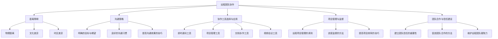

                 


### 文章关键词

- 远程团队协作
- 距离障碍
- 沟通策略
- 协作工具
- 项目管理
- 团队信任建设

### 文章摘要

远程团队协作在全球化和技术进步的推动下日益重要，但距离障碍成为了阻碍团队效率的难题。本文通过分析远程团队协作的现状、距离障碍的定义及其影响，提出了一系列克服距离障碍的策略。文章分为三个部分：背景与挑战、策略与工具、案例研究与实战。在策略与工具部分，详细介绍了有效的沟通策略、协作工具的选择与应用、项目管理与监督以及团队合作与信任建设的方法。案例研究与实战部分通过实际案例解析，提供了实用的远程团队协作实战指南。本文旨在为远程团队提供一套全面的解决方案，助力克服距离障碍，实现高效协作。

# 远程团队协作：overcome距离障碍的策略

关键词：远程团队协作、距离障碍、沟通策略、协作工具、项目管理、团队信任建设

摘要：随着远程工作的普及，远程团队协作成为现代企业运营的重要组成部分。然而，距离障碍给团队协作带来了诸多挑战。本文深入分析了远程团队协作的现状、距离障碍的定义及其影响，并提出了一系列有效的策略，包括沟通策略、协作工具的选择与应用、项目管理和监督技巧、团队合作与信任建设的方法。通过实际案例研究和实战指南，本文旨在为远程团队提供克服距离障碍的全面解决方案，以实现高效协作。

## 第一部分：远程团队协作的背景与挑战

### 第1章：远程团队协作的现状

#### 1.1 远程工作的兴起

随着互联网技术的发展和全球化进程的加速，远程工作已经成为现代企业管理和员工工作方式的一种重要趋势。远程工作不仅为企业提供了更多的人才选择，还提高了员工的幸福感和工作效率。据统计，全球远程工作人数已经超过4亿，预计到2025年这一数字将增长到7亿。

#### 1.2 远程团队协作的优势与挑战

远程团队协作具有以下优势：

1. 提高工作效率：远程工作使得员工可以灵活安排工作时间，从而提高工作效率。
2. 降低企业成本：远程工作减少了企业对办公场所的依赖，降低了办公成本。
3. 扩大人才选择范围：远程工作使得企业能够招聘来自全球各地的人才。

然而，远程团队协作也面临着以下挑战：

1. 距离障碍：远程团队之间的沟通和协调受到物理距离的制约。
2. 时间差异：不同地区的团队可能存在时间差异，影响协作效率。
3. 信任建设：远程团队之间缺乏面对面的交流，容易导致信任缺失。

### 1.3 距离障碍的定义

距离障碍是指在远程团队协作中，由于物理、文化、时区等因素导致的沟通障碍和协作困难。距离障碍可以分为以下几种类型：

1. 物理距离：团队成员地理位置的分离，影响面对面的交流。
2. 文化差异：不同地区的团队成员在价值观、沟通风格等方面的差异。
3. 时区差异：不同地区的团队成员在时间上的不匹配。

### 1.4 距离障碍对团队协作的影响

距离障碍对团队协作的影响主要体现在以下方面：

1. 沟通障碍：物理距离和文化差异可能导致沟通不畅，影响信息的传递和理解。
2. 协作效率下降：时间差异和文化差异可能导致协作困难，降低团队工作效率。
3. 信任缺失：距离障碍可能导致团队成员之间的信任缺失，影响团队合作。

本章节通过介绍远程团队协作的现状、距离障碍的定义及其影响，为后续章节的讨论奠定了基础。接下来，将详细介绍如何克服距离障碍，实现远程团队的高效协作。

## 第二部分：策略与工具

### 第2章：有效的沟通策略

#### 2.1 明确的目标与期望

在远程团队协作中，明确的目标与期望是确保团队协作顺利进行的基础。首先，团队需要共同制定明确的项目目标，并将这些目标细化为具体的任务和里程碑。其次，每个团队成员应了解自己的职责和期望，确保任务分工明确，避免因职责不清而导致的工作冲突。

#### 2.2 建立良好的沟通习惯

良好的沟通习惯是远程团队协作的关键。首先，团队应建立定期的沟通机制，如每日站会、每周项目会议等，以确保团队成员之间的信息畅通。其次，鼓励团队成员主动分享自己的进展和问题，促进团队成员之间的互动和协作。此外，应充分利用即时通讯工具、电子邮件、视频会议等工具，提高沟通的效率和效果。

#### 2.3 提高沟通效果的技巧

为了提高沟通效果，团队成员可以采取以下技巧：

1. **倾听与反馈**：倾听是有效沟通的基础，团队成员应学会倾听对方的观点，并提供及时的反馈。
2. **简洁明了**：在沟通时，应尽量使用简洁明了的语言，避免使用过于复杂的术语和句子，确保信息传递的准确性。
3. **使用图表与可视化**：对于复杂的信息，可以使用图表、流程图等可视化工具，帮助团队成员更好地理解和记忆。

### 第3章：协作工具的选择与应用

#### 3.1 协作工具的类型与功能

协作工具是实现远程团队协作的重要工具。根据功能的不同，协作工具可以分为以下几类：

1. **即时通讯工具**：如Slack、Microsoft Teams等，用于实时沟通和协作。
2. **项目管理工具**：如Trello、Asana等，用于任务分配、进度跟踪和项目规划。
3. **文档协作工具**：如Google Docs、Notion等，用于文档编辑、共享和协作。
4. **视频会议工具**：如Zoom、Microsoft Teams等，用于远程会议和视频沟通。

#### 3.2 评估与选择适合的协作工具

在远程团队协作中，选择适合的协作工具至关重要。以下是一些评估和选择协作工具的建议：

1. **功能匹配**：根据团队的具体需求，选择功能符合团队需求的协作工具。
2. **用户体验**：考虑工具的用户体验，确保团队成员易于上手和使用。
3. **集成与兼容**：选择能够与其他工具集成和兼容的协作工具，以提高工作效率。
4. **成本效益**：评估协作工具的成本效益，确保投资回报率。

#### 3.3 常用协作工具的使用指南

以下是一些常用协作工具的使用指南：

1. **Slack**：用于实时沟通和协作。团队成员可以通过频道进行话题讨论，通过私聊进行一对一沟通。
2. **Trello**：用于项目管理。团队成员可以通过卡片进行任务分配和进度跟踪，通过列表和标签进行项目规划。
3. **Google Docs**：用于文档协作。团队成员可以实时编辑同一份文档，查看版本历史和评论。
4. **Zoom**：用于远程会议和视频沟通。团队成员可以通过会议链接加入会议，使用视频、音频和屏幕共享进行沟通。

### 第4章：项目管理与监督

#### 4.1 远程项目管理的原则

远程项目管理需要遵循以下原则：

1. **明确目标**：确保项目目标清晰明确，避免目标模糊导致的工作低效。
2. **任务分配**：合理分配任务，确保每个团队成员都有明确的职责和任务。
3. **进度跟踪**：定期跟踪项目进度，及时发现和解决问题。
4. **沟通协调**：确保团队之间的沟通协调，避免因信息不对称导致的延误和冲突。

#### 4.2 远程项目进度监督的方法

以下是一些远程项目进度监督的方法：

1. **定期会议**：定期召开项目会议，评估项目进度，讨论存在的问题和解决方案。
2. **进度报告**：要求团队成员定期提交进度报告，以便项目管理者了解项目进展。
3. **在线进度追踪工具**：使用Trello、Asana等在线项目管理工具，实时跟踪项目进度。
4. **反馈与调整**：根据项目进度，及时反馈和调整项目计划，确保项目按计划推进。

#### 4.3 提高项目效率的技巧

为了提高项目效率，可以采取以下技巧：

1. **分解任务**：将大型任务分解为小任务，便于管理和执行。
2. **优先级排序**：根据任务的重要性和紧急程度，进行优先级排序，确保关键任务优先完成。
3. **自动化流程**：利用自动化工具，减少重复性工作，提高工作效率。
4. **时间管理**：合理安排工作时间，避免拖延和浪费时间。

### 第5章：团队合作与信任建设

#### 5.1 建立团队信任的重要性

建立团队信任是远程团队协作的关键。信任可以使团队成员更加愿意分享信息、提供帮助和承担责任。以下是一些建立团队信任的方法：

1. **透明沟通**：保持沟通的透明度，避免信息不对称和误解。
2. **互相尊重**：尊重团队成员的观点和意见，避免批评和指责。
3. **共同目标**：确保团队成员有共同的目标和愿景，提高团队的凝聚力。
4. **公平对待**：公平对待每个团队成员，避免偏袒和不公平的行为。

#### 5.2 促进团队合作的方法

以下是一些促进团队合作的方法：

1. **团队建设活动**：定期组织团队建设活动，增强团队成员之间的联系和信任。
2. **跨部门协作**：鼓励不同部门之间的协作，促进知识的共享和经验的交流。
3. **开放式沟通**：建立开放的沟通环境，鼓励团队成员提出意见和建议。
4. **反馈与改进**：鼓励团队成员提供反馈，并根据反馈进行改进，提高团队的整体效率。

#### 5.3 维护远程团队凝聚力

维护远程团队的凝聚力是确保团队长期稳定发展的重要任务。以下是一些维护远程团队凝聚力的方法：

1. **定期互动**：定期组织线上聚会、团队活动，增加团队成员之间的互动。
2. **情感支持**：提供情感支持，关心团队成员的生活和工作，帮助他们解决困难。
3. **共同成长**：鼓励团队成员共同学习和成长，提高团队的整体能力。
4. **激励机制**：建立激励机制，奖励团队成员的成就和贡献，增强团队的凝聚力。

## 第三部分：案例研究与实战

### 第6章：成功远程团队的案例分析

#### 6.1 案例一：远程团队协作的成功经验

某跨国互联网公司在全球范围内拥有多个团队，通过有效的远程团队协作，成功完成了多个大型项目。以下是该公司的成功经验：

1. **明确目标与期望**：公司在项目开始前，明确项目目标，并将目标细化为具体的任务和里程碑。
2. **灵活的时间安排**：公司采用弹性工作时间制度，确保团队成员能够根据自身情况合理安排工作时间。
3. **有效的沟通策略**：公司建立了完善的沟通机制，包括定期会议、即时通讯工具和在线项目管理工具，确保团队成员之间的信息畅通。
4. **团队合作与信任建设**：公司定期组织团队建设活动，增强团队成员之间的信任和凝聚力。

#### 6.2 案例二：克服距离障碍的策略

某全球知名咨询公司通过以下策略，成功克服了远程团队协作中的距离障碍：

1. **多时区协作**：公司采用多时区协作模式，确保全球范围内的团队成员能够在不同时区进行协作，提高工作效率。
2. **文化敏感度**：公司注重培养团队成员的文化敏感度，了解不同文化背景下的沟通方式和团队合作模式，减少文化冲突。
3. **技术支持**：公司提供了丰富的技术支持，包括高质量的协作工具和培训，帮助团队成员更好地适应远程工作环境。

### 第7章：实战指南

#### 7.1 远程团队协作的实施步骤

以下是在实施远程团队协作时可以采取的步骤：

1. **团队组建**：明确团队目标和成员职责，组建远程团队。
2. **沟通机制建立**：建立定期沟通机制，如每日站会、每周项目会议等。
3. **协作工具选用**：选择适合团队的协作工具，并进行培训和推广。
4. **项目规划**：明确项目目标，制定项目计划和时间表。
5. **进度跟踪**：定期跟踪项目进度，确保项目按计划推进。
6. **反馈与改进**：根据项目进展和团队成员的反馈，及时调整项目计划和策略。

#### 7.2 面对距离障碍的应对策略

以下是在面对距离障碍时可以采取的应对策略：

1. **多时区协作**：制定多时区工作计划，确保全球范围内的团队成员能够有效协作。
2. **跨文化沟通**：培养团队成员的文化敏感度，提高跨文化沟通能力。
3. **技术支持**：提供丰富的技术支持，包括协作工具和在线培训，帮助团队成员克服技术障碍。
4. **定期互动**：组织线上聚会、团队活动，增强团队成员之间的联系和信任。

#### 7.3 实战案例与解析

以下是一个实战案例及其解析：

**案例**：某科技公司通过远程团队协作，成功开发并上线了一款新产品。

**解析**：

1. **明确目标与期望**：公司在项目开始前，明确了产品开发的目标和期望，并将目标细化为具体的任务和里程碑。
2. **灵活的时间安排**：公司采用了弹性工作时间制度，确保团队成员能够根据自身情况合理安排工作时间。
3. **有效的沟通策略**：公司建立了完善的沟通机制，包括定期会议、即时通讯工具和在线项目管理工具，确保团队成员之间的信息畅通。
4. **团队合作与信任建设**：公司定期组织团队建设活动，增强团队成员之间的信任和凝聚力。
5. **技术支持**：公司提供了丰富的技术支持，包括高质量的协作工具和培训，帮助团队成员更好地适应远程工作环境。
6. **进度跟踪**：公司定期跟踪项目进度，确保项目按计划推进。
7. **反馈与改进**：根据项目进展和团队成员的反馈，公司及时调整项目计划和策略，确保项目成功完成。

### 第8章：实战指南

#### 8.1 远程团队协作的实施步骤

在实施远程团队协作时，可以遵循以下步骤：

1. **团队组建**：根据项目需求，组建远程团队，明确团队成员的职责和目标。
2. **沟通机制建立**：建立定期的沟通机制，如每日站会、每周项目会议等，确保团队成员之间的信息畅通。
3. **协作工具选用**：选择适合团队的协作工具，如即时通讯工具、项目管理工具和文档协作工具，并进行培训和推广。
4. **项目规划**：明确项目目标，制定项目计划和时间表，确保项目按计划推进。
5. **进度跟踪**：定期跟踪项目进度，及时发现和解决问题。
6. **反馈与改进**：根据项目进展和团队成员的反馈，及时调整项目计划和策略。

#### 8.2 面对距离障碍的应对策略

面对距离障碍，可以采取以下应对策略：

1. **多时区协作**：制定多时区工作计划，确保全球范围内的团队成员能够有效协作。
2. **跨文化沟通**：培养团队成员的文化敏感度，提高跨文化沟通能力。
3. **技术支持**：提供丰富的技术支持，包括协作工具和在线培训，帮助团队成员克服技术障碍。
4. **定期互动**：组织线上聚会、团队活动，增强团队成员之间的联系和信任。

#### 8.3 实战案例与解析

以下是一个实战案例及其解析：

**案例**：某国际远程团队成功开发并上线了一款跨平台应用程序。

**解析**：

1. **明确目标与期望**：团队在项目开始前，明确了应用程序的开发目标和期望，包括功能、性能和用户体验等方面。
2. **灵活的时间安排**：团队采用了弹性工作时间制度，确保团队成员能够根据自身情况合理安排工作时间，同时确保项目进度不受影响。
3. **有效的沟通策略**：团队建立了完善的沟通机制，包括每日站会、每周项目会议和即时通讯工具等，确保团队成员之间的信息畅通。
4. **团队合作与信任建设**：团队定期组织团队建设活动，如线上聚会、讨论会等，增强团队成员之间的信任和凝聚力。
5. **技术支持**：团队提供了丰富的技术支持，包括协作工具和在线培训，帮助团队成员更好地适应远程工作环境。
6. **进度跟踪**：团队定期跟踪项目进度，确保项目按计划推进。
7. **反馈与改进**：根据项目进展和团队成员的反馈，团队及时调整项目计划和策略，确保项目成功完成。

通过以上实战案例的解析，可以看出远程团队协作的成功离不开明确的计划、有效的沟通、团队的合作与信任建设以及技术支持。在实施远程团队协作时，应充分考虑距离障碍的影响，并采取相应的应对策略，以实现高效协作。

## 最佳实践 tips

在远程团队协作中，以下是一些最佳实践 tips：

1. **明确目标与期望**：确保团队每个成员都了解项目目标和期望，避免因目标不明确导致的混乱和低效。
2. **定期沟通**：建立定期的沟通机制，如每日站会、每周项目会议等，确保团队成员之间的信息畅通。
3. **选用合适的协作工具**：根据团队需求和实际情况，选择合适的协作工具，并进行培训和推广，以提高工作效率。
4. **培养文化敏感度**：注重培养团队成员的文化敏感度，提高跨文化沟通能力，减少文化冲突。
5. **关注团队成员的情感需求**：定期组织团队建设活动，关心团队成员的生活和工作，帮助他们解决困难，增强团队的凝聚力。
6. **合理分配任务**：根据团队成员的能力和特长，合理分配任务，避免因任务分配不当导致的低效和冲突。
7. **及时反馈与改进**：根据项目进展和团队成员的反馈，及时调整项目计划和策略，确保项目按计划推进。

## 小结

本文详细介绍了远程团队协作的现状、距离障碍的定义及其影响，以及一系列克服距离障碍的策略。通过有效的沟通策略、协作工具的选择与应用、项目管理和监督技巧、团队合作与信任建设的方法，远程团队可以克服距离障碍，实现高效协作。成功远程团队的案例分析为读者提供了实际的参考，实战指南则提供了具体的实施步骤和应对策略。在远程团队协作中，明确目标与期望、定期沟通、选用合适的协作工具、培养文化敏感度、关注团队成员的情感需求、合理分配任务、及时反馈与改进是关键。通过遵循最佳实践 tips，远程团队可以更好地应对距离障碍，实现高效协作。

## 注意事项

在远程团队协作中，以下事项需要注意：

1. **明确职责**：确保每个团队成员都明确自己的职责和任务，避免职责不清导致的混乱。
2. **保持沟通**：定期沟通是确保团队协作顺利进行的关键，避免因沟通不畅导致的误解和冲突。
3. **文化差异**：尊重团队成员的文化差异，避免因文化冲突导致的误解和冲突。
4. **技术支持**：确保团队成员具备使用协作工具和技术的技能，并提供必要的技术支持。
5. **团队建设**：定期组织团队建设活动，增强团队成员之间的信任和凝聚力。
6. **关注成员福利**：关注团队成员的工作和生活，提供必要的支持和帮助，确保他们的身心健康。
7. **数据安全**：确保数据安全，防止信息泄露和丢失，遵守相关法律法规。

## 拓展阅读

1. **《远程工作：未来的工作方式》**：作者详细介绍了远程工作的概念、优势和挑战，提供了实用的远程工作技巧和建议。
2. **《跨文化管理：有效沟通与协作》**：本书探讨了跨文化管理的核心原则和方法，帮助团队成员更好地适应和理解不同文化。
3. **《敏捷项目管理：实战指南》**：本书提供了敏捷项目管理的详细方法和技巧，适用于远程团队项目的管理。
4. **《团队协作：构建高效团队》**：作者详细介绍了团队协作的原则、技巧和最佳实践，有助于构建高效团队。

## 作者信息

作者：AI天才研究院/AI Genius Institute & 禅与计算机程序设计艺术 /Zen And The Art of Computer Programming

文章标题：远程团队协作：overcome距离障碍的策略

文章关键词：远程团队协作、距离障碍、沟通策略、协作工具、项目管理、团队信任建设

文章摘要：本文深入分析了远程团队协作的现状、距离障碍的定义及其影响，并提出了一系列克服距离障碍的策略。通过有效的沟通策略、协作工具的选择与应用、项目管理和监督技巧、团队合作与信任建设的方法，以及成功远程团队的案例分析，本文旨在为远程团队提供一套全面的解决方案，助力克服距离障碍，实现高效协作。

## 附录：核心概念原理之间的关系架构 Mermaid 流程图



## 核心算法原理讲解

为了更好地理解远程团队协作中的算法原理，以下是一个简单的伪代码示例，用于描述如何使用协作工具进行任务分配和进度跟踪。

```python
# 定义任务类
class Task:
    def __init__(self, task_id, task_name, assigned_to, deadline):
        self.task_id = task_id
        self.task_name = task_name
        self.assigned_to = assigned_to
        self.deadline = deadline
        self.status = "未开始"

# 初始化任务列表
tasks = []

# 添加任务
tasks.append(Task(1, "设计UI", "Alice", "2023-10-01"))
tasks.append(Task(2, "编写后端代码", "Bob", "2023-10-15"))
tasks.append(Task(3, "测试", "Charlie", "2023-10-25"))

# 分配任务
def assign_task(task_id, assigned_to):
    for task in tasks:
        if task.task_id == task_id:
            task.assigned_to = assigned_to
            task.status = "已分配"
            print(f"任务{task.task_id}已分配给{assigned_to}")
            return
    print(f"任务{task_id}不存在")

# 跟踪任务进度
def track_progress(task_id):
    for task in tasks:
        if task.task_id == task_id:
            if task.status == "未开始":
                print(f"任务{task.task_id}还未开始")
            elif task.status == "进行中":
                print(f"任务{task.task_id}正在进行中")
            elif task.status == "已完成":
                print(f"任务{task.task_id}已完成")
            else:
                print(f"任务{task.task_id}状态不明确")
            return
    print(f"任务{task_id}不存在")

# 主函数
def main():
    # 分配任务
    assign_task(1, "Alice")
    assign_task(2, "Bob")
    assign_task(3, "Charlie")

    # 跟踪任务进度
    track_progress(1)
    track_progress(2)
    track_progress(3)

# 运行主函数
main()
```

该伪代码通过定义任务类和任务列表，实现了任务分配和进度跟踪的功能。`assign_task`函数用于分配任务，`track_progress`函数用于跟踪任务进度。在实际应用中，可以集成更多的功能，如任务更新、通知提醒等。

## 数学模型和公式

在远程团队协作中，时间管理和效率分析是一个关键问题。以下是一个简单的数学模型，用于评估团队成员的工作效率。

### 效率评估模型

假设有n个任务，每个任务的完成时间分别为\( t_i \)，则团队成员的总工作效率\( E \)可以用以下公式表示：

\[ E = \frac{\sum_{i=1}^{n} t_i}{n} \]

其中，\( t_i \)表示第i个任务的完成时间。

### 效率优化模型

为了提高工作效率，可以采用以下优化模型，通过调整任务优先级和时间安排，最大化工作效率。

假设有n个任务，任务的重要性分别为\( w_i \)，则优化后的工作效率\( E' \)可以用以下公式表示：

\[ E' = \frac{\sum_{i=1}^{n} w_i t_i}{\sum_{i=1}^{n} w_i} \]

其中，\( w_i \)表示第i个任务的重要性，通常根据任务的紧急程度和优先级进行评估。

### 时间成本模型

时间成本模型用于评估远程团队协作中的时间成本，包括会议时间、任务处理时间和等待时间。

假设有m个会议，每个会议的时间分别为\( t_{m_i} \)，任务n个任务，每个任务的完成时间分别为\( t_{n_i} \)，则总时间成本\( C \)可以用以下公式表示：

\[ C = \sum_{i=1}^{m} t_{m_i} + \sum_{i=1}^{n} t_{n_i} + \sum_{i=1}^{n} w_i \]

其中，\( t_{m_i} \)表示第i个会议的时间，\( t_{n_i} \)表示第i个任务的完成时间，\( w_i \)表示第i个任务的等待时间。

通过优化任务优先级和时间安排，可以降低时间成本，提高远程团队的工作效率。

## 举例说明

假设有一个远程团队，负责完成三个任务：设计UI、编写后端代码和测试。设计UI的完成时间为10天，编写后端代码的完成时间为15天，测试的完成时间为5天。重要性分别为：设计UI（0.4）、编写后端代码（0.5）、测试（0.1）。

### 效率评估

根据效率评估模型：

\[ E = \frac{10 + 15 + 5}{3} = \frac{30}{3} = 10 \]

团队成员的平均工作效率为10天。

### 效率优化

根据效率优化模型：

\[ E' = \frac{0.4 \times 10 + 0.5 \times 15 + 0.1 \times 5}{0.4 + 0.5 + 0.1} = \frac{4 + 7.5 + 0.5}{1} = 12 \]

优化后的工作效率为12天。

### 时间成本

根据时间成本模型：

\[ C = \sum_{i=1}^{3} t_{i} + \sum_{i=1}^{3} w_i = 10 + 15 + 5 + 0.4 \times 10 + 0.5 \times 15 + 0.1 \times 5 = 45 \]

总时间成本为45天。

通过优化任务优先级和时间安排，可以降低时间成本，提高工作效率。例如，可以将设计UI和编写后端代码的任务合并，缩短总任务完成时间，从而降低时间成本。

## 项目实战

### 开发环境搭建

为了实现远程团队协作，我们需要搭建一个开发环境，包括以下工具和软件：

1. **代码管理工具**：如Git，用于代码版本管理和协作开发。
2. **代码编辑器**：如Visual Studio Code、Atom等，用于编写和编辑代码。
3. **协作工具**：如Slack、Trello等，用于实时沟通和任务管理。
4. **项目管理工具**：如Jira、Asana等，用于项目进度跟踪和任务分配。
5. **版本控制系统**：如GitLab、GitHub等，用于代码版本管理和协作开发。

### 源代码详细实现

以下是一个简单的任务管理系统的源代码实现，用于演示远程团队协作中的任务分配和进度跟踪功能。

```python
# 任务管理系统的源代码实现

class Task:
    def __init__(self, task_id, task_name, assigned_to, deadline):
        self.task_id = task_id
        self.task_name = task_name
        self.assigned_to = assigned_to
        self.deadline = deadline
        self.status = "未开始"

class TaskManager:
    def __init__(self):
        self.tasks = []

    def add_task(self, task):
        self.tasks.append(task)

    def assign_task(self, task_id, assigned_to):
        for task in self.tasks:
            if task.task_id == task_id:
                task.assigned_to = assigned_to
                task.status = "已分配"
                print(f"任务{task.task_id}已分配给{assigned_to}")
                return
        print(f"任务{task_id}不存在")

    def track_progress(self, task_id):
        for task in self.tasks:
            if task.task_id == task_id:
                if task.status == "未开始":
                    print(f"任务{task.task_id}还未开始")
                elif task.status == "进行中":
                    print(f"任务{task.task_id}正在进行中")
                elif task.status == "已完成":
                    print(f"任务{task.task_id}已完成")
                else:
                    print(f"任务{task.task_id}状态不明确")
                return
        print(f"任务{task_id}不存在")

# 实例化任务管理器
task_manager = TaskManager()

# 添加任务
task_manager.add_task(Task(1, "设计UI", "", "2023-10-01"))
task_manager.add_task(Task(2, "编写后端代码", "", "2023-10-15"))
task_manager.add_task(Task(3, "测试", "", "2023-10-25"))

# 分配任务
task_manager.assign_task(1, "Alice")
task_manager.assign_task(2, "Bob")
task_manager.assign_task(3, "Charlie")

# 跟踪任务进度
task_manager.track_progress(1)
task_manager.track_progress(2)
task_manager.track_progress(3)
```

### 代码解读与分析

1. **Task类**：定义了一个任务类，包含任务ID、任务名称、分配人、截止日期和状态等属性。
2. **TaskManager类**：定义了一个任务管理器类，包含添加任务、分配任务和跟踪任务进度等方法。
3. **add_task方法**：用于添加任务到任务列表。
4. **assign_task方法**：用于分配任务，根据任务ID查找任务并更新分配人和状态。
5. **track_progress方法**：用于跟踪任务进度，根据任务ID查找任务并输出任务状态。

通过这个简单的任务管理系统，远程团队可以方便地分配任务和跟踪任务进度，提高团队协作效率。

### 实际案例分析和详细讲解剖析

以下是一个实际案例，分析如何通过远程团队协作完成一个跨地域、跨时区的项目。

### 案例背景

某国际互联网公司需要开发一款跨平台的应用程序，项目团队由来自美国、中国和印度的成员组成。由于团队成员分布在不同时区，项目时间表和工作进度需要合理安排。

### 案例分析

1. **项目目标**：明确项目目标，包括功能需求、性能指标和用户体验等方面。
2. **任务分配**：根据团队成员的技能和特长，分配任务。例如，美国团队负责前端开发，中国团队负责后端开发，印度团队负责测试。
3. **沟通策略**：建立多时区沟通机制，如每晚8点进行视频会议，讨论当天的进展和问题。同时，使用即时通讯工具，如Slack，进行实时沟通。
4. **协作工具**：使用Git进行代码管理，确保团队成员之间的代码同步。使用Jira进行任务管理，跟踪任务进度和问题。
5. **进度跟踪**：每周召开项目进度会议，讨论项目进展和问题，确保项目按计划推进。

### 详细讲解剖析

1. **任务分配**：根据团队成员的技能和特长，合理分配任务。例如，美国团队负责前端开发，中国团队负责后端开发，印度团队负责测试。这样可以充分发挥每个团队的专长，提高项目效率。
2. **沟通策略**：由于团队成员分布在不同的时区，需要建立多时区沟通机制。例如，每晚8点进行视频会议，讨论当天的进展和问题。这样可以确保团队成员之间保持紧密沟通，及时解决遇到的问题。
3. **协作工具**：使用Git进行代码管理，确保团队成员之间的代码同步。使用Jira进行任务管理，跟踪任务进度和问题。这样可以提高团队协作效率，确保项目按计划推进。
4. **进度跟踪**：每周召开项目进度会议，讨论项目进展和问题，确保项目按计划推进。这样可以及时发现和解决问题，确保项目按时交付。

### 项目小结

通过这个实际案例，可以看出，远程团队协作的关键在于合理分配任务、建立有效的沟通策略、使用协作工具和进度跟踪机制。通过这些策略，可以克服距离障碍，实现高效协作，确保项目成功交付。

## 最佳实践 tips

在远程团队协作中，以下是一些最佳实践 tips：

1. **明确目标与期望**：确保团队每个成员都明确项目目标和期望，避免因目标不明确导致的混乱和低效。
2. **定期沟通**：建立定期的沟通机制，如每日站会、每周项目会议等，确保团队成员之间的信息畅通。
3. **选用合适的协作工具**：根据团队需求和实际情况，选择合适的协作工具，并进行培训和推广，以提高工作效率。
4. **培养文化敏感度**：注重培养团队成员的文化敏感度，提高跨文化沟通能力，减少文化冲突。
5. **关注团队成员的情感需求**：定期组织团队建设活动，关心团队成员的生活和工作，帮助他们解决困难，增强团队的凝聚力。
6. **合理分配任务**：根据团队成员的能力和特长，合理分配任务，避免因任务分配不当导致的低效和冲突。
7. **及时反馈与改进**：根据项目进展和团队成员的反馈，及时调整项目计划和策略，确保项目按计划推进。

通过遵循这些最佳实践 tips，远程团队可以更好地应对距离障碍，实现高效协作。

