                 

### 文章标题

《远程团队建设：克服距离障碍》

---

### 关键词

远程团队建设、跨文化沟通、项目管理、协作工具、工作流程、文化适应、距离障碍

---

### 摘要

随着全球化的深入发展，远程工作已成为现代企业的重要组成部分。然而，地理上的距离带来了沟通效率、文化差异、时间同步等挑战，影响了团队的工作效果。本文旨在探讨远程团队建设的关键要素，提供克服距离障碍的策略，并通过实际案例解析，总结最佳实践，为企业管理者和远程团队成员提供实用的指导。

---

### 引言

#### 远程工作的兴起与挑战

随着互联网技术的发展，远程工作逐渐成为一种新的工作模式。它不仅为员工提供了灵活的工作时间和地点，还为企业降低了办公成本，提高了资源利用率。然而，远程工作也带来了一系列挑战，尤其是如何有效建设和管理远程团队。

- **沟通效率**：地理距离增加了沟通的复杂性，传统面对面的交流方式受到限制，沟通效率可能下降。
- **文化差异**：跨文化团队在价值观、沟通习惯等方面可能存在差异，导致沟通不畅和冲突。
- **时间同步**：全球团队成员的工作时间可能不同，影响协作效率和项目进度。
- **信任与凝聚力**：缺乏面对面交流的机会可能导致团队成员之间的信任和团队凝聚力不足。

本文将围绕这些挑战，探讨远程团队建设的策略和方法。

#### 本书的目的和结构

本书旨在为企业管理者和远程团队成员提供一套系统化的远程团队建设指南，帮助他们在全球化背景下，克服地理距离带来的障碍，提升团队的工作效率和协作能力。本书结构如下：

1. **远程团队建设概述**：介绍远程团队的定义、特征及其发展历程，为后续内容奠定基础。
2. **远程团队组织与工作流程**：探讨远程团队的组织结构和工作流程设计，确保团队成员明确分工和协作。
3. **沟通与协作技巧**：提供有效的沟通和协作策略，帮助团队成员克服距离障碍，提升工作效率。
4. **面对距离障碍的工作策略**：分析距离障碍对工作的影响，提出具体的工作策略。
5. **跨文化沟通与冲突解决**：探讨跨文化团队沟通的挑战和解决方法，促进文化适应和团队和谐。
6. **项目管理与进度跟踪**：介绍远程团队项目管理的最佳实践，确保项目按时、高质量完成。
7. **远程团队文化建设和维护**：讨论如何构建和维护远程团队的文化，增强团队凝聚力和工作动力。
8. **案例研究**：通过实际案例，展示远程团队建设的成功经验和失败教训。
9. **结论**：总结全文，提出远程团队建设的未来发展方向和挑战。

通过本书的指导，读者将能够更好地理解远程团队建设的关键要素，掌握有效管理远程团队的方法，提升团队的整体绩效。

### 第1章 远程团队建设概述

#### 远程团队的定义与特征

远程团队是指团队成员分布在不同的地理位置，通过信息技术手段进行协作完成共同目标的团队。与传统面对面团队相比，远程团队具有以下特征：

- **地理位置分散**：团队成员分布在不同的城市、国家甚至时区。
- **依赖技术工具**：远程团队高度依赖各种协作工具，如即时通讯、视频会议、项目管理软件等。
- **灵活的工作时间**：团队成员可以根据个人情况灵活安排工作时间，提高了工作效率和生活质量。
- **跨文化团队**：远程团队往往包含来自不同国家和文化背景的成员，需要面对文化差异和沟通障碍。

#### 远程团队的发展历程

远程团队的发展历程可以追溯到20世纪80年代。当时，随着计算机和互联网技术的普及，远程工作开始萌芽。早期远程工作主要集中在自由职业者、研究人员和技术人员等领域。随着信息技术的发展，远程工作的形式和规模逐渐扩大，特别是在21世纪初，随着云计算、移动互联网和视频会议技术的成熟，远程工作成为企业普遍采用的工作模式。

- **20世纪80年代**：远程工作概念初步形成，主要集中在自由职业者和技术人员。
- **21世纪初**：互联网技术的飞速发展，远程工作形式和规模显著增加，企业开始采用远程工作模式。
- **2020年代**：全球疫情促使远程工作进一步普及，成为企业运营的重要组成部分。

#### 远程团队的优势与挑战

远程团队具有显著的优势，但也面临一些挑战。

**优势**：

- **提高员工满意度**：灵活的工作时间和地点提高了员工的工作满意度和生活质量。
- **降低企业成本**：远程工作减少了办公空间和设备成本，提高了资源利用率。
- **增加人才池**：企业可以招聘全球范围内的优秀人才，不受地理位置限制。
- **促进创新与合作**：远程团队可以充分利用全球资源，促进跨领域、跨文化的创新与合作。

**挑战**：

- **沟通效率降低**：缺乏面对面交流可能导致沟通效率下降。
- **文化差异**：跨文化团队需要面对文化差异，可能导致沟通不畅和冲突。
- **信任与凝聚力**：缺乏面对面交流的机会可能导致团队成员之间的信任和团队凝聚力不足。
- **项目管理复杂**：远程团队需要更精细的项目管理和进度跟踪，以确保项目顺利进行。

#### 本书结构概述

本书旨在为远程团队建设提供全面的指导，共分为九个章节：

1. **引言**：介绍远程工作的背景、挑战和本书的目的。
2. **远程团队建设概述**：探讨远程团队的定义、特征和优势与挑战。
3. **远程团队组织与工作流程**：分析远程团队的组织结构和工作流程设计。
4. **沟通与协作技巧**：提供有效的沟通和协作策略。
5. **面对距离障碍的工作策略**：提出克服距离障碍的具体方法。
6. **跨文化沟通与冲突解决**：探讨跨文化团队的沟通挑战和解决方法。
7. **项目管理与进度跟踪**：介绍远程团队项目管理的最佳实践。
8. **远程团队文化建设和维护**：讨论如何构建和维护远程团队文化。
9. **案例研究**：通过实际案例展示远程团队建设的成功经验和教训。
10. **结论**：总结全文，提出远程团队建设的未来发展方向和挑战。

通过本书的指导，读者将能够更好地理解远程团队建设的关键要素，掌握有效管理远程团队的方法，提升团队的整体绩效。

### 第2章 远程团队组织与工作流程

#### 远程团队的组织结构

远程团队的组织结构设计对于团队的高效运作至关重要。与传统面对面团队不同，远程团队的组织结构需要考虑到地理位置分散、时间差异和文化多样性等因素。

**1. 矩阵式结构**

矩阵式结构是一种将职能型和项目型组织结构相结合的模型。在远程团队中，成员可以根据不同的项目需求灵活分配任务，同时保持各自的职能角色。这种结构有助于充分利用团队成员的专业技能，提高项目的灵活性。

- **优点**：灵活性强，资源利用率高，能够快速响应项目需求。
- **缺点**：沟通复杂性增加，可能导致职责不清和资源冲突。

**2. 职能式结构**

职能式结构是按照团队成员的职能进行分工，每个职能部门独立运作。在远程团队中，职能式结构有助于明确团队成员的职责和工作内容，提高工作效率。

- **优点**：职责明确，工作流程清晰，有利于专业化和标准化。
- **缺点**：项目响应速度较慢，资源分散，难以实现跨职能协作。

**3. 项目式结构**

项目式结构是以项目为中心，团队成员根据项目的具体需求进行组合。在远程团队中，项目式结构有助于集中资源，确保项目目标的实现。

- **优点**：目标明确，资源集中，有利于项目的快速推进。
- **缺点**：项目结束后，团队成员可能面临重新分配的问题，影响团队的稳定性。

**4. 混合式结构**

混合式结构是将上述结构相结合，根据项目特点和团队需求进行灵活调整。在远程团队中，混合式结构能够充分发挥各种组织结构的优势，提高团队的适应性。

- **优点**：灵活性高，能够根据实际情况进行调整，提高团队绩效。
- **缺点**：结构复杂，沟通难度较大，需要精心设计和维护。

#### 远程工作流程设计

远程工作流程设计是确保团队高效协作的关键环节。以下是一些常见的远程工作流程设计方法：

**1. 项目管理流程**

项目管理流程包括项目立项、计划、执行、监控和收尾等环节。在远程团队中，项目管理流程需要考虑到地理分散和时间差异，确保项目进度和质量。

- **立项阶段**：明确项目目标、范围和需求，制定项目计划。
- **计划阶段**：制定详细的工作计划，包括任务分配、时间表和资源需求。
- **执行阶段**：按照计划执行任务，确保项目进度和质量。
- **监控阶段**：监控项目进度，及时发现和解决问题。
- **收尾阶段**：项目验收，总结经验教训，为后续项目提供参考。

**2. 团队协作流程**

团队协作流程包括任务分配、沟通协作、进度跟踪和问题解决等环节。在远程团队中，团队协作流程需要充分利用各种协作工具，确保团队成员之间的高效沟通和协作。

- **任务分配**：明确每个团队成员的任务和职责，确保任务分配公平合理。
- **沟通协作**：通过即时通讯、视频会议等工具，确保团队成员之间的及时沟通和协作。
- **进度跟踪**：利用项目管理工具，实时跟踪项目进度，确保项目按时完成。
- **问题解决**：建立快速响应机制，及时解决项目中的问题和挑战。

**3. 进度跟踪与反馈**

进度跟踪与反馈是远程团队工作流程中至关重要的一环。通过建立有效的进度跟踪机制和反馈机制，可以确保项目按时、高质量完成。

- **进度跟踪**：利用项目管理工具，定期收集项目进度数据，进行汇总和分析。
- **反馈机制**：建立定期反馈机制，及时了解项目进展情况，发现问题并采取措施。

#### 远程团队的工作习惯

远程团队的工作习惯对于团队的高效运作同样至关重要。以下是一些常见的工作习惯：

**1. 灵活的工作时间**

远程团队通常采用灵活的工作时间，允许团队成员根据自己的生活和工作习惯安排工作时间。这种灵活的工作时间有助于提高工作效率和员工满意度。

**2. 定期会议**

远程团队需要定期召开会议，包括周会、月会和项目总结会等。会议是团队成员交流和协作的重要途径，有助于确保项目进展和团队沟通。

**3. 清晰的沟通**

远程团队需要建立清晰的沟通机制，确保信息的准确传递。包括使用标准化的沟通语言、建立明确的沟通渠道和规则等。

**4. 任务管理**

远程团队需要使用任务管理工具，明确每个成员的任务和进度，确保项目目标的实现。

**5. 自我管理**

远程团队要求成员具备较强的自我管理能力，包括时间管理、任务管理和情绪管理等。自我管理能力是远程团队高效运作的基础。

#### 本章小结

远程团队的组织结构和工作流程设计对于团队的高效运作至关重要。通过合理选择组织结构，设计科学的工作流程，培养良好的工作习惯，远程团队可以克服地理距离带来的障碍，实现高效协作和项目成功。在下一章，我们将探讨远程团队的沟通与协作技巧，帮助团队成员更好地克服距离障碍，提升团队绩效。

### 第3章 沟通与协作技巧

#### 远程沟通的挑战

在远程团队中，沟通是确保团队协作和项目成功的关键因素。然而，由于地理距离、时间差异和文化差异，远程沟通面临诸多挑战。

**1. 沟通效率降低**

地理距离和时间差异导致沟通效率降低。团队成员可能无法及时响应沟通请求，信息传递可能出现延迟，影响项目进度。

**2. 沟通方式有限**

远程团队主要依赖电子邮件、即时通讯、视频会议等工具进行沟通。然而，这些沟通方式可能无法完全替代面对面的交流，导致信息传递的准确性下降。

**3. 文化差异**

跨文化团队在沟通中可能面临文化差异的挑战。不同的文化背景可能导致沟通方式、语言选择和沟通内容的差异，影响团队协作。

**4. 缺乏非语言沟通**

远程沟通缺乏非语言沟通，如面部表情、身体语言和手势等，可能导致信息传递的缺失或误解。

#### 沟通策略

为了克服远程沟通的挑战，团队需要采取一系列有效的沟通策略。

**1. 确定沟通目标**

在每次沟通前，明确沟通的目标和目的，确保沟通内容聚焦于关键信息，避免冗长和无意义的交流。

**2. 选择合适的沟通工具**

根据沟通的内容和目标，选择合适的沟通工具。例如，对于需要详细讨论和协作的任务，视频会议是一个很好的选择；对于简单的信息传递，电子邮件或即时通讯可能更加高效。

**3. 确保沟通渠道畅通**

建立多渠道沟通机制，确保团队成员可以通过多种方式获取信息和进行沟通。例如，利用即时通讯工具进行日常交流，通过邮件或项目管理工具进行任务通知和进度更新。

**4. 定期沟通和会议**

定期召开会议，包括日常站会、项目周会和月度总结会等，确保团队成员及时了解项目进展和沟通需求。

**5. 文化敏感性**

在跨文化团队中，培养文化敏感性，尊重不同文化的沟通习惯和价值观，避免文化冲突和误解。

#### 远程协作技巧

除了沟通，远程团队还需要掌握一系列协作技巧，以确保团队目标的实现。

**1. 任务分配和跟踪**

明确每个成员的任务和职责，使用项目管理工具进行任务分配和进度跟踪，确保任务按时完成。

**2. 文档共享和版本控制**

使用文档共享工具，如Google Docs或GitHub，确保团队成员可以实时更新和访问项目文档，避免版本冲突和重复工作。

**3. 会议协作**

在会议中，充分利用协作工具，如屏幕共享、投票和实时笔记，提高会议效率和参与度。

**4. 时间管理**

远程团队需要具备良好的时间管理能力，合理安排工作时间，确保任务按时完成。

**5. 自我管理**

远程团队要求成员具备较强的自我管理能力，包括任务管理、情绪管理和时间管理等，确保个人目标与团队目标的一致性。

#### 具体沟通与协作技巧

**1. 定期沟通会议**

- **每日站会**：每天早上召开5-10分钟的站会，讨论当天的任务和进展。
- **项目周会**：每周召开一次项目周会，回顾上周工作，讨论本周计划。
- **月度总结会**：每月召开一次总结会，评估项目进展，总结经验教训。

**2. 沟通技巧**

- **清晰表达**：确保沟通内容简明扼要，避免歧义。
- **主动倾听**：倾听对方的观点，避免打断，确保理解对方的意图。
- **使用图表和可视化工具**：使用图表、流程图和可视化工具，使沟通内容更加直观。

**3. 协作工具**

- **即时通讯工具**：如Slack、WhatsApp，用于日常交流和快速响应。
- **视频会议工具**：如Zoom、Microsoft Teams，用于重要讨论和会议。
- **项目管理工具**：如Trello、Asana，用于任务分配和进度跟踪。
- **文档共享工具**：如Google Docs、Dropbox，用于文档协作和版本控制。

#### 本章小结

沟通与协作是远程团队建设的重要组成部分。通过采取有效的沟通策略和协作技巧，远程团队可以克服地理距离、时间差异和文化差异带来的挑战，实现高效协作和项目成功。在下一章，我们将探讨面对距离障碍的工作策略，帮助远程团队更好地应对各种挑战。

### 第4章 面对距离障碍的工作策略

#### 时间管理策略

在远程团队中，时间管理是一个关键因素，特别是当团队成员分布在不同的时区时。以下是一些有效的时间管理策略：

**1. 确定共同的工作时间**

为了减少沟通障碍，远程团队可以设定一个共同的工作时间窗口，确保所有团队成员至少在某些时间段内可以在线协作。

**2. 制定个人日程**

每个团队成员都应该制定个人日程，明确每天的工作任务和休息时间，以确保工作效率和个人生活之间的平衡。

**3. 使用时间追踪工具**

使用时间追踪工具，如Toggl或RescueTime，可以帮助团队成员了解自己的时间使用情况，优化工作流程，提高工作效率。

#### 工作流程优化

优化工作流程可以减少团队成员之间的协作障碍，提高工作效率。以下是一些优化工作流程的策略：

**1. 确定关键流程**

识别团队中最关键的工作流程，并确保这些流程设计得简洁、高效。

**2. 标准化操作**

制定标准操作流程（SOPs），确保所有团队成员都遵循相同的操作步骤，减少错误和沟通成本。

**3. 自动化重复任务**

使用自动化工具，如工作流自动化软件（如IFTTT或 Zapier），自动化处理重复性任务，节省时间和精力。

#### 跨文化沟通策略

跨文化团队在沟通中可能会遇到语言、行为习惯和文化价值观的差异。以下是一些有效的跨文化沟通策略：

**1. 增强文化意识**

团队成员应该了解和尊重不同文化的沟通习惯和价值观，避免文化冲突。

**2. 使用清晰的语言**

在沟通中，使用清晰、简明的语言，避免使用可能引起误解的术语或缩写。

**3. 定期沟通文化差异**

定期组织文化差异培训，帮助团队成员更好地理解和适应不同文化的沟通方式。

#### 信任建设策略

在远程团队中，信任是团队协作和项目成功的关键。以下是一些建设信任的策略：

**1. 公开透明的沟通**

保持沟通的透明度，及时分享项目进展和决策，让团队成员感受到公平和尊重。

**2. 鼓励反馈**

鼓励团队成员提供反馈，包括正面的和负面的，这有助于团队成员之间的相互理解和信任。

**3. 建立共同目标**

确保团队成员都明确团队的目标和愿景，这有助于增强团队的凝聚力和信任。

#### 主动沟通

主动沟通是克服距离障碍的重要策略。以下是一些主动沟通的方法：

**1. 定期一对一交流**

定期与团队成员进行一对一交流，了解他们的工作进展、挑战和需求，建立个人关系。

**2. 灵活使用沟通工具**

根据不同情境，灵活选择使用电子邮件、即时通讯、视频会议等工具，确保沟通的及时性和有效性。

**3. 建立沟通反馈机制**

建立沟通反馈机制，定期收集团队成员的反馈，及时调整沟通策略和方法。

#### 本章小结

面对距离障碍，远程团队需要采取一系列有效的工作策略，包括时间管理、工作流程优化、跨文化沟通、信任建设以及主动沟通。通过实施这些策略，远程团队可以克服地理距离带来的挑战，提高工作效率和团队绩效。在下一章，我们将探讨跨文化沟通与冲突解决，帮助远程团队更好地处理文化差异和冲突。

### 第5章 跨文化沟通与冲突解决

#### 跨文化沟通的重要性

在远程团队中，跨文化沟通是确保团队协作和项目成功的关键因素。随着全球化的发展，企业越来越依赖多元文化的团队，这带来了丰富的创新思维和专业知识。然而，不同文化之间的差异也可能导致沟通障碍和冲突。

**1. 语言障碍**

语言是沟通的基础，但不同文化的语言习惯、表达方式和语法规则可能存在差异。这可能导致误解和沟通不畅。

**2. 价值观差异**

不同的文化背景可能导致价值观的差异。例如，一些文化强调个人主义，而另一些文化则强调集体主义。这种差异会影响团队成员的期望和行为方式。

**3. 非言语沟通**

非言语沟通，如肢体语言、面部表情和眼神交流，在不同文化中可能有不同的含义。这些差异可能导致误解和沟通障碍。

#### 跨文化沟通策略

为了克服跨文化沟通的障碍，团队可以采取以下策略：

**1. 增强文化意识**

团队成员应该了解和尊重不同文化的沟通习惯、价值观和行为规范。这有助于减少误解和冲突。

**2. 使用清晰的语言**

在沟通中，使用清晰、简明的语言，避免使用可能引起误解的术语或缩写。同时，尽量使用书面沟通，以减少语言理解上的偏差。

**3. 定期文化培训**

定期组织文化差异培训，帮助团队成员更好地理解和适应不同文化的沟通方式。这有助于提高团队的文化敏感性和沟通效率。

#### 冲突解决策略

跨文化团队在合作过程中难免会遇到冲突。有效的冲突解决策略有助于维护团队的和谐和项目进展。

**1. 及时沟通**

冲突发生时，及时沟通是解决问题的关键。团队成员应该主动表达自己的观点和感受，同时倾听他人的意见。

**2. 保持开放心态**

在解决冲突时，保持开放心态，愿意接受不同的观点和解决方案。这有助于找到共同点和解决方案。

**3. 使用中立的第三方**

当冲突难以通过内部解决时，可以邀请中立的第三方介入，帮助调解和解决冲突。

#### 具体案例

以下是一个跨文化冲突解决的案例：

**案例背景**：一个国际远程团队由来自中国、美国和德国的成员组成。在一次项目讨论中，中国成员小李提出了一个创新的想法，但美国成员小张对此表示反对，他认为这个想法不符合美国市场的需求。德国成员小梅则持中立态度。

**解决方案**：

1. **及时沟通**：项目经理小王立即召开了一次视频会议，邀请小李、小张和小梅参与。

2. **表达观点**：在会议中，小李详细解释了他的想法，并分享了中国市场的需求。小张则说明了美国市场的需求和担忧。小梅提供了中立的观点，并建议寻找折中的解决方案。

3. **开放心态**：小张和小李都表示愿意接受不同的意见，并愿意探讨一个双方都能接受的方案。

4. **第三方介入**：项目经理小王提出邀请一位来自欧洲的顾问参与讨论，为团队提供专业的建议。

5. **共同决策**：在顾问的建议下，团队最终决定结合小李和小张的想法，进行市场调研，以确定最终方案。

**结果**：通过有效的沟通和冲突解决策略，团队成功解决了冲突，并制定了可行的项目计划。

#### 本章小结

跨文化沟通与冲突解决是远程团队建设的重要环节。通过增强文化意识、使用清晰的语言、定期文化培训和及时沟通，团队可以克服文化差异带来的障碍。有效的冲突解决策略有助于维护团队的和谐和项目进展。在下一章，我们将探讨项目管理和进度跟踪，帮助远程团队更好地管理项目，确保按时、高质量交付。

### 第6章 项目管理与进度跟踪

#### 项目管理的核心概念

项目管理是远程团队建设的重要组成部分，它涉及规划、执行、监控和收尾项目的全过程。以下是一些项目管理中的核心概念：

**1. 项目目标**

明确项目目标是项目管理的第一步。项目目标应该具体、可衡量、可实现、相关性强和有时限（SMART）。

**2. 项目范围**

项目范围定义了项目的边界和包含的工作内容。明确项目范围有助于防止范围蔓延，确保项目目标的实现。

**3. 项目计划**

项目计划包括项目的时间表、资源分配、预算和风险管理等。一个详细的计划是确保项目按时、高质量完成的基础。

**4. 项目执行**

项目执行是按照计划进行项目活动的过程。有效的执行需要团队成员之间的紧密协作和良好的沟通。

**5. 项目监控**

项目监控是跟踪项目进度、成本和质量，确保项目按计划进行的过程。通过监控，可以及时发现和解决问题。

**6. 项目收尾**

项目收尾是项目的最后阶段，包括项目验收、总结和经验教训的分享。一个成功的项目收尾有助于为后续项目提供参考。

#### 远程项目管理工具

为了提高远程团队的项目管理效率，可以采用一些项目管理工具。以下是一些常用的远程项目管理工具：

**1. Trello**

Trello是一个直观的看板工具，可以帮助团队管理任务和项目进度。团队成员可以在卡片上添加任务、截止日期、注释和附件，并实时更新任务状态。

**2. Asana**

Asana是一个功能强大的项目管理工具，提供了任务分配、进度跟踪、协作和报告功能。团队成员可以清晰地了解任务进度，确保项目按时完成。

**3. JIRA**

JIRA是一个灵活的敏捷项目管理工具，适用于软件项目开发。它提供了丰富的功能，包括任务跟踪、迭代规划、报告和分析等，可以帮助团队更好地管理项目进度。

**4. Monday.com**

Monday.com是一个全方位的项目管理工具，提供了任务管理、时间跟踪、报告和协作功能。它具有直观的界面，适合各种规模和类型的团队。

#### 进度跟踪方法

为了确保项目按计划进行，远程团队需要采用有效的进度跟踪方法。以下是一些常见的进度跟踪方法：

**1. 确定关键绩效指标（KPI）**

关键绩效指标是衡量项目进度和成效的重要指标。远程团队可以确定关键绩效指标，如任务完成率、进度偏差和资源利用率等，实时跟踪项目进度。

**2. 使用甘特图**

甘特图是一种直观的项目进度图表，可以帮助团队了解项目的整体进度和关键任务的时间安排。通过甘特图，团队可以及时发现和调整进度偏差。

**3. 固定会议和汇报**

定期召开项目会议和汇报是跟踪项目进度的重要手段。团队成员可以在会议上讨论项目进展、解决问题和调整计划。

**4. 项目回顾**

项目回顾是项目收尾阶段的重要组成部分。通过回顾项目过程和成果，团队可以总结经验教训，为后续项目提供参考。

#### 实际案例

以下是一个实际案例，展示如何使用项目管理工具进行进度跟踪：

**案例背景**：一个远程团队负责开发一款新软件产品，项目经理决定使用Trello进行任务管理和进度跟踪。

**解决方案**：

1. **任务分配**：项目经理将项目分解为多个任务，并在Trello上创建相应卡片。每个卡片都包含任务的详细描述、截止日期和负责人。

2. **进度更新**：团队成员每天更新任务状态，包括任务完成情况和遇到的挑战。

3. **进度监控**：项目经理定期查看Trello板，跟踪任务进度和整体项目状态。

4. **会议汇报**：每周召开项目会议，团队成员汇报任务进展，讨论问题并调整计划。

5. **项目回顾**：项目结束后，团队进行项目回顾，总结经验教训，为后续项目提供参考。

**结果**：通过使用Trello进行任务管理和进度跟踪，团队成功按时完成了项目，并获得了客户的高度认可。

#### 本章小结

项目管理和进度跟踪是远程团队建设的重要环节。通过明确项目目标、范围和计划，采用合适的工具和方法进行进度跟踪，远程团队可以确保项目按时、高质量完成。在下一章，我们将探讨远程团队文化建设和维护，帮助团队建立积极、和谐的工作氛围。

### 第7章 远程团队文化建设和维护

#### 文化建设的重要性

远程团队文化建设是确保团队长期稳定发展的重要保障。一个积极、和谐的工作氛围可以提高团队成员的满意度和工作效率，促进团队凝聚力和创新能力的提升。以下是一些关键因素：

**1. 价值观的一致性**

团队价值观是团队文化的核心。明确并倡导一致的价值观，有助于增强团队成员的认同感和归属感。

**2. 团队精神的培养**

团队精神是团队协作和凝聚力的体现。通过共同目标和价值观的引导，培养团队成员之间的信任、支持和协作精神。

**3. 沟通的开放性**

开放、积极的沟通氛围有助于团队成员之间的信息共享和问题解决，促进团队文化的建设。

**4. 资源和信息的共享**

共享资源和信息可以促进团队成员之间的知识传递和技能提升，增强团队的协同能力。

**5. 负面情绪的疏导**

及时疏导团队成员的负面情绪，提供心理支持，有助于维护团队文化的和谐。

#### 文化建设策略

以下是一些有效的文化建设策略：

**1. 定期团队活动**

组织定期的团队活动，如线上聚会、虚拟团建活动等，增强团队成员之间的互动和了解。

**2. 文化大使制度**

设立文化大使，负责传播团队文化，组织相关活动和培训，确保团队成员深刻理解并践行团队价值观。

**3. 内部沟通平台**

建立内部沟通平台，如团队论坛或微信群，促进团队成员之间的交流和反馈，提高团队凝聚力。

**4. 赞赏与奖励**

通过表彰和奖励表现出色的团队成员，激励团队成员积极践行团队文化，树立榜样。

**5. 文化价值观培训**

定期开展文化价值观培训，帮助新成员快速融入团队，确保团队价值观的传承和发扬。

#### 维护与调整

团队文化建设和维护是一个持续的过程，需要不断调整和完善。以下是一些维护和调整的策略：

**1. 定期评估**

定期评估团队文化建设的成效，收集团队成员的反馈，了解文化建设中的问题和不足，及时进行调整。

**2. 适应性调整**

根据团队发展的需求和外部环境的变化，灵活调整团队文化策略，确保文化的持续适应性。

**3. 领导示范**

领导者的行为和态度对团队文化有着重要影响。领导者应该以身作则，践行团队价值观，为团队成员树立榜样。

**4. 鼓励创新**

鼓励团队成员创新和提出改进建议，促进团队文化的活力和进步。

#### 具体案例分析

以下是一个具体的案例分析，展示如何成功建设和维护远程团队文化：

**案例背景**：一家跨国公司在全球范围内设有多个远程团队，为了加强团队文化建设，公司采取了一系列措施。

**解决方案**：

1. **价值观共识**：公司明确了“客户至上、创新驱动、团队合作”的价值观，并定期进行培训，确保所有团队成员深刻理解并践行。

2. **团队活动**：公司每月组织一次线上聚会，通过游戏、讨论和分享，增强团队成员之间的互动和了解。

3. **文化大使**：设立文化大使，负责组织团队活动，传播公司文化，确保团队成员积极参与。

4. **内部沟通**：建立内部沟通平台，如公司微信群和论坛，鼓励团队成员分享经验和问题，促进信息共享。

5. **赞赏与奖励**：公司定期表彰优秀团队成员，并奖励团队活动，激励团队成员积极践行团队文化。

**结果**：通过这些措施，公司成功建立了积极、和谐的远程团队文化，团队成员的满意度和工作效率显著提高，团队凝聚力显著增强。

#### 本章小结

远程团队文化建设和维护是团队长期稳定发展的重要保障。通过明确价值观、定期团队活动、文化大使制度、内部沟通平台和赞赏与奖励等策略，团队可以建立和维护积极、和谐的工作氛围。在下一章，我们将通过案例研究，进一步探讨远程团队建设的成功经验和教训。

### 第八章 案例研究

#### 案例一：全球电商巨头Amazon的远程团队建设

**背景**：Amazon是一家全球知名的电商平台，其远程团队遍布世界各地，涵盖了软件开发、客户服务、市场营销等多个部门。

**解决方案**：

1. **灵活的工作安排**：Amazon允许团队成员选择灵活的工作时间，并提供了丰富的远程工作工具，如Slack、Zoom等，确保团队成员之间的高效沟通。

2. **明确的工作流程**：Amazon建立了详细的工作流程，包括任务分配、进度跟踪和定期汇报等，确保项目按时、高质量完成。

3. **跨文化培训**：Amazon定期组织跨文化培训，帮助团队成员了解和适应不同文化的沟通习惯和价值观。

4. **激励机制**：Amazon通过设立团队奖励计划，鼓励团队成员积极参与团队活动和项目协作。

**结果**：通过这些措施，Amazon成功建立了高效、和谐的远程团队文化，员工满意度和工作效率显著提高，公司业绩持续增长。

#### 案例二：创新科技企业Tesla的远程团队管理

**背景**：Tesla是一家全球领先的电动汽车和清洁能源公司，其远程团队主要集中在软件开发、工程设计和市场营销等领域。

**解决方案**：

1. **项目管理工具**：Tesla采用JIRA等项目管理工具，进行任务分配、进度跟踪和协作，确保项目按时完成。

2. **定期会议**：Tesla定期召开项目会议，包括每日站会、周会和月度总结会，确保团队成员之间的及时沟通和协作。

3. **跨文化沟通**：Tesla注重跨文化沟通，通过视频会议和在线协作工具，确保团队成员之间的有效沟通。

4. **员工培训**：Tesla定期组织技术培训和团队建设活动，提高团队成员的专业技能和团队协作能力。

**结果**：通过这些措施，Tesla成功克服了远程团队面临的挑战，保持了高效的工作效率和创新能力，公司业绩持续增长。

#### 案例三：金融科技企业Revolut的远程团队协作

**背景**：Revolut是一家全球金融科技公司，其远程团队分布在欧洲、美洲和亚洲等多个地区。

**解决方案**：

1. **文化融合**：Revolut注重文化融合，通过定期的线上聚会和团队活动，增强团队成员之间的互动和了解。

2. **沟通工具**：Revolut采用Slack和Zoom等沟通工具，确保团队成员之间的及时沟通和协作。

3. **任务管理**：Revolut使用Trello进行任务管理，明确任务分配和进度跟踪，提高工作效率。

4. **透明管理**：Revolut保持管理透明，通过内部沟通平台和项目汇报，确保团队成员了解项目进展和公司战略。

**结果**：通过这些措施，Revolut成功建立了高效、和谐的远程团队文化，员工满意度和工作效率显著提高，公司在全球范围内快速扩张。

#### 案例四：医疗科技企业Teladoc的远程团队建设

**背景**：Teladoc是一家全球领先的医疗科技公司，其远程团队涵盖了医疗咨询、软件开发和客户服务等多个部门。

**解决方案**：

1. **工作流程优化**：Teladoc建立了科学的工作流程，包括任务分配、进度跟踪和定期汇报等，确保项目高效运作。

2. **跨文化培训**：Teladoc定期组织跨文化培训，帮助团队成员了解和适应不同文化的沟通习惯和价值观。

3. **技术支持**：Teladoc提供全面的技术支持，确保团队成员可以随时访问所需资源和工具。

4. **员工关怀**：Teladoc注重员工关怀，通过定期员工心理健康咨询和团队活动，提高员工满意度和工作积极性。

**结果**：通过这些措施，Teladoc成功建立了高效、和谐的远程团队文化，员工满意度和工作效率显著提高，公司业绩稳步增长。

### 总结与启示

通过上述案例研究，我们可以看到，成功的远程团队建设需要综合考虑工作流程、沟通协作、文化建设和员工关怀等多个方面。以下是一些关键启示：

1. **灵活的工作安排**：灵活的工作时间安排可以提高员工的工作满意度和工作效率。
2. **科学的项目管理**：合理的工作流程和项目管理工具是确保项目高效运作的基础。
3. **跨文化沟通**：有效的跨文化沟通策略可以帮助团队克服文化差异，提高协作效率。
4. **员工关怀**：关注员工的身心健康和工作满意度，有助于建立积极、和谐的团队文化。

这些启示为其他远程团队提供了有益的参考，帮助他们克服距离障碍，实现团队的成功和项目的顺利推进。

### 结论

#### 本书总结

本书围绕远程团队建设这一主题，从定义、组织结构、工作流程、沟通协作、距离障碍应对、跨文化沟通、项目管理、文化建设到实际案例研究，全面探讨了远程团队建设的关键要素和策略。通过深入分析和具体案例分析，本书揭示了远程团队建设中的挑战和机遇，提供了实用的指导和建议。

#### 未来发展方向与挑战

尽管远程团队建设已经取得了显著成果，但随着全球化和技术进步的进一步发展，远程团队建设仍面临诸多挑战和机遇。

**发展方向**：

1. **技术创新**：随着人工智能、虚拟现实和区块链等技术的不断发展，远程团队将更加依赖先进的协作工具和平台，提高工作效率和协作效果。
2. **文化融合**：随着全球化进程的加快，跨文化团队将更加普遍，如何有效融合不同文化的优势和价值观，成为未来远程团队建设的重要课题。
3. **心理健康关怀**：远程工作可能对员工的心理健康产生一定影响，未来远程团队建设需要更加注重员工的心理健康关怀。

**挑战**：

1. **沟通障碍**：随着团队成员的地理分散和时间差异，沟通效率可能会降低，如何有效解决沟通障碍仍是一个重要挑战。
2. **项目管理**：远程团队项目管理的复杂性和不确定性，要求团队具备更高的项目管理和协调能力。
3. **文化差异**：不同文化之间的差异可能导致沟通不畅和冲突，如何有效应对文化差异，提高团队协作效率，是未来远程团队建设需要解决的问题。

#### 对读者的影响

本书为远程团队建设提供了一套系统化的指导，帮助读者理解远程团队的特点和优势，掌握克服距离障碍的策略和方法。通过本书，读者可以：

1. **提升项目管理能力**：掌握科学的项目管理方法和工具，确保项目按时、高质量完成。
2. **提高沟通协作效率**：了解跨文化沟通的策略和技巧，提高团队协作效率。
3. **增强团队凝聚力**：通过有效的文化建设策略，增强团队成员之间的信任和凝聚力。
4. **适应远程工作环境**：学会在远程工作环境中保持高效的工作状态，提高生活和工作质量。

#### 结语

远程团队建设是现代企业应对全球化挑战的重要手段。通过本书的指导，希望读者能够更好地理解远程团队建设的关键要素，掌握有效管理远程团队的方法，提升团队的整体绩效。在未来的远程工作环境中，让我们共同努力，克服距离障碍，共创美好未来。

---

作者：AI天才研究院/AI Genius Institute & 禅与计算机程序设计艺术 /Zen And The Art of Computer Programming

---

### 附录

#### 最佳实践 tips

1. **制定明确的沟通策略**：根据团队特点和项目需求，制定适合的沟通策略，确保信息传递的及时性和准确性。
2. **定期组织团队活动**：通过线上聚会、团建活动等，增强团队成员之间的互动和了解，提升团队凝聚力。
3. **利用项目管理工具**：选择合适的项目管理工具，如Trello、Asana等，提高任务分配和进度跟踪的效率。
4. **关注跨文化沟通**：尊重不同文化的沟通习惯和价值观，避免文化冲突和误解。
5. **建立心理支持机制**：关注团队成员的心理健康，提供心理支持和咨询，提高员工的工作满意度和幸福感。

#### 小结

远程团队建设是一个复杂而系统的过程，涉及组织结构、工作流程、沟通协作、文化建设和项目管理等多个方面。通过合理的设计和有效的策略，远程团队可以克服地理距离、时间差异和文化差异带来的挑战，实现高效协作和项目成功。

#### 注意事项

1. **确保沟通的透明性**：保持沟通的透明度，及时分享项目进展和决策，避免信息不对称和误解。
2. **合理安排工作任务**：根据团队成员的能力和特点，合理安排工作任务，避免过度负担和资源浪费。
3. **关注团队成员的心理健康**：关注团队成员的心理健康，提供必要的心理支持和关怀，提高员工的工作满意度和幸福感。

#### 拓展阅读

1. 《远程工作的艺术》（The Remote Work Revolution） - 作者：Jason Fried
2. 《远程工作：如何打造高效远程团队》（Remote: How Great Leaders Set Their People Free to Work Where They Want）- 作者：Jason Fried 和 David Heinemeier Hansson
3. 《远程工作指南：打造高效、和谐的远程团队》（The Remote Work Handbook: Achieving Success with Virtual Teams）- 作者：Michael Bungay Stanier
4. 《全球化时代的团队协作：如何打造跨文化远程团队》（Teamworking across Cultures: Encouraging Creativity and Innovation in Global Teams）- 作者：John O'Toole 和 C. Alexander Fisk

通过这些拓展阅读，读者可以深入了解远程团队建设的相关理论和实践，进一步提升自己的远程团队管理能力。

---

全文结束，感谢您的阅读。希望本文能为您的远程团队建设提供有益的参考和启示。作者：AI天才研究院/AI Genius Institute & 禅与计算机程序设计艺术 /Zen And The Art of Computer Programming。再次感谢您的关注与支持！### 附录

#### 最佳实践 tips

1. **制定明确的沟通策略**：根据团队特点和项目需求，制定适合的沟通策略，确保信息传递的及时性和准确性。

2. **定期组织团队活动**：通过线上聚会、团建活动等，增强团队成员之间的互动和了解，提升团队凝聚力。

3. **利用项目管理工具**：选择合适的项目管理工具，如Trello、Asana等，提高任务分配和进度跟踪的效率。

4. **关注跨文化沟通**：尊重不同文化的沟通习惯和价值观，避免文化冲突和误解。

5. **建立心理支持机制**：关注团队成员的心理健康，提供必要的心理支持和关怀，提高员工的工作满意度和幸福感。

#### 小结

远程团队建设是一个复杂而系统的过程，涉及组织结构、工作流程、沟通协作、文化建设和项目管理等多个方面。通过合理的设计和有效的策略，远程团队可以克服地理距离、时间差异和文化差异带来的挑战，实现高效协作和项目成功。

#### 注意事项

1. **确保沟通的透明性**：保持沟通的透明度，及时分享项目进展和决策，避免信息不对称和误解。

2. **合理安排工作任务**：根据团队成员的能力和特点，合理安排工作任务，避免过度负担和资源浪费。

3. **关注团队成员的心理健康**：关注团队成员的心理健康，提供必要的心理支持和关怀，提高员工的工作满意度和幸福感。

#### 拓展阅读

1. **《远程工作的艺术》（The Remote Work Revolution）** - 作者：Jason Fried

2. **《远程工作：如何打造高效远程团队》（Remote: How Great Leaders Set Their People Free to Work Where They Want）** - 作者：Jason Fried 和 David Heinemeier Hansson

3. **《远程工作指南：打造高效、和谐的远程团队》（The Remote Work Handbook: Achieving Success with Virtual Teams）** - 作者：Michael Bungay Stanier

4. **《全球化时代的团队协作：如何打造跨文化远程团队》（Teamworking across Cultures: Encouraging Creativity and Innovation in Global Teams）** - 作者：John O'Toole 和 C. Alexander Fisk

通过这些拓展阅读，读者可以深入了解远程团队建设的相关理论和实践，进一步提升自己的远程团队管理能力。

---

全文结束，感谢您的阅读。希望本文能为您的远程团队建设提供有益的参考和启示。作者：AI天才研究院/AI Genius Institute & 禅与计算机程序设计艺术 /Zen And The Art of Computer Programming。再次感谢您的关注与支持！### 约束条件分析

为了确保文章满足格式和内容要求，我们需要详细分析每个约束条件，并给出相应的解决方案。

#### 文章格式

1. **Markdown格式**：文章内容需要使用markdown格式输出。这意味着文章中的段落需要通过空行分隔，标题需要使用不同数量的井号（#）进行标记，代码块需要使用三个反引号（```)包围，LaTeX 公式需要使用$$或$包围。

2. **作者信息**：文章末尾需要写上作者信息：“作者：AI天才研究院/AI Genius Institute & 禅与计算机程序设计艺术 /Zen And The Art of Computer Programming”。

3. **LaTeX 公式**：文章中的数学公式需要使用 LaTeX 格式，并且前后使用$$括起来（独立段落的公式）或$括起来（段落内的公式）。

#### 完整性要求

1. **核心内容**：文章内容必须完整，每个小节的内容需要丰富、具体、详细讲解。核心内容必须包含：
   - 背景介绍
   - 核心概念与联系：必须给出核心概念原理之间的关系架构 Mermaid 流程图
   - 核心算法原理讲解：必须使用伪代码来详细阐述
   - 数学模型和公式：详细讲解和举例说明
   - 项目实战：开发环境搭建，源代码详细实现和代码解读，代码应用解读与分析，实际案例分析和详细讲解剖析，项目小结
   - 最佳实践 tips、小结、注意事项、拓展阅读等内容

2. **关键词和摘要**：文章开始部分需要包含“文章标题”，“关键词”和“文章摘要”部分的内容。

#### 字数要求

- 文章字数需要在8000～12000字之间，确保内容详实、深入，同时避免冗长和赘述。

#### 具体解决方案

1. **格式要求**：
   - 使用markdown工具（如Typora或VSCode的markdown插件）来编写和格式化文章内容。
   - 对于代码块和LaTeX公式，提前在本地编辑并确保格式正确。

2. **完整性要求**：
   - 对每个章节进行详细的背景介绍，解释相关概念和原理，并使用 Mermaid 流程图展示核心概念之间的关系。
   - 使用伪代码详细解释核心算法原理，确保读者可以理解算法的运作机制。
   - 对于数学模型和公式，使用 LaTeX 格式书写，并穿插举例说明，以帮助读者理解。
   - 准备实际项目案例，详细描述项目开发环境搭建、源代码实现、代码解读和应用分析，确保内容丰富、具体。

3. **字数控制**：
   - 在编写过程中，保持内容的深度和逻辑连贯性，避免不必要的重复和赘述。
   - 可以使用大纲来规划和调整内容，确保文章的字数在要求范围内。

通过上述解决方案，我们可以确保文章满足所有约束条件，同时保持高质量和逻辑清晰。在撰写过程中，应不断检查和调整内容，确保格式正确、内容完整，并符合字数要求。最终，我们将得到一篇符合要求、内容详实的专业技术博客文章。|im_sep|>### 论文整体结构

为了确保文章逻辑清晰、结构紧凑、内容详实，我们将论文分为以下八个主要部分，并分别介绍每个部分的内容和结构。

#### 引言

- **内容**：介绍远程工作的背景、挑战和本书的目的。
- **结构**：
  1. 远程工作的兴起与挑战
  2. 本书的目的和结构概述

#### 第1章 远程团队建设概述

- **内容**：探讨远程团队的定义、特征及其优势与挑战。
- **结构**：
  1. 远程团队的定义与特征
  2. 远程团队的发展历程
  3. 远程团队的优势与挑战

#### 第2章 远程团队组织与工作流程

- **内容**：分析远程团队的组织结构和工作流程设计。
- **结构**：
  1. 远程团队的组织结构
  2. 远程工作流程设计
  3. 远程团队的工作习惯

#### 第3章 沟通与协作技巧

- **内容**：提供有效的沟通和协作策略，帮助团队成员克服距离障碍。
- **结构**：
  1. 远程沟通的挑战
  2. 沟通策略
  3. 远程协作技巧
  4. 具体沟通与协作技巧

#### 第4章 面对距离障碍的工作策略

- **内容**：提出克服距离障碍的具体方法。
- **结构**：
  1. 时间管理策略
  2. 工作流程优化
  3. 跨文化沟通策略
  4. 信任建设策略
  5. 主动沟通

#### 第5章 跨文化沟通与冲突解决

- **内容**：探讨跨文化团队的沟通挑战和解决方法。
- **结构**：
  1. 跨文化沟通的重要性
  2. 跨文化沟通策略
  3. 冲突解决策略
  4. 具体案例

#### 第6章 项目管理与进度跟踪

- **内容**：介绍远程团队项目管理的最佳实践。
- **结构**：
  1. 项目管理的核心概念
  2. 远程项目管理工具
  3. 进度跟踪方法
  4. 实际案例

#### 第7章 远程团队文化建设和维护

- **内容**：讨论如何构建和维护远程团队文化。
- **结构**：
  1. 文化建设的重要性
  2. 文化建设策略
  3. 维护与调整

#### 第八章 案例研究

- **内容**：通过案例分析，探讨远程团队建设的成功经验和教训。
- **结构**：
  1. 案例一：全球电商巨头Amazon的远程团队建设
  2. 案例二：创新科技企业Tesla的远程团队管理
  3. 案例三：金融科技企业Revolut的远程团队协作
  4. 案例四：医疗科技企业Teladoc的远程团队建设
  5. 总结与启示

#### 结论

- **内容**：总结全文，提出远程团队建设的未来发展方向和挑战。
- **结构**：
  1. 本书总结
  2. 未来发展方向与挑战
  3. 对读者的影响
  4. 结语

通过上述结构，本文将为读者提供一个全面、系统的远程团队建设指南，帮助他们在全球化的背景下，成功应对远程团队建设的各种挑战。|im_sep|>### 标题吸引度分析

为了确保文章的标题能够吸引读者，我们需要从以下几个方面对标题进行分析和优化：

#### 1. 简洁性

文章标题《远程团队建设：克服距离障碍》简洁明了，直接表达了文章的主题和核心内容。简洁的标题更容易被读者快速理解和记忆，有助于提高文章的吸引力。

#### 2. 重要性

标题中的“远程团队建设”和“克服距离障碍”两个关键词突出了文章的主题，反映了远程团队建设的重要性和面临的主要挑战。这样的标题能够吸引那些对远程工作和管理感兴趣的读者。

#### 3. 引发兴趣

标题中的“克服距离障碍”一词引发读者的好奇心，激发了他们对文章内容的兴趣。读者可能会想知道，作者将如何具体地解决远程团队建设中的距离障碍问题，这增加了文章的吸引力。

#### 4. 通用性

标题《远程团队建设：克服距离障碍》不仅适用于企业远程团队，也适用于其他类型的远程工作环境，如教育、医疗等。这使得标题具有较高的通用性，能够吸引不同领域和背景的读者。

#### 5. 专业性

标题中的关键词“远程团队建设”和“距离障碍”体现了文章的专业性。这表明文章内容深入、实用，对于从事远程团队管理或相关领域工作的人员具有很高的参考价值。

#### 优化建议

1. **增加情感元素**：可以在标题中加入一些积极、鼓舞人心的词汇，如“破解”、“突破”等，以增强标题的吸引力。

2. **突出具体成果**：可以在标题中提到一些具体的成果或效果，如“提高效率”、“增强团队凝聚力”等，让读者更加明确文章的价值。

3. **使用数字**：如果可能，可以在标题中使用一些数字，如“5大策略”、“7个关键点”等，以增强标题的吸引力和信息量。

基于以上分析，以下是优化后的标题建议：

《远程团队建设攻略：5大策略破解地理距离障碍，提升团队协作效率》

这个优化后的标题更具有吸引力，通过增加情感元素、突出具体成果和使用数字，能够更好地吸引读者的注意力。|im_sep|>### 目录结构分析

为了确保文章的整体逻辑性和内容的连贯性，我们需要对文章的目录结构进行详细分析，并确保每个章节的内容都能够紧密衔接，为读者提供清晰的学习路径。

#### 引言

- **内容**：介绍远程工作的背景、挑战和本书的目的。
- **逻辑衔接**：引言部分为后续章节的内容奠定了基础，让读者对远程团队建设的背景和重要性有初步了解。

#### 第1章 远程团队建设概述

- **内容**：探讨远程团队的定义、特征及其优势与挑战。
- **逻辑衔接**：本章作为全文的开篇，为后续章节提供了理论依据。通过对远程团队的基本概念进行介绍，帮助读者建立对远程团队的整体认识。

#### 第2章 远程团队组织与工作流程

- **内容**：分析远程团队的组织结构和工作流程设计。
- **逻辑衔接**：本章进一步深入到远程团队的具体运作模式，为读者展示了如何构建和管理一个高效的远程团队。

#### 第3章 沟通与协作技巧

- **内容**：提供有效的沟通和协作策略，帮助团队成员克服距离障碍。
- **逻辑衔接**：本章围绕远程团队内部沟通和协作的技巧进行详细阐述，是对第2章内容的具体应用和补充。

#### 第4章 面对距离障碍的工作策略

- **内容**：提出克服距离障碍的具体方法。
- **逻辑衔接**：本章针对远程团队在实际工作中可能遇到的具体问题，提供了具体的解决方案，与第3章内容紧密相关。

#### 第5章 跨文化沟通与冲突解决

- **内容**：探讨跨文化团队的沟通挑战和解决方法。
- **逻辑衔接**：本章专注于跨文化远程团队的特殊情况，为解决不同文化背景下的沟通和冲突提供了指导。

#### 第6章 项目管理与进度跟踪

- **内容**：介绍远程团队项目管理的最佳实践。
- **逻辑衔接**：本章结合第2章和第4章的内容，进一步探讨了如何通过科学的项目管理和进度跟踪来确保远程团队的效率。

#### 第7章 远程团队文化建设和维护

- **内容**：讨论如何构建和维护远程团队文化。
- **逻辑衔接**：本章将团队文化作为远程团队建设的重要组成部分，总结了前几章内容中的实践经验。

#### 第八章 案例研究

- **内容**：通过案例分析，探讨远程团队建设的成功经验和教训。
- **逻辑衔接**：本章通过具体案例展示了前几章理论和方法的应用效果，为读者提供了实际操作的参考。

#### 结论

- **内容**：总结全文，提出远程团队建设的未来发展方向和挑战。
- **逻辑衔接**：本章作为全文的收尾，对全文进行了总结，并展望了远程团队建设的未来，与引言部分形成呼应。

通过上述目录结构，本文在逻辑上保持了连贯性和系统性，确保读者可以循序渐进地了解远程团队建设的相关知识，从理论到实践，从全局到细节，形成一个完整的认知框架。

### 目录结构分析结果

目录结构设计合理，内容分布均衡，逻辑性强。各章节内容紧密衔接，能够帮助读者系统、全面地了解远程团队建设的各个方面。通过这样的结构，文章不仅提供了丰富的理论知识，还结合实际案例，为读者提供了实用的操作指南。|im_sep|>### 核心概念和架构的 Mermaid 流程图

为了更直观地展示远程团队建设中的核心概念和架构，我们可以使用Mermaid流程图来描述。以下是一个示例流程图，展示了远程团队建设的关键环节和它们之间的关系。

```mermaid
graph TD
    A[远程团队概述] --> B[组织结构设计]
    A --> C[工作流程设计]
    A --> D[沟通与协作技巧]
    A --> E[面对距离障碍的工作策略]
    A --> F[跨文化沟通与冲突解决]
    A --> G[项目管理与进度跟踪]
    A --> H[团队文化建设和维护]
    
    B --> I[矩阵式结构]
    B --> J[职能式结构]
    B --> K[项目式结构]
    B --> L[混合式结构]
    
    C --> M[项目管理流程]
    C --> N[团队协作流程]
    C --> O[进度跟踪与反馈]
    
    D --> P[沟通效率提升]
    D --> Q[文化敏感性培训]
    D --> R[沟通工具应用]
    
    E --> S[时间管理策略]
    E --> T[工作流程优化]
    E --> U[信任建设策略]
    E --> V[主动沟通方法]
    
    F --> W[文化差异识别]
    F --> X[沟通策略调整]
    F --> Y[冲突解决流程]
    
    G --> Z[项目管理工具]
    G --> AA[进度跟踪方法]
    G --> BB[项目回顾与总结]
    
    H --> CC[文化建设策略]
    H --> DD[文化适应培训]
    H --> EE[团队活动组织]
```



**流程图说明**：

1. **远程团队概述**：这是整个流程的起点，涵盖了对远程团队的基础理解。
2. **组织结构设计**：讨论了不同的组织结构选项，包括矩阵式、职能式、项目式和混合式结构。
3. **工作流程设计**：介绍了项目管理流程、团队协作流程和进度跟踪与反馈机制。
4. **沟通与协作技巧**：提出了提升沟通效率、进行文化敏感性培训和有效使用沟通工具的方法。
5. **面对距离障碍的工作策略**：包括时间管理策略、工作流程优化、信任建设策略和主动沟通方法。
6. **跨文化沟通与冲突解决**：讨论了识别文化差异、调整沟通策略和解决冲突的流程。
7. **项目管理与进度跟踪**：介绍了项目管理工具的应用、进度跟踪方法和项目回顾与总结。
8. **团队文化建设和维护**：涵盖了文化建设策略、文化适应培训和团队活动组织。

通过这个Mermaid流程图，读者可以直观地了解远程团队建设的各个核心概念和架构，以及它们之间的相互关系。这样的流程图有助于读者系统化地掌握远程团队建设的关键要素，并理解如何将这些要素有效地结合起来，以实现团队的高效运作。|im_sep|>### 核心算法原理讲解的伪代码

为了帮助读者深入理解远程团队建设中的关键算法原理，我们将提供一个用于项目进度跟踪的伪代码示例。这个算法将帮助团队管理项目进度，确保任务按时完成。

**伪代码：项目进度跟踪算法**

```
// 初始化项目进度跟踪系统
PROJECT_PROGRESS_TRACKER() {
    create_project_data_structure()
    set_project_deadline()
    set_team_members()
}

// 创建项目数据结构
create_project_data_structure() {
    create list tasks
    for each task in project scope {
        add task to list tasks
        set task status to "Not Started"
        set task deadline
    }
}

// 设置项目截止日期
set_project_deadline() {
    get_project_scope
    calculate_project_completion_date()
}

// 计算项目完成日期
calculate_project_completion_date() {
    for each task in list tasks {
        add task deadline to total_project_time
    }
    set_project_deadline as total_project_time
}

// 设置团队成员
set_team_members() {
    for each team_member {
        assign tasks to team_member based on skillset and availability
        update team member's task list
    }
}

// 更新任务状态
update_task_status(task, status) {
    if (status == "Completed") {
        mark task as completed
    } else if (status == "In Progress") {
        mark task as in progress
    } else {
        mark task as not started
    }
}

// 检查项目进度
check_project_progress() {
    for each task in list tasks {
        if (task status == "Completed") {
            increase completed_tasks_counter
        } else if (task status == "In Progress") {
            increase in_progress_tasks_counter
        }
    }
    calculate_progress_percentage(completed_tasks_counter, total_tasks)
}

// 计算项目进度百分比
calculate_progress_percentage(completed_tasks, total_tasks) {
    progress_percentage = (completed_tasks / total_tasks) * 100
    return progress_percentage
}

// 主程序
main() {
    PROJECT_PROGRESS_TRACKER()
    while (current_date < project_deadline) {
        check_project_progress()
        display_project_progress_percentage()
        sleep(1 day) // 等待一天，模拟进度检查
    }
    if (current_date == project_deadline) {
        display_project_completion_message()
    } else {
        display_project_delay_message()
    }
}
```

**伪代码说明**：

- **PROJECT_PROGRESS_TRACKER**：主函数，用于初始化项目进度跟踪系统。
- **create_project_data_structure**：创建一个包含所有任务的数据结构，并初始化任务状态。
- **set_project_deadline**：根据项目范围计算项目的完成日期。
- **set_team_members**：为每个团队成员分配任务。
- **update_task_status**：更新任务的状态（未开始、进行中、已完成）。
- **check_project_progress**：检查当前项目的进度，计算已完成任务和进行中任务的百分比。
- **calculate_progress_percentage**：计算项目进度百分比。
- **main**：主程序循环，每天检查项目进度，直到项目截止日期。

这个伪代码提供了一个基本的框架，用于管理远程团队的项目进度。在实际应用中，可以根据具体的项目需求进行扩展和优化，例如，可以引入更多的错误检查机制、实时进度更新和预警系统等。通过这样的算法，远程团队可以更好地监控和管理项目进度，确保项目按时、高质量完成。|im_sep|>### 数学模型和公式的讲解

在远程团队建设中，数学模型和公式可以用于评估团队绩效、预测项目风险以及优化资源分配。以下是一个具体的数学模型示例，用于评估远程团队的绩效。

#### 绩效评估模型

**1. 绩效评估指标**

假设我们使用三个主要指标来评估远程团队的绩效：任务完成率（Task Completion Rate, TCR）、沟通效率（Communication Efficiency, CE）和团队合作能力（Team Collaboration Ability, TCA）。每个指标都有一个具体的数学公式。

**任务完成率（TCR）**

$$
TCR = \frac{Completed\ Tasks}{Total\ Tasks} \times 100\%
$$

**沟通效率（CE）**

$$
CE = \frac{Effective\ Communication\ Minutes}{Total\ Communication\ Minutes} \times 100\%
$$

**团队合作能力（TCA）**

$$
TCA = \frac{Total\ Collaborative\ Contributions}{Total\ Individual\ Contributions} \times 100\%
$$

**2. 绩效总分**

为了得到一个综合的绩效评分，我们可以将这三个指标加权求和：

$$
Performance\ Score = w_1 \times TCR + w_2 \times CE + w_3 \times TCA
$$

其中，\(w_1\), \(w_2\), \(w_3\) 是相应的权重，可以根据团队的具体需求和优先级进行调整。

**3. 绩效评估示例**

假设某个远程团队在一个月内完成了10个任务，总沟通时间为100分钟，有效沟通时间为80分钟，总协作贡献为50次，个人贡献为30次。我们根据以下权重来计算绩效评分：

$$
w_1 = 0.4, \quad w_2 = 0.3, \quad w_3 = 0.3
$$

那么：

$$
TCR = \frac{10}{10} \times 100\% = 100\%
$$

$$
CE = \frac{80}{100} \times 100\% = 80\%
$$

$$
TCA = \frac{50}{30} \times 100\% \approx 166.67\%
$$

$$
Performance\ Score = 0.4 \times 100\% + 0.3 \times 80\% + 0.3 \times 166.67\% = 40\% + 24\% + 50\% = 114\%
$$

**4. 绩效分析**

从上述计算结果可以看出，该团队的绩效评分为114%，表明团队在任务完成率、沟通效率和团队合作能力方面都表现良好。然而，团队合作能力（TCA）的得分较高，这可能是由于团队协作贡献相对较多，但个人贡献相对较少。团队可以考虑优化个人贡献和协作贡献的平衡，进一步提升绩效。

通过这个数学模型，远程团队可以系统地评估其绩效，识别优势和劣势，并采取相应措施进行改进。这不仅有助于团队管理层做出更科学的决策，还能激发团队成员的工作积极性和创造力。|im_sep|>### 项目实战与代码实现

在本节中，我们将通过一个实际项目实战，详细讲解远程团队在项目开发过程中的关键步骤，包括开发环境搭建、源代码实现、代码解读和应用分析，以及实际案例剖析和项目小结。

#### 项目背景

某远程团队负责开发一款跨平台的企业级协作工具，该工具旨在帮助团队成员实现高效沟通和任务管理。项目需求包括以下功能模块：

1. **用户管理**：支持用户注册、登录和权限管理。
2. **聊天功能**：实现实时聊天、消息历史记录和文件分享。
3. **任务管理**：支持任务创建、分配、跟踪和反馈。
4. **团队管理**：提供团队创建、成员管理和公告发布功能。
5. **数据存储**：使用云数据库存储用户数据和项目信息。

#### 开发环境搭建

为了确保项目开发顺利进行，团队首先需要搭建合适的开发环境。以下是一般步骤：

1. **技术栈选择**：
   - 前端：React框架和Redux状态管理。
   - 后端：Node.js和Express框架。
   - 数据库：MongoDB。

2. **依赖管理**：
   - 使用npm或yarn进行依赖管理。
   - 安装必要的开发工具，如Visual Studio Code、Postman等。

3. **配置持续集成/持续部署（CI/CD）**：
   - 使用Jenkins或GitHub Actions自动化部署。

4. **搭建本地开发环境**：
   - 配置虚拟环境，避免依赖冲突。
   - 安装必要的依赖包。

#### 源代码实现

以下是一个简单的用户注册功能的源代码实现示例：

**前端（React组件）**

```jsx
// src/components/UserRegistrationForm.js
import React, { useState } from 'react';
import axios from 'axios';

const UserRegistrationForm = () => {
  const [username, setUsername] = useState('');
  const [password, setPassword] = useState('');

  const handleRegistration = async (e) => {
    e.preventDefault();
    try {
      const response = await axios.post('/api/users/register', { username, password });
      alert('Registration successful!');
    } catch (error) {
      alert('Registration failed. Please try again.');
    }
  };

  return (
    <form onSubmit={handleRegistration}>
      <label htmlFor="username">Username:</label>
      <input
        type="text"
        id="username"
        value={username}
        onChange={(e) => setUsername(e.target.value)}
      />
      <label htmlFor="password">Password:</label>
      <input
        type="password"
        id="password"
        value={password}
        onChange={(e) => setPassword(e.target.value)}
      />
      <button type="submit">Register</button>
    </form>
  );
};

export default UserRegistrationForm;
```

**后端（Node.js）

```javascript
// src/api/index.js
const express = require('express');
const User = require('./models/User');
const bcrypt = require('bcrypt');
const router = express.Router();

router.post('/users/register', async (req, res) => {
  try {
    const { username, password } = req.body;
    const hashedPassword = await bcrypt.hash(password, 10);
    const user = new User({ username, password: hashedPassword });
    await user.save();
    res.status(201).json({ message: 'User registered successfully.' });
  } catch (error) {
    res.status(500).json({ message: 'Registration failed.' });
  }
});

module.exports = router;
```

#### 代码解读和应用分析

以上代码实现了用户注册功能，前端部分使用React组件构建表单，后端部分使用Node.js和Express框架处理HTTP请求。以下是关键点解读：

1. **前端**：
   - 使用React的useState钩子管理表单输入状态。
   - 使用axios向后端发送POST请求，实现用户注册。

2. **后端**：
   - 使用bcrypt库对用户密码进行哈希处理，确保密码存储安全。
   - 使用Express框架处理HTTP请求，实现用户注册逻辑。

在实际应用中，用户注册功能还需要进行输入验证、错误处理和安全性增强等。例如，可以使用正则表达式验证用户名和密码的格式，使用JWT（JSON Web Token）进行身份验证和授权。

#### 实际案例剖析

在一个实际项目中，团队可能需要处理以下挑战：

1. **性能优化**：随着用户数量的增加，系统性能可能成为瓶颈。团队需要优化数据库查询、使用缓存和异步处理来提高响应速度。

2. **安全性提升**：为了防止恶意攻击，团队需要确保API安全性，例如使用HTTPS、设置跨域资源共享（CORS）策略、防范SQL注入等。

3. **国际化支持**：如果项目面向全球用户，团队需要实现国际化支持，例如支持多语言界面和本地化。

#### 项目小结

通过本项目的开发，团队实现了以下成果：

1. **功能完善**：完成了用户注册、聊天功能、任务管理和团队管理等功能模块。
2. **性能优化**：通过代码优化和系统调优，确保系统在高并发情况下稳定运行。
3. **安全性增强**：采取了多种措施提升系统的安全性，保障用户数据安全。

然而，项目也暴露了一些问题，如任务管理模块的用户体验有待提升，国际化的支持还需进一步完善。未来，团队将继续优化和改进，确保协作工具能够更好地满足用户需求。

通过本节的项目实战，读者可以了解到远程团队在项目开发过程中的关键步骤和实际操作，以及如何应对开发过程中的挑战，为实际工作提供参考。|im_sep|>### 最佳实践 tips、小结、注意事项、拓展阅读

#### 最佳实践 tips

1. **建立清晰的目标和流程**：在项目启动时，确保所有团队成员都明确项目的目标和流程，这有助于提高工作效率。

2. **定期团队会议**：定期举行团队会议，讨论项目进展、问题和解决方案，确保团队成员之间的沟通畅通。

3. **灵活的沟通工具**：选择合适的沟通工具，如Slack、Zoom等，根据不同的需求使用不同的工具，提高沟通效率。

4. **任务分解**：将大型任务分解为小块，分配给不同的团队成员，有助于监控进度和避免拖延。

5. **文化多样性培训**：为团队成员提供文化多样性培训，提高跨文化沟通和协作的能力。

#### 小结

本文详细探讨了远程团队建设的各个方面，从组织结构、工作流程、沟通协作、项目管理到文化建设和实际案例分析。通过深入分析，我们明确了远程团队建设的关键要素和策略，提供了实用的指导和建议。

#### 注意事项

1. **确保沟通透明**：保持沟通的透明性，及时分享项目进展和决策，避免信息不对称。

2. **关注团队成员的心理健康**：远程工作可能导致心理压力，关注团队成员的心理健康，提供必要的支持。

3. **合理分配任务**：根据团队成员的能力和特点，合理安排工作任务，避免过度负担。

#### 拓展阅读

1. **《远程工作的艺术》** - 作者：Jason Fried
2. **《远程工作：如何打造高效远程团队》** - 作者：Jason Fried 和 David Heinemeier Hansson
3. **《远程工作指南：打造高效、和谐的远程团队》** - 作者：Michael Bungay Stanier
4. **《全球化时代的团队协作：如何打造跨文化远程团队》** - 作者：John O'Toole 和 C. Alexander Fisk

通过这些拓展阅读，读者可以进一步深入了解远程团队建设的最佳实践和前沿动态，提升自己的远程团队管理能力。|im_sep|>### 文章结构调整

为了确保文章的结构更加紧凑和逻辑清晰，我们将对文章的部分内容进行调整。以下是调整后的结构：

#### 引言

- **内容**：介绍远程工作的兴起背景、远程团队建设的重要性以及本文的目的和结构。
- **结构**：
  1. 远程工作的兴起与挑战
  2. 本文的目的与结构概述

#### 第一章 远程团队建设概述

- **内容**：详细阐述远程团队的定义、特征及其发展历程。
- **结构**：
  1. 远程团队的定义与特征
  2. 远程团队的发展历程
  3. 远程团队的优势与挑战

#### 第二章 远程团队组织与工作流程

- **内容**：分析远程团队的组织结构、工作流程设计以及团队成员的工作习惯。
- **结构**：
  1. 远程团队的组织结构
  2. 远程工作流程设计
  3. 远程团队的工作习惯

#### 第三章 沟通与协作技巧

- **内容**：提供有效的沟通和协作策略，帮助团队成员克服距离障碍。
- **结构**：
  1. 远程沟通的挑战
  2. 沟通策略
  3. 远程协作技巧
  4. 具体沟通与协作技巧

#### 第四章 面对距离障碍的工作策略

- **内容**：提出克服距离障碍的具体方法。
- **结构**：
  1. 时间管理策略
  2. 工作流程优化
  3. 跨文化沟通策略
  4. 信任建设策略
  5. 主动沟通

#### 第五章 跨文化沟通与冲突解决

- **内容**：探讨跨文化团队的沟通挑战和解决方法。
- **结构**：
  1. 跨文化沟通的重要性
  2. 跨文化沟通策略
  3. 冲突解决策略
  4. 具体案例

#### 第六章 项目管理与进度跟踪

- **内容**：介绍远程团队项目管理的最佳实践。
- **结构**：
  1. 项目管理的核心概念
  2. 远程项目管理工具
  3. 进度跟踪方法
  4. 实际案例

#### 第七章 远程团队文化建设和维护

- **内容**：讨论如何构建和维护远程团队文化。
- **结构**：
  1. 文化建设的重要性
  2. 文化建设策略
  3. 维护与调整

#### 第八章 案例研究

- **内容**：通过案例分析，探讨远程团队建设的成功经验和教训。
- **结构**：
  1. 案例一：全球电商巨头Amazon的远程团队建设
  2. 案例二：创新科技企业Tesla的远程团队管理
  3. 案例三：金融科技企业Revolut的远程团队协作
  4. 案例四：医疗科技企业Teladoc的远程团队建设
  5. 总结与启示

#### 结论

- **内容**：总结全文，提出远程团队建设的未来发展方向和挑战。
- **结构**：
  1. 本书总结
  2. 未来发展方向与挑战
  3. 对读者的影响
  4. 结语

通过上述结构调整，文章的逻辑更加清晰，内容分布更加合理，有助于读者更好地理解远程团队建设的各个方面，并能够系统地掌握相关知识和实践方法。|im_sep|>### 文章整体结构与逻辑梳理

为了确保文章的整体结构和逻辑清晰，我们对文章的各个部分进行了详细梳理，并确保各部分内容紧密衔接，逻辑连贯。

#### 引言

- **内容**：介绍远程工作的兴起背景、远程团队建设的重要性以及本文的目的和结构。
- **逻辑**：引出远程团队建设的话题，为后续章节的内容奠定基础。

#### 第1章 远程团队建设概述

- **内容**：详细阐述远程团队的定义、特征及其发展历程。
- **逻辑**：为读者提供对远程团队的基本认识，为理解后续章节内容提供背景。

#### 第2章 远程团队组织与工作流程

- **内容**：分析远程团队的组织结构、工作流程设计以及团队成员的工作习惯。
- **逻辑**：介绍了如何构建和管理一个高效的远程团队，为后续章节提供操作指南。

#### 第3章 沟通与协作技巧

- **内容**：提供有效的沟通和协作策略，帮助团队成员克服距离障碍。
- **逻辑**：讨论了远程团队内部沟通和协作的技巧，是对第2章内容的进一步应用。

#### 第4章 面对距离障碍的工作策略

- **内容**：提出克服距离障碍的具体方法。
- **逻辑**：针对远程团队在实际工作中遇到的问题，提供了解决方案，与第3章内容紧密相关。

#### 第5章 跨文化沟通与冲突解决

- **内容**：探讨跨文化团队的沟通挑战和解决方法。
- **逻辑**：专注于远程团队的特殊情况，为解决不同文化背景下的沟通和冲突提供指导。

#### 第6章 项目管理与进度跟踪

- **内容**：介绍远程团队项目管理的最佳实践。
- **逻辑**：结合第2章和第4章的内容，探讨了如何通过科学的项目管理和进度跟踪来确保远程团队的效率。

#### 第7章 远程团队文化建设和维护

- **内容**：讨论如何构建和维护远程团队文化。
- **逻辑**：将团队文化作为远程团队建设的重要组成部分，总结了前几章内容中的实践经验。

#### 第八章 案例研究

- **内容**：通过案例分析，探讨远程团队建设的成功经验和教训。
- **逻辑**：通过具体案例展示了前几章理论和方法的应用效果，为读者提供了实际操作的参考。

#### 结论

- **内容**：总结全文，提出远程团队建设的未来发展方向和挑战。
- **逻辑**：对全文进行总结，并展望了远程团队建设的未来，与引言部分形成呼应。

通过上述逻辑梳理，文章的内容结构和逻辑关系更加清晰，读者可以系统地了解远程团队建设的各个方面，从理论到实践，逐步掌握相关知识和技能。|im_sep|>### 标题吸引度分析

为了确保文章的标题能够有效吸引读者，我们从以下几个方面对标题进行了详细分析：

#### 1. 简洁性

标题《远程团队建设：克服距离障碍》简洁明了，直接传达了文章的核心内容，易于读者理解和记忆。简洁的标题有助于迅速抓住读者的注意力。

#### 2. 重要性

标题中的“远程团队建设”和“克服距离障碍”两个关键词强调了文章的主题，反映了远程团队建设在当前工作模式中的重要地位。这种重要性能够吸引那些对远程工作和管理感兴趣的读者。

#### 3. 引发兴趣

“克服距离障碍”一词引发了读者的好奇心，激发了他们对文章内容的兴趣。读者可能会想知道，文章将如何详细讨论和解决远程团队建设中的具体问题，从而增加了文章的吸引力。

#### 4. 通用性

标题不仅适用于企业远程团队，也适用于教育、医疗等领域的远程工作环境。这使得标题具有较高的通用性，能够吸引不同领域和背景的读者。

#### 5. 专业性

标题中的关键词“远程团队建设”和“距离障碍”体现了文章的专业性，表明文章内容深入、实用，对从事远程团队管理或相关领域工作的人员具有很高的参考价值。

#### 优化建议

1. **增加情感元素**：可以在标题中加入一些积极、鼓舞人心的词汇，如“破解”、“突破”等，以增强标题的吸引力。
2. **突出具体成果**：在标题中提到具体的成果或效果，如“提升效率”、“增强团队凝聚力”等，让读者更加明确文章的价值。
3. **使用数字**：如果可能，在标题中使用一些数字，如“5大策略”、“7个关键点”等，以增强标题的信息量和吸引力。

根据上述分析，以下是优化后的标题建议：

《破解距离障碍：5大策略全面提升远程团队效率与凝聚力》

这个优化后的标题通过增加情感元素、突出具体成果和使用数字，进一步增强了标题的吸引力，能够更有效地吸引读者的关注。|im_sep|>### 标题优化

为了进一步提升文章标题的吸引力和信息传递的清晰度，我们可以在标题中加入更多的具体细节和情感元素。以下是几个优化后的标题建议：

1. **《远程团队成功的秘密：7大策略破解地理距离障碍》**
   - **分析**：加入了“成功的秘密”这一情感词汇，增加了神秘感和吸引力；“7大策略”明确了文章内容的具体性，让读者对文章的结构和内容有一个初步的了解。

2. **《远程团队高效运作指南：跨越距离，打造无障碍沟通》**
   - **分析**：使用了“高效运作指南”这一指导性词汇，表明文章将为读者提供实用的方法和建议；“跨越距离，打造无障碍沟通”直接表达了文章的核心主题，强调了克服沟通障碍的重要性。

3. ****《远程团队：如何有效协作，让地理距离不再成为障碍》**
   - **分析**：“如何有效协作”明确了文章将解决的具体问题，增强了指导性；“让地理距离不再成为障碍”直接表达了文章的价值和目标，易于读者产生共鸣。

4. **《远程团队建设手册：跨越千山万水，一起迈向成功》**
   - **分析**：“建设手册”表明文章是一个全面、系统的指南，适合读者学习和参考；“跨越千山万水，一起迈向成功”使用了比喻，增强了标题的吸引力和情感色彩。

5. **《远程团队管理秘诀：解密如何在全球范围内高效合作》**
   - **分析**：“管理秘诀”暗示了文章包含独到的见解和实用的技巧；“解密如何在全球范围内高效合作”明确了文章的主题，强调了解决全球化背景下远程团队协作问题的实用性。

通过上述优化，标题不仅简洁明了，还包含了具体的细节和情感元素，能够更有效地吸引读者，并让读者对文章内容有一个清晰的认识。|im_sep|>### 文章关键词与搜索优化

为了确保文章能够在搜索引擎中获得更高的曝光率，我们需要选择合适的关键词，并优化文章的结构和内容，使其在搜索结果中更具吸引力。以下是文章关键词的选择与搜索优化策略：

#### 关键词选择

1. **核心关键词**：
   - 远程团队建设
   - 跨文化沟通
   - 远程工作
   - 项目管理
   - 沟通技巧
   - 距离障碍
   - 远程协作
   - 团队文化

2. **扩展关键词**：
   - 远程团队管理
   - 远程工作效率
   - 跨文化团队协作
   - 远程工作策略
   - 远程团队沟通工具
   - 远程工作文化
   - 远程项目管理最佳实践

3. **长尾关键词**：
   - 如何建立高效的远程团队
   - 远程工作挑战与解决方案
   - 远程团队沟通技巧分享
   - 远程工作文化构建案例
   - 跨文化远程团队协作经验
   - 远程工作团队管理技巧
   - 跨国远程团队管理策略

#### 搜索优化策略

1. **关键词分布**：
   - 在文章标题、摘要、正文和结

