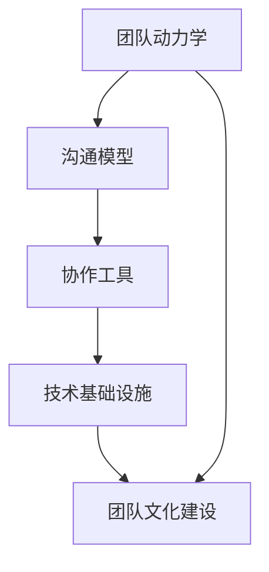
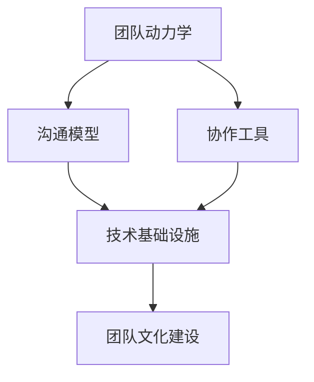

                 

好的，让我们一步步来完善这篇文章的目录大纲，确保每个章节都满足完整性要求，并包含详细的背景介绍、核心概念与联系、核心算法原理讲解、数学模型和公式、项目实战、最佳实践 tips、小结、注意事项和拓展阅读等内容。

### 目录大纲完善

#### 第1章 远程团队建设概述
- **背景介绍**：介绍远程工作的发展历程、现状及趋势。
- **核心概念与联系**：使用 Mermaid 流程图展示远程团队建设的基本概念及其相互关系。
- **远程团队建设的重要性**：阐述远程团队建设对企业发展和员工个人的意义。

#### 第2章 远程团队建设的基础
- **核心概念与联系**：介绍远程团队动力学、沟通模型和协作工具，并用 Mermaid 流程图展示它们之间的关系。
- **远程团队建设的挑战**：详细分析时间管理、文化差异、信任建设等方面的挑战。
- **解决策略**：提出应对这些挑战的具体策略和方法。

#### 第3章 远程团队建设策略与方法
- **制定团队愿景和目标**：解释如何为远程团队制定清晰的愿景和目标。
- **明确角色与责任**：详细阐述如何为团队成员分配角色和责任。
- **建立有效的沟通机制**：探讨如何构建高效的远程沟通机制。
- **制定团队协作流程**：介绍如何制定适应远程团队的工作流程。
- **管理远程团队的冲突**：分析冲突的成因及解决策略。

#### 第4章 远程团队的沟通与协作
- **远程沟通工具**：介绍常用的远程沟通工具及其使用方法。
- **沟通技巧提升**：讲解提升远程团队沟通效果的技巧。
- **跨境沟通策略**：探讨如何在不同文化背景下进行有效沟通。
- **提高团队协作效率**：提出提高远程团队协作效率的策略。

#### 第5章 远程团队的领导与管理
- **领导者角色转变**：分析远程团队领导者的新角色和职责。
- **领导力在远程团队中的应用**：探讨领导力在远程团队中的特殊应用。
- **领导者的责任和挑战**：详细阐述远程团队领导者的责任和面临的挑战。
- **领导者的激励策略**：介绍如何激励远程团队成员。

#### 第6章 远程团队的技术工具与应用
- **远程协作工具**：介绍用于远程协作的常用工具及其应用。
- **远程办公平台**：探讨远程办公平台的优势和应用。
- **人工智能辅助工具**：介绍人工智能工具在远程团队中的作用。
- **安全性和隐私保护**：讲解如何确保远程团队的安全和隐私。

#### 第7章 远程团队的绩效评估与激励
- **绩效评估指标**：定义并介绍远程团队的绩效评估指标。
- **激励机制设计**：探讨如何设计有效的激励机制。
- **绩效反馈与改进**：解释如何提供有效的绩效反馈并持续改进。
- **激励与员工满意度**：探讨激励措施对员工满意度的影响。

#### 第8章 远程团队的可持续发展
- **持续学习与成长**：讨论如何支持远程团队的持续学习和成长。
- **面对新挑战**：分析远程团队可能遇到的新挑战及其应对策略。
- **团队文化的建设与维护**：探讨如何建立和维护远程团队的团队文化。
- **跨境远程团队的特殊问题**：解决跨境远程团队面临的问题。

### 文章结尾
- **小结**：总结文章中的关键点。
- **注意事项**：提醒读者在实施远程团队建设时需要注意的事项。
- **拓展阅读**：推荐相关书籍、文章和研究报告，供读者进一步学习。

### 格式与作者信息
- 文章使用 markdown 格式。
- 文章末尾包含作者信息：“作者：AI天才研究院/AI Genius Institute & 禅与计算机程序设计艺术 /Zen And The Art of Computer Programming”。

### 字数要求
- 文章字数在 8000 ～ 12000 字左右。

通过这样的结构，我们可以确保文章内容丰富、逻辑清晰，同时满足专业性和实用性。接下来，我们将为每个章节准备详细的草稿，并逐步完善。让我们开始吧！### 第1章 远程团队建设概述

#### 背景介绍
远程工作（Telework）的兴起可以追溯到20世纪90年代，当时互联网和通信技术的发展为人们提供了新的工作方式。随着信息技术（IT）的飞速进步，远程工作逐渐成为企业和员工的一种普遍选择。特别是在近年来，COVID-19疫情进一步加速了远程工作模式的普及，许多企业和组织不得不迅速适应远程办公的环境，以维持业务运作和员工的工作连续性。

远程工作不仅为企业提供了灵活的用工模式，也为员工提供了更多的时间和空间自由。然而，远程团队的建设并不是一件容易的事情，它涉及多个方面的协调和管理，包括沟通、协作、时间管理、文化适应等。远程团队建设的目标是实现团队成员之间的高效协作，提升团队的整体绩效，并确保企业的战略目标得以实现。

#### 核心概念与联系
远程团队建设涉及多个核心概念，这些概念之间相互关联，构成了一个复杂但有机的整体。以下是几个关键概念及其相互关系的介绍：

1. **团队动力学**：团队动力学是指团队成员之间的互动和行为模式。在远程团队中，团队动力学尤为重要，因为它直接影响到团队成员的士气和协作效率。团队动力学包括团队结构、角色分配、成员间的沟通与冲突解决机制等。

2. **沟通模型**：沟通模型是指团队成员之间传递和接收信息的过程。在远程团队中，沟通模型需要考虑到地理距离、时区差异、技术工具的限制等因素。有效的沟通模型有助于减少误解、提高决策效率。

3. **协作工具**：协作工具是远程团队建设中不可或缺的一部分，它们帮助团队成员共享信息、协调工作进度、管理任务等。常见的协作工具包括视频会议软件、项目管理工具、文档共享平台等。

4. **技术基础设施**：技术基础设施是远程团队建设的基石，包括网络连接、安全措施、云计算平台等。稳定和高效的技术基础设施是保障远程团队顺利运作的基础。

5. **团队文化建设**：团队文化是团队内部共同的价值观、信念和行为规范。良好的团队文化有助于增强团队凝聚力，提升团队成员的归属感和工作满意度。

图 1-1 远程团队建设概念关系图



#### 远程团队建设的重要性
远程团队建设对企业的发展和员工的个人成长都有着重要的影响：

1. **企业层面**：
   - **成本节约**：远程工作可以减少企业的办公空间租赁和交通费用。
   - **人才吸引力**：灵活的工作模式有助于吸引更多全球范围内的优秀人才。
   - **运营稳定性**：在突发情况下（如疫情），远程工作能够保障业务的连续性。
   - **创新激发**：团队成员的多样性和地理分散有助于创新思维的碰撞。

2. **员工层面**：
   - **工作与生活平衡**：远程工作提供了更多的时间和空间自由，有助于员工实现工作与生活的平衡。
   - **个人成长**：远程工作要求员工具备自我管理和学习能力，这有助于个人职业发展。
   - **工作满意度**：良好的远程工作环境和团队文化能够提高员工的工作满意度和忠诚度。

总之，远程团队建设不仅是应对现代工作环境变化的一种策略，更是一种提升企业竞争力、促进员工个人发展的有效手段。在接下来的章节中，我们将深入探讨远程团队建设中的具体策略和方法。

### 第2章 远程团队建设的基础

#### 核心概念与联系
在远程团队建设过程中，理解并有效运用核心概念与联系是至关重要的。以下是我们将讨论的关键概念及其相互关系：

1. **团队动力学**：团队动力学涉及团队成员的互动、角色分配、沟通和冲突解决等行为模式。它是远程团队的核心，决定了团队成员之间的协作效率和团队氛围。团队动力学包括以下几个方面：
   - **角色分配**：明确每个成员在团队中的角色和责任，确保团队成员各司其职。
   - **沟通与协作**：建立有效的沟通机制，促进团队成员之间的信息共享和协作。
   - **冲突解决**：在远程团队中，由于地理距离和时区差异，冲突较为常见。有效的冲突解决机制有助于维护团队稳定。

2. **沟通模型**：沟通模型是远程团队中信息传递和交流的方式。一个有效的沟通模型需要考虑多个因素，如沟通媒介、沟通频率和沟通质量。以下是几个关键点：
   - **沟通媒介**：选择适合远程团队的沟通工具，如视频会议、即时消息、邮件等。
   - **沟通频率**：制定合理的沟通计划，确保团队成员之间的信息传递及时。
   - **沟通质量**：提高沟通效率，减少误解和歧义。

3. **协作工具**：协作工具是远程团队建设中不可或缺的一部分，它们帮助团队成员共同完成任务。以下是几种常用的协作工具：
   - **项目管理工具**：如Trello、Asana，帮助团队管理任务和项目进度。
   - **文档共享平台**：如Google Docs、Microsoft Teams，方便团队成员共享和协作编辑文档。
   - **视频会议工具**：如Zoom、Microsoft Teams，用于远程团队会议和协作讨论。

这些概念之间的联系在于，团队动力学决定了团队成员的行为和互动模式，沟通模型则是这些互动的媒介，而协作工具则是实现团队目标的具体手段。它们共同作用，形成一个高效的远程工作环境。

#### 核心概念与联系的关系架构
为了更好地理解这些概念之间的关系，我们可以使用 Mermaid 流程图来展示它们之间的相互作用：



在这个流程图中，团队动力学通过沟通模型和协作工具与技术和基础设施相连，而技术和基础设施又为团队文化建设提供了支持。这样的架构有助于确保远程团队建设中的各个环节相互协调，共同促进团队的高效运作。

#### 远程团队建设的挑战
尽管远程团队建设有其优势，但同时也面临着诸多挑战。以下是远程团队建设过程中常见的一些挑战：

1. **时间管理**：
   - **时区差异**：远程团队成员可能分布在不同的时区，这会导致协作上的困难。例如，一个团队成员在工作时间内，另一个团队成员可能正在休息。
   - **个人时间安排**：远程工作环境可能缺乏明确的上下班时间，员工需要自我管理时间，这可能会导致工作与生活边界模糊。

2. **文化差异**：
   - **沟通风格**：不同文化背景下的团队成员可能具有不同的沟通风格和偏好。例如，一些文化倾向于直接和明确的沟通，而另一些文化则偏好含蓄和间接的沟通。
   - **工作理念**：不同文化可能对工作态度、工作目标和团队合作有不同的看法，这可能会导致误解和冲突。

3. **信任建设**：
   - **远程监控**：在远程团队中，领导者可能难以直接监督团队成员的工作进度，这可能会导致对团队成员信任度的下降。
   - **团队凝聚力**：由于缺乏面对面的互动，远程团队成员之间的凝聚力可能较低，这会影响团队的合作效率。

#### 解决策略
为了应对这些挑战，远程团队建设需要采取一系列策略：

1. **时间管理**：
   - **灵活的工作时间**：允许团队成员根据自己的时区和工作需求调整工作时间，确保团队协作的灵活性。
   - **明确的任务分配**：为每个团队成员分配明确的任务和目标，确保他们知道自己的职责和期望。

2. **文化差异**：
   - **跨文化培训**：为团队成员提供跨文化培训，提高他们对不同文化的认识和理解。
   - **建立共同价值观**：通过共同的价值观和目标，促进团队成员之间的沟通和协作。

3. **信任建设**：
   - **透明度**：保持团队工作过程的透明度，让团队成员了解彼此的工作进度和计划。
   - **定期反馈**：定期进行团队绩效评估和反馈，确保团队成员之间的信任和相互支持。

通过这些策略，远程团队可以更好地应对建设过程中面临的挑战，实现高效、协作的工作环境。

### 第3章 远程团队建设策略与方法

#### 制定团队愿景和目标
在远程团队建设的过程中，制定清晰的团队愿景和目标是至关重要的。一个明确的愿景和目标能够为团队提供方向，确保所有成员都在朝着同一个目标努力。以下是实现这一目标的具体步骤：

1. **明确团队愿景**：团队愿景应描述团队在未来想要达到的状态或实现的目标。这需要团队成员共同讨论并达成共识。愿景应具有激励性，能够激发团队成员的激情和动力。

   ```markdown
   例如，一个远程团队的愿景可以是：“成为全球最优秀的远程协作团队，以高效和创新为基石，为客户提供卓越的服务。”
   ```

2. **制定可衡量的目标**：将愿景转化为具体、可衡量的目标。这些目标应涵盖团队在不同时间节点上期望实现的具体成果。目标应具有明确的时间限制、量化指标和责任归属。

   ```markdown
   例如，团队的目标可以是：“在接下来的六个月内，将项目交付时间缩短20%，并提高客户满意度评分至90%。”
   ```

3. **沟通并确保共识**：确保所有团队成员都了解并同意这些愿景和目标。可以通过团队会议、书面文件或内部通讯工具进行沟通，确保每个人都能清晰理解并认同团队的方向。

4. **定期回顾和调整**：愿景和目标不是一成不变的，应定期回顾并调整以适应团队和外部环境的变化。通过定期的回顾，团队可以及时发现问题并进行必要的调整。

#### 明确角色与责任
在远程团队中，明确每个成员的角色与责任是确保团队高效运作的基础。以下是实现这一目标的具体步骤：

1. **角色识别**：根据团队目标和任务需求，为每个成员分配明确的角色。角色应与成员的技能和兴趣相匹配，以确保他们能够在相应的职责范围内发挥最佳作用。

   ```markdown
   例如，团队成员的角色可以包括：项目经理、开发人员、测试工程师、设计师等。
   ```

2. **职责定义**：为每个角色定义具体的职责和工作内容。职责应清晰、具体，确保团队成员知道他们的任务和期望。

   ```markdown
   例如，项目经理的职责可能包括：规划项目进度、协调团队成员工作、管理项目资源等。
   ```

3. **责任归属**：确保每个职责都有明确的责任人。责任归属可以防止职责重叠和推诿，提高团队的责任感和执行力。

   ```markdown
   例如，可以制定一个责任矩阵，明确每个团队成员的职责和责任。
   ```

4. **定期评估与反馈**：定期评估团队成员的角色和职责履行情况，并提供反馈。这有助于发现和解决潜在问题，确保团队成员的职责得到有效执行。

#### 建立有效的沟通机制
在远程团队中，沟通是确保团队协作和信息传递的关键。以下是建立有效沟通机制的具体步骤：

1. **选择合适的沟通工具**：根据团队的需求和成员的偏好，选择合适的沟通工具。常见的沟通工具包括视频会议软件、即时消息平台、邮件等。

   ```markdown
   例如，Zoom和Slack是常用的视频会议和即时消息工具。
   ```

2. **制定沟通计划**：制定明确的沟通计划，包括沟通频率、沟通内容和沟通方式。沟通计划应确保团队成员能够及时交流信息和解决问题。

   ```markdown
   例如，每周举行一次团队会议，每月举行一次项目评审会议等。
   ```

3. **促进信息透明度**：确保团队内部的信息透明度，让所有成员都能及时了解项目的进展和关键决策。透明度有助于减少误解和猜测，提高团队的合作效率。

   ```markdown
   例如，使用项目管理工具如Trello或JIRA，实时更新项目状态和任务进度。
   ```

4. **建立反馈机制**：建立有效的反馈机制，鼓励团队成员提出建议和意见。反馈机制可以促进团队内部的沟通和改进，提高团队的整体绩效。

   ```markdown
   例如，设置匿名反馈渠道，定期收集团队成员的意见和建议。
   ```

通过这些步骤，远程团队可以建立一个高效的沟通机制，确保团队成员之间能够有效沟通和协作。

#### 制定团队协作流程
在远程团队中，制定明确的协作流程是确保团队高效运作的关键。以下是制定团队协作流程的具体步骤：

1. **任务分解**：将大型项目或任务分解为较小的、可管理的子任务。任务分解有助于明确每个团队成员的工作内容和工作量，提高团队的工作效率。

   ```markdown
   例如，将一个软件开发项目分解为需求分析、设计、编码、测试等阶段。
   ```

2. **流程文档化**：将团队协作流程文档化，确保所有团队成员都能清楚了解每个阶段的任务和工作内容。文档化的流程有助于减少误解和重复工作。

   ```markdown
   例如，使用Confluence或Google Docs创建协作流程文档，并定期更新。
   ```

3. **制定里程碑**：为每个阶段设定明确的里程碑，以确保项目按时交付。里程碑可以帮助团队监控项目的进度，并在必要时进行调整。

   ```markdown
   例如，在软件开发项目中，每个阶段结束时设定一个里程碑，如完成需求分析、完成设计等。
   ```

4. **协作工具集成**：使用协作工具集成各个工作阶段，确保信息共享和任务分配的顺畅。协作工具可以包括项目管理工具、文档共享平台、代码管理工具等。

   ```markdown
   例如，使用JIRA进行任务管理，使用Git进行代码管理，使用Google Drive或OneDrive进行文档共享。
   ```

5. **定期回顾与优化**：定期回顾协作流程的执行情况，识别问题和瓶颈，并提出改进措施。通过不断的优化，团队可以不断提升协作效率。

   ```markdown
   例如，每季度举行一次流程回顾会议，讨论协作流程的执行情况和优化建议。
   ```

通过制定明确的团队协作流程，远程团队可以更加高效地完成任务，确保项目的顺利进行。

#### 管理远程团队的冲突
在远程团队中，冲突是不可避免的。有效的冲突管理策略有助于减少负面情绪和影响，促进团队的和谐与高效运作。以下是管理远程团队冲突的具体策略：

1. **预防冲突**：
   - **明确规则和期望**：在团队成立之初，明确团队的行为准则和工作期望，减少因规则不明而产生的冲突。
   - **建立沟通渠道**：建立畅通的沟通渠道，确保团队成员能够及时表达意见和反馈，避免误解和冲突的积累。

2. **识别冲突**：
   - **定期团队评估**：定期进行团队评估，了解团队成员之间的互动和关系，及时发现潜在的冲突。
   - **匿名反馈机制**：建立匿名反馈机制，鼓励团队成员表达他们的担忧和不满，以便及时发现和处理冲突。

3. **解决冲突**：
   - **调解和仲裁**：在冲突发生时，及时进行调解和仲裁，确保公平公正的处理结果。可以采用在线调解工具或第三方调解服务。
   - **沟通策略**：采用有效的沟通策略，如积极倾听、表达同理心、寻求共同点等，帮助冲突双方找到解决问题的方法。

4. **总结经验**：
   - **冲突记录**：将冲突处理过程和结果记录下来，以便未来参考和改进。
   - **团队反思**：在冲突解决后，组织团队进行反思，总结经验教训，防止类似冲突的再次发生。

通过这些策略，远程团队可以有效地管理冲突，确保团队的稳定和高效运作。

### 第4章 远程团队的沟通与协作

#### 远程沟通工具
在远程团队中，选择合适的沟通工具是确保团队高效协作的关键。以下是几种常用的远程沟通工具及其特点：

1. **视频会议软件**：如Zoom、Microsoft Teams、Google Meet，这些工具支持实时视频通话、屏幕共享、文件共享等功能，有助于团队成员实时交流和协作。

   ```markdown
   Zoom：支持大规模视频会议、实时聊天和屏幕共享，适用于团队会议和协作讨论。
   Microsoft Teams：集成了Office 365功能，支持实时聊天、视频会议、文件共享等，适用于企业内部沟通。
   Google Meet：适用于小型会议，支持视频通话、屏幕共享和实时聊天，与Google Workspace紧密集成。
   ```

2. **即时消息平台**：如Slack、Microsoft Teams、WhatsApp，这些工具支持实时消息传递、文件共享、群组讨论等功能，有助于团队成员快速交流和获取信息。

   ```markdown
   Slack：支持多种集成应用，如GitHub、Trello等，方便团队成员协作。
   Microsoft Teams：集成了Office 365工具，支持实时聊天、视频会议、文档共享等，适用于企业内部沟通。
   WhatsApp：适用于小型团队，支持实时消息传递、语音和视频通话，方便快捷。
   ```

3. **邮件系统**：如Gmail、Outlook、Yahoo Mail，这些工具虽然主要用于非实时沟通，但在远程团队中仍然起到重要作用，适用于正式沟通和文件传递。

   ```markdown
   Gmail：支持丰富的邮件过滤和标签功能，方便团队成员管理邮件。
   Outlook：适用于企业用户，支持日历、联系人、任务等功能，方便团队管理日常工作。
   Yahoo Mail：提供免费的邮件服务，支持邮件存档和搜索功能。
   ```

4. **项目管理工具**：如Trello、Asana、JIRA，这些工具可以帮助团队管理任务、跟踪项目进度、分配任务等，提高团队协作效率。

   ```markdown
   Trello：以卡片形式展示任务和项目进度，直观易用。
   Asana：支持任务分配、进度跟踪、时间管理等功能，适用于团队协作。
   JIRA：适用于软件开发团队，支持 bug 管理、敏捷开发等，可以与 Git 等工具集成。
   ```

#### 沟通技巧提升
在远程团队中，提升沟通技巧对于确保有效的协作至关重要。以下是一些建议：

1. **倾听和反馈**：在沟通中，积极倾听对方的意见和观点，并及时给予反馈。这有助于理解对方的意图，减少误解和冲突。

2. **明确表达**：使用简洁明了的语言表达自己的观点和需求，避免使用含糊不清的表述，确保信息传递的准确性。

3. **主动沟通**：主动发起和参与沟通，确保信息传递的及时性和完整性。定期与团队成员进行沟通，了解他们的工作进展和需求。

4. **使用多种沟通方式**：结合使用视频会议、即时消息、邮件等多种沟通方式，根据不同场景选择最合适的沟通方式。

5. **培养同理心**：理解并尊重团队成员的文化和背景差异，培养同理心，促进跨文化沟通和协作。

#### 跨境沟通策略
在跨境远程团队中，文化差异和时区差异可能导致沟通障碍。以下是一些策略来应对这些挑战：

1. **文化培训**：为团队成员提供跨文化培训，提高他们对不同文化的认识和理解，减少文化冲突。

2. **明确沟通规范**：制定明确的沟通规范，包括语言、沟通频率和沟通方式，确保团队成员遵循相同的沟通标准。

3. **时区协调**：合理安排会议和沟通时间，尽量减少时区差异带来的影响。使用在线日历工具，提前协调会议时间，确保所有成员都能参加。

4. **使用翻译工具**：在必要时，使用翻译工具帮助团队成员理解彼此的语言，减少沟通障碍。

5. **建立信任**：通过定期的沟通和合作，建立团队成员之间的信任关系。信任是跨境远程团队协作的基础。

#### 提高团队协作效率
提高远程团队的协作效率是确保项目顺利进行的关键。以下是一些建议：

1. **任务管理**：使用项目管理工具，如Trello或Asana，将任务分配给团队成员，并跟踪任务的进展情况。

2. **实时协作**：使用文档共享平台，如Google Docs或Microsoft Teams，团队成员可以实时编辑和协作，提高工作效率。

3. **定期回顾**：定期召开团队回顾会议，讨论项目进展、遇到的问题和解决方案，确保团队在正确的方向上前进。

4. **培训和发展**：为团队成员提供培训和发展机会，提高他们的技能和知识，以适应远程工作环境。

5. **激励机制**：建立激励机制，鼓励团队成员积极参与协作和完成任务，提高团队的凝聚力和工作效率。

通过使用合适的沟通工具、提升沟通技巧、制定跨境沟通策略和提高团队协作效率，远程团队可以克服距离和文化的障碍，实现高效协作。

### 第5章 远程团队的领导与管理

#### 领导者角色转变
在远程团队中，领导者的角色与传统领导者有所不同。远程领导者需要适应新的工作环境和团队动态，以更好地指导和管理团队。以下是远程领导者角色转变的几个关键点：

1. **从监督者到支持者**：远程领导者不再是传统的监督者，而是转变为支持者。他们需要关注团队成员的需求，提供必要的资源和支持，帮助团队成员克服远程工作带来的挑战。

2. **从命令者到协调者**：远程领导者需要更加注重协调和沟通。他们需要确保团队成员之间的信息传递畅通，协调不同的工作进度和需求，避免团队成员因缺乏沟通而导致的误解和冲突。

3. **从管理者到促进者**：远程领导者需要激发团队成员的积极性和创造力，促进团队成员之间的协作和创新。他们需要创造一个支持性、开放和包容的工作环境，鼓励团队成员提出建议和意见。

4. **从控制者到信任者**：远程领导者需要建立对团队成员的信任。他们需要相信团队成员能够自主管理和完成任务，减少对远程工作的直接监控和控制，给予团队成员更多的自主权和责任感。

#### 领导力在远程团队中的应用
在远程团队中，领导力需要特别的应用和策略，以确保团队的高效运作和成员的满意度。以下是几个关键点：

1. **沟通与反馈**：远程领导者需要保持与团队成员的频繁沟通，通过视频会议、即时消息和电子邮件等方式，确保信息的透明和及时。同时，领导者需要提供及时的反馈，帮助团队成员了解自己的表现和需要改进的方面。

2. **透明度与公平性**：远程领导者应确保团队内部的信息透明度，避免信息不对称和偏颇。领导者需要公平地对待每个团队成员，确保每个人都有机会表达自己的观点和参与决策。

3. **信任与自主性**：远程领导者需要建立对团队成员的信任，鼓励他们自主管理和决策。通过赋予团队成员更多的责任和权力，领导者可以激发团队成员的积极性和创造力，提高团队的整体绩效。

4. **激励与认可**：远程领导者需要制定有效的激励机制，认可团队成员的努力和成就。通过定期的绩效评估和奖励措施，领导者可以增强团队成员的满意度和忠诚度。

#### 领导者的责任和挑战
远程领导者承担着多项责任和挑战，以下是其中几个关键点：

1. **团队凝聚力**：远程领导者需要关注团队凝聚力，确保团队成员之间保持紧密的联系和合作。他们需要通过定期的团队活动和虚拟社交活动，促进团队成员之间的互动和信任。

2. **文化建设**：远程领导者需要建立和维护团队的文化，包括共同的价值观、信念和行为规范。他们需要创造一个积极、开放和支持性的工作环境，让团队成员感受到归属感和自豪感。

3. **技术支持**：远程领导者需要确保团队成员具备必要的技术工具和资源，以支持他们的远程工作。他们需要关注技术基础设施的稳定性和安全性，确保团队成员的工作环境得到保障。

4. **冲突管理**：远程领导者需要有效管理团队中的冲突，及时解决成员之间的矛盾和误解。他们需要具备良好的沟通技巧和冲突解决能力，确保团队的工作环境和谐稳定。

#### 领导者的激励策略
为了激励远程团队成员，领导者可以采取以下策略：

1. **明确目标与期望**：领导者需要为团队成员设定清晰的目标和期望，确保每个成员都了解自己的职责和任务。通过明确的目标，领导者可以激励团队成员为实现共同目标而努力。

2. **奖励与认可**：领导者可以通过奖励和认可来激励团队成员。这可以包括物质奖励（如奖金、礼品）和非物质奖励（如表扬、荣誉）。通过公开认可团队成员的成就，领导者可以增强团队成员的自信心和动力。

3. **职业发展机会**：领导者可以提供职业发展机会，帮助团队成员提升技能和知识。这可以包括培训、研讨会和在线课程等。通过提供职业发展机会，领导者可以激励团队成员不断学习和成长。

4. **工作与生活平衡**：领导者需要关注团队成员的工作与生活平衡，提供灵活的工作安排和弹性工作时间。通过关注团队成员的个人需求，领导者可以增强团队的凝聚力和满意度。

通过这些激励策略，远程领导者可以激发团队成员的积极性和创造力，提高团队的整体绩效。

### 第6章 远程团队的技术工具与应用

#### 远程协作工具
远程协作工具是确保远程团队高效运作的关键。以下是一些常用的远程协作工具及其特点：

1. **项目管理工具**：
   - **Trello**：以卡片形式展示任务和项目进度，直观易用，适用于中小型团队。
   - **Asana**：支持任务分配、进度跟踪、时间管理等功能，适用于大型团队和项目。
   - **JIRA**：适用于软件开发团队，支持 bug 管理、敏捷开发等，可以与 Git 等工具集成。

2. **文档共享平台**：
   - **Google Docs**：支持多人实时编辑文档，便于团队成员协作。
   - **Microsoft Teams**：集成了 Office 365 工具，支持实时聊天、视频会议、文档共享等，适用于企业内部沟通。
   - **OneDrive**：提供云存储服务，方便团队成员共享和存储文档。

3. **视频会议工具**：
   - **Zoom**：支持大规模视频会议、实时聊天和屏幕共享，适用于团队会议和协作讨论。
   - **Microsoft Teams**：集成了 Office 365 功能，支持实时聊天、视频会议、文件共享等，适用于企业内部沟通。
   - **Google Meet**：适用于小型会议，支持视频通话、屏幕共享和实时聊天，与 Google Workspace 紧密集成。

4. **即时消息平台**：
   - **Slack**：支持多种集成应用，如 GitHub、Trello 等，方便团队成员协作。
   - **Microsoft Teams**：集成了 Office 365 工具，支持实时聊天、视频会议、文档共享等，适用于企业内部沟通。
   - **WhatsApp**：适用于小型团队，支持实时消息传递、语音和视频通话，方便快捷。

#### 远程办公平台
远程办公平台提供了全面的远程工作支持，包括文档编辑、项目管理、沟通协作等功能。以下是一些常用的远程办公平台：

1. **Slack**：Slack 是一款流行的即时消息和协作平台，支持团队沟通、任务管理和文件共享。Slack 的集成功能丰富，可以与许多其他应用程序（如 Google Drive、Trello、GitHub 等）无缝集成。

2. **Microsoft Teams**：Microsoft Teams 是一款集成了邮件、日历、笔记、会议和协作功能的远程办公平台。它集成了 Microsoft Office 套件，使得文档编辑和共享变得更加便捷。

3. **Zoom**：Zoom 是一款专门用于视频会议和协作的工具，提供了高质量的视频会议体验、屏幕共享和实时聊天功能。

4. **Google Workspace**：Google Workspace 包括 Gmail、Google Drive、Google Docs、Google Sheets、Google Slides 等，提供了全面的文档编辑、存储和协作功能。

#### 人工智能辅助工具
人工智能（AI）在远程团队中的应用越来越广泛，以下是一些常见的 AI 辅助工具：

1. **AI 实时翻译**：如 Google Translate、DeepL，这些工具可以实时翻译不同语言的内容，帮助跨境远程团队成员沟通。

2. **AI 自动回复**：如 Chatbot，这些工具可以自动回复常见的团队成员问题，减轻团队成员的负担。

3. **AI 数据分析**：如 Google Analytics、Tableau，这些工具可以自动化分析和可视化数据，帮助团队了解项目进度和绩效。

4. **AI 编程辅助**：如 GitHub Copilot、Tabnine，这些工具可以自动生成代码、提供编程建议，提高开发效率。

#### 安全性和隐私保护
在远程团队中，确保数据安全和隐私保护是至关重要的。以下是一些关键策略：

1. **使用VPN**：VPN（虚拟私人网络）可以确保远程团队成员在公共网络上安全地访问公司资源。

2. **加密通信**：使用加密协议（如 HTTPS、SSL/TLS）确保数据在传输过程中的安全性。

3. **双因素认证**：启用双因素认证（2FA），为远程登录提供额外的安全层。

4. **定期安全培训**：为团队成员提供定期安全培训，提高他们的安全意识和应对网络攻击的能力。

5. **数据备份和恢复**：定期备份数据，并确保在发生数据丢失或损坏时能够快速恢复。

通过使用这些技术工具和应用，远程团队可以更加高效地协作，确保数据安全和隐私保护。

### 第7章 远程团队的绩效评估与激励

#### 绩效评估指标
在远程团队中，有效的绩效评估是确保团队成员努力工作、提升团队整体绩效的关键。以下是一些关键的绩效评估指标：

1. **任务完成度**：评估团队成员是否按时完成分配的任务和目标。这可以通过项目管理工具（如Trello、Asana）中的任务进度来衡量。

2. **质量指标**：评估团队成员完成任务的成果质量。这可以包括代码质量、文档质量、客户满意度评分等。

3. **沟通效率**：评估团队成员在沟通方面的表现，如沟通频率、沟通及时性、沟通质量等。这可以通过沟通工具（如Slack、Microsoft Teams）中的统计数据来衡量。

4. **团队协作**：评估团队成员在团队协作中的表现，如任务分配与协作、团队会议参与度、跨部门合作等。

5. **创新与贡献**：评估团队成员在项目中的创新思维和额外贡献，如提出改进建议、解决难题等。

6. **客户满意度**：如果团队与外部客户直接互动，评估客户对团队成员和服务质量的满意度。

#### 激励机制设计
为了激励远程团队成员，设计有效的激励机制至关重要。以下是一些激励机制：

1. **绩效奖金**：根据团队成员的绩效表现，提供绩效奖金。这可以包括固定奖金和浮动奖金，以奖励优秀表现。

2. **股票期权**：为关键员工提供股票期权，让他们分享公司的成功和增长。

3. **灵活工作时间**：提供灵活的工作时间安排，让员工可以根据自己的需求调整工作时间，以实现工作与生活的平衡。

4. **职业发展机会**：提供职业发展机会，如培训、研讨会、在线课程等，帮助员工提升技能和知识。

5. **团队活动**：组织定期的团队活动，如虚拟团建、在线聚会等，增强团队成员之间的互动和团队凝聚力。

6. **公开认可**：定期在团队会议上公开认可团队成员的成就和贡献，提高员工的满意度和忠诚度。

#### 绩效反馈与改进
绩效反馈是持续提升团队绩效的关键。以下是一些策略：

1. **定期反馈**：定期与团队成员进行绩效反馈，确保他们了解自己的表现和需要改进的方面。反馈可以包括正面的表扬和建设性的批评。

2. **透明度**：保持绩效评估过程的透明度，让团队成员了解评估标准、目标和期望。

3. **个性化反馈**：针对不同成员的个性和工作需求，提供个性化的反馈和建议，帮助他们实现个人和团队目标。

4. **持续改进**：将绩效反馈转化为改进措施，帮助团队成员不断进步。这可以包括提供培训、调整工作分配、改善沟通流程等。

#### 激励与员工满意度
激励措施的有效实施可以显著提升员工满意度。以下是一些策略：

1. **认可与奖励**：及时认可员工的努力和成就，并通过奖励（如奖金、礼品、荣誉）进行物质激励。

2. **工作与生活平衡**：提供灵活的工作时间和远程工作机会，帮助员工实现工作与生活的平衡。

3. **职业发展**：提供明确的职业发展路径和机会，帮助员工实现职业成长。

4. **企业文化**：建立积极、开放和包容的企业文化，让员工感受到归属感和自豪感。

5. **定期沟通**：定期与员工进行沟通，了解他们的需求和意见，确保员工的满意度。

通过有效的绩效评估和激励措施，远程团队可以提升整体绩效，提高员工满意度，实现长期可持续发展。

### 第8章 远程团队的可持续发展

#### 持续学习与成长
为了确保远程团队的可持续发展，持续学习与成长至关重要。以下是一些策略：

1. **技能提升**：鼓励团队成员参加在线课程、研讨会和培训，提升专业技能和知识。

2. **内部培训**：组织内部培训，分享最佳实践和行业动态，提升团队成员的整体能力。

3. **知识共享**：建立知识共享平台，如内部Wiki或论坛，让团队成员共享经验和知识，促进团队学习和成长。

4. **认证和资质**：支持团队成员获得相关认证和资质，提高他们的专业水平。

#### 面对新挑战
在远程团队的发展过程中，不断出现新的挑战。以下是一些应对策略：

1. **技术更新**：定期评估和更新技术工具，确保团队具备最新的技术支持。

2. **风险管理**：制定风险应对策略，预防和应对远程工作中可能出现的问题。

3. **灵活调整**：根据外部环境变化和团队需求，灵活调整工作流程和管理策略。

4. **问题反馈机制**：建立问题反馈机制，及时识别和解决团队面临的问题。

#### 团队文化的建设与维护
良好的团队文化是远程团队长期可持续发展的基础。以下是一些策略：

1. **共同价值观**：明确团队共同价值观，确保团队成员在价值观上保持一致。

2. **团队活动**：定期组织虚拟团队活动，增强团队成员之间的互动和凝聚力。

3. **认可与奖励**：建立认可与奖励机制，激励团队成员积极参与团队活动，维护团队文化。

4. **透明沟通**：保持团队沟通的透明度，确保团队成员了解团队的最新动态和目标。

#### 跨境远程团队的特殊问题
对于跨境远程团队，以下是一些特殊问题及其解决策略：

1. **时区差异**：合理规划会议和任务时间，减少时区差异带来的沟通和协作困难。

2. **文化差异**：提供跨文化培训，提升团队成员对不同文化的认识和尊重。

3. **语言障碍**：使用通用的业务语言，或提供翻译支持，减少语言障碍带来的沟通困难。

4. **数据保护**：遵循当地数据保护法规，确保团队成员数据的安全和隐私。

通过以上策略，远程团队可以应对新挑战，建设良好的团队文化，实现长期可持续发展。

### 小结
远程团队建设是一个复杂而持续的过程，涉及到多个方面的协调和管理。从明确团队愿景和目标，到建立有效的沟通机制，再到实施有效的领导与管理策略，每一步都是确保团队高效运作的关键。此外，选择合适的协作工具、维护良好的团队文化以及持续学习和适应新挑战也是远程团队建设成功的重要因素。

在实施远程团队建设时，需要注意以下几点：

1. **明确目标和责任**：确保每个团队成员都清楚自己的角色和职责，以避免工作重叠和责任不明。
2. **建立有效的沟通机制**：选择合适的沟通工具，并制定明确的沟通计划，确保信息传递的及时性和准确性。
3. **促进团队凝聚力**：通过定期的团队活动和反馈机制，增强团队成员之间的互动和信任。
4. **关注技术支持**：确保团队成员具备必要的技术工具和资源，以支持远程工作。
5. **持续学习和改进**：定期评估团队绩效，并根据反馈进行调整和改进。

总之，远程团队建设不仅需要策略和方法，更需要持续的投入和关注。通过有效的团队建设，企业可以更好地应对远程工作带来的挑战，实现团队的高效运作和持续发展。

### 注意事项
在远程团队建设中，一些常见的挑战和潜在问题需要特别注意：

1. **沟通障碍**：由于缺乏面对面的交流，团队成员之间可能会出现沟通不畅、信息传递不及时的情况。为避免这一问题的发生，建议定期举行视频会议、使用即时消息平台，并确保沟通渠道的畅通。

2. **工作与生活平衡**：远程工作虽然提供了时间和空间的灵活性，但同时也容易导致工作与生活边界模糊。建议企业设定明确的工作时间，并鼓励员工合理安排工作和休息时间，保持良好的工作与生活平衡。

3. **团队凝聚力下降**：远程团队由于缺乏面对面的互动，团队凝聚力可能会受到影响。为了增强团队的凝聚力，可以通过定期的团队活动、虚拟团建和定期反馈等方式来加强团队成员之间的联系。

4. **技术依赖问题**：远程团队高度依赖各种协作工具和技术平台。如果这些工具出现问题或稳定性不足，可能会影响团队的工作效率。因此，建议企业选择稳定可靠的技术解决方案，并定期进行技术更新和维护。

5. **数据安全和隐私保护**：在远程工作中，数据安全和隐私保护尤为重要。企业应确保采用适当的安全措施，如VPN、双因素认证和加密通信，以防止数据泄露和黑客攻击。

通过注意这些事项，远程团队可以更好地克服挑战，实现高效运作和持续发展。

### 拓展阅读
为了深入了解远程团队建设，以下是一些推荐书籍、文章和研究报告：

1. **书籍**：
   - 《远程工作的艺术》（The Art of Remote Work）作者：Jason Fried & David Heinemeier Hansson
   - 《远程协作：如何在远程团队中建立高效的协作与沟通》（Remote Collaboration: How to Build Effective Collaboration and Communication in Remote Teams）作者：Lucia Mollay
   - 《禅与远程工作的艺术》（Zen and the Art of Remote Work）作者：Gregory & Julia

2. **文章**：
   - 《远程团队管理：7个关键策略提升团队绩效》（7 Key Strategies for Remote Team Management to Boost Performance）发表在 Harvard Business Review 上。
   - 《如何建立高效的远程团队》（How to Build an Efficient Remote Team）发表在 Entrepreneur Magazine 上。
   - 《远程工作：未来的趋势和挑战》（Remote Work: Future Trends and Challenges）发表在 Forbe 上。

3. **研究报告**：
   - 《远程工作的全球趋势报告》（Global Work from Home Trends Report）由 Owl Labs 发布。
   - 《2021年远程工作趋势报告》（2021 Remote Work Trends Report）由 Buffer 发布。
   - 《远程工作的影响：对员工满意度、生产力和职业发展的调查》（The Impact of Remote Work: A Survey of Employee Satisfaction, Productivity, and Professional Development）由 FlexJobs 和 Global Workplace Analytics 发布。

通过阅读这些书籍、文章和研究报告，读者可以进一步了解远程团队建设的方法、策略和最佳实践，为企业的远程团队管理提供有力支持。

