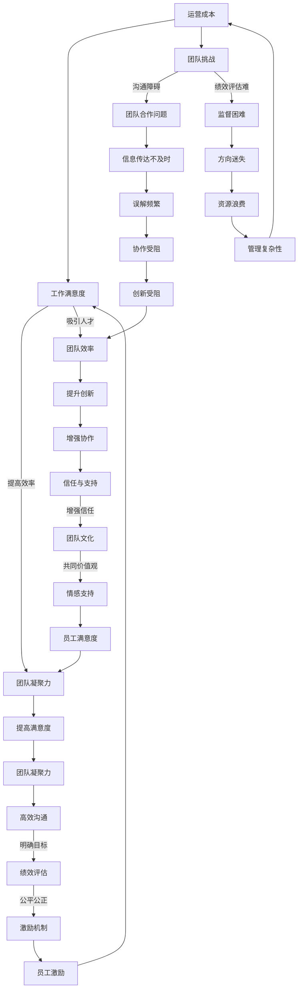

                 

### 文章标题：远程团队建设：虚拟环境下的凝聚力培养

在当今快速发展的数字化时代，远程工作已成为一种普遍的工作模式。这不仅是因为它提供了灵活的工作时间和地点，更重要的是，它能够吸引和保留全球范围内的优秀人才。然而，远程工作也带来了一系列挑战，特别是在团队凝聚力的培养上。在虚拟环境中，团队成员之间的互动和合作变得更加复杂和微妙。如何在这样的环境中保持团队的凝聚力，是每个远程团队管理者必须面对的问题。

本文将深入探讨远程团队建设的关键要素，提供实用的策略和方法，帮助团队在虚拟环境中建立和保持高水平的凝聚力。文章将分为以下几个部分：

1. **远程团队的概述**：介绍远程工作的背景和优势，以及远程团队面临的挑战。
2. **远程团队的组织结构**：探讨如何设计远程团队的组织结构，以及职责分工的重要性。
3. **远程团队的沟通与协作**：分析远程沟通的障碍，并探讨提升沟通效果的策略和工具。
4. **远程团队的凝聚力建设**：探讨虚拟环境下的团队文化建设、情感支持和关怀。
5. **远程团队的项目管理与绩效评估**：介绍远程项目管理的方法和策略，以及绩效评估的挑战和解决方案。
6. **远程团队的可持续发展**：探讨远程团队的长期挑战，以及促进可持续发展的策略。

通过本文的逐步分析，我们希望为远程团队管理者提供一套全面的解决方案，帮助他们克服远程工作中的困难，培养团队的凝聚力，最终实现团队的成功。

### 文章关键词

1. **远程工作**：指在非传统工作地点（如家中、咖啡馆等）进行的工作模式。
2. **团队凝聚力**：指团队成员之间相互信任、支持和协作的能力。
3. **虚拟团队**：指通过互联网和通信技术连接的团队，成员分散在不同地理位置。
4. **沟通策略**：指用于改善团队沟通效率和效果的方法和技巧。
5. **项目管理**：指规划、执行、监控和关闭项目的过程。
6. **绩效评估**：指对团队成员工作表现进行评估和反馈的方法。
7. **团队文化**：指团队内部共享的价值观、信仰和行为准则。

### 文章摘要

本文旨在探讨远程团队在虚拟环境下的建设策略，特别是如何培养团队的凝聚力。首先，我们将回顾远程工作的兴起背景和优势，并讨论远程团队所面临的挑战。接着，文章将深入探讨远程团队的组织结构设计，包括团队类型、治理结构和职责分工。随后，我们将分析远程沟通的障碍，并提出提升沟通效果的策略和工具。在探讨团队凝聚力建设时，文章将重点关注虚拟环境下的团队文化、情感支持与关怀。此外，文章还将介绍远程团队的项目管理和绩效评估策略，以及促进团队可持续发展的方法。通过这些分析和讨论，本文希望为远程团队管理者提供实用的指导，帮助他们克服远程工作中的困难，提升团队绩效。

## 远程团队的概述

### 远程工作的兴起

远程工作（Remote Work）的概念并不是新近出现的，但它在过去几十年中经历了显著的发展。早在20世纪80年代，个人计算机和互联网的普及为远程工作提供了技术基础。然而，当时远程工作主要限于自由职业者和小型企业，且数量相对较少。随着21世纪初信息技术和通信技术的进一步发展，远程工作逐渐成为可能，尤其是在全球化的背景下，企业开始意识到远程工作的诸多优势。

进入21世纪第二个十年，远程工作的兴起受到了新冠疫情的推动。2020年，全球范围内的大流行迫使许多企业迅速转向远程工作模式，以保障员工和公众的健康安全。这种突如其来的转变不仅展示了远程工作的适应能力，也揭示了其在未来工作中的巨大潜力。据统计，疫情期间，全球范围内有数亿人开始采用远程工作模式，这一比例在疫情后依然保持较高水平。

### 远程团队的优势

远程团队（Remote Teams）之所以受到越来越多的企业青睐，主要源于其多方面的优势。首先，远程工作能够显著提高员工的满意度和生产力。根据多项研究，远程工作有助于减少通勤时间，降低工作压力，从而提升员工的工作积极性和工作效率。此外，远程工作还允许员工在更为舒适的环境中工作，有助于提高工作效率和创造力。

其次，远程团队能够吸引全球范围内的优秀人才。不再受限于地理位置，企业可以招聘来自世界各地的顶尖人才，从而提高团队的整体实力和创新能力。这种全球化的人才流动不仅丰富了团队的文化多样性，也为企业带来了更多的创新思维和解决方案。

第三，远程团队有助于降低企业的运营成本。传统办公场所的租赁、维护和管理成本相对较高，而远程工作可以大幅减少这些成本。此外，企业还可以根据项目需求灵活调整团队规模，避免了传统办公模式中固定人数带来的资源浪费。

### 远程团队面临的挑战

尽管远程团队具有诸多优势，但也面临着一系列独特的挑战。首先是沟通障碍。在虚拟环境中，团队成员之间的面对面交流受到限制，沟通效率容易受到影响。此外，不同时区的差异也增加了沟通的复杂性，可能导致信息传达不及时或误解。

其次是团队合作的问题。远程团队缺乏传统办公环境中的日常互动和协作，这可能导致团队成员之间的默契和信任度降低。此外，远程工作中缺乏直接的反馈和指导，也使得团队成员在工作中容易迷失方向。

第三是工作监督和绩效评估的挑战。在远程环境中，管理者难以实时监控员工的工作状态，这使得绩效评估变得复杂和困难。如何确保远程员工的工作质量和效率，成为企业管理者必须面对的难题。

### 小结

远程工作的兴起为企业和员工提供了巨大的机遇，但也带来了新的挑战。理解远程团队的优势和挑战，是构建高效远程团队的基础。在接下来的章节中，我们将深入探讨如何设计远程团队的组织结构，以应对这些挑战，并确保团队的稳定和高效运行。

## 核心概念与联系

在探讨远程团队建设之前，我们需要明确一些核心概念及其相互之间的联系。这些概念包括远程工作的定义、远程团队的优势与挑战、团队凝聚力的重要性等。通过Mermaid流程图，我们可以直观地展示这些概念之间的关系架构。

### 远程工作的定义

远程工作是指员工在非传统工作场所（如家中、远程办公室或公共工作空间）进行工作的模式。这种工作方式通过互联网和通信技术实现，使员工能够在不同地理位置进行协作。远程工作的定义与远程团队的概念密切相关，因为远程团队的建立和运作离不开远程工作的技术支持。

### 远程团队的优势与挑战

远程团队的优势主要体现在以下几个方面：

1. **提高效率**：远程工作减少了通勤时间，使员工能够更专注于工作，从而提高工作效率。
2. **灵活工作**：员工可以根据自身需求调整工作时间，从而提高工作满意度。
3. **吸引人才**：远程工作模式使企业能够招聘全球范围内的优秀人才，增加团队多样性。
4. **降低成本**：企业不需要承担高昂的办公场所租赁和维护费用，能够降低运营成本。

然而，远程团队也面临一些挑战，如沟通障碍、团队合作问题和工作监督困难等。这些挑战会影响团队的整体效率和凝聚力。

### 团队凝聚力的重要性

团队凝聚力是指团队成员之间相互信任、支持和协作的能力。在远程团队中，凝聚力尤为重要，因为它能够弥补物理距离带来的沟通障碍和团队合作问题。高凝聚力的团队能够更好地应对远程工作中的挑战，提高工作效率和创新能力。

通过上述Mermaid流程图，我们可以清晰地看到这些核心概念之间的相互关系。远程工作的定义和优势为团队提供了基础，而团队凝聚力则是确保团队高效运作的关键。理解这些概念及其联系，有助于我们在接下来的章节中深入探讨如何设计和建设高效的远程团队。

## 远程团队的组织结构

远程团队的成功离不开合理的设计和构建。一个有效的远程团队组织结构能够确保团队成员之间清晰的角色分配、明确的沟通路径和高效的任务执行。以下将详细探讨远程团队的组织结构设计，包括团队类型、治理结构和职责分工。

### 远程团队的类型

远程团队可以根据成员的地理位置、工作性质和团队结构进行分类。以下是几种常见的远程团队类型：

1. **分布式团队**：这种类型的团队分布在不同的地理区域，成员可能来自不同的国家和城市。分布式团队通常利用虚拟办公平台和协作工具进行工作。
   
2. **全球团队**：全球团队由来自不同国家和地区、具有不同文化背景的成员组成。这种团队通常需要更加复杂的沟通和管理策略，以确保高效的协作。

3. **混合团队**：混合团队结合了传统办公和远程工作模式，团队成员在特定时间和地点进行面对面的会议和交流，而在其他时间则通过虚拟平台工作。

### 治理结构

远程团队的治理结构对于团队的成功至关重要。一个良好的治理结构能够确保团队成员明确各自的职责，以及团队整体的目标和期望。以下是几种常见的远程团队治理结构：

1. **集中式治理**：在这种结构中，一个中央管理团队负责制定决策和指导整个团队的工作。这种结构适用于规模较小的团队，特别是在初始阶段。

2. **分布式治理**：分布式治理结构中，决策权分散到各个子团队或成员，每个子团队或成员负责自己的部分工作。这种结构适用于规模较大的团队，特别是那些需要高度自主性和创新性的团队。

3. **矩阵式治理**：矩阵式治理结构结合了集中和分布式治理的特点。团队成员既属于某个职能部门，又属于项目团队。这种结构适用于需要跨职能协作和资源整合的项目。

### 职责分工

明确和合理的职责分工是远程团队高效运作的基础。以下是远程团队中常见的职责：

1. **项目经理**：负责项目计划、执行和监控，确保项目按时完成并达到预期目标。

2. **团队领导**：负责团队日常运营，包括人员管理、沟通协调和团队文化建设。

3. **技术专家**：负责解决技术问题和提供技术支持，确保项目的技术可行性。

4. **沟通协调员**：负责处理跨部门或跨团队的沟通事务，确保信息流畅。

5. **质量保证人员**：负责项目的质量控制和测试，确保项目符合质量标准。

6. **行政支持**：负责处理与员工福利、工作环境等相关的事务。

### 小结

合理设计远程团队的组织结构是确保团队高效运作的关键。通过选择合适的团队类型、建立有效的治理结构和明确职责分工，远程团队能够更好地应对远程工作中的挑战，提高协作效率和项目成功率。在接下来的章节中，我们将探讨远程沟通中的挑战和策略，以进一步优化远程团队的工作模式。

## 远程沟通的挑战与策略

### 挑战一：沟通障碍

在远程团队中，沟通障碍是一个普遍存在的问题。这些障碍可能源于多种因素，包括地理位置、时间差异、技术限制和个体差异。以下是几个常见的沟通障碍及其影响：

1. **地理位置**：团队成员分散在不同地理位置，无法进行面对面的交流，这可能导致信息传递不及时或误解。

2. **时间差异**：不同地区的时差可能使团队成员无法在相同的时间进行实时沟通，影响团队协作效率。

3. **技术限制**：网络连接不稳定、工具使用不熟练等技术问题可能导致沟通中断或效率低下。

4. **个体差异**：团队成员来自不同的文化背景，可能存在语言、沟通风格和行为习惯的差异，增加沟通难度。

### 策略一：提升沟通效果的策略

为了克服这些沟通障碍，远程团队需要采取一系列策略来提升沟通效果。以下是几种有效的策略：

1. **明确沟通目标**：在每次沟通前，明确沟通的目标和期望结果，确保团队成员在沟通过程中集中精力。

2. **制定沟通计划**：制定详细的沟通计划，包括沟通频率、沟通内容和沟通方式，确保信息传递的有序性。

3. **使用多种沟通工具**：利用不同的沟通工具（如即时通讯、邮件、视频会议等）来满足不同的沟通需求，提高沟通效率。

4. **培养沟通技巧**：通过培训和练习，提升团队成员的沟通技巧，包括表达清晰、倾听和理解他人观点的能力。

### 挑战二：团队合作问题

除了沟通障碍，远程团队在团队合作上也面临诸多问题。这些问题可能源于团队成员之间的缺乏互动、信任和协作。以下是几个常见的团队合作问题及其影响：

1. **缺乏互动**：远程工作中，团队成员之间缺乏面对面的互动，可能影响团队成员之间的了解和信任。

2. **信任问题**：在远程环境中，团队成员之间难以建立信任，可能导致合作意愿降低。

3. **协作困难**：团队成员在远程工作中可能难以协调时间和任务，影响团队协作效率。

4. **反馈缺失**：远程团队中，团队成员难以及时获得反馈，可能影响工作效率和项目质量。

### 策略二：提升团队合作效果的策略

为了解决这些团队合作问题，远程团队需要采取一系列策略来提升团队合作效果。以下是几种有效的策略：

1. **建立团队文化**：通过共同的价值观和目标，建立团队文化，增强团队成员的归属感和合作意愿。

2. **定期团队活动**：组织定期的团队活动，如在线研讨会、虚拟团建活动等，增强团队成员之间的互动和信任。

3. **明确角色和职责**：确保每个团队成员都清楚自己的角色和职责，减少因角色不清导致的协作问题。

4. **使用协作工具**：利用协作工具（如项目管理软件、共享文档和即时通讯工具等）来提高团队协作效率和透明度。

### 挑战三：工作监督与绩效评估

远程团队的工作监督和绩效评估也是一大挑战。由于团队成员分散在不同地理位置，管理者难以实时监控员工的工作状态，这可能导致绩效评估不准确。以下是几个常见的问题及其影响：

1. **监督困难**：管理者难以监控远程员工的工作过程，可能影响对员工工作表现的判断。

2. **绩效评估不准确**：远程工作环境下，绩效评估的准确性和公平性受到质疑，可能导致员工不满。

3. **激励机制缺失**：缺乏有效的激励机制可能导致远程员工的工作动力不足。

### 策略三：提升工作监督与绩效评估效果的策略

为了解决这些问题，远程团队需要采取一系列策略来提升工作监督和绩效评估的效果。以下是几种有效的策略：

1. **制定明确的工作目标**：确保每个员工都明确自己的工作目标和期望成果，便于绩效评估。

2. **定期绩效反馈**：通过定期进行绩效反馈，帮助员工了解自己的工作表现，并及时进行调整。

3. **使用绩效评估工具**：利用绩效评估工具（如KPI、360度评估等）来提高绩效评估的准确性和公平性。

4. **建立透明的激励机制**：明确激励机制，确保员工的努力和成就能够得到认可和奖励。

### 小结

远程团队在沟通、合作和工作监督方面面临诸多挑战，但通过采取有效的策略，这些挑战是可以克服的。理解并应对这些挑战，能够帮助远程团队提高沟通效率、增强团队协作、提升工作质量和员工满意度。在接下来的章节中，我们将深入探讨如何培养远程团队的凝聚力，进一步优化远程团队的工作环境。

## 远程协作工具与技术

在远程团队中，选择和使用合适的协作工具与技术是确保团队高效运作的关键。以下将详细介绍常见的远程协作工具及其应用，并探讨如何优化远程协作过程。

### 常见的远程协作工具

1. **即时通讯工具**：即时通讯工具如Slack、Microsoft Teams和WhatsApp等，能够实现团队成员之间的实时沟通和协作。这些工具通常提供聊天室、个人消息、文件共享和通知功能，有助于提高沟通效率和团队协作。

2. **项目管理软件**：如Trello、Asana和Jira等项目管理工具，可以帮助团队规划和跟踪项目进度。这些工具提供任务分配、截止日期管理、进度更新和协作功能，使团队工作更加有序和透明。

3. **视频会议工具**：如Zoom、Microsoft Teams和Google Meet等视频会议工具，支持多人实时视频通话、屏幕共享和文档协作，是远程团队进行会议和讨论的重要工具。

4. **文件共享与存储**：如Google Drive、OneDrive和Dropbox等文件共享与存储工具，可以方便团队成员访问和共享文件，确保信息的一致性和安全性。

5. **团队协作平台**：如Confluence、Notion和Asana等团队协作平台，提供文档编写、知识共享和项目管理功能，帮助团队更好地协作和沟通。

### 如何优化远程协作过程

1. **统一工具选择**：为了减少混乱和提升效率，团队应尽量统一使用特定的协作工具。这有助于团队成员快速熟悉和掌握工具的使用，减少学习成本。

2. **明确协作规则**：制定明确的协作规则，包括沟通渠道、文件命名规范、任务分配和更新频率等。这有助于确保团队协作的一致性和高效性。

3. **定期团队培训**：定期组织团队培训，帮助成员掌握协作工具的使用技巧，提升团队协作能力。

4. **建立协作文化**：鼓励团队成员积极参与协作，培养团队合作精神和责任感，确保团队协作的顺畅。

5. **使用自动化工具**：利用自动化工具（如集成机器人、自动化提醒和流程自动化等）简化重复性任务，提高团队协作效率。

6. **定期评估和改进**：定期评估协作工具的使用效果，收集团队成员的反馈，及时调整和优化协作流程。

### 远程协作的最佳实践

1. **高效会议管理**：通过设定明确的会议议程、提前分发会议资料和限制会议时间，提高会议效率。

2. **即时响应**：鼓励团队成员在沟通工具上保持即时响应，确保问题能够得到快速解决。

3. **文档管理**：使用版本控制和共享文件夹功能，确保文档的一致性和更新。

4. **透明任务分配**：通过项目管理工具清晰地分配任务和设置截止日期，确保团队成员对任务进展有清晰的了解。

5. **知识共享**：定期整理和共享项目经验、最佳实践和知识库，提升团队整体能力。

### 小结

选择和使用合适的远程协作工具，并优化协作过程，是确保远程团队高效运作的关键。通过统一的工具选择、明确的协作规则、定期的培训和评估，以及建立协作文化和最佳实践，远程团队能够克服地理和时间的限制，实现高效协作和团队目标。

## 远程团队的凝聚力建设

### 团队文化的定义与作用

团队文化是指团队内部共享的价值观、信仰和行为准则，是团队凝聚力的核心。一个强大的团队文化不仅能够促进团队成员之间的协作和信任，还能够提升整个团队的工作效率和创新能力。以下是团队文化在远程团队中的作用：

1. **增强团队认同感**：团队文化能够帮助团队成员建立起对团队的认同感，增强归属感。这种认同感使团队成员更加愿意为团队的目标努力，共同克服困难。

2. **促进协作与信任**：团队文化鼓励开放和诚实的沟通，促进团队成员之间的合作和信任。在远程团队中，这种协作和信任尤为重要，因为缺乏面对面的互动。

3. **提升工作效率**：团队文化有助于形成一套高效的工作流程和行为规范，使团队成员能够在无需过多沟通的情况下高效合作。

4. **增强创新思维**：团队文化鼓励创新和尝试，为团队成员提供自由表达和实验的空间，从而激发团队的创新潜力。

### 建立虚拟团队文化的策略

在虚拟环境中建立团队文化需要特别的策略和努力。以下是几种有效的策略：

1. **共同价值观的塑造**：明确团队的核心价值观，并确保每个成员都认同和遵循。可以通过团队会议、在线研讨会和团队建设活动来强化这些价值观。

2. **建立沟通渠道**：为团队成员提供多种沟通渠道，如即时通讯工具、邮件和视频会议，确保团队成员能够方便地进行沟通和互动。

3. **定期团队活动**：组织定期的团队活动，如虚拟团建活动、在线知识分享会和团队建设游戏，增强团队成员之间的联系和信任。

4. **鼓励反馈和透明度**：建立反馈机制，鼓励团队成员之间进行开放和诚实的反馈。透明度能够增加团队内部的信任和协作。

5. **提供发展机会**：为团队成员提供职业发展和培训机会，鼓励他们在团队中成长和贡献。这不仅能提升团队成员的技能，还能增强团队的凝聚力。

### 团队价值观与目标的一致性

团队价值观与目标的一致性是团队文化的重要方面。以下是一些建议，帮助确保团队价值观与目标的一致性：

1. **明确团队目标**：确保每个团队成员都清楚团队的目标和期望。这可以通过制定明确的团队目标和项目计划来实现。

2. **建立个人目标**：鼓励团队成员根据团队目标设定个人目标，确保个人目标与团队目标一致。这有助于激发团队成员的积极性，确保他们朝着共同的目标努力。

3. **定期检查进度**：定期检查团队和个人的进度，确保团队成员在正确方向上前进。这可以通过定期团队会议和项目回顾来实现。

4. **鼓励跨职能合作**：鼓励团队成员跨职能合作，确保不同职能部门和团队成员之间的目标和价值观一致。

5. **培养共同的成功感**：通过共同庆祝团队和个人的成就，培养团队成员的共同成功感。这可以增强团队成员之间的联系和归属感。

### 小结

在虚拟环境中建立和维持团队文化是一个长期而复杂的过程，但它是提升团队凝聚力、促进协作和实现团队目标的关键。通过塑造共同价值观、建立沟通渠道、定期团队活动和鼓励反馈，远程团队可以建立一个强大的团队文化，确保团队成员在虚拟环境中也能紧密协作和共同进步。

## 远程团队的情感支持与关怀

### 社交互动的重要性

在远程团队中，社交互动是保持团队成员情感联系和团队凝聚力的重要环节。社交互动不仅有助于缓解工作压力，还能增强团队成员之间的信任和理解。以下是社交互动在远程团队中的几个重要作用：

1. **缓解工作压力**：远程工作中，团队成员可能面临孤独感和工作压力。定期的社交互动可以帮助成员放松心情，减轻工作压力，提高工作效率。

2. **增强团队凝聚力**：社交互动有助于团队成员建立深厚的情感联系，增强团队凝聚力。这种凝聚力在应对远程工作中的挑战时尤为重要。

3. **促进信任和理解**：通过社交互动，团队成员可以更好地了解彼此，建立信任和理解。这种信任和理解有助于提高团队合作效率和项目成功率。

### 情感支持的重要性

情感支持在远程团队中扮演着关键角色，它有助于提升团队成员的心理健康和工作满意度。以下是情感支持在远程团队中的几个重要作用：

1. **提升心理健康**：远程工作可能带来孤独感和焦虑感。有效的情感支持可以帮助团队成员缓解这些负面情绪，提升心理健康。

2. **提高工作满意度**：情感支持能够增强团队成员对工作的满意度，提高工作积极性和投入度。

3. **增强团队信任**：通过提供情感支持，团队成员之间能够建立更加牢固的信任关系，从而提高团队合作效率。

### 提供情感支持的方法与技巧

为了在远程团队中提供有效的情感支持，团队领导者和成员可以采取以下方法和技巧：

1. **定期团队关怀活动**：组织定期的团队关怀活动，如在线心理健康讲座、虚拟放松课程和团队聊天会。这些活动可以帮助成员放松心情，缓解压力。

2. **建立沟通渠道**：为团队成员提供多种沟通渠道，如团队聊天室、邮件和即时通讯工具，确保成员能够方便地交流和分享感受。

3. **鼓励开放沟通**：鼓励团队成员在团队中分享个人感受和困难，建立开放和诚实的沟通环境。这有助于增强团队成员之间的信任和理解。

4. **提供心理支持资源**：为团队成员提供心理健康支持和资源，如在线心理咨询服务和心理支持热线。这些资源可以帮助成员在遇到困难时获得及时的支持。

5. **培养团队互助精神**：鼓励团队成员互相帮助和支持，建立团队互助文化。这种文化可以增强团队成员之间的情感联系，提高团队凝聚力。

### 具体案例

以下是一个具体的案例，展示如何通过社交互动和情感支持提升远程团队的凝聚力：

**案例：一家软件公司的虚拟团队**

该公司的远程团队由于地理位置分散和时差问题，成员之间缺乏有效的社交互动和情感支持。为了改善这一状况，团队领导采取了以下措施：

1. **每周团队早餐会**：每周五早上，团队领导组织一次在线早餐会，团队成员可以通过视频会议共享早餐，并进行轻松的交流。

2. **每月团队心理健康讲座**：每月举办一次心理健康讲座，邀请专业心理师分享心理健康知识和应对压力的技巧。

3. **定期团队聊天会**：每周五晚上，团队领导组织一次团队聊天会，成员可以分享本周的工作和生活，互相支持和鼓励。

4. **员工互助小组**：建立员工互助小组，成员可以加入感兴趣的互助小组，如运动小组、阅读小组和兴趣小组，增强社交联系。

通过这些措施，该远程团队的成员之间的社交互动显著增加，情感支持也得到了提升。团队成员在工作中的积极性、工作效率和满意度都有了明显提高，团队的凝聚力也得到了显著增强。

### 小结

社交互动和情感支持在远程团队中至关重要，它们能够缓解工作压力，增强团队凝聚力，提高团队成员的心理健康和工作满意度。通过定期的社交互动和情感支持活动，团队领导者和成员可以建立起深厚的情感联系，为团队的成功奠定坚实的基础。

## 远程团队的项目管理

### 远程项目管理的方法

在远程环境中，项目管理的挑战更加显著，需要采用一些特殊的方法来确保项目按时、按质完成。以下是几种常用的远程项目管理方法：

1. **敏捷开发方法**：敏捷开发是一种以迭代和增量为核心的项目管理方法，非常适合远程团队。它强调快速反馈、持续改进和团队成员之间的密切协作。敏捷开发通常使用Scrum框架，将项目划分为多个短周期（称为“冲刺”），在每个冲刺结束时进行回顾和调整。

2. **看板管理方法**：看板（Kanban）是一种基于可视化工作流程的管理方法，它通过看板（Kanban板）展示项目任务的状态，帮助团队成员清晰地了解任务流程和优先级。看板管理方法强调工作流程的优化和持续改进，适合远程团队使用。

3. **目标管理和绩效评估**：目标管理（Management by Objectives, MBO）是一种通过设定明确的目标和绩效指标来指导项目的方法。它要求团队成员和项目负责人共同制定目标，并定期评估绩效。这种方法有助于确保远程团队的工作与项目目标保持一致。

### 远程团队的时间管理

时间管理是远程项目管理中的一个关键环节。以下是一些有效的时间管理策略：

1. **使用时间追踪工具**：使用时间追踪工具（如Toggl、Harvest等）可以帮助团队成员记录和评估自己的工作时间。这些工具可以生成报告，帮助团队成员了解自己的时间分配情况，优化工作效率。

2. **制定日程安排**：每个团队成员应制定清晰的日程安排，包括工作时间、休息时间和任务计划。这有助于团队成员更好地管理自己的时间，避免时间浪费。

3. **设置优先级**：通过设置任务优先级，团队成员可以专注于最重要和最紧急的任务。这有助于确保关键任务得到及时处理，提高项目进度。

4. **定期进度检查**：通过定期进行进度检查（如每日站立会议或每周回顾会议），团队成员可以及时了解项目进展，并调整计划。这有助于提前识别和解决问题，确保项目按时完成。

### 远程团队的进度控制

进度控制是确保项目按时完成的重要环节。以下是几种远程团队常用的进度控制方法：

1. **关键路径分析**：关键路径分析是一种用于确定项目任务之间依赖关系和关键路径的方法。通过识别关键路径上的任务，团队成员可以优先处理这些任务，确保项目按时完成。

2. **实时进度监控**：使用项目管理工具（如Trello、Jira等）可以实时监控项目进度。这些工具提供任务状态更新、截止日期提醒和进度报告，帮助团队成员及时了解项目进展。

3. **定期回顾和调整**：通过定期进行项目回顾和调整，远程团队可以识别和解决进度偏差。这可以通过每周或每月的项目回顾会议来实现，会议中团队成员可以分享进展、讨论问题和制定改进措施。

4. **风险管理**：识别和应对项目风险是进度控制的重要部分。远程团队应定期评估项目风险，并制定相应的风险应对策略。这有助于提前预防和解决潜在问题，确保项目顺利推进。

### 小结

远程项目管理需要特别的方法和策略来应对远程工作的挑战。通过采用敏捷开发、看板管理和目标管理方法，远程团队可以更好地管理项目。有效的时间管理和进度控制策略，如使用时间追踪工具、制定日程安排、设置优先级和实时监控，有助于确保项目按时完成。通过这些方法和策略，远程团队能够克服地理和时间的限制，实现项目目标。

## 远程团队的绩效评估

### 绩效评估的重要性

绩效评估是远程团队管理中不可或缺的一环，它不仅有助于识别和激励高绩效员工，还能发现潜在问题并加以改进。在远程工作环境中，绩效评估的难度更大，因为它涉及到如何有效评估员工的工作表现，尤其是那些缺乏面对面互动的团队成员。以下是绩效评估在远程团队中的重要性和挑战：

1. **识别高绩效员工**：通过绩效评估，企业能够识别那些表现优异的员工，从而为他们提供晋升机会和额外奖励。这有助于激励员工提升工作表现，保持团队活力。

2. **提供反馈和成长机会**：绩效评估为员工提供了反馈，使他们了解自己的优势和不足，从而有针对性地进行改进。这对于远程团队尤为重要，因为远程工作往往缺乏直接的面对面指导。

3. **发现和解决问题**：绩效评估可以帮助团队识别工作中的问题，并制定相应的改进措施。这有助于团队持续优化工作流程，提高整体绩效。

4. **确保公平性和透明度**：远程工作环境下，绩效评估的公平性和透明度尤为重要。确保每个员工都得到公正的评价，有助于维护团队士气和工作氛围。

### 远程团队绩效评估的挑战

尽管绩效评估对远程团队至关重要，但也面临一些独特的挑战：

1. **缺乏面对面互动**：远程工作环境中，员工之间的面对面互动较少，这可能导致评估者对员工工作表现的了解不全面。

2. **工作透明度不足**：远程工作往往缺乏透明的工作环境，员工的工作内容和工作量可能不容易被监督和评估。

3. **绩效标准不统一**：不同团队成员的工作内容和职责可能有所不同，这可能导致绩效评估标准不统一，影响评估的公平性。

4. **时间管理困难**：远程工作的时间和地点灵活性较大，这给绩效评估带来了一定的难度，如何合理评估员工的时间利用率和工作效率成为挑战。

### 远程团队绩效评估的策略

为了克服这些挑战，远程团队可以采取以下策略来提高绩效评估的有效性：

1. **设定明确的绩效指标**：在绩效评估前，应与员工共同设定明确的绩效指标，包括关键绩效指标（KPI）和个人目标。这有助于确保评估有据可依，提高评估的客观性和透明度。

2. **定期反馈和沟通**：通过定期进行绩效反馈和沟通，可以及时了解员工的工作表现和进展，并给予必要的指导和支持。这有助于减少信息不对称，提高评估的准确性。

3. **使用自动化工具**：利用自动化绩效评估工具（如绩效管理系统、工作分析工具等），可以更准确地收集和分析员工的工作数据，减少评估的主观性。

4. **多元评估方式**：采用多种评估方式，如360度评估、同行评估和自我评估，可以更全面地了解员工的工作表现，提高评估的公平性和全面性。

5. **灵活调整评估标准**：根据远程工作的特点，灵活调整绩效评估的标准和方法。例如，可以更注重结果导向，而不是过程导向，以更好地适应远程工作的环境。

### 小结

远程团队的绩效评估面临诸多挑战，但通过设定明确的目标、定期反馈、使用自动化工具和多元评估方式，团队可以克服这些困难，实现公平、有效的绩效评估。这不仅有助于提升团队整体绩效，还能激励员工，促进团队发展。在接下来的章节中，我们将探讨远程团队的可持续发展，包括长期挑战和应对策略。

## 远程团队的可持续发展

### 远程团队的长期挑战

远程团队在长期运作中面临一系列独特的挑战，这些问题如果不及时解决，可能会对团队绩效和凝聚力产生负面影响。以下是远程团队在长期运行中常见的几个挑战：

1. **文化融合困难**：由于团队成员分散在不同地区，文化差异可能成为团队融合的障碍。不同的文化背景可能导致沟通障碍和误解，影响团队协作和凝聚力。

2. **技术依赖**：远程团队高度依赖信息技术和通信工具。然而，技术故障或网络中断可能会严重影响团队的工作进度和沟通效率。

3. **工作与生活平衡**：远程工作虽然提供了灵活性，但也可能导致员工难以区分工作和个人时间，长期工作可能导致压力过大，影响员工的工作效率和心理健康。

4. **职业发展瓶颈**：远程团队可能难以提供传统的晋升和职业发展路径，这可能导致员工感到发展受限，影响他们的工作动力和满意度。

5. **信任与信任问题**：在远程环境中，团队成员之间可能难以建立深厚的信任关系。缺乏信任可能导致协作不畅，影响团队整体绩效。

### 促进远程团队可持续发展的策略

为了确保远程团队能够在长期内保持高效和稳定，团队领导者和成员可以采取以下策略：

1. **建立多元化文化**：通过定期的团队活动和交流，促进团队成员之间的文化理解和融合。可以组织跨文化培训和工作坊，提高团队成员对不同文化的认知和尊重。

2. **加强技术支持**：确保远程团队拥有可靠的技术基础设施和支持，包括稳定的网络连接、高效的协作工具和安全的数据管理。定期检查和维护技术系统，以减少技术故障对工作的影响。

3. **重视工作与生活平衡**：通过制定明确的工作时间表和休息时间安排，帮助团队成员保持工作与生活的平衡。鼓励团队成员在忙碌的工作中抽出时间进行放松和休闲，以提高工作效率和幸福感。

4. **提供职业发展机会**：为远程团队提供明确的职业发展路径和机会，包括培训、晋升和项目机会。鼓励团队成员参与专业发展和技能提升，以增强他们的职业满意度和工作动力。

5. **加强信任建设**：通过透明的沟通、定期的团队反馈和鼓励开放讨论，建立团队成员之间的信任关系。定期的团队建设活动和信任游戏可以帮助团队成员建立深厚的信任和合作关系。

### 促进可持续发展的最佳实践

1. **定期团队反馈**：定期组织团队反馈会议，让团队成员分享工作进展、挑战和建议。这有助于提高团队的透明度和沟通效率，促进问题的及时解决。

2. **灵活的工作安排**：为团队成员提供灵活的工作安排，如弹性工作时间、远程工作日和远程工作假期。这有助于提高员工的满意度和工作效率。

3. **鼓励自主学习**：鼓励团队成员自主学习新技能和知识，提供在线课程和学习资源。这有助于提升团队整体技能水平，增强团队竞争力。

4. **重视员工心理健康**：定期提供心理健康支持和咨询服务，帮助员工应对远程工作中的压力和挑战。建立心理健康支持小组，提供员工之间的情感支持和建议。

5. **可持续发展计划**：制定长期的团队可持续发展计划，包括团队目标、发展策略和关键绩效指标。这有助于确保团队在长期内保持高效和稳定，实现可持续成长。

### 小结

远程团队在长期运行中面临多种挑战，但通过采取有效的策略和最佳实践，团队可以克服这些困难，实现可持续发展。建立多元化文化、加强技术支持、重视工作与生活平衡、提供职业发展机会和加强信任建设，是确保远程团队长期高效运作的关键。在未来的远程工作中，团队领导者应持续关注这些方面，为团队提供支持和指导，以实现长期的绩效和成功。

## 远程团队建设的关键点与最佳实践

### 文章总结

本文全面探讨了远程团队建设的关键要素和策略，从团队概述、组织结构、沟通协作、凝聚力建设、项目管理和绩效评估，到可持续发展，为远程团队管理者提供了一套系统化的解决方案。远程团队的优势包括提高效率、灵活工作、吸引全球人才和降低运营成本，但同时也面临沟通障碍、团队合作问题和工作监督困难等挑战。通过合理设计团队组织结构、优化沟通协作工具、建立强大的团队文化和提供情感支持，远程团队能够有效应对这些挑战。此外，科学的绩效评估和可持续发展的策略，有助于确保团队长期高效运作。

### 最佳实践

1. **沟通与协作**：定期组织线上会议，确保团队成员之间的实时沟通。使用多种沟通工具，如即时通讯、邮件、视频会议等，以满足不同沟通需求。制定清晰的沟通计划，包括沟通频率、内容和方式，确保信息传递的有序性。

2. **团队文化**：塑造共同价值观和目标，建立团队成员之间的信任和理解。定期组织团队活动，如在线研讨会、知识分享会和虚拟团建活动，增强团队成员的归属感和凝聚力。

3. **绩效管理**：设定明确的绩效指标和目标，定期进行绩效反馈和评估。利用绩效管理工具，如KPI、360度评估等，提高评估的客观性和透明度。确保绩效评估的公平性和公正性，激励员工持续提升工作表现。

4. **工作与生活平衡**：提供灵活的工作安排，如弹性工作时间、远程工作日和假期。鼓励团队成员定期休息和放松，保持良好的心理健康。

5. **持续发展**：定期评估团队绩效和发展需求，提供职业发展机会和培训。建立多元化的文化，促进团队成员之间的文化融合和理解。关注团队成员的长期职业规划，确保团队稳定和可持续发展。

### 注意事项

1. **确保技术支持**：远程团队高度依赖信息技术，因此必须确保稳定的技术基础设施和支持。定期检查和维护技术系统，以减少故障和中断。

2. **透明度与信任**：建立透明的沟通环境，确保团队成员之间的信任和理解。鼓励开放和诚实的反馈，避免信息不对称。

3. **个性化关怀**：根据团队成员的个人需求和工作习惯，提供个性化的支持和关怀。这有助于提高员工的工作满意度和团队凝聚力。

4. **适应变化**：远程工作环境变化迅速，团队管理者应具备灵活性和适应性，及时调整管理策略，以应对新的挑战。

### 拓展阅读

- 《远程工作：如何打造高效团队》（作者：Jason Fried 和 David Heinemeier Hansson）
- 《团队协作：如何提升远程团队的工作效率》（作者：Leonard M. Jason）
- 《绩效管理：如何提高团队的工作效率和绩效》（作者：Robert S. Kaplan 和 David P. Norton）
- 《团队建设：如何打造高度凝聚力的团队》（作者：Patrick Lencioni）

通过这些最佳实践和注意事项，远程团队可以克服挑战，实现高效运作和可持续发展，为企业的长期成功奠定基础。

## 作者信息

**作者：**AI天才研究院（AI Genius Institute）/禅与计算机程序设计艺术（Zen And The Art of Computer Programming）

AI天才研究院专注于人工智能领域的前沿研究和应用，致力于推动AI技术在各个行业的创新与发展。研究院拥有一支由世界级人工智能专家、程序员和软件架构师组成的团队，他们在机器学习、深度学习、自然语言处理等方面有着深厚的研究和实践经验。同时，作者还著有《禅与计算机程序设计艺术》，该书以其独特的视角和深刻的思考，被誉为计算机编程领域的经典之作，深受广大读者的喜爱。通过本文，作者希望为远程团队建设提供实用的指导和建议，助力团队在虚拟环境中实现高效运作和可持续发展。

