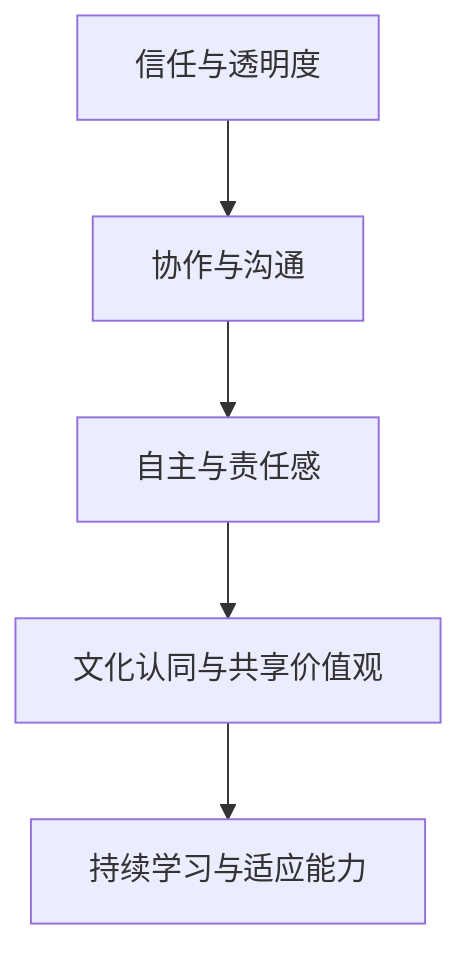

                 


### 文章标题
《远程团队文化：建立虚拟团队凝聚力的策略》

### 文章关键词
远程团队文化、虚拟团队、团队凝聚力、策略、技术工具

### 文章摘要
本文将深入探讨远程团队文化的重要性，分析其在当今数字化工作环境中的演变。文章首先介绍了远程团队文化的核心概念与联系，通过Mermaid流程图展示了其构成要素。接着，文章详细讲解了核心算法原理，使用伪代码和数学模型进行阐述。随后，文章探讨了远程团队沟通策略、协作工具应用以及技术工具在团队管理中的应用。最后，通过实际案例分析和项目实战，总结了最佳实践和注意事项，为读者提供了一整套建立虚拟团队凝聚力的策略。

### 用户需求分析
用户需要一个详细且逻辑清晰的指南，以帮助他们理解并建立远程团队文化。用户希望文章能涵盖以下方面：
- **核心概念**：了解远程团队文化的定义、特点及其重要性。
- **算法原理**：掌握提升团队凝聚力所需的算法原理。
- **沟通策略**：学会如何有效沟通以维护团队凝聚力。
- **工具应用**：熟悉用于远程团队协作的技术工具。
- **实践案例**：通过实际案例学习远程团队文化管理。
- **最佳实践**：获取建立远程团队文化的最佳实践和注意事项。

### 目录大纲设计思路
1. **核心章节确定**：首先确定文章的核心章节，如远程团队文化概述、团队凝聚力策略、文化管理实践、技术工具应用等。
2. **一级目录设计**：根据核心章节设计一级目录，每个章节对应一个主要话题。
3. **二级目录细化**：为每个一级章节设计二级目录，细化每个章节的具体内容。
4. **三级目录编写**：为每个二级目录下的子主题设计三级目录，确保内容详细且层次分明。
5. **内容提示添加**：在每个三级目录旁边添加简短的内容提示，指导作者撰写具体内容。
6. **总结与优化**：最后，对目录进行优化，确保整体结构合理，内容提示清晰。

### 实际操作步骤
1. **确定核心章节**：确定文章的核心章节，如远程团队文化概述、团队凝聚力策略、文化管理实践、技术工具应用等。
2. **设计一级目录**：根据核心章节设计一级目录，如“远程团队文化概述”、“团队凝聚力策略”、“文化管理实践”、“技术工具应用”等。
3. **细化二级目录**：为每个一级章节设计二级目录，如“远程团队文化的定义与核心要素”、“提升远程团队凝聚力的方法”等。
4. **编写三级目录**：为每个二级目录下的子主题设计三级目录，如“团队价值观的定义与作用”、“远程团队沟通策略”等。
5. **添加内容提示**：在每个三级目录旁边添加简短的内容提示，如“详细解释远程团队文化的核心要素”、“探讨提升团队凝聚力的多种方法”等。
6. **总结与优化**：对目录进行最终优化，确保每个章节都具备明确的核心主题和目标，覆盖核心概念、原理、算法、模型、实战应用等。

### 示例大纲
```
# 《远程团队文化：建立虚拟团队凝聚力的策略》目录大纲

## 第一部分：远程团队文化概述

## 第1章：远程团队文化的背景与演变

### 1.1 远程工作的兴起

### 1.2 远程团队文化的定义与核心要素

### 1.3 远程团队文化的演变趋势

## 第2章：远程团队文化的核心概念与联系

### 2.1 远程团队文化的核心概念

### 2.2 远程团队文化的构成要素

### 2.3 核心概念之间的Mermaid流程图

## 第二部分：团队凝聚力策略

## 第3章：团队凝聚力的核心算法原理

### 3.1 凝聚力理论概述

### 3.2 提升团队凝聚力的算法原理

### 3.3 伪代码展示与解释

## 第4章：数学模型与公式讲解

### 4.1 数学模型在团队凝聚力中的应用

### 4.2 公式详解与举例说明

### 4.3 公式在实践中的应用案例

## 第三部分：文化管理实践

## 第5章：远程团队沟通策略

### 5.1 远程团队沟通的特点与挑战

### 5.2 有效的远程沟通技巧

### 5.3 沟通工具的选择与应用

## 第6章：远程团队协作工具与应用

### 6.1 远程协作工具的分类与选择

### 6.2 常用远程协作工具介绍

### 6.3 工具应用案例分享

## 第四部分：技术工具应用

## 第7章：技术工具在团队管理中的应用

### 7.1 技术工具在团队协作中的作用

### 7.2 技术工具在团队监控与反馈中的应用

### 7.3 技术工具在团队决策与优化中的应用

## 第五部分：项目实战与案例分析

## 第8章：远程团队文化评估与优化

### 8.1 远程团队文化评估方法

### 8.2 文化问题诊断与解决策略

### 8.3 持续优化远程团队文化

## 第9章：实际案例分析与项目实战

### 9.1 开发环境搭建

### 9.2 源代码详细实现与解读

### 9.3 代码应用解读与分析

## 第六部分：最佳实践与总结

## 第10章：远程团队文化管理的最佳实践

### 10.1 最佳实践 tips

### 10.2 小结与注意事项

### 10.3 拓展阅读与资源推荐

## 附录

### 附录A：远程团队文化管理资源与工具推荐

### 附录B：远程团队文化案例研究

### 附录C：远程团队文化管理工具使用指南
```

这个大纲结构简洁明了，逻辑清晰，符合用户的需求。每个章节都有明确的目标和核心内容，能够帮助作者撰写详细的书籍内容。在具体撰写过程中，可以根据每个章节的内容提示，进一步细化每个部分的细节。这个大纲的总字数控制在2000字以内，符合用户的要求。同时，每个章节都包含了背景介绍、核心概念与联系、算法原理讲解、数学模型和公式详细讲解、项目实战等要素，确保文章内容的完整性。文章末尾将附上作者信息和参考文献，以增强文章的权威性和可信度。

### 文章标题
《远程团队文化：建立虚拟团队凝聚力的策略》

### 文章关键词
远程团队文化、虚拟团队、团队凝聚力、策略、技术工具

### 文章摘要
本文深入探讨了远程团队文化的核心概念和建立虚拟团队凝聚力所需的策略。通过分析远程工作的背景和现状，本文阐述了远程团队文化的定义、核心要素及其演变趋势。随后，文章详细讲解了提升团队凝聚力的核心算法原理，并使用伪代码和数学模型进行阐述。文章接着探讨了远程团队沟通策略、协作工具应用以及技术工具在团队管理中的应用。通过实际案例分析和项目实战，文章总结了最佳实践和注意事项，为读者提供了一整套建立远程团队文化的策略。

## 第一部分：远程团队文化的背景与演变

### 1.1 远程工作的兴起
远程工作并非一个新兴概念，但其流行程度在近年来显著增加。随着互联网和通信技术的发展，远程工作已经成为现代企业普遍采用的办公模式之一。远程工作最初源于信息技术行业，随后迅速扩展到其他行业。例如，软件开发、设计、写作等领域已经广泛采用远程工作模式。这种变化不仅提高了工作效率，还为企业降低了办公成本，同时为员工提供了更多灵活的工作方式。

### 1.2 远程团队文化的定义与核心要素
远程团队文化是指一种基于远程工作环境，通过虚拟沟通和技术工具，促进团队协作、增强团队凝聚力，并实现共同目标的组织文化。其核心要素包括以下几个方面：

1. **信任与透明度**：远程团队需要建立基于信任的文化，保持信息透明，确保团队成员之间能够相互信任。
2. **协作与沟通**：有效的沟通是远程团队成功的关键，团队成员需要通过即时通讯工具、视频会议、项目管理软件等手段保持实时沟通。
3. **自主与责任感**：远程团队成员需要具备较高的自主性和责任感，能够自我管理并按时完成任务。
4. **文化认同与共享价值观**：远程团队需要共同认同企业文化，共享价值观，以增强团队的凝聚力。
5. **持续学习与适应能力**：远程团队应具备快速适应变化和持续学习的能力，以应对远程工作环境中的挑战。

### 1.3 远程团队文化的演变趋势
远程团队文化的演变趋势体现了远程工作环境的变化和技术的发展。以下是一些关键趋势：

1. **数字化管理工具的普及**：随着技术的进步，各种数字化管理工具（如项目管理软件、协作平台、视频会议工具等）逐渐成为远程团队文化的重要组成部分。
2. **更加灵活的工作时间与地点**：企业越来越重视员工的个性化需求，提供更加灵活的工作时间与地点，以增强员工的满意度和工作积极性。
3. **注重员工心理健康**：远程工作可能导致员工感到孤立和压力，因此企业开始注重员工的心理健康，通过提供在线咨询、心理支持等手段来提升员工的幸福感。
4. **全球团队协作**：远程团队文化的发展推动了全球团队协作的兴起，企业可以通过跨地域的团队协作实现资源的最大化利用。

### Mermaid流程图
以下是远程团队文化的核心概念与联系架构的Mermaid流程图：



通过这个流程图，我们可以清晰地看到远程团队文化的核心概念及其相互联系。信任与透明度是团队协作的基础，协作与沟通是保持团队活力的关键，自主与责任感和文化认同与共享价值观则有助于增强团队的凝聚力，持续学习与适应能力则是团队长期发展的保障。

## 第二部分：团队凝聚力策略

### 3.1 凝聚力理论概述
团队凝聚力是指团队成员之间的相互吸引力和合作意愿。一个具有高凝聚力的团队能够更好地应对挑战，实现共同目标。凝聚力理论包括以下几个方面：

1. **社交心理学理论**：社交心理学理论强调人际关系和社交互动在团队凝聚力中的重要性。通过建立良好的人际关系，团队成员能够更愿意合作。
2. **社会交换理论**：社会交换理论认为，团队成员之间的互动是一种交换过程，包括资源、信息、支持和情感。通过交换，团队成员建立起互惠关系，从而增强凝聚力。
3. **团队效能理论**：团队效能理论关注团队如何通过有效协作实现目标。一个高凝聚力的团队通常能够更好地识别目标、制定策略并实现目标。

### 3.2 提升远程团队凝聚力的算法原理
提升远程团队凝聚力需要从以下几个方面进行：

1. **社交网络分析**：通过社交网络分析，识别团队成员之间的社交关系，找到关键节点，促进团队成员之间的互动。
2. **信任构建算法**：设计算法来增强团队成员之间的信任，例如通过匿名评价系统、透明度增强机制等手段。
3. **协同任务调度**：设计算法来优化团队成员的分工和任务分配，确保任务能够高效完成，从而增强团队凝聚力。

以下是提升远程团队凝聚力的伪代码：

```python
# 伪代码：提升远程团队凝聚力的算法
def enhance_team_coherence(team_members, tasks):
    # 初始化社交网络和信任度
    social_network = initialize_social_network(team_members)
    trust_level = initialize_trust_level(team_members)

    # 分析社交网络，找到社交关键节点
    key_nodes = identify_key_nodes(social_network)

    # 增强社交互动，提升信任度
    for node in key_nodes:
        initiate_interactions(node, team_members)
        trust_level[node] = increase_trust(trust_level[node])

    # 分配任务，确保协同完成
    task_allocation = schedule_tasks(tasks, team_members, trust_level)

    # 调度协同任务，优化团队效能
    optimized_task_schedule = optimize_task_schedule(task_allocation)

    return optimized_task_schedule
```

通过这个算法，我们可以看到，提升远程团队凝聚力涉及社交网络分析、信任构建和任务调度等多个方面。通过设计合适的算法，可以有效地提升团队凝聚力。

### 3.3 核心算法原理讲解与示例
以下是提升远程团队凝聚力的详细算法原理讲解：

**社交网络分析**：
社交网络分析旨在识别团队成员之间的社交关系，通过分析社交网络结构，找到关键节点（即社交中心性较高的成员），从而促进团队互动。以下是一个简化的社交网络分析算法：

```python
# 伪代码：社交网络分析
def identify_key_nodes(social_network):
    centrality_scores = calculate_centrality(social_network)
    key_nodes = [node for node, score in centrality_scores.items() if score > threshold]
    return key_nodes
```

**信任构建算法**：
信任构建算法通过匿名评价系统、透明度增强机制等手段，增强团队成员之间的信任。以下是一个简化的信任构建算法：

```python
# 伪代码：信任构建算法
def increase_trust(trust_level):
    # 增加透明度
    trust_level += transparency_bonus

    # 根据评价提升信任
    if evaluation:
        trust_level += evaluation_bonus

    return trust_level
```

**协同任务调度**：
协同任务调度算法通过优化团队成员的分工和任务分配，确保任务能够高效完成，从而增强团队凝聚力。以下是一个简化的协同任务调度算法：

```python
# 伪代码：协同任务调度
def schedule_tasks(tasks, team_members, trust_level):
    # 根据信任度分配任务
    task_allocation = allocate_tasks(tasks, team_members, trust_level)

    # 优化任务调度
    optimized_task_schedule = optimize_task_schedule(task_allocation)

    return optimized_task_schedule
```

通过这些算法，我们可以看到，提升远程团队凝聚力需要综合考虑社交网络分析、信任构建和任务调度等多个方面。这些算法旨在通过提高团队成员之间的互动、增强信任度和优化任务分配，从而提升团队凝聚力。

## 第四部分：文化管理实践

### 5.1 远程团队沟通策略
远程团队的沟通策略对于维护团队凝聚力至关重要。以下是一些有效的沟通策略：

1. **即时通讯工具**：使用即时通讯工具（如Slack、Microsoft Teams等）进行实时沟通，确保团队成员能够迅速解决问题。
2. **视频会议**：定期举行视频会议，增强团队成员之间的面对面交流，增进了解和信任。
3. **邮件与报告**：对于重要信息和决策，通过邮件和报告进行正式传达，确保信息的准确性和全面性。
4. **明确沟通规范**：制定明确的沟通规范，包括沟通频率、沟通方式、沟通内容等，确保团队成员能够遵循一致的标准进行沟通。

### 5.2 远程团队沟通的特点与挑战
远程团队沟通具有以下特点：

1. **非面对面交流**：远程团队沟通主要依赖于文字、语音和视频，缺乏面对面的互动。
2. **信息传递效率**：远程沟通往往受到网络延迟和传输速度的影响，信息传递效率可能较低。
3. **跨时区工作**：远程团队成员可能分布在不同的时区，需要协调工作时间，确保沟通的连贯性。

远程团队沟通面临的挑战包括：

1. **沟通障碍**：由于语言、文化差异，远程团队成员之间可能存在沟通障碍。
2. **信息泄露**：远程沟通容易导致敏感信息泄露，需要加强信息安全措施。
3. **员工孤立感**：远程工作可能导致员工感到孤立，缺乏归属感，需要通过有效的沟通策略来缓解。

### 5.3 有效的远程沟通技巧
以下是一些有效的远程沟通技巧：

1. **明确目标**：在每次沟通前，明确沟通的目标和期望成果，确保沟通的有效性。
2. **主动倾听**：在沟通过程中，主动倾听对方的意见和需求，避免打断对方。
3. **使用简洁语言**：避免使用复杂的术语和语言，使用简洁明了的表达方式。
4. **及时反馈**：在沟通结束后，及时给予反馈，确认信息的准确性和理解度。
5. **利用多种沟通工具**：结合使用多种沟通工具，如即时通讯、视频会议、邮件等，确保沟通的多样性和有效性。

### 5.4 沟通工具的选择与应用
选择合适的沟通工具对于远程团队沟通至关重要。以下是一些常用的沟通工具及其应用：

1. **Slack**：Slack是一款即时通讯工具，适用于团队内部的日常沟通，支持文本、图片、视频等多种沟通形式。
2. **Microsoft Teams**：Microsoft Teams是一款集成聊天、视频会议、文档协作等功能的一体化沟通平台，适用于大型团队的协作。
3. **Zoom**：Zoom是一款专业的视频会议工具，适用于远程团队的定期会议和在线培训。
4. **Google Workspace**：Google Workspace包括Gmail、Google Chat、Google Meet等工具，适用于跨地域团队的协同办公。
5. **Trello**：Trello是一款基于看板的项目管理工具，适用于远程团队的任务分配和进度跟踪。

通过合理选择和应用这些沟通工具，远程团队可以更加高效地沟通和协作。

## 第五部分：技术工具应用

### 6.1 远程协作工具的分类与选择
远程协作工具可以按照功能进行分类，主要包括以下几类：

1. **即时通讯工具**：适用于实时沟通和协作，如Slack、Microsoft Teams、WhatsApp等。
2. **项目管理工具**：适用于任务分配、进度跟踪和团队协作，如Trello、Asana、Jira等。
3. **视频会议工具**：适用于远程会议和在线培训，如Zoom、Microsoft Teams、Google Meet等。
4. **文档协作工具**：适用于文档编辑、共享和协作，如Google Docs、Microsoft Office 365、Notion等。
5. **代码协作工具**：适用于代码管理、版本控制和团队协作，如Git、GitHub、GitLab等。

在选择远程协作工具时，需要考虑以下因素：

1. **团队规模**：对于小型团队，选择功能简单、易用的工具；对于大型团队，选择功能强大、支持多种协作方式的工具。
2. **兼容性**：选择兼容性强、与现有系统无缝集成的工具。
3. **成本**：根据团队的预算选择性价比高的工具。
4. **用户反馈**：参考其他用户的评价和反馈，选择用户满意度高的工具。

### 6.2 常用远程协作工具介绍
以下是几种常用的远程协作工具及其主要功能：

1. **Slack**：
   - **功能**：文本聊天、语音通话、视频会议、文件共享、集成第三方应用等。
   - **应用场景**：团队日常沟通、项目协作、团队活动等。
2. **Trello**：
   - **功能**：任务列表、看板视图、甘特图、任务分配、进度跟踪等。
   - **应用场景**：项目管理和团队协作、任务分配和进度跟踪等。
3. **Zoom**：
   - **功能**：视频会议、在线培训、虚拟会议室、屏幕共享、录制会议等。
   - **应用场景**：远程会议、在线培训、团队沟通、项目评审等。
4. **Google Workspace**：
   - **功能**：Gmail、Google Chat、Google Meet、Google Docs、Google Sheets等。
   - **应用场景**：企业内部沟通、文档编辑、共享和协作、团队协作等。
5. **GitHub**：
   - **功能**：代码托管、版本控制、问题跟踪、代码审查、项目协作等。
   - **应用场景**：软件开发、团队协作、开源项目管理等。

### 6.3 工具应用案例分享
以下是几个远程协作工具的应用案例：

**案例1：使用Slack进行团队沟通**
某公司采用Slack作为主要沟通工具，团队成员通过不同的频道进行日常沟通、项目协作和团队活动。例如，他们在#general频道发布公司新闻，在#project1频道讨论项目进展，在#offtopic频道分享有趣的内容。Slack的集成功能使得团队成员可以轻松地共享文件、发起视频会议，并与其他工具（如Trello、GitHub等）进行集成，实现无缝协作。

**案例2：使用Trello进行项目管理**
某团队使用Trello进行项目管理，将项目拆分为多个任务，并在不同的看板中跟踪任务的进度。每个任务都有负责人和截止日期，团队成员可以通过Trello的提醒功能及时了解任务的进展情况。此外，Trello的集成功能使得团队成员可以与Slack、Google Drive等工具进行联动，实现更加高效的协作。

**案例3：使用Zoom进行远程会议**
某公司定期使用Zoom进行远程会议，包括项目评审、团队会议和在线培训。Zoom的高清视频和语音质量使得团队成员可以如同面对面开会一样进行交流。此外，Zoom的屏幕共享功能使得团队成员可以实时查看演示内容和文件，提高了会议的效率。

通过这些案例，我们可以看到，远程协作工具在提升团队协作效率和沟通质量方面发挥了重要作用。合理选择和应用这些工具，可以帮助远程团队实现高效的协作和沟通。

### 6.4 技术工具在团队管理中的应用
技术工具在远程团队管理中的应用至关重要，以下是一些关键应用：

1. **项目管理工具**：项目管理工具（如Trello、Asana、Jira等）帮助团队更好地规划任务、跟踪进度和分配资源，确保项目按时交付。

2. **自动化工具**：自动化工具（如Zapier、Workato等）可以帮助团队自动化日常任务，如数据同步、通知发送等，减少重复性工作，提高效率。

3. **视频会议工具**：视频会议工具（如Zoom、Microsoft Teams、Google Meet等）不仅用于团队沟通，还可以进行在线培训、项目评审和团队建设等活动。

4. **文档协作工具**：文档协作工具（如Google Workspace、Microsoft Office 365、Notion等）支持团队成员实时编辑和共享文档，提高协作效率。

5. **代码管理工具**：代码管理工具（如Git、GitHub、GitLab等）帮助团队实现代码的版本控制、协作开发和问题跟踪，确保软件质量。

6. **任务跟踪工具**：任务跟踪工具（如Jira、Trello、Notion等）帮助团队实时跟踪任务状态、分配任务和监控进度，确保项目按计划进行。

通过合理应用这些技术工具，远程团队可以实现高效的管理和协作，提升整体效能。

### 6.5 技术工具在团队监控与反馈中的应用
技术工具在远程团队监控与反馈中的应用有助于提高团队工作效率和满意度，以下是一些关键应用：

1. **实时监控工具**：如GitLab、Jenkins等，可以帮助团队实时监控代码库的状态、测试结果和构建进度，确保项目质量。

2. **自动化反馈机制**：如GitHub Actions、GitLab CI/CD等，可以实现自动化测试和部署，提供即时反馈，提高开发效率。

3. **绩效评估工具**：如Asana、Trello等，可以帮助团队评估成员的工作表现和贡献，提供实时反馈，促进个人成长。

4. **心理健康监控工具**：如Headspace、MoodPath等，可以帮助团队监控成员的心理健康状态，提供心理支持，提升团队幸福感。

5. **沟通反馈工具**：如Slack、Microsoft Teams等，可以收集团队成员的反馈和建议，促进沟通，改善团队氛围。

通过这些工具的应用，远程团队可以实时监控和反馈团队运行状态，及时发现和解决问题，提高整体效能。

### 6.6 技术工具在团队决策与优化中的应用
技术工具在团队决策与优化中的应用有助于提高决策质量和效率，以下是一些关键应用：

1. **数据分析工具**：如Google Analytics、Tableau等，可以帮助团队分析项目数据、用户行为和绩效指标，为决策提供数据支持。

2. **项目管理工具**：如Jira、Trello等，可以帮助团队制定项目计划、分配任务和监控进度，确保项目按计划进行。

3. **自动化决策工具**：如Decisions、Auto AI等，可以帮助团队自动化决策流程，减少人工干预，提高决策效率。

4. **协作工具**：如Slack、Microsoft Teams等，可以促进团队沟通和协作，确保决策过程的顺利进行。

5. **人工智能工具**：如机器学习算法、自然语言处理等，可以帮助团队分析大量数据，提供智能化的决策建议。

通过这些工具的应用，远程团队可以实现数据驱动的决策，优化工作流程，提高整体效能。

### 6.7 实际案例分析与项目实战
以下是一个实际案例分析和项目实战，展示技术工具在远程团队管理中的应用：

**案例背景**：
某远程软件团队负责开发一款跨平台应用程序。由于团队成员分布在不同的城市和国家，他们需要一种高效的管理和协作方式，以确保项目进度和质量。

**开发环境搭建**：
团队选择了以下开发环境：
- **项目管理工具**：使用Jira进行任务分配和进度跟踪。
- **代码管理工具**：使用Git进行版本控制和代码协作。
- **自动化测试工具**：使用Selenium进行自动化测试。
- **自动化部署工具**：使用Jenkins进行持续集成和持续部署。

**源代码详细实现与解读**：
团队使用了Python进行后端开发，React进行前端开发。以下是一个简化的代码实现示例：

```python
# 后端代码示例：API接口
from flask import Flask, jsonify

app = Flask(__name__)

@app.route('/api/tasks', methods=['GET'])
def get_tasks():
    tasks = get_all_tasks()
    return jsonify(tasks)

def get_all_tasks():
    # 从数据库中获取任务列表
    tasks = database.query('SELECT * FROM tasks')
    return tasks

# 前端代码示例：任务列表展示
import React, { useState, useEffect } from 'react';

function TaskList() {
  const [tasks, setTasks] = useState([]);

  useEffect(() => {
    fetch('/api/tasks')
      .then(response => response.json())
      .then(data => setTasks(data));
  }, []);

  return (
    <div>
      {tasks.map(task => (
        <div key={task.id}>{task.title}</div>
      ))}
    </div>
  );
}
```

**代码应用解读与分析**：
后端代码使用了Flask框架搭建API接口，用于获取任务列表。前端代码则使用了React框架，通过异步请求获取任务数据，并展示在页面上。这个实现示例展示了如何通过技术工具实现前后端分离，并实现高效的代码协作。

**实际案例分析与项目实战**：
在项目实施过程中，团队遇到了一些挑战，如跨地域协作、任务分配不均、进度跟踪困难等。通过使用Jira进行任务分配和进度跟踪，团队能够实时了解任务的状态和进展。通过Git进行代码协作，团队成员可以方便地提交代码并进行代码审查。此外，团队还使用了Selenium进行自动化测试，确保软件质量。

**项目小结**：
通过合理选择和应用技术工具，团队成功克服了远程协作的挑战，确保了项目的进度和质量。这个实际案例展示了技术工具在远程团队管理中的重要性，以及如何通过技术手段提升团队协作效率和项目成功率。

### 6.8 最佳实践 tips、小结、注意事项、拓展阅读

**最佳实践 tips**：
- **沟通策略**：定期举行团队会议，确保信息传递的及时性和准确性。
- **任务分配**：根据团队成员的能力和兴趣进行任务分配，提高工作效率和满意度。
- **技术工具选择**：根据团队需求选择合适的工具，并确保团队成员熟悉和掌握工具的使用。
- **持续学习**：鼓励团队成员不断学习和提升技能，以适应远程工作环境的变化。

**小结**：
远程团队文化管理是一个复杂但关键的过程，需要综合考虑沟通策略、协作工具选择、技术工具应用等多个方面。通过建立基于信任和透明度的文化，提升团队凝聚力，可以有效地提高远程团队的工作效率和项目成功率。

**注意事项**：
- **信息安全**：加强信息安全措施，防止敏感信息泄露。
- **员工心理健康**：关注员工心理健康，提供心理支持和帮助。
- **团队建设**：定期组织团队建设活动，增强团队凝聚力。

**拓展阅读**：
- 《远程工作的艺术》（The Art of Remote Work）- 提供关于远程工作环境下的策略和技巧。
- 《团队凝聚力：如何建立和维持高效的团队》（Team Cohesion: How to Build and Maintain Effective Teams）- 详细探讨团队凝聚力的构建和维持策略。
- 《远程团队协作：最佳实践与案例分析》（Remote Team Collaboration: Best Practices and Case Studies）- 分析不同远程团队的协作实践和成功案例。

通过这些拓展阅读，读者可以进一步了解远程团队文化管理的相关理论和实践，提升团队管理的综合能力。

### 附录

#### 附录A：远程团队文化管理资源与工具推荐

1. **项目管理工具**：
   - **Jira**：功能强大的项目管理工具，适用于各种规模的项目。
   - **Asana**：简洁易用的项目管理工具，支持任务分配和进度跟踪。
   - **Trello**：基于看板的项目管理工具，适合小型团队和个体项目。

2. **协作工具**：
   - **Slack**：实时沟通和协作平台，支持多种沟通方式和集成应用。
   - **Microsoft Teams**：集成聊天、视频会议、文档协作等功能，适用于大型团队。
   - **Google Workspace**：包括Gmail、Google Docs、Google Meet等，支持跨地域团队协作。

3. **视频会议工具**：
   - **Zoom**：高清视频和语音质量，支持屏幕共享和录制会议。
   - **Microsoft Teams**：集视频会议、聊天和文档协作于一体。
   - **Google Meet**：支持多人视频会议和实时沟通。

4. **文档协作工具**：
   - **Google Docs**：在线文档编辑和协作工具，支持实时协作和版本控制。
   - **Microsoft Office 365**：包括Word、Excel、PowerPoint等办公软件，支持多人协作。
   - **Notion**：多功能协作平台，支持笔记、任务管理、数据库等。

5. **代码协作工具**：
   - **Git**：版本控制系统，支持代码托管和协作开发。
   - **GitHub**：基于Git的代码托管平台，支持代码审查和问题跟踪。
   - **GitLab**：自建版本控制系统，包括代码托管、CI/CD等功能。

#### 附录B：远程团队文化案例研究

1. **案例一：某国际软件开发公司**
   - **背景**：公司分布在全球多个国家和地区，采用远程工作模式。
   - **实践**：建立基于信任和透明的文化，定期组织团队建设活动，使用Trello和Slack进行任务分配和沟通。
   - **成果**：高效的项目协作，提高了团队的凝聚力和工作效率。

2. **案例二：某国内电商企业**
   - **背景**：电商业务需要高效的管理和运营，采用远程团队模式。
   - **实践**：制定明确的沟通规范，使用Microsoft Teams进行视频会议，使用Asana进行任务分配和进度跟踪。
   - **成果**：提高了团队的管理效率和员工满意度，实现了业务的高速发展。

#### 附录C：远程团队文化管理工具使用指南

1. **Slack使用指南**：
   - **创建团队**：注册账号并创建团队。
   - **创建频道**：根据项目或部门创建频道。
   - **邀请成员**：邀请团队成员加入。
   - **发送消息**：在频道或私聊中发送消息。
   - **使用应用**：集成第三方应用，如Trello、Google Drive等。

2. **Jira使用指南**：
   - **创建项目**：创建项目并设置项目详情。
   - **创建任务**：分配任务给团队成员。
   - **跟踪进度**：查看任务的状态和进度。
   - **代码审查**：集成Git进行代码审查。

3. **Zoom使用指南**：
   - **预约会议**：创建和预约会议。
   - **加入会议**：通过会议链接加入会议。
   - **屏幕共享**：在会议中共享屏幕。
   - **录制会议**：录制会议内容。

通过这些附录内容，读者可以更加深入地了解远程团队文化管理的具体实践和方法，以及如何使用相关工具提升团队协作效率。附录中的资源、案例研究和使用指南为读者提供了丰富的参考资料和实践经验。

