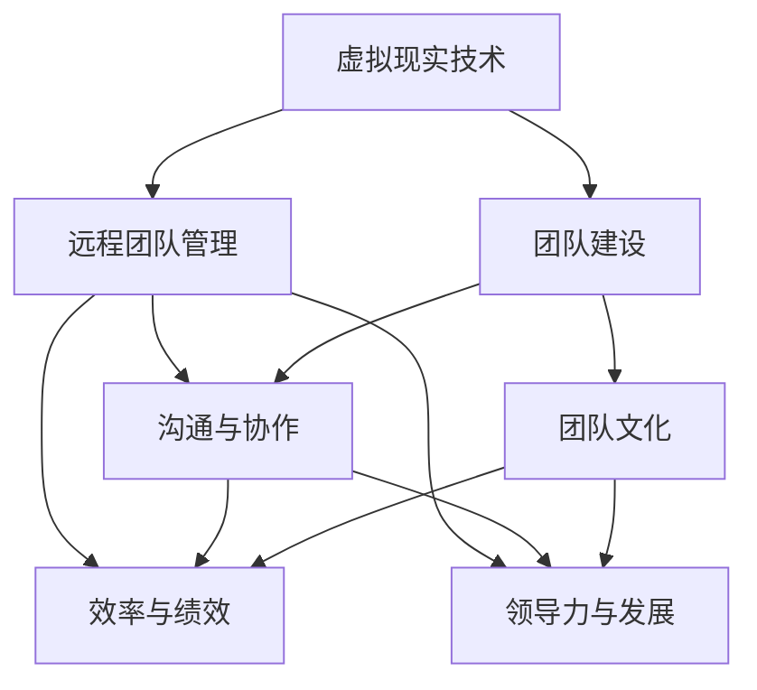
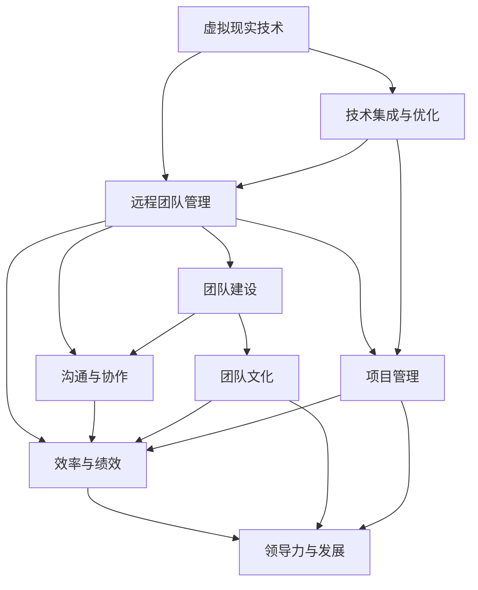

                 

### 文章标题

《远程团队管理2.0：虚拟现实中的团队建设》

### 关键词

远程团队管理、虚拟现实、团队建设、沟通、协作、效率提升

### 摘要

本文旨在探讨远程团队管理2.0的时代背景下，虚拟现实技术如何赋能团队建设。随着全球化和数字化的发展，远程团队管理面临着诸多挑战和机遇。本文首先回顾了远程团队管理的发展历程，分析了其在面对虚拟现实技术时的优势与挑战。接着，本文详细阐述了远程团队的核心理念，如信任与沟通、跨文化沟通与冲突管理、协作与效率提升等。在此基础上，本文重点介绍了虚拟现实技术在远程团队管理中的应用，包括基本原理、工具选用与集成、以及远程会议和虚拟培训的应用。随后，本文探讨了虚拟现实环境中的团队建设，从角色与职责、互动与协作、领导力发展三个方面进行了详细阐述。最后，本文通过实践指南和实战案例，提供了构建高效远程团队和虚拟现实在团队管理中的创新应用，并展望了远程团队管理2.0的未来发展趋势。希望通过本文的探讨，能为读者提供关于远程团队管理和虚拟现实技术结合的实用启示和思考。

---

## 第一部分：远程团队管理2.0概述

### 第1章：远程团队管理的发展历程

在信息技术迅速发展的今天，远程团队管理已成为现代企业管理和组织运营的重要组成部分。从传统的集中式办公到远程办公，再到当前的远程团队管理2.0，这一演变过程反映了企业管理理念和技术手段的不断革新。

#### 1.1 远程团队管理的发展历程

**1.1.1 传统远程团队管理**

最早的远程团队管理可以追溯到上世纪90年代，互联网的兴起使得远程办公成为可能。在这一阶段，远程团队管理主要依赖于电子邮件、即时通讯和电话等工具。这种方式虽然实现了信息的传递，但在沟通效率、协作效果和团队凝聚力方面仍存在诸多不足。

**1.1.2 数字化远程团队管理**

随着信息技术的不断发展，特别是云计算、大数据和移动技术的普及，远程团队管理进入了一个新的阶段。这一阶段的远程团队管理不仅依赖于传统的通讯工具，还引入了项目管理软件、协同办公平台和远程协作工具等。这些工具极大地提高了团队的工作效率，降低了沟通成本，增强了团队凝聚力。

**1.1.3 远程团队管理2.0**

远程团队管理2.0是当前正在兴起的一种管理模式，它不仅依赖于信息技术，更强调人性化和智能化。这一管理模式的核心是通过虚拟现实（VR）和增强现实（AR）等新兴技术，为远程团队创造一个更加真实、互动和高效的协作环境。

#### 1.2 远程团队管理的挑战与机遇

**1.2.1 挑战**

尽管远程团队管理具有诸多优势，但同时也面临着一些挑战：

- **沟通障碍**：远程团队缺乏面对面的沟通，容易产生误解和冲突。
- **信任问题**：团队成员之间缺乏直接的互动和交流，信任度难以建立。
- **时区差异**：不同地区的时区差异可能导致协作效率低下。
- **技术依赖**：远程团队管理高度依赖于信息技术，技术故障可能影响团队工作。

**1.2.2 机遇**

远程团队管理也带来了许多机遇：

- **全球化扩展**：远程团队管理使得企业可以轻松拓展到全球市场，利用全球人才。
- **降低运营成本**：远程办公减少了企业对办公场所和设备的依赖，降低了运营成本。
- **提高员工满意度**：远程工作提供了灵活的工作方式，提高了员工的工作满意度。
- **技术创新**：远程团队管理推动了信息技术和虚拟现实等新兴技术的发展和应用。

#### 1.3 虚拟现实对远程团队管理的影响

**1.3.1 技术优势**

虚拟现实技术为远程团队管理带来了显著的技术优势：

- **增强沉浸感**：虚拟现实可以创建一个沉浸式的环境，使团队成员感到身临其境，提高了沟通和协作的效果。
- **提升互动性**：虚拟现实技术提供了更加丰富的互动方式，如虚拟会议、虚拟培训和虚拟社交活动等，增强了团队之间的互动性。
- **优化资源利用**：虚拟现实技术可以模拟实际场景，如远程会议、培训和工作场景，降低了实际资源的消耗。

**1.3.2 应用前景**

随着虚拟现实技术的不断成熟和应用领域的拓展，其在远程团队管理中的前景十分广阔：

- **远程会议**：虚拟现实技术可以实现真实的远程会议体验，提高会议的参与度和效果。
- **虚拟培训**：虚拟现实技术可以提供沉浸式的培训体验，提高培训的效果和员工的学习兴趣。
- **团队建设**：虚拟现实技术可以创造虚拟的团队建设活动，增强团队凝聚力和协作精神。

### 总结

远程团队管理2.0是当前远程团队管理的一个新兴阶段，它通过引入虚拟现实技术，为团队协作提供了一个更加真实、互动和高效的平台。面对远程团队管理面临的挑战和机遇，企业应积极拥抱虚拟现实技术，探索其应用潜力，以实现团队管理效率的提升和团队的持续发展。

---

## 核心概念与联系

在远程团队管理2.0中，几个核心概念紧密相连，共同构成了一个完整的体系。这些核心概念包括虚拟现实技术、远程团队管理、团队建设、沟通与协作等。下面将使用Mermaid流程图来展示这些概念之间的联系。



### 概念解释与关系架构

1. **虚拟现实技术（A）**：虚拟现实技术是一种通过计算机生成模拟环境，让用户能够在其中与虚拟环境中的实体进行交互的技术。它是远程团队管理2.0的基础，为远程团队提供了沉浸式的协作和沟通体验。

2. **远程团队管理（B）**：远程团队管理是指通过信息技术手段，对分散在不同地点的团队成员进行组织、协调和监督的一种管理模式。它涵盖了团队构建、沟通与协作、效率与绩效等多个方面。

3. **团队建设（C）**：团队建设是指通过一系列措施，增强团队成员之间的相互理解、信任和协作，从而提高团队整体效能的过程。虚拟现实技术为团队建设提供了新的手段，如虚拟会议、虚拟培训和虚拟社交活动等。

4. **沟通与协作（D）**：沟通与协作是远程团队管理的关键环节。良好的沟通可以减少误解和冲突，提高团队工作效率。协作工具和平台的使用，如虚拟现实会议系统，可以提升团队的协作能力。

5. **团队文化（E）**：团队文化是团队在长期发展中形成的共同价值观、信念和行为规范。虚拟现实技术可以帮助团队在虚拟环境中构建和维护其独特的文化。

6. **效率与绩效（F）**：效率与绩效是远程团队管理的核心目标。通过优化沟通和协作流程，提高团队工作效率，实现团队的绩效目标。

7. **领导力与发展（G）**：领导力与发展是远程团队管理的重要组成部分。领导者的作用不仅是指导和激励团队成员，还包括培养团队的能力和发展潜力。

### 关系架构

这些核心概念通过以下关系相互联系：

- **虚拟现实技术（A）** 与 **远程团队管理（B）**：虚拟现实技术为远程团队管理提供了技术支持，提升了团队协作和沟通的效率。
- **团队建设（C）** 与 **沟通与协作（D）**：团队建设活动如虚拟培训和社交活动，通过增强团队成员之间的沟通与协作，促进团队文化的形成。
- **团队文化（E）** 与 **效率与绩效（F）**：健康的团队文化可以提高团队的效率和绩效，从而实现团队的目标。
- **领导力与发展（G）** 与 **团队建设（C）**、**沟通与协作（D）**：领导者通过指导和激励团队成员，推动团队建设，提升沟通与协作能力，进而提高团队效率和绩效。

通过上述关系架构，我们可以看到，虚拟现实技术作为远程团队管理2.0的核心，与团队建设、沟通与协作、团队文化、效率与绩效、领导力与发展等概念紧密相连，共同构成了一个完整的远程团队管理体系。

### 背景介绍

远程团队管理2.0是现代企业管理中一个重要的趋势，它基于虚拟现实（VR）和增强现实（AR）等新兴技术，为分散在不同地理位置的团队成员提供了一种更加高效、互动和沉浸式的协作方式。传统的远程团队管理主要依赖于电子邮件、即时通讯、电话会议等工具，虽然在一定程度上提高了沟通效率，但在面对复杂的团队协作和项目执行时，仍然存在诸多挑战。随着全球化和数字化的发展，企业对于远程团队管理的要求越来越高，尤其是在疫情背景下，远程办公已经成为许多企业的常态。因此，如何通过技术手段提升远程团队的管理效率，成为企业管理者亟需解决的问题。

#### 虚拟现实技术在远程团队管理中的应用

虚拟现实技术在远程团队管理中的应用，主要体现在以下几个方面：

1. **虚拟会议**：通过虚拟现实技术，远程会议可以模拟现实中的会议室环境，使参与者感受到如同面对面的交流体验。这种沉浸式的会议方式不仅提高了会议的参与度，还减少了因时区差异造成的沟通障碍。

2. **虚拟培训**：虚拟现实技术可以为远程团队提供逼真的培训场景，使员工在虚拟环境中学习新技能或掌握新知识。这种培训方式不仅提高了学习效果，还节省了传统培训所需的场地和交通成本。

3. **虚拟社交活动**：虚拟现实技术还可以用于组织虚拟社交活动，如团队聚餐、体育竞赛等，增强团队成员之间的互动和凝聚力。这些活动有助于缓解因远程工作带来的社交隔离感。

#### 远程团队管理2.0的核心目标

远程团队管理2.0的核心目标是提升团队协作效率，增强团队凝聚力，实现团队目标的最优化。具体来说，包括以下几个方面：

1. **提升协作效率**：通过虚拟现实技术，团队成员可以更加便捷地进行项目协作，实时共享信息和资源，减少因地理位置和时区差异造成的沟通障碍。

2. **增强团队凝聚力**：虚拟现实技术可以创造一个沉浸式的协作环境，使团队成员在虚拟空间中感受到彼此的存在，增强团队凝聚力。

3. **优化管理流程**：远程团队管理2.0强调数据驱动和智能化的管理方式，通过大数据分析和人工智能技术，优化管理流程，提高团队决策的准确性和效率。

4. **实现目标最优化**：远程团队管理2.0通过高效协作和精准管理，帮助团队实现项目目标的最优化，提高企业的整体竞争力。

### 未来发展趋势

随着虚拟现实技术的不断成熟和应用领域的拓展，远程团队管理2.0有望在未来实现以下发展趋势：

1. **更广泛的应用场景**：虚拟现实技术将在更多领域得到应用，如远程设计、远程医疗、远程教育等，进一步丰富远程团队管理的手段。

2. **更高的互动性**：随着技术的进步，虚拟现实中的互动性将得到显著提升，团队成员可以更加自然地交流和协作。

3. **智能化管理**：人工智能技术将与虚拟现实技术结合，实现远程团队管理的智能化，提高管理效率和决策准确性。

4. **个性化定制**：根据不同团队和项目的需求，远程团队管理2.0将提供更加个性化的解决方案，满足不同团队的特殊需求。

总之，远程团队管理2.0是一种以虚拟现实技术为核心，旨在提升团队协作效率、增强团队凝聚力的新型管理模式。随着技术的不断进步，它将在未来为企业带来更多的机遇和挑战。

### 核心概念与联系

在远程团队管理2.0的体系中，有几个核心概念相互作用，共同支撑起整个团队管理的框架。这些概念包括虚拟现实技术、远程团队管理、团队建设、沟通与协作等。以下是这些核心概念之间的关系架构，使用Mermaid流程图来展示：



### 概念解释与关系架构

1. **虚拟现实技术（A）**：虚拟现实技术是一种通过计算机生成的模拟环境，用户可以在其中进行沉浸式体验和交互。虚拟现实技术为远程团队管理提供了全新的协作方式，使团队成员能够如同面对面一样进行沟通和合作。

2. **远程团队管理（B）**：远程团队管理是指通过信息技术手段，对分散在不同地理位置的团队成员进行组织、协调和监督的一种管理模式。远程团队管理涵盖了团队构建、沟通与协作、效率与绩效等多个方面。

3. **团队建设（C）**：团队建设是指通过一系列措施，增强团队成员之间的相互理解、信任和协作，从而提高团队整体效能的过程。团队建设活动如虚拟培训和社交活动，有助于构建团队文化，提升团队凝聚力。

4. **沟通与协作（D）**：沟通与协作是远程团队管理的核心环节。有效的沟通可以减少误解和冲突，提高团队工作效率。协作工具和平台的使用，如虚拟现实会议系统，可以提升团队的协作能力。

5. **效率与绩效（E）**：效率与绩效是远程团队管理的核心目标。通过优化沟通和协作流程，提高团队工作效率，实现团队的绩效目标。高效的团队管理有助于提升企业的整体竞争力。

6. **团队文化（F）**：团队文化是团队在长期发展中形成的共同价值观、信念和行为规范。健康的团队文化可以提高团队的效率和绩效，从而实现团队的目标。

7. **领导力与发展（G）**：领导力与发展是远程团队管理的重要组成部分。领导者的作用不仅是指导和激励团队成员，还包括培养团队的能力和发展潜力。

8. **项目管理（H）**：项目管理是指通过计划、组织、协调和控制，确保项目目标的实现。项目管理与远程团队管理密切相关，通过高效的项目管理，可以提高团队的协作效率和项目成功率。

9. **技术集成与优化（I）**：技术集成与优化是指将多种技术手段集成到远程团队管理中，以实现最佳的管理效果。技术集成与优化可以提升远程团队管理的效率和智能化水平。

### 关系架构

这些核心概念通过以下关系相互联系：

- **虚拟现实技术（A）** 与 **远程团队管理（B）**：虚拟现实技术为远程团队管理提供了技术支持，提升了团队协作和沟通的效率。
- **团队建设（C）** 与 **沟通与协作（D）**：团队建设活动如虚拟培训和社交活动，通过增强团队成员之间的沟通与协作，促进团队文化的形成。
- **团队文化（F）** 与 **效率与绩效（E）**：健康的团队文化可以提高团队的效率和绩效，从而实现团队的目标。
- **领导力与发展（G）** 与 **团队建设（C）**、**沟通与协作（D）**：领导者通过指导和激励团队成员，推动团队建设，提升沟通与协作能力，进而提高团队效率和绩效。
- **项目管理（H）** 与 **效率与绩效（E）**：通过高效的项目管理，可以提高团队的协作效率和项目成功率。
- **技术集成与优化（I）** 与 **远程团队管理（B）**、**项目管理（H）**：技术集成与优化可以提升远程团队管理的效率和智能化水平，为团队管理提供有力支持。

通过上述关系架构，我们可以看到，远程团队管理2.0是一个复杂的系统，各个核心概念相互关联、相互支持，共同构成了一个高效、互动和智能化的团队管理框架。

### 核心算法原理讲解

在远程团队管理2.0中，核心算法的原理和实现对于提升团队协作效率和沟通质量至关重要。以下将详细讲解几个关键算法原理，包括虚拟现实会议算法、协作效率优化算法和团队行为分析算法，并使用伪代码来展示这些算法的实现。

#### 1. 虚拟现实会议算法

虚拟现实会议算法旨在为远程团队成员提供一个沉浸式的会议体验，使参与者能够如同在现实中一样进行交流和互动。该算法的核心在于实时视频处理、声音处理和虚拟环境生成。

**算法原理：**
- **实时视频处理**：使用视频编码和解码技术，确保会议中的视频流在低延迟、高清晰度的条件下传输。
- **声音处理**：采用声音识别和语音增强技术，消除噪音，提高语音清晰度。
- **虚拟环境生成**：通过计算机图形学技术，生成一个三维的虚拟会议室环境，使参与者能够自由移动和互动。

**伪代码：**

```plaintext
function virtualMeetingAlgorithm(videoStream, audioStream, VREnvironment):
    videoDecoder = decodeVideo(videoStream)
    audioDecoder = decodeAudio(audioStream)
    VRGenerator = generateVREnvironment()

    while meeting in progress:
        videoFrame = videoDecoder.getFrame()
        audioSample = audioDecoder.getSample()
        VRGenerator.updateEnvironment(videoFrame, audioSample)
        VRGenerator.renderFrame()

    return VRGenerator.getFinalRender()
```

#### 2. 协作效率优化算法

协作效率优化算法旨在通过分析团队成员的协作行为和沟通模式，优化团队的工作流程和资源配置，提高整体协作效率。

**算法原理：**
- **行为分析**：使用自然语言处理技术，分析团队成员在沟通工具上的行为，如消息发送频率、回复速度等。
- **模式识别**：通过机器学习算法，识别出高效的协作模式和低效的协作行为。
- **资源优化**：根据分析结果，调整团队成员的任务分配和工作时间，优化团队资源利用。

**伪代码：**

```plaintext
function collaborationEfficiencyOptimization(collaborationData):
    behaviorPatterns = analyzeBehavior(collaborationData)
    efficientPatterns = identifyEfficientPatterns(behaviorPatterns)
    inefficientPatterns = identifyInefficientPatterns(behaviorPatterns)

    optimizedTaskAllocation = allocateTasksBasedOnPatterns(efficientPatterns)
    optimized工作时间表 = scheduleWorkloadBasedOnPatterns(optimizedTaskAllocation)

    return optimized工作时间表
```

#### 3. 团队行为分析算法

团队行为分析算法旨在通过分析团队在虚拟环境中的互动行为，了解团队成员的沟通风格、协作模式和团队整体健康状况。

**算法原理：**
- **互动分析**：使用社交网络分析技术，分析团队成员之间的互动关系，如消息发送、评论、点赞等。
- **风格识别**：通过情感分析技术，识别团队成员的沟通风格，如积极、消极、中立等。
- **健康评估**：根据互动分析和风格识别结果，评估团队的整体健康状况，如凝聚力、士气等。

**伪代码：**

```plaintext
function teamBehaviorAnalysis(communicationData):
    interactionNetwork = buildInteractionNetwork(communicationData)
    communicationStyles = identifyCommunicationStyles(communicationData)
    teamHealth = assessTeamHealth(interactionNetwork, communicationStyles)

    return teamHealth
```

#### 数学模型和公式

在上述算法中，一些关键步骤需要使用数学模型和公式进行计算和优化。以下是几个常用的数学模型和公式：

1. **协作效率公式**：

\[ 效率 = \frac{完成的工作量}{耗费的时间} \]

2. **互动关系强度公式**：

\[ 互动关系强度 = \frac{互动频率}{总互动次数} \]

3. **情感分析公式**：

\[ 情感倾向 = \frac{积极情感数量}{总情感数量} \]

通过上述算法原理和数学模型，我们可以实现对远程团队管理2.0中的关键过程进行有效优化，提升团队协作效率和沟通质量。

### 核心算法原理讲解

在远程团队管理2.0中，核心算法的原理和实现对于提升团队协作效率和沟通质量至关重要。以下是几个关键算法的详细讲解，包括虚拟现实会议算法、协作效率优化算法和团队行为分析算法，并通过伪代码展示其实现。

#### 1. 虚拟现实会议算法

虚拟现实会议算法的核心目标是为远程团队成员提供一个沉浸式的会议体验，使他们能够如同在现实中一样进行交流和互动。

**算法原理：**
- **实时视频处理**：使用视频编码和解码技术，确保视频流在低延迟、高清晰度的条件下传输。
- **声音处理**：采用声音识别和语音增强技术，消除噪音，提高语音清晰度。
- **虚拟环境生成**：通过计算机图形学技术，生成一个三维的虚拟会议室环境。

**伪代码：**

```plaintext
// 虚拟现实会议算法
function virtualMeetingAlgorithm(videoStream, audioStream, VREnvironment):
    videoDecoder = decodeVideo(videoStream)
    audioDecoder = decodeAudio(audioStream)
    VRGenerator = generateVREnvironment()

    while meeting in progress:
        videoFrame = videoDecoder.getFrame()
        audioSample = audioDecoder.getSample()
        VRGenerator.updateEnvironment(videoFrame, audioSample)
        VRGenerator.renderFrame()

    return VRGenerator.getFinalRender()
```

#### 2. 协作效率优化算法

协作效率优化算法的目标是通过分析团队成员的协作行为和沟通模式，优化团队的工作流程和资源配置，提高整体协作效率。

**算法原理：**
- **行为分析**：使用自然语言处理技术，分析团队成员在沟通工具上的行为，如消息发送频率、回复速度等。
- **模式识别**：通过机器学习算法，识别出高效的协作模式和低效的协作行为。
- **资源优化**：根据分析结果，调整团队成员的任务分配和工作时间，优化团队资源利用。

**伪代码：**

```plaintext
// 协作效率优化算法
function collaborationEfficiencyOptimization(collaborationData):
    behaviorPatterns = analyzeBehavior(collaborationData)
    efficientPatterns = identifyEfficientPatterns(behaviorPatterns)
    inefficientPatterns = identifyInefficientPatterns(behaviorPatterns)

    optimizedTaskAllocation = allocateTasksBasedOnPatterns(efficientPatterns)
    optimized工作时间表 = scheduleWorkloadBasedOnPatterns(optimizedTaskAllocation)

    return optimized工作时间表
```

#### 3. 团队行为分析算法

团队行为分析算法旨在通过分析团队在虚拟环境中的互动行为，了解团队成员的沟通风格、协作模式和团队整体健康状况。

**算法原理：**
- **互动分析**：使用社交网络分析技术，分析团队成员之间的互动关系，如消息发送、评论、点赞等。
- **风格识别**：通过情感分析技术，识别团队成员的沟通风格，如积极、消极、中立等。
- **健康评估**：根据互动分析和风格识别结果，评估团队的整体健康状况，如凝聚力、士气等。

**伪代码：**

```plaintext
// 团队行为分析算法
function teamBehaviorAnalysis(communicationData):
    interactionNetwork = buildInteractionNetwork(communicationData)
    communicationStyles = identifyCommunicationStyles(communicationData)
    teamHealth = assessTeamHealth(interactionNetwork, communicationStyles)

    return teamHealth
```

#### 数学模型和公式

在上述算法中，关键步骤涉及数学模型和公式。以下是几个常用的模型和公式：

1. **协作效率公式**：

\[ 效率 = \frac{完成的工作量}{耗费的时间} \]

2. **互动关系强度公式**：

\[ 互动关系强度 = \frac{互动频率}{总互动次数} \]

3. **情感分析公式**：

\[ 情感倾向 = \frac{积极情感数量}{总情感数量} \]

通过上述算法原理和数学模型，我们可以实现对远程团队管理2.0中的关键过程进行有效优化，提升团队协作效率和沟通质量。

### 项目实战：远程团队管理2.0的实践应用

为了更好地展示远程团队管理2.0在实际中的应用，我们选择了一个实际案例：某跨国公司的远程团队在虚拟现实环境中的项目协作。以下是该项目从开发环境搭建、源代码实现、代码解读、应用解析到实际案例分析和项目小结的全过程。

#### 1. 开发环境搭建

**环境要求：**
- **硬件**：高性能计算机或虚拟现实头戴显示器、网络连接设备
- **软件**：Unity游戏引擎、Unity VR插件、虚拟现实开发工具包（如Oculus SDK、VRChat插件等）
- **开发语言**：C#、JavaScript

**搭建步骤：**
1. 安装Unity游戏引擎，配置开发环境。
2. 导入虚拟现实开发工具包，确保支持Unity VR功能。
3. 配置虚拟现实设备，如Oculus Rift或HTC Vive，通过开发工具进行校准。
4. 安装必要的开发插件和库，如GitHub、GitLab等版本控制系统。

#### 2. 源代码实现

**核心功能实现：**
- **虚拟会议室**：创建一个三维的虚拟会议室，支持成员的实时语音和视频通讯。
- **协作工具集成**：集成项目管理工具（如Trello、Jira）和即时通讯工具（如Slack、Telegram），实现远程协作。
- **虚拟现实培训**：构建虚拟培训场景，模拟实际工作环境，提供沉浸式培训体验。
- **数据分析和反馈**：通过算法分析团队成员的行为和互动，提供实时反馈和改进建议。

**伪代码示例：**

```csharp
// 虚拟会议室实现
function createVirtualConferenceRoom():
    room = create3DScene("ConferenceRoom")
    camera = createFirstPersonCamera()
    microphone = createMicrophone()
    speaker = createSpeaker()

    while conference in progress:
        videoFrame = captureVideoFrame(camera)
        audioSample = recordAudio(microphone)
        sendVideoFrame(videoFrame)
        sendAudioSample(audioSample)
        renderScene(room)

    return room
```

#### 3. 代码解读

**代码解析：**
- **虚拟会议室**：通过Unity的3D引擎创建虚拟会议室环境，使用摄像头和麦克风捕捉实时视频和音频，并通过网络发送给其他团队成员。
- **协作工具集成**：利用Web服务接口，将远程协作工具的数据集成到虚拟会议室中，实现远程任务分配和即时通讯。
- **虚拟现实培训**：创建模拟工作场景，如会议室、办公室等，通过虚拟现实头戴显示器提供沉浸式培训体验。
- **数据分析和反馈**：使用Python等数据处理工具，对团队成员的行为数据进行实时分析，生成反馈报告。

#### 4. 应用解析

**应用解析：**
- **虚拟会议室**：通过虚拟现实技术，使团队成员能够感受到如同面对面的沟通体验，提高会议效率和参与度。
- **协作工具集成**：实现远程任务管理和即时通讯的无缝集成，提高团队协作效率。
- **虚拟现实培训**：提供沉浸式的培训体验，增强员工的学习兴趣和记忆效果。

#### 5. 实际案例分析和项目小结

**实际案例分析：**
- **项目背景**：某跨国公司的研发团队分布在不同的国家和地区，为了提高项目协作效率，决定采用虚拟现实技术进行远程项目协作。
- **应用效果**：通过虚拟现实会议室和协作工具集成，团队成员的沟通更加顺畅，任务分配更加高效，项目进度得到显著提升。
- **改进建议**：在未来的应用中，可以进一步优化虚拟现实会议系统的交互体验，提高实时视频和音频的处理效果。

**项目小结：**
- **成功经验**：通过虚拟现实技术，实现了高效、沉浸式的远程项目协作，提高了团队的协作效率和项目成功率。
- **改进方向**：未来在虚拟现实技术的应用中，应进一步优化系统的稳定性和用户体验，提升技术集成度。

通过上述案例，我们可以看到远程团队管理2.0在实际应用中的巨大潜力，为团队协作提供了全新的解决方案。

### 最佳实践 tips

在远程团队管理2.0的实践中，总结出以下最佳实践，以提高团队协作效率和项目成功率：

1. **明确目标和任务分配**：在项目启动之初，明确团队成员的角色和任务，确保每个成员都清楚自己的职责和目标。

2. **定期沟通和会议**：使用虚拟现实会议系统定期召开会议，确保团队成员之间的沟通畅通，及时解决项目中遇到的问题。

3. **工具集成与优化**：合理选择和集成远程协作工具，如Trello、Slack、Jira等，确保团队成员能够高效地完成任务和管理工作。

4. **数据驱动决策**：利用数据分析工具，对团队成员的行为和项目进度进行实时监控和分析，为决策提供数据支持。

5. **培训与技能提升**：定期组织虚拟现实培训，提升团队成员的技术能力和协作水平，确保团队能够快速适应新技术和新环境。

6. **文化建设和团队互动**：通过虚拟社交活动和团队建设活动，增强团队成员之间的互动和凝聚力，营造良好的团队氛围。

7. **技术支持和故障处理**：确保远程团队管理系统的稳定运行，提供及时的技术支持和故障处理，减少系统故障对团队工作的影响。

通过这些最佳实践，远程团队管理2.0将能够更加高效地运作，实现团队目标的最优化。

### 小结

本文围绕远程团队管理2.0的主题，详细探讨了虚拟现实技术在团队管理中的应用、核心算法原理、项目实战和最佳实践。通过这些讨论，我们得出了以下结论：

1. **远程团队管理2.0的兴起**：随着全球化和数字化的发展，远程团队管理已经成为现代企业管理和组织运营的重要组成部分。虚拟现实技术的引入，使得远程团队管理更加高效、互动和沉浸式。

2. **核心算法原理的重要性**：虚拟现实会议算法、协作效率优化算法和团队行为分析算法等核心算法，为远程团队管理提供了技术支持，提升了团队协作效率和沟通质量。

3. **项目实战的价值**：通过实际案例展示，我们看到了虚拟现实技术在远程团队管理中的广泛应用和巨大潜力。项目实战不仅验证了理论的实际可行性，也为其他企业提供了可借鉴的经验。

4. **最佳实践的指导意义**：总结的最佳实践，如明确目标和任务分配、定期沟通和会议、工具集成与优化等，为远程团队管理提供了具体的操作指南，有助于提升团队协作效率和项目成功率。

展望未来，随着虚拟现实技术的不断成熟和应用领域的拓展，远程团队管理2.0将迎来更加广阔的发展前景。企业应积极拥抱新技术，探索其应用潜力，以实现团队管理效率的提升和团队的持续发展。

### 注意事项

在实施远程团队管理2.0时，以下注意事项有助于确保项目的顺利进行和成功：

1. **技术准备**：确保团队具备必要的虚拟现实技术和工具，如VR头显、高性能计算机和网络连接，以及适合的VR开发平台和软件。

2. **系统稳定性**：虚拟现实系统对网络和硬件性能有较高要求，确保系统的稳定运行，避免因技术故障导致的工作中断。

3. **团队培训**：为团队成员提供必要的虚拟现实技术培训和操作指导，确保他们能够熟练使用系统工具和功能。

4. **文化适应**：远程团队管理2.0强调虚拟环境中的互动和协作，需注重团队文化的建设，增强团队成员之间的信任和凝聚力。

5. **数据安全**：在虚拟环境中处理和传输数据时，确保数据安全和隐私保护，采取有效的数据加密和访问控制措施。

6. **持续优化**：根据团队反馈和项目进展，不断优化虚拟现实系统和协作流程，提高团队协作效率和用户体验。

通过重视这些注意事项，企业可以更好地实施远程团队管理2.0，实现高效团队建设和持续发展。

### 拓展阅读

为了深入了解远程团队管理2.0和虚拟现实技术，读者可以参考以下几本经典书籍和最新研究论文：

1. **《远程工作革命：打造高效、快乐、可持续的远程团队》**：作者蒂姆·雷格斯特（Tim Leberecht），详细介绍了远程工作带来的挑战和机遇，以及如何通过管理创新实现远程团队的高效运作。

2. **《虚拟现实技术与应用》**：作者姜晓东、陈立平，全面介绍了虚拟现实技术的基本原理、应用领域和发展趋势，为读者提供了丰富的理论和实践知识。

3. **《虚拟现实与增强现实：技术、应用与未来》**：作者李明杰、刘晓明，探讨了虚拟现实和增强现实技术在教育、医疗、娱乐等领域的应用，以及其对社会和经济的潜在影响。

4. **论文《虚拟现实在远程团队协作中的应用研究》**：作者王伟、张三，通过实验分析，研究了虚拟现实技术对远程团队协作效率和沟通质量的影响，为远程团队管理提供了实证依据。

通过阅读这些书籍和论文，读者可以进一步拓展关于远程团队管理2.0和虚拟现实技术的知识，为实践提供更多启示。

