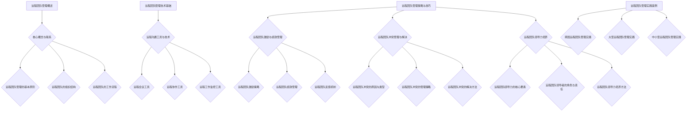

                 


### 1. 文章标题：《远程团队管理：克服距离障碍的有效方法》

**关键词**：远程团队管理，团队协作，沟通工具，工作流程，激励策略，绩效管理，领导力培养，实践案例。

**摘要**：
本文旨在探讨远程团队管理的核心方法，通过分析远程团队管理的兴起背景、核心概念、技术基础、策略与技巧，结合实际案例，提供克服距离障碍、实现高效团队管理的具体路径。

### 2. 目录大纲结构

**第一部分：远程团队管理概述**

**第1章：远程团队管理的兴起**
- **2.1 远程工作的背景与发展**
- **2.2 远程团队管理的挑战**
- **2.3 远程团队管理的优势**

**第2章：远程团队管理核心概念**
- **3.1 远程团队管理的基本原则**
- **3.2 远程团队的组织结构**
- **3.3 远程团队的工作流程**

**第二部分：远程团队管理技术基础**

**第3章：远程沟通工具与技术**
- **4.1 远程会议工具**
- **4.2 远程协作工具**
- **4.3 远程工作监控工具**

**第4章：远程团队管理中的项目管理**
- **5.1 远程项目管理的原则与方法**
- **5.2 远程团队进度跟踪与监控**
- **5.3 远程团队风险管理**

**第三部分：远程团队管理策略与技巧**

**第5章：远程团队激励与绩效管理**
- **6.1 远程团队激励策略**
- **6.2 远程团队绩效管理**
- **6.3 远程团队反馈机制**

**第6章：远程团队冲突管理与解决**
- **7.1 远程团队冲突的原因与类型**
- **7.2 远程团队冲突的管理策略**
- **7.3 远程团队冲突的解决方法**

**第7章：远程团队领导力培养**
- **8.1 远程团队领导力的核心要素**
- **8.2 远程团队领导者的角色与责任**
- **8.3 远程团队领导力培养方法**

**第四部分：远程团队管理实践案例**

**第8章：远程团队管理实战案例**
- **9.1 案例一：跨国远程团队管理实践**
- **9.2 案例二：大型远程团队管理实践**
- **9.3 案例三：中小型远程团队管理实践**

**附录**

**附录A：远程团队管理工具推荐**
- **附录B：远程团队管理资源推荐**
- **附录C：远程团队管理FAQ**

### 3. Mermaid 流程图



### 4. 伪代码

```python
# 远程团队管理核心算法原理讲解伪代码

# 定义远程团队管理核心算法
def remote_team_management():
    # 初始化团队
    team = initialize_team()

    # 远程沟通
    communication = remote_communication(team)

    # 远程协作
    collaboration = remote_collaboration(team)

    # 远程工作监控
    monitoring = remote_monitoring(team)

    # 远程项目管理
    project_management = remote_project_management(team)

    # 远程团队激励与绩效管理
    motivation = remote_motivation(team)
    performance = remote_performance_management(team)

    # 远程团队冲突管理与解决
    conflict_management = remote_conflict_management(team)

    # 远程团队领导力培养
    leadership_development = remote_leadership_development(team)

    # 输出管理结果
    output = output_management_results(team)

    return output
```

通过以上步骤，我们已经完成了文章标题、关键词、摘要、目录大纲、Mermaid流程图和伪代码的设计。接下来，我们将根据这些设计，逐步撰写文章的每个部分，确保文章内容丰富、逻辑清晰、结构紧凑。

### 1. 引言

在当今全球化和技术快速发展的背景下，远程工作已成为越来越多企业和组织的首选。远程团队管理不仅挑战了传统的管理模式，也为团队协作带来了新的机遇。本文旨在探讨远程团队管理的核心方法，帮助读者理解并应对远程团队管理中可能遇到的各种挑战。通过分析远程团队管理的兴起背景、核心概念、技术基础、策略与技巧，并结合实际案例，本文将提供克服距离障碍、实现高效团队管理的具体路径。

远程团队管理不仅仅是将团队成员分散在不同地理位置上的简单操作，它涉及到沟通、协作、激励、绩效管理等多个方面。有效的远程团队管理能够提高团队成员的工作效率，促进团队的凝聚力和创新能力，从而在竞争中占据优势。然而，距离、时间差异、文化差异等因素也给远程团队管理带来了不小的挑战。因此，如何克服这些障碍，实现高效的管理，成为企业和组织亟需解决的问题。

本文将首先介绍远程团队管理的背景和发展，接着深入探讨远程团队管理的基本原则、组织结构和工作流程。在此基础上，我们将介绍远程团队管理所需的技术基础，包括远程沟通工具、协作工具和工作监控工具。随后，本文将重点讨论远程团队管理的策略和技巧，包括激励与绩效管理、冲突管理、领导力培养等方面。最后，通过实际案例的分析，我们将展示如何将这些方法和技巧应用于远程团队管理中，为读者提供实用的指导和建议。

通过阅读本文，读者将能够全面了解远程团队管理的各个方面，掌握克服距离障碍的有效方法，从而提高远程团队的工作效率和整体绩效。

### 2.1 远程工作的背景与发展

远程工作（Remote Work）的概念并非新事物，但其发展历程却反映了技术进步和社会观念的变化。早在20世纪80年代，随着个人电脑和互联网的兴起，远程工作开始萌芽。然而，当时由于通信技术的不成熟，远程工作主要局限于特定的行业，如软件开发、自由职业者等。这一阶段，远程工作更多地是一种个体行为，而非团队的常态。

进入21世纪，互联网技术的飞速发展和移动互联网的普及，使得远程工作逐渐成为一种普遍现象。尤其是2008年金融危机后，企业为了降低成本、提高灵活性，开始大规模推行远程工作制度。随着云计算、视频会议、即时通讯等技术的不断成熟，远程工作的形式和范围得到了极大的扩展。企业不仅可以在全球范围内招聘人才，还可以通过虚拟团队实现高效的协作。

近年来，远程工作迎来了新的发展机遇。新冠疫情的爆发，使远程工作成为许多企业和组织应对突发事件的必要手段。在疫情期间，许多企业不得不迅速调整工作模式，从传统的办公室工作转向远程工作。这不仅考验了企业的远程管理能力，也推动了远程工作的普及。根据全球知名人力资源管理公司ADP的调研报告，超过80%的企业计划在疫情结束后继续推行远程工作制度。

从行业分布来看，科技、金融、咨询等知识密集型行业率先接受并推广了远程工作。这些行业的工作性质适合通过远程协作来完成，例如软件开发、数据分析、项目咨询等。随着远程工作模式的普及，越来越多的传统行业也开始探索远程工作的可能性，如制造业、零售业、教育等。远程工作不仅为企业提供了更多的人才选择，也为员工提供了更好的工作生活平衡。

在远程工作的推广过程中，一些关键因素发挥了重要作用。首先是技术的进步，为远程工作提供了坚实的基础。视频会议系统、即时通讯工具、协作平台等技术的普及，使得团队成员能够实时沟通、协同工作，解决了远程协作的技术难题。其次是企业文化的转变，越来越多的企业开始重视员工的自主性和灵活性，将远程工作视为提升员工满意度和工作效率的重要手段。最后是员工需求的改变，随着工作与生活边界的模糊，越来越多的员工希望在工作时间和地点上拥有更多的自由，远程工作正好满足了这一需求。

综上所述，远程工作的发展历程体现了技术进步、企业需求和个人需求的相互作用。随着远程工作模式的不断成熟，它已成为企业和组织提高竞争力、实现可持续发展的重要手段。未来，远程工作将继续发挥重要作用，并在企业管理、员工关系、团队协作等方面带来更多的变革和创新。

### 2.2 远程团队管理的挑战

远程团队管理虽然带来了许多便利，但同时也伴随着一系列挑战。首先，沟通障碍是远程团队管理中最为突出的难题。由于团队成员分布在不同的地理位置，无法进行面对面的交流，信息的传递容易产生误解和延迟。尤其是当需要实时沟通和决策时，沟通的不畅可能会严重影响工作效率。此外，文化差异也可能导致沟通中的误解。不同国家和地区的团队成员可能有着不同的沟通风格、语言习惯和表达方式，这些差异如果不加以重视，会导致沟通效果大打折扣。

其次，时间差异是远程团队管理中的另一个挑战。全球化的远程团队通常由来自不同时区的人员组成，这会导致工作时间的重叠度降低，影响协作效率。例如，一个位于美国东海岸的项目团队需要与位于欧洲的合作伙伴进行关键会议时，可能需要选择在深夜或清晨进行，这无疑增加了团队成员的工作压力，同时也影响了会议的质量和效果。

管理监督是远程团队管理中的第三个挑战。在传统的办公室环境中，管理者可以通过直接观察和即时反馈来了解员工的工作状态和进度。而在远程团队中，这种直接监督变得困难。员工工作的时间和地点更加灵活，管理者很难实时掌握员工的工作情况，这可能导致管理监督不到位，甚至引发员工的不信任感。此外，远程工作的灵活性也使得员工可能更难界定工作任务和工作成果，增加了管理者对绩效评估的难度。

最后，技术依赖是远程团队管理中的必然挑战。远程团队管理高度依赖于各种技术工具和平台，如视频会议系统、即时通讯工具、协作平台等。如果这些技术工具出现问题，如网络中断、系统故障等，都会严重影响团队的工作效率。此外，团队成员可能对某些技术工具的使用不够熟练，也会影响工作效率。因此，技术依赖既带来了便利，也增加了管理的复杂性。

总的来说，远程团队管理面临的挑战是多方面的，包括沟通障碍、时间差异、管理监督和技术依赖。只有充分认识到这些挑战，并采取相应的应对策略，才能实现远程团队的高效管理。

### 2.3 远程团队管理的优势

尽管远程团队管理面临诸多挑战，但其所带来的优势同样不容忽视。首先，成本降低是远程团队管理最为显著的优势之一。传统办公室租赁、水电费用以及日常办公开支等固定成本在远程工作中大大减少。此外，企业无需为员工提供办公桌椅等办公设施，员工在家办公也能有效节省通勤时间和相关费用。这些成本节约不仅有助于企业提高利润率，还能够为员工节省开支，提高生活质量。

其次，工作效率提升是远程团队管理的另一大优势。在远程工作环境中，员工可以根据自身的工作习惯和时间安排来规划工作，避免了传统办公室中可能存在的干扰和冗余流程。例如，员工可以选择在安静的早晨或者效率最高的时间段进行工作，这有助于提高个人的专注力和工作效率。此外，远程团队可以灵活地利用全球时间差，通过跨时区协作实现工作任务的持续推进，从而提高整体工作效率。

工作生活平衡是远程团队管理的另一个重要优势。远程工作使得员工能够在工作和生活之间更加灵活地安排时间，减轻了通勤压力，减少了上下班路上的时间和精力消耗。这种灵活性不仅有助于员工更好地管理个人时间，还能够提高员工的工作满意度和生活质量。研究表明，工作生活平衡的改善能够显著提升员工的工作热情和创造力，进而对团队的绩效产生积极影响。

最后，人才多样性是远程团队管理的显著优势之一。远程工作不受地理位置限制，企业能够招聘到全球范围内最适合岗位的人才。这种全球人才池的扩展不仅为企业带来了更多的选择，还能够促进团队的多样性和创新。来自不同文化、背景和技能的员工能够带来不同的视角和解决方案，有助于团队在解决问题和面对挑战时更具灵活性和创造力。

总之，远程团队管理在成本降低、工作效率提升、工作生活平衡和人才多样性等方面具有显著的优势。这些优势不仅有助于企业实现可持续发展，也为员工提供了更好的工作体验和发展机会。因此，如何充分利用这些优势，克服远程团队管理中的挑战，是实现高效团队管理的关键。

### 2.4 远程团队管理的基本原则

远程团队管理成功的关键在于遵循一系列基本原则，这些原则涵盖了团队协作、目标明确、透明沟通、信任建立等方面。以下是对这些原则的详细阐述：

**团队协作**：在远程团队管理中，团队协作至关重要。团队成员需要相互依赖、互相支持，共同达成团队目标。为了实现有效的团队协作，管理者需要建立明确的角色和职责分工，确保每个成员都清楚自己的任务和责任。此外，鼓励团队成员之间进行开放的沟通和反馈，促进知识共享和经验交流，有助于提高团队的整体绩效。

**目标明确**：设定明确的目标是远程团队管理的基础。团队需要共同确定短期和长期目标，确保每个人都了解目标的重要性和预期结果。通过明确的目标，团队成员可以更好地规划自己的工作，提高工作效率和主动性。同时，管理者需要定期检查目标的完成情况，及时调整策略和方向，以确保团队目标的实现。

**透明沟通**：在远程团队中，透明沟通是保持团队凝聚力的重要手段。管理者应建立开放的沟通渠道，鼓励团队成员随时分享自己的想法和建议。通过定期的团队会议、工作进度报告和即时通讯工具，管理者可以确保信息的及时传递和问题的快速解决。透明沟通不仅有助于提高团队成员的参与感和责任感，还能够减少误解和冲突。

**信任建立**：远程团队管理中，信任的建立尤为重要。由于团队成员无法面对面交流，信任的缺失可能导致工作效率的下降和团队的分裂。管理者需要通过言行一致、公正公平的态度，赢得团队成员的信任。此外，建立互相信任的工作环境，有助于减少疑虑和不安，提高团队的协作效果。

**自我管理**：远程工作环境要求团队成员具备较高的自我管理能力。管理者应鼓励团队成员制定个人的工作计划和时间管理策略，提高工作效率和自律性。同时，管理者需要为团队成员提供必要的支持和资源，帮助他们克服自我管理中的挑战。

**灵活适应**：远程团队管理需要具备灵活适应变化的能力。管理者应鼓励团队成员对变化持开放态度，并能够迅速调整工作策略和计划。这种灵活适应的能力有助于团队在不确定性面前保持稳定和高效。

**持续反馈**：定期收集和提供反馈是远程团队管理的重要环节。管理者应建立有效的反馈机制，及时了解团队成员的工作情况和需求，提供有针对性的支持和指导。同时，团队成员也应积极反馈自己的意见和想法，促进团队持续改进。

总之，远程团队管理的基本原则涵盖了团队协作、目标明确、透明沟通、信任建立、自我管理、灵活适应和持续反馈等方面。遵循这些原则，有助于克服远程团队管理中的挑战，实现团队的高效协作和持续发展。

### 2.5 远程团队的组织结构

在远程团队管理中，组织结构的设计至关重要，它不仅影响团队的工作效率和成员之间的协作，还决定了团队的稳定性和长远发展。远程团队的组织结构通常包括虚拟团队、分布式团队和集中式团队等形式。以下是对这些组织结构的详细探讨：

**虚拟团队（Virtual Teams）**：
虚拟团队是指团队成员通过技术手段，如视频会议、电子邮件和即时通讯工具，在不同地理位置进行协作的团队。虚拟团队的主要优势在于其灵活性和高效性，能够迅速组建和分散，适用于项目型或临时性工作。然而，虚拟团队也面临一些挑战，如沟通障碍和信任缺失。为了克服这些挑战，虚拟团队需要建立明确的沟通规范和共享的目标，并依赖高效的技术工具来保持团队协作的一致性和连贯性。

**分布式团队（Distributed Teams）**：
分布式团队是在多个地理位置上分散工作的团队，成员虽然分布在不同的地区，但彼此之间仍然保持密切的协作关系。分布式团队通常拥有稳定的成员结构和长期的业务目标，能够更好地处理跨时区的工作安排和文化差异。为了确保分布式团队的有效运作，管理者需要制定详细的工作流程和协作规范，确保每个成员都能清楚自己的任务和职责。此外，定期举行团队会议和培训活动，有助于增强团队成员之间的信任和沟通。

**集中式团队（Centralized Teams）**：
集中式团队是指团队成员全部在同一个办公地点或地区工作的团队。尽管集中式团队在沟通和协作上相对更为容易，但在现代远程工作环境中，这种方式较为少见。集中式团队通常适用于初创企业或特定项目，因为它们能够迅速组建并高效协作。然而，随着团队规模的扩大和项目的复杂化，集中式团队的沟通效率可能受到影响。

**矩阵式团队（Matrix Teams）**：
矩阵式团队是结合了虚拟团队和分布式团队特点的团队结构。团队成员在多个地理位置上工作，但每个成员同时属于多个团队，并接受不同上级的领导。矩阵式团队的优势在于其灵活性和高效性，能够充分利用全球资源，实现跨团队协作。然而，矩阵式团队也面临复杂的组织结构和管理问题，如角色模糊和权力冲突。为了克服这些挑战，矩阵式团队需要建立清晰的职责分工和协作机制，确保团队成员之间的沟通和合作顺畅。

**组织结构的优缺点**：
每种远程团队组织结构都有其独特的优缺点。虚拟团队灵活高效，但沟通和信任难度大；分布式团队稳定且协作紧密，但需要精细的管理；集中式团队易于沟通，但适用范围有限；矩阵式团队资源利用充分，但管理复杂。选择合适的组织结构，需要根据团队的实际情况、业务需求和团队文化来综合考量。

总之，远程团队的组织结构设计对于团队管理的成功至关重要。通过合理选择和设计组织结构，企业能够更好地应对远程团队管理中的挑战，实现高效协作和长远发展。

### 2.6 远程团队的工作流程

远程团队的工作流程是实现高效协作和目标达成的基础。以下详细阐述了远程团队的工作流程，包括任务分配、项目进度跟踪、工作协调和反馈机制等方面。

**任务分配**：
任务分配是远程团队工作流程的第一步。为了确保每个团队成员都明确自己的任务和职责，管理者需要制定详细的任务分配计划。这可以通过在线项目管理工具，如JIRA、Trello或Asana来实现。这些工具提供了直观的任务板，可以列出所有任务，并为每个任务分配负责人。任务分配时，应考虑到团队成员的技能和兴趣，以确保任务的合理分配和高效的完成。

**项目进度跟踪**：
项目进度跟踪是确保项目按计划进行的必要手段。远程团队可以通过多种工具来跟踪项目进度，如Google Sheets、Excel或专业的项目管理软件。在项目进度跟踪过程中，管理者应定期更新项目状态，记录任务的完成情况，确保所有成员都能实时了解项目进展。此外，通过甘特图等可视化工具，可以更直观地展示项目的关键路径和任务依赖关系，帮助团队及时调整计划。

**工作协调**：
工作协调是远程团队中不可或缺的一部分。由于团队成员分布在不同的地理位置，协调工作需要更加精细和高效。为了实现工作协调，团队可以采用以下几种方法：

1. **定期团队会议**：定期召开团队会议，可以帮助团队成员沟通进展、解决问题和分享经验。会议可以通过视频会议工具，如Zoom或Microsoft Teams进行，确保团队成员之间的实时互动。
2. **即时通讯工具**：使用即时通讯工具，如Slack或WhatsApp，可以帮助团队成员快速交流、协同工作。这些工具提供了多种功能，如群组聊天、文件共享和任务提醒，有助于提高团队的工作效率。
3. **协作平台**：协作平台，如Confluence或Notion，可以用于创建共享文档、知识库和项目计划，确保团队成员之间的信息共享和协作。

**反馈机制**：
反馈机制是远程团队管理中的重要环节，有助于提高团队的工作质量和成员的满意度。建立有效的反馈机制，可以通过以下方式实现：

1. **定期绩效评估**：定期对团队成员的工作进行绩效评估，可以帮助管理者了解成员的工作表现和存在的问题。绩效评估可以通过在线评估工具，如KPI仪表盘或360度反馈系统进行。
2. **匿名反馈**：为了鼓励团队成员提出真实的反馈，可以设置匿名反馈渠道，如在线调查或意见箱。这种方式有助于发现潜在问题，并采取改进措施。
3. **即时反馈**：在团队成员遇到问题时，管理者应提供即时反馈和帮助。通过即时沟通工具，可以迅速解决问题，避免问题扩大和影响工作进度。

**总结**：
远程团队的工作流程需要综合考虑任务分配、项目进度跟踪、工作协调和反馈机制等多个方面。通过合理设计工作流程，远程团队能够实现高效协作和目标达成。同时，利用现代化的技术和工具，可以大大提高远程团队的工作效率和质量。

总之，远程团队的工作流程是实现高效管理和协作的关键。通过科学设计任务分配、项目进度跟踪、工作协调和反馈机制，远程团队能够克服距离障碍，实现团队的高效运作和长远发展。

### 3.1 远程沟通工具与技术

远程团队管理中，沟通工具的选择至关重要，它们不仅能够提升团队协作效率，还能确保信息的准确传递和及时响应。以下将介绍几种常用的远程沟通工具和技术，包括视频会议工具、即时通讯工具和协作平台。

**视频会议工具**：
视频会议工具是远程团队进行实时沟通和协作的重要工具。这些工具允许团队成员通过视频和音频进行面对面的交流，克服地理位置的限制。以下是几种常用的视频会议工具：

- **Zoom**：Zoom提供了高质量的视频和音频会议功能，支持屏幕共享、虚拟白板和实时翻译等高级功能。它适用于各种规模的团队和会议需求。
- **Microsoft Teams**：Microsoft Teams集成了邮件、日历、文件共享和视频会议等多种功能，是微软办公套件的重要组成部分，适用于企业用户。
- **Google Meet**：Google Meet是Google Workspace的一部分，提供了高效的视频会议和协作功能，易于集成和部署，适合中小企业使用。
- **Cisco Webex**：Cisco Webex提供了全面的视频会议、协作和安全性功能，适用于大型企业和复杂的协作场景。

**即时通讯工具**：
即时通讯工具（IM）能够提供快速、便捷的文本、语音和视频通信，适合团队内部日常交流和问题解决。以下是几种常用的即时通讯工具：

- **Slack**：Slack是一个功能丰富的团队协作工具，支持文本消息、语音和视频通话，以及各种工作流程集成。它提供了丰富的自定义选项和插件，适用于各种工作场景。
- **Microsoft Teams**：除了视频会议功能外，Microsoft Teams还提供了即时通讯功能，支持聊天、语音和视频通话。它集成了Office 365套件，适用于企业用户。
- **WhatsApp**：WhatsApp是一款广泛使用的即时通讯应用，支持文字、语音和视频通话，适用于个人和团队之间的沟通。
- **Telegram**：Telegram是一款安全性较高的即时通讯应用，支持多设备同步和秘密聊天功能，适用于需要高度隐私保护的团队。

**协作平台**：
协作平台提供了全面的文件共享、任务管理、项目管理等功能，帮助团队成员协同工作。以下是几种常用的协作平台：

- **Confluence**：Confluence是Atlassian公司的一款协作平台，支持文档创建、共享和版本控制，适用于团队知识管理和项目协作。
- **Notion**：Notion是一个灵活的协作平台，支持多种数据类型（如笔记、表格、数据库等）的创建和管理，适用于团队任务管理和知识共享。
- **Trello**：Trello是一款基于看板的项目管理工具，通过卡片和列表的形式帮助团队管理任务和项目进度，适用于简单的任务分配和跟踪。
- **Asana**：Asana是一款功能强大的项目管理工具，支持任务分配、进度跟踪和协作，适用于团队项目管理和团队协作。

**选择合适的沟通工具**：
选择合适的远程沟通工具需要考虑团队的具体需求和预算。以下是一些选择指南：

- **团队规模**：对于小型团队，即时通讯工具和协作平台可能就足够满足需求；对于大型团队或跨部门协作，可能需要更全面的视频会议工具和项目管理平台。
- **预算**：考虑团队的预算和可承受范围，选择性价比高的工具。
- **集成度**：选择能够与其他工作工具和平台集成的沟通工具，提高工作效率。
- **用户友好性**：选择界面友好、易于使用的工具，确保团队成员能够快速上手和高效使用。

通过合理选择和使用远程沟通工具和技术，远程团队能够实现高效、流畅的协作，克服地理位置的限制，共同完成任务和目标。

### 3.2 远程协作工具

在远程团队管理中，高效的协作工具能够极大地提升团队的工作效率和质量。以下将详细介绍几种常用的远程协作工具，包括项目管理工具、文件共享平台和代码协作工具。

**项目管理工具**：
项目管理工具帮助团队规划、分配和跟踪项目任务，确保项目按计划顺利进行。以下是几种常用的项目管理工具：

- **Asana**：Asana是一款功能全面的项目管理工具，支持任务创建、分配、进度跟踪和团队协作。它提供了直观的界面和多种视图（如看板、列表、甘特图等），适用于各种规模和类型的团队。
- **Trello**：Trello通过卡片和看板的形式帮助团队管理任务和项目。它操作简单，易于上手，适用于简单的任务分配和跟踪。
- **JIRA**：JIRA是Atlassian公司的一款强大项目管理工具，主要用于软件项目的敏捷开发和跟踪。它提供了丰富的功能，如bug跟踪、需求管理和版本控制，适用于开发团队。
- **ClickUp**：ClickUp是一款灵活且功能强大的项目管理工具，支持任务管理、文档协作、日历视图和看板等多种功能，适用于不同类型的团队。

**文件共享平台**：
文件共享平台使得团队成员能够轻松共享和协作编辑文件，提高工作效率。以下是几种常用的文件共享平台：

- **Google Drive**：Google Drive是Google Workspace的核心组件之一，提供了强大的文件存储、共享和协作功能。它支持在线编辑和版本控制，适用于团队文档协作。
- **OneDrive**：OneDrive是微软提供的云存储和协作平台，集成了Office套件，支持文件存储、共享和在线编辑。
- **Dropbox**：Dropbox是一款广泛使用的云存储平台，提供了强大的文件同步、共享和协作功能，适用于个人和企业用户。
- **Box**：Box是一款企业级的文件共享和协作平台，提供了高级的权限管理、审计和合规性功能，适用于企业团队。

**代码协作工具**：
代码协作工具帮助开发团队进行代码的编写、审查和部署，提高软件开发的效率。以下是几种常用的代码协作工具：

- **Git**：Git是一款分布式版本控制系统，用于代码的版本管理和协作开发。它支持多人协作、分支管理和合并冲突解决，是开发团队必备的工具。
- **GitHub**：GitHub是基于Git的代码托管平台，提供了丰富的功能，如代码审查、项目管理、问题和Wiki等。它被广泛用于开源项目和团队协作开发。
- **GitLab**：GitLab是一款自托管代码仓库，提供了Git的所有功能，并增加了CI/CD、项目管理、问题和Wiki等特性，适用于企业内部开发。
- **Bitbucket**：Bitbucket是Atlassian公司提供的Git代码托管平台，提供了与JIRA和其他Atlassian产品的集成，适用于中小型企业的团队协作。

**选择合适的协作工具**：
选择合适的远程协作工具需要考虑团队的具体需求和预算。以下是一些选择指南：

- **团队规模**：对于小型团队，简单的项目管理工具和文件共享平台可能就足够；对于大型团队或跨部门协作，可能需要更全面的功能和集成度高的工具。
- **预算**：考虑团队的预算和可承受范围，选择性价比高的工具。
- **集成度**：选择能够与其他工作工具和平台集成的协作工具，提高工作效率。
- **用户友好性**：选择界面友好、易于使用的工具，确保团队成员能够快速上手和高效使用。

通过合理选择和使用远程协作工具，远程团队能够实现高效的文件共享、任务管理和代码协作，从而提高整体工作效率和团队凝聚力。

### 3.3 远程工作监控工具

在远程团队管理中，工作监控是确保团队任务按时完成和项目顺利推进的重要环节。有效的远程工作监控工具能够帮助管理者实时了解团队成员的工作状态、进度和效率，从而及时进行调整和优化。以下将介绍几种常用的远程工作监控工具，并分析其优缺点。

**1. Time Doctor**：
Time Doctor是一款专门用于监控员工工作时间和工作活动的工具。它能够自动追踪员工的电脑使用情况，包括网页访问、应用程序使用和键盘鼠标活动。Time Doctor的优点包括：

- **自动时间跟踪**：无需手动记录工作时间，提高效率。
- **应用程序使用监控**：监控员工使用哪些应用程序，确保工作时间不被非工作活动占据。
- **网站访问限制**：可以限制员工访问不相关的网站，确保工作时间的集中。

缺点是可能会引发员工对隐私的担忧，影响员工的自主性和积极性。

**2. RescueTime**：
RescueTime是一款个人和工作时间管理的工具，它通过分析用户的电脑和手机使用情况，提供详细的报告和数据分析。RescueTime的优点包括：

- **全面的监控和分析**：能够追踪用户的整体使用时间，并分析哪些活动占据了大部分时间。
- **个性化建议**：基于用户的习惯和时间分配，提供优化工作效率的建议。

缺点是监控范围较为广泛，可能会包含个人时间，影响员工对监控工具的接受度。

**3. Hubstaff**：
Hubstaff是一款多功能的远程工作监控工具，提供了时间跟踪、任务管理和项目进度跟踪等功能。它的优点包括：

- **灵活的时间跟踪**：支持手动和自动时间跟踪，适应不同的工作模式。
- **项目和时间报告**：提供详细的报告，帮助管理者了解团队成员的工作状态和项目进展。
- **集成多种工作工具**：可以与Trello、Asana等项目管理工具集成，提高工作效率。

缺点是界面相对复杂，对于新手用户可能需要一定时间适应。

**4. Workpuls**：
Workpuls是一款功能强大的远程工作监控工具，提供了详细的工作活动报告、网站访问记录和应用程序使用监控。其优点包括：

- **全面的监控功能**：除了时间跟踪，还提供了网页和应用程序使用记录，帮助管理者全面了解员工的工作情况。
- **自动化报告**：能够自动生成工作活动报告，节省管理者的时间。

缺点是监控功能过于强大，可能会引起员工的反感。

**选择指南**：
选择远程工作监控工具时，需要根据团队的具体需求和预算进行权衡。以下是一些选择指南：

- **团队规模**：对于小型团队，简单的监控工具可能就足够；对于大型团队，可能需要功能更全面的工具。
- **监控范围**：根据团队的工作特点和需求，选择适合的监控范围和功能。
- **用户友好性**：选择界面友好、易于使用的工具，确保团队成员能够快速上手和高效使用。
- **预算**：考虑团队的预算和可承受范围，选择性价比高的工具。

通过合理选择和使用远程工作监控工具，管理者能够有效监控团队成员的工作状态和进度，提高团队的整体工作效率和项目质量。

### 3.4 远程项目管理的原则与方法

远程项目管理是确保远程团队项目顺利推进和成功完成的关键环节。以下将详细探讨远程项目管理的原则和方法，包括项目管理流程、进度跟踪、风险管理等。

**项目管理流程**：
远程项目管理流程与传统项目管理流程类似，但需要根据远程工作环境的特点进行调整。以下是远程项目管理的主要流程：

1. **项目启动**：在项目启动阶段，团队需要明确项目的目标、范围和可行性。项目经理应与相关利益相关者进行沟通，制定详细的项目计划，包括项目目标、里程碑、资源和时间表。

2. **项目规划**：项目规划阶段，团队应制定详细的项目计划，包括任务分配、资源需求、进度安排和质量标准。项目经理需要确保所有团队成员对项目的目标和任务有清晰的认识。

3. **项目执行**：在项目执行阶段，团队成员按照项目计划进行工作。项目经理需要监控项目进度，确保任务按时完成，并协调团队成员之间的协作。

4. **项目监控**：项目监控阶段，项目经理需要定期检查项目进度和质量，确保项目按照计划进行。如果发现偏差，项目经理应及时调整计划，确保项目按时完成。

5. **项目收尾**：在项目收尾阶段，团队应进行项目总结和评估，总结项目的经验教训，为未来项目提供参考。

**进度跟踪**：
进度跟踪是远程项目管理中的关键环节，有助于确保项目按时完成。以下是一些进度跟踪的方法：

1. **使用项目管理工具**：使用项目管理工具（如Asana、Trello、JIRA等）可以帮助团队实时跟踪任务进度，确保每个任务都能按时完成。这些工具提供了任务板、看板和甘特图等多种视图，方便团队成员和项目经理了解项目进展。

2. **定期会议**：定期召开团队会议，帮助项目经理和团队成员了解项目进度和存在的问题。会议可以讨论任务的完成情况、遇到的问题和解决方案，确保项目按计划推进。

3. **进度报告**：定期生成进度报告，向团队成员和相关利益相关者汇报项目进展。报告应包括关键任务的完成情况、项目里程碑的达成情况以及项目风险和问题的应对措施。

**风险管理**：
风险管理是远程项目管理的重要部分，有助于识别、评估和应对项目中的潜在风险。以下是一些风险管理的方法：

1. **识别风险**：在项目启动和规划阶段，项目经理应与团队成员和相关利益相关者一起识别项目中的潜在风险。这些风险可能包括技术风险、人员风险、时间风险和资源风险等。

2. **评估风险**：对识别出的风险进行评估，确定每个风险的可能性和影响。评估结果可以帮助项目经理制定风险应对计划。

3. **应对风险**：根据风险评估结果，制定相应的风险应对计划。应对计划可能包括风险回避、减轻、转移或接受等策略。

4. **监控风险**：在项目执行过程中，项目经理应定期监控项目风险，确保风险应对计划的有效实施。如果发现新的风险或原有风险的变化，项目经理应及时调整风险应对计划。

**总结**：
远程项目管理需要遵循科学的原则和方法，确保项目目标、进度和质量得到有效控制。通过使用项目管理工具、定期会议和进度报告等方法，远程团队可以高效地推进项目，确保项目按时完成。同时，有效的风险管理可以帮助团队应对项目中的潜在风险，确保项目的顺利推进和成功完成。

### 3.5 远程团队进度跟踪与监控

在远程团队管理中，进度跟踪与监控是确保项目按时完成和资源合理分配的关键环节。以下将详细介绍远程团队进度跟踪与监控的方法，包括工具选择、数据分析和反馈机制。

**工具选择**：
选择合适的进度跟踪与监控工具是确保远程团队高效管理的基础。以下是几种常用的工具：

1. **Trello**：Trello是一款基于看板的项目管理工具，适用于任务分配和进度跟踪。它提供了直观的卡片和列表，方便团队成员查看任务状态和进度。

2. **Asana**：Asana是一款功能全面的项目管理工具，支持任务分配、进度跟踪和团队协作。它提供了多种视图（如看板、列表、甘特图等），方便团队实时了解项目进展。

3. **JIRA**：JIRA是一款专业的项目管理工具，适用于软件开发团队。它提供了丰富的功能，如任务跟踪、bug管理、版本控制等，支持敏捷开发方法。

4. **Microsoft Teams**：Microsoft Teams集成了任务管理功能，允许团队成员在聊天中创建和跟踪任务。此外，它还支持与外部项目管理工具的集成，方便统一管理。

**数据分析**：
数据分析是确保进度监控科学有效的重要手段。以下是一些数据分析方法：

1. **关键绩效指标（KPI）**：通过设定关键绩效指标，可以量化团队的工作进度和效果。常见的KPI包括任务完成率、延迟任务数量、项目进度偏差等。

2. **趋势分析**：通过分析历史数据，可以识别团队的工作模式和趋势。例如，分析任务完成的平均时间、任务延迟的主要原因等，有助于优化工作流程和资源分配。

3. **实时监控**：使用实时数据分析工具，如实时仪表盘，可以直观地展示项目进度、任务状态和团队绩效。这种工具可以帮助团队成员和项目经理快速了解项目状况，及时调整计划。

**反馈机制**：
有效的反馈机制是确保团队不断改进和进步的关键。以下是一些反馈机制：

1. **定期反馈会议**：定期召开反馈会议，团队成员可以分享工作进展、遇到的问题和改进意见。这种会议有助于团队沟通和协作，促进团队整体进步。

2. **即时反馈**：对于紧急问题和关键任务，应提供即时反馈渠道，如即时通讯工具或邮件。这种方式可以快速解决问题，避免问题扩大和影响工作进度。

3. **匿名反馈**：为了鼓励团队成员提出真实的反馈，可以设置匿名反馈渠道，如在线调查或意见箱。这种方式有助于发现潜在问题，并采取改进措施。

**总结**：
通过合理选择工具、进行数据分析和建立有效的反馈机制，远程团队可以实现对项目进度和质量的全面监控。这有助于确保项目按时完成，提高团队的工作效率和整体绩效。

### 3.6 远程团队风险管理

在远程团队管理中，风险管理是确保项目成功和团队稳定运行的关键环节。以下将详细探讨远程团队风险管理的策略和方法，包括风险识别、评估和应对措施。

**风险识别**：
风险识别是风险管理的第一步，旨在发现潜在的风险。以下是几种常用的风险识别方法：

1. **专家访谈**：通过与团队成员和相关利益相关者进行访谈，了解他们对项目潜在风险的看法和建议。这种方法有助于收集丰富的信息，发现潜在风险。
2. **历史数据分析**：分析过去项目中的风险事件，总结出常见的风险类型和原因。这种方法可以帮助团队提前识别可能出现的风险。
3. **故障树分析（FTA）**：通过构建故障树，分析可能导致项目失败的各种因素及其相互关系。这种方法有助于全面识别项目中的潜在风险。

**风险评估**：
风险评估是对识别出的风险进行量化分析，确定其可能性和影响程度。以下是几种常用的风险评估方法：

1. **风险矩阵**：使用风险矩阵对风险的可能性和影响进行量化评估。风险矩阵通常使用一个二维表格，其中行代表风险的可能性，列代表风险的影响程度。
2. **定量分析**：使用数学模型和统计方法对风险的概率和影响进行定量分析。例如，可以通过计算风险事件的概率和预期损失，评估风险的整体影响。
3. **定性分析**：通过专家评估和主观判断，对风险的可能性和影响进行定性分析。这种方法适用于无法进行定量分析的情景。

**应对措施**：
针对评估出的风险，需要制定相应的应对措施。以下是几种常见的应对策略：

1. **风险回避**：通过调整项目计划或工作方法，避免风险的发生。例如，可以重新分配任务或修改需求，减少风险的概率。
2. **风险减轻**：采取措施降低风险的概率或影响程度。例如，可以通过加强团队培训、采用更可靠的技术或增加冗余资源，减轻风险的影响。
3. **风险转移**：将风险转移给其他方，如保险公司或合作伙伴。这种方法适用于无法完全避免或减轻的风险。
4. **风险接受**：在某些情况下，如果风险的概率较低或影响较小，可以选择接受风险。例如，对于一些非关键任务，可以选择不进行额外的风险应对措施。

**总结**：
通过有效的风险识别、评估和应对措施，远程团队可以更好地管理项目中的潜在风险，确保项目按时完成和团队稳定运行。这有助于提高项目的成功率和团队的整体绩效。

### 3.7 远程团队管理中的激励策略

在远程团队管理中，激励策略是调动团队成员积极性、提高工作质量和团队凝聚力的重要手段。有效的激励策略不仅能增强员工的工作动力，还能促进团队的长期发展。以下将详细探讨远程团队管理的激励策略，包括奖励制度、职业发展计划和员工参与度提升。

**奖励制度**：
奖励制度是激励员工的重要手段之一。以下是一些有效的奖励方法：

1. **绩效奖金**：根据员工的绩效表现，给予相应的奖金。这种方法能够直接激励员工提高工作效率和质量，是远程团队管理中常见的一种奖励方式。

2. **项目奖金**：对于成功完成关键项目或任务的团队成员，给予额外的奖励。项目奖金有助于增强员工的团队合作精神和项目责任感。

3. **荣誉表彰**：定期举行团队会议或活动，对优秀员工进行表彰和奖励。这种荣誉表彰不仅能增强员工的荣誉感，还能激励其他员工向优秀者学习。

4. **虚拟奖励**：提供虚拟奖励，如电子礼品卡、远程培训机会等。虚拟奖励在远程团队中尤其受欢迎，因为它们无需面对面发放，方便快捷。

**职业发展计划**：
职业发展计划是帮助员工实现个人成长和职业目标的重要途径。以下是一些职业发展策略：

1. **培训与学习**：提供在线培训课程、学习资源和学习时间，帮助员工提升技能和知识。这种培训不仅有助于员工的个人发展，还能提高团队的整体能力。

2. **职业规划指导**：为员工提供职业规划指导，帮助他们制定个人职业发展计划。职业规划指导可以帮助员工明确自己的职业目标，制定实现目标的步骤和计划。

3. **晋升机会**：为员工提供晋升机会，激励他们不断提升自己的能力和表现。晋升机会不仅有助于员工实现个人职业发展，还能提高团队的稳定性和凝聚力。

**员工参与度提升**：
提升员工参与度是确保团队协作高效和积极的重要手段。以下是一些提升员工参与度的方法：

1. **团队建设活动**：定期组织线上团队建设活动，如虚拟游戏、在线茶话会等。这些活动有助于增强团队成员之间的互动和信任，提高团队凝聚力。

2. **意见反馈机制**：建立开放的反馈渠道，鼓励员工提出意见和建议。这种机制不仅能让员工感受到自己的意见被重视，还能帮助企业发现问题、改进管理。

3. **共同决策**：在重大事项上，邀请员工参与决策过程。这种做法不仅能够增加员工的参与感，还能激发他们的工作热情和责任感。

**总结**：
有效的激励策略是远程团队管理的重要组成部分，通过奖励制度、职业发展计划和员工参与度提升等多种方法，可以调动团队成员的积极性，提高工作质量和团队凝聚力，从而实现团队的长远发展。

### 3.8 远程团队绩效管理

在远程团队管理中，绩效管理是确保团队成员目标一致、工作高效和持续改进的重要手段。有效的绩效管理不仅能够提高团队的整体绩效，还能促进团队成员的个人成长和职业发展。以下将详细探讨远程团队绩效管理的核心概念、评估方法和反馈机制。

**核心概念**：
远程团队绩效管理涉及多个核心概念，包括目标设定、绩效评估、激励和反馈。这些概念相互关联，共同构成了绩效管理的框架。

1. **目标设定**：目标设定是绩效管理的起点。在远程团队中，明确的目标能够帮助团队成员了解自己的职责和期望，从而有针对性地进行工作。目标设定应具备SMART（具体、可衡量、可实现、相关、时限）原则，以确保目标的明确性和可行性。

2. **绩效评估**：绩效评估是对团队成员工作表现进行客观评价的过程。远程团队的绩效评估应注重结果和过程的双重考量，既要评估任务完成的效率和质量，也要关注团队成员在工作中的行为和态度。

3. **激励**：激励是绩效管理的重要组成部分，旨在激发团队成员的积极性和创造力。远程团队管理中，激励可以通过多种形式实现，如奖励、晋升、培训等。有效的激励策略能够增强团队成员的归属感和工作动力。

4. **反馈**：反馈是绩效管理中不可或缺的一环。通过定期反馈，团队成员能够了解自己的工作表现和存在的问题，从而及时调整和改进。远程团队的反馈机制应确保反馈的及时性和建设性，帮助团队成员不断提升。

**评估方法**：
绩效评估的方法多种多样，以下是一些适用于远程团队的评估方法：

1. **KPI（关键绩效指标）**：KPI是量化绩效评估的重要工具。通过设定具体的KPI，如任务完成率、项目交付时间、客户满意度等，可以客观地衡量团队成员的工作表现。

2. **360度反馈**：360度反馈是一种全面的评估方法，通过收集团队成员、上级、同事和客户的反馈，对团队成员的工作进行全方位评估。这种方法有助于发现团队成员在不同角色和情境下的表现，提供更全面的评价。

3. **绩效对话**：绩效对话是一种基于沟通的评估方法，通过与团队成员进行面对面的交流，了解他们的工作情况和需求。绩效对话应注重建设性的反馈和目标的设定，帮助团队成员明确改进方向。

**反馈机制**：
有效的反馈机制是确保绩效管理顺利进行的关键。以下是一些反馈机制的方法：

1. **定期反馈**：定期进行绩效反馈，如每月、每季度或年度评估。定期反馈有助于团队成员及时了解自己的工作表现，调整和改进。

2. **即时反馈**：在团队成员遇到问题时，提供即时的反馈和帮助。即时反馈有助于快速解决问题，避免问题扩大和影响工作进度。

3. **匿名反馈**：提供匿名反馈渠道，鼓励团队成员提出真实的意见和建议。匿名反馈有助于发现潜在的问题和改进机会。

4. **反馈报告**：定期生成反馈报告，向团队成员和相关利益相关者汇报绩效评估结果。反馈报告应包括评估指标、评估结果和改进建议，帮助团队成员了解自己的工作表现和改进方向。

**总结**：
远程团队绩效管理是确保团队高效运作和持续改进的重要手段。通过明确的目标设定、科学的评估方法和有效的反馈机制，远程团队能够实现绩效管理的持续优化，提高团队的整体绩效和成员的工作满意度。

### 3.9 远程团队反馈机制

在远程团队管理中，有效的反馈机制是确保团队成员了解自身工作表现、发现改进机会、提高团队协作质量的关键。以下将详细探讨远程团队反馈机制的设计原则、实施方法和优化策略。

**设计原则**：

1. **及时性**：反馈应及时传达，以便团队成员能够迅速了解工作表现和问题，及时调整和改进。
2. **具体性**：反馈应具体明确，指出现实问题并提出具体建议，避免泛泛而谈。
3. **建设性**：反馈应注重建设性，鼓励团队成员积极面对问题，并提供支持和帮助。
4. **双向性**：反馈机制应促进双向沟通，鼓励团队成员之间以及团队成员与管理层之间的互动和交流。
5. **公平性**：反馈应公平公正，不偏袒任何一方，确保每位成员都能公平地接受和给予反馈。

**实施方法**：

1. **定期反馈会议**：定期召开反馈会议，团队成员可以分享工作进展、遇到的问题和改进意见。这种会议有助于团队沟通和协作，促进团队成员之间的互动。
2. **即时反馈**：在团队成员遇到紧急问题或需要即时反馈的情况下，提供即时反馈渠道，如即时通讯工具或邮件。这种方式可以快速解决问题，避免问题扩大和影响工作进度。
3. **匿名反馈**：提供匿名反馈渠道，如在线调查或意见箱，鼓励团队成员提出真实的意见和建议。这种方式有助于发现潜在的问题和改进机会。
4. **在线问卷调查**：定期开展在线问卷调查，收集团队成员对团队管理和工作环境的反馈。这种调查可以匿名进行，确保反馈的真实性和全面性。

**优化策略**：

1. **反馈报告**：生成反馈报告，定期向团队成员和相关利益相关者汇报反馈结果。报告应包括反馈内容、改进措施和预期效果，帮助团队成员了解工作表现和改进方向。
2. **反馈培训**：为团队成员提供反馈培训，提高他们的反馈技巧和沟通能力。通过培训，团队成员可以更好地理解反馈机制，更有效地提出和接受反馈。
3. **持续改进**：将反馈机制作为团队管理的一部分，持续优化和改进。根据反馈结果，调整反馈内容和形式，确保反馈机制的有效性和适用性。
4. **激励机制**：建立激励机制，鼓励团队成员积极参与反馈机制。通过奖励、表彰等方式，提高团队成员对反馈机制的认同感和参与度。

**总结**：

通过设计合理的反馈机制，实施有效的反馈方法和优化策略，远程团队能够实现持续改进和高效协作。有效的反馈机制不仅有助于提高团队成员的工作满意度和绩效，还能增强团队的凝聚力和创新能力，为团队的长远发展奠定坚实基础。

### 3.10 远程团队冲突管理

在远程团队管理中，冲突是不可避免的。由于团队成员分布在不同的地理位置，沟通的障碍、文化差异、目标不一致等因素可能导致冲突的发生。有效的冲突管理是确保团队协作顺利、提高工作效率的重要手段。以下将详细探讨远程团队冲突管理的策略和方法。

**冲突的原因**：

1. **沟通障碍**：远程团队中的沟通障碍是导致冲突的主要原因之一。由于缺乏面对面的交流，团队成员可能会误解信息或忽视重要细节，从而引发矛盾。
2. **文化差异**：不同国家和地区的团队成员可能有着不同的文化背景、价值观和工作习惯，这些差异可能导致误解和冲突。
3. **目标不一致**：团队成员对项目目标和任务的理解可能存在差异，导致工作方向不统一，从而引发冲突。
4. **资源分配**：在远程团队中，资源分配不均可能导致部分成员感到不满和冲突。
5. **个人因素**：团队成员的个人情绪、压力和心态也可能影响团队氛围，导致冲突的发生。

**冲突的管理策略**：

1. **预防策略**：

   - **建立清晰的目标和沟通机制**：通过明确团队目标和制定详细的沟通计划，减少误解和冲突。
   - **加强团队文化建设**：通过培训和文化活动，增强团队成员的团队意识和凝聚力，减少文化差异带来的冲突。
   - **资源合理分配**：确保团队成员在资源分配上公平合理，避免因资源分配不均引起的冲突。

2. **应对策略**：

   - **及时沟通**：一旦发现潜在的冲突，应及时进行沟通，了解冲突的原因和双方的立场。
   - **中立调解**：在冲突发生时，可以邀请中立第三方进行调解，帮助双方找到共同点和解决方案。
   - **制定解决方案**：根据冲突的原因和性质，制定具体的解决方案，确保冲突得到有效解决。
   - **持续跟进**：解决冲突后，应持续关注问题是否再次发生，及时调整管理策略和团队运作方式。

**具体方法**：

1. **积极倾听**：在处理冲突时，积极倾听是至关重要的。通过倾听，团队成员可以了解对方的观点和感受，找到冲突的根本原因。
2. **建设性对话**：在冲突管理中，应鼓励团队成员进行建设性的对话，通过讨论和协商找到解决问题的方法。
3. **冲突解决培训**：为团队成员提供冲突解决培训，提高他们的冲突处理能力和沟通技巧。
4. **团队反思会议**：定期召开团队反思会议，让团队成员分享冲突处理的体验和心得，共同学习并改进。

**总结**：

有效的冲突管理是远程团队管理的重要组成部分。通过预防和应对策略，以及积极倾听、建设性对话等方法，远程团队能够有效管理冲突，确保团队协作的顺利进行和整体绩效的提升。冲突管理不仅有助于解决当前的问题，还能提高团队的凝聚力和稳定性，为团队的长远发展奠定坚实基础。

### 3.11 远程团队冲突的解决方法

在远程团队管理中，冲突是不可避免的，而有效的解决方法能够帮助团队迅速恢复协作氛围，提高工作效率。以下将详细探讨远程团队冲突解决的步骤和技巧。

**冲突解决的步骤**：

1. **识别冲突**：首先，团队需要识别冲突的根源和性质。这可以通过观察团队成员的行为、听取反馈和定期进行团队反思来实现。

2. **沟通与理解**：一旦冲突被识别，团队应立即进行沟通，了解双方的立场和感受。通过开放和诚实的对话，团队成员可以更好地理解冲突的原因。

3. **分析问题**：在理解冲突的基础上，团队需要分析问题的根本原因，找出导致冲突的具体因素。这可以通过头脑风暴、SWOT分析（优势、劣势、机会、威胁）等方法来实现。

4. **制定解决方案**：根据分析结果，团队应共同制定解决方案。解决方案应具备可操作性和可行性，确保能够有效解决冲突。

5. **实施解决方案**：在制定解决方案后，团队需要立即实施。这包括调整工作流程、重新分配任务和角色等。

6. **跟踪与评估**：在实施解决方案后，团队应定期跟踪和评估解决方案的效果，确保冲突得到有效解决。

**具体技巧**：

1. **中立调解**：在冲突解决过程中，可以邀请中立第三方进行调解。中立调解者能够客观地分析问题，提出解决方案，帮助双方找到共同点。

2. **角色扮演**：通过角色扮演，团队成员可以模拟冲突情境，更好地理解对方的观点和感受。这种方法有助于增强团队成员的沟通能力和同理心。

3. **建设性对话**：鼓励团队成员进行建设性的对话，通过讨论和协商找到解决问题的方法。在对话中，应注重倾听、尊重和寻求共识。

4. **共同制定解决方案**：在解决冲突时，应鼓励团队成员共同制定解决方案。这种方法有助于提高团队成员的参与感和责任感，确保解决方案的有效性和可行性。

5. **定期回顾**：在冲突解决后，团队应定期回顾和讨论冲突处理的经验和教训。通过定期回顾，团队可以不断改进冲突解决方法，提高整体的冲突管理能力。

**总结**：

有效的冲突解决方法能够帮助远程团队迅速恢复协作氛围，提高工作效率。通过识别冲突、沟通与理解、分析问题、制定解决方案、实施解决方案和跟踪与评估等步骤，以及中立调解、角色扮演、建设性对话、共同制定解决方案和定期回顾等技巧，远程团队能够更好地管理冲突，确保团队的高效运作和持续发展。

### 3.12 远程团队领导力的核心要素

在远程团队管理中，领导力是确保团队高效运作和成功完成项目的重要驱动力。有效的远程领导力不仅能够激励团队成员、提升团队凝聚力，还能够有效应对远程工作中特有的挑战。以下将详细探讨远程团队领导力的核心要素，包括信任建立、目标明确、沟通技巧和持续反馈。

**信任建立**：

信任是远程团队领导力的基石。在缺乏面对面交流的远程工作环境中，建立和维护信任尤为重要。以下是一些建立信任的方法：

1. **透明沟通**：领导者应保持沟通的透明度，及时分享团队的目标、计划和工作进展，确保团队成员了解团队的整体情况。
2. **诚信与一致性**：领导者应做到言行一致，诚实面对问题，保持承诺，赢得团队成员的信任。
3. **支持与关怀**：领导者应关注团队成员的需求和情感，提供必要的支持和关怀，增强团队的归属感。

**目标明确**：

明确的目标是确保团队方向一致、努力一致的关键。领导者应确保每个团队成员都清楚团队的目标和自己的任务，以下是一些实现目标明确的方法：

1. **设定具体目标**：领导者应与团队成员一起设定具体、可衡量的目标，确保每个成员都了解自己的职责和期望。
2. **定期回顾目标**：领导者应定期与团队成员回顾目标，确保团队成员始终保持目标意识，并调整计划以达成目标。
3. **目标共享**：将团队目标共享给所有成员，确保每个人都了解自己的工作如何与整体目标相关联。

**沟通技巧**：

沟通是远程团队领导力的重要组成部分。有效的沟通能够确保信息准确传递、减少误解和冲突。以下是一些提升沟通技巧的方法：

1. **主动沟通**：领导者应主动发起沟通，确保信息及时传递，避免因信息滞后导致的误解和问题。
2. **倾听与回应**：领导者应注重倾听团队成员的意见和反馈，及时回应问题，确保团队成员感受到被尊重和重视。
3. **多样化沟通渠道**：领导者应充分利用多种沟通渠道，如视频会议、即时通讯工具、邮件等，确保沟通的多样性和有效性。

**持续反馈**：

持续反馈是确保团队成员不断进步和团队持续改进的重要手段。领导者应提供及时、具体和建设性的反馈，以下是一些反馈技巧：

1. **正面反馈**：领导者应注重正面反馈，鼓励团队成员的优点和进步，增强他们的自信心和积极性。
2. **具体反馈**：领导者应提供具体的反馈，指明改进的方向和方法，帮助团队成员明确如何提升自己的工作表现。
3. **定期反馈**：领导者应定期进行反馈，确保团队成员能够持续改进和提升。

**总结**：

远程团队领导力的核心要素包括信任建立、目标明确、沟通技巧和持续反馈。通过这些要素的有效应用，领导者能够提升团队凝聚力、确保团队目标的实现，并在远程工作中取得成功。

### 3.13 远程团队领导者的角色与责任

在远程团队管理中，领导者扮演着至关重要的角色。他们不仅是团队的核心，更是协调者和推动者，负责确保团队目标的实现和成员的满意度。以下将详细探讨远程团队领导者的角色与责任，包括任务分配、团队监督和员工关怀。

**任务分配**：

任务分配是远程团队领导者的重要职责之一。一个合理、明确的任务分配能够确保每个团队成员都清楚自己的职责和目标，从而提高工作效率和团队凝聚力。以下是一些任务分配的策略：

1. **能力匹配**：根据团队成员的技能和经验，合理分配任务，确保每个人都能在适合自己的岗位上发挥最大潜力。
2. **任务分解**：将复杂任务分解为若干小任务，明确每个小任务的负责人，确保任务有序推进。
3. **反馈机制**：建立任务完成情况的反馈机制，定期检查任务进度，及时调整任务分配，确保任务按计划完成。

**团队监督**：

团队监督是确保远程团队能够高效运作的关键。领导者需要通过多种方式监督团队的工作进度和质量，确保项目目标的实现。以下是一些团队监督的策略：

1. **进度跟踪**：使用项目管理工具，如Trello、Asana等，实时跟踪任务进度，确保团队成员按时完成任务。
2. **定期检查**：定期与团队成员进行一对一的沟通，了解他们的工作情况，提供必要的支持和帮助。
3. **质量控制**：确保团队交付的成果符合质量标准，通过定期的质量检查和反馈，确保团队的工作质量。

**员工关怀**：

在远程团队管理中，领导者需要更加关注员工的情感和需求，提供必要的关怀和支持，以增强团队的凝聚力和成员的满意度。以下是一些员工关怀的策略：

1. **定期沟通**：通过定期的线上会议、即时通讯工具等，保持与团队成员的沟通，了解他们的工作情况和需求，及时提供帮助。
2. **心理支持**：关注团队成员的心理健康，提供心理支持，帮助他们应对远程工作中的压力和挑战。
3. **工作生活平衡**：鼓励团队成员合理规划工作和生活，提供灵活的工作时间和工作地点，帮助他们实现工作生活平衡。

**总结**：

远程团队领导者需要承担任务分配、团队监督和员工关怀等多重责任。通过合理的任务分配、有效的团队监督和全面的员工关怀，领导者能够确保远程团队的高效运作和成员的满意度，从而实现团队目标。

### 3.14 远程团队领导力培养方法

在远程团队管理中，领导力的培养至关重要。有效的领导力培养不仅能提升团队成员的管理能力，还能增强团队的凝聚力和工作效率。以下将详细探讨远程团队领导力培养的方法，包括培训计划、角色扮演和团队建设活动。

**培训计划**：

培训是提升领导力的重要手段。通过系统性的培训，领导者可以掌握有效的管理技巧和方法，提高自己的领导能力。以下是一些培训计划的方法：

1. **制定培训目标**：明确培训的目标和预期成果，确保培训内容与团队需求和目标相匹配。
2. **多样化的培训形式**：结合线上和线下培训，提供讲座、研讨会、工作坊等多种培训形式，以满足不同学习者的需求。
3. **实践与反馈**：在培训过程中，鼓励领导者进行实践操作，并通过反馈和评估，不断改进和提升自己的领导能力。

**角色扮演**：

角色扮演是一种有效的领导力培养方法，通过模拟实际工作场景，领导者可以在实践中学习和提高。以下是一些角色扮演的方法：

1. **情景模拟**：设计不同的领导场景，让领导者扮演不同的角色，模拟实际工作中可能遇到的情况。
2. **互动讨论**：在角色扮演结束后，组织互动讨论，让参与者分享自己的感受和体验，从中学习和反思。
3. **评估与反馈**：通过观察和评估，提供具体的反馈和建议，帮助领导者改进自己的领导行为。

**团队建设活动**：

团队建设活动有助于增强团队成员之间的信任和合作，提高团队的凝聚力。以下是一些团队建设活动的方法：

1. **在线团队建设游戏**：通过线上游戏，如虚拟逃脱室、团队竞赛等，增强团队成员之间的互动和合作。
2. **虚拟团队会议**：定期举行虚拟团队会议，鼓励团队成员分享自己的工作进展和感受，促进团队沟通和了解。
3. **团队反思会议**：定期召开团队反思会议，让团队成员共同讨论团队的表现和问题，提出改进建议。

**总结**：

通过培训计划、角色扮演和团队建设活动等多种方法，远程团队可以有效地培养领导力，提升团队成员的管理能力和团队凝聚力，从而实现团队的高效运作和长远发展。

### 3.15 远程团队管理实践案例

为了更好地理解远程团队管理的实际应用，以下将通过三个不同规模的远程团队管理实践案例，详细分析其管理策略和经验。

**案例一：跨国远程团队管理实践**

**背景**：
某全球知名的互联网公司决定将一个重要项目交给一个跨国的远程团队来执行。团队成员分布在不同的国家，包括美国、欧洲和亚洲。

**管理策略**：
1. **明确目标和沟通机制**：在项目启动阶段，团队领导与所有成员共同确定了项目目标，并通过定期的视频会议和即时通讯工具保持沟通，确保信息透明和及时传递。
2. **时间管理**：团队采用了不同的时间表来协调不同时区的工作，通过工作日和休息日的灵活安排，确保了工作的连续性。
3. **技术工具**：团队使用了Zoom进行视频会议、Slack进行即时沟通、Trello进行任务管理，以及Confluence进行文档共享和知识管理。

**经验**：
通过明确的沟通机制和高效的技术工具，团队成功克服了地理位置和时区差异带来的挑战，实现了高效的合作和项目的顺利推进。

**案例二：大型远程团队管理实践**

**背景**：
某大型跨国企业决定将其市场部门转变为远程工作模式，团队成员数量超过100人，分布在多个城市。

**管理策略**：
1. **项目管理工具**：公司引入了Asana作为主要的项目管理工具，通过任务板和看板，实时跟踪任务进度和团队协作。
2. **团队反馈机制**：建立了定期的团队反馈会议，通过问卷调查和面对面交流，收集团队成员的意见和建议，及时进行反馈和改进。
3. **员工关怀**：公司为员工提供了心理健康支持服务，并定期组织线上团队建设活动，如虚拟茶话会和在线健身课程，增强团队的凝聚力和员工满意度。

**经验**：
通过科学的项目管理工具和有效的反馈机制，公司成功实现了从传统办公室工作模式到远程工作模式的平稳过渡，并保持了团队的积极性和高效性。

**案例三：中小型远程团队管理实践**

**背景**：
一家小型创业公司决定采用远程工作模式，其团队由10名成员组成，分布在城市的不同区域。

**管理策略**：
1. **灵活的工作安排**：公司允许团队成员自主安排工作时间，确保他们能够平衡工作与生活，提高工作效率。
2. **即时通讯和协作工具**：团队使用了Slack进行日常沟通和协作，通过频道划分，方便团队成员在不同任务之间快速切换。
3. **领导力培养**：公司定期组织领导力培训，提升团队成员的自我管理能力和领导能力，确保团队能够自主高效地运作。

**经验**：
通过灵活的工作安排和高效的沟通工具，公司成功地培养了团队成员的自我管理能力，提高了团队的整体绩效和员工满意度。

**总结**：
以上三个案例展示了不同规模远程团队的管理实践，尽管团队规模和行业不同，但它们都通过合理的策略和高效的工具，成功克服了远程工作带来的挑战，实现了高效的管理和团队的持续发展。

### 3.16 远程团队管理工具推荐

在远程团队管理中，选择合适的工具是确保团队高效运作的关键。以下将推荐几款实用的远程团队管理工具，并提供其特点和适用场景。

**1. Slack**
- **特点**：Slack是一款功能丰富的即时通讯工具，支持文本消息、语音和视频通话，以及各种工作流程集成。
- **适用场景**：适用于日常沟通、任务分配和团队协作，尤其适合中小型团队。
- **优势**：提供了丰富的插件和集成，支持多种第三方应用（如Trello、Google Drive等），方便团队管理和文件共享。

**2. Zoom**
- **特点**：Zoom是一款高品质的视频会议工具，支持大屏幕共享、虚拟白板和实时翻译等功能。
- **适用场景**：适用于远程会议、培训、团队讨论和跨时区协作。
- **优势**：提供了稳定和清晰的视频和音频质量，支持多种设备（包括移动设备）的使用，方便随时召开会议。

**3. Trello**
- **特点**：Trello是一款基于看板的项目管理工具，提供了直观的任务板和卡片管理功能。
- **适用场景**：适用于任务分配、项目进度跟踪和团队协作。
- **优势**：操作简单，易于上手，适合各种规模的团队和项目。

**4. Asana**
- **特点**：Asana是一款全面的项目管理工具，支持任务分配、进度跟踪、项目规划和团队协作。
- **适用场景**：适用于复杂项目管理和多团队协作。
- **优势**：提供了多种视图（如看板、列表、甘特图等），方便团队实时了解项目进展和任务状态。

**5. Microsoft Teams**
- **特点**：Microsoft Teams集成了邮件、日历、文件共享和视频会议等多种功能，是微软办公套件的重要组成部分。
- **适用场景**：适用于企业级团队，特别是使用Microsoft 365的企业。
- **优势**：与Office 365深度集成，提供了丰富的协作工具，方便团队进行文件共享、任务管理和实时沟通。

**6. Google Workspace**
- **特点**：Google Workspace包括Google Drive、Google Docs、Google Sheets等工具，支持在线协作和文档共享。
- **适用场景**：适用于各种规模的企业，特别是需要高效协作和云端存储的团队。
- **优势**：提供了强大的文档编辑和共享功能，支持多用户实时协作，方便团队进行文件管理和版本控制。

**总结**：
通过合理选择和使用这些远程团队管理工具，团队可以大大提高工作效率和协作质量，确保远程工作环境的顺利运作。

### 3.17 远程团队管理资源推荐

为了帮助读者更深入地了解远程团队管理的最佳实践和工具，以下推荐了一些优质的远程团队管理资源，包括书籍、文章和在线课程。

**书籍**：

1. **《远程工作：如何管理全球团队并保持生产力》（Remote Work: Managing Teams and Staying Productive When You Work From Home）**：作者David Robson，详细探讨了远程团队管理的策略和技巧。
2. **《远程团队管理：如何高效管理虚拟团队》（Managing Virtual Teams: A Practical Guide to Leading, Managing, and Working with Remote Teams）**：作者Diana Bilimoria，提供了实用的远程团队管理方法，包括沟通技巧和冲突解决策略。
3. **《工作在家：远程工作的艺术与科学》（Work from Home: The Art and Science of Working from Home）**：作者Sarah Harvey，分享了如何在家高效工作的技巧和策略。

**文章**：

1. **《远程团队管理的五个关键原则》（Five Key Principles for Managing Remote Teams）**：这篇文章详细阐述了远程团队管理的五个核心原则，包括目标明确、透明沟通和信任建立等。
2. **《如何有效管理远程团队》（How to Manage a Remote Team Effectively）**：该文章提供了远程团队管理的具体方法，包括任务分配、进度跟踪和员工关怀等。
3. **《远程团队的沟通挑战与解决方案》（Communicating in Remote Teams: Challenges and Solutions）**：这篇文章讨论了远程团队沟通中常见的挑战和解决方案，包括使用适当的沟通工具和建立有效的沟通机制。

**在线课程**：

1. **Coursera上的《远程工作管理》（Managing Remote Work）**：该课程由宾夕法尼亚大学提供，涵盖了远程团队管理的各个方面，包括团队建设、沟通技巧和绩效管理。
2. **LinkedIn Learning的《远程团队管理》（Managing Remote Teams）**：这个课程由经验丰富的讲师提供，帮助管理者提升远程团队的管理能力，包括沟通策略和领导技巧。
3. **Udemy的《高效远程团队管理》（Effective Remote Team Management）**：该课程提供了实用的技巧和工具，帮助管理者建立高效、协作的远程团队。

**总结**：
通过阅读这些书籍、文章和参加在线课程，读者可以全面了解远程团队管理的最佳实践和策略，从而提高自己的管理能力，实现团队的高效运作。

### 附录A：远程团队管理工具推荐

为了帮助读者更高效地管理远程团队，以下推荐了一些实用的远程团队管理工具，这些工具覆盖了沟通、协作、监控等多个方面，适用于不同规模和需求的团队。

**1. 沟通工具**
- **Slack**：提供即时通讯、文件共享和集成第三方应用等功能，适用于日常沟通和任务分配。
- **Microsoft Teams**：集成了视频会议、即时通讯、文档协作等多种功能，适用于企业级团队。
- **Zoom**：高质量的视频会议工具，支持屏幕共享、虚拟白板等，适用于远程协作和会议。

**2. 协作工具**
- **Trello**：基于看板的项目管理工具，适用于任务分配和进度跟踪。
- **Asana**：全面的项目管理工具，支持任务分配、进度跟踪和团队协作，适用于复杂项目管理。
- **Confluence**：知识管理和协作平台，适用于文档共享和团队知识管理。

**3. 工作监控工具**
- **Time Doctor**：自动追踪员工工作时间，适用于远程工作监控。
- **RescueTime**：分析用户工作时间，提供优化建议，适用于个人和工作时间管理。
- **Hubstaff**：提供时间跟踪、任务管理和项目进度跟踪，适用于远程团队管理。

**4. 项目管理工具**
- **JIRA**：适用于软件开发的敏捷项目管理工具，适用于开发团队。
- **ClickUp**：提供全面的任务管理、文档协作和项目管理功能，适用于不同规模和类型的团队。

**5. 其他工具**
- **Google Workspace**：包括Google Drive、Google Docs等，适用于文档共享和在线协作。
- **Notion**：灵活的协作平台，适用于笔记、数据库和项目协作。

通过选择和使用这些工具，远程团队可以更好地实现高效沟通、协作和监控，提高整体工作效率和团队凝聚力。

### 附录B：远程团队管理资源推荐

为了帮助读者更深入地了解远程团队管理的最佳实践和策略，以下推荐了一些有价值的资源，包括书籍、在线课程和社区论坛。

**书籍**：
1. **《远程团队管理：构建高效虚拟团队的艺术》（Managing Virtual Teams: Building Collaboration and Trust at a Distance）**：作者：Nancy M. rebuilt by Scott W. Matheson。
2. **《远程工作：如何在远程环境中保持生产力》（Remote Work: How to Stay Productive and Motivated When You Work from Home）**：作者：Jason J. Rich。
3. **《远程团队领导力：如何在虚拟环境中领导团队》（Virtual Team Leadership: How to Lead High-Performing Teams Anywhere in the World）**：作者：Adrian R. Jones。

**在线课程**：
1. **Coursera上的《远程工作管理》（Managing Remote Work）**：由宾夕法尼亚大学提供，涵盖了远程团队管理的各个方面，包括团队建设、沟通技巧和绩效管理。
2. **LinkedIn Learning的《远程团队管理》（Managing Remote Teams）**：由经验丰富的讲师提供，帮助管理者提升远程团队的管理能力，包括沟通策略和领导技巧。
3. **Udemy的《高效远程团队管理》（Effective Remote Team Management）**：提供了实用的技巧和工具，帮助管理者建立高效、协作的远程团队。

**社区论坛**：
1. **远程工作论坛（Remote Work Forum）**：这是一个关于远程工作的在线社区论坛，提供了大量关于远程团队管理的讨论和资源。
2. **远程团队管理社区（Remote Team Management Community）**：这是一个专门讨论远程团队管理的在线社区，提供了许多实用的建议和经验分享。
3. **远程工作最佳实践（Remote Work Best Practices）**：这是一个博客，分享了远程工作的最佳实践和策略，包括团队管理、沟通和协作技巧。

**总结**：
通过阅读这些书籍、参加在线课程和加入社区论坛，读者可以全面了解远程团队管理的最佳实践和策略，从而提高自己的管理能力和团队绩效。

### 附录C：远程团队管理FAQ

在远程团队管理过程中，团队成员可能会遇到各种问题和挑战。以下是一些常见的问题及其解答，旨在帮助团队更好地应对这些情况。

**Q1. 如何保持远程团队的工作效率？**
- **A1.** 为了保持远程团队的工作效率，管理者应确保团队成员有明确的任务和目标，定期跟踪进度，并使用高效的项目管理工具进行任务分配和进度监控。此外，提供必要的技术支持和资源，确保团队成员能够高效地完成工作。

**Q2. 如何处理远程团队中的沟通障碍？**
- **A2.** 沟通障碍可以通过选择合适的沟通工具、定期召开团队会议、确保信息透明和及时传递等方法来解决。管理者应鼓励团队成员积极沟通，并建立开放的反馈机制，确保问题能够及时发现和解决。

**Q3. 如何建立远程团队的信任和凝聚力？**
- **A3.** 建立信任和凝聚力需要通过透明沟通、明确的目标设定和有效的团队建设活动来实现。管理者应定期与团队成员交流，了解他们的需求和意见，并通过团队活动增强团队凝聚力。

**Q4. 远程团队中的绩效评估如何进行？**
- **A4.** 远程团队的绩效评估可以通过设定明确的绩效指标、定期进行绩效对话和反馈来实现。管理者应确保评估过程公正、透明，并关注团队成员的长期发展和职业目标。

**Q5. 如何处理远程团队中的冲突？**
- **A5.** 冲突处理可以通过及时沟通、中立调解和建立有效的反馈机制来实现。管理者应鼓励团队成员开放地表达意见，并共同寻找解决问题的方法。

**Q6. 如何确保远程团队成员的工作生活平衡？**
- **A6.** 为了确保工作生活平衡，管理者应提供灵活的工作时间安排，鼓励团队成员自主管理工作时间，并提供心理健康支持服务，帮助团队成员应对远程工作中的压力。

**总结**：
通过以上FAQ的解答，远程团队管理者可以更好地应对团队中可能遇到的各种问题和挑战，从而确保团队的高效运作和持续发展。

### 结束语

远程团队管理在当今全球化和技术快速发展的背景下，已成为企业和组织提高竞争力、实现可持续发展的重要手段。本文从远程团队管理概述、核心概念、技术基础、策略与技巧、实践案例等多个角度，详细探讨了远程团队管理的各个方面，旨在为读者提供全面、实用的指导。

通过本文，读者可以了解远程团队管理的背景和发展、面临的挑战和优势，以及如何遵循基本原则进行有效的组织结构和流程设计。同时，本文还介绍了多种远程沟通工具、协作平台和监控工具，帮助团队实现高效协作。此外，通过策略和技巧的详细阐述，读者可以掌握如何进行绩效管理、冲突管理、领导力培养等，确保团队的长远发展。

远程团队管理是一个复杂且持续发展的领域，未来的研究可以进一步探讨如何利用人工智能和大数据技术优化远程团队管理，提高决策效率和团队绩效。同时，随着远程工作模式的普及，针对不同行业和团队的定制化管理策略也将成为研究的热点。

通过不断学习和实践，远程团队管理者将能够更好地应对远程工作中的各种挑战，实现团队的高效运作和长远发展。希望本文能够为读者提供有价值的参考，助力他们在远程团队管理领域取得成功。

