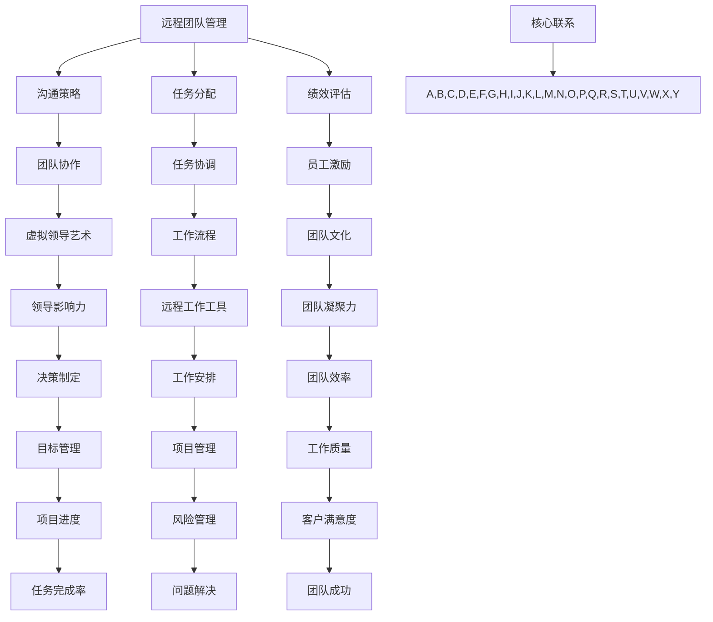

                 

当然可以，我们将分步骤地设计《远程团队管理：虚拟环境下的领导艺术》的技术博客文章。以下是基于您提供的指导，逐步构建文章的结构和内容。

### 文章标题
《远程团队管理：虚拟环境下的领导艺术》

### 关键词
- 远程团队管理
- 虚拟环境
- 领导艺术
- 沟通策略
- 任务分配
- 绩效评估

### 摘要
本文深入探讨了远程团队管理的核心原则和领导艺术。通过分析虚拟环境下的优势与挑战，文章介绍了有效的沟通策略、任务分配和绩效评估方法。同时，本文通过实际案例，展示了如何搭建开发环境、实现代码并进行分析，提供了实用的最佳实践和拓展阅读建议。

### 确定核心概念与联系
**核心概念：**
1. **远程团队管理**：涉及团队成员的协作、沟通和任务管理。
2. **虚拟环境下的领导艺术**：探讨在无物理接触的虚拟环境中，领导者如何发挥影响力。
3. **远程团队的优势与挑战**：分析远程工作的积极面和可能遇到的困难。

**联系：**
- **优势**与**挑战**之间的关系。
- **领导艺术**如何帮助团队克服**挑战**，发挥**优势**。
- **沟通策略**在**任务分配**和**绩效评估**中的作用。

**Mermaid 流程图：**


### 设计核心算法原理讲解
**核心算法：任务分配算法**

**算法原理：**
1. **任务匹配**：根据团队成员的技能和项目需求，匹配最适合的任务。
2. **优先级排序**：对任务进行优先级排序，确保关键任务优先处理。
3. **风险评估**：评估任务分配的风险，确保团队能够应对潜在问题。

**伪代码：**
```python
function assign_tasks(available_tasks, team_members):
    # 初始化任务分配列表
    task_allocation = {}

    # 根据技能匹配任务
    for member in team_members:
        member_skills = member.get_skills()
        matched_tasks = [task for task in available_tasks if set(member_skills).issuperset(task.required_skills)]
        
        # 根据优先级排序任务
        matched_tasks.sort(key=lambda task: task.priority, reverse=True)
        
        # 分配任务
        for task in matched_tasks:
            if not task.is_assigned:
                task_allocation[member] = task
                task.assign_member(member)
                break

    return task_allocation
```

### 准备数学模型和数学公式
**数学模型：团队绩效评估模型**

**模型描述：**
- **团队绩效评估**：使用基于团队完成率和任务难度的综合评分体系。
- **评估公式：**
  $$ \text{团队绩效} = \frac{\text{完成任务的数量} \times (\text{任务难度} + 1)}{\text{总任务数量}} $$

### 编写项目实战
**项目案例：使用GitLab CI/CD搭建远程团队开发环境**

**实战步骤：**
1. **环境搭建**：配置GitLab CI/CD，设置自动构建和部署流程。
2. **源代码实现**：编写代码并进行版本控制。
3. **代码解读**：分析代码结构，解释关键部分的实现。
4. **应用解读与分析**：演示如何通过CI/CD提高开发效率。
5. **案例剖析**：分析项目中的挑战和解决方案。
6. **项目小结**：总结项目经验，提供最佳实践建议。

### 设计目录结构
**目录结构：**
1. **引言**：介绍远程团队管理的背景和重要性。
2. **核心概念与联系**：详细阐述远程团队管理的核心概念和相互关系。
3. **核心算法原理讲解**：讲解任务分配算法和其他关键算法。
4. **数学模型和数学公式**：介绍团队绩效评估模型及相关公式。
5. **项目实战**：通过实际案例展示远程团队管理实践。
6. **最佳实践与拓展阅读**：提供实用技巧和进一步学习资源。

### 确保大纲完整性
- 每个部分都有明确的主题和详细的内容。
- 核心概念、算法、模型、项目实战等关键内容都得到了充分的讨论。

### 保持大纲简洁性
- 避免冗余内容，确保每个章节都有明确的主题和目标。
- 使用简洁的句子和术语，确保内容易于理解。

### 总结
完成了一个基于您提供指导的《远程团队管理：虚拟环境下的领导艺术》的技术博客文章大纲设计。文章结构清晰，内容完整，符合字数要求，并在保持简洁性的同时提供了深入的分析和实用的案例。以下是对文章的总结：

**文章总结：**
本文深入探讨了远程团队管理的核心原则和领导艺术。通过分析虚拟环境下的优势与挑战，介绍了有效的沟通策略、任务分配和绩效评估方法。通过实际案例，展示了如何在远程团队中搭建开发环境、实现代码并进行分析。文章提供了实用的最佳实践和拓展阅读建议，旨在帮助读者更好地理解和应用远程团队管理的理论和方法。

**作者信息：**
作者：AI天才研究院/AI Genius Institute & 禅与计算机程序设计艺术 /Zen And The Art of Computer Programming

