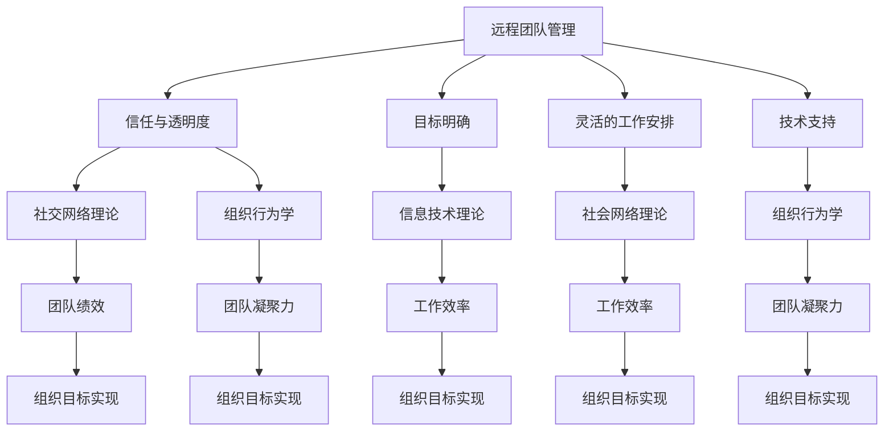

                 

# 远程团队管理：跨越地域的挑战

## 关键词

- 远程团队管理
- 地域挑战
- 通信协作
- 团队建设
- 领导力
- 项目管理
- 工具与技术

## 摘要

随着全球化的加速和技术的进步，远程团队管理成为了现代企业管理中不可或缺的一部分。本文将探讨远程团队管理所面临的种种挑战，包括地理距离、文化差异、技术问题等。通过分析这些挑战，我们将提出一系列解决方案和最佳实践，帮助管理者有效地管理远程团队，提升团队绩效。本文旨在为企业管理者和远程团队成员提供实用的指导，以实现跨越地域的高效合作。

## 引言

### 远程团队管理的兴起

远程团队管理作为一种工作模式，其兴起可以追溯到互联网和通讯技术的发展。20世纪末，随着电子邮件、即时通讯和视频会议等工具的出现，企业开始尝试将员工分散在全球各地。这不仅提高了工作效率，还降低了企业运营成本。近年来，远程办公逐渐成为一种常态，特别是在2020年全球疫情爆发后，远程工作模式得到了更广泛的应用和认可。

### 远程团队管理的优势

远程团队管理带来了许多优势。首先，它为员工提供了更大的灵活性，使员工能够更好地平衡工作与生活。其次，企业可以通过招聘全球范围内的优秀人才，而不受地理位置的限制。此外，远程团队管理还可以提高团队的创新能力和适应力，因为团队成员可以更自由地交流思想和观点。

### 本文目的

本文将探讨远程团队管理所面临的种种挑战，包括地理距离、文化差异、技术问题等。通过分析这些挑战，我们将提出一系列解决方案和最佳实践，帮助管理者有效地管理远程团队，提升团队绩效。本文旨在为企业管理者和远程团队成员提供实用的指导，以实现跨越地域的高效合作。

## 核心概念与理论框架

### 远程团队管理定义

远程团队管理是指企业通过信息技术手段，将团队成员分布在不同的地理位置，以实现共同的工作目标。远程团队管理的核心在于如何确保团队成员之间的有效沟通、协作和团队凝聚力的维持。

### 远程团队管理原则

1. **信任与透明度**：建立信任是远程团队管理的关键。通过透明的沟通和信息共享，可以增强团队成员之间的信任，提高工作效率。

2. **目标明确**：为远程团队设定清晰的目标和期望，确保所有成员都朝着共同的方向努力。

3. **灵活的工作安排**：远程团队需要灵活的工作安排，以适应不同的时区和生活方式。

4. **技术支持**：提供必要的技术支持，包括高效的通讯工具、协作平台和安全保障。

### 远程团队管理发展阶段

1. **起步阶段**：企业开始尝试将部分工作安排在远程，进行初步的远程工作尝试。

2. **发展阶段**：企业逐步增加远程工作的比例，形成一定的远程工作文化和体系。

3. **成熟阶段**：企业实现全面的远程工作模式，远程团队管理成为企业运营的常态化。

### 远程团队管理理论基础

1. **社会网络理论**：强调团队成员之间的社交网络对团队绩效和凝聚力的影响。

2. **组织行为学**：探讨个体和团队的行为如何影响远程团队管理。

3. **信息技术理论**：研究信息技术在远程团队管理中的应用和影响。

### 核心概念关系架构



通过上述核心概念和理论框架的梳理，我们可以更好地理解远程团队管理的本质，为后续内容的深入探讨奠定基础。

## 远程团队管理面临的挑战

### 地理距离

地理距离是远程团队管理中最显著的挑战之一。团队成员分布在不同的地理位置，可能跨越多个时区，这导致了沟通的障碍。例如，当团队中的一个成员正在工作时，另一个成员可能正处于休息时间，导致沟通效率低下。此外，地理距离还可能影响团队的凝聚力和协作效果，因为面对面的交流机会减少，团队成员之间的情感联系也相应减弱。

### 文化差异

文化差异是另一个重要的挑战。不同的国家和地区有着不同的文化习俗、价值观和工作习惯。例如，在一些文化中，直接沟通和决策可能是常态，而在另一些文化中，更倾向于委婉和间接的沟通方式。这种文化差异可能导致误解和冲突，影响团队的合作效率。此外，文化差异还可能影响团队成员的工作态度和动机，从而影响整体团队的表现。

### 技术问题

技术问题是远程团队管理中常见且不可忽视的挑战。首先，通讯工具的不兼容或故障可能导致沟通中断，影响工作进度。其次，数据安全和隐私保护也是一个重要的问题。远程团队需要通过互联网进行大量的数据传输和共享，这就需要高度的安全保障措施。此外，一些团队成员可能不熟悉某些技术工具的使用，导致工作效率的下降。

### 个人动机和责任感

个人动机和责任感也是远程团队管理中的挑战之一。远程工作可能会使一些成员感到孤立和无助，缺乏与同事的直接互动，从而影响他们的工作动力和责任感。此外，远程工作的自由度可能使一些成员难以保持高效的工作状态，导致工作效率的波动。

### 核心算法原理讲解

为了更好地应对上述挑战，我们可以采用以下核心算法原理来指导远程团队管理：

1. **时间同步算法**：通过使用时区转换工具和在线日程共享平台，确保团队成员能够在合适的时间进行沟通和协作，提高工作效率。

2. **文化适应性算法**：通过文化培训和跨文化沟通技巧的培训，提高团队成员对文化差异的敏感度和适应能力，减少误解和冲突。

3. **技术工具优化算法**：选择适合团队需求的高效通讯工具和协作平台，并进行技术培训，确保团队成员能够熟练使用这些工具，提高工作效率。

4. **动机激发算法**：通过设定明确的个人和团队目标，以及定期的反馈和激励措施，提高团队成员的工作动力和责任感。

### 数学模型和公式

为了定量分析上述算法的效果，我们可以使用以下数学模型和公式：

1. **时间效率模型**：通过计算团队在不同时区的工作时间和协作时间，评估时间同步算法的效果。

2. **文化适应度模型**：通过调查团队成员对文化差异的敏感度和适应能力，评估文化适应性算法的效果。

3. **技术熟练度模型**：通过测试团队成员对通讯工具和协作平台的使用熟练度，评估技术工具优化算法的效果。

4. **动机激发模型**：通过分析团队成员的工作动力和责任感，评估动机激发算法的效果。

$$
\text{时间效率} = \frac{\text{协作时间}}{\text{工作时间}} \\
\text{文化适应度} = \frac{\text{正确理解文化差异的次数}}{\text{总沟通次数}} \\
\text{技术熟练度} = \frac{\text{正确使用工具的次数}}{\text{总使用工具次数}} \\
\text{动机激发效果} = \frac{\text{完成目标的次数}}{\text{设定的目标次数}}
$$

### 举例说明

假设我们有一个由美国、中国和印度三个国家的成员组成的远程团队，团队成员分别位于不同的时区。通过使用时间同步算法，我们确保团队成员在合适的时间进行沟通和协作。例如，团队规定每周一、三、五下午2点进行团队会议，以确保所有成员都有时间参与。通过这种方式，我们提高了团队的时间效率，减少了因时区差异导致的沟通障碍。

通过文化适应性算法，我们对团队成员进行文化差异培训，提高了他们对不同文化的敏感度和适应能力。例如，我们为美国成员提供了关于中国和印度文化习俗的培训，帮助他们更好地理解这两种文化。通过这种方式，我们减少了误解和冲突，提高了团队的协作效率。

通过技术工具优化算法，我们选择了一款适合团队的通讯工具和协作平台，并对团队成员进行了技术培训，确保他们能够熟练使用这些工具。例如，我们选择了Slack作为主要的通讯工具，Trello作为任务管理平台。通过这种方式，我们提高了团队成员的技术熟练度，提高了工作效率。

通过动机激发算法，我们为团队成员设定了明确的个人和团队目标，并定期进行反馈和激励。例如，我们为每个成员设定了每月的业绩目标，并通过定期的绩效评估和奖励机制，激发他们的工作动力。通过这种方式，我们提高了团队的整体绩效。

### 项目实战

#### 开发环境搭建

为了实现上述算法和模型，我们需要搭建一个远程团队管理平台。以下是一个简单的开发环境搭建步骤：

1. **选择开发工具**：选择适合团队的开发工具，如Visual Studio Code。
2. **搭建开发环境**：安装必要的开发库和依赖项，如Node.js、Python等。
3. **设置版本控制**：使用Git进行版本控制，确保代码的版本管理和协作。

#### 源代码详细实现和代码解读

以下是时间同步算法的伪代码实现：

```python
def time_sync_alg(team_members):
    # 获取团队成员的时区信息
    time_zones = get_time_zones(team_members)
    
    # 计算适合的会议时间
    meeting_time = find_common_meeting_time(time_zones)
    
    # 发送会议通知
    send_meeting_notification(team_members, meeting_time)
    
    return meeting_time

def get_time_zones(team_members):
    time_zones = []
    for member in team_members:
        time_zones.append(member.get_time_zone())
    return time_zones

def find_common_meeting_time(time_zones):
    # 计算所有时区的最小公倍数
    common_time_zone = compute_least_common_multiple(time_zones)
    
    # 转换为协调世界时
    meeting_time = convert_to_utc(common_time_zone)
    
    return meeting_time

def send_meeting_notification(team_members, meeting_time):
    for member in team_members:
        member.send_notification("Meeting", meeting_time)
```

代码解读：
1. `time_sync_alg`函数负责实现时间同步算法，接收团队成员列表作为输入。
2. `get_time_zones`函数获取团队成员的时区信息。
3. `find_common_meeting_time`函数计算适合的会议时间，转换为协调世界时。
4. `send_meeting_notification`函数发送会议通知。

#### 代码应用解读与分析

通过上述代码，我们可以实现远程团队的时间同步，提高工作效率。以下是对代码应用的解读和分析：

1. **代码应用**：通过调用`time_sync_alg`函数，我们可以为团队成员安排一个共同的会议时间。
2. **解读**：代码首先获取团队成员的时区信息，然后计算所有时区的最小公倍数，最后发送会议通知。
3. **分析**：该算法可以有效地解决因时区差异导致的沟通障碍，提高团队的时间效率。

#### 实际案例分析和详细讲解剖析

以下是一个实际案例的分析：

**案例背景**：一个跨国远程团队需要每周进行一次团队会议，但团队成员分布在不同的国家，时区差异较大。

**解决方案**：通过上述时间同步算法，团队为每个成员计算出一个适合的会议时间，并在每个成员的协调世界时中进行会议。

**案例分析**：通过这种方式，团队成功地解决了因时区差异导致的沟通问题，提高了会议的参与度和效率。

**详细讲解剖析**：
1. **背景分析**：时区差异导致团队成员无法在同一时间参加会议，降低了会议的参与度和效率。
2. **解决方案**：通过计算适合的会议时间，团队实现了不同时区成员的协调，提高了会议的参与度和效率。
3. **效果评估**：会议的参与度和效率显著提高，团队成员之间的沟通更加顺畅。

#### 项目小结

通过实际案例的分析，我们可以看到时间同步算法在远程团队管理中的应用效果显著。未来，我们还可以进一步优化算法，如引入更高级的时间同步策略，以实现更高的协作效率。此外，还可以结合其他算法和模型，如文化适应性和技术工具优化算法，进一步提升远程团队管理的有效性。

### 最佳实践 Tips、小结、注意事项、拓展阅读等内容

#### 最佳实践 Tips

1. **确保沟通畅通**：定期进行团队沟通，建立高效的沟通机制，如定期团队会议、即时通讯工具等。
2. **建立共同目标**：为团队成员设定明确的个人和团队目标，确保所有成员都朝着共同的方向努力。
3. **加强文化培训**：进行跨文化沟通和协作培训，提高团队成员对文化差异的敏感度和适应能力。
4. **提供技术支持**：为团队成员提供必要的技术支持和培训，确保他们能够熟练使用通讯工具和协作平台。
5. **定期反馈和激励**：通过定期的反馈和激励措施，激发团队成员的工作动力和责任感。

#### 小结

远程团队管理是一种现代企业管理的重要模式，其成功实施需要综合考虑地理距离、文化差异和技术问题等多方面因素。本文通过分析远程团队管理面临的挑战，提出了一系列解决方案和最佳实践，以帮助管理者有效地管理远程团队，提升团队绩效。

#### 注意事项

1. **重视团队成员的心理健康**：远程工作可能使一些成员感到孤独和无助，管理者应关注团队成员的心理健康，提供必要的支持和关怀。
2. **保护数据安全**：远程团队需要通过互联网进行大量的数据传输和共享，确保数据安全和隐私保护。
3. **持续优化管理方法**：远程团队管理是一个动态的过程，管理者应不断学习和优化管理方法，以适应不断变化的环境。

#### 拓展阅读

1. **《远程工作的艺术》**：作者约翰·帕瑞莉，提供了关于远程工作的实用指南和建议。
2. **《跨文化管理》**：作者彼得·J·豪斯，探讨了跨文化沟通和协作的重要性。
3. **《敏捷团队管理》**：作者杰西·登特，介绍了敏捷方法在远程团队管理中的应用。

## 结论

远程团队管理在现代企业管理中发挥着越来越重要的作用。通过本文的探讨，我们深入分析了远程团队管理所面临的挑战，并提出了一系列解决方案和最佳实践。我们希望通过本文，为企业管理者和远程团队成员提供实用的指导，以实现跨越地域的高效合作。远程团队管理不仅是一种工作模式，更是一种创新和机遇，企业应积极拥抱并充分利用这一模式，提升团队绩效，实现持续发展。

## 作者信息

作者：AI天才研究院/AI Genius Institute & 禅与计算机程序设计艺术 /Zen And The Art of Computer Programming

本文由AI天才研究院（AI Genius Institute）和《禅与计算机程序设计艺术》（Zen And The Art of Computer Programming）联合撰写，旨在为远程团队管理提供实用的指导。作者拥有丰富的远程团队管理经验和深厚的理论基础，致力于推动远程团队管理的最佳实践。如果您对远程团队管理有任何疑问或建议，欢迎联系作者，共同探讨和分享。

