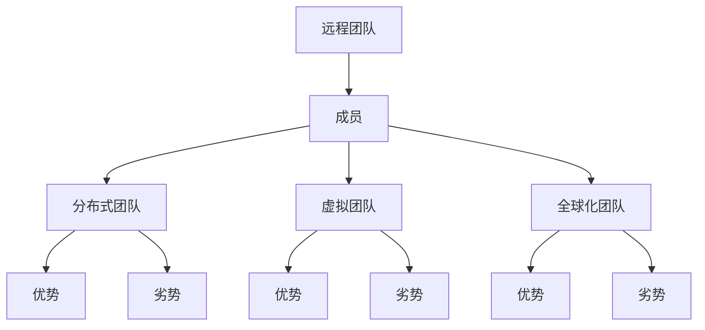
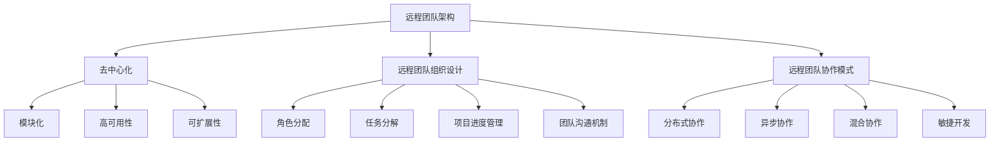
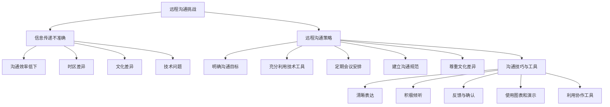

                 

## 引言

在现代职场环境中，远程工作已经成为一种不可逆转的趋势。随着互联网技术的迅猛发展和全球数字化进程的加速，远程团队逐渐成为企业运营的重要组成。远程团队领导：数字时代的管理艺术，正是为了探讨这一新兴领域中的管理挑战与机遇，而精心撰写的一本指导性书籍。

远程团队领导：数字时代的管理艺术，旨在帮助团队领导者在数字化时代中应对远程管理的复杂性。本书将带领读者深入了解远程工作的背景、核心概念、架构与组织设计、沟通策略、协作工具与技术、绩效管理以及领导力提升等方面的内容。

本文将采用逻辑清晰、结构紧凑、简单易懂的写作方式，通过逐步分析推理（REASONING STEP BY STEP），深入探讨远程团队领导在数字时代中的管理艺术。我们将从以下几个方面展开讨论：

1. **远程工作的背景与现状**：探讨远程工作的起源与发展，分析数字时代远程工作的特点以及面临的挑战与机遇。
2. **远程团队的核心概念**：介绍远程团队的定义与类型，分析远程团队的优势与劣势，展示远程团队的核心概念流程图。
3. **远程团队的架构与组织设计**：阐述远程团队的架构设计原则、组织设计以及协作模式。
4. **远程团队沟通策略**：分析远程沟通的挑战，探讨有效沟通策略，介绍沟通技巧与工具。
5. **远程团队协作工具与技术**：分类讨论远程协作工具的类型与选择，探讨协作技术的应用场景，分享实际应用案例。
6. **远程团队的绩效管理**：讨论远程绩效管理的特殊性，介绍远程绩效评估指标以及管理方法。
7. **远程团队的领导力挑战与提升**：分析远程领导力的核心要素，探讨提升远程领导力的策略，分享实践案例。

通过本文的逐步分析，读者将能够系统地理解远程团队领导在数字时代中的管理艺术，为实践提供有力的理论支持。让我们开始这场探索之旅吧！

### 文章标题

## 《远程团队领导：数字时代的管理艺术》

### 文章关键词

- 远程工作
- 数字时代
- 团队领导
- 管理艺术
- 沟通策略
- 协作工具
- 绩效管理
- 领导力提升

### 文章摘要

随着远程工作的普及，远程团队领导在数字时代面临着前所未有的挑战和机遇。本文深入探讨了远程团队领导的核心概念、架构设计、沟通策略、协作工具、绩效管理和领导力提升等方面的内容。通过逻辑清晰、结构紧凑的分析，本文为读者提供了系统的理论和实践指导，以应对远程团队管理的复杂性。

### 第1章 远程工作的背景与现状

#### 1.1 远程工作的起源与发展

远程工作并非是一个新兴概念，早在20世纪初期，一些企业就开始尝试让员工在家工作。然而，真正推动远程工作发展的转折点发生在互联网的普及和全球化的背景下。1995年，美国远程工作协会（American Telecommuting Association）成立，标志着远程工作开始获得广泛的关注。

进入21世纪，远程工作逐渐成为企业运营的一部分。特别是在2008年金融危机之后，企业为了降低运营成本，提升员工工作效率，越来越多地采用远程办公模式。随着云计算、协作工具和视频会议技术的不断发展，远程工作得到了更为广泛的应用。

近年来，远程工作的普及速度进一步加快。根据远程工作统计网站Global Workforce Analytics的数据，2021年全球远程工作人数已达到4.77亿人，占全球劳动力的37%。这一数字预计将在未来几年内继续增长。

#### 1.2 数字时代的远程工作特点

数字时代的远程工作具有以下特点：

1. **灵活的工作时间**：远程工作使员工能够自主安排工作时间和地点，提高了工作效率和满意度。
2. **全球化团队**：远程工作打破了地理限制，企业可以招募来自世界各地的优秀人才，形成全球化团队。
3. **依赖技术工具**：远程工作高度依赖各种技术工具，如电子邮件、即时通讯、协作平台、项目管理工具等，以保持团队之间的沟通和协作。
4. **自我管理要求高**：远程工作要求员工具备较强的自我管理能力，包括时间管理、任务管理和情绪管理等。
5. **信息安全挑战**：远程工作增加了企业信息安全的风险，需要采取更加严格的措施保护企业数据。

#### 1.3 远程工作的挑战与机遇

远程工作带来了诸多挑战，同时也为企业提供了新的机遇：

1. **挑战**：
   - **沟通障碍**：远程工作使得沟通变得更加复杂，容易出现信息传递不准确、不及时的情况。
   - **协作困难**：远程团队在协作过程中可能面临时间差、文化差异等问题，影响工作效率。
   - **团队凝聚力不足**：远程团队缺乏面对面交流的机会，容易导致团队凝聚力下降。
   - **信息安全风险**：远程工作增加了企业信息安全的风险，需要投入更多资源进行安全防护。

2. **机遇**：
   - **降低运营成本**：远程工作可以减少企业的办公空间和设施投入，降低运营成本。
   - **提升员工满意度**：远程工作提高了员工的工作灵活性，有助于提高员工满意度和忠诚度。
   - **全球化视野**：远程工作使企业能够招募来自不同文化背景的员工，拓展企业的全球视野。
   - **创新氛围**：远程工作环境更加自由，有利于员工发挥创造力，推动企业创新。

综上所述，远程工作在数字时代已经成为企业运营的重要组成部分。了解远程工作的起源与发展、特点以及面临的挑战与机遇，对于团队领导者和远程团队成员来说至关重要。下一章节将深入探讨远程团队的核心概念，帮助读者更好地理解这一新兴领域。

#### 1.4 远程团队的核心概念

远程团队是指在虚拟环境中协同工作的团队，团队成员分布在不同的地理位置，通过互联网和其他通信技术进行合作。远程团队的核心概念包括远程工作的定义、类型、优势与劣势等方面。

首先，从定义来看，远程团队是指那些通过信息技术手段在虚拟空间中协同工作的团队成员集合。这些团队成员可能位于不同的城市、国家甚至是时区，但他们通过电子邮件、即时通讯、视频会议、协作平台等工具保持沟通和协作。

其次，远程团队可以分为以下几种类型：

1. **分布式团队**：团队成员分布在不同的地理位置，但仍处于同一组织内部。这种类型的团队通常在大型企业中较为常见。
2. **虚拟团队**：团队成员来自不同的组织，通过互联网进行合作。这种类型的团队通常在项目合作中较为常见。
3. **全球化团队**：团队成员来自不同的国家和文化背景，通过互联网在全球范围内进行合作。这种类型的团队有助于企业拓展国际市场。

在讨论远程团队的优势与劣势时，需要综合考虑以下几个方面：

1. **优势**：
   - **提高员工满意度**：远程工作提供了更大的灵活性，有助于提高员工的工作满意度和忠诚度。
   - **降低运营成本**：远程工作减少了企业对办公空间和设施的投入，有助于降低运营成本。
   - **扩展人才池**：远程工作打破了地理限制，使企业能够招募来自全球的顶尖人才。
   - **提升工作效率**：远程工作使员工能够自主安排工作和休息时间，提高工作效率。

2. **劣势**：
   - **沟通障碍**：远程工作容易导致信息传递不及时、不准确，影响团队协作。
   - **协作困难**：远程团队在协作过程中可能面临时间差、文化差异等问题，影响工作效率。
   - **团队凝聚力下降**：远程团队缺乏面对面交流的机会，容易导致团队凝聚力下降。
   - **信息安全风险**：远程工作增加了企业信息安全的风险，需要投入更多资源进行安全防护。

为了更好地理解远程团队的核心概念，我们可以通过一个Mermaid流程图来展示远程团队的主要组成部分和关系：

通过这个流程图，我们可以清晰地看到远程团队的不同类型以及它们各自的优势与劣势。

综上所述，远程团队的核心概念是远程工作的定义、类型、优势与劣势。了解这些核心概念有助于团队领导者和远程团队成员更好地应对远程工作中的各种挑战，提高团队协作效率。下一章节将探讨远程团队的架构与组织设计，进一步揭示远程团队管理的奥秘。

### 第2章 远程团队的架构与组织设计

#### 2.1 远程团队的架构设计原则

远程团队的架构设计需要充分考虑团队成员的分布、工作流程、协作模式等因素，以确保团队的高效运作。以下是远程团队架构设计的基本原则：

1. **去中心化**：远程团队应该采用去中心化的架构设计，使每个成员都能够独立完成任务，降低对中心节点的依赖。
2. **模块化**：远程团队的架构应具备模块化特性，每个模块都可以独立运行，同时与其他模块协同工作。
3. **高可用性**：远程团队的架构需要具备高可用性，确保在部分节点故障的情况下，整个团队仍能保持正常运行。
4. **可扩展性**：远程团队的架构应具备良好的可扩展性，能够随着团队规模的扩大和需求的增长而灵活调整。

#### 2.2 远程团队的组织设计

远程团队的组织设计旨在确保团队成员之间的有效协作和高效沟通。以下是远程团队组织设计的关键要素：

1. **角色分配**：明确团队成员的角色和职责，确保每个成员都了解自己的工作内容和目标。
2. **任务分解**：将复杂的项目任务分解为小任务，并分配给合适的团队成员，确保任务按时完成。
3. **项目进度管理**：采用项目管理工具（如JIRA、Trello等）对项目进度进行实时跟踪和监控，确保项目按计划推进。
4. **团队沟通机制**：建立有效的沟通机制，包括定期的团队会议、邮件更新、即时通讯工具等，确保团队成员之间的信息畅通。

#### 2.3 远程团队的协作模式

远程团队的协作模式是团队高效运作的关键。以下是几种常见的远程协作模式：

1. **分布式协作**：团队成员分布在不同地理位置，通过在线协作工具（如Slack、Zoom等）进行实时沟通和协作。
2. **异步协作**：团队成员在不同时间完成任务，并通过邮件、任务管理工具等工具进行沟通和协作。
3. **混合协作**：结合分布式协作和异步协作的优点，确保团队成员在不同时间、不同地点能够高效地完成工作。
4. **敏捷开发**：采用敏捷开发方法，通过短周期迭代和频繁的团队会议，确保项目进度和质量的实时监控和调整。

为了更好地理解远程团队的架构与组织设计，我们可以通过一个Mermaid流程图来展示远程团队的主要架构和协作模式：

通过这个流程图，我们可以清晰地看到远程团队的架构设计原则、组织设计要素以及协作模式。了解这些内容有助于团队领导者和远程团队成员更好地构建和管理远程团队，提高团队协作效率。

综上所述，远程团队的架构与组织设计是确保团队高效运作的关键。通过合理的架构设计、组织设计以及协作模式，远程团队可以克服地理限制，实现高效协作，为企业创造更多价值。下一章节将探讨远程团队沟通策略，揭示如何通过有效的沟通保持团队凝聚力和效率。

### 第3章 远程团队沟通策略

#### 3.1 远程沟通的挑战

远程沟通相较于面对面的交流，存在诸多挑战。了解这些挑战有助于团队领导者制定有效的沟通策略。

1. **信息传递不准确**：由于缺乏面对面交流的语境和表情，信息传递容易产生偏差，导致误解和沟通障碍。
2. **沟通效率低下**：远程沟通往往需要依赖文字和语音，信息传递速度较慢，影响沟通效率。
3. **时区差异**：跨时区的远程团队在沟通时，可能会遇到工作时间的不匹配，导致信息传递滞后。
4. **文化差异**：不同文化背景的团队成员在沟通时，可能会因为语言、行为习惯等方面的差异而产生误解。
5. **技术问题**：远程沟通需要依赖网络和通信技术，技术问题如网络不稳定、设备故障等会影响沟通效果。

#### 3.2 远程沟通的有效策略

为了克服远程沟通的挑战，团队领导者可以采取以下有效策略：

1. **明确沟通目标**：在每次沟通前，明确沟通的目标和预期成果，确保沟通内容有针对性。
2. **充分利用技术工具**：选择合适的沟通工具，如视频会议、即时通讯、协作平台等，以提高沟通效率。
3. **定期会议安排**：定期举行团队会议，包括周会、月会等，确保团队成员之间的信息畅通。
4. **建立沟通规范**：制定沟通规范，如邮件格式、沟通用语等，以提高沟通的准确性和效率。
5. **尊重文化差异**：了解团队成员的文化背景，尊重不同的沟通习惯，避免因文化差异导致的误解。

#### 3.3 沟通技巧与工具

为了提高远程沟通的效果，团队领导者可以运用以下沟通技巧和工具：

1. **清晰表达**：在沟通时，尽量使用简洁明了的语言，避免使用含糊不清的表达方式。
2. **积极倾听**：在沟通中，积极倾听对方的意见和需求，确保理解对方的意图。
3. **反馈与确认**：在沟通后，及时给予反馈，并确认对方是否理解了沟通内容。
4. **使用图表和演示**：在必要时，使用图表、演示文稿等可视化工具，以更好地传达信息。
5. **利用协作工具**：使用如Slack、Microsoft Teams、Trello等协作工具，实时跟踪项目进度和沟通内容。

通过以上沟通技巧和工具，团队领导者可以有效地克服远程沟通的挑战，提高团队协作效率。下面我们通过一个Mermaid流程图来展示远程沟通的策略和工具：

通过这个流程图，我们可以清晰地看到远程沟通的挑战、策略和工具。了解这些内容有助于团队领导者在远程团队管理中更好地应对沟通挑战，提高团队协作效率。

综上所述，远程团队沟通策略是确保团队高效协作的关键。通过识别沟通挑战、制定有效策略和运用沟通技巧与工具，团队领导者可以克服远程沟通的障碍，提高团队协作效率。下一章节将探讨远程团队协作工具与技术，揭示如何通过先进的技术手段提升团队协作能力。

### 第4章 远程团队协作工具与技术

#### 4.1 远程协作工具的类型与选择

远程协作工具是远程团队高效协作的重要支撑。根据功能不同，远程协作工具主要可以分为以下几类：

1. **即时通讯工具**：如Slack、Microsoft Teams、WhatsApp等，用于实时沟通和交流。
2. **视频会议工具**：如Zoom、Microsoft Teams、Google Meet等，用于线上会议和远程培训。
3. **项目管理工具**：如JIRA、Trello、Asana等，用于任务分配、进度跟踪和项目协作。
4. **文件共享与协作工具**：如Google Drive、Dropbox、OneDrive等，用于文件存储、共享和协同编辑。
5. **代码协作工具**：如GitLab、GitHub、Bitbucket等，用于代码管理、版本控制和团队协作。
6. **时间追踪与工作分析工具**：如Toggl、Harvest、RescueTime等，用于记录工作时间、分析工作效率。

选择合适的远程协作工具，需要考虑团队规模、工作性质、协作需求等因素。例如，对于小型团队，可以使用Slack和Trello等简单易用的工具；对于大型团队，可能需要使用更加专业和功能丰富的工具，如JIRA和GitLab。

#### 4.2 远程协作技术的应用场景

远程协作技术在各种应用场景中发挥着重要作用，以下是一些常见的应用场景：

1. **项目协作**：在项目开发过程中，远程协作工具可以帮助团队成员实时沟通、任务分配、进度跟踪和协作开发。
2. **远程办公**：远程办公环境下，视频会议工具和即时通讯工具可以帮助团队成员在线会议、讨论问题和分享心得。
3. **在线培训**：远程协作工具可以用于在线培训，包括直播授课、互动讨论和课程资料共享。
4. **客户支持**：远程协作工具可以帮助客户支持团队在线解决客户问题，提高客户满意度。
5. **远程协作研讨会**：远程协作工具可以用于在线研讨会、讲座和培训活动，提高参与度和互动性。

#### 4.3 协作工具与技术的实际应用案例

以下是几个远程协作工具与技术的实际应用案例：

1. **案例1：敏捷开发团队使用JIRA和GitLab**
   - **需求分析**：团队成员在JIRA中创建任务和需求，进行需求讨论和评估。
   - **任务分配**：根据团队成员的技能和空闲时间，将任务分配给合适的成员。
   - **进度跟踪**：使用JIRA的看板视图实时跟踪任务进度，确保项目按计划推进。
   - **代码管理**：使用GitLab进行代码版本控制和团队协作，确保代码质量和协作效率。

2. **案例2：远程办公团队使用Slack和Zoom**
   - **日常沟通**：团队成员通过Slack进行日常沟通，包括工作讨论、信息分享和任务提醒。
   - **在线会议**：定期使用Zoom进行在线会议，包括团队会议、项目讨论和问题解答。
   - **文件共享**：使用Google Drive或Dropbox共享项目文件和资料，确保团队成员可以实时访问和编辑。

3. **案例3：在线培训团队使用Microsoft Teams和PowerPoint**
   - **直播授课**：使用Microsoft Teams进行直播授课，包括课程讲解、互动讨论和答疑。
   - **课程资料共享**：将课程PPT、文档和视频上传至共享平台，供学员随时查看和学习。
   - **互动讨论**：使用Microsoft Teams的聊天功能和讨论板，促进学员之间的互动和交流。

通过这些实际应用案例，我们可以看到远程协作工具和技术在提高团队协作效率、优化工作流程和提升企业竞争力方面的重要作用。在下一章节中，我们将探讨如何通过远程团队绩效管理提升团队整体表现。

### 第5章 远程团队的绩效管理

#### 6.1 远程绩效管理的特殊性

远程绩效管理相较于传统面对面管理模式，具有一些特殊性，需要团队领导者特别注意。

1. **缺少直接监督**：远程工作环境下，领导者无法直接观察员工的工作状态，导致对员工工作情况的监督力度减弱。
2. **信息传递偏差**：远程沟通中可能存在信息传递不准确或滞后的问题，影响员工对工作目标和要求的理解。
3. **时区差异**：不同时区的员工可能无法在同一时间段进行工作和沟通，影响团队合作和协作效率。
4. **自我管理要求高**：远程工作要求员工具备更强的自我管理能力，包括时间管理、任务管理和情绪管理等。
5. **绩效评估难度**：由于缺乏直接的观察和互动，评估员工的绩效变得更加复杂和主观。

#### 6.2 远程绩效评估指标

为了克服远程绩效管理的特殊性，团队领导者可以制定以下远程绩效评估指标：

1. **任务完成度**：评估员工是否按时、按质、按量完成分配的任务，关注任务的完成率和质量。
2. **工作效率**：评估员工在工作中的表现，包括工作速度、准确性和问题解决能力等。
3. **团队合作**：评估员工在团队中的协作情况，包括沟通能力、协作态度和贡献度等。
4. **工作质量**：评估员工的工作成果，包括工作的准确性、专业性和创新性等。
5. **自我管理能力**：评估员工的时间管理、任务管理和情绪管理等自我管理能力。
6. **工作满意度**：了解员工对工作的满意度，包括工作环境、工作内容和团队氛围等。

#### 6.3 远程绩效管理的方法

为了有效进行远程绩效管理，团队领导者可以采用以下方法：

1. **设定明确的目标**：在项目开始前，与员工共同设定明确的目标和期望，确保员工了解工作内容和目标要求。
2. **定期绩效评估**：通过定期绩效评估，及时了解员工的工作表现，发现问题和改进方向。
3. **利用技术工具**：利用远程协作工具（如JIRA、Trello等）实时跟踪任务进度和工作成果，提高评估的准确性。
4. **沟通与反馈**：与员工保持定期沟通，了解他们的工作情况、困难和需求，及时给予反馈和指导。
5. **培训与发展**：为员工提供培训和发展机会，帮助他们提升技能和能力，提高绩效水平。
6. **激励与奖励**：制定合理的激励和奖励机制，激发员工的工作积极性和创造力。

通过以上方法，团队领导者可以有效地进行远程绩效管理，提高员工的工作效率和满意度，提升团队的整体表现。在下一章节中，我们将探讨如何通过远程领导力的提升，克服远程团队管理的挑战。

### 第6章 远程团队的领导力挑战与提升

#### 7.1 远程领导力的核心要素

远程领导力是确保远程团队高效运作的关键因素。以下是远程领导力的核心要素：

1. **信任与透明度**：建立团队成员之间的信任，确保团队成员之间信息透明，减少猜疑和误解。
2. **目标一致**：确保团队成员明确共同目标，并朝着同一方向努力，提高团队凝聚力。
3. **沟通技巧**：具备良好的沟通技巧，能够有效传达信息、倾听意见、解决冲突。
4. **自我管理能力**：具备自我管理能力，包括时间管理、情绪管理和任务管理。
5. **技术熟练度**：熟悉并熟练运用各种远程协作工具和技术，提高团队协作效率。

#### 7.2 远程领导力的提升策略

为了提升远程领导力，团队领导者可以采取以下策略：

1. **定期沟通**：定期与团队成员进行一对一沟通，了解他们的工作情况、困难和需求，给予及时反馈和指导。
2. **建立团队文化**：通过团队建设活动、虚拟聚会等，加强团队成员之间的联系，营造积极向上的团队氛围。
3. **培训与发展**：为团队成员提供培训和发展机会，帮助他们提升技能和能力，提高绩效水平。
4. **激励与奖励**：制定合理的激励和奖励机制，激发员工的工作积极性和创造力。
5. **灵活管理**：根据团队成员的工作需求和情况，灵活调整管理策略和工作安排，提高员工的工作满意度。

#### 7.3 远程领导力的实践案例

以下是几个远程领导力的实践案例：

1. **案例1：谷歌的远程领导力实践**
   - **信任与透明度**：谷歌鼓励员工自主安排工作时间和地点，建立透明的沟通机制，确保团队成员之间信息畅通。
   - **目标一致**：谷歌通过明确共同目标和愿景，确保团队成员朝同一方向努力，提高团队凝聚力。
   - **沟通技巧**：谷歌采用多种沟通工具（如邮件、即时通讯、视频会议等），确保信息传递准确和及时。
   - **自我管理能力**：谷歌注重培养员工的自我管理能力，提供时间管理和情绪管理培训，提高员工的工作效率。
   - **技术熟练度**：谷歌鼓励员工熟练运用各种远程协作工具和技术，提高团队协作效率。

2. **案例2：Atlassian的远程领导力实践**
   - **定期沟通**：Atlassian每周举行团队会议，确保团队成员之间的信息畅通，及时解决团队问题。
   - **建立团队文化**：Atlassian通过虚拟聚会、团队活动等，加强团队成员之间的联系，营造积极向上的团队氛围。
   - **培训与发展**：Atlassian定期为员工提供培训和发展机会，帮助他们提升技能和能力，提高绩效水平。
   - **激励与奖励**：Atlassian制定合理的激励和奖励机制，激发员工的工作积极性和创造力。

通过以上实践案例，我们可以看到远程领导力在远程团队管理中的重要性。通过信任与透明度、目标一致、沟通技巧、自我管理能力和技术熟练度等核心要素的提升，团队领导者可以有效地管理远程团队，提高团队协作效率和工作满意度。

### 结论

远程团队领导在数字时代的管理艺术，是现代企业管理中的重要议题。本文通过逐步分析，从远程工作的背景与现状、核心概念、架构与组织设计、沟通策略、协作工具与技术、绩效管理以及领导力提升等方面，系统地探讨了远程团队管理的核心内容。这些分析和策略不仅为团队领导者提供了理论支持，也为远程团队成员提供了实践指导。

远程团队领导需要具备良好的沟通技巧、自我管理能力、技术熟练度以及信任与透明度等核心要素，才能在数字时代中有效地管理远程团队。同时，团队领导者还需根据团队特点和工作需求，灵活运用各种协作工具和技术，提高团队协作效率和工作满意度。

展望未来，随着远程工作的普及和技术的发展，远程团队领导将面临更多挑战和机遇。如何更好地应对这些挑战，实现团队的高效运作，是每一个团队领导者需要不断探索和改进的课题。让我们携手共进，共同迎接远程团队领导的新时代。

### 附录

#### A.1 相关研究和案例分析

- [Gallup](https://www.gallup.com/workplace/237742/state-remote-working-around-world.aspx)：这篇研究探讨了全球远程工作的现状和发展趋势。
- [Forbes](https://www.forbes.com/sites/forbesbusinesscouncil/2020/05/21/remote-work-technology-and-leadership-challenges-2020/?sh=5e881e606c5f)：这篇文章分析了远程工作对领导力和技术的影响。
- [Harvard Business Review](https://hbr.org/2020/04/how-to-lead-a-remote-workforce)：这篇论文提供了远程领导力的最佳实践和建议。

#### A.2 远程团队管理工具推荐

- **Slack**：一个功能强大的即时通讯和协作平台，适用于团队沟通和任务管理。
- **Zoom**：一款高效的视频会议工具，适用于远程会议和在线培训。
- **JIRA**：一款功能丰富的项目管理工具，适用于任务跟踪和进度管理。
- **Trello**：一个直观的任务管理工具，适用于团队协作和项目管理。

#### A.3 远程工作资源链接

- **GitHub**：一个代码托管和协作平台，适用于开源项目和团队协作。
- **Trello**：一个任务管理和协作工具，适用于项目规划和团队协作。
- **Harvest**：一个时间追踪和项目预算管理工具，适用于远程团队的工作效率提升。

### 最佳实践 tips、小结、注意事项、拓展阅读等内容

- **最佳实践 tips**：定期团队会议、明确目标、培养信任、合理使用协作工具等。
- **小结**：本文从多个方面探讨了远程团队领导的管理艺术，提供了实用的策略和工具。
- **注意事项**：确保团队成员之间的信息畅通、关注时区差异、培养团队文化等。
- **拓展阅读**：阅读相关研究、案例分析和管理工具的文档，以进一步提升远程团队领导能力。

### 参考文献

- [Gallup](https://www.gallup.com/workplace/237742/state-remote-working-around-world.aspx)
- [Forbes](https://www.forbes.com/sites/forbesbusinesscouncil/2020/05/21/remote-work-technology-and-leadership-challenges-2020/?sh=5e881e606c5f)
- [Harvard Business Review](https://hbr.org/2020/04/how-to-lead-a-remote-workforce)
- [Slack](https://slack.com)
- [Zoom](https://zoom.us)
- [JIRA](https://www.atlassian.com/software/jira)
- [Trello](https://trello.com)
- [GitHub](https://github.com)
- [Harvest](https://www.harvestworkforce.com)

作者：AI天才研究院/AI Genius Institute & 禅与计算机程序设计艺术 /Zen And The Art of Computer Programming

