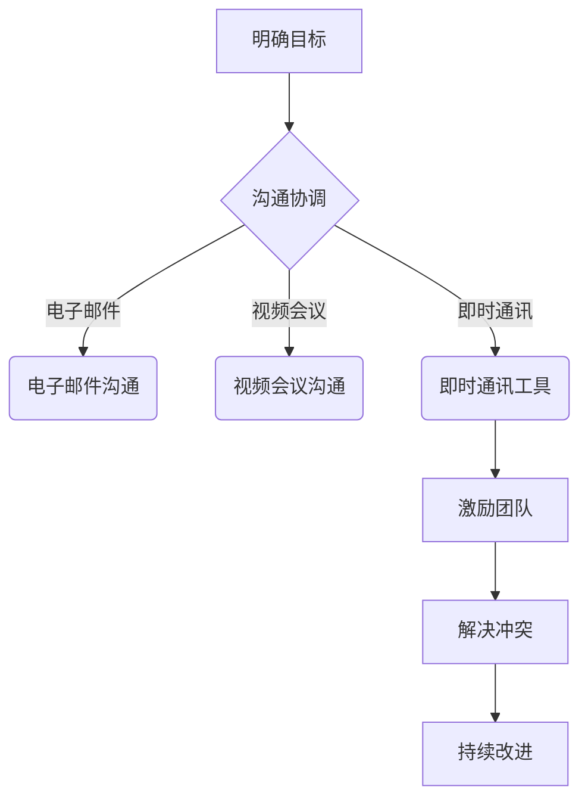
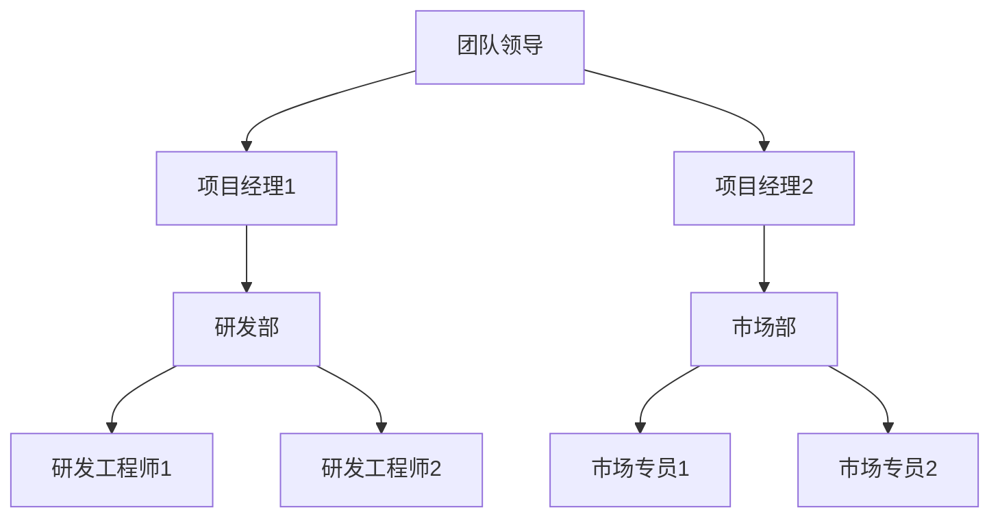

                 

### 引言

随着信息技术的飞速发展，远程工作逐渐成为职场的新常态。远程团队领导这一角色也应运而生，成为了现代企业管理中的重要组成部分。远程团队领导不仅需要具备传统的管理技能，还要面对虚拟环境下独特的挑战。本文将围绕“远程团队领导：虚拟环境下的管理技巧”这一主题，系统性地探讨远程团队领导的核心内容和管理策略。

### 关键词

- 远程工作
- 团队领导
- 沟通技巧
- 领导力提升
- 虚拟环境
- 成果导向
- 自我管理

### 摘要

本文旨在为远程团队领导提供一套全面的管理技巧和策略，帮助他们在虚拟环境中有效管理团队。文章首先分析了远程工作的背景和趋势，然后详细探讨了建立高效远程团队的方法，包括明确团队目标和愿景、设计清晰的团队组织结构、以及远程团队的沟通策略。接着，文章深入介绍了虚拟环境下的团队管理技巧，包括远程团队沟通技巧、团队成员激励和团队协作。最后，文章通过案例分析，提供了成功远程团队的实践经验，并展望了远程工作的未来趋势。希望通过本文的阐述，能够为远程团队领导提供有价值的参考和指导。

---

## 第一部分：引言

### 第1章：远程工作的崛起

#### 1.1 远程工作的定义和趋势

远程工作，顾名思义，是一种允许员工在工作地点和时间上具有高度灵活性的工作方式。这种工作模式通过互联网和通信技术实现，员工可以在任何地点通过网络进行工作协作。根据国际远程工作协会（International Association of Virtual Offices, IAVO）的数据，全球远程工作的员工数量在过去十年中增长了159%，特别是在2020年，由于新冠疫情的影响，远程工作的普及率更是达到了前所未有的高度。

#### 1.1.1 远程工作的定义

远程工作通常包括以下几种类型：

- **在家工作**：员工在家中完成工作任务，使用公司的设备或自己的设备进行工作。
- **移动办公**：员工在任何有网络连接的地方工作，如咖啡店、图书馆或机场。
- **混合办公**：员工在固定的工作时间和地点工作，但部分时间可以选择远程工作。

#### 1.1.2 远程工作的趋势

远程工作的普及趋势可以从以下几个方面来看：

- **技术进步**：随着云计算、高速互联网和协作工具的普及，远程工作的基础设施得到了极大改善。
- **劳动力需求**：越来越多的公司意识到远程工作可以提高员工的工作满意度和生产效率，因此愿意采用这种模式。
- **疫情推动**：2020年新冠疫情的爆发，迫使大量公司采用远程工作模式，进一步加速了远程工作的普及。

#### 1.2 远程工作的好处与挑战

远程工作不仅带来了便利，还带来了许多好处，但同时也伴随着一些挑战。

#### 1.2.1 远程工作的好处

- **提高工作效率**：远程工作减少了通勤时间，员工可以在更舒适的环境中工作，有助于提高工作效率。
- **工作灵活性**：员工可以根据自己的生活习惯和工作效率选择工作时间和地点，提高工作满意度。
- **降低成本**：公司可以节省办公空间、水电和设备维护等费用，同时减少员工流失率。

#### 1.2.2 远程工作的挑战

- **沟通障碍**：远程团队之间的沟通不如面对面直接，容易产生误解和沟通不畅。
- **团队凝聚力下降**：缺乏面对面的交流和团队活动，可能导致团队成员之间的联系减弱。
- **工作与生活平衡**：远程工作虽然提供了灵活性，但也容易让员工在工作时间内难以区分工作与生活的边界。

#### 1.3 远程团队领导的角色与责任

远程团队领导在远程工作中扮演着至关重要的角色，他们需要：

- **明确团队目标**：确保团队成员了解团队的目标和愿景，并为之努力。
- **有效沟通**：利用各种远程沟通工具，确保团队成员之间的信息流通。
- **激励团队成员**：通过认可和激励，保持团队成员的工作动力和积极性。
- **解决冲突**：及时处理团队内部的矛盾和问题，维护团队的稳定和和谐。

远程团队领导不仅要具备传统的管理技能，还需要掌握远程管理的特殊技巧，以应对虚拟环境下的各种挑战。以下是一个简化的 Mermaid 流程图，展示了远程团队领导的主要职责和工作流程：



通过这一流程图，我们可以看到远程团队领导在远程工作中的核心职责和互动关系。下一步，我们将探讨如何建立高效远程团队，包括团队目标和愿景的设定、团队组织结构的设计以及沟通策略的制定。

---

## 第二部分：建立高效远程团队

### 第2章：明确团队目标和愿景

#### 2.1 确定团队目标

团队目标是团队工作的核心，是团队行动的指南针。在远程团队中，明确的目标尤为重要，因为它有助于团队成员理解自己的工作职责和方向，提高团队协作的效率。以下是确定团队目标时应遵循的步骤：

##### 2.1.1 团队目标的重要性

- **方向性**：明确的目标为团队提供了清晰的工作方向，避免了资源的浪费。
- **激励性**：具体、可衡量和实现的目标可以激励团队成员积极投入工作。
- **评估性**：目标设定后，团队可以定期评估进展情况，及时调整策略。

##### 2.1.2 如何设定团队目标

1. **了解组织目标**：首先，团队领导需要了解公司的整体战略目标，确保团队目标与组织目标一致。
2. **SMART原则**：使用SMART原则（具体、可衡量、可实现、相关性、时限性）来设定团队目标。
   - **具体（Specific）**：目标应该明确具体，避免模糊不清。
   - **可衡量（Measurable）**：目标应该能够量化和评估，方便后续跟踪。
   - **可实现（Achievable）**：目标应该是通过团队努力可以实现的，避免不切实际。
   - **相关性（Relevant）**：目标应该与团队职责和公司战略相关联。
   - **时限性（Time-bound）**：目标应该有明确的完成时间，以促进时间管理。

例如，一个远程团队的目标可以是：“在下一个季度内，完成产品的Beta版本发布，并实现至少1000名用户的注册。”

##### 2.1.3 团队目标的重要性与实现步骤

- **重要性**：团队目标是团队工作的驱动力，为团队成员提供了明确的方向和动力。
- **实现步骤**：
  1. **团队讨论**：组织团队成员进行讨论，确定共同的目标。
  2. **目标分解**：将大目标分解为小目标，使每个团队成员都能明确自己的职责和任务。
  3. **目标跟踪**：定期检查目标进度，及时调整计划和策略。

#### 2.2 制定团队愿景

团队愿景是团队的远大目标和理想状态，它为团队成员提供了共同的愿景和动力。一个明确的团队愿景可以帮助团队在面对挑战时保持一致，共同奋斗。

##### 2.2.1 团队愿景的意义

- **共同愿景**：团队愿景是团队成员共同的期望和目标，有助于增强团队凝聚力。
- **激励员工**：明确的愿景可以激发团队成员的内在动力，提高工作热情。
- **指引方向**：愿景为团队提供了长期的发展方向，帮助团队成员明确努力的方向。

##### 2.2.2 如何制定团队愿景

1. **团队讨论**：组织团队成员共同讨论，制定一个有共同认同的愿景。
2. **具体化愿景**：愿景应该是具体、可实现的，避免过于抽象。
3. **愿景宣传**：通过内部会议、邮件和公告等形式，让所有团队成员都了解和认同愿景。

例如，一个远程团队的愿景可以是：“成为行业领先的远程协作解决方案提供商，为全球团队提供高效、便捷的工作体验。”

##### 2.2.3 团队愿景的制定与宣传

- **制定过程**：通过团队讨论和共识，制定出一个具体、可实现的愿景。
- **宣传策略**：利用内部邮件、公告、团队会议等多种渠道，让所有团队成员都了解并认同愿景。

通过明确团队目标和制定团队愿景，远程团队可以更好地统一行动，共同实现目标。接下来，我们将探讨如何设计清晰的团队组织结构，以确保团队的高效运作。

---

### 第3章：设计清晰的团队组织结构

#### 3.1 团队组织结构的重要性

团队组织结构是团队内部各部门、岗位及成员之间相互关系的具体体现。一个清晰、合理的团队组织结构对于远程团队的高效运作至关重要。以下是团队组织结构的重要性和设计步骤：

##### 3.1.1 团队组织结构的定义

团队组织结构通常包括以下几个方面：

- **部门划分**：根据业务需求和职能，将团队划分为不同的部门，如研发部、市场部、运营部等。
- **岗位设置**：为每个部门设置相应的岗位，明确每个岗位的职责和权限。
- **职责分配**：明确团队成员的职责范围，确保每个成员都有明确的工作目标和方向。
- **层级关系**：确定团队中的管理层级关系，包括团队领导、项目经理、团队成员等。

##### 3.1.2 团队组织结构的影响

- **协作效率**：清晰的团队组织结构有助于团队成员之间的协作，减少因职责不清导致的冲突和重复工作。
- **决策质量**：合理的组织结构可以提高团队的决策效率，确保决策过程中的信息流通和反馈。
- **团队凝聚力**：明确的职责分配和层级关系有助于增强团队凝聚力，提高团队成员的归属感。

##### 3.1.3 如何设计团队组织结构

1. **了解业务需求**：首先，团队领导需要深入了解团队的业务需求和目标，确保组织结构能够支持这些需求。
2. **确定部门划分**：根据业务需求和职能，将团队划分为不同的部门。
3. **岗位设置**：为每个部门设置相应的岗位，明确每个岗位的职责和权限。
4. **职责分配**：根据岗位设置，明确团队成员的职责范围，确保每个成员都有明确的工作目标和方向。
5. **层级关系**：确定团队中的管理层级关系，明确团队领导、项目经理和团队成员之间的职责和权限。

#### 3.2 团队组织结构的设计原则

在设计团队组织结构时，应遵循以下原则：

- **适应性**：组织结构应具有适应性，能够根据业务需求的变化进行调整。
- **扁平化**：尽量减少管理层级，提高决策效率，增强团队成员的参与感。
- **职能明晰**：明确每个部门、岗位的职责，避免职责重叠和模糊。
- **灵活性**：组织结构应具有一定的灵活性，以适应远程工作的特殊需求。

以下是一个简单的团队组织结构示例，用于说明如何设计团队组织结构：



在这个示例中，团队领导下设两个项目经理，分别负责研发部和市场部。每个部门再下设若干岗位，明确团队成员的职责和权限。这种组织结构能够确保团队内部的协作高效，职责分配清晰。

##### 3.2.1 设计步骤与原则

- **设计步骤**：
  1. 确定业务需求和目标。
  2. 划分部门。
  3. 设置岗位。
  4. 明确职责和权限。
  5. 确定管理层级关系。
- **设计原则**：
  1. 适应性。
  2. 扁平化。
  3. 职能明晰。
  4. 灵活性。

通过合理设计团队组织结构，远程团队可以更好地应对工作挑战，提高团队的整体运作效率。接下来，我们将探讨远程团队的沟通策略，以确保团队内部的顺畅沟通和协作。

---

### 3.3 远程团队的沟通策略

#### 3.3.1 电子邮件和即时通讯工具的使用

在远程团队中，沟通是确保工作顺利进行的关键。电子邮件和即时通讯工具是远程团队沟通的主要手段。以下是关于如何有效使用这些工具的详细探讨：

##### 3.3.1.1 电子邮件的使用

电子邮件是一种正式且可靠的沟通方式，适用于需要详细记录和长期保存的信息交流。以下是使用电子邮件时应注意的几点：

- **清晰的主题**：邮件主题应简明扼要，能够准确反映邮件的主要内容。
- **结构化内容**：邮件内容应结构清晰，包括背景介绍、具体要求和期望结果。
- **附件使用**：如有附件，应在邮件正文中简要描述附件的内容和用途。
- **及时回复**：收到邮件后，应尽快回复，以保持沟通的流畅性。

##### 3.3.1.2 即时通讯工具的使用

即时通讯工具如Slack、Microsoft Teams、WhatsApp等，适用于快速、简短的沟通和协作。以下是使用即时通讯工具时应注意的几点：

- **群组讨论**：在重要话题或涉及多人的讨论中，应创建专门的群组，以便团队成员能够集中讨论。
- **明确沟通目标**：每次沟通前，应明确讨论的目标和议题，避免无谓的闲聊。
- **使用简洁语言**：即时通讯工具的沟通应尽量简洁明了，避免冗长的对话。
- **及时反馈**：对于收到的消息，应尽快回复，以保持沟通的连贯性。

##### 3.3.1.3 电子邮件和即时通讯工具的有效使用

- **组合使用**：根据沟通内容和需求，灵活组合使用电子邮件和即时通讯工具，以达到最佳的沟通效果。
- **沟通记录**：对于重要的沟通内容，应保存邮件或即时通讯记录，以便日后查询和参考。

#### 3.3.2 视频会议的最佳实践

视频会议是远程团队之间进行面对面交流的重要方式。以下是关于视频会议的最佳实践：

##### 3.3.2.1 视频会议的准备工作

- **会议议程**：在会议前准备好会议议程，明确会议的目标和议题。
- **技术测试**：确保网络连接稳定，设备运行正常，避免会议中出现技术问题。
- **提醒参会者**：提前向参会者发送会议通知，包括会议时间、地点和议程。

##### 3.3.2.2 视频会议的进行

- **准时开始**：确保视频会议准时开始，避免迟到和缺席。
- **积极参与**：鼓励参会者积极参与讨论，表达观点和意见。
- **明确发言顺序**：在讨论过程中，确保每位参会者都有机会发言，避免争抢发言。
- **记录会议内容**：在会议过程中，记录关键信息和决策，以便会后跟进。

##### 3.3.2.3 视频会议的总结

- **会议纪要**：会后准备会议纪要，包括会议的结论、任务分配和时间表。
- **分享会议纪要**：将会议纪要分享给所有参会者，确保每个人都了解会议内容和决策。
- **反馈与改进**：鼓励团队成员提供会议反馈，持续改进会议质量和效率。

#### 3.3.3 增强虚拟团队的互动和合作

- **定期团队活动**：组织定期的团队活动，如在线游戏、虚拟聚餐等，增强团队成员之间的情感联系。
- **协作工具的使用**：利用协作工具如Trello、JIRA等，实现任务管理和协作。
- **定期沟通**：通过定期的一对一沟通、团队会议等，保持团队成员之间的紧密联系。

通过上述沟通策略，远程团队可以克服地理和时间的障碍，实现高效的协作和沟通，为团队的成功奠定坚实基础。接下来，我们将探讨如何提升远程团队成员的激励。

---

### 第4章：远程团队成员激励

#### 4.1 保持团队动力和活力

在远程工作环境中，保持团队成员的动力和活力是领导者的关键任务。以下是一些有效的策略：

##### 4.1.1 定期反馈和认可

- **定期反馈**：通过定期的团队反馈会议，领导者可以了解成员的工作进展和面临的挑战，提供必要的支持。
- **认可和奖励**：及时对团队成员的成就和努力进行认可和奖励，增强他们的积极性和归属感。

##### 4.1.2 工作生活平衡

- **灵活的工作安排**：提供灵活的工作时间和地点，帮助团队成员更好地平衡工作与生活。
- **减轻工作压力**：鼓励团队成员在工作之外进行放松和充电，保持良好的心理状态。

##### 4.1.3 提供成长机会

- **职业发展**：为团队成员提供职业发展的机会，如培训、学习资源和晋升通道。
- **技能提升**：鼓励团队成员学习新技能，提高自身价值。

#### 4.2 远程工作的绩效考核

远程工作的绩效考核与传统的工作环境有所不同，需要特别考虑以下几点：

##### 4.2.1 设定明确的绩效指标

- **量化指标**：设定可量化的绩效指标，如完成任务的百分比、项目进度等。
- **行为指标**：关注团队成员的工作态度和行为，如沟通效率、团队合作精神等。

##### 4.2.2 定期绩效评估

- **定期评估**：定期进行绩效评估，及时发现和解决问题。
- **透明评估**：评估过程应透明，确保团队成员了解评估标准和结果。

##### 4.2.3 反馈和改进

- **积极反馈**：在评估过程中，给予团队成员积极的反馈，强调改进的方向。
- **持续改进**：鼓励团队成员基于反馈进行自我提升，不断提高工作绩效。

#### 4.3 激励远程团队成员的技巧

以下是几种有效的激励远程团队成员的技巧：

##### 4.3.1 制定个人发展计划

- **个人目标**：与团队成员一起制定个人发展计划，确保他们的职业目标和团队目标一致。
- **支持与资源**：为团队成员提供必要的支持和资源，帮助他们实现个人目标。

##### 4.3.2 鼓励团队协作

- **团队合作**：通过项目合作和团队活动，增强团队成员之间的协作和信任。
- **互帮互助**：鼓励团队成员互相帮助，共同解决问题。

##### 4.3.3 提供奖励和激励

- **物质奖励**：通过奖金、礼品等物质奖励，激励团队成员的积极性和工作动力。
- **精神激励**：通过表扬、认可和培训等精神激励，提升团队成员的工作满意度和忠诚度。

通过上述策略，远程团队领导者可以有效地激发团队成员的积极性和创造力，确保团队在远程环境中保持高效和稳定的工作状态。接下来，我们将探讨如何提升远程团队协作。

---

### 第5章：虚拟环境下的团队协作

#### 5.1 远程协作工具的选择

在远程团队中，选择合适的协作工具是确保团队高效运作的关键。以下是几种常用的远程协作工具及其优缺点：

##### 5.1.1 项目管理工具

- **Trello**：简单直观，适合小型团队的任务管理。
- **JIRA**：功能强大，适合大型团队的敏捷项目管理。
- **Asana**：功能丰富，适合跨部门团队的任务协作。
- **优点**：便于任务分配和进度跟踪，提高工作效率。
- **缺点**：可能需要一定时间适应和学习。

##### 5.1.2 文档共享和协作工具

- **Google Docs**：实时协作，支持多种格式文档。
- **Microsoft Teams**：集成文档共享、即时通讯和视频会议。
- **Notion**：多功能协作平台，支持笔记、任务和数据库管理。
- **优点**：方便团队成员实时协作，提高文档管理的效率。
- **缺点**：文档权限管理可能较复杂。

##### 5.1.3 视频会议工具

- **Zoom**：功能强大，支持大会议在线讨论。
- **Microsoft Teams**：集成视频会议、即时通讯和文档共享。
- **Skype**：简单易用，适用于小规模会议。
- **优点**：支持实时视频沟通，增强团队互动。
- **缺点**：可能对网络要求较高。

##### 5.1.4 代码管理和协作工具

- **GitHub**：代码版本管理，支持多人协作。
- **GitLab**：类似GitHub，但自托管。
- **Bitbucket**：适用于大型团队的代码协作。
- **优点**：支持版本控制和代码审查，提高代码质量。
- **缺点**：可能需要一定的技术基础。

#### 5.2 项目管理的最佳实践

在远程团队中，项目管理需要特别考虑沟通和协作的效率。以下是几种最佳实践：

##### 5.2.1 制定详细的计划

- **项目计划**：制定详细的项目计划，包括任务分解、时间表和资源分配。
- **风险评估**：评估项目风险，并制定相应的应对策略。

##### 5.2.2 保持沟通畅通

- **定期会议**：定期召开团队会议，确保所有成员了解项目进展和任务分配。
- **即时通讯**：利用即时通讯工具，快速解决项目中遇到的问题。

##### 5.2.3 灵活调整计划

- **反馈机制**：及时收集团队成员的反馈，根据实际情况调整项目计划。
- **迭代开发**：采用敏捷开发方法，快速迭代和优化项目。

#### 5.3 避免远程工作中的常见问题

以下是远程工作中常见的几个问题及其解决策略：

##### 5.3.1 沟通不畅

- **沟通工具**：选择合适的沟通工具，确保团队成员能够顺畅交流。
- **明确沟通规则**：制定明确的沟通规则，如回复时限、会议议程等。

##### 5.3.2 工作效率低下

- **时间管理**：鼓励团队成员制定个人工作计划，提高工作效率。
- **减少干扰**：创造一个专注的工作环境，减少不必要的干扰。

##### 5.3.3 团队凝聚力不足

- **团队活动**：定期组织在线团队活动，增强团队成员之间的联系。
- **共享目标**：确保所有成员都明确团队的目标和愿景，增强凝聚力。

通过选择合适的协作工具、遵循最佳项目管理实践和解决常见问题，远程团队可以克服虚拟环境带来的挑战，实现高效协作和项目成功。

---

## 第三部分：领导力的提升

### 第6章：远程团队领导者的自我管理

#### 6.1 管理远程工作压力

远程工作的灵活性虽然提供了许多便利，但也带来了新的挑战，特别是工作与生活平衡的问题。以下是管理远程工作压力的策略：

##### 6.1.1 工作与生活平衡

- **设定工作边界**：明确工作时间和休息时间，避免工作侵占私人时间。
- **合理安排时间**：使用时间管理工具，如日程表和待办事项列表，合理安排工作。
- **定期休息**：确保每天有足够的休息时间，避免过度劳累。

##### 6.1.2 压力管理技巧

- **自我放松**：定期进行放松活动，如冥想、运动或阅读。
- **寻求支持**：与家人、朋友或同事分享压力，寻求支持和帮助。
- **积极心态**：保持积极的心态，寻找工作中的乐趣和成就感。

#### 6.2 提高远程工作的效率

远程工作的高效性对领导者的管理技能提出了更高的要求。以下是一些提高工作效率的策略：

##### 6.2.1 工作流程优化

- **自动化流程**：利用自动化工具，减少重复性工作，提高效率。
- **简化流程**：简化工作流程，减少不必要的步骤，提高工作效率。

##### 6.2.2 时间管理

- **优先级排序**：根据任务的紧急程度和重要性，合理安排任务优先级。
- **专注时间**：设定专注时间，减少中断，提高工作效率。

##### 6.2.3 技能提升

- **持续学习**：不断学习新技能和知识，提高自身能力。
- **时间投资**：将时间投资在能带来长远效益的事情上，如团队建设和技能提升。

#### 6.3 自我成长的路径

作为一名远程团队领导者，自我成长是提升领导力的关键。以下是一些自我成长的路径：

##### 6.3.1 学习新技能

- **在线课程**：参加在线课程，学习领导力、项目管理等相关技能。
- **专业认证**：获得专业认证，如项目管理专业人士（PMP）或敏捷认证专家（SAFe Agilist）。

##### 6.3.2 阅读和学习

- **阅读书籍**：阅读领导力、团队管理等相关书籍，获取理论知识。
- **实践应用**：将所学知识应用于实际工作，通过实践不断提升。

##### 6.3.3 反思和总结

- **定期反思**：定期反思自己的工作和管理方式，发现问题并改进。
- **总结经验**：总结成功和失败的经验，从中学习，不断提高。

通过管理远程工作压力、提高工作效率和自我成长，远程团队领导者可以更好地应对虚拟环境中的挑战，提升团队的绩效和凝聚力。接下来，我们将探讨领导力的提升策略。

---

### 第7章：领导力的提升策略

#### 7.1 远程团队领导的心理学知识

在远程环境中，领导者不仅需要具备传统的管理技能，还需要了解心理学知识，以更好地理解和管理团队成员。以下是几个关键的心理学概念及其应用：

##### 7.1.1 知觉与沟通

- **知觉选择**：远程团队领导应意识到团队成员可能因为信息不全而产生误解，需要通过多种渠道和方式传达信息，确保团队成员获得全面的信息。
- **非语言沟通**：虽然远程工作缺乏面对面的非语言沟通，但领导者可以通过视频会议和即时通讯工具，使用肢体语言和表情符号来增强沟通效果。

##### 7.1.2 情绪智力

- **自我情绪调节**：领导者需要具备良好的情绪智力，能够自我调节情绪，避免负面情绪对团队产生负面影响。
- **同理心**：领导者应具备同理心，理解团队成员的情绪和需求，提供必要的支持和鼓励。

##### 7.1.3 团队动力学

- **团队建设**：远程团队领导应通过定期的团队活动和互动，增强团队成员之间的信任和合作。
- **冲突管理**：领导者需要掌握冲突解决的技巧，及时解决团队内部的冲突，维护团队的稳定和和谐。

#### 7.2 冲突解决的技巧

在远程团队中，冲突是不可避免的。以下是一些有效的冲突解决技巧：

##### 7.2.1 倾听和理解

- **积极倾听**：领导者应积极倾听团队成员的意见和需求，理解他们的立场和感受。
- **换位思考**：尝试从对方的角度考虑问题，增强同理心。

##### 7.2.2 寻求共识

- **共同目标**：领导者应强调团队共同的目标和利益，鼓励团队成员寻求共识。
- **协商解决**：通过协商和讨论，寻找双方都能接受的解决方案。

##### 7.2.3 中立调解

- **中立立场**：在解决冲突时，领导者应保持中立，避免偏袒任何一方。
- **调解技巧**：使用调解技巧，如引导讨论、提供选择和寻求共识，帮助团队成员达成一致。

#### 7.3 领导力模型的实践

在远程团队中，领导力模型的选择和应用至关重要。以下是一个简单的领导力模型及其应用：

##### 7.3.1 权变领导模型

- **情境领导模型**：根据团队成员的不同成熟度水平，采取不同的领导风格，如指导、支持、委托等。
- **费德勒模型**：领导者应根据具体情境选择领导风格，如在团队面临压力时采取任务导向的领导风格，在团队需要创新时采取关系导向的领导风格。

##### 7.3.2 赋权领导模型

- **赋权**：领导者应赋予团队成员决策权和责任感，鼓励自主学习和创新。
- **支持**：领导者应提供必要的支持和资源，帮助团队成员实现目标。

通过了解和应用心理学知识、掌握冲突解决技巧和选择合适的领导力模型，远程团队领导者可以更好地应对虚拟环境中的挑战，提升团队绩效和凝聚力。

---

### 第四部分：案例分析

#### 第8章：成功远程团队的案例分析

通过分析成功远程团队的案例，我们可以学到许多宝贵的经验和教训。以下是三个典型的案例分析：

#### 8.1 案例一：一家远程咨询公司的领导经验

**背景介绍**：

这家远程咨询公司成立于2010年，主要从事企业战略咨询和数字化解决方案服务。公司采用完全远程工作模式，团队成员分布在不同的城市和国家。

**核心概念与联系**：

- **敏捷管理**：公司采用敏捷管理方法，通过Scrum框架进行项目管理和团队协作。
- **自主管理**：团队成员自主安排工作时间和任务，但需要定期进行进度报告和团队评审。

**核心算法原理讲解**：

```plaintext
Scrum流程：
1. Sprint规划会议：团队确定下一个Sprint的目标和任务。
2. 每日站立会议：团队成员报告进展和问题，确保项目按计划进行。
3. Sprint评审会议：团队展示已完成的工作，收集反馈并进行迭代。
4. Sprint回顾会议：团队评估Sprint的表现，讨论改进措施。

敏捷管理伪代码：

function AgileManagement():
    while (not projectCompleted):
        SprintPlanning()
        for day in SprintDays:
            StandUpMeeting()
        SprintReview()
        SprintRetrospective()
        UpdateProjectStatus()
```

**数学模型和公式 & 详细讲解 & 举例说明**：

- **任务分配模型**：公司使用基于复杂网络分析的任务分配模型，根据团队成员的技能和工作量进行任务分配。

假设公司有N名团队成员，每个团队成员有特定的技能集合S_i。任务集合为T。公式如下：

```latex
C_{ij} = \sum_{k \in S_i \cap S_j} w_{kj}
```

其中，C_{ij}表示团队成员i和j之间的协作系数，w_{kj}表示任务k的权重。

**项目实战**：

公司成功完成了多个大型咨询项目，包括某大型零售企业的数字化转型和某金融机构的IT系统优化。

**实际案例分析和详细讲解剖析**：

- **案例一**：公司成功帮助某大型零售企业实现了全渠道整合，提高了销售效率和客户满意度。通过敏捷管理和任务分配模型，确保项目按时交付。

**项目小结**：

该案例展示了远程咨询公司如何通过敏捷管理和任务分配模型，实现高效的项目交付和团队协作。

#### 8.2 案例二：跨国远程开发团队的协作经验

**背景介绍**：

这个跨国远程开发团队成立于2015年，由来自美国、印度和欧洲的团队成员组成，负责开发一款全球化的企业软件解决方案。

**核心概念与联系**：

- **分布式协作**：团队采用分布式协作模式，利用虚拟专用网络（VPN）和云服务进行实时沟通和任务协作。
- **跨时区工作**：团队成员分布在不同的时区，通过灵活的工作时间安排，确保项目持续进展。

**核心算法原理讲解**：

```plaintext
跨时区工作流程：
1. 确定时区差异：确定团队成员所在时区的差异，合理安排工作时间。
2. 双语沟通：团队中安排双语沟通人员，确保语言障碍不会影响工作。
3. 工作轮班制：根据时区差异，设定工作轮班制度，确保项目24小时运作。

分布式协作伪代码：

function DistributedCollaboration():
    for (each timezone):
        scheduleWorkHours()
        assignTasksBasedOnTimezone()
        communicateThroughVPN()
        resolveTimezoneConflicts()
```

**数学模型和公式 & 详细讲解 & 举例说明**：

- **工作负荷平衡模型**：团队使用工作负荷平衡模型，根据团队成员的工作时间和能力分配任务。

假设团队有N名成员，工作时间表为T_i。公式如下：

```latex
L_i = \sum_{j=1}^{N} (T_j - T_i)
```

其中，L_i表示成员i的工作负荷。

**项目实战**：

团队成功开发并上线了多个企业软件解决方案，如客户关系管理（CRM）系统和企业资源规划（ERP）系统。

**实际案例分析和详细讲解剖析**：

- **案例二**：团队成功开发了一款全球化的ERP系统，实现了跨国企业的资源优化和业务流程自动化。

**项目小结**：

该案例展示了跨国远程开发团队如何通过分布式协作和跨时区工作，实现高效的全球协作和项目交付。

#### 8.3 案例三：非营利组织的远程管理实践

**背景介绍**：

这个非营利组织成立于2008年，致力于环保和可持续发展事业。组织采用远程工作模式，团队成员分布在全球各地。

**核心概念与联系**：

- **协作平台**：团队使用协作平台（如Trello和Slack），确保项目管理和沟通的顺畅。
- **志愿精神**：团队成员基于志愿精神工作，需要领导者激发团队的热情和动力。

**核心算法原理讲解**：

```plaintext
远程管理流程：
1. 项目启动：确定项目目标和愿景，制定详细的计划。
2. 团队协作：使用协作平台，实时沟通和协作。
3. 持续反馈：定期收集团队成员的反馈，调整项目计划和策略。
4. 项目评估：项目结束后，进行项目评估和总结。

远程管理伪代码：

function RemoteManagement():
    startProject()
    while (projectOngoing):
        communicateThroughCollaborationPlatform()
        collectFeedback()
        adjustPlan()
    evaluateProject()
```

**数学模型和公式 & 详细讲解 & 举例说明**：

- **志愿者参与模型**：团队使用志愿者参与模型，根据成员的兴趣和能力分配任务。

假设团队有N名志愿者，任务集合为T。公式如下：

```latex
P_i = \sum_{j \in T_i} interest_j
```

其中，P_i表示成员i的参与度。

**项目实战**：

团队成功组织了多次环保活动，如植树造林和垃圾分类宣传。

**实际案例分析和详细讲解剖析**：

- **案例三**：团队成功组织了一次全球性的环保活动，动员了超过5000名志愿者参与。

**项目小结**：

该案例展示了非营利组织如何通过协作平台和志愿者参与模型，实现高效的项目管理和活动组织。

通过这三个案例分析，我们可以看到不同类型的远程团队如何在虚拟环境中实现高效的协作和项目交付。这些经验对于其他远程团队具有借鉴意义。

---

### 第9章：未来远程工作的趋势

#### 9.1 远程工作与未来职场

随着信息技术的不断进步，远程工作正在逐渐成为未来职场的新常态。以下是远程工作在未来职场中的几个发展趋势：

##### 9.1.1 永久性远程工作

越来越多的公司开始接受永久性远程工作模式，不仅限于特殊情况或特定行业。例如，一些科技公司已经开始尝试全面远程工作，并取得了显著的成功。

##### 9.1.2 技术创新推动远程工作

5G、云计算、人工智能等新技术的应用，为远程工作提供了更强大的技术支持，使得远程工作更加高效和便捷。

##### 9.1.3 跨国远程团队的兴起

随着全球化的发展，跨国远程团队越来越多。跨国远程团队不仅能够利用全球人才资源，还可以更好地满足不同市场的需求。

#### 9.2 技术创新对远程工作的影响

技术创新对远程工作产生了深远的影响，以下是几个关键方面：

##### 9.2.1 高效的沟通工具

随着视频会议、即时通讯和协作工具的不断发展，远程团队之间的沟通变得更加高效和流畅。

##### 9.2.2 自动化和人工智能

自动化和人工智能技术正在逐步应用于远程工作中，如自动化任务分配、智能客服等，提高了工作效率和准确性。

##### 9.2.3 云计算和大数据

云计算和大数据技术为远程工作提供了强大的数据支持和分析能力，使得远程团队可以更好地进行项目管理和决策。

#### 9.3 远程工作未来的发展方向

未来远程工作的发展将更加注重以下几个方面：

##### 9.3.1 个人化远程工作模式

未来远程工作将更加注重个人化和定制化，根据员工的个性和需求，提供更加灵活的工作模式。

##### 9.3.2 跨学科和跨领域的合作

随着远程工作技术的发展，跨学科和跨领域的合作将成为常态，远程团队将更加多样化，有利于创新和创造力的提升。

##### 9.3.3 企业文化的建设

企业文化的建设在远程工作中尤为重要，未来的远程工作将更加注重团队文化的塑造和传承。

#### 9.4 远程工作面临的挑战与应对策略

尽管远程工作带来了许多机遇，但也面临一些挑战，以下是几个关键方面：

##### 9.4.1 沟通障碍

远程团队之间的沟通可能会因为时区、语言和文化差异而受到阻碍。应对策略包括使用多种沟通工具、定期组织跨文化培训等。

##### 9.4.2 工作与生活平衡

远程工作虽然提供了灵活性，但也容易导致工作与生活平衡的问题。应对策略包括设定明确的工作时间、提供心理支持和健康关怀等。

##### 9.4.3 安全和隐私保护

远程工作涉及到大量的数据传输和存储，安全和隐私保护成为重要挑战。应对策略包括加强网络安全、使用加密技术等。

通过不断适应技术创新和应对挑战，远程工作将在未来职场中发挥越来越重要的作用，成为企业发展和个人职业成长的重要途径。

---

## 附录：远程团队管理工具与资源

### A.1 常用的远程工作工具介绍

以下是几种常用的远程工作工具及其特点：

#### 1. 项目管理工具

- **Trello**：简单直观的任务管理工具，适合小型团队。
- **JIRA**：功能强大的项目管理工具，适合大型团队和敏捷开发。
- **Asana**：全面的任务和项目管理系统，适用于跨部门协作。

#### 2. 文档共享和协作工具

- **Google Workspace**：包括Google Docs、Sheets、Slides等，支持实时协作。
- **Microsoft 365**：集成Word、Excel、PowerPoint等办公软件，提供在线协作功能。
- **Notion**：多功能协作平台，支持笔记、任务和数据库管理。

#### 3. 视频会议工具

- **Zoom**：功能强大的视频会议工具，支持大规模在线会议。
- **Microsoft Teams**：集成视频会议、即时通讯和文档共享。
- **Slack**：即时通讯工具，支持团队协作和任务跟踪。

#### 4. 代码管理和协作工具

- **GitHub**：流行的代码托管平台，支持版本控制和代码审查。
- **GitLab**：自托管代码平台，提供完整的开发工作流程。
- **Bitbucket**：适合大型团队的代码协作平台。

### A.2 远程工作资源推荐

以下是一些推荐的远程工作资源和平台：

- **远程工作社区**：如Remote.co、WeWorkRemotely，提供远程工作机会和招聘信息。
- **在线学习平台**：如Coursera、Udemy、edX，提供各种远程工作相关的课程和认证。
- **远程工作指南**：如“远程工作手册”（Remote Work Handbook）、“远程工作101”（Remote Work 101），提供远程工作的最佳实践和技巧。

### A.3 远程团队管理最佳实践指南

以下是一些远程团队管理的最佳实践指南：

- **明确目标和期望**：确保所有团队成员都清楚团队的目标和期望。
- **定期沟通**：通过视频会议和即时通讯工具，定期与团队成员沟通，确保信息畅通。
- **协作工具**：充分利用协作工具，提高团队协作效率。
- **关注团队成员**：定期了解团队成员的工作进展和需求，提供必要的支持和鼓励。
- **灵活管理**：根据实际情况，灵活调整工作时间和任务分配，确保工作与生活平衡。

通过这些工具和资源的介绍，以及最佳实践指南的推荐，远程团队领导者可以更好地管理远程团队，确保团队的高效运作和持续发展。

---

## 作者信息

作者：AI天才研究院/AI Genius Institute & 禅与计算机程序设计艺术 /Zen And The Art of Computer Programming

