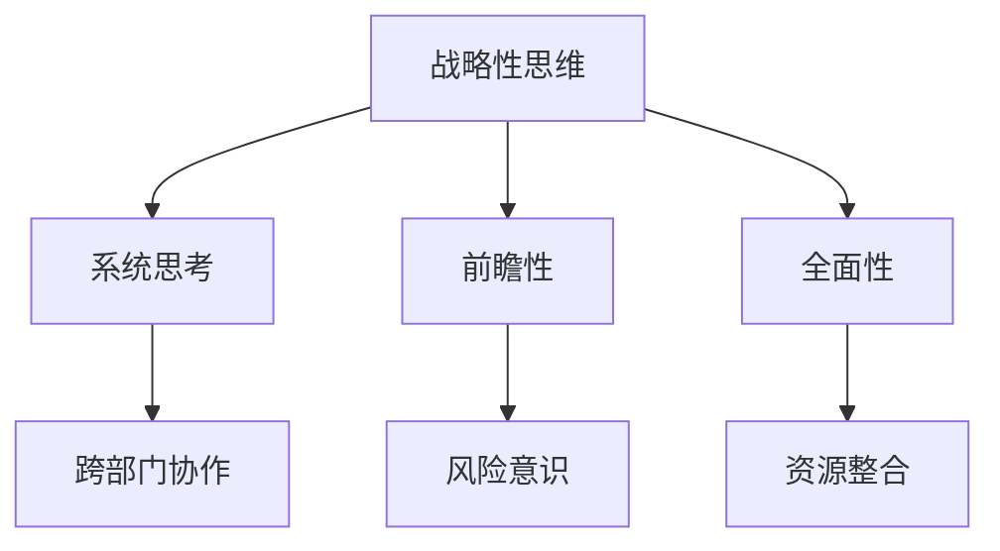

                 

### 《远见卓识：培养战略性思维的领导力》

关键词：战略性思维、领导力、系统思考、前瞻性、企业战略、市场分析、组织变革

摘要：在当今快速变化的商业环境中，战略性思维已成为领导者成功的关键要素。本文深入探讨了战略性思维的定义、重要性、框架、培养途径，以及其在企业战略规划、市场战略和组织变革中的应用。通过详细的分析和实例，本文揭示了如何通过培养战略性思维来提升领导力，并在不确定性中引领组织走向成功。

### 第一部分：理解战略性思维

#### 第1章：战略性思维的重要性

战略性思维是一种高级决策能力，它超越了日常操作的范畴，关注于组织的长期目标和全局视角。在本章中，我们将探讨战略性思维的定义和特征，以及它与日常决策之间的差异。

**1.1 战略性思维的定义和特征**

战略性思维可以定义为一种系统化、前瞻性和全面性的思考方式，旨在为组织制定长期目标和实现这些目标提供指导。以下是战略性思维的主要特征：

- **系统思考**：战略性思维不仅仅是关注局部问题，而是能够从整体视角出发，识别和解决系统性问题。
- **前瞻性**：战略性思维强调预见未来趋势，并在当前决策中考虑到这些因素。
- **全面性**：战略性思维要求领导者从多个角度和维度分析问题，综合考虑各种因素。

**1.2 战略性思维与日常决策的差异**

日常决策通常关注短期目标和具体问题，而战略性思维则侧重于长期目标和整体策略。以下是比较：

- **时间范围**：日常决策关注短期（如几天、几周），战略性思维则关注长期（如几年、几十年）。
- **视野宽度**：日常决策往往局限于具体任务，战略性思维则关注整个组织的战略方向和整体发展。
- **决策依据**：日常决策依赖具体数据和现状，战略性思维则需要预测未来和把握趋势。

**1.3 战略性思维的关键要素**

要培养战略性思维，领导者需要掌握以下几个关键要素：

- **洞察力**：识别和分析复杂问题的能力。
- **系统性**：理解和处理各种因素之间相互关系的能力。
- **前瞻性**：预见未来变化和趋势的能力。
- **资源整合**：有效配置和利用组织资源的能力。

#### 第2章：战略性思维的框架

战略性思维的框架是领导者制定和执行战略的基础。在本章中，我们将介绍战略性思维的基本原则、工具和方法。

**2.1 战略性思维的基本原则**

战略性思维遵循以下基本原则：

- **长期视角**：将短期利益与长期目标相结合。
- **系统性思考**：识别和解决系统性问题。
- **资源优化**：有效配置和利用资源。
- **适应变化**：灵活应对外部环境变化。

**2.2 战略性思维的工具与方法**

战略性思维依赖一系列工具和方法，包括：

- **SWOT分析**：分析组织的优势、劣势、机会和威胁。
- **PEST分析**：分析政治、经济、社会和技术等外部环境因素。
- **五力模型**：分析市场竞争结构。
- **波特竞争战略**：确定组织的竞争策略。

**2.3 战略性思维与领导力**

战略性思维是领导力的核心组成部分。领导者需要通过以下方式展现战略性思维：

- **战略规划**：制定组织的长期目标和行动计划。
- **决策制定**：在复杂和不确定的环境中进行明智决策。
- **团队协作**：鼓励团队成员参与战略制定和执行。
- **持续学习**：保持对新技术和行业动态的敏感度。

### 第3章：构建战略性思维

构建战略性思维是一个长期过程，需要领导者不断学习和实践。在本章中，我们将探讨战略性思维的培养途径、个人实践和团队协作。

**3.1 战略性思维的培养途径**

要培养战略性思维，领导者可以采取以下途径：

- **终身学习**：通过阅读、培训和研讨会不断更新知识和技能。
- **实践经验**：通过实际工作经历积累战略思维的经验。
- **跨学科知识**：掌握不同领域的知识，增强系统性思考能力。

**3.2 战略性思维的个人实践**

个人实践是培养战略性思维的关键。以下是一些个人实践方法：

- **反思与总结**：定期反思自己的决策和战略，总结经验和教训。
- **主动学习**：主动寻找和学习新的战略理论和工具。
- **问题解决**：主动面对和解决复杂问题，锻炼战略性思维。

**3.3 战略性思维的团队协作**

团队协作是实施战略性思维的关键。以下是一些团队协作方法：

- **头脑风暴**：鼓励团队成员提出创意和解决方案。
- **团队讨论**：通过讨论和辩论，深入分析问题。
- **共同决策**：在团队中共同制定战略和决策。

### 第二部分：战略性思维在实践中的应用

#### 第4章：企业战略规划

企业战略规划是企业长期发展的蓝图。在本章中，我们将讨论企业战略规划的步骤、SWOT分析的应用，以及如何制定和实现企业战略目标。

**4.1 企业战略规划的步骤**

企业战略规划通常包括以下步骤：

- **愿景与使命**：明确企业的长期目标和核心价值。
- **环境分析**：通过SWOT分析和PEST分析评估外部环境。
- **目标设定**：制定具体、可衡量的短期和长期目标。
- **战略选择**：选择最合适的战略路径。
- **实施计划**：制定详细的行动计划和时间表。
- **监控与调整**：定期评估战略执行情况，并进行调整。

**4.2 SWOT分析的应用**

SWOT分析是一种常用的战略规划工具，用于评估组织的优势、劣势、机会和威胁。以下是如何进行SWOT分析的步骤：

1. **优势（Strengths）**：识别组织内部的优势，如技术、品牌、人才等。
2. **劣势（Weaknesses）**：识别组织内部的劣势，如资源、流程、文化等。
3. **机会（Opportunities）**：识别外部环境中的机会，如市场趋势、技术进步等。
4. **威胁（Threats）**：识别外部环境中的威胁，如竞争、法规、经济变化等。

**4.3 企业战略目标的制定与实现**

企业战略目标的制定和实现是战略规划的核心。以下是如何制定和实现企业战略目标的方法：

1. **目标设定**：制定具体、可衡量的战略目标，确保它们与企业的愿景和使命一致。
2. **关键绩效指标（KPIs）**：确定用于衡量目标实现程度的关键绩效指标。
3. **资源配置**：根据目标需求，合理配置人力资源、财务资源和物资资源。
4. **执行与监控**：执行行动计划，并定期监控进展情况，及时调整策略。

#### 第5章：市场战略

市场战略是企业竞争的关键。在本章中，我们将讨论市场分析的技巧、市场定位与竞争策略，以及新产品开发与市场策略。

**5.1 市场分析的技巧**

市场分析是制定市场战略的基础。以下是一些市场分析的技巧：

- **需求分析**：分析消费者需求和市场趋势。
- **竞争分析**：分析竞争对手的市场份额、产品特点和策略。
- **定位分析**：确定企业在市场中的定位，如高端、中端或低端。
- **品牌分析**：评估品牌知名度和品牌形象。

**5.2 市场定位与竞争策略**

市场定位是企业在市场中建立独特形象和差异化的过程。以下是如何制定市场定位与竞争策略的方法：

1. **确定目标市场**：识别最具潜力的目标客户群体。
2. **差异化策略**：通过产品、服务或品牌特色，在市场中建立独特性。
3. **定价策略**：根据目标市场和竞争对手，制定合理的定价策略。
4. **推广策略**：通过广告、促销、公关等手段，提高品牌知名度和市场份额。

**5.3 新产品开发与市场策略**

新产品开发是市场战略的重要组成部分。以下是如何制定新产品开发与市场策略的方法：

1. **市场需求分析**：分析目标市场的需求，确定新产品开发的方向。
2. **产品定位**：根据市场需求，为新产品确定合适的市场定位。
3. **产品特性设计**：设计具有吸引力的产品特性，满足目标客户的需求。
4. **市场推广**：制定市场推广计划，包括广告、促销和渠道选择。

#### 第6章：组织变革

组织变革是应对外部环境变化和内部挑战的重要手段。在本章中，我们将讨论变革管理的原则与策略、变革过程中的挑战与应对，以及变革成功的案例分析。

**6.1 变革管理的原则与策略**

变革管理需要遵循以下原则和策略：

- **领导力**：领导者要积极参与变革，并激励员工支持变革。
- **沟通**：与员工保持开放和透明的沟通，解释变革的原因和好处。
- **参与**：鼓励员工参与变革过程，提高他们的认同感和参与度。
- **培训**：为员工提供必要的培训和支持，帮助他们适应变革。
- **反馈**：定期收集员工的反馈，调整变革计划，确保变革顺利进行。

**6.2 变革过程中的挑战与应对**

变革过程中可能会遇到以下挑战：

- **抵触情绪**：员工可能对变革持抵触态度，需要领导者积极沟通和引导。
- **资源限制**：变革可能需要额外的资源，如时间、资金和人力。
- **组织结构**：变革可能需要调整组织结构，以适应新的战略方向。
- **文化冲突**：不同部门或团队之间的文化差异可能影响变革的推进。

应对策略包括：

- **领导支持**：领导者要提供明确的支持和指导，树立变革的榜样。
- **激励制度**：建立激励制度，鼓励员工积极参与变革。
- **团队协作**：鼓励跨部门团队协作，共同推进变革。
- **灵活调整**：根据实际情况灵活调整变革计划，确保变革的可持续性。

**6.3 变革成功的案例分析**

以下是一些组织变革成功的案例：

- **丰田公司**：丰田通过持续改进和精益生产，成功实现了从传统汽车制造商向全球领先汽车制造商的转型。
- **IBM公司**：IBM通过转型为云计算和人工智能服务提供商，成功应对了传统硬件业务衰退的挑战。
- **可口可乐公司**：可口可乐通过推出新产品和加强品牌营销，成功应对了市场竞争和消费者口味变化的挑战。

### 第三部分：战略性思维的挑战与未来

#### 第7章：战略性思维的挑战

战略性思维在实践过程中面临以下挑战：

**7.1 环境不确定性对战略性思维的影响**

环境不确定性增加了战略性思维的复杂性。以下是如何应对环境不确定性的建议：

- **灵活策略**：制定灵活的战略和应对方案，以适应快速变化的环境。
- **预见性**：通过持续监测和分析市场动态，提前预见潜在的风险和机会。
- **风险管理**：建立有效的风险管理体系，降低环境不确定性对组织的影响。

**7.2 战略性思维在危机管理中的应用**

在危机管理中，战略性思维可以帮助组织：

- **快速响应**：迅速识别危机并采取有效措施，防止危机扩散。
- **资源整合**：调动组织内外部资源，共同应对危机。
- **沟通与协调**：确保内部团队和外部利益相关者之间的有效沟通和协调。

**7.3 战略性思维的局限性与创新**

战略性思维虽然重要，但也存在一些局限性：

- **过度依赖**：过度依赖战略性思维可能导致缺乏灵活性和创新能力。
- **决策延迟**：战略性思维需要较长时间的分析和评估，可能导致决策延迟。
- **忽视变革**：在战略制定过程中，可能忽视组织内部的变革需求。

应对策略包括：

- **平衡战略与创新**：在战略制定过程中，平衡长期目标和短期创新。
- **快速迭代**：采用敏捷方法，快速迭代和调整战略。
- **鼓励创新**：建立创新文化和机制，鼓励员工提出新想法和解决方案。

#### 第8章：战略性思维的未来趋势

战略性思维的未来趋势受到科技进步和全球化等因素的影响。以下是一些关键趋势：

**8.1 科技进步对战略性思维的影响**

科技进步正在改变战略性思维的方方面面：

- **数据驱动**：大数据和人工智能等技术的应用，使领导者能够更准确地分析市场趋势和消费者需求。
- **自动化决策**：自动化工具和算法可以提高决策的效率和准确性。
- **虚拟现实**：虚拟现实和增强现实技术为领导者提供了更直观的战略规划和模拟工具。

**8.2 战略性思维与全球化的互动**

全球化对战略性思维提出了新的挑战和机遇：

- **市场多元化**：全球化使企业可以进入更多市场，但同时也增加了竞争压力。
- **文化多样性**：全球化带来了文化多样性，需要领导者理解和尊重不同文化背景。
- **供应链管理**：全球化要求企业具备高效的供应链管理能力，以应对供应链中的不确定性。

**8.3 战略性思维的可持续性与社会责任**

随着社会和环境问题的日益突出，战略性思维需要：

- **可持续发展**：将可持续发展理念纳入战略规划，确保长期可持续发展。
- **社会责任**：积极履行社会责任，提高品牌形象和声誉。
- **伦理决策**：在决策过程中考虑伦理和社会影响，确保决策的公正性和道德性。

### 结论

战略性思维是领导者成功的关键要素，它帮助领导者系统、前瞻性地思考和解决问题。通过理解战略性思维的定义、框架和应用，领导者可以提升自身的领导力，并在不确定性中引领组织走向成功。然而，战略性思维并非一成不变，随着科技进步和全球化的发展，领导者需要不断更新和调整战略性思维，以应对新的挑战和机遇。本文旨在为读者提供战略性思维的深入理解，并启发他们在实际工作中应用和培养战略性思维。

### 作者信息

作者：AI天才研究院/AI Genius Institute & 禅与计算机程序设计艺术 /Zen And The Art of Computer Programming

### 注意事项

- 战略性思维的培养需要时间和持续的努力，领导者应保持学习的热情和开放的心态。
- 在实际工作中，战略性思维应与具体行动相结合，确保战略目标的有效实现。
- 战略性思维的应用需要结合组织的特点和外部环境，灵活调整战略规划和决策。

### 拓展阅读

- 《战略思维：领导者如何制定和实施战略》（作者：迈克尔·波特）
- 《第五项修炼：学习型组织的艺术与实务》（作者：彼得·圣吉）
- 《企业变革：从领导力到组织能力》（作者：约翰·科特）

### 结语

战略性思维是领导者不可或缺的能力，它帮助领导者预见未来、应对不确定性，并在竞争激烈的市场环境中取得成功。本文旨在为读者提供战略性思维的深入理解和实际应用指导。希望读者能够结合自身实践，不断提升战略性思维，为组织的发展贡献力量。让我们携手前行，共同开创美好未来！

### 项目实战

#### 开发环境搭建

在开始战略性思维的实践之前，我们需要搭建一个合适的技术环境。以下是一个基本的开发环境搭建步骤：

1. **安装操作系统**：选择一个适合你的操作系统，如Linux、Windows或macOS。
2. **安装编程环境**：安装一个集成开发环境（IDE），如Visual Studio Code、Eclipse或IntelliJ IDEA。
3. **安装数据库**：选择一个合适的数据库管理系统，如MySQL、PostgreSQL或MongoDB。
4. **安装版本控制系统**：安装Git，以便管理和协作代码。

#### 源代码详细实现和代码解读

在实现战略性思维的过程中，我们可以使用Python作为编程语言，以下是一个简单的示例：

```python
# 战略性思维示例：SWOT分析

# 导入所需库
import pandas as pd

# 定义SWOT分析数据结构
strengths = ["创新力强", "品牌知名度高", "市场份额大"]
weaknesses = ["研发投入不足", "产品质量问题", "营销策略陈旧"]
opportunities = ["新兴市场机遇", "技术创新趋势", "政策支持"]
threats = ["竞争对手激烈", "经济不确定性", "政策风险"]

# 创建DataFrame
data = pd.DataFrame({
    "Strengths": strengths,
    "Weaknesses": weaknesses,
    "Opportunities": opportunities,
    "Threats": threats
})

# 打印DataFrame
print(data)
```

这段代码首先导入了Python的数据分析库Pandas，然后定义了SWOT分析中的四个方面：优势、劣势、机会和威胁。接着，创建了一个DataFrame来存储这些信息，并打印出来。

#### 代码应用解读与分析

上面的代码展示了如何使用Python和Pandas库进行SWOT分析。在实际应用中，我们可以通过以下步骤扩展和改进这个示例：

1. **数据收集**：从内部和外部来源收集相关数据，以填充SWOT分析的各个部分。
2. **数据分析**：使用Pandas等库对数据进行处理和分析，提取有用的信息。
3. **可视化**：使用Matplotlib、Seaborn等库对分析结果进行可视化，帮助领导者更直观地理解SWOT分析的结果。
4. **决策支持**：基于SWOT分析的结果，为领导者提供决策支持，制定相应的战略和行动计划。

以下是一个简单的可视化示例：

```python
import matplotlib.pyplot as plt

# 绘制条形图
plt.bar(data.index, data['Strengths'])
plt.xlabel('Aspect')
plt.ylabel('Strength')
plt.title('SWOT Analysis - Strengths')
plt.show()
```

这个示例使用Matplotlib绘制了一个条形图，展示了SWOT分析中的优势部分。通过类似的图表，我们可以展示劣势、机会和威胁，为领导者提供更全面的决策支持。

#### 实际案例分析和详细讲解剖析

以下是一个实际案例：一家传统的零售企业面临电商的激烈竞争，需要进行战略性思维，以实现转型和持续发展。

**案例背景**：

- 企业在传统零售领域拥有较高的市场份额和品牌知名度。
- 随着电商的崛起，企业的市场份额逐渐下降，面临巨大的竞争压力。
- 企业需要进行战略性思维，以应对市场变化，实现业务转型。

**SWOT分析**：

1. **优势**：

   - 品牌知名度高：企业在传统零售领域拥有较高的品牌知名度。
   - 丰富的商品种类：企业拥有多样化的商品种类，满足不同客户的需求。
   - 稳定的客户基础：企业拥有稳定的客户群体，具有较高的客户忠诚度。

2. **劣势**：

   - 电商业务薄弱：企业电商业务发展较慢，市场份额较低。
   - 营销策略陈旧：企业的营销策略相对陈旧，难以吸引年轻消费者。
   - 供应链管理不足：企业的供应链管理不够高效，影响物流配送速度。

3. **机会**：

   - 电商市场增长：电商市场正在快速增长，为企业提供了新的市场机会。
   - 技术创新：新技术（如人工智能、大数据）的广泛应用，为企业提供了创新的手段。
   - 政策支持：政府鼓励企业进行数字化转型，提供了一系列政策支持。

4. **威胁**：

   - 竞争对手激烈：电商平台和其他传统零售企业竞争激烈，对企业市场份额构成威胁。
   - 经济不确定性：全球经济不确定性增加，对企业经营带来风险。
   - 政策风险：政策变化可能对企业经营带来不确定性。

**战略规划**：

- **短期目标**：提升电商业务，增加市场份额，提高客户满意度。
- **长期目标**：实现业务多元化，打造线上线下融合的零售模式，提升品牌价值。

**实施计划**：

1. **电商业务提升**：

   - 投入更多资源进行电商平台的开发和运营。
   - 优化电商用户体验，提高转化率。
   - 与知名电商平台合作，拓宽销售渠道。

2. **营销策略创新**：

   - 采用新的营销手段，如社交媒体营销、直播营销等，吸引年轻消费者。
   - 与知名品牌合作，推出联名产品，提升品牌形象。

3. **供应链管理优化**：

   - 引入新技术，提高供应链管理效率。
   - 加强物流配送，提升客户满意度。

**监控与调整**：

- 定期评估电商业务的发展状况，调整战略计划。
- 监控市场变化和竞争态势，及时调整营销策略。
- 定期收集客户反馈，优化产品和服务。

#### 项目小结

通过战略性思维，企业可以更好地应对市场变化，制定合适的战略和行动计划。在本案例中，企业通过SWOT分析识别了自身的优势和劣势，发现了市场机会和威胁，并制定了相应的战略和实施计划。通过持续监控和调整，企业可以不断提升自身的竞争力，实现持续发展。

### 最佳实践 tips

1. **定期进行SWOT分析**：定期对组织进行SWOT分析，有助于识别内外部环境的变化，及时调整战略。
2. **数据驱动决策**：利用数据分析工具，对市场趋势、消费者行为等进行深入分析，为决策提供数据支持。
3. **跨部门协作**：鼓励跨部门协作，共享资源和信息，提升整体组织效率。
4. **持续学习与培训**：鼓励员工持续学习和培训，提升战略性思维和领导力。
5. **敏捷应对变化**：在面对不确定性和变化时，保持敏捷，迅速调整战略和行动。

### 结语

战略性思维是领导者成功的关键要素，它帮助领导者预见未来、应对不确定性，并在竞争激烈的市场环境中取得成功。通过本文的介绍，我们了解了战略性思维的定义、框架和应用，以及如何在实践中培养和运用战略性思维。希望读者能够在实际工作中，不断应用和提升战略性思维，为组织的发展贡献力量。让我们携手前行，共同开创美好未来！

### 拓展阅读

- 《战略思维：领导者如何制定和实施战略》（作者：迈克尔·波特）
- 《第五项修炼：学习型组织的艺术与实务》（作者：彼得·圣吉）
- 《企业变革：从领导力到组织能力》（作者：约翰·科特）

### 附录

**Mermaid流程图**



**数学公式**

$$
\begin{equation}
    \text{Net Present Value (NPV)} = \sum_{t=1}^{n} \frac{\text{Cash Flow}_t}{(1 + \text{Discount Rate})^t} - \text{Initial Investment}
\end{equation}
$$

**伪代码**

```plaintext
// 伪代码：SWOT分析

function SWOT_analysis():
    // 定义内外部环境因素
    strengths = ["创新力强", "品牌知名度高", "市场份额大"]
    weaknesses = ["研发投入不足", "产品质量问题", "营销策略陈旧"]
    opportunities = ["新兴市场机遇", "技术创新趋势", "政策支持"]
    threats = ["竞争对手激烈", "经济不确定性", "政策风险"]

    // 分析结果输出
    print("Strengths:", strengths)
    print("Weaknesses:", weaknesses)
    print("Opportunities:", opportunities)
    print("Threats:", threats)

SWOT_analysis()
```

通过本文的深入探讨，我们不仅理解了战略性思维的核心概念和重要性，还学会了如何在实际工作中应用和培养战略性思维。希望读者能够在未来的领导实践中，运用这些知识，不断提升自身的领导力和组织竞争力。让我们共同迈向更加成功的未来！作者：AI天才研究院/AI Genius Institute & 禅与计算机程序设计艺术 /Zen And The Art of Computer Programming。

