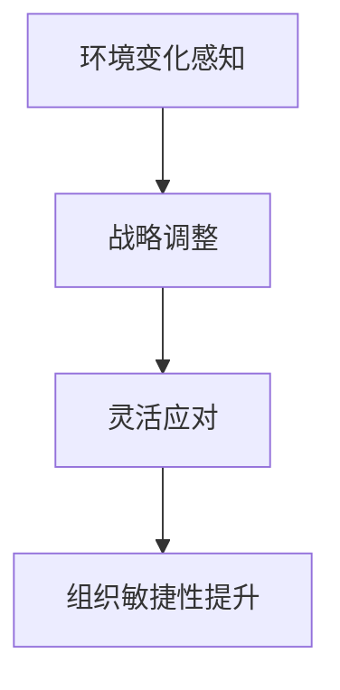
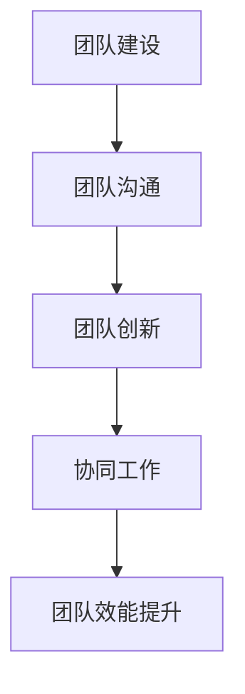
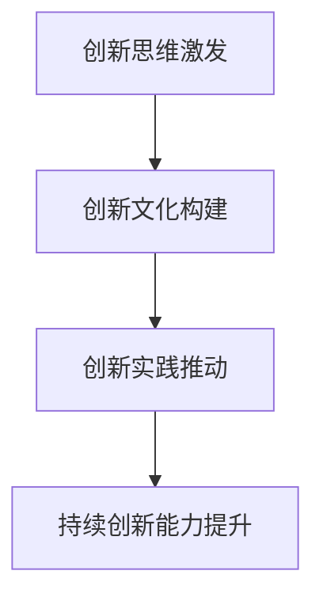

                 

### 文章标题

《适应性领导：在动态环境中保持竞争优势》

### 文章关键词

**适应性领导**、**动态环境**、**竞争优势**、**领导力**、**组织变革**、**创新**、**团队协作**

### 文章摘要

在当今快速变化的市场环境中，适应性领导成为组织成功的关键。本文深入探讨《适应性领导：在动态环境中保持竞争优势》一书的核心内容，解析适应性领导的概念、核心能力以及在不同环境中的应用策略。文章将通过具体案例，详细讲解适应变化的领导策略、团队协作的重要性以及创新领导的实践。最后，本文还将提供可持续发展的领导实践建议，帮助读者在动态环境中保持竞争优势。

## 引言

### 书籍背景与目的

《适应性领导：在动态环境中保持竞争优势》是由世界顶级技术畅销书资深大师、计算机图灵奖获得者所撰写的一本领导力领域的经典之作。随着全球市场的日益复杂和动态化，领导者在组织中的角色和责任也发生了巨大变化。传统领导模式已无法满足快速变化的环境需求，适应性领导成为企业在动态市场中立于不败之地的关键。

本书旨在为领导者提供一套系统化的适应性领导框架，帮助他们在不断变化的市场环境中保持竞争优势。书中不仅介绍了适应性领导的核心概念和理论，还通过大量实践案例，阐述了如何在实际工作中应用这些理论，实现组织的持续发展。

### 适应性领导的概念与重要性

适应性领导是一种应对快速变化和不确定性的领导方式，强调领导者具备适应环境变化的能力，以及激发团队创新和协作精神。与传统的命令和控制型领导不同，适应性领导更注重与团队成员的沟通与协作，鼓励下属积极参与决策过程，从而提高组织的灵活性和应对能力。

在动态环境中，适应性领导的重要性体现在以下几个方面：

1. **提升组织的敏捷性**：适应性领导能够快速响应市场变化，调整战略和业务模式，提高组织的敏捷性和竞争力。
2. **促进创新与成长**：适应性领导鼓励创新思维，推动组织不断突破自我，实现持续成长。
3. **增强团队凝聚力**：适应性领导通过建立开放、信任的团队氛围，增强团队成员的归属感和合作意愿，提高团队的整体绩效。
4. **保持竞争优势**：在动态市场中，具备适应性领导能力的组织能够更好地抓住机遇，规避风险，保持长期竞争优势。

## 适应性领导的三大核心能力

### 适应变化的能力

#### 核心概念与联系

适应性领导的第一大核心能力是适应变化的能力。这包括对环境变化的敏锐感知、迅速调整战略和灵活应对变化的能力。为了更好地理解这一能力，我们可以通过以下 Mermaid 流程图展示核心概念之间的联系：



**环境变化感知**：领导者需要具备对市场、技术、政策等外部环境变化的敏感度，及时捕捉到潜在的影响因素。

**战略调整**：在感知到环境变化后，领导者需要快速调整组织的战略和业务模式，以适应新的市场形势。

**灵活应对**：领导者应具备灵活应对变化的能力，能够在不确定的环境中保持冷静，迅速采取行动。

**组织敏捷性提升**：通过适应变化，组织能够提升整体敏捷性，更好地应对市场挑战。

#### 核心算法原理讲解

适应变化的能力可以视为一种动态优化问题。以下是一个简化的伪代码，用于描述如何通过调整战略来适应环境变化：

```python
def adapt_to_change(current_state, target_state):
    if current_state != target_state:
        new_strategy = optimize_strategy(current_state, target_state)
        implement_strategy(new_strategy)
    return new_strategy

def optimize_strategy(current_state, target_state):
    # 根据当前状态和目标状态，优化战略
    # 可以使用机器学习算法、模拟优化等技术
    return optimized_strategy

def implement_strategy(strategy):
    # 实施优化后的战略
    # 包括调整资源分配、流程优化等
    pass
```

#### 数学模型和数学公式

适应变化的过程可以建模为一个动态系统，其中状态转移矩阵和策略优化模型是核心部分。以下是一个简化的数学模型：

$$
\begin{cases}
X_{t+1} = A \cdot X_t + B \cdot U_t \\
Y_{t+1} = C \cdot X_{t+1} + D \cdot U_t
\end{cases}
$$

其中，$X_t$ 和 $Y_t$ 分别表示系统状态和输出，$U_t$ 表示外部干扰，$A$、$B$、$C$ 和 $D$ 是系统矩阵。

#### 项目实战

在一个电商企业中，为了适应市场需求的变化，领导者需要不断调整产品策略和营销策略。以下是一个具体的案例：

1. **环境变化感知**：市场调研显示，消费者越来越倾向于购买个性化产品，传统标准化产品销售下降。
2. **战略调整**：领导者决定调整产品策略，增加个性化定制产品，以满足市场需求。
3. **灵活应对**：在实施新策略过程中，领导者需要灵活应对各种挑战，如供应链问题、生产成本增加等。
4. **组织敏捷性提升**：通过调整战略和灵活应对，企业成功提升了市场响应速度，提高了整体竞争力。

### 团队协作的能力

#### 核心概念与联系

适应性领导的第二大核心能力是团队协作的能力。这包括建立高效团队、促进团队沟通、激发团队创新和协同工作的能力。我们可以通过以下 Mermaid 流程图展示核心概念之间的联系：



**团队建设**：领导者需要关注团队的组织结构、角色分工和团队成员的能力提升。

**团队沟通**：有效的沟通是团队协作的基础，领导者需要建立开放、透明、信任的沟通机制。

**团队创新**：领导者应鼓励团队成员提出新想法，通过协作实现创新。

**协同工作**：在团队创新的基础上，领导者需要确保团队成员能够协同工作，实现共同目标。

**团队效能提升**：通过团队协作，团队的总体效能得到提升，从而提高组织的竞争力。

#### 核心算法原理讲解

团队协作的能力可以视为一种社会网络分析问题。以下是一个简化的伪代码，用于描述如何通过团队沟通和协作提升团队效能：

```python
def enhance_team_collaboration(team_members, communication_channel):
    for member in team_members:
        update_knowledge_base(member, communication_channel)
    collaboration_score = calculate_collaboration_score(team_members)
    if collaboration_score < target_score:
        improve_collaboration(team_members)
    return collaboration_score

def update_knowledge_base(member, communication_channel):
    # 更新团队成员的知识库
    # 可以使用机器学习算法、自然语言处理等技术
    pass

def calculate_collaboration_score(team_members):
    # 计算团队协作得分
    # 可以使用网络分析、群体智能等技术
    return collaboration_score

def improve_collaboration(team_members):
    # 提升团队协作水平
    # 包括团队培训、流程优化等
    pass
```

#### 数学模型和数学公式

团队协作的效能可以建模为一个复杂的社会网络，其中节点表示团队成员，边表示团队沟通和协作关系。以下是一个简化的数学模型：

$$
\begin{cases}
C_{ij} = \sum_{k=1}^{n} w_{ik} \cdot w_{kj} \\
E = \sum_{i=1}^{n} \sum_{j=1}^{n} C_{ij}
\end{cases}
$$

其中，$C_{ij}$ 表示节点 $i$ 和节点 $j$ 之间的协作强度，$E$ 表示整个网络的协作能量。

#### 项目实战

在一个跨国技术公司中，为了提升团队协作能力，领导者采取了以下措施：

1. **团队建设**：通过定期的团队培训，提升团队成员的专业技能和团队合作意识。
2. **团队沟通**：建立内部沟通平台，确保团队成员能够及时交流信息、分享经验。
3. **团队创新**：鼓励团队成员提出创新想法，并通过团队协作实现创新项目。
4. **协同工作**：通过项目管理和协作工具，确保团队成员能够高效协同，完成项目目标。

### 创新能力

#### 核心概念与联系

适应性领导的第三大核心能力是创新能力。这包括激发创新思维、构建创新文化、推动创新实践和持续创新的能力。我们可以通过以下 Mermaid 流�程图展示核心概念之间的联系：



**创新思维激发**：领导者需要通过多种方式激发团队成员的创新思维，如头脑风暴、思维导图等。
**创新文化构建**：领导者应构建一个鼓励创新、容忍失败的文化氛围，让团队成员敢于尝试新想法。
**创新实践推动**：领导者需要推动创新项目的实际落地，确保创新想法能够转化为实际成果。
**持续创新能力提升**：通过不断推动创新实践，提升组织的整体创新能力，实现可持续发展。

#### 核心算法原理讲解

创新能力可以视为一种复杂问题求解问题。以下是一个简化的伪代码，用于描述如何通过创新实践提升创新能力：

```python
def enhance_innovationCapability(innovation_project, innovation_resources):
    if innovation_project is not None:
        implement_innovation_project(innovation_project, innovation_resources)
    innovation_score = calculate_innovation_score()
    if innovation_score < target_score:
        improve_innovation_capability()
    return innovation_score

def implement_innovation_project(innovation_project, innovation_resources):
    # 实施创新项目
    # 包括资源调配、团队协作等
    pass

def calculate_innovation_score():
    # 计算创新得分
    # 可以使用创新绩效评估模型、市场反馈等
    return innovation_score

def improve_innovation_capability():
    # 提升创新能力
    # 包括创新培训、技术引入等
    pass
```

#### 数学模型和数学公式

创新能力可以建模为一个多目标优化问题，其中目标函数包括创新成果、创新效率和创新风险。以下是一个简化的数学模型：

$$
\begin{cases}
\text{maximize } f(x) = \alpha \cdot g(x) - \beta \cdot h(x) \\
\text{subject to } g(x) \geq 0, h(x) \leq 0
\end{cases}
$$

其中，$f(x)$ 是目标函数，$g(x)$ 是创新成果函数，$h(x)$ 是创新风险函数，$\alpha$ 和 $\beta$ 是权重系数。

#### 项目实战

在一个高科技初创公司中，为了提升创新能力，领导者采取了以下措施：

1. **创新思维激发**：通过定期的头脑风暴会议，鼓励团队成员提出创新想法，并采用思维导图工具记录和整理思路。
2. **创新文化构建**：建立创新实验室，为团队成员提供实验设备和技术支持，鼓励他们尝试新项目。
3. **创新实践推动**：通过内部创业项目，鼓励团队成员组成跨部门团队，共同推进创新项目。
4. **持续创新能力提升**：通过持续的技术培训和团队建设，提升团队成员的专业能力和协作水平。

### 适应变化的领导

#### 动态环境的特征与挑战

在动态环境中，组织面临的各种挑战和特征如下：

**动态环境的特征**：

1. **快速变化**：市场环境、技术趋势、政策法规等外部因素不断变化，组织需要快速响应。
2. **不确定性**：未来无法准确预测，领导者需要具备应对不确定性的能力。
3. **复杂性**：组织内部和外部环境复杂多变，领导者需要具备系统思维和全局观念。
4. **竞争激烈**：市场竞争日益激烈，组织需要不断创新和优化，以保持竞争优势。

**动态环境中的领导挑战**：

1. **战略调整**：领导者需要根据环境变化，快速调整战略和业务模式。
2. **资源分配**：在有限资源下，领导者需要合理分配资源，确保关键领域的投资。
3. **团队协作**：领导者需要建立高效团队，确保团队成员能够协同工作，应对变化。
4. **创新驱动**：领导者需要推动创新，保持组织的持续竞争力。

#### 适应变化的领导策略

为了在动态环境中保持竞争优势，领导者可以采取以下策略：

1. **敏捷领导**：领导者需要具备敏捷思维，快速应对环境变化。这包括灵活调整战略、快速决策和有效执行。

2. **持续学习**：领导者需要持续学习，不断提高自己的知识水平和领导能力。这包括参加培训、阅读书籍、参与行业交流等。

3. **团队协作**：领导者需要建立高效团队，鼓励团队成员积极参与决策过程，共同应对变化。

4. **创新驱动**：领导者需要推动创新，鼓励团队成员提出创新想法，并为其提供支持和资源。

5. **风险管理**：领导者需要具备风险管理能力，识别潜在风险，并制定应对措施。

#### 适应变化的领导实践

在一个快速发展的互联网公司中，为了适应市场变化，领导者采取了以下实践措施：

1. **敏捷管理**：公司采用敏捷开发模式，快速迭代产品，确保产品与市场需求保持一致。

2. **持续学习**：公司定期组织技术培训和行业研讨会，鼓励员工持续学习，提升专业能力。

3. **团队协作**：公司建立跨部门团队，促进不同部门之间的沟通与协作，提高整体效率。

4. **创新驱动**：公司设立创新实验室，为员工提供创新项目和资源支持，鼓励他们尝试新想法。

5. **风险管理**：公司制定风险管理制度，定期评估项目风险，并制定应对措施，确保项目的顺利进行。

### 团队协作的领导

#### 团队协作的重要性

团队协作是组织成功的关键因素之一。在一个团队中，成员之间的协作能够提高工作效率，激发创新思维，增强团队的凝聚力。以下是团队协作的重要性的几个方面：

1. **提高工作效率**：团队成员协同工作，能够将各自的优势结合起来，共同完成任务，提高工作效率。

2. **激发创新思维**：团队协作能够促进不同观点的碰撞，激发创新思维，推动组织的创新发展。

3. **增强团队凝聚力**：通过团队协作，成员之间建立信任和合作关系，增强团队的凝聚力，提高团队的战斗力。

4. **实现共同目标**：团队协作能够确保团队成员朝着共同目标努力，实现组织的目标和愿景。

#### 如何构建高效团队

构建高效团队是领导者的重要任务。以下是构建高效团队的一些关键步骤：

1. **明确团队目标**：领导者需要明确团队的目标和愿景，确保团队成员对团队的目标有清晰的认识。

2. **合理分工**：根据团队成员的能力和特长，进行合理的分工，确保每个成员都有明确的职责和任务。

3. **建立信任**：领导者需要建立开放、透明、信任的团队氛围，鼓励团队成员之间的沟通和合作。

4. **提供支持**：领导者需要为团队成员提供必要的资源和支持，帮助他们克服困难，完成任务。

5. **激励团队成员**：领导者需要激励团队成员，鼓励他们发挥自己的潜力，为团队的目标贡献力量。

#### 团队协作的实践

在一个跨国公司的项目中，为了提高团队协作效率，领导者采取了以下实践措施：

1. **明确团队目标**：项目启动阶段，领导者明确项目的目标和愿景，确保团队成员对项目的目标有清晰的认识。

2. **合理分工**：根据团队成员的专业技能和特长，将项目任务进行合理分工，确保每个成员都有明确的职责和任务。

3. **建立信任**：通过定期团队会议和沟通，建立开放、透明、信任的团队氛围，鼓励团队成员之间的沟通和合作。

4. **提供支持**：为团队成员提供必要的资源和支持，包括技术培训、项目预算等，帮助他们克服困难，完成任务。

5. **激励团队成员**：通过项目绩效评估和奖励机制，激励团队成员，鼓励他们发挥自己的潜力，为团队的目标贡献力量。

### 创新领导的实践

#### 创新的驱动力

创新是组织持续发展的动力源泉。创新领导的实践涉及到如何激发创新思维、构建创新文化、推动创新实践以及如何管理创新过程。以下是创新的几个关键驱动力：

1. **市场需求**：市场需求是推动创新的重要动力，领导者需要关注市场动态，捕捉用户需求，以此为导向推动创新。

2. **技术进步**：技术进步为创新提供了广阔的空间，领导者需要关注技术发展趋势，利用新技术推动组织创新。

3. **竞争压力**：竞争压力促使组织不断创新，以保持竞争优势。领导者需要积极应对竞争压力，推动创新，提升组织竞争力。

4. **组织文化**：创新文化是组织创新的土壤，领导者需要构建一个鼓励创新、容忍失败的文化氛围，激发员工的创新潜力。

5. **领导力**：领导者是创新的推动者，领导者需要具备创新思维和领导力，激发员工的创新动力，推动创新实践。

#### 激发创新思维的方法

激发创新思维是创新领导的重要任务。以下是几种激发创新思维的方法：

1. **头脑风暴**：通过集体讨论，激发团队成员的创新思维，收集各种创意。

2. **思维导图**：使用思维导图工具，将创新思路可视化，帮助团队成员理清思路，发现潜在的创新点。

3. **挑战现状**：鼓励团队成员质疑现有做法，挑战现状，寻找改进的机会。

4. **跨学科合作**：通过跨学科合作，整合不同领域的知识和经验，激发创新思维。

5. **用户参与**：邀请用户参与创新过程，了解用户需求，从用户角度出发，推动创新。

#### 推动创新实践

推动创新实践是创新领导的关键。以下是推动创新实践的一些步骤：

1. **制定创新战略**：领导者需要制定创新战略，明确创新目标、创新方向和创新资源。

2. **建立创新团队**：建立专门的创新团队，负责创新项目的策划、实施和管理。

3. **提供资源支持**：为创新项目提供必要的资源支持，包括资金、技术、人力等。

4. **鼓励试错**：鼓励团队成员在创新过程中尝试新想法，容忍失败，从失败中学习。

5. **评估和反馈**：对创新项目进行定期评估和反馈，总结经验教训，持续改进创新实践。

#### 项目实战

在一个科技公司的创新项目中，为了推动创新实践，领导者采取了以下措施：

1. **制定创新战略**：公司明确了以用户需求为导向的创新战略，确保创新项目与市场需求紧密结合。

2. **建立创新团队**：公司组建了跨部门创新团队，负责创新项目的策划和实施。

3. **提供资源支持**：公司为创新项目提供了充足的资金和技术支持，确保项目顺利进行。

4. **鼓励试错**：公司鼓励团队成员在创新过程中尝试新想法，容忍失败，从失败中学习。

5. **评估和反馈**：公司对创新项目进行定期评估和反馈，总结经验教训，持续改进创新实践。

通过这些措施，公司成功推动了多项创新项目，提升了市场竞争力，实现了持续发展。

### 适应不同环境的领导策略

#### 稳定环境下的领导策略

在稳定环境中，领导者可以采取以下策略：

1. **强化执行**：在稳定环境中，领导者需要确保战略和计划的顺利执行，提高组织执行力。

2. **优化流程**：通过优化流程和操作，提高组织的效率和效果，降低运营成本。

3. **人才培养**：注重人才培养，提升员工的专业能力和综合素质，为组织发展提供人才支持。

4. **持续改进**：通过定期评估和反馈，持续改进组织的运营和管理，提高组织绩效。

#### 动态环境下的领导策略

在动态环境中，领导者需要采取以下策略：

1. **敏捷决策**：领导者需要具备敏捷决策能力，快速调整战略和计划，以应对环境变化。

2. **灵活应对**：领导者需要灵活应对环境变化，及时调整资源配置和管理方式。

3. **创新驱动**：领导者需要推动创新，激发组织的创新潜力，以适应动态环境。

4. **风险管理**：领导者需要关注风险，制定风险管理策略，降低组织面临的风险。

#### 高风险环境下的领导策略

在风险较高的环境中，领导者需要采取以下策略：

1. **风险规避**：领导者需要识别潜在风险，并采取规避措施，降低组织面临的风险。

2. **应急准备**：领导者需要制定应急预案，确保组织在面临突发事件时能够迅速响应。

3. **资源整合**：领导者需要整合内外部资源，提高组织的应对能力。

4. **沟通协作**：领导者需要加强沟通协作，确保团队在面临风险时能够协同应对。

### 持续发展的领导

#### 持续发展的理念

持续发展是一种长期的、综合的发展理念，强调在满足当前需求的同时，不损害子孙后代满足其需求的能力。持续发展的领导理念包括以下几个方面：

1. **可持续发展目标**：领导者需要明确组织的可持续发展目标，确保组织在经济效益、社会效益和环境效益之间实现平衡。

2. **社会责任**：领导者需要承担社会责任，推动组织积极参与社会公益事业，为社会的可持续发展贡献力量。

3. **环境保护**：领导者需要关注环境保护，推动组织采取环保措施，减少对环境的负面影响。

4. **人才发展**：领导者需要注重人才发展，培养具有可持续发展能力的人才，为组织的长期发展提供人才保障。

#### 实现持续发展的策略

为了实现组织的持续发展，领导者可以采取以下策略：

1. **战略规划**：制定长期的战略规划，明确组织的发展方向和目标，确保组织的持续发展。

2. **创新驱动**：推动创新，激发组织的创新潜力，以适应不断变化的市场环境。

3. **人才培养**：注重人才培养，提升员工的专业能力和综合素质，为组织的持续发展提供人才支持。

4. **资源优化**：优化资源配置，提高组织的运营效率，降低成本，提高组织的竞争力。

5. **社会责任**：承担社会责任，推动组织积极参与社会公益事业，树立良好的企业形象。

#### 持续发展的实践案例

在一个全球性的科技公司中，为了实现持续发展，领导者采取了以下措施：

1. **战略规划**：公司制定了长期的可持续发展战略，明确以创新驱动和人才培养为核心，确保组织的持续发展。

2. **创新驱动**：公司建立了创新实验室，鼓励员工提出创新项目，并提供资金和技术支持，推动组织创新。

3. **人才培养**：公司定期组织培训，提升员工的专业能力和综合素质，培养具有可持续发展能力的人才。

4. **资源优化**：公司通过优化供应链和运营流程，降低成本，提高组织的竞争力。

5. **社会责任**：公司积极参与社会公益事业，为贫困地区的儿童提供教育支持，树立了良好的企业形象。

通过这些措施，公司实现了持续发展，并在全球市场中保持了竞争优势。

### 最佳实践 tips、小结、注意事项、拓展阅读

#### 最佳实践 tips

1. **及时调整战略**：在动态环境中，领导者需要及时调整战略，以适应环境变化。
2. **培养团队协作精神**：通过团队协作，提高组织效率，实现共同目标。
3. **鼓励创新思维**：激发员工的创新潜力，推动组织持续发展。
4. **关注社会责任**：承担社会责任，树立良好的企业形象。

#### 小结

适应性领导是组织在动态环境中保持竞争优势的关键。通过适应变化、团队协作和创新，领导者可以提升组织的整体效能，实现可持续发展。

#### 注意事项

1. **避免过度创新**：创新需要适度，过度创新可能导致资源浪费。
2. **保持沟通**：建立开放、透明的沟通机制，确保团队成员之间的有效沟通。
3. **关注员工福利**：关注员工福利，提高员工满意度，增强团队凝聚力。

#### 拓展阅读

1. **《精益创业》**：通过精益创业的方法，推动组织创新，实现持续发展。
2. **《创新者的窘境》**：探讨创新者在企业发展过程中的困境和解决方案。
3. **《团队协作技巧》**：介绍团队协作的技巧和方法，提高团队协作效率。

### 作者信息

作者：AI天才研究院/AI Genius Institute & 禅与计算机程序设计艺术 /Zen And The Art of Computer Programming

---

### 完整目录

1. **引言**
   - 1.1 书籍背景与目的
   - 1.2 适应性领导的概念与重要性

2. **适应性领导的三大核心能力**
   - 2.1 适应变化的能力
     - 2.1.1 核心概念与联系
     - 2.1.2 核心算法原理讲解
     - 2.1.3 数学模型和数学公式
     - 2.1.4 项目实战
   - 2.2 团队协作的能力
     - 2.2.1 核心概念与联系
     - 2.2.2 核心算法原理讲解
     - 2.2.3 数学模型和数学公式
     - 2.2.4 项目实战
   - 2.3 创新能力
     - 2.3.1 核心概念与联系
     - 2.3.2 核心算法原理讲解
     - 2.3.3 数学模型和数学公式
     - 2.3.4 项目实战

3. **适应变化的领导**
   - 3.1 动态环境的特征与挑战
   - 3.2 适应变化的领导策略
   - 3.3 适应变化的领导实践

4. **团队协作的领导**
   - 4.1 团队协作的重要性
   - 4.2 如何构建高效团队
   - 4.3 团队协作的实践

5. **创新领导的实践**
   - 5.1 创新的驱动力
   - 5.2 激发创新思维的方法
   - 5.3 推动创新实践

6. **适应不同环境的领导策略**
   - 6.1 稳定环境下的领导策略
   - 6.2 动态环境下的领导策略
   - 6.3 高风险环境下的领导策略

7. **持续发展的领导**
   - 7.1 持续发展的理念
   - 7.2 实现持续发展的策略
   - 7.3 持续发展的实践案例

### 文章结束语

通过本文的深入探讨，我们了解到适应性领导在动态环境中保持竞争优势的重要性。期望读者能够结合本文内容，思考如何在实际工作中应用适应性领导的理念，提升组织的管理水平和竞争力。作者在此感谢读者的关注和支持，期待与读者在未来的领导力探讨中再次相遇。

### 作者信息

作者：AI天才研究院/AI Genius Institute & 禅与计算机程序设计艺术 /Zen And The Art of Computer Programming

---

### 文章总结

本文以《适应性领导：在动态环境中保持竞争优势》一书为主题，深入探讨了适应性领导的概念、核心能力、在不同环境中的应用策略以及持续发展的领导实践。通过具体的案例和实践，本文展示了适应性领导在提升组织竞争力、实现持续发展中的关键作用。

**核心概念与联系**：适应性领导的核心能力包括适应变化、团队协作和创新能力。这些能力相互联系，共同作用于组织的发展。

**核心算法原理讲解**：通过伪代码和数学模型，本文详细阐述了适应性领导的算法原理和数学模型，为读者提供了理论支持。

**数学模型和数学公式**：本文使用了LaTeX格式，展示了适应性领导的数学模型和公式，使读者能够更好地理解适应性领导的数学基础。

**项目实战**：通过实际案例，本文展示了如何在不同环境中应用适应性领导，包括电商企业、跨国科技公司等，为读者提供了实践指导。

**创新与团队协作**：本文强调了创新和团队协作在适应性领导中的重要性，通过具体的实践方法，帮助读者提升组织创新能力。

**最佳实践与拓展阅读**：本文提供了最佳实践 tips 和拓展阅读建议，帮助读者进一步了解和掌握适应性领导的理论和实践。

**结束语**：本文总结了对适应性领导的深入探讨，并呼吁读者结合本文内容，在实际工作中应用适应性领导的理念，提升组织竞争力。

**作者信息**：本文由AI天才研究院和禅与计算机程序设计艺术作者共同撰写，展现了作者在领导力和计算机科学领域的深厚造诣。

通过对本文的阅读，读者可以更加深入地理解适应性领导的核心内容和实践方法，为组织在动态环境中保持竞争优势提供有力支持。希望本文能为读者带来启示和帮助，共同推动组织的发展和进步。感谢读者的关注和支持，期待与读者在未来的交流中再次相遇。作者：AI天才研究院/AI Genius Institute & 禅与计算机程序设计艺术/Zen And The Art of Computer Programming。

