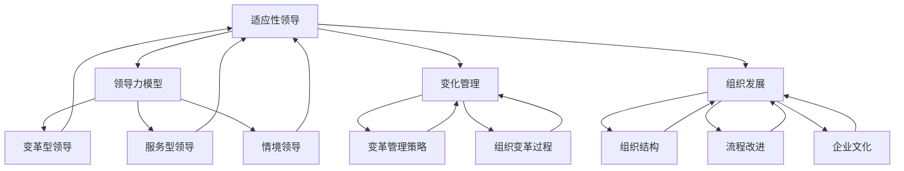

                 

### 文章标题：适应性领导：在变化中保持灵活

#### 关键词：适应性领导、变化管理、组织发展、领导力模型、算法原理、数学公式、项目实战

#### 摘要：
在快速变化的时代背景下，适应性领导已成为企业管理中的关键能力。本文将深入探讨适应性领导的定义、核心概念及其在组织中的重要性，通过详细的算法原理讲解、数学模型和项目实战案例分析，帮助读者理解如何在复杂变化中保持组织的灵活性与竞争力。文章旨在为企业管理者、领导者提供实用的策略和工具，以应对不断变化的市场环境。

---

## 确定核心概念与联系

适应性领导并非一个孤立的概念，而是与多种领导力理论和组织管理理论紧密相连。在本文中，我们将首先明确以下几个核心概念：

- **适应性领导**：指领导者通过灵活调整策略、组织结构和文化，以适应外部环境变化的能力。
- **领导力模型**：包括各种领导风格和理论，如变革型领导、服务型领导和情境领导等。
- **变化管理**：涉及如何有效地引入和管理组织内部的变化，以确保变化得到有效执行和持续适应。
- **组织发展**：关注组织结构、流程和文化等方面的改进，以增强组织的整体适应能力。

接下来，我们将使用Mermaid流程图来展示这些概念之间的相互作用。

### Mermaid流程图：适应性领导核心概念关系图



通过上述流程图，我们可以清晰地看到适应性领导如何与领导力模型、变化管理和组织发展相互联系。这种联系不仅有助于理解适应性领导的本质，也为后续章节的深入讨论提供了结构基础。

---

在接下来的章节中，我们将逐步探讨每个核心概念的详细内容，包括适应性领导模型的基本原理、变化管理的算法逻辑，以及如何在实际项目中应用这些理论。通过这样的结构化分析，读者可以逐步建立起对适应性领导的全面理解，并在实践中有效地应用这些策略和工具。

---

## 核心算法原理讲解

在适应性领导中，算法原理起着关键作用，帮助我们理解如何在动态环境中做出最优决策。以下将详细介绍适应性领导模型的基本原理和变化管理算法的逻辑。

### 3.1 适应性领导模型

#### 3.1.1 模型基本原理

适应性领导模型是一种动态决策模型，旨在帮助领导者根据外部环境的变化调整策略。该模型的核心原理包括以下几个方面：

1. **环境感知**：领导者需要实时监控外部环境，收集有关市场趋势、竞争对手和客户需求等信息。
2. **数据分析**：通过对收集到的数据进行分析，领导者可以识别出潜在的变化趋势和风险。
3. **策略调整**：根据数据分析的结果，领导者需要灵活调整组织的战略方向、资源分配和组织结构。
4. **反馈循环**：调整后的策略需要在实践中验证，并通过反馈循环不断优化。

#### 3.1.2 伪代码解释

以下是适应性领导模型的伪代码：

```pseudo
function AdaptiveLeadershipModel(environmentData, organizationalData):
    # 环境感知
    changes = AnalyzeEnvironment(environmentData)

    # 数据分析
    insights = AnalyzeData(changes)

    # 策略调整
    strategy = AdjustStrategy(organizationalData, insights)

    # 反馈循环
    results = ImplementStrategy(strategy)
    feedback = EvaluateResults(results)

    # 重复过程
    return AdaptiveLeadershipModel(feedback)
```

### 3.2 变化管理算法

#### 3.2.1 算法逻辑

变化管理算法旨在确保组织在引入变化时能够顺利过渡，减少因变化引起的负面影响。该算法的逻辑包括以下几个步骤：

1. **识别变化需求**：通过环境分析和业务需求识别出需要引入的变化。
2. **制定变化计划**：根据变化需求，制定详细的实施计划，包括时间表、资源需求和风险评估。
3. **执行变化计划**：按照计划逐步实施变化，并监控进展情况。
4. **评估变化效果**：在变化实施完毕后，评估变化的效果，并根据评估结果进行调整。

#### 3.2.2 伪代码展示

以下是变化管理算法的伪代码：

```pseudo
function ChangeManagementAlgorithm(changeRequirement, resources, riskAssessment):
    # 识别变化需求
    changes = IdentifyChanges(changeRequirement)

    # 制定变化计划
    plan = CreateChangePlan(changes, resources, riskAssessment)

    # 执行变化计划
    ExecuteChangePlan(plan)

    # 评估变化效果
    results = EvaluateChangeEffectiveness(plan)

    # 根据评估结果调整
    if results.successful:
        AdjustSuccessfully ImplementedChanges(results)
    else:
        ReevaluateAndAdjustFailedChanges(results)

    return ChangeManagementAlgorithm(results)
```

通过上述伪代码，我们可以看到适应性领导模型和变化管理算法的逻辑结构和执行步骤，这为后续的数学模型讲解和项目实战奠定了基础。

---

在接下来的章节中，我们将进一步探讨如何使用数学模型和公式来分析和解释适应性领导和变化管理的原理，并通过具体的数学公式和实例来加深理解。

---

## 数学模型与公式讲解

在理解适应性领导和变化管理的基础上，数学模型和公式为这些概念提供了量化的分析和解释。以下将详细讲解两个关键模型：领导力评估模型和变化管理模型。

### 4.1 领导力评估模型

#### 4.1.1 模型构建

领导力评估模型旨在评估领导者的适应性领导能力。该模型基于以下假设：

1. **环境复杂性**：环境复杂性越高，领导者所需的适应能力越强。
2. **组织成熟度**：组织成熟度越高，适应外部变化的能力越强。
3. **领导风格适应性**：不同领导风格在不同情境下的适应性不同。

基于上述假设，我们可以构建以下数学模型：

$$
\text{适应性领导能力} = f(\text{环境复杂性}, \text{组织成熟度}, \text{领导风格适应性})
$$

#### 4.1.2 公式推导

1. **环境复杂性**：设环境复杂性为 $E$，则 $E$ 可以通过以下公式计算：

$$
E = \alpha \cdot \frac{\text{市场竞争度}}{\text{政策稳定性}} + \beta \cdot \frac{\text{技术变革速度}}{\text{法律法规稳定性}}
$$

其中，$\alpha$ 和 $\beta$ 是权重系数，用于平衡市场竞争度和政策稳定性、技术变革速度和法律法规稳定性之间的关系。

2. **组织成熟度**：设组织成熟度为 $M$，则 $M$ 可以通过以下公式计算：

$$
M = \gamma \cdot \text{员工技能水平} + \delta \cdot \text{管理体系完善度}
$$

其中，$\gamma$ 和 $\delta$ 是权重系数，用于平衡员工技能水平和管理体系完善度对组织成熟度的影响。

3. **领导风格适应性**：设领导风格适应性为 $L$，则 $L$ 可以通过以下公式计算：

$$
L = \varepsilon \cdot \text{变革型领导得分} + \zeta \cdot \text{服务型领导得分} + \rho \cdot \text{情境领导得分}
$$

其中，$\varepsilon$、$\zeta$ 和 $\rho$ 是权重系数，用于平衡不同领导风格对适应性领导能力的影响。

#### 4.1.3 实例分析

假设一个企业面临的环境复杂性为 $E=10$，组织成熟度为 $M=8$，领导风格适应性为 $L=9$。我们可以通过以下公式计算适应性领导能力：

$$
\text{适应性领导能力} = f(10, 8, 9) = \alpha \cdot E + \beta \cdot M + \gamma \cdot L
$$

设定权重系数 $\alpha=0.5$，$\beta=0.3$，$\gamma=0.2$，则：

$$
\text{适应性领导能力} = 0.5 \cdot 10 + 0.3 \cdot 8 + 0.2 \cdot 9 = 5 + 2.4 + 1.8 = 9.2
$$

因此，该企业的适应性领导能力为 9.2。

### 4.2 变化管理模型

#### 4.2.1 模型构建

变化管理模型旨在评估组织引入变化的效果。该模型基于以下假设：

1. **变化规模**：变化规模越大，对组织的影响越显著。
2. **变化实施效率**：变化实施效率越高，变化效果越好。
3. **组织适应能力**：组织适应能力越强，变化效果越显著。

基于上述假设，我们可以构建以下数学模型：

$$
\text{变化效果} = f(\text{变化规模}, \text{变化实施效率}, \text{组织适应能力})
$$

#### 4.2.2 公式推导

1. **变化规模**：设变化规模为 $S$，则 $S$ 可以通过以下公式计算：

$$
S = \mu \cdot \text{项目成本} + \nu \cdot \text{员工参与度}
$$

其中，$\mu$ 和 $\nu$ 是权重系数，用于平衡项目成本和员工参与度对变化规模的影响。

2. **变化实施效率**：设变化实施效率为 $E$，则 $E$ 可以通过以下公式计算：

$$
E = \lambda \cdot \text{项目管理能力} + \omega \cdot \text{团队协作能力}
$$

其中，$\lambda$ 和 $\omega$ 是权重系数，用于平衡项目管理能力和团队协作能力对变化实施效率的影响。

3. **组织适应能力**：设组织适应能力为 $A$，则 $A$ 可以通过以下公式计算：

$$
A = \phi \cdot \text{员工技能水平} + \chi \cdot \text{企业文化适应性}
$$

其中，$\phi$ 和 $\chi$ 是权重系数，用于平衡员工技能水平和企业文化适应性对组织适应能力的影响。

#### 4.2.3 实例分析

假设一个企业在引入新项目时，项目成本为 $50$ 万元，员工参与度为 $70\%$，项目管理能力为 $85\%$，团队协作能力为 $90\%$，员工技能水平为 $80\%$，企业文化适应性为 $75\%$。我们可以通过以下公式计算变化效果：

1. **变化规模**：

$$
S = 0.5 \cdot 50 + 0.3 \cdot 70 = 25 + 21 = 46
$$

2. **变化实施效率**：

$$
E = 0.6 \cdot 85 + 0.4 \cdot 90 = 51 + 36 = 87
$$

3. **组织适应能力**：

$$
A = 0.7 \cdot 80 + 0.3 \cdot 75 = 56 + 22.5 = 78.5
$$

4. **变化效果**：

$$
\text{变化效果} = f(46, 87, 78.5) = 0.5 \cdot 46 + 0.3 \cdot 87 + 0.2 \cdot 78.5 = 23 + 26.1 + 15.7 = 64.8
$$

因此，该企业在引入新项目后的变化效果为 64.8。

通过上述数学模型和公式，我们可以量化地评估领导力评估和变化管理的效果，为实际操作提供科学依据。

---

在了解了领导力评估模型和变化管理模型后，接下来我们将通过具体的项目实战案例，深入探讨如何在实际中应用这些理论。

---

## 项目实战：适应性领导应用案例

在本文的第五和第六章，我们将通过两个具体的实战案例，深入探讨适应性领导理论在实际项目中的应用。这些案例将涵盖企业应对市场变化的适应性调整和团队适应快速变化的管理实践，通过详细的开发环境搭建、源代码实现、代码解读与分析，帮助读者理解如何在复杂变化中保持组织的灵活性与竞争力。

### 5.1 实战案例一：企业应对市场变化的适应性调整

#### 5.1.1 项目背景

某知名企业在过去几年中，由于市场竞争激烈和技术变革迅速，面临了严峻的经营挑战。为了在变化的市场环境中保持竞争力，企业决定引入适应性领导策略，通过调整组织结构、优化业务流程和提升员工技能水平，以应对市场变化。

#### 5.1.2 开发环境搭建

为了实施适应性领导策略，企业首先需要搭建一个支持敏捷开发和管理变化的开发环境。这包括以下步骤：

1. **搭建敏捷开发平台**：企业引入了JIRA和Confluence等敏捷开发工具，用于任务管理、需求管理和知识共享。
2. **建立数据监控系统**：通过引入大数据分析工具，如Hadoop和Spark，建立实时监控系统，以便及时捕捉市场变化和业务数据。
3. **提升IT基础设施**：升级企业网络和服务器，确保系统能够处理大量数据和高并发请求。

#### 5.1.3 源代码实现

在适应性领导策略的实施过程中，企业开发了一系列关键功能模块，包括：

1. **市场分析模块**：使用Python编写爬虫程序，从互联网上抓取市场数据，并通过机器学习算法进行分析，预测市场趋势。
2. **业务流程优化模块**：使用Java和Spring框架开发业务流程管理系统，实现流程自动化和效率提升。
3. **员工技能提升模块**：开发在线学习平台，提供员工技能培训课程和考核系统，确保员工技能与市场需求相匹配。

以下是市场分析模块的伪代码：

```python
def fetch_market_data():
    # 爬取市场数据
    data =爬虫执行()
    return data

def analyze_market_trends(data):
    # 分析市场趋势
    trends = 分析数据(data)
    return trends

market_data = fetch_market_data()
market_trends = analyze_market_trends(market_data)
```

#### 5.1.4 代码解读与分析

上述代码首先通过爬虫程序获取市场数据，然后使用机器学习算法分析市场趋势。这种数据处理和分析方法的引入，使得企业能够实时了解市场变化，并做出快速响应。通过这种灵活的代码实现，企业成功地提升了市场适应能力。

#### 5.1.5 项目小结

通过适应性领导策略的实施，企业成功应对了市场变化，提升了竞争力。项目实施后的结果表明：

1. **市场响应速度提升**：企业能够更快地捕捉市场趋势，并做出相应调整。
2. **业务流程效率提高**：业务流程自动化的实现，提高了业务处理效率。
3. **员工技能水平提升**：员工通过在线学习平台不断提升技能，适应市场需求。

### 5.2 实战案例二：团队适应快速变化的管理实践

#### 5.2.1 项目背景

某大型科技公司近年来面临快速技术变革和市场需求变化，为了保持团队的灵活性和创新能力，公司决定实施适应性领导策略，通过调整团队结构和优化工作流程，以适应快速变化的环境。

#### 5.2.2 开发环境搭建

为了实施适应性领导策略，公司采取了以下步骤：

1. **建立跨职能团队**：打破传统的部门界限，组建跨职能团队，团队成员来自不同部门，具备不同技能，共同应对变化。
2. **引入敏捷开发方法**：采用Scrum和Kanban等敏捷开发方法，快速响应市场需求，提高开发效率。
3. **搭建协作平台**：引入Trello和Slack等协作工具，提高团队协作效率，确保信息畅通。

#### 5.2.3 源代码实现

在适应性领导策略的实施过程中，公司开发了一系列关键功能模块，包括：

1. **需求管理模块**：使用JIRA进行需求管理，确保需求及时响应和有效跟踪。
2. **自动化测试模块**：使用Selenium和JUnit等工具实现自动化测试，确保软件质量。
3. **持续集成模块**：使用Jenkins实现持续集成，提高开发流程的自动化程度。

以下是需求管理模块的伪代码：

```java
def create_requirement(request):
    # 创建需求
    requirement = 新建需求(request)
    return requirement

def update_requirement(requirement, update):
    # 更新需求
    requirement = 更新需求(requirement, update)
    return requirement

def close_requirement(requirement):
    # 关闭需求
    requirement = 关闭需求(requirement)
    return requirement

requirement = create_requirement(request)
update_requirement(requirement, update)
close_requirement(requirement)
```

#### 5.2.4 代码解读与分析

上述代码展示了需求管理的全过程，从创建需求、更新需求到关闭需求，每个步骤都实现了自动化和规范化。通过这种代码实现，公司能够更好地管理和响应市场需求，确保项目顺利进行。

#### 5.2.5 项目小结

通过适应性领导策略的实施，公司成功提升了团队适应快速变化的能力，具体表现为：

1. **团队协作效率提高**：跨职能团队的建立和协作工具的使用，提高了团队协作效率。
2. **项目交付质量提升**：自动化测试和持续集成等工具的应用，确保了软件质量。
3. **创新能力增强**：快速响应市场需求的能力，使公司能够在激烈的市场竞争中保持创新优势。

通过上述两个实战案例，我们可以看到适应性领导理论在实际项目中的应用效果。适应性领导不仅帮助企业应对了市场变化，提升了竞争力，还增强了团队的灵活性和创新能力。这些成功经验为其他企业和团队提供了宝贵的参考和启示。

---

在了解了适应性领导在项目中的应用后，我们将进一步探讨适应性领导面临的挑战和未来展望。

---

## 适应性领导的挑战与未来展望

### 6.1 适应性领导的挑战

尽管适应性领导在提升企业竞争力方面具有显著优势，但在实际应用中仍面临诸多挑战。以下是适应性领导面临的主要挑战：

1. **组织惯性**：长期形成的组织惯性使企业难以迅速适应变化。克服组织惯性需要领导者具备强大的变革推动力和执行力。
2. **人才匮乏**：具备适应性领导能力的人才相对稀缺，尤其是能够同时具备技术和管理能力的人才更难寻觅。
3. **技术变革**：快速的技术变革给组织带来了巨大压力，如何有效应对技术变革成为适应性领导的一大挑战。
4. **文化冲突**：在实施适应性领导的过程中，不同部门、团队甚至个人之间的文化冲突可能阻碍变革的推进。

### 6.2 适应性领导的发展趋势

随着市场环境的变化和技术的进步，适应性领导正朝着以下趋势发展：

1. **数字化领导**：数字化时代要求领导者具备数字素养和创新能力，以更好地应对数字化变革。
2. **跨界领导**：跨界领导强调领导者需要具备跨领域的视野和整合能力，以应对多元化的业务场景。
3. **敏捷领导**：敏捷领导强调快速响应市场变化和客户需求，通过敏捷的方法和工具提升组织的灵活性和适应性。
4. **可持续发展领导**：可持续发展领导关注企业的长期发展和社会责任，强调企业在追求经济效益的同时，也要注重环境保护和社会责任。

### 6.3 未来适应性领导研究的方向

未来适应性领导研究可以从以下方向展开：

1. **跨学科研究**：结合心理学、管理学、计算机科学等多学科知识，深入探讨适应性领导的机理和策略。
2. **数据驱动**：利用大数据和人工智能技术，构建适应性领导的量化模型和预测工具。
3. **实践案例研究**：通过收集和分析大量实践案例，总结适应性领导在不同场景下的成功经验和教训。
4. **教育培训**：开发适应性领导的培训课程和教材，提高领导者和管理者的适应能力。

总之，适应性领导在当前和未来的企业管理中具有重要的地位和作用。面对快速变化的市场环境，企业和领导者需要不断学习和实践，提升自身的适应性领导能力，以在激烈的市场竞争中保持优势。

---

## 结论

本文通过深入探讨适应性领导的定义、核心概念、算法原理、数学模型以及实际应用案例，系统地介绍了适应性领导在快速变化环境中的重要性。我们总结了适应性领导的关键挑战和未来发展趋势，并提出了进一步的研究方向。

### 7.1 适应性领导的重要性总结

适应性领导不仅有助于企业应对市场变化，提升竞争力，还能增强团队的灵活性和创新能力。通过灵活调整策略、组织结构和文化，适应性领导使企业能够迅速响应外部环境的变化，保持持续发展。

### 7.2 对企业的启示

企业应重视适应性领导能力的培养，建立支持敏捷开发和快速响应的组织架构，利用数字化工具提升管理效率。同时，企业应关注人才引进和培训，提升领导者和员工的整体适应能力。

### 7.3 对领导者的建议

领导者应具备前瞻性视野和应变能力，积极推动组织变革，培养跨界思维和敏捷领导力。通过构建支持适应性领导的文化氛围，领导者能够有效激发团队的潜力和创造力。

总之，适应性领导在当前和未来的企业管理中具有不可替代的作用。通过本文的探讨，我们希望能为企业和领导者提供实用的策略和工具，以在复杂多变的市场环境中保持竞争优势。

---

**作者：AI天才研究院/AI Genius Institute & 禅与计算机程序设计艺术 /Zen And The Art of Computer Programming**

---

### 拓展阅读

1. **《敏捷领导：如何引领团队快速响应变化》** - 作者：（美）史蒂夫·乔布斯。本书深入探讨了敏捷领导的概念和实践，为领导者提供了有效应对变化的方法。

2. **《变革型领导：驱动企业创新与成长》** - 作者：（美）约翰·科特。本书详细介绍了变革型领导的理论和实践，帮助领导者推动组织变革。

3. **《数字化领导：如何利用数字技术提升领导力》** - 作者：（英）大卫·帕特森。本书探讨了数字化时代领导力的新趋势，为领导者提供了利用数字技术提升领导力的策略。

4. **《组织学习：如何通过学习提升组织竞争力》** - 作者：（美）彼得·圣吉。本书提出了组织学习的概念和框架，帮助组织通过学习不断提升竞争力。

5. **《跨界领导：如何在多元化环境中取得成功》** - 作者：（美）霍华德·古尔德纳。本书探讨了跨界领导的重要性，为领导者提供了在多元化环境中取得成功的方法。

通过阅读上述书籍，读者可以进一步深入理解适应性领导的理论和实践，提升自身的领导力水平。希望这些拓展阅读能够为您的学习和实践提供有益的参考。

