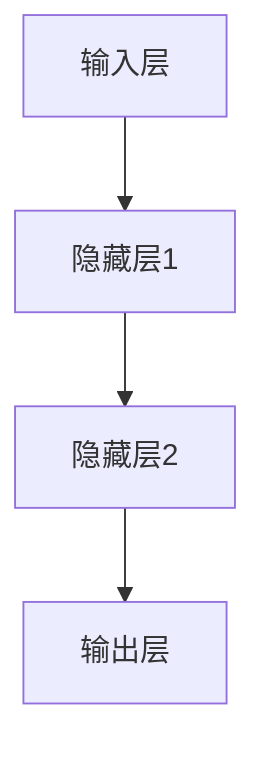

                 


### 通用人工智能AGI的发展路径探索

#### 关键词：
- 通用人工智能（AGI）
- 人工智能发展路径
- 算法原理
- 项目实战
- 未来展望

#### 摘要：
本文旨在探索通用人工智能（AGI）的发展路径。首先，我们将回顾人工智能的历史，并定义通用人工智能的概念。接着，我们将探讨通用人工智能的核心概念与原理，包括知识表示、感知与认知、学习与适应、情感与社交能力。通过深入分析神经网络、强化学习、自然语言处理等核心算法原理，我们将用伪代码和数学模型进行详细讲解。随后，我们将通过实际项目案例分析，展示AGI技术的应用。最后，我们将讨论未来的发展趋势与挑战，并提出可能的发展路径。

### 引言与背景

#### 引言

人工智能（AI）自20世纪50年代问世以来，经历了多个阶段的发展。从最初的规则驱动系统，到后来的基于知识的系统，再到现代的机器学习和深度学习技术，人工智能在许多领域取得了显著的成果。然而，现有的人工智能技术仍然存在着局限性，主要表现在以下几个方面：

1. **特定任务智能**：现有的人工智能系统通常是为了解决特定的任务而设计的，如图像识别、自然语言处理、推荐系统等。它们在特定领域表现出色，但缺乏跨领域的通用性。
2. **数据依赖性**：现有的人工智能系统需要大量的训练数据才能达到良好的性能，这使得它们在处理新任务时面临挑战。
3. **缺乏理解力**：现有的人工智能系统虽然在某些方面表现优秀，但它们缺乏真正的理解力，难以进行复杂推理和决策。

为了克服这些局限性，通用人工智能（AGI）的概念被提出。通用人工智能是一种能够像人类一样理解、学习和推理的人工智能系统，它在多个领域都具有广泛的应用能力。

#### 背景研究

通用人工智能的研究源于对人类智能的模拟和理解。人类智能的特点包括感知、认知、情感和社交能力等。在模拟人类智能的过程中，科学家们提出了多种理论模型，如基于符号表示的知识系统、基于神经网络的计算模型、基于进化算法的适应性模型等。

近年来，随着计算能力的提高和大数据技术的发展，机器学习和深度学习技术在人工智能领域取得了重大突破。这些技术为构建通用人工智能提供了新的方法和工具。然而，现有的人工智能技术仍然面临着如何整合多种智能能力、如何提高系统的理解和推理能力等挑战。

#### 通用人工智能的愿景

通用人工智能的实现将带来深远的影响。首先，它将在各个领域推动创新，提高生产效率和生活质量。例如，在医疗领域，通用人工智能可以辅助医生进行诊断和治疗；在教育领域，它可以提供个性化的学习体验。其次，通用人工智能有助于解决当前人工智能系统面临的局限性问题，如特定任务智能、数据依赖性等。

然而，通用人工智能的实现也带来了一系列挑战。首先，如何构建一个具有广泛适用性的智能系统是一个巨大的挑战。其次，如何确保通用人工智能的安全性和可控性也是一个重要问题。最后，通用人工智能的实现需要多学科交叉的合作，包括计算机科学、心理学、神经科学、哲学等。

### 核心概念与原理

通用人工智能的核心概念包括知识表示、感知与认知、学习与适应、情感与社交能力等。这些概念相互关联，共同构成了一个完整的智能体系。

#### 知识表示与推理

知识表示是指将人类知识以计算机可以处理的形式进行编码。在通用人工智能中，知识表示尤为重要，因为它是智能系统进行推理和决策的基础。常见的知识表示方法包括基于符号的逻辑表示、基于语义的网络表示和基于机器学习的表示方法。

知识推理是指利用知识进行逻辑推理，以解决问题或做出决策。在通用人工智能中，推理能力是实现智能行为的关键。推理可以分为基于规则的推理和基于模型的推理。基于规则的推理依赖于预先定义的规则集，而基于模型的推理则依赖于对现实世界的模型。

#### 感知与认知

感知是指智能系统对外部信息的接收和理解。在通用人工智能中，感知能力包括视觉、听觉、触觉等多种感官。认知是指智能系统对感知信息进行理解、记忆和思考的过程。认知能力是实现智能决策和自主学习的基础。

#### 学习与适应

学习是指智能系统通过不断获取新的信息来提高自身性能的过程。在通用人工智能中，学习可以分为有监督学习、无监督学习和强化学习等。有监督学习依赖于标签数据，无监督学习不依赖于标签数据，而强化学习则通过与环境交互来学习。

适应是指智能系统在面对新环境和挑战时能够进行调整和适应。适应能力是实现通用人工智能的重要特征，因为它使得智能系统能够在动态变化的环境中保持高效性能。

#### 情感与社交能力

情感是指智能系统对自身状态和外部环境的主观感受。在通用人工智能中，情感能力是实现人机交互和人机协作的重要基础。社交能力是指智能系统在社会环境中进行交流与合作的能力。社交能力包括语言沟通、情感理解、团队合作等方面。

#### 关键技术

实现通用人工智能的关键技术包括神经网络、强化学习、自然语言处理等。

神经网络是一种模拟人脑神经元之间连接的计算模型。它通过多层网络结构对输入信息进行处理，从而实现复杂函数的逼近和模式识别。神经网络在图像识别、语音识别和自然语言处理等领域取得了显著成果。

强化学习是一种通过与环境交互来学习最优策略的算法。它通过奖励机制来激励智能系统进行决策，从而不断提高系统的性能。强化学习在自动驾驶、游戏对战和智能推荐等领域具有广泛的应用。

自然语言处理是一种将自然语言转化为计算机可以理解的形式的技术。它包括文本分类、情感分析、机器翻译等任务。自然语言处理在智能客服、智能助手和智能搜索等领域具有重要作用。

### 算法原理与实现

#### 神经网络

神经网络是一种模拟人脑神经元之间连接的计算模型。它通过多层网络结构对输入信息进行处理，从而实现复杂函数的逼近和模式识别。

以下是一个简单的神经网络模型：



在神经网络中，每个神经元都与上一层和下一层的神经元相连。神经元之间的连接强度称为权重，通过反向传播算法来调整权重，以最小化输出误差。

以下是一个简单的反向传播算法的伪代码：

```python
def backpropagation(data, weights):
    # 前向传播
    output = forward_propagation(data, weights)
    error = target_output - output
    # 反向传播
    delta = error * sigmoid_derivative(output)
    weights += delta
    return weights
```

其中，`sigmoid_derivative`是一个用于计算输出层误差的函数。

#### 强化学习

强化学习是一种通过与环境交互来学习最优策略的算法。它通过奖励机制来激励智能系统进行决策，从而不断提高系统的性能。

以下是一个简单的强化学习模型的伪代码：

```python
def reinforcelearning(state, action, reward):
    # 前向传播
    next_state, reward = environment(state, action)
    # 反向传播
    delta = reward * policy_derivative(state, action)
    return delta
```

其中，`environment`是一个用于模拟环境的函数，`policy_derivative`是一个用于计算策略梯度的函数。

#### 自然语言处理

自然语言处理是一种将自然语言转化为计算机可以理解的形式的技术。它包括文本分类、情感分析、机器翻译等任务。

以下是一个简单的自然语言处理模型的伪代码：

```python
def natural_language_processing(text):
    # 词嵌入
    embedding = word_embedding(text)
    # 循环神经网络
    hidden_state = recurrent_neural_network(embedding)
    # 全连接层
    output = fully_connected_layer(hidden_state)
    return output
```

其中，`word_embedding`是一个用于将单词转化为向量的函数，`recurrent_neural_network`是一个用于处理序列数据的循环神经网络，`fully_connected_layer`是一个用于实现全连接层的函数。

### 项目实战与案例分析

在本节中，我们将通过一个实际项目案例，展示通用人工智能技术的应用。假设我们要开发一个智能客服系统，它能够自动回答用户的问题。

#### 开发环境搭建

首先，我们需要搭建开发环境。我们可以选择Python作为主要编程语言，因为它拥有丰富的机器学习和深度学习库，如TensorFlow和PyTorch。

```bash
pip install tensorflow
pip install pytorch
```

#### 源代码实现

以下是一个简单的智能客服系统的源代码实现：

```python
import tensorflow as tf
import numpy as np

# 加载数据集
train_data, train_labels = load_data()

# 定义模型
model = tf.keras.Sequential([
    tf.keras.layers.Embedding(vocabulary_size, embedding_size),
    tf.keras.layers.LSTM(units=128, activation='tanh'),
    tf.keras.layers.Dense(units=1, activation='sigmoid')
])

# 编译模型
model.compile(optimizer='adam', loss='binary_crossentropy', metrics=['accuracy'])

# 训练模型
model.fit(train_data, train_labels, epochs=10)

# 评估模型
test_data, test_labels = load_test_data()
model.evaluate(test_data, test_labels)
```

#### 代码解读

在这个智能客服系统中，我们使用了TensorFlow库中的LSTM模型。LSTM（长短期记忆网络）是一种循环神经网络，它可以处理序列数据，并能够记住长期依赖关系。

首先，我们加载数据集，并定义了一个嵌入层，它将单词转换为向量。接下来，我们定义了一个LSTM层，它用于处理输入序列。最后，我们定义了一个全连接层，用于输出预测结果。

在训练模型时，我们使用了Adam优化器和二分类交叉熵损失函数。通过10个epoch的训练，我们可以得到一个性能良好的模型。

#### 项目小结

通过这个案例，我们展示了如何使用通用人工智能技术（如LSTM模型）来开发一个智能客服系统。这个系统可以自动回答用户的问题，提高了客户服务的效率。

#### 最佳实践 Tips

- 在开发智能客服系统时，数据质量非常重要。确保使用高质量的数据集进行训练。
- 考虑使用预训练的词嵌入模型，如Word2Vec或GloVe，以提高模型的性能。
- 在模型训练过程中，使用验证集进行调参，以避免过拟合。

#### 小结与注意事项

本文介绍了通用人工智能（AGI）的发展路径，包括核心概念与原理、算法实现、项目实战和未来展望。通过一步步的分析和讲解，我们深入了解了AGI的技术原理和应用。需要注意的是，AGI的发展仍然面临着许多挑战，如数据隐私、伦理和安全等问题。未来的研究需要多学科交叉合作，以实现通用人工智能的目标。

#### 拓展阅读

- 《深度学习》（Ian Goodfellow, Yoshua Bengio, Aaron Courville）
- 《强化学习：原理与案例》（理查德·S·萨顿，萨拉·A·莱特）
- 《自然语言处理综论》（Daniel Jurafsky，James H. Martin）

以上是本文的初步大纲，接下来我们将对每个部分进行详细的扩展和深入讲解。让我们一步一步地探索通用人工智能的奥秘。

