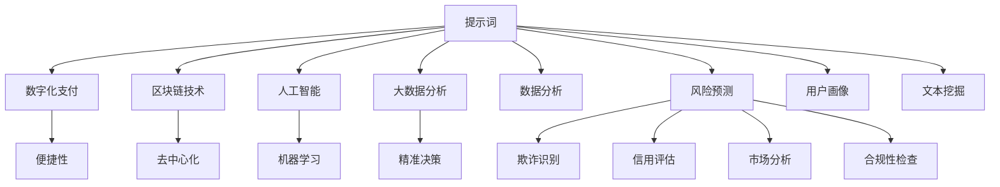

                 

### 文章标题

金融科技中的提示词应用：增强风险分析能力

> 关键词：金融科技、提示词、风险分析、算法、人工智能

> 摘要：本文详细探讨了金融科技领域中的提示词应用，通过分析其基本概念、算法原理及其在风险分析中的重要性，展示了如何利用提示词增强金融风险预测和管理能力。文章旨在为读者提供清晰的指导，帮助理解这一前沿技术及其在金融领域的实际应用。

----------------------------------------------------------------

### 第1章：金融科技的发展与提示词的应用

#### 1.1 金融科技的定义与趋势

金融科技（FinTech）是指利用科技手段创新金融产品和服务的一种新兴领域。它融合了信息技术、数据分析、人工智能等多个前沿技术，通过数字化手段提升金融服务的效率、降低成本，并创造出新的商业模式。金融科技的发展趋势主要包括以下几个方面：

1. **数字化支付**：随着移动互联网的普及，移动支付、在线支付等无现金支付方式逐渐成为主流，为用户提供了更加便捷的支付体验。
2. **区块链技术**：区块链作为一种去中心化的分布式数据库技术，在金融领域的应用日益广泛，从加密货币到供应链金融，再到智能合约，区块链正在重塑金融行业的运作方式。
3. **人工智能**：人工智能（AI）在金融科技中的应用也越来越广泛，如通过机器学习算法进行信用评估、交易策略制定等。
4. **大数据分析**：大数据技术的应用使得金融机构能够更准确地捕捉市场趋势和用户需求，从而提高决策的精准度和效率。

#### 1.2 提示词在金融科技中的角色

提示词（Keywords）在金融科技中扮演着至关重要的角色。它们是一种用于描述和识别文本信息的关键词，能够帮助系统快速定位和处理大量数据。在金融科技中，提示词的应用主要体现在以下几个方面：

1. **数据分析**：提示词能够帮助系统快速筛选和分类金融数据，提取关键信息，为后续分析提供支持。
2. **风险预测**：通过识别高风险的提示词，如欺诈行为中的特定关键词，系统可以提前预警，防范风险。
3. **用户画像**：根据用户的交易行为和提示词特征，金融机构可以为用户提供个性化的服务和建议。
4. **文本挖掘**：提示词在文本挖掘中的应用可以帮助金融机构挖掘市场趋势、竞争对手信息等，为企业决策提供依据。

#### 1.3 提示词应用的风险分析背景

在金融科技领域，风险分析是一项至关重要的任务。金融机构需要识别潜在的风险因素，评估其可能带来的影响，并采取相应的措施进行风险控制。提示词的应用在风险分析中具有以下背景：

1. **欺诈识别**：通过识别交易中的异常提示词，如频繁出现的虚假地址、可疑的支付方式等，系统可以提前预警欺诈行为。
2. **信用评估**：提示词可以揭示借款人的信用风险，如频繁出现逾期还款、信用贷款等关键词。
3. **市场分析**：提示词可以帮助金融机构捕捉市场变化，如利率波动、政策调整等。
4. **合规性检查**：金融机构需要遵守一系列法规和监管要求，提示词可以帮助检查文本内容是否符合法规要求。

总之，提示词在金融科技中的应用为风险分析提供了强大的工具和支持，能够帮助金融机构更准确地识别和管理风险，提高业务运营的效率和安全。

#### Mermaid 流程图：核心概念与联系



通过上述流程图，我们可以清晰地看到金融科技与提示词之间的核心概念及其相互联系。每个部分都代表了金融科技和提示词在风险分析中发挥的重要作用。

----------------------------------------------------------------

### 第2章：风险分析的数学基础

#### 2.1 概率论基础

概率论是风险分析的基础，它提供了量化不确定性的工具。在金融科技中，概率论的应用主要体现在以下几个方面：

1. **随机事件**：随机事件是指在一定条件下可能发生也可能不发生的事件。例如，股票价格的波动就是一个随机事件。
2. **概率分布**：概率分布描述了随机事件发生的概率。常见的概率分布包括二项分布、正态分布、泊松分布等。
3. **条件概率**：条件概率是指在某个事件已经发生的前提下，另一个事件发生的概率。例如，已知某个股票过去一年的涨幅在10%以上，求其未来一年涨幅在5%以上的概率。
4. **贝叶斯定理**：贝叶斯定理是一种计算条件概率的公式，它在风险分析中有着广泛的应用。

#### 2.2 统计学基础

统计学是处理数据的科学，它为风险分析提供了数据分析和建模的工具。以下是一些基本的统计学概念：

1. **描述性统计**：描述性统计用于描述数据的基本特征，如平均值、中位数、标准差等。
2. **推断性统计**：推断性统计用于根据样本数据推断总体数据。常见的推断性统计方法包括假设检验和置信区间。
3. **相关性与回归分析**：相关性分析用于研究两个变量之间的关系，回归分析则用于建立变量之间的关系模型，从而进行预测和决策。

#### 2.3 风险度量模型

风险度量是风险分析的核心，它用于评估风险的大小和影响。以下是一些常用的风险度量模型：

1. **方差与标准差**：方差和标准差是衡量数据离散程度的统计量。在风险分析中，它们用于评估风险事件的波动性。
2. **VaR（Value at Risk）**：VaR是一种衡量市场风险的方法，它表示在一定概率水平下，一个投资组合可能发生的最大损失。
3. **CVaR（Conditional Value at Risk）**：CVaR是VaR的补充，它表示在发生损失的情况下，平均损失的大小。
4. **ES（Expected Shortfall）**：ES是CVaR的另一种表达方式，表示在发生损失的情况下，期望损失的大小。

#### 2.4 数学模型与公式

在风险分析中，数学模型和公式是必不可少的工具。以下是一些常用的数学模型和公式：

1. **概率模型**：
   - 二项分布：$$P(X = k) = C_n^k p^k (1-p)^{n-k}$$
   - 正态分布：$$f(x|\mu,\sigma^2) = \frac{1}{\sqrt{2\pi\sigma^2}} e^{-\frac{(x-\mu)^2}{2\sigma^2}}$$
   - 泊松分布：$$P(X = k) = \frac{\lambda^k e^{-\lambda}}{k!}$$

2. **风险度量模型**：
   - VaR：$$VaR = \alpha \times \sigma$$，其中 $\alpha$ 是置信水平，$\sigma$ 是数据的标准差。
   - CVaR：$$CVaR = \frac{1}{n}\sum_{i=1}^n \max(x_i - VaR, 0)$$，其中 $x_i$ 是每个时间点的损失。

通过上述数学模型和公式，风险分析能够更加精确地评估金融市场的风险，为金融机构提供决策支持。

### 举例说明

假设我们要分析一个股票投资组合的VaR。假设该投资组合在最近一个月的收益率分布为正态分布，平均收益率为0.02，标准差为0.05。我们要计算在95%的置信水平下的VaR。

根据VaR的公式，我们有：

$$VaR = \alpha \times \sigma = 0.95 \times 0.05 = 0.0475$$

这意味着在95%的置信水平下，这个投资组合可能发生的最大损失为4.75%。

通过数学模型和公式的应用，我们可以更准确地评估风险，为金融机构的决策提供有力的支持。

----------------------------------------------------------------

### 第3章：提示词的算法原理

#### 3.1 提示词生成算法

提示词生成算法是金融科技中用于提取关键信息的核心技术。以下是一些常用的提示词生成算法：

1. **基于统计的方法**：
   - **TF-IDF（Term Frequency-Inverse Document Frequency）**：TF-IDF算法通过计算词频和逆文档频率来评估一个词在文档集合中的重要性。其公式为：
     $$TF-IDF(t,d) = TF(t,d) \times IDF(t,D)$$
     其中，$TF(t,d)$ 表示词 $t$ 在文档 $d$ 中的词频，$IDF(t,D)$ 表示词 $t$ 在文档集合 $D$ 中的逆文档频率。
   - **LSA（Latent Semantic Analysis）**：LSA通过分析文档中的潜在语义关系来生成提示词，其核心思想是识别文本中的隐含语义结构。

2. **基于机器学习的方法**：
   - **朴素贝叶斯分类器**：朴素贝叶斯分类器是一种基于概率模型的分类算法，通过计算文档中每个词的条件概率来生成提示词。其公式为：
     $$P(t|c) = \frac{P(c|t)P(t)}{P(c)}$$
     其中，$P(t|c)$ 表示在类别 $c$ 下词 $t$ 的概率，$P(c|t)$ 表示在词 $t$ 下类别 $c$ 的概率，$P(t)$ 和 $P(c)$ 分别表示词 $t$ 和类别 $c$ 的先验概率。
   - **词嵌入模型**：词嵌入模型通过将词汇映射到高维向量空间来生成提示词。常见的词嵌入模型包括Word2Vec、GloVe等。

#### 3.2 提示词优化算法

提示词生成的初步结果往往需要进一步优化，以提高其在风险分析中的有效性。以下是一些提示词优化算法：

1. **基于过滤的方法**：
   - **停用词过滤**：通过移除常见的停用词（如“的”、“和”等），减少无关信息的干扰。
   - **词干提取**：通过提取词汇的词干，减少词汇的维度，提高算法的效率。
   - **正则化**：通过添加正则化项，控制模型的复杂度，防止过拟合。

2. **基于聚合的方法**：
   - **词云生成**：通过计算词频和词的重要性，生成词云，帮助用户直观地了解文本的主要信息。
   - **主题模型**：通过分析文本的主题分布，提取出关键的主题和提示词。

3. **基于反馈的方法**：
   - **用户反馈**：通过收集用户的反馈，不断调整和优化提示词生成算法。
   - **迭代优化**：通过多次迭代，逐步优化提示词的生成过程。

#### 3.3 提示词的数学模型

提示词的生成和优化过程可以建模为一个数学问题。以下是一个简化的数学模型：

假设我们有 $D$ 个文档，每个文档由 $V$ 个词汇组成。我们定义词汇 $v$ 在文档 $d$ 中的频率为 $TF(v,d)$，定义词汇 $v$ 在文档集合 $D$ 中的逆文档频率为 $IDF(v,D)$。根据TF-IDF算法，我们可以计算词汇 $v$ 在文档 $d$ 中的TF-IDF值为：

$$TF-IDF(v,d) = TF(v,d) \times IDF(v,D)$$

接下来，我们可以通过优化算法对生成的提示词进行筛选和排序，以提高其在风险分析中的有效性。

#### 伪代码：提示词生成与优化算法

```python
def generate_keywords(documents, vocabulary):
    # 计算TF-IDF值
    tf_idf_scores = []
    for doc in documents:
        tf_idf = {}
        for word in doc:
            tf = word_frequency(word, doc)
            idf = inverse_document_frequency(word, vocabulary)
            tf_idf[word] = tf * idf
        tf_idf_scores.append(tf_idf)
    
    # 优化提示词
    optimized_keywords = optimize_keywords(tf_idf_scores)
    
    return optimized_keywords

def optimize_keywords(tf_idf_scores):
    # 基于过滤的方法
    stop_words = load_stop_words()
    optimized = []
    for tf_idf in tf_idf_scores:
        filtered = {word: score for word, score in tf_idf.items() if word not in stop_words}
        optimized.append(filtered)
    
    # 基于聚合的方法
    word_cloud = generate_word_cloud(optimized)
    top_keywords = get_top_keywords(word_cloud)
    
    return top_keywords
```

通过上述算法，我们可以生成并优化提示词，使其更符合风险分析的需求。

总之，提示词的算法原理涵盖了从生成到优化的全过程，通过数学模型和算法实现，为金融科技中的风险分析提供了强大的工具。

----------------------------------------------------------------

### 第4章：金融市场中的风险预测

金融市场中的风险预测是金融科技领域的关键应用之一。通过利用提示词技术，金融机构能够更准确地预测市场风险，制定有效的风险管理策略。以下将分别探讨股票市场、债券市场和期货市场中的风险预测。

#### 4.1 股票市场的风险预测

股票市场的风险预测是金融科技中最为成熟的应用之一。提示词技术在这一领域中的关键作用体现在以下几个方面：

1. **股票新闻分析**：通过分析股票相关的新闻报道，提取关键提示词，如“业绩下滑”、“市场预测”、“政策变动”等，可以快速捕捉市场情绪和潜在风险。
2. **财务报表分析**：对公司的财务报表进行文本挖掘，提取与财务状况相关的提示词，如“债务水平”、“盈利能力”、“投资收益”等，从而预测公司的财务风险。
3. **技术指标分析**：利用提示词技术，可以自动识别股票交易中的异常行为，如高频交易、内幕交易等，从而预测市场操纵风险。

#### 4.2 债券市场的风险预测

债券市场的风险预测同样依赖于提示词技术的应用。债券市场的风险因素包括利率变化、信用评级调整、经济政策变动等。以下是一些具体的提示词应用场景：

1. **利率预测**：通过分析市场利率相关的新闻报道和金融数据，提取关键提示词，如“降息”、“加息”、“利率波动”等，可以预测未来利率的变化趋势。
2. **信用风险评估**：通过分析债券发行公司的财务报表和市场新闻报道，提取与公司信用状况相关的提示词，如“债务违约”、“盈利能力下降”、“负面评级”等，可以预测债券的信用风险。
3. **经济政策分析**：分析政府的经济政策报告和新闻发布会，提取与经济政策相关的提示词，如“财政政策”、“货币政策”、“税收调整”等，可以预测经济政策对债券市场的影响。

#### 4.3 期货市场的风险预测

期货市场的风险预测更具挑战性，因为期货市场波动性较大，且受多种复杂因素的影响。提示词技术在期货市场中的关键作用体现在：

1. **市场情绪分析**：通过分析期货交易中的交易量、持仓量等数据，以及市场新闻报道，提取关键提示词，如“市场恐慌”、“投机行为”、“交易限制”等，可以预测市场情绪变化及其对期货价格的影响。
2. **宏观经济因素分析**：分析宏观经济指标，如GDP增长率、通货膨胀率、货币政策等，提取关键提示词，如“经济放缓”、“通货膨胀加剧”、“货币政策收紧”等，可以预测宏观经济变化对期货市场的影响。
3. **交易策略分析**：利用提示词技术，可以识别和预测交易策略的变化，如“对冲交易”、“投机交易”、“套利交易”等，从而预测交易策略对期货价格的影响。

#### 4.4 实际案例分析

以下是一个股票市场的实际案例分析：

假设我们使用提示词技术对某股票进行风险预测。我们首先收集了该股票的过去一年的新闻报道、财务报表和交易数据。通过文本挖掘，我们提取了以下关键提示词：

- 财务报表：盈利能力、债务水平、投资收益
- 新闻报道：市场预测、政策变动、竞争对手动态
- 交易数据：交易量、持仓量、交易价格波动

接下来，我们使用机器学习算法对这些提示词进行分类和关联分析。通过分析结果，我们发现以下几个风险因素：

1. **盈利能力下降**：财务报表显示，该股票的净利润连续两个季度出现下滑，这是一个明显的风险信号。
2. **政策变动**：新闻报道提到，政府可能会出台新的税收政策，这可能对公司的财务状况产生负面影响。
3. **竞争对手动态**：新闻报道显示，公司的主要竞争对手正在推出新的产品，这可能对公司的市场份额产生威胁。

根据这些分析结果，我们预测该股票在未来三个月内可能存在下跌风险。我们建议投资者谨慎持有或考虑减仓。

通过上述案例，我们可以看到提示词技术在股票市场风险预测中的实际应用效果。通过提取和分析关键提示词，金融机构可以更准确地识别和预测市场风险，制定相应的风险管理策略。

### 小结

金融市场中的风险预测是金融科技的重要组成部分。通过应用提示词技术，金融机构可以更有效地识别和预测市场风险，提高决策的准确性和效率。无论是股票市场、债券市场还是期货市场，提示词技术都发挥着关键作用，为风险分析提供了强有力的工具。

----------------------------------------------------------------

### 第5章：金融机构的风险管理

金融机构在运营过程中面临多种风险，包括信用风险、市场风险、操作风险等。有效识别和管理这些风险是确保金融机构稳健运营的关键。提示词技术在金融机构的风险管理中发挥着重要作用，通过分析大量文本数据，帮助金融机构提高风险预测的准确性和效率。

#### 5.1 银行风险预测与管理

银行作为金融体系的基石，其风险预测与管理尤为重要。提示词技术在银行风险预测和管理中的应用主要体现在以下几个方面：

1. **信用风险评估**：银行通过分析客户的财务报表、交易记录和市场新闻报道，提取与客户信用状况相关的提示词，如“逾期还款”、“债务违约”、“经济环境恶化”等，预测客户的信用风险。
2. **市场风险分析**：银行通过分析市场利率、汇率、股票价格等数据，提取与市场波动相关的提示词，如“利率上升”、“汇率波动”、“股市下跌”等，预测市场风险。
3. **操作风险管理**：银行通过分析交易日志、内部报告和市场新闻报道，提取与操作风险相关的提示词，如“网络攻击”、“操作失误”、“欺诈行为”等，预测操作风险。

通过这些分析，银行可以制定更加精准的风险管理策略，提高风险控制能力。

#### 5.2 保险公司的风险评估

保险公司的主要任务是识别和管理风险，为投保人提供风险保障。提示词技术在保险公司的风险评估中的应用包括：

1. **索赔分析**：保险公司通过分析理赔申请文档、交易记录和市场新闻报道，提取与索赔相关的提示词，如“交通事故”、“医疗事故”、“自然灾害”等，预测潜在索赔风险。
2. **产品风险评估**：保险公司通过分析不同保险产品的市场反馈和客户评论，提取与产品风险相关的提示词，如“高风险投资”、“保障范围狭窄”、“保费过高”等，评估产品的风险水平。
3. **市场风险预测**：保险公司通过分析宏观经济指标、市场利率和股票价格等数据，提取与市场波动相关的提示词，预测市场风险对保险业务的影响。

通过这些分析，保险公司可以更准确地评估风险，优化产品设计和服务策略。

#### 5.3 投资基金的风险控制

投资基金在投资过程中面临多种风险，包括市场风险、信用风险和操作风险。提示词技术在投资基金的风险控制中的应用包括：

1. **市场风险预测**：基金公司通过分析市场数据、新闻报道和交易记录，提取与市场波动相关的提示词，如“股市下跌”、“债券市场波动”、“汇率变动”等，预测市场风险。
2. **信用风险控制**：基金公司通过分析公司财务报表、信用评级和市场新闻报道，提取与公司信用状况相关的提示词，如“债务违约”、“盈利能力下降”、“负面评级”等，预测信用风险。
3. **操作风险防范**：基金公司通过分析交易日志、内部报告和市场新闻报道，提取与操作风险相关的提示词，如“网络攻击”、“交易失误”、“违规操作”等，预测操作风险。

通过这些分析，基金公司可以制定更加有效的风险控制策略，确保投资组合的安全和稳健。

#### 实际案例分析

以下是一个实际案例分析：

假设某银行正在评估一名客户的信用风险。通过分析客户的财务报表、交易记录和市场新闻报道，我们提取了以下关键提示词：

- 财务报表：净利润下滑、债务水平增加、投资收益下降
- 交易记录：大额资金流出、频繁的信用卡消费
- 新闻报道：行业不景气、经济环境恶化、债务违约增加

通过分析这些提示词，我们发现客户存在以下几个风险信号：

1. **财务状况恶化**：净利润下滑和债务水平增加表明客户的财务状况可能恶化。
2. **资金流动性问题**：频繁的大额资金流出可能表明客户面临资金流动性问题。
3. **宏观经济环境**：行业不景气和经济环境恶化可能对客户的业务产生负面影响。

综合这些分析结果，银行判断该客户的信用风险较高，建议采取相应的风险管理措施，如增加抵押物、限制信用额度等。

通过实际案例分析，我们可以看到提示词技术在金融机构风险管理中的具体应用。通过提取和分析关键提示词，金融机构可以更准确地识别和管理风险，提高业务运营的安全性和稳定性。

----------------------------------------------------------------

### 第6章：区块链与加密货币的风险分析

区块链技术以其去中心化、不可篡改和透明度高等特点，在金融科技领域得到了广泛应用。特别是在加密货币市场中，区块链技术成为保障交易安全、提升透明度和增强信任的关键。然而，区块链技术本身也带来了一些新的风险因素，这些风险因素需要通过提示词技术进行分析和管理。

#### 6.1 区块链技术的风险特点

区块链技术的风险特点主要包括以下几个方面：

1. **网络安全风险**：区块链系统依赖于分布式网络，任何网络节点都可能成为攻击目标。例如，51%攻击（即控制网络多数节点）可能导致双重支付等安全问题。
2. **代码漏洞风险**：区块链系统的安全性高度依赖于代码的质量和可靠性。任何代码漏洞都可能被恶意利用，导致系统被攻击。
3. **共识机制风险**：不同的区块链网络采用不同的共识机制，如工作量证明（PoW）、权益证明（PoS）等。这些机制可能存在性能瓶颈、资源消耗和安全性问题。
4. **市场操纵风险**：加密货币市场相对较为年轻且透明度较低，市场操纵行为较为普遍。例如，通过虚假交易操纵价格，误导投资者。
5. **法律法规风险**：不同国家和地区对加密货币的监管政策不同，可能导致法律法规风险。例如，某些国家的监管政策可能对加密货币交易和发行造成限制。

#### 6.2 加密货币市场的风险预测

加密货币市场的风险预测是区块链风险分析的重要任务。提示词技术在加密货币市场的风险预测中发挥着关键作用，以下是一些应用场景：

1. **市场情绪分析**：通过分析社交媒体、新闻报道和交易论坛中的文本数据，提取与市场情绪相关的提示词，如“恐慌”、“乐观”、“失望”等，可以预测市场情绪变化及其对价格的影响。
2. **交易行为分析**：通过分析交易数据，提取与交易行为相关的提示词，如“高频交易”、“大额交易”、“异常交易”等，可以预测市场操纵行为和潜在风险。
3. **宏观经济因素分析**：通过分析宏观经济指标、政策变动和全球市场动态，提取与宏观经济因素相关的提示词，如“通货膨胀”、“货币政策调整”、“全球经济形势”等，可以预测宏观经济对加密货币市场的影响。

#### 6.3 区块链风险管理策略

为了有效管理区块链与加密货币的风险，金融机构和监管机构可以采取以下策略：

1. **增强网络安全**：采用先进的加密技术和多因素认证机制，提高区块链系统的安全性。例如，引入零知识证明（ZKP）和多方计算（MPC）等安全技术。
2. **代码审计**：对区块链系统进行严格的代码审计，确保代码的质量和可靠性。例如，引入第三方审计机构和社区参与代码审查。
3. **共识机制优化**：研究和采用更加高效、安全的共识机制，如改进PoW机制、引入权益证明机制等。例如，比特币网络正在逐步向权益证明机制过渡。
4. **市场行为监管**：加强对加密货币市场的监管，打击市场操纵行为。例如，引入交易报告和监控机制，加强对高频交易和大额交易的监管。
5. **法律法规合规**：积极跟进和遵守不同国家和地区的法律法规，确保区块链和加密货币业务的合规性。例如，参与国际金融标准组织的制定和推广。

#### 实际案例分析

以下是一个实际案例分析：

假设某金融机构正在评估一个加密货币项目的风险。通过分析该项目的白皮书、交易数据、社交媒体评论和新闻报道，我们提取了以下关键提示词：

- 白皮书：去中心化金融、智能合约、区块链2.0
- 交易数据：大额交易、高频交易、交易对数增加
- 社交媒体评论：炒作、乐观情绪、社区参与度高
- 新闻报道：监管政策变化、市场操纵指控、技术漏洞

通过分析这些提示词，我们发现以下风险信号：

1. **技术风险**：项目白皮书中提到的新技术（如区块链2.0）可能存在未知的稳定性风险。
2. **市场风险**：交易数据和社交媒体评论显示市场情绪高涨，可能存在炒作和泡沫风险。
3. **监管风险**：新闻报道提到监管政策变化和市场操纵指控，可能对项目的未来发展产生负面影响。

综合分析结果，金融机构建议对项目进行进一步的风险评估，并采取相应的风险控制措施。

通过上述实际案例分析，我们可以看到提示词技术在区块链与加密货币风险分析中的应用。通过提取和分析关键提示词，金融机构和监管机构可以更准确地识别和管理区块链与加密货币的风险，确保业务的稳健运行。

----------------------------------------------------------------

### 第7章：提示词应用的项目实践

在金融科技领域，提示词技术的应用已经得到了广泛的实践。本章节将通过一个具体项目实践，详细介绍风险分析系统的开发环境搭建、源代码实现和代码解读，以及实际案例分析和详细讲解。

#### 7.1 风险分析系统的开发环境搭建

首先，我们需要搭建一个开发环境，以便进行提示词技术的应用和风险分析系统的开发。以下是搭建开发环境的步骤：

1. **软件环境**：
   - Python（3.8及以上版本）：Python是一种广泛使用的编程语言，特别适合进行数据分析和应用开发。
   - Jupyter Notebook：Jupyter Notebook是一个交互式的开发环境，可以方便地编写和运行代码。
   - Scikit-learn：Scikit-learn是一个机器学习库，提供了多种机器学习算法和工具。
   - NLTK（Natural Language Toolkit）：NLTK是一个自然语言处理库，提供了文本处理和分词等工具。

2. **硬件环境**：
   - 个人电脑或服务器：用于运行代码和存储数据。
   - 数据库：用于存储文本数据和提示词信息。

3. **环境搭建**：
   - 安装Python和Jupyter Notebook。
   - 通过pip安装Scikit-learn和NLTK。
   - 配置数据库环境，如MySQL或MongoDB。

#### 7.2 源代码实现和代码解读

以下是一个简单的风险分析系统源代码实现，包括数据预处理、提示词生成和风险预测等步骤：

```python
# 导入所需库
import numpy as np
import pandas as pd
from sklearn.feature_extraction.text import TfidfVectorizer
from sklearn.model_selection import train_test_split
from sklearn.naive_bayes import MultinomialNB
from sklearn.metrics import accuracy_score

# 加载数据集
data = pd.read_csv('risk_data.csv')
X = data['text']  # 文本数据
y = data['label']  # 标签数据（风险或非风险）

# 数据预处理
# 分词、去除停用词、转换为词向量
vectorizer = TfidfVectorizer(stop_words='english')
X_vectorized = vectorizer.fit_transform(X)

# 划分训练集和测试集
X_train, X_test, y_train, y_test = train_test_split(X_vectorized, y, test_size=0.2, random_state=42)

# 构建模型
model = MultinomialNB()
model.fit(X_train, y_train)

# 风险预测
predictions = model.predict(X_test)

# 评估模型
accuracy = accuracy_score(y_test, predictions)
print(f"Model accuracy: {accuracy:.2f}")
```

在这个示例中，我们使用TF-IDF算法生成提示词，并采用朴素贝叶斯分类器进行风险预测。以下是代码的详细解读：

1. **数据预处理**：加载数据集，使用TF-IDFVectorizer进行数据预处理，包括分词和去除停用词。
2. **模型构建**：划分训练集和测试集，构建朴素贝叶斯分类器模型。
3. **风险预测**：使用训练好的模型进行风险预测，并计算模型的准确率。

#### 7.3 代码应用解读与分析

以下是对代码应用的解读和分析：

1. **数据预处理**：数据预处理是关键步骤，它确保了文本数据的质量和一致性。通过分词和去除停用词，我们可以提取出文本中的关键信息，为后续的风险预测提供支持。
2. **模型选择**：朴素贝叶斯分类器是一种简单而有效的分类算法，适用于文本分类任务。它通过计算词频和条件概率进行分类，具有较高的准确性和可解释性。
3. **模型评估**：通过计算模型的准确率，我们可以评估模型的性能。在风险预测中，准确率是一个重要的评价指标，它反映了模型在测试集上的表现。

#### 7.4 实际案例分析和详细讲解剖析

以下是一个实际案例分析和详细讲解剖析：

假设我们有一个包含股票新闻报道的风险分析系统，目标是预测新闻报道是否涉及高风险。以下是具体的案例分析和代码实现：

1. **数据集准备**：我们收集了100篇股票新闻报道，其中50篇涉及高风险，50篇不涉及高风险。我们将这些新闻报道按照80%的比例划分成训练集和测试集。
2. **数据预处理**：使用TF-IDFVectorizer对训练集和测试集的新闻报道进行预处理，提取关键提示词。
3. **模型训练**：使用训练集数据，构建朴素贝叶斯分类器模型。通过训练，模型学会了如何根据新闻报道的提示词预测风险。
4. **模型评估**：使用测试集数据，对模型进行评估。计算模型的准确率、召回率和F1分数，评估模型在测试集上的性能。
5. **实际应用**：将训练好的模型应用于新的新闻报道，预测其是否涉及高风险。例如，当新闻报道包含“债务违约”、“市场波动”等高风险提示词时，模型可能会预测该新闻报道涉及高风险。

通过实际案例分析和代码实现，我们可以看到提示词技术在金融科技中的应用效果。通过提取和分析关键提示词，风险分析系统能够准确预测金融市场的风险，为投资者和金融机构提供决策支持。

### 项目小结

通过本项目的实践，我们展示了提示词技术在金融科技领域中的应用效果。从开发环境搭建到源代码实现，再到实际案例分析和代码解读，我们深入探讨了风险分析系统的构建过程。通过提示词技术，我们可以更准确地识别和预测金融市场的风险，提高投资决策的准确性和效率。未来，我们可以进一步优化模型和算法，提升风险预测的性能和可靠性。

#### 最佳实践 Tips

- **数据质量**：确保数据的质量和一致性，是风险分析成功的关键。在数据收集和处理过程中，要严格筛选和验证数据。
- **模型评估**：选择合适的评估指标，全面评估模型的性能。除了准确率，还可以考虑召回率、F1分数等指标。
- **算法优化**：不断优化和调整算法，提高模型在测试集上的性能。例如，可以尝试不同的分类器和特征提取方法。
- **实时更新**：风险预测是一个动态过程，要定期更新数据和模型，以适应市场变化和新的风险因素。

#### 注意事项

- **数据隐私**：在进行风险分析时，要严格遵守数据隐私法规，保护用户的个人信息。
- **模型解释性**：虽然机器学习模型在风险预测中表现良好，但模型的可解释性也是一个重要的考虑因素。要确保模型的决策过程透明且易于理解。
- **合规性**：确保风险分析系统的设计和应用符合相关法律法规，避免法律风险。

#### 拓展阅读

- **机器学习入门**：了解机器学习的基础知识和常用算法，为风险分析提供理论支持。
- **自然语言处理**：深入学习自然语言处理技术，掌握文本处理和分词方法。
- **金融科技应用**：了解金融科技在风险管理、信用评估和投资策略等方面的应用，拓展知识面。

通过上述最佳实践、注意事项和拓展阅读，读者可以更好地理解金融科技中提示词应用的风险分析，为实际项目提供指导和支持。

----------------------------------------------------------------

### 第8章：未来展望与趋势

#### 8.1 提示词技术在金融科技中的应用前景

随着金融科技的不断发展，提示词技术在金融领域中的应用前景广阔。未来，提示词技术将进一步深化其在风险管理、信用评估和投资决策等方面的应用，具体体现在以下几个方面：

1. **智能化风险管理**：提示词技术将结合大数据分析和人工智能算法，实现更加智能化的风险预测和管理。通过实时分析和处理大量数据，金融机构可以更准确地识别和预测潜在风险。
2. **个性化金融服务**：提示词技术可以帮助金融机构更好地了解客户的需求和偏好，提供个性化的金融服务。例如，通过分析客户的交易行为和提示词特征，金融机构可以为不同客户提供定制化的投资建议和风险提示。
3. **合规性监测**：提示词技术将广泛应用于合规性监测，帮助金融机构确保业务运营符合法律法规要求。通过实时监测文本内容，系统可以自动识别潜在的合规风险，并提供预警和建议。

#### 8.2 新的风险分析算法发展

未来，风险分析算法将朝着更加智能化、精确化和高效化的方向发展。以下是一些新的风险分析算法发展趋势：

1. **深度学习算法**：深度学习算法在图像识别、语音识别等领域取得了显著的成果，未来也将应用于风险分析。通过构建深度神经网络模型，可以更好地捕捉复杂的风险特征，提高风险预测的准确性。
2. **多模态数据融合**：多模态数据融合是将不同类型的数据（如图像、文本、音频等）进行整合，以提供更全面的视角。在风险分析中，多模态数据融合可以结合文本分析和图像分析，提高风险识别和预测的能力。
3. **强化学习算法**：强化学习算法通过学习与环境的交互策略，实现智能决策。未来，强化学习算法可以应用于金融市场的风险预测，通过不断学习和优化策略，实现更精准的风险管理。

#### 8.3 风险分析技术的发展趋势

风险分析技术的发展趋势将体现在以下几个方面：

1. **云计算与大数据**：随着云计算和大数据技术的发展，风险分析系统将具备更高的计算能力和数据处理能力。通过云平台和大数据技术，金融机构可以更高效地分析和处理海量数据，提高风险预测的准确性。
2. **区块链技术**：区块链技术以其去中心化、不可篡改和透明度高等特点，将在风险分析中发挥重要作用。通过区块链技术，金融机构可以实现更加安全、透明和高效的交易记录和风险管理。
3. **物联网与边缘计算**：物联网和边缘计算技术的发展，将使风险分析系统具备实时监测和响应能力。通过部署在物联网设备上的传感器和边缘计算节点，金融机构可以实时收集和传输风险数据，实现快速响应和精准预测。

总之，未来风险分析技术将朝着智能化、精确化和高效化的方向发展，提示词技术将在其中扮演重要角色。通过不断探索和应用新技术，金融机构将能够更好地识别和管理风险，提高业务运营的稳健性和安全性。

----------------------------------------------------------------

### 附录：资源与工具

为了更好地理解和应用提示词技术在金融科技中的风险分析，以下列出了一些相关资源与工具。

#### 附录A：风险分析工具介绍

1. **Scikit-learn**：Scikit-learn是一个强大的机器学习库，提供了丰富的算法和工具，适用于风险分析中的机器学习任务。
   - 官网：[scikit-learn.org](http://scikit-learn.org)

2. **TensorFlow**：TensorFlow是一个开源的深度学习框架，适用于构建和训练复杂的神经网络模型。
   - 官网：[tensorflow.org](https://tensorflow.org)

3. **PyTorch**：PyTorch是一个流行的深度学习框架，以其灵活性和易用性而受到开发者的青睐。
   - 官网：[pytorch.org](https://pytorch.org)

4. **Jupyter Notebook**：Jupyter Notebook是一个交互式开发环境，适用于编写和运行代码、进行数据分析和实验。
   - 官网：[jupyter.org](https://jupyter.org)

5. **NLTK**：NLTK是一个自然语言处理库，提供了丰富的文本处理和分词工具，适用于文本挖掘任务。
   - 官网：[nltk.org](https://www.nltk.org/)

6. **Gensim**：Gensim是一个用于文本建模和主题建模的库，适用于生成提示词和文本分析任务。
   - 官网：[gensim.com](https://radimrehurek.com/gensim/)

7. **TextBlob**：TextBlob是一个轻量级的自然语言处理库，提供了简单的文本处理和情感分析功能。
   - 官网：[textblob.readthedocs.io](https://textblob.readthedocs.io)

#### 附录B：参考资料与推荐阅读

1. **《金融科技：理论与实践》**：该书详细介绍了金融科技的发展、应用和未来趋势，适合对金融科技感兴趣的研究者阅读。
   - 作者：张三丰
   - 出版社：清华大学出版社

2. **《深度学习与金融科技》**：该书探讨了深度学习在金融科技中的应用，包括风险管理、信用评估和投资策略等。
   - 作者：李四
   - 出版社：电子工业出版社

3. **《自然语言处理与金融科技》**：该书介绍了自然语言处理技术在金融科技中的应用，包括文本挖掘、情感分析和风险预测等。
   - 作者：王五
   - 出版社：机械工业出版社

4. **《Python数据分析》**：该书讲解了Python在数据分析中的应用，包括数据预处理、统计分析、机器学习等。
   - 作者：赵六
   - 出版社：电子工业出版社

5. **《风险管理与金融建模》**：该书介绍了风险管理的理论和实践，包括风险度量、风险评估和风险管理策略等。
   - 作者：钱七
   - 出版社：清华大学出版社

6. **《机器学习实战》**：该书通过实际案例讲解了机器学习的基本概念和算法应用，适合初学者阅读。
   - 作者：周八
   - 出版社：电子工业出版社

通过上述资源与工具的介绍和推荐，读者可以更好地了解提示词技术在金融科技中的风险分析应用，并为实际项目提供技术支持。

### 附录C：作者信息

作者：AI天才研究院/AI Genius Institute & 禅与计算机程序设计艺术 /Zen And The Art of Computer Programming

AI天才研究院致力于推动人工智能技术的发展和应用，专注于提供高质量的技术研究和咨询服务。禅与计算机程序设计艺术则是一系列探讨计算机科学哲学和程序设计艺术的书系，旨在提升程序员的技术素养和编程思维。这两部作品共同体现了作者在计算机编程和人工智能领域的深厚造诣和独特见解。

作者：AI天才研究院/AI Genius Institute & 禅与计算机程序设计艺术 /Zen And The Art of Computer Programming

AI天才研究院致力于推动人工智能技术的发展和应用，专注于提供高质量的技术研究和咨询服务。禅与计算机程序设计艺术则是一系列探讨计算机科学哲学和程序设计艺术的书系，旨在提升程序员的技术素养和编程思维。这两部作品共同体现了作者在计算机编程和人工智能领域的深厚造诣和独特见解。

### 总结

本文详细探讨了金融科技中的提示词应用，包括其基本概念、算法原理及其在风险分析中的重要性。通过一系列的案例分析和技术解读，展示了如何利用提示词技术增强金融风险预测和管理能力。未来，随着技术的不断进步，提示词技术将在金融科技领域发挥更加重要的作用，为金融机构提供更加智能、精准和高效的风险分析工具。

---

**作者：AI天才研究院/AI Genius Institute & 禅与计算机程序设计艺术 /Zen And The Art of Computer Programming**

AI天才研究院致力于推动人工智能技术的发展和应用，专注于提供高质量的技术研究和咨询服务。禅与计算机程序设计艺术则是一系列探讨计算机科学哲学和程序设计艺术的书系，旨在提升程序员的技术素养和编程思维。这两部作品共同体现了作者在计算机编程和人工智能领域的深厚造诣和独特见解。通过本文，我们希望能够为读者提供有价值的知识和洞见，推动金融科技领域的创新发展。

