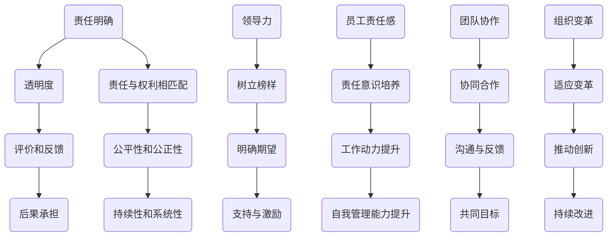

                 


## 文章标题：问责文化：建立高效执行力的基础

## 关键词：问责文化，执行力，组织绩效，员工责任感，团队协作

## 摘要：
本文深入探讨了问责文化在组织管理中的重要性，剖析了其定义、核心原则及其实践方法。通过案例分析，展示了如何构建和维持一种高效的问责文化，以提升组织的执行力和整体绩效。本文旨在为管理者提供理论指导和实践参考，帮助他们在组织内培养问责意识，建立坚实的执行力基础。

# 第一部分：问责文化的概念与原则

## 1.1.1 问责文化的定义与意义

### 1.1.1.1 问责文化的定义

问责文化是指在组织内部，每个成员都对自己的工作结果负有明确的责任，并接受相应的评价和反馈的文化氛围。这种文化强调透明度、责任感和个人义务，旨在通过制度化和系统化的方式确保个人和组织对结果承担责任。

问责文化的定义可以从以下几个方面来理解：

1. **责任明确**：每个成员都清楚自己的职责范围和责任边界，了解自己需要承担的工作成果和可能面临的后果。
2. **透明度**：组织内部的信息传递是公开和透明的，成员可以随时获取与工作相关的信息，包括进展、问题以及解决方案。
3. **评价和反馈**：成员的工作表现会接受定期的评价和反馈，这种评价不仅基于结果，还包括过程中的行为和态度。
4. **后果承担**：成员对自己的行为和决策负责，如果出现错误或问题，会承担相应的后果，并从中学习和改进。

### 1.1.1.2 问责文化的意义

问责文化在组织管理中具有重要意义，主要体现在以下几个方面：

1. **提升组织执行力**：问责文化能够确保组织内部每个成员都明确自己的责任，从而提高任务的完成效率和准确性。
2. **增强员工责任感**：问责文化让员工认识到自己的行为对组织结果有直接影响，从而激发他们的工作热情和责任感。
3. **优化组织结构和工作流程**：问责文化有助于发现组织内部的瓶颈和问题，推动结构优化和工作流程的改进。
4. **促进持续改进和创新**：问责文化鼓励员工从错误中学习，不断优化工作方法和流程，从而推动组织的持续改进和创新。

### 1.1.1.3 问责文化与组织绩效的关系

问责文化对组织绩效有着显著的影响。一个健康、成熟的问责文化能够提高组织的整体绩效，具体体现在以下几个方面：

1. **效率提升**：明确的问责制度使工作流程更加流畅，减少了因职责不清、沟通不畅而产生的延误和误解。
2. **质量保证**：问责文化促使员工对自己的工作结果负责，从而提高了产品和服务的质量。
3. **员工满意度和忠诚度**：问责文化让员工感受到自己的价值和贡献，从而提高了他们的工作满意度和忠诚度。
4. **创新动力**：问责文化鼓励员工敢于尝试和冒险，从而激发了组织的创新活力。

### 1.1.1.4 问责文化的核心原则

问责文化要成功建立和维护，需要遵循以下核心原则：

1. **透明性和公开性**：组织内部的信息应当是透明和公开的，使每个成员都能了解组织的整体目标和个人的职责。
2. **责任与权利相匹配**：每个成员应当拥有与其责任相匹配的权力，确保能够有效地履行职责。
3. **公平性和公正性**：评价和反馈过程应当是公平和公正的，避免主观偏见和不公正待遇。
4. **持续性和系统性**：问责文化应当是持续性的，通过制度化和系统化的方式，确保其能够长期维持和改进。

### 1.1.1.5 问责文化与领导力的关系

问责文化不仅依赖于员工个体的责任感，更需要领导者的引领和支持。领导者应当在以下方面发挥关键作用：

1. **树立榜样**：领导者应当通过自己的行为，树立问责文化的典范，让员工看到问责文化在实际工作中的效果。
2. **明确期望**：领导者需要明确传达组织的期望和目标，使员工了解自己的责任和目标。
3. **支持与激励**：领导者应当提供必要的资源和支持，鼓励员工勇于承担责任，并对优秀表现给予认可和激励。

### 1.1.1.6 问责文化与员工责任感

问责文化对员工责任感有显著影响，具体表现在以下几个方面：

1. **责任意识的培养**：问责文化使员工意识到自己的行为和决策对组织结果有直接影响，从而培养起强烈的责任意识。
2. **工作动力提升**：问责文化让员工感受到自己的工作对组织的重要性，从而激发他们的工作动力和积极性。
3. **自我管理能力提升**：问责文化促使员工学会自我管理，提高时间管理和任务管理能力。

### 1.1.1.7 问责文化与团队协作

问责文化对团队协作有重要的促进作用，主要体现在以下几个方面：

1. **协同合作**：问责文化鼓励团队成员之间协同合作，共同承担责任，提高团队的执行力和协作效率。
2. **沟通与反馈**：问责文化促进团队成员之间的沟通与反馈，确保信息的透明和准确，减少误解和冲突。
3. **共同目标**：问责文化有助于明确团队目标，增强团队成员的凝聚力和归属感，提高团队的整体绩效。

### 1.1.1.8 问责文化与组织变革

问责文化不仅影响组织内部的日常运作，还与组织变革密切相关。在组织变革过程中，问责文化能够发挥以下作用：

1. **适应变革**：问责文化使员工能够更快适应变革，通过明确责任和提供反馈，推动组织变革的顺利进行。
2. **推动创新**：问责文化鼓励员工尝试新方法和新技术，从而推动组织的创新和发展。
3. **持续改进**：问责文化促使组织不断审视和改进工作流程，提高组织的竞争力和适应性。

### 1.1.1.9 问责文化的核心概念与联系

为了更好地理解问责文化的概念与联系，我们可以使用 Mermaid 流程图来展示其核心概念之间的关系：



### 1.1.1.10 核心算法原理讲解

在构建问责文化时，需要运用一些核心算法原理来确保责任的明确性和公平性。以下是一个简单的伪代码，用于解释如何通过算法实现责任的分配和评价：

```plaintext
// 伪代码：责任分配与评价算法

function AssignResponsibility(employees, tasks):
    for each employee in employees:
        assign a unique identifier to the employee
        assign a list of tasks to the employee based on their skills and expertise
        record the assigned tasks in a responsibility matrix

function EvaluatePerformance(employees, tasks, goals):
    for each employee in employees:
        for each task in employee's assigned tasks:
            compare the actual results of the task with the predefined goals
            calculate the performance score based on the comparison
            record the performance score in a performance database

function ProvideFeedback(employees, performance_scores):
    for each employee in employees:
        provide a personalized feedback report based on their performance score
        include recommendations for improvement in the feedback report

function MaintainAccountability(employees, tasks, performance_scores):
    if performance score is below the threshold:
        investigate the reasons for poor performance
        take corrective actions, such as additional training or reassignment of tasks
    else:
        acknowledge the achievement and encourage continuous improvement
```

### 1.1.1.11 数学模型和数学公式

在问责文化的构建过程中，可以使用一些数学模型和公式来量化责任、绩效和反馈。以下是一个简化的数学模型，用于计算员工的责任度和绩效评分：

1. **责任度模型**：
   $$
   \text{Responsibility}_{i} = \alpha \times \text{TaskImportance}_{i} + \beta \times \text{SkillLevel}_{i}
   $$
   其中，$\alpha$ 和 $\beta$ 是权重系数，$\text{TaskImportance}_{i}$ 表示任务 $i$ 的相对重要性，$\text{SkillLevel}_{i}$ 表示员工在任务 $i$ 方面的技能水平。

2. **绩效评分模型**：
   $$
   \text{PerformanceScore}_{i} = \frac{\text{Achievement}_{i} - \text{Baseline}_{i}}{\text{Baseline}_{i}}
   $$
   其中，$\text{Achievement}_{i}$ 表示任务 $i$ 的实际完成度，$\text{Baseline}_{i}$ 表示任务 $i$ 的基准完成度。

3. **反馈模型**：
   $$
   \text{Feedback}_{i} = \text{PerformanceScore}_{i} \times \text{FeedbackIntensity}_{i}
   $$
   其中，$\text{FeedbackIntensity}_{i}$ 是反馈的强度系数，用于调整反馈的力度。

### 1.1.1.12 举例说明

为了更好地理解问责文化的概念和原则，我们可以通过一个实际案例来阐述：

**案例：某IT公司的问责文化建设**

1. **责任明确**：公司为每个员工分配了具体的任务，并在公司内部网站上公布了任务分配表，使每个员工都清楚自己的职责和任务。

2. **透明度和公开性**：公司采用透明的工作流程，定期在内部会议上汇报工作进展和问题，确保员工能够了解整个组织的运作情况。

3. **评价和反馈**：公司设立了绩效评价体系，每季度对员工的工作进行评价，并根据评价结果给出相应的反馈。评价标准包括任务完成度、团队协作和创新能力等。

4. **后果承担**：如果员工在任务中出现问题，会根据问题的严重程度和员工的责任度，采取相应的惩罚措施，如警告、降职或解雇。

5. **领导力**：公司领导层通过自己的行为树立了问责文化的典范，他们定期与下属进行一对一的沟通，了解工作进展，并提供必要的支持和资源。

6. **员工责任感**：通过问责文化的实施，员工的责任感明显提升，他们更加注重工作质量，并主动承担责任。

7. **团队协作**：问责文化促进了团队成员之间的协作，他们更加愿意分享信息和资源，共同解决难题。

8. **组织变革**：在问责文化的推动下，公司不断进行组织变革，优化工作流程，提高工作效率和绩效。

通过这个案例，我们可以看到问责文化在组织管理中的重要作用，以及如何通过明确的职责、透明的流程、公正的评价和反馈来建立和维护问责文化。

## 1.2 问责文化与领导力

### 1.2.1 领导者在建立问责文化中的作用

领导者在构建问责文化中扮演着至关重要的角色，他们的行为和决策直接影响着文化的形成和发展。以下将从几个方面探讨领导者在这一过程中的作用：

#### 1.2.1.1 树立榜样

领导者的行为是员工学习的榜样。在建立问责文化时，领导者必须以身作则，展现出对工作结果负责的态度。通过自己的行动，领导者向员工传递出问责文化的核心价值，从而激励员工模仿和遵循。

**示例**：一位项目经理在项目中遇到问题时，主动承担责任，并采取有效措施解决问题，这样的行为会激发团队成员的问责意识，让他们明白只有承担责任，才能实现项目的成功。

#### 1.2.1.2 明确期望

领导者的一个关键职责是明确传达组织的期望和目标，使员工了解自己的责任和目标。这需要领导者与员工进行有效沟通，确保每个人都清楚自己的工作要求。

**示例**：在项目启动会议上，项目经理详细说明项目的目标、关键里程碑、预期成果以及每个成员的具体任务，确保所有员工都明确自己的职责和期望。

#### 1.2.1.3 提供支持与资源

问责文化需要领导者提供必要的支持和资源，以确保员工能够有效履行职责。这包括技术支持、培训机会和资源分配。

**示例**：一位研发团队领导为团队成员提供最新的开发工具和培训课程，帮助他们提升技能，从而更好地承担项目任务。

#### 1.2.1.4 激励与认可

领导者应当对表现优秀的员工给予激励和认可，以鼓励他们继续保持高水平的问责意识。这可以是通过奖金、晋升或其他形式的奖励。

**示例**：在季度绩效评估中，公司高层领导对在项目中表现出色的员工进行公开表扬，并给予一定的奖金奖励，以此激励其他员工。

#### 1.2.1.5 解决冲突

在建立问责文化的过程中，领导者需要扮演调解者的角色，解决员工之间的冲突。这有助于维护团队和谐，确保问责文化的顺利实施。

**示例**：在项目团队中，如果出现任务分工不均或沟通不畅的问题，项目经理需要及时介入，协调各方利益，确保任务能够顺利进行。

#### 1.2.1.6 调整制度与流程

领导者应当根据实际情况，不断调整和优化问责制度与流程，确保其适应组织发展的需求。这需要领导者具备战略眼光和创新能力。

**示例**：随着公司规模的扩大，公司领导层决定引入更高级别的绩效管理工具，以更好地跟踪和评估员工的绩效。

### 1.2.2 领导力与问责文化的互动

领导力与问责文化之间存在密切的互动关系。一方面，领导力是推动问责文化发展的关键因素；另一方面，问责文化的建立和完善也为领导力提供了强有力的支持。

#### 1.2.2.1 领导力促进问责文化的形成

强有力的领导力能够推动问责文化的形成。领导者在组织中的地位和影响力使得他们能够倡导和推动问责文化，使其成为组织内部普遍接受和遵循的价值观。

**示例**：公司创始人通过发表演讲、组织培训和发布政策文件，明确传达问责文化的重要性，从而在组织内部形成了强烈的问责意识。

#### 1.2.2.2 问责文化增强领导力

问责文化的建立和完善也有助于增强领导力。在问责文化中，领导者需要具备更高的责任感和领导能力，以应对复杂的组织环境和工作挑战。

**示例**：在高度透明的问责文化下，领导者需要不断接受员工和同侪的监督和评价，这迫使他们不断提升自己的领导能力和决策水平。

#### 1.2.2.3 领导力与问责文化的共同发展

领导力和问责文化并非孤立存在，而是相互促进、共同发展的。领导者的有效领导能够推动问责文化的建立和完善，而问责文化的成功实施也为领导力提供了坚实的支持。

**示例**：在一家高科技公司中，领导层通过一系列制度创新和流程优化，建立了成熟的问责文化，这不仅提升了公司的整体绩效，也为领导者的成长提供了丰富的实践机会。

### 1.2.3 培养问责型领导

要构建一种高效的问责文化，领导者不仅需要具备出色的领导能力，还需要具备问责意识。以下是一些培养问责型领导的方法：

#### 1.2.3.1 培训与教育

通过培训和教育，帮助领导者理解问责文化的重要性，掌握建立和维持问责文化的技巧。这可以包括内部培训课程、外部研讨会和阅读相关书籍。

**示例**：公司可以定期组织领导力培训，邀请业内专家分享问责文化的最佳实践，帮助领导者提升问责能力。

#### 1.2.3.2 案例研究

通过分析成功和失败的案例，帮助领导者理解问责文化在不同情境下的应用和效果。这有助于他们从实际案例中汲取经验，提升问责能力。

**示例**：公司可以组织案例研讨会，让领导者分享他们在建立问责文化过程中的成功经验和挑战，相互学习和借鉴。

#### 1.2.3.3 实践与反思

鼓励领导者在实际工作中实践问责文化，并在实践中不断反思和调整。通过实践，领导者能够更好地理解问责文化的核心要素，提高问责能力。

**示例**：公司可以设立问责文化实践项目，让领导者负责具体项目的管理，并在项目结束后进行复盘和总结，持续优化问责文化。

#### 1.2.3.4 建立反馈机制

建立有效的反馈机制，帮助领导者了解自己在问责文化中的表现，并提供改进建议。这可以包括定期的绩效评估、员工反馈和领导力发展计划。

**示例**：公司可以设立领导力发展中心，定期对领导者的问责能力进行评估，并提供个性化的改进建议和培训。

### 1.2.4 问责型领导的关键特质

要成为一名问责型领导，领导者需要具备以下关键特质：

#### 1.2.4.1 高度责任感

问责型领导应当对自己和团队的工作结果负责，勇于承担失败和错误，并从中学习和改进。

#### 1.2.4.2 透明沟通

问责型领导应当保持沟通的透明性，确保团队成员了解组织的期望和目标，以及自己在团队中的职责。

#### 1.2.4.3 公平公正

问责型领导应当公正地评价团队成员的表现，避免偏见和不公平待遇，确保每个人都能在公平的环境中工作。

#### 1.2.4.4 持续改进

问责型领导应当不断反思和优化自己的领导方法和策略，以适应组织的发展和变化。

#### 1.2.4.5 鼓励创新

问责型领导应当鼓励团队成员尝试新方法、新技术，推动组织的创新和发展。

### 1.2.5 问责型领导在组织中的影响力

问责型领导在组织中具有深远的影响力，他们能够：

#### 1.2.5.1 提升整体绩效

通过建立问责文化，问责型领导能够提升组织的整体绩效，确保团队目标的实现。

#### 1.2.5.2 增强员工责任感

问责型领导能够激发员工的责任感，使他们更加投入工作，提高工作质量和效率。

#### 1.2.5.3 促进团队协作

问责型领导能够促进团队成员之间的协作，提高团队的凝聚力和执行力。

#### 1.2.5.4 推动持续改进

问责型领导能够推动组织的持续改进，使组织在不断变化的环境中保持竞争力和适应性。

### 1.2.6 问责型领导对个人职业发展的作用

问责型领导不仅对组织有益，也对个人职业发展具有重要意义：

#### 1.2.6.1 提升领导能力

通过建立和维持问责文化，问责型领导能够不断提升自己的领导能力，为未来的职业发展打下坚实基础。

#### 1.2.6.2 获得职业认可

问责型领导因其出色的领导能力和对组织的贡献，往往能够获得更多的职业认可和机会。

#### 1.2.6.3 增强自信心

通过成功建立问责文化，问责型领导能够增强自己的自信心，面对未来的挑战和机遇。

### 1.2.7 总结

问责型领导在构建和维持问责文化中发挥着至关重要的作用。他们通过树立榜样、明确期望、提供支持、激励与认可、解决冲突和调整制度与流程等方式，推动问责文化的形成和发展。问责型领导的关键特质包括高度责任感、透明沟通、公平公正、持续改进和鼓励创新。他们的行为不仅对组织绩效产生积极影响，也对个人职业发展具有深远意义。因此，组织管理者应当重视培养问责型领导，以建立高效执行力的基础。

## 1.3 问责文化与员工责任感

### 1.3.1 提升员工责任感的策略

在构建问责文化的过程中，提升员工责任感是关键的一步。责任感是员工对自身工作及其结果负有的情感和态度，它直接影响着员工的职业表现和组织的整体绩效。以下是一些具体的策略，可以帮助提升员工的责任感。

#### 1.3.1.1 明确职责和期望

员工责任感的第一步是明确他们的职责和期望。组织应当通过清晰的沟通和明确的工作说明，确保员工了解自己的工作内容和期望成果。这可以通过以下方式实现：

1. **制定详细的工作说明书**：为每个岗位编写详细的工作说明书，明确工作职责、任务目标、关键绩效指标等。
2. **定期沟通和反馈**：通过定期的一对一沟通、团队会议和绩效评估，确保员工了解自己的工作进展和绩效表现。

#### 1.3.1.2 建立透明的绩效评价体系

一个透明的绩效评价体系是提升员工责任感的重要工具。通过公开、公正的评价过程，员工可以清楚地了解自己的表现和需要改进的地方。

1. **制定明确的评价标准**：确保评价标准是具体、可衡量和可实现的，员工知道如何通过努力达到目标。
2. **公开评价结果**：将评价结果公开化，让员工了解自己的表现，以及如何改进。

#### 1.3.1.3 提供反馈和指导

及时、有效的反馈和指导是提升员工责任感的重要手段。通过反馈，员工可以了解自己的工作如何影响组织目标，以及如何改进。

1. **即时反馈**：在员工完成任务后，及时提供反馈，指出优点和需要改进的地方。
2. **个性化指导**：根据员工的具体情况，提供个性化的指导和建议，帮助他们提升工作能力。

#### 1.3.1.4 奖励和认可

奖励和认可是提升员工责任感的重要激励手段。通过认可员工的努力和成就，可以增强他们的工作动力和责任感。

1. **公开认可**：在团队会议或公司内部通讯中，公开认可员工的贡献和成就。
2. **物质奖励**：通过奖金、晋升或其他物质奖励，激励员工保持高水平的责任感。

#### 1.3.1.5 建立责任感文化

组织应当通过多种方式，营造一种责任感文化，使员工在日常工作中自然而然地展现出责任感。

1. **领导者的榜样作用**：领导者应当通过自己的行为，树立责任感文化，成为员工的榜样。
2. **责任教育**：定期开展责任感培训，帮助员工理解责任的重要性，并提高他们的责任感。
3. **责任制度**：建立明确的责任制度，确保员工在工作中能够清晰了解自己的责任和后果。

#### 1.3.1.6 强化团队协作

团队协作是提升员工责任感的重要途径。通过团队协作，员工可以更好地理解自己在组织中的角色和责任，从而提升责任感。

1. **共同目标**：确保团队成员有共同的目标，让他们明白自己的工作对团队和组织的意义。
2. **透明沟通**：鼓励团队成员之间进行透明沟通，分享信息和资源，提高协作效率。
3. **共享责任**：在团队项目中，确保每个成员都明确自己的职责和责任范围，共同承担责任。

### 1.3.2 员工问责意识的培养

问责意识是员工责任感的重要组成部分。培养员工的问责意识，需要从多个方面入手：

#### 1.3.2.1 职业道德教育

职业道德教育是培养员工问责意识的基础。组织应当通过培训课程和案例分析，帮助员工理解职业道德的重要性，以及如何在工作中遵循职业道德规范。

1. **职业道德课程**：定期组织职业道德课程，让员工了解职业伦理和责任。
2. **案例教学**：通过真实案例，让员工了解道德困境和问责的后果，从而培养他们的道德判断能力。

#### 1.3.2.2 透明的工作环境

透明的工作环境有助于培养员工的问责意识。通过公开信息和流程，员工可以清楚地了解自己的工作如何影响组织的整体绩效。

1. **信息公开**：确保员工能够获取与工作相关的信息，包括组织目标、工作进展和绩效数据。
2. **流程透明**：明确工作流程和责任分配，让员工了解自己的职责和责任范围。

#### 1.3.2.3 反思与总结

通过反思和总结，员工可以认识到自己的工作对组织结果的影响，从而培养问责意识。

1. **定期反思**：鼓励员工定期反思自己的工作，分析成功和失败的原因，从中学习。
2. **总结会议**：在项目结束后，组织总结会议，让员工分享经验教训，提高问责意识。

#### 1.3.2.4 案例研究和角色扮演

通过案例研究和角色扮演，员工可以更深入地理解问责文化，培养责任感。

1. **案例分析**：分析成功和失败的案例，讨论问责的重要性。
2. **角色扮演**：通过模拟实际工作场景，让员工体验不同的角色，理解问责的实践方法。

### 1.3.3 员工问责反馈机制

有效的问责反馈机制是培养员工问责意识和责任感的必要条件。以下是一些关键要素：

#### 1.3.3.1 及时性

反馈应当及时，以便员工能够及时了解自己的工作表现和需要改进的地方。

#### 1.3.3.2 具体性

反馈应当具体，指出具体的行为或结果，而不是泛泛而谈。

#### 1.3.3.3 正面性

尽管反馈可能包括批评，但也应当包含积极的方面，以激励员工。

#### 1.3.3.4 建设性

反馈应当建设性，提供具体的改进建议，帮助员工提升。

#### 1.3.3.5 公开性

反馈过程应当是公开的，让其他员工也能从中学习和借鉴。

### 1.3.4 问责反馈的沟通技巧

有效的沟通技巧是确保问责反馈能够达到预期效果的关键。以下是一些沟通技巧：

#### 1.3.4.1 明确表达

确保反馈内容明确，避免产生歧义。

#### 1.3.4.2 倾听

在提供反馈时，先倾听员工的意见和感受，了解他们的立场。

#### 1.3.4.3 肯定

在指出问题之前，先肯定员工的努力和成就，增强他们的自信心。

#### 1.3.4.4 对事不对人

确保反馈集中在工作表现上，避免对个人进行攻击。

#### 1.3.4.5 探讨解决方案

反馈不应止于指出问题，还应探讨解决方案，帮助员工改进。

### 1.3.5 问责反馈的案例与实践

以下是一个企业中问责反馈机制的案例：

**案例：某科技公司的新员工反馈机制**

某科技公司为了提升新员工的问责意识和责任感，建立了一套新员工反馈机制：

1. **入职培训**：在新员工入职后的第一个月，公司为新员工提供了一系列的入职培训，包括企业文化、岗位职责和绩效评价标准。

2. **定期反馈**：新员工每周都会与直接上级进行一对一的反馈会议，讨论他们在过去一周的工作表现和遇到的问题。这种及时的反馈有助于新员工快速适应工作环境。

3. **绩效评估**：在入职三个月后，公司对新员工进行了一次绩效评估，根据他们的工作表现和反馈会议记录，给予具体的评价和改进建议。

4. **公开表彰**：公司定期举办“新员工之星”评选活动，表彰在新员工中表现突出的员工，并在公司内部通讯中公开表彰。

5. **反思与总结**：在每次反馈会议后，新员工会进行反思和总结，记录下自己的进步和需要改进的地方，为下一阶段的工作做好准备。

通过这套反馈机制，公司不仅提升了新员工的问责意识和责任感，还帮助他们快速适应了工作环境，提高了工作绩效。

### 1.3.6 总结

提升员工责任感是构建问责文化的重要环节。通过明确职责和期望、建立透明的绩效评价体系、提供反馈和指导、奖励和认可、建立责任感文化和强化团队协作等策略，可以有效地提升员工的问责意识。同时，通过职业道德教育、透明的工作环境、反思与总结、案例研究和角色扮演等方式，可以进一步培养员工的问责意识。有效的问责反馈机制和沟通技巧则是确保问责反馈能够达到预期效果的关键。通过实践，我们可以看到这些策略和方法在提升员工责任感和构建问责文化方面的有效性和重要性。

## 1.4 问责文化与团队协作

### 1.4.1 问责文化在团队协作中的应用

问责文化在团队协作中发挥着至关重要的作用，它不仅能够提高团队的整体绩效，还能增强团队成员之间的信任和合作。以下是如何将问责文化应用于团队协作的具体方法：

#### 1.4.1.1 明确共同目标

在团队协作中，明确共同目标是确保团队成员共同努力的重要步骤。问责文化强调每个成员都应对共同目标负有责任，这可以通过以下方式实现：

1. **制定详细的团队目标**：在项目开始时，团队应该共同制定详细的团队目标，包括项目目标、里程碑、预期成果等。
2. **确保目标透明**：将团队目标公开化，使每个成员都能清晰地了解自己的工作如何为团队目标服务。

#### 1.4.1.2 责任分配

在团队协作中，责任的明确分配是确保任务有效执行的关键。问责文化要求每个成员都了解自己的职责和责任范围，这可以通过以下方式实现：

1. **任务分解**：将大任务分解为小任务，并为每个任务明确责任人。
2. **责任记录**：将责任分配记录在案，确保每个成员都清楚自己的任务和责任。

#### 1.4.1.3 定期检查和反馈

问责文化强调定期检查和反馈，以确保团队协作的顺利进行。以下是一些具体的方法：

1. **进度汇报**：团队成员定期汇报任务进度，确保整个团队对项目进展有清晰的了解。
2. **反馈机制**：建立有效的反馈机制，及时指出问题和不足，并提供改进建议。

#### 1.4.1.4 共同承担责任

在团队协作中，共同承担责任是确保团队目标实现的重要原则。问责文化鼓励团队成员在面对挑战和问题时，共同承担责任，而不是相互推诿。以下是一些实现方法：

1. **团队会议**：定期召开团队会议，讨论项目中的问题和挑战，共同寻找解决方案。
2. **共享责任**：确保团队成员了解他们的工作对整体项目的重要性，并鼓励他们共同面对挑战。

#### 1.4.1.5 激励和认可

问责文化不仅要求团队成员承担责任，还要求领导者对团队成员的表现给予激励和认可。以下是一些激励和认可的方法：

1. **公开表扬**：在团队会议上公开表扬表现优秀的团队成员，增强他们的自信心和动力。
2. **物质奖励**：为表现突出的团队成员提供奖金、晋升或其他物质奖励。

### 1.4.2 团队问责体系的建立与维护

建立和维护一个有效的团队问责体系是确保问责文化在团队协作中发挥作用的关键。以下是一些具体的步骤和方法：

#### 1.4.2.1 制定问责制度

一个明确的问责制度是团队问责体系的基础。以下是一些关键步骤：

1. **明确问责标准**：制定明确的问责标准，确保每个成员都了解自己在团队中的责任和期望。
2. **责任界定**：明确每个成员的具体职责和责任范围，确保责任分配合理。

#### 1.4.2.2 建立反馈机制

有效的反馈机制是确保团队成员了解自己工作表现的重要工具。以下是一些方法：

1. **定期反馈**：建立定期反馈机制，确保团队成员能够及时了解自己的工作表现和需要改进的地方。
2. **匿名反馈**：提供匿名反馈渠道，鼓励团队成员勇于提出问题和建议。

#### 1.4.2.3 激励与认可

激励和认可能够增强团队成员的责任感和积极性。以下是一些激励和认可的方法：

1. **绩效评估**：定期进行绩效评估，对表现优秀的团队成员给予奖励和晋升机会。
2. **团队活动**：组织团队建设活动，增强团队成员之间的凝聚力和合作精神。

#### 1.4.2.4 持续改进

问责体系不是一成不变的，需要根据实际情况不断改进。以下是一些持续改进的方法：

1. **反思和总结**：定期反思团队协作过程中的问题和挑战，总结经验教训，不断优化团队问责体系。
2. **培训和发展**：为团队成员提供培训和发展机会，提高他们的专业技能和责任感。

### 1.4.3 团队问责案例研究

以下是一个团队问责案例研究，通过分析一个成功案例，我们可以了解如何建立和维持一个有效的团队问责体系。

**案例：某软件公司的项目团队**

某软件公司在开发一款新软件时，采用了问责文化来确保项目顺利推进。以下是他们的具体做法：

1. **明确目标**：在项目开始时，团队明确了一个共同的目标，即在六个月内完成软件的开发和测试。

2. **责任分配**：团队将项目分解为多个任务，并为每个任务明确责任人。每个团队成员都清楚自己的职责和任务。

3. **进度汇报**：团队每周举行进度汇报会议，每个成员报告自己的工作进展，确保团队对项目的整体进度有清晰的了解。

4. **问题反馈**：如果遇到问题，团队成员会及时反馈，并在团队会议上讨论解决方案。

5. **激励与认可**：团队领导定期对表现优秀的成员进行表扬和奖励，激励他们保持高水平的责任心。

6. **持续改进**：在项目进行过程中，团队不断反思和总结，优化工作流程，提高工作效率。

通过这些措施，该软件公司的项目团队在六个月内成功完成了软件开发和测试，项目质量得到了客户的高度认可。

### 1.4.4 总结

问责文化在团队协作中具有重要作用，它能够提高团队的整体绩效，增强团队成员之间的信任和合作。通过明确共同目标、责任分配、定期检查和反馈、共同承担责任以及激励和认可等具体方法，可以建立和维护一个有效的团队问责体系。同时，通过案例研究，我们可以看到这些方法在实际应用中的效果。因此，组织管理者应当重视问责文化的建立和实施，以提升团队协作效率和组织绩效。

## 1.5 问责文化与组织变革

### 1.5.1 问责文化对组织变革的影响

问责文化在组织变革过程中发挥着至关重要的作用。它不仅能够提高组织的适应性和灵活性，还能确保变革过程中的各项任务得到有效执行。以下将从几个方面探讨问责文化对组织变革的影响：

#### 1.5.1.1 提高变革效率

问责文化强调责任明确和后果承担，这使得组织在变革过程中能够更加高效地分配资源和任务。通过明确每个成员的职责和任务，组织能够快速响应变革需求，避免资源浪费和重复劳动。

**示例**：在一家制造公司进行生产线优化时，问责文化确保每个团队成员都清楚自己的职责，如设备维护、质量控制等。这种明确的职责分配使得生产线优化工作得以迅速推进，大大提高了变革效率。

#### 1.5.1.2 促进创新

问责文化鼓励员工勇于尝试和承担责任，这有助于推动组织的创新。在变革过程中，问责文化为员工提供了安全的环境，使他们敢于挑战现有流程和方法，提出新的想法和解决方案。

**示例**：在一家科技公司进行业务转型时，问责文化激励员工提出创新的业务模式和技术方案。通过这种创新，公司成功开拓了新的市场，实现了业务的快速增长。

#### 1.5.1.3 提高员工参与度

问责文化能够提高员工的参与度，使他们更加积极地投入到组织变革中。通过明确责任和提供反馈，员工能够更好地理解变革的意义和目标，从而更加愿意参与其中。

**示例**：在一家金融公司进行流程优化时，问责文化鼓励员工参与变革讨论，并提出改进建议。这种参与感使得员工更加支持变革，提高了变革的执行力度。

#### 1.5.1.4 促进持续改进

问责文化强调持续改进，这有助于组织在变革过程中不断优化工作流程和方法。通过定期反馈和评价，组织能够及时发现问题和瓶颈，并采取有效措施进行改进。

**示例**：在一家零售公司进行数字化转型时，问责文化促使团队在项目实施过程中不断进行评估和调整，确保项目目标的实现和持续改进。

#### 1.5.1.5 增强组织韧性

问责文化能够提高组织的韧性和抗风险能力。在变革过程中，问责文化使组织能够快速应对外部压力和挑战，确保变革的顺利进行。

**示例**：在一家制药公司面临市场变化和竞争压力时，问责文化使得公司能够迅速调整战略和业务模式，保持竞争优势。

### 1.5.2 在组织变革中推动问责文化的建设

在组织变革过程中，推动问责文化的建设至关重要。以下是一些关键步骤和方法：

#### 1.5.2.1 明确变革目标

在变革初期，组织应当明确变革的目标和方向，确保所有团队成员都清楚变革的意义和期望。

**步骤**：
1. 分析组织现状，明确变革的必要性和目标。
2. 沟通和传达变革目标，确保团队成员理解并支持变革。

#### 1.5.2.2 建立责任体系

建立明确的职责和责任体系是推动问责文化建设的基础。组织应当为每个成员明确职责和任务，确保他们了解自己在变革过程中的角色和责任。

**步骤**：
1. 制定详细的职责分配表，明确每个成员的职责和任务。
2. 定期检查和评估职责履行情况，确保责任体系的有效运行。

#### 1.5.2.3 建立反馈机制

建立有效的反馈机制是确保问责文化落地的重要手段。组织应当建立定期反馈机制，及时收集团队成员的意见和建议，并进行有效的沟通和反馈。

**步骤**：
1. 制定反馈机制，明确反馈的时间、方式和渠道。
2. 定期组织反馈会议，收集和讨论团队成员的意见和建议。
3. 对反馈进行整理和分析，制定相应的改进措施。

#### 1.5.2.4 提供培训和指导

在变革过程中，为团队成员提供培训和指导是推动问责文化建设的关键。组织应当为团队成员提供必要的培训和学习机会，帮助他们提升能力和责任感。

**步骤**：
1. 制定培训计划，明确培训内容和学习目标。
2. 组织培训课程，邀请专业讲师进行授课。
3. 定期进行培训效果评估，确保培训目标的实现。

#### 1.5.2.5 激励和认可

激励和认可是推动问责文化建设的重要手段。组织应当对在变革过程中表现优秀的团队成员给予激励和认可，激发他们的工作热情和责任感。

**步骤**：
1. 制定激励政策，明确激励条件和标准。
2. 定期进行绩效评估，对表现优秀的团队成员进行表彰和奖励。
3. 建立员工荣誉制度，鼓励团队成员积极参与变革。

### 1.5.3 问责文化变革的挑战与应对策略

在推动问责文化的变革过程中，组织可能会面临一系列挑战。以下是一些常见的挑战及其应对策略：

#### 1.5.3.1 文化阻力

组织内部可能存在对变革的抵触情绪，这是推动问责文化变革的主要挑战之一。

**应对策略**：
1. 加强沟通和宣传，让员工了解变革的意义和好处。
2. 充分听取员工的意见和建议，让他们参与变革的讨论和决策。
3. 建立变革支持小组，为员工提供心理支持和指导。

#### 1.5.3.2 资源限制

变革过程中可能面临资源限制，如资金、人力和时间的限制，这会影响问责文化的实施。

**应对策略**：
1. 制定详细的预算和资源分配计划，确保资源的高效利用。
2. 寻求外部支持，如合作伙伴、咨询公司和培训资源。
3. 优先处理关键任务和问题，确保变革重点的突出。

#### 1.5.3.3 领导力不足

在变革过程中，领导力不足可能导致问责文化难以落地。

**应对策略**：
1. 加强领导力培训，提高领导者的变革管理和沟通能力。
2. 引入外部咨询专家，提供专业指导和支持。
3. 明确领导者的角色和责任，确保他们在变革过程中发挥关键作用。

### 1.5.4 问责文化变革的持续改进

问责文化变革不是一蹴而就的过程，需要持续改进和完善。以下是一些持续改进的方法：

#### 1.5.4.1 定期评估和反馈

定期评估问责文化的实施效果，收集员工的意见和建议，并进行有效的反馈和改进。

**步骤**：
1. 制定评估标准和指标，定期对问责文化的实施效果进行评估。
2. 收集员工的反馈和意见，分析存在的问题和不足。
3. 制定改进计划，针对评估结果进行相应的调整和优化。

#### 1.5.4.2 培养变革意识

持续培养员工的变革意识，使他们能够适应和接受新的文化和流程。

**步骤**：
1. 定期开展变革培训和教育活动，提高员工的变革意识和能力。
2. 建立变革倡导者团队，推动问责文化的内部传播和推广。
3. 鼓励员工积极参与变革讨论和决策，增强他们的主人翁意识。

#### 1.5.4.3 优化反馈机制

优化反馈机制，确保反馈渠道的畅通和有效性。

**步骤**：
1. 建立多种反馈渠道，如在线问卷、匿名反馈和建议箱等。
2. 定期分析和总结反馈内容，发现潜在问题和改进机会。
3. 制定反馈处理和跟进机制，确保反馈得到及时回应和解决。

### 1.5.5 总结

问责文化在组织变革中具有重要作用，它能够提高变革效率、促进创新、提高员工参与度和促进持续改进。在推动问责文化变革时，组织需要明确变革目标、建立责任体系、建立反馈机制、提供培训和指导、激励和认可以及应对文化阻力、资源限制和领导力不足等挑战。通过持续改进和优化，组织可以建立和维持一种健康的问责文化，为组织变革提供坚实的支持。因此，组织管理者应当重视问责文化的建设和实施，以提升组织的竞争力和可持续发展能力。

## 第一部分的总结与展望

在第一部分中，我们深入探讨了问责文化的定义、核心原则及其在组织管理中的重要性。通过明确职责、透明度、评价和反馈等核心要素，我们理解了问责文化如何通过建立明确的责任体系来提高组织的执行力。我们分析了问责文化与领导力、员工责任感、团队协作以及组织变革之间的互动关系，展示了如何通过领导者的榜样作用、员工责任感的培养、团队协作和持续改进来推动问责文化的形成和发展。

问责文化不仅是提升组织绩效的有效手段，更是组织内部形成健康工作氛围和推动持续改进的重要保障。在未来的章节中，我们将进一步探讨问责文化的实践方法，包括制定明确的问责制度、建立有效的问责流程、运用绩效指标衡量问责效果以及如何通过培训和宣传来强化问责文化。同时，我们还将通过案例分析，展示不同组织在构建问责文化过程中的成功经验和挑战，为读者提供实际操作的指导和建议。

通过本文的深入分析和讨论，我们期望能够为组织管理者提供宝贵的理论指导和实践参考，帮助他们更好地理解和实施问责文化，从而提升组织的执行力和整体绩效。

### 2.1 制定明确的问责制度

在构建问责文化的过程中，制定明确的问责制度是至关重要的第一步。问责制度不仅是问责文化的基础，也是确保责任明确、执行高效的重要工具。以下将详细讨论如何制定明确的问责制度，包括关键步骤、具体方法和注意事项。

#### 2.1.1 关键步骤

1. **需求分析**：首先，组织需要分析当前的工作流程和职责分配，了解现有制度中的不足和需要改进的地方。这一步骤有助于明确制度制定的出发点和目标。

2. **确定问责范围**：明确问责制度适用的范围，包括哪些部门、岗位和具体任务。这有助于确保制度的覆盖面和适用性。

3. **制定责任清单**：根据需求分析和责任范围，制定详细的职责清单，明确每个部门和岗位的具体职责和责任范围。责任清单应包括工作内容、任务目标、绩效指标等。

4. **审批流程**：制定审批流程，确保问责制度的合法性和可执行性。审批流程应包括内部审核、领导审批和公示等环节。

5. **发布和培训**：将制定的问责制度正式发布，并对相关人员进行培训，确保他们理解和掌握制度内容。

6. **实施和监控**：正式实施问责制度，并建立监控机制，确保制度的有效执行和持续改进。

#### 2.1.2 具体方法

1. **工作流程图**：通过绘制工作流程图，明确各个环节的职责和任务，有助于制定详细的职责清单。

2. **绩效指标**：制定具体的绩效指标，确保每个职责和任务都有量化的评估标准。绩效指标应包括质量、效率、成本等方面。

3. **责任分配矩阵**：使用责任分配矩阵（RACI矩阵）明确每个任务的责任人、咨询者、批准者和信息提供者，确保责任的明确和分工合理。

4. **制度和流程文档**：将问责制度和流程文档化，以便于员工查阅和执行。文档应包含制度的总体框架、具体条款、执行步骤和监督机制。

5. **培训材料**：为相关员工提供培训材料，包括制度解读、案例分析、操作指南等，确保他们能够准确理解和执行问责制度。

#### 2.1.3 注意事项

1. **透明性和公正性**：问责制度应当是透明和公正的，确保每个员工都了解自己的责任和可能的后果。

2. **灵活性**：制度应当具有一定的灵活性，能够适应组织的发展和变化。

3. **可执行性**：制度应确保可执行，避免过于理想化和不切实际的条款。

4. **反馈和改进**：建立有效的反馈和改进机制，定期收集员工的意见和建议，及时调整和完善制度。

5. **领导支持**：领导层的支持和参与是制度有效执行的关键，应确保领导层充分理解和认可问责制度的重要性。

### 2.2 建立有效的问责流程

问责流程是问责制度的重要组成部分，它确保责任得到有效执行和监督。以下将详细讨论如何建立有效的问责流程，包括流程设计、实施步骤和监控方法。

#### 2.2.1 流程设计

1. **明确流程起点和终点**：问责流程应从任务分配开始，到责任承担和评价结束。明确流程的起点和终点有助于确保责任的完整闭环。

2. **任务分解**：将大任务分解为小任务，并为每个任务明确责任人。任务分解有助于确保每个环节的责任落实到具体人员。

3. **流程节点设计**：设计流程的关键节点，包括任务分配、执行监控、绩效评价、反馈和改进等。

4. **监控和反馈机制**：设计监控和反馈机制，确保任务执行过程中的问题能够及时发现和解决。

5. **责任跟踪**：建立责任跟踪系统，记录每个任务的执行情况和责任人的表现。

#### 2.2.2 实施步骤

1. **培训和宣传**：对相关人员进行培训和宣传，确保他们理解问责流程的目的和操作方法。

2. **任务分配**：根据问责流程，将任务明确分配给责任人，并确保责任人清楚自己的职责和任务目标。

3. **执行监控**：建立监控机制，定期检查任务执行情况，确保任务按计划进行。

4. **绩效评价**：在任务完成后，对责任人的绩效进行评价，根据评价结果给予奖励或改进建议。

5. **反馈和改进**：根据监控和评价结果，对流程进行反馈和改进，确保问责流程的不断优化。

#### 2.2.3 监控方法

1. **定期检查**：定期对任务执行情况进行检查，确保责任人按照计划完成任务。

2. **绩效数据收集**：收集绩效数据，包括任务完成度、质量、时间等指标，用于评价责任人的绩效。

3. **反馈会议**：定期召开反馈会议，收集责任人的意见和建议，讨论任务执行中的问题和改进措施。

4. **绩效报告**：定期发布绩效报告，向管理层和责任人展示任务执行情况和绩效评价结果。

5. **改进计划**：根据监控和评价结果，制定改进计划，持续优化问责流程。

### 2.3 运用绩效指标衡量问责效果

绩效指标是衡量问责效果的重要工具。通过合理的绩效指标体系，组织可以准确评估问责制度的实施效果，发现问题和不足，并进行针对性改进。以下将详细讨论如何运用绩效指标衡量问责效果，包括指标选择、数据收集和分析方法。

#### 2.3.1 指标选择

1. **任务完成度**：衡量任务是否按计划完成，包括任务完成时间和任务质量。

2. **工作效率**：衡量完成任务所需的时间和资源，反映工作效率的高低。

3. **工作质量**：衡量任务完成的质量和符合标准的程度。

4. **责任感**：衡量员工对职责的履行情况，包括责任心、积极性和责任感。

5. **团队协作**：衡量团队成员之间的协作效果，包括沟通效率、合作精神和共同目标的实现情况。

6. **创新和改进**：衡量员工在任务执行过程中的创新能力和改进建议的采纳情况。

#### 2.3.2 数据收集

1. **任务记录**：记录每个任务的具体执行情况，包括任务开始时间、结束时间、任务质量等。

2. **绩效评价**：收集绩效评价数据，包括上级评价、同事评价和自我评价等。

3. **反馈意见**：收集员工对问责制度和流程的反馈意见，了解他们的意见和建议。

4. **监控数据**：收集任务执行过程中的监控数据，包括任务进度、资源使用和问题反馈等。

#### 2.3.3 分析方法

1. **统计分析**：使用统计分析方法，对收集到的数据进行处理和分析，得出各项指标的量化结果。

2. **趋势分析**：分析绩效指标的趋势，了解问责效果的改进情况。

3. **比较分析**：将不同时间段、不同部门或团队的绩效指标进行比较，发现差异和问题。

4. **因素分析**：分析影响绩效指标的因素，找出关键因素并进行针对性改进。

#### 2.3.4 评估和改进

1. **评估结果**：根据绩效指标分析结果，对问责效果进行评估，识别优势和不足。

2. **反馈和沟通**：将评估结果反馈给相关责任人，并进行沟通和讨论。

3. **改进措施**：制定改进计划，针对评估结果提出改进措施。

4. **持续监控**：对改进措施的实施效果进行持续监控和评估，确保问责效果的持续提升。

### 2.4 强化问责文化的培训与宣传

强化问责文化的培训与宣传是确保问责制度有效执行的重要环节。以下将详细讨论如何通过培训和宣传来强化问责文化，包括培训内容、宣传策略和实施方法。

#### 2.4.1 培训内容

1. **问责制度讲解**：详细讲解问责制度的内容、目的和操作方法，确保员工了解制度的各个方面。

2. **责任意识和职业道德**：培养员工的责任意识和职业道德，使他们认识到自身行为对组织结果的影响。

3. **沟通与协作技巧**：提供沟通与协作技巧的培训，提高员工在任务执行过程中的协作效率。

4. **绩效评估与反馈**：讲解绩效评估的过程和标准，使员工了解如何接受评价和反馈，以及如何改进自己的工作。

5. **案例分析**：通过真实案例的分析，让员工了解问责文化在不同情境下的应用和效果。

#### 2.4.2 宣传策略

1. **内部通讯**：利用公司内部通讯工具，发布问责文化的宣传文章和案例，提高员工的认知和认同。

2. **公告板**：在办公区域设置公告板，展示问责文化的相关内容和成功案例，营造良好的文化氛围。

3. **宣传材料**：制作宣传手册、海报和PPT等材料，分发给员工，进行全方位的宣传。

4. **线上培训**：利用在线学习平台，提供问责文化的培训课程，方便员工随时学习和了解。

#### 2.4.3 实施方法

1. **制定培训计划**：根据员工的需求和岗位特点，制定详细的培训计划，确保培训内容的有效性。

2. **培训讲师选拔**：选拔专业的培训讲师，确保培训内容的准确性和实用性。

3. **培训效果评估**：对培训效果进行评估，收集员工的反馈意见，不断优化培训内容和方式。

4. **持续宣传**：定期开展宣传，确保问责文化的持续推广和深入人心。

5. **激励和认可**：对积极参与培训和宣传的员工给予激励和认可，提高他们的积极性。

### 2.5 处理问责过程中的常见问题

在实施问责文化过程中，组织可能会面临一系列问题。以下将详细讨论一些常见的问责问题，包括如何识别和解决这些问题。

#### 2.5.1 问题识别

1. **职责不清**：员工不清楚自己的职责范围，导致任务执行混乱。

2. **沟通不畅**：团队成员之间的沟通不足，影响任务的顺利进行。

3. **评价不公**：评价过程不公平，导致员工不满和抵触情绪。

4. **反馈不足**：缺乏有效的反馈机制，员工无法及时了解自己的工作表现。

5. **制度不完善**：问责制度不完善，无法有效解决实际问题。

#### 2.5.2 解决方法

1. **明确职责**：制定详细的职责清单，确保员工清楚自己的职责范围。

2. **加强沟通**：建立有效的沟通机制，鼓励团队成员之间进行透明沟通。

3. **公平评价**：制定公正的评价标准，确保评价过程公平、透明。

4. **建立反馈机制**：建立有效的反馈机制，确保员工能够及时了解自己的工作表现和改进方向。

5. **完善制度**：不断优化问责制度，解决制度不完善的问题。

#### 2.5.3 避免问责文化流于形式

1. **重视培训**：加强培训，提高员工对问责文化的理解和认同。

2. **领导支持**：领导层应积极参与问责文化的建设和实施，树立榜样作用。

3. **持续改进**：定期评估问责文化的实施效果，及时调整和优化问责制度。

4. **激励和认可**：对积极参与问责文化的员工给予激励和认可，提高他们的积极性。

5. **透明度**：保持问责文化的透明度，确保每个员工都了解制度的执行情况和效果。

### 2.6 问责文化的持续改进

问责文化是一个持续改进的过程，需要组织不断评估和优化问责制度、流程和措施。以下将详细讨论如何进行问责文化的持续改进，包括评估方法、改进策略和实施步骤。

#### 2.6.1 评估方法

1. **绩效评估**：定期对问责制度的实施效果进行绩效评估，包括任务完成度、工作效率、工作质量等指标。

2. **员工反馈**：收集员工的意见和建议，了解他们在问责文化中的体验和感受。

3. **案例分析**：通过案例分析，总结成功经验和失败教训，为改进提供参考。

4. **第三方评估**：邀请第三方机构进行评估，提供客观、专业的意见和建议。

#### 2.6.2 改进策略

1. **优化制度**：根据评估结果，优化问责制度，确保其更加合理和有效。

2. **改进流程**：优化问责流程，简化不必要的步骤，提高执行效率。

3. **加强培训**：提供针对性的培训，提高员工对问责文化的理解和执行能力。

4. **激励与认可**：完善激励和认可机制，激励员工积极参与问责文化。

5. **文化建设**：持续推动问责文化建设，营造良好的问责氛围。

#### 2.6.3 实施步骤

1. **评估准备**：制定评估计划，明确评估目标和指标。

2. **数据收集**：收集绩效数据和员工反馈，进行详细分析。

3. **评估报告**：撰写评估报告，总结评估结果和发现的问题。

4. **改进计划**：根据评估结果，制定具体的改进计划。

5. **实施改进**：实施改进计划，确保改进措施的落实。

6. **监控和反馈**：持续监控改进措施的实施效果，收集员工的反馈意见。

7. **调整和优化**：根据监控和反馈结果，不断调整和优化改进措施。

### 2.7 总结与反思

在构建问责文化的过程中，制定明确的问责制度、建立有效的问责流程、运用绩效指标衡量效果、强化培训和宣传以及持续改进是关键步骤。通过这些步骤，组织可以建立一种健康的问责文化，提高执行力、增强员工责任感，推动组织的持续发展和改进。未来，组织应继续关注问责文化的实施效果，不断优化和完善问责制度，确保其在实际工作中发挥最大作用。

### 第三部分：问责文化的案例分析

#### 3.1 案例分析一：某企业的问责文化实践

**案例背景**：
某企业是一家国际知名的科技公司，专注于软件开发和信息技术服务。在市场竞争日益激烈的环境下，该公司决定通过构建问责文化来提升组织的执行力和整体绩效。

**案例分析**：

1. **明确职责和期望**：
   - **职责分配**：公司通过详细的岗位说明书，明确了每个员工的具体职责和工作目标。每位员工都清楚自己的职责范围，并了解如何为实现公司目标做出贡献。
   - **明确期望**：公司领导层定期与员工沟通，明确他们的工作期望和目标，确保员工了解公司的战略方向和期望成果。

2. **建立透明的绩效评价体系**：
   - **绩效指标**：公司制定了详细的绩效指标，包括项目完成度、客户满意度、工作效率等，确保评价标准具体、可衡量。
   - **透明反馈**：绩效评价结果通过内部通讯平台公开化，员工可以清楚地了解自己的绩效表现和需要改进的地方。

3. **提供反馈和指导**：
   - **即时反馈**：员工在工作中遇到问题时，能够及时获得上级和同事的反馈和指导，确保问题得到及时解决。
   - **个性化指导**：公司领导层根据员工的具体情况，提供个性化的培训和指导，帮助他们提升工作能力和责任感。

4. **激励和认可**：
   - **奖励机制**：公司设立了多种奖励机制，包括绩效奖金、晋升机会和荣誉表彰，激励员工保持高水平的责任心。
   - **公开认可**：在团队会议和公司内部通讯中，公司领导层会公开表扬表现优秀的员工，增强他们的工作动力。

5. **团队协作和共同承担责任**：
   - **共同目标**：公司鼓励团队共同设定目标，并确保每个成员都清楚自己的贡献对团队和公司的重要性。
   - **透明沟通**：团队内部建立了透明的沟通机制，成员之间能够及时分享信息，共同解决难题。

**成功经验**：
- **明确的职责和期望**：通过明确的职责和期望，员工能够更加专注于自己的工作，提高工作效率和质量。
- **透明的绩效评价体系**：透明的绩效评价体系增强了员工的公平感和信任感，提高了员工的积极性和责任感。
- **及时反馈和指导**：及时有效的反馈和指导帮助员工迅速提升能力，解决工作中的问题。
- **激励和认可**：通过激励和认可，公司能够激发员工的潜力，保持高水平的责任心和工作热情。
- **团队协作和共同承担责任**：团队协作和共同承担责任有助于提高团队的整体绩效，增强了团队的凝聚力和执行力。

**失败教训**：
- **缺乏文化宣传**：在问责文化初期，公司对文化的宣传和推广不够，导致部分员工对问责文化理解不深，执行不到位。
- **反馈不及时**：在某些情况下，反馈和指导未能及时进行，导致问题积累，影响了项目的进展和质量。

**启示**：
- **加强文化宣传**：组织在推动问责文化时，应加强文化宣传，确保员工充分理解和认同问责文化的价值和意义。
- **完善反馈机制**：建立完善的反馈机制，确保反馈的及时性和有效性，帮助员工及时改进工作。

#### 3.2 案例分析二：跨国公司的问责文化构建

**案例背景**：
某跨国公司是一家全球性的科技公司，业务遍及全球多个国家和地区。在全球化背景下，公司面临着文化差异和协调挑战，决定通过构建问责文化来提升组织的协同效率和全球竞争力。

**案例分析**：

1. **跨文化适应性**：
   - **文化融合**：公司重视文化融合，通过跨文化培训，帮助员工了解和尊重不同文化背景的工作方式和管理风格。
   - **国际化团队**：公司鼓励建立国际化的团队，通过多元化的团队结构，增强全球协作能力。

2. **统一的问责标准**：
   - **全球性标准**：公司制定了统一的问责标准，确保在全球范围内的责任分配和绩效评价具有一致性和公平性。
   - **本地化调整**：在保持全球性标准的基础上，公司允许根据本地实际情况进行适度调整，确保问责制度的适用性和灵活性。

3. **信息透明和沟通**：
   - **全球信息共享**：公司通过建立全球信息共享平台，确保全球员工能够及时获取与工作相关的信息。
   - **实时沟通**：公司采用了多种沟通工具，如视频会议、即时通讯等，确保全球员工之间的实时沟通和协作。

4. **领导力培养**：
   - **全球化领导力**：公司重视全球化领导力的培养，通过培训和管理实践，提升领导者的跨文化管理和全球协作能力。
   - **本地领导力**：公司在各个地区培养本地领导力，确保地区领导能够理解和应对本地文化和市场特点。

**成功经验**：
- **文化融合**：通过文化融合，公司成功克服了文化差异带来的挑战，提升了全球协作效率。
- **统一的问责标准**：统一的问责标准确保了全球范围内的责任清晰和绩效评价的公正性。
- **信息透明和沟通**：通过全球信息共享和实时沟通，公司实现了高效的全球协作。
- **领导力培养**：全球化领导力的培养提升了领导者的全球视野和跨文化管理能力。

**失败教训**：
- **沟通障碍**：在初期，由于沟通工具的不完善和时差问题，部分沟通环节存在障碍，影响了全球协作的效率。
- **本地适应性不足**：在某些地区，公司对本地文化和市场的适应性不足，导致问责制度的效果不佳。

**启示**：
- **完善沟通机制**：公司应不断完善全球沟通机制，确保沟通的及时性和有效性。
- **加强本地适应性**：在制定问责制度时，应充分考虑本地文化和市场的特殊性，确保制度的适用性。

#### 3.3 案例分析三：创业团队的问责文化养成

**案例背景**：
某创业团队成立于一个新兴科技领域，团队成员大多具备较高的技术背景和创新精神。在创业初期，团队决定通过建立问责文化来提高工作效率和项目成功率。

**案例分析**：

1. **明确目标和职责**：
   - **共同目标**：团队明确了共同的目标和愿景，确保每个成员都清楚自己的工作对团队和公司的重要性。
   - **职责分配**：通过工作分解，团队明确了每个成员的具体职责和任务，确保职责清晰和分工合理。

2. **灵活的绩效评价体系**：
   - **阶段性评价**：团队采用了阶段性评价体系，根据项目的不同阶段进行绩效评估，确保评价与项目进展相适应。
   - **灵活调整**：绩效评价标准可以根据项目需求进行调整，确保评价的灵活性和适用性。

3. **开放式反馈机制**：
   - **内部反馈**：团队建立了开放的反馈机制，鼓励成员之间相互反馈意见和建议，确保信息透明和问题及时解决。
   - **外部反馈**：团队还收集客户和市场的反馈，结合内部反馈进行综合评估，不断优化产品和服务。

4. **激励和认可**：
   - **即时奖励**：团队设立了即时奖励机制，对在项目中表现突出的成员给予现金奖励或其他形式的激励。
   - **荣誉制度**：团队定期举办荣誉表彰仪式，对表现优秀的成员进行公开表彰，增强他们的荣誉感和动力。

5. **持续学习和改进**：
   - **学习交流**：团队定期组织学习交流活动，分享新技术和经验，促进团队成员的共同成长。
   - **改进机制**：团队建立了改进机制，鼓励成员在项目中不断反思和总结，持续优化工作流程和方法。

**成功经验**：
- **明确目标和职责**：通过明确的目标和职责，团队能够更加专注于工作，提高工作效率。
- **灵活的绩效评价体系**：灵活的绩效评价体系确保了评价与项目进展相适应，提高了评价的公正性和激励效果。
- **开放式反馈机制**：开放的反馈机制促进了团队内部的沟通和协作，提高了团队的整体执行力。
- **激励和认可**：有效的激励和认可机制激发了成员的积极性和创造力，提高了团队的整体绩效。
- **持续学习和改进**：通过持续学习和改进，团队能够不断优化工作流程和方法，保持竞争优势。

**失败教训**：
- **初始阶段沟通不足**：在创业初期，团队在沟通方面存在不足，导致部分任务未能顺利推进。
- **激励机制过于单一**：单一的激励机制未能充分考虑员工的多元需求，影响了部分成员的积极性。

**启示**：
- **加强沟通和协作**：创业团队应加强内部沟通和协作，确保信息透明和任务顺利推进。
- **多元化激励机制**：应设计多元化的激励机制，充分考虑员工的多元需求，提高激励效果。

### 3.4 案例分析总结

通过对以上三个案例的分析，我们可以总结出以下几点成功经验和失败教训：

**成功经验**：
1. **明确职责和期望**：通过明确的职责和期望，确保员工了解自己的工作内容和目标，提高工作效率。
2. **透明的绩效评价体系**：建立透明的绩效评价体系，提高评价的公正性和激励效果。
3. **开放式反馈机制**：建立开放的反馈机制，促进团队内部的沟通和协作。
4. **激励和认可**：有效的激励和认可机制激发员工的积极性和创造力。
5. **持续学习和改进**：通过持续学习和改进，保持团队和组织的竞争力。

**失败教训**：
1. **初始阶段沟通不足**：在组织变革和创业初期，应重视沟通和协作，确保信息透明和任务顺利推进。
2. **激励机制过于单一**：应设计多元化的激励机制，充分考虑员工的多元需求。
3. **本地适应性不足**：在跨国公司和创业团队中，应充分考虑本地文化和市场的特殊性，确保问责制度的适用性。

**对其他组织的启示**：
1. **重视文化宣传和培训**：组织在推动问责文化时，应加强文化宣传和培训，确保员工充分理解和认同问责文化的价值和意义。
2. **完善反馈和改进机制**：建立有效的反馈和改进机制，确保问责文化的持续优化和改进。
3. **多元化激励机制**：设计多元化的激励机制，提高员工的积极性和参与度。
4. **灵活适应**：在构建问责文化时，应充分考虑组织的实际情况和外部环境，确保问责制度具有灵活性和适应性。

### 第三部分的总结与借鉴

在第三部分中，我们通过三个具体的案例，详细分析了不同组织在构建问责文化过程中的成功经验和失败教训。这些案例为我们提供了宝贵的实践参考，展示了如何通过明确的职责分配、透明的绩效评价体系、开放式反馈机制、激励和认可以及持续学习和改进等措施，构建和维持一种健康的问责文化。

通过对这些案例的分析，我们可以得出以下结论：

1. **明确职责和期望**：明确每个员工的职责和期望是构建问责文化的基础。这有助于提高工作效率和员工的参与度。
2. **透明的绩效评价体系**：建立透明的绩效评价体系，确保评价的公正性和激励效果，能够增强员工的公平感和信任感。
3. **开放式反馈机制**：建立开放的反馈机制，促进团队内部的沟通和协作，有助于及时发现和解决问题。
4. **激励和认可**：有效的激励和认可机制能够激发员工的积极性和创造力，提高整体绩效。
5. **持续学习和改进**：通过持续学习和改进，组织能够不断优化工作流程和方法，保持竞争力和适应性。

未来，组织在构建问责文化时，可以借鉴这些成功经验，同时重视文化宣传和培训，完善反馈和改进机制，设计多元化的激励机制，灵活适应组织实际情况和外部环境。通过这些措施，组织可以建立一种健康的问责文化，提高执行力和整体绩效，实现持续发展和成功。

### 总结

问责文化是建立高效执行力的基础，它通过明确职责、透明度、评价和反馈等核心原则，确保组织内的每个成员都对自己的工作结果承担责任。本文首先介绍了问责文化的定义与意义，探讨了其在组织管理中的重要性。接着，我们详细分析了问责文化对领导力、员工责任感、团队协作和组织变革的影响，提出了培养问责型领导和提升员工责任感的策略。此外，我们还讨论了如何建立有效的团队问责体系和在组织变革中推动问责文化的建设。

在实践部分，我们详细阐述了如何制定明确的问责制度、建立有效的问责流程、运用绩效指标衡量问责效果、强化培训和宣传以及持续改进问责文化。通过案例分析，我们展示了不同组织在构建问责文化过程中的成功经验和失败教训，为其他组织提供了宝贵的实践参考。

总之，问责文化不仅是提升组织执行力的重要手段，也是推动组织持续改进和创新的重要保障。组织管理者应当重视问责文化的建设和实施，通过明确职责、透明沟通、公正评价、激励认可等具体措施，建立一种健康的问责文化，从而提高组织的整体绩效和竞争力。

### 附录

#### 附录 A：问责文化建设工具与资源

**A.1 问责文化建设工具箱**

1. **责任分配矩阵（RACI矩阵）**：用于明确任务责任人、咨询者、批准者和信息提供者。
2. **绩效指标模板**：用于制定具体、可衡量的绩效指标。
3. **反馈问卷**：用于收集员工对问责制度的反馈和意见。

**A.2 推荐阅读书目**

1. 《执行：如何落实战略从说到做到》（Larry Bossidy & Ram Charan）
2. 《变革之舞：领导力如何驱动变革》（Warren Bennis）
3. 《绩效之剑：打造高效团队》（John P. Kotter）

**A.3 问责文化研究机构与专家介绍**

1. **哈佛商学院**：提供关于领导力和组织变革的研究和培训。
2. **麦肯锡公司**：提供关于绩效管理和组织文化咨询。
3. **彼得·德鲁克管理学院**：专注于领导力、管理和组织文化的研究和教育。

**A.4 在线资源**

1. **Harvard Business Review**：提供关于问责文化和领导力的文章和案例研究。
2. **LinkedIn Learning**：提供关于领导力和组织文化的在线培训课程。
3. **MIT Sloan School of Management**：提供关于组织变革和问责文化的公开讲座和课程。

