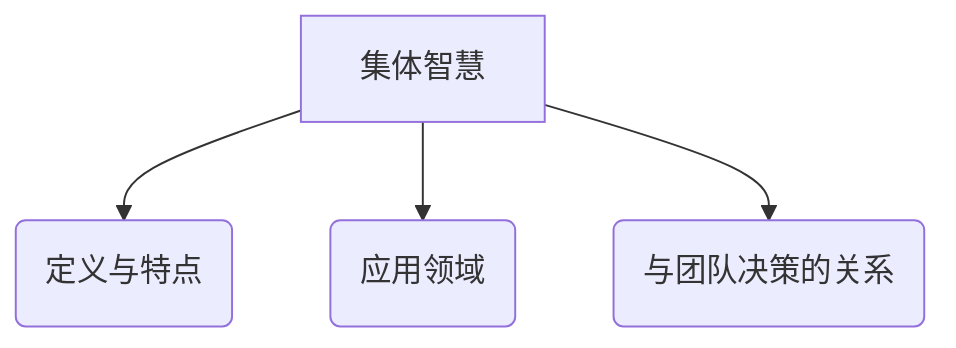

                 

好的，让我们按照您的要求，逐步构建和完善这篇文章的Markdown格式内容。以下是将要撰写的文章的初步Markdown框架：

```markdown
# 《集体智慧利用：提升团队决策质量的技巧》

> 关键词：集体智慧，团队决策，人工智能，决策质量，决策优化，案例分析

> 摘要：本文探讨了集体智慧的概念及其在团队决策中的应用，结合人工智能技术，分析了如何利用集体智慧和人工智能提升团队决策的质量。文章通过理论讲解、案例分析、算法原理和实战应用等多个方面，提供了详细的指导和策略。

---

## 目录

1. **引言**
   1.1 集体智慧的概念与背景
   1.2 团队决策的重要性
   1.3 人工智能与集体智慧的融合

2. **集体智慧概述**
   2.1 集体智慧的定义与特点
   2.2 集体智慧的应用领域
   2.3 集体智慧与团队决策的关系

3. **团队决策的基本原理**
   3.1 决策过程概述
   3.2 决策模型介绍
   3.3 团队成员的角色与心理因素

4. **集体智慧在团队决策中的应用**
   4.1 利用集体智慧进行决策预测
   4.2 集体智慧在决策优化中的应用
   4.3 集体智慧与决策支持系统

5. **案例分析**
   5.1 企业战略决策案例
   5.2 项目团队决策案例

6. **集体智慧与人工智能结合**
   6.1 人工智能在集体智慧中的作用
   6.2 人工智能在团队决策中的应用

7. **实施策略与最佳实践**
   7.1 构建高效的集体智慧系统
   7.2 集体智慧的管理与激励机制
   7.3 创新应用与未来趋势

8. **总结**

---

### 引言

#### 集体智慧的概念与背景

#### 团队决策的重要性

#### 人工智能与集体智慧的融合

---

### 集体智慧概述

#### 2.1 集体智慧的定义与特点

#### 2.2 集体智慧的应用领域

#### 2.3 集体智慧与团队决策的关系

#### **相关概念之间的关系架构图**



---

### 团队决策的基本原理

#### 3.1 决策过程概述

#### 3.2 决策模型介绍

#### 3.3 团队成员的角色与心理因素

---

### 集体智慧在团队决策中的应用

#### 4.1 利用集体智慧进行决策预测

#### 4.2 集体智慧在决策优化中的应用

#### 4.3 集体智慧与决策支持系统

---

### 案例分析

#### 5.1 企业战略决策案例

#### 5.2 项目团队决策案例

---

### 集体智慧与人工智能结合

#### 6.1 人工智能在集体智慧中的作用

#### 6.2 人工智能在团队决策中的应用

#### **相关算法原理讲解**

```plaintext
// 伪代码：集体智慧预测模型
function CollectiveWisdomPrediction(data_set):
    // 初始化模型
    model = initialize_model()

    // 训练模型
    model.fit(data_set)

    // 预测
    predictions = model.predict(data_set)

    return predictions
```

---

### 实施策略与最佳实践

#### 7.1 构建高效的集体智慧系统

#### 7.2 集体智慧的管理与激励机制

#### 7.3 创新应用与未来趋势

---

### 总结

#### 文章要点回顾

#### 对未来发展的展望

---

## 作者信息

> 作者：AI天才研究院/AI Genius Institute & 禅与计算机程序设计艺术 /Zen And The Art of Computer Programming

请注意，上述Markdown框架只是一个大纲，每个章节的内容还需要进一步填充和丰富。根据字数要求，我们需要在每个章节中添加足够的细节和案例分析，确保文章的总字数在8000到12000字之间。接下来，我们将逐一完善每个章节的具体内容。让我们一起开始详细的撰写过程吧！

