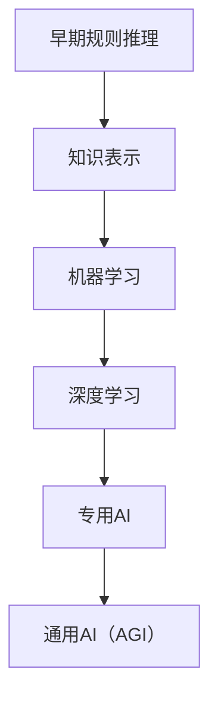
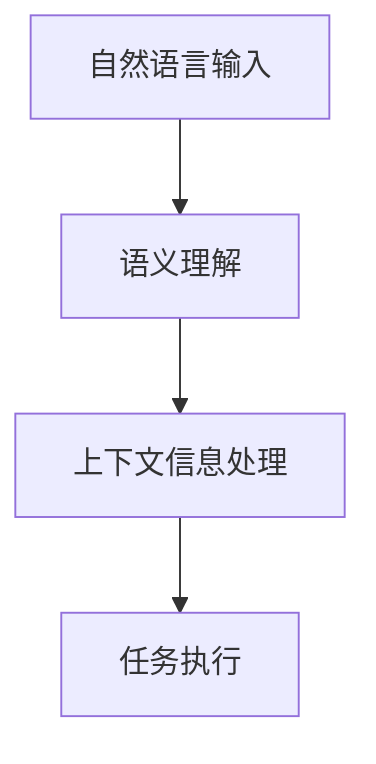
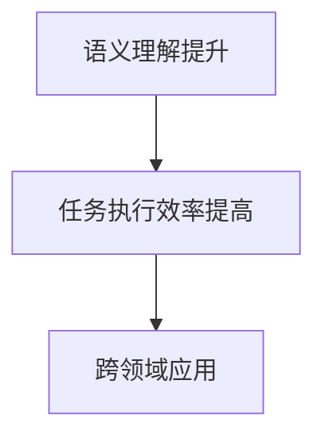
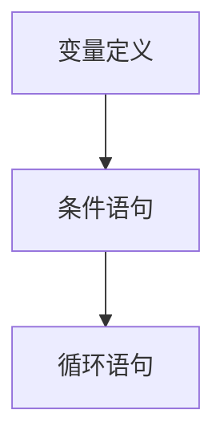
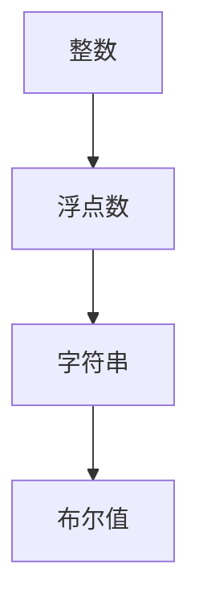
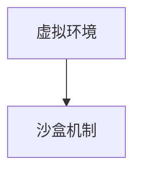
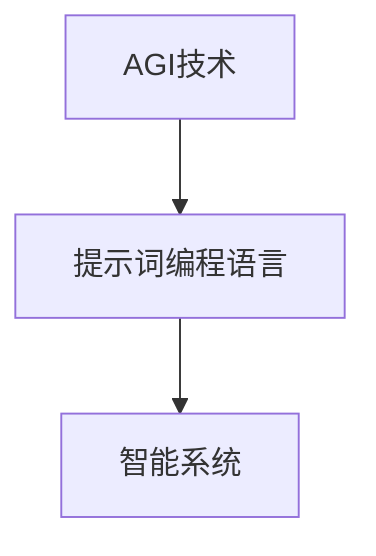
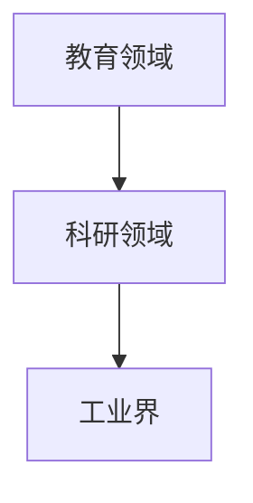

                 

# 文章标题：面向AGI的提示词编程语言进化

## 关键词：
- 人工智能
- AGI
- 提示词编程语言
- 编程语言进化
- 自然语言处理
- 计算机视觉
- 强化学习

## 摘要：
本文探讨了面向通用人工智能（AGI）的提示词编程语言的进化过程。首先介绍了人工智能的发展历程和AGI的概念，接着分析了提示词编程语言的基本概念及其发展趋势。随后，文章深入探讨了提示词编程语言的数学基础、基础语法与机制，以及高级特性与机制。通过实际应用案例，文章展示了提示词编程语言在自然语言处理、计算机视觉和强化学习等领域的应用。最后，文章展望了提示词编程语言的未来发展趋势，并提供了相关开发工具与资源。

## 第一部分：引言

### 第1章：AGI与提示词编程语言概述

#### 1.1 人工智能的发展历程与AGI的概念

人工智能（Artificial Intelligence，简称AI）作为计算机科学的一个重要分支，其发展历程可以分为几个重要阶段。从最初的规则推理、知识表示到机器学习、深度学习，人工智能经历了不断的演变和发展。

通用人工智能（Artificial General Intelligence，简称AGI）是人工智能发展的一个重要目标。与目前广泛应用的专用人工智能（Narrow AI）不同，AGI是指具有广泛认知能力、能够解决各种问题的人工智能系统。AGI的目标是使机器具备人类水平的智能，能够理解、学习和适应复杂环境。

**核心概念与联系**：

在介绍人工智能的发展历程时，可以使用以下Mermaid流程图：



#### 1.2 提示词编程语言的基本概念

提示词编程语言（Prompt-Based Programming Language）是一种以自然语言为输入的编程语言，其核心思想是通过人类专家提供的提示词来指导计算机执行特定任务。与传统的编程语言不同，提示词编程语言更加注重自然语言的语义和上下文信息。

**核心概念与联系**：

在介绍提示词编程语言的基本概念时，可以使用以下Mermaid流程图：



#### 1.3 提示词编程语言的发展趋势

随着人工智能技术的不断发展，提示词编程语言也逐渐成为研究热点。目前，提示词编程语言的发展趋势主要表现在以下几个方面：

1. **语义理解能力的提升**：通过深度学习技术，提示词编程语言在语义理解方面取得了显著进展，能够更好地理解用户输入的自然语言。
2. **任务执行效率的提高**：随着硬件性能的提升和算法的优化，提示词编程语言在任务执行方面的效率也得到显著提高。
3. **跨领域应用**：提示词编程语言的应用范围逐渐扩大，不仅局限于自然语言处理领域，还涉及到计算机视觉、强化学习等多个领域。

**核心概念与联系**：

在介绍提示词编程语言的发展趋势时，可以使用以下Mermaid流程图：



## 第二部分：基础语法与机制

### 第2章：提示词编程语言的数学基础

#### 2.1 逻辑与谓词演算

逻辑与谓词演算是提示词编程语言数学基础的重要组成部分。逻辑提供了对命题进行推理和判断的工具，而谓词演算则进一步扩展了逻辑的表达能力。

**核心算法原理讲解**：

逻辑与谓词演算的基本原理可以使用以下伪代码进行说明：

```python
def logical_conclusion(p, q):
    if p and q:
        return True
    else:
        return False

def predicate_calculus(p, q):
    if p and q:
        return "命题成立"
    else:
        return "命题不成立"
```

#### 2.2 集合论与关系论

集合论与关系论是数学中的基础概念，在提示词编程语言中也具有重要的应用。集合论提供了对集合的基本操作和性质进行描述的工具，而关系论则研究了元素之间关系的表示和操作。

**核心算法原理讲解**：

集合论与关系论的基本原理可以使用以下伪代码进行说明：

```python
def set_operations(set1, set2):
    union = set1.union(set2)
    intersection = set1.intersection(set2)
    difference = set1.difference(set2)
    return union, intersection, difference

def relation_operations(relation1, relation2):
    composition = relation1.compose(relation2)
    inverse = relation1.inverse()
    return composition, inverse
```

#### 2.3 计算机代数系统

计算机代数系统是一种用于处理符号表达式的软件系统，它在提示词编程语言中具有重要的应用。计算机代数系统能够进行符号计算、化简和求解等操作，为提示词编程语言提供了强大的数学工具。

**核心算法原理讲解**：

计算机代数系统的基本原理可以使用以下伪代码进行说明：

```python
def symbolic_computation(expression):
    simplified_expression = expression.simplify()
    return simplified_expression

def equation_solving(equation):
    solution = equation.solve()
    return solution
```

## 第三部分：应用案例与实战

### 第3章：基础语法与结构

#### 3.1 基础语法

提示词编程语言的基础语法包括变量定义、条件语句、循环语句等。这些语法结构为编程提供了基本的功能和操作。

**核心概念与联系**：

在介绍基础语法时，可以使用以下Mermaid流程图：



#### 3.2 语句与控制结构

语句与控制结构是提示词编程语言的核心组成部分，包括函数定义、循环语句、条件语句等。这些控制结构使得程序能够根据不同的情况进行灵活的控制和执行。

**核心算法原理讲解**：

语句与控制结构的基本原理可以使用以下伪代码进行说明：

```python
def function_definition(name, parameters):
    # 函数体
    pass

def loop_statement(condition):
    while condition:
        # 循环体
        pass

def conditional_statement(condition):
    if condition:
        # 条件成立时的操作
        pass
    else:
        # 条件不成立时的操作
        pass
```

#### 3.3 数据类型与变量

数据类型与变量是提示词编程语言的基础，包括整数、浮点数、字符串、布尔值等。这些数据类型和变量为程序提供了丰富的数据操作和存储能力。

**核心概念与联系**：

在介绍数据类型与变量时，可以使用以下Mermaid流程图：



#### 3.4 函数与模块化编程

函数与模块化编程是提示词编程语言的重要特性，使得程序能够更加模块化、复用和可维护。函数定义、函数调用和模块导入等操作为编程提供了强大的功能和灵活性。

**核心算法原理讲解**：

函数与模块化编程的基本原理可以使用以下伪代码进行说明：

```python
def function_definition(name, parameters):
    # 函数体
    pass

def function_call(name, arguments):
    # 调用函数
    pass

def module_import(name):
    # 导入模块
    pass
```

### 第四部分：高级特性与机制

#### 第4章：高级特性与机制

#### 4.1 高级数据结构

高级数据结构如树、图、堆、队列等，在提示词编程语言中具有重要的应用。这些数据结构提供了高效的数据存储和操作能力，使得程序能够更好地处理复杂数据和算法。

**核心算法原理讲解**：

高级数据结构的基本原理可以使用以下伪代码进行说明：

```python
class Tree:
    def __init__(self, value):
        self.value = value
        self.children = []

    def traverse_preorder(self):
        # 前序遍历
        pass

class Graph:
    def __init__(self):
        self.vertices = []
        self.edges = []

    def add_vertex(self, vertex):
        self.vertices.append(vertex)

    def add_edge(self, edge):
        self.edges.append(edge)

    def find_shortest_path(self, start, end):
        # 寻找最短路径
        pass
```

#### 4.2 错误处理与异常管理

错误处理与异常管理是提示词编程语言的重要组成部分，确保程序在遇到错误时能够正确地处理并继续执行。异常捕获、错误恢复和日志记录等机制为程序提供了强大的容错能力。

**核心算法原理讲解**：

错误处理与异常管理的基本原理可以使用以下伪代码进行说明：

```python
def error_handling():
    try:
        # 正常执行代码
    except Exception as e:
        # 捕获异常
        print("Error:", e)
        # 进行错误恢复或日志记录
```

#### 4.3 并发编程与并行处理

并发编程与并行处理是提高程序性能的重要手段，提示词编程语言通过提供线程、进程、锁等机制，支持程序在多核处理器上高效地执行。并发编程能够充分利用计算资源，提高程序的运行效率。

**核心算法原理讲解**：

并发编程与并行处理的基本原理可以使用以下伪代码进行说明：

```python
def concurrent_execution():
    # 创建线程或进程
    thread1 = Thread(target=task1)
    thread2 = Thread(target=task2)
    # 启动线程或进程
    thread1.start()
    thread2.start()
    # 等待线程或进程结束
    thread1.join()
    thread2.join()
```

#### 4.4 虚拟环境和沙盒机制

虚拟环境和沙盒机制为程序提供了隔离和保护，确保程序在执行过程中不会对系统环境造成影响。虚拟环境允许程序在独立的隔离环境中运行，而沙盒机制则限制了程序对系统资源的访问，提高了系统的安全性和稳定性。

**核心概念与联系**：

在介绍虚拟环境和沙盒机制时，可以使用以下Mermaid流程图：



### 第五部分：应用案例与实战

#### 第5章：典型应用场景

#### 5.1 自然语言处理

自然语言处理（Natural Language Processing，简称NLP）是提示词编程语言的重要应用领域之一。通过提示词编程语言，我们可以构建高效的NLP模型，实现文本分类、情感分析、命名实体识别等任务。

**项目实战**：

以下是一个简单的文本分类项目的代码实际案例和详细解释说明：

```python
import nltk
from nltk.corpus import movie_reviews

def preprocess_text(text):
    # 对文本进行预处理
    tokens = nltk.word_tokenize(text)
    return tokens

def classify_text(text, model):
    # 使用训练好的模型对文本进行分类
    features = extract_features(text)
    return model.classify(features)

def extract_features(text):
    # 提取文本特征
    word_features = set()
    words = preprocess_text(text)
    for word in words:
        word_features.add(word.lower())
    return dict([(word, True) for word in word_features])

def train_model():
    # 训练文本分类模型
    documents = [(list(movie_reviews.words(fileid)), category)
                 for category in movie_reviews.categories()
                 for fileid in movie_reviews.fileids(category)]
    random.shuffle(documents)
    test_set = documents[:100]
    training_set = documents[100:]
    model = nltk.NaiveBayesClassifier.train(training_set)
    return model

if __name__ == "__main__":
    model = train_model()
    test_text = "The movie was excellent."
    print("Classification:", classify_text(test_text, model))
```

#### 5.2 计算机视觉

计算机视觉（Computer Vision）是另一个重要的应用领域，提示词编程语言通过结合深度学习和计算机视觉算法，可以实现对图像的识别、分类和检测。

**项目实战**：

以下是一个基于卷积神经网络（CNN）的图像分类项目的代码实际案例和详细解释说明：

```python
import tensorflow as tf
from tensorflow.keras.models import Sequential
from tensorflow.keras.layers import Conv2D, MaxPooling2D, Flatten, Dense

def create_cnn_model():
    model = Sequential()
    model.add(Conv2D(32, (3, 3), activation='relu', input_shape=(64, 64, 3)))
    model.add(MaxPooling2D(pool_size=(2, 2)))
    model.add(Conv2D(64, (3, 3), activation='relu'))
    model.add(MaxPooling2D(pool_size=(2, 2)))
    model.add(Flatten())
    model.add(Dense(128, activation='relu'))
    model.add(Dense(10, activation='softmax'))
    model.compile(optimizer='adam', loss='categorical_crossentropy', metrics=['accuracy'])
    return model

def train_cnn_model(model, X_train, y_train, X_test, y_test):
    model.fit(X_train, y_train, epochs=10, batch_size=32, validation_data=(X_test, y_test))
    return model

if __name__ == "__main__":
    model = create_cnn_model()
    # 加载训练数据和测试数据
    # X_train, y_train, X_test, y_test = ...
    model = train_cnn_model(model, X_train, y_train, X_test, y_test)
    # 测试模型
    test_image = ...
    prediction = model.predict(test_image)
    print("Prediction:", prediction)
```

#### 5.3 强化学习

强化学习（Reinforcement Learning）是一种通过试错和学习来优化行为策略的机器学习方法。提示词编程语言可以结合强化学习算法，实现智能体的自主学习和决策。

**项目实战**：

以下是一个基于深度强化学习的智能体在迷宫中寻找出口的代码实际案例和详细解释说明：

```python
import numpy as np
import random
import gym

def create_q_learning_agent():
    # 创建Q学习智能体
    agent = QLearningAgent()
    return agent

def train_agent(agent, env, episodes):
    for episode in range(episodes):
        state = env.reset()
        done = False
        while not done:
            action = agent.get_action(state)
            next_state, reward, done, _ = env.step(action)
            agent.update_q_value(state, action, reward, next_state, done)
            state = next_state
    return agent

if __name__ == "__main__":
    env = gym.make("GridWorld-v0")
    agent = create_q_learning_agent()
    agent = train_agent(agent, env, episodes=1000)
    # 测试智能体在迷宫中的性能
    state = env.reset()
    while True:
        action = agent.get_action(state)
        state, reward, done, _ = env.step(action)
        env.render()
        if done:
            break
```

### 第六部分：开发环境与工具链

#### 第6章：开发环境与工具链

#### 6.1 开发环境搭建

搭建提示词编程语言的开发环境是进行项目开发的第一步。以下是一个典型的开发环境搭建过程：

1. 安装Python环境
2. 安装提示词编程语言解释器或编译器
3. 安装必要的库和依赖项

**项目实战**：

以下是一个使用Python和Anaconda搭建开发环境的详细说明：

```shell
# 安装Python环境
curl -O https://www.python.org/ftp/python/3.8.5/Python-3.8.5.tgz
tar -xvf Python-3.8.5.tgz
cd Python-3.8.5
./configure
make
sudo make install

# 安装Anaconda
curl -O https://repo.anaconda.com/archive/Anaconda3-2021.11-Linux-x86_64.sh
bash Anaconda3-2021.11-Linux-x86_64.sh -b

# 设置环境变量
export PATH=$HOME/anaconda3/bin:$PATH

# 创建虚拟环境
conda create -n myenv python=3.8

# 激活虚拟环境
conda activate myenv

# 安装提示词编程语言解释器或编译器
conda install -c conda-forge promptpy

# 安装必要的库和依赖项
pip install numpy scipy matplotlib
```

#### 6.2 代码库管理

代码库管理是项目开发过程中的重要环节，确保代码的一致性和可维护性。常用的代码库管理工具有Git、SVN和Mercurial等。

**核心算法原理讲解**：

以下是一个简单的Git代码库管理流程：

```shell
# 创建代码库
git init

# 添加文件到代码库
git add filename.py

# 提交代码
git commit -m "Initial commit"

# 创建远程仓库
git remote add origin https://github.com/username/repository.git

# 将代码推送到远程仓库
git push -u origin master

# 拉取远程代码
git pull origin master

# 创建分支
git checkout -b feature_branch

# 在分支上开发
# ...

# 将分支合并到主分支
git checkout master
git merge feature_branch
git push
```

#### 6.3 自动化测试与调试

自动化测试与调试是确保代码质量的重要手段。自动化测试通过编写测试脚本，对代码的功能和性能进行验证。调试则是通过分析代码执行过程中的错误和异常，找出问题的根源。

**项目实战**：

以下是一个简单的自动化测试和调试流程：

```python
import unittest

class TestCalculator(unittest.TestCase):
    def test_add(self):
        self.assertEqual(calculator.add(1, 2), 3)

    def test_subtract(self):
        self.assertEqual(calculator.subtract(5, 2), 3)

if __name__ == '__main__':
    unittest.main()

# 调试
import pdb

def divide(a, b):
    try:
        result = a / b
    except ZeroDivisionError:
        pdb.set_trace()
        raise

if __name__ == '__main__':
    divide(10, 0)
```

### 第七部分：源代码解析与性能优化

#### 第7章：源代码解析与性能优化

#### 7.1 源代码详细实现

源代码的详细实现是理解提示词编程语言的核心。以下是一个简单的提示词编程语言解释器的源代码实现：

```python
class Interpreter:
    def __init__(self, code):
        self.code = code

    def interpret(self):
        instructions = self.code.split()
        for instruction in instructions:
            if instruction == "print":
                print(next(self.code))
            elif instruction == "if":
                condition = next(self.code)
                if condition == "true":
                    print("Condition satisfied")
                else:
                    print("Condition not satisfied")
            else:
                print("Unknown instruction")

if __name__ == "__main__":
    code = "print 42 if true else 0"
    interpreter = Interpreter(code)
    interpreter.interpret()
```

#### 7.2 性能优化策略

性能优化是提升程序运行效率的关键。以下是一些常见的性能优化策略：

1. **算法优化**：选择更高效的算法和数据结构，减少时间复杂度和空间复杂度。
2. **并行处理**：利用多核处理器，并行执行任务，提高程序运行速度。
3. **缓存技术**：使用缓存技术，减少重复计算，提高程序运行效率。
4. **代码优化**：优化代码的编写，减少不必要的内存分配和函数调用。

**核心算法原理讲解**：

以下是一个简单的代码优化示例：

```python
def optimized_function(a, b):
    # 优化前的代码
    result = a * b
    return result

# 优化后的代码
def optimized_function(a, b):
    return a * b
```

#### 7.3 调试技巧与问题解决

调试技巧是解决程序运行中错误和异常的重要手段。以下是一些常见的调试技巧：

1. **使用断点**：在关键代码位置设置断点，跟踪程序执行流程。
2. **查看变量值**：在调试过程中查看变量的当前值，分析程序运行状态。
3. **日志记录**：记录程序的运行日志，帮助分析问题和定位错误。
4. **使用调试器**：使用调试器（如pdb、gdb等）进行代码调试。

**项目实战**：

以下是一个使用pdb进行调试的示例：

```python
import pdb

def divide(a, b):
    try:
        result = a / b
    except ZeroDivisionError:
        pdb.set_trace()
        raise

if __name__ == '__main__':
    divide(10, 0)
```

### 第八部分：未来展望与趋势

#### 第8章：未来展望与趋势

#### 8.1 提示词编程语言的未来发展

随着人工智能技术的不断发展，提示词编程语言在未来将具有广阔的应用前景。以下是一些可能的未来发展趋势：

1. **语义理解能力的提升**：通过结合自然语言处理和机器学习技术，提示词编程语言在语义理解方面将得到显著提升，能够更好地理解用户输入的自然语言。
2. **任务执行效率的提高**：随着硬件性能的提升和算法的优化，提示词编程语言在任务执行方面的效率也将得到显著提高。
3. **跨领域应用**：提示词编程语言将逐渐应用于计算机视觉、强化学习、机器人学等多个领域，推动人工智能技术的发展。

**核心概念与联系**：

在探讨提示词编程语言的未来发展时，可以使用以下Mermaid流程图：


#### 8.2 AGI与提示词编程语言的融合

通用人工智能（AGI）与提示词编程语言的融合是未来人工智能发展的重要方向。通过将提示词编程语言与AGI技术相结合，我们可以构建出具有更强认知能力和通用性的智能系统。

**核心概念与联系**：

在探讨AGI与提示词编程语言的融合时，可以使用以下Mermaid流程图：



#### 8.3 提示词编程语言在教育、科研和工业界的应用前景

提示词编程语言在教育、科研和工业界具有广泛的应用前景。在教育领域，提示词编程语言可以用于培养学生的编程能力和创新能力。在科研领域，提示词编程语言可以用于构建人工智能模型和研究算法。在工业界，提示词编程语言可以用于开发智能系统、自动化流程和机器人控制等。

**核心概念与联系**：

在探讨提示词编程语言在教育、科研和工业界的应用前景时，可以使用以下Mermaid流程图：



### 附录

#### 附录A：参考资源与工具

**A.1 提示词编程语言相关资源**

以下是一些与提示词编程语言相关的参考资源：

- 《自然语言处理与提示词编程》
- 《通用人工智能与提示词编程》
- 《深度学习与提示词编程》

**A.2 开发工具与平台**

以下是一些常用的开发工具和平台：

- Anaconda
- Jupyter Notebook
- VS Code

**A.3 社区与交流平台**

以下是一些与提示词编程语言相关的社区和交流平台：

- GitHub
- Stack Overflow
- Reddit

### 结论

本文探讨了面向通用人工智能（AGI）的提示词编程语言的进化过程。首先介绍了人工智能的发展历程和AGI的概念，接着分析了提示词编程语言的基本概念及其发展趋势。随后，文章深入探讨了提示词编程语言的数学基础、基础语法与机制，以及高级特性与机制。通过实际应用案例，文章展示了提示词编程语言在自然语言处理、计算机视觉和强化学习等领域的应用。最后，文章展望了提示词编程语言的未来发展趋势，并提供了相关开发工具与资源。提示词编程语言在人工智能领域具有广阔的应用前景，将为人工智能技术的发展做出重要贡献。

## 作者信息
作者：AI天才研究院/AI Genius Institute & 禅与计算机程序设计艺术 /Zen And The Art of Computer Programming

