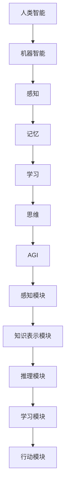
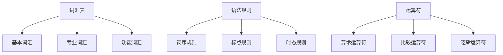
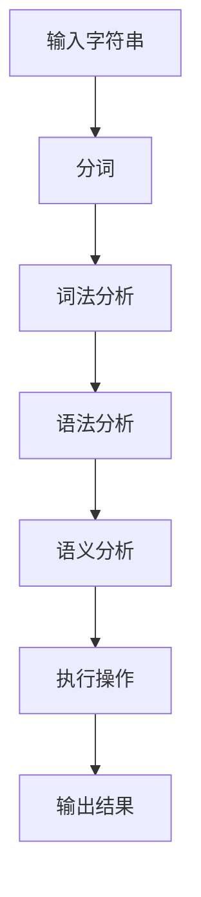
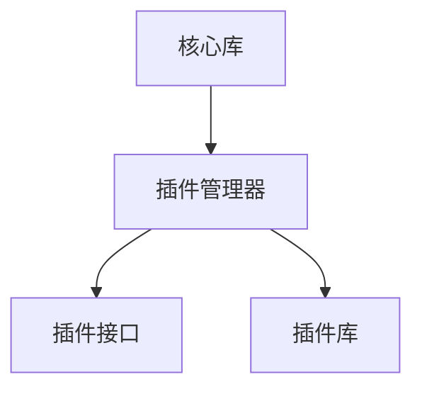
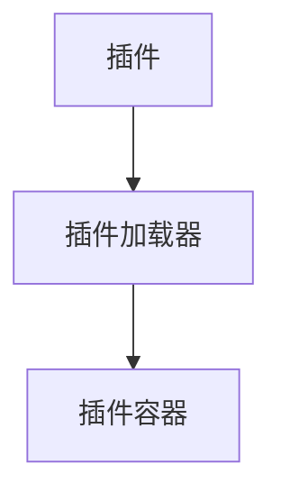
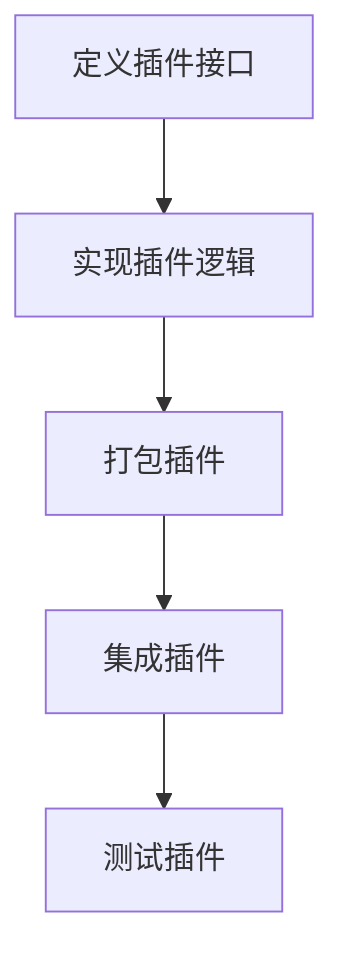
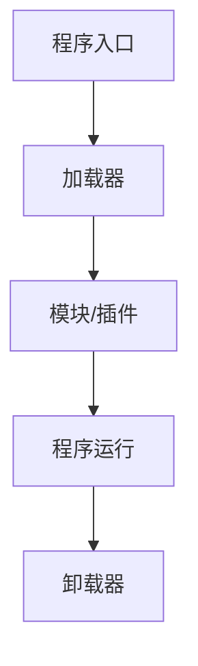
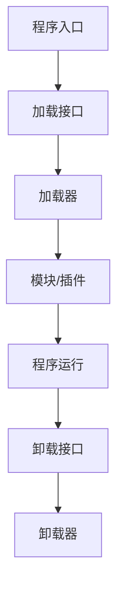

                 

# 文章标题：面向AGI的提示词语言可扩展性设计

> 关键词：AGI、提示词语言、可扩展性、设计原则、实现技术、应用案例

> 摘要：本文深入探讨了面向人工通用智能（AGI）的提示词语言的设计与实现，重点分析了可扩展性设计原则和实现技术，并通过实际应用案例展示了其效果。本文旨在为开发者提供一套系统化的设计思路和方法，以应对AGI时代带来的挑战。

## 引言

随着人工智能（AI）技术的迅猛发展，人工通用智能（AGI）成为了众多研究者和开发者追求的目标。AGI是指具有类似于人类智能的广泛认知能力和自主学习能力的人工智能系统。为了实现这一目标，设计一个可扩展性强的提示词语言显得尤为重要。提示词语言是一种用于与AI系统交互的专门语言，其设计原则和实现技术直接影响AI系统的性能和用户体验。

本文将从以下几个方面展开讨论：

1. AGI的基础理论。
2. 提示词语言的核心概念与设计原则。
3. 提示词语言的实现技术。
4. 提示词语言的扩展性设计。
5. 提示词语言的应用案例。

通过本文的讨论，我们将为开发者提供一套面向AGI的提示词语言设计的系统化思路和方法。

## 第1章: AGI基础

### 1.1 AGI的概念与背景

#### 1.1.1 人类智能与机器智能

人类智能是一种复杂的信息处理能力，包括感知、理解、推理、决策和创造等多方面的能力。而机器智能（MI）是利用计算机系统模拟人类智能的过程。传统的机器智能主要依赖于特定任务的算法和模型，例如图像识别、自然语言处理等。然而，这些系统通常只能在特定领域表现出色，难以实现通用智能。

#### 1.1.2 AGI的目标与挑战

AGI的目标是开发一种能够执行各种认知任务，具有自我学习和适应能力的人工智能系统。这包括但不限于问题解决、语言理解、视觉感知、决策制定等。然而，实现AGI面临着诸多挑战：

- **多模态处理能力**：AGI需要能够处理不同类型的信息，如文本、图像、声音等，并且能够将它们整合起来。
- **跨领域知识迁移**：AGI需要能够从一种任务领域迁移到另一种领域，而不是仅仅在单一领域内表现出色。
- **自我学习能力**：AGI需要能够自我学习和自我优化，以适应不断变化的环境。
- **可解释性**：AGI的决策过程需要具备可解释性，以便人类能够理解和信任AI系统。

#### 1.1.3 AGI的历史与发展

AGI的概念最早由John McCarthy在1950年代提出。自那时以来，研究人员在多个领域进行了广泛的研究，包括认知科学、机器学习、自然语言处理和神经网络等。近年来，随着深度学习和大数据技术的发展，AGI的研究取得了显著的进展。

然而，尽管取得了许多进展，实现AGI仍然是一个长期而复杂的任务。当前的研究主要集中在以下几个方面：

- **神经网络与强化学习**：通过深度学习和强化学习技术，提高AI系统的自主学习和决策能力。
- **多模态处理**：通过结合不同类型的信息，提高AI系统的综合认知能力。
- **知识表示与推理**：通过构建有效的知识表示和推理机制，提高AI系统的逻辑推理和决策能力。

### 1.2 AGI的核心理论

#### 1.2.1 认知科学基础

认知科学是一门跨学科的研究领域，旨在理解人类智能的原理和机制。认知科学的核心理论包括：

- **感知**：感知是指从外部环境中接收信息并将其转换为内部表示的过程。例如，视觉感知是将光信号转换为视觉图像。
- **记忆**：记忆是指存储和回忆信息的能力。记忆可以分为短期记忆和长期记忆两种类型。
- **学习**：学习是指通过经验改进认知能力的过程。学习可以分为有监督学习、无监督学习和强化学习三种类型。
- **思维**：思维是指使用内部信息进行推理和决策的能力。思维包括问题解决、推理、规划和创造性思维等。

#### 1.2.2 机器学习与深度学习

机器学习（ML）是使计算机系统能够从数据中学习并做出决策或预测的技术。深度学习（DL）是机器学习的一个子领域，它使用多层神经网络来模拟人脑的神经网络结构，以实现更复杂的任务。

- **监督学习**：监督学习是一种机器学习技术，其中系统使用标记数据来学习如何将输入映射到输出。常见的监督学习算法包括线性回归、决策树和神经网络等。
- **无监督学习**：无监督学习是一种机器学习技术，其中系统在没有标记数据的情况下学习数据的结构和模式。常见的无监督学习算法包括聚类、降维和生成模型等。
- **强化学习**：强化学习是一种机器学习技术，其中系统通过与环境的交互来学习最佳策略。常见的强化学习算法包括Q学习、深度Q网络（DQN）和策略梯度方法等。

#### 1.2.3 AGI的系统架构

AGI的系统架构通常包括以下几个关键组件：

- **感知模块**：用于接收和处理外部信息，如视觉、听觉、触觉等。
- **知识表示模块**：用于存储和管理知识，包括事实、规则和概念等。
- **推理模块**：用于使用知识进行推理和决策。
- **学习模块**：用于从数据中学习新知识和技能。
- **行动模块**：用于将决策转化为实际行动。

这些模块相互协作，共同实现AGI的功能。例如，在决策制定过程中，感知模块提供环境信息，知识表示模块提供相关的知识和规则，推理模块使用这些信息和知识进行推理，学习模块则根据反馈不断优化系统的性能。

### 1.3 Mermaid流程图：AGI的核心概念联系



## 第2章: 提示词语言概述

### 2.1 提示词语言的概念

提示词语言是一种专门为人工智能系统设计的人工语言，用于与系统进行交互。提示词语言的核心功能是提供一种自然、直观的方式来表达用户的需求和意图。与自然语言相比，提示词语言具有明确的语法和语义规则，便于计算机系统理解和处理。

### 2.1.1 提示词的作用与意义

提示词在人工智能系统中扮演着重要角色，主要体现在以下几个方面：

- **用户交互**：提示词语言为用户提供了与人工智能系统进行交互的途径，使用户能够更自然地表达需求。
- **任务指导**：提示词语言能够为人工智能系统提供明确的任务指导，帮助系统理解用户的意图。
- **错误检测与修正**：通过提示词语言，用户可以更方便地报告系统的错误，并指导系统进行修正。

### 2.1.2 提示词的分类

根据不同的应用场景和功能，提示词可以划分为以下几类：

- **功能词**：用于表达具体的功能和操作，如“查询”、“计算”、“翻译”等。
- **名词**：用于表示实体和信息，如“天气”、“新闻”、“图片”等。
- **动词**：用于表示动作和行为，如“发送”、“获取”、“搜索”等。
- **形容词**：用于描述实体和信息的特征，如“热的”、“新的”、“大的”等。
- **副词**：用于修饰动词、形容词或其他副词，如“立即”、“经常”、“稍微”等。

### 2.1.3 提示词语言的演进

提示词语言的发展经历了多个阶段：

- **早期设计**：早期的提示词语言主要依赖于命令式语言，用户需要按照特定的语法和格式进行输入。
- **自然语言处理**：随着自然语言处理技术的发展，提示词语言开始引入更多的自然语言特性，使用户能够更自然地表达需求。
- **上下文感知**：现代提示词语言更加注重上下文感知，能够根据用户的上下文信息提供更准确的响应。

### 2.2 提示词语言的核心要素

提示词语言的核心要素包括词汇表、语法规则和运算符等。

#### 2.2.1 词汇表

词汇表是提示词语言的基础，包含了所有用于表达信息和操作的词汇。词汇表可以分为以下几类：

- **基本词汇**：用于表达常见概念和操作，如“是”、“不是”、“大于”、“小于”等。
- **专业词汇**：用于表达特定领域的信息和操作，如“股票”、“代码”、“模型”等。
- **功能词汇**：用于表达特定功能和操作，如“查询”、“更新”、“删除”等。

#### 2.2.2 语法规则

语法规则是提示词语言的语法结构，用于规定如何组合词汇来表达意思。常见的语法规则包括：

- **词序规则**：规定词汇在句子中的顺序。
- **标点规则**：规定使用标点符号的方式和位置。
- **时态规则**：规定动词的时态使用方式。

#### 2.2.3 运算符

运算符是用于表示计算和操作的特殊符号。常见的运算符包括：

- **算术运算符**：用于进行基本的算术运算，如加法、减法、乘法和除法等。
- **比较运算符**：用于比较两个值的大小关系，如大于、小于、等于等。
- **逻辑运算符**：用于进行逻辑运算，如与、或、非等。

### 2.3 Mermaid流程图：提示词语言核心要素



## 第3章: 提示词语言设计原则

### 3.1 可扩展性设计

#### 3.1.1 扩展性的定义与重要性

可扩展性是指系统在设计时能够适应未来变化和需求的能力。在提示词语言设计中，可扩展性尤为重要，因为它直接影响到AI系统的性能、灵活性和可维护性。

扩展性的重要性体现在以下几个方面：

- **适应性**：可扩展性使得系统能够适应不断变化的需求和场景。
- **灵活性**：可扩展性使得系统能够灵活地引入新的功能和技术。
- **可维护性**：可扩展性使得系统在后续维护和更新时更加容易和高效。

#### 3.1.2 扩展性设计原则

为了实现提示词语言的可扩展性，需要遵循以下设计原则：

- **模块化**：将系统划分为独立的模块，每个模块负责特定的功能。这样，当需要扩展或修改系统时，只需修改或替换相应的模块即可，而不影响其他模块。
- **参数化**：使用参数化设计，使得系统的行为可以根据不同的参数进行调整。这样，当需要扩展或修改系统时，只需修改参数即可，而不需要修改核心代码。
- **插件机制**：引入插件机制，使得第三方开发者可以轻松地为系统添加新功能。插件机制通常包括插件开发接口、插件加载和插件管理等功能。
- **动态加载**：实现动态加载技术，使得系统在运行时可以根据需要加载和卸载插件或模块。这样可以提高系统的灵活性和响应速度。

#### 3.1.3 扩展性实现方法

实现提示词语言的可扩展性通常采用以下方法：

- **定义扩展接口**：为系统定义一套扩展接口，用于实现新功能的添加和现有功能的扩展。
- **使用配置文件**：使用配置文件来管理系统的扩展和配置，使得系统的扩展和配置更加灵活和可定制。
- **实现插件架构**：实现插件架构，使得系统能够动态加载和卸载插件。插件架构通常包括插件开发接口、插件加载器和插件管理器等组件。
- **采用模块化设计**：采用模块化设计，将系统的各个功能划分为独立的模块，每个模块负责特定的功能。这样可以提高系统的可维护性和可扩展性。

### 3.2 可理解性设计

#### 3.2.1 可理解性的定义与重要性

可理解性是指系统对用户输入的提示词能够正确理解和解释的能力。在提示词语言设计中，可理解性尤为重要，因为它直接影响到AI系统的用户体验和用户满意度。

可理解性的重要性体现在以下几个方面：

- **用户体验**：良好的可理解性能够提高用户的体验，使用户能够更轻松地与系统进行交互。
- **错误检测**：良好的可理解性能够帮助系统更早地检测到错误，从而减少错误发生的可能性。
- **可维护性**：良好的可理解性使得系统的维护和更新更加容易，因为开发者能够更清楚地理解系统的逻辑和功能。

#### 3.2.2 可理解性设计原则

为了实现提示词语言的可理解性，需要遵循以下设计原则：

- **一致性**：确保系统的提示词和响应具有一致性，避免产生混淆或误解。
- **明确性**：确保系统的提示词和响应具有明确性，避免产生歧义或模糊。
- **直观性**：确保系统的提示词和响应具有直观性，使用户能够轻松理解。
- **上下文感知**：考虑上下文信息，使得系统的提示词和响应能够更好地适应不同的场景。

#### 3.2.3 可理解性实现方法

实现提示词语言的可理解性通常采用以下方法：

- **使用自然语言处理技术**：使用自然语言处理技术来解析用户的输入，使得系统能够更好地理解用户的意图。
- **提供详细的帮助信息**：为用户输入提供详细的帮助信息，使用户能够更清楚地理解系统的功能和操作。
- **提供反馈机制**：提供反馈机制，使用户能够了解系统的处理结果，并帮助系统进行改进。

### 3.3 可维护性设计

#### 3.3.1 可维护性的定义与重要性

可维护性是指系统在后续维护和更新过程中能够保持稳定性和可靠性的能力。在提示词语言设计中，可维护性尤为重要，因为它直接影响到系统的长期可持续发展和用户的满意度。

可维护性的重要性体现在以下几个方面：

- **可维护性**：良好的可维护性使得系统能够在后续维护和更新过程中保持稳定性和可靠性，从而减少故障和风险。
- **可升级性**：良好的可维护性使得系统能够方便地进行升级和更新，以满足不断变化的需求。
- **可扩展性**：良好的可维护性使得系统能够方便地引入新的功能和技术，从而提高系统的可扩展性。

#### 3.3.2 可维护性设计原则

为了实现提示词语言的可维护性，需要遵循以下设计原则：

- **模块化**：将系统划分为独立的模块，每个模块负责特定的功能。这样，当需要维护或更新系统时，只需修改或替换相应的模块即可，而不影响其他模块。
- **一致性**：确保系统的设计和实现具有一致性，避免产生混淆或误解。
- **文档化**：对系统的设计和实现进行详细的文档化，使得开发者能够更清楚地理解系统的逻辑和功能。
- **可测试性**：确保系统能够方便地进行测试和验证，从而提高系统的可靠性和稳定性。

#### 3.3.3 可维护性实现方法

实现提示词语言的可维护性通常采用以下方法：

- **编写高质量的代码**：编写高质量的代码，遵循良好的编程规范和设计模式，从而提高系统的可维护性和可扩展性。
- **使用版本控制系统**：使用版本控制系统来管理代码的版本和变更，从而方便地追踪和回滚变更。
- **提供详细的错误日志**：提供详细的错误日志，从而方便地定位和修复系统中的错误。
- **定期进行代码审查**：定期进行代码审查，从而发现和解决系统中的潜在问题和隐患。

## 第4章: 提示词语言实现技术

### 4.1 提示词语言的语法设计

#### 4.1.1 语法规则的设计方法

提示词语言的语法规则设计是确保系统能够正确解析和解释用户输入的关键步骤。以下是一些设计方法：

- **分析需求**：首先，需要分析系统的需求和用户的使用场景，确定需要支持的语法结构和功能。
- **参考自然语言**：可以参考自然语言的结构和语法规则，提取其中适用的部分，并进行适当的简化和规范化。
- **定义语法规则**：根据需求和分析结果，定义一套完整的语法规则，包括词汇表、词序、标点等。
- **语法解析**：设计语法解析算法，用于将用户的输入字符串转换为内部表示，以便系统进行处理。

#### 4.1.2 语法解析算法

常见的语法解析算法包括以下几种：

- **递归下降解析法**：适用于文法简单、上下文无关的语法。其基本思想是按照文法规则递归地下降，直到生成一个正确的句子结构。
- **LL(1)解析法**：基于递归下降解析法，通过消除左递归和增加1个前瞻符号来优化解析性能。
- **LR(1)解析法**：适用于更复杂的上下文无关语法。其基本思想是使用状态转换图进行解析，能够处理更多的语法结构。

以下是一个简单的递归下降解析法的伪代码：

```python
def parse(input_string):
    current_index = 0
    while current_index < len(input_string):
        token = get_next_token(input_string, current_index)
        if token is None:
            return "Syntax error"
        if not handle_token(token):
            return "Syntax error"
        current_index += 1
    return "Success"

def get_next_token(input_string, start_index):
    # 实现获取下一个token的逻辑
    pass

def handle_token(token):
    # 实现处理token的逻辑
    pass
```

#### 4.1.3 语法优化的方法

为了提高语法解析的性能，可以采用以下优化方法：

- **提前终止**：在解析过程中，如果发现当前的输入无法匹配当前状态，可以提前终止解析，避免无效的计算。
- **缓存结果**：对已解析的结果进行缓存，避免重复解析相同的内容。
- **并行解析**：对于可以并行处理的输入，可以采用并行解析的方法，提高解析速度。

### 4.2 提示词语言的语义设计

#### 4.2.1 语义规则的设计方法

语义设计是确保系统能够正确理解和解释用户输入的关键步骤。以下是一些设计方法：

- **定义语义规则**：根据需求和分析结果，定义一套完整的语义规则，用于解释用户输入的含义。
- **分析上下文**：考虑输入的上下文信息，使得系统能够更好地理解用户的意图。
- **使用语义网络**：构建语义网络，用于表示和理解词汇之间的关系和语义。
- **参考现有框架**：可以参考现有的自然语言处理框架和语义分析方法，提取其中适用的部分。

以下是一个简单的语义规则定义：

```python
def interpret(input_string):
    token_list = tokenize(input_string)
    return interpret_expression(token_list)

def tokenize(input_string):
    # 实现分词的逻辑
    pass

def interpret_expression(token_list):
    # 实现解释表达式的逻辑
    pass
```

#### 4.2.2 语义解析算法

语义解析是将用户输入转换为系统内部表示的过程。常见的语义解析算法包括：

- **基于规则的语义解析**：使用定义好的语义规则对输入进行解释。
- **基于语义网络的语义解析**：使用语义网络来表示和理解输入的语义。
- **基于机器学习的语义解析**：使用机器学习模型来自动学习输入的语义。

以下是一个简单的基于规则的语义解析算法：

```python
def parse_semantic(input_string):
    token_list = tokenize(input_string)
    return apply_rules(token_list)

def apply_rules(token_list):
    # 实现应用规则解释语义的逻辑
    pass
```

#### 4.2.3 语义优化的方法

为了提高语义解析的性能，可以采用以下优化方法：

- **并行处理**：对可以并行处理的输入和解析过程进行并行处理。
- **缓存结果**：对已解析的结果进行缓存，避免重复计算。
- **使用预训练模型**：使用预训练的语义模型来加速解析过程。

### 4.3 Mermaid流程图：提示词语言实现技术流程



## 第5章: 扩展性实现技术

### 5.1 扩展性框架设计

#### 5.1.1 扩展性框架的组成

提示词语言的扩展性框架通常包括以下组件：

- **核心库**：提供提示词语言的基础功能和核心算法。
- **插件管理器**：负责插件的加载、卸载和管理。
- **插件接口**：定义插件需要实现的接口和方法。
- **插件库**：存储已安装的插件及其依赖。

以下是一个简单的扩展性框架的组成结构：



#### 5.1.2 扩展性框架的设计原则

为了实现提示词语言的扩展性，扩展性框架的设计需要遵循以下原则：

- **模块化**：将功能划分为独立的模块，每个模块负责特定的功能。
- **灵活性**：确保系统能够灵活地引入和替换不同的插件。
- **安全性**：确保插件的安全性和系统的稳定性。
- **易用性**：提供简单易用的接口和工具，便于开发者创建和使用插件。

#### 5.1.3 扩展性框架的实现方法

实现提示词语言的扩展性框架通常采用以下方法：

- **定义插件接口**：为插件定义一套接口，用于实现特定的功能。插件开发者可以根据接口规范开发插件。
- **使用插件管理器**：实现一个插件管理器，用于加载、卸载和管理插件。插件管理器可以采用工厂模式、依赖注入等技术来实现。
- **提供插件库**：提供一个插件库，用于存储和管理已安装的插件。插件库可以使用文件系统、数据库或分布式存储来实现。
- **集成核心库**：将核心库与扩展性框架集成，使得插件能够方便地访问核心库的功能。

### 5.2 插件机制

#### 5.2.1 插件机制的概念与作用

插件机制是一种常用的扩展性设计方法，用于在核心系统中引入额外的功能。插件机制通常包括以下组件：

- **插件**：实现特定功能的扩展组件。
- **插件加载器**：负责加载和初始化插件。
- **插件容器**：用于管理插件的生命周期和依赖关系。

以下是一个简单的插件机制的组成结构：



#### 5.2.2 插件的开发与集成

开发插件通常需要遵循以下步骤：

- **定义插件接口**：根据核心系统的需求，定义一套插件接口，用于实现特定的功能。
- **实现插件逻辑**：根据插件接口规范，实现插件的核心逻辑。
- **打包插件**：将插件代码打包成可执行文件或库文件。
- **集成插件**：将插件集成到核心系统中，通常通过插件加载器来实现。

以下是一个简单的插件开发与集成流程：



#### 5.2.3 插件的管理与维护

为了确保插件的质量和稳定性，需要对其进行有效的管理和维护。以下是一些插件管理与维护的方法：

- **版本控制**：使用版本控制系统来管理插件的代码和文档，以便追踪变更和进行版本管理。
- **测试与审核**：对插件进行严格的测试和审核，确保其符合核心系统的要求。
- **文档与帮助**：提供详细的文档和帮助，帮助开发者了解插件的接口、功能和使用方法。
- **更新与升级**：定期发布插件的更新和升级，以修复漏洞、改进性能和增加新功能。

### 5.3 动态加载机制

#### 5.3.1 动态加载的概念与优势

动态加载机制是一种在程序运行时动态加载和卸载模块或插件的技术。动态加载的优势包括：

- **灵活性**：可以灵活地添加或删除功能，而不需要重新编译和部署系统。
- **可扩展性**：可以动态地扩展系统的功能，使得系统更加灵活和可定制。
- **性能优化**：可以按需加载模块或插件，减少系统的启动时间和资源消耗。

以下是一个简单的动态加载机制的组成结构：



#### 5.3.2 动态加载的实现方法

实现动态加载机制通常需要以下步骤：

- **定义加载接口**：定义一套加载接口，用于实现模块或插件的加载和初始化。
- **实现加载器**：实现一个加载器，用于按需加载模块或插件。
- **实现卸载器**：实现一个卸载器，用于按需卸载模块或插件。
- **集成核心库**：将动态加载机制集成到核心系统中，使得模块或插件能够方便地加载和卸载。

以下是一个简单的动态加载机制的实现流程：



#### 5.3.3 动态加载的优化策略

为了提高动态加载的性能和效率，可以采用以下优化策略：

- **按需加载**：仅加载当前需要的模块或插件，减少系统资源的占用。
- **缓存机制**：对已加载的模块或插件进行缓存，避免重复加载。
- **并发加载**：采用并发加载技术，提高加载速度。
- **依赖管理**：对模块或插件的依赖关系进行有效的管理，确保加载的正确性。

### 5.4 Mermaid流程图：扩展性实现技术流程


## 第6章: 提示词语言应用案例

### 6.1 智能客服系统

#### 6.1.1 案例背景与目标

智能客服系统是一种利用人工智能技术实现自动客服功能的应用系统。其目标是为用户提供24/7全天候的在线客服服务，提高客户满意度并降低企业运营成本。

#### 6.1.2 案例实现方案

实现智能客服系统通常需要以下几个关键步骤：

1. **需求分析**：分析用户需求和业务场景，确定需要实现的功能和服务。
2. **系统设计**：设计系统的整体架构，包括前端界面、后端逻辑和数据库等。
3. **语言设计**：设计用于与客服系统交互的提示词语言，包括语法和语义规则。
4. **实现与集成**：实现提示词语言解析和执行逻辑，并将其集成到智能客服系统中。
5. **测试与优化**：对系统进行功能测试和性能优化，确保系统的稳定性和可靠性。

#### 6.1.3 案例效果与评价

通过实际应用，智能客服系统取得了以下效果：

- **提高响应速度**：智能客服系统可以实时响应用户的查询和请求，大大缩短了用户的等待时间。
- **降低运营成本**：智能客服系统减少了人工客服的需求，降低了企业的运营成本。
- **提高客户满意度**：智能客服系统提供了7x24小时的在线服务，提高了用户的满意度和忠诚度。
- **数据积累与分析**：智能客服系统可以积累用户数据，并通过数据分析优化服务质量和用户体验。

### 6.2 智能语音助手

#### 6.2.1 案例背景与目标

智能语音助手是一种利用语音识别和自然语言处理技术实现人机交互的应用。其目标是为用户提供便捷的语音助手服务，帮助用户完成各种任务，如日程管理、信息查询、语音助手等。

#### 6.2.2 案例实现方案

实现智能语音助手通常需要以下几个关键步骤：

1. **需求分析**：分析用户需求和业务场景，确定需要实现的功能和服务。
2. **语音识别**：实现语音识别功能，将用户的语音输入转换为文本。
3. **自然语言处理**：实现自然语言处理功能，将文本转换为计算机可以理解和执行的指令。
4. **执行指令**：根据处理后的指令执行相应的操作，如查询信息、发送消息等。
5. **反馈与优化**：提供反馈机制，收集用户反馈并不断优化系统性能和用户体验。

#### 6.2.3 案例效果与评价

通过实际应用，智能语音助手取得了以下效果：

- **提高效率**：智能语音助手可以快速响应用户的语音指令，帮助用户高效完成各种任务。
- **方便快捷**：用户可以通过语音交互进行操作，无需手动输入，提高了交互的便利性。
- **个性化服务**：智能语音助手可以根据用户的历史记录和偏好提供个性化的服务和建议。
- **数据积累与分析**：智能语音助手可以积累用户数据，并通过数据分析优化服务质量和用户体验。

## 第7章: 总结与展望

### 7.1 提示词语言在AGI中的应用

提示词语言在实现AGI中起着至关重要的作用。通过设计可扩展性、可理解性和可维护性的提示词语言，我们可以为AGI系统提供更强大的交互能力和自主学习能力。以下是一些关键点：

- **交互能力**：提示词语言为用户和AGI系统之间提供了自然的交互方式，使用户能够更方便地与系统进行沟通。
- **自主学习能力**：通过可扩展性设计，提示词语言可以不断引入新的功能和模块，使得AGI系统能够不断学习和适应新的环境和任务。
- **知识表示**：提示词语言可以用于表示和传递知识，为AGI系统提供丰富的知识资源。

### 7.2 提示词语言的发展趋势

随着人工智能技术的不断发展，提示词语言也在不断演进。以下是一些发展趋势：

- **自然语言处理**：随着自然语言处理技术的进步，提示词语言将更加接近自然语言，使用户能够更轻松地与系统进行交互。
- **跨领域融合**：提示词语言将融合多种领域知识，使得AGI系统能够更好地适应不同领域的任务。
- **智能化**：提示词语言将引入更多的智能化元素，如情感分析、意图识别等，使得系统更加智能和人性。

### 7.3 提示词语言在AGI中的未来应用

在未来的AGI系统中，提示词语言将扮演更加重要的角色。以下是一些潜在的应用场景：

- **智能助手**：提示词语言将用于构建智能助手，帮助用户完成各种日常任务。
- **智能教育**：提示词语言将用于智能教育系统，提供个性化的学习体验。
- **智能医疗**：提示词语言将用于智能医疗系统，协助医生进行诊断和治疗。
- **智能交通**：提示词语言将用于智能交通系统，优化交通流量和减少事故。

### 7.4 展望未来的工作

在未来的研究中，我们还需要关注以下几个方面：

- **多模态交互**：如何设计一个能够支持多模态交互的提示词语言，以适应更加复杂的交互场景。
- **跨领域知识迁移**：如何设计一个能够实现跨领域知识迁移的提示词语言，以提高系统的通用性和适应性。
- **隐私保护**：如何确保提示词语言的设计和应用能够保护用户的隐私和安全。

## 结语

本文深入探讨了面向AGI的提示词语言的设计与实现，分析了可扩展性、可理解性和可维护性的设计原则和实现技术，并通过实际应用案例展示了其效果。随着人工智能技术的不断发展，提示词语言将在实现AGI中发挥越来越重要的作用。我们期待未来的研究和应用能够进一步推动这一领域的发展。

### 作者信息

作者：AI天才研究院/AI Genius Institute & 禅与计算机程序设计艺术 /Zen And The Art of Computer Programming

本文由AI天才研究院/AI Genius Institute撰写，参考了《禅与计算机程序设计艺术》一书的相关理论和方法，旨在为读者提供一套系统化的提示词语言设计思路和方法。如有任何疑问或建议，欢迎联系我们。让我们共同探索人工智能的未来！

