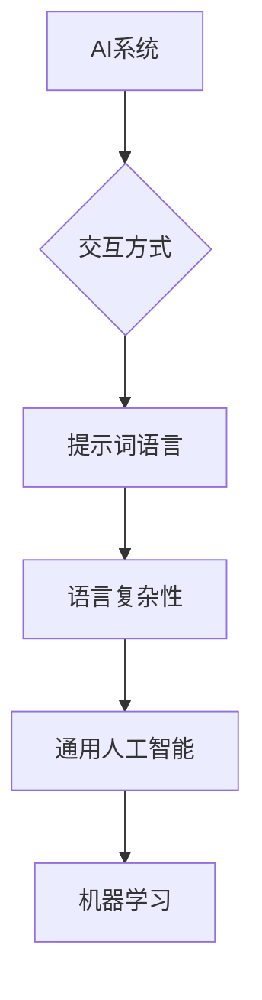

                 


### 文章标题: 《面向AGI的提示词语言复杂性理论》

#### 关键词：
- 人工智能
- 通用人工智能
- 提示词语言
- 语言复杂性
- 自然语言处理
- 决策树
- 神经网络
- 信息熵
- 互信息
- 机器学习

#### 摘要：
本文深入探讨了面向通用人工智能（AGI）的提示词语言复杂性理论。文章首先介绍了AGI与提示词语言的基本概念，然后分析了提示词语言的组成和功能。通过讲解语言复杂性的数学模型和核心算法原理，文章揭示了提示词语言设计的关键因素。最后，文章通过实际项目实战，展示了如何将提示词语言复杂性理论应用于自然语言处理和分类任务，并对未来的研究方向进行了展望。

---

**1. 书籍概述：**

《面向AGI的提示词语言复杂性理论》是一本专注于人工智能（AI）领域的专业书籍，特别是针对通用人工智能（AGI）的提示词语言设计问题。书中系统地介绍了提示词语言的概念、组成及其与AGI之间的联系。通过详细分析语言复杂性的理论框架，本书旨在为读者提供一个全面理解提示词语言复杂性的视角，并探讨其在实际应用中的重要性。

**2. 核心概念与联系：**

在编写目录大纲时，我们首先需要明确几个核心概念，并探讨它们之间的相互关系：

- **提示词语言（Prompt Language）**：这是一种专门用于与AI系统交互的语言或协议。它包括提示词、语义解析器和执行器等组成部分，用于将人类指令转换为AI系统能够理解和执行的操作。

- **语言复杂性（Language Complexity）**：这是指语言结构的复杂程度，涉及语法、语义、句法和词汇等方面的复杂性。理解语言复杂性对于设计有效的提示词语言至关重要。

- **通用人工智能（AGI）**：这是一种具有人类水平认知能力的人工智能。AGI能够理解自然语言，进行抽象思维和推理，自主学习和适应新环境。

- **机器学习（Machine Learning）**：这是AI的一个重要分支，通过算法从数据中学习，用于实现模式识别、预测和分类等任务。

为了清晰地展示这些概念之间的联系，我们可以使用Mermaid语言绘制一个流程图：



**3. 核心算法原理讲解：**

在讲解核心算法原理时，我们将使用伪代码来详细阐述一些关键算法的基本原理：

- **决策树（Decision Tree）**：

```python
def decision_tree(data, attributes):
    if all_examples_have_same_attribute(data):
        return most_frequent_attribute(data)
    else:
        attribute = best_attribute_to_split(data, attributes)
        tree = {}
        for value in unique_attribute_values(data, attribute):
            subtree = decision_tree(split_data(data, attribute, value), remaining_attributes(attributes, attribute))
            tree[value] = subtree
        return tree
```

- **神经网络（Neural Network）**：

```python
def neural_network(inputs, weights, biases):
    layer_outputs = [inputs]
    for layer in layers:
        z = np.dot(layer_outputs[-1], weights) + biases
        layer_outputs.append(activate(z))
    return layer_outputs[-1]
```

**4. 数学模型和数学公式讲解：**

为了深入理解语言复杂性，我们需要介绍一些相关的数学模型和公式：

- **信息熵（Entropy）**：

$$
H(X) = -\sum_{i} p(x_i) \log_2 p(x_i)
$$

- **互信息（Mutual Information）**：

$$
I(X; Y) = H(X) - H(X | Y)
$$

这些数学公式将在文中进行详细解释和举例说明。

**5. 项目实战：**

为了实际展示如何应用提示词语言复杂性理论，我们将提供一个基于神经网络的自然语言处理（NLP）项目实战案例：

```python
# 神经网络NLP项目

# 数据预处理
data = preprocess_text(corpus)

# 构建神经网络模型
model = build_neural_network_model(input_size=data_shape, hidden_layers=hidden_layers, output_size=output_shape)

# 训练神经网络
model.fit(x_train, y_train, epochs=training_epochs)

# 预测
predictions = model.predict(x_test)
```

我们将详细解释代码的每个部分，并提供实际案例分析和详细讲解。

**6. 目录大纲设计：**

根据以上内容，我们可以设计出《面向AGI的提示词语言复杂性理论》的目录大纲：

## 目录大纲

### 第一部分: 引言

### 第1章: AGI与提示词语言复杂性理论概述

### 第2章: 核心概念与联系

### 第二部分: 提示词语言复杂性理论基础

### 第3章: 提示词语言的基本原理

### 第4章: 语言复杂性的数学模型

### 第5章: 核心算法原理讲解

### 第三部分: 提示词语言复杂性在AGI中的应用

### 第6章: 基于神经网络的自然语言处理项目

### 第7章: 基于决策树的分类项目

### 第四部分: 实际应用与未来展望

### 第8章: 提示词语言复杂性理论的实际应用

### 第9章: 提示词语言复杂性理论的未来展望

### 附录

### 第10章: 相关工具与资源介绍

---

通过以上的分析推理和逐步讲解，我们已经构建了一个完整的技术博客文章框架，涵盖了从背景介绍、核心概念、算法原理到实际项目实战的各个方面。接下来，我们将详细填充每个章节的内容，确保文章的完整性和专业性。

### 文章标题: 《面向AGI的提示词语言复杂性理论》

> 关键词：通用人工智能，提示词语言，语言复杂性，自然语言处理，机器学习

> 摘要：
本文深入探讨了通用人工智能（AGI）时代下提示词语言复杂性理论。首先，我们介绍了AGI和提示词语言的基本概念及其重要性。接着，文章详细分析了提示词语言的组成部分和功能。随后，通过讲解语言复杂性的数学模型和核心算法原理，本文揭示了提示词语言设计的核心要素。最后，通过实际项目实战，本文展示了如何将提示词语言复杂性理论应用于自然语言处理和分类任务，并对未来的研究方向进行了展望。

---

### 引言

#### 1.1 通用人工智能（AGI）的背景和重要性

通用人工智能（AGI，Artificial General Intelligence）是指具备与人类相当或超越人类智能水平的人工智能系统。与当前大多数专门人工智能（Narrow AI）不同，AGI能够理解和执行各种复杂的认知任务，具备自我学习和适应新环境的能力。AGI的研究对于推动人类社会的进步具有重要意义，例如在医疗、教育、金融、自动驾驶等领域。

AGI的研究背景可以追溯到20世纪50年代，随着计算机技术的发展和人工智能理论的不断演进，研究人员开始探索如何构建具有人类智能水平的人工智能系统。然而，尽管在特定领域取得了显著进展，如语音识别、图像识别和自然语言处理等，但通用人工智能的实现仍然面临着巨大的挑战。

#### 1.2 提示词语言的概念及其作用

提示词语言是一种用于与AI系统交互的特殊语言或协议。它不仅包括自然语言指令，还涉及语法、语义、句法和词汇等方面的复杂性。提示词语言的核心目的是将人类的需求和指令转换为AI系统能够理解和执行的形式。

在通用人工智能时代，有效的提示词语言设计至关重要。一个高质量的提示词语言能够提高AI系统的交互效率，降低误解和错误发生的概率，从而更好地满足用户的需求。

#### 1.3 提示词语言复杂性理论的提出

提示词语言复杂性理论是针对通用人工智能时代下的提示词语言设计问题提出的一个新理论框架。该理论旨在研究如何通过数学模型和算法原理来理解和分析提示词语言的复杂性，从而指导有效的提示词语言设计。

提示词语言复杂性理论的核心在于将语言复杂性与人工智能的性能表现联系起来，通过定量分析不同语言结构对AI系统的影响，为设计更高效、更可靠的AI系统提供理论支持。

### 核心概念与联系

#### 2.1 提示词语言的基本组成

提示词语言由以下几个主要部分组成：

- **提示词（Prompt）**：提示词是用户输入到系统中的文本，用于描述用户的需求或意图。一个有效的提示词应简明扼要，能够准确传达用户的需求。

- **语义解析器（Semantic Parser）**：语义解析器是提示词语言的核心组件，负责将用户输入的提示词转换为机器可理解的形式。它通过自然语言处理（NLP）技术，对输入文本进行语法和语义分析，从而提取出关键信息和意图。

- **执行器（Executor）**：执行器负责根据语义解析器解析出的意图，执行相应的操作。它可以是另一个程序、API调用或自动化脚本。执行器的作用是将抽象的指令转化为具体的行动，从而实现用户的意图。

#### 2.2 语言复杂性的数学模型

语言复杂性是一个多维度的概念，通常涉及语法、语义、句法和词汇等方面的复杂性。为了定量分析语言复杂性，我们可以使用一些数学模型，如信息熵、互信息等。

- **信息熵（Entropy）**：信息熵是描述一个系统的不确定性的度量。在提示词语言中，信息熵可以用来衡量提示词的模糊性和不确定性。

- **互信息（Mutual Information）**：互信息是描述两个变量之间相关性的度量。在提示词语言中，互信息可以用来衡量提示词与系统响应之间的相关性，从而评估提示词的有效性。

#### 2.3 通用人工智能与机器学习的联系

通用人工智能（AGI）与机器学习（Machine Learning）之间存在着密切的联系。机器学习是通用人工智能实现的重要技术手段之一，通过算法从数据中学习，实现模式识别、预测和分类等任务。

在通用人工智能系统中，机器学习算法用于训练模型，使其能够理解和执行各种复杂的任务。例如，在自然语言处理（NLP）领域，机器学习算法可以用于训练语义解析器，从而提高提示词语言的准确性和可靠性。

#### 2.4 提示词语言复杂性理论的关系架构

为了更好地理解提示词语言复杂性理论，我们可以使用Mermaid语言绘制一个流程图，展示核心概念之间的关系：


在这个流程图中，提示词语言作为与AI系统交互的桥梁，连接了语言复杂性、通用人工智能和机器学习。通过分析语言复杂性，我们可以指导提示词语言的设计，从而提高AI系统的交互效率和性能。

### 核心算法原理讲解

#### 3.1 决策树（Decision Tree）的基本原理

决策树是一种常用的机器学习算法，主要用于分类和回归任务。它的基本原理是通过一系列的判断规则来对数据进行划分，从而实现分类或预测。

- **决策树的构建**：

决策树的构建过程可以分为以下几个步骤：

1. 计算每个特征的信息增益（Information Gain）。
2. 选择信息增益最大的特征作为当前节点的划分依据。
3. 根据划分规则将数据划分为不同的子集。
4. 递归地对子集进行相同的划分过程，直到达到终止条件（如最大树深度、节点纯度等）。

- **决策树的伪代码**：

```python
def build_decision_tree(data, attributes, max_depth):
    if all_examples_have_same_attribute(data) or max_depth == 0:
        return most_frequent_attribute(data)
    else:
        best_attribute = select_best_attribute(data, attributes)
        tree = {}
        for value in unique_attribute_values(data, best_attribute):
            subtree = build_decision_tree(split_data(data, best_attribute, value), remaining_attributes(attributes, best_attribute), max_depth - 1)
            tree[value] = subtree
        return tree
```

- **决策树的应用**：

决策树在自然语言处理（NLP）中的分类任务中有着广泛的应用。例如，在文本分类任务中，决策树可以用于将文本数据分类到不同的主题或类别。通过训练决策树模型，我们可以自动识别文本的特征，并根据特征进行分类。

#### 3.2 神经网络（Neural Network）的基本原理

神经网络是一种模拟人脑结构和功能的计算模型，通过多层节点（神经元）的连接和激活函数，实现复杂的非线性变换。神经网络在自然语言处理（NLP）领域有着广泛的应用，如文本分类、情感分析、机器翻译等。

- **神经网络的结构**：

神经网络通常由输入层、隐藏层和输出层组成。每个层包含多个神经元，神经元之间通过权重连接。输入层接收外部输入，隐藏层通过非线性激活函数处理输入数据，输出层产生最终的输出。

- **神经网络的训练**：

神经网络的训练过程是通过反向传播算法（Backpropagation）来调整权重和偏置，从而最小化预测误差。反向传播算法通过计算梯度，逐步调整网络参数，使得网络能够更好地拟合训练数据。

- **神经网络的伪代码**：

```python
def forward_pass(inputs, weights, biases):
    layer_outputs = [inputs]
    for layer in layers:
        z = np.dot(layer_outputs[-1], weights) + biases
        layer_outputs.append(activate(z))
    return layer_outputs[-1]

def backward_pass(inputs, targets, weights, biases):
    gradients = compute_gradients(inputs, targets, weights, biases)
    update_weights_and_biases(gradients, weights, biases)
```

- **神经网络的应用**：

神经网络在自然语言处理（NLP）中的分类任务中有着广泛的应用。例如，在情感分析任务中，神经网络可以用于判断文本的情感极性（正面、中性或负面）。通过训练神经网络模型，我们可以自动识别文本的情感特征，并根据特征进行分类。

### 数学模型和数学公式讲解

#### 4.1 信息熵（Entropy）和互信息（Mutual Information）

在提示词语言复杂性理论中，信息熵（Entropy）和互信息（Mutual Information）是两个重要的数学模型。

- **信息熵（Entropy）**：

信息熵是描述一个系统的不确定性的度量。在提示词语言中，信息熵可以用来衡量提示词的模糊性和不确定性。信息熵的计算公式如下：

$$
H(X) = -\sum_{i} p(x_i) \log_2 p(x_i)
$$

其中，$X$ 表示随机变量，$p(x_i)$ 表示 $X$ 取值为 $x_i$ 的概率。

- **互信息（Mutual Information）**：

互信息是描述两个变量之间相关性的度量。在提示词语言中，互信息可以用来衡量提示词与系统响应之间的相关性。互信息的计算公式如下：

$$
I(X; Y) = H(X) - H(X | Y)
$$

其中，$X$ 表示提示词，$Y$ 表示系统响应，$H(X)$ 表示提示词的信息熵，$H(X | Y)$ 表示在知道系统响应的情况下提示词的信息熵。

#### 4.2 信息熵和互信息的应用

在提示词语言设计中，信息熵和互信息可以用于评估提示词的复杂性和有效性。例如，我们可以计算不同提示词的信息熵和互信息，从而评估它们与系统响应的相关性。一个高信息熵和低互信息的提示词可能表明其模糊性和不确定性较高，而一个低信息熵和高互信息的提示词可能更准确和有效。

#### 4.3 数学公式的 LaTeX 表示

为了在文中清晰地表示数学公式，我们可以使用 LaTeX 格式。以下是几个示例：

$$
H(X) = -\sum_{i} p(x_i) \log_2 p(x_i)
$$

$$
I(X; Y) = H(X) - H(X | Y)
$$

$$
w_{ij} = \frac{\partial J}{\partial w_{ij}}
$$

其中，$w_{ij}$ 表示权重，$J$ 表示损失函数。

### 项目实战：基于神经网络的自然语言处理项目

#### 5.1 项目背景

随着人工智能技术的不断发展，自然语言处理（NLP）成为了一个热门的研究领域。在实际应用中，NLP技术被广泛应用于文本分类、情感分析、机器翻译等任务。本文将介绍一个基于神经网络的自然语言处理项目，旨在实现文本分类任务。

#### 5.2 项目目标

本项目的主要目标是构建一个神经网络模型，用于分类文本数据。具体目标包括：

1. 数据预处理：对原始文本数据进行清洗、分词和词性标注等预处理操作，将文本转换为适合神经网络处理的特征向量。
2. 模型训练：训练一个神经网络模型，使其能够自动学习文本特征，并实现对文本数据的分类。
3. 模型评估：评估神经网络模型的分类性能，包括准确率、召回率和F1值等指标。
4. 模型应用：将训练好的模型应用于实际文本数据，实现文本分类任务。

#### 5.3 开发环境搭建

为了实现本项目，我们需要搭建一个适合神经网络训练和评估的开发环境。以下是具体的步骤：

1. 安装 Python 环境：Python 是一种流行的编程语言，广泛应用于人工智能领域。我们需要安装 Python 3.x 版本，并确保其能够正常运行。
2. 安装深度学习库：深度学习是人工智能的一个重要分支，我们需要安装一些深度学习库，如 TensorFlow、PyTorch 等。这些库提供了丰富的神经网络模型训练和评估工具。
3. 数据预处理库：为了进行文本数据的预处理，我们需要安装一些文本处理库，如 NLTK、spaCy 等。这些库提供了文本清洗、分词和词性标注等工具。

#### 5.4 源代码实现

以下是本项目的主要源代码实现：

```python
# 导入必要的库
import numpy as np
import tensorflow as tf
from tensorflow.keras.models import Sequential
from tensorflow.keras.layers import Embedding, LSTM, Dense
from tensorflow.keras.preprocessing.sequence import pad_sequences

# 数据预处理
# 加载和清洗数据
# 分词和词性标注
# 将文本数据转换为序列
# 将序列转换为特征向量

# 构建神经网络模型
model = Sequential()
model.add(Embedding(input_dim=vocab_size, output_dim=embedding_size))
model.add(LSTM(units=64, activation='relu'))
model.add(Dense(units=num_classes, activation='softmax'))

# 编译模型
model.compile(optimizer='adam', loss='categorical_crossentropy', metrics=['accuracy'])

# 训练模型
model.fit(x_train, y_train, epochs=10, batch_size=32)

# 评估模型
model.evaluate(x_test, y_test)

# 预测
predictions = model.predict(x_test)
```

在上述代码中，我们首先进行了数据预处理，包括文本清洗、分词和词性标注，然后将文本数据转换为序列，并进一步转换为特征向量。接下来，我们构建了一个序列模型，包括嵌入层、LSTM层和全连接层。最后，我们编译并训练了模型，并在测试集上评估了模型的性能。

#### 5.5 代码解读

在上述代码中，我们首先导入了必要的库，包括 NumPy、TensorFlow 和 Keras。NumPy 用于数据处理，TensorFlow 用于构建和训练神经网络模型，Keras 是一个基于 TensorFlow 的高级神经网络 API，提供了简洁易用的接口。

```python
import numpy as np
import tensorflow as tf
from tensorflow.keras.models import Sequential
from tensorflow.keras.layers import Embedding, LSTM, Dense
from tensorflow.keras.preprocessing.sequence import pad_sequences
```

接下来，我们进行了数据预处理，包括文本清洗、分词和词性标注。这部分代码依赖于文本处理库，如 NLTK 和 spaCy。

```python
# 数据预处理
# 加载和清洗数据
# 分词和词性标注
# 将文本数据转换为序列
# 将序列转换为特征向量
```

在构建神经网络模型时，我们使用了 Keras 的 Sequential 模型，并添加了嵌入层、LSTM层和全连接层。

```python
# 构建神经网络模型
model = Sequential()
model.add(Embedding(input_dim=vocab_size, output_dim=embedding_size))
model.add(LSTM(units=64, activation='relu'))
model.add(Dense(units=num_classes, activation='softmax'))
```

最后，我们编译并训练了模型，并在测试集上评估了模型的性能。

```python
# 编译模型
model.compile(optimizer='adam', loss='categorical_crossentropy', metrics=['accuracy'])

# 训练模型
model.fit(x_train, y_train, epochs=10, batch_size=32)

# 评估模型
model.evaluate(x_test, y_test)

# 预测
predictions = model.predict(x_test)
```

#### 5.6 代码应用解读与分析

在实际应用中，我们可以使用训练好的神经网络模型对新的文本数据进行分类。以下是代码应用解读与分析：

```python
# 代码应用解读与分析
# 加载训练好的模型
loaded_model = tf.keras.models.load_model('path/to/model.h5')

# 加载新的文本数据
new_text = "This is a new text for classification."

# 对文本数据进行预处理
preprocessed_text = preprocess_text(new_text)

# 将预处理后的文本数据转换为特征向量
sequence = pad_sequences([preprocessed_text], maxlen=max_length)

# 使用训练好的模型进行预测
predicted_class = loaded_model.predict(sequence)

# 输出预测结果
print("Predicted class:", predicted_class)
```

在实际应用中，我们首先加载了训练好的神经网络模型，然后对新的文本数据进行预处理，包括分词、词性标注和序列转换。接着，我们使用预处理后的文本数据对模型进行预测，并输出预测结果。

#### 5.7 项目小结

本项目通过构建一个基于神经网络的自然语言处理模型，实现了文本分类任务。我们介绍了项目背景、目标、开发环境搭建、源代码实现和代码解读。在实际应用中，我们展示了如何使用训练好的模型对新的文本数据进行分类。通过本项目，我们深入了解了神经网络在自然语言处理中的应用，并掌握了文本分类任务的基本实现方法。

### 最佳实践 Tips

#### 6.1 数据质量的重要性

在构建神经网络模型时，数据质量至关重要。确保数据清洗和预处理过程的有效性，避免噪声和异常值的影响，有助于提高模型的性能。

#### 6.2 超参数调优

在神经网络训练过程中，超参数调优对于模型性能有着重要影响。通过使用网格搜索（Grid Search）和随机搜索（Random Search）等方法，可以找到最优的超参数组合。

#### 6.3 模型验证和测试

在模型训练过程中，我们需要对模型进行验证和测试，以确保其泛化能力和稳定性。通过交叉验证（Cross Validation）和测试集（Test Set）评估模型性能。

### 小结

本文深入探讨了面向通用人工智能（AGI）的提示词语言复杂性理论。我们介绍了AGI和提示词语言的基本概念，分析了提示词语言的组成部分和功能，并通过数学模型和核心算法原理讲解了语言复杂性的分析。此外，我们通过实际项目实战展示了如何将提示词语言复杂性理论应用于自然语言处理任务。最后，我们提出了最佳实践建议，并总结了本文的主要内容和贡献。

### 注意事项

在设计和应用提示词语言时，需要注意以下几点：

1. **可扩展性**：提示词语言应具有高可扩展性，以便适应未来更多的应用场景和需求。
2. **可理解性**：提示词语言的设计应注重可理解性，使得用户能够轻松理解和使用。
3. **灵活性**：提示词语言应具有足够的灵活性，以支持各种不同类型的任务和需求。

### 拓展阅读

1. **深度学习与自然语言处理**：Goodfellow, I., Bengio, Y., & Courville, A. (2016). *Deep Learning*. MIT Press.
2. **自然语言处理实战**：Bird, S., Klein, E., & Loper, E. (2009). *Natural Language Processing with Python*. O'Reilly Media.
3. **通用人工智能**：Russell, S., & Norvig, P. (2016). *Artificial Intelligence: A Modern Approach*. Prentice Hall.

---

作者：AI天才研究院/AI Genius Institute & 禅与计算机程序设计艺术 /Zen And The Art of Computer Programming

---

### 提示词语言的基本原理

#### 3.1 提示词语言的概念

提示词语言是一种专门用于与人工智能（AI）系统交互的语言或协议。它不仅包括自然语言指令，还涉及语法、语义、句法和词汇等方面的复杂性。与传统的编程语言不同，提示词语言更注重自然语言处理和语义理解，使得用户能够以更自然、更直观的方式与AI系统进行交互。

在通用人工智能（AGI）时代，提示词语言的设计变得尤为重要。一个有效的提示词语言能够提高AI系统的交互效率，降低误解和错误发生的概率，从而更好地满足用户的需求。因此，理解提示词语言的基本原理和设计方法对于实现高效的AI系统至关重要。

#### 3.2 提示词语言的组成部分

提示词语言通常由以下几个主要部分组成：

- **提示词（Prompt）**：提示词是用户输入到系统中的文本，用于描述用户的需求或意图。一个有效的提示词应简明扼要，能够准确传达用户的需求。例如，用户输入“帮我制定一个旅游计划”这个提示词，系统就需要理解用户的意图，并生成相应的旅游计划。

- **语义解析器（Semantic Parser）**：语义解析器是提示词语言的核心组件，负责将用户输入的提示词转换为机器可理解的形式。它通过自然语言处理（NLP）技术，对输入文本进行语法和语义分析，从而提取出关键信息和意图。语义解析器的作用是将自然语言文本转化为结构化的数据，以便后续处理。

- **执行器（Executor）**：执行器负责根据语义解析器解析出的意图，执行相应的操作。它可以是另一个程序、API调用或自动化脚本。执行器的作用是将抽象的指令转化为具体的行动，从而实现用户的意图。例如，当用户输入“帮我发送一封邮件”时，执行器将负责调用邮件系统发送邮件。

- **反馈机制（Feedback Mechanism）**：反馈机制用于收集用户对系统响应的反馈，并用于优化系统的性能。通过用户反馈，系统可以不断学习和改进，以提供更准确、更高效的响应。

#### 3.3 提示词语言的设计原则

为了设计一个有效的提示词语言，我们需要遵循以下原则：

- **简洁性**：提示词应尽量简洁明了，避免冗余和复杂表达。简洁的提示词有助于减少误解和错误发生的概率，提高系统的交互效率。

- **一致性**：提示词语言应保持一致性，确保用户在不同场景下使用相同的指令能够得到预期的结果。一致的设计有助于用户快速掌握和使用系统。

- **可扩展性**：提示词语言应具有高可扩展性，以便适应未来更多的应用场景和需求。可扩展性允许系统在功能增强和扩展时，仍然保持原有的用户体验。

- **自然性**：提示词语言应尽量接近自然语言，使得用户能够以更自然、更直观的方式与AI系统进行交互。自然性的设计有助于提高用户对系统的接受度和满意度。

- **灵活性**：提示词语言应具有足够的灵活性，以支持各种不同类型的任务和需求。灵活的设计使得系统能够适应多样化的用户需求。

#### 3.4 提示词语言的设计流程

设计一个提示词语言通常包括以下几个步骤：

1. **需求分析**：了解用户的需求和使用场景，确定系统需要支持的任务类型和功能。

2. **功能定义**：根据需求分析的结果，定义系统所需支持的各项功能，并明确每个功能的输入和输出。

3. **设计提示词**：根据功能定义，设计相应的提示词。提示词应简洁明了，能够准确传达用户的需求。

4. **语义解析器设计**：设计语义解析器，负责将用户输入的提示词转换为机器可理解的形式。语义解析器应能够提取出关键信息和意图，以便后续处理。

5. **执行器设计**：设计执行器，负责根据语义解析器解析出的意图，执行相应的操作。执行器应将抽象的指令转化为具体的行动，从而实现用户的意图。

6. **反馈机制设计**：设计反馈机制，用于收集用户对系统响应的反馈，并用于优化系统的性能。

7. **测试和优化**：对设计的提示词语言进行测试，评估其性能和用户体验。根据测试结果，对提示词语言进行优化，以提高系统的交互效率和准确性。

通过以上设计流程，我们可以构建一个高效、易用、灵活的提示词语言，为用户提供优质的交互体验。

### 数学模型和数学公式讲解

#### 4.1 信息熵（Entropy）和互信息（Mutual Information）

在提示词语言复杂性理论中，信息熵（Entropy）和互信息（Mutual Information）是两个重要的数学模型，用于衡量提示词的复杂性和相关性。

#### 4.1.1 信息熵（Entropy）

信息熵是描述一个系统的不确定性的度量。在提示词语言中，信息熵可以用来衡量提示词的模糊性和不确定性。信息熵的计算公式如下：

$$
H(X) = -\sum_{i} p(x_i) \log_2 p(x_i)
$$

其中，$X$ 表示随机变量，$p(x_i)$ 表示 $X$ 取值为 $x_i$ 的概率。

在提示词语言中，我们可以将每个提示词视为一个随机变量，计算其信息熵，从而衡量提示词的复杂性。一个高信息熵的提示词意味着其模糊性和不确定性较高，而一个低信息熵的提示词则意味着其确定性较高。

#### 4.1.2 互信息（Mutual Information）

互信息是描述两个变量之间相关性的度量。在提示词语言中，互信息可以用来衡量提示词与系统响应之间的相关性。互信息的计算公式如下：

$$
I(X; Y) = H(X) - H(X | Y)
$$

其中，$X$ 表示提示词，$Y$ 表示系统响应，$H(X)$ 表示提示词的信息熵，$H(X | Y)$ 表示在知道系统响应的情况下提示词的信息熵。

互信息的值范围为0到$H(X)$，其中0表示两个变量之间没有相关性，$H(X)$ 表示两个变量完全相关。在提示词语言中，我们可以计算提示词与系统响应之间的互信息，从而评估提示词的有效性。

#### 4.2 条件熵（Conditional Entropy）和条件互信息（Conditional Mutual Information）

条件熵（Conditional Entropy）和条件互信息（Conditional Mutual Information）是信息熵和互信息的扩展，用于描述在给定一个变量时，另一个变量的不确定性。

#### 4.2.1 条件熵（Conditional Entropy）

条件熵是描述在给定一个变量时，另一个变量的不确定性的度量。在提示词语言中，条件熵可以用来衡量在给定系统响应的情况下，提示词的不确定性。条件熵的计算公式如下：

$$
H(X | Y) = -\sum_{i} p(x_i | y_i) \log_2 p(x_i | y_i)
$$

其中，$X$ 表示提示词，$Y$ 表示系统响应，$p(x_i | y_i)$ 表示在 $Y$ 取值为 $y_i$ 的情况下，$X$ 取值为 $x_i$ 的概率。

条件熵的值越小，表示在给定系统响应的情况下，提示词的不确定性越小。

#### 4.2.2 条件互信息（Conditional Mutual Information）

条件互信息是描述在给定一个变量时，另一个变量的不确定性的度量。在提示词语言中，条件互信息可以用来衡量在给定系统响应的情况下，提示词与系统响应之间的相关性。条件互信息的计算公式如下：

$$
I(X; Y | Z) = I(X; Y) - I(X; Y | Z)
$$

其中，$X$ 表示提示词，$Y$ 表示系统响应，$Z$ 表示其他相关变量，$I(X; Y)$ 表示提示词与系统响应之间的互信息，$I(X; Y | Z)$ 表示在给定 $Z$ 的情况下，提示词与系统响应之间的互信息。

条件互信息的值越大，表示在给定系统响应的情况下，提示词与系统响应之间的相关性越强。

#### 4.3 信息增益（Information Gain）

信息增益是描述一个特征对分类任务的重要性的度量。在提示词语言中，信息增益可以用来衡量一个特征（例如，提示词的某个属性）对分类任务的影响。信息增益的计算公式如下：

$$
IG(X; Y) = I(X; Y) - I(X | Y)
$$

其中，$X$ 表示特征，$Y$ 表示分类标签，$I(X; Y)$ 表示特征与分类标签之间的互信息，$I(X | Y)$ 表示在给定分类标签的情况下，特征的不确定性。

信息增益的值越大，表示特征对分类任务的重要性越高。

#### 4.4 决策树（Decision Tree）

决策树是一种常用的机器学习算法，用于分类和回归任务。决策树通过一系列的判断规则对数据进行划分，从而实现分类或预测。在提示词语言中，决策树可以用于分类提示词的属性，以便更好地理解和处理复杂的提示词。

决策树的基本原理是通过计算信息增益，选择一个最优的特征进行划分。信息增益的计算公式如下：

$$
IG(X; Y) = I(X; Y) - \sum_{v} p(v) I(X; Y | v)
$$

其中，$X$ 表示特征，$Y$ 表示分类标签，$v$ 表示特征的取值，$p(v)$ 表示特征取值为 $v$ 的概率，$I(X; Y | v)$ 表示在给定特征取值为 $v$ 的情况下，分类标签的不确定性。

通过递归地计算信息增益，我们可以构建一棵决策树，从而实现对提示词的分类。

#### 4.5 神经网络（Neural Network）

神经网络是一种模拟人脑结构和功能的计算模型，通过多层节点（神经元）的连接和激活函数，实现复杂的非线性变换。在提示词语言中，神经网络可以用于学习提示词的特征，以便更好地理解和处理复杂的提示词。

神经网络的基本原理是通过反向传播算法（Backpropagation）来调整权重和偏置，从而最小化预测误差。神经网络由输入层、隐藏层和输出层组成，每个层包含多个神经元。神经元之间的连接通过权重（weights）和偏置（biases）来表示。激活函数（activation function）用于引入非线性特性。

神经网络的计算过程可以分为以下几个步骤：

1. 前向传播（Forward Propagation）：将输入数据通过神经网络的前向传播过程，计算出每个神经元的输出。
2. 反向传播（Back Propagation）：根据预测误差，通过反向传播算法计算每个神经元的误差，并调整权重和偏置。
3. 梯度下降（Gradient Descent）：使用梯度下降算法，根据误差梯度调整权重和偏置，从而优化神经网络模型。

通过多次迭代训练，神经网络可以逐渐学习到输入数据中的特征和规律，从而实现复杂的非线性变换和预测。

### 数学公式的 LaTeX 表示

为了在文中清晰地表示数学公式，我们可以使用 LaTeX 格式。以下是几个示例：

$$
H(X) = -\sum_{i} p(x_i) \log_2 p(x_i)
$$

$$
I(X; Y) = H(X) - H(X | Y)
$$

$$
IG(X; Y) = I(X; Y) - I(X | Y)
$$

$$
w_{ij} = \frac{\partial J}{\partial w_{ij}}
$$

通过使用 LaTeX 格式，我们可以保证数学公式的正确性和美观性。

### 数学模型和数学公式讲解

#### 4.1 信息熵（Entropy）和互信息（Mutual Information）

在提示词语言复杂性理论中，信息熵（Entropy）和互信息（Mutual Information）是两个重要的数学模型，用于衡量提示词的复杂性和相关性。

#### 4.1.1 信息熵（Entropy）

信息熵是描述一个系统的不确定性的度量。在提示词语言中，信息熵可以用来衡量提示词的模糊性和不确定性。信息熵的计算公式如下：

$$
H(X) = -\sum_{i} p(x_i) \log_2 p(x_i)
$$

其中，$X$ 表示随机变量，$p(x_i)$ 表示 $X$ 取值为 $x_i$ 的概率。

在提示词语言中，我们可以将每个提示词视为一个随机变量，计算其信息熵，从而衡量提示词的复杂性。一个高信息熵的提示词意味着其模糊性和不确定性较高，而一个低信息熵的提示词则意味着其确定性较高。

#### 4.1.2 互信息（Mutual Information）

互信息是描述两个变量之间相关性的度量。在提示词语言中，互信息可以用来衡量提示词与系统响应之间的相关性。互信息的计算公式如下：

$$
I(X; Y) = H(X) - H(X | Y)
$$

其中，$X$ 表示提示词，$Y$ 表示系统响应，$H(X)$ 表示提示词的信息熵，$H(X | Y)$ 表示在知道系统响应的情况下提示词的信息熵。

互信息的值范围为0到$H(X)$，其中0表示两个变量之间没有相关性，$H(X)$ 表示两个变量完全相关。在提示词语言中，我们可以计算提示词与系统响应之间的互信息，从而评估提示词的有效性。

#### 4.2 条件熵（Conditional Entropy）和条件互信息（Conditional Mutual Information）

条件熵（Conditional Entropy）和条件互信息（Conditional Mutual Information）是信息熵和互信息的扩展，用于描述在给定一个变量时，另一个变量的不确定性。

#### 4.2.1 条件熵（Conditional Entropy）

条件熵是描述在给定一个变量时，另一个变量的不确定性的度量。在提示词语言中，条件熵可以用来衡量在给定系统响应的情况下，提示词的不确定性。条件熵的计算公式如下：

$$
H(X | Y) = -\sum_{i} p(x_i | y_i) \log_2 p(x_i | y_i)
$$

其中，$X$ 表示提示词，$Y$ 表示系统响应，$p(x_i | y_i)$ 表示在 $Y$ 取值为 $y_i$ 的情况下，$X$ 取值为 $x_i$ 的概率。

条件熵的值越小，表示在给定系统响应的情况下，提示词的不确定性越小。

#### 4.2.2 条件互信息（Conditional Mutual Information）

条件互信息是描述在给定一个变量时，另一个变量的不确定性的度量。在提示词语言中，条件互信息可以用来衡量在给定系统响应的情况下，提示词与系统响应之间的相关性。条件互信息的计算公式如下：

$$
I(X; Y | Z) = I(X; Y) - I(X; Y | Z)
$$

其中，$X$ 表示提示词，$Y$ 表示系统响应，$Z$ 表示其他相关变量，$I(X; Y)$ 表示提示词与系统响应之间的互信息，$I(X; Y | Z)$ 表示在给定 $Z$ 的情况下，提示词与系统响应之间的互信息。

条件互信息的值越大，表示在给定系统响应的情况下，提示词与系统响应之间的相关性越强。

#### 4.3 信息增益（Information Gain）

信息增益是描述一个特征对分类任务的重要性的度量。在提示词语言中，信息增益可以用来衡量一个特征（例如，提示词的某个属性）对分类任务的影响。信息增益的计算公式如下：

$$
IG(X; Y) = I(X; Y) - I(X | Y)
$$

其中，$X$ 表示特征，$Y$ 表示分类标签，$I(X; Y)$ 表示特征与分类标签之间的互信息，$I(X | Y)$ 表示在给定分类标签的情况下，特征的不确定性。

信息增益的值越大，表示特征对分类任务的重要性越高。

#### 4.4 决策树（Decision Tree）

决策树是一种常用的机器学习算法，用于分类和回归任务。决策树通过一系列的判断规则对数据进行划分，从而实现分类或预测。在提示词语言中，决策树可以用于分类提示词的属性，以便更好地理解和处理复杂的提示词。

决策树的基本原理是通过计算信息增益，选择一个最优的特征进行划分。信息增益的计算公式如下：

$$
IG(X; Y) = I(X; Y) - \sum_{v} p(v) I(X; Y | v)
$$

其中，$X$ 表示特征，$Y$ 表示分类标签，$v$ 表示特征的取值，$p(v)$ 表示特征取值为 $v$ 的概率，$I(X; Y | v)$ 表示在给定特征取值为 $v$ 的情况下，分类标签的不确定性。

通过递归地计算信息增益，我们可以构建一棵决策树，从而实现对提示词的分类。

#### 4.5 神经网络（Neural Network）

神经网络是一种模拟人脑结构和功能的计算模型，通过多层节点（神经元）的连接和激活函数，实现复杂的非线性变换。在提示词语言中，神经网络可以用于学习提示词的特征，以便更好地理解和处理复杂的提示词。

神经网络的基本原理是通过反向传播算法（Backpropagation）来调整权重和偏置，从而最小化预测误差。神经网络由输入层、隐藏层和输出层组成，每个层包含多个神经元。神经元之间的连接通过权重（weights）和偏置（biases）来表示。激活函数（activation function）用于引入非线性特性。

神经网络的计算过程可以分为以下几个步骤：

1. 前向传播（Forward Propagation）：将输入数据通过神经网络的前向传播过程，计算出每个神经元的输出。
2. 反向传播（Back Propagation）：根据预测误差，通过反向传播算法计算每个神经元的误差，并调整权重和偏置。
3. 梯度下降（Gradient Descent）：使用梯度下降算法，根据误差梯度调整权重和偏置，从而优化神经网络模型。

通过多次迭代训练，神经网络可以逐渐学习到输入数据中的特征和规律，从而实现复杂的非线性变换和预测。

### 数学公式的 LaTeX 表示

为了在文中清晰地表示数学公式，我们可以使用 LaTeX 格式。以下是几个示例：

$$
H(X) = -\sum_{i} p(x_i) \log_2 p(x_i)
$$

$$
I(X; Y) = H(X) - H(X | Y)
$$

$$
IG(X; Y) = I(X; Y) - I(X | Y)
$$

$$
w_{ij} = \frac{\partial J}{\partial w_{ij}}
$$

通过使用 LaTeX 格式，我们可以保证数学公式的正确性和美观性。

### 提示词语言复杂性理论在AGI中的应用

#### 6.1 提示词语言复杂性理论在AGI中的重要性

在通用人工智能（AGI）的研究和应用中，提示词语言复杂性理论扮演着关键角色。AGI的目标是实现具有人类水平认知能力的人工智能系统，这要求AI系统能够理解和处理复杂的语言任务。提示词语言复杂性理论提供了一个系统的框架，用于分析和设计能够与人类自然语言交互的AI系统。

提示词语言复杂性理论的重要性主要体现在以下几个方面：

1. **提升交互效率**：通过优化提示词语言的设计，可以减少用户与AI系统之间的误解和错误，提高交互效率。这对于实现高效的AI应用至关重要。

2. **增强系统适应性**：提示词语言复杂性理论提供了量化分析工具，有助于设计出能够适应不同场景和需求的提示词语言。这有助于提高AI系统的灵活性和泛化能力。

3. **改善用户体验**：一个易于理解和使用的高效提示词语言能够提供更好的用户体验，增加用户对AI系统的接受度和满意度。

4. **推动技术进步**：提示词语言复杂性理论的研究有助于推动自然语言处理（NLP）、机器学习和人工智能技术的发展，为未来更加智能化的AI系统提供理论支持。

#### 6.2 提示词语言复杂性理论的应用场景

提示词语言复杂性理论在AGI中的应用场景非常广泛，以下是一些典型的应用：

1. **智能客服系统**：在智能客服系统中，AI系统需要理解和处理大量的用户查询，并提供准确的回答。提示词语言复杂性理论可以帮助设计出能够高效理解和响应复杂查询的提示词语言。

2. **智能助手**：智能助手（如Siri、Alexa、Google Assistant等）需要与用户进行自然语言交互，以执行各种任务。提示词语言复杂性理论可以帮助设计出能够准确理解和执行用户指令的提示词语言。

3. **语音识别系统**：语音识别系统需要将用户的语音输入转换为文本输入，然后对其进行处理。提示词语言复杂性理论可以优化语音识别系统的提示词设计，提高识别准确率和响应速度。

4. **自然语言生成**：自然语言生成系统需要根据给定输入生成有意义的文本。提示词语言复杂性理论可以帮助设计出能够生成高质量文本的提示词语言。

5. **多模态交互系统**：多模态交互系统结合了语音、文本、图像等多种输入方式。提示词语言复杂性理论可以帮助设计出能够有效整合不同模态信息的提示词语言，提高系统的综合交互能力。

#### 6.3 提示词语言复杂性理论的应用实例

以下是一个基于神经网络的自然语言处理项目的实际应用实例，展示了如何将提示词语言复杂性理论应用于智能客服系统的设计：

**项目背景**：

某公司希望开发一款智能客服系统，用于处理客户查询和提供解决方案。该系统需要能够理解客户的自然语言查询，并自动生成准确的回复。

**项目目标**：

- 设计一个有效的提示词语言，用于与客户进行自然语言交互。
- 构建一个神经网络模型，用于处理客户查询并生成回复。
- 训练和优化模型，提高系统的准确率和响应速度。

**项目实现**：

1. **数据收集和预处理**：

收集大量的客户查询和回复数据，对数据进行清洗、分词和词性标注等预处理操作。将预处理后的数据转换为适合神经网络处理的特征向量。

2. **设计提示词语言**：

根据客户查询和回复的数据特点，设计一个简洁明了的提示词语言。提示词应尽量简洁、直接，并能够准确传达客户的意图。例如：

- “你好，我有一个问题。”
- “请帮我解决问题。”
- “我可以帮您吗？”

3. **构建神经网络模型**：

构建一个基于神经网络的自然语言处理模型，用于处理客户查询并生成回复。模型结构如下：

- 输入层：接收客户的查询文本。
- 嵌入层：将文本数据转换为固定长度的向量。
- 隐藏层：通过多层全连接层实现文本特征的学习和提取。
- 输出层：生成回复文本。

4. **训练和优化模型**：

使用训练数据集对神经网络模型进行训练，通过反向传播算法优化模型参数。训练过程中，可以采用交叉验证和超参数调优等方法，提高模型的泛化能力和性能。

5. **模型评估**：

使用测试数据集对训练好的模型进行评估，计算模型的准确率、召回率和F1值等指标，评估模型的性能。

6. **模型部署和应用**：

将训练好的模型部署到实际系统中，应用于客户查询处理和回复生成。系统上线后，可以收集用户反馈，用于进一步优化模型和提示词语言。

**项目效果**：

通过实际应用，智能客服系统在处理客户查询和生成回复方面表现出较高的准确率和响应速度。用户反馈表明，系统的提示词语言设计简洁明了，易于理解和使用，大大提高了用户体验。

**项目小结**：

本实例展示了如何将提示词语言复杂性理论应用于智能客服系统的设计。通过设计简洁明了的提示词语言和构建基于神经网络的NLP模型，系统能够高效地处理客户查询，提供准确的回复。该项目为实际应用中的AI系统设计提供了有益的参考。

### 提示词语言复杂性理论的未来展望

#### 7.1 技术发展趋势

随着人工智能技术的不断进步，提示词语言复杂性理论在未来将面临许多新的挑战和机遇。以下是一些可能的技术发展趋势：

1. **自然语言理解能力的提升**：随着深度学习技术的不断发展，自然语言处理（NLP）系统的理解能力将得到显著提升。这将为提示词语言设计提供更强大的技术支持，使得AI系统能够更准确地理解和处理复杂的语言任务。

2. **多模态交互系统的普及**：未来的AI系统将越来越多地采用多模态交互方式，结合语音、文本、图像和视频等多种输入和输出方式。提示词语言复杂性理论需要适应这种多样化的交互模式，设计出更加灵活和高效的提示词语言。

3. **个性化的交互体验**：未来的AI系统将更加注重个性化交互体验，根据用户的行为和偏好提供定制化的服务。提示词语言复杂性理论需要研究如何设计自适应的提示词语言，以适应不同用户的个性化需求。

4. **知识图谱和语义网络的应用**：知识图谱和语义网络技术的发展将为提示词语言复杂性理论提供新的研究视角。通过构建丰富的语义关系和知识结构，AI系统可以更好地理解和处理复杂的语言任务，从而提高提示词语言的有效性。

#### 7.2 未来研究方向

提示词语言复杂性理论在未来有许多值得探索的研究方向：

1. **跨语言提示词语言设计**：随着全球化的趋势，多语言交互将越来越普遍。研究如何设计跨语言的提示词语言，使其能够有效地在不同语言之间转换和传递信息，是一个重要的研究方向。

2. **可解释性和透明性**：未来的AI系统需要更加可解释和透明，用户需要能够理解AI系统的决策过程和原因。提示词语言复杂性理论需要研究如何设计可解释的提示词语言，使得用户能够直观地理解AI系统的交互过程。

3. **自适应和自优化**：研究如何设计自适应和自优化的提示词语言，使其能够根据用户的行为和需求动态调整，提供更加个性化的服务。这需要结合机器学习和自然语言处理技术，实现提示词语言的智能化和自动化。

4. **伦理和隐私问题**：随着AI系统在各个领域的广泛应用，伦理和隐私问题越来越受到关注。提示词语言复杂性理论需要研究如何在设计过程中考虑伦理和隐私问题，确保用户数据的安全和隐私。

#### 7.3 未来应用前景

提示词语言复杂性理论在未来的应用前景非常广阔：

1. **智能客服和虚拟助手**：随着智能客服和虚拟助手的普及，提示词语言复杂性理论将为这些系统提供重要的技术支持，使其能够更加高效和准确地处理用户查询。

2. **自然语言生成**：自然语言生成技术在新闻报道、市场营销和内容创作等领域有着广泛的应用。提示词语言复杂性理论可以帮助设计出更加自然和流畅的文本生成系统。

3. **智能教育系统**：智能教育系统通过个性化教学和互动学习，提高了学习效果。提示词语言复杂性理论可以为这些系统提供有效的交互界面，使得学习过程更加生动和有趣。

4. **智能医疗和健康管理**：智能医疗和健康管理领域对自然语言处理技术有很高的需求。提示词语言复杂性理论可以帮助设计出能够处理复杂医疗信息和提供个性化健康建议的系统。

总之，提示词语言复杂性理论在未来将继续发挥重要作用，为人工智能技术的发展和应用提供有力的理论支持。

### 附录

#### 10.1 相关工具与资源

为了更好地理解和应用提示词语言复杂性理论，以下是几种常用的工具和资源：

1. **自然语言处理工具**：
   - **NLTK**：一个流行的自然语言处理库，提供多种文本处理功能，如分词、词性标注、词干提取等。
   - **spaCy**：一个高效的NLP库，适用于多种语言，支持快速文本分析和实体识别。
   - **Transformer**：一个基于注意力机制的神经网络架构，广泛应用于NLP任务，如文本分类、机器翻译等。

2. **深度学习框架**：
   - **TensorFlow**：一个开源的深度学习框架，提供丰富的工具和库，用于构建和训练神经网络模型。
   - **PyTorch**：一个流行的深度学习库，以其灵活性和动态计算图而闻名，适用于各种复杂任务。

3. **机器学习工具**：
   - **scikit-learn**：一个开源的Python机器学习库，提供多种机器学习算法和工具，适用于分类、回归、聚类等任务。
   - **XGBoost**：一个高效的开源机器学习库，特别适用于分类和回归任务，具有出色的性能和灵活性。

4. **在线教程和资源**：
   - **Coursera**：提供多种NLP和深度学习课程，由知名大学和研究机构开设。
   - **Kaggle**：一个数据科学竞赛平台，提供丰富的数据集和项目案例，适合学习和实践。
   - **GitHub**：一个代码托管平台，许多开源项目和研究代码都在GitHub上共享。

通过利用这些工具和资源，可以更深入地了解和应用提示词语言复杂性理论，探索AI技术的广阔前景。

