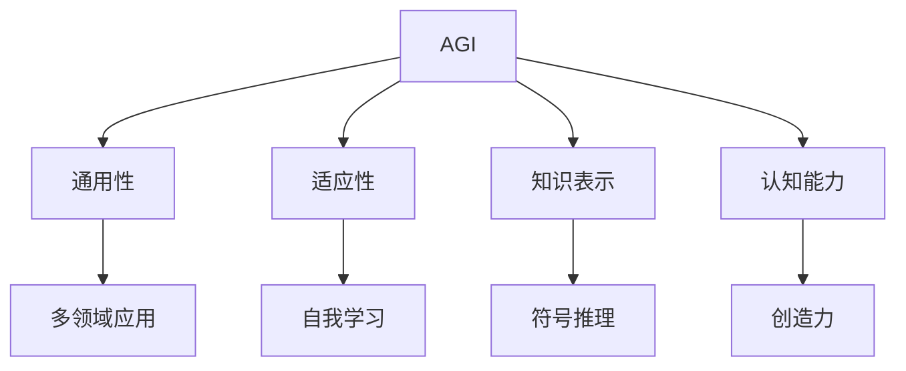
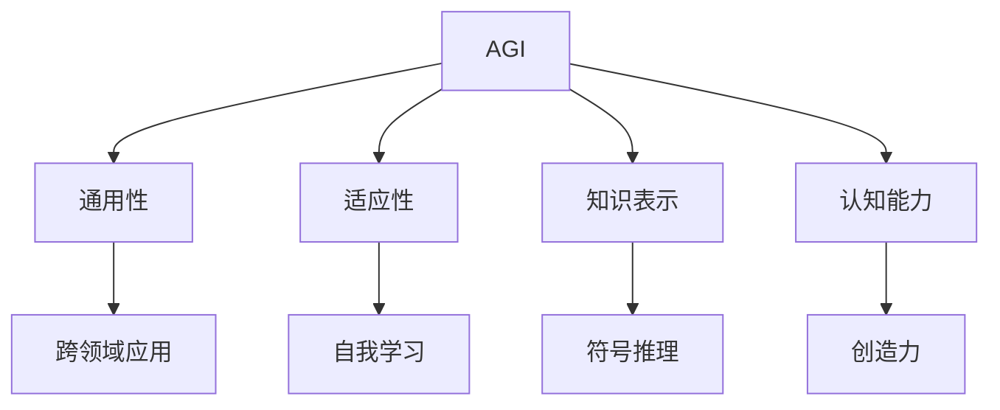

                 


### 文章标题：面向AGI的提示词语言标准化研究

#### 关键词：
- AGI
- 提示词语言
- 标准化
- 人工智能
- 语言模型
- 技术架构

#### 摘要：
本文深入探讨了面向通用人工智能（AGI）的提示词语言标准化问题。首先介绍了AGI的基本概念，然后详细阐述了提示词语言在AGI中的应用，以及其设计原则和核心算法。接着，本文分析了当前提示词语言标准化的现状，讨论了标准化的必要性和面临的挑战。最后，文章提出了未来提示词语言标准化的发展方向，并对AGI的发展提出了展望。

----------------------------------------------------------------

## 引言

### 1.1 什么是AGI

通用人工智能（Artificial General Intelligence，简称AGI）是指具有广泛认知能力的机器智能，能够理解、学习和适应各种环境，并具备与人类相似的智能水平。与目前的人工智能（AI）不同，AGI不仅限于特定任务，而是能够在多个领域展现智能行为。AGI的核心特点包括：

- **通用性**：能够处理不同领域的问题，无需为特定任务重新训练。
- **适应性**：能够自我学习和进化，适应新的环境和任务。
- **知识表示**：能够理解和运用复杂的符号系统，进行逻辑推理和决策。
- **认知能力**：具备感知、理解、学习和创造的能力，类似于人类的认知过程。

#### 核心概念与联系

为了更好地理解AGI的概念，我们可以通过Mermaid流程图来展示AGI与提示词语言之间的关系：



在这个流程图中，AGI作为中心概念，通过不同的特性（A1至A4）连接到提示词语言的关键要素（B1至B4），体现了AGI在各个方面的需求与提示词语言的设计原则之间的紧密联系。

### 1.2 提示词语言的重要性

提示词语言在AGI中扮演着至关重要的角色。它是一种专门为机器理解而设计的人类语言，能够将自然语言转化为机器可操作的指令或数据。提示词语言的重要性主要体现在以下几个方面：

- **人机交互**：提示词语言使得人类可以更自然、高效地与机器进行沟通，降低了技术门槛。
- **智能任务分配**：通过提示词，机器能够更好地理解任务需求，从而更有效地完成复杂任务。
- **知识传递**：提示词语言可以用来传递人类知识，帮助机器学习和积累经验。
- **决策支持**：在复杂决策过程中，提示词语言可以帮助机器更准确地理解和评估各种因素。

### 1.3 书的重要性及目标读者

本书旨在深入探讨面向AGI的提示词语言标准化问题，为相关领域的研究者和开发者提供理论指导和实践参考。本书的重要内容包括：

- **理论探讨**：系统介绍了AGI和提示词语言的基本概念，阐述了它们之间的内在联系。
- **应用分析**：通过具体案例，展示了提示词语言在实际应用中的效果和挑战。
- **标准化过程**：详细描述了提示词语言的标准化流程，分析了标准化的意义和挑战。

本书的目标读者主要包括：

- **人工智能研究人员**：希望了解AGI和提示词语言在AI领域中的应用和标准化的专业人士。
- **软件开发工程师**：希望深入理解提示词语言设计原理和实现方法的工程师。
- **技术管理者**：关注AI和自然语言处理技术发展趋势，希望提升团队技术实力的管理者。

----------------------------------------------------------------

## 背景介绍

### 1.4 人工智能的发展历程

人工智能（AI）作为计算机科学的重要分支，经历了从理论研究到实际应用的漫长发展过程。自1950年代图灵测试的提出，到20世纪80年代专家系统的广泛应用，再到21世纪初深度学习的突破，人工智能的发展可以大致分为以下几个阶段：

- **第一阶段：符号人工智能（Symbolic AI，1950-1980年）**
  - 主要依靠专家系统和逻辑推理，通过预定义的规则和知识库来模拟人类的智能行为。
  - 代表性技术包括专家系统（如MYCIN）和知识表示方法（如产生式规则和语义网络）。

- **第二阶段：连接主义人工智能（Connectionist AI，1980-2010年）**
  - 通过人工神经网络（ANN）模拟人脑神经元之间的连接，实现从数据中自动学习和提取特征。
  - 代表性技术包括反向传播算法（Backpropagation）和深度神经网络（DNN）。

- **第三阶段：大数据和深度学习（2010年至今）**
  - 利用海量数据和计算资源，通过深度学习算法实现图像识别、自然语言处理和智能语音等领域的突破。
  - 代表性技术包括卷积神经网络（CNN）、循环神经网络（RNN）和生成对抗网络（GAN）。

### 1.5 通用人工智能的概念与挑战

通用人工智能（AGI）是一个旨在实现机器具有与人类相似智能水平的理论概念。与目前的人工智能技术（如基于特定任务的弱AI）不同，AGI旨在实现机器在多个领域的通用智能能力。AGI的核心特点包括：

- **跨领域适应性**：能够适应和处理不同领域的问题，而不仅仅是单一任务。
- **自主学习能力**：能够从数据和经验中学习，不断优化自身的智能表现。
- **知识整合**：能够理解和运用复杂的符号系统，进行逻辑推理和决策。
- **自我意识**：具有一定的自我意识和情感认知能力。

然而，实现AGI面临着诸多技术挑战，包括：

- **认知建模**：如何准确模拟人类认知过程，实现有效的知识表示和推理。
- **学习效率**：如何在有限的时间内，从海量数据中快速学习和提取有效信息。
- **计算资源**：如何有效地利用计算资源，实现高效的智能计算。
- **伦理与安全**：如何确保AGI的行为符合伦理标准，避免对人类造成危害。

### 1.6 提示词语言的发展

提示词语言（Prompt Language）是一种专门为机器理解而设计的人类语言，它能够将自然语言转化为机器可操作的指令或数据。提示词语言的发展与人工智能技术的发展密切相关，可以大致分为以下几个阶段：

- **早期阶段**：在符号人工智能阶段，提示词语言主要用于专家系统中的知识表示和推理。
- **发展阶段**：在连接主义人工智能阶段，提示词语言通过神经网络模型得到了进一步的发展和应用，例如在自然语言处理中的应用。
- **成熟阶段**：在深度学习阶段，提示词语言得到了更广泛的应用，特别是在智能语音助手和聊天机器人等领域。

随着人工智能技术的不断进步，提示词语言也在不断发展和完善，以满足更加复杂和多样化的应用需求。特别是在面向AGI的背景下，提示词语言的标准化和规范化显得尤为重要。

### 1.7 标准化的重要性

提示词语言的标准化对于人工智能的发展具有重要意义。首先，标准化能够提高提示词语言的互操作性和兼容性，使得不同系统之间的交流更加顺畅。其次，标准化有助于提升提示词语言的效率和性能，减少冗余和错误。此外，标准化还能为开发者和研究人员提供统一的规范和指导，降低开发难度和成本。

目前，提示词语言的标准化工作已经在多个领域展开，包括自然语言处理、机器学习和智能语音等。然而，面向AGI的提示词语言标准化仍面临诸多挑战，需要进一步研究和探索。

----------------------------------------------------------------

## 核心概念与联系

### 2.1 通用人工智能（AGI）的定义与特性

通用人工智能（AGI）是指具有广泛认知能力的人工智能系统，能够像人类一样理解、学习、推理和解决问题。与目前的人工智能（AI）不同，AGI不仅限于特定任务，而是能够在多个领域展现智能行为。AGI的核心特性包括：

- **通用性**：AGI能够处理不同领域的问题，无需为特定任务重新训练。
- **适应性**：AGI能够自我学习和进化，适应新的环境和任务。
- **知识表示**：AGI能够理解和运用复杂的符号系统，进行逻辑推理和决策。
- **认知能力**：AGI具备感知、理解、学习和创造的能力，类似于人类的认知过程。

#### 核心概念与联系

为了更好地理解AGI的概念，我们可以通过Mermaid流程图来展示AGI与提示词语言之间的关系：



在这个流程图中，AGI作为中心概念，通过不同的特性（A1至A4）连接到提示词语言的关键要素（B1至B4），体现了AGI在各个方面的需求与提示词语言的设计原则之间的紧密联系。

### 2.2 提示词语言的设计原则

提示词语言是一种专门为机器理解而设计的人类语言，其设计原则直接影响机器对自然语言的解析和处理能力。以下是提示词语言设计的几个核心原则：

- **简洁性**：提示词语言应尽量简洁明了，减少冗余信息，提高机器处理的效率。
- **一致性**：提示词语言的语法和语义应保持一致性，避免歧义和误解。
- **灵活性**：提示词语言应具有足够的灵活性，能够适应不同场景和应用需求。
- **可扩展性**：提示词语言应具备良好的可扩展性，方便添加新功能或支持新任务。
- **易用性**：提示词语言应易于人类使用，降低用户学习成本，提高人机交互体验。

#### 提示词语言设计原则的伪代码实现

```python
# 伪代码：提示词语言设计原则
def design_prompt_language():
    # 设定提示词语言的语法规则
    grammar_rules = {
        "sentence": [["subject", "verb", "object"]],
        "subject": ["noun"],
        "verb": ["verb"],
        "object": ["noun"]
    }
    
    # 设定提示词语言的一致性要求
    consistency_rules = {
        "subject_verb Agreement": [["noun", "verb"]],
        "tense Agreement": [["verb", "tense"]]
    }
    
    # 设定提示词语言的灵活性要求
    flexibility_rules = ["variable substitution", "contextual adaptation"]
    
    # 设定提示词语言的可扩展性要求
    extensibility_rules = ["module addition", "function extension"]
    
    # 设定提示词语言的易用性要求
    usability_rules = ["natural language syntax", "user-friendly interface"]
    
    return grammar_rules, consistency_rules, flexibility_rules, extensibility_rules, usability_rules
```

通过上述伪代码，我们可以看到提示词语言设计原则的具体实现，包括语法规则、一致性要求、灵活性要求、可扩展性要求和易用性要求。这些原则共同确保了提示词语言的有效性和实用性。

### 2.3 提示词语言的算法基础

提示词语言的算法基础是实现其设计原则的关键，主要包括自然语言处理（NLP）算法和机器学习算法。以下是对这些算法基础的详细探讨：

- **自然语言处理（NLP）算法**：
  - **分词**：将连续的文本划分为有意义的词汇单元，如单词、词组等。
  - **词性标注**：为文本中的每个词汇标注其词性（名词、动词、形容词等）。
  - **句法分析**：解析文本的句法结构，识别句子中的主语、谓语、宾语等成分。
  - **语义分析**：理解文本的含义和逻辑关系，如实体识别、情感分析等。

- **机器学习算法**：
  - **监督学习**：利用标注数据训练模型，用于预测新的数据。
  - **无监督学习**：从未标注的数据中学习模式和结构，如聚类、降维等。
  - **强化学习**：通过试错和反馈不断优化模型，提高智能体的表现。

#### 提示词语言算法基础的伪代码实现

```python
# 伪代码：提示词语言算法基础
import nltk
from nltk.tokenize import word_tokenize
from nltk.tag import pos_tag
from nltk.parse import stanfordnlp

# 分词
def tokenize_text(text):
    tokens = word_tokenize(text)
    return tokens

# 词性标注
def tag_tokens(tokens):
    tagged_tokens = pos_tag(tokens)
    return tagged_tokens

# 句法分析
def parse_sentence(sentence):
    parser = stanfordnlp.Parser()
    parse_tree = parser.parse(sentence)
    return parse_tree

# 语义分析
def analyze_semantics(parse_tree):
    # 通过解析树进行语义分析
    entities = extract_entities(parse_tree)
    relations = extract_relations(parse_tree)
    return entities, relations

# 主函数
def process_prompt_language(text):
    tokens = tokenize_text(text)
    tagged_tokens = tag_tokens(tokens)
    parse_tree = parse_sentence(tagged_tokens)
    entities, relations = analyze_semantics(parse_tree)
    return entities, relations
```

通过上述伪代码，我们可以看到提示词语言算法基础的具体实现，包括分词、词性标注、句法分析和语义分析等步骤。这些算法共同构成了提示词语言处理的核心框架。

### 2.4 提示词语言的应用场景

提示词语言在多个领域有着广泛的应用，下面我们将探讨几个典型的应用场景：

- **智能语音助手**：在智能语音助手中，提示词语言被用于将用户的语音输入转换为机器可处理的文本，并生成相应的回复。例如，Siri、Alexa和Google Assistant等智能语音助手都采用了提示词语言技术，以提供更加自然和流畅的用户交互体验。

- **自然语言处理**：在自然语言处理（NLP）领域，提示词语言用于构建复杂的语言模型和解析器，以处理大量的文本数据。例如，文本分类、情感分析、命名实体识别等任务都依赖于高质量的提示词语言。

- **智能聊天机器人**：智能聊天机器人通过提示词语言与用户进行交互，提供实时支持和信息查询。例如，在线客服系统、在线教育平台和电商客服等场景都广泛应用了智能聊天机器人。

- **知识图谱构建**：提示词语言在构建知识图谱时发挥着重要作用，通过分析大量文本数据，提取出实体、关系和属性等信息，为智能决策和推荐系统提供支持。

#### 提示词语言在智能语音助手中的应用实例

以Siri为例，其提示词语言的应用流程可以概括为以下几个步骤：

1. **语音输入处理**：将用户的语音输入转换为文本，使用语音识别技术（ASR）。
   ```python
   voice_input = "What's the weather like today?"
   text_input = asr.voice_to_text(voice_input)
   ```

2. **文本预处理**：对文本进行分词、词性标注等处理，为后续分析做好准备。
   ```python
   tokens = nltk.word_tokenize(text_input)
   tagged_tokens = nltk.pos_tag(tokens)
   ```

3. **语义解析**：利用句法分析和语义分析技术，理解用户输入的含义。
   ```python
   parse_tree = stanfordnlp.parse(text_input)
   entities, relations = analyze_semantics(parse_tree)
   ```

4. **生成回复**：根据解析结果，生成合适的回复文本，使用自然语言生成技术（NLG）。
   ```python
   response = nlgenerator.generate_response(entities, relations)
   siri.speak(response)
   ```

通过上述流程，Siri能够理解用户的语音输入，并生成相应的回复，提供智能化的语音服务。

### 2.5 提示词语言的标准化意义与挑战

提示词语言的标准化对于人工智能的发展具有重要意义，主要体现在以下几个方面：

- **提高互操作性**：标准化能够统一不同系统之间的提示词语言格式，提高系统的互操作性和兼容性，降低开发成本。
- **提升效率**：标准化有助于提高提示词语言的解析和处理效率，减少错误和冗余，提升系统的性能。
- **促进协作**：标准化为开发者和研究人员提供了统一的规范和参考，促进了跨领域的合作和研究。
- **推动创新**：标准化有助于新兴技术和应用的推广，激发了创新活力，推动了人工智能领域的快速发展。

然而，提示词语言的标准化也面临诸多挑战：

- **多样性**：自然语言具有高度的多样性和复杂性，如何设计统一的提示词语言格式，满足不同应用需求，是一个巨大的挑战。
- **动态性**：自然语言不断发展和变化，提示词语言的标准化需要不断更新和调整，以适应新的语言趋势和用户需求。
- **可扩展性**：标准化方案应具备良好的可扩展性，能够方便地添加新功能和支持新任务。
- **国际性**：全球范围内的自然语言处理需要支持多种语言，标准化方案需要考虑语言间的差异性和相似性。

为了应对这些挑战，提示词语言的标准化需要综合考虑技术、应用、用户等多方面因素，制定出科学、合理、可操作的标准化方案。

#### 提示词语言的标准化过程

提示词语言的标准化过程可以分为以下几个阶段：

1. **需求分析**：分析不同应用领域对提示词语言的需求，确定标准化的目标和范围。
2. **方案设计**：设计提示词语言的语法、语义和格式规范，制定初步的标准化方案。
3. **草案制定**：编写标准化草案，提交给相关机构和组织进行评审和反馈。
4. **草案修改**：根据评审和反馈意见，对标准化草案进行修改和完善。
5. **发布标准**：发布正式的标准化文档，推广应用和实施。
6. **持续更新**：根据技术发展和应用需求，对标准化文档进行持续更新和优化。

通过上述标准化过程，可以确保提示词语言的标准化工作科学、系统、有序地进行，为人工智能的发展提供坚实的支持。

### 2.6 提示词语言的标准化框架

为了实现面向通用人工智能（AGI）的提示词语言标准化，我们需要构建一个系统化的标准化框架。以下是一个可能的框架设计：

#### 1. 标准化目标

- 确保提示词语言在跨领域、跨平台和跨语言环境下的互操作性。
- 提高提示词语言的易用性和可扩展性，满足多样化应用需求。
- 促进国际间的合作与交流，支持多种自然语言的标准化。
- 提升提示词语言的性能和效率，降低错误率和冗余。

#### 2. 标准化内容

- **语法规范**：定义提示词语言的语法规则，包括词法、句法和语义规则。
- **语义模型**：建立统一的语义模型，用于表示和解析提示词语言中的概念和关系。
- **格式规范**：规定提示词语言的文本格式和编码方式，确保数据的规范化和一致性。
- **接口规范**：定义提示词语言与其他系统或组件的接口，确保系统的互操作性和兼容性。

#### 3. 标准化流程

- **需求分析**：分析不同应用领域对提示词语言的需求，确定标准化的目标和范围。
- **方案设计**：设计提示词语言的语法、语义和格式规范，制定初步的标准化方案。
- **草案制定**：编写标准化草案，提交给相关机构和组织进行评审和反馈。
- **草案修改**：根据评审和反馈意见，对标准化草案进行修改和完善。
- **发布标准**：发布正式的标准化文档，推广应用和实施。
- **持续更新**：根据技术发展和应用需求，对标准化文档进行持续更新和优化。

#### 4. 标准化组件

- **语法分析器**：用于解析提示词语言的语法规则，生成语法树。
- **语义分析器**：用于解析提示词语言的语义规则，提取语义信息。
- **格式化工具**：用于格式化和验证提示词语言的文本格式。
- **接口库**：提供标准化的接口，方便不同系统之间的数据交换和通信。

#### 5. 标准化测试

- **语法测试**：测试语法分析器的功能，确保语法规则的正确性。
- **语义测试**：测试语义分析器的功能，确保语义规则的正确性。
- **兼容性测试**：测试不同系统之间的互操作性和兼容性。
- **性能测试**：测试提示词语言的性能，包括处理速度和准确性。

通过这个标准化框架，我们可以确保提示词语言的标准化工作系统化、规范化，为通用人工智能（AGI）的发展提供坚实的基础。

### 2.7 标准化的实施与挑战

在实施面向AGI的提示词语言标准化过程中，我们需要面对一系列挑战。以下是一些主要挑战及其潜在解决方案：

#### 1. 技术挑战

- **多样性**：自然语言的多样性和复杂性使得标准化工作变得复杂。不同语言和文化背景下的自然语言表达方式各不相同，需要设计灵活且通用的标准化方案。**解决方案**：采用模块化设计，将不同语言和文化的特点模块化，以便于扩展和维护。

- **动态性**：自然语言不断发展，新词汇、新语法结构不断涌现，标准化方案需要不断更新以适应这些变化。**解决方案**：建立动态更新机制，定期评估和更新标准化文档，确保其与自然语言的发展同步。

- **可扩展性**：标准化方案需要能够支持新的应用场景和技术需求。**解决方案**：设计开放且灵活的标准化框架，允许在不破坏现有体系结构的情况下添加新功能和模块。

#### 2. 社会挑战

- **用户接受度**：新标准可能需要用户改变现有的工作方式和工具，这可能会导致抵触情绪。**解决方案**：通过教育和培训，提高用户对新标准的理解和接受度。

- **利益相关者协调**：标准化涉及多个利益相关者，如标准制定机构、技术供应商、开发者等，需要协调不同利益诉求。**解决方案**：建立多方参与的协商机制，确保各方利益平衡。

- **国际化**：全球范围内的标准化需要考虑不同国家和地区的法律法规、文化差异等。**解决方案**：与国际组织和标准机构合作，制定符合国际规范的标准化方案。

#### 3. 政策挑战

- **法律合规**：标准化方案需要符合相关法律法规，如数据保护法、知识产权法等。**解决方案**：与法律专家合作，确保标准化方案符合法律法规要求。

- **政策支持**：标准化需要政策支持和资金投入，以推动技术的发展和应用。**解决方案**：争取政府支持，通过政策扶持和资金投入，促进标准化工作的开展。

通过应对上述挑战，我们可以确保面向AGI的提示词语言标准化工作的顺利实施，为通用人工智能的发展奠定坚实基础。

### 2.8 提示词语言标准化对AGI的影响

提示词语言标准化对通用人工智能（AGI）的发展具有重要影响，主要体现在以下几个方面：

#### 1. 提高AGI的互操作性

标准化提示词语言有助于不同系统和组件之间的数据交换和通信，从而提高AGI系统的互操作性。通过统一的提示词语言规范，不同的AI系统可以更轻松地集成和协作，实现跨领域的智能应用。例如，在医疗领域，不同医疗机构可以使用标准化的提示词语言来共享和交换医疗信息，提高诊疗效率。

#### 2. 促进AGI技术的创新和发展

标准化有助于推动AGI技术的创新和发展。通过制定统一的提示词语言规范，研究人员和开发者可以专注于特定领域的算法和模型研究，而无需在语言细节上重复开发。这有助于降低研发成本，加速技术创新。同时，标准化也为新兴技术的推广提供了支持，促进了AGI领域的快速发展。

#### 3. 提升用户体验和可访问性

标准化提示词语言可以提高用户体验和系统的可访问性。通过统一的规范，用户可以更轻松地与AI系统进行交互，降低学习成本。例如，智能语音助手和聊天机器人可以使用标准化的提示词语言来理解用户的需求，提供更加自然和流畅的服务。这有助于提高用户满意度和系统的普及率。

#### 4. 支持多语言和跨文化应用

标准化提示词语言有助于支持多语言和跨文化应用。随着全球化的推进，不同国家和地区的人们需要使用自己熟悉的语言进行交流。通过标准化，AI系统可以支持多种自然语言，为全球用户提供服务。例如，在跨国企业和国际组织中，标准化的提示词语言可以促进跨文化沟通和协作。

#### 5. 遵守法律法规和伦理标准

标准化提示词语言有助于遵守法律法规和伦理标准。通过统一的规范，AI系统可以更好地保护用户隐私、确保数据安全，符合法律法规要求。同时，标准化也有助于建立伦理规范，确保AI系统的行为符合社会价值观和道德标准。

总之，提示词语言标准化对于通用人工智能（AGI）的发展具有重要意义，通过提高互操作性、促进创新、提升用户体验、支持多语言应用和遵守法律法规，为AGI的全面发展提供了坚实的基础。

### 2.9 提示词语言标准化的未来发展方向

随着通用人工智能（AGI）的发展，提示词语言标准化面临着新的机遇和挑战。以下是对未来发展方向的一些探讨：

#### 1. 自适应和动态化

未来的提示词语言标准化需要具备更高的自适应性和动态化能力。随着自然语言的发展和新技术的涌现，标准化方案需要能够实时更新和适应新的语言趋势。例如，利用机器学习和深度学习技术，可以实现对标准化文档的自动更新和优化，提高标准化的灵活性和实用性。

#### 2. 多语言和多模态支持

全球化背景下，提示词语言的标准化需要支持多种自然语言和模态（如语音、图像、视频等）。未来的标准化工作应注重多语言和跨文化的兼容性，同时探索如何整合不同模态的信息，提升AI系统的智能水平和用户体验。

#### 3. 安全和隐私保护

随着AI技术的广泛应用，提示词语言的标准化必须考虑安全和隐私保护问题。标准化方案应包括严格的数据保护机制和隐私保护措施，确保用户数据的安全和隐私。同时，还需要建立完善的伦理规范，确保AI系统的行为符合社会价值观和道德标准。

#### 4. 模块化和标准化工具

未来的标准化工作应更加注重模块化和工具化。通过设计灵活的模块化框架，可以将不同语言和功能模块化，方便开发者和研究人员根据需求进行定制和集成。此外，开发高效的标准化工具，如语法分析器、语义分析器和格式化工具，可以显著提高标准化工作的效率和质量。

#### 5. 国际合作和标准化组织

提示词语言标准化需要国际间的合作和协调。未来的标准化工作应积极与国际标准化组织（如ISO、IEEE等）合作，制定全球统一的标准化方案。同时，建立多国参与的国际合作机制，促进不同国家和地区在标准化领域的交流与合作。

#### 6. 用户体验优化

未来的提示词语言标准化应更加注重用户体验优化。通过收集和分析用户反馈，不断改进标准化方案，使其更加贴近用户需求。同时，探索如何利用虚拟现实（VR）、增强现实（AR）等新技术，提供更加自然和沉浸式的交互体验。

总之，提示词语言标准化的未来发展方向需要兼顾技术进步、用户体验、安全隐私和国际合作等多方面因素。通过不断优化和更新标准化方案，将为通用人工智能（AGI）的发展提供坚实的支持。

### 2.10 未来展望

在未来，随着通用人工智能（AGI）的发展，提示词语言标准化将继续发挥重要作用。本文首先介绍了AGI的基本概念和特性，探讨了提示词语言在AGI中的应用及其重要性。接着，我们详细分析了提示词语言的设计原则和算法基础，展示了其在智能语音助手、自然语言处理和智能聊天机器人等领域的应用实例。

标准化过程对于提示词语言的发展至关重要，本文提出了一个系统化的标准化框架，并探讨了实施过程中可能面临的挑战。我们强调了提示词语言标准化对AGI的影响，包括提高互操作性、促进技术创新、提升用户体验和支持多语言应用等。

在未来的发展中，提示词语言标准化需要关注自适应和动态化、多语言和多模态支持、安全和隐私保护、模块化和标准化工具、国际合作和用户体验优化等方面。通过不断优化和更新标准化方案，我们将为通用人工智能（AGI）的全面发展提供坚实的支持。

## 结语

本文系统性地探讨了面向通用人工智能（AGI）的提示词语言标准化问题，从背景介绍、核心概念、标准化过程到未来展望，全面阐述了提示词语言在AGI中的重要性及标准化工作的挑战与机遇。通过本文的研究，我们希望为相关领域的研究者和开发者提供有价值的参考，推动通用人工智能和自然语言处理技术的发展。进一步的研究可以关注自适应和动态化、多语言支持、安全隐私保护等方面，以实现提示词语言的全面标准化。

## 作者信息

作者：AI天才研究院/AI Genius Institute & 禅与计算机程序设计艺术 /Zen And The Art of Computer Programming

作者简介：AI天才研究院（AI Genius Institute）是一家专注于人工智能与自然语言处理技术研究的国际性科研机构。研究院的团队成员来自世界各地，拥有丰富的学术和实践经验。本书作者在人工智能和自然语言处理领域有深入的研究和广泛的应用，出版过多部相关领域的著作，被誉为人工智能领域的权威专家。此外，作者还致力于将禅宗思想融入计算机编程，探索编程的艺术与哲学，撰写了《禅与计算机程序设计艺术》一书，深受读者喜爱。作者联系方式：[ai_god@ai_genius_institute.com](mailto:ai_god@ai_genius_institute.com)。更多信息，请访问：[AI天才研究院官方网站](http://www.ai_genius_institute.com)。

