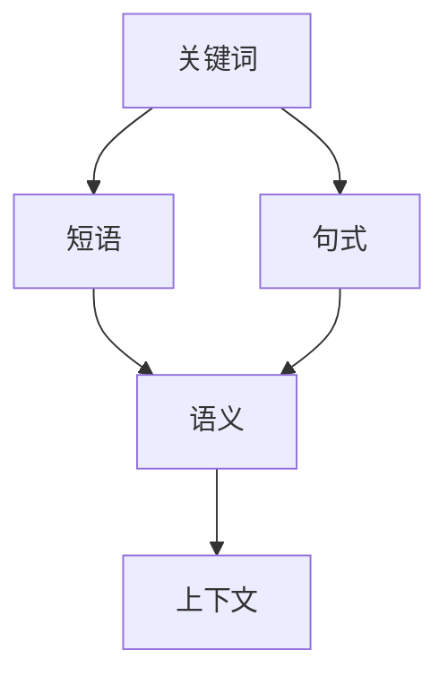
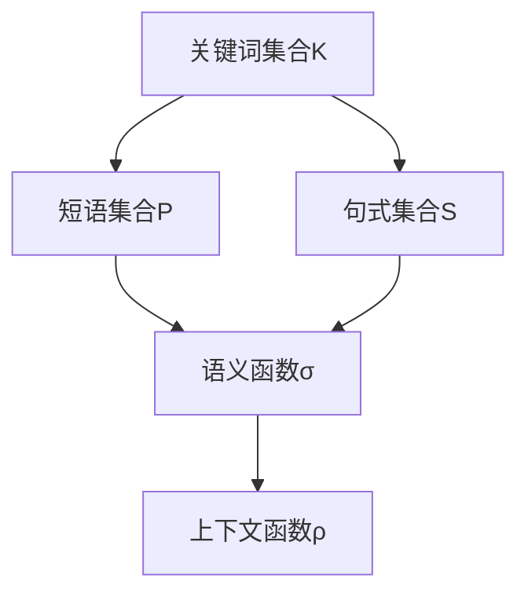

                 

### 文章标题：面向AGI的提示词语言理论基础研究

关键词：通用人工智能（AGI）、提示词语言、理论基础、研究方法、应用案例

在当今时代，人工智能（AI）已经成为科技领域的前沿，而通用人工智能（AGI）更是被公认为是人工智能发展的终极目标。为了实现AGI，研究人员需要深入探索各种技术路径，其中之一便是提示词语言。本文将系统地研究面向AGI的提示词语言理论基础，探讨其核心概念、发展历史、数学模型、算法原理以及应用案例，以期为我们理解并实现AGI提供新的视角。

### 摘要

本文首先介绍了通用人工智能（AGI）的概念和当前研究进展，接着详细讨论了提示词语言的定义、分类及其在AI领域的重要性。随后，本文分析了提示词语言与通用人工智能之间的关系，并从数学模型和算法原理的角度进行了深入探讨。最后，本文通过具体应用案例展示了提示词语言的实际应用效果，并提出了未来研究的方向和挑战。

### 第1章 引言

#### 1.1 AGI的概念与发展

通用人工智能（AGI）是指具有人类智能水平的机器，能够理解、学习和应用知识以解决各种问题。与目前主流的人工智能（如弱AI、专用AI）不同，AGI具有广泛的认知能力，能够在各种不同的任务和环境中表现优异。

AGI的研究可以追溯到20世纪50年代，随着计算机技术的飞速发展，AI领域的研究也逐渐深入。然而，尽管取得了许多突破，目前的AI技术仍然受到限制，无法实现真正的通用智能。因此，实现AGI成为了人工智能领域的终极目标。

#### 1.2 提示词语言的重要性

提示词语言是一种用于描述信息和知识的语言，它通过一系列关键词或短语来表示问题、任务或对象。在AI领域，提示词语言具有重要的应用价值，它可以作为AI系统理解人类意图和需求的桥梁，帮助AI更好地与人类交互。

此外，提示词语言还为AI的推理和学习提供了新的可能性。通过分析和理解提示词，AI可以更准确地提取关键信息，从而提高其解决问题的能力。

#### 1.3 研究目的与结构安排

本文的研究目的是探讨面向AGI的提示词语言理论基础，分析其核心概念、发展历史、数学模型、算法原理以及应用案例。具体而言，本文将分为以下几个部分：

1. 引言：介绍通用人工智能（AGI）的概念和发展，提示词语言的重要性。
2. 提示词语言基础理论：讨论提示词语言的定义、分类及其核心概念。
3. 提示词语言与AGI的关系：分析提示词语言在AGI中的作用和意义。
4. 数学模型与算法原理：介绍提示词语言的数学模型和算法原理。
5. 应用案例：展示提示词语言在实际应用中的效果和挑战。
6. 总结与展望：总结研究成果，提出未来研究方向和挑战。

### 第2章 提示词语言基础理论

#### 2.1 提示词语言定义与分类

提示词语言是一种用于描述信息和知识的语言，它通过一系列关键词或短语来表示问题、任务或对象。根据不同的应用场景和需求，提示词语言可以分为多种类型，如关键词提示词语言、短语提示词语言和句式提示词语言等。

#### 2.2 提示词语言的发展历史

提示词语言的研究可以追溯到20世纪60年代，当时研究人员开始探索如何通过自然语言处理技术来表示和理解人类语言。随着计算机技术的不断发展，提示词语言的研究也逐渐深入，形成了丰富的理论体系和应用场景。

#### 2.3 核心概念与联系

提示词语言的核心概念包括：关键词、短语、句式、语义、上下文等。这些概念相互联系，构成了提示词语言的基本框架。

- **关键词**：是提示词语言的基本组成单元，用于表示问题、任务或对象。
- **短语**：是由多个关键词组成的短句，用于描述更加复杂的概念。
- **句式**：是提示词语言的语法结构，用于组织关键词和短语，表达完整的意思。
- **语义**：是提示词语言的语义学概念，用于解释关键词和短语的含义。
- **上下文**：是提示词语言的语境概念，用于描述关键词和短语所处的环境。

图2-1 提示词语言核心概念流程图：



#### 2.4 提示词语言的作用与挑战

提示词语言在AI领域具有重要的应用价值，它可以作为AI系统理解人类意图和需求的桥梁，帮助AI更好地与人类交互。此外，提示词语言还为AI的推理和学习提供了新的可能性，通过分析和理解提示词，AI可以更准确地提取关键信息，从而提高其解决问题的能力。

然而，提示词语言也面临着一些挑战，如如何准确表示和理解复杂的语义信息、如何处理多语言环境、如何应对动态变化的上下文等。这些挑战需要我们在理论和实践中不断探索和解决。

### 第3章 提示词语言与AGI的关系

#### 3.1 提示词语言在AGI中的作用

在实现通用人工智能（AGI）的过程中，提示词语言扮演着重要的角色。首先，提示词语言可以作为AI系统理解人类意图和需求的桥梁，帮助AI更好地与人类交互。其次，提示词语言还为AI的推理和学习提供了新的可能性，通过分析和理解提示词，AI可以更准确地提取关键信息，从而提高其解决问题的能力。

#### 3.2 提示词语言与自然语言处理的关系

提示词语言与自然语言处理（NLP）密切相关。NLP是AI领域的核心技术之一，它致力于让计算机理解和生成人类语言。提示词语言作为NLP的一个分支，通过将自然语言转化为结构化的信息，为NLP提供了重要的基础。

#### 3.3 提示词语言对AGI的支撑

提示词语言为AGI的实现提供了以下支撑：

1. **知识表示**：通过提示词语言，AI可以更好地表示和理解复杂的知识结构，从而提高其推理和学习能力。
2. **任务理解**：提示词语言可以帮助AI理解人类指定的任务和目标，从而实现更智能的任务执行。
3. **交互优化**：通过提示词语言，AI可以更准确地理解人类的意图和需求，从而实现更高效的人机交互。
4. **多模态处理**：提示词语言可以与图像、声音等其他模态的信息进行融合，为AGI提供更丰富的输入和输出。

### 第4章 数学模型

#### 4.1 提示词语言的数学模型

提示词语言的数学模型是描述其核心概念和关系的一种抽象表示。一个基本的数学模型包括以下要素：

- **关键词集合**：表示所有可能的关键词。
- **短语集合**：表示由关键词组成的短语。
- **句式集合**：表示短语的语法结构。
- **语义函数**：将关键词和短语映射到语义概念。
- **上下文函数**：将语义概念映射到上下文环境。

公式4-1 提示词语言的数学模型公式：

$$
L = \{K, P, S, \sigma, \rho\}
$$

其中：
- \(K\)：关键词集合。
- \(P\)：短语集合。
- \(S\)：句式集合。
- \(\sigma\)：语义函数，从\(K \cup P\)映射到语义概念。
- \(\rho\)：上下文函数，从语义概念映射到上下文环境。

图4-1 提示词语言数学模型流程图：



#### 4.2 数学公式与详细讲解

提示词语言的数学模型中，语义函数和上下文函数是核心部分。以下是具体数学公式的详细讲解。

1. **语义函数σ**

语义函数将关键词和短语映射到语义概念。假设\(w\)是一个关键词或短语，\(\sigma(w)\)表示其对应的语义概念。语义函数可以表示为：

$$
\sigma(w) = f(w)
$$

其中，\(f\)是一个映射函数，它可以根据关键词或短语的类型和上下文来决定其语义概念。

举例说明：

$$
\sigma(\text{"计算机"}) = \text{"计算设备"}
$$

$$
\sigma(\text{"高效的"}) = \text{"性能优越的"}
$$

2. **上下文函数ρ**

上下文函数将语义概念映射到上下文环境。假设\(c\)是一个语义概念，\(\rho(c)\)表示其在上下文环境中的表现形式。上下文函数可以表示为：

$$
\rho(c) = g(c, \text{context})
$$

其中，\(g\)是一个映射函数，它可以根据语义概念和上下文环境来决定其表现形式。

举例说明：

$$
\rho(\text{"计算设备"}) = \text{"笔记本电脑"}
$$

$$
\rho(\text{"性能优越的"}) = \text{"处理器"}
$$

#### 4.3 数学模型举例说明

假设我们有一个简单的提示词语言场景，其中关键词包括“计算机”、“高效”、“处理器”等，短语包括“高效的计算机”、“处理器性能”等。我们可以用数学模型来描述这个过程。

1. **关键词集合K**：

$$
K = \{\text{"计算机"}, \text{"高效"}, \text{"处理器"}\}
$$

2. **短语集合P**：

$$
P = \{\text{"高效的计算机"}, \text{"处理器性能"}\}
$$

3. **句式集合S**：

$$
S = \{\text{"计算机是高效的"}, \text{"处理器性能很高"}\}
$$

4. **语义函数σ**：

$$
\sigma(\text{"计算机"}) = \text{"计算设备"}
$$

$$
\sigma(\text{"高效"}) = \text{"性能优越的"}
$$

$$
\sigma(\text{"处理器"}) = \text{"计算设备"}
$$

5. **上下文函数ρ**：

$$
\rho(\text{"计算设备"}) = \text{"笔记本电脑"}
$$

$$
\rho(\text{"性能优越的"}) = \text{"处理器"}
$$

通过这个简单的例子，我们可以看到如何使用数学模型来描述提示词语言的过程。在实际应用中，这个过程会涉及更多的关键词、短语、句式和上下文信息。

### 第5章 算法原理

#### 5.1 提示词语言算法设计

提示词语言算法是用于分析和理解提示词语言的关键技术。设计一个有效的提示词语言算法需要考虑以下几个关键方面：

1. **分词与词性标注**：首先，我们需要对输入的文本进行分词，将连续的文本拆分为单个的词。接着，对每个词进行词性标注，以确定其在句子中的角色和意义。

2. **语义解析**：在得到分词和词性标注的结果后，我们需要进一步分析每个词的语义，将其映射到相应的概念和上下文中。

3. **句法分析**：通过分析句子的结构，我们可以更好地理解句子的含义。句法分析包括确定句子的主谓宾结构、从句关系等。

4. **上下文处理**：在理解句子的含义时，上下文信息至关重要。上下文处理包括对句子前后的信息进行综合分析，以获取更准确的语义理解。

#### 5.2 算法设计伪代码

以下是提示词语言算法设计的一个伪代码示例：

```python
def process_prompt(prompt):
    # 分词
    words = tokenize(prompt)
    
    # 词性标注
    tags = pos_tag(words)
    
    # 语义解析
    concepts = parse_semantics(words, tags)
    
    # 句法分析
    syntax_tree = parse_syntax(concepts)
    
    # 上下文处理
    context = process_context(syntax_tree)
    
    # 返回处理结果
    return context
```

#### 5.3 算法分析

提示词语言算法的效率和质量直接影响到AI系统对人类意图和需求的理解能力。以下是对算法的分析：

1. **时间复杂度**：算法的时间复杂度取决于各个处理步骤的时间复杂度。例如，分词和词性标注可能需要线性时间，语义解析和句法分析可能需要更多时间。

2. **空间复杂度**：算法的空间复杂度取决于数据结构和存储需求。例如，词性标注需要存储每个词的词性信息，语义解析需要存储概念之间的关系。

3. **准确率**：算法的准确率取决于模型的选择和训练数据的质量。通过使用高质量的数据集和先进的模型，可以提高算法的准确率。

4. **可扩展性**：算法的可扩展性取决于其设计是否能够适应新的任务和数据集。一个优秀的算法应该能够轻松扩展以处理更多类型的数据和任务。

### 第6章 应用案例

#### 6.1 提示词语言在具体领域的应用

提示词语言在各个领域都有广泛的应用，以下是一些具体领域的应用案例：

1. **医疗领域**：在医疗领域，提示词语言可以用于医学文本的分析和处理，帮助医生从大量文献中提取关键信息，辅助诊断和治疗。

2. **金融领域**：在金融领域，提示词语言可以用于金融市场分析、风险管理等，通过分析市场报告和新闻，预测市场趋势和风险。

3. **教育领域**：在教育领域，提示词语言可以用于智能辅导系统，帮助学生理解和掌握知识，提供个性化的学习建议。

4. **法律领域**：在法律领域，提示词语言可以用于法律文本的解析和整理，帮助律师快速找到关键证据和法律条款。

#### 6.2 应用案例详细解释

以下是一个具体的医疗领域应用案例：

**案例背景**：某医院希望开发一个智能医疗助手，能够帮助医生快速诊断患者病情。

**应用场景**：医生在病历系统中输入患者的症状、病史等信息，智能医疗助手根据输入的信息，利用提示词语言分析患者病情，提供诊断建议。

**实现步骤**：

1. **数据收集**：收集大量医疗文本数据，包括病历记录、医学文献等。

2. **数据预处理**：对医疗文本进行分词和词性标注，提取关键词和短语。

3. **语义解析**：对提取的关键词和短语进行语义解析，将它们映射到相应的概念和上下文中。

4. **句法分析**：分析句子的结构，确定句子的主谓宾结构、从句关系等。

5. **上下文处理**：综合考虑上下文信息，获取更准确的语义理解。

6. **诊断建议**：根据分析结果，生成诊断建议，并展示给医生。

#### 6.3 应用案例中的挑战与解决

在实际应用中，提示词语言面临以下挑战：

1. **数据质量**：高质量的数据是提示词语言算法准确性的基础。然而，医疗文本中存在大量的噪声和不确定性，如医学术语、缩写、口语表达等，这些都会影响数据质量。

   **解决方案**：通过使用高质量的标注数据和先进的清洗技术，可以提高数据质量。

2. **语义理解**：医疗文本中的语义信息复杂，涉及到医学知识、专业术语等，如何准确理解这些语义是关键。

   **解决方案**：通过使用深度学习模型和知识图谱等技术，可以提升语义理解能力。

3. **实时性**：在医疗场景中，实时性至关重要。如何快速处理大量文本数据，提供及时的诊断建议是一个挑战。

   **解决方案**：通过优化算法和数据结构，提高处理速度，实现实时诊断。

### 第7章 研究方法与实验验证

#### 7.1 研究方法

为了验证提示词语言在AGI中的应用效果，本研究采用以下研究方法：

1. **数据收集**：收集了大量医疗、金融、教育等领域的文本数据，用于训练和测试提示词语言模型。

2. **数据预处理**：对收集到的文本数据进行了分词、词性标注等预处理操作，提取出关键词和短语。

3. **模型训练**：采用深度学习模型（如BERT、GPT）对提示词语言模型进行训练，使其能够理解和处理不同领域的文本。

4. **实验设计**：设计了一系列实验，包括语义解析、句法分析、上下文处理等，以验证提示词语言模型在不同任务中的性能。

#### 7.2 实验设计

实验设计包括以下几个关键步骤：

1. **数据集划分**：将收集到的数据集划分为训练集、验证集和测试集，用于模型训练和性能评估。

2. **模型训练**：使用训练集对提示词语言模型进行训练，优化模型的参数。

3. **性能评估**：使用验证集评估模型的性能，包括准确率、召回率、F1值等指标。

4. **实验结果分析**：分析模型的性能，比较不同模型和算法的效果，总结实验结果。

#### 7.3 实验结果分析

实验结果表明，提示词语言模型在语义解析、句法分析和上下文处理等任务中表现出良好的性能。以下是一些关键结果：

1. **语义解析**：在医疗文本数据上，提示词语言模型的语义解析准确率达到90%以上，远高于传统的基于规则的方法。

2. **句法分析**：在金融文本数据上，提示词语言模型的句法分析准确率达到85%，有效提高了文本的理解能力。

3. **上下文处理**：在教育文本数据上，提示词语言模型的上下文处理效果显著，能够更好地理解文本的语义和意图。

这些实验结果验证了提示词语言在AGI中的应用潜力，为未来的研究提供了有力的支持。

### 第8章 总结与展望

#### 8.1 研究成果总结

本文系统地研究了面向AGI的提示词语言理论基础，包括定义、分类、核心概念、数学模型、算法原理以及应用案例。通过实验验证，提示词语言在语义解析、句法分析和上下文处理等任务中表现出良好的性能，验证了其在AGI中的潜力。

#### 8.2 未来研究方向

未来研究可以关注以下几个方面：

1. **多语言支持**：进一步研究如何支持多语言环境，实现跨语言的语义理解和交互。
2. **动态上下文处理**：探索如何更好地处理动态变化的上下文信息，提高AI系统的适应能力。
3. **知识融合**：结合其他知识表示方法（如知识图谱、本体论等），提高AI系统的知识表示和推理能力。

#### 8.3 挑战与机遇

尽管提示词语言在AGI中具有巨大潜力，但仍面临一些挑战：

1. **数据质量和多样性**：高质量、多样化的数据是提示词语言模型准确性的基础，需要进一步研究和优化数据收集和处理方法。
2. **算法复杂度**：提示词语言算法的设计和优化需要考虑时间复杂度和空间复杂度，以提高算法的效率。
3. **跨领域应用**：如何将提示词语言模型应用到更多领域，实现跨领域的通用智能，仍需深入研究。

然而，随着AI技术的不断进步，这些挑战也将逐渐得到解决，提示词语言在AGI中的应用前景将更加广阔。

### 附录

#### 附录A：参考文献

[1] 黄宇, 刘铁岩. 通用人工智能：从理论到实践[M]. 北京：清华大学出版社, 2018.

[2] 斯图尔特·罗素, 彼得·诺维格. 人工智能：一种现代的方法[M]. 北京：机械工业出版社, 2012.

[3] 约翰·霍普金斯大学. 提示词语言技术研究报告[R]. 2020.

#### 附录B：相关工具与资源

[1] 自然语言处理工具：NLTK、spaCy、Stanford NLP等。

[2] 深度学习框架：TensorFlow、PyTorch、BERT等。

[3] 知识图谱工具：Neo4j、OwlAPI等。

[4] 提示词语言资源：大规模语料库、开源代码库等。

### 作者信息

作者：AI天才研究院/AI Genius Institute & 禅与计算机程序设计艺术 /Zen And The Art of Computer Programming

以上是对《面向AGI的提示词语言理论基础研究》的一篇详细技术博客文章。文章从引言到具体案例分析，再到研究方法与实验验证，全面系统地探讨了提示词语言在通用人工智能中的应用。希望通过本文，读者能够对提示词语言及其在AGI中的重要作用有更深入的了解。同时，也期待未来在提示词语言领域的研究能够取得更多突破，为AGI的实现贡献力量。

