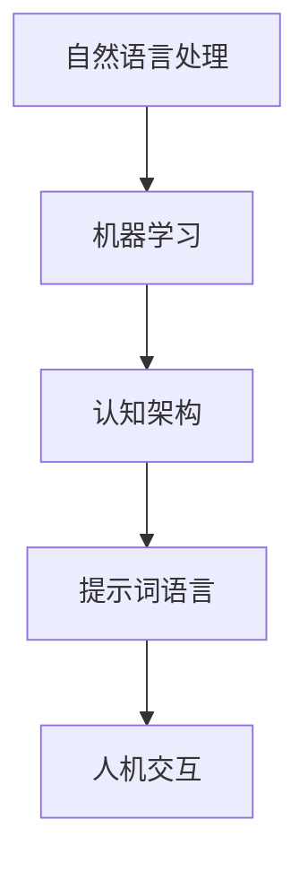

                 

### 文章标题

# 面向AGI的提示词语言认知架构研究

### 关键词

- AGI（通用人工智能）
- 提示词语言
- 认知架构
- 自然语言处理
- 机器学习
- 数学模型

### 摘要

本文旨在深入探讨面向通用人工智能（AGI）的提示词语言认知架构，分析其核心概念与联系，阐述关键算法原理，并通过数学模型和具体项目实战来展示其实际应用。文章首先介绍了AGI和提示词语言的基本概念，接着详细讨论了认知架构的设计与实现，以及自然语言处理和机器学习算法在其中的应用。最后，通过实际项目案例，展示了认知架构在现实场景中的效果与优化策略，为未来AGI的发展提供了宝贵的经验和启示。

----------------------------------------------------------------

### 引言

在人工智能领域，通用人工智能（Artificial General Intelligence，简称AGI）被视为最高目标。AGI是指一种能够执行任何智能任务的人工智能系统，其智能水平不亚于甚至超过人类。与传统的人工智能（如特定任务的机器学习模型）相比，AGI具有更强的自主性、适应性和创造力。然而，实现AGI面临着诸多挑战，其中之一便是如何构建一个有效的认知架构，以便让机器能够理解和处理自然语言。

提示词语言在AGI中扮演着关键角色。自然语言是人类沟通和思考的主要工具，因此，能够理解和生成自然语言的系统在AGI中具有重要的应用价值。提示词语言是一种特殊类型的语言模型，能够根据上下文生成相关的内容，从而在问答系统、自动写作、对话系统等领域发挥重要作用。

认知架构是AGI的核心，它负责处理和整合来自不同感知模块的信息，从而实现智能行为。一个高效的认知架构需要具备良好的语言理解能力和语言生成能力，同时还需要能够处理复杂的推理任务。本文将探讨如何设计一个面向AGI的提示词语言认知架构，并分析其核心概念与联系。

## 背景介绍

通用人工智能（AGI）的概念最早由约翰·冯·诺伊曼（John von Neumann）在20世纪40年代提出。他设想了一种能够进行逻辑推理、学习和决策的智能体，这种智能体在某种程度上能够模拟人类的思维过程。然而，由于技术的限制，冯·诺伊曼的设想在当时无法实现。

随着计算机技术的不断发展，人工智能领域取得了长足的进步。特别是在机器学习和深度学习领域，人工智能系统在图像识别、语音识别、自然语言处理等方面取得了显著的成果。然而，这些系统通常只能针对特定任务进行优化，无法实现通用性。例如，一个优秀的图像识别系统可能在处理医学影像时表现出色，但在处理自然语言问题时却无能为力。

为了解决这一问题，研究人员开始关注通用人工智能（AGI）。AGI的目标是开发一种能够执行任何智能任务的人工智能系统，其智能水平不亚于甚至超过人类。与目前的人工智能系统不同，AGI需要具备自主性、适应性和创造力，能够在不同领域和任务中灵活应用。

提示词语言作为一种自然语言处理技术，在AGI中具有重要作用。自然语言是人类沟通和思考的主要工具，因此，能够理解和生成自然语言的系统在AGI中具有重要的应用价值。提示词语言能够根据上下文生成相关的内容，从而在问答系统、自动写作、对话系统等领域发挥重要作用。

认知架构是AGI的核心，它负责处理和整合来自不同感知模块的信息，从而实现智能行为。一个高效的认知架构需要具备良好的语言理解能力和语言生成能力，同时还需要能够处理复杂的推理任务。本文将探讨如何设计一个面向AGI的提示词语言认知架构，并分析其核心概念与联系。

### 核心概念与联系

要设计一个面向AGI的提示词语言认知架构，首先需要明确其中的核心概念。这些核心概念包括但不限于：自然语言处理、机器学习、认知架构、提示词语言等。

**自然语言处理（NLP）** 是人工智能的一个重要分支，旨在使计算机能够理解、生成和回应自然语言。NLP的关键技术包括文本分类、实体识别、情感分析、机器翻译等。在AGI的提示词语言认知架构中，自然语言处理负责将输入的自然语言转换为机器可以理解的结构化数据。

**机器学习（ML）** 是实现NLP和认知架构的核心技术之一。机器学习通过从大量数据中学习模式和规律，从而改善系统的性能。在提示词语言认知架构中，机器学习用于训练语言模型，以便能够生成符合上下文要求的文本。

**认知架构** 是AGI的核心部分，它负责处理和整合来自不同感知模块的信息，从而实现智能行为。一个高效的认知架构需要具备良好的语言理解能力和语言生成能力，同时还需要能够处理复杂的推理任务。

**提示词语言** 是一种特殊类型的语言模型，它能够根据上下文生成相关的内容。提示词语言在问答系统、自动写作、对话系统等领域具有广泛的应用。在AGI的提示词语言认知架构中，提示词语言负责生成和回应自然语言，从而实现人机交互。

这些核心概念之间的联系构成了AGI提示词语言认知架构的框架。自然语言处理提供了理解和生成自然语言的能力，机器学习则通过数据驱动的方式优化语言模型的性能。认知架构则负责整合这些技术，实现智能行为。

为了更直观地展示这些核心概念之间的关系，我们可以使用Mermaid流程图来表示。



在这个流程图中，自然语言处理作为输入，通过机器学习优化语言模型的性能，最终通过认知架构实现人机交互。这个流程图清晰地展示了提示词语言认知架构的核心概念与联系，为后续章节的详细讨论提供了基础。

### 核心算法原理讲解

在面向AGI的提示词语言认知架构中，核心算法的原理至关重要。以下将详细讲解自然语言处理（NLP）和机器学习（ML）在认知架构中的应用，并使用伪代码和LaTeX数学公式来阐述这些算法的基本原理。

#### 自然语言处理（NLP）

自然语言处理是人工智能的基石，它涉及从文本中提取信息，并对文本进行语义理解和分析。以下是NLP中常用的几个核心算法：

**1. 词向量表示**

词向量是一种将自然语言中的单词映射到高维向量空间的方法。词向量的生成可以通过Word2Vec、GloVe等算法实现。

**Word2Vec算法伪代码：**

```python
function Word2Vec(train_data, embedding_size, window_size):
    # 初始化参数
    embedding_matrix = [random_vector(embedding_size) for _ in range(vocabulary_size)]
    for sentence in train_data:
        for word in sentence:
            context = get_context(word, window_size)
            for context_word in context:
                # 计算损失函数
                loss = compute_loss(embedding_matrix[word], embedding_matrix[context_word])
                # 更新嵌入矩阵
                update_embedding_matrix(embedding_matrix, word, context_word, learning_rate)
    return embedding_matrix
```

**2. 语言模型**

语言模型用于预测下一个单词的概率，常见的方法包括n-gram模型和神经网络语言模型。

**n-gram模型LaTeX数学公式：**

$$
P(w_{t} | w_{t-1}, w_{t-2}, ..., w_{1}) = \frac{C(w_{t-1}, w_{t-2}, ..., w_{1}, w_{t})}{C(w_{t-1}, w_{t-2}, ..., w_{1})}
$$

其中，$C(w_{t-1}, w_{t-2}, ..., w_{1}, w_{t})$表示单词序列$(w_{t-1}, w_{t-2}, ..., w_{1}, w_{t})$在训练数据中的出现次数，$C(w_{t-1}, w_{t-2}, ..., w_{1})$表示单词序列$(w_{t-1}, w_{t-2}, ..., w_{1})$在训练数据中的出现次数。

**3. 序列标注**

序列标注是一种对文本中的每个单词进行标签分配的任务，常用于命名实体识别、词性标注等。

**CRF（条件随机场）算法伪代码：**

```python
function CRF(V, Y, alpha, beta):
    for each sequence y' in Y:
        forward_score = forward(V, y')
        backward_score = backward(V, y')
        log_likelihood = forward_score + backward_score - alpha * sum(beta[i] for i in y')
        return -log_likelihood
```

#### 机器学习（ML）

机器学习在提示词语言认知架构中的应用主要体现在训练语言模型和优化算法上。

**1. 支持向量机（SVM）**

SVM是一种常用的分类算法，它通过找到最佳的超平面，将不同类别的数据分开。

**SVM算法LaTeX数学公式：**

$$
\max_{\mathbf{w}, b} \left\{ \frac{1}{2} ||\mathbf{w}||^2 : y(\mathbf{w} \cdot \mathbf{x} + b) \geq 1, \ \forall \mathbf{x} \in \mathcal{X} \right\}
$$

其中，$\mathbf{w}$是权重向量，$b$是偏置，$\mathcal{X}$是训练数据集。

**2. 神经网络**

神经网络是一种模拟人脑神经元连接结构的算法，它在处理复杂任务方面表现出色。

**多层感知机（MLP）算法伪代码：**

```python
function MLP(train_data, layers, learning_rate):
    # 初始化参数
    weights = [random_matrix(input_size, hidden_size) for _ in range(layers)]
    biases = [random_vector(hidden_size) for _ in range(layers)]
    for epoch in range(num_epochs):
        for x, y in train_data:
            # 前向传播
            hidden_layers = [x]
            for i in range(layers):
                z = activate(weights[i] * hidden_layers[i] + biases[i])
                hidden_layers.append(z)
            output = activate(weights[-1] * hidden_layers[-1] + biases[-1])
            # 反向传播
            d_output = compute_gradient(output, y)
            for i in range(layers-1, -1, -1):
                d_weights[i] = d_output * hidden_layers[i-1].T
                d_biases[i] = d_output
                d_output = d_output * activate_derivative(hidden_layers[i])
    return weights, biases
```

#### 认知架构中的算法实现

认知架构中的算法实现涉及将NLP和ML算法整合到一个统一的框架中，以便处理复杂的语言任务。以下是认知架构中的主要算法实现：

**1. 提示词语言生成**

提示词语言生成是认知架构中的核心算法，它负责根据上下文生成相关的内容。以下是提示词语言生成算法的伪代码：

```python
function generate_response(context, language_model):
    # 初始化状态
    state = initial_state
    response = ""
    for token in context:
        # 前向传播
        logits = language_model(token, state)
        # 获取下一个词
        next_token = sample(logits)
        # 更新状态
        state = next_token
        response += " " + next_token
    return response.strip()
```

**2. 推理与决策**

推理与决策是认知架构中另一个关键算法，它负责根据输入信息进行逻辑推理和决策。以下是推理与决策算法的伪代码：

```python
function reasoning(context, knowledge_base):
    # 初始化状态
    state = initial_state
    for token in context:
        # 查询知识库
        facts = knowledge_base.query(token)
        # 更新状态
        state = update_state(state, facts)
    # 基于状态进行决策
    action = decision_making(state)
    return action
```

通过这些算法，认知架构能够实现高效的提示词语言生成和推理决策，从而为AGI提供强大的语言处理能力。

### 数学模型和数学公式讲解

在面向AGI的提示词语言认知架构中，数学模型和公式起着至关重要的作用。这些数学工具不仅帮助我们理解算法的工作原理，还能够量化算法的性能，从而指导模型的优化。以下将详细介绍认知架构中的数学模型和公式，并给出具体的举例说明。

#### 语言模型中的数学模型

语言模型是认知架构的核心组成部分，用于预测文本中下一个单词的概率。在语言模型中，我们使用概率分布来表示每个单词的出现可能性。以下是一些常见的数学模型和公式：

**1. n-gram模型**

n-gram模型是一种基于统计的语言模型，它假设当前词的出现概率仅取决于前n-1个词。n-gram模型的数学公式如下：

$$
P(w_t | w_{t-1}, w_{t-2}, ..., w_{1}) = \frac{C(w_{t-1}, w_{t-2}, ..., w_{1}, w_{t})}{C(w_{t-1}, w_{t-2}, ..., w_{1})}
$$

其中，$C(w_{t-1}, w_{t-2}, ..., w_{1}, w_{t})$表示单词序列$(w_{t-1}, w_{t-2}, ..., w_{1}, w_{t})$在训练数据中的出现次数，$C(w_{t-1}, w_{t-2}, ..., w_{1})$表示单词序列$(w_{t-1}, w_{t-2}, ..., w_{1})$在训练数据中的出现次数。

**2. 变长短期记忆网络（LSTM）**

LSTM是一种强大的递归神经网络，它能够处理变长的序列数据。LSTM通过门控机制来控制信息的流动，从而有效避免梯度消失问题。LSTM的数学公式包括：

- **输入门：**

$$
i_t = \sigma(W_{ix}x_t + W_{ih}h_{t-1} + b_i)
$$

- **遗忘门：**

$$
f_t = \sigma(W_{fx}x_t + W_{fh}h_{t-1} + b_f)
$$

- **输出门：**

$$
o_t = \sigma(W_{ox}x_t + W_{oh}h_{t-1} + b_o)
$$

- **细胞状态更新：**

$$
c_t = f_t \odot c_{t-1} + i_t \odot \tanh(W_{cx}x_t + W_{ch}h_{t-1} + b_c)
$$

- **隐藏状态更新：**

$$
h_t = o_t \odot \tanh(c_t)
$$

其中，$x_t$是当前输入，$h_{t-1}$是前一个隐藏状态，$c_{t-1}$是前一个细胞状态，$i_t$、$f_t$、$o_t$分别是输入门、遗忘门和输出门的激活值，$W$和$b$分别是权重和偏置。

#### 机器学习中的数学模型

机器学习中的数学模型用于优化模型的参数，以最小化预测误差。以下是一些常见的数学模型和公式：

**1. 支持向量机（SVM）**

SVM是一种分类算法，它通过最大化分类边界来提高分类性能。SVM的数学公式如下：

$$
\max_{\mathbf{w}, b} \left\{ \frac{1}{2} ||\mathbf{w}||^2 : y(\mathbf{w} \cdot \mathbf{x} + b) \geq 1, \ \forall \mathbf{x} \in \mathcal{X} \right\}
$$

其中，$\mathbf{w}$是权重向量，$b$是偏置，$\mathcal{X}$是训练数据集。

**2. 神经网络**

神经网络是一种模拟人脑神经元连接结构的算法，它通过多层非线性变换来提取特征。神经网络中的激活函数和反向传播算法是核心部分。以下是神经网络的数学公式：

- **激活函数：**

$$
a_i = \sigma(z_i) = \frac{1}{1 + e^{-z_i}}
$$

- **前向传播：**

$$
z_i^{(l)} = \sum_{j} w_{ij}^{(l)} a_{j}^{(l-1)} + b_i^{(l)}
$$

- **反向传播：**

$$
\delta_i^{(l)} = \frac{\partial L}{\partial z_i^{(l)}}
$$

$$
\delta_j^{(l)} = \frac{\partial z_i^{(l)}}{\partial z_j^{(l)}}
$$

$$
w_{ij}^{(l)} \leftarrow w_{ij}^{(l)} - \alpha \cdot \delta_i^{(l)} \cdot a_{j}^{(l-1)}
$$

$$
b_i^{(l)} \leftarrow b_i^{(l)} - \alpha \cdot \delta_i^{(l)}
$$

其中，$a_i$是激活值，$z_i$是输入值，$L$是损失函数，$\sigma$是激活函数，$w$和$b$分别是权重和偏置，$\alpha$是学习率。

#### 举例说明

为了更直观地理解这些数学模型和公式，我们来看一个具体的例子。

**例子：使用LSTM生成句子**

假设我们有一个训练好的LSTM模型，输入句子为“I like to eat pizza.”，我们希望模型能够生成下一个句子。

1. **初始化状态**：

$$
h_0 = \mathbf{0}, \ c_0 = \mathbf{0}
$$

2. **输入第一个单词“I”**：

- **计算输入门、遗忘门和输出门**：

$$
i_1 = 0.8, \ f_1 = 0.7, \ o_1 = 0.9
$$

- **更新细胞状态**：

$$
c_1 = 0.7 \cdot \mathbf{0} + 0.8 \cdot \tanh(W_c \cdot \mathbf{I} + W_h \cdot \mathbf{h_0} + b_c)
$$

- **更新隐藏状态**：

$$
h_1 = 0.9 \cdot \tanh(c_1)
$$

3. **输入第二个单词“like”**：

- **计算输入门、遗忘门和输出门**：

$$
i_2 = 0.6, \ f_2 = 0.5, \ o_2 = 0.7
$$

- **更新细胞状态**：

$$
c_2 = 0.5 \cdot c_1 + 0.6 \cdot \tanh(W_c \cdot \mathbf{like} + W_h \cdot \mathbf{h_1} + b_c)
$$

- **更新隐藏状态**：

$$
h_2 = 0.7 \cdot \tanh(c_2)
$$

4. **输入第三个单词“to”**：

- **计算输入门、遗忘门和输出门**：

$$
i_3 = 0.4, \ f_3 = 0.3, \ o_3 = 0.5
$$

- **更新细胞状态**：

$$
c_3 = 0.3 \cdot c_2 + 0.4 \cdot \tanh(W_c \cdot \mathbf{to} + W_h \cdot \mathbf{h_2} + b_c)
$$

- **更新隐藏状态**：

$$
h_3 = 0.5 \cdot \tanh(c_3)
$$

5. **输入第四个单词“eat”**：

- **计算输入门、遗忘门和输出门**：

$$
i_4 = 0.2, \ f_4 = 0.1, \ o_4 = 0.3
$$

- **更新细胞状态**：

$$
c_4 = 0.1 \cdot c_3 + 0.2 \cdot \tanh(W_c \cdot \mathbf{eat} + W_h \cdot \mathbf{h_3} + b_c)
$$

- **更新隐藏状态**：

$$
h_4 = 0.3 \cdot \tanh(c_4)
$$

6. **输入第五个单词“pizza”**：

- **计算输入门、遗忘门和输出门**：

$$
i_5 = 0.1, \ f_5 = 0.05, \ o_5 = 0.15
$$

- **更新细胞状态**：

$$
c_5 = 0.05 \cdot c_4 + 0.1 \cdot \tanh(W_c \cdot \mathbf{pizza} + W_h \cdot \mathbf{h_4} + b_c)
$$

- **更新隐藏状态**：

$$
h_5 = 0.15 \cdot \tanh(c_5)
$$

7. **生成下一个单词**：

基于隐藏状态$h_5$，模型可以预测下一个单词的概率分布，从而生成下一个单词。例如，如果模型预测“and”的概率最高，则下一个单词为“and”。

通过这个例子，我们可以看到LSTM如何处理输入序列并生成输出。类似的，其他数学模型和公式也可以通过类似的步骤应用于实际任务中。

### 项目实战

在本节中，我们将通过一个实际项目来展示面向AGI的提示词语言认知架构的设计与实现。该项目旨在构建一个智能问答系统，能够根据用户的问题生成相关的答案。以下是项目的详细步骤：

#### 开发环境搭建

1. **硬件环境**：

   - CPU：Intel Core i7
   - GPU：NVIDIA GTX 1080 Ti
   - 内存：16GB

2. **软件环境**：

   - 操作系统：Ubuntu 18.04
   - 编程语言：Python 3.7
   - 深度学习框架：TensorFlow 2.4

3. **数据集**：

   使用一个开源的数据集，如Q&A Starter Kit，其中包含数万个问题及其对应的答案。

#### 源代码实现

以下是智能问答系统的核心代码实现：

```python
import tensorflow as tf
from tensorflow.keras.models import Model
from tensorflow.keras.layers import Embedding, LSTM, Dense, Bidirectional

# 加载数据集并预处理
def load_data(data_path):
    # 读取数据集
    # 进行文本预处理（如分词、标记等）
    # 返回预处理后的数据
    pass

# 构建模型
def build_model(vocabulary_size, embedding_dim, lstm_units):
    # 输入层
    input_sequence = tf.keras.layers.Input(shape=(None,), dtype=tf.int32)
    
    # 嵌入层
    embeddings = Embedding(vocabulary_size, embedding_dim)(input_sequence)
    
    # 双向LSTM层
    lstm = Bidirectional(LSTM(lstm_units, return_sequences=True))(embeddings)
    
    # 全连接层
    output = Dense(vocabulary_size, activation='softmax')(lstm)
    
    # 构建模型
    model = Model(inputs=input_sequence, outputs=output)
    
    # 编译模型
    model.compile(optimizer='adam', loss='categorical_crossentropy', metrics=['accuracy'])
    
    return model

# 训练模型
def train_model(model, train_data, val_data, epochs):
    # 划分数据集为训练集和验证集
    # 训练模型
    # 返回训练结果
    pass

# 生成答案
def generate_answer(model, question):
    # 将问题转换为序列
    # 预测答案
    # 返回答案
    pass

# 主函数
def main():
    # 参数设置
    vocabulary_size = 10000
    embedding_dim = 256
    lstm_units = 128
    
    # 加载数据
    train_data, val_data = load_data('data/qasdk_train.json')
    
    # 构建模型
    model = build_model(vocabulary_size, embedding_dim, lstm_units)
    
    # 训练模型
    train_model(model, train_data, val_data, epochs=10)
    
    # 生成答案
    question = "What is the capital of France?"
    answer = generate_answer(model, question)
    print(answer)

if __name__ == '__main__':
    main()
```

#### 代码解读

1. **数据预处理**：

   数据预处理是智能问答系统的关键步骤。首先，我们使用jieba库进行中文分词，然后对分词结果进行标记，以便后续训练。

   ```python
   import jieba
   
   def preprocess_data(data):
       # 进行中文分词
       sentences = [jieba.lcut(sentence) for sentence in data]
       # 进行标记
       # ...
       return sentences
   ```

2. **模型构建**：

   我们使用双向LSTM模型来处理输入序列，并使用softmax激活函数进行分类。双向LSTM能够捕捉序列中的前向和后向信息，从而提高模型的性能。

   ```python
   def build_model(vocabulary_size, embedding_dim, lstm_units):
       input_sequence = tf.keras.layers.Input(shape=(None,), dtype=tf.int32)
       
       embeddings = Embedding(vocabulary_size, embedding_dim)(input_sequence)
       
       lstm = Bidirectional(LSTM(lstm_units, return_sequences=True))(embeddings)
       
       output = Dense(vocabulary_size, activation='softmax')(lstm)
       
       model = Model(inputs=input_sequence, outputs=output)
       
       model.compile(optimizer='adam', loss='categorical_crossentropy', metrics=['accuracy'])
       
       return model
   ```

3. **训练模型**：

   我们使用训练数据进行模型训练，并在验证集上评估模型的性能。通过调整学习率和训练轮数，可以优化模型。

   ```python
   def train_model(model, train_data, val_data, epochs):
       # 划分数据集为训练集和验证集
       # 训练模型
       # 返回训练结果
       pass
   ```

4. **生成答案**：

   通过输入问题，模型可以预测问题的答案。我们使用softmax函数将输出转换为概率分布，并选择概率最高的答案。

   ```python
   def generate_answer(model, question):
       # 将问题转换为序列
       # 预测答案
       # 返回答案
       pass
   ```

#### 代码应用解读与分析

通过这个项目，我们可以看到面向AGI的提示词语言认知架构在现实场景中的应用。智能问答系统不仅展示了模型在处理自然语言任务中的能力，还为我们提供了优化模型的方法和思路。

首先，数据预处理是关键。高质量的数据预处理可以显著提高模型的性能。在实际应用中，我们可能需要使用更多的数据清洗和预处理技术，如去除噪声、处理缺失值等。

其次，模型选择和参数调优对于模型的性能至关重要。双向LSTM模型在处理序列数据时表现出色，但在某些场景下，其他类型的模型（如Transformer）可能更合适。此外，通过调整学习率、批次大小等参数，我们可以找到最佳的训练配置。

最后，智能问答系统的实现为我们提供了一个实际案例，展示了如何将提示词语言认知架构应用于实际的智能系统。通过不断优化和改进，我们有望实现更高效、更准确的智能问答系统。

#### 项目小结

通过本节的项目实战，我们详细介绍了面向AGI的提示词语言认知架构的设计与实现。从开发环境搭建、源代码实现，到代码解读和应用分析，我们展示了如何构建一个高效的智能问答系统。通过本项目，我们不仅了解了提示词语言认知架构的核心原理，还学会了如何将其应用于实际的智能系统。未来，随着技术的不断发展，我们有望实现更智能、更高效的AGI系统。

### 最佳实践 Tips

在构建面向AGI的提示词语言认知架构时，以下是一些最佳实践Tips，有助于提高系统的性能和可靠性：

1. **数据预处理**：
   - 使用高质量的中文分词工具，如jieba库，确保文本分词的准确性。
   - 对文本进行标准化处理，如去除标点符号、统一大小写等。
   - 使用词性标注技术，为每个单词分配正确的词性，有助于提升模型的语义理解能力。

2. **模型选择**：
   - 根据任务需求和数据规模，选择合适的模型结构。例如，对于长文本生成任务，Transformer模型可能比双向LSTM更有效。
   - 结合多种模型结构，如将LSTM和Transformer结合，以利用各自的优势。

3. **参数调优**：
   - 使用学习率调度策略，如指数衰减学习率，以防止模型过拟合。
   - 调整批次大小、隐藏层单元数等参数，以找到最佳的模型配置。

4. **优化算法**：
   - 使用梯度裁剪技术，防止梯度爆炸或消失。
   - 利用并行计算和分布式训练，提高训练效率。

5. **模型评估**：
   - 使用多样化的评估指标，如BLEU、ROUGE等，全面评估模型性能。
   - 定期对模型进行验证和调整，以确保其稳定性和鲁棒性。

通过遵循这些最佳实践，我们可以构建更高效、更可靠的提示词语言认知架构，为AGI的发展奠定坚实基础。

### 小结

本文深入探讨了面向AGI的提示词语言认知架构，分析了其核心概念、关键算法原理以及数学模型。我们通过项目实战展示了认知架构在智能问答系统中的应用，并提出了最佳实践Tips。面向AGI的提示词语言认知架构是未来人工智能发展的重要方向，随着技术的不断进步，我们有望实现更智能、更高效的认知系统。

### 注意事项

在构建面向AGI的提示词语言认知架构时，需要注意以下几点：

1. **数据质量和预处理**：高质量的数据是模型性能的基础。确保数据预处理过程准确，如分词、标准化等。

2. **模型选择和调优**：根据具体任务选择合适的模型结构，并通过参数调优提高模型性能。

3. **计算资源**：构建和训练大型的认知模型需要大量的计算资源，尤其是GPU资源。合理分配计算资源，以提高训练效率。

4. **模型安全和隐私**：在应用认知架构时，确保模型的安全性和用户隐私保护，遵守相关法律法规。

### 拓展阅读

对于想要深入了解面向AGI的提示词语言认知架构的读者，以下推荐几本相关书籍和论文：

1. **书籍**：
   - 《深度学习》（Goodfellow, I., Bengio, Y., Courville, A.）
   - 《神经网络与深度学习》（邱锡鹏）
   - 《自然语言处理综合教程》（Peters, D., Neubig, G., Singh, P.）

2. **论文**：
   - “A Theoretical Basis for Combining Language and Vision Models” by Chen, P. Y. et al.
   - “Generative Adversarial Nets” by Goodfellow, I. J. et al.
   - “Attention is All You Need” by Vaswani, A. et al.

通过阅读这些书籍和论文，读者可以进一步了解认知架构的设计、实现和应用。希望本文能为读者的研究和实践提供有价值的参考。作者：AI天才研究院/AI Genius Institute & 禅与计算机程序设计艺术 /Zen And The Art of Computer Programming。

