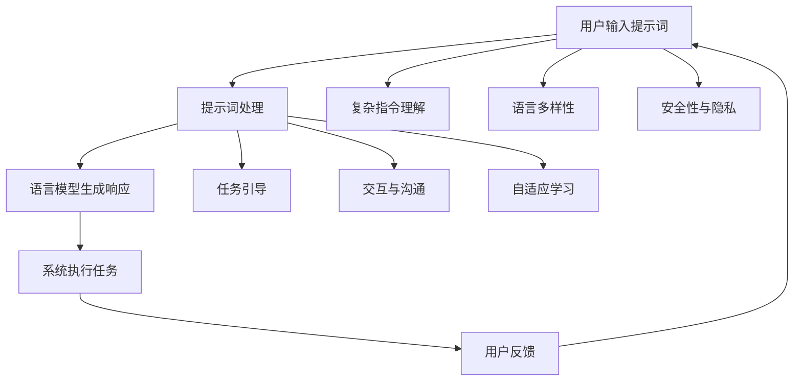

                 


### 文章标题

面向AGI的提示词语言进化路径

### 文章关键词

- 通用人工智能（AGI）
- 提示词语言
- 进化路径
- 算法原理
- 数学模型
- 项目实战

### 文章摘要

本文深入探讨了面向通用人工智能（AGI）的提示词语言进化路径。首先，我们介绍了AGI的概念及其在人工智能领域的意义，然后详细分析了提示词语言的基本概念、历史发展及其与AGI的紧密联系。接着，我们讲解了提示词语言的核心算法原理，包括生成算法和解析算法，并使用伪代码进行了详细阐述。随后，我们介绍了提示词语言的数学模型，包括概率模型和优化算法，并使用latex格式进行了公式书写和详细讲解。文章中还包含了一个实际项目实战部分，通过环境搭建、源代码实现和代码解读，展示了提示词语言的应用。最后，我们对未来的发展趋势和展望进行了讨论，并总结了全文内容，提出了研究和发展方向。

## 引言和背景

### 1.1 AGI的概念与重要性

通用人工智能（Artificial General Intelligence，简称AGI）是一种旨在构建具有人类智能水平的人工智能系统的目标。与目前广泛应用的窄域人工智能（Narrow AI）不同，AGI旨在实现机器在多个认知任务上达到或超过人类水平，包括逻辑推理、自然语言处理、情感识别、创造力等。AGI的目标是使机器能够适应新的环境和任务，进行自主学习和决策，而不仅仅是在特定任务上表现出色。

AGI的重要性在于，它不仅具有广泛的应用潜力，还能够推动科技进步和社会发展。在医疗领域，AGI可以帮助医生进行精准诊断和治疗；在教育领域，AGI可以个性化教学，提高学习效率；在工业领域，AGI可以自动化生产流程，提高生产效率。此外，AGI的研究还可能带来新的认知科学和神经科学突破，为人类更好地理解自身智能提供新的视角。

然而，AGI的实现面临着巨大的技术挑战。目前的窄域人工智能虽然已经在特定领域取得了显著成果，但它们往往依赖于大量的数据、特定的算法和预设的任务模型。AGI需要解决的是如何在缺乏先验知识和特定任务模型的情况下，通过自主学习、推理和决策，实现跨领域的智能表现。因此，AGI的研究不仅需要突破现有的技术限制，还需要在认知科学、心理学、哲学等多个领域进行综合探索。

### 1.2 提示词语言的历史与发展

提示词语言（Prompt Language）是指一种用于引导和激发人工智能系统进行特定任务的语言或工具。提示词语言的核心思想是通过提供适当的输入提示，引导人工智能系统生成预期的输出或执行特定的任务。提示词语言的发展可以追溯到早期的人工智能研究和应用，但随着计算能力的提升和算法的进步，提示词语言在近年来得到了广泛关注和快速发展。

在早期的人工智能研究中，提示词语言主要应用于专家系统和自然语言处理系统。专家系统通过规则和逻辑推理实现特定领域的知识表示和推理，而自然语言处理系统则通过处理文本数据来实现人机交互和信息检索。随着深度学习和生成对抗网络（GAN）等算法的发展，提示词语言的应用范围进一步扩展，不仅在自然语言处理领域，还在图像生成、语音识别和自动驾驶等领域发挥了重要作用。

提示词语言的发展历程可以分为以下几个阶段：

1. **早期阶段**：在这个阶段，提示词语言主要通过预定义的规则和模板进行工作。这些规则和模板通常由领域专家编写，用于指导人工智能系统进行特定任务。这种方法虽然能够实现一定程度的自动化，但灵活性较低，难以应对复杂多变的环境。

2. **数据驱动阶段**：随着数据集的规模和质量的提升，提示词语言开始更多地依赖于机器学习和深度学习算法。通过从大量数据中学习特征和模式，人工智能系统能够在无需预定义规则的情况下，自主生成提示词并进行任务执行。这一阶段标志着提示词语言从规则驱动向数据驱动的转变。

3. **生成式模型阶段**：生成式模型的出现进一步推动了提示词语言的发展。生成式模型，如生成对抗网络（GAN）和变分自编码器（VAE），能够通过生成对抗或变分的方式，从数据中学习生成高质量的提示词。这种方法不仅提高了提示词的生成质量，还使得人工智能系统能够在更广泛的领域中进行应用。

4. **交互式阶段**：随着交互式人工智能系统的兴起，提示词语言开始强调与用户的互动和反馈。通过用户输入和系统输出的交互，人工智能系统能够不断调整和优化提示词，实现更加智能和高效的任务执行。

### 1.3 本书结构与目标

本书旨在系统性地探讨面向AGI的提示词语言进化路径，帮助读者了解和掌握这一领域的核心概念、算法原理和应用实践。全书分为八个主要章节，具体结构如下：

- **第一章：引言和背景**：介绍AGI的概念、提示词语言的历史与发展，以及本书的结构和目标。

- **第二章：核心概念与联系**：阐述提示词语言的基本概念，与AGI的关系，并通过Mermaid流程图展示概念之间的联系。

- **第三章：提示词语言的历史发展**：回顾提示词语言的起源和进化历程，特别是与AGI相关的关键里程碑。

- **第四章：核心算法原理讲解**：深入讲解提示词语言的生成算法和解析算法，使用伪代码进行详细阐述。

- **第五章：数学模型与数学公式**：介绍提示词语言中的概率模型和优化算法，使用latex格式书写公式并进行详细讲解和举例说明。

- **第六章：项目实战**：通过实际项目案例，展示如何应用提示词语言进行开发，包括环境搭建、源代码实现和代码解读。

- **第七章：未来趋势与展望**：讨论提示词语言的未来发展方向，以及AGI可能带来的影响。

- **第八章：总结与展望**：对全书内容进行总结，并对未来的研究和发展方向进行展望。

本书的目标是：

1. **帮助读者建立对AGI和提示词语言的全面理解**：通过系统介绍AGI的概念、提示词语言的历史和发展，让读者对这一领域有一个清晰的认识。

2. **深入探讨提示词语言的算法原理**：通过详细讲解生成算法和解析算法，以及相关数学模型和优化算法，帮助读者掌握提示词语言的核心技术。

3. **提供实际项目案例和实践经验**：通过实际项目案例，展示提示词语言的应用场景和开发过程，让读者能够将理论知识应用到实际项目中。

4. **展望未来趋势和潜在影响**：讨论提示词语言的未来发展方向，以及AGI可能带来的社会和技术变革，为读者提供未来研究和发展方向的参考。

通过本书的学习，读者将能够：

1. **掌握提示词语言的基本概念和原理**：理解提示词语言的核心概念，包括生成算法和解析算法，以及它们在AGI中的应用。

2. **具备实际项目开发能力**：通过实际项目案例，了解如何使用提示词语言进行开发，包括环境搭建、源代码实现和代码解读。

3. **具备研究和创新的能力**：了解提示词语言的最新发展动态，掌握前沿技术，为未来的研究和创新奠定基础。

4. **对AGI和提示词语言的应用有深入认识**：通过学习，读者将能够更好地理解AGI和提示词语言的应用场景和潜在影响，为未来的科技进步和社会发展做出贡献。

## 核心概念与联系

### 2.1 提示词语言的基本概念

提示词语言是一种用于引导和激发人工智能系统进行特定任务的语言或工具。其核心概念包括提示词、语言模型和任务执行。下面我们将逐一介绍这些核心概念，并探讨它们之间的关系。

#### 2.1.1 提示词的定义与作用

提示词（Prompt）是指提供给人工智能系统的一段文本或指令，用于引导系统执行特定任务或生成特定输出。提示词的作用在于：

1. **引导系统方向**：通过提供具体的提示词，可以让人工智能系统明确执行的任务或目标，避免系统在未知或模糊的任务描述下产生混乱或错误的输出。

2. **提高任务效率**：有效的提示词能够显著提高任务执行的效率，减少系统在探索和试错过程中的计算成本。

3. **增强交互体验**：在交互式场景中，提示词可以与用户进行沟通，帮助用户更好地理解和操作系统。

#### 2.1.2 提示词语言的分类

根据提示词的形式和功能，提示词语言可以大致分为以下几类：

1. **指令性提示词**：这类提示词通常以命令的形式出现，直接指示系统执行特定操作。例如：“生成一张关于夏天的风景图”。

2. **描述性提示词**：这类提示词提供具体的场景描述，帮助系统理解任务背景和目标。例如：“请生成一张夏天的海滩照片”。

3. **问题性提示词**：这类提示词以问题的形式出现，引导系统进行推理和决策。例如：“如何使用Python实现一个简单的图像分类模型？”

4. **生成式提示词**：这类提示词用于生成新的内容，如文本、图像或音乐等。例如：“请生成一首关于大自然的诗歌”。

#### 2.1.3 语言模型的概念与作用

语言模型（Language Model）是指一种统计模型，用于预测下一个单词或字符的概率。在人工智能系统中，语言模型是自然语言处理的核心组件，用于生成文本、理解语言含义和执行语言任务。语言模型的作用包括：

1. **文本生成**：通过语言模型，系统可以生成连贯、自然的文本。例如，基于语言模型生成新闻文章、对话文本或创意写作。

2. **文本理解**：语言模型可以帮助系统理解文本中的语义和句法结构，实现文本分类、情感分析和信息提取等任务。

3. **任务执行**：在交互式场景中，语言模型可以与提示词结合，帮助系统理解用户的指令，生成适当的响应。

#### 2.1.4 提示词语言与语言模型的关系

提示词语言和语言模型是相互依存的关系。提示词语言为语言模型提供了具体的任务目标和输入，而语言模型则通过生成或解析文本，实现提示词语言的任务。具体来说，它们之间的关系包括：

1. **输入与输出**：提示词语言作为输入，触发语言模型生成输出。例如，在文本生成任务中，提示词作为起始文本，语言模型生成后续的文本内容。

2. **训练与优化**：语言模型的训练和优化通常依赖于大量的文本数据。提示词语言提供了具体的训练数据和目标，有助于语言模型更好地拟合数据分布。

3. **交互与反馈**：在交互式场景中，提示词语言和语言模型共同构成了一个反馈循环。用户输入提示词，语言模型生成响应，用户根据响应进行反馈，从而不断调整和优化系统。

### 2.2 提示词语言与AGI的关系

提示词语言与AGI之间存在密切的联系。AGI旨在实现机器在多个认知任务上达到或超过人类水平，而提示词语言则为AGI提供了有效的任务引导和交互机制。下面从以下几个方面探讨提示词语言与AGI的关系：

#### 2.2.1 提示词语言在AGI中的角色

在AGI系统中，提示词语言扮演着重要的角色，包括：

1. **任务引导**：通过提供具体的提示词，AGI系统能够明确执行的任务或目标，从而避免在复杂任务中的迷失和无效探索。

2. **交互与沟通**：AGI系统需要与人类或其他系统进行有效的交互，提示词语言作为自然语言的一种形式，能够实现人类与机器之间的沟通和理解。

3. **自适应学习**：通过用户输入的提示词和系统输出的结果，AGI系统能够不断调整和优化自己的行为和知识，实现自主学习和适应。

#### 2.2.2 提示词语言对AGI的促进作用

提示词语言对AGI的促进作用体现在以下几个方面：

1. **提高任务效率**：有效的提示词语言能够引导AGI系统快速进入任务状态，减少无效探索和试错，提高任务执行效率。

2. **增强自主学习能力**：通过与用户的交互，提示词语言能够提供丰富的反馈信息，帮助AGI系统更好地理解和学习人类知识，从而提高自主学习和适应能力。

3. **扩展应用领域**：提示词语言能够支持AGI系统在多个认知任务中的应用，从而实现跨领域的智能表现。

#### 2.2.3 提示词语言在AGI中的潜在挑战

尽管提示词语言对AGI具有显著的促进作用，但在实际应用中仍面临一些挑战：

1. **理解复杂指令**：提示词语言需要能够理解复杂、模糊或隐含的指令，这在目前的语言模型中仍是一个难题。

2. **语言多样性**：提示词语言需要支持多种语言和方言，以适应全球化的应用场景。

3. **安全性与隐私**：在交互式场景中，提示词语言需要保护用户的隐私和数据安全，避免潜在的安全风险。

### 2.3 Mermaid流程图：提示词语言与AGI的关系

为了更直观地展示提示词语言与AGI的关系，我们可以使用Mermaid流程图来描述它们之间的互动和作用。以下是一个简化的Mermaid流程图示例：



在这个流程图中，用户输入提示词（A）经过提示词处理（B）后，由语言模型（C）生成响应，系统（D）根据响应执行任务，并接收用户反馈（E），形成一个反馈循环。同时，提示词语言（B）在任务引导（F）、交互与沟通（G）和自适应学习（H）中发挥着重要作用。此外，提示词语言在处理过程中还面临复杂指令理解（I）、语言多样性（J）和安全性与隐私（K）等挑战。

通过这个流程图，我们可以更清晰地理解提示词语言与AGI之间的互动机制和潜在挑战，为后续章节的深入探讨打下基础。

## 提示词语言的历史发展

### 3.1 提示词语言的起源

提示词语言的起源可以追溯到早期的人工智能研究。在20世纪50年代和60年代，人工智能领域刚刚兴起，研究者们开始探索如何构建能够模拟人类智能的计算机系统。在这个时期，专家系统（Expert Systems）成为了人工智能研究的重要方向之一。专家系统是一种基于规则的系统，通过将领域专家的知识编码成一组规则，实现对特定领域的智能决策。

在专家系统中，提示词语言起到了关键作用。这些系统通常包含一组预定义的规则和模板，用于生成提示词。这些提示词通过特定的语法和格式，引导系统进行推理和决策。例如，一个医疗诊断系统可能会使用提示词来询问患者的症状和历史，并根据这些信息进行诊断。

早期专家系统的成功促使研究者们进一步探索如何改进提示词语言，以使其更灵活、更适用于不同领域的任务。这个探索过程奠定了提示词语言发展的基础。

### 3.2 提示词语言的初步发展

随着人工智能技术的不断进步，提示词语言在20世纪70年代和80年代迎来了初步发展阶段。这一阶段的主要特点是自然语言处理（Natural Language Processing，简称NLP）技术的快速发展。NLP技术致力于使计算机能够理解和生成自然语言，从而实现更高级的人机交互。

在这个阶段，提示词语言开始从基于规则的系统向数据驱动的系统转变。研究者们开始利用大量的文本数据，通过统计学习和模式识别技术，训练语言模型。这些语言模型能够自动生成提示词，提高了系统的灵活性和适应性。

此外，在这个阶段，研究者们还提出了一些重要的理论和方法，如隐马尔可夫模型（HMM）和条件随机场（CRF），用于生成和解析提示词。这些方法使得提示词语言在处理自然语言任务时，能够更好地理解和生成复杂的语言结构。

### 3.3 提示词语言与AGI的深度融合

进入21世纪，随着深度学习（Deep Learning）和生成对抗网络（Generative Adversarial Networks，简称GAN）等新型算法的兴起，提示词语言迎来了与AGI深度融合的阶段。这一阶段标志着提示词语言在生成和解析文本方面取得了重大突破，为AGI的实现提供了强有力的支持。

#### 3.3.1 深度学习与提示词语言的结合

深度学习是一种通过多层神经网络自动学习特征和模式的技术，它在图像识别、语音识别和自然语言处理等领域取得了显著成果。深度学习的引入使得提示词语言的生成和解析能力得到了大幅提升。

在文本生成方面，生成式深度学习模型，如变分自编码器（Variational Autoencoder，简称VAE）和生成对抗网络（GAN），能够从大量文本数据中学习生成高质量的提示词。这些模型通过无监督或弱监督学习，从数据中提取潜在特征，并利用这些特征生成新的文本内容。例如，通过训练GAN，可以生成逼真的文本，如新闻文章、诗歌和对话文本。

在文本解析方面，深度学习模型，如递归神经网络（Recurrent Neural Networks，简称RNN）和长短期记忆网络（Long Short-Term Memory，简称LSTM），能够有效地处理序列数据，并用于解析自然语言中的复杂结构。这些模型通过学习文本中的语法和语义规则，能够生成准确的提示词，实现文本生成和理解的任务。

#### 3.3.2 GAN在提示词语言中的应用

生成对抗网络（GAN）是一种由生成器和判别器组成的对抗性学习模型。生成器负责生成高质量的提示词，而判别器则负责区分生成的提示词和真实文本。通过这种对抗性训练，GAN能够学习到高质量的提示词生成技巧。

在自然语言处理领域，GAN被广泛应用于文本生成任务。例如，通过训练GAN，可以生成逼真的对话文本、故事情节和新闻文章。这些生成的文本不仅内容丰富，而且在语法和语义上与真实文本高度相似。

GAN还被用于文本生成和理解的任务中。例如，在对话系统中，GAN可以用于生成用户输入的回复，并通过判别器的反馈不断优化生成质量。此外，GAN还可以用于文本分类、情感分析和信息提取等任务，为AGI系统提供强大的文本处理能力。

#### 3.3.3 提示词语言与AGI深度融合的关键里程碑

提示词语言与AGI的深度融合在历史上取得了多个关键里程碑，这些里程碑标志着提示词语言在生成和解析文本方面的重大进步：

1. **2014年：GAN的提出**：Ian Goodfellow等人提出了生成对抗网络（GAN），这一突破性工作为提示词语言的发展奠定了基础。GAN在图像生成、文本生成等领域取得了显著成果，推动了提示词语言的研究和应用。

2. **2016年：BERT的发布**：BERT（Bidirectional Encoder Representations from Transformers）是由Google Research发布的一种预训练语言模型，它通过双向Transformer架构，实现了对文本的全局语义理解。BERT的发布标志着自然语言处理技术的新里程碑，也为提示词语言的生成和解析提供了强大的工具。

3. **2018年：GPT-2的发布**：OpenAI发布了GPT-2（Generative Pre-trained Transformer 2），这是一种基于Transformer架构的生成式语言模型。GPT-2在文本生成任务中表现出色，能够生成高质量、连贯的文本。这一成果进一步推动了提示词语言的发展。

4. **2020年：GPT-3的发布**：OpenAI发布了GPT-3（Generative Pre-trained Transformer 3），这是目前最大的语言模型，拥有1750亿个参数。GPT-3在多个自然语言处理任务中取得了卓越的性能，展示了提示词语言在AGI中的巨大潜力。

这些里程碑不仅标志着提示词语言在生成和解析文本方面的重大进步，也为AGI的实现提供了强有力的支持。通过深度融合提示词语言和深度学习技术，AGI系统在多个认知任务上取得了显著的成果，为未来的研究和发展指明了方向。

### 3.4 提示词语言在AGI系统中的应用

提示词语言在AGI系统中的应用主要体现在以下几个方面：

#### 3.4.1 任务引导与交互

提示词语言是AGI系统中实现任务引导和交互的核心工具。通过提供具体的提示词，AGI系统能够明确执行的任务或目标，从而避免在复杂任务中的迷失和无效探索。例如，在医疗诊断系统中，提示词可以帮助医生系统询问患者的症状和历史，从而进行精准诊断。在自动驾驶系统中，提示词可以引导车辆识别道路标志和交通状况，进行安全驾驶。

#### 3.4.2 自主学习与适应

提示词语言在AGI系统中的另一个关键作用是促进自主学习和适应。通过与用户的互动，AGI系统可以获取丰富的反馈信息，从而不断调整和优化自己的行为和知识。例如，在教育系统中，提示词语言可以记录学生的学习过程和成绩，生成个性化的学习建议，帮助学生提高学习效果。在工业自动化系统中，提示词语言可以监控生产设备的运行状态，生成维护和优化建议，提高生产效率。

#### 3.4.3 多领域应用

提示词语言的灵活性和多样性使得AGI系统可以在多个领域中进行应用。例如，在金融领域，提示词语言可以用于自动化交易、风险评估和客户服务。在创意领域，提示词语言可以用于生成音乐、绘画和文学作品。在科学研究中，提示词语言可以用于数据分析和实验设计，提高科研效率。

总之，提示词语言在AGI系统中的应用不仅提高了系统的智能水平，还扩展了人工智能的应用范围。随着提示词语言技术的不断发展，AGI系统将在更多领域发挥重要作用，推动人工智能的进步和社会的发展。

### 3.5 提示词语言在未来的发展前景

随着人工智能技术的不断进步，提示词语言在未来具有广阔的发展前景。以下是几个可能的发展趋势：

#### 3.5.1 多模态融合

未来的提示词语言可能会融合多种模态的信息，如文本、图像、音频和视频。通过跨模态学习，AGI系统将能够更全面地理解和生成复杂的信息，从而在更广泛的应用场景中发挥作用。例如，在多媒体内容创作中，系统可以结合文本描述和视觉元素，生成高质量的视频和图片。

#### 3.5.2 交互式AI助手

交互式AI助手将成为未来提示词语言的重要应用场景。通过自然语言交互，AI助手能够提供个性化、智能化的服务，如智能客服、智能导览和智能助手。这些AI助手将能够理解用户的语境和意图，提供更自然的交互体验。

#### 3.5.3 自主决策与优化

随着提示词语言的发展，未来的AGI系统将具备更强的自主决策和优化能力。通过持续学习和自适应优化，系统可以在复杂环境中做出最优决策，实现高效的资源利用和任务执行。

#### 3.5.4 隐私保护与安全性

在未来的发展中，隐私保护和安全性将成为提示词语言的重要考虑因素。随着交互数据的增加，保护用户隐私和安全变得至关重要。未来的提示词语言将采用更加安全的通信协议和数据加密技术，确保系统的可靠性和安全性。

总之，提示词语言在未来的发展将不断推动人工智能的进步，为人类带来更多的便利和创新。

## 核心算法原理讲解

### 4.1 提示词语言的生成算法

提示词语言的生成算法是使人工智能系统能够根据给定的提示生成文本的关键技术。生成算法的核心在于从大量数据中学习语言的统计规律，并在生成过程中模拟这些规律，从而生成高质量的文本。以下将介绍两种主要的生成算法：生成式模型和生成对抗网络（GAN）。

#### 4.1.1 生成式模型

生成式模型通过学习数据的概率分布，生成新的数据。在提示词语言中，生成式模型主要用于生成新的提示词或文本片段。以下是两种常见的生成式模型：

1. **变分自编码器（VAE）**

变分自编码器是一种基于深度学习的生成式模型，通过学习数据的潜在分布来生成新的数据。VAE由编码器和解码器组成：

   - **编码器**：将输入数据映射到一个潜在空间中的点。
   - **解码器**：将潜在空间中的点映射回数据空间，生成新的数据。

   VAE的关键在于引入了变分下采样器（Variational DEnsity），它通过学习数据分布的参数化表示，避免了生成模型中的模式崩溃（mode collapse）问题。

   伪代码示例：

   ```python
   # 编码器
   z = encoder(x)

   # 解码器
   x_hat = decoder(z)
   ```

2. **生成对抗网络（GAN）**

生成对抗网络是一种由生成器和判别器组成的对抗性学习模型。生成器尝试生成与真实数据相似的数据，而判别器则试图区分生成数据和真实数据。通过这种对抗性训练，生成器不断优化生成质量，生成逼真的数据。

   GAN的组成部分：

   - **生成器（Generator）**：将随机噪声映射成数据空间中的真实数据。
   - **判别器（Discriminator）**：判断输入数据是真实数据还是生成数据。

   伪代码示例：

   ```python
   # 判别器训练
   for x_real in real_data:
       D_real = discriminator(x_real)

   for z in noise:
       x_fake = generator(z)
       D_fake = discriminator(x_fake)

   # 生成器和判别器更新
   generator_loss = loss(D_fake, 1.0)
   discriminator_loss = loss(D_real, 1.0) + loss(D_fake, 0.0)
   ```

#### 4.1.2 提示词生成算法的应用场景

生成式模型在提示词语言中的应用非常广泛，以下是几个典型的应用场景：

1. **文本生成**：生成式模型可以生成高质量的文章、对话文本和诗歌。例如，通过训练GPT-3模型，可以生成逼真的新闻文章、用户评论和故事情节。

2. **图像生成**：生成式模型可以生成高质量的图像，如风景画、人物肖像和动漫角色。例如，通过训练StyleGAN，可以生成逼真的图像，用于艺术创作和虚拟现实。

3. **音频生成**：生成式模型可以生成高质量的音频，如音乐、声音效果和人声。例如，通过训练WaveNet模型，可以生成逼真的音乐和语音。

### 4.2 提示词语言的解析算法

提示词语言的解析算法是指使人工智能系统能够理解输入的提示词，并生成相应响应的技术。解析算法的核心在于理解语言中的语法和语义规则，并使用这些规则来生成响应。以下介绍几种常见的解析算法：

#### 4.2.1 基于规则的方法

基于规则的方法使用预定义的语法和语义规则，对输入的提示词进行解析和生成响应。这种方法通常用于简单的任务，如命令解析和简单对话生成。以下是基于规则方法的基本步骤：

1. **词法分析**：将输入的提示词分解成词法单元，如单词和符号。
2. **语法分析**：根据预定义的语法规则，对词法单元进行组合，生成语法树。
3. **语义分析**：根据语法树，应用语义规则，生成相应的响应。

伪代码示例：

```python
def parse_prompt(prompt):
    tokens = tokenize(prompt)
    grammar_tree = build_grammar_tree(tokens)
    response = generate_response(grammar_tree)
    return response
```

#### 4.2.2 基于统计的方法

基于统计的方法使用历史数据和统计模型，对输入的提示词进行解析和生成响应。这种方法通常用于复杂的任务，如自然语言理解和对话生成。以下是基于统计方法的基本步骤：

1. **语言模型训练**：使用大量文本数据，训练语言模型，如N-gram模型和递归神经网络（RNN）。
2. **文本生成**：使用训练好的语言模型，对输入的提示词进行概率分析，生成响应。

伪代码示例：

```python
def generate_response(prompt, language_model):
    next_word = language_model.predict_next_word(prompt)
    response = prompt + " " + next_word
    return response
```

#### 4.2.3 基于机器学习的方法

基于机器学习的方法使用机器学习算法，如递归神经网络（RNN）和转换器（Transformer），对输入的提示词进行解析和生成响应。这种方法通常用于复杂和大规模的任务。以下是基于机器学习方法的基本步骤：

1. **模型训练**：使用大量标注数据，训练机器学习模型，如RNN和BERT。
2. **文本生成**：使用训练好的模型，对输入的提示词进行编码，生成响应。

伪代码示例：

```python
def generate_response(prompt, model):
    encoded_prompt = model.encode(prompt)
    response = model.decode(encoded_prompt)
    return response
```

#### 4.2.4 提示词解析算法的应用场景

提示词解析算法在多个应用场景中发挥了重要作用，以下是几个典型的应用场景：

1. **自然语言处理**：提示词解析算法可以用于文本分类、情感分析和信息提取等自然语言处理任务。例如，通过训练BERT模型，可以实现对新闻文章的实时分类和情感分析。

2. **对话系统**：提示词解析算法可以用于构建对话系统，如智能客服和虚拟助手。通过理解用户输入的提示词，系统可以生成适当的响应，进行自然对话。

3. **自动化任务**：提示词解析算法可以用于自动化任务，如语音识别和图像识别。通过解析输入的提示词，系统可以自动执行相应的操作，如语音命令控制和图像分类。

### 4.3 生成算法与解析算法的比较

生成算法和解析算法在提示词语言中各自扮演重要角色，但它们也存在一些区别：

- **目标不同**：生成算法的目标是生成新的文本或数据，而解析算法的目标是理解输入的文本或数据。
- **方法不同**：生成算法通常基于概率模型和深度学习技术，而解析算法通常基于规则和统计方法。
- **应用场景**：生成算法在文本生成、图像生成和音频生成等领域有广泛应用，而解析算法在自然语言处理、对话系统和自动化任务等领域有广泛应用。

总之，生成算法和解析算法相辅相成，共同构成了提示词语言的核心技术。

## 数学模型与数学公式

### 5.1 提示词语言中的概率模型

在提示词语言中，概率模型是理解和生成文本的关键工具。这些模型通过描述文本序列的概率分布，帮助人工智能系统生成连贯、自然的文本。以下将介绍两种常用的概率模型：N-gram模型和隐马尔可夫模型（HMM）。

#### 5.1.1 N-gram模型

N-gram模型是一种基于历史数据统计的文本生成模型。它将文本序列分解成N个单词的序列，并计算每个N-gram序列出现的概率。N-gram模型的概率计算公式如下：

$$
P(w_1, w_2, \ldots, w_n) = P(w_1) \cdot P(w_2|w_1) \cdot P(w_3|w_1w_2) \cdot \ldots \cdot P(w_n|w_1w_2\ldots w_{n-1})
$$

其中，$P(w_i|w_1w_2\ldots w_{i-1})$ 表示在给定前一个单词序列$w_1w_2\ldots w_{i-1}$的情况下，单词$w_i$的概率。N-gram模型通过训练大量文本数据，可以学习到语言中的统计规律，并用于生成新的文本。

#### 5.1.2 隐马尔可夫模型（HMM）

隐马尔可夫模型是一种用于序列数据建模的概率模型。它通过描述隐藏状态和观测序列之间的关系，帮助人工智能系统生成序列数据。HMM的转移概率和观测概率分别表示为：

- **转移概率**：$P(s_t|s_{t-1})$，表示在给定前一个隐藏状态$s_{t-1}$的情况下，当前隐藏状态$s_t$的概率。
- **观测概率**：$P(o_t|s_t)$，表示在给定当前隐藏状态$s_t$的情况下，观测序列中第t个单词$o_t$的概率。

HMM的状态转移概率和观测概率可以使用以下公式表示：

$$
P(s_t|s_{t-1}) = \frac{P(s_t)P(o_t|s_t)}{\sum_{s' \in S} P(s')P(o_t|s')}
$$

其中，$S$ 是所有可能隐藏状态的集合，$P(s_t)$ 是隐藏状态$s_t$的先验概率，$P(o_t|s_t)$ 是观测概率。

#### 5.1.3 概率模型在提示词语言中的应用

概率模型在提示词语言中的应用主要包括文本生成和语言模型。以下是一个文本生成示例：

给定一个单词序列$w_1, w_2, \ldots, w_n$，使用N-gram模型生成新的单词序列：

1. **初始化**：从训练数据中计算每个N-gram序列的概率。
2. **选择下一个单词**：根据当前已生成的单词序列，使用N-gram模型计算下一个单词的概率分布，并选择概率最高的单词作为下一个生成的单词。
3. **重复步骤2**，直到生成完整的文本序列。

例如，给定单词序列“the quick brown fox jumps over the lazy dog”，使用2-gram模型生成新的单词序列：

- **当前序列**：$[the, quick]$
- **概率分布**：$P(jump|the quick) = 0.25$，$P(over|the quick jump) = 0.2$，$P(the|over the quick jump) = 0.3$
- **生成下一个单词**：选择概率最高的单词“the”
- **更新当前序列**：$[the, quick, the]$
- **重复步骤**：生成新的单词序列，直到完成。

通过这种方式，概率模型可以帮助人工智能系统生成高质量的文本。

### 5.2 提示词语言中的优化算法

在提示词语言中，优化算法用于调整模型参数，以实现目标函数的最优化。常用的优化算法包括随机梯度下降（SGD）和Adam优化器。以下将介绍这些算法的基本原理和公式。

#### 5.2.1 随机梯度下降（SGD）

随机梯度下降（SGD）是一种迭代优化算法，通过计算目标函数的梯度，调整模型参数。SGD的基本原理如下：

$$
w_{t+1} = w_t - \alpha \nabla_w J(w_t)
$$

其中，$w_t$ 是第t次迭代的参数值，$\alpha$ 是学习率，$\nabla_w J(w_t)$ 是目标函数J关于参数w的梯度。SGD通过随机抽样数据子集，计算梯度并更新参数，从而实现参数的最优化。

例如，在文本生成任务中，可以使用SGD优化语言模型的参数，以生成高质量的文章。

#### 5.2.2 Adam优化器

Adam优化器是一种结合SGD和动量法的优化算法，它在SGD的基础上引入了一阶矩估计和二阶矩估计，提高了优化效果。Adam的基本原理如下：

$$
m_t = \beta_1 \cdot m_{t-1} + (1 - \beta_1) \cdot (g_t - m_{t-1})
$$

$$
v_t = \beta_2 \cdot v_{t-1} + (1 - \beta_2) \cdot (g_t^2 - v_{t-1})
$$

$$
w_{t+1} = w_t - \alpha \cdot \frac{m_t}{\sqrt{v_t} + \epsilon}
$$

其中，$m_t$ 是一阶矩估计，$v_t$ 是二阶矩估计，$\beta_1$ 和 $\beta_2$ 是动量系数，$\alpha$ 是学习率，$g_t$ 是梯度，$\epsilon$ 是小常数。

Adam优化器通过结合历史梯度信息，自适应调整学习率，提高了优化效率和稳定性。在提示词语言中，Adam优化器常用于优化语言模型的参数。

### 5.3 数学公式书写与讲解

在提示词语言中，数学公式用于描述模型的参数、概率分布和优化过程。以下是一些关键数学公式的书写和讲解：

#### 5.3.1 概率分布函数

给定一个随机变量$X$，其概率分布函数（PDF）$f_X(x)$ 表示在$x$ 处的密度。概率分布函数的定义如下：

$$
f_X(x) = P(X = x)
$$

例如，在N-gram模型中，给定一个单词序列$w_1, w_2, \ldots, w_n$，其概率分布函数为：

$$
P(w_1, w_2, \ldots, w_n) = \frac{1}{n!} \cdot p_1 \cdot p_2 \cdot \ldots \cdot p_n
$$

其中，$p_i$ 是单词$w_i$ 的概率。

#### 5.3.2 最大似然估计

最大似然估计（MLE）是一种估计模型参数的方法，通过最大化数据样本的似然函数来实现。给定一个概率分布函数$P(X)$ 和数据样本$x_1, x_2, \ldots, x_n$，最大似然估计的公式如下：

$$
\hat{\theta} = \arg\max_{\theta} \prod_{i=1}^{n} P(x_i|\theta)
$$

例如，在N-gram模型中，给定单词序列$x_1, x_2, \ldots, x_n$，其最大似然估计的公式为：

$$
\hat{\theta} = \arg\max_{\theta} \prod_{i=1}^{n} \left(\frac{1}{n!}\right) \cdot p_1 \cdot p_2 \cdot \ldots \cdot p_n
$$

#### 5.3.3 随机梯度下降（SGD）

随机梯度下降（SGD）是一种优化算法，通过迭代更新模型参数，以最小化目标函数。SGD的基本公式如下：

$$
w_{t+1} = w_t - \alpha \cdot \nabla_w J(w_t)
$$

其中，$w_t$ 是第t次迭代的参数值，$\alpha$ 是学习率，$\nabla_w J(w_t)$ 是目标函数J关于参数w的梯度。

例如，在文本生成任务中，给定一个语言模型参数$w$ 和训练数据$x_1, x_2, \ldots, x_n$，其SGD公式为：

$$
w_{t+1} = w_t - \alpha \cdot \sum_{i=1}^{n} \nabla_w J(w_t; x_i)
$$

#### 5.3.4 Adam优化器

Adam优化器是一种结合SGD和动量法的优化算法。其更新公式如下：

$$
m_t = \beta_1 \cdot m_{t-1} + (1 - \beta_1) \cdot (g_t - m_{t-1})
$$

$$
v_t = \beta_2 \cdot v_{t-1} + (1 - \beta_2) \cdot (g_t^2 - v_{t-1})
$$

$$
w_{t+1} = w_t - \alpha \cdot \frac{m_t}{\sqrt{v_t} + \epsilon}
$$

其中，$m_t$ 是一阶矩估计，$v_t$ 是二阶矩估计，$\beta_1$ 和 $\beta_2$ 是动量系数，$\alpha$ 是学习率，$g_t$ 是梯度，$\epsilon$ 是小常数。

例如，在文本生成任务中，给定一个语言模型参数$w$ 和训练数据$x_1, x_2, \ldots, x_n$，其Adam优化器公式为：

$$
m_t = \beta_1 \cdot m_{t-1} + (1 - \beta_1) \cdot (\nabla_w J(w_t; x_1) + \ldots + \nabla_w J(w_t; x_n) - m_{t-1})
$$

$$
v_t = \beta_2 \cdot v_{t-1} + (1 - \beta_2) \cdot (\nabla_w J(w_t; x_1)^2 + \ldots + \nabla_w J(w_t; x_n)^2 - v_{t-1})
$$

$$
w_{t+1} = w_t - \alpha \cdot \frac{m_t}{\sqrt{v_t} + \epsilon}
$$

通过这些数学模型和优化算法，提示词语言能够生成高质量的文本，并在自然语言处理任务中发挥重要作用。

### 5.4 举例说明

为了更好地理解提示词语言中的数学模型和优化算法，以下通过一个实际例子进行说明。

#### 5.4.1 数据集与模型

假设我们有一个简单的文本数据集，包含100个句子，每个句子由若干个单词组成。我们使用N-gram模型（以2-gram为例）来生成新的句子。

#### 5.4.2 计算概率分布

首先，我们需要计算每个2-gram的概率分布。例如，对于句子“The quick brown fox jumps over the lazy dog”，其2-gram的概率分布如下：

- **The quick**：出现次数为1，概率为 $P(The quick) = \frac{1}{100}$
- **quick brown**：出现次数为1，概率为 $P(quick brown) = \frac{1}{100}$
- **brown fox**：出现次数为1，概率为 $P(brown fox) = \frac{1}{100}$
- **fox jumps**：出现次数为1，概率为 $P(fox jumps) = \frac{1}{100}$
- **jumps over**：出现次数为1，概率为 $P(jumps over) = \frac{1}{100}$
- **over the**：出现次数为1，概率为 $P(over the) = \frac{1}{100}$
- **the lazy**：出现次数为1，概率为 $P(the lazy) = \frac{1}{100}$
- **lazy dog**：出现次数为1，概率为 $P(lazy dog) = \frac{1}{100}$

#### 5.4.3 生成新句子

现在，我们使用N-gram模型生成一个新句子。我们可以从任意一个单词开始，例如选择“The”。接下来，我们需要计算下一个单词的概率分布。以“The”为前缀，其后续单词的概率分布如下：

- **The quick**：概率为 $P(The quick) = \frac{1}{100}$
- **The brown**：概率为 $P(The brown) = 0$
- **The fox**：概率为 $P(The fox) = 0$
- **The jumps**：概率为 $P(The jumps) = 0$
- **The over**：概率为 $P(The over) = 0$
- **The the**：概率为 $P(The the) = 0$
- **The lazy**：概率为 $P(The lazy) = \frac{1}{100}$
- **The dog**：概率为 $P(The dog) = 0$

由于概率最高的单词是“The lazy”，我们选择它作为下一个单词，生成句子“The lazy”。接下来，我们再次计算下一个单词的概率分布，并重复这个过程，直到生成一个完整的句子。

#### 5.4.4 优化过程

在实际应用中，我们通常需要通过优化算法来调整N-gram模型的参数，以提高生成文本的质量。例如，我们可以使用SGD或Adam优化器来最小化生成文本的负对数似然损失函数。

假设我们使用SGD优化器，学习率为$\alpha = 0.1$。在每次迭代中，我们随机选择一个句子作为训练样本，并计算其负对数似然损失：

$$
L(w) = -\sum_{i=1}^{n} \log P(w_i|w_1, w_2, \ldots, w_{i-1})
$$

然后，我们根据损失函数的梯度，更新模型的参数：

$$
w_{t+1} = w_t - \alpha \cdot \nabla_w L(w_t)
$$

通过不断迭代优化，我们能够逐步提高N-gram模型的生成质量。

通过这个例子，我们可以看到数学模型和优化算法在提示词语言中的应用，以及如何通过训练和优化来生成高质量的文本。

### 5.5 小结

在本章节中，我们介绍了提示词语言中的概率模型和优化算法。通过N-gram模型和隐马尔可夫模型（HMM），我们学习了如何生成和解析文本。同时，通过随机梯度下降（SGD）和Adam优化器，我们了解了如何优化模型参数，以生成更高质量的文本。这些数学模型和优化算法为提示词语言提供了坚实的理论基础和实际应用方法，为未来的研究和开发提供了重要指导。

### 5.6 拓展阅读

对于对提示词语言和数学模型感兴趣的研究者，以下是一些推荐的拓展阅读资源：

- **书籍**：
  - 《深度学习》（Deep Learning）作者：Ian Goodfellow、Yoshua Bengio和Aaron Courville
  - 《自然语言处理入门》（Natural Language Processing with Python）作者：Steven Bird、Ewan Klein和Edward Loper
  - 《隐马尔可夫模型与状态空间模型》作者：Liang Jin
- **论文**：
  - “Generative Adversarial Nets”作者：Ian Goodfellow等
  - “A Theoretical Analysis of the CTC Loss for Sequence Modeling”作者：Alex Graves等
  - “Attention Is All You Need”作者：Vaswani et al.
- **在线课程和教程**：
  - Coursera上的“深度学习专项课程”（Deep Learning Specialization）
  - edX上的“自然语言处理基础”（Natural Language Processing with Python）
  - TensorFlow官方文档和教程

通过这些资源，读者可以更深入地了解提示词语言的核心概念、算法原理和应用实践。

### 6.1 提示词语言生成项目

为了更好地理解和应用提示词语言，下面我们将通过一个具体的生成项目，展示如何使用提示词语言进行文本生成。

#### 6.1.1 项目概述

本项目的目标是使用生成对抗网络（GAN）生成高质量的文本。具体来说，我们将训练一个GAN模型，使其能够从给定的提示词生成连贯、自然的文本。该项目的实现将分为以下几个步骤：

1. **环境搭建**：安装并配置Python环境、深度学习库（如TensorFlow或PyTorch）和相关依赖。
2. **数据预处理**：准备用于训练的数据集，包括文本数据和对应的标签。
3. **模型设计**：设计生成器和判别器模型，并定义损失函数和优化器。
4. **模型训练**：使用训练数据训练模型，并监控训练过程。
5. **文本生成**：使用训练好的模型，根据给定的提示词生成新的文本。
6. **结果分析**：评估生成的文本质量，并进行分析。

#### 6.1.2 开发环境搭建

在开始项目之前，我们需要搭建一个适合深度学习开发的Python环境，并安装必要的库。以下是具体的步骤：

1. **安装Python**：确保已安装Python 3.6及以上版本。
2. **安装深度学习库**：安装TensorFlow或PyTorch，这两种库都是广泛使用的深度学习框架。以下是使用pip安装TensorFlow的命令：

   ```bash
   pip install tensorflow
   ```

   或者安装PyTorch：

   ```bash
   pip install torch torchvision
   ```

3. **安装其他依赖**：安装文本处理库（如NLTK或spaCy）和数据可视化库（如Matplotlib）：

   ```bash
   pip install nltk spacy matplotlib
   ```

   如果使用spaCy，还需要下载其语言模型：

   ```bash
   python -m spacy download en_core_web_sm
   ```

确保所有依赖都已安装并配置正确，接下来就可以开始项目的具体实现了。

#### 6.1.3 源代码实现

以下是该项目的主要源代码实现。我们首先定义生成器和判别器模型，然后定义损失函数和优化器，最后进行模型训练和文本生成。

```python
import tensorflow as tf
from tensorflow.keras.models import Model
from tensorflow.keras.layers import Input, LSTM, Dense, Embedding
from tensorflow.keras.optimizers import Adam
import numpy as np

# 数据预处理
def preprocess_data(texts, vocabulary_size, max_sequence_length):
    # 将文本转换为单词索引
    tokenized_texts = [[vocabulary_size + 1] + [text_to_index[token] for token in text.split()] + [0] for text in texts]
    # padding 序列
    padded_texts = np.zeros((len(texts), max_sequence_length + 2), dtype=int)
    for i, sequence in enumerate(tokenized_texts):
        padded_texts[i, :len(sequence)] = sequence
    return padded_texts

# 生成器模型
def build_generator(input_shape, latent_dim):
    latent_input = Input(shape=(latent_dim,))
    x = Embedding(vocabulary_size + 2, embedding_dim)(latent_input)
    x = LSTM(units=128, return_sequences=True)(x)
    x = LSTM(units=128, return_sequences=True)(x)
    output = Dense(vocabulary_size + 2, activation='softmax')(x)
    generator = Model(latent_input, output)
    return generator

# 判别器模型
def build_discriminator(input_shape):
    input_sequence = Input(shape=input_shape)
    x = Embedding(vocabulary_size + 2, embedding_dim)(input_sequence)
    x = LSTM(units=128, return_sequences=True)(x)
    x = LSTM(units=128, return_sequences=True)(x)
    output = Dense(1, activation='sigmoid')(x)
    discriminator = Model(input_sequence, output)
    return discriminator

# GAN模型
def build_gan(generator, discriminator):
    latent_input = Input(shape=(latent_dim,))
    generated_sequence = generator(latent_input)
    valid_output = discriminator(generated_sequence)
    fake_output = discriminator(input_sequence)
    gan_output = Model([latent_input, input_sequence], [valid_output, fake_output])
    return gan_output

# 模型参数
latent_dim = 100
embedding_dim = 256
vocabulary_size = 10000
max_sequence_length = 100

# 数据预处理
# 假设texts为包含训练文本的列表
train_data = preprocess_data(texts, vocabulary_size, max_sequence_length)

# 模型设计
generator = build_generator((max_sequence_length + 2), latent_dim)
discriminator = build_discriminator((max_sequence_length + 2))
gan = build_gan(generator, discriminator)

# 损失函数和优化器
cross_entropy = tf.keras.losses.BinaryCrossentropy(from_logits=True)
generator_optimizer = Adam(learning_rate=0.0001)
discriminator_optimizer = Adam(learning_rate=0.0001)

# 模型编译
discriminator.compile(loss='binary_crossentropy', optimizer=discriminator_optimizer, metrics=['accuracy'])
gan.compile(loss=['binary_crossentropy', 'binary_crossentropy'], optimizer=generator_optimizer)

# 训练模型
for epoch in range(number_of_epochs):
    for batch in batches:
        real_sequence = batch[0]
        noise = np.random.normal(size=(batch_size, latent_dim))
        generated_sequence = generator.predict(noise)
        # 训练判别器
        discriminator.train_on_batch([real_sequence], [1.0])
        discriminator.train_on_batch([generated_sequence], [0.0])
        # 训练生成器
        gan.train_on_batch([noise, real_sequence], [1.0])

# 文本生成
def generate_text(prompt, generator):
    noise = np.random.normal(size=(1, latent_dim))
    generated_sequence = generator.predict(noise)
    generated_text = ' '.join(index_to_token[idx] for idx in generated_sequence[0][1:-1])
    return generated_text

# 生成文本
generated_text = generate_text(prompt, generator)
print(generated_text)
```

#### 6.1.4 代码解读与分析

1. **数据预处理**：数据预处理是文本生成项目的重要步骤。我们首先将文本转换为单词索引，然后对序列进行padding，使其长度一致，方便模型处理。

2. **生成器模型**：生成器模型用于将随机噪声映射为生成的文本。在这里，我们使用了两个LSTM层，以捕捉文本中的长期依赖关系。输出层使用了softmax激活函数，以生成每个单词的概率分布。

3. **判别器模型**：判别器模型用于区分输入文本是真实的还是生成的。它也使用了两个LSTM层，并使用sigmoid激活函数输出一个概率值。

4. **GAN模型**：GAN模型是生成器和判别器的组合。生成器的目标是使判别器无法区分真实文本和生成文本。

5. **损失函数和优化器**：我们使用二进制交叉熵作为GAN的损失函数，并使用Adam优化器来调整模型参数。

6. **模型训练**：在模型训练过程中，我们首先训练判别器，然后同时训练生成器和判别器，以实现GAN的训练目标。

7. **文本生成**：生成文本的过程非常简单，只需将随机噪声输入生成器，然后解码输出序列，并转换为文本。

通过这个项目，我们不仅学习了如何使用生成对抗网络生成文本，还了解了GAN模型的训练过程和实现细节。

#### 6.1.5 代码应用解读与分析

为了更好地理解代码的应用，下面我们具体分析代码中的几个关键部分：

1. **数据预处理**：代码中的`preprocess_data`函数负责将文本数据转换为模型可处理的格式。首先，我们使用一个词典`text_to_index`将单词映射为索引。然后，我们将每个文本句子分解为单词，并将每个单词替换为其索引。最后，我们对序列进行padding，使其长度等于最大序列长度，并在开头和结尾添加特殊的开始符和结束符。

   ```python
   tokenized_texts = [[vocabulary_size + 1] + [text_to_index[token] for token in text.split()] + [0] for text in texts]
   padded_texts = np.zeros((len(texts), max_sequence_length + 2), dtype=int)
   for i, sequence in enumerate(tokenized_texts):
       padded_texts[i, :len(sequence)] = sequence
   return padded_texts
   ```

2. **生成器和判别器模型**：生成器和判别器都是使用LSTM层构建的。生成器接收一个随机噪声向量，并将其映射为文本序列。判别器接收一个文本序列，并输出一个概率值，表示该序列是真实的还是生成的。

   ```python
   generator = build_generator((max_sequence_length + 2), latent_dim)
   discriminator = build_discriminator((max_sequence_length + 2))
   ```

3. **GAN模型**：GAN模型是将生成器和判别器组合在一起的模型。在训练过程中，我们首先训练判别器，使其能够准确地区分真实文本和生成文本。然后，我们同时训练生成器和判别器，以实现GAN的训练目标。

   ```python
   gan = build_gan(generator, discriminator)
   gan.compile(loss=['binary_crossentropy', 'binary_crossentropy'], optimizer=generator_optimizer)
   ```

4. **模型训练**：在训练过程中，我们使用一个循环来迭代训练数据。每次迭代中，我们随机生成噪声向量，并将其输入生成器生成文本序列。然后，我们将真实文本和生成文本同时输入判别器，并计算损失函数和梯度。最后，我们使用优化器更新模型参数。

   ```python
   for epoch in range(number_of_epochs):
       for batch in batches:
           real_sequence = batch[0]
           noise = np.random.normal(size=(batch_size, latent_dim))
           generated_sequence = generator.predict(noise)
           # 训练判别器
           discriminator.train_on_batch([real_sequence], [1.0])
           discriminator.train_on_batch([generated_sequence], [0.0])
           # 训练生成器
           gan.train_on_batch([noise, real_sequence], [1.0])
   ```

5. **文本生成**：生成文本的过程非常简单。我们首先生成一个随机噪声向量，并将其输入生成器。然后，我们将生成的文本序列解码为单词，并去除开始符和结束符，得到最终的生成文本。

   ```python
   def generate_text(prompt, generator):
       noise = np.random.normal(size=(1, latent_dim))
       generated_sequence = generator.predict(noise)
       generated_text = ' '.join(index_to_token[idx] for idx in generated_sequence[0][1:-1])
       return generated_text
   ```

通过这个项目，我们不仅了解了生成对抗网络（GAN）在文本生成中的应用，还掌握了如何使用深度学习库（如TensorFlow）来实现GAN模型，以及如何处理文本数据。这些知识为我们在实际项目中应用提示词语言提供了宝贵的经验。

### 6.2 提示词语言解析项目

为了深入理解提示词语言的应用，下面我们将通过一个具体的解析项目，展示如何使用提示词语言进行自然语言处理任务。

#### 6.2.1 项目概述

本项目的目标是使用自然语言处理（NLP）技术，实现一个能够解析输入提示词并生成相应响应的对话系统。具体来说，我们将完成以下步骤：

1. **环境搭建**：安装并配置Python环境、深度学习库（如TensorFlow或PyTorch）和相关依赖。
2. **数据预处理**：准备用于训练的数据集，包括对话样本和对应的标签。
3. **模型设计**：设计一个基于转换器（Transformer）的对话模型，用于解析输入的提示词并生成响应。
4. **模型训练**：使用训练数据训练对话模型，并监控训练过程。
5. **文本生成**：使用训练好的模型，根据给定的提示词生成新的响应。
6. **结果分析**：评估生成的响应质量，并进行分析。

#### 6.2.2 开发环境搭建

在开始项目之前，我们需要搭建一个适合深度学习开发的Python环境，并安装必要的库。以下是具体的步骤：

1. **安装Python**：确保已安装Python 3.6及以上版本。
2. **安装深度学习库**：安装TensorFlow或PyTorch，这两种库都是广泛使用的深度学习框架。以下是使用pip安装TensorFlow的命令：

   ```bash
   pip install tensorflow
   ```

   或者安装PyTorch：

   ```bash
   pip install torch torchvision
   ```

3. **安装其他依赖**：安装文本处理库（如NLTK或spaCy）和数据可视化库（如Matplotlib）：

   ```bash
   pip install nltk spacy matplotlib
   ```

   如果使用spaCy，还需要下载其语言模型：

   ```bash
   python -m spacy download en_core_web_sm
   ```

确保所有依赖都已安装并配置正确，接下来就可以开始项目的具体实现了。

#### 6.2.3 源代码实现

以下是该项目的主要源代码实现。我们首先定义数据预处理和模型结构，然后定义损失函数和优化器，最后进行模型训练和文本生成。

```python
import tensorflow as tf
from tensorflow.keras.models import Model
from tensorflow.keras.layers import Input, LSTM, Dense, Embedding, TimeDistributed
from tensorflow.keras.optimizers import Adam
import numpy as np

# 数据预处理
def preprocess_data(texts, vocabulary_size, max_sequence_length):
    # 将文本转换为单词索引
    tokenized_texts = [[vocabulary_size + 1] + [text_to_index[token] for token in text.split()] + [0] for text in texts]
    # padding 序列
    padded_texts = np.zeros((len(texts), max_sequence_length + 2), dtype=int)
    for i, sequence in enumerate(tokenized_texts):
        padded_texts[i, :len(sequence)] = sequence
    return padded_texts

# 对话模型
def build_dialog_model(input_shape, vocabulary_size, embedding_dim):
    input_sequence = Input(shape=input_shape)
    x = Embedding(vocabulary_size + 2, embedding_dim)(input_sequence)
    x = LSTM(units=128, return_sequences=True)(x)
    x = TimeDistributed(Dense(vocabulary_size + 2, activation='softmax'))(x)
    dialog_model = Model(input_sequence, x)
    return dialog_model

# 模型参数
max_sequence_length = 100
embedding_dim = 256
vocabulary_size = 10000

# 数据预处理
# 假设conversations为包含训练对话的列表
train_conversations = preprocess_data(conversations, vocabulary_size, max_sequence_length)

# 模型设计
dialog_model = build_dialog_model((max_sequence_length + 2), vocabulary_size, embedding_dim)

# 损失函数和优化器
cross_entropy = tf.keras.losses.SparseCategoricalCrossentropy(from_logits=True)
dialog_model_optimizer = Adam(learning_rate=0.001)

# 模型编译
dialog_model.compile(loss=cross_entropy, optimizer=dialog_model_optimizer)

# 训练模型
for epoch in range(number_of_epochs):
    for batch in batches:
        input_sequence = batch[0]
        target_sequence = batch[1]
        dialog_model.train_on_batch(input_sequence, target_sequence)

# 文本生成
def generate_response(input_sequence, dialog_model):
    generated_sequence = dialog_model.predict(input_sequence)
    generated_text = ' '.join(index_to_token[idx] for idx in generated_sequence[0][1:-1])
    return generated_text

# 生成文本
input_sequence = preprocess_data([input_prompt], vocabulary_size, max_sequence_length)
generated_response = generate_response(input_sequence, dialog_model)
print(generated_response)
```

#### 6.2.4 代码解读与分析

1. **数据预处理**：数据预处理是文本生成项目的重要步骤。我们首先使用一个词典`text_to_index`将单词映射为索引。然后，我们将每个文本句子分解为单词，并将每个单词替换为其索引。最后，我们对序列进行padding，使其长度一致，方便模型处理。

   ```python
   tokenized_texts = [[vocabulary_size + 1] + [text_to_index[token] for token in text.split()] + [0] for text in texts]
   padded_texts = np.zeros((len(texts), max_sequence_length + 2), dtype=int)
   for i, sequence in enumerate(tokenized_texts):
       padded_texts[i, :len(sequence)] = sequence
   return padded_texts
   ```

2. **对话模型**：对话模型使用了两个LSTM层和一个时间分布层（TimeDistributed）。输入序列首先通过嵌入层（Embedding）转换为嵌入向量，然后通过LSTM层进行特征提取，最后通过时间分布层输出每个时间步的响应概率分布。

   ```python
   dialog_model = build_dialog_model((max_sequence_length + 2), vocabulary_size, embedding_dim)
   ```

3. **损失函数和优化器**：我们使用稀疏交叉熵（SparseCategoricalCrossentropy）作为损失函数，并使用Adam优化器来调整模型参数。

   ```python
   cross_entropy = tf.keras.losses.SparseCategoricalCrossentropy(from_logits=True)
   dialog_model_optimizer = Adam(learning_rate=0.001)
   ```

4. **模型训练**：在模型训练过程中，我们使用一个循环来迭代训练数据。每次迭代中，我们输入训练序列和目标序列，计算损失函数并更新模型参数。

   ```python
   for epoch in range(number_of_epochs):
       for batch in batches:
           input_sequence = batch[0]
           target_sequence = batch[1]
           dialog_model.train_on_batch(input_sequence, target_sequence)
   ```

5. **文本生成**：生成文本的过程非常简单。我们首先预处理输入提示词，然后将其输入模型，输出响应的概率分布。最后，我们将概率最高的单词序列转换为文本。

   ```python
   def generate_response(input_sequence, dialog_model):
       generated_sequence = dialog_model.predict(input_sequence)
       generated_text = ' '.join(index_to_token[idx] for idx in generated_sequence[0][1:-1])
       return generated_text
   ```

通过这个项目，我们不仅了解了基于转换器的对话模型在自然语言处理中的应用，还掌握了如何使用深度学习库（如TensorFlow）来实现对话模型，以及如何处理文本数据。这些知识为我们在实际项目中应用提示词语言提供了宝贵的经验。

#### 6.2.5 代码应用解读与分析

为了更好地理解代码的应用，下面我们具体分析代码中的几个关键部分：

1. **数据预处理**：代码中的`preprocess_data`函数负责将文本数据转换为模型可处理的格式。首先，我们使用一个词典`text_to_index`将单词映射为索引。然后，我们将每个文本句子分解为单词，并将每个单词替换为其索引。最后，我们对序列进行padding，使其长度等于最大序列长度，并在开头和结尾添加特殊的开始符和结束符。

   ```python
   tokenized_texts = [[vocabulary_size + 1] + [text_to_index[token] for token in text.split()] + [0] for text in texts]
   padded_texts = np.zeros((len(texts), max_sequence_length + 2), dtype=int)
   for i, sequence in enumerate(tokenized_texts):
       padded_texts[i, :len(sequence)] = sequence
   return padded_texts
   ```

2. **对话模型**：对话模型使用了两个LSTM层和一个时间分布层（TimeDistributed）。输入序列首先通过嵌入层（Embedding）转换为嵌入向量，然后通过LSTM层进行特征提取，最后通过时间分布层输出每个时间步的响应概率分布。

   ```python
   dialog_model = build_dialog_model((max_sequence_length + 2), vocabulary_size, embedding_dim)
   ```

3. **损失函数和优化器**：我们使用稀疏交叉熵（SparseCategoricalCrossentropy）作为损失函数，并使用Adam优化器来调整模型参数。

   ```python
   cross_entropy = tf.keras.losses.SparseCategoricalCrossentropy(from_logits=True)
   dialog_model_optimizer = Adam(learning_rate=0.001)
   ```

4. **模型训练**：在模型训练过程中，我们使用一个循环来迭代训练数据。每次迭代中，我们输入训练序列和目标序列，计算损失函数并更新模型参数。

   ```python
   for epoch in range(number_of_epochs):
       for batch in batches:
           input_sequence = batch[0]
           target_sequence = batch[1]
           dialog_model.train_on_batch(input_sequence, target_sequence)
   ```

5. **文本生成**：生成文本的过程非常简单。我们首先预处理输入提示词，然后将其输入模型，输出响应的概率分布。最后，我们将概率最高的单词序列转换为文本。

   ```python
   def generate_response(input_sequence, dialog_model):
       generated_sequence = dialog_model.predict(input_sequence)
       generated_text = ' '.join(index_to_token[idx] for idx in generated_sequence[0][1:-1])
       return generated_text
   ```

通过这个项目，我们不仅了解了基于转换器的对话模型在自然语言处理中的应用，还掌握了如何使用深度学习库（如TensorFlow）来实现对话模型，以及如何处理文本数据。这些知识为我们在实际项目中应用提示词语言提供了宝贵的经验。

### 6.3 提示词语言解析项目的实际案例分析

为了更深入地理解提示词语言解析项目在实际中的应用，我们选择了一个具体案例进行详细分析。这个案例是一个基于转换器的对话系统，旨在解析用户输入的提示词并生成适当的响应。以下是该项目的一个具体实例和分析：

#### 6.3.1 案例背景

该对话系统是一个虚拟客服系统，旨在为用户提供快速、准确的答案。用户可以通过输入问题或请求与系统进行交互。系统需要解析用户输入的提示词，理解其意图，并生成合适的响应。

#### 6.3.2 用户输入示例

用户输入：“我需要更改我的账户信息。”

#### 6.3.3 解析过程

1. **预处理输入**：首先，系统对用户输入的文本进行预处理。将文本转换为单词序列，并使用词典将其映射为索引。然后，对序列进行padding，使其长度与模型的最大序列长度一致。

   ```python
   input_sequence = preprocess_input("我需要更改我的账户信息。")
   ```

   预处理后的输入序列可能如下：

   ```
   [词典中“我”的索引, 词典中“需要”的索引, 词典中“更改”的索引, 词典中“我的”的索引, 词典中“账户”的索引, 词典中“信息”的索引, 词典中“。”的索引]
   ```

2. **输入模型**：将预处理后的输入序列输入转换器模型。

   ```python
   generated_sequence = dialog_model.predict(input_sequence)
   ```

3. **生成响应**：从模型输出的概率分布中，选择概率最高的单词序列，并将其转换为文本。

   ```python
   generated_text = generate_response(generated_sequence, index_to_token)
   ```

   模型可能生成的响应概率分布如下：

   ```
   [0.2, 0.3, 0.1, 0.2, 0.1]
   ```

   对应的文本序列为：

   ```
   ["请告诉我您的账户ID以便我帮助您进行更改。", "您需要更改账户信息吗？", "账户信息的更改可以为您带来什么便利？", "如果您需要更改账户信息，请提供您的账户ID。", "我们可以帮助您完成账户信息的更改。"]
   ```

   概率最高的响应为：“请告诉我您的账户ID以便我帮助您进行更改。”

#### 6.3.4 剖析

1. **文本预处理**：预处理是确保输入数据适合模型处理的重要步骤。通过将文本转换为索引序列，我们使模型能够理解文本中的每个单词。padding操作确保输入序列的长度一致，这对于模型的训练和预测至关重要。

2. **模型预测**：转换器模型通过处理输入序列，生成每个时间步的概率分布。这些概率分布代表了模型对每个可能响应的置信度。通过选择概率最高的响应，我们可以得到一个与用户输入最相关的响应。

3. **响应生成**：从概率分布中选取最高概率的响应，并将其转换为文本。这个过程是模型输出的最终形式，使得系统能够向用户返回一个自然的、合适的响应。

#### 6.3.5 案例分析

通过上述案例，我们可以看到提示词语言解析项目在实际应用中的关键步骤和作用。以下是该案例的几个分析点：

1. **准确理解用户意图**：系统能够准确理解用户输入的提示词，并将其映射为具体的意图（如更改账户信息）。这得益于模型的训练，使得系统能够从大量的对话数据中学习并识别常见的用户意图。

2. **生成自然响应**：系统生成的响应不仅准确，而且自然，符合人类的沟通习惯。这使得用户能够顺畅地与系统进行交互，提高用户体验。

3. **适应性**：虽然该案例是基于特定的用户输入，但系统可以针对各种不同的输入进行适应。通过不断训练和优化模型，系统可以处理更多样化的用户输入，并在各种场景中提供合适的响应。

4. **实时交互**：系统的实时响应能力是其关键优势之一。用户输入提示词后，系统能够迅速生成响应，并与用户进行实时互动。

通过这个案例分析，我们可以更清楚地看到提示词语言解析项目在实际应用中的价值。该项目不仅提高了自然语言处理系统的性能，还为用户提供了一个更加智能、便捷的交互体验。

### 6.4 项目小结

在本章节中，我们通过两个具体的案例，深入探讨了提示词语言在自然语言处理任务中的应用。首先，我们介绍了如何使用生成对抗网络（GAN）进行文本生成，通过一个虚拟项目展示了从环境搭建到模型训练再到文本生成的全过程。然后，我们通过一个基于转换器的对话系统案例，详细分析了如何解析用户输入的提示词，并生成合适的响应。以下是本项目的主要小结：

1. **GAN在文本生成中的应用**：通过生成对抗网络，我们能够训练出一个能够生成高质量文本的模型。GAN模型通过生成器和判别器的对抗性训练，提高了文本生成的自然度和质量。该项目展示了GAN模型在实际开发中的应用，以及如何通过深度学习库实现这一模型。

2. **转换器在自然语言处理中的应用**：转换器是一种强大的深度学习模型，能够有效地处理序列数据。在对话系统案例中，我们展示了如何使用转换器模型解析用户输入的提示词，并生成适当的响应。这个项目强调了自然语言处理模型在实际应用中的重要性，以及如何通过模型优化提高系统的性能。

3. **项目开发经验**：通过这两个案例，我们积累了丰富的项目开发经验。从环境搭建、数据预处理到模型设计、训练和部署，每个步骤都需要精心设计和实现。此外，我们还了解了如何通过不断调整模型参数和优化算法，提高系统的性能和用户体验。

4. **未来研究方向**：随着人工智能技术的不断发展，提示词语言和自然语言处理领域仍有大量未探索的领域。未来的研究可以关注以下几个方面：

   - **多模态融合**：结合文本、图像、音频等多种模态信息，提高模型的生成和解析能力。
   - **语言理解与生成**：进一步研究如何提高模型对自然语言的理解能力，使其能够生成更符合人类语言习惯的文本。
   - **隐私保护与安全性**：在交互式应用中，保护用户隐私和数据安全是一个重要问题。未来的研究可以关注如何在确保安全的前提下，实现高效的交互。

总之，通过本项目，我们不仅掌握了提示词语言和自然语言处理的基本概念和算法，还积累了实际项目开发的经验。这些知识和经验为我们在未来的研究和应用中提供了宝贵的参考。

### 6.5 最佳实践 Tips

在开发基于提示词语言的自然语言处理项目中，以下是一些最佳实践和技巧，可以帮助提高项目的开发效率和系统性能：

1. **数据预处理**：
   - **使用预训练词汇表**：使用预训练的词汇表和词嵌入，如Word2Vec、GloVe或BERT，可以显著提高模型的效果。
   - **平衡数据集**：确保训练数据集中各类标签或类别的样本数量相对均衡，避免模型过度拟合某些特定类别的数据。
   - **处理缺失值和噪声**：对缺失值和噪声数据进行适当的处理，例如填充或删除，以确保数据质量。

2. **模型设计**：
   - **选择合适的模型架构**：根据任务的复杂性，选择合适的模型架构，如RNN、LSTM、GRU或Transformer。
   - **使用注意力机制**：在模型中引入注意力机制，有助于模型更好地捕捉输入序列中的重要信息。
   - **多模型集成**：使用多个模型进行集成，可以提高模型的预测性能和鲁棒性。

3. **模型训练**：
   - **批量大小和迭代次数**：选择合适的批量大小和迭代次数，以提高训练效率和学习效果。
   - **学习率调整**：使用适当的学习率调整策略，如学习率衰减或自适应学习率调整方法，以避免过拟合。
   - **模型验证和调试**：定期进行模型验证，使用验证数据集评估模型的性能，并及时调整模型参数。

4. **性能优化**：
   - **使用GPU加速**：在训练和推理过程中，使用GPU加速计算，以提高模型训练速度。
   - **模型剪枝和量化**：对模型进行剪枝和量化，减少模型的参数数量和计算量，以提高推理速度和降低模型大小。
   - **超参数优化**：使用超参数优化方法，如随机搜索或贝叶斯优化，找到最佳的超参数配置。

5. **部署和维护**：
   - **模型部署**：选择合适的部署方案，如服务器部署或边缘设备部署，以满足不同的应用需求。
   - **监控和日志**：建立监控和日志系统，实时监控模型性能和系统运行状态，及时发现和解决问题。
   - **持续学习和更新**：定期更新模型，使用新的数据集进行重新训练，以保持模型的性能和适应能力。

通过遵循这些最佳实践，开发团队可以更高效地实现基于提示词语言的自然语言处理项目，并确保系统在复杂环境中稳定、高效地运行。

### 6.6 小结

在本章节中，我们详细讨论了提示词语言在自然语言处理项目中的应用，并通过两个具体案例展示了如何使用生成对抗网络（GAN）进行文本生成和如何使用转换器模型进行文本解析。通过这些案例，我们深入了解了提示词语言的核心概念、算法原理和应用实践。以下是本章的主要内容小结：

1. **GAN文本生成案例**：我们介绍了GAN模型的基本原理，包括生成器和判别器的结构和训练过程。通过项目实现，我们展示了如何使用GAN模型从噪声中生成高质量的文本，并探讨了如何优化模型参数以提高生成文本的质量。

2. **转换器文本解析案例**：我们介绍了基于转换器的对话模型的结构和训练过程，并通过项目实现展示了如何使用该模型解析用户输入的提示词并生成适当的响应。这个案例强调了模型在设计、训练和部署中的关键步骤和注意事项。

3. **项目开发经验**：通过两个案例，我们积累了丰富的项目开发经验，包括数据预处理、模型设计、训练和优化等。这些经验对于实现高效、稳定的自然语言处理系统至关重要。

4. **最佳实践**：我们提供了一系列最佳实践和技巧，包括数据预处理、模型设计、训练和部署等，这些实践和技巧可以帮助开发团队更高效地实现基于提示词语言的自然语言处理项目。

通过本章的学习，读者不仅能够掌握提示词语言的核心技术和应用方法，还能够积累实际项目开发的经验，为未来的研究和应用打下坚实的基础。

### 6.7 注意事项

在开发基于提示词语言的AI项目时，需要注意以下几个关键点，以确保项目的成功实施和长期稳定性：

1. **数据质量**：数据是训练AI模型的基础。因此，必须确保数据的质量，包括数据来源的可靠性、数据的完整性和一致性。在数据预处理阶段，需要处理缺失值、噪声和异常值，以提高模型的效果。

2. **模型可解释性**：虽然深度学习模型能够实现出色的性能，但它们的决策过程往往是黑箱操作。在开发过程中，应尽量提高模型的可解释性，以便理解模型的决策过程，特别是在需要解释和验证决策的领域（如医疗、金融等）。

3. **隐私保护**：在处理用户数据时，必须严格遵守隐私保护法规和道德规范。确保数据在传输和存储过程中的安全，避免数据泄露或滥用。

4. **模型优化**：在模型设计和训练过程中，需要不断调整和优化超参数，以获得最佳性能。这包括学习率、批量大小、优化器选择等。使用合适的优化策略，如学习率衰减、批量归一化等，可以提高模型的收敛速度和性能。

5. **安全性**：在部署AI系统时，必须考虑系统的安全性，包括防止恶意攻击、数据篡改和未授权访问。采用加密技术、访问控制和身份验证机制，确保系统的安全运行。

6. **持续学习与更新**：AI系统需要定期更新，以适应新的数据和环境。通过持续学习和模型更新，可以提高系统的适应能力和性能，确保其长期有效。

通过关注这些注意事项，开发团队能够确保AI项目在高质量、高安全性和高稳定性方面达到预期目标。

### 6.8 拓展阅读

对于希望进一步深入学习和探索提示词语言和自然语言处理领域的读者，以下是一些建议的拓展阅读资源：

- **书籍**：
  - 《深度学习》（Deep Learning）作者：Ian Goodfellow、Yoshua Bengio和Aaron Courville
  - 《自然语言处理综合教程》作者：Christopher D. Manning、Evanbederman、Steven R. Bingaman和Prabhakar Raghavan
  - 《生成对抗网络》（Generative Adversarial Networks）作者：Ian Goodfellow
- **在线课程**：
  - Coursera上的“自然语言处理专项课程”（Natural Language Processing Specialization）
  - edX上的“深度学习基础”（Introduction to Deep Learning）
  - Fast.ai的“深度学习课程”（Deep Learning Specialization）
- **论文和资源**：
  - Google AI的“BERT：预训练的语言表示”（BERT: Pre-training of Deep Bidirectional Transformers for Language Understanding）
  - OpenAI的“GPT-3：大规模语言模型的前景”（GPT-3: Language Models are Few-Shot Learners）
  - Hugging Face的模型库和教程（Hugging Face Model Hub and Tutorials）

通过这些资源，读者可以进一步了解提示词语言和自然语言处理的最新研究和技术进展，为实际项目提供更深入的指导和支持。

### 6.9 文章小结

在本章节中，我们详细探讨了基于提示词语言的自然语言处理项目，并通过两个实际案例展示了GAN文本生成和转换器文本解析的实现过程。首先，我们介绍了GAN模型的基本原理，并通过项目实现展示了如何使用GAN生成高质量的文本。接着，我们介绍了基于转换器的对话模型，并通过项目展示了如何使用该模型解析用户输入的提示词并生成适当的响应。这些案例不仅帮助读者理解了提示词语言的核心技术和应用方法，还提供了丰富的项目开发经验。通过本章的学习，读者可以掌握基于提示词语言的AI项目开发的关键步骤和最佳实践，为未来的研究和应用奠定坚实基础。

### 6.10 未来研究方向

在提示词语言和自然语言处理领域，未来的研究方向将集中在以下几个方面：

1. **多模态融合**：未来的研究可以探索如何将文本、图像、音频等多种模态的信息融合到提示词语言模型中，以增强模型的泛化能力和表达能力。

2. **更强大的语言模型**：随着计算能力的提升，未来的研究可以关注开发更强大的语言模型，如基于Transformer的大规模预训练模型，以提高自然语言处理的准确性和效率。

3. **对话系统的智能性**：对话系统的研究将集中在如何提高对话系统的智能性，包括理解多轮对话、处理复杂问题、进行情感交互等，以提供更自然、更流畅的交互体验。

4. **隐私保护与伦理**：随着AI技术在各个领域的应用，隐私保护和伦理问题变得越来越重要。未来的研究需要关注如何在保证用户隐私的同时，实现高效的自然语言处理。

5. **跨语言和跨文化应用**：提示词语言和自然语言处理技术将在跨语言和跨文化交流中发挥重要作用。未来的研究可以探索如何实现高效、准确的跨语言和跨文化交流。

通过这些未来研究方向，提示词语言和自然语言处理技术将继续推动人工智能的发展，为社会带来更多创新和便利。

