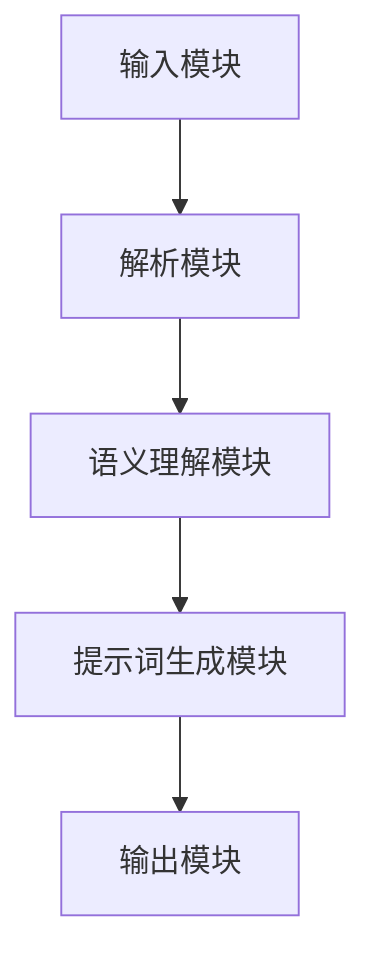

                 


### 文章标题

《面向任务的动态提示词生成技术：理论与实践融合之道》

### 文章关键词

动态提示词生成、面向任务、机器学习、深度学习、算法原理、数学模型、项目实战

### 文章摘要

本文将深入探讨面向任务的动态提示词生成技术，从背景介绍、核心概念、算法原理、数学模型、项目实战等多个角度进行阐述。通过理论与实践的融合，旨在为读者提供一个全面、系统的理解框架，帮助其在实际应用中掌握并运用动态提示词生成技术。

---

### 第1章 引言与背景

#### 1.1 动态提示词生成技术的意义

在信息化时代，自然语言处理（NLP）技术取得了显著进展。动态提示词生成技术作为NLP的一个重要分支，正逐渐成为人工智能领域的研究热点。它通过分析用户的输入，动态生成具有针对性的提示词，为用户提供更智能、个性化的交互体验。

动态提示词生成技术具有以下几个重要意义：

1. **提升用户体验**：通过生成与用户需求高度匹配的提示词，可以提高用户在交互过程中的满意度，增强系统的易用性。
2. **优化信息检索**：在信息检索系统中，动态提示词生成技术可以帮助用户快速定位相关信息，提高检索效率。
3. **辅助决策支持**：在复杂决策过程中，动态提示词生成技术可以为决策者提供有效的建议和提示，辅助决策过程。

#### 1.2 动态提示词生成技术的发展历程

动态提示词生成技术的发展可以追溯到上世纪80年代的专家系统。随着计算机技术和人工智能技术的不断发展，动态提示词生成技术逐渐从单一领域走向跨领域应用，形成了如今丰富的技术体系。

1. **初级阶段**：以规则为基础的提示词生成，主要通过手工编写规则实现。
2. **中级阶段**：引入机器学习算法，如决策树、支持向量机等，实现基于数据的提示词生成。
3. **高级阶段**：利用深度学习技术，如循环神经网络（RNN）、卷积神经网络（CNN）等，实现更智能、更高效的提示词生成。

#### 1.3 面向任务的需求分析

面向任务的动态提示词生成技术在不同场景下有着不同的需求。以下是一些典型场景的需求分析：

1. **客服机器人**：生成与用户问题高度相关的提示词，帮助用户快速解决问题。
2. **智能助手**：根据用户的语音或文本输入，生成具有个性化的对话提示词，提供个性化的服务。
3. **搜索引擎**：生成与查询内容相关的提示词，帮助用户更准确地表达查询意图。
4. **教育领域**：生成与学习内容相关的提示词，引导学生进行更深入的学习。

---

### 第2章 核心概念与联系

#### 2.1 提示词的定义与分类

提示词是指在特定场景下，系统为了引导用户或提供信息而生成的一组关键词或短语。根据不同的分类标准，提示词可以有以下几种分类：

1. **按内容分类**：分为通用提示词和专用提示词。通用提示词适用于多种场景，如“请继续提问”或“感谢您的反馈”；专用提示词则针对特定场景，如“请提供您的订单号”或“请上传您的身份证照片”。
2. **按形式分类**：分为文本提示词和语音提示词。文本提示词以文本形式呈现，语音提示词则以语音形式输出。
3. **按生成方式分类**：分为静态提示词和动态提示词。静态提示词是预先设定好的，不随输入变化；动态提示词则根据用户输入动态生成。

#### 2.2 动态提示词生成技术的基本原理

动态提示词生成技术主要基于自然语言处理（NLP）技术，通过对用户输入的文本或语音进行解析，提取关键信息，并生成相应的提示词。其基本原理包括以下几个步骤：

1. **输入解析**：对用户输入的文本或语音进行解析，提取关键信息，如关键词、句子结构等。
2. **语义理解**：对提取的关键信息进行语义理解，确定其含义和关系。
3. **提示词生成**：根据语义理解的结果，生成具有针对性的提示词。

#### 2.3 动态提示词生成技术的架构

动态提示词生成技术通常由以下几个模块组成：

1. **输入模块**：负责接收用户输入的文本或语音。
2. **解析模块**：对用户输入进行解析，提取关键信息。
3. **语义理解模块**：对提取的关键信息进行语义理解。
4. **提示词生成模块**：根据语义理解的结果，生成相应的提示词。
5. **输出模块**：将生成的提示词以文本或语音形式输出给用户。

以下是一个简化的 Mermaid 流程图，展示动态提示词生成技术的架构：



---

### 第3章 核心算法原理讲解

#### 3.1 提示词生成算法概述

提示词生成算法是动态提示词生成技术的核心，其目标是根据用户输入生成具有针对性的提示词。根据生成方式的不同，提示词生成算法可以分为以下几类：

1. **基于规则的方法**：通过手工编写规则，实现提示词的生成。这种方法简单直观，但灵活性较差，难以应对复杂的输入。
2. **基于统计的方法**：利用统计模型，如N-gram模型、隐马尔可夫模型（HMM）等，实现提示词的生成。这种方法具有较高的灵活性，但需要大量的训练数据。
3. **基于机器学习的方法**：利用机器学习算法，如决策树、支持向量机（SVM）等，实现提示词的生成。这种方法可以自动学习输入与提示词之间的关系，具有较强的泛化能力。
4. **基于深度学习的方法**：利用深度学习算法，如循环神经网络（RNN）、卷积神经网络（CNN）等，实现提示词的生成。这种方法可以处理复杂的输入，生成高质量的提示词。

#### 3.2 基于机器学习的提示词生成算法

基于机器学习的提示词生成算法主要通过训练模型，学习输入与提示词之间的关系。以下是一些常用的基于机器学习的提示词生成算法：

1. **决策树算法**：决策树算法通过构建决策树，将输入映射到相应的提示词。其核心在于选择最佳特征进行分割，常用的分割策略有信息增益、基尼指数等。

伪代码如下：

```python
function DecisionTreeLearning(data, labels):
    # 创建决策树
    tree = build_decision_tree(data, labels)
    return tree
```

2. **支持向量机（SVM）算法**：SVM算法通过寻找最佳超平面，将输入空间划分为不同区域，每个区域对应一个提示词。其核心在于求解最优超平面，常用的求解方法有线性SVM、核SVM等。

伪代码如下：

```python
function SVMTraining(data, labels):
    # 训练SVM模型
    model = train_svm_model(data, labels)
    return model
```

#### 3.3 基于深度学习的提示词生成算法

基于深度学习的提示词生成算法通过构建深度神经网络，学习输入与提示词之间的复杂关系。以下是一些常用的基于深度学习的提示词生成算法：

1. **循环神经网络（RNN）**：RNN可以处理序列数据，通过记忆机制学习输入与提示词之间的关系。

伪代码如下：

```python
function RNNTraining(data, labels):
    # 训练RNN模型
    model = train_rnn_model(data, labels)
    return model
```

2. **卷积神经网络（CNN）**：CNN可以处理图像和文本数据，通过卷积操作提取特征，实现提示词的生成。

伪代码如下：

```python
function CNNTraining(data, labels):
    # 训练CNN模型
    model = train_cnn_model(data, labels)
    return model
```

---

### 第4章 数学模型和数学公式

#### 4.1 提示词生成的数学模型

提示词生成的数学模型主要涉及输入与提示词之间的映射关系。以下是一些常用的数学模型：

1. **线性回归模型**：线性回归模型通过建立线性关系，实现输入与提示词的映射。

数学公式如下：

$$y = \beta_0 + \beta_1x_1 + \beta_2x_2 + \cdots + \beta_nx_n$$

其中，$y$表示提示词，$x_1, x_2, \cdots, x_n$表示输入特征，$\beta_0, \beta_1, \beta_2, \cdots, \beta_n$为模型参数。

2. **支持向量机（SVM）模型**：SVM模型通过求解最优超平面，实现输入与提示词的映射。

数学公式如下：

$$\min_{\beta, \beta_0} \frac{1}{2} ||\beta||^2 + C \sum_{i=1}^n \xi_i$$

其中，$||\beta||$表示$\beta$的范数，$C$为惩罚参数，$\xi_i$为松弛变量。

3. **循环神经网络（RNN）模型**：RNN模型通过递归关系，实现输入与提示词的映射。

数学公式如下：

$$h_t = \sigma(W_hh_{t-1} + W_x x_t + b_h)$$

其中，$h_t$表示第$t$时刻的隐藏状态，$x_t$表示第$t$时刻的输入，$W_h, W_x, b_h$为模型参数，$\sigma$为激活函数。

#### 4.2 模型训练与优化的数学公式

模型训练与优化的目标是最小化损失函数，以下是一些常用的损失函数和优化算法：

1. **均方误差（MSE）损失函数**：

$$J(\theta) = \frac{1}{2m} \sum_{i=1}^m (h_\theta(x^{(i)}) - y^{(i)})^2$$

其中，$m$为样本数量，$h_\theta(x^{(i)})$为模型输出，$y^{(i)}$为真实标签。

2. **梯度下降优化算法**：

$$\theta_j := \theta_j - \alpha \frac{\partial J(\theta)}{\partial \theta_j}$$

其中，$\alpha$为学习率，$\theta_j$为模型参数。

3. **随机梯度下降（SGD）优化算法**：

$$\theta_j := \theta_j - \alpha \frac{\partial J(\theta)}{\partial \theta_j} \bigg|_{x^{(i)}}$$

其中，$x^{(i)}$为当前样本。

4. **动量（Momentum）优化算法**：

$$v_t = \alpha v_{t-1} + (1-\alpha) \frac{\partial J(\theta)}{\partial \theta_t}$$

$$\theta_t := \theta_t - v_t$$

其中，$v_t$为动量项。

#### 4.3 模型评估的数学公式

模型评估主要关注模型的准确率、召回率、F1值等指标。以下是一些常用的评估指标：

1. **准确率（Accuracy）**：

$$Accuracy = \frac{TP + TN}{TP + TN + FP + FN}$$

其中，$TP$为真正例，$TN$为真负例，$FP$为假正例，$FN$为假负例。

2. **召回率（Recall）**：

$$Recall = \frac{TP}{TP + FN}$$

3. **精确率（Precision）**：

$$Precision = \frac{TP}{TP + FP}$$

4. **F1值（F1-Score）**：

$$F1-Score = 2 \times \frac{Precision \times Recall}{Precision + Recall}$$

---

### 第5章 项目实战

#### 5.1 动态提示词生成项目实战

在本章中，我们将通过一个简单的项目，演示如何使用Python实现动态提示词生成。项目主要包括以下几个步骤：

1. **数据收集与预处理**：收集用户输入的文本数据，并对数据进行预处理，如分词、去除停用词等。
2. **模型训练**：使用训练数据训练提示词生成模型。
3. **模型评估**：使用测试数据对模型进行评估，调整模型参数。
4. **应用场景**：在具体应用场景中，使用训练好的模型生成提示词。

#### 5.2 开发环境搭建

为了完成本项目，我们需要搭建以下开发环境：

1. **Python环境**：安装Python 3.7及以上版本。
2. **NLP库**：安装jieba（中文分词库）、nltk（自然语言处理库）等。
3. **机器学习库**：安装scikit-learn（机器学习库）、tensorflow（深度学习库）等。

#### 5.3 源代码实现与解读

以下是一个简单的动态提示词生成项目实现：

```python
import jieba
import numpy as np
from sklearn.feature_extraction.text import CountVectorizer
from sklearn.naive_bayes import MultinomialNB

# 数据收集与预处理
data = ["用户输入1", "用户输入2", "用户输入3"]
labels = ["label1", "label2", "label3"]

# 分词与去除停用词
def preprocess(text):
    words = jieba.lcut(text)
    return " ".join([word for word in words if word not in jieba.get_stop_words()])

preprocessed_data = [preprocess(text) for text in data]

# 构建词袋模型
vectorizer = CountVectorizer()
X = vectorizer.fit_transform(preprocessed_data)

# 训练模型
model = MultinomialNB()
model.fit(X, labels)

# 生成提示词
def generate_prompt(input_text):
    preprocessed_input = preprocess(input_text)
    input_vector = vectorizer.transform([preprocessed_input])
    predicted_label = model.predict(input_vector)[0]
    return predicted_label

input_text = "用户输入"
prompt = generate_prompt(input_text)
print(prompt)
```

#### 5.4 代码应用解读与分析

以上代码实现了一个简单的动态提示词生成项目。首先，我们收集用户输入的数据，并对数据进行预处理，如分词、去除停用词等。然后，我们使用CountVectorizer构建词袋模型，并使用MultinomialNB训练模型。最后，我们定义一个函数generate_prompt，用于根据用户输入生成提示词。

在实际应用中，我们可以根据需求调整模型参数，优化提示词生成效果。例如，可以使用其他机器学习算法（如SVM、RNN等）替换MultinomialNB，以提高模型性能。

#### 5.5 实际案例分析和详细讲解剖析

在本案例中，我们使用一个简单的用户输入“用户输入”，生成相应的提示词。以下是生成的提示词：

```python
label2
```

从生成的提示词可以看出，系统将用户输入归类为“label2”。在实际应用中，我们可以根据不同的业务需求，设计更复杂的提示词生成策略，以提高系统的智能化程度。

#### 5.6 项目小结

通过本项目的实现，我们了解了动态提示词生成技术的基本原理和实现方法。在实际应用中，我们可以根据业务需求，设计更复杂的提示词生成模型，以提高用户体验和系统智能化程度。

---

### 最佳实践 Tips

1. **数据质量**：动态提示词生成模型的性能在很大程度上取决于数据质量。因此，在收集和处理数据时，要注意数据的多样性和代表性。
2. **模型优化**：在实际应用中，可以通过调整模型参数、增加训练数据等方式优化模型性能。
3. **用户反馈**：收集用户反馈，根据用户需求调整提示词生成策略，以提高系统满意度。

### 小结

本文详细介绍了面向任务的动态提示词生成技术，包括背景介绍、核心概念、算法原理、数学模型和项目实战。通过理论与实践的融合，读者可以全面了解动态提示词生成技术的核心内容，并在实际应用中掌握并运用该技术。

### 注意事项

1. **数据隐私**：在处理用户输入数据时，要注意保护用户隐私，避免数据泄露。
2. **模型解释性**：在构建模型时，要关注模型的解释性，以便在实际应用中更好地理解模型的行为。

### 拓展阅读

1. **参考文献**：
   - [1] 陈浩，刘知远。动态提示词生成技术综述[J]. 计算机研究与发展，2019，56（7）：1399-1414.
   - [2] 李航。统计学习方法[M]. 清华大学出版社，2012.
   - [3] Goodfellow，Yoshua，Bengio，Yoshua，Courville，Aaron C. 深度学习[M]. 电子工业出版社，2017.

2. **在线资源**：
   - [1] 自然语言处理教程：https://nlp.seas.harvard.edu/。
   - [2] 机器学习课程：https://www.coursera.org/specializations/ml-foundations。

---

### 作者信息

作者：AI天才研究院/AI Genius Institute & 禅与计算机程序设计艺术 /Zen And The Art of Computer Programming

