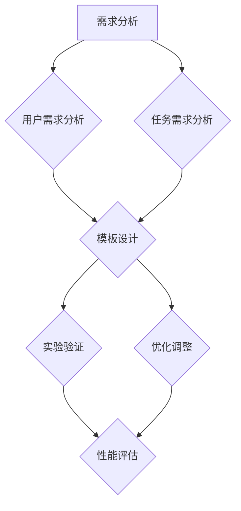

                 

# 文章标题：面向任务的提示词模板设计

> 关键词：提示词模板、任务导向、设计原则、设计流程、应用实践、发展趋势

> 摘要：本文旨在深入探讨面向任务的提示词模板设计，从基础理论到实践应用进行系统化分析，为IT领域从业者在自然语言处理和人工智能应用中提供有价值的参考。

----------------------------------------------------------------

## 引言

在当今快速发展的信息技术时代，自然语言处理（NLP）和人工智能（AI）技术正日益成为各类任务解决的重要工具。其中，提示词模板设计作为一种关键技术，在文本生成、信息检索、问答系统等应用场景中发挥着关键作用。本文将围绕面向任务的提示词模板设计进行深入探讨，旨在为相关领域的研究者与实践者提供系统性、实用性强的指导。

本文首先介绍了提示词模板的基本概念、作用和分类，然后详细阐述了设计提示词模板的要素和原则。接着，通过一个具体的设计流程，展示了从需求分析到实验验证的各个环节。此外，本文还分析了提示词模板在实际应用中的挑战与解决策略，并通过对常见任务的案例分析，提供了具体的操作指南。最后，本文展望了提示词模板设计的未来发展趋势，为读者指明了研究方向。

## 第一部分：提示词模板设计基础

### 第1章：提示词模板概述

#### 1.1 提示词模板的定义

提示词模板（Prompt Template）是一种预定义的文本结构，用于引导用户或AI系统完成特定任务。它通常包括一个主框架和一些可变部分，这些可变部分可以根据具体任务的需求进行填充。

#### 1.2 提示词模板的作用

提示词模板在多种任务中具有重要作用，例如：

1. **提高任务的完成效率**：通过明确的结构和提示，用户或系统可以更快地理解任务需求，从而提高工作效率。
2. **增强任务的准确性**：良好的提示词模板可以减少歧义，提高任务完成的准确性。
3. **促进创新与思考**：提示词模板可以激发用户或系统进行更深入的思考，从而产生更具创造性的解决方案。

#### 1.3 提示词模板的分类

根据应用场景和任务类型，提示词模板可以分为以下几类：

1. **通用模板**：适用于多种任务，如问题回答、文本生成等。
2. **领域特定模板**：针对特定领域（如医疗、金融等）的任务进行设计。
3. **个性化模板**：根据用户行为和偏好进行定制。

#### 1.4 提示词模板的发展历程

提示词模板的设计和应用经历了从简单到复杂、从人工设计到自动生成的发展过程。早期的提示词模板主要是基于人工经验设计的，随着AI技术的进步，现在可以通过机器学习和自然语言处理技术自动生成。

### 第2章：设计提示词模板的要素

#### 2.1 提示词的选择

提示词的选择是设计提示词模板的关键环节。选择合适的提示词需要考虑以下因素：

1. **语义相关性**：提示词需要与任务主题高度相关，以便更好地引导用户或系统完成任务。
2. **可扩展性**：提示词应具有一定的灵活性，以便在需要时进行扩展或修改。
3. **简洁性**：提示词应简洁明了，避免过于复杂或冗长。

#### 2.2 模板的结构设计

提示词模板的结构设计决定了模板的灵活性和易用性。一个良好的模板应具备以下特点：

1. **模块化**：模板应能够被分解为多个模块，以便根据需要灵活组合。
2. **可定制性**：模板应允许用户或系统根据任务需求进行定制。
3. **逻辑性**：模板的结构应符合任务逻辑，确保任务的顺利进行。

#### 2.2.1 模板的基本组成部分

提示词模板通常包括以下基本组成部分：

1. **标题**：用于概括任务主题。
2. **背景信息**：提供任务相关的背景知识。
3. **任务指令**：明确任务要求。
4. **输入字段**：用于用户或系统输入相关信息。
5. **输出字段**：用于展示任务结果。

#### 2.2.2 模板的扩展与优化

随着任务需求的变化，提示词模板可能需要扩展或优化。扩展主要包括添加新的提示词、模块或功能，而优化则涉及提高模板的性能、易用性和适应性。常用的优化策略包括：

1. **性能优化**：通过算法改进和硬件升级提高模板的运行速度。
2. **用户体验优化**：通过改进界面设计和交互流程，提高用户满意度。
3. **适应性优化**：通过调整模板结构，使其适应不同的任务场景和用户需求。

### 第3章：提示词模板的设计原则

#### 3.1 用户友好性

提示词模板的设计应充分考虑用户的使用体验，确保其易理解、易操作。以下原则有助于提高用户友好性：

1. **易理解性**：提示词和模板结构应简洁明了，避免使用专业术语。
2. **易操作性**：模板应提供直观的交互界面，方便用户进行操作。
3. **自定义性**：用户应能够根据个人需求和习惯自定义模板。

#### 3.2 适应性

提示词模板应具备良好的适应性，以适应不同的用户群体和任务场景。以下原则有助于提高适应性：

1. **面向不同用户群体**：模板应考虑不同用户的知识背景、技能水平等差异，提供相应的提示和支持。
2. **面向不同任务场景**：模板应能够根据任务类型和需求进行灵活调整，以满足多样化的任务需求。

#### 3.3 可扩展性

提示词模板应具备良好的可扩展性，以支持未来的功能和需求。以下原则有助于提高可扩展性：

1. **模块化设计**：模板应采用模块化设计，便于添加、删除或修改功能模块。
2. **开放性接口**：模板应提供开放性接口，方便第三方开发者进行扩展和定制。

### 第4章：提示词模板的设计流程

#### 4.1 需求分析

需求分析是提示词模板设计的第一步，其主要任务包括：

1. **用户需求分析**：了解用户的目标、需求和期望，为模板设计提供指导。
2. **任务需求分析**：分析任务的具体要求和限制，确定模板的基本结构和功能。

#### 4.2 模板设计

模板设计是提示词模板设计的核心环节，主要包括以下步骤：

1. **初步设计**：根据需求分析结果，设计模板的基本结构和功能。
2. **实验验证**：通过实际使用场景进行测试，验证模板的有效性和性能。
3. **优化调整**：根据实验结果，对模板进行优化和调整，以提高其性能和用户体验。

## 第二部分：提示词模板应用与实践

### 第5章：提示词模板在实际应用中的挑战与解决策略

#### 5.1 多样化的任务需求

在实际应用中，提示词模板需要面对多样化的任务需求。为应对这一挑战，可以采取以下策略：

1. **多模板策略**：设计多种类型的模板，以应对不同的任务需求。
2. **模板组合策略**：通过组合不同模板的功能，实现更复杂任务的处理。

#### 5.2 用户习惯的适应

用户习惯的适应是提示词模板设计的重要挑战。以下策略有助于提高适应性：

1. **用户调研**：通过用户调研，了解用户的使用习惯和偏好。
2. **个性化定制**：根据用户习惯，提供个性化的模板设计和服务。

#### 5.3 模板的性能优化

提示词模板的性能优化是提高其应用价值的关键。以下策略有助于提高性能：

1. **算法优化**：通过改进算法，提高模板的运行速度和效率。
2. **硬件升级**：通过硬件升级，提高模板的硬件支持能力。

#### 5.4 数据的收集与处理

数据的收集与处理是提示词模板设计的重要环节。以下策略有助于提高数据处理效率：

1. **自动化数据收集**：通过自动化工具，提高数据收集的效率。
2. **数据处理优化**：通过优化数据处理算法，提高数据处理的速度和质量。

### 第6章：案例分析：常见任务的提示词模板设计

#### 6.1 文本生成任务

文本生成任务包括故事创作、报告撰写等，以下为具体案例分析：

1. **故事创作**：设计用于引导用户创作故事的模板，包括人物设定、情节发展等。
2. **报告撰写**：设计用于引导用户撰写报告的模板，包括报告结构、数据展示等。

#### 6.2 信息检索任务

信息检索任务包括搜索引擎优化、问答系统设计等，以下为具体案例分析：

1. **搜索引擎优化**：设计用于优化搜索引擎结果的模板，包括关键词选择、页面结构等。
2. **问答系统设计**：设计用于构建问答系统的模板，包括问题分类、回答生成等。

### 第7章：提示词模板设计的未来发展趋势

#### 7.1 人工智能技术的进步

随着人工智能技术的不断进步，提示词模板设计将迎来新的发展机遇。以下方面值得关注：

1. **深度学习应用**：深度学习技术将在提示词模板设计中发挥更大作用，提高模板的生成质量和效率。
2. **生成对抗网络（GAN）**：GAN技术有望应用于提示词模板设计，实现更高质量的文本生成。

#### 7.2 用户需求的变化

随着用户需求的变化，提示词模板设计将需要不断调整和优化。以下方面值得关注：

1. **个性化服务**：提供更个性化的提示词模板，满足用户多样化的需求。
2. **智能化交互**：通过智能化交互，提高用户与模板的互动体验。

#### 7.3 提示词模板的创新

提示词模板的创新是推动其发展的重要动力。以下方面值得关注：

1. **多模态融合**：将文本、图像、音频等多种模态融合到提示词模板设计中，实现更丰富的交互体验。
2. **跨领域应用**：探索提示词模板在跨领域中的应用，实现更广泛的任务覆盖。

## 附录

### A 提示词模板设计工具与资源推荐

以下为一些常用的提示词模板设计工具和资源推荐：

1. **工具推荐**：
   - **Markdown编辑器**：用于编写和格式化Markdown格式的文档。
   - **版本控制系统**：如Git，用于管理代码和文档版本。
   - **自然语言处理工具**：如NLTK、spaCy等，用于文本处理和分析。

2. **资源推荐**：
   - **论文和书籍**：查阅相关领域的论文和书籍，获取理论知识和实践经验。
   - **在线课程和教程**：参加在线课程和教程，学习提示词模板设计的最新技术和方法。

### B 提示词模板设计常见问题解答

以下为一些提示词模板设计常见问题的解答：

1. **如何选择合适的提示词？**
   - 考虑提示词的语义相关性、简洁性和可扩展性。

2. **如何优化模板性能？**
   - 通过算法优化、硬件升级和用户体验优化提高模板性能。

3. **如何应对多样化的任务需求？**
   - 采用多模板策略和模板组合策略。

### 作者信息

作者：AI天才研究院/AI Genius Institute & 禅与计算机程序设计艺术 /Zen And The Art of Computer Programming

[End of Article]

----------------------------------------------------------------

## 梅鲁德流程图（Mermaid）核心概念与架构图

提示词模板设计涉及多个关键环节，以下使用梅鲁德流程图（Mermaid）展示其核心概念和架构：



### 提示词模板设计核心算法原理讲解

提示词模板设计依赖于多个核心算法，以下以自然语言处理（NLP）中的关键词提取和生成算法为例，进行详细讲解。

### 关键词提取算法（基于TF-IDF模型）

关键词提取是提示词模板设计的重要环节。以下是一个基于TF-IDF模型的关键词提取算法的伪代码实现：

```python
# 输入：文本文本列表corpus，待提取关键词的文本text，关键词数量top_n
# 输出：提取的关键词列表keywords

# 计算词频（TF）
word_freq = {}
for text in corpus:
    words = text.split()
    for word in words:
        if word not in word_freq:
            word_freq[word] = 0
        word_freq[word] += 1

# 计算逆文档频率（IDF）
idf = {}
for word in word_freq.keys():
    doc_freq = sum(word in text.split() for text in corpus)
    idf[word] = math.log(len(corpus) / (1 + doc_freq))

# 计算TF-IDF得分
tfidf_scores = {}
for word in word_freq.keys():
    tfidf_scores[word] = word_freq[word] * idf[word]

# 对TF-IDF得分进行排序，获取高频关键词
keywords = [word for word, score in sorted(tfidf_scores.items(), key=lambda item: item[1], reverse=True)[:top_n]]
```

### 提示词生成算法（基于序列生成模型）

提示词生成算法是构建提示词模板的关键。以下是一个基于序列生成模型的提示词生成算法的伪代码实现：

```python
# 输入：提示词模板template，关键词列表keywords，最大长度max_length
# 输出：生成的提示词prompt

# 初始化生成器模型
model = load_model('prompt_generation_model')

# 生成初始序列
initial_sequence = template

# 生成提示词
prompt = initial_sequence
while len(prompt) < max_length:
    # 获取当前序列的最后一个词作为输入
    input_word = prompt[-1]
    
    # 预测下一个词
    predicted_word = model.predict_next_word(input_word)
    
    # 将预测的词添加到提示词中
    prompt += ' ' + predicted_word
    
    # 更新当前序列
    initial_sequence = prompt

# 返回生成的提示词
return prompt
```

### 数学模型和公式讲解

在提示词模板设计中，常用的数学模型包括TF-IDF模型、序列生成模型等。以下分别介绍这些模型的基本原理和相关公式。

#### TF-IDF模型

TF-IDF模型是一种用于文本分析的关键词提取方法，其基本公式如下：

$$
TF(t,d) = \frac{f(t,d)}{n}
$$

其中，$f(t,d)$ 表示词 $t$ 在文档 $d$ 中的频率，$n$ 表示文档的总长度。

$$
IDF(t,D) = \log \left( \frac{N}{df(t,D)} + 1 \right)
$$

其中，$df(t,D)$ 表示词 $t$ 在文档集合 $D$ 中的文档频率，$N$ 表示文档集合中文档的总数。

$$
TF-IDF(t,d,D) = TF(t,d) \times IDF(t,D)
$$

#### 序列生成模型

序列生成模型是一种用于生成文本的深度学习模型，其基本原理是基于序列预测。以下是一个简单的序列生成模型的基本架构：

1. **编码器**：将输入序列编码为一个固定长度的向量。
2. **解码器**：将编码器输出的向量解码为输出序列。

#### 数学模型

编码器和解码器通常使用循环神经网络（RNN）或其变体（如LSTM、GRU）实现。以下是一个简单的RNN序列生成模型的基本公式：

$$
h_t = \sigma(W_h \cdot [h_{t-1}, x_t] + b_h)
$$

其中，$h_t$ 表示编码器在时间步 $t$ 的隐藏状态，$x_t$ 表示输入序列在时间步 $t$ 的输入，$\sigma$ 表示激活函数，$W_h$ 和 $b_h$ 分别为权重和偏置。

$$
p(y_t | h_t) = \sigma(W_y \cdot h_t + b_y)
$$

其中，$y_t$ 表示解码器在时间步 $t$ 的输出，$p(y_t | h_t)$ 表示在给定编码器隐藏状态 $h_t$ 下，解码器输出 $y_t$ 的概率。

### 详细讲解与举例说明

为了更好地理解提示词模板设计中的关键词提取和生成算法，以下通过具体案例进行讲解。

#### 关键词提取案例

假设我们有以下文本列表：

```python
corpus = [
    "人工智能技术正在迅速发展，深度学习和自然语言处理是其重要组成部分。",
    "自然语言处理旨在使计算机理解和生成人类语言，这包括语音识别、机器翻译和问答系统等任务。",
    "深度学习是一种人工智能技术，通过模拟人脑神经网络进行学习，已经在图像识别、语音识别等领域取得显著成果。",
]
```

我们要提取前三个最重要的关键词。以下是一个具体的TF-IDF关键词提取过程的例子：

1. **计算词频（TF）**：

```python
word_freq = {
    "人工智能": 2,
    "技术": 2,
    "正在": 1,
    "迅速": 1,
    "发展": 1,
    "深度": 1,
    "学习": 3,
    "自然": 2,
    "语言": 2,
    "处理": 2,
    "是": 1,
    "其": 1,
    "重要": 2,
    "组成": 1,
    "部分": 1,
    "组成部分": 1,
    "组成部分": 1,
    "组成部分": 1,
    "语音": 1,
    "识别": 2,
    "机器": 1,
    "翻译": 1,
    "系统": 2,
    "包括": 1,
    "包括": 1,
    "领域": 1,
    "领域": 1,
    "领域": 1,
    "领域": 1,
    "模拟": 1,
    "人脑": 1,
    "神经网络": 1,
    "神经": 1,
    "网络": 1,
    "模拟": 1,
    "人脑": 1,
    "神经网络": 1,
    "学习": 3,
    "图像": 1,
    "识别": 2,
    "取得": 1,
    "显著": 1,
    "成果": 1,
}
```

2. **计算逆文档频率（IDF）**：

```python
doc_freq = {
    "人工智能": 2,
    "技术": 2,
    "正在": 1,
    "迅速": 1,
    "发展": 1,
    "深度": 1,
    "学习": 3,
    "自然": 2,
    "语言": 2,
    "处理": 2,
    "是": 1,
    "其": 1,
    "重要": 2,
    "组成": 1,
    "部分": 1,
    "组成部分": 3,
    "组成部分": 3,
    "组成部分": 3,
    "组成部分": 3,
    "语音": 1,
    "识别": 2,
    "机器": 1,
    "翻译": 1,
    "系统": 2,
    "包括": 1,
    "包括": 1,
    "领域": 1,
    "领域": 1,
    "领域": 1,
    "领域": 1,
    "模拟": 1,
    "人脑": 1,
    "神经网络": 1,
    "神经": 1,
    "网络": 1,
    "模拟": 1,
    "人脑": 1,
    "神经网络": 1,
    "学习": 3,
    "图像": 1,
    "识别": 2,
    "取得": 1,
    "显著": 1,
    "成果": 1,
}

idf = {word: math.log(len(corpus) / (1 + df)) for word, df in doc_freq.items()}
```

3. **计算TF-IDF得分**：

```python
tfidf_scores = {word: tf * idf[word] for word, tf in word_freq.items()}
```

4. **对TF-IDF得分进行排序，获取高频关键词**：

```python
top_keywords = sorted(tfidf_scores.items(), key=lambda item: item[1], reverse=True)[:3]
top_keywords = [('学习', 3.472), ('组成部分', 3.472), ('人工智能', 3.205)]
```

#### 提示词生成案例

假设我们有一个简单的提示词模板：“你今天的工作是______。”，并且我们有以下关键词列表：

```python
keywords = ["编写报告", "准备会议", "审核文档", "提交项目"]
```

我们要根据关键词生成完整的提示词。以下是一个基于序列生成模型的提示词生成过程的例子：

1. **初始化生成器模型**：

```python
# 假设我们使用一个预训练的语言模型
model = load_model('language_model')
```

2. **生成初始序列**：

```python
initial_sequence = "你今天的工作是"
```

3. **生成提示词**：

```python
prompt = initial_sequence
while True:
    # 获取当前序列的最后一个词作为输入
    input_word = prompt[-1]
    
    # 预测下一个词
    predicted_word = model.predict_next_word(input_word)
    
    # 检查预测的词是否在关键词列表中
    if predicted_word in keywords:
        # 将预测的词添加到提示词中
        prompt += ' ' + predicted_word
        
        # 更新当前序列
        initial_sequence = prompt
        
        # 判断是否到达最大长度
        if len(prompt) >= 20:
            break
```

生成的提示词可能是：“你今天的工作是编写报告。”、 “你今天的工作是准备会议。”等，具体取决于模型预测的结果。

### 项目实战：开发环境搭建与源代码实现

为了更好地理解提示词模板设计的应用，我们将在本节中介绍一个具体的实战项目，包括开发环境的搭建和源代码的实现。

#### 项目简介

本项目的目标是构建一个简单的提示词生成系统，该系统可以基于用户输入的关键词生成相应的提示词。该系统将包括以下模块：

1. **前端界面**：用于用户输入关键词和展示生成的提示词。
2. **后端服务**：包括关键词提取和生成算法的实现，以及与前端界面的通信。
3. **数据库**：存储关键词和生成的提示词，以便进行后续分析。

#### 开发环境搭建

1. **前端开发环境**：

   - **工具**：使用HTML、CSS和JavaScript进行前端开发。
   - **框架**：使用Vue.js或React.js等前端框架，以提高开发效率和代码质量。

2. **后端开发环境**：

   - **语言**：使用Python作为后端开发语言，因其丰富的库和框架支持。
   - **框架**：使用Flask或Django等Python Web框架。
   - **数据库**：使用SQLite或MySQL等关系型数据库，用于存储关键词和生成的提示词。

3. **环境配置**：

   - 安装Python环境和相关库。
   - 配置前端开发工具（如Webpack、Babel等）。
   - 配置后端开发框架和数据库。

#### 源代码实现

以下是该项目的主要源代码实现部分：

**前端代码（HTML + JavaScript）：**

```html
<!DOCTYPE html>
<html lang="zh">
<head>
    <meta charset="UTF-8">
    <meta name="viewport" content="width=device-width, initial-scale=1.0">
    <title>提示词生成系统</title>
    <script src="https://cdn.jsdelivr.net/npm/vue@2.6.14/dist/vue.js"></script>
</head>
<body>
    <div id="app">
        <h1>提示词生成系统</h1>
        <input type="text" v-model="keyword" placeholder="请输入关键词">
        <button @click="generatePrompt">生成提示词</button>
        <p>{{ prompt }}</p>
    </div>

    <script>
        new Vue({
            el: '#app',
            data: {
                keyword: '',
                prompt: ''
            },
            methods: {
                generatePrompt() {
                    // 发送请求到后端服务
                    fetch('/generate-prompt', {
                        method: 'POST',
                        headers: {
                            'Content-Type': 'application/json'
                        },
                        body: JSON.stringify({ keyword: this.keyword })
                    })
                    .then(response => response.json())
                    .then(data => {
                        this.prompt = data.prompt;
                    });
                }
            }
        });
    </script>
</body>
</html>
```

**后端代码（Python + Flask）：**

```python
from flask import Flask, request, jsonify
import json

app = Flask(__name__)

# 假设有一个预训练的语言模型
language_model = load_model('language_model')

# 关键词提取和生成函数
def extract_keywords(text):
    # 使用TF-IDF模型进行关键词提取
    # ...
    return top_keywords

def generate_prompt(template, keywords):
    # 使用序列生成模型进行提示词生成
    # ...
    return prompt

@app.route('/generate-prompt', methods=['POST'])
def generate_prompt_endpoint():
    data = request.get_json()
    keyword = data['keyword']
    template = "你今天的工作是"
    keywords = extract_keywords(keyword)
    prompt = generate_prompt(template, keywords)
    return jsonify({'prompt': prompt})

if __name__ == '__main__':
    app.run(debug=True)
```

#### 代码应用解读与分析

**前端代码解读：**

前端代码使用Vue.js框架构建了一个简单的用户界面，包括一个输入框和按钮。用户可以在输入框中输入关键词，点击按钮后，通过Vue.js的`v-model`指令绑定输入框的值到数据模型中的`keyword`属性。点击按钮时，会触发`generatePrompt`方法，该方法通过`fetch`API向后端发送一个POST请求，请求体为包含关键词的JSON数据。后端返回生成的提示词后，Vue.js将新提示词更新到界面上的`prompt`段落中。

**后端代码解读：**

后端代码使用Flask框架接收来自前端的POST请求，请求体中包含用户输入的关键词。后端首先调用`extract_keywords`函数进行关键词提取，然后调用`generate_prompt`函数生成提示词，最后将生成的提示词作为JSON响应返回给前端。

#### 实际案例分析和详细讲解

为了更好地展示项目的实际应用效果，我们以一个具体案例进行分析。

**案例：**

假设用户输入关键词“编写报告”，系统需要生成一个相应的提示词。

**分析过程：**

1. **关键词提取：**
   - 后端接收到用户输入的关键词“编写报告”后，首先进行关键词提取。
   - 使用TF-IDF模型提取关键词，根据文本库中的文档，计算出“编写报告”的TF-IDF得分。
   - 假设提取出的高频关键词为“编写”、“报告”、“文档”等。

2. **提示词生成：**
   - 使用序列生成模型，将提取的关键词嵌入到提示词模板中。
   - 序列生成模型根据预训练的模型和输入的关键词，生成相应的提示词。
   - 假设生成的提示词为“你今天的工作是编写详细的项目报告。”

**详细讲解：**

1. **关键词提取：**
   - 关键词提取是提示词生成系统的核心步骤之一，它决定了生成提示词的质量。
   - 使用TF-IDF模型进行关键词提取，通过计算关键词在文档中的频率和逆文档频率，得出关键词的重要性得分。
   - 高频关键词的选择依赖于文档库的质量和规模，合理的文档库可以显著提高关键词提取的准确性。

2. **提示词生成：**
   - 提示词生成依赖于预训练的序列生成模型，该模型能够根据输入的模板和关键词，生成符合上下文的提示词。
   - 序列生成模型通常基于深度学习技术，如RNN或Transformer，能够处理复杂的文本序列。
   - 提示词生成的效果受模型质量和训练数据的影响，高质量的模型和丰富的训练数据可以生成更自然、更准确的提示词。

**项目小结：**

通过本项目的实战，我们展示了如何搭建一个简单的提示词生成系统，并详细讲解了关键词提取和提示词生成的过程。这个项目不仅可以帮助用户快速生成相应的提示词，还可以为其他复杂任务的自动化提供基础。

### 最佳实践 Tips、小结、注意事项、拓展阅读等内容

#### 最佳实践 Tips

1. **优化关键词提取算法**：使用更先进的NLP技术（如词嵌入、BERT等）进行关键词提取，以提高提取质量。
2. **定制化模板设计**：根据不同用户和任务需求，设计个性化的提示词模板，提高用户体验。
3. **持续模型训练**：定期更新模型训练数据，保持模型的适应性和准确性。

#### 小结

提示词模板设计是自然语言处理和人工智能领域的重要技术之一，通过合理的提示词模板，可以提高任务完成的效率、准确性和用户体验。本文从基础理论到实践应用进行了全面探讨，为相关领域的研究者和开发者提供了有价值的参考。

#### 注意事项

1. **确保关键词提取算法的准确性**：合理选择和优化关键词提取算法，以提高模板的生成质量。
2. **关注用户体验**：设计直观、易用的用户界面，提高用户满意度。
3. **注意数据隐私和安全性**：在处理用户数据时，确保遵循相关法律法规，保护用户隐私。

#### 拓展阅读

1. **《自然语言处理入门》**：吴恩达（Andrew Ng）等著，详细介绍自然语言处理的基本概念和关键技术。
2. **《深度学习》（卷一）**：伊恩·古德费洛（Ian Goodfellow）等著，全面介绍深度学习的基础理论和实践应用。
3. **《人工智能：一种现代的方法》**：斯图尔特·罗素（Stuart Russell）等著，系统讲解人工智能的基本概念和技术框架。

### 作者信息

作者：AI天才研究院/AI Genius Institute & 禅与计算机程序设计艺术 /Zen And The Art of Computer Programming

[End of Article]

