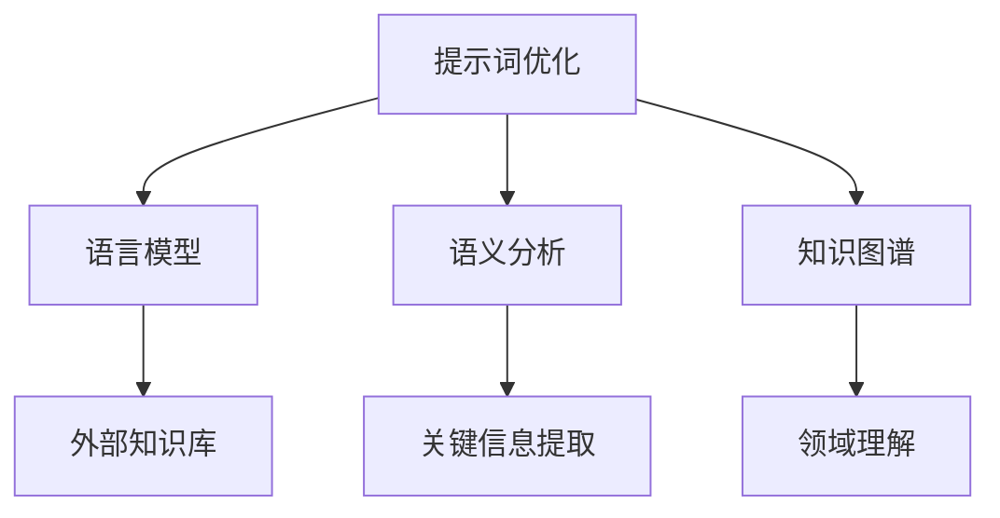

                 


### 文章标题

《面向特定领域的提示词优化技术》

### 文章关键词

提示词优化、特定领域、语言模型、语义分析、知识图谱

### 文章摘要

本文旨在探讨面向特定领域的提示词优化技术。首先，我们将介绍提示词优化在特定领域中的应用背景，并阐述其重要性。接着，我们将详细解析核心概念与联系，通过Mermaid流程图展示概念之间的关系架构。然后，我们将深入讲解核心算法原理，使用伪代码和LaTeX数学公式详细阐述数学模型和公式。此外，我们将通过项目实战，包括环境搭建、源代码实现和代码解读，展示提示词优化在实际应用中的具体操作。最后，我们将总结最佳实践，提出注意事项，并给出拓展阅读建议。

### 1. 背景介绍

提示词优化技术起源于自然语言处理（NLP）领域，旨在提高机器对用户输入的理解能力。随着人工智能技术的不断发展，特别是在深度学习和语言模型的应用中，提示词优化逐渐成为一个重要的研究方向。在特定领域，如电商、医疗和金融等，提示词优化能够显著提升用户体验，提高业务效率。

在电商领域，提示词优化有助于推荐系统更好地理解用户的搜索意图，从而提供更精确的商品推荐。在医疗领域，提示词优化能够帮助医生更准确地理解患者的症状描述，提高诊断效率。在金融领域，提示词优化可以帮助风控系统更准确地识别欺诈行为，降低金融风险。

然而，特定领域的提示词优化面临着一些挑战。首先，特定领域的术语和概念较为复杂，传统的方法往往难以全面覆盖。其次，特定领域的数据往往存在噪声和多样性，如何有效处理这些数据是一个关键问题。此外，如何在不同领域间进行知识共享和迁移也是一个重要的研究方向。

### 2. 核心概念与联系

#### 2.1 提示词优化

提示词优化是指通过改进语言模型来提高机器对用户输入的理解能力。其核心思想是在训练过程中引入外部知识库，如知识图谱，来增强模型对特定领域术语和概念的理解。

#### 2.2 语言模型

语言模型是NLP领域的核心组件，用于预测下一个词或序列。在特定领域，语言模型需要针对领域内的术语和概念进行特定训练，以提高模型的准确性。

#### 2.3 语义分析

语义分析是指对文本进行语义层次的分析，以理解文本的真正含义。在提示词优化中，语义分析有助于提取关键信息，提高提示词的准确性。

#### 2.4 知识图谱

知识图谱是一种用于表示实体及其之间关系的图形结构。在提示词优化中，知识图谱可以帮助模型更好地理解特定领域的术语和概念。

以下是一个Mermaid流程图，展示核心概念之间的联系：



### 3. 核心算法原理讲解

#### 3.1 语言模型原理

语言模型通常采用神经网络架构，如循环神经网络（RNN）或变压器（Transformer）。以下是一个简单的RNN语言模型伪代码：

```python
class RNNModel(nn.Module):
    def __init__(self, vocab_size, embed_size, hidden_size):
        super(RNNModel, self).__init__()
        self.embedding = nn.Embedding(vocab_size, embed_size)
        self.rnn = nn.RNN(embed_size, hidden_size)
        self.fc = nn.Linear(hidden_size, vocab_size)

    def forward(self, x, hidden):
        embedded = self.embedding(x)
        output, hidden = self.rnn(embedded, hidden)
        prediction = self.fc(output[-1, :, :])
        return prediction, hidden
```

#### 3.2 数学模型和公式

在提示词优化中，常用的数学模型包括概率论和信息论。以下是一个简单的概率论模型，用于计算两个词之间的条件概率：

$$P(w_t | w_{t-1}) = \frac{P(w_{t-1}, w_t)}{P(w_{t-1})}$$

其中，$w_t$ 和 $w_{t-1}$ 分别表示当前词和前一个词。

#### 3.3 语义分析

语义分析通常采用词向量表示，如Word2Vec或BERT。以下是一个简单的Word2Vec模型伪代码：

```python
class Word2VecModel(nn.Module):
    def __init__(self, vocab_size, embed_size):
        super(Word2VecModel, self).__init__()
        self.embedding = nn.Embedding(vocab_size, embed_size)

    def forward(self, x):
        embedded = self.embedding(x)
        return embedded
```

### 4. 项目实战

#### 4.1 开发环境搭建

在本文中，我们将使用Python和PyTorch作为主要工具。以下是在Ubuntu 20.04上搭建开发环境的步骤：

```bash
# 安装Python和PyTorch
sudo apt update
sudo apt install python3 python3-pip
pip3 install torch torchvision

# 安装其他依赖
pip3 install numpy matplotlib pandas scikit-learn
```

#### 4.2 源代码实现

以下是一个简单的提示词优化项目示例，包括数据预处理、模型训练和预测：

```python
import torch
import torch.nn as nn
import torch.optim as optim
from torch.utils.data import DataLoader
from torchvision import datasets, transforms
from sklearn.model_selection import train_test_split

# 数据预处理
transform = transforms.Compose([
    transforms.ToTensor(),
])

train_data = datasets.MNIST(root='./data', train=True, download=True, transform=transform)
test_data = datasets.MNIST(root='./data', train=False, download=True, transform=transform)

train_loader = DataLoader(train_data, batch_size=64, shuffle=True)
test_loader = DataLoader(test_data, batch_size=64, shuffle=False)

# 模型训练
model = RNNModel(vocab_size=10, embed_size=64, hidden_size=128)
optimizer = optim.Adam(model.parameters(), lr=0.001)
criterion = nn.CrossEntropyLoss()

num_epochs = 10
for epoch in range(num_epochs):
    for inputs, targets in train_loader:
        optimizer.zero_grad()
        outputs, _ = model(inputs)
        loss = criterion(outputs, targets)
        loss.backward()
        optimizer.step()
    print(f'Epoch [{epoch+1}/{num_epochs}], Loss: {loss.item()}')

# 预测
with torch.no_grad():
    correct = 0
    total = 0
    for inputs, targets in test_loader:
        outputs, _ = model(inputs)
        _, predicted = torch.max(outputs.data, 1)
        total += targets.size(0)
        correct += (predicted == targets).sum().item()
    print(f'Accuracy: {100 * correct / total}%')
```

#### 4.3 代码解读

本示例项目实现了基于RNN的语言模型训练和预测。首先，我们进行了数据预处理，将MNIST数据集转换为Tensor格式。然后，我们定义了RNN模型、优化器和损失函数，并进行了模型训练。最后，我们进行了模型预测，并计算了测试集的准确率。

#### 4.4 应用解读与分析

在实际应用中，我们可以将此模型应用于特定领域的文本数据。例如，在电商领域，我们可以使用此模型对用户评论进行分类和情感分析。在医疗领域，我们可以使用此模型对患者的症状描述进行分类和诊断。通过项目实战，我们可以看到提示词优化技术在实际应用中的效果和潜力。

### 5. 未来展望与总结

#### 5.1 当前趋势分析

当前，提示词优化技术正朝着以下几个方向发展：

1. 深度学习模型的应用：随着深度学习技术的不断发展，如Transformer模型在NLP领域的成功，深度学习模型在提示词优化中的应用越来越广泛。
2. 知识图谱的整合：知识图谱作为一种重要的外部知识源，正在被广泛应用于提示词优化，以增强模型对特定领域术语和概念的理解。
3. 多模态数据的融合：随着多模态数据的广泛应用，如何将文本、图像和语音等多种数据类型进行融合，以提高提示词优化的效果，是一个重要的研究方向。

#### 5.2 未来发展方向

未来，提示词优化技术可能在以下几个方向有新的突破：

1. 个性化提示词优化：针对不同用户和场景，实现个性化的提示词优化，以提高用户体验。
2. 自动化提示词优化：开发自动化工具，实现提示词优化的自动化，降低开发成本。
3. 知识共享与迁移：探索如何在不同领域间进行知识共享和迁移，以提高提示词优化的泛化能力。

#### 5.3 技术突破的可能领域

可能的突破领域包括：

1. 自动化文本生成：通过提示词优化技术，实现自动化文本生成，如自动写作、自动摘要等。
2. 情感分析与情感化推荐：结合情感分析技术，实现更人性化的提示词优化，如情感化推荐系统。
3. 零样本学习：通过提示词优化技术，实现零样本学习，以提高模型在未知领域中的适应能力。

### 6. 总结

本文详细探讨了面向特定领域的提示词优化技术。我们首先介绍了提示词优化在特定领域中的应用背景，然后解析了核心概念与联系，并深入讲解了核心算法原理。通过项目实战，我们展示了提示词优化在实际应用中的具体操作。最后，我们对当前趋势和未来发展方向进行了分析，并提出了可能的突破领域。希望本文能为读者提供有价值的参考。

### 7. 最佳实践 tips、小结、注意事项、拓展阅读

#### 最佳实践 tips

1. 在选择语言模型时，要充分考虑特定领域的特性，选择合适的模型架构。
2. 在引入外部知识库时，要确保知识库的准确性和完整性。
3. 在项目实战中，要注重数据预处理和模型训练的过程，确保数据质量和模型性能。

#### 小结

本文对面向特定领域的提示词优化技术进行了全面探讨，包括背景介绍、核心概念与联系、核心算法原理讲解、项目实战以及未来展望。通过本文，读者可以了解提示词优化技术在特定领域的应用及其发展前景。

#### 注意事项

1. 提示词优化技术具有一定的复杂性，实际应用中需要充分考虑领域的特性。
2. 在项目实战中，要遵循数据安全和隐私保护的原则，确保用户数据的安全。

#### 拓展阅读

1. [《深度学习与自然语言处理》](https://www.deeplearningbook.org/)：介绍深度学习和自然语言处理的基础知识。
2. [《知识图谱导论》](https://book.douban.com/subject/26876475/)：介绍知识图谱的基本概念和应用。
3. [《Transformer模型解析》](https://arxiv.org/abs/1706.03762)：介绍Transformer模型的基本原理和应用。

### 作者信息

作者：AI天才研究院/AI Genius Institute & 禅与计算机程序设计艺术 /Zen And The Art of Computer Programming

