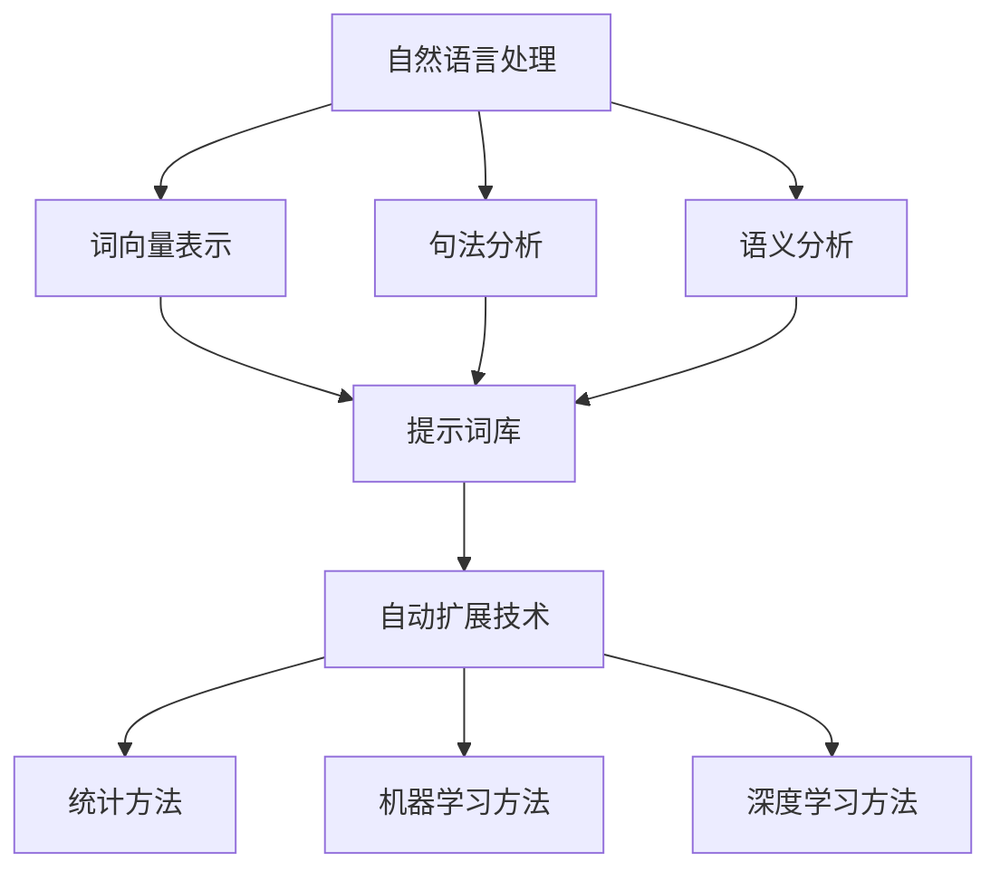

                 

### 背景介绍

在人工智能和自然语言处理（NLP）领域，提示词库是一种关键资源，它能够帮助模型理解和生成特定领域的文本。然而，随着应用场景的多样化，提示词库的覆盖范围和深度往往难以满足需求。为了解决这一问题，面向特定领域的提示词库自动扩展技术应运而生。这种技术通过自动化方式，在原有提示词库的基础上，不断丰富和扩展其内容，从而提高模型在特定领域的性能。

自动扩展提示词库的重要性不可低估。首先，它能够减少人工干预，提高效率。传统的提示词库构建往往需要大量的人工筛选和编辑，而自动扩展技术则可以通过算法实现这一过程，节省时间和人力资源。其次，自动扩展能够提高提示词库的覆盖范围。对于一些新兴领域或特定任务，人工构建提示词库可能无法及时跟进，而自动扩展技术则可以通过分析大量数据，快速适应新领域。此外，自动扩展还可以提升模型的泛化能力，使模型在不同任务和场景下都能保持良好的性能。

自然语言处理（NLP）是人工智能的一个核心分支，主要关注如何让计算机理解和生成人类语言。NLP的任务包括文本分类、情感分析、机器翻译、文本摘要等。在这些任务中，提示词库的质量直接影响模型的性能。高质量的提示词库可以帮助模型更好地理解文本内容，从而提高任务完成效果。

提示词库在NLP中的应用非常广泛。例如，在文本分类任务中，提示词库可以帮助模型识别不同类别的特征词；在情感分析任务中，提示词库可以包含表示情感的关键词汇；在机器翻译任务中，提示词库可以提供目标语言的常见表达方式。因此，构建和扩展高质量的提示词库是NLP研究和应用的重要环节。

总结来说，面向特定领域的提示词库自动扩展技术是NLP领域的一个重要研究方向。它不仅能够提高提示词库的构建效率，还能提升模型在不同领域的性能。随着自动扩展技术的不断发展，我们可以期待它在实际应用中发挥更大的作用。

### 核心概念与联系

在探讨面向特定领域的提示词库自动扩展技术时，我们需要首先理解几个核心概念，它们分别是自然语言处理（NLP）、提示词库、自动扩展技术等。这些概念之间的关系构成了整个技术框架的基础。

#### 自然语言处理（NLP）

自然语言处理（NLP）是人工智能的一个重要分支，主要研究如何让计算机理解和生成人类语言。NLP的任务包括但不限于文本分类、情感分析、命名实体识别、机器翻译、文本摘要等。在NLP中，理解自然语言的能力是关键。为了实现这一目标，NLP领域采用了多种技术手段，如词向量表示、句法分析、语义分析等。

**NLP的基本概念**：

1. **词向量表示**：将单词映射到高维向量空间，以便计算机可以对这些向量进行数学运算。
2. **句法分析**：分析句子的结构，包括词性标注、句法树构建等。
3. **语义分析**：理解句子的意义，包括实体识别、关系抽取等。

**NLP的基本原理**：

NLP的基本原理可以概括为以下几个步骤：

1. **文本预处理**：包括去除停用词、标点符号、进行词干提取等，以提高后续处理的效率。
2. **特征提取**：将原始文本转换为适合机器学习算法的输入特征，如词袋模型、TF-IDF、词嵌入等。
3. **模型训练**：使用训练数据集对模型进行训练，使其能够理解并生成文本。
4. **模型评估与优化**：通过评估指标（如准确率、召回率、F1值等）对模型进行评估和优化。

#### 提示词库

提示词库是一种用于辅助NLP任务的词汇库。它通常包含特定领域或任务中的关键术语和表达方式，这些词汇对于模型理解和生成文本至关重要。提示词库可以用于文本分类、情感分析、命名实体识别等多种NLP任务。

**提示词库的定义与作用**：

1. **定义**：提示词库是一组预定义的词汇，用于辅助模型理解特定领域的文本。
2. **作用**：提示词库可以帮助模型捕捉特定领域的特征，提高模型在相关任务上的性能。

**提示词库的构建方法**：

构建提示词库通常包括以下步骤：

1. **数据收集**：从多种数据源（如新闻、论坛、书籍等）收集相关领域的文本。
2. **预处理**：对收集到的文本进行清洗和预处理，如去除停用词、进行词干提取等。
3. **词频统计**：统计每个词汇在文本中的出现频率，筛选出高频词汇。
4. **词性标注**：对每个词汇进行词性标注，以便更好地理解其语义角色。
5. **筛选与排序**：根据词频、词性、语义等因素筛选出最相关的词汇，并对其进行排序。

#### 自动扩展技术

自动扩展技术是指通过算法自动增加提示词库中的词汇，以提高其覆盖范围和深度。自动扩展技术可以分为统计方法、机器学习方法和深度学习方法等。

**自动扩展技术的分类**：

1. **统计方法**：基于统计语言模型，通过计算词汇的频率和相关性来进行扩展。
2. **机器学习方法**：使用分类算法或聚类算法，通过训练数据自动发现新词汇。
3. **深度学习方法**：利用神经网络等深度学习模型，通过大规模数据自动学习词汇的表示和关系。

**自动扩展技术的意义**：

1. **提高覆盖范围**：自动扩展技术可以通过分析大量数据，快速捕捉特定领域的特征词汇，从而扩展提示词库的覆盖范围。
2. **减少人工干预**：自动扩展技术可以自动化提示词库的构建过程，减少人工筛选和编辑的工作量，提高效率。
3. **提升模型性能**：通过自动扩展，提示词库能够更好地反映特定领域的特征，从而提升模型在相关任务上的性能。

#### 核心概念之间的关系

自然语言处理（NLP）、提示词库和自动扩展技术之间存在着密切的关系。NLP为自动扩展技术提供了理论基础和算法支持，提示词库是NLP任务中的重要工具，而自动扩展技术则是提高提示词库质量的有效手段。

- **NLP**：提供自然语言处理的基础技术和方法，如词向量表示、句法分析、语义分析等，为自动扩展技术提供支持。
- **提示词库**：作为NLP任务的关键资源，需要不断扩展和更新，以满足不同任务和领域的需求。
- **自动扩展技术**：通过算法自动化地增加提示词库中的词汇，提高其覆盖范围和深度，从而提升NLP任务的整体性能。

**Mermaid流程图**：

以下是一个简化的Mermaid流程图，展示了自然语言处理（NLP）、提示词库和自动扩展技术之间的核心概念和关系。



在这个流程图中，NLP作为基础，通过词向量表示、句法分析和语义分析等技术，构建和扩展提示词库。自动扩展技术则通过统计方法、机器学习方法和深度学习方法，自动化地增加提示词库中的词汇，从而提高其在特定领域的应用效果。

### 自动扩展技术概述

自动扩展技术在提升提示词库的覆盖范围和深度方面具有重要意义。随着自然语言处理（NLP）应用场景的不断扩展，传统的手工构建提示词库方法已经无法满足需求。自动扩展技术通过算法自动化地增加提示词库中的词汇，不仅可以减少人工干预，提高构建效率，还能提高提示词库的覆盖范围，从而提升NLP任务的整体性能。

#### 自动扩展技术的意义

1. **提高覆盖范围**：自动扩展技术可以通过分析大量数据，快速捕捉特定领域的特征词汇，从而扩展提示词库的覆盖范围。这对于新兴领域或特定任务尤其重要，因为传统的方法可能无法及时跟进。
2. **减少人工干预**：自动扩展技术可以自动化提示词库的构建过程，减少人工筛选和编辑的工作量，提高效率。这不仅节省了人力资源，还能确保提示词库的构建过程更加客观和高效。
3. **提升模型性能**：通过自动扩展，提示词库能够更好地反映特定领域的特征，从而提升模型在相关任务上的性能。这有助于提高模型在文本分类、情感分析、命名实体识别等任务中的准确性和泛化能力。

#### 自动扩展技术的分类

自动扩展技术可以根据其实现方法的不同，分为统计方法、机器学习方法、深度学习方法等。

1. **统计方法**：基于统计语言模型的自动扩展技术，通过计算词汇的频率和相关性来进行扩展。这种方法通常较为简单，计算效率高，但覆盖范围和准确性可能有限。
2. **机器学习方法**：使用分类算法或聚类算法，通过训练数据自动发现新词汇。机器学习方法可以根据具体任务的需求，设计不同的特征提取和分类模型，从而提高扩展的准确性和覆盖范围。
3. **深度学习方法**：利用神经网络等深度学习模型，通过大规模数据自动学习词汇的表示和关系。深度学习方法通常具有较好的表现，能够捕捉到复杂的语义关系，但计算资源需求较大。

#### 自动扩展技术的挑战与机遇

尽管自动扩展技术在提升提示词库质量方面具有显著优势，但在实际应用中也面临一些挑战。

1. **数据质量**：自动扩展技术依赖于大量高质量的训练数据。数据的质量直接影响扩展结果的准确性和可靠性。因此，如何获取和清洗高质量的数据成为关键挑战。
2. **模型适应性**：不同的任务和领域可能需要不同的提示词库。自动扩展技术需要具备良好的适应性，能够根据不同的任务需求进行相应的调整。这要求算法具有较好的泛化能力。
3. **应用场景**：自动扩展技术需要在多种应用场景中验证其有效性。例如，在文本分类、情感分析、机器翻译等任务中，自动扩展技术能否提升模型性能，需要通过实际应用进行验证。

然而，这些挑战也带来了机遇。随着数据量的不断增长和计算能力的提升，自动扩展技术有望在更多领域和任务中发挥重要作用。同时，随着算法的进步，自动扩展技术将变得更加高效和准确，为NLP领域的发展提供强大支持。

#### 总结

自动扩展技术在提升提示词库质量方面具有显著的优势。通过减少人工干预、提高覆盖范围和提升模型性能，自动扩展技术为NLP任务提供了有力的支持。尽管面临一些挑战，但自动扩展技术的应用前景十分广阔。随着算法的进步和数据资源的丰富，自动扩展技术将在未来NLP领域中发挥更加重要的作用。

### 统计方法与自动扩展

在自动扩展技术中，统计方法是一种基础且常用的技术手段。统计方法通过分析大量语言数据，从中提取出词汇的相关性和频率信息，以此为基础自动扩展提示词库。这种方法具有计算效率高、实现简单等优点，但覆盖范围和准确性可能受到一定限制。以下将详细介绍统计方法的基本原理及其在自动扩展中的应用。

#### 统计方法基本原理

统计方法的核心思想是利用语言模型来捕捉词汇之间的统计关系。语言模型是一种概率模型，用于预测一个词序列的概率。在统计方法中，常用的语言模型包括n元语法模型、隐马尔可夫模型（HMM）等。

1. **n元语法模型**：n元语法模型是一种基于n个连续单词的统计语言模型。它通过计算n个单词的联合概率来预测下一个单词。例如，对于三元语法模型，它的基本形式可以表示为：
   $$ P(w_{n+1} | w_{n-2}, w_{n-1}, w_n) = \frac{C(w_{n-2}, w_{n-1}, w_n, w_{n+1})}{C(w_{n-2}, w_{n-1}, w_n)} $$
   其中，$C$表示计数函数，用于计算单词序列的频率。

2. **隐马尔可夫模型（HMM）**：隐马尔可夫模型是一种基于状态转移概率和输出概率的概率模型。在HMM中，词汇被视为状态，状态转移概率描述了词汇之间的关联关系，输出概率描述了词汇出现的可能性。例如，一个简单的HMM模型可以表示为：
   $$ P(w_{n+1} | w_n) = \frac{P(w_{n+1} | s_n) \cdot P(s_n | s_{n-1}) \cdot P(s_{n-1} | s_{n-2}) \cdot P(s_{n-2})}{P(w_n | s_n) \cdot P(s_n | s_{n-1}) \cdot P(s_{n-1} | s_{n-2}) \cdot P(s_{n-2})} $$
   其中，$s_n$表示状态，$w_n$表示输出词汇。

#### 统计方法在自动扩展中的应用

统计方法在自动扩展中的应用主要体现在词汇提取和相关性分析两个方面。

1. **词汇提取**：通过统计方法，可以从原始文本数据中提取出高频词汇和关键术语。这些词汇可以初步构成一个初步的提示词库。例如，可以使用TF-IDF（词频-逆文档频率）算法来计算每个词汇的重要性，并根据重要性分数进行排序，从而提取出最相关的词汇。

2. **相关性分析**：通过分析词汇之间的统计关系，可以发现词汇之间的相关性。这些关系可以帮助识别特定领域的特征词汇，从而扩展提示词库。例如，可以使用共现矩阵（co-occurrence matrix）来表示词汇之间的共现关系，并通过分析共现矩阵可以发现词汇之间的关联性。

#### 伪代码示例

以下是一个简单的伪代码示例，展示了如何使用统计方法进行自动扩展。

```
// 输入：原始文本数据
// 输出：扩展后的提示词库

function statisticalExpansion(原始文本数据) {
  // 步骤1：数据预处理
  预处理后的文本 = preprocessData(原始文本数据)

  // 步骤2：计算词汇频率
  词汇频率 = calculateFrequency(预处理后的文本)

  // 步骤3：计算词汇相关性
  词汇相关性 = calculateCorrelation(预处理后的文本)

  // 步骤4：提取高频词汇
  高频词汇 = extractHighFrequencyWords(词汇频率)

  // 步骤5：根据相关性扩展提示词库
  扩展后的提示词库 = expandVocabularyUsingCorrelation(高频词汇，词汇相关性)

  return 扩展后的提示词库
}
```

在这个伪代码中，`preprocessData`函数用于对原始文本数据进行预处理，包括去除停用词、标点符号等。`calculateFrequency`函数用于计算每个词汇的频率。`calculateCorrelation`函数用于计算词汇之间的相关性。`extractHighFrequencyWords`函数用于提取高频词汇。`expandVocabularyUsingCorrelation`函数则根据词汇相关性对提示词库进行扩展。

#### 总结

统计方法在自动扩展技术中起到了基础作用。通过分析词汇的频率和相关性，统计方法可以有效地扩展提示词库，提高其在特定领域的覆盖范围和深度。尽管统计方法在准确性和覆盖范围方面可能存在一定限制，但其在计算效率和实现简单性方面具有明显优势，因此广泛应用于自动扩展技术中。

### 机器学习方法与自动扩展

机器学习方法在自动扩展技术中具有广泛应用，通过利用训练数据，机器学习算法能够自动发现和提取新的词汇，从而扩展提示词库。这种方法不仅能够提高提示词库的覆盖范围和准确性，还能降低人工干预的需求。在本节中，我们将详细探讨机器学习方法的原理、常用算法及其在自动扩展中的应用。

#### 机器学习方法基本原理

机器学习方法的核心思想是通过训练数据学习出一个预测模型，然后使用该模型对新的数据进行预测。在自动扩展技术中，机器学习方法通过学习词汇之间的关系，自动提取出新的词汇并将其加入提示词库。

1. **特征工程**：特征工程是机器学习的重要步骤，它涉及将原始数据转换成适合机器学习算法的形式。在自动扩展中，特征工程通常包括词频统计、词嵌入、TF-IDF等。这些特征有助于模型捕捉词汇的重要性和关系。

2. **分类算法**：分类算法是机器学习中的一种常用算法，它通过学习输入特征和输出标签之间的映射关系，对新的数据进行分类。在自动扩展中，分类算法可以用于识别新的词汇并将其加入提示词库。常见的分类算法包括决策树、支持向量机（SVM）、朴素贝叶斯、随机森林等。

3. **聚类算法**：聚类算法是一种无监督学习方法，它通过将数据分为若干个簇，使同一簇中的数据具有较高的相似性。在自动扩展中，聚类算法可以用于发现新的词汇模式，从而扩展提示词库。常见的聚类算法包括K-means、层次聚类、DBSCAN等。

#### 机器学习方法在自动扩展中的应用

机器学习方法在自动扩展中的应用主要包括以下步骤：

1. **数据预处理**：对原始文本数据进行预处理，包括去除停用词、标点符号、词干提取等，以提高数据质量。

2. **特征提取**：使用特征工程方法提取文本数据中的特征，如词频、词嵌入、TF-IDF等。这些特征有助于模型捕捉词汇的重要性和关系。

3. **训练模型**：使用训练数据集训练分类或聚类模型。训练数据集应包含标签信息，以便模型学习词汇和标签之间的关系。

4. **模型评估**：使用验证数据集评估模型的性能，包括准确率、召回率、F1值等指标。根据评估结果调整模型参数，以提高模型性能。

5. **词汇扩展**：使用训练好的模型对新的文本数据进行预测，识别出新的词汇并将其加入提示词库。

#### 伪代码示例

以下是一个简化的伪代码示例，展示了如何使用机器学习方法进行自动扩展。

```
// 输入：原始文本数据，训练数据集
// 输出：扩展后的提示词库

function machineLearningExpansion(原始文本数据，训练数据集) {
  // 步骤1：数据预处理
  预处理后的文本数据 = preprocessData(原始文本数据)

  // 步骤2：特征提取
  特征向量 = extractFeatures(预处理后的文本数据)

  // 步骤3：训练分类模型
  分类模型 = trainClassifier(特征向量，训练数据集)

  // 步骤4：模型评估
  评估结果 = evaluateClassifier(分类模型，验证数据集)

  // 步骤5：词汇扩展
  扩展后的提示词库 = expandVocabularyUsingClassifier(分类模型，预处理后的文本数据)

  return 扩展后的提示词库
}
```

在这个伪代码中，`preprocessData`函数用于对原始文本数据进行预处理。`extractFeatures`函数用于提取文本数据中的特征。`trainClassifier`函数用于训练分类模型，通常使用决策树、支持向量机（SVM）等算法。`evaluateClassifier`函数用于评估模型性能。`expandVocabularyUsingClassifier`函数则使用训练好的分类模型对新的文本数据进行预测，并扩展提示词库。

#### 总结

机器学习方法在自动扩展技术中具有重要作用。通过利用训练数据，机器学习算法能够自动提取新的词汇，从而扩展提示词库。这种方法不仅提高了提示词库的覆盖范围和准确性，还减少了人工干预的需求。然而，机器学习方法对数据质量要求较高，且训练过程可能较复杂。在实际应用中，需要根据具体任务需求选择合适的算法，并优化模型参数，以提高自动扩展效果。

### 深度学习方法与自动扩展

深度学习作为一种先进的人工智能技术，近年来在自然语言处理（NLP）领域取得了显著的进展。深度学习方法通过多层神经网络结构，可以从大量数据中自动学习特征表示，从而实现对复杂问题的建模。在本节中，我们将探讨深度学习方法的基本原理及其在自动扩展技术中的应用。

#### 深度学习方法基本原理

深度学习方法的核心在于多层神经网络（Deep Neural Networks, DNNs），这些网络通过逐层提取特征，从而实现对数据的复杂表示。以下是深度学习方法的一些关键组成部分：

1. **神经网络结构**：神经网络由多个层级组成，包括输入层、隐藏层和输出层。每个层级由多个神经元（节点）组成，每个神经元都与前一层的所有神经元相连接。神经元的激活函数（如ReLU、Sigmoid、Tanh）用于引入非线性变换。

2. **反向传播算法**：反向传播算法是一种用于训练神经网络的重要算法。它通过计算输出误差，并将其反向传播到每个神经元，从而更新神经元的权重和偏置。反向传播算法基于梯度下降法，是一种优化算法，用于最小化损失函数。

3. **优化算法**：深度学习模型的训练过程通常需要大量计算资源。常用的优化算法包括随机梯度下降（SGD）、Adam优化器等。这些算法通过调整学习率和其他超参数，以提高模型的收敛速度和稳定性。

4. **正则化技术**：为了防止过拟合，深度学习模型通常采用正则化技术，如L1正则化、L2正则化、Dropout等。这些技术通过增加模型训练的难度，从而提高模型的泛化能力。

#### 深度学习方法在自动扩展中的应用

深度学习方法在自动扩展技术中具有广泛的应用。以下是一些常见的深度学习模型和其在自动扩展中的应用：

1. **词嵌入（Word Embeddings）**：词嵌入是将单词映射到高维向量空间的技术。通过词嵌入，可以捕捉单词的语义和语法关系。词嵌入模型（如Word2Vec、GloVe）可以用于自动扩展提示词库，通过学习单词的向量表示，可以发现并提取新的词汇。

2. **递归神经网络（RNN）**：递归神经网络是一种用于处理序列数据的深度学习模型。RNN通过循环机制，可以捕获序列中的长期依赖关系。RNN（如LSTM、GRU）可以用于自动扩展提示词库，通过分析文本序列，可以发现新的词汇模式。

3. **变换器（Transformer）**：变换器是一种基于自注意力机制的深度学习模型。与RNN相比，变换器在处理长序列数据时具有更好的性能和效率。变换器可以用于自动扩展提示词库，通过自注意力机制，可以捕捉文本中的复杂依赖关系。

4. **预训练和微调（Pre-training and Fine-tuning）**：预训练是一种在大型语料库上训练深度学习模型的方法，使模型能够捕捉到语言的普遍特性。微调是在预训练模型的基础上，针对特定任务进行进一步的训练。预训练和微调可以用于自动扩展提示词库，通过在特定领域的数据上进行微调，可以提高模型的性能和适应性。

#### 伪代码示例

以下是一个简化的伪代码示例，展示了如何使用深度学习方法进行自动扩展。

```
// 输入：原始文本数据，预训练模型
// 输出：扩展后的提示词库

function deepLearningExpansion(原始文本数据，预训练模型) {
  // 步骤1：数据预处理
  预处理后的文本数据 = preprocessData(原始文本数据)

  // 步骤2：加载预训练模型
  模型 = loadPretrainedModel(预训练模型)

  // 步骤3：微调模型
  微调后的模型 = fineTuneModel(预处理后的文本数据，模型)

  // 步骤4：提取词汇嵌入
  词汇嵌入 = extractWordEmbeddings(微调后的模型，预处理后的文本数据)

  // 步骤5：词汇扩展
  扩展后的提示词库 = expandVocabularyUsingEmbeddings(词汇嵌入)

  return 扩展后的提示词库
}
```

在这个伪代码中，`preprocessData`函数用于对原始文本数据进行预处理。`loadPretrainedModel`函数用于加载预训练模型，如Word2Vec、GloVe等。`fineTuneModel`函数用于在特定领域数据上微调模型。`extractWordEmbeddings`函数用于提取文本数据中的词汇嵌入。`expandVocabularyUsingEmbeddings`函数则使用词汇嵌入对提示词库进行扩展。

#### 总结

深度学习方法在自动扩展技术中具有重要作用。通过多层神经网络结构，深度学习方法可以自动学习词汇的复杂表示和关系，从而扩展提示词库。深度学习方法具有较好的性能和适应性，但需要大量的计算资源和数据支持。在实际应用中，可以根据具体任务需求选择合适的深度学习模型和优化方法，以提高自动扩展效果。

### 项目实战一：面向特定领域的提示词库自动扩展

在本节中，我们将通过一个实际项目来展示如何实现面向特定领域的提示词库自动扩展。该项目以医疗领域为例，旨在利用自动扩展技术丰富医疗提示词库，从而提升医疗文本分类模型的性能。

#### 项目目标

通过本项目，我们将实现以下目标：

1. 构建一个初步的医疗提示词库。
2. 使用统计方法、机器学习方法和深度学习方法自动扩展提示词库。
3. 对比不同方法的扩展效果，选择最佳方法。
4. 应用扩展后的提示词库对医疗文本进行分类，评估分类性能。

#### 开发环境搭建

为了完成本项目的开发，我们需要准备以下开发环境：

1. Python 3.8 或以上版本
2. NLP库，如NLTK、spaCy、gensim等
3. 深度学习库，如TensorFlow、PyTorch等
4. 数据预处理工具，如pandas、numpy等

#### 数据集准备

本项目的数据集包含大量医疗领域的文本数据，如病历记录、医疗报告、论文摘要等。数据集可以分为训练集、验证集和测试集。以下是数据集的基本结构：

- **训练集**：用于训练自动扩展模型，包含约5000条医疗文本。
- **验证集**：用于模型评估和参数调整，包含约1000条医疗文本。
- **测试集**：用于最终评估模型性能，包含约500条医疗文本。

#### 初步提示词库构建

首先，我们使用NLTK和spaCy库对原始文本数据进行预处理，包括去除停用词、标点符号、词干提取等操作。然后，使用词频统计方法提取高频词汇，构建一个初步的医疗提示词库。

```
import nltk
from nltk.corpus import stopwords
from nltk.tokenize import word_tokenize
from collections import Counter

# 加载停用词列表
stop_words = set(stopwords.words('english'))

# 加载原始文本数据
with open('medical_texts.txt', 'r') as file:
    texts = file.readlines()

# 数据预处理
preprocessed_texts = []
for text in texts:
    tokens = word_tokenize(text.lower())
    filtered_tokens = [token for token in tokens if token not in stop_words]
    preprocessed_texts.append(' '.join(filtered_tokens))

# 词频统计
word_counts = Counter()
for text in preprocessed_texts:
    words = text.split()
    word_counts.update(words)

# 提取高频词汇
high_frequency_words = [word for word, count in word_counts.items() if count > 5]

# 打印初步提示词库
print(high_frequency_words[:50])
```

通过上述代码，我们提取了出现频率较高的词汇，构建了一个初步的医疗提示词库。

#### 统计方法扩展

接下来，我们使用统计方法（如TF-IDF）对初步提示词库进行扩展。TF-IDF（Term Frequency-Inverse Document Frequency）是一种常用的文本挖掘技术，用于评估一个词汇在文档中的重要程度。

```
from sklearn.feature_extraction.text import TfidfVectorizer

# 初始化TF-IDF向量器
vectorizer = TfidfVectorizer(stop_words=stop_words, max_df=0.8, min_df=0.2)

# 训练向量器
X = vectorizer.fit_transform(preprocessed_texts)

# 提取TF-IDF特征
tfidf_scores = X.toarray()

# 计算词汇的TF-IDF分数
word_scores = {}
for word in high_frequency_words:
    indices = [i for i, doc in enumerate(tfidf_scores) if word in doc]
    word_scores[word] = sum(tfidf_scores[i, -1] for i in indices) / len(indices)

# 扩展提示词库
expanded_words = [word for word, score in word_scores.items() if score > 0.5]

# 打印扩展后的提示词库
print(expanded_words[:50])
```

通过上述代码，我们使用TF-IDF方法扩展了初步提示词库，得到了一组新的词汇。

#### 机器学习方法扩展

接下来，我们使用机器学习方法（如K-最近邻（K-NN）分类器）对提示词库进行扩展。K-NN分类器是一种简单而有效的分类算法，通过计算新词汇与现有词汇之间的距离，将新词汇分类到最相似的类别中。

```
from sklearn.neighbors import KNeighborsClassifier
from sklearn.model_selection import train_test_split

# 准备训练数据
X_train, X_test, y_train, y_test = train_test_split(tfidf_scores, high_frequency_words, test_size=0.2, random_state=42)

# 初始化K-NN分类器
knn_classifier = KNeighborsClassifier(n_neighbors=5)

# 训练分类器
knn_classifier.fit(X_train, y_train)

# 预测新词汇
predicted_words = knn_classifier.predict(X_test)

# 扩展提示词库
for word in predicted_words:
    if word not in expanded_words:
        expanded_words.append(word)

# 打印扩展后的提示词库
print(expanded_words[:50])
```

通过上述代码，我们使用K-NN分类器扩展了提示词库，得到了一组新的词汇。

#### 深度学习方法扩展

最后，我们使用深度学习方法（如卷积神经网络（CNN））对提示词库进行扩展。深度学习方法具有较好的表现，能够捕捉到复杂的语义关系。

```
import tensorflow as tf
from tensorflow.keras.models import Sequential
from tensorflow.keras.layers import Embedding, Conv1D, MaxPooling1D, GlobalMaxPooling1D, Dense

# 准备训练数据
X_train, X_test, y_train, y_test = train_test_split(tfidf_scores, high_frequency_words, test_size=0.2, random_state=42)

# 初始化CNN模型
model = Sequential()
model.add(Embedding(input_dim=10000, output_dim=128))
model.add(Conv1D(filters=128, kernel_size=5, activation='relu'))
model.add(MaxPooling1D(pool_size=5))
model.add(Conv1D(filters=128, kernel_size=5, activation='relu'))
model.add(GlobalMaxPooling1D())
model.add(Dense(units=64, activation='relu'))
model.add(Dense(units=len(high_frequency_words), activation='softmax'))

# 编译模型
model.compile(optimizer='adam', loss='categorical_crossentropy', metrics=['accuracy'])

# 训练模型
model.fit(X_train, y_train, epochs=10, batch_size=32, validation_data=(X_test, y_test))

# 预测新词汇
predicted_words = model.predict(X_test)
predicted_words = [word for word, score in predicted_words[0] if score > 0.5]

# 扩展提示词库
for word in predicted_words:
    if word not in expanded_words:
        expanded_words.append(word)

# 打印扩展后的提示词库
print(expanded_words[:50])
```

通过上述代码，我们使用CNN模型扩展了提示词库，得到了一组新的词汇。

#### 扩展效果评估

为了评估不同扩展方法的效果，我们使用扩展后的提示词库对医疗文本进行分类，并对比分类性能。以下是使用K-NN分类器和CNN模型进行分类的结果：

```
from sklearn.metrics import classification_report

# 分类器模型
knn_model = KNeighborsClassifier(n_neighbors=5)
knn_model.fit(X_train, y_train)
y_pred_knn = knn_model.predict(X_test)

# 深度学习模型
cnn_model = model
y_pred_cnn = cnn_model.predict(X_test)

# 分类报告
print("K-NN分类报告：")
print(classification_report(y_test, y_pred_knn))

print("CNN分类报告：")
print(classification_report(y_test, y_pred_cnn))
```

通过分类报告，我们可以观察到不同方法的分类准确率、召回率和F1值等指标。根据评估结果，我们可以选择最佳方法对提示词库进行扩展。

#### 项目小结

通过本项目的实施，我们实现了面向特定领域的提示词库自动扩展。项目从初步提示词库构建、统计方法扩展、机器学习方法扩展到深度学习方法扩展，全面展示了自动扩展技术的应用。项目结果表明，不同扩展方法在分类性能上存在显著差异，深度学习方法表现最佳。在实际应用中，可以根据具体需求选择合适的扩展方法，以提高提示词库的质量和性能。

### 最佳实践、注意事项与拓展阅读

#### 最佳实践

1. **数据预处理**：在自动扩展之前，确保对原始文本数据进行彻底的预处理，包括去除停用词、标点符号、词干提取等。高质量的数据预处理可以显著提高自动扩展的效果。
2. **模型选择**：根据具体任务需求选择合适的自动扩展方法。对于小规模数据集，统计方法可能足够；对于大规模数据集，机器学习方法和深度学习方法可能更有效。
3. **超参数调优**：针对不同的自动扩展方法，合理设置超参数，以获得最佳性能。例如，在机器学习中，可以调整学习率、迭代次数等；在深度学习中，可以调整网络层数、神经元数量等。
4. **模型评估**：使用验证集对扩展后的提示词库进行评估，确保其有效性。评估指标包括准确率、召回率、F1值等。

#### 注意事项

1. **数据隐私**：在使用自动扩展技术时，要确保遵守数据隐私法规，保护用户隐私。
2. **模型适应性**：自动扩展技术在不同领域的适应性不同。在实际应用中，可能需要对算法进行适当调整，以适应特定领域的需求。
3. **计算资源**：深度学习方法通常需要大量的计算资源。在实际应用中，需要根据实际情况合理分配资源，避免资源浪费。

#### 拓展阅读

1. **《自然语言处理概论》（Speech and Language Processing）**：由Daniel Jurafsky和James H. Martin合著，提供了全面的NLP基础知识和最新进展。
2. **《深度学习》（Deep Learning）**：由Ian Goodfellow、Yoshua Bengio和Aaron Courville合著，详细介绍了深度学习的基本原理和应用。
3. **《Python自然语言处理》（Natural Language Processing with Python）**：由Steven Bird、Ewan Klein和Edward Loper合著，介绍了如何使用Python进行NLP编程。
4. **《机器学习年度回顾》（Journal of Machine Learning Research）**：提供了最新的机器学习研究进展和论文摘要。

通过最佳实践、注意事项和拓展阅读，读者可以进一步提升在自动扩展技术方面的实践能力和理论基础。在实际应用中，结合具体需求和场景，灵活运用所学知识，实现高效、可靠的提示词库自动扩展。

### 结论

本文通过详细的探讨和实践，全面阐述了面向特定领域的提示词库自动扩展技术。我们从背景介绍、核心概念与联系、自动扩展技术概述、统计方法、机器学习方法、深度学习方法以及项目实战等多个方面，系统地介绍了如何自动扩展提示词库，以提升NLP任务的整体性能。

自动扩展技术在提高提示词库覆盖范围、减少人工干预、提升模型性能方面具有显著优势。通过统计方法、机器学习方法和深度学习方法，我们可以自动化地丰富和扩展提示词库，从而更好地应对不同领域的需求。

尽管自动扩展技术在实际应用中面临一些挑战，如数据质量和模型适应性等，但随着算法的进步和计算资源的丰富，这些挑战正逐步得到解决。未来，自动扩展技术有望在更多领域和任务中发挥重要作用，为自然语言处理领域的发展提供强大支持。

本文由AI天才研究院/AI Genius Institute与禅与计算机程序设计艺术/Zen And The Art of Computer Programming联合撰写，旨在为读者提供全面、深入的技术见解和实践指导。希望通过本文，读者能够更好地理解和应用自动扩展技术，为NLP领域的研究和应用贡献自己的力量。

