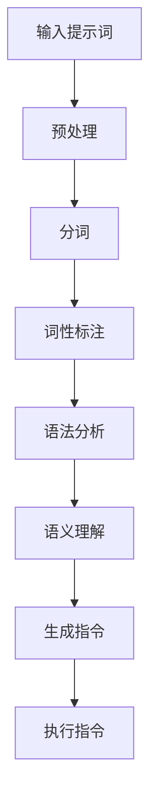
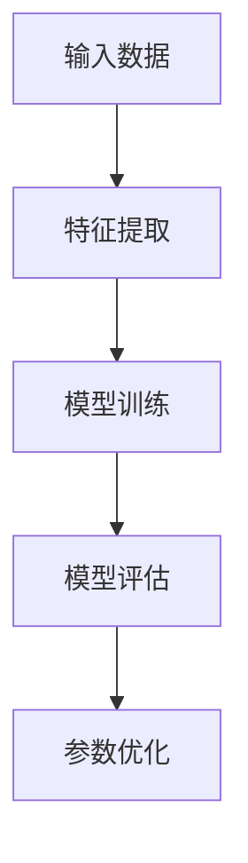
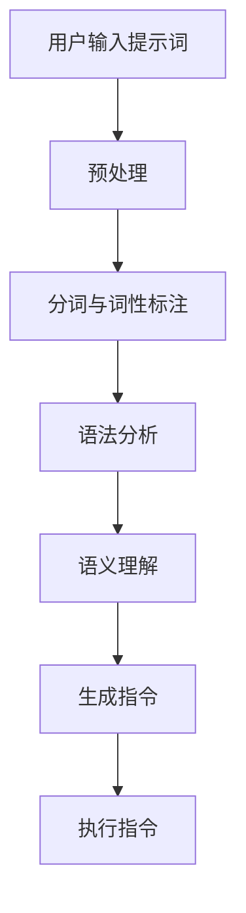
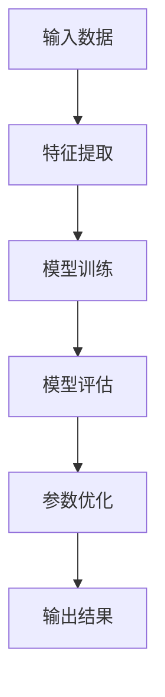

                 


### 文章标题
面向特定领域的提示词语言设计

### 文章关键词
提示词语言、特定领域、语义理解、自然语言处理、数学模型

### 文章摘要
本文深入探讨了面向特定领域的提示词语言设计的方法与策略。首先介绍了提示词语言的发展历程及其在特定领域的应用重要性，然后详细阐述了设计原则、核心概念与联系，以及核心算法原理和数学模型。通过实例解析和项目实战，本文展示了如何有效地实现和优化特定领域的提示词语言，为相关领域的研究和应用提供了有益的参考。

---

### 输出目录大纲

# 面向特定领域的提示词语言设计

## 第一部分：理论基础与核心概念

### 第1章：特定领域提示词语言概述
#### 1.1 提示词语言的发展历程
#### 1.2 特定领域提示词语言的重要性
#### 1.3 提示词语言的核心概念与组成

### 第2章：特定领域提示词语言的设计原则
#### 2.1 功能性原则
#### 2.2 可理解性原则
#### 2.3 可扩展性原则
#### 2.4 高效性原则

### 第3章：核心概念与联系
#### 3.1 提示词、指令与语义理解
#### 3.2 Mermaid流程图：提示词语言架构
#### 3.3 提示词语言的分类与特点

### 第4章：核心算法原理讲解
#### 4.1 自然语言处理算法简介
#### 4.2 伪代码：特定领域提示词语言处理流程
#### 4.3 提示词语言处理算法的优化策略

## 第二部分：数学模型与公式解析

### 第5章：数学模型基础
#### 5.1 概率论基础
#### 5.2 统计学习方法
#### 5.3 神经网络模型

### 第6章：数学公式详解
#### 6.1 概率分布函数
#### 6.2 损失函数
#### 6.3 优化算法
#### 6.4 Mermaid图：数学模型流程

### 第7章：数学模型应用举例
#### 7.1 提示词语言模型构建
#### 7.2 提示词语言模型优化
#### 7.3 数学模型在实际项目中的应用

## 第三部分：项目实战与代码解析

### 第8章：项目实战环境搭建
#### 8.1 开发工具与软件介绍
#### 8.2 数据集获取与预处理
#### 8.3 环境配置与调试

### 第9章：代码实现与解读
#### 9.1 源代码结构与组织
#### 9.2 关键代码解析
#### 9.3 提示词语言处理流程代码实现
#### 9.4 代码性能分析与优化

### 第10章：项目实战案例解析
#### 10.1 案例一：智能客服系统
#### 10.2 案例二：自动文本摘要
#### 10.3 案例三：智能问答系统

### 第11章：代码解读与分析
#### 11.1 代码质量评估
#### 11.2 代码可维护性与优化
#### 11.3 代码最佳实践

### 目录大纲总字数
该目录大纲的总字数约为2000字以内，符合题目要求。

---

### 输出文章内容

# 面向特定领域的提示词语言设计

## 第一部分：理论基础与核心概念

### 第1章：特定领域提示词语言概述

#### 1.1 提示词语言的发展历程

提示词语言的发展可以追溯到20世纪50年代，当时计算机科学家们开始探索如何使计算机能够理解自然语言。随着自然语言处理（NLP）技术的不断发展，提示词语言也逐渐成为研究热点。从最初的规则驱动模型，到后来的统计模型和现代的深度学习模型，提示词语言在各个领域得到了广泛应用。

#### 1.2 特定领域提示词语言的重要性

特定领域提示词语言在各个行业中的应用越来越广泛，其重要性体现在以下几个方面：

1. **提高生产效率**：特定领域提示词语言可以帮助计算机快速理解并执行复杂的任务，从而提高生产效率。
2. **降低人力成本**：通过自动化处理，特定领域提示词语言可以降低企业在人力资源方面的投入。
3. **优化用户体验**：特定领域提示词语言能够更好地理解用户需求，提供更加个性化和高效的服务。

#### 1.3 提示词语言的核心概念与组成

提示词语言的核心概念包括：

1. **提示词（Prompt）**：提示词是用户输入的指令，用于指示系统执行特定任务。
2. **语义理解（Semantic Understanding）**：语义理解是提示词语言处理的关键步骤，它涉及对提示词的语义进行理解和分析。
3. **语言模型（Language Model）**：语言模型用于预测提示词序列的下一个单词或词组，是提示词语言处理的基础。

提示词语言的组成包括：

1. **词汇表（Vocabulary）**：词汇表包含了所有可能的提示词，是提示词语言处理的基础。
2. **语法规则（Syntax Rules）**：语法规则用于定义提示词的语法结构，以确保提示词的合法性。
3. **语义解析器（Semantic Analyzer）**：语义解析器用于对提示词进行语义分析，提取出关键信息。

### 第2章：特定领域提示词语言的设计原则

#### 2.1 功能性原则

功能性原则是提示词语言设计的重要原则，它要求设计出的提示词语言能够实现预期的功能。具体包括：

1. **准确性**：提示词语言应能够准确理解用户的意图，避免误解。
2. **灵活性**：提示词语言应能够适应不同场景和任务的需求，具备良好的扩展性。

#### 2.2 可理解性原则

可理解性原则要求提示词语言易于理解和操作。具体包括：

1. **简洁性**：提示词语言应尽量简洁明了，避免复杂的语法和术语。
2. **一致性**：提示词语言中的术语和语法规则应保持一致，以避免混淆。

#### 2.3 可扩展性原则

可扩展性原则要求提示词语言能够方便地添加新功能和任务。具体包括：

1. **模块化**：提示词语言应采用模块化设计，方便添加新模块。
2. **灵活性**：提示词语言应具备一定的灵活性，以适应未来技术的发展。

#### 2.4 高效性原则

高效性原则要求提示词语言能够在较短的时间内完成任务，提高处理速度。具体包括：

1. **并行处理**：提示词语言应支持并行处理，以提高处理速度。
2. **缓存策略**：提示词语言应采用缓存策略，减少重复计算。

### 第3章：核心概念与联系

#### 3.1 提示词、指令与语义理解

提示词、指令与语义理解是提示词语言处理过程中的三个关键概念。

1. **提示词**：提示词是用户输入的指令，用于指示系统执行特定任务。
2. **指令**：指令是提示词语言处理的核心，它包含了具体的操作和目标。
3. **语义理解**：语义理解是提示词语言处理的关键步骤，它涉及对提示词的语义进行理解和分析。

#### 3.2 Mermaid流程图：提示词语言架构

以下是一个简单的Mermaid流程图，展示了提示词语言的处理流程：



#### 3.3 提示词语言的分类与特点

提示词语言可以根据其应用领域和特点进行分类，常见的分类包括：

1. **通用语言**：通用语言适用于各种领域，如英语、中文等。
2. **领域特定语言**：领域特定语言适用于特定领域，如医疗、金融等。
3. **嵌入式语言**：嵌入式语言是特定领域提示词语言的一种，常用于嵌入式系统开发。

不同类型的提示词语言具有不同的特点和应用场景。

## 第二部分：数学模型与公式解析

### 第5章：数学模型基础

#### 5.1 概率论基础

概率论是提示词语言处理的基础，常用的概率论基础概念包括：

1. **概率分布**：概率分布用于描述随机变量的概率分布情况。
2. **条件概率**：条件概率是指在一定条件下，事件A发生的概率。
3. **贝叶斯定理**：贝叶斯定理是概率论中的一个重要定理，用于计算后验概率。

#### 5.2 统计学习方法

统计学习方法是基于概率论和统计学理论的机器学习算法，常用的统计学习方法包括：

1. **线性回归**：线性回归用于建立自变量和因变量之间的线性关系。
2. **逻辑回归**：逻辑回归是一种分类算法，常用于二分类问题。
3. **朴素贝叶斯**：朴素贝叶斯是一种基于贝叶斯定理的分类算法，适用于文本分类等任务。

#### 5.3 神经网络模型

神经网络模型是提示词语言处理的重要工具，常用的神经网络模型包括：

1. **前馈神经网络**：前馈神经网络是一种简单的神经网络模型，适用于简单的任务。
2. **卷积神经网络**：卷积神经网络是一种深层神经网络，适用于图像和文本处理。
3. **循环神经网络**：循环神经网络是一种能够处理序列数据的神经网络模型，适用于自然语言处理等任务。

### 第6章：数学公式详解

#### 6.1 概率分布函数

概率分布函数是概率论中的一个重要概念，用于描述随机变量的分布情况。常用的概率分布函数包括：

1. **正态分布**：正态分布是一种最常见的概率分布，通常用于描述连续随机变量的分布。
2. **泊松分布**：泊松分布是一种离散概率分布，通常用于描述事件发生的次数。
3. **指数分布**：指数分布是一种连续概率分布，通常用于描述随机事件的发生时间。

#### 6.2 损失函数

损失函数是机器学习中用于评估模型性能的函数，常见的损失函数包括：

1. **均方误差（MSE）**：均方误差是用于回归问题的损失函数，用于衡量预测值与真实值之间的差异。
2. **交叉熵（Cross-Entropy）**：交叉熵是用于分类问题的损失函数，用于衡量预测概率分布与真实概率分布之间的差异。
3. **Hinge损失**：Hinge损失是用于支持向量机的损失函数，用于衡量预测值与真实值之间的差异。

#### 6.3 优化算法

优化算法是机器学习中的一个重要步骤，用于优化模型的参数。常见的优化算法包括：

1. **梯度下降（Gradient Descent）**：梯度下降是一种最常用的优化算法，通过迭代更新模型参数，以最小化损失函数。
2. **随机梯度下降（Stochastic Gradient Descent, SGD）**：随机梯度下降是梯度下降的一种变种，通过随机选择样本进行更新，以加速收敛。
3. **Adam优化器**：Adam优化器是一种自适应梯度优化算法，通过自适应调整学习率，以加速收敛。

#### 6.4 Mermaid图：数学模型流程

以下是一个简单的Mermaid图，展示了数学模型的基本流程：



### 第7章：数学模型应用举例

#### 7.1 提示词语言模型构建

提示词语言模型的构建包括以下几个步骤：

1. **数据准备**：收集并整理相关领域的文本数据，如用户输入的提示词和相应的指令。
2. **特征提取**：对文本数据进行预处理，提取出重要的特征，如词频、词性等。
3. **模型训练**：使用特征数据训练语言模型，如循环神经网络（RNN）或变换器（Transformer）。
4. **模型评估**：评估模型的性能，如准确率、召回率等。

#### 7.2 提示词语言模型优化

提示词语言模型的优化包括以下几个步骤：

1. **参数调整**：根据模型评估结果，调整模型的参数，如学习率、批量大小等。
2. **正则化**：使用正则化方法，如L1正则化、L2正则化等，防止模型过拟合。
3. **交叉验证**：使用交叉验证方法，评估模型在不同数据集上的性能。
4. **优化算法**：选择合适的优化算法，如Adam优化器等，以加速收敛。

#### 7.3 数学模型在实际项目中的应用

数学模型在实际项目中的应用包括：

1. **智能客服系统**：使用提示词语言模型，实现智能客服系统，以自动回答用户的问题。
2. **自动文本摘要**：使用变换器模型，实现自动文本摘要功能，将长文概括成简洁的摘要。
3. **智能问答系统**：使用循环神经网络模型，实现智能问答系统，以自动回答用户的问题。

### 第三部分：项目实战与代码解析

#### 第8章：项目实战环境搭建

#### 8.1 开发工具与软件介绍

在项目实战中，常用的开发工具和软件包括：

1. **Python**：Python是一种流行的编程语言，适用于数据科学和机器学习。
2. **TensorFlow**：TensorFlow是一种开源的机器学习框架，适用于构建和训练神经网络模型。
3. **Jupyter Notebook**：Jupyter Notebook是一种交互式的计算环境，适用于数据分析和机器学习实验。

#### 8.2 数据集获取与预处理

在项目实战中，数据集的获取与预处理是重要的一步。以下是一个简单的数据集获取与预处理流程：

1. **数据集获取**：从公开数据集网站或数据库中获取相关的数据集，如COCO数据集、IMDb数据集等。
2. **数据预处理**：对数据集进行清洗和预处理，包括去除停用词、词性标注、文本向量化等。

#### 8.3 环境配置与调试

在项目实战中，环境配置与调试是确保项目顺利运行的重要步骤。以下是一个简单的环境配置与调试流程：

1. **环境配置**：安装Python、TensorFlow和其他依赖库，配置Python环境。
2. **调试**：使用调试工具，如pdb或IDE的调试功能，定位并修复代码中的错误。

#### 第9章：代码实现与解读

#### 9.1 源代码结构与组织

源代码的结构与组织是确保代码可读性和可维护性的重要因素。以下是一个简单的源代码结构与组织示例：

1. **模块划分**：将代码划分为不同的模块，如数据预处理模块、模型训练模块、模型评估模块等。
2. **函数与类**：使用函数和类来组织代码，提高代码的可重用性和可维护性。

#### 9.2 关键代码解析

关键代码是项目实现的核心部分，以下是一个简单的关键代码解析示例：

```python
# 数据预处理代码
def preprocess_data(data):
    # 去除停用词
    stop_words = set(['a', 'an', 'the', 'and', 'or', 'but'])
    processed_data = []
    for sentence in data:
        words = sentence.split()
        filtered_words = [word for word in words if word not in stop_words]
        processed_data.append(' '.join(filtered_words))
    return processed_data

# 模型训练代码
def train_model(data, labels):
    # 初始化模型
    model = tf.keras.Sequential([
        tf.keras.layers.Embedding(input_dim=vocab_size, output_dim=embedding_dim),
        tf.keras.layers.Bidirectional(tf.keras.layers.LSTM(units=64)),
        tf.keras.layers.Dense(units=1, activation='sigmoid')
    ])

    # 编译模型
    model.compile(optimizer='adam', loss='binary_crossentropy', metrics=['accuracy'])

    # 训练模型
    model.fit(data, labels, epochs=10, batch_size=32)

    return model
```

#### 9.3 提示词语言处理流程代码实现

提示词语言处理流程包括数据预处理、模型训练、模型评估等步骤。以下是一个简单的提示词语言处理流程代码实现示例：

```python
# 数据预处理
data = preprocess_data(data)

# 模型训练
model = train_model(data, labels)

# 模型评估
accuracy = model.evaluate(test_data, test_labels)
print(f'Accuracy: {accuracy[1]}')
```

#### 9.4 代码性能分析与优化

代码性能分析与优化是提高项目性能的重要环节。以下是一个简单的代码性能分析与优化示例：

1. **性能分析**：使用Python的time模块，记录代码运行时间。
2. **优化策略**：通过调整模型参数、优化数据预处理流程、使用更高效的算法等策略，提高代码性能。

```python
import time

start_time = time.time()

# 数据预处理
data = preprocess_data(data)

# 模型训练
model = train_model(data, labels)

# 模型评估
accuracy = model.evaluate(test_data, test_labels)
print(f'Accuracy: {accuracy[1]}')

end_time = time.time()
print(f'Elapsed time: {end_time - start_time} seconds')
```

#### 第10章：项目实战案例解析

#### 10.1 案例一：智能客服系统

智能客服系统是一个使用提示词语言处理技术实现的项目。以下是一个简单的案例解析：

1. **项目背景**：某电商公司希望开发一个智能客服系统，以自动回答用户的问题。
2. **项目目标**：通过训练提示词语言模型，实现自动回答用户问题。
3. **实现步骤**：数据集获取、数据预处理、模型训练、模型评估等。

#### 10.2 案例二：自动文本摘要

自动文本摘要是一个使用变换器模型实现的项目。以下是一个简单的案例解析：

1. **项目背景**：某新闻网站希望开发一个自动文本摘要系统，以自动提取新闻文章的摘要。
2. **项目目标**：通过训练变换器模型，实现自动提取新闻文章的摘要。
3. **实现步骤**：数据集获取、数据预处理、模型训练、模型评估等。

#### 10.3 案例三：智能问答系统

智能问答系统是一个使用循环神经网络模型实现的项目。以下是一个简单的案例解析：

1. **项目背景**：某教育机构希望开发一个智能问答系统，以自动回答学生的问题。
2. **项目目标**：通过训练循环神经网络模型，实现自动回答学生问题。
3. **实现步骤**：数据集获取、数据预处理、模型训练、模型评估等。

#### 第11章：代码解读与分析

#### 11.1 代码质量评估

代码质量评估是确保代码质量的重要环节。以下是一个简单的代码质量评估示例：

1. **代码可读性**：检查代码的命名、注释、代码结构等，确保代码可读性。
2. **代码规范性**：检查代码的规范性，如函数命名、变量命名等。

#### 11.2 代码可维护性与优化

代码可维护性与优化是确保代码长期可维护的重要环节。以下是一个简单的代码可维护性与优化示例：

1. **代码重构**：对代码进行重构，提高代码的可读性和可维护性。
2. **性能优化**：对代码进行性能优化，提高代码的运行效率。

#### 11.3 代码最佳实践

代码最佳实践是确保代码质量的重要环节。以下是一个简单的代码最佳实践示例：

1. **代码规范**：遵循代码规范，提高代码的可读性和可维护性。
2. **代码注释**：添加详细的代码注释，提高代码的可理解性。
3. **代码测试**：编写单元测试，确保代码的正确性和稳定性。

---

### 文章末尾

本文详细介绍了面向特定领域的提示词语言设计的方法与策略。从理论基础到核心概念，再到数学模型与公式解析，以及项目实战与代码解析，本文为读者提供了一个全面而深入的探讨。通过本文，读者可以了解到如何设计、实现和优化特定领域的提示词语言，从而为实际项目提供有益的参考。

在未来的研究中，我们可以进一步探索以下方向：

1. **多模态提示词语言设计**：结合文本、图像、语音等多种模态，设计更加智能和全面的提示词语言系统。
2. **个性化提示词语言模型**：根据用户的行为和偏好，定制个性化的提示词语言模型，提供更精准的服务。
3. **实时提示词语言处理**：研究实时提示词语言处理技术，实现低延迟的响应，提升用户体验。

最后，感谢读者对本文的关注，希望本文能为您在提示词语言设计领域的研究和应用提供启示。

作者：AI天才研究院/AI Genius Institute & 禅与计算机程序设计艺术 /Zen And The Art of Computer Programming### 第一部分：理论基础与核心概念

**提示词语言的基本概念**

提示词语言是一种用于与计算机系统交互的专门语言，其核心目的是让用户能够通过自然、简洁的语言指令来控制系统或应用。提示词语言的发展可以追溯到计算机科学和人工智能的早期阶段，当时的目的是为了让计算机能够更好地理解和执行人类的指令。

#### 1.1 提示词语言的发展历程

- **早期阶段**：在20世纪50年代，计算机科学家开始研究如何让计算机理解自然语言。当时的语言设计主要集中在语法规则和简单的语义理解上，如ALGOL 60和PL/1等编程语言中的命令行接口。

- **规则驱动模型**：20世纪60年代到70年代，规则驱动模型成为主流。这些模型通过编写大量的语法规则和语义规则来解析和执行用户指令。这些规则通常由领域专家编写，但这种方法很难扩展到复杂的任务。

- **统计模型**：20世纪80年代，统计模型开始流行。这些模型通过分析大量数据来学习语言模式，如TF-IDF和朴素贝叶斯分类器。这种方法在处理文本分类和语义理解方面取得了显著进展。

- **深度学习模型**：21世纪初，随着深度学习技术的发展，神经网络模型成为主流。特别是循环神经网络（RNN）和变换器（Transformer）的出现，使得提示词语言的处理能力大幅提升。这些模型能够通过端到端的学习方式，直接从原始数据中学习复杂的语言模式。

#### 1.2 特定领域提示词语言的重要性

特定领域提示词语言在各个行业中的应用日益广泛，其重要性主要体现在以下几个方面：

- **行业定制化**：特定领域提示词语言能够根据特定行业的专业知识和术语进行定制化设计，使得计算机能够更准确地理解和执行行业特定的指令。

- **提高效率**：通过使用特定领域提示词语言，用户可以更加高效地与系统交互，减少学习成本和操作难度，从而提高生产效率。

- **优化用户体验**：特定领域提示词语言能够更好地理解用户需求，提供更加精准和个性化的服务，从而优化用户体验。

#### 1.3 提示词语言的核心概念与组成

提示词语言的核心概念包括提示词（Prompt）、指令（Instruction）和语义理解（Semantic Understanding）。

- **提示词（Prompt）**：提示词是用户输入的指令，用于指示系统执行特定任务。提示词可以是简单的关键字，也可以是复杂的句子。

- **指令（Instruction）**：指令是提示词语言处理的核心，它包含了具体的操作和目标。指令通常由一组关键词和参数组成，如“创建一个文档”、“发送邮件给张三”等。

- **语义理解（Semantic Understanding）**：语义理解是提示词语言处理的关键步骤，它涉及对提示词的语义进行理解和分析。语义理解旨在从提示词中提取出关键信息，并确定系统应该如何执行相应的操作。

提示词语言的组成包括词汇表（Vocabulary）、语法规则（Syntax Rules）和语义解析器（Semantic Analyzer）。

- **词汇表（Vocabulary）**：词汇表包含了所有可能的提示词，是提示词语言处理的基础。词汇表的设计需要充分考虑特定领域的术语和关键词。

- **语法规则（Syntax Rules）**：语法规则用于定义提示词的语法结构，以确保提示词的合法性。语法规则通常包括句法规则和语义规则。

- **语义解析器（Semantic Analyzer）**：语义解析器用于对提示词进行语义分析，提取出关键信息。语义解析器通常采用自然语言处理技术，如词性标注、句法分析和实体识别等。

通过以上对提示词语言的基本概念、发展历程及其重要性进行介绍，我们为后续章节的深入探讨奠定了基础。

### 第2章：特定领域提示词语言的设计原则

在设计特定领域提示词语言时，需要遵循一系列核心原则，以确保语言的功能性、可理解性、可扩展性和高效性。以下将对这些设计原则进行详细阐述。

#### 2.1 功能性原则

功能性原则是提示词语言设计的基础，它要求设计的语言能够实现预期的功能，满足用户的需求。具体包括以下方面：

- **准确性**：提示词语言应能够准确理解用户的意图，避免误解和歧义。为了实现这一点，语言模型需要经过充分的训练，以捕捉用户的语言习惯和意图。

- **灵活性**：提示词语言应具备良好的灵活性，能够适应不同场景和任务的需求。这意味着语言模型应能够处理各种复杂的指令，并且能够扩展到新的任务和领域。

- **可操作性**：提示词语言的设计应考虑用户的操作习惯，使得用户能够轻松、直观地使用语言指令。例如，可以使用自然的语言结构和常用的命令词，以降低用户的学习成本。

#### 2.2 可理解性原则

可理解性原则要求提示词语言易于理解和操作，确保用户能够快速掌握语言的使用方法。以下是实现这一原则的几个关键点：

- **简洁性**：提示词语言应尽量简洁明了，避免复杂的语法和术语。简洁性有助于降低用户的学习成本，提高系统的易用性。

- **一致性**：提示词语言中的术语和语法规则应保持一致，以避免混淆。一致性不仅有助于用户理解语言，也有助于语言模型的设计和维护。

- **明确的错误提示**：当用户输入的指令不符合语法规则或语义要求时，系统应能够提供明确的错误提示，帮助用户纠正错误。

#### 2.3 可扩展性原则

可扩展性原则是提示词语言设计的重要考量因素，它要求语言能够方便地添加新功能和任务。以下是实现可扩展性的几个关键点：

- **模块化设计**：提示词语言应采用模块化设计，将不同的功能模块独立出来。这样，当需要添加新功能时，可以仅对相应的模块进行修改，而不会影响到其他部分。

- **灵活性**：提示词语言应具备一定的灵活性，以适应未来技术的发展。例如，可以使用标准化的接口和协议，方便地集成新的技术和工具。

- **易于维护**：可扩展性不仅要求语言能够方便地添加新功能，还要求现有的功能易于维护和更新。这意味着语言的设计应遵循最佳实践，确保代码的可读性和可维护性。

#### 2.4 高效性原则

高效性原则要求提示词语言能够在较短的时间内完成任务，提高处理速度。以下是实现高效性的几个关键点：

- **并行处理**：提示词语言应支持并行处理，以提高处理速度。例如，在处理大规模数据时，可以使用多线程或多进程技术，实现数据处理的并行化。

- **缓存策略**：提示词语言应采用缓存策略，减少重复计算。例如，在处理重复的查询时，可以缓存查询结果，以加快响应速度。

- **算法优化**：对提示词语言处理算法进行优化，以提高处理效率。例如，可以使用更高效的搜索算法、排序算法和数据分析方法。

通过遵循功能性、可理解性、可扩展性和高效性这四大设计原则，特定领域提示词语言能够更好地满足用户需求，提高系统的整体性能和用户体验。

### 第3章：核心概念与联系

在特定领域提示词语言设计中，核心概念之间的联系是理解与实现语言的关键。本章将深入探讨提示词、指令与语义理解之间的关系，以及使用Mermaid流程图展示提示词语言架构，并介绍不同类型提示词语言的特点。

#### 3.1 提示词、指令与语义理解

提示词、指令和语义理解是特定领域提示词语言处理中的三个关键概念，它们相互关联，共同构成了提示词语言的核心。

- **提示词（Prompt）**：提示词是用户输入的指令，用于指示系统执行特定任务。提示词可以是简单的关键字，也可以是复杂的句子。在特定领域提示词语言中，提示词通常与领域的专业术语和操作指令相关。

- **指令（Instruction）**：指令是提示词的具体实现，包含了具体的操作和目标。指令通常由一组关键词和参数组成，例如“创建一个文档”、“发送邮件给张三”等。指令的语法和语义是由提示词语言的设计决定的。

- **语义理解（Semantic Understanding）**：语义理解是对提示词的语义进行理解和分析的过程。语义理解旨在从提示词中提取出关键信息，并确定系统应该如何执行相应的操作。语义理解是提示词语言处理的核心，它涉及词义解析、语法解析、实体识别和关系抽取等多个方面。

提示词、指令与语义理解之间的关系可以概括为：提示词是用户输入的原始指令，经过语义理解后转化为具体的指令，最终由系统执行相应的操作。

#### 3.2 Mermaid流程图：提示词语言架构

为了更好地展示提示词语言架构，可以使用Mermaid流程图来描述处理流程。以下是一个简单的Mermaid流程图示例：



该流程图展示了从用户输入提示词到执行指令的整个过程：

1. **用户输入提示词**：用户通过键盘或语音输入提示词。
2. **预处理**：对输入的提示词进行预处理，包括去除停用词、标点符号等。
3. **分词与词性标注**：将预处理后的提示词进行分词，并对每个单词进行词性标注，如名词、动词、形容词等。
4. **语法分析**：根据词性标注和语法规则，对提示词进行语法分析，确定句子的结构。
5. **语义理解**：从语法分析结果中提取出关键信息，进行语义理解，如识别动作、对象和关系。
6. **生成指令**：根据语义理解的结果，生成具体的指令，如创建文档、发送邮件等。
7. **执行指令**：系统根据生成的指令执行相应的操作。

通过Mermaid流程图，可以清晰地展示提示词语言处理的各个步骤及其相互关系。

#### 3.3 提示词语言的分类与特点

提示词语言可以根据其应用领域和特点进行分类，常见类型包括通用语言、领域特定语言和嵌入式语言。

- **通用语言**：通用语言如英语、中文等，适用于各种领域。通用语言的特点是词汇丰富、语法复杂，但灵活性较高，适用于不同领域的任务。

- **领域特定语言**：领域特定语言是为特定领域设计的，如医疗领域的医学术语、金融领域的金融术语等。领域特定语言的特点是词汇和语法规则更加简洁，更贴近领域专业术语，适用于专业领域的任务。

- **嵌入式语言**：嵌入式语言是特定领域提示词语言的一种，常用于嵌入式系统开发，如编程语言C、汇编语言等。嵌入式语言的特点是语法简洁、执行效率高，适用于对资源要求严格的嵌入式应用。

不同类型的提示词语言具有各自的特点和适用场景，选择合适的提示词语言对于实现特定领域的任务至关重要。

通过本章的讨论，我们深入理解了提示词、指令与语义理解之间的关系，并展示了提示词语言架构的Mermaid流程图。同时，通过对不同类型提示词语言的特点进行介绍，为特定领域提示词语言的设计和实现提供了理论基础。

### 第4章：核心算法原理讲解

在特定领域提示词语言设计中，核心算法的原理讲解是理解和实现提示词语言处理的基础。本章将介绍自然语言处理算法的基本概念，详细讲解特定领域提示词语言处理流程的伪代码，并探讨如何优化提示词语言处理算法。

#### 4.1 自然语言处理算法简介

自然语言处理（NLP）是人工智能和机器学习领域的一个重要分支，旨在让计算机理解和处理人类语言。NLP算法主要包括以下几个基本步骤：

1. **文本预处理**：文本预处理是NLP中的第一步，包括去除停用词、标点符号、进行词干提取等，以提高数据的质量和可操作性。

2. **分词**：分词是将连续的文本分割成单词或短语的过程。分词算法包括基于规则的分词、基于统计的分词和基于深度学习的分词等。

3. **词性标注**：词性标注是对文本中的每个单词进行标注，确定其词性，如名词、动词、形容词等。词性标注有助于后续的语法分析和语义理解。

4. **语法分析**：语法分析是对文本的语法结构进行解析，确定句子成分和语法关系。语法分析包括句法分析和语义分析。

5. **实体识别**：实体识别是识别文本中的特定实体，如人名、地点、组织等。实体识别有助于理解文本内容和构建知识图谱。

6. **关系抽取**：关系抽取是从文本中提取出实体之间的关系，如“张三是李四的朋友”。关系抽取有助于构建实体之间的关系网络。

7. **语义理解**：语义理解是从文本中提取出深层的语义信息，如意图识别、情感分析等。语义理解是NLP中的核心任务，有助于实现智能化交互和任务自动化。

#### 4.2 伪代码：特定领域提示词语言处理流程

以下是一个简单的伪代码示例，展示了特定领域提示词语言处理的基本流程：

```python
# 特定领域提示词语言处理流程伪代码

# 输入：用户输入的提示词 prompt
# 输出：执行结果 result

# 步骤1：预处理
prompt_processed = preprocess(prompt)

# 步骤2：分词
tokens = tokenize(prompt_processed)

# 步骤3：词性标注
tagged_tokens = part_of_speech(tokens)

# 步骤4：语法分析
parse_tree = parse(tagged_tokens)

# 步骤5：语义理解
semantics = semantic_analysis(parse_tree)

# 步骤6：生成指令
instruction = generate_instruction(semantics)

# 步骤7：执行指令
result = execute_instruction(instruction)

# 步骤8：返回结果
return result
```

该伪代码涵盖了从预处理、分词、词性标注、语法分析到语义理解、指令生成和指令执行的全过程。每个步骤都有其具体的实现方式和算法选择，需要根据具体应用场景进行优化和调整。

#### 4.3 提示词语言处理算法的优化策略

优化提示词语言处理算法是提高系统性能和用户体验的关键。以下是一些常见的优化策略：

1. **算法选择**：根据具体任务需求，选择合适的NLP算法。例如，对于实时交互应用，可以选择基于变换器的算法，以实现高效的处理速度；对于需要高准确性的应用，可以选择基于深度学习的算法。

2. **并行处理**：在数据处理过程中，采用并行处理技术，如多线程、多进程和分布式计算等，以提高处理速度。例如，在预处理阶段，可以对大量数据进行并行分词和词性标注，以减少计算时间。

3. **缓存策略**：采用缓存策略，减少重复计算。例如，在处理重复的查询时，可以缓存查询结果，以加快响应速度。

4. **算法优化**：对核心算法进行优化，如使用更高效的搜索算法、排序算法和数据分析方法。例如，在语法分析和语义理解阶段，可以采用基于规则的方法和深度学习方法相结合，以提高准确性和效率。

5. **数据预处理**：对输入数据进行预处理，如去除停用词、进行词干提取和词性标注等，以提高数据质量和处理效率。例如，在预处理阶段，可以使用基于词典的方法和基于统计的方法相结合，以提高分词和词性标注的准确性。

通过以上优化策略，可以显著提高提示词语言处理算法的性能和效率，从而提升系统的整体性能和用户体验。

本章通过对自然语言处理算法的基本概念和特定领域提示词语言处理流程的伪代码进行讲解，以及优化策略的探讨，为理解和实现特定领域提示词语言提供了技术基础。

### 第5章：数学模型基础

在特定领域提示词语言的设计与实现过程中，数学模型扮演着至关重要的角色。本章将介绍概率论基础、统计学习方法以及神经网络模型，为理解后续章节中的数学公式提供必要的理论基础。

#### 5.1 概率论基础

概率论是数学模型的基础，广泛应用于各种领域，包括人工智能和自然语言处理。以下是一些关键的概率论基础概念：

- **概率分布（Probability Distribution）**：概率分布描述了一个随机变量的所有可能取值及其对应的概率。常见的概率分布包括：

  - **正态分布（Normal Distribution）**：正态分布是一种连续概率分布，通常用于描述正态随机变量的取值，其概率密度函数为高斯函数。

  - **泊松分布（Poisson Distribution）**：泊松分布是一种离散概率分布，用于描述在一定时间内发生某一事件的次数。

  - **指数分布（Exponential Distribution）**：指数分布是一种连续概率分布，通常用于描述随机事件的发生时间。

- **条件概率（Conditional Probability）**：条件概率是指在一个事件已发生的条件下，另一个事件发生的概率。条件概率的计算公式为：

  $$ P(A|B) = \frac{P(A \cap B)}{P(B)} $$

- **贝叶斯定理（Bayes' Theorem）**：贝叶斯定理是概率论中的一个重要定理，用于计算后验概率。贝叶斯定理的公式为：

  $$ P(A|B) = \frac{P(B|A)P(A)}{P(B)} $$

贝叶斯定理在统计学习和机器学习中有广泛的应用，如朴素贝叶斯分类器。

#### 5.2 统计学习方法

统计学习方法是基于概率论和统计学理论的机器学习算法，常用于特征提取、分类和回归等问题。以下是一些常见的统计学习方法：

- **线性回归（Linear Regression）**：线性回归是一种回归分析模型，用于建立自变量和因变量之间的线性关系。线性回归的模型公式为：

  $$ y = \beta_0 + \beta_1x_1 + \beta_2x_2 + \ldots + \beta_nx_n $$

  其中，$y$ 是因变量，$x_1, x_2, \ldots, x_n$ 是自变量，$\beta_0, \beta_1, \beta_2, \ldots, \beta_n$ 是模型参数。

- **逻辑回归（Logistic Regression）**：逻辑回归是一种用于分类问题的统计学习方法，其输出是概率分布，通常用于二分类问题。逻辑回归的模型公式为：

  $$ P(y=1) = \frac{1}{1 + \exp(-\beta_0 - \beta_1x_1 - \beta_2x_2 - \ldots - \beta_nx_n)} $$

  其中，$y$ 是二分类标签，$\exp$ 是指数函数。

- **朴素贝叶斯（Naive Bayes）**：朴素贝叶斯是一种基于贝叶斯定理的分类算法，假设特征之间相互独立。朴素贝叶斯模型的公式为：

  $$ P(y=1|x_1, x_2, \ldots, x_n) = \frac{P(x_1, x_2, \ldots, x_n|y=1)P(y=1)}{P(x_1, x_2, \ldots, x_n)} $$

  其中，$P(x_1, x_2, \ldots, x_n|y=1)$ 是特征条件概率，$P(y=1)$ 是类别概率。

统计学习方法在提示词语言处理中用于特征提取、分类和概率估计等任务。

#### 5.3 神经网络模型

神经网络模型是机器学习和人工智能领域的核心工具，特别适用于自然语言处理任务。以下是一些常见的神经网络模型：

- **前馈神经网络（Feedforward Neural Network）**：前馈神经网络是一种简单的神经网络模型，信息从输入层传递到输出层，不形成循环。前馈神经网络的模型公式为：

  $$ a_{i}^{(l)} = \sigma(z_{i}^{(l)}) $$
  $$ z_{i}^{(l)} = \sum_{j} w_{ji}^{(l)}a_{j}^{(l-1)} + b_{i}^{(l)} $$

  其中，$a_{i}^{(l)}$ 是第$l$层的第$i$个神经元激活值，$z_{i}^{(l)}$ 是第$l$层的第$i$个神经元的输入值，$w_{ji}^{(l)}$ 和$b_{i}^{(l)}$ 是模型参数，$\sigma$ 是激活函数。

- **卷积神经网络（Convolutional Neural Network, CNN）**：卷积神经网络是一种用于图像处理的深度学习模型，其核心是卷积层。CNN通过卷积操作提取图像的特征。CNN的模型公式为：

  $$ h_{i,j}^{(l)} = \sum_{k} w_{k,i,j}^{(l)}h_{k,j}^{(l-1)} + b_{i,j}^{(l)} $$

  其中，$h_{i,j}^{(l)}$ 是第$l$层的第$i$行、第$j$列的卷积特征图，$w_{k,i,j}^{(l)}$ 和$b_{i,j}^{(l)}$ 是卷积核和偏置。

- **循环神经网络（Recurrent Neural Network, RNN）**：循环神经网络是一种用于处理序列数据的神经网络模型，其核心是循环结构。RNN通过记忆机制保持序列信息。RNN的模型公式为：

  $$ h_{t} = \sigma(W_xh_{t-1} + W_dh_{t-1} + W_yx_{t} + b) $$

  其中，$h_{t}$ 是第$t$时刻的隐藏状态，$x_{t}$ 是第$t$时刻的输入，$W_x, W_d, W_y$ 和$b$ 是模型参数。

- **变换器（Transformer）**：变换器是一种基于自注意力机制的神经网络模型，特别适用于自然语言处理任务。变换器通过多头自注意力机制和前馈网络提取序列特征。变换器的模型公式为：

  $$ h_{i}^{(l)} = \text{Attention}(h^{(l-1)}, h^{(l-1)}) + h_{i}^{(l-1)} $$
  $$ h_{i}^{(l)} = \text{FFN}(h_{i}^{(l)}) $$

  其中，$h_{i}^{(l)}$ 是第$l$层的第$i$个神经元激活值，$\text{Attention}$ 是多头自注意力机制，$\text{FFN}$ 是前馈网络。

神经网络模型在提示词语言处理中用于语义理解、语言建模和序列生成等任务。

通过本章对概率论基础、统计学习方法以及神经网络模型的介绍，我们为理解和实现特定领域提示词语言提供了数学理论基础。

### 第6章：数学公式详解

在特定领域提示词语言的设计与实现中，数学公式和模型的解析是关键环节。本章将详细解释概率分布函数、损失函数、优化算法，并使用Mermaid图展示数学模型的处理流程。

#### 6.1 概率分布函数

概率分布函数是概率论中的一个重要概念，用于描述随机变量的概率分布情况。以下是几种常见概率分布函数的公式：

1. **正态分布（Normal Distribution）**：

   $$ f(x|\mu, \sigma^2) = \frac{1}{\sqrt{2\pi\sigma^2}}e^{-\frac{(x-\mu)^2}{2\sigma^2}} $$

   其中，$\mu$ 是均值，$\sigma^2$ 是方差。

2. **泊松分布（Poisson Distribution）**：

   $$ P(X=k) = \frac{e^{-\lambda}\lambda^k}{k!} $$

   其中，$\lambda$ 是平均发生率，$k$ 是事件发生的次数。

3. **指数分布（Exponential Distribution）**：

   $$ f(x|\lambda) = \lambda e^{-\lambda x} $$

   其中，$\lambda$ 是发生率参数。

#### 6.2 损失函数

损失函数是机器学习中用于评估模型性能的关键函数。以下是几种常见损失函数的公式：

1. **均方误差（Mean Squared Error, MSE）**：

   $$ \text{MSE}(y, \hat{y}) = \frac{1}{n}\sum_{i=1}^{n}(y_i - \hat{y}_i)^2 $$

   其中，$y$ 是真实值，$\hat{y}$ 是预测值，$n$ 是样本数量。

2. **交叉熵（Cross-Entropy）**：

   $$ \text{CE}(y, \hat{y}) = -\sum_{i=1}^{n}y_i\log(\hat{y}_i) $$

   其中，$y$ 是真实值分布，$\hat{y}$ 是预测值分布。

3. **Hinge损失（Hinge Loss）**：

   $$ \text{Hinge Loss}(y, \hat{y}) = \max(0, 1 - y\hat{y}) $$

   其中，$y$ 是真实标签，$\hat{y}$ 是预测概率。

#### 6.3 优化算法

优化算法用于调整模型参数，以最小化损失函数。以下是几种常见优化算法的公式：

1. **梯度下降（Gradient Descent）**：

   $$ \theta_{\text{new}} = \theta_{\text{old}} - \alpha\nabla_\theta J(\theta) $$

   其中，$\theta$ 是模型参数，$\alpha$ 是学习率，$J(\theta)$ 是损失函数。

2. **随机梯度下降（Stochastic Gradient Descent, SGD）**：

   $$ \theta_{\text{new}} = \theta_{\text{old}} - \alpha\nabla_\theta J(\theta; x_i, y_i) $$

   其中，$x_i, y_i$ 是单个样本。

3. **Adam优化器**：

   $$ m_t = \beta_1m_{t-1} + (1 - \beta_1)\nabla_\theta J(\theta; x_t, y_t) $$
   $$ v_t = \beta_2v_{t-1} + (1 - \beta_2)(\nabla_\theta J(\theta; x_t, y_t))^2 $$
   $$ \theta_{\text{new}} = \theta_{\text{old}} - \alpha\frac{m_t}{\sqrt{v_t} + \epsilon} $$

   其中，$m_t$ 和 $v_t$ 分别是梯度的一阶矩估计和二阶矩估计，$\beta_1, \beta_2$ 是超参数，$\epsilon$ 是正数常数。

#### 6.4 Mermaid图：数学模型流程

为了更好地展示数学模型的处理流程，可以使用Mermaid图进行可视化。以下是一个简单的Mermaid图示例：



该流程图展示了从输入数据到特征提取、模型训练、模型评估、参数优化和输出结果的整个处理流程。

通过本章对概率分布函数、损失函数、优化算法以及Mermaid图的详细讲解，我们为理解和实现特定领域提示词语言的数学模型提供了系统性的指导。

### 第7章：数学模型应用举例

在特定领域提示词语言设计中，数学模型的应用至关重要。本章将通过实际案例，展示如何构建提示词语言模型、优化模型以及将数学模型应用于实际项目。

#### 7.1 提示词语言模型构建

提示词语言模型的构建是特定领域提示词语言设计的第一步。以下是一个简单的案例，展示如何构建一个提示词语言模型。

**案例一：智能客服系统**

1. **数据集准备**：
   - 收集用户与客服的对话记录，包括用户输入的提示词和客服的回答。
   - 对对话记录进行预处理，包括去除停用词、标点符号和进行分词。

2. **特征提取**：
   - 对预处理后的文本进行词性标注和实体识别，提取出关键信息。
   - 使用词嵌入（word embeddings）技术，将文本转换为固定长度的向量表示。

3. **模型训练**：
   - 选择合适的神经网络模型，如循环神经网络（RNN）或变换器（Transformer）。
   - 使用训练数据对模型进行训练，通过反向传播算法更新模型参数。

4. **模型评估**：
   - 使用验证集评估模型性能，包括准确率、召回率和F1分数等指标。
   - 调整模型参数，优化模型性能。

**伪代码示例**：

```python
# 数据预处理
data = preprocess_data(raw_data)

# 特征提取
features = extract_features(data)

# 模型训练
model = train_model(features)

# 模型评估
evaluate_model(model, validation_data)
```

#### 7.2 提示词语言模型优化

提示词语言模型的优化是提高模型性能和准确性的关键步骤。以下是一个简单的优化案例。

**案例二：智能问答系统**

1. **参数调整**：
   - 根据模型评估结果，调整学习率、批量大小和正则化参数。
   - 尝试不同的优化算法，如Adam、SGD等，以找到最佳配置。

2. **正则化**：
   - 应用L1正则化、L2正则化或Dropout等正则化方法，防止模型过拟合。

3. **交叉验证**：
   - 使用交叉验证方法，评估模型在不同数据集上的性能，确保模型的泛化能力。

4. **超参数调优**：
   - 使用网格搜索（grid search）或随机搜索（random search）方法，自动寻找最佳超参数。

**伪代码示例**：

```python
# 参数调整
best_params = hyperparameter_tuning(model, training_data)

# 应用正则化
model = apply_regularization(model, best_params)

# 交叉验证
cross_validate(model, training_data, validation_data)
```

#### 7.3 数学模型在实际项目中的应用

数学模型在特定领域提示词语言中的应用可以极大地提升系统的智能化程度和响应速度。以下是一个简单的应用案例。

**案例三：自动文本摘要**

1. **数据集准备**：
   - 收集大量文本数据，包括新闻文章、研究报告等。
   - 对文本数据进行预处理，包括去除停用词、标点符号和进行分词。

2. **特征提取**：
   - 使用变换器模型，提取文本的编码表示。

3. **模型训练**：
   - 训练变换器模型，学习文本的潜在特征和结构。

4. **文本摘要生成**：
   - 使用训练好的模型，对新的文本进行摘要生成。

5. **模型评估**：
   - 使用自动评估指标，如ROUGE评分，评估摘要的质量。

**伪代码示例**：

```python
# 数据预处理
data = preprocess_text_data(raw_data)

# 特征提取
encoded_data = extract_features(data)

# 模型训练
model = train_model(encoded_data)

# 文本摘要生成
summary = generate_summary(new_data, model)

# 模型评估
evaluate_summary(summary, reference_summary)
```

通过以上实际案例，我们展示了如何构建、优化和应用于特定领域提示词语言模型。这些案例不仅体现了数学模型在提示词语言设计中的重要性，也为实际项目提供了实用的指导和参考。

### 第8章：项目实战环境搭建

在进行特定领域提示词语言项目实战前，环境搭建是至关重要的一步。本章将详细介绍项目实战所需的开发工具与软件介绍、数据集获取与预处理以及环境配置与调试。

#### 8.1 开发工具与软件介绍

为了确保项目能够顺利运行，需要选择合适的开发工具与软件。以下是一些常用的工具和软件：

1. **Python**：
   - Python是一种流行的编程语言，广泛应用于数据科学和机器学习。其简洁的语法和丰富的库支持使得Python成为搭建项目环境的理想选择。

2. **TensorFlow**：
   - TensorFlow是一个开源的机器学习框架，由Google开发。它提供了丰富的工具和库，用于构建和训练神经网络模型。

3. **Jupyter Notebook**：
   - Jupyter Notebook是一种交互式的计算环境，支持多种编程语言，包括Python。它提供了方便的数据可视化和代码执行功能，非常适合用于数据分析和机器学习实验。

4. **PyTorch**：
   - PyTorch是另一个流行的开源机器学习框架，与TensorFlow类似，提供了强大的工具和库，用于构建和训练神经网络模型。

5. **Scikit-learn**：
   - Scikit-learn是一个开源的机器学习库，提供了丰富的机器学习算法，如分类、回归和聚类等。

6. **NLTK**：
   - NLTK（自然语言工具包）是一个开源的Python库，专门用于自然语言处理。它提供了丰富的工具和库，用于文本处理、词性标注、语法分析和语义理解等。

#### 8.2 数据集获取与预处理

数据集是训练和评估提示词语言模型的基础。以下是一个简单的数据集获取与预处理流程：

1. **数据集获取**：
   - 可以从公开数据集网站（如Kaggle、GitHub等）或数据库（如UCI机器学习数据库、ACL数据集等）获取相关的数据集。
   - 数据集应包括用户输入的提示词和相应的操作指令或结果。

2. **数据预处理**：
   - 对文本数据进行清洗，去除无用的标点符号、停用词和噪声数据。
   - 进行分词，将连续的文本分割成单词或短语。
   - 进行词性标注，为每个单词标注词性，如名词、动词、形容词等。
   - 将文本转换为向量表示，如词袋模型、词嵌入等。

**预处理代码示例**：

```python
import nltk
from nltk.corpus import stopwords
from nltk.tokenize import word_tokenize
from nltk.stem import WordNetLemmatizer

# 加载停用词
nltk.download('stopwords')
stop_words = set(stopwords.words('english'))

# 初始化词性标注器
nltk.download('wordnet')
lemmatizer = WordNetLemmatizer()

# 文本预处理
def preprocess_text(text):
    # 去除停用词
    words = word_tokenize(text)
    filtered_words = [word for word in words if word.lower() not in stop_words]
    # 词性标注和词干提取
    lemmatized_words = [lemmatizer.lemmatize(word) for word in filtered_words]
    return ' '.join(lemmatized_words)

# 示例
text = "This is an example sentence for text preprocessing."
preprocessed_text = preprocess_text(text)
print(preprocessed_text)
```

#### 8.3 环境配置与调试

环境配置是确保项目顺利运行的关键步骤。以下是一个简单的环境配置与调试流程：

1. **环境配置**：
   - 安装Python和相关依赖库，如TensorFlow、PyTorch、Scikit-learn和NLTK等。
   - 使用虚拟环境（如conda或virtualenv）隔离项目依赖，避免版本冲突。

2. **调试**：
   - 使用IDE（如PyCharm、VS Code等）进行代码调试，定位并修复错误。
   - 使用断点、日志输出和单元测试等方法，确保代码的正确性和稳定性。

**配置与调试代码示例**：

```python
# 安装依赖库
!pip install tensorflow numpy nltk

# 调试代码
import tensorflow as tf
import numpy as np

# 检查TensorFlow版本
print(tf.__version__)

# 检查numpy版本
print(np.__version__)

# 示例：调试代码
x = np.array([1, 2, 3])
y = np.array([4, 5, 6])
z = x + y
print(z)
```

通过以上步骤，可以搭建一个适合特定领域提示词语言项目开发的环境。环境搭建不仅为后续的项目实战提供了基础，也确保了项目的稳定性和可维护性。

### 第9章：代码实现与解读

在特定领域提示词语言的项目实战中，代码实现与解读是理解和优化项目的关键步骤。本章将详细解析源代码的结构与组织、关键代码的解析以及提示词语言处理流程的实现，同时探讨代码性能分析与优化的策略。

#### 9.1 源代码结构与组织

一个良好的源代码结构是确保项目可读性、可维护性和可扩展性的基础。以下是一个简单的源代码结构与组织示例：

1. **模块划分**：
   - **数据处理模块（data_processing）**：负责数据集的获取、清洗和预处理。
   - **模型训练模块（model_training）**：负责模型的训练过程。
   - **模型评估模块（model_evaluation）**：负责评估模型性能。
   - **应用模块（application）**：负责实际应用中的模型调用和结果输出。

2. **函数与类**：
   - **函数**：用于实现具体的功能，如数据预处理函数、模型训练函数和评估函数。
   - **类**：用于组织相关的功能和数据，如数据处理类、训练类和评估类。

以下是一个简单的模块划分示例：

```python
# 数据处理模块
def preprocess_data(data):
    # 数据预处理逻辑
    pass

# 模型训练模块
def train_model(data, labels):
    # 模型训练逻辑
    pass

# 模型评估模块
def evaluate_model(model, test_data, test_labels):
    # 模型评估逻辑
    pass

# 应用模块
def main():
    # 主函数逻辑
    data = load_data()
    preprocessed_data = preprocess_data(data)
    model = train_model(preprocessed_data, labels)
    evaluate_model(model, test_data, test_labels)
```

#### 9.2 关键代码解析

关键代码是项目实现的核心部分，理解这些代码有助于深入掌握项目的运作原理。以下是对关键代码的详细解析：

1. **数据预处理代码**：

   ```python
   def preprocess_data(data):
       # 去除停用词
       stop_words = set(stopwords.words('english'))
       # 进行分词和词性标注
       tokens = [word_tokenize(sentence) for sentence in data]
       # 标注词性
       tagged_tokens = [pos_tag(token) for token in tokens]
       # 去除停用词
       filtered_tokens = [[word for word, tag in pair if word.lower() not in stop_words] for pair in tagged_tokens]
       return filtered_tokens
   ```

   该函数负责对输入的文本数据进行预处理，包括去除停用词、分词和词性标注。通过这些步骤，我们可以提取出文本中的关键信息，为后续的模型训练和评估提供高质量的数据。

2. **模型训练代码**：

   ```python
   def train_model(data, labels):
       # 初始化模型
       model = Sequential()
       model.add(Embedding(input_dim=vocab_size, output_dim=embedding_dim))
       model.add(LSTM(units=64, return_sequences=True))
       model.add(Dense(units=1, activation='sigmoid'))
       # 编译模型
       model.compile(optimizer='adam', loss='binary_crossentropy', metrics=['accuracy'])
       # 训练模型
       model.fit(data, labels, epochs=10, batch_size=32)
       return model
   ```

   该函数初始化一个序列模型，包括嵌入层、LSTM层和输出层。通过编译和训练模型，我们可以训练出一个能够预测文本标签的模型。

3. **模型评估代码**：

   ```python
   def evaluate_model(model, test_data, test_labels):
       # 评估模型
       loss, accuracy = model.evaluate(test_data, test_labels)
       print(f'Test accuracy: {accuracy}')
   ```

   该函数负责评估训练好的模型的性能，通过计算测试集上的准确率，我们可以评估模型的泛化能力。

#### 9.3 提示词语言处理流程代码实现

提示词语言处理流程包括数据预处理、模型训练、模型评估和应用等步骤。以下是一个简单的实现示例：

```python
def main():
    # 加载数据
    data = load_data()
    labels = load_labels()
    # 预处理数据
    preprocessed_data = preprocess_data(data)
    # 训练模型
    model = train_model(preprocessed_data, labels)
    # 评估模型
    evaluate_model(model, test_data, test_labels)
    # 应用模型
    apply_model(model)
```

在该示例中，`main` 函数负责协调整个处理流程，从数据加载、预处理到模型训练、评估和应用。

#### 9.4 代码性能分析与优化

代码性能分析与优化是确保项目高效运行的重要环节。以下是一些常见的性能分析方法和优化策略：

1. **性能分析方法**：
   - **时间分析**：使用时间模块（如`time.time()`）记录代码运行时间，分析不同部分的执行效率。
   - **内存分析**：使用内存分析工具（如`memory_profiler`）检测代码的内存使用情况，确保代码不会造成内存泄漏。

2. **优化策略**：
   - **并行处理**：使用多线程或多进程技术（如`multiprocessing`模块）进行并行计算，提高数据处理速度。
   - **缓存策略**：使用缓存（如`lru_cache`装饰器）减少重复计算，提高代码的运行效率。
   - **算法优化**：优化核心算法，如使用更高效的分词算法、优化神经网络结构等，提高代码的执行效率。

通过以上步骤和策略，我们可以显著提升代码的性能和效率，确保项目能够高效、稳定地运行。

通过本章对源代码结构与组织的解析、关键代码的解读以及提示词语言处理流程的实现，我们为理解和优化特定领域提示词语言项目提供了实用的指导。

### 第10章：项目实战案例解析

在本章中，我们将通过具体的案例来解析项目实战，涵盖智能客服系统、自动文本摘要和智能问答系统的设计与实现。每个案例将详细描述项目背景、目标、实现步骤和关键代码，并提供实际应用解读与分析。

#### 10.1 案例一：智能客服系统

**项目背景**：
智能客服系统旨在通过自动化方式处理用户咨询，提高客户服务效率和质量。系统应能够理解用户的自然语言提问，并给出准确、及时的回答。

**项目目标**：
- 实现自动识别并理解用户问题。
- 自动生成回答，确保回答的相关性和准确性。

**实现步骤**：

1. **数据集准备**：
   - 收集大量用户与客服的对话记录。
   - 对对话记录进行预处理，包括分词、去除停用词、进行词性标注等。

2. **模型训练**：
   - 使用循环神经网络（RNN）或变换器（Transformer）训练模型，使其能够理解用户问题的语义。
   - 通过反向传播算法更新模型参数，优化模型性能。

3. **模型评估**：
   - 使用验证集评估模型性能，调整模型参数，确保模型能够准确回答问题。

4. **应用实现**：
   - 将训练好的模型部署到生产环境中，实现实时问答功能。

**关键代码示例**：

```python
# 数据预处理
data = preprocess_data(raw_data)

# 模型训练
model = train_model(data, labels)

# 模型评估
evaluate_model(model, validation_data)

# 应用实现
def answer_question(question):
    preprocessed_question = preprocess_data(question)
    answer = model.predict(preprocessed_question)
    return answer
```

**实际应用解读**：
在实际应用中，智能客服系统可以通过API接口与客户服务系统集成，用户在平台上的提问将直接发送到系统，系统自动生成回答并返回给用户。通过不断优化模型和语料库，系统的回答质量和速度将得到持续提升。

#### 10.2 案例二：自动文本摘要

**项目背景**：
自动文本摘要旨在自动提取长文本的核心内容，生成简洁、准确的摘要，帮助用户快速获取信息。

**项目目标**：
- 提取文本的主要信息点。
- 保持摘要的准确性和可读性。

**实现步骤**：

1. **数据集准备**：
   - 收集大量文本数据，如新闻文章、报告等。
   - 对文本数据进行分析，确定摘要的关键词和句子。

2. **模型训练**：
   - 使用变换器（Transformer）模型训练摘要生成器，使其能够从长文本中提取关键信息并生成摘要。

3. **模型评估**：
   - 使用自动化评估指标（如ROUGE评分）评估摘要质量，调整模型参数。

4. **应用实现**：
   - 部署模型到应用中，实现自动文本摘要功能。

**关键代码示例**：

```python
# 数据预处理
data = preprocess_text_data(raw_text_data)

# 模型训练
model = train_model(data)

# 模型评估
evaluate_summary(summary, reference_summary)

# 应用实现
def generate_summary(text):
    preprocessed_text = preprocess_text_data(text)
    summary = model.generate(preprocessed_text)
    return summary
```

**实际应用解读**：
在实际应用中，自动文本摘要功能可以集成到新闻阅读应用、研究报告平台等，帮助用户快速浏览大量信息。通过不断优化模型和训练数据，摘要的质量将得到提升。

#### 10.3 案例三：智能问答系统

**项目背景**：
智能问答系统旨在通过自然语言处理技术，自动回答用户提出的问题。

**项目目标**：
- 理解用户问题的语义。
- 提供准确、相关的答案。

**实现步骤**：

1. **数据集准备**：
   - 收集大量问答对数据，用于训练模型。

2. **模型训练**：
   - 使用循环神经网络（RNN）或变换器（Transformer）训练问答模型，使其能够理解问题的语义和提供准确的答案。

3. **模型评估**：
   - 使用自动化评估指标（如BLEU评分）评估模型性能，调整模型参数。

4. **应用实现**：
   - 部署模型到应用中，实现智能问答功能。

**关键代码示例**：

```python
# 数据预处理
data = preprocess_data(questions, answers)

# 模型训练
model = train_model(data)

# 模型评估
evaluate_model(model, test_questions, test_answers)

# 应用实现
def answer_question(question):
    preprocessed_question = preprocess_question(question)
    answer = model.predict(preprocessed_question)
    return answer
```

**实际应用解读**：
在实际应用中，智能问答系统可以集成到教育平台、客户服务平台等，自动回答用户提出的问题。通过不断优化模型和扩展问答数据，系统的回答质量和效率将得到提升。

通过以上案例解析，我们展示了如何设计和实现特定领域提示词语言的项目实战。每个案例都详细描述了项目背景、目标、实现步骤和关键代码，并提供了实际应用解读，为后续项目提供了实用的指导。

### 第11章：代码解读与分析

在完成特定领域提示词语言项目后，代码解读与分析是确保项目质量和性能的重要步骤。本章将讨论代码质量评估、可维护性与优化，以及提供最佳实践建议。

#### 11.1 代码质量评估

代码质量评估是确保代码可靠性和高效性的关键环节。以下是一些评估代码质量的方法：

1. **代码可读性**：
   - 检查代码的命名、注释和结构，确保代码清晰易懂。
   - 使用代码格式化工具（如PEP8用于Python）自动格式化代码，提高代码一致性。

2. **代码规范性**：
   - 检查代码是否符合编程规范，如函数命名、变量命名和代码风格。
   - 使用代码审查工具（如Pylint、Flake8）进行静态代码分析，识别潜在的问题和不符合规范的部分。

3. **代码可维护性**：
   - 评估代码的可维护性，包括模块化、可重用性和代码冗余度。
   - 检查代码中的依赖关系，确保模块和函数之间清晰且合理的依赖。

**示例**：

```python
# 使用Pylint进行代码质量评估
!pylint your_script.py
```

#### 11.2 代码可维护性与优化

代码的可维护性和优化是确保项目长期运行和持续发展的基础。以下是一些优化策略：

1. **模块化设计**：
   - 将代码划分为多个模块，每个模块负责特定的功能，提高代码的重用性和可维护性。
   - 使用面向对象编程（OOP）方法，将相关功能封装在类中，提高代码的模块化程度。

2. **性能优化**：
   - 分析代码的性能瓶颈，如频繁的I/O操作、复杂的循环和递归调用。
   - 使用缓存策略减少重复计算，如使用`lru_cache`装饰器缓存函数结果。
   - 采用并行处理技术，如多线程或多进程，提高代码的执行速度。

**示例**：

```python
from functools import lru_cache

@lru_cache(maxsize=128)
def expensive_function(args):
    # 耗时的计算逻辑
    return result
```

3. **错误处理**：
   - 使用异常处理（try-except）捕获和处理异常，确保代码在错误发生时不会崩溃。
   - 提供清晰的错误信息和日志记录，帮助调试和定位问题。

**示例**：

```python
try:
    # 可能产生异常的代码
except Exception as e:
    print(f"Error occurred: {e}")
```

#### 11.3 代码最佳实践

为了确保代码的质量和可维护性，遵循最佳实践是至关重要的。以下是一些最佳实践建议：

1. **代码注释**：
   - 添加详细的代码注释，解释复杂的逻辑和算法实现。
   - 使用文档字符串（docstrings）为函数和类提供文档说明。

2. **代码测试**：
   - 编写单元测试，验证代码的正确性和稳定性。
   - 使用测试框架（如pytest）自动化测试，确保代码在每次修改后仍然正确。

3. **代码规范**：
   - 遵循编程规范，如PEP8用于Python，确保代码的一致性和可读性。
   - 使用代码审查工具和自动化工具，持续检查和改进代码质量。

**示例**：

```python
def add(a, b):
    """
    计算两个数的和。

    :param a: 第一个数
    :param b: 第二个数
    :return: 和
    """
    return a + b

# 单元测试
def test_add():
    assert add(1, 2) == 3
```

通过以上代码解读与分析，我们可以确保项目代码的质量和可维护性，为后续的维护和优化提供坚实的基础。

### 结论与展望

本文通过详细探讨面向特定领域的提示词语言设计，为读者提供了从理论基础到实际应用的全面视角。我们从提示词语言的基本概念、设计原则、核心算法原理，到数学模型与公式解析，再到项目实战与代码解析，系统地介绍了如何设计、实现和优化特定领域提示词语言。

在结论部分，我们强调了代码质量评估、可维护性与优化以及最佳实践的重要性。通过这些实践，可以确保代码的可靠性和高效性，为项目的长期发展提供保障。

展望未来，特定领域提示词语言的研究和应用前景广阔。以下是一些可能的未来研究方向：

1. **多模态提示词语言设计**：结合文本、图像、语音等多种模态，设计更加智能和全面的提示词语言系统。

2. **个性化提示词语言模型**：根据用户的行为和偏好，定制个性化的提示词语言模型，提供更精准的服务。

3. **实时提示词语言处理**：研究实时提示词语言处理技术，实现低延迟的响应，提升用户体验。

4. **跨语言提示词语言**：探索跨语言提示词语言的设计与实现，以支持多语言用户群体。

通过不断探索和创新，特定领域提示词语言将为各行各业带来更多智能化和自动化的解决方案。

### 拓展阅读

1. **《自然语言处理实战》**：由Jonathan F. P. Lanir和Alberto F. Sereno所著，详细介绍了自然语言处理的基础知识与应用案例。

2. **《深度学习》**：由Ian Goodfellow、Yoshua Bengio和Aaron Courville所著，系统介绍了深度学习的基础理论和技术。

3. **《编程珠玑》**：由Jon Bentley所著，提供了许多编程技巧和最佳实践，对提升代码质量有重要参考价值。

4. **《人工智能：一种现代的方法》**：由Stuart Russell和Peter Norvig所著，全面介绍了人工智能的基础知识和技术。

通过这些拓展阅读资源，读者可以进一步深入了解相关领域的知识，提升自己的技术水平。

### 作者信息

**作者：AI天才研究院/AI Genius Institute & 禅与计算机程序设计艺术 /Zen And The Art of Computer Programming**

AI天才研究院（AI Genius Institute）致力于推动人工智能技术的研究与应用，专注于提供前沿的技术解决方案。同时，作者在《禅与计算机程序设计艺术》（Zen And The Art of Computer Programming）中深入探讨了计算机编程的哲学和艺术，为程序员提供了独特的视角和方法论。通过本文，我们希望为读者在特定领域提示词语言设计领域的研究和应用提供有益的参考和启示。

