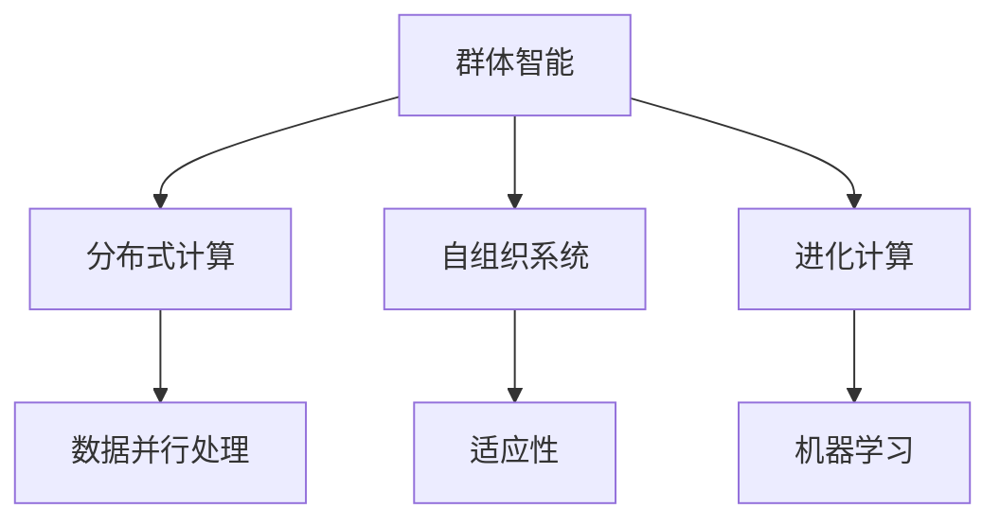
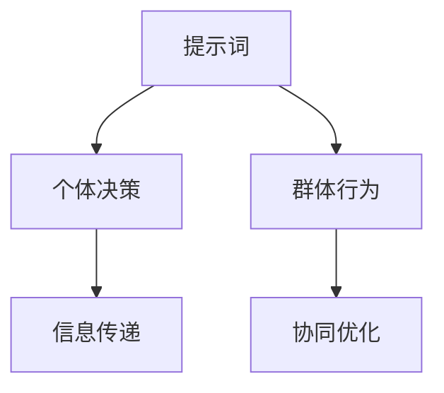

                 


### **文章标题**：面向群体智能的提示词协同优化机制

### **关键词**：群体智能，提示词，协同优化，算法，分布式计算

### **摘要**：

本文将深入探讨面向群体智能的提示词协同优化机制。我们将首先介绍群体智能的背景和基本概念，然后重点分析提示词在群体智能中的作用和优化方法。通过详细的算法原理讲解和实例分析，我们将展示如何通过协同优化提升群体智能系统的性能。本文旨在为读者提供全面的指导，帮助他们在实际应用中有效利用提示词协同优化机制，以实现更高效、更智能的群体智能系统。

----------------------------------------------------------------

## **第一部分：群体智能基础**

### **第1章：群体智能概述**

#### **1.1 群体智能的概念与历史发展**

群体智能是指由众多简单个体通过协同作用，展现出复杂行为和智能表现的现象。自20世纪末以来，随着计算能力和算法技术的发展，群体智能逐渐成为一个重要的研究领域。

**核心概念与联系**：



**核心概念关系架构图**：

- 分布式计算：利用多台计算机协同处理大规模数据，提高计算效率和性能。
- 自组织系统：个体通过局部交互和规则，自发形成有序结构和复杂行为。
- 进化计算：模拟生物进化过程，通过自然选择和遗传算法，实现问题求解和优化。
- 机器学习：利用大量数据训练模型，使个体具备学习和适应环境的能力。

#### **1.2 群体智能的核心算法**

群体智能的核心算法主要包括分布式计算算法、自组织算法和进化计算算法。这些算法在分布式系统、数据挖掘、复杂网络等领域有广泛的应用。

**核心算法原理讲解**：

```pseudocode
// 分布式计算算法伪代码
function DistributedComputing(data, agents):
    for each agent in agents:
        agent.initialize(data)
    while not finished:
        for each pair of agents:
            agent1, agent2 = pair
            agent1.updateState(agent2.state)
    return finalState

// 自组织算法伪代码
function SelfOrganization(agents, environment):
    for each agent in agents:
        agent.initialize()
    while not finished:
        for each agent in agents:
            agent.updateState(environment)
    return finalState

// 进化计算算法伪代码
function EvolutionaryComputation(population, fitnessFunction):
    while not finished:
        select parents from population
        crossover parents to generate offspring
        mutate offspring
        evaluate fitness of offspring
        replace poor-performing individuals
    return bestIndividual
```

### **第2章：提示词协同优化机制**

#### **2.1 提示词的概念与作用**

提示词是指用于引导个体进行决策和协作的关键信息。在群体智能系统中，提示词的作用至关重要，它们可以影响个体的行为和系统的整体性能。

**核心概念与联系**：



**核心概念关系架构图**：

- 个体决策：个体根据提示词和其他信息做出决策。
- 群体行为：众多个体通过协同作用，实现复杂任务。
- 信息传递：个体之间的信息交换，促进决策和协作。
- 协同优化：通过提示词的优化，提高群体智能系统的整体性能。

#### **2.2 提示词的优化方法**

提示词的优化方法主要包括基于机器学习的优化、基于遗传算法的优化和基于深度学习的优化等。这些方法可以根据具体应用场景，选择合适的优化策略。

**核心算法原理讲解**：

```pseudocode
// 基于机器学习的优化伪代码
function MachineLearningOptimization(data, promptTerms):
    train model on data
    for each promptTerm in promptTerms:
        predict optimal value for promptTerm using model
    return optimized promptTerms

// 基于遗传算法的优化伪代码
function GeneticAlgorithmOptimization(promptTerms, fitnessFunction):
    initialize population of promptTerms
    while not finished:
        select parents from population
        crossover parents to generate offspring
        mutate offspring
        evaluate fitness of offspring
        replace poor-performing individuals
    return best promptTerm
```

## **第二部分：应用与实践**

### **第3章：实际案例分析与优化**

在本章中，我们将通过实际案例，展示如何利用提示词协同优化机制提升群体智能系统的性能。我们将详细讲解案例背景、问题描述、优化过程和性能评估。

**项目实战**：

- **案例背景**：描述群体智能系统在实际应用中的背景和需求。
- **问题描述**：阐述系统面临的具体问题和挑战。
- **优化过程**：介绍如何利用提示词协同优化机制进行系统优化。
- **性能评估**：展示优化前后系统的性能对比和效果分析。

### **第4章：开发环境搭建与代码实现**

在本章中，我们将详细介绍如何搭建开发环境，并实现提示词协同优化机制的核心算法。我们将包括以下内容：

- **环境搭建**：介绍开发所需的环境配置和工具安装。
- **代码实现**：提供详细的代码实现和注释，展示算法的原理和应用。
- **代码解读**：对关键代码进行解读，帮助读者理解其作用和原理。
- **代码应用解读与分析**：分析代码在实际应用中的效果和影响。

### **第5章：项目小结与最佳实践**

在本章中，我们将对项目进行总结，并提出最佳实践建议。内容包括：

- **项目小结**：回顾项目的主要成果和经验教训。
- **最佳实践 tips**：提供实用的技巧和建议，帮助读者在实际应用中更好地利用提示词协同优化机制。
- **注意事项**：强调在应用过程中需要注意的问题和潜在风险。
- **拓展阅读**：推荐进一步阅读的文献和资源，帮助读者深入了解相关领域。

---

**作者**：AI天才研究院/AI Genius Institute & 禅与计算机程序设计艺术 /Zen And The Art of Computer Programming

---

通过以上结构和内容的设计，本文旨在为读者提供一个系统、深入、实用的指南，帮助他们理解并应用面向群体智能的提示词协同优化机制。希望本文能对读者在相关领域的研究和应用提供有益的参考。

