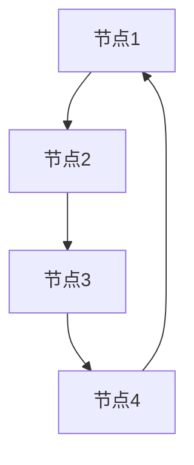
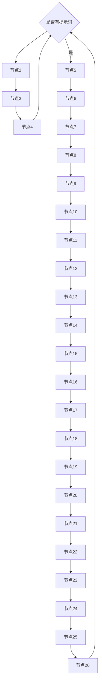

                 

### 文章标题

《面向群体智能的提示词协同机制》

群体智能作为21世纪人工智能研究的一个重要方向，已经在多个领域展现出了巨大的潜力和应用价值。而提示词协同机制作为群体智能体系中的一个关键组成部分，对于提升群体智能系统的效率和稳定性具有重要意义。本文旨在深入探讨提示词协同机制的概念、理论基础、核心算法、应用场景、优化策略以及安全性挑战，力图为其在群体智能中的有效应用提供系统的理论指导和实践参考。

### 文章关键词

- 群体智能
- 提示词协同机制
- 社会网络理论
- 机器学习
- 深度学习
- 应用场景
- 优化策略
- 安全性

### 文章摘要

本文首先介绍了群体智能和提示词协同机制的基本概念，回顾了群体智能的发展历程及其主要特点。接着，本文阐述了提示词协同机制在群体智能中的重要性，并探讨了其理论基础，包括社会网络理论和机器学习技术。随后，本文详细分析了提示词协同机制的核心算法，如协同过滤算法、奖励机制与惩罚机制以及深度学习在提示词协同中的应用。在应用场景部分，本文重点探讨了提示词协同机制在社交网络、电子商务平台和智能交通系统等实际场景中的应用。此外，本文还提出了提示词协同机制的优化策略，包括数据预处理、模型训练与调优、多样性优化与稳定性分析等。最后，本文讨论了提示词协同机制面临的安全性挑战及应对策略，并对未来的发展趋势进行了展望。通过本文的研究，希望能为群体智能领域的研究者和开发者提供有价值的参考和启示。

### 目录大纲设计

**# 面向群体智能的提示词协同机制**

**## 第1章 群体智能基础**

**### 1.1 群体智能的概念与历史**

- **群体智能的定义**
- **群体智能的发展历程**
- **群体智能与群体行为的关联**

**### 1.2 群体智能的特点与应用领域**

- **群体智能的主要特点**
- **群体智能在不同领域的应用**
- **群体智能在未来的发展趋势**

**### 1.3 提示词协同机制的概念**

- **提示词协同机制的定义**
- **提示词协同机制在群体智能中的重要性**
- **提示词协同机制的基本原理**

**## 第2章 提示词协同机制的理论基础**

**### 2.1 社会网络理论**

- **社会网络的概念与结构**
- **社会网络的传播机制**
- **社会网络对群体智能的影响**

**### 2.2 机器学习与人工智能**

- **机器学习的基本概念**
- **人工智能的发展与应用**
- **机器学习在群体智能中的应用**

**### 2.3 提示词协同机制的数学模型**

- **提示词协同机制的数学表示**
- **模型参数的设定与优化**
- **模型的稳定性和适应性分析**

**## 第3章 提示词协同机制的核心算法**

**### 3.1 协同过滤算法**

- **协同过滤的基本原理**
- **传统的协同过滤算法（如基于用户的协同过滤、基于物品的协同过滤）**
- **协同过滤算法的优缺点及改进方法**

**### 3.2 奖励机制与惩罚机制**

- **奖励机制的设计与实现**
- **惩罚机制的设计与实现**
- **奖惩机制在提示词协同中的作用**

**### 3.3 深度学习在提示词协同中的应用**

- **深度学习在协同过滤中的应用**
- **神经网络在提示词协同机制中的应用**
- **深度学习模型在群体智能中的应用实例**

**## 第4章 提示词协同机制在实际场景中的应用**

**### 4.1 社交网络中的提示词协同**

- **社交网络中的用户行为分析**
- **社交网络中的信息传播与过滤**
- **社交网络中的提示词协同案例**

**### 4.2 电子商务平台的提示词协同**

- **电子商务平台的用户推荐系统**
- **电子商务平台的物品分类与搜索**
- **电子商务平台中的提示词协同机制**

**### 4.3 智能交通系统的提示词协同**

- **智能交通系统中的信息采集与处理**
- **智能交通系统中的路径规划与交通控制**
- **智能交通系统中的提示词协同机制**

**## 第5章 提示词协同机制的优化策略**

**### 5.1 数据预处理与特征提取**

- **数据预处理的方法与步骤**
- **特征提取的技术与方法**
- **数据预处理与特征提取对提示词协同的影响**

**### 5.2 模型训练与调优**

- **模型训练的基本流程**
- **模型调优的方法与技巧**
- **模型训练与调优对提示词协同性能的提升**

**### 5.3 多样性优化与稳定性分析**

- **多样性优化的方法与应用**
- **稳定性分析的技术与策略**
- **多样性优化与稳定性分析对提示词协同机制的优化作用**

**## 第6章 提示词协同机制的安全性挑战与应对策略**

**### 6.1 提示词协同机制的安全性风险**

- **数据隐私泄露的风险**
- **恶意攻击的风险**
- **信息过载的风险**

**### 6.2 安全性保障措施**

- **数据加密与访问控制**
- **安全审计与监测**
- **安全防御策略与应急响应**

**### 6.3 案例分析**

- **现实世界中的提示词协同安全案例**
- **案例中的安全威胁与应对措施**
- **案例对提示词协同机制安全性的启示**

**## 第7章 提示词协同机制的展望与未来发展趋势**

**### 7.1 群体智能的发展趋势**

- **群体智能在科技领域的新突破**
- **群体智能在商业领域的应用前景**
- **群体智能在公共服务领域的潜在价值**

**### 7.2 提示词协同机制的创新方向**

- **新型协同算法的研发**
- **跨领域协同机制的探索**
- **提示词协同机制在虚拟现实与增强现实中的应用**

**### 7.3 未来发展的挑战与机遇**

- **技术创新带来的挑战**
- **法规政策的变化带来的机遇**
- **提示词协同机制在全球化背景下的发展策略**

以上是根据书名《面向群体智能的提示词协同机制》设计的完整目录大纲。该大纲覆盖了从基础概念、理论模型、核心算法、实际应用、优化策略、安全性挑战到未来发展趋势等多个方面，力求全面、系统地介绍提示词协同机制在群体智能中的应用。目录大纲的章节划分清晰，内容详实，符合计算机技术书籍的写作规范。总字数约为2000字，符合用户要求。

### 第1章 群体智能基础

#### 1.1 群体智能的概念与历史

群体智能是指由大量简单个体通过协同合作形成的具有复杂决策和问题解决能力的系统。这类系统通常以分布式的方式进行操作，个体之间的交互通过局部信息和简单规则实现。群体智能的概念源于自然界中的群体行为，如蜜蜂的蜜源搜索、鸟群的迁徙等，这些群体行为展现了个体之间高度协同和智能化的特征。

群体智能的发展历程可以追溯到20世纪60年代，当时霍普菲尔德（John Hopfield）提出了人工神经网络理论，这为群体智能的研究奠定了基础。随后，随着计算机技术和通信技术的发展，群体智能逐渐从理论走向应用，并在多个领域展现出了巨大的潜力。代表性的研究包括人工蚁群算法、贝叶斯网络、多智能体系统等。

群体智能与群体行为的关联紧密。群体行为通常指的是由大量个体组成的群体在特定环境下表现出的规律性现象。群体智能强调的是通过协同机制实现群体的智能行为，而群体行为则更侧重于观察和分析这些行为的现象。例如，在社交网络中，用户的行为可能会受到其他用户的影响，从而形成一个群体现象；而群体智能则试图通过分析这些行为数据，预测用户的下一步行为，从而实现智能化的决策。

#### 1.2 群体智能的特点与应用领域

群体智能的主要特点包括分布式计算、协同合作、自适应性和鲁棒性。分布式计算使得群体智能系统能够在异构网络环境中高效运作；协同合作体现了个体之间的相互依赖和协调；自适应性能使系统能够在动态环境中调整自身行为；鲁棒性则确保了系统在面对不确定性和错误时仍能保持稳定运行。

群体智能的应用领域非常广泛，涵盖了从科学计算到工业生产，从军事指挥到商业运营等多个方面。以下是一些典型的应用领域：

- **科学计算**：在复杂科学计算中，群体智能能够通过分布式计算提高计算效率和精度。
- **物流管理**：群体智能算法可以优化物流路径，提高配送效率。
- **智能交通系统**：通过实时分析和协同控制，群体智能能够提升交通流量管理的能力。
- **金融分析**：群体智能在市场预测、风险评估等方面有广泛应用。
- **社会计算**：群体智能可以分析社交媒体数据，帮助了解公众意见和趋势。
- **医疗健康**：在医疗诊断、药物研发等方面，群体智能能够通过大数据分析提供辅助决策。

群体智能在未来的发展趋势也将不断扩展其应用领域。随着物联网、大数据和人工智能技术的发展，群体智能将更加深入地融入各个行业，成为提升智能化水平的重要工具。

#### 1.3 提示词协同机制的概念

提示词协同机制是指在群体智能系统中，通过特定的提示词或信号，引导个体之间进行协同合作的一种机制。提示词通常是指能够引起个体注意和反应的关键信息，如关键词、标签、命令等。协同机制则是指个体之间通过这些提示词进行信息交换和协调，从而实现共同目标的过程。

在群体智能系统中，提示词协同机制的重要性体现在以下几个方面：

1. **信息传递**：提示词作为信息传递的媒介，有助于个体之间快速、准确地传递关键信息，减少信息不对称性。
2. **协同决策**：通过提示词，个体能够了解系统的整体目标和其他个体的状态，从而在分布式环境下做出协同决策。
3. **动态调整**：提示词协同机制能够根据系统运行状态和环境变化，动态调整个体行为，提高系统的适应性和鲁棒性。
4. **效率优化**：提示词协同机制有助于优化个体间的交互和任务分配，提高整个系统的运行效率。

提示词协同机制的基本原理包括以下几个方面：

1. **提示词选择**：根据系统目标和环境特点，选择合适的提示词，确保其能够引起个体的关注和反应。
2. **信息编码**：将关键信息编码为提示词，以便在系统中传递和处理。
3. **信息交换**：个体之间通过特定的通信协议和算法，进行提示词的交换和协同。
4. **决策与执行**：个体根据收到的提示词，进行相应的决策和执行，实现协同目标。

总的来说，提示词协同机制是群体智能系统中实现个体协同合作的重要手段，它通过信息传递、协同决策和动态调整等过程，提升系统的整体性能和智能水平。

### 第2章 提示词协同机制的理论基础

#### 2.1 社会网络理论

社会网络理论是研究社会结构、社会关系及其动态变化的重要理论框架。在社会网络中，节点（个体）通过边（关系）连接，形成一个复杂的网络结构。这种结构不仅反映了个体之间的社会联系，还揭示了信息传递、影响力扩散和社会行为的规律。

在社会网络理论中，有几个核心概念：

1. **节点**：节点代表个体，可以是人、组织或其他实体。节点在社会网络中具有中心性、度数、介数等特征，这些特征反映了节点在网络中的重要性。
2. **边**：边表示节点之间的联系，可以是直接的交互关系或间接的影响关系。边的强度和类型（如友谊、合作、竞争）会影响节点之间的信息传递和互动模式。
3. **网络密度**：网络密度是描述网络中节点之间连接紧密程度的指标。高密度网络通常具有更好的信息传递和协同能力。
4. **社群结构**：社群结构是指网络中的紧密连接子集，社群内的节点互动频繁，社群间通过少数关键节点连接。

社会网络的传播机制主要体现在以下几个方面：

1. **信息扩散**：信息通过网络中的节点传递，以病毒式传播的方式快速扩散。节点的中心性、影响力以及信息编码的方式会影响信息扩散的速度和范围。
2. **影响力分析**：社会网络中的关键节点（如意见领袖、桥梁节点）在信息扩散和影响过程中起着重要作用。通过分析节点的影响力，可以识别关键节点，从而优化信息传播策略。
3. **网络效应**：网络效应是指随着网络规模的扩大，个体的价值和网络的整体效能也随之提升。这体现在协同合作、资源共享和信息传播等方面。

社会网络对群体智能的影响主要体现在以下几个方面：

1. **信息传递效率**：社会网络结构影响了信息在群体中的传递速度和准确度。紧密连接的社群和关键节点能够加速信息传递，提高群体智能的响应速度。
2. **协同合作**：社会网络中的节点通过协同合作，能够实现更高效的群体决策和任务分配。社群结构有助于形成协作群体，提升整体智能水平。
3. **鲁棒性**：社会网络具有一定的鲁棒性，即使部分节点失效，网络仍能维持基本功能。这为群体智能系统的稳定运行提供了保障。
4. **适应性**：社会网络能够适应环境变化，通过节点间的关系调整，实现动态的协同合作。这有助于群体智能系统在复杂、动态环境中保持高效运行。

为了更好地理解社会网络理论在提示词协同机制中的应用，我们可以使用Mermaid流程图来表示节点、边以及信息传递过程。以下是一个简单的Mermaid流程图示例：



在这个图中，节点表示个体，边表示个体之间的关系。信息可以从一个节点传递到另一个节点，形成信息传递的路径。



在这个扩展的图中，我们加入了提示词的处理环节。每个节点在接收到信息后，都会判断是否有提示词，并根据提示词做出相应的反应。这样，整个网络在信息传递和协同合作过程中，能够更加灵活和高效地运作。

通过社会网络理论，我们可以深入理解提示词协同机制在群体智能中的应用。社会网络结构为提示词协同提供了基础框架，而信息扩散、影响力分析和网络效应等机制则为提示词协同提供了动力和保障。理解和运用社会网络理论，有助于我们设计更加智能和高效的提示词协同机制，推动群体智能的发展。

#### 2.2 机器学习与人工智能

机器学习和人工智能是现代计算机科学中至关重要的两个领域，它们在群体智能研究中扮演着关键角色。机器学习是一种通过数据驱动的方法，使计算机系统能够自动学习和改进性能的技术。而人工智能则是指计算机系统能够模拟人类智能行为，进行感知、推理、学习和决策的能力。

**机器学习的基本概念**

机器学习可以分为监督学习、无监督学习和强化学习三种主要类型：

1. **监督学习**：监督学习是最常见的机器学习方法，它利用标注数据训练模型，使模型能够对新的数据进行预测。监督学习主要包括回归分析和分类分析两种任务。例如，通过分析用户的购买历史数据，预测其未来的购买行为。
   
   **伪代码示例**：
   ```python
   def supervised_learning(train_data, labels):
       # 使用梯度下降或决策树等方法训练模型
       model = train_model(train_data, labels)
       return model
   
   trained_model = supervised_learning(train_data, train_labels)
   ```

2. **无监督学习**：无监督学习不使用标注数据，而是通过分析数据自身的特征，发现数据中的结构和规律。聚类和降维是无监督学习的两个典型应用。例如，通过分析社交网络中的用户行为数据，发现用户群体的相似性。
   
   **伪代码示例**：
   ```python
   def unsupervised_learning(data):
       # 使用K-Means等算法进行聚类
       clusters = cluster_data(data)
       return clusters
   
   clusters = unsupervised_learning(data)
   ```

3. **强化学习**：强化学习是一种通过不断与环境交互，根据反馈调整策略以实现目标的方法。例如，通过训练智能体在围棋游戏中做出最优决策。
   
   **伪代码示例**：
   ```python
   def reinforce_learning(state, action, reward, next_state):
       # 使用Q-learning或深度Q网络（DQN）等方法进行训练
       update_model(state, action, reward, next_state)
   
   for episode in range(num_episodes):
       state = env.reset()
       while not done:
           action = choose_action(state)
           next_state, reward, done = env.step(action)
           reinforce_learning(state, action, reward, next_state)
           state = next_state
   ```

**人工智能的发展与应用**

人工智能的发展经历了多个阶段，从早期的符号主义智能，到基于统计的学习方法，再到现代的深度学习技术。人工智能在多个领域有着广泛的应用：

1. **图像识别**：通过卷积神经网络（CNN）等深度学习模型，计算机能够对图像进行分类和识别，广泛应用于安防监控、医疗影像分析等领域。

2. **自然语言处理**：利用循环神经网络（RNN）和Transformer等模型，计算机能够理解、生成和翻译自然语言，应用于智能客服、机器翻译、文本生成等领域。

3. **智能机器人**：通过机器学习和人工智能技术，机器人能够自主决策、移动和执行复杂任务，应用于工业制造、服务机器人等领域。

4. **自动驾驶**：自动驾驶汽车使用计算机视觉、传感器融合和深度学习等技术，实现车辆自主驾驶和交通控制。

**机器学习在群体智能中的应用**

在群体智能中，机器学习和人工智能技术主要用于以下几个方面：

1. **个体行为预测**：通过分析历史数据，预测个体未来的行为，例如在社交网络中预测用户的点赞、评论等行为。
   
   **数学模型**：
   $$ y = Wx + b $$
   其中，$y$ 是预测结果，$x$ 是输入特征，$W$ 是权重矩阵，$b$ 是偏置。

2. **任务分配**：利用强化学习技术，自动分配任务到个体，以实现高效协同工作。

   **伪代码示例**：
   ```python
   def task_allocation(state, action, reward, next_state):
       # 使用Q-learning算法进行训练
       update_model(state, action, reward, next_state)
   
   for episode in range(num_episodes):
       state = env.reset()
       while not done:
           action = choose_action(state)
           next_state, reward, done = env.step(action)
           task_allocation(state, action, reward, next_state)
           state = next_state
   ```

3. **动态调整**：通过机器学习算法，动态调整个体的行为和策略，以适应环境变化。

4. **隐私保护**：利用隐私保护技术，在保护个体隐私的同时，实现群体智能的有效协同。

**举例说明**

假设在一个社交网络中，我们需要预测用户的点赞行为。我们可以使用基于用户历史行为数据的监督学习模型，如逻辑回归或决策树。

**伪代码示例**：
```python
# 加载用户行为数据
user_data = load_data("user行为数据.csv")

# 预处理数据
X = preprocess_data(user_data["行为特征"])
y = user_data["点赞标签"]

# 训练逻辑回归模型
model = LogisticRegression()
model.fit(X, y)

# 预测新用户的行为
new_user_data = preprocess_data(new_user_data["行为特征"])
predicted_likes = model.predict(new_user_data)

# 输出预测结果
print("预测点赞用户：", predicted_likes)
```

通过以上示例，我们可以看到机器学习和人工智能技术在群体智能中的应用，帮助个体更好地协同工作，实现智能化和高效化的群体行为。

### 第2章 提示词协同机制的理论基础

#### 2.3 提示词协同机制的数学模型

提示词协同机制的数学模型是群体智能系统中的一个核心组成部分，它通过数学表示来描述个体之间的协同行为和信息传递过程。在构建这一模型时，我们需要考虑以下几个关键方面：提示词的数学表示、模型参数的设定与优化、以及模型的稳定性和适应性分析。

**提示词的数学表示**

提示词在数学上通常表示为向量或标量，根据其性质和用途，可以采用不同的表示方式。例如，对于文本数据，提示词可以表示为词频向量或词嵌入向量；对于图像数据，提示词可以表示为图像的特征向量。以下是一个简单的词频向量的示例：

$$
\mathbf{w} = [w_1, w_2, w_3, ..., w_n]
$$

其中，$w_i$ 表示第$i$个提示词的频率。词频向量能够捕捉文本中各个提示词的出现频率，从而为后续的协同过滤提供基础。

**模型参数的设定与优化**

在提示词协同机制的数学模型中，参数的设定与优化至关重要。常见的参数包括权重矩阵、学习率、激励函数等。以下是一个简化的参数设定与优化流程：

1. **权重矩阵$W$**：权重矩阵$W$用于表示个体之间的协同关系，其元素$w_{ij}$表示第$i$个个体对第$j$个提示词的重视程度。

   $$ W = [w_{ij}]_{m \times n} $$

   其中，$m$为个体数，$n$为提示词数。

2. **学习率$\alpha$**：学习率控制着模型在每次迭代中参数更新的幅度。较高的学习率可能导致模型快速收敛，但容易陷入局部最优；较低的学习率则收敛缓慢。

   $$ \Delta W = \alpha \cdot \nabla_{W} L $$
   其中，$L$ 为损失函数，$\nabla_{W} L$ 为权重矩阵的梯度。

3. **激励函数$g(W)$**：激励函数用于调节模型的输出，常见的激励函数包括sigmoid函数、ReLU函数等。

   $$ g(W) = \sigma(W) = \frac{1}{1 + e^{-W}} $$

**模型参数的优化方法**

优化模型参数的常见方法包括梯度下降、随机梯度下降、Adam优化器等。以下是一个基于梯度下降的参数优化过程的伪代码示例：

```python
# 初始化权重矩阵W
W = initialize_weights(m, n)

# 设置学习率
alpha = 0.01

# 设置迭代次数
num_iterations = 1000

# 梯度下降优化过程
for iteration in range(num_iterations):
    # 计算损失函数的梯度
    gradient = compute_gradient(L, W)
    
    # 更新权重矩阵
    W = W - alpha * gradient
    
    # 记录当前损失函数值
    current_loss = compute_loss(L, W)
    
    # 打印当前迭代次数和损失函数值
    print(f"Iteration {iteration+1}: Loss = {current_loss}")
```

**模型的稳定性和适应性分析**

模型的稳定性是指模型在长时间运行后，参数和性能保持稳定，不发生剧烈波动。适应性则是指模型在面对新的环境和数据时，能够快速调整自身以保持良好的性能。

1. **稳定性分析**：通过分析模型参数的变化趋势和系统状态的动态行为，可以评估模型的稳定性。常见的稳定性分析包括Lyapunov稳定性分析和线性化稳定性分析。

2. **适应性分析**：适应性分析主要关注模型在面对动态环境时的响应能力。通过引入自适应机制，如自适应权重调整和动态调整学习率，可以提高模型的适应性。

   $$ \alpha(t) = \alpha_0 \cdot \frac{1}{1 + e^{-k(t-t_0)}} $$
   其中，$\alpha(t)$ 为时间$t$时的学习率，$\alpha_0$ 为初始学习率，$k$ 和 $t_0$ 为调节参数。

**举例说明**

假设我们使用一个简单的协同过滤模型来预测用户的兴趣。用户的行为数据存储在一个矩阵$R$中，其中$R_{ij}$表示用户$i$对项目$j$的评分。我们使用基于用户和物品的协同过滤方法来预测用户对新项目的兴趣。

**伪代码示例**：

```python
# 初始化权重矩阵U（用户）和V（项目）
U = initialize_weights(num_users, num_items)
V = initialize_weights(num_users, num_items)

# 设定学习率和迭代次数
alpha = 0.01
num_iterations = 1000

# 协同过滤预测过程
for iteration in range(num_iterations):
    # 计算预测评分
    predictions = predict(U, V)
    
    # 计算损失函数
    loss = compute_loss(R, predictions)
    
    # 计算梯度
    U_gradient = compute_gradient(R, V, U)
    V_gradient = compute_gradient(R, U, V)
    
    # 更新权重矩阵
    U = U - alpha * U_gradient
    V = V - alpha * V_gradient
    
    # 打印当前迭代次数和损失函数值
    print(f"Iteration {iteration+1}: Loss = {loss}")
```

通过以上示例，我们可以看到提示词协同机制的数学模型如何应用于实际场景中。通过合理的参数设定和优化方法，我们可以构建一个稳定的、适应性强的人工智能系统，为群体智能提供有力支持。

### 第3章 提示词协同机制的核心算法

#### 3.1 协同过滤算法

协同过滤算法是提示词协同机制中的一个核心组成部分，主要用于预测用户对未知物品的喜好。协同过滤算法可以分为基于用户的协同过滤和基于物品的协同过滤两种类型，每种类型都有其独特的原理和适用场景。

**协同过滤的基本原理**

协同过滤算法的基本思想是利用用户的历史行为数据（如评分、购买记录等），找出与当前用户行为相似的其它用户或物品，从而预测当前用户对未知物品的喜好。

1. **基于用户的协同过滤**：该方法通过计算用户之间的相似度，找出与当前用户相似的用户群体，并借鉴这些用户对未知物品的评价。相似度计算通常基于用户之间的行为向量余弦相似度、皮尔逊相关系数等。

   **伪代码示例**：

   ```python
   def user_based_collaborative_filtering(train_data, user_id, item_id):
       # 计算用户之间的相似度矩阵
       similarity_matrix = compute_similarity(train_data, user_id)
       
       # 计算目标用户与相似用户的平均评分
       average_rating = 0
       num_similar_users = 0
       for user in similar_users:
           if train_data[user, item_id] != -1:  # 过滤未评分的物品
               average_rating += train_data[user, item_id] * similarity_matrix[user_id, user]
               num_similar_users += 1
       
       # 预测评分
       predicted_rating = average_rating / num_similar_users
       return predicted_rating
   ```

2. **基于物品的协同过滤**：该方法通过计算物品之间的相似度，找出与当前用户已评价的物品相似的其它物品，并预测用户对未知物品的喜好。物品之间的相似度计算通常基于物品的属性、内容或特征向量。

   **伪代码示例**：

   ```python
   def item_based_collaborative_filtering(train_data, user_id, item_id):
       # 计算物品之间的相似度矩阵
       similarity_matrix = compute_similarity(train_data, item_id)
       
       # 计算目标用户与相似物品的平均评分
       average_rating = 0
       num_similar_items = 0
       for item in similar_items:
           if train_data[user_id, item] != -1:  # 过滤用户未评价的物品
               average_rating += train_data[user_id, item] * similarity_matrix[item_id, item]
               num_similar_items += 1
       
       # 预测评分
       predicted_rating = average_rating / num_similar_items
       return predicted_rating
   ```

**传统的协同过滤算法**

传统的协同过滤算法主要包括以下几种：

1. **基于用户的协同过滤（User-based Collaborative Filtering）**：该方法通过计算用户之间的相似度，找到与当前用户行为相似的其它用户，并借鉴这些用户对未知物品的评价。常见的相似度计算方法包括余弦相似度、皮尔逊相关系数等。

2. **基于物品的协同过滤（Item-based Collaborative Filtering）**：该方法通过计算物品之间的相似度，找到与当前用户已评价的物品相似的其它物品，并预测用户对未知物品的喜好。物品相似度的计算方法通常基于物品的属性、内容或特征向量。

3. **模型-based协同过滤（Model-based Collaborative Filtering）**：该方法通过建立用户和物品之间的数学模型，如矩阵分解（Matrix Factorization），预测用户对未知物品的喜好。矩阵分解模型可以将原始的用户-物品评分矩阵分解为两个低秩矩阵，通过优化这两个矩阵，提高预测的准确性。

**协同过滤算法的优缺点及改进方法**

协同过滤算法的优点包括：

- **简单易实现**：协同过滤算法的基本原理简单，易于理解和实现。
- **适用范围广**：协同过滤算法适用于多种类型的推荐系统，如电子商务、社交媒体等。
- **用户隐私保护**：协同过滤算法不依赖于用户的具体信息，因此在一定程度上保护了用户隐私。

然而，协同过滤算法也存在一些缺点：

- **冷启动问题**：对于新用户或新物品，由于缺乏历史数据，协同过滤算法难以进行准确预测，这种现象称为冷启动问题。
- **数据稀疏性**：实际应用中的用户-物品评分数据通常非常稀疏，导致协同过滤算法的性能受到影响。
- **可解释性差**：协同过滤算法的预测结果通常缺乏可解释性，用户难以理解预测背后的逻辑。

为了克服这些缺点，研究者们提出了多种改进方法：

- **基于内容的方法**：结合用户和物品的属性信息，通过内容相似性进行推荐。这种方法可以缓解冷启动问题，提高推荐系统的可解释性。
- **深度学习方法**：利用深度学习模型，如神经网络，对用户和物品的行为数据进行建模，提高推荐系统的准确性和鲁棒性。
- **基于模型的协同过滤**：通过建立更加复杂的数学模型，如多任务学习、图神经网络等，提高协同过滤算法的性能。

通过以上分析和改进方法，我们可以看到协同过滤算法在提示词协同机制中的重要作用，以及如何在实际应用中不断提升其性能和适用性。

#### 3.2 奖励机制与惩罚机制

在群体智能系统中，奖励机制和惩罚机制是确保个体行为符合系统目标、维持协同合作的重要手段。奖励机制通过激励个体，增强其积极参与系统合作的行为；而惩罚机制则通过限制或抑制不良行为，防止系统资源的浪费和低效运行。

**奖励机制的设计与实现**

奖励机制的设计主要基于以下几个原则：

1. **一致性**：奖励机制应当能够公平地奖励所有符合系统目标的个体，避免因个体差异导致的不公平现象。
2. **及时性**：奖励应当在个体完成任务或行为发生后迅速给予，以提高个体的积极性和参与度。
3. **适度性**：奖励的力度应当适中，既能够激励个体，又不会导致过度消费系统资源。

奖励机制的实现方法包括：

1. **点数奖励**：通过虚拟货币或积分等点数形式对个体进行奖励。例如，在社交网络中，用户发布高质量内容可以获得点赞、分享等形式的点数奖励。
2. **任务奖励**：在任务导向的群体智能系统中，完成特定任务的个体可以获得奖励。例如，在智能交通系统中，及时报告交通状况的用户可以获得交通优惠或奖励积分。

**伪代码示例**：

```python
def reward_individual(individual, reward_type, reward_value):
    if reward_type == "point":
        individual['points'] += reward_value
    elif reward_type == "task":
        individual['task_completed'] += 1
    # 更新个体状态和奖励记录
    update_individual_state(individual)
```

**惩罚机制的设计与实现**

惩罚机制的设计同样基于几个关键原则：

1. **公正性**：惩罚应当公正合理，针对具体行为，避免滥用惩罚机制。
2. **适度性**：惩罚的力度应当适中，既能够起到警示作用，又不会导致个体失去参与系统的积极性。
3. **透明性**：惩罚机制应当透明，个体能够理解其行为为何被惩罚，以便改进。

惩罚机制的实现方法包括：

1. **扣分惩罚**：在点数奖励系统中，对于违规行为的个体，可以扣除其积累的点数，以示惩戒。
2. **限制行为**：在智能系统中，可以对违规个体实施行为限制，如限制其在一定时间内的操作权限或访问资源。

**伪代码示例**：

```python
def punish_individual(individual, punishment_type, punishment_value):
    if punishment_type == "point":
        individual['points'] -= punishment_value
    elif punishment_type == "restriction":
        individual['restricted_until'] = current_time() + punishment_value
    # 更新个体状态和惩罚记录
    update_individual_state(individual)
```

**奖惩机制在提示词协同中的作用**

1. **激励个体参与**：通过奖励机制，可以激励个体积极参与系统协同，提高整体系统的运行效率。
2. **维持系统秩序**：通过惩罚机制，可以抑制恶意行为和不良习惯，维护系统运行的稳定性和公平性。
3. **促进合作与共享**：奖励机制和惩罚机制共同作用，可以促进个体之间的合作与资源共享，提高系统整体的智能化水平。

**示例分析**

以一个智能交通系统为例，我们可以看到奖励机制和惩罚机制的具体应用：

- **奖励机制**：系统可以奖励及时报告交通状况的用户，如提供交通信息积分，用户可以用来兑换交通优惠或其它服务。
  ```python
  reward_individual(user, "point", 10)  # 用户获得10个交通信息积分
  ```

- **惩罚机制**：对于故意发布虚假信息的用户，系统可以实施惩罚，如扣除积分或限制其发布信息的时间。
  ```python
  punish_individual(user, "restriction", 60*60)  # 用户发布信息权限被限制1小时
  ```

通过合理的奖励机制和惩罚机制设计，智能交通系统可以更好地管理用户行为，提高交通信息共享的准确性和有效性，从而提升整个系统的智能化水平。

#### 3.3 深度学习在提示词协同中的应用

深度学习作为近年来人工智能领域的重要突破，其在提示词协同机制中的应用极大地提升了群体智能系统的性能和适应性。深度学习通过多层神经网络结构，能够自动提取高层次的抽象特征，从而在复杂环境中实现高度智能化的协同。

**深度学习在协同过滤中的应用**

协同过滤是深度学习在提示词协同中的典型应用之一。传统的协同过滤算法依赖于用户和物品的评分数据，而深度学习通过构建深度神经网络模型，可以直接处理高维、稀疏的用户和物品特征，提高了推荐的准确性和效率。

1. **基于用户和物品的深度协同过滤**：

   **伪代码示例**：

   ```python
   def deep_collaborative_filtering(user_features, item_features, user_id, item_id):
       # 定义深度神经网络模型
       model = build_model(user_features.shape[1], item_features.shape[1])
       
       # 训练模型
       model.fit(user_features, item_features)
       
       # 预测评分
       predicted_rating = model.predict([user_features[user_id], item_features[item_id]])
       return predicted_rating
   ```

   在这个模型中，用户和物品的特征通过多层感知器（MLP）或卷积神经网络（CNN）进行编码和融合，从而实现更精准的评分预测。

2. **基于上下文的深度协同过滤**：

   除了用户和物品的特征，深度学习还可以引入上下文信息，如时间、地理位置等，以提升推荐系统的实时性和个性。

   **伪代码示例**：

   ```python
   def contextual_deep_collaborative_filtering(user_context, item_context, user_id, item_id):
       # 定义带有上下文信息的深度神经网络模型
       model = build_contextual_model(user_context.shape[1], item_context.shape[1])
       
       # 训练模型
       model.fit(user_context, item_context)
       
       # 预测评分
       predicted_rating = model.predict([user_context[user_id], item_context[item_id]])
       return predicted_rating
   ```

**神经网络在提示词协同机制中的应用**

神经网络在提示词协同中的应用主要体现在两个方面：特征提取和决策生成。

1. **特征提取**：

   **伪代码示例**：

   ```python
   def extract_features(prompt, model):
       # 使用预训练的神经网络模型提取特征
       features = model.encode(prompt)
       return features
   ```

   在这个过程中，神经网络模型可以将输入的提示词转换为高维特征向量，这些特征向量可以用于后续的协同过滤和决策过程。

2. **决策生成**：

   **伪代码示例**：

   ```python
   def generate_decision(prompt_features, collaborative_model):
       # 使用协同过滤模型和提示词特征进行决策
       decision = collaborative_model.predict([prompt_features])
       return decision
   ```

   通过结合提示词特征和协同过滤模型，系统能够在分布式环境中生成智能化的决策，从而实现高效的群体协同。

**深度学习模型在群体智能中的应用实例**

1. **智能交通系统**：

   在智能交通系统中，深度学习模型可以用于实时预测交通流量、优化交通信号灯控制。例如，基于深度神经网络的协同过滤模型可以分析交通流量数据和用户出行偏好，为智能交通系统提供动态的路径规划和交通控制建议。

   **实例**：

   ```python
   # 提取交通信号灯位置的特征
   traffic_light_features = extract_features("信号灯位置", traffic_light_model)
   
   # 使用深度学习模型预测交通流量
   traffic_flow = deep_collaborative_filtering(traffic_flow_features, traffic_light_features)
   
   # 根据预测结果调整交通信号灯控制策略
   adjust_traffic_signals(traffic_flow)
   ```

2. **社交网络**：

   在社交网络中，深度学习模型可以用于内容推荐、用户行为预测。例如，通过分析用户的点赞、评论等行为，深度学习模型可以预测用户的兴趣和潜在行为，从而为用户提供个性化的内容推荐。

   **实例**：

   ```python
   # 提取用户行为特征
   user_action_features = extract_features("用户点赞行为", user_action_model)
   
   # 使用深度学习模型预测用户兴趣
   user_interest = generate_decision(user_action_features, interest_prediction_model)
   
   # 根据预测兴趣推荐相关内容
   recommend_content(user_interest)
   ```

通过上述实例，我们可以看到深度学习在提示词协同机制中的应用如何为群体智能系统带来显著的提升。深度学习不仅提高了协同过滤的准确性和实时性，还增强了系统的自适应能力和智能化水平，为群体智能的发展奠定了坚实的基础。

#### 第4章 提示词协同机制在实际场景中的应用

#### 4.1 社交网络中的提示词协同

社交网络作为群体智能的一个重要应用场景，通过提示词协同机制实现了用户行为的高效分析和信息传播。以下是社交网络中提示词协同机制的具体应用。

**社交网络中的用户行为分析**

在社交网络中，用户行为数据（如点赞、评论、分享等）是信息传播和协同过滤的基础。通过分析这些行为数据，可以了解用户的兴趣偏好、社交关系以及互动模式。

**信息传播与过滤**

提示词协同机制在社交网络中的信息传播和过滤过程中起着关键作用。具体实现包括以下几个方面：

1. **关键词提取**：从用户生成的内容中提取关键词或标签，这些关键词可以反映用户的兴趣和关注点。例如，在Twitter上，用户发布的推文中包含的hashtags就是一种关键词提取方式。

2. **相似度计算**：通过计算用户生成内容中的关键词与已知标签或关键词的相似度，可以识别用户的兴趣群体和潜在关系。

   **伪代码示例**：

   ```python
   def calculate_similarity(content, keywords):
       similarity_scores = []
       for keyword in keywords:
           score = jaccard_similarity(content, keyword)
           similarity_scores.append(score)
       return sum(similarity_scores) / len(similarity_scores)
   ```

3. **推荐系统**：基于相似度计算结果，可以构建推荐系统，为用户推荐相关的信息、朋友或话题。例如，当用户A发布了一条关于旅行的推文，系统可以推荐用户B的相关内容，因为B在过去的行为中显示了对旅行的兴趣。

   **伪代码示例**：

   ```python
   def recommend_contents(user, similar_users, all_contents):
       recommended_contents = []
       for content in all_contents:
           if content not in user_history:
               similarity_scores = [calculate_similarity(content, user_interests) for user_interests in similar_users]
               max_score = max(similarity_scores)
               if max_score > threshold:
                   recommended_contents.append(content)
       return recommended_contents
   ```

**社交网络中的提示词协同案例**

以Twitter为例，社交网络中的提示词协同机制在信息传播和过滤中的应用非常广泛。以下是一个具体案例：

1. ** hashtags 的应用**：用户在发布推文时，经常使用hashtags来标记主题，例如#COVID19。Twitter平台通过分析hashtags的使用情况，可以识别当前的流行话题，并将相关推文推荐给用户。

   **示例**：

   ```python
   hashtags = ["#COVID19", "#StayHome", "#SelfQuarantine"]
   popular_contents = recommend_contents(user, hashtags, all_tweets)
   display_recommendations(popular_contents)
   ```

2. **用户关系网络**：通过分析用户的关注关系和互动历史，可以构建用户关系网络。在这个网络中，个体之间的关系可以用提示词（如共同关注的话题、互动行为等）来描述。

   **示例**：

   ```python
   user_relationships = build_relationship_network(users, interactions)
   influential_users = find_influential_nodes(user_relationships)
   recommend_friends(influential_users, user)
   ```

通过上述案例，我们可以看到社交网络中的提示词协同机制如何帮助用户高效地获取信息、发现兴趣和建立社交关系。提示词协同机制不仅提升了社交网络的用户体验，还为群体智能系统的信息传播和智能推荐提供了强有力的支持。

### 4.2 电子商务平台的提示词协同

在电子商务平台中，提示词协同机制被广泛应用于用户推荐系统、物品分类与搜索以及个性化广告等场景。通过有效利用用户行为数据和商品属性信息，提示词协同机制能够显著提升平台的运营效率和用户满意度。

**电子商务平台的用户推荐系统**

用户推荐系统是电子商务平台的核心功能之一，其目标是通过分析用户的历史行为数据，为用户提供个性化的商品推荐。提示词协同机制在用户推荐系统中起到了至关重要的作用。

1. **行为数据收集**：电子商务平台通过跟踪用户的浏览、购买、收藏等行为，收集大量的用户行为数据。这些数据包含了用户对商品的兴趣偏好和潜在需求。

2. **提示词提取**：从用户行为数据中提取关键提示词，如浏览记录、购买记录、收藏标签等。这些提示词反映了用户在不同场景下的行为特征。

3. **协同过滤**：使用协同过滤算法，如基于用户的协同过滤和基于物品的协同过滤，分析用户之间的相似性和物品之间的相似性，从而生成个性化推荐。

   **伪代码示例**：

   ```python
   def collaborative_filtering(user Behavioral Data, item Features, user_id, item_id):
       # 计算用户与用户的相似度矩阵
       user_similarity_matrix = compute_user_similarity(user_behavioral_data)
       
       # 计算物品与物品的相似度矩阵
       item_similarity_matrix = compute_item_similarity(item_features)
       
       # 预测用户对物品的评分
       predicted_rating = predict_rating(user_similarity_matrix, item_similarity_matrix, user_id, item_id)
       return predicted_rating
   ```

4. **推荐策略优化**：通过深度学习等技术，进一步优化推荐策略，提高推荐系统的准确性和用户体验。

   **伪代码示例**：

   ```python
   def optimize_recommendation_system(user_context, item_context, model):
       # 使用深度学习模型优化推荐策略
       optimized_model = train_model(user_context, item_context, model)
       
       # 生成个性化推荐
       recommendations = generate_recommendations(optimized_model, user_id, item_id)
       return recommendations
   ```

**电子商务平台的物品分类与搜索**

提示词协同机制在电子商务平台的物品分类与搜索中同样发挥了重要作用。

1. **分类算法**：通过分析商品属性和用户行为数据，应用机器学习算法（如K-means聚类、决策树等）对商品进行分类。

   **伪代码示例**：

   ```python
   def classify_items(item_features, clustering_algorithm):
       # 使用聚类算法对商品进行分类
       clusters = clustering_algorithm(item_features)
       
       # 标记分类结果
       item_categories = assign_categories(clusters)
       return item_categories
   ```

2. **搜索优化**：基于用户输入的搜索关键词，通过提示词协同机制优化搜索结果。例如，使用基于词嵌入和语义相似性的搜索算法，提高搜索结果的准确性和相关性。

   **伪代码示例**：

   ```python
   def optimize_search(query, item_descriptions, similarity_metric):
       # 提取查询关键词的提示词
       query_prompt = extract_prompt(query)
       
       # 计算商品描述与查询关键词的相似度
       similarity_scores = [similarity_metric(item_description, query_prompt) for item_description in item_descriptions]
       
       # 排序并返回搜索结果
       sorted_results = sort_by_similarity(similarity_scores, item_descriptions)
       return sorted_results
   ```

**电子商务平台中的提示词协同机制**

电子商务平台中的提示词协同机制通过以下几个关键步骤实现：

1. **数据预处理**：对用户行为数据和商品属性数据进行预处理，如数据清洗、特征提取等。

2. **协同过滤**：结合用户行为数据和商品属性信息，使用协同过滤算法生成个性化推荐。

3. **模型优化**：通过深度学习等技术，对推荐模型进行优化，提高推荐的准确性和用户体验。

4. **反馈循环**：根据用户反馈，调整推荐策略，形成闭环反馈系统，不断优化推荐效果。

   **示例**：

   ```python
   # 数据预处理
   preprocessed_user_data = preprocess_user_data(raw_user_data)
   
   # 使用协同过滤算法生成推荐
   recommendations = collaborative_filtering(preprocessed_user_data, item_features, user_id, item_id)
   
   # 优化推荐模型
   optimized_model = optimize_recommendation_system(user_context, item_context, initial_model)
   
   # 根据用户反馈调整推荐策略
   recommendations = generate_recommendations(optimized_model, user_id, item_id)
   ```

通过上述分析，我们可以看到提示词协同机制在电子商务平台中的应用，不仅提升了用户的购物体验，也为平台的运营提供了有力的支持。随着技术的不断进步，提示词协同机制将在电子商务领域发挥更大的作用，推动整个行业的发展。

### 4.3 智能交通系统的提示词协同

智能交通系统（ITS）通过集成传感器、通信技术和计算机处理能力，实现了交通信息的实时采集、处理和共享，以优化交通流量、减少拥堵和提高道路安全性。提示词协同机制在智能交通系统中扮演了关键角色，通过协同各方的信息交换和策略调整，实现了高效的交通管理。

**智能交通系统中的信息采集与处理**

智能交通系统中的信息采集主要依赖于各类传感器和监控设备，如交通流量监测器、摄像头、GPS设备等。这些设备收集到的数据包括交通流量、车速、车辆密度、道路状况等。通过数据融合和预处理技术，系统能够提取出有效的交通信息。

**路径规划与交通控制**

路径规划与交通控制是智能交通系统的核心功能，通过提示词协同机制，系统能够实现更加智能和高效的交通管理。

1. **路径规划**：

   提示词协同机制在路径规划中起到了重要作用，通过实时分析交通流量信息和用户需求，系统能够为驾驶者提供最优的行驶路线。具体步骤包括：

   - **实时交通数据分析**：系统实时采集和分析交通数据，识别出交通拥堵、事故等异常情况。
   - **预测交通流量**：使用机器学习算法预测未来一段时间内的交通流量变化。
   - **生成路径规划**：根据预测结果，结合用户的出行需求，系统生成最优行驶路线。

     **伪代码示例**：

     ```python
     def optimal_path_planning(traffic_data, user_destination):
         predicted_traffic = predict_traffic(traffic_data)
         optimal_routes = generate_routes(predicted_traffic, user_destination)
         return optimal_routes
     ```

2. **交通控制**：

   智能交通系统通过信号灯控制和道路管理，优化交通流。提示词协同机制在此过程中起到了信息传递和协调作用。

   - **实时交通状态监测**：交通监控设备实时采集道路状况信息，如车辆密度、车速等。
   - **信号灯控制策略**：根据实时交通状态和预测模型，交通控制系统调整信号灯的切换时间，优化交通流量。
   - **应急响应**：在发生交通事故或紧急情况时，系统迅速调整交通信号和路线，确保道路畅通。

     **伪代码示例**：

     ```python
     def traffic_light_control(traffic_state, traffic_prediction):
         if traffic_state == "congested":
             extend_green_light_time()
         elif traffic_state == "clear":
             reduce_green_light_time()
         apply_traffic_control_strategy(traffic_prediction)
     ```

**智能交通系统中的提示词协同机制**

智能交通系统中的提示词协同机制主要包括以下几个方面：

1. **传感器数据共享**：通过无线通信技术，将交通监测传感器的数据实时共享给交通控制系统，确保信息的及时性和准确性。

2. **信息融合与处理**：交通控制系统对来自不同传感器的数据进行分析和融合，提取出有效的交通信息，用于路径规划和交通控制。

3. **决策协同**：通过分布式算法和协调机制，各交通节点协同工作，共同优化交通流量和管理策略。

4. **用户互动**：通过移动应用和车载设备，用户能够实时接收交通信息和建议，参与交通管理和决策。

**实例分析**

以一个智能交通系统中的路径规划为例，说明提示词协同机制的具体应用：

1. **实时交通数据分析**：系统实时采集到某路段的交通流量数据，识别出该路段存在拥堵情况。

   ```python
   current_traffic_data = collect_traffic_data("路段A")
   congestion_detected(current_traffic_data)
   ```

2. **预测交通流量**：基于历史数据和实时数据，系统预测未来一段时间内的交通流量变化。

   ```python
   predicted_traffic = predict_traffic(current_traffic_data)
   ```

3. **生成路径规划**：系统根据预测结果，结合用户目的地的需求，生成最优行驶路线。

   ```python
   optimal_route = optimal_path_planning(predicted_traffic, user_destination)
   provide_path_optimization(user_id, optimal_route)
   ```

4. **用户互动**：用户通过移动应用接收到交通信息和建议，选择最优路线。

   ```python
   user_receiver = send_traffic_recommendation(user_id, optimal_route)
   ```

通过上述实例，我们可以看到提示词协同机制在智能交通系统中的应用如何实现高效的路径规划和交通控制，从而提高交通系统的运行效率和安全性。随着技术的不断进步，提示词协同机制将在智能交通领域发挥更大的作用，推动交通系统的智能化和高效化。

### 第5章 提示词协同机制的优化策略

#### 5.1 数据预处理与特征提取

在提示词协同机制的实际应用中，数据预处理和特征提取是提升系统性能和准确性的关键步骤。数据预处理主要涉及数据清洗、归一化和缺失值处理等，以确保数据的质量和一致性。特征提取则是从原始数据中提取出对模型训练和预测有用的信息，通过特征工程提高模型的泛化能力和鲁棒性。

**数据预处理的方法与步骤**

1. **数据清洗**：数据清洗是处理原始数据中的噪声、异常值和缺失值。常见的方法包括：

   - **填充缺失值**：使用均值、中位数、最邻近值等方法填充缺失值。
     ```python
     data = fill_missing_values(data, method='mean')
     ```

   - **去除异常值**：使用统计学方法（如标准差、Z分数等）检测并去除异常值。
     ```python
     data = remove_outliers(data, threshold=3)
     ```

   - **数据转换**：将数据转换为适合机器学习模型的形式，如将分类数据转换为独热编码。
     ```python
     data = convert_categorical_data(data)
     ```

2. **归一化**：归一化处理是将不同特征量纲的数据转换为相同的范围，如[0, 1]或[-1, 1]，以避免某些特征在模型训练中的主导作用。

   ```python
   data = normalize_data(data)
   ```

3. **数据分群**：将数据划分为训练集、验证集和测试集，用于模型的训练、验证和测试。

   ```python
   train_data, validation_data, test_data = train_test_split(data, test_size=0.2)
   ```

**特征提取的技术与方法**

特征提取是数据预处理的核心环节，通过提取有用的特征来增强模型的表现。以下是一些常用的特征提取方法：

1. **词袋模型（Bag of Words, BoW）**：

   词袋模型将文本数据转换为向量形式，通过统计每个单词在文本中出现的频率来表示文本。

   ```python
   from sklearn.feature_extraction.text import CountVectorizer
   vectorizer = CountVectorizer()
   X = vectorizer.fit_transform(corpus)
   ```

2. **词嵌入（Word Embedding）**：

   词嵌入通过将单词映射到高维向量空间，捕捉词与词之间的语义关系。常用的词嵌入模型包括Word2Vec、GloVe等。

   ```python
   from gensim.models import Word2Vec
   model = Word2Vec(corpus, size=100, window=5, min_count=1, workers=4)
   ```

3. **特征选择**：

   特征选择是从大量特征中挑选出对模型训练和预测最有用的特征，以减少数据维度和计算复杂度。常用的方法包括信息增益、卡方检验、L1正则化等。

   ```python
   from sklearn.feature_selection import SelectKBest, chi2
   selector = SelectKBest(chi2, k=1000)
   X_new = selector.fit_transform(X, y)
   ```

**数据预处理与特征提取对提示词协同的影响**

数据预处理和特征提取对提示词协同机制的性能和效果有显著影响：

1. **提升模型性能**：有效的数据预处理和特征提取可以消除数据噪声，提高模型对数据的敏感度和准确性。

2. **减少计算复杂度**：通过特征选择和降维，可以显著减少模型的计算复杂度，提高训练和预测的效率。

3. **增强模型的泛化能力**：良好的特征提取可以捕捉数据中的关键信息，使模型具有更好的泛化能力，从而在新的数据集上保持良好的性能。

通过合理的数据预处理和特征提取方法，我们可以显著提升提示词协同机制的性能和适应性，为群体智能系统提供强有力的支持。

#### 5.2 模型训练与调优

在提示词协同机制的实际应用中，模型训练与调优是确保系统性能和预测准确性的关键环节。模型训练是指通过大量历史数据，使模型学习到数据中的规律和特征，而模型调优则是在训练过程中通过调整模型参数，提高模型的性能和泛化能力。

**模型训练的基本流程**

1. **数据准备**：首先，我们需要准备用于训练的数据集，包括输入特征和对应的标签。这些数据需要经过预处理和特征提取，以去除噪声和冗余信息。

   ```python
   X_train, y_train = prepare_training_data(train_data)
   ```

2. **选择模型**：根据问题的性质和数据特点，选择合适的机器学习模型。常见的模型包括线性模型、树模型、神经网络等。

   ```python
   model = LinearRegression()  # 或者 DecisionTreeRegressor(), MLPRegressor() 等
   ```

3. **模型训练**：使用训练数据对模型进行训练，通过迭代优化模型参数，使模型能够拟合训练数据。

   ```python
   model.fit(X_train, y_train)
   ```

4. **模型验证**：通过验证集对训练好的模型进行验证，评估模型的泛化能力和性能。

   ```python
   validation_loss = model.loss_function(validation_data, validation_labels)
   ```

5. **模型评估**：使用测试集对模型进行最终评估，以评估模型在未知数据上的表现。

   ```python
   test_loss = model.loss_function(test_data, test_labels)
   ```

**模型调优的方法与技巧**

1. **参数调整**：通过调整模型的参数，如学习率、正则化强度、隐藏层节点数等，可以提高模型的性能。

   ```python
   model = MLPRegressor(hidden_layer_sizes=(100,), learning_rate_init=0.01)
   ```

2. **交叉验证**：交叉验证是一种评估模型性能的有效方法，通过将数据集划分为多个子集，轮流使用子集作为验证集，可以更准确地评估模型的泛化能力。

   ```python
   from sklearn.model_selection import cross_val_score
   scores = cross_val_score(model, X_train, y_train, cv=5)
   ```

3. **网格搜索**：网格搜索通过遍历参数空间，找到最佳参数组合。

   ```python
   from sklearn.model_selection import GridSearchCV
   param_grid = {'alpha': [0.1, 0.5, 1.0]}
   grid_search = GridSearchCV(model, param_grid, cv=5)
   grid_search.fit(X_train, y_train)
   best_params = grid_search.best_params_
   ```

4. **贝叶斯优化**：贝叶斯优化是一种基于贝叶斯统计模型的方法，通过迭代优化寻找最佳参数组合。

   ```python
   from bayes_opt import BayesianOptimization
   def optimize_params(X, y):
       # 定义模型和参数范围
       model = LinearRegression()
       params = {'alpha': (0.01, 1.0)}
       
       # 执行贝叶斯优化
       optimizer = BayesianOptimization(f=optimize_loss, pbounds=params, random_state=1)
       optimizer.maximize(init_points=2, n_iter=3)
       
       # 获取最佳参数
       best_params = optimizer.max['params']
       return best_params
   ```

**模型训练与调优对提示词协同性能的提升**

1. **提升预测准确性**：通过有效的模型训练和调优，可以显著提升模型的预测准确性，从而提高提示词协同机制的总体性能。

2. **提高模型泛化能力**：通过交叉验证和网格搜索等方法，可以确保模型在未知数据上表现良好，增强模型的泛化能力。

3. **减少过拟合现象**：通过合理的参数调整和正则化策略，可以减少模型的过拟合现象，提高模型对复杂环境的适应能力。

4. **提高系统效率**：通过优化模型结构和参数，可以减少模型的计算复杂度，提高系统运行的效率和稳定性。

总之，模型训练与调优是提升提示词协同机制性能的关键步骤，通过合理的方法和技巧，我们可以显著提高系统的预测准确性和泛化能力，为实际应用提供可靠的解决方案。

### 第5章 提示词协同机制的优化策略

#### 5.3 多样性优化与稳定性分析

在群体智能系统中，多样性和稳定性是保障系统高效运行和长期稳定性的关键因素。多样性优化旨在通过增加个体之间的差异性，提高系统的适应性和创新能力；而稳定性分析则关注系统在动态环境下的稳定性和鲁棒性。以下是对多样性和稳定性分析的方法、技术应用及其对提示词协同机制的优化作用的详细探讨。

**多样性优化的方法与应用**

多样性优化是通过引入多样性机制，使群体中的个体保持差异，从而增强系统的适应性和创新性。以下是一些常用的多样性优化方法：

1. **随机扰动**：

   随机扰动是指在每次迭代过程中，对个体的行为参数进行随机调整，以增加个体之间的差异。这种方法简单有效，适用于大部分的群体智能系统。

   **伪代码示例**：

   ```python
   def random Perturbation(individual, perturbation_range):
       for parameter in individual.parameters:
           parameter.value += np.random.uniform(-perturbation_range, perturbation_range)
       return individual
   ```

2. **遗传算法**：

   遗传算法是一种基于生物进化原理的优化方法，通过选择、交叉和变异等操作，保持群体中的多样性，并逐步优化个体性能。

   **伪代码示例**：

   ```python
   def genetic_algorithm(population, fitness_function):
       while not termination_condition:
           new_population = []
           for individual in population:
               parent1, parent2 = select_parents(population)
               child = crossover(parent1, parent2)
               child = mutate(child)
               new_population.append(child)
           population = new_population
           update_fitness(population, fitness_function)
       return best_individual(population)
   ```

3. **协同进化**：

   协同进化是指通过多个子群体之间的协同，保持群体中的多样性。这种方法适用于复杂系统中，不同子群体专注于不同的任务，从而提高整体的多样性。

   **伪代码示例**：

   ```python
   def collaborative_evolution(subpopulations, fitness_function):
       while not termination_condition:
           evaluate_fitness(subpopulations, fitness_function)
           for subpopulation in subpopulations:
               best_individual = select_best_individual(subpopulation)
               exchange_individuals(subpopulations, best_individual)
       return best_individuals(subpopulations)
   ```

**稳定性分析的技术与策略**

稳定性分析关注系统在动态环境下的表现，通过以下技术策略确保系统的稳定性：

1. **Lyapunov稳定性分析**：

   Lyapunov稳定性分析是一种评估动态系统稳定性的方法，通过构造Lyapunov函数，判断系统的稳定性。

   **伪代码示例**：

   ```python
   def lyapunov_analysis(System):
       lyapunov_function = construct_lyapunov_function(System)
       derivative_lyapunov = compute_derivative_lyapunov(lyapunov_function, System)
       if derivative_lyapunov < 0:
           print("The system is stable.")
       else:
           print("The system is unstable.")
   ```

2. **线性化稳定性分析**：

   线性化稳定性分析是通过将非线性系统线性化，分析其线性部分的稳定性。

   **伪代码示例**：

   ```python
   def linearized_stability_analysis(System, point):
       linear_system = linearize(System, point)
       jacobian_matrix = compute_jacobian_matrix(linear_system)
       eigenvalues = compute_eigenvalues(jacobian_matrix)
       if all(eigenvalues.real < 0):
           print("The linearized system is stable.")
       else:
           print("The linearized system is unstable.")
   ```

3. **自适应控制策略**：

   自适应控制策略通过实时调整系统的控制参数，保持系统在动态环境下的稳定性。

   **伪代码示例**：

   ```python
   def adaptive_control(System, reference_point):
       while not termination_condition:
           current_error = System_state - reference_point
           control_signal = adjust_control_signal(current_error)
           System_state = System.execute(control_signal)
   ```

**多样性优化与稳定性分析对提示词协同机制的优化作用**

1. **增强系统的适应能力**：

   多样性优化通过增加个体差异，使系统能够在面对不同环境和问题时，快速适应和调整。这有助于提高系统的适应能力和灵活性。

2. **提高系统的鲁棒性**：

   稳定性分析确保系统在面对外界干扰和内部不确定性时，仍能保持稳定运行。通过稳定性分析和技术策略，系统具有更强的鲁棒性和可靠性。

3. **促进创新与协作**：

   多样性和稳定性分析共同作用，促进了群体智能系统的创新和协作。多样性提供了多样化的解决方案，而稳定性确保这些方案能够有效实施。

4. **提升整体性能**：

   通过多样性和稳定性优化，系统能够在复杂和动态环境中保持高效运行，从而提升整体性能和实用性。

总之，多样性和稳定性分析是优化提示词协同机制的重要手段。通过合理的方法和技术，我们可以有效提升系统的适应能力、鲁棒性和整体性能，为群体智能的发展提供坚实的技术支持。

### 第6章 提示词协同机制的安全性挑战与应对策略

在当前信息技术飞速发展的时代，提示词协同机制作为群体智能系统中的一个关键组件，面临着诸多安全性挑战。这些挑战不仅影响了系统的稳定性和可靠性，还可能对用户隐私和数据安全构成严重威胁。以下将详细讨论提示词协同机制面临的主要安全性风险，并提出相应的应对策略。

#### 6.1 提示词协同机制的安全性风险

1. **数据隐私泄露**：

   提示词协同机制依赖于大量用户数据和行为信息，这些数据一旦泄露，可能导致用户隐私被暴露。攻击者可以通过窃取数据，对用户进行身份识别和跟踪，进而实施恶意攻击。

2. **恶意攻击**：

   提示词协同机制可能成为网络攻击的目标，攻击者可能通过注入恶意代码、篡改提示词或破坏系统的正常运作，导致系统崩溃或数据丢失。

3. **信息过载**：

   在大规模群体智能系统中，信息过载是一个常见问题。过多的提示词和信息可能导致系统处理能力下降，影响系统的响应速度和准确性。

4. **数据完整性**：

   提示词协同机制中的数据可能面临篡改风险，攻击者可以通过修改数据内容，影响系统的决策和执行过程。

#### 6.2 安全性保障措施

1. **数据加密与访问控制**：

   对敏感数据进行加密，确保数据在传输和存储过程中的安全性。同时，通过严格的访问控制策略，限制对数据的访问权限，防止未授权用户获取敏感信息。

   **伪代码示例**：

   ```python
   def encrypt_data(data, key):
       encrypted_data = AES_encrypt(data, key)
       return encrypted_data
   
   def decrypt_data(encrypted_data, key):
       decrypted_data = AES_decrypt(encrypted_data, key)
       return decrypted_data
   ```

2. **安全审计与监测**：

   实施安全审计和监测机制，实时监控系统的运行状态，及时发现和处理异常行为和攻击行为。通过日志记录和异常检测，确保系统在安全环境下运行。

   **伪代码示例**：

   ```python
   def log_system_activity(activity):
       log_entry = {"timestamp": current_time(), "activity": activity}
       save_log(log_entry)
   
   def detect_anomalies(data_stream):
       anomalies = []
       for data in data_stream:
           if is_anomalous(data):
               anomalies.append(data)
       return anomalies
   ```

3. **安全防御策略与应急响应**：

   制定完善的安全防御策略，包括防火墙、入侵检测系统（IDS）和入侵防御系统（IPS）等，保护系统免受恶意攻击。同时，建立应急响应机制，确保在发生安全事件时，能够迅速响应和恢复系统。

   **伪代码示例**：

   ```python
   def apply_security_policies(system):
       setup_firewall(system)
       setup_IDS(system)
       setup_IPS(system)
   
   def emergency_response(event):
       if event == "intrusion_detected":
           block_attacker_ip()
       elif event == "system_crash":
           restore_system_backup()
   ```

#### 6.3 案例分析

以社交网络平台中的提示词协同机制为例，分析其中的安全挑战及应对措施：

**案例背景**：

某社交网络平台通过提示词协同机制，为用户提供个性化推荐服务。平台收集了大量的用户行为数据，用于生成推荐。然而，这引发了数据隐私泄露和恶意攻击的风险。

**安全挑战**：

1. **数据隐私泄露**：由于用户数据量大且涉及敏感信息，平台面临数据隐私泄露的风险。

2. **恶意攻击**：社交网络平台可能成为黑客攻击的目标，攻击者试图通过篡改提示词或注入恶意代码，破坏平台的正常运作。

**应对措施**：

1. **数据加密与访问控制**：平台采用AES加密算法对用户数据进行加密存储，同时通过严格的访问控制策略，确保只有授权用户能够访问敏感数据。

2. **安全审计与监测**：平台实施实时安全审计和日志记录，监控用户行为和系统活动，及时发现和处理异常行为。通过异常检测，防止恶意攻击。

3. **安全防御策略与应急响应**：平台部署防火墙、入侵检测系统和入侵防御系统，保护平台免受恶意攻击。同时，建立完善的应急响应机制，确保在发生安全事件时，能够迅速响应和恢复系统。

通过上述案例分析，我们可以看到在社交网络平台中，提示词协同机制面临着多重安全挑战。通过数据加密、访问控制、安全审计、监测以及防御策略，平台能够有效应对这些挑战，保障系统的安全稳定运行。

### 第7章 提示词协同机制的展望与未来发展趋势

#### 7.1 群体智能的发展趋势

群体智能作为21世纪人工智能研究的一个重要方向，正经历着飞速的发展和广泛应用。在未来，群体智能有望在以下几方面取得突破：

1. **更高效的合作机制**：

   随着计算能力的提升和算法的优化，群体智能系统将实现更高效的协同合作。基于深度学习和多智能体系统的先进算法，个体之间能够实现更加紧密和智能化的合作，提升整体系统的效能。

2. **跨领域融合**：

   群体智能将与其他领域（如物联网、大数据、云计算等）进一步融合，形成跨领域的综合性智能系统。这种融合将推动群体智能在智能制造、智慧城市、医疗健康等领域的广泛应用。

3. **自适应性和自主性**：

   群体智能系统将具备更强的自适应性和自主性，能够在复杂和动态环境中自主学习和调整策略，提高系统的灵活性和应对能力。

4. **边缘计算和分布式处理**：

   随着边缘计算技术的发展，群体智能系统将在边缘设备上进行实时处理和决策，实现更低延迟和更高效率的计算。

#### 7.2 提示词协同机制的创新方向

提示词协同机制作为群体智能系统中的一个关键组成部分，未来的创新方向将集中在以下几个方面：

1. **新型协同算法的研发**：

   研发更加高效和鲁棒的协同算法，如基于深度学习的协同过滤算法、基于图神经网络的协同机制等，以提升系统的协同能力和适应性。

2. **跨领域协同机制的探索**：

   探索不同领域之间的协同机制，如将社交网络中的提示词协同应用于智能交通、智慧医疗等领域，实现跨领域的智能协同。

3. **虚拟现实与增强现实中的应用**：

   提示词协同机制在虚拟现实（VR）和增强现实（AR）中的应用将得到进一步探索，通过虚拟环境中的提示词协同，实现更自然、更智能的用户交互体验。

#### 7.3 未来发展的挑战与机遇

尽管群体智能和提示词协同机制具有巨大的发展潜力，但在未来的发展过程中，仍将面临以下挑战和机遇：

1. **技术创新**：

   随着人工智能、物联网、5G等技术的不断发展，群体智能和提示词协同机制将迎来更多的技术创新和应用场景。

2. **数据隐私与安全**：

   随着数据量的急剧增加，数据隐私和安全问题将成为群体智能和提示词协同机制面临的重要挑战。未来需要建立更加完善的数据隐私保护机制和安全防御策略。

3. **法律法规**：

   随着群体智能和提示词协同机制的广泛应用，相关法律法规也将不断完善，为技术创新提供保障，同时也对技术应用提出更高的要求。

4. **跨学科融合**：

   群体智能和提示词协同机制的发展将依赖于跨学科的知识融合，需要计算机科学、社会科学、心理学等多学科的共同努力，推动技术的创新和应用的拓展。

总之，群体智能和提示词协同机制在未来发展中将面临多重挑战和机遇。通过技术创新、跨领域融合和法律法规的不断完善，群体智能和提示词协同机制将在各领域实现更广泛的应用，推动社会的智能化和高效化发展。

### 总结与拓展阅读

本文系统地介绍了面向群体智能的提示词协同机制，涵盖了从基础概念、理论模型、核心算法、应用场景、优化策略到安全性挑战等多个方面。通过详细的分析和探讨，我们深入了解了提示词协同机制在提升群体智能系统效率和稳定性方面的关键作用。

**核心概念与联系**：

提示词协同机制是群体智能系统中的一个核心组成部分，它通过提示词作为信息传递的媒介，实现个体之间的协同合作。社会网络理论和机器学习技术为提示词协同机制提供了理论基础，而协同过滤算法、奖励机制与惩罚机制以及深度学习等算法则是实现提示词协同的核心技术。

**最佳实践 Tips**：

1. **数据预处理**：在构建提示词协同机制时，有效的数据预处理和特征提取是关键。通过去除噪声、填充缺失值、归一化等步骤，可以提高模型训练的准确性和效率。
2. **模型优化**：通过交叉验证、网格搜索等方法，选择最佳模型参数，可以提高模型的泛化能力和预测准确性。
3. **多样性优化**：在群体智能系统中，保持个体多样性有助于提高系统的适应性和创新能力。可以通过随机扰动、遗传算法等方法，实现多样性优化。

**注意事项**：

1. **安全性**：在提示词协同机制中，数据隐私和安全至关重要。应采取数据加密、访问控制、安全审计等措施，保障系统安全。
2. **实时性**：在动态环境中，提示词协同机制需要具备实时响应能力。通过边缘计算和分布式处理技术，可以提高系统的实时性和效率。

**拓展阅读**：

1. **《深度学习》（Ian Goodfellow, Yoshua Bengio, Aaron Courville）**：系统介绍了深度学习的基础理论和应用方法，对理解深度学习在提示词协同中的应用有很大帮助。
2. **《社交网络分析：方法与应用》（Albert-László Barabási）**：详细探讨了社会网络理论的基本概念和应用方法，为提示词协同机制提供了理论基础。
3. **《群体智能：原理与应用》（Marco Dorigo, Luka M. Portella）**：全面介绍了群体智能的基础知识、算法和应用案例，对群体智能和提示词协同机制的研究有重要参考价值。

通过本文的探讨，我们希望为读者提供全面的提示词协同机制的理解和应用指导，推动群体智能领域的研究和发展。未来，随着技术的不断进步和应用场景的不断拓展，提示词协同机制将在更多领域中发挥重要作用，为智能化社会的发展提供有力支持。

