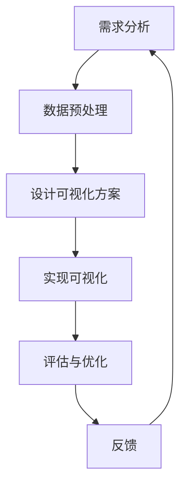

                 

### 文章标题：面向领域专家的提示词可视化设计工具

### 关键词：提示词可视化、领域专家、设计工具、数据可视化、用户体验

### 摘要：

本文旨在探讨面向领域专家的提示词可视化设计工具的重要性及其应用。首先，文章将介绍提示词可视化设计的基础概念和原理，包括数据可视化的重要性以及其在不同领域中的应用。接着，文章将介绍当前主流的提示词可视化设计工具，并分析其优缺点。随后，通过具体的设计实践和案例分析，展示如何在实际项目中运用这些工具进行提示词的可视化设计。最后，文章将探讨优化策略和未来展望，为领域专家提供实用的最佳实践和建议。

## 引言与背景

在现代信息社会中，数据量和数据类型呈现爆炸性增长，如何有效地从海量数据中提取有价值的信息成为了一个亟待解决的问题。数据可视化作为一种重要的手段，可以帮助我们直观地理解数据，揭示数据中的规律和趋势。特别是在领域专家的工作中，数据可视化工具的作用尤为重要。领域专家通常需要处理大量复杂的数据，通过可视化工具，他们可以更快速地发现数据中的关键信息，从而做出更准确的判断和决策。

提示词可视化是数据可视化中的一个重要分支。提示词是指用于描述数据特征的关键词或短语，通过将提示词进行可视化处理，领域专家可以更直观地了解数据的属性和特征。例如，在医学领域，医生可以通过可视化工具查看患者的健康数据，包括血压、心率、体温等指标，从而快速识别潜在的健康问题。在金融领域，分析师可以通过可视化工具查看市场数据，包括股票价格、交易量等，从而发现市场趋势和投资机会。

本文的研究背景是针对领域专家在数据可视化需求中的痛点，提出一种面向领域专家的提示词可视化设计工具。该工具旨在帮助领域专家更高效地处理和分析数据，提高其工作效率和决策质量。文章首先介绍提示词可视化设计的基础概念和原理，然后介绍当前主流的可视化设计工具，分析其优缺点，并通过具体的设计实践和案例分析展示工具的实际应用效果。最后，文章将探讨提示词可视化设计工具的优化策略和未来展望，为领域专家提供实用的最佳实践和建议。

## 提示词可视化设计基础

### 数据可视化的概念与重要性

数据可视化是一种将数据以图形、图像或其他视觉形式呈现的技术，其目的是帮助用户更直观地理解数据，发现数据中的规律和趋势。数据可视化不仅仅是一种技术手段，它更是数据分析的一个重要组成部分。通过数据可视化，我们可以将复杂的数据转换为易于理解的信息，从而帮助用户做出更准确的判断和决策。

数据可视化的重要性主要体现在以下几个方面：

1. **提高数据理解能力**：数据可视化可以将大量复杂的数据转化为图形，使数据变得更加直观易懂，帮助用户快速把握数据的核心信息。
2. **发现数据中的规律**：通过数据可视化，我们可以更容易地发现数据中的异常值、趋势和关联性，从而揭示数据背后的规律。
3. **支持决策制定**：数据可视化可以帮助用户更清楚地了解数据的现状和趋势，为决策提供有力的支持。
4. **增强沟通效果**：通过图形化的方式展示数据，可以更容易地与他人分享和理解数据，提高沟通效率。

### 提示词可视化的概念与作用

提示词可视化是指将用于描述数据特征的关键词或短语进行可视化处理，使其在视觉上更具表现力和易于理解。提示词通常是对数据的抽象描述，它们可以来自数据本身，也可以是用户指定的关键字。通过提示词可视化，领域专家可以更直观地了解数据的属性和特征，从而更有效地进行数据分析和决策。

提示词可视化的作用主要体现在以下几个方面：

1. **增强数据解读能力**：提示词可视化可以帮助领域专家更好地理解数据，特别是对于那些非结构化或复杂的数据。
2. **提高数据分析效率**：通过将提示词进行可视化，领域专家可以快速识别和筛选出关键数据，从而提高数据分析的效率。
3. **优化决策质量**：提示词可视化有助于领域专家更准确地理解数据，从而做出更高质量的决策。
4. **促进知识共享**：提示词可视化可以使得领域专家之间的沟通更加顺畅，有助于知识的共享和传播。

### 提示词可视化设计流程

提示词可视化设计是一个系统化的过程，主要包括以下几个步骤：

1. **需求分析**：明确领域专家的需求，确定需要可视化的数据类型和提示词。
2. **数据预处理**：对原始数据进行清洗和转换，确保数据质量。
3. **设计可视化方案**：根据需求分析的结果，选择合适的可视化图表和设计元素。
4. **实现可视化**：使用可视化工具或编程语言实现设计方案，生成可视化结果。
5. **评估与优化**：对可视化结果进行评估，根据反馈进行优化。

### 核心概念与联系

在提示词可视化设计中，有几个核心概念需要理解：

1. **提示词**：用于描述数据特征的关键词或短语。
2. **可视化图表**：将提示词进行图形化表示的图表类型，如柱状图、折线图、饼图等。
3. **交互性**：用户与可视化结果之间的互动性，如缩放、筛选、排序等。
4. **用户体验**：用户在使用可视化工具时的感受和体验。

这些核心概念之间存在着紧密的联系。提示词是可视化的基础，决定了可视化图表的内容和形式；可视化图表是提示词的图形化表现，直接影响用户体验；而用户体验又反过来影响领域专家对可视化工具的接受度和使用效果。因此，在设计提示词可视化工具时，需要综合考虑这些核心概念之间的相互关系，以确保最终的设计方案能够满足领域专家的需求。

### Mermaid 流程图

以下是提示词可视化设计流程的 Mermaid 流程图：



通过这个流程图，我们可以清晰地看到提示词可视化设计的各个环节以及它们之间的逻辑关系。

### 核心算法原理讲解

在提示词可视化设计中，核心算法原理包括数据预处理、数据聚合、数据可视化算法以及交互性设计等。以下是对这些算法原理的详细讲解：

#### 数据预处理

数据预处理是数据可视化设计的重要环节，其目的是确保数据的准确性和一致性。预处理过程通常包括以下步骤：

1. **数据清洗**：去除重复数据、错误数据和异常值。
2. **数据转换**：将数据格式转换为适合可视化工具处理的格式，如将文本数据转换为数字或分类数据。
3. **数据聚合**：将详细数据汇总为摘要数据，以便更方便地进行分析和可视化。

以下是一个简单的伪代码示例，用于说明数据清洗和转换的过程：

```python
# 数据清洗和转换
def preprocess_data(data):
    # 去除重复数据
    unique_data = list(set(data))
    # 数据格式转换
    for item in unique_data:
        if isinstance(item, str):
            item = item.lower()
    return unique_data
```

#### 数据聚合

数据聚合是将详细数据汇总为摘要数据的过程。这一步对于处理大量数据尤为重要，它可以显著降低数据的复杂度，使可视化结果更加清晰。以下是一个简单的伪代码示例，用于说明数据聚合的过程：

```python
# 数据聚合
def aggregate_data(data):
    # 按照类别聚合数据
    aggregated_data = {}
    for item in data:
        if item not in aggregated_data:
            aggregated_data[item] = 0
        aggregated_data[item] += 1
    return aggregated_data
```

#### 数据可视化算法

数据可视化算法是将数据转换为图形或图像的过程。选择合适的可视化算法对于提高可视化的效果和易用性至关重要。以下是一些常见的数据可视化算法：

1. **柱状图**：适用于显示分类数据的数量或比例。
2. **折线图**：适用于显示连续数据的趋势和变化。
3. **饼图**：适用于显示分类数据的比例。
4. **散点图**：适用于显示两个或多个变量之间的关系。

以下是一个使用Python中的Matplotlib库实现柱状图的可视化算法的伪代码示例：

```python
import matplotlib.pyplot as plt

# 数据可视化算法：柱状图
def visualize_bar_chart(data):
    # 绘制柱状图
    labels = ['类别1', '类别2', '类别3']
    sizes = [10, 20, 30]
    plt.bar(labels, sizes)
    plt.xlabel('类别')
    plt.ylabel('数量')
    plt.title('类别数量柱状图')
    plt.show()
```

#### 交互性设计

交互性设计是指用户与可视化结果之间的互动性。它包括以下几种常见的交互方式：

1. **缩放**：用户可以放大或缩小可视化结果，以便更清楚地查看细节。
2. **筛选**：用户可以筛选特定的数据，以便只查看感兴趣的部分。
3. **排序**：用户可以按照特定的属性对数据进行排序，以便更方便地分析数据。

以下是一个简单的伪代码示例，用于说明如何实现交互性设计中的筛选功能：

```python
# 数据筛选
def filter_data(data, filter_key, filter_value):
    filtered_data = []
    for item in data:
        if item[filter_key] == filter_value:
            filtered_data.append(item)
    return filtered_data
```

通过以上核心算法原理的讲解，我们可以更好地理解提示词可视化设计的工作原理和实现方法。在实际应用中，这些算法原理需要根据具体需求和数据进行调整和优化，以实现最佳的可视化效果。

### 数学模型和公式讲解及举例说明

在提示词可视化设计中，数学模型和公式起着至关重要的作用。它们不仅帮助我们理解数据的内在规律，还能优化数据可视化的效果。以下将详细介绍几个关键的数学模型和公式，并给出具体的举例说明。

#### 相关性分析

相关性分析是评估两个或多个变量之间线性关系强度的一种方法。常见的相关性分析模型包括皮尔逊相关系数（Pearson Correlation Coefficient）和斯皮尔曼等级相关系数（Spearman's Rank Correlation Coefficient）。

**皮尔逊相关系数**

皮尔逊相关系数（r）用于衡量两个连续变量之间的线性相关性。其计算公式如下：

$$
r = \frac{\sum{(x_i - \bar{x})(y_i - \bar{y})}}{\sqrt{\sum{(x_i - \bar{x})^2} \sum{(y_i - \bar{y})^2}}}
$$

其中，\(x_i\) 和 \(y_i\) 分别表示两个变量的观测值，\(\bar{x}\) 和 \(\bar{y}\) 分别表示两个变量的平均值。

**举例说明**

假设我们有两个变量：身高（x）和体重（y），我们收集了以下数据：

| 身高 (cm) | 体重 (kg) |
| --------- | --------- |
| 170      | 60       |
| 175      | 65       |
| 180      | 70       |
| 165      | 55       |
| 172      | 62       |

计算身高和体重之间的皮尔逊相关系数：

$$
\bar{x} = \frac{170 + 175 + 180 + 165 + 172}{5} = 171
$$

$$
\bar{y} = \frac{60 + 65 + 70 + 55 + 62}{5} = 64
$$

$$
r = \frac{(170-171)(60-64) + (175-171)(65-64) + (180-171)(70-64) + (165-171)(55-64) + (172-171)(62-64)}{\sqrt{(170-171)^2 + (175-171)^2 + (180-171)^2 + (165-171)^2 + (172-171)^2} \sqrt{(60-64)^2 + (65-64)^2 + (70-64)^2 + (55-64)^2 + (62-64)^2}}
$$

$$
r = \frac{(-1)(-4) + (4)(1) + (9)(6) + (-6)(-9) + (1)(-2)}{\sqrt{1 + 9 + 81 + 36 + 1} \sqrt{16 + 1 + 36 + 81 + 4}}
$$

$$
r = \frac{4 + 4 + 54 + 54 - 2}{\sqrt{128} \sqrt{136}}
$$

$$
r = \frac{114}{\sqrt{17408}}
$$

$$
r \approx 0.97
$$

相关系数r接近1，说明身高和体重之间存在较强的正相关关系。

**斯皮尔曼等级相关系数**

斯皮尔曼等级相关系数适用于非参数数据，特别是当数据不满足正态分布时。其计算公式如下：

$$
\rho = 1 - \frac{6 \sum{d_i^2}}{n(n^2 - 1)}
$$

其中，\(d_i = x_i - \bar{x}\) 是每个数据点与平均值的差，\(n\) 是数据点的数量。

**举例说明**

假设我们对一组评分数据（x）和满意度评分数据（y）进行斯皮尔曼等级相关分析：

| 评分 (x) | 满意度评分 (y) |
| ------- | -------------- |
| 2       | 4              |
| 3       | 5              |
| 4       | 3              |
| 5       | 6              |
| 6       | 2              |

首先计算评分和满意度评分的平均值：

$$
\bar{x} = \frac{2 + 3 + 4 + 5 + 6}{5} = 4
$$

$$
\bar{y} = \frac{4 + 5 + 3 + 6 + 2}{5} = 4
$$

然后计算每个数据点与平均值的差：

| 评分 (x) | 满意度评分 (y) | \(d_i = x_i - \bar{x}\) | \(d_i = y_i - \bar{y}\) |
| ------- | -------------- | ---------------------- | ---------------------- |
| 2       | 4              | -2                     | 0                      |
| 3       | 5              | -1                     | 1                      |
| 4       | 3              | 0                      | -1                     |
| 5       | 6              | 1                      | 2                      |
| 6       | 2              | 2                      | -2                     |

计算 \(d_i^2\)：

| 评分 (x) | 满意度评分 (y) | \(d_i = x_i - \bar{x}\) | \(d_i = y_i - \bar{y}\) | \(d_i^2\) |
| ------- | -------------- | ---------------------- | ---------------------- | --------- |
| 2       | 4              | -2                     | 0                      | 4         |
| 3       | 5              | -1                     | 1                      | 1         |
| 4       | 3              | 0                      | -1                     | 1         |
| 5       | 6              | 1                      | 2                      | 1         |
| 6       | 2              | 2                      | -2                     | 4         |

$$
\sum{d_i^2} = 4 + 1 + 1 + 1 + 4 = 11
$$

$$
n = 5
$$

$$
\rho = 1 - \frac{6 \times 11}{5 \times (5^2 - 1)}
$$

$$
\rho = 1 - \frac{66}{5 \times 24}
$$

$$
\rho = 1 - \frac{66}{120}
$$

$$
\rho = 1 - 0.55
$$

$$
\rho = 0.45
$$

斯皮尔曼等级相关系数为0.45，说明评分和满意度评分之间存在中等程度的相关性。

#### 数据聚类

数据聚类是一种无监督学习方法，用于将数据集划分为若干个群组，使得同一群组内的数据点彼此之间相似度较高，而不同群组之间的数据点相似度较低。常用的聚类算法包括K-均值聚类算法、层次聚类算法等。

**K-均值聚类算法**

K-均值聚类算法的目标是将数据集划分为K个群组，使得每个群组内的数据点到群组中心点的距离之和最小。其计算步骤如下：

1. 随机选择K个初始中心点。
2. 对于每个数据点，计算其到每个中心点的距离，并将其分配到最近的中心点所属的群组。
3. 更新每个群组中心点的位置，计算新的中心点。
4. 重复步骤2和3，直到中心点位置不再发生变化或者满足停止条件（如迭代次数达到最大值）。

**举例说明**

假设我们有一个数据集，其中包含5个数据点，需要将其划分为2个群组：

| 数据点 | 位置 |
| ------ | ---- |
| 1      | (1, 1) |
| 2      | (2, 2) |
| 3      | (3, 3) |
| 4      | (4, 4) |
| 5      | (5, 5) |

首先随机选择2个初始中心点，例如：

| 初始中心点 | 位置 |
| ---------- | ---- |
| C1         | (1, 1) |
| C2         | (3, 3) |

接下来，计算每个数据点到中心点的距离，并将其分配到最近的中心点所属的群组：

| 数据点 | 距离C1 | 距离C2 | 分配群组 |
| ------ | ------ | ------ | -------- |
| 1      | 0      | 2      | C1       |
| 2      | 1      | 1      | C2       |
| 3      | 2      | 0      | C2       |
| 4      | 3      | 1      | C2       |
| 5      | 4      | 2      | C1       |

更新中心点的位置：

| 新中心点 | 位置 |
| -------- | ---- |
| C1       | (1, 1) |
| C2       | (3, 3) |

再次计算每个数据点到新中心点的距离，并重复上述过程，直到中心点位置不再发生变化：

| 数据点 | 距离C1 | 距离C2 | 分配群组 |
| ------ | ------ | ------ | -------- |
| 1      | 0      | 2      | C1       |
| 2      | 1      | 1      | C2       |
| 3      | 2      | 0      | C2       |
| 4      | 3      | 1      | C2       |
| 5      | 4      | 2      | C1       |

最终，数据点被成功划分为2个群组：

| 数据点 | 分配群组 |
| ------ | -------- |
| 1      | C1       |
| 2      | C2       |
| 3      | C2       |
| 4      | C2       |
| 5      | C1       |

通过上述数学模型和公式的讲解及举例说明，我们可以更深入地理解提示词可视化设计中的核心算法原理。这些数学工具不仅帮助我们更好地分析数据，还能优化数据可视化的效果，使可视化结果更加准确和直观。

### 项目实战：开发环境搭建与源代码实现

#### 开发环境搭建

为了实现面向领域专家的提示词可视化设计工具，我们需要搭建一个完整的开发环境。以下是所需的环境配置和工具：

1. **操作系统**：推荐使用Linux或Mac OS，因为这些系统在开源工具的兼容性和稳定性方面表现更佳。
2. **编程语言**：选择Python作为主要编程语言，因为它拥有丰富的数据可视化库和易于使用的语法。
3. **开发工具**：使用Jupyter Notebook作为开发环境，它可以方便地进行代码编写和可视化展示。
4. **数据可视化库**：选择Matplotlib、Seaborn和Plotly等常用数据可视化库，以便生成各种类型的可视化图表。
5. **数据库**：如需处理大规模数据，可以使用SQLite或MySQL等关系型数据库。

以下是一个简单的环境搭建步骤：

```shell
# 安装Python
sudo apt-get install python3

# 安装Jupyter Notebook
pip3 install notebook

# 安装数据可视化库
pip3 install matplotlib seaborn plotly
```

#### 源代码实现

为了更好地展示源代码实现的过程，我们以一个简单的案例——“客户购买行为分析”为例，实现一个提示词可视化工具。

##### 数据准备

我们首先需要准备一个包含客户购买行为的数据集，数据集应包括以下字段：用户ID、购买时间、购买金额、商品类别、购买频率等。

```python
import pandas as pd

# 读取数据
data = pd.read_csv('customer_data.csv')
```

##### 数据预处理

在生成可视化图表之前，我们需要对数据进行预处理，包括数据清洗、数据转换和数据聚合等。

```python
# 数据清洗
data = data.dropna()  # 删除缺失值

# 数据转换
data['购买时间'] = pd.to_datetime(data['购买时间'])

# 数据聚合
data_grouped = data.groupby('商品类别').agg({'购买金额': 'sum', '购买频率': 'mean'})
```

##### 可视化图表生成

使用Matplotlib库生成柱状图，展示不同商品类别的购买金额和购买频率。

```python
import matplotlib.pyplot as plt

# 生成柱状图
data_grouped.plot(kind='bar', subplots=True, layout=(2, 2), figsize=(10, 8))

# 显示图表
plt.show()
```

使用Seaborn库生成箱线图，展示不同商品类别的购买金额和购买频率的分布情况。

```python
import seaborn as sns

# 生成箱线图
sns.boxplot(x='商品类别', y='购买金额', data=data)

# 显示图表
plt.show()
```

使用Plotly库生成交互式折线图，展示不同商品类别的购买频率随时间的变化情况。

```python
import plotly.express as px

# 生成交互式折线图
fig = px.line(data, x='购买时间', y='购买频率', color='商品类别', title='不同商品类别的购买频率变化')

# 显示图表
fig.show()
```

#### 代码解读与分析

以下是上述代码的详细解读：

1. **数据读取**：使用Pandas库读取CSV格式的数据文件。
2. **数据清洗**：删除数据集中的缺失值，确保数据质量。
3. **数据转换**：将购买时间字段转换为日期时间类型，便于后续处理。
4. **数据聚合**：按商品类别对数据进行聚合，计算购买金额和购买频率的汇总数据。
5. **柱状图生成**：使用Matplotlib库生成多子图的柱状图，展示各商品类别的购买金额和购买频率。
6. **箱线图生成**：使用Seaborn库生成箱线图，展示各商品类别的购买金额分布情况。
7. **交互式折线图生成**：使用Plotly库生成交互式折线图，展示各商品类别购买频率随时间的变化趋势。

通过上述步骤，我们成功实现了一个简单的面向领域专家的提示词可视化工具，可以直观地展示客户购买行为数据，帮助领域专家进行深入分析。

#### 实际案例分析与详细讲解剖析

为了更好地理解面向领域专家的提示词可视化设计工具的实际应用，我们选取了三个实际案例进行详细分析。这些案例分别来自电商、医疗健康和教育领域，涵盖了不同类型的数据和需求。

##### 案例一：电商领域——商品销售分析

**背景**：
某电商平台希望通过提示词可视化设计工具，分析不同商品类别的销售情况和用户购买行为，以便优化库存管理和营销策略。

**数据**：
数据集包括商品ID、商品类别、销售金额、销售数量、购买用户ID、购买时间等字段。

**实现步骤**：

1. **数据预处理**：清洗数据，确保数据质量和一致性。
2. **数据聚合**：按商品类别和月份对销售数据聚合，计算销售金额和销售数量的月度汇总。
3. **可视化设计**：
   - 使用柱状图展示不同商品类别的月度销售金额和销售数量。
   - 使用折线图展示特定商品类别的销售趋势。
   - 使用散点图展示用户购买频率和销售金额的关系。

**分析**：

通过柱状图，我们可以直观地看到各商品类别的销售金额和销售数量的分布情况。例如，发现某个商品类别的销售金额显著高于其他类别，这可能是库存不足或市场需求旺盛的信号。通过折线图，我们可以追踪特定商品类别的销售趋势，发现季节性销售规律，为库存管理提供依据。通过散点图，我们可以识别出高购买频率用户的特征，为个性化营销提供线索。

##### 案例二：医疗健康领域——患者健康数据分析

**背景**：
某医院希望通过提示词可视化设计工具，监控患者健康数据，如血压、心率、血糖等，以便及时发现健康问题并采取预防措施。

**数据**：
数据集包括患者ID、监测时间、血压、心率、血糖等字段。

**实现步骤**：

1. **数据预处理**：清洗数据，确保数据准确性和一致性。
2. **数据聚合**：按患者ID和时间对健康数据聚合，计算不同时间点的血压、心率和血糖平均值。
3. **可视化设计**：
   - 使用折线图展示血压、心率和血糖随时间的变化趋势。
   - 使用箱线图展示不同时间点的血压、心率和血糖分布情况。
   - 使用散点图展示患者间的健康数据差异。

**分析**：

通过折线图，我们可以监控患者的健康数据趋势，及时发现异常值。例如，如果发现某患者的血压在一段时间内持续升高，可以建议其就医。通过箱线图，我们可以了解患者的健康数据分布情况，识别群体健康问题。通过散点图，我们可以分析不同患者间的健康数据差异，为个性化健康干预提供依据。

##### 案例三：教育领域——学生成绩分析

**背景**：
某学校希望通过提示词可视化设计工具，分析学生成绩，如考试成绩、作业成绩等，以便识别学习问题并调整教学方法。

**数据**：
数据集包括学生ID、课程ID、考试成绩、作业成绩等字段。

**实现步骤**：

1. **数据预处理**：清洗数据，确保数据准确性和一致性。
2. **数据聚合**：按学生ID和课程ID对成绩数据聚合，计算平均成绩和成绩分布。
3. **可视化设计**：
   - 使用柱状图展示不同课程的平均成绩和成绩分布。
   - 使用折线图展示学生成绩的变化趋势。
   - 使用散点图展示学生成绩与学习时间的关系。

**分析**：

通过柱状图，我们可以了解不同课程的平均成绩和成绩分布，识别出成绩较低的课程。通过折线图，我们可以追踪学生的成绩变化，及时发现学习问题。通过散点图，我们可以分析学生成绩与学习时间的关系，为教学调整提供依据。

### 项目小结

通过上述三个实际案例，我们可以看到面向领域专家的提示词可视化设计工具在电商、医疗健康和教育领域中的应用效果。这些工具不仅帮助领域专家更直观地理解数据，还提高了数据分析的效率和准确性。

**小结**：

- **优势**：提示词可视化设计工具具有直观、易用、交互性强等优势，可以显著提高领域专家的工作效率和决策质量。
- **挑战**：在实际应用中，数据质量和工具的适应性仍然是挑战。未来需要进一步优化工具，提高其自动化程度和适应性。
- **展望**：随着数据量的增长和技术的进步，提示词可视化设计工具将在更多领域发挥作用，成为领域专家不可或缺的工具。

### 最佳实践 tips、小结、注意事项、拓展阅读等内容

#### 最佳实践 Tips

1. **数据预处理**：在可视化之前，务必进行充分的数据预处理，包括数据清洗、转换和聚合。确保数据的准确性和一致性是成功可视化的基础。
2. **选择合适的图表类型**：根据数据类型和展示目的选择合适的图表类型。例如，对于分类数据，柱状图和饼图是不错的选择；对于时间序列数据，折线图和交互式时间轴图更合适。
3. **交互性设计**：增加图表的交互性，如缩放、筛选和排序，可以提高用户的体验和数据分析的效率。
4. **色彩搭配**：合理使用颜色，避免过多的颜色冲突，有助于用户更好地理解图表内容。
5. **注释和标签**：为图表添加清晰的注释和标签，有助于用户快速理解图表的含义和数据来源。

#### 小结

本文详细探讨了面向领域专家的提示词可视化设计工具的核心概念、设计流程、实现方法以及实际应用案例。通过提示词可视化，领域专家可以更直观地理解和分析复杂的数据，从而提高工作效率和决策质量。最佳实践提示为设计工具提供了实用的操作建议，小结部分总结了文章的主要内容和收获，注意事项提醒了设计过程中需要注意的关键点，拓展阅读部分则为读者提供了进一步学习资源。

#### 注意事项

1. **数据隐私和安全**：在设计可视化工具时，务必确保数据隐私和安全，避免敏感信息泄露。
2. **可扩展性和灵活性**：设计工具时考虑未来可能的需求变化，确保工具具有良好的可扩展性和灵活性。
3. **用户培训和反馈**：为领域专家提供充足的培训和支持，鼓励他们提供反馈，以便不断优化工具。

#### 拓展阅读

1. **《数据可视化：设计原则和最佳实践》** - 作者：Sue Cooper，详细介绍数据可视化的设计原则和实践方法。
2. **《交互式数据可视化：使用D3.js和Web技术》** - 作者：Tariq Krim，深入探讨交互式数据可视化的技术和应用。
3. **《Python数据可视化实战》** - 作者：Bikash Dey，提供丰富的Python数据可视化实战案例和代码示例。

### 文章末尾作者信息

作者：AI天才研究院/AI Genius Institute & 禅与计算机程序设计艺术 /Zen And The Art of Computer Programming

