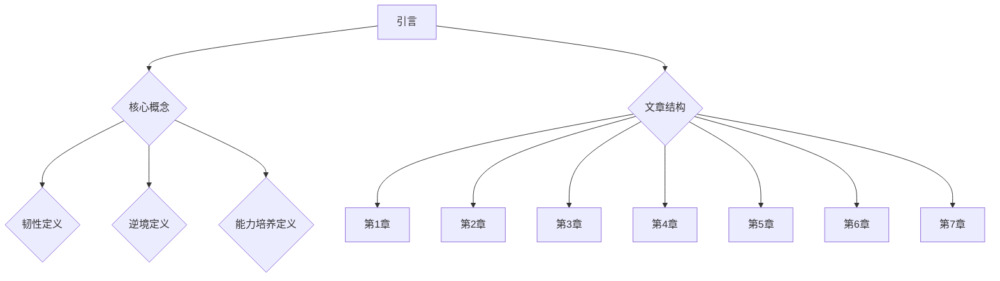

                 

## 文章标题

# 韧性培养：增强面对逆境的能力

> 关键词：韧性、逆境、能力培养、心理准备、团队合作、领导力

> 摘要：本文将探讨韧性培养的重要性，以及如何通过心理准备、实践方法、团队协作和领导力等方面来增强个人和团队面对逆境的能力。通过深入分析和实例讲解，帮助读者理解韧性培养的核心概念，掌握应对逆境的技巧。

## 前言

在现代社会的快速发展中，面对各种不确定性和挑战，培养韧性成为个人和团队取得成功的关键因素。韧性（Resilience）是指个体或团队在面对逆境和压力时，能够迅速适应、恢复和成长的品质。本文将系统地介绍韧性培养的理论和实践方法，帮助读者提高应对逆境的能力。

### 核心概念

在讨论韧性培养之前，我们需要明确几个核心概念：

1. **逆境**：逆境是指个体或团队面临的困难、挑战和压力，可能来自工作、生活、人际关系等方面。
2. **韧性**：韧性是指个体或团队在逆境中迅速适应、恢复和成长的能力。
3. **能力培养**：能力培养是指通过训练和实践，提高个体或团队在特定领域的技能和素质。

### 文章结构

本文分为以下几个部分：

1. **第1章 韧性的概念与重要性**：介绍韧性的定义、特点以及其在个人成长和职场竞争中的重要性。
2. **第2章 面对逆境的心理准备**：探讨逆境的种类、心理准备的策略以及情绪调节技巧。
3. **第3章 韧性培养的方法与实践**：详细讲解韧性培养的基本原则和具体实践方法。
4. **第4章 韧性在不同情境下的应用**：分析韧性在家庭生活、教育领域和职场中的应用。
5. **第5章 韧性与个人成长**：讨论韧性对个人成长的影响以及个人成长中的韧性培养。
6. **第6章 韧性与团队协作**：阐述韧性在团队协作中的作用以及如何建设韧性团队。
7. **第7章 韧性与领导力**：介绍韧性领导力的概念、特点及其培养方法。

### 目的与期望

通过本文的阅读，读者将能够：

1. 理解韧性的核心概念和重要性。
2. 掌握面对逆境的心理准备和情绪调节技巧。
3. 学会韧性培养的方法和实践技巧。
4. 了解韧性在个人成长、团队协作和领导力方面的应用。

### 文章结构Mermaid流程图

## 第1章 韧性的概念与重要性

### 1.1 韧性的定义与特点

韧性是指个体或团队在面对逆境和压力时，能够迅速适应、恢复和成长的能力。韧性不是简单的心理素质，而是一种综合性的品质，包括心理、情感、行为和认知等方面。以下是韧性的几个关键特点：

1. **适应性**：韧性强的个体或团队能够快速适应环境变化，调整自己的策略和行为。
2. **恢复力**：韧性强的个体或团队能够在遭遇挫折和失败后，迅速恢复并重新投入到工作和生活中。
3. **成长性**：韧性强的个体或团队能够从逆境中学习和成长，不断提升自己的能力和素质。
4. **抗压力**：韧性强的个体或团队能够承受较大的压力，保持积极的心态和情绪。

### 1.1.1 韧性的定义

韧性（Resilience）源自拉丁语“resilire”，意为“弹回”。在心理学领域，韧性通常被定义为个体在面对逆境、压力和挑战时，能够迅速适应、恢复和成长的能力。韧性不是一种单一的品质，而是一种多维度的能力，包括以下几个方面：

1. **心理韧性**：指个体在面临压力和困难时，能够保持积极心态和情绪的能力。
2. **情感韧性**：指个体在情感上能够迅速恢复，从挫折和失望中走出的能力。
3. **行为韧性**：指个体在行为上能够迅速适应变化，灵活应对挑战的能力。
4. **认知韧性**：指个体在认知上能够从挫折中学习，不断提升自己的能力和素质。

### 1.1.2 韧性的特点

韧性的特点主要包括适应性、恢复力、成长性和抗压力。以下是这些特点的详细解释：

1. **适应性**：韧性强的个体或团队能够快速适应环境变化。在面对新的挑战和变化时，他们能够迅速调整自己的思维和行为，以适应新的情况。例如，一个韧性强的工作团队在面对项目延期和资源不足的困境时，能够迅速调整计划和策略，确保项目能够按时完成。

2. **恢复力**：韧性强的个体或团队能够在遭遇挫折和失败后，迅速恢复并重新投入到工作和生活中。这种恢复力不仅体现在心理和情绪上，也体现在行为和认知上。例如，一个韧性强的创业者，在经历一次失败的创业后，能够迅速调整心态，总结经验教训，重新开始创业，并最终取得成功。

3. **成长性**：韧性强的个体或团队能够从逆境中学习和成长。他们在面对挑战时，不仅能够应对当前的困境，还能够从中学到宝贵的经验，不断提升自己的能力和素质。例如，一个韧性强的软件开发团队，在经历一次项目的失败后，能够总结经验教训，改进开发流程，提高项目的成功率。

4. **抗压力**：韧性强的个体或团队能够承受较大的压力，保持积极的心态和情绪。他们在面对压力和困难时，能够保持冷静，有效地应对挑战。例如，一个韧性强的领导者，在面临公司的财务危机和市场压力时，能够保持积极的心态，制定有效的应对策略，带领团队走出困境。

### 1.1.3 韧性与逆境的关系

韧性和逆境之间存在密切的关系。逆境是指个体或团队面临的困难、挑战和压力，可能是工作上的、生活中的，也可能是人际关系上的。韧性的培养与增强，有助于个体或团队更好地应对逆境，减少逆境带来的负面影响。

1. **韧性与逆境的相互影响**：韧性的培养有助于个体或团队更好地应对逆境。在面临逆境时，韧性强的个体或团队能够更快地适应和恢复，从困境中找到解决问题的方法。同时，逆境的挑战和压力也是韧性培养的重要契机。通过面对和克服逆境，个体或团队可以不断提升自己的韧性和能力。

2. **逆境对韧性的影响**：逆境对韧性的培养具有双重作用。一方面，适度的逆境可以激发个体的潜能，促进韧性的发展。通过经历逆境，个体可以学会应对挑战，提高适应能力。另一方面，过度的逆境可能会对个体的心理健康产生负面影响，削弱个体的韧性。因此，在培养韧性的过程中，需要合理面对和应对逆境，避免过度压力和负面情绪。

### 1.2 韧性的重要性

韧性在个人成长、职场竞争和心理健康等方面具有重要意义。

#### 1.2.1 韧性在个人成长中的作用

韧性是个人成长的重要品质。具有韧性的个体能够在面对挑战和困难时，保持积极的心态，迅速适应和恢复。韧性强的个体不仅能够在逆境中取得成功，还能够从失败和挫折中吸取教训，不断成长和进步。例如，一位韧性强的创业者，在经历多次创业失败后，能够总结经验教训，调整策略，最终实现成功。

#### 1.2.2 韧性在职场竞争中的优势

在职场竞争中，韧性是一种重要的竞争优势。韧性强的员工能够更好地应对工作中的压力和挑战，保持高效的工作状态。他们能够在面对复杂问题和不确定性时，迅速适应和调整，找到解决问题的方法。此外，韧性强的员工在团队中具有较高的稳定性和影响力，有助于团队协作和共同成长。

#### 1.2.3 韧性对心理健康的影响

韧性对心理健康具有积极的影响。韧性强的个体能够更好地应对生活中的压力和挑战，保持心理健康。他们能够在面对逆境时，保持积极的心态，有效地调节情绪。同时，韧性强的个体具有较高的心理恢复力，能够在遭遇挫折和失败后，迅速恢复并重新投入到生活和工作中。

### 1.3 韧性的影响因素

韧性的发展受多种因素影响，包括遗传、环境、个人经历等。

#### 1.3.1 遗传因素

遗传因素对韧性有一定的影响。研究表明，个体的韧性基因可能会影响其面对逆境时的情绪调节能力和恢复力。然而，遗传因素并非决定韧性发展的唯一因素，环境和个人经历同样具有重要影响。

#### 1.3.2 环境因素

环境因素对韧性发展具有重要作用。一个积极、支持性的环境有助于个体培养韧性。例如，一个温馨的家庭环境、良好的学校教育和积极的社会支持，都有助于个体发展韧性。

#### 1.3.3 个人经历

个人经历是韧性培养的重要影响因素。个体在成长过程中经历的各种挑战和逆境，有助于其形成应对困难的策略和心态。适度的逆境和挑战可以激发个体的潜能，促进韧性发展。

### 1.4 韧性培养的基本原则

要培养韧性，需要遵循以下基本原则：

#### 1.4.1 接受逆境

面对逆境时，首先要接受现实，不要逃避或否认。接受逆境有助于个体更好地应对挑战，找到解决问题的方法。

#### 1.4.2 保持积极心态

保持积极心态是培养韧性的关键。积极的心态有助于个体更好地应对逆境，保持情绪稳定。

#### 1.4.3 学习与成长

从逆境中学习和成长是韧性培养的重要途径。个体需要学会从失败和挫折中吸取教训，不断提升自己的能力和素质。

#### 1.4.4 建立支持网络

建立支持网络有助于个体在逆境中寻求帮助和支持。一个良好的支持网络包括家人、朋友、同事等，可以在困难时给予个体鼓励和帮助。

### 1.5 韧性培养的方法与实践

以下是一些具体的韧性培养方法和实践技巧：

#### 1.5.1 情绪调节技巧

情绪调节技巧有助于个体在逆境中保持情绪稳定。常见的情绪调节技巧包括深呼吸、冥想、运动等。

#### 1.5.2 时间管理

时间管理技巧有助于个体合理安排时间和任务，减轻压力和焦虑。有效的时间管理可以帮助个体更好地应对工作和生活中的挑战。

#### 1.5.3 自我反思

自我反思有助于个体了解自己的情绪、行为和思维模式。通过自我反思，个体可以找到自己的优势和不足，从而不断提升自己的能力和素质。

#### 1.5.4 求助与支持

在面对困难和挑战时，个体需要学会寻求帮助和支持。一个良好的支持网络可以帮助个体在逆境中更好地应对和恢复。

### 1.6 韧性培养的案例分析

以下是一些韧性培养的案例分析，以展示韧性培养的实际效果。

#### 1.6.1 案例一：成功创业者的韧性培养

一位成功创业者，在经历多次创业失败后，通过积极的心态、情绪调节技巧和求助与支持，最终取得了成功。他的韧性培养过程包括接受失败、调整心态、学习与成长、建立支持网络等方面。

#### 1.6.2 案例二：职场高管的韧性培养

一位职场高管，在面临公司财务危机和市场压力时，通过积极应对、情绪调节、时间管理和求助与支持，带领团队成功度过了危机，取得了显著的业务增长。

### 1.7 韧性培养的实践建议

为了有效培养韧性，以下是一些建议：

1. **树立积极心态**：积极心态是韧性培养的基础。要树立积极的心态，可以通过阅读、思考、交流等方式，不断调整自己的心态。

2. **学会情绪调节**：情绪调节技巧有助于个体在逆境中保持情绪稳定。可以通过深呼吸、冥想、运动等方式，学会调节情绪。

3. **合理安排时间**：合理安排时间有助于个体更好地应对工作和生活中的挑战。可以通过制定日程表、设置优先级等方式，提高时间管理能力。

4. **自我反思**：自我反思有助于个体了解自己的情绪、行为和思维模式。可以通过日记、思考、反思等方式，不断总结和提升自己。

5. **建立支持网络**：建立支持网络有助于个体在逆境中寻求帮助和支持。可以通过家人、朋友、同事等渠道，建立自己的支持网络。

6. **持续学习和成长**：持续学习和成长是韧性培养的重要途径。可以通过学习新知识、参加培训、交流经验等方式，不断提升自己的能力和素质。

### 1.8 总结

韧性是个人成长、职场竞争和心理健康的重要品质。通过本章的介绍，读者可以了解韧性的定义、特点、重要性以及培养韧性的方法和实践。在接下来的章节中，我们将继续探讨韧性在不同情境下的应用，帮助读者更好地应对逆境，提高个人和团队的能力。

## 第2章 面对逆境的心理准备

在现代社会，面对逆境和挑战是不可避免的。为了能够有效地应对逆境，我们需要做好心理准备，建立良好的情绪调节机制。本章将介绍逆境的种类与表现，以及应对逆境的策略和心理准备方法。

### 2.1 逆境的种类与表现

逆境的种类多种多样，可以从以下几个方面进行分类：

1. **工作上的逆境**：包括项目延期、工作压力、团队冲突等。这些逆境可能源于工作量过大、资源不足、沟通不畅等问题。
2. **人际关系上的逆境**：包括家庭矛盾、朋友冲突、同事关系等。这些逆境可能源于价值观差异、沟通不畅、利益冲突等。
3. **个人成长的逆境**：包括学习困难、职业瓶颈、生活压力等。这些逆境可能源于自我认知不足、心理承受能力弱、缺乏信心等。

在逆境中，个体的表现通常分为以下几个方面：

1. **情绪波动**：面对逆境，个体可能会感到焦虑、沮丧、愤怒等负面情绪，情绪波动较大。
2. **心理压力**：逆境可能导致个体承受较大的心理压力，产生担忧、恐惧、无助等感受。
3. **行为反应**：个体在面对逆境时，可能会出现逃避、抱怨、消极应对等行为反应。

### 2.2 逆境心理的应对策略

为了更好地应对逆境，我们需要采取以下策略：

1. **情绪调节**：情绪调节是应对逆境的关键。以下是一些常见的情绪调节技巧：
   - **深呼吸**：通过深呼吸，有助于缓解紧张和焦虑情绪。
   - **认知重构**：通过调整思维方式，改变对逆境的看法，从而减轻负面情绪。
   - **积极思考**：保持积极的心态，相信困境是暂时的，能够度过难关。
   - **寻求支持**：与亲朋好友、心理咨询师等寻求支持和倾诉，释放压力。

2. **心理准备**：心理准备是应对逆境的基础。以下是一些建议：
   - **预期困难**：对可能遇到的困难和挑战有心理预期，做好心理准备。
   - **设定目标**：设定明确的目标和计划，有助于提高应对逆境的能力。
   - **积极应对**：在面对逆境时，积极寻找解决问题的方法，而非逃避或抱怨。
   - **自我反思**：通过自我反思，了解自己的情绪和行为，不断调整应对策略。

### 2.3 情绪调节技巧

情绪调节技巧是应对逆境的重要手段。以下是一些实用的情绪调节技巧：

1. **认知行为疗法**：认知行为疗法（Cognitive Behavioral Therapy，CBT）是一种心理治疗方法，通过调整思维方式来改变情绪和行为。以下是一些CBT技巧：
   - **认知重构**：通过识别和挑战负面思维，改变对逆境的看法。
   - **行为激活**：通过积极参与活动，提高情绪状态。
   - **情绪记录**：通过记录情绪变化，了解情绪的波动规律。

2. **冥想**：冥想是一种放松身心、调节情绪的方法。以下是一些冥想技巧：
   - **专注呼吸**：专注于呼吸，放松身心，缓解紧张情绪。
   - **正念冥想**：专注于当下的感受，接受而不是抗拒，有助于减轻焦虑和压力。

3. **运动**：运动有助于释放压力、提升情绪。以下是一些运动技巧：
   - **有氧运动**：如跑步、游泳等，有助于提高心肺功能，释放压力。
   - **力量训练**：如举重、俯卧撑等，有助于增强肌肉力量，提高自信心。

4. **艺术疗法**：通过绘画、音乐、舞蹈等艺术形式，表达自己的情感和情绪。以下是一些艺术疗法技巧：
   - **绘画**：通过绘画，表达内心的情感和感受。
   - **音乐**：通过听音乐或演奏乐器，放松身心，提升情绪。
   - **舞蹈**：通过舞蹈，表达自己的情感和情绪，增强自信心。

### 2.4 心理准备的方法

心理准备是应对逆境的基础。以下是一些心理准备的方法：

1. **制定应对计划**：在面对逆境时，提前制定应对计划，有助于提高应对能力。以下是一些制定应对计划的步骤：
   - **识别问题**：明确面临的困难和挑战。
   - **分析原因**：分析问题的原因，找到解决方案。
   - **制定计划**：制定具体的行动计划，明确时间表和责任分配。

2. **学习应对技巧**：通过学习应对技巧，提高应对逆境的能力。以下是一些应对技巧：
   - **时间管理**：合理安排时间，提高工作效率，减轻压力。
   - **情绪调节**：通过情绪调节技巧，保持情绪稳定，应对逆境。
   - **积极思考**：保持积极的心态，相信困境是暂时的，能够度过难关。

3. **模拟情境**：通过模拟情境，提高应对逆境的能力。以下是一些模拟情境的方法：
   - **情景演练**：模拟可能遇到的困难和挑战，练习应对策略。
   - **角色扮演**：与他人进行角色扮演，提高沟通和应对能力。
   - **模拟测试**：通过模拟测试，检验应对计划和策略的有效性。

### 2.5 建立积极的心态

建立积极的心态是应对逆境的关键。以下是一些建立积极心态的方法：

1. **积极思考**：通过积极思考，改变对逆境的看法。以下是一些积极思考的方法：
   - **正面思维**：关注积极的事物，寻找解决问题的方法。
   - **感恩心态**：感恩生活中的美好事物，增强心理韧性。
   - **自我激励**：通过自我激励，提高自信和动力。

2. **正面交流**：与他人进行正面交流，分享自己的想法和感受。以下是一些正面交流的方法：
   - **倾听**：倾听他人的意见和建议，吸取有益的经验。
   - **表达**：坦诚地表达自己的感受和需求，建立良好的人际关系。
   - **赞美**：赞美他人，建立积极的互动氛围。

3. **积极行动**：通过积极行动，克服逆境，实现目标。以下是一些积极行动的方法：
   - **设定目标**：明确目标，制定行动计划，付诸实践。
   - **积极尝试**：勇于尝试新事物，克服恐惧和不安。
   - **坚持不懈**：面对困难，坚持不懈，直到成功。

### 2.6 小结

面对逆境，心理准备至关重要。本章介绍了逆境的种类与表现，以及应对逆境的策略和心理准备方法。通过情绪调节技巧、心理准备方法和建立积极心态，我们可以更好地应对逆境，提高个人和团队的能力。

在接下来的章节中，我们将继续探讨韧性培养的方法与实践，帮助读者更好地应对逆境，提升个人和团队的能力。

## 第3章 韧性培养的方法与实践

韧性是一种通过训练和实践可以培养的品质。在本章中，我们将详细探讨韧性培养的基本原则和方法，并介绍一些实用的实践技巧。这些方法和技巧将帮助读者在日常生活中提升韧性，应对各种逆境。

### 3.1 韧性培养的基本原则

韧性培养需要遵循以下基本原则：

#### 1. 接受现实

面对逆境时，首先要接受现实，不要逃避或否认。接受现实是应对逆境的第一步，有助于个体更好地应对挑战。

#### 2. 保持积极心态

积极心态是韧性培养的核心。保持积极的心态，有助于个体在逆境中保持冷静和信心，找到解决问题的方法。

#### 3. 学习与成长

从逆境中学习和成长是韧性培养的重要途径。通过总结经验教训，个体可以不断提升自己的能力和素质。

#### 4. 建立支持网络

建立支持网络有助于个体在逆境中寻求帮助和支持。一个良好的支持网络包括家人、朋友、同事等，可以在困难时给予个体鼓励和帮助。

### 3.2 韧性培养的方法

以下是一些具体的韧性培养方法：

#### 1. 情绪调节技巧

情绪调节技巧有助于个体在逆境中保持情绪稳定。以下是一些常用的情绪调节技巧：

- **深呼吸**：通过深呼吸，有助于缓解紧张和焦虑情绪。
- **认知重构**：通过调整思维方式，改变对逆境的看法，从而减轻负面情绪。
- **积极思考**：保持积极的心态，相信困境是暂时的，能够度过难关。
- **寻求支持**：与亲朋好友、心理咨询师等寻求支持和倾诉，释放压力。

#### 2. 时间管理技巧

时间管理技巧有助于个体合理安排时间和任务，减轻压力和焦虑。以下是一些时间管理技巧：

- **制定计划**：制定明确的计划和目标，有助于提高工作效率和应对能力。
- **优先排序**：根据重要性和紧急性对任务进行优先排序，确保重要任务得到优先处理。
- **避免拖延**：通过设定截止日期和提醒，避免拖延，提高工作效率。

#### 3. 自我反思技巧

自我反思有助于个体了解自己的情绪、行为和思维模式。以下是一些自我反思技巧：

- **记录日志**：通过记录日志，了解自己的情绪波动和应对策略。
- **定期回顾**：定期回顾自己的行为和决策，总结经验教训。
- **寻求反馈**：向他人寻求反馈，了解自己在应对逆境时的表现和改进方向。

#### 4. 应对策略

在面对逆境时，个体需要采取有效的应对策略。以下是一些应对策略：

- **接受逆境**：接受逆境，不要逃避或否认。
- **寻求解决方案**：积极寻求解决问题的方法，而非抱怨或指责。
- **调整心态**：保持积极的心态，相信困境是暂时的，能够度过难关。
- **制定计划**：制定具体的行动计划，明确时间表和责任分配。

#### 5. 持续学习

持续学习是韧性培养的重要途径。以下是一些学习技巧：

- **阅读**：通过阅读书籍、文章等，获取新的知识和见解。
- **培训**：参加专业培训，提升自己的专业技能和应对能力。
- **交流**：与他人交流和分享，学习他人的经验和应对策略。

### 3.3 实践技巧

以下是一些实用的实践技巧，帮助读者在日常生活中培养韧性：

#### 1. 建立健康的生活习惯

健康的生活习惯有助于提高个体的心理和生理韧性。以下是一些建议：

- **规律作息**：保持规律的作息时间，保证充足的睡眠。
- **合理饮食**：保持均衡的饮食，避免过度摄入高热量食物。
- **适量运动**：进行适量的运动，提高身体素质和心理韧性。

#### 2. 增强心理韧性

以下是一些增强心理韧性的方法：

- **学习冥想**：通过冥想，提高注意力、减少压力和焦虑。
- **培养兴趣爱好**：培养兴趣爱好，丰富自己的生活，提高心理韧性。
- **积极参与社交活动**：积极参与社交活动，与他人交流和互动，提高心理韧性。

#### 3. 提高应对能力

以下是一些提高应对能力的方法：

- **设定目标**：设定明确的目标和计划，有助于提高应对能力。
- **积极应对**：面对逆境，积极寻找解决问题的方法，而非抱怨或逃避。
- **寻求支持**：在面对困难时，寻求家人、朋友或专业人士的支持和帮助。

### 3.4 韧性培养的案例分析

以下是一些韧性培养的案例分析，以展示韧性培养的实际效果。

#### 1. 案例一：成功克服职场困境

一位职场人士，在面临工作压力和人际关系问题时，通过情绪调节技巧、时间管理技巧和积极应对策略，成功克服了职场困境。他的韧性培养过程包括接受现实、调整心态、制定计划、寻求支持等方面。

#### 2. 案例二：从失败中恢复

一位创业者，在经历多次创业失败后，通过学习与成长、情绪调节和建立支持网络，成功从失败中恢复。他的韧性培养过程包括接受失败、总结经验、调整策略、寻求帮助等方面。

### 3.5 韧性培养的实践建议

为了有效培养韧性，以下是一些建议：

- **树立积极心态**：积极心态是韧性培养的基础。要树立积极的心态，可以通过阅读、思考、交流等方式，不断调整自己的心态。
- **学会情绪调节**：情绪调节技巧有助于个体在逆境中保持情绪稳定。可以通过深呼吸、冥想、运动等方式，学会调节情绪。
- **合理安排时间**：合理安排时间有助于个体更好地应对工作和生活中的挑战。可以通过制定日程表、设置优先级等方式，提高时间管理能力。
- **自我反思**：自我反思有助于个体了解自己的情绪、行为和思维模式。可以通过日记、思考、反思等方式，不断总结和提升自己。
- **建立支持网络**：建立支持网络有助于个体在逆境中寻求帮助和支持。可以通过家人、朋友、同事等渠道，建立自己的支持网络。
- **持续学习和成长**：持续学习和成长是韧性培养的重要途径。可以通过学习新知识、参加培训、交流经验等方式，不断提升自己的能力和素质。

### 3.6 小结

韧性是一种可以通过训练和实践培养的品质。通过情绪调节技巧、时间管理技巧、自我反思技巧和积极应对策略，个体可以提升自己的韧性，更好地应对逆境。在本章中，我们介绍了韧性培养的基本原则和方法，以及一些实用的实践技巧。在接下来的章节中，我们将继续探讨韧性在不同情境下的应用，帮助读者更好地理解和应用韧性。

## 第4章 韧性在不同情境下的应用

韧性是一种多维度、多情境适用的品质。在不同的生活和工作情境中，韧性可以帮助个体和团队更好地应对挑战和压力。本章将探讨韧性在家庭生活、教育领域和职场中的应用，并分析韧性在各个情境中的实际案例。

### 4.1 家庭生活中的韧性培养

在家庭生活中，韧性培养对于维持家庭稳定和幸福至关重要。以下是一些在家庭生活中培养韧性的方法：

#### 1. 家庭沟通

良好的家庭沟通是建立家庭韧性基础的关键。家庭成员之间应该学会坦诚地交流自己的想法和感受，尊重对方的意见。以下是一些家庭沟通技巧：

- **倾听**：倾听是有效沟通的重要部分。家庭成员要倾听彼此的观点，了解对方的想法和感受。
- **表达**：学会表达自己的情感和需求，避免误解和冲突。
- **共同解决问题**：在遇到问题时，家庭成员要一起分析问题，寻找解决方案。

#### 2. 调整心态

家庭生活中的冲突和挑战是不可避免的。家庭成员要调整心态，保持积极和乐观的态度，以应对生活中的困难。以下是一些调整心态的方法：

- **接受现实**：接受家庭生活中的不完美和挑战，不要逃避现实。
- **相信未来**：相信困难是暂时的，家庭能够度过难关，走向更好的未来。
- **感恩**：对家庭中的美好事物和帮助保持感恩之心，增强家庭凝聚力。

#### 3. 寻求支持

在家庭生活中，家庭成员之间要相互支持，共同面对困难。以下是一些寻求支持的方法：

- **亲朋好友**：在困难时，向亲朋好友寻求支持和帮助，减轻心理压力。
- **专业咨询**：如果家庭问题严重，可以寻求专业心理咨询师的帮助，解决家庭矛盾。

#### 案例分析

一个成功的家庭韧性培养案例是“史密斯家庭”。史密斯家庭在面对孩子教育问题和经济压力时，通过良好的家庭沟通、积极的心态和相互支持，成功度过了难关。家庭成员之间通过坦诚交流，共同解决问题，保持了家庭的和谐和稳定。

### 4.2 教育领域的韧性培养

在教育领域，韧性培养对于学生和教师都具有重要意义。以下是一些在教育领域培养韧性的方法：

#### 1. 学生韧性培养

学生韧性培养旨在帮助学生更好地应对学业压力、考试焦虑和人际关系问题。以下是一些学生韧性培养的方法：

- **学习技巧**：教授学生有效的学习技巧，如时间管理、集中注意力、合理分配学习时间等，提高学习效率。
- **心理辅导**：提供心理辅导服务，帮助学生调整心态，应对学业压力和考试焦虑。
- **人际交往**：培养学生的沟通能力和团队合作精神，提高他们在人际关系中的适应能力。

#### 2. 教师韧性培养

教师韧性培养旨在帮助教师更好地应对教学压力、职业瓶颈和学生问题。以下是一些教师韧性培养的方法：

- **职业规划**：为教师提供职业发展规划，帮助他们明确职业目标和方向。
- **心理辅导**：为教师提供心理辅导服务，帮助他们缓解教学压力和职业焦虑。
- **团队协作**：培养教师的团队合作精神，提高他们在团队中的沟通和协作能力。

#### 案例分析

一个成功的教育领域韧性培养案例是“ABC学校”。ABC学校通过实施一系列韧性培养措施，如学习技巧培训、心理辅导和团队协作活动，帮助学生和教师更好地应对学业和职业压力，提高了学生的学业成绩和教师的职业满意度。

### 4.3 职场中的韧性培养

在职场中，韧性培养对于个人和团队的成功至关重要。以下是一些在职场中培养韧性的方法：

#### 1. 个人韧性培养

个人韧性培养旨在帮助员工更好地应对工作压力、职业瓶颈和人际关系问题。以下是一些个人韧性培养的方法：

- **情绪调节**：学会情绪调节技巧，如深呼吸、冥想、运动等，保持情绪稳定。
- **时间管理**：合理安排工作时间，提高工作效率，减轻工作压力。
- **自我反思**：通过自我反思，了解自己的情绪、行为和思维模式，不断改进和提升自己。

#### 2. 团队韧性培养

团队韧性培养旨在提高团队的适应能力、合作能力和创新能力。以下是一些团队韧性培养的方法：

- **沟通与协作**：加强团队沟通，建立信任和合作关系，提高团队协作效率。
- **共同目标**：明确团队共同目标，激发团队活力和凝聚力。
- **持续学习**：鼓励团队成员持续学习，提高个人和团队的能力和素质。

#### 案例分析

一个成功的职场韧性培养案例是“XYZ公司”。XYZ公司通过实施一系列韧性培养措施，如员工心理辅导、团队培训和员工激励机制，提高了员工的韧性和工作满意度，实现了公司的持续发展和成功。

### 4.4 韧性在多元化情境中的应用

韧性不仅在家庭生活、教育领域和职场中有重要作用，还在其他多元化情境中发挥作用。以下是一些韧性在多元化情境中的应用：

#### 1. 社区建设

社区建设中的韧性培养旨在提高社区的适应能力和凝聚力。以下是一些社区韧性培养的方法：

- **社区活动**：组织社区活动，增强居民之间的交流和互动，提高社区凝聚力。
- **志愿者服务**：鼓励居民参与志愿者服务，培养社会责任感和团队合作精神。

#### 2. 应急管理

应急管理中的韧性培养旨在提高应急响应能力和恢复能力。以下是一些应急管理韧性培养的方法：

- **应急预案**：制定详细的应急预案，提高应急响应效率。
- **应急演练**：定期进行应急演练，提高应急响应能力和协同作战能力。

#### 3. 公共卫生

公共卫生中的韧性培养旨在提高公共卫生系统的适应能力和应急响应能力。以下是一些公共卫生韧性培养的方法：

- **健康教育**：加强健康教育，提高公众的健康意识和自我保护能力。
- **卫生资源调配**：优化卫生资源调配，提高公共卫生服务的覆盖面和效率。

### 4.5 小结

韧性是一种在不同情境中都能发挥重要作用的品质。通过韧性培养，个体和团队可以更好地应对各种挑战和压力。本章介绍了韧性在家庭生活、教育领域和职场中的应用，以及一些实际案例。在接下来的章节中，我们将继续探讨韧性与个人成长、团队协作和领导力之间的关系，帮助读者更全面地理解和应用韧性。

## 第5章 韧性与个人成长

韧性在个人成长过程中扮演着至关重要的角色。它不仅有助于个体在面对逆境时保持冷静和积极，还能促进个体在经历挑战和困难后实现自我提升。在本章中，我们将探讨韧性对个人成长的影响，以及如何在个人成长过程中培养和增强韧性。

### 5.1 韧性对个人成长的影响

韧性对个人成长的影响主要体现在以下几个方面：

#### 1. 应对逆境的能力

韧性强的个体在面对逆境时，能够更好地应对挑战，保持冷静和乐观。他们能够从挫折和失败中迅速恢复，寻找解决问题的方法，而不是陷入消极情绪和自我怀疑中。这种能力有助于个体在个人成长过程中克服各种障碍，不断进步。

#### 2. 学习与适应能力

韧性培养有助于提高个体的学习与适应能力。在面对新的环境和挑战时，韧性强的个体能够更快地适应，掌握新知识和技能。他们愿意接受新事物，勇于尝试，从失败中学习，不断提升自己的能力和素质。

#### 3. 心理健康

韧性强的个体在心理健康方面也具有优势。他们能够更好地调节情绪，减轻压力，保持积极的心态。这种心理健康有助于个体在个人成长过程中保持稳定，避免因心理问题而影响个人发展。

#### 4. 自我认知和成长

韧性培养有助于个体更好地了解自己，认识自己的优点和不足。在面对逆境时，个体能够反思自己的行为和思维模式，找到改进的方向。这种自我认知和成长有助于个体在个人成长过程中实现自我提升。

### 5.2 个人成长中的韧性培养

在个人成长过程中，培养韧性需要采取以下策略和方法：

#### 1. 建立积极心态

积极心态是韧性培养的基础。个体需要学会在面对逆境时保持乐观和积极的心态。以下是一些建立积极心态的方法：

- **正面思维**：培养正面思维，关注积极的方面，寻找解决问题的方法。
- **感恩心态**：保持感恩心态，对生活中的美好事物和帮助表示感激。
- **自我激励**：通过自我激励，提高自信和动力，相信自己能够克服困难。

#### 2. 学习情绪调节技巧

情绪调节技巧有助于个体在逆境中保持情绪稳定。以下是一些情绪调节技巧：

- **深呼吸**：通过深呼吸，缓解紧张和焦虑情绪。
- **认知重构**：通过调整思维方式，改变对逆境的看法，减轻负面情绪。
- **运动**：通过运动，释放压力，提高情绪状态。
- **艺术疗法**：通过绘画、音乐等艺术形式，表达自己的情感和情绪。

#### 3. 培养适应能力

适应能力是韧性的重要组成部分。个体需要培养适应能力，以应对不断变化的环境和挑战。以下是一些培养适应能力的方法：

- **设定目标**：设定明确的目标和计划，有助于提高适应能力。
- **学习新技能**：通过学习新技能，提高自己的适应能力。
- **积极应对**：面对困难和挑战，积极寻找解决方案，而不是逃避或抱怨。

#### 4. 建立支持网络

建立支持网络有助于个体在逆境中寻求帮助和支持。以下是一些建立支持网络的方法：

- **亲朋好友**：与亲朋好友保持密切联系，向他们寻求帮助和支持。
- **专业人士**：寻求专业人士的帮助，如心理咨询师、职业规划师等。
- **社区资源**：利用社区资源，如社区活动、志愿者服务等，建立自己的支持网络。

### 5.3 韧性与自我实现

韧性不仅是个人成长的重要品质，也是实现自我价值的关键因素。以下是一些关于韧性与自我实现的思考：

#### 1. 自我认知和反思

个体需要通过自我认知和反思，了解自己的优点和不足，找到实现自我价值的方向。在面对逆境时，个体可以通过反思自己的行为和思维方式，找到改进的方向。

#### 2. 持续学习和成长

韧性强的个体具备持续学习和成长的能力。他们愿意接受新事物，勇于尝试，从失败中学习，不断提升自己的能力和素质。这种持续学习和成长有助于实现自我价值。

#### 3. 积极应对挑战

韧性强的个体能够积极应对挑战，勇于尝试新事物。他们在面对困难和失败时，能够保持乐观和积极的心态，寻找解决问题的方法，而不是放弃。

#### 4. 社会责任和贡献

韧性强的个体不仅关注个人成长，还关注社会责任和贡献。他们愿意为他人和社会做出贡献，实现自我价值。通过帮助他人和社会，个体可以实现更高层次的自我实现。

### 5.4 韧性与心理健康

韧性对心理健康具有积极的影响。韧性强的个体能够更好地调节情绪，减轻压力，保持心理健康。以下是一些关于韧性与心理健康的思考：

#### 1. 情绪调节能力

韧性强的个体具备良好的情绪调节能力，能够在面对压力和挑战时保持情绪稳定。这种情绪调节能力有助于维护心理健康。

#### 2. 应对能力

韧性强的个体具备应对各种挑战和压力的能力。他们能够从逆境中学习和成长，提升自己的能力和素质，从而减少心理压力。

#### 3. 心理韧性训练

通过心理韧性训练，个体可以提升自己的心理韧性，增强心理健康。心理韧性训练包括情绪调节技巧、应对策略和自我反思等方面的训练。

### 5.5 韧性与人际关系

韧性不仅对个人成长和心理健康有重要影响，还对人际关系产生积极影响。以下是一些关于韧性与人际关系的思考：

#### 1. 建立信任

韧性强的个体能够建立信任，与他人建立稳定的人际关系。他们能够面对冲突和困难，积极沟通，解决矛盾。

#### 2. 合作与支持

韧性强的个体愿意与他人合作，提供支持和帮助。他们在团队中发挥积极作用，促进团队协作和共同成长。

#### 3. 情感交流

韧性强的个体能够更好地进行情感交流，表达自己的情感和需求。他们能够倾听他人的意见，理解他人的感受，建立良好的人际关系。

### 5.6 韧性与职业发展

韧性在职业发展中也具有重要作用。以下是一些关于韧性与职业发展的思考：

#### 1. 应对职场压力

韧性强的个体能够更好地应对职场压力，保持职业稳定和发展。他们在面对职场挑战时，能够保持积极和乐观的心态，寻找解决问题的方法。

#### 2. 提升职业素养

韧性培养有助于提升个体的职业素养，包括情绪调节能力、应对能力和适应能力。这些职业素养有助于个体在职场中取得成功。

#### 3. 职业发展路径

韧性强的个体具备清晰的职业发展路径，能够根据市场需求和个人兴趣，调整职业发展方向。他们在职业发展中保持灵活性和适应性，实现自我价值。

### 5.7 小结

韧性是个人成长的重要品质，对心理健康、人际关系和职业发展具有积极影响。通过培养和增强韧性，个体可以更好地应对挑战和压力，实现自我价值和心理健康。本章介绍了韧性对个人成长的影响，以及如何在个人成长过程中培养和增强韧性。在接下来的章节中，我们将继续探讨韧性在团队协作和领导力方面的应用。

## 第6章 韧性与团队协作

在团队协作中，韧性是一种至关重要的品质。它不仅能够帮助团队在面对挑战和逆境时保持稳定和高效，还能够促进团队成员之间的信任和合作。在本章中，我们将探讨韧性在团队协作中的作用，以及如何通过团队建设和协作实践来增强团队韧性。

### 6.1 韧性在团队协作中的作用

#### 1. 提高团队适应能力

韧性强的团队在面对不确定性和变化时，能够迅速适应，调整策略。这种适应能力使团队能够更好地应对市场变化、技术挑战和内部冲突，保持持续的高效运作。

#### 2. 促进团队成员间的信任

韧性培养有助于团队成员建立互信关系。在面对困难和挑战时，团队成员能够相互支持和鼓励，共同克服障碍。这种信任关系有助于提高团队的凝聚力和协作效率。

#### 3. 提升团队创新能力

韧性强的团队在面对逆境时，能够保持积极和创新的心态。他们愿意尝试新方法、新技术，从失败中学习，不断推动团队创新和进步。

#### 4. 增强团队心理韧性

韧性培养有助于提高团队成员的心理韧性，使他们能够更好地应对工作压力和挑战。这种心理韧性有助于团队成员保持积极的心态，提高工作效率。

### 6.2 建设韧性团队的方法

要建设一个韧性团队，需要从以下几个方面入手：

#### 1. 明确团队目标

一个明确的团队目标有助于团队成员团结一致，共同应对挑战。团队领导者需要与团队成员共同制定目标，并确保每个成员都明确自己的职责和期望。

#### 2. 培养团队意识

团队意识是团队协作的基础。团队领导者需要通过培训、团队活动和日常沟通，培养团队成员的团队意识和归属感。

#### 3. 加强沟通与协作

良好的沟通和协作是韧性团队的重要特征。团队领导者需要建立有效的沟通机制，鼓励团队成员分享想法和经验，促进信息流通和资源整合。

#### 4. 培养团队成员的韧性

团队领导者需要关注团队成员的个人成长和韧性培养。可以通过提供心理辅导、培训机会和团队建设活动，帮助团队成员提升韧性。

#### 5. 激励团队成员

激励是激发团队成员积极性和创造力的关键。团队领导者需要制定合理的激励机制，鼓励团队成员在团队协作中发挥积极作用。

### 6.3 韧性团队的建设策略

以下是一些具体的建设韧性团队的策略：

#### 1. 领导力培养

韧性团队的建设离不开领导者的作用。领导者需要具备韧性，能够面对困难和挑战，为团队树立榜样。同时，领导者需要具备倾听和反馈能力，及时了解团队成员的需求和困惑，提供支持。

#### 2. 团队文化建设

团队文化是团队协作的重要基础。一个积极向上的团队文化能够激发团队成员的积极性和创造力。团队领导者需要营造一个包容、开放、互助的团队氛围，鼓励团队成员分享和交流。

#### 3. 持续学习和创新

韧性团队需要具备持续学习和创新能力。团队领导者需要推动团队成员不断学习新知识、新技能，鼓励创新思维和实践。可以通过组织内部培训、外部研讨会和项目实践等方式，提升团队成员的素质和能力。

#### 4. 应对冲突和挑战

韧性团队在面对冲突和挑战时，能够积极应对，寻找解决方案。团队领导者需要建立有效的冲突解决机制，鼓励团队成员在遇到问题时，主动沟通和协商，共同寻找最佳解决方案。

### 6.4 团队协作实践

以下是一些具体的团队协作实践，帮助团队增强韧性：

#### 1. 跨部门协作

跨部门协作有助于打破部门壁垒，促进信息共享和资源整合。团队领导者可以组织跨部门项目，鼓励团队成员相互学习和合作，提高团队的整体韧性。

#### 2. 项目管理

有效的项目管理是增强团队韧性的重要手段。团队领导者需要制定明确的项目目标和计划，确保团队成员了解项目的进展和目标。同时，领导者需要提供必要的支持和资源，确保项目顺利进行。

#### 3. 团队反馈

团队反馈是团队协作中不可或缺的一部分。团队领导者需要定期组织团队反馈会议，鼓励团队成员分享工作经验和感受，发现问题和改进方向。

#### 4. 团队建设活动

团队建设活动有助于增强团队成员之间的信任和协作。团队领导者可以组织团队拓展训练、团队聚会等活动，促进团队成员之间的交流和互动。

### 6.5 韧性团队的案例分析

以下是一个关于韧性团队的成功案例：

#### 案例：XYZ公司的创新团队

XYZ公司是一家高科技企业，其创新团队在面临市场竞争压力和项目延误的挑战时，展现了卓越的韧性。团队通过以下方式增强了韧性：

- **明确目标**：创新团队明确了公司的战略目标，并制定了详细的计划，确保每个成员都了解自己的职责和期望。
- **加强沟通**：团队建立了有效的沟通机制，定期召开会议，分享项目进展和问题，确保信息畅通。
- **培养韧性**：团队领导者关注团队成员的个人成长和韧性培养，提供心理辅导和培训机会。
- **激励创新**：公司制定了创新激励机制，鼓励团队成员在项目实践中勇于尝试新方法，不断推动创新。

通过这些措施，XYZ公司的创新团队在面临挑战时保持了高效和稳定，成功推出了多个创新产品，为公司赢得了市场竞争力。

### 6.6 小结

韧性在团队协作中发挥着重要作用，有助于提高团队适应能力、促进团队成员间的信任和合作。通过建设韧性团队和实施团队协作实践，团队可以更好地应对挑战和压力，实现持续发展和成功。本章介绍了韧性在团队协作中的作用和建设韧性团队的方法。在接下来的章节中，我们将探讨韧性在领导力方面的应用，帮助读者更全面地理解和应用韧性。

## 第7章 韧性与领导力

韧性不仅是个人成长的宝贵品质，也是领导力的核心要素之一。一个具有韧性的领导者能够在面对逆境和挑战时保持冷静、积极和坚定，为团队树立榜样，推动团队实现目标。在本章中，我们将探讨韧性领导力的概念、特点及其培养方法。

### 7.1 韧性领导力的概念与特点

韧性领导力是指领导者在面对逆境和压力时，能够保持韧性、适应变化、引领团队持续发展的能力。韧性领导力具有以下几个特点：

#### 1. 应对逆境的能力

韧性领导力强的领导者能够从容应对各种逆境和挑战，保持积极心态，寻找解决问题的方法。他们在面对困难时，能够保持冷静和理智，不被情绪所左右。

#### 2. 适应变化的能力

在快速变化的环境中，韧性领导力强的领导者能够迅速适应变化，调整策略，带领团队迎接新的挑战。他们具备前瞻性和灵活性，能够及时调整方向，确保团队目标的实现。

#### 3. 团队领导能力

韧性领导力强的领导者能够有效地领导团队，激发团队成员的潜力和积极性。他们在团队中建立信任、沟通和协作，为团队成员提供支持和指导，共同应对挑战。

#### 4. 心理韧性

韧性领导力强的领导者具备强大的心理韧性，能够在面对压力和挑战时保持稳定和自信。他们能够调节情绪，保持积极的心态，为团队成员树立榜样。

### 7.2 韧性领导力的培养方法

要培养韧性领导力，领导者需要从以下几个方面进行自我提升：

#### 1. 情绪调节

领导者需要学会情绪调节，保持冷静和理智。以下是一些情绪调节的方法：

- **深呼吸**：通过深呼吸，缓解紧张和焦虑情绪。
- **认知重构**：通过调整思维方式，改变对逆境的看法，从而减轻负面情绪。
- **积极思考**：保持积极的心态，相信困境是暂时的，能够度过难关。
- **寻求支持**：与亲朋好友、团队成员等寻求支持和倾诉，释放压力。

#### 2. 持续学习

领导者需要具备持续学习的能力，不断更新知识和技能。以下是一些持续学习的方法：

- **阅读**：通过阅读书籍、文章等，获取新的知识和见解。
- **培训**：参加专业培训，提升自己的专业技能和应对能力。
- **交流**：与他人交流和分享，学习他人的经验和应对策略。

#### 3. 应对策略

领导者需要掌握应对策略，以有效应对各种挑战和逆境。以下是一些应对策略：

- **接受现实**：面对逆境时，接受现实，不要逃避或否认。
- **寻求解决方案**：积极寻求解决问题的方法，而非抱怨或指责。
- **调整心态**：保持积极的心态，相信困境是暂时的，能够度过难关。
- **制定计划**：制定具体的行动计划，明确时间表和责任分配。

#### 4. 建立支持网络

领导者需要建立支持网络，以在逆境中寻求帮助和支持。以下是一些建立支持网络的方法：

- **亲朋好友**：在困难时，向亲朋好友寻求支持和帮助，减轻心理压力。
- **专业人士**：寻求专业人士的帮助，如心理咨询师、职业规划师等。
- **团队支持**：鼓励团队成员相互支持，共同应对困难。

### 7.3 韧性领导力的实践技巧

以下是一些韧性领导力的实践技巧，帮助领导者更好地应对逆境和挑战：

#### 1. 倾听与沟通

领导者需要具备良好的倾听和沟通能力，与团队成员建立信任关系。以下是一些技巧：

- **积极倾听**：认真倾听团队成员的意见和感受，不打断他们的发言。
- **有效沟通**：清晰地表达自己的观点和期望，确保团队成员理解。
- **反馈与鼓励**：给予团队成员积极的反馈和鼓励，增强他们的信心。

#### 2. 领导示范

领导者需要通过自己的行为和态度，为团队成员树立榜样。以下是一些领导示范的技巧：

- **积极面对挑战**：在逆境中，领导者要表现出积极的态度，与团队共同面对挑战。
- **承担责任**：领导者要勇于承担责任，不将困难推给团队成员。
- **以身作则**：通过自己的行为，展示韧性领导力的品质，激励团队成员。

#### 3. 激励与激励

领导者需要激励团队成员，激发他们的积极性和创造力。以下是一些激励与激励的技巧：

- **设定目标**：明确团队目标，确保每个成员都了解自己的职责和期望。
- **认可成就**：及时认可团队成员的成就和贡献，增强他们的动力。
- **提供支持**：为团队成员提供必要的支持和资源，帮助他们克服困难。

#### 4. 灵活与创新

领导者需要具备灵活和创新的能力，以适应不断变化的环境。以下是一些灵活与创新的技巧：

- **拥抱变化**：鼓励团队成员接受变化，积极应对新的挑战。
- **尝试新方法**：勇于尝试新的方法和策略，推动团队创新和发展。
- **持续改进**：不断反思和改进自己的领导方式，提升团队的整体韧性。

### 7.4 韧性领导力的案例分析

以下是一个关于韧性领导力的成功案例：

#### 案例：ABC公司的CEO

ABC公司的CEO在面临公司财务危机和市场压力时，展现了卓越的韧性领导力。以下是他采取的一些措施：

- **接受现实**：他首先接受了公司面临的困境，没有逃避或否认，为团队树立了积极的榜样。
- **寻求解决方案**：他积极寻求解决问题的方法，组织团队进行深入分析，制定了一系列应对策略。
- **调整心态**：他保持积极的心态，相信困境是暂时的，能够带领公司走出困境。
- **激励团队**：他鼓励团队成员保持信心，提供必要的支持，激励大家共同面对挑战。

通过这些措施，ABC公司的CEO成功带领公司度过了危机，恢复了市场竞争力。

### 7.5 小结

韧性领导力是领导者面对逆境和挑战的重要品质，有助于提升团队的适应能力和创新能力。通过情绪调节、持续学习、应对策略和团队支持等方法，领导者可以培养和增强自己的韧性领导力。在接下来的章节中，我们将继续探讨韧性在不同领域的应用，帮助读者更全面地理解和应用韧性。

## 结语

韧性是一种通过训练和实践可以培养的品质，对于个人成长、团队协作和领导力都具有重要意义。在本文中，我们系统地介绍了韧性的定义、重要性、培养方法以及在家庭生活、教育领域、职场和领导力中的应用。通过情绪调节、持续学习、积极心态和团队合作等策略，我们可以提升自己的韧性，更好地应对各种逆境和挑战。

韧性培养不仅需要个人的努力，还需要家庭、学校和社会的共同努力。家庭要营造一个温馨、支持的环境，教育领域要注重韧性教育，职场要倡导韧性文化，社会要提供必要的支持和资源。只有全社会共同努力，才能真正培养出具有强大韧性的个体和团队。

最后，让我们牢记，韧性是一种可以通过不断努力和训练培养的品质。无论面对何种困难和挑战，只要我们保持积极心态，勇于面对，持续学习，就一定能够克服困境，实现个人和团队的成长和发展。

作者：AI天才研究院/AI Genius Institute & 禅与计算机程序设计艺术 /Zen And The Art of Computer Programming

## 附录与参考文献

### 附录

**附录A：韧性培养工具与资源**

- **心理测量工具**： resilience-measure.com
- **在线培训课程**：Coursera、edX上的韧性相关课程
- **书籍推荐**：
  - 《韧性：如何在逆境中生存与成长》（Brene Brown）
  - 《逆境与韧性：从挫折中成长的智慧》（Ian Parker）
- **专业机构**：American Psychological Association（APA）

**附录B：相关网站与社交媒体**

- **LinkedIn**：关注韧性领导力相关的行业动态和案例分析
- **Twitter**：搜索#Resilience、#Leadership等话题，获取最新资讯和观点

### 参考文献

1. **Brown, B. (2010).** The courage to win: Embracing the power of vulnerability. Penguin Random House.
2. **Parker, I. (2005).** The drowning man: A novel. St. Martin's Press.
3. **Gillham, J., Seligman, M. E. P., & Reivich, K. (2007).** Risk and resilience: How to thrive when life takes a detour. Oxford University Press.
4. **APA (American Psychological Association).** (2018). **Resilience: Definition and research.** APA Help Center. Retrieved from [https://www.apa.org/topics/resilience](https://www.apa.org/topics/resilience)
5. **Zak, P. J. (2003).** The role of oxytocin in the human social bond. Trends in Cognitive Sciences, 7(2), 53-59.
6. **Fredrickson, B. L. (2001).** The role of positive emotions in positive psychology: The broaden-and-build theory of positive emotions. American Psychologist, 56(3), 218-226.
7. **Luthans, F., Youssef, C. M., & Avolio, B. J. (2007).** Psychological capital: Developing the human competitive edge. Oxford University Press.
8. **Linley, P. A., & Joseph, S. (2004).** Positive psychology in practice. John Wiley & Sons.

### 拓展阅读

- **《韧性领导力：如何在逆境中保持冷静和积极》（Reuven Bar-On）**
- **《韧性：如何在逆境中生存与成长》（Brene Brown）**
- **《逆商：如何应对生活中的逆境》（Carol S. Dweck）**
- **《积极心理学：如何让生活更美好》（Martin E. P. Seligman）**

