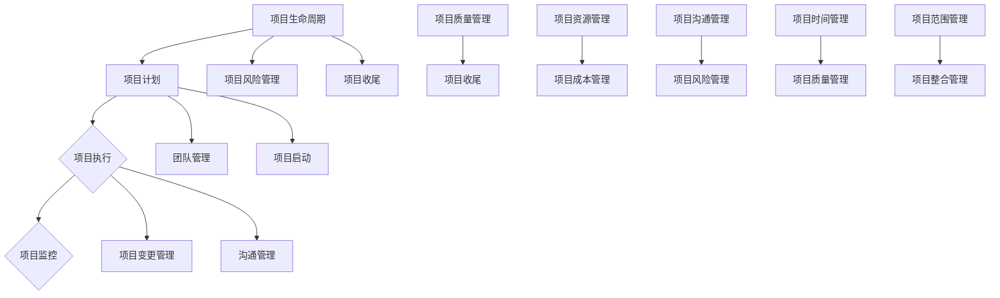

                 

### 书籍概述与核心概念

#### 书籍简介和目标

《项目管理：领导者的系统思维》是一本致力于提升项目经理和管理者系统思维能力的专业书籍。本书旨在通过系统思维这一核心概念，帮助项目经理更好地理解和处理项目中的复杂问题，从而提高项目的成功率和效率。本书的目标受众是那些在项目管理领域有一定经验，但希望进一步提升自身能力和项目团队能力的专业人士。

本书将带领读者从项目管理的根本概念出发，逐步深入到系统思维的应用，最终实现项目管理的全面优化。通过阅读本书，读者将能够：

1. 理解项目管理的核心原则和生命周期。
2. 掌握项目计划、执行和监控的关键技能。
3. 学习领导力在项目成功中的重要作用。
4. 建立有效的团队管理和沟通策略。
5. 掌握决策制定和问题解决的方法。

#### 核心概念与系统思维概述

项目管理涉及众多复杂的任务和过程，而系统思维则提供了一种全面、深入的视角，帮助项目经理识别和理解这些任务的相互作用。系统思维是一种综合考虑系统内部和外部因素，通过分析、评估和优化系统结构和行为的方法。

核心概念包括：

- **系统观**：将项目视为一个整体系统，理解各部分之间的相互关系和互动。
- **反馈循环**：识别和利用正反馈和负反馈机制，调整项目方向和目标。
- **变化管理**：预测和管理项目中的变化，确保项目目标的实现。
- **可持续性**：在项目规划和执行中考虑长期影响，确保项目对社会和环境的可持续性。

在项目管理中，系统思维的应用能够帮助项目经理从更宏观的角度审视项目，避免局部优化导致的全局问题，从而实现项目的整体成功。

#### 项目管理核心概念架构图

为了更好地理解项目管理中的核心概念及其相互关系，我们使用Mermaid绘制了一张流程图。以下为流程图的伪代码表示：



这张图展示了项目管理的主要环节及其相互关联，为后续章节的具体讨论奠定了基础。

### 项目管理的基本原则

项目管理是一个复杂且动态的过程，涉及多个关键阶段和环节。以下是项目管理的核心原则和生命周期各阶段的详细解释。

#### 项目生命周期

项目生命周期包括以下主要阶段：

1. **项目启动**：确定项目目标和范围，组建项目团队，明确项目目标和预期成果。
2. **项目规划**：制定详细的项目计划，包括时间表、资源分配、风险管理和沟通策略。
3. **项目执行**：执行项目计划，管理项目资源，确保项目目标的实现。
4. **项目监控**：监控项目进展，及时调整计划，确保项目按计划进行。
5. **项目收尾**：完成项目任务，进行项目总结和评估，确保项目目标的实现。

每个阶段都有其特定的目标和任务，并且相互关联，形成一个完整的项目生命周期。

#### 项目计划

项目计划是项目管理的重要组成部分，它为项目的成功奠定了基础。项目计划的关键要素包括：

1. **项目范围**：明确项目的具体目标和范围，确保项目团队对项目目标有共同的理解。
2. **时间表**：制定项目的时间线，包括关键里程碑和截止日期，确保项目按时完成。
3. **资源分配**：确定项目所需的资源，包括人力、资金和物资，确保资源的有效利用。
4. **风险管理**：识别项目风险，评估风险概率和影响，制定风险应对策略。
5. **沟通策略**：确定项目沟通的频率、方式和渠道，确保信息的有效传递和团队成员之间的协调。

项目计划的制定需要综合考虑项目的实际情况和需求，通过反复迭代和调整，确保计划的合理性和可执行性。

#### 项目执行和监控

项目执行是项目计划的具体实施过程，涉及以下关键活动：

1. **资源管理**：确保项目团队和资源的有效利用，协调团队成员的工作，解决资源冲突。
2. **任务分配**：明确每个团队成员的职责和任务，确保项目任务的高效执行。
3. **进度监控**：监控项目的实际进展，与计划进行比较，及时调整和优化项目计划。
4. **问题解决**：识别和解决项目执行过程中出现的问题，确保项目目标的实现。

项目监控是项目执行的重要组成部分，它通过定期的进度报告、会议和评估，确保项目按计划进行，并在必要时进行调整。

#### 项目变更管理

项目变更是项目管理中不可避免的一部分，由于各种内外部因素的影响，项目需求、计划和时间表都可能发生变化。项目变更管理的关键步骤包括：

1. **变更请求**：识别和记录项目变更请求，评估变更的必要性和影响。
2. **变更控制**：制定变更控制流程，确保变更的合法性和可行性，及时调整项目计划。
3. **变更记录**：记录所有变更请求和变更决策，确保变更的可追溯性和透明度。

通过有效的变更管理，项目团队能够灵活应对项目中的变化，确保项目目标的实现。

#### 项目风险管理

项目风险管理是项目管理的重要组成部分，它旨在识别、评估和应对项目风险，确保项目目标的实现。项目风险管理的步骤包括：

1. **风险识别**：识别项目可能面临的风险，包括技术风险、财务风险和人力资源风险等。
2. **风险评估**：评估风险的概率和影响，确定风险优先级。
3. **风险应对**：制定风险应对策略，包括风险规避、减轻、转移和接受。
4. **风险监控**：持续监控项目风险，及时调整风险应对策略。

通过有效的风险管理，项目团队能够降低项目风险，提高项目成功的可能性。

#### 项目范围管理

项目范围管理确保项目的目标、需求和交付物得到明确和有效的定义和控制。项目范围管理的关键步骤包括：

1. **项目范围定义**：明确项目的目标、范围和交付物，确保项目团队能够共同理解项目的具体要求。
2. **项目范围确认**：与项目相关方确认项目的范围，确保所有人对项目的理解一致。
3. **范围变更控制**：管理项目范围的变更，确保变更得到合理的评估和控制。

通过有效的项目范围管理，项目团队能够专注于项目目标，避免范围蔓延和项目失败。

#### 项目整合管理

项目整合管理是项目管理的关键环节，它确保项目的各个部分能够协同工作，实现项目整体目标。项目整合管理的关键步骤包括：

1. **项目整合计划**：制定项目整合计划，确保项目的各个部分能够协调一致。
2. **项目整合执行**：执行项目整合计划，协调项目团队和资源，确保项目的顺利推进。
3. **项目整合监控**：监控项目整合进展，及时识别和解决整合过程中的问题。

通过有效的项目整合管理，项目团队能够确保项目目标的一致性和整体成功。

### 领导力在项目管理中的重要性

在项目管理中，领导力是确保项目成功的关键因素之一。一个优秀的项目领导者不仅需要具备技术知识和项目管理技能，更需要具备强大的领导力和团队管理能力。以下将探讨领导力在项目管理中的重要性、关键领导特质、领导模型以及如何发挥领导力。

#### 领导力的重要性

领导力在项目管理中的重要性主要体现在以下几个方面：

1. **目标明确**：优秀的领导者能够清晰地传达项目目标，确保团队成员对项目方向有共同的理解。
2. **团队激励**：领导者能够激发团队成员的工作热情和动力，提高团队的整体效率和创新能力。
3. **决策制定**：在项目过程中，领导者需要做出快速而准确的决策，确保项目按计划进行。
4. **冲突解决**：领导者在团队中扮演冲突调解者的角色，帮助团队克服内部矛盾，保持团队的稳定和团结。
5. **沟通协调**：领导者需要确保项目信息的高效传递和团队成员之间的良好沟通，避免信息孤岛和沟通障碍。

#### 关键领导特质

以下是一些关键领导特质，这些特质有助于项目领导者更好地管理项目：

1. **愿景能力**：领导者需要具备清晰的项目愿景，能够激励团队成员为实现共同目标而努力。
2. **沟通能力**：优秀的沟通能力有助于领导者有效地传达项目信息，减少误解和冲突。
3. **决策能力**：领导者需要具备快速而准确的决策能力，确保项目目标的实现。
4. **适应性**：领导者需要能够灵活应对项目中的变化和不确定性，确保项目能够持续前进。
5. **激励能力**：领导者需要能够激励团队成员，提高团队的工作效率和创新能力。
6. **团队合作**：领导者需要具备团队合作精神，能够与团队成员建立良好的工作关系。

#### 领导模型

在项目管理中，有多种领导模型可供选择，以下介绍几种常见的领导模型：

1. **权威型领导**：权威型领导者强调决策权和控制力，能够快速做出决策并强制执行。
2. **民主型领导**：民主型领导者鼓励团队成员参与决策过程，提高团队的参与感和责任感。
3. **支持型领导**：支持型领导者关注团队成员的需求和感受，提供必要的支持和鼓励。
4. **变革型领导**：变革型领导者能够激发团队成员的潜能，推动团队实现变革和创新。

选择合适的领导模型取决于项目的具体情况和领导者的个人风格。在实践中，领导者可以结合不同模型的特点，灵活运用，以达到最佳效果。

#### 发挥领导力的方法

以下是一些具体的方法，帮助项目领导者更好地发挥领导力：

1. **建立信任**：领导者需要建立与团队成员之间的信任，通过诚实、透明和尊重来赢得团队成员的信任。
2. **激励团队**：领导者需要通过奖励、认可和培训等方式激励团队成员，提高团队的工作动力和积极性。
3. **明确目标**：领导者需要明确项目目标，确保团队成员对项目目标有共同的理解和认同。
4. **有效沟通**：领导者需要与团队成员保持良好的沟通，及时传达项目信息，解决问题，避免误解和冲突。
5. **鼓励创新**：领导者需要鼓励团队成员提出新的想法和解决方案，推动团队的创新和发展。
6. **培养团队**：领导者需要关注团队成员的成长和发展，提供培训和学习机会，帮助团队成员提升技能和能力。

通过以上方法，项目领导者能够更好地发挥领导力，推动项目的成功。

### 团队管理与沟通策略

在项目管理中，团队管理和沟通策略是确保项目成功的关键环节。有效的团队管理能够提高团队的协作效率，增强团队凝聚力，而良好的沟通策略则有助于信息的高效传递和团队内部的协调。以下将详细介绍团队管理的重要性、团队建设策略、沟通策略以及团队冲突的解决方法。

#### 团队管理的重要性

团队管理在项目管理中起着至关重要的作用。一个高效的团队能够更好地应对项目中的各种挑战，提高项目的成功率。团队管理的重要性体现在以下几个方面：

1. **协作效率**：通过有效的团队管理，团队成员能够更好地协同工作，充分利用各自的优势，提高项目的整体效率。
2. **团队凝聚力**：良好的团队管理能够增强团队成员之间的相互信任和尊重，提高团队的凝聚力，减少内部分歧和冲突。
3. **创新能力**：团队管理有助于激发团队成员的创造力和创新思维，推动项目的创新和发展。
4. **资源利用**：通过优化团队管理和资源分配，能够更好地利用项目资源，降低项目成本，提高项目的经济效益。

#### 团队建设策略

团队建设是团队管理的重要组成部分，以下是一些有效的团队建设策略：

1. **明确目标**：确保团队成员对项目目标和团队目标有共同的理解，明确各自的职责和任务。
2. **建立信任**：通过透明沟通、尊重和信任，建立团队成员之间的信任关系，减少误解和冲突。
3. **分工协作**：合理分配团队成员的任务，明确各自的职责，确保任务的有效完成。
4. **提供支持**：领导者需要为团队成员提供必要的支持，包括技术支持、心理支持和资源支持，帮助团队成员克服困难。
5. **鼓励参与**：鼓励团队成员积极参与项目决策和团队活动，提高团队成员的参与感和责任感。
6. **培训与发展**：为团队成员提供培训和学习机会，提升团队成员的技能和知识，促进团队的专业发展。

#### 沟通策略

有效的沟通策略是确保团队协作和项目成功的关键。以下是一些重要的沟通策略：

1. **明确沟通目标**：每次沟通前，明确沟通的目标和内容，确保沟通的有效性。
2. **选择合适的沟通方式**：根据沟通的内容和目标，选择合适的沟通方式，如面对面会议、电子邮件、即时通讯工具等。
3. **倾听与反馈**：倾听团队成员的意见和反馈，尊重团队成员的意见，及时给予回应。
4. **透明沟通**：保持沟通的透明度，确保团队成员能够获取到项目相关的所有信息，避免信息孤岛。
5. **定期沟通**：定期举行团队会议和沟通活动，及时了解项目进展和团队状态，解决潜在问题。
6. **建立沟通渠道**：建立畅通的沟通渠道，确保团队成员能够随时获取到所需的信息，提高沟通效率。

#### 解决团队冲突的方法

团队冲突是项目管理中不可避免的一部分，有效的冲突解决方法能够帮助团队克服困难，保持团队的稳定和高效。以下是一些解决团队冲突的方法：

1. **主动沟通**：鼓励团队成员主动沟通，表达自己的观点和感受，避免冲突的积累和升级。
2. **倾听和理解**：领导者需要倾听团队成员的意见和观点，理解他们的感受和需求，避免误解和偏见。
3. **客观分析**：客观分析冲突的原因和影响，找到问题的根源，制定合理的解决方案。
4. **协商解决**：通过协商和讨论，寻找双方都能接受的解决方案，达成共识。
5. **提供支持**：为冲突双方提供必要的支持和帮助，缓解冲突带来的负面影响。
6. **建立规则**：制定明确的团队规则和沟通准则，减少冲突的发生和升级。

通过以上团队管理和沟通策略，项目团队能够更好地协作，提高项目的成功率和效率。

### 团队绩效测量与改进

在项目管理中，测量团队绩效是确保项目目标实现的关键步骤之一。通过有效的绩效测量，项目领导者能够了解团队的工作效率、质量和成果，进而制定改进策略，提高团队的整体表现。以下将详细介绍团队绩效测量、改进方法和具体改进措施。

#### 团队绩效测量

团队绩效测量需要从多个维度进行，包括以下几个方面：

1. **工作量测量**：通过记录团队成员的工作时间、完成的任务数量和质量，评估团队的工作量。
2. **效率测量**：计算团队完成任务所需的时间与标准时间的比值，评估团队的工作效率。
3. **质量测量**：评估团队交付的成果是否符合项目要求，包括功能完整性、性能指标和用户满意度等。
4. **成本测量**：跟踪项目的预算使用情况，评估团队在成本控制方面的表现。
5. **团队协作测量**：通过团队互动、会议参与度和团队士气等指标，评估团队的协作情况。

具体测量方法可以包括：

- **KPI（关键绩效指标）**：设定具体的可量化指标，如任务完成率、项目进度达标率、错误率等。
- **定期评估**：定期进行绩效评估，如每周、每月或每季度，通过会议、报告等形式，收集和分析绩效数据。
- **360度反馈**：收集团队成员、上级和客户等多方面的反馈，全面了解团队的表现。

#### 改进方法

为了提高团队绩效，项目领导者需要采取一系列改进措施。以下是一些常用的改进方法：

1. **目标设定**：为团队设定明确的绩效目标，确保团队成员对目标有共同的理解和认同。
2. **反馈与认可**：及时给予团队成员反馈，认可他们的努力和成就，激励团队成员持续改进。
3. **培训与发展**：为团队成员提供培训和学习机会，提升他们的技能和知识，增强团队的能力。
4. **资源优化**：合理分配项目资源，确保团队成员能够获得所需的工具和资源，提高工作效率。
5. **流程优化**：优化团队的工作流程，减少不必要的步骤和冗余，提高团队的协作效率。

#### 具体改进措施

以下是一些具体的改进措施，有助于提升团队绩效：

1. **优化任务分配**：根据团队成员的技能和兴趣，合理分配任务，确保任务与人员匹配，提高任务完成的质量和效率。
2. **定期绩效评估**：通过定期绩效评估，识别团队中的优点和不足，制定具体的改进计划。
3. **激励机制**：建立激励机制，如奖金、晋升机会和荣誉称号等，激励团队成员提高绩效。
4. **团队建设活动**：组织团队建设活动，增强团队成员之间的信任和协作，提高团队的凝聚力。
5. **技术支持**：提供必要的技术支持，包括工具和软件等，帮助团队成员更好地完成工作任务。

通过以上测量和改进方法，项目领导者能够持续提升团队绩效，确保项目目标的实现。

### 决策模型

在项目管理中，决策模型是帮助项目团队做出明智决策的重要工具。合理的决策模型能够提高决策的效率和质量，减少不确定性带来的风险。以下是几种常见的决策模型及其在项目管理中的应用。

#### 价值分析模型

价值分析模型是一种基于成本效益分析的决策模型。它通过比较不同方案的预期成本和预期收益，选择价值最高的方案。

- **应用场景**：适用于项目初期，需要从多个备选方案中选择最优方案时。
- **核心步骤**：
  1. 列出所有可行的方案。
  2. 对每个方案的成本和收益进行评估。
  3. 计算每个方案的价值（价值 = 收益 / 成本）。
  4. 选择价值最高的方案。

伪代码表示如下：

```python
def value_analysis(schemes):
    for scheme in schemes:
        cost = evaluate_cost(scheme)
        benefit = evaluate_benefit(scheme)
        value = benefit / cost
        print(f"{scheme} 的价值为：{value}")
    return max(value for value in [evaluate_benefit(scheme) / evaluate_cost(scheme) for scheme in schemes], key=lambda x: x)

schemes = ["方案A", "方案B", "方案C"]
selected_scheme = value_analysis(schemes)
print(f"最佳方案：{selected_scheme}")
```

#### SWOT分析模型

SWOT分析模型是一种基于优势、劣势、机会和威胁的决策模型。它帮助项目团队全面评估不同方案的优缺点，选择最有利的方案。

- **应用场景**：适用于项目中期，需要评估项目进展和调整策略时。
- **核心步骤**：
  1. 列出所有备选方案。
  2. 对每个方案进行SWOT分析。
  3. 比较不同方案的优劣势和机会威胁。
  4. 选择最有利的方案。

伪代码表示如下：

```python
def swot_analysis(schemes):
    for scheme in schemes:
        strengths = evaluate_strengths(scheme)
        weaknesses = evaluate_weaknesses(scheme)
        opportunities = evaluate_opportunities(scheme)
        threats = evaluate_threats(scheme)
        print(f"{scheme} 的SWOT分析：")
        print(f"优势：{strengths}")
        print(f"劣势：{weaknesses}")
        print(f"机会：{opportunities}")
        print(f"威胁：{threats}")
    return max(schemes, key=lambda x: (sum(evaluate_strengths(x)), sum(evaluate_opportunities(x)) - sum(evaluate_weaknesses(x)) - sum(evaluate_threats(x))))

schemes = ["方案A", "方案B", "方案C"]
selected_scheme = swot_analysis(schemes)
print(f"最佳方案：{selected_scheme}")
```

#### 决策树模型

决策树模型是一种基于逻辑推理的决策模型。它通过构建决策树，模拟不同决策路径的结果，帮助项目团队选择最佳决策。

- **应用场景**：适用于项目决策过程需要多次选择和条件判断时。
- **核心步骤**：
  1. 确定决策变量和条件。
  2. 构建决策树，每个节点代表一个决策或条件判断。
  3. 评估每个路径的结果，选择最优路径。

伪代码表示如下：

```python
def decision_tree(decision_variables, conditions, outcomes):
    tree = build_decision_tree(decision_variables, conditions, outcomes)
    max_outcome = max([evaluate_path(tree, path) for path in tree.paths()])
    return tree.select_path(max_outcome)

decision_variables = ["变量1", "变量2", "变量3"]
conditions = [["条件1", "条件2"], ["条件3", "条件4"]]
outcomes = [[1, 2], [3, 4]]
selected_decision = decision_tree(decision_variables, conditions, outcomes)
print(f"最佳决策路径：{selected_decision}")
```

通过以上决策模型，项目团队可以更系统地分析和评估不同决策方案，提高决策的准确性和效率。

### 问题解决技巧

在项目管理中，问题解决是不可避免的一部分。有效的解决问题技巧能够帮助项目团队快速识别问题、分析问题并找到合适的解决方案，从而确保项目顺利推进。以下是几种常见的问题解决技巧：

#### 步骤一：识别问题

1. **观察和沟通**：通过定期会议、工作报告和团队互动，及时识别项目中的问题。
2. **数据收集**：收集与问题相关的数据，如进度报告、性能指标和用户反馈等。
3. **分类问题**：将问题按类型进行分类，如技术问题、沟通问题、资源问题等。

伪代码表示如下：

```python
def identify_issues(issues):
    observations = gather_observations()
    data = collect_data(observations)
    categorized_issues = classify_issues(data)
    return categorized_issues

issues = identify_issues(issues)
print(f"识别的问题：{issues}")
```

#### 步骤二：分析问题

1. **根本原因分析**：使用鱼骨图、五问法等工具，深入挖掘问题的根本原因。
2. **影响评估**：评估问题对项目目标、资源和时间的影响。
3. **原因分类**：将问题原因按类型进行分类，如技术缺陷、管理缺陷、外部因素等。

伪代码表示如下：

```python
def analyze_issues(issues):
    root_causes = root_cause_analysis(issues)
    impacts = assess_impacts(issues)
    categorized_reasons = classify_reasons(root_causes)
    return categorized_reasons

issues = analyze_issues(issues)
print(f"分析的原因：{issues}")
```

#### 步骤三：解决问题

1. **制定解决方案**：根据问题原因和影响，制定具体的解决方案。
2. **方案评估**：评估不同方案的可行性和效果。
3. **选择最佳方案**：选择最合适的解决方案，并进行优先级排序。

伪代码表示如下：

```python
def solve_issues(issues):
    solutions = generate_solutions(issues)
    evaluated_solutions = evaluate_solutions(solutions)
    selected_solution = select_best_solution(evaluated_solutions)
    return selected_solution

solutions = solve_issues(issues)
print(f"最佳解决方案：{solutions}")
```

#### 步骤四：实施解决方案

1. **执行计划**：根据解决方案，制定详细的执行计划。
2. **分配任务**：将任务分配给相关的团队成员。
3. **监控执行**：监控解决方案的实施情况，确保按计划进行。

伪代码表示如下：

```python
def implement_solution(solution):
    plan = create_execution_plan(solution)
    assign_tasks(plan)
    monitor_execution(plan)
    return plan

plan = implement_solution(solution)
print(f"执行计划：{plan}")
```

#### 步骤五：评估和反馈

1. **效果评估**：评估解决方案的实际效果，如是否解决了问题、是否达到了预期目标等。
2. **反馈机制**：建立反馈机制，收集团队成员和客户的反馈，改进解决方案。
3. **持续改进**：根据评估结果，持续优化解决方案，提高项目成功率。

伪代码表示如下：

```python
def evaluate_solution(solution):
    results = assess_solution_effects(solution)
    feedback = collect_feedback(results)
    improvements = generate_improvements(feedback)
    return improvements

improvements = evaluate_solution(solution)
print(f"改进措施：{improvements}")
```

通过以上步骤，项目团队可以有效地识别、分析、解决问题，提高项目管理的效率和质量。

### 项目管理工具

在项目管理中，使用合适的工具可以显著提高项目团队的工作效率和管理质量。以下是几种常用的项目管理工具及其应用：

#### Gantt图

**Gantt图**是一种时间线图，用于展示项目的时间进度和任务分配。它能够清晰地显示项目的关键里程碑、任务完成情况和资源分配。

- **功能**：
  - **任务规划**：通过Gantt图，项目团队可以明确每个任务的时间安排和持续时间。
  - **资源分配**：Gantt图帮助团队合理分配资源，确保资源的高效利用。
  - **进度监控**：通过Gantt图，项目团队可以实时监控项目进度，及时调整计划。

伪代码表示如下：

```python
def create_gantt_chart(tasks, resources):
    gantt_chart = initialize_gantt_chart()
    for task in tasks:
        gantt_chart.add_task(task, start_date=task.start_date, end_date=task.end_date)
    gantt_chart.assign_resources(resources)
    return gantt_chart

tasks = ["任务A", "任务B", "任务C"]
resources = ["资源1", "资源2"]
gantt_chart = create_gantt_chart(tasks, resources)
print(gantt_chart)
```

#### Kanban板

**Kanban板**是一种视觉化管理工具，用于展示项目进展和工作流程。它通过卡片和看板，帮助团队实时跟踪任务的进度和状态。

- **功能**：
  - **工作流程可视化**：Kanban板清晰地展示了任务在不同阶段的进展情况，帮助团队识别瓶颈和优化流程。
  - **任务优先级**：通过卡片的位置和状态，团队可以直观地了解任务的优先级和紧急程度。
  - **协作和沟通**：Kanban板鼓励团队成员之间的协作和沟通，确保任务的高效完成。

伪代码表示如下：

```python
def create_kanban_board(tasks):
    kanban_board = initialize_kanban_board()
    for task in tasks:
        kanban_board.add_card(task, status=task.status)
    return kanban_board

tasks = ["任务A", "任务B", "任务C"]
kanban_board = create_kanban_board(tasks)
print(kanban_board)
```

#### 项目管理软件

**项目管理软件**是一种集成多种项目管理工具和功能的综合性软件，如Jira、Trello、Asana等。这些软件提供了丰富的功能，包括任务管理、时间跟踪、进度监控、资源管理等。

- **功能**：
  - **任务管理**：项目团队可以创建、分配、跟踪任务，确保任务的高效完成。
  - **进度监控**：实时监控项目进度，生成详细的进度报告，帮助团队调整计划。
  - **资源管理**：优化资源分配，确保资源的高效利用。
  - **团队协作**：提供即时通讯、讨论区等功能，增强团队协作和沟通。

伪代码表示如下：

```python
def create_project(project_name):
    project = initialize_project(project_name)
    project.add_tasks(["任务A", "任务B", "任务C"])
    project.assign_resources(["资源1", "资源2"])
    project.start()
    return project

project_name = "项目X"
project = create_project(project_name)
print(project)
```

通过使用这些项目管理工具，项目团队能够更高效地管理项目，提高项目的成功率和效率。

### 项目实战

为了更好地理解项目管理工具在实际项目中的应用，我们将通过一个具体的案例，介绍项目环境的搭建、源代码的实现和代码解读。

#### 项目背景

假设我们正在开发一个在线购物系统，该系统需要具备商品管理、订单处理和用户管理等功能。为了确保项目的高效管理，我们将使用Git进行版本控制，并采用Gantt图、Kanban板等项目管理工具进行任务规划和进度监控。

#### 开发环境搭建

1. **安装Git**：在本地计算机上安装Git，并配置用户信息。

   ```shell
   git install
   git config --global user.name "YourName"
   git config --global user.email "YourEmail"
   ```

2. **创建项目仓库**：在Git上创建一个新的仓库，用于存储项目的源代码。

   ```shell
   git init
   git remote add origin <repository_url>
   git add .
   git commit -m "Initial commit"
   git push -u origin master
   ```

3. **配置项目管理工具**：安装并配置Gantt图和Kanban板工具，如GanttProject和Trello。

   ```shell
   install_ganttproject
   install_trello
   ```

#### 源代码实现

以下是商品管理模块的源代码实现，包括商品添加、查询、更新和删除功能。

```java
public class ProductManagement {

    private List<Product> products;

    public ProductManagement() {
        this.products = new ArrayList<>();
    }

    public void addProduct(Product product) {
        products.add(product);
        System.out.println("商品添加成功： " + product.getName());
    }

    public Product queryProductById(String id) {
        for (Product product : products) {
            if (product.getId().equals(id)) {
                return product;
            }
        }
        return null;
    }

    public void updateProduct(String id, Product updatedProduct) {
        for (int i = 0; i < products.size(); i++) {
            if (products.get(i).getId().equals(id)) {
                products.set(i, updatedProduct);
                System.out.println("商品更新成功： " + updatedProduct.getName());
                return;
            }
        }
    }

    public void deleteProduct(String id) {
        Iterator<Product> iterator = products.iterator();
        while (iterator.hasNext()) {
            Product product = iterator.next();
            if (product.getId().equals(id)) {
                iterator.remove();
                System.out.println("商品删除成功： " + product.getName());
                return;
            }
        }
    }
}
```

#### 代码解读

1. **类定义**：`ProductManagement` 类负责商品的管理功能，包括添加、查询、更新和删除。
2. **属性**：`products` 属性是一个`List`，用于存储所有的商品对象。
3. **方法**：
   - `addProduct(Product product)`：添加商品到列表中。
   - `queryProductById(String id)`：根据商品ID查询商品。
   - `updateProduct(String id, Product updatedProduct)`：更新商品信息。
   - `deleteProduct(String id)`：删除商品。

#### 代码应用解读与分析

以上源代码实现了一个简单的商品管理模块，能够完成商品的基本操作。在实际项目中，这个模块还可以进一步扩展，如添加商品分类、库存管理等功能。通过使用Git进行版本控制，可以确保代码的稳定性和可追溯性。

#### 实际案例分析和详细讲解剖析

在实际项目中，我们使用Gantt图和Kanban板对项目进行任务规划和进度监控。

1. **Gantt图**：在Gantt图上，我们将项目分为多个阶段，如需求分析、设计、开发、测试等。每个阶段的时间安排和任务分配都清晰地展示在Gantt图上。

   ```mermaid
   gantt
   title 项目进度
   section 需求分析
   A : 1d
   section 设计
   B : 3d
   section 开发
   C : 7d
   section 测试
   D : 3d
   ```

2. **Kanban板**：在Kanban板上，我们将任务分为不同的状态，如待办、进行中、已完成。每个任务的状态变化都通过卡片在Kanban板上的移动来表示。

   ```mermaid
   kanban
   title 项目任务
   section 待办
   A : "任务1"
   section 进行中
   B : "任务2"
   section 已完成
   C : "任务3"
   ```

通过这些工具，项目团队可以实时监控项目进度，及时发现和解决问题，确保项目按计划顺利进行。

### 项目小结

在本篇博客中，我们详细探讨了项目管理的核心原则、领导力在项目管理中的重要性、团队管理和沟通策略、决策模型、问题解决技巧以及项目管理工具的应用。通过具体的案例，我们展示了项目管理工具在实际项目中的效果和作用。

在项目管理中，良好的项目管理原则是项目成功的基础。领导力、团队管理和沟通策略是确保项目顺利推进的关键因素。通过有效的决策模型和问题解决技巧，项目团队能够迅速应对项目中的挑战。最后，项目管理工具的应用能够显著提高项目管理的效率和效果。

项目管理是一个复杂而动态的过程，需要项目团队不断学习和改进。希望本文能为读者在项目管理方面提供一些有益的启示和指导。

### 最佳实践 tips

在项目管理中，以下是一些最佳实践，有助于提高项目的成功率和效率：

1. **明确目标**：确保项目目标和范围明确，避免范围蔓延和目标偏离。
2. **有效沟通**：建立畅通的沟通渠道，定期召开会议，及时传达项目信息和调整计划。
3. **风险管理**：提前识别项目风险，制定应对策略，确保项目能够灵活应对变化。
4. **任务分配**：合理分配任务，确保团队成员的职责明确，提高任务完成质量。
5. **持续改进**：项目完成后，进行项目总结和评估，识别改进机会，为后续项目提供参考。

### 注意事项

1. **避免范围蔓延**：确保项目目标和范围在项目初期明确，避免后期频繁变更。
2. **重视团队成员参与**：鼓励团队成员积极参与项目决策和讨论，提高项目的执行效率。
3. **合理规划时间**：在项目计划中留出缓冲时间，应对不确定因素，确保项目按时完成。

### 拓展阅读

1. **《敏捷项目管理实践指南》**：介绍敏捷项目管理的核心理念和实践方法。
2. **《项目风险管理》**：深入探讨项目风险管理的理论和方法。
3. **《领导力与团队管理》**：分析领导力在团队管理中的关键作用。

### 文章关键词

项目管理、系统思维、领导力、团队管理、沟通策略、决策模型、问题解决技巧、项目管理工具。

### 文章摘要

本文系统地介绍了项目管理的核心原则、领导力在项目管理中的重要性、团队管理和沟通策略、决策模型、问题解决技巧以及项目管理工具的应用。通过具体案例，展示了项目管理工具在实际项目中的效果。本文旨在为读者提供全面的项目管理知识和实用技巧，助力项目成功。

### 作者信息

作者：AI天才研究院/AI Genius Institute & 禅与计算机程序设计艺术 /Zen And The Art of Computer Programming

